# Getting Started with DHIS2 {#getting_started_quick_guide}

If you have explored the website read all [about DHIS2](https://dhis2.org/about-2/) and all the ways it can be utilised in the fields of [Health](https://dhis2.org/health/), [Climate and Health](https://dhis2.org/climate/), [Education](https://dhis2.org/education/) and [Logistics](https://dhis2.org/logistics/) and you have had a play in the demo environments on the [DHIS2 Playground](https://im.dhis2.org/public/instances). Now you would like to get started with your very own DHIS2 but not sure how to get a Tomcat to fit into a Docker, here is a basic overview of how to get started from scratch. 

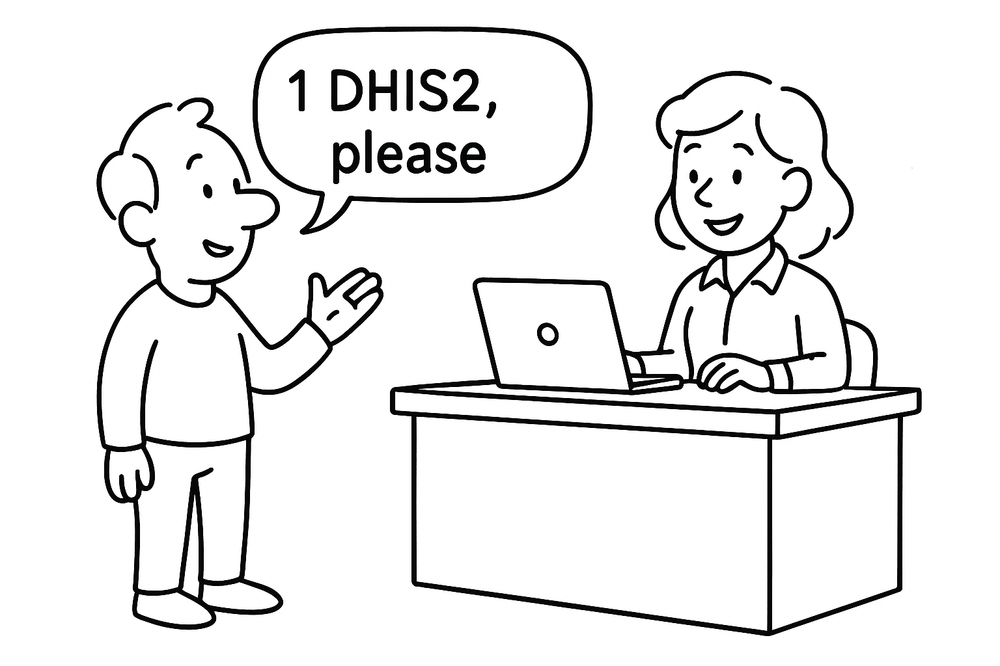{.center width=30%}

If you are already a DHIS2 user and you have some specific questions, have a look at our [extensive training material](https://dhis2.org/academy/training-material/), [detailed documentation](#home-dhis2-documentation), or browse the [Community of Practice](https://community.dhis2.org/). If you are a developer then you’ll find this guide a bit basic, instead, have a look at the [developer documentation](https://developers.dhis2.org/) for more technical detail.

If you don’t find answers there then you can [contact us](https://dhis2.org/contact/) or [request a demo](https://docs.google.com/forms/d/e/1FAIpQLSccfyJ8KzKp-lNv7_NUiW851Oxvr3UOtrVn6DZpIIJvit_lDg/viewform?usp=sf_link)

* **Section 1:** How to get the DHIS2 software up and running and get you logged in for the first time.  
    
* **Section 2**: How to configure the system to start collecting some data. 

## Section 1: Setting up DHIS2 \- a quick local install for learning and testing

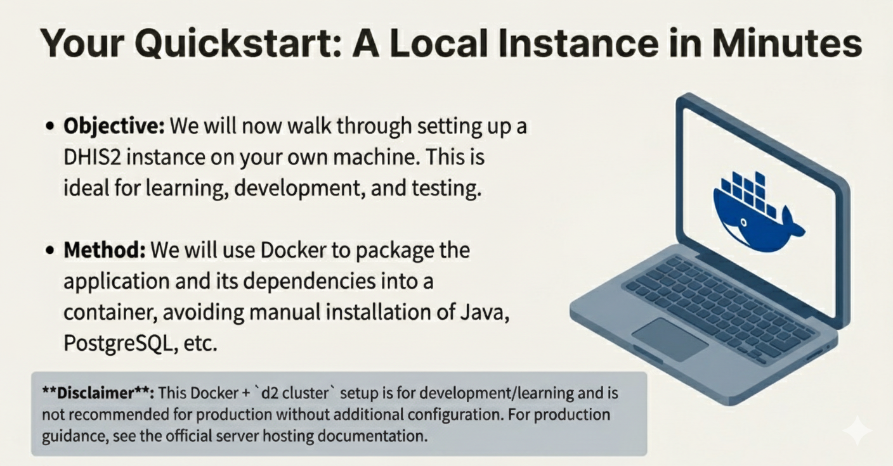{.center width=60%}

A lot of products you interact with are what is known as Software as a Service (SaaS), such as Facebook, Gmail, Salesforce or Office 365\. In these cases you usually create an account and then access the software through your browser, apps or on your phone. However DHIS2 uses a Server architecture which requires a central computer or cluster of computers to run DHIS2 along with other supporting applications. Users of DHIS2 can then access the server from their computers or other devices like phones or tablets, called clients, through a local network or the internet

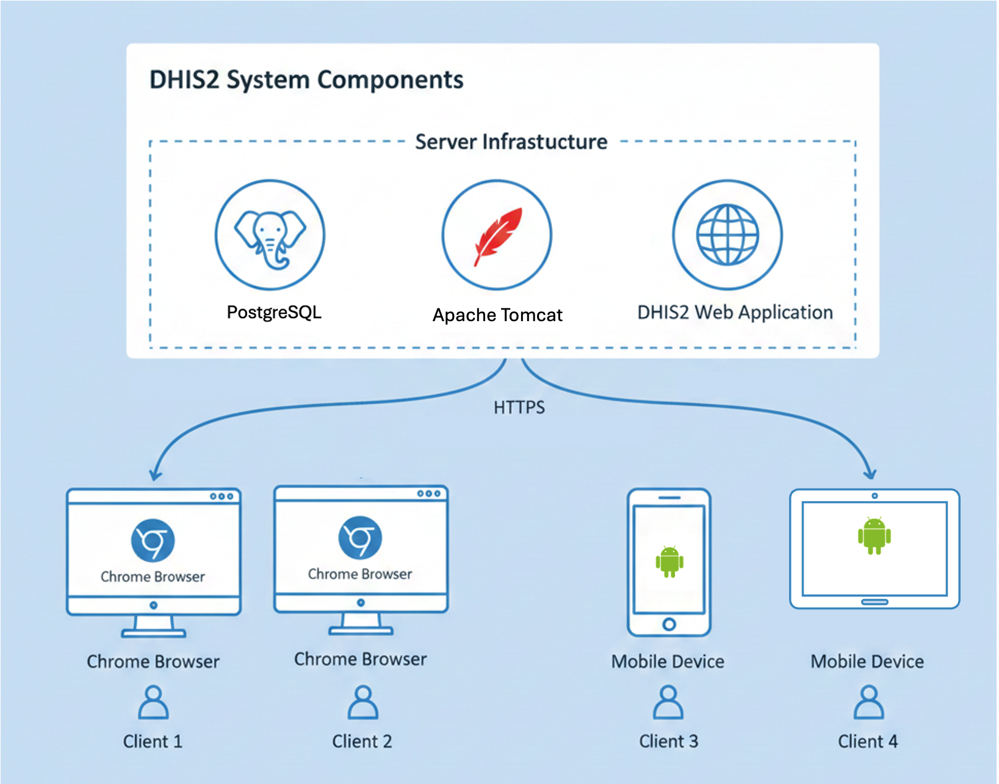{.center width=60%}

It can be a lot of work to set up and host a DHIS2 server that will be used at a large scale, there are many things to consider and it will require specialised technology skills, [find out more about Server hosting](#implementation_server_hosting).

There are organisations that can help with the hosting and even offer DHIS2 as a SaaS product, you can find their details and more information about [hosted DHIS2 services](https://dhis2.org/hosting/).

These next steps will take you through how to set up a DHIS2 instance from scratch, useful for understanding how it works, as a test environment or for small scale or personal use. If you plan to run DHIS2 at scale in production, see the production hosting guidance.

### Installing DHIS2

The following steps will guide you through how to use Docker to get DHIS2 up and running quickly.

#### What is Docker? {#getting_started_whats_docker}

Docker is a tool that packages an application and everything it needs (code, runtime, libraries, configuration) into a portable unit called a container. For DHIS2, Docker means you can start a ready-to-run DHIS2 server (and the database it needs) without manually installing Java, PostgreSQL, or other dependencies on your machine

There is a full DHIS2 Docker Guide available [https://developers.dhis2.org/docs/tutorials/dhis2-docker/](https://developers.dhis2.org/docs/tutorials/dhis2-docker/) below is the very high level steps. Check the links for OS‑specific caveats, Docker Desktop behavior differs on Linux vs macOS/Windows.

1. Install Prerequisites  
     
   1. Download and Install Docker Desktop (Windows/macOS) or Docker Engine (Linux) — recent stable release from [Docker's official website](https://www.docker.com/products/docker-desktop).  
   2. Download and Install [Node.js](https://nodejs.org/en) (LTS recommended) — e.g., 18.x or newer  
      Node.js is a JavaScript runtime that lets you run JavaScript on your computer (outside a browser). It includes the V8 JavaScript engine and basic utilities for file access, networking, etc.  
   3. Install Yarn (classic) [https://classic.yarnpkg.com/en/](https://classic.yarnpkg.com/en/)  
      Yarn is a package manager for JavaScript projects (an alternative to npm). It installs project dependencies (libraries) listed in package.json and provides commands to run scripts defined by the project.  
   4. Install the [DHIS2 CLI](https://developers.dhis2.org/docs/cli/) (d2) using Yarn  
      The d2 CLI is a developer command‑line tool made for working with DHIS2 front‑end apps and projects. It helps you scaffold new DHIS2 apps, run development servers, build production bundles, validate DHIS2 app manifests, and run common project tasks so you don’t have to set up everything manually.

      

2. When all the prerequisites are installed from the command line or terminal.  
     
   Run  `d2 cluster up 2.42`  Where 2.42 is the version number of DHIS2 that you would like to install. This simple command does a lot of heavy lifting to set up docker containers and install the DHIS2 software.  
    You can optionally include `--db-version 2.42` Which will also populate the database with Sierra Leone sample data like what is available in the demo environments. This can be useful if you want to test out functionality without having to populate enough data to make it work.

   Check the versions available to install via docker at the links below. It is recommended to stick to the stable versions unless you have a clear reason to use a development version.

   1. Stable versions [https://hub.docker.com/r/dhis2/core](https://hub.docker.com/r/dhis2/core)   
   2. Development versions [https://hub.docker.com/r/dhis2/core-dev](https://hub.docker.com/r/dhis2/core-dev)   
        
3. Once the command is complete you should have the right containers running in docker and it should look something like this in docker.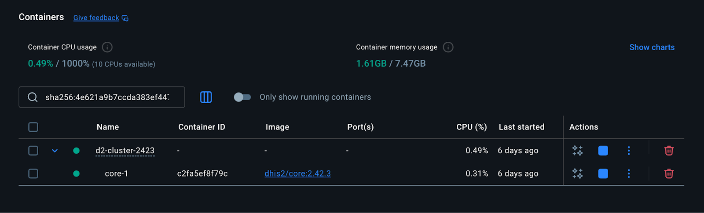

4. You can then use a browser to navigate to [http://localhost:8080/](http://localhost:8080/)   
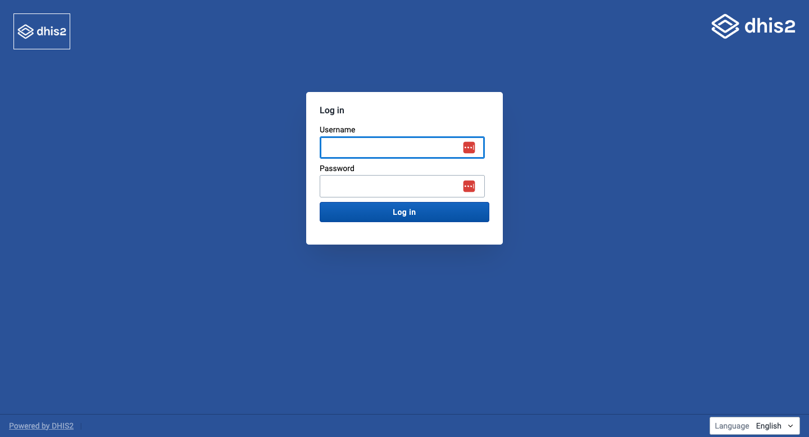{.center width=60%}

> **Note**
>
> The default login information is   
> Username: admin  
> Password: district  

Now you can log in and access your very own DHIS2 instance\!\!  
If you haven’t loaded a demo database then it will look a bit blank in there, in Section 2 we will go through how to configure the system to start collecting and analysing data. 

> **Warning**
>
> We want to be clear that this Docker \+ d2 cluster is for development/learning, not recommended for production without additional configuration.

## Section 2:  Collecting data {#getting_started_collect}

There are three types of data that you can collect in DHIS2, these are often referred to internally as data domains, each domain requires a different approach to metadata configuration and apps used for data collection and analysis. 

Aggregate Data

* This domain covers summarized data, such as counts or totals collected over a period (e.g., number of malaria cases reported in a month). Aggregate data is typically used for routine reporting and is not linked to individual persons or events.

  Event Data

  * Event data refers to information collected about specific occurrences or activities, often without tracking the same individual over time. Each event is a single record, such as a disease outbreak investigation or a vaccination session.

Tracker Data

* Tracker data is used for longitudinal tracking of individual objects, i.e. a person (Tracked Entity Instances, or TEIs) across multiple events or program stages. This domain is essential for programs that require following up with individuals over time, such as antenatal care or HIV treatment.

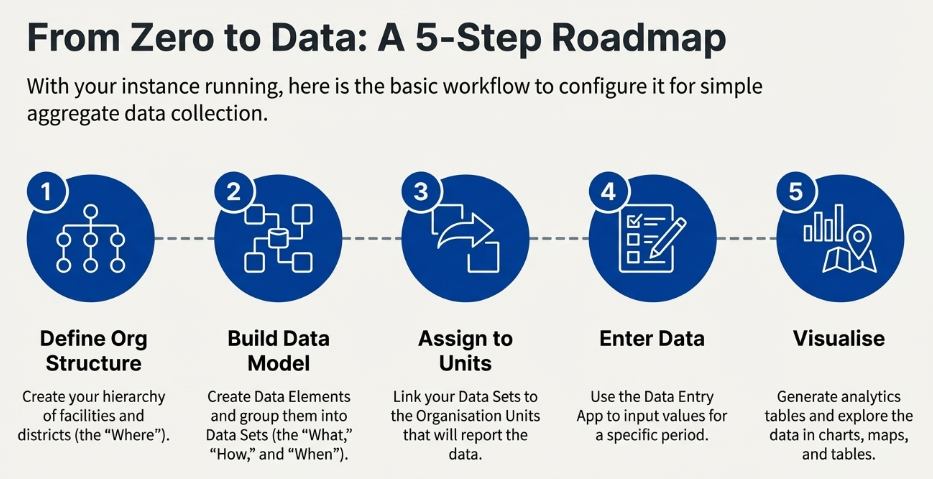{.center width=60%}

We will use a very simple aggregate data example that consists of the following steps. 

1. Set up basic organizational structure (org units).  
2. Create a data model for aggregate data capture which involves creating the following metadata objects   
   1. Data Set  
   2. Data Element  
   3. Category Options  
   4. Categories  
   5. Category Combinations

      

3. Assign the Data Set to org units   
4. Enter data through the data entry application  
5. Explore the data via the data visualiser  
   

### Configuring DHIS2 {#getting_started_configure}

Users interact with DHIS2 through a number of Applications mostly referred to as Apps. These Apps each handle a different range of functions across configuration, system administration, collecting data and analysing data. The different apps are accessed through the app menu by clicking the 9 blocks in the top right hand corner and selecting an app directly from the 8 first apps, or browsing or searching for the desired app.

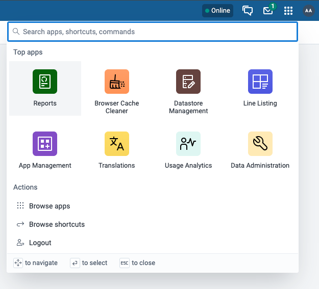

There are around 28 **Core Apps** and are managed by the central development team, there are also a range of **Custom Apps** that have been developed by a range of other partners that are available to download through the **App Hub.**  [Read more about installing and managing apps](#apps_installing_apps). 

In this simple example we are going to use the following four apps

* The **[Maintenance app](#about_maintenance_app)** which is where you create and manage Metadata that defines all the data you want to collect and analyse in your system.

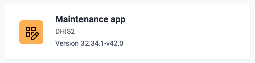{.center width=30%}

* The [**Data Entry App**](#data-entry-app) which is where you collect aggregate data in DHIS2, a different app, (the **Capture App**) is used to collect individual and event data. 

{.center width=30%}

* The [**Data Visualiser App**](#data_visualizer) which is the primary tool for creating and editing visualizations like charts, pivot tables, and graphs. There are visualisation apps for more specialised uses, the **Maps**, **Dashboard**, **Event Visualiser**, **Event Report**, **Reports** and **Line Listing** apps    

 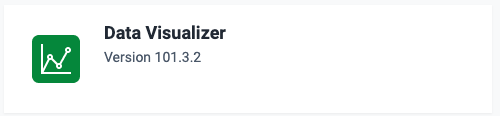{.center width=30%}
    
* The [**Data Administration app**](#data_admin) is used to generate the analytics tables used to create the visualisations.  

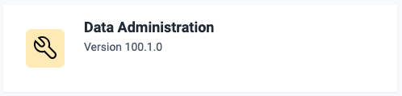{.center width=30%}

Other important apps for basic configuration of DHIS2 are the [**System Settings app**](#settings) where you set a range of configuration options, the [**Users app**](#manage_user_role_group) for setting up new users, user roles and User groups, the [**User Profile app**](#user_account_preferences) to set your individual details and preferences such as setting up multi-factor authentication.

#### 1. Organisation units 

The organisation unit hierarchy defines the organisation structure of DHIS2, for example how health facilities, administrative areas and other geographical areas are arranged with respect to each other. It is the where dimension of DHIS2, similar to how periods represent the when dimension.

What they are: Often these are geographic or administrative units (country, region, district, facility) . You can choose the level that is most relevant to your data, the top level can be the whole world, a single country or a single district. Can also be used to model organisational structure, divisions, departments etc

1. Open the Maintenance app and create a basic Org Unit structure

[How to add org units (in the UI)](#create_organisation_unit)

#### 2. Create Data Elements

These are the “what” of the the data that you want to collect e.g., "Number of Outpatient Visits", "Number of Malaria Cases" 

1. Open the Maintenance app and create a couple of example [Data Elements](#create_data_element).  
      

#### 3. Create Category Options, Categories and Category Combination 

Categories are used to disaggregate data elements, for example Gender as a category with Male and Female as the category Options

1. Open the **Maintenance app** and create a single disaggregation [Category](#create_category) with a couple of [Category Options](#create_category_option).  
2. Create a [Category Combination](#create_category_combination) and add that category to it  
3. Open the Data Elements you created in the previous step and assign the Category Combination  
      

#### 4. Create Data Set

A Data set is a collection of data elements that you want collected at the same time, this level is best thought of as the form or survey that makes up the data collection activity. It is here that you define the look and feel of the form that is displayed to the user in the data entry app.

1. Open the **Maintenance app** and create a [Data Set](#create_data_set)  
2. Assign the data elements created in the previous step  
3. Make sure to assign the Data Set to the Org units that you want to capture data for.  
      

#### 5. Collect Data

Now that you have a data set, you can open the **Data Entry App** and add some data 

1. Open the [Data Entry App](#aggregate_data_entry_app.get_to_know) and select the Data Set you have created and the appropriate Org Unit.  
2. Enter some data in the form

#### 6. Generate the Analytics tables

Before generating analytic visualisations you need to generate the Analytic tables, this is usually set up as an automatic job that runs every few hours or every day.

1. Open the **Data Administration App** and run the [Analytics tables](#data_admin_analytics_tables)

   

#### 7. Create a basic visualisation

1. Open the **Data Visualiser app** and create some tables and charts of your data\!

[Create a data visualisation](#data_visualizer)

	  
So that is the very basic end to end how to gather and visualise some aggregate data, this is just scratching the surface, you can then create Dashboards, Maps or reports to visualise your data 

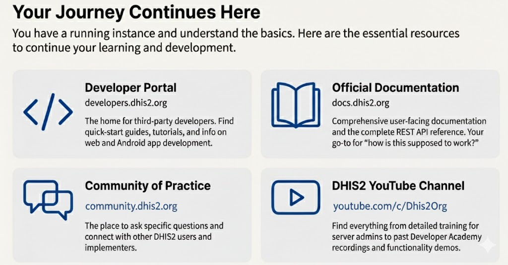
