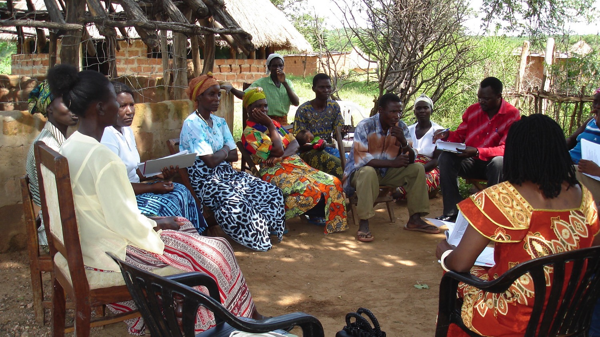

## Background
The CHIS implementation gudie aims to serve as a practical guide for national and local-decision makers involved in the design, planning, deployment, governance and scale up of successful DHIS2 based CHIS that support community-based health service providers and the communities they work in. This guidance covers the full information cycle, including: data collection, analysis, dissemination (feedback loops) and use/action taking for improved and equitable community-based health services.

It provides an in-depth review of key questions that should be considered when addressing issues relevant for governance, design, development and use of large-scale CHIS. It is applicable to countries that are beginning the design process as well as for existing systems that are being strengthened, scaled up or integrated with other information systems such as the facility based or RHIS. It is meant to provide general guidelines whose applicability must be considered and adapted to different country and within country contexts.

Community health data is broad and complex in terms of how it is produced, who produces it, how it is used (or not) and who uses it (or not).^[We define community health data as data on health, health services, and determinants of health derived from and relevant to community administrative/geographic units, community members, and/or the community level of health systems.] This guide focuses primarily on community health workers (CHW) programs and their routine information needs with direct links to the formal health system; starting with information needs of CHWs and other community-based providers and support at facility, district, and higher levels. While the CHW is the primary focus of our analysis, the guidelines actively consider the linkages of the system of the CHW with other stakeholders at the community and health system levels. In considering these multi-level linkages, this guide also looks at sustainable governance and advocates an architecture based approach to avoid the problem of the CHIS being considered as a standalone system, rather than as an entity within a broader ecosystem of HISs which need to speak to each other for an effective CHIS.

The evidence base for this guidance document is derived from the broad experience of the more than two decades of Health Information Systems Program (HISP) research and development initiative of the UiO.^[This initiative, which has action research at its core, has effectively combined research, education, and practical systems development including of the DHIS2 platform and its application to over 60 country contexts. While the primary focus of t: e HISP efforts to date has focused on facility based information systems, the value of the practical and educational experience is acknowledged by the global community for the building of CHIS.] This led to the commissioning of this document, where specific experiences of CHIS in different country contexts such as Zambia, India, Ethiopia, Liberia, Uganda, Indonesia and others were examined to build case studies, insights, lessons and practical exercises on different facets of building a CHIS, including monitoring of integrated community case management (iCCM)[^footnote1].

[^footnote1]: Guenther, T., et al. (2014). *Routing monitoring systems for integrated community case management programs: Lessons from 18 countries in sub-Saharan Africa, Journal of Global Health, 4 (2):1–8*. Available at (accessed May 2017): [http://www.jogh.org/documents/issue201402/Guenther_Final.pdf](https://www.jogh.org/documents/issue201402/Guenther_Final.pdf)

The specific value add that this guidance document seeks to provide includes:

- Provides insights into the building of a CHIS while considering, in a holistic manner, the work context of a CHW, and the particular complexities of their information needs.
- Adopts an architecture approach to enable viewing the challenge of building a sustainable and well-governed CHIS which is interconnected with other systems such as RHIS, logistics, human resources and others.
- Builds upon a wealth of practical and research experience, and adapts this to the complex particularities of a CHIS.
- Highlights that building a CHIS is a socio-technical and not just a technical challenge, and the people and institutional considerations must be treated with equal importance as the technical.

## Target Audience 

While acknowledging there is a multiplicity of stakeholders engaged in the development of CHIS like ministries, donors, software vendors, private sector, and NGOs, we believe one document cannot detail relevant recommendations for all these audiences. We have, therefore, focused on the primary audience to be the national Ministry of Health (MoH) of countries. Ministries of health are ultimately the stewards and owners of the CHIS and key beneficiary in using the information generated from the CHIS for strengthening their CHW programs and achieving global and national health reform goals of Universal Health Coverage (UHC), Sustainable Development Goals (SDGs) and others. The primary audience for these guidelines are the policy makers in MoH designing sustainable and well governed CHIS that support community health systems and their implementing team, including district, community health managers, and CHWs.

The secondary audience for this guidance includes other relevant stakeholders supporting community health systems and CHIS such as:

- Development agencies and donors who provide technical assistance, governance oversight or financing to community health programs and CHIS.
- Universities and "capacity builders" since many CHIS have their capacity building efforts institutionalized at universities.
- Private sector practitioners, NGOS and other providers of community services who are engaged in bridging the gap between private and public service providers (e.g. BRAC in Bangladesh, or PSI for malaria in Cambodia)

We hope this guidance can provide insights to these groups on the complexities of CHIS and approaches to their governance and sustainable development, which they can then adapt to their particular use cases.

## Guiding Principles

The following key principles have been taken into consideration when developing the guide:

- Treat CHIS as part of broader strategy and architecture and develop sustainable governance systems to ensure interoperability.
- Seek to harmonize donor, country, and partner efforts while keeping the national MoH at the center, always.
- Consider the CHIS in its broader supporting roles of advocacy, policy, communication and not just reporting.
- Build on what exists and have integration as a guiding principle to help move beyond siloed disease programs and other data sources into the national HMIS (e.g. DHIS2 as is the case in many countries).
- Seek to actively work towards reducing the data management burden of CHWs and enable those individuals to adopt processes of data use for local action taking.
- Adopt a multi-sectoral approach and move beyond the "health sector", as in the case of planning SDGs.

The guide provides design and implementation principles which provide takeaways to guide the design, management, implementation and use of CHIS. These principles are not meant to be prescriptive "how to do it" guides, but rather to highlight a set of issues that should be considered when building a CHIS. Through case studies, examples, exercises, and discussions we seek to provide alternatives on how to approach these different issues and the contextual considerations that need to be incorporated.

## Acknowledgments

These guidelines were made possible the Health Data Collaborative (HDC). The HDC is a global network working to strengthen country-led health information systems. The HDC is composed of several working groups and subgroups, including the Community Data Working group; whose objectives, broadly speaking are 1) to develop global goods, including standards, generic guidance and operational tools for community health information systems (CHIS) as an integrated component of broader RHIS; 2) identify ways in which investments in improving CHIS as integrated component of RHIS can be better harmonized at country level; and 3) promote and provide coordinated financial and technical support to governments for strengthening CHIS based on joint investment plans at country level.

These guidelines have been developed by the DHIS2 Health Information Systems Program (HISP) at the University of Oslo (UiO) in collaboration with Akros Zambia. This work is based on 20 years of action research at UiO and active engagement from the global DHIS2 network. Valuable inputs, use-cases, and best practices have been included from the Ministries of Health of Liberia, India, Ethiopia, Malawi, Zambia, Uganda, Afghanistan, Nepal, Zimbabwe, Tanzania, South Africa, Ghana, Bangladesh, and Nigeria. Additional inputs, use-cases, and edits have been provided by Last Mile Health, UNICEF HQ, HISP India, HISP Tanzania, HISP South Africa, HISP Namibia, HISP East Africa, HISP Bangladesh, HISP Zimbabwe, Measure Evaluation, CDC, JSI, FHI360, and UNICEF West Africa.
