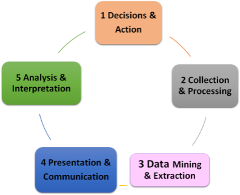
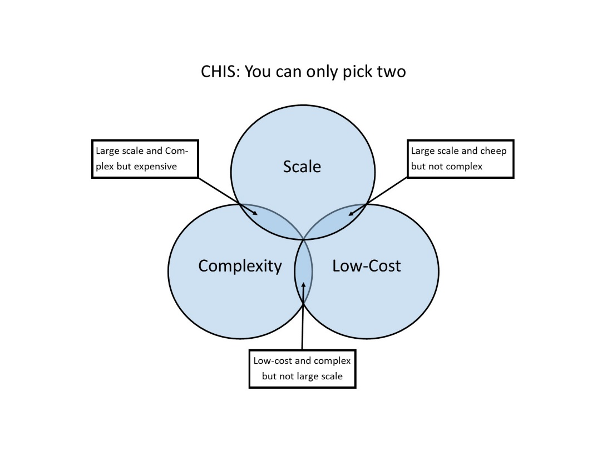

# Chapter 1: Foundational Concepts for CHIS

## Introduction 

This chapter outlines some foundational concepts relevant to the understanding of CHIS, their nature, scope and purpose. Further, we discuss some key "design principles" that underlie this entire approach to community health information systems.

*Learning Objectives:*

By the end of this chapter, readers should be able to:

-   Build an understanding of foundational concepts of community, community health worker (CHW) and community health information system (CHIS).

-   Understand the important role of information in the work of a CHW, and how the landscape of demands for information are radically and fast changing.

-   Describe the diversity that is inherent in CHIS across and within countries, and the relevant contextual parameters to consider in building a CHIS.

-   Outline the design and implementation characteristics of a successful CHIS.

-   Explain the guiding design principles for building an effective CHIS using DHIS2, and how these should be used.

## Foundational Terms for CHIS 

To understand where CHIS is used, by whom, and what it is, we briefly outline some fundamental concepts of a community, CHW and CHIS.

### Community 

A community can be considered a social unit, such as a group of people, who have something in common, such as [norms](https://en.wikipedia.org/wiki/Norm_(social)), [values](https://en.wikipedia.org/wiki/Values), or [identity](https://en.wikipedia.org/wiki/Identity_(social_science)). Communities usually share a sense of place that is situated in a given geographical area, such as village or neighborhood. For purposes of provision of community health services, a community includes a set of stakeholders who meet one or more of the following conditions:

-   Reside in a defined geographic area.

-   Share demographic traits (e.g. children under five, pregnant women).

-   Behavioral or occupational characteristics (e.g. sex workers, truck drivers).

-   Situational factors (e.g. orphans, prisoners).

In addition to the residents of the community, who are beneficiaries of health services being provided by the CHW, the community also includes others such as local political or religious leaders, village or tribal chiefs and other local decision-makers serving in policy or legislative roles, overseeing local resource allocation, identification of individuals or families in need of services, or similar capacities. The proposed CHIS which we build needs to also incorporate the information needs of these stakeholders in addition to that of the health department.

### Community Health Worker (CHW): 

A widely accepted definition of a CHW was proposed by a WHO Study Group (WHO 1989):

> *Community health workers should be members of the communities where they work, should be selected by the communities, should be answerable to the communities for their activities, should be supported by the health system but not necessarily a part of its organization, and have shorter training than professional workers.  *

This 20^th^ century definition is based on global principles and does not directly address the numerous variations that exist around CHWs across countries. We discuss some conditions of variations which arguably have implications on the design and use of CHIS. These include:

i)  Do they have to be *community members* or can they be \"known and respected by the community.\"

ii) Do they have to be *literate*? Many CHW programs insist on literacy and with increasing technology, the ability to use a mobile phone is increasingly in demand.

iii) *Who hires them?* While in many countries the CHWs are recruited by the Ministry of Health and are members of the health system, in many countries, CHWs are hired and managed by development partners or local NGOs.

iv) *Are they salaried or voluntary or incentivized?* CHWs can either be salaried (paid by the Ministry or the Development Partner), be voluntary in nature, or paid through some form of incentive systems.

v)  *What tasks are they responsible for?* In some scenarios, the CHWs perform a wide range of primary health care related tasks that can be preventive, curative, and developmental, while, in other cases, CHWs may be hired for very specific interventions or to support certain health campaigns.

These variations in recruitment, modes of payments and activities performed by the CHW all have a bearing on the CHIS. For example, a voluntary worker or one hired by a development partner will not have the same degree of accountability to the national CHIS as those hired by the MoH. CHWs working on specific campaigns may not have the responsibility to report into a routine and ongoing CHIS.

Regardless of the scope of services, community activities that are measured by the CHIS need to be carefully planned from the outset and well-supported financially and technically, with strong managerial and political leadership from all levels. The scope of measurement needs to, at a minimum, encompass and support the activities that the CHW performs including:

-   Providing care and appropriate referrals for patients/ beneficiaries.

-   Engaging with communities and their leaders.

-   Providing information, education, and communication ([[IEC]{.ul}](http://www.emro.who.int/child-health/community/information-education-communication.html)) activities.

-   Promoting public health in other locally specific actions.

-   Recording and reporting data to higher levels on activities performed and diseases identified for surveillance.

-   Managing stocks and inventory.

-   Providing training and supervising community-based activities.

-   Managing incentives to strengthen enrollment of beneficiaries in health programs.

Some of these activities such as patient care, community engagement, and IEC are mainly done by CHWs, while others (stock management, training, incentives) require ongoing support and supervision from the facility level. All of these activities need to be measured and supported by the CHIS that is simple, appropriate and locally useful to CHWs and their supervisors. Furthermore, there is a continually changing context of CHW work which has significant implications on the information needs of the CHW and the CHIS. For example, while effective and low-cost interventions to improve maternal and child health and survival are well known and practiced, achieving universal health coverage of such services remains a challenge. Now, dealing with non-communicable diseases (NCDs) under universal health coverage is emerging as a new challenge. This requires different kinds of data to be collected that are case and transaction based rather than aggregate, collected over time rather than one time, and have a key focus on provision of continuity of care within an equity based framework.

The unsolved, existing challenges, the new frontiers of information, coupled with the continued and acute shortage of CHWs[^5] makes the challenge of designing effective CHIS an urgent priority which this guidance document seeks to address. Supported by a well-functioning CHIS that brings all community-related data into one, easily accessible place, CHWs can make a valuable contribution to overall community development and can improve access to and coverage of communities with basic health services and undertake actions that lead to improved health outcomes, especially in the field of primary care. CHWs represent an important health resource whose potential in providing and extending a reasonable level of health care to underserved populations must be fully tapped. Further, in order to implement, support, learn from and measure aspects related to community health listed above, a well-functioning CHIS is necessary.

### Community Health Information System (CHIS)

A working definition of CHIS adopted for this document is

> *"A CHIS is a combination of paper, software, hardware, people and process which seeks to support informed decision making and action taking of CHWs. This includes:*

-   ***Recording** of basic data such as population, health program transactions, case based data, stock and resource availability*

-   ***Tracking and taking action** on individual program based needs such as disease surveillance, mortality and morbidity*

-   ***Reporting and feedback** including routine upward reports, feedback reports, ad hoc reports and specific reports for different stakeholders"*

A CHIS is visualized by the information cycle (see Figure 1.1) for community health information. The information cycle starts with decisions made or actions taken by the CHW at the community level, clarifies data sources and collection methods, describes data aggregation and processing as well as mechanisms for communication with higher levels, including data into the overall HIS and getting expert analysis and interpretation.

While the details of this cycle will vary from program to program, and at different levels, the principle applies to all information systems.

Figure 1 The health Information cycle

+------------------------------------------------------------------------------------------------------------------------------------------------------------------------------------------------------------------+
| **CHIS service data** are captured primarily by CHWs and relate to the functions of recording, tracking, and reporting in relation to the activities that CHWs perform. The nature of CHIS varies with contexts. |
|                                                                                                                                                                                                                  |
| -   In some cases, they are manual and paper-based registers, diaries, tally sheets, and reporting forms.                                                                                                        |
|                                                                                                                                                                                                                  |
| -   In other contexts, they are ICT- based using devices such as mobile phones, tablets, and computers.                                                                                                          |
|                                                                                                                                                                                                                  |
| -   In most cases, they represent some kind of hybrid combining elements of paper and ICT-supported solutions.                                                                                                   |
|                                                                                                                                                                                                                  |
| Many countries are in the process of moving towards more automated DHIS2 based CHIS, a process which this guidance document is aimed support.                                                                    |
+------------------------------------------------------------------------------------------------------------------------------------------------------------------------------------------------------------------+

### How is a CHIS Different from a HMIS? 

For the purposes of this document, we distinguish between a Community HIS and a facility based HIS or Health Management Information System (HMIS). While the HMIS concerns information for services provided at a facility, a CHIS concerns activities provided to members of a community, typically by CHWs living in the community or through outreach services conducted by CHWs from a facility. However, it is important to emphasize that within the architectural approach that this guide is advocating, we see the CHIS and HMIS to be intricately inter-connected. This implies that CHIS data must feed seamlessly into the HMIS to avoid duplications and redundancies, and the HMIS must be capable of providing feedback and support to strengthen the CHIS.

The CHIS is much more granular (i.e. more detailed) and wider in scope and scale than a facility HIS and this brings with it unique challenges that need to be specifically addressed. For example in a country of ten million people there may be 350 health facilities. Each health facility may be a reporting unit in the HMIS and service an average population of 30,000 people. However, in that same country there may be one CHW per 1,000 people meaning that there will be 10,000 CHWs each represented as a reporting unit in the CHIS. A CHIS is, thus, distinct from a facility-based HIS, though the CHIS should feed into the higher level HIS. This linkage strengthens the important developmental and promotional roles of the CHW to act as a bridge between the community and the formal health services. A well-functioning CHIS thus provides opportunities to increase both the effectiveness of curative and preventive services as well as the community management and ownership of health-related programs. Nevertheless, in reality, a considerable gap exists between the programs driven and owned by communities and program realities at health facilities. This is reflected in the typically fragmented and stand-alone nature of most existing CHIS.

A typical CHIS needs to focus on the following areas:

1.  **Patients treated, referrals, and drug availability**: CHIS should measure CHW program performance in terms of patients treated, referrals and drug availability. Note that health worker performance also depends on many other aspects of management such as selection, training, supervision and support, which are measured elsewhere.

2.  **Clients attending primary health care (PHC) activities**: Use of CHW programs can be measured by the number of clients seen for different PHC activities - preventive, promotive, rehabilitative, and curative. Results are linked to community involvement in the program and community preference for formal, established health services if they are available.

3.  **Reporting rates**: Retention/ attrition is measured by numbers of CHWs reporting each month. High attrition rates (3 to 77 percent a year) have been reported in many CHW programs and causes major problems that need to be dealt with through refresher training and the broader package of management interventions.

A well-functioning CHIS, just as HMIS, is a balancing act between getting the data you need (complexity), expanding the system to cover all services across the whole country (scale), and minimizing costs. Typically, the goal of a HMIS would be to find a balance between these three factors: scale, complexity, and cost. However, from experience, it is exceptionally difficult or nearly impossible to find this balance between all three factors for a CHIS primarily due to the massive scale and scope of a CHIS. Therefore, for the purposes of these guidelines, a CHIS implementer should initially focus on picking two of the tree factors. Most countries will be likely to prioritize a CHIS that is large in scale and low-cost, but this requires that the complexity must be minimized and tightly controlled. Practically, minimizing complexity results in a very simple reporting platform capturing a small number of key indicators, extensive use of job aids and automated feedback mechanisms to help CHWs and CHW supervisors understand their data and perform tasks. From a governance perspective, adding additional reporting burden to CHWs must be minimized and tightly controlled centrally.

Strengthening CHW work through improved CHIS runs contrary to the typical perception that health professionals have of CHWs as mere aides who should be assistants within health facilities and serve as passive data providers. Such a perception completely misunderstands the CHWs health promoting and enabling roles within communities, and the need for the CHWs to be empowered with relevant information. In many programs, even those personnel who are supposed to supervise CHWs (usually nurses) are not taught about CHW work in their basic training and are not involved in the planning, implementation, monitoring and evaluation of such programs. This attitude is carried over to the CHIS which typically is the subject of abject neglect. Good quality community data provides an entry point to promote change of entrenched attitudes as well as promote the PHC Care principles of integrated service delivery - preventive, promotive, curative, and rehabilitative, and provision of care to the population in an equitable manner. Extending data collection to the community to "find the missing data" is a logical and necessary extension of facility HIS to enable a full view of the health of the catchment population, including morbidity and mortality profiles and unmet needs of health services.

While information flows around the CHIS varies significantly across contexts, a generic data flow for a "hybrid" CHIS may be close to the following:

1.  The CHW provides services to individuals or groups in the household and notes details relating to that in her field diaries.

2.  At the end of the day, the CHW transfers data from her diaries to her primary registers.

3.  At the end of the reporting month, the CHW tabulates totals. The CHW extracts data from her registers to put into reporting formats to send to the level above.

4.  Reports are checked for quality and used to take local action. Selected data is sent to the next level either manually, or using a computer/mobile application.

5.  Denominator data is used to convert raw data into key performance indicators.

## Five Design Principles for Implementing CHIS

When creating new CHIS in DHIS2, the system builders face many fundamental system design considerations, and the choices they make profoundly influence the trajectory of the CHIS. We describe these principles below and list a set of action points under each to enable operationalization of the design principles in practice.

1.  Design the CHIS to strengthen government ownership and sustainability.

2.  Enable and strengthen community engagement.

3.  Build a balance between reporting burden and provision of care.

4.  Strengthening capacity of CHWs and other stakeholders as a team.

5.  Follow incremental and evolutionary principles of system design and development.

### Design Principle 1: Strengthen Government Ownership and Sustainability of the CHIS

In the same way as community health fits within the larger arena of public health, the CHIS must fit within the larger ecosystem of public health information systems. A government-led CHIS strategy and implementation process ensures that essential community-level data are collected sustainably and promptly delivered to the right people in the health system, to enable effective decisions to strengthen health services delivery can be taken. Integrated design approaches which inherently strengthen government ownership will help reduce the unsustainable fragmentation of information systems, arising when non-standard systems are introduced by third-party agencies such as donors, NGOs, and faith-based organizations.

+-------------------------------------------------------------------------------------------------------------------------------------------------------------------------------------------------------------------------------------+
| *Action points to operationalize the design principle*                                                                                                                                                                              |
|                                                                                                                                                                                                                                     |
| 1.  Meet and engage government stakeholders at all levels - particularly district and local government - to discuss stimulating local demand for and availability of community-level health data.                                   |
|                                                                                                                                                                                                                                     |
| 2.  Commit public, donor and NGO resources and infrastructure such as money, materials, and manpower to sustain locally developed plans to sustain the community system, right from the start.                                      |
|                                                                                                                                                                                                                                     |
| 3.  Design CHIS to integrate with the existing government health management information system from the start.                                                                                                                      |
|                                                                                                                                                                                                                                     |
| 4.  Focus data collection on locally useful data on PHC, (preventive, promotive, curative, rehabilitative) and continuity of patient care. Also include data on SDGs/ MDGs, equity in care provision and universal health coverage. |
|                                                                                                                                                                                                                                     |
| 5.  Review CHIS-related health policies, M&E plans, and legislation regarding issues such as confidentiality, privacy, and data disaggregation.                                                                                     |
+-------------------------------------------------------------------------------------------------------------------------------------------------------------------------------------------------------------------------------------+

### Design Principle 2: Enable and Strengthen Community Engagement

Data collected through CHIS will only be accurate and consistent when the community and its leaders find value in the data generated and use it for local action. The CHIS, thus, must be designed to support community-based action, meaning that relevant local stakeholders should participate early in system design and implementation, and be able to see added value to their everyday work from the CHIS.

+-------------------------------------------------------------------------------------------------------------------------------------------------------------------------------------------------------------------------------------------------------------------------------------------------------------------------------+
| *Action points to operationalize the design principle*                                                                                                                                                                                                                                                                        |
|                                                                                                                                                                                                                                                                                                                               |
| 1.  Identify legitimate community stakeholders (e.g. traditional healers, chiefs, religious leaders, health committees, teachers, etc.), who can hold local actors accountable through participatory processes. They may have multiple roles such as data auditing, triage of data, and identifying gaps in service coverage. |
|                                                                                                                                                                                                                                                                                                                               |
| 2.  Draw on existing institutional structures rather than creating new ones for CHIS. Strike a balance between ensuring continuity and promoting innovative change.                                                                                                                                                           |
|                                                                                                                                                                                                                                                                                                                               |
| 3.  Strengthen use of CHIS data in local supervision, mentorship, and support to stakeholders, depending on how they will use or interact with the CHIS.                                                                                                                                                                      |
|                                                                                                                                                                                                                                                                                                                               |
| 4.  Ensure timely and appropriate feedback that makes the analyzed CHIS data interesting and immediately useful for targeted local stakeholders.                                                                                                                                                                              |
|                                                                                                                                                                                                                                                                                                                               |
| 5.  Promote community-led CHIS innovations that improve data use, using an approach that encourages critical thinking and problem solving. Identify good ideas generated in the community and nurture them to scale.                                                                                                          |
+-------------------------------------------------------------------------------------------------------------------------------------------------------------------------------------------------------------------------------------------------------------------------------------------------------------------------------+

### Design Principle 3: Build a Balance between Reporting Burden and Provision of Care

CHWs bear the brunt of data collection processes introduced by health programs and donors. Data collection often cuts into the time and energy that CHWs could be using to provide health care services. CHWs should prioritize care-giving tasks over data-reporting ones, which require CHIS designers to promote local action over upward reporting to national systems. While detailed household and individual data is essential for local use, it is not needed for action at higher levels which requires more aggregated data. As a general principle, data should not be transmitted upwards unless it can be used at higher levels.

+--------------------------------------------------------------------------------------------------------------------------------------------------------------------------+
| *Action points to operationalize the design principle*                                                                                                                   |
|                                                                                                                                                                          |
| 1.  Keep information systems simple, sustainable, minimal, and frugal.                                                                                                   |
|                                                                                                                                                                          |
| 2.  Standardize all CHW reporting forms across the country.                                                                                                              |
|                                                                                                                                                                          |
| 3.  Simplify forms to make CHW data entry more efficient, user-friendly, and accurate.                                                                                   |
|                                                                                                                                                                          |
| 4.  Report only critical, "must know" information to next level. CHIS Data is for strengthening local monitoring and evaluation of programs, not for 'research purposes' |
|                                                                                                                                                                          |
| 5.  Follow the hierarchy of reporting standards. Retain detailed data locally, and only report data necessary to inform policy and generate indicators to higher levels. |
|                                                                                                                                                                          |
| 6.  Integrate job aids such as data quality assessments or CHW diagnosis guides into the CHIS.                                                                           |
+--------------------------------------------------------------------------------------------------------------------------------------------------------------------------+

### Design Principle 4: Strengthening Capacity Development Processes of All CHIS Stakeholders

CHIS should be both an object of capacity strengthening and a means to support teams of CHWs and stakeholders to conduct community-based health provision tasks. For example, CHWs need to build skills and capacity to use a mobile device based CHIS, but using this application they are able to strengthen their interactions with other CHWs and clinicians which can contribute to building their capacity to provide better health care services. Because of this potential, capacity strengthening around CHIS needs to span the entire information cycle. Some areas of capacity building that require attention in this context include:

-   Target teams of CHWs, stakeholders and supervisors rather than individuals

-   Understanding of basic concepts related to data elements and indicators, coverage, and general population data.

-   Understanding why certain data elements and indicators are reported and why they are important in the larger health program picture.

-   Knowing how to keep records and using appropriate technologies.

-   Awareness and understanding of issues of data quality and health status assessment.

-   Providing remote and supportive supervision

+-------------------------------------------------------------------------------------------------------------------------------------------------------------------------+
| *Action points to operationalize the design principle*                                                                                                                  |
|                                                                                                                                                                         |
| 1.  Capacity strengthening must target teams of CHWs, supervisors and other relevant stakeholders.                                                                      |
|                                                                                                                                                                         |
| 2.  Use locally appropriate user-focused training methods in the local language.                                                                                        |
|                                                                                                                                                                         |
| -   Use stories and images and perform training.                                                                                                                        |
|                                                                                                                                                                         |
| -   Combine on-the-job technical support with classroom training.                                                                                                       |
|                                                                                                                                                                         |
| 3.  Develop a system of continuous coaching, supervisor mentorship and peer-to-peer support, which empowers trainees through the CHIS.                                  |
|                                                                                                                                                                         |
| 4.  Focus on data use and understanding, rather than only on data collection.                                                                                           |
|                                                                                                                                                                         |
| 5.  Develop locally appropriate standard operating procedures (SOPs), which will provide the basis of capacity strengthening exercises, mentorship, and job aids.       |
|                                                                                                                                                                         |
| 6.  Identify and train IT counterparts in local government who will be responsible for maintaining the CHIS in the long-term, as part of the overall HIS strengthening. |
+-------------------------------------------------------------------------------------------------------------------------------------------------------------------------+

### Design Principle 5: Follow Incremental and Evolutionary Principles of System Design and Development

This design principle focuses on adopting participatory and prototype processes that are incremental and evolutionary in nature, rather than attempting perfection at the first attempt. This requires building a prototype, exposing it to users and adapting and improving the prototype based on the feedback received. This process reflects an iterative process of evolving system improvements, and strengthening user ownership.

+---------------------------------------------------------------------------------------------------------------------------------------------------------------------------------------------------------------------------------------------+
| *Action points to operationalize the design principle*                                                                                                                                                                                      |
|                                                                                                                                                                                                                                             |
| 1.  Build upon systems that exist, ensuring that CHIS design is sensitive to history and existing work practices. Remember that no system can be designed from scratch, from a "clean slate".                                               |
|                                                                                                                                                                                                                                             |
| 2.  Balance the system's user requirements between continuity and change. Focusing only on continuity may lead to automating existing processes without considering process improvements, and seeking radical change may create resistance. |
|                                                                                                                                                                                                                                             |
| 3.  Use [[participatory design principles]{.ul}](http://dl.acm.org/citation.cfm?id=2803993) to promote local ownership and buy-in for the system.                                                                                           |
|                                                                                                                                                                                                                                             |
| 4.  When mapping the flow of data in a CHIS, implementers must balance the required complexity of data needs with the simplicity necessary for system reliability in resource-constrained communities.                                      |
|                                                                                                                                                                                                                                             |
| 5.  Build simple, frugal, and user-friendly systems based on appropriate technology such as simple functional phones and dynamic dashboards.                                                                                                |
|                                                                                                                                                                                                                                             |
| 6.  Design iteratively; customize the CHIS through a prototyping framework that builds on principles of agile and incremental design.                                                                                                       |
+---------------------------------------------------------------------------------------------------------------------------------------------------------------------------------------------------------------------------------------------+
