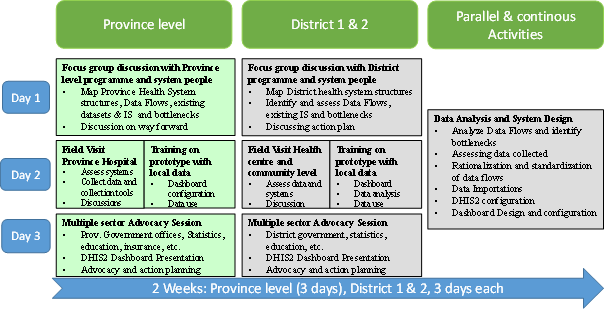
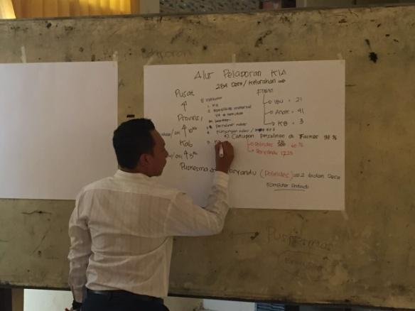
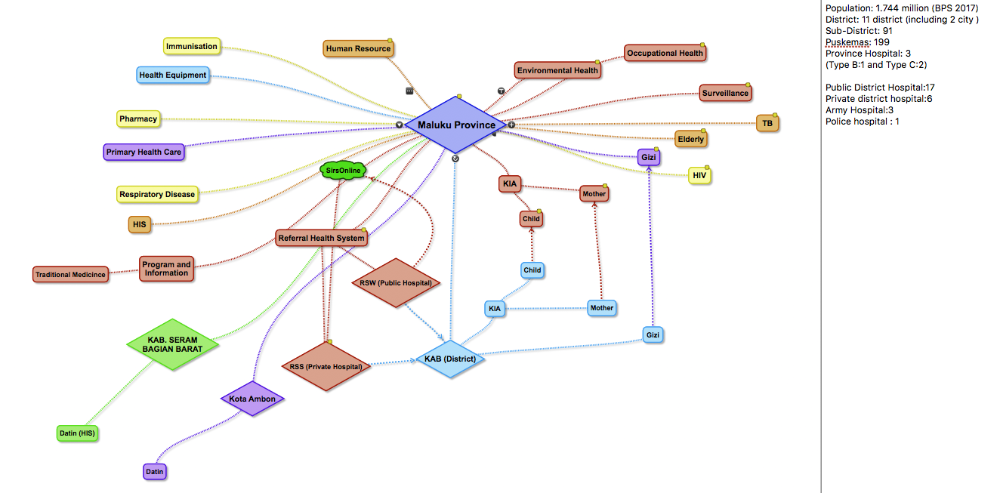
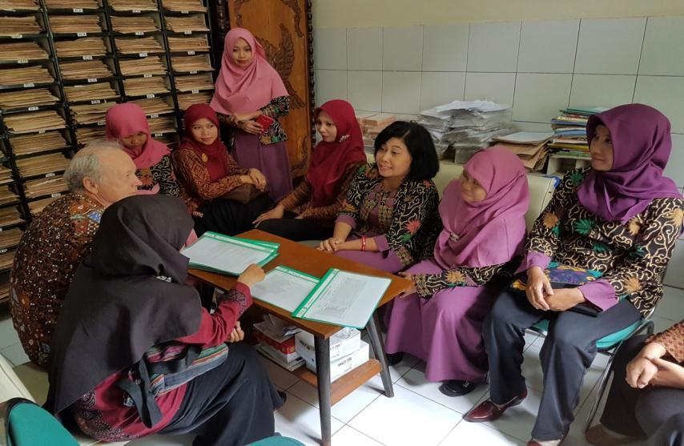
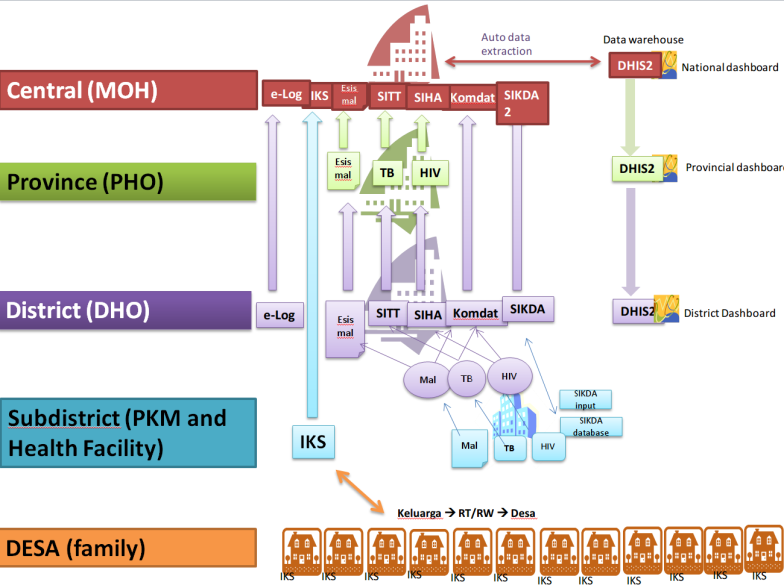
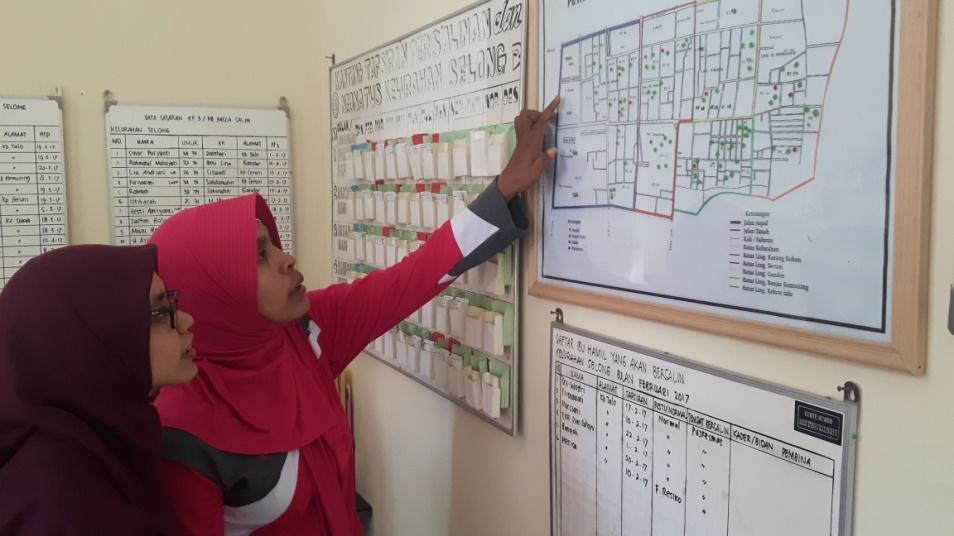

# Chapter 2: Conducting a CHIS Assessment

## Introduction

This chapter covers important aspects of assessing CHIS. Acknowledging the diversity of CHIS, their multiple technical, social, organizational, and cultural determinants, no assessment method or tool will fit all situations perfectly. Therefore, this chapter focuses on the rationale for doing an assessment, various potential methods which can improve understanding of the CHIS, and an in-depth list of key questions, informed by the five design principles of this document, which should be considered in the further design, development, and use of CHIS. Assessment is discussed at two levels: one, the macro policy level, and, two, the operational system development level.

*Learning Objectives:*

-   Build an understanding of the various benefits of conducting an assessment and its inherent limitations.

-   What are the two levels at which assessment is done, and what complementary insights that can be gained from each.

-   Understand the methodological approaches to these two levels of assessment and their respective strengths and weaknesses.

-   Build an understanding of various methods for assessing CHIS as well as their strengths and weaknesses.

## Why Do an Assessment?

The process of assessing CHIS has many aims. First and foremost, an assessment should reveal the weaknesses and strengths of the CHIS with the aim of better planning for its improvement, prioritizing resources, and garnering support and agreement among stakeholders for a way forward. Given the complexity of CHIS, a thorough mapping of all aspects of the system will be elusive, and indeed the result of any assessment must be seen as a product of subjective and incomplete information.

Assessment can be done at multiple levels, and over time. In this chapter, we discuss two levels on which assessment of CHIS is recommended. The first is a macro or policy level, which broadly provides insights into the system level of infrastructure, resources, policy environment and capacity. The second is at the information system level, which provides micro level insights into issues of data flows, redundancies, integration needs, technologies in play, and similar issues. Taken together, these two levels of assessment provide complementary insights, which help to develop a holistic perspective of the state of the CHIS, the contextual conditions shaping this state, which helps develop guidelines on what to do to strengthen the CHIS.

A key aim of the assessment described is not only on the end result of the assessment, but more so in the process itself, which should be collaborative, participative and informative. This helps to:

-   **Inform stakeholders** of potentially unfamiliar aspects of the CHIS. Conducting a broad assessment with participation from multiple stakeholders contributes to a better understanding of the CHIS at large, its challenges and strengths, its routines and processes, tools, data flows and information needs.

-   **Build consensus** around the priorities for strengthening CHIS and the actions that need to be taken to achieve that goal. A key outcome of the assessment process is consensus building among stakeholders concerning the challenges that need to be prioritized and how to approach them.

-   **Mobilize joint technical and financial support** for a CHIS strengthening plan. This should include details on prioritization of investments in the short term (1--2 years), intermediate term (3--9 years), and long term (10 years and beyond).

We now discuss the assessment methodologies at the micro and macro levels.

## Assessment at the Macro Level: Policy and Health System Issues

There are several assessment tools that support a more quantitative analysis of health information systems, such as the Health Metrics Network Assessment Tool and tools related to the PRISM framework. Inspired by these, an assessment tool is included in the annex of these guidelines. It has been developed to focus on aspects of CHIS specifically, but is in method and outline similar to the HMN Assessment tool.

### Pre-Assessment: Stakeholder Identification

To get the most of any assessment, both in terms of covering all aspects of the CHIS as well as building consensus on the way forward, all major stakeholders should be involved. The first step of any assessment should, thus, be to identify the various stakeholders.

Stakeholders for this assessment will include, *any person that has influence over CHIS outcomes, both positive and negative* on a community health worker or program and the CHIS.

These could be change agents in the community such as traditional chiefs, teachers, storekeepers or religious leaders but could also be facility staff, district health officers, supply officers, etc.

The table below shows potential stakeholders from the various levels of the health system, and can function as an example of a stakeholder identification exercise.

  -------------------- ----------------------------------------------------------------------------------------------------------------------------------------------------------------------------------------------------
  **Hierarchy/Role**   **Stakeholders**

  **Community**        CHWs, Chiefs, Mayors, Religious Leaders, Parent Teachers Associations (PTA), Village Health Committees

  **Facility**         Information Officer, Clinic In-Charge, Supply Chain Manager, Clinician

  **District**         District Health Team members

  **Provincial**       Provincial Health Team

  **National**         Health Program Units, such as the IDSR Unit, Ministry of Health-HMIS Manager, Disease Program Advisors, Human Resource, Finance Advisors, M&E Advisors, other ministries and governmental agencies

  **International:**   Donor Agencies, Implementing Partners
  -------------------- ----------------------------------------------------------------------------------------------------------------------------------------------------------------------------------------------------

*Figure 2.1:* Potential Stakeholders at Various Levels of the Health System

-   For each stakeholder, consider the following and add to the table as appropriate:

    -   The critical decisions and actions they make.

    -   What information they (could) use from the community to make decisions or perform action.

    -   How they would use this information to inform decision.

    -   Where they get this information and in what format and frequency.

The primary roles and responsibilities of the various stakeholders should also be mapped against the information cycle presented in Chapter 1. While the stakeholder identification is a part of the assessment itself, consider also reflecting the breadth of stakeholders in conducting the further assessment. For example, the provided assessment tool would benefit from input from a wide range of stakeholders, and ideally representing the various roles, levels of the health system, and both health and non-health stakeholders should partake.

### The CHIS Assessment Tool

This assessment tool consists of a set of questions, organized under various headings (Government Ownership, Community Engagement, Reporting Structure, Standard Operating Procedures, System Design and Development, and Feedback). For each question, four answers are given (Highly Adequate, Adequate, Present but Not Adequate, and Not Adequate at All).

The scoring exercise should be done by key stakeholders, which should reflect the diversity of the CHIS. Each question should be discussed in plenary, so that all can be informed of areas they might not be fully aware of. Agreement should then be reached on which score to give each particular issue.

An example is shown in Figure 2.2 (with a more detailed explanation in the appendices), from the topic heading "Government Ownership." While the various answers may not correspond exactly to the situation, the answer that most accurately reflects the situation should be selected.

  ---------------------------------------------------------------------------------------------------------------------------------------------------- --------------------------------------------------------------------------------------------------------------------------------------------------------------------------------- ------------------------------------------------------------------------------------------------------------------ -------------------------------------------------------------------------------------------------------------------------------------------------------------------------- ----------------------------------------------------------------
                                                                                                                                                       **Highly Adequate**                                                                                                                                                               **Adequate**                                                                                                       **Present but Not Adequate**                                                                                                                                               **Not Adequate At All**

  **Items**                                                                                                                                            **3**                                                                                                                                                                             **2**                                                                                                              **1**                                                                                                                                                                      **0**

  Is there an established CHIS Technical Working Group (TWG) lead by ministry senior staff and including representation from key stakeholder groups?   Yes, there is a CHIS TWG with clear leadership and active participation from all key stakeholders that manages the development, implementation, and sustainability of the CHIS.   Yes, there is a CHIS TWG with clear leadership and active participation from most key stakeholder organizations.   Yes, there is a CHIS technical working group but it does not have clear leadership or it is not able to manage all CHIS development, implementation, and sustainability.   There is not a CHIS technical working group or it is inactive.
  ---------------------------------------------------------------------------------------------------------------------------------------------------- --------------------------------------------------------------------------------------------------------------------------------------------------------------------------------- ------------------------------------------------------------------------------------------------------------------ -------------------------------------------------------------------------------------------------------------------------------------------------------------------------- ----------------------------------------------------------------

*Figure 2.2:* Example of Assessment Tool from the topic heading "Government Ownership

The scores derived from the assessment tool can then be used for planning CHIS strengthening activities:

-   A low score indicates that this particular area of the CHIS is weak. A higher score indicate that this area is functioning adequately. This does not necessarily mean that all questions with low scores should be prioritized, this will depend on the intended system, scaling strategy, and resources.

-   The scores can be used as a benchmark for later evaluation. Re-assessment can, for example, be done yearly to track progress

-   The items in the assessment tool can also be linked to targets. For example, a target can be to improve from score 1 to a score 2 in a certain area.

These guidelines, and the tool itself, do not provide a list of direct actions, a recipe, to improve the scores. The tool is rather meant as an input to the design, planning, and implementation of CHIS strengthening activities, where the result will have to be interpreted to the context.

## Assessment at the Macro Level: An Example

A short example can be used to highlight how the assessment tool can be used for assessing the macro, policy level.

A country is in the process of examining its community health services, and, in that regard, wants to assess the strengths and weaknesses of the overall CHIS before planning specific interventions. The first step they take is to form a steering committee that will oversee the assessment and analyze the results. The steering committee conducts a stakeholder identification exercise to see who should take part in the assessment, and aiming for a rather small group due to logistical reasons, the identify the following.

A community health worker and a representative from a community health committee are selected to bring in the viewpoint of the community itself. They are selected since they have experience with how the data collection and feedback is working between the CHW and the facilities to which they report, and how the CHW interacts with the community at large.

An information officer from a facility is included since this person handles the flow of data between the CHWs and the wider health management information systems, as well as having knowledge of the facilities' challenges with medical stock distribution.

Each district has a Community Health program officer, and the participation of one of them is secured to get the input from this level. This person will, in addition to managing the community health services in the district, also liaise between the CHWs and the other health program managers that are based in the district headquarters, so this is considered adequate participation from the district level.

From the national level, the head of the community health program, as well as the IT technician, is joining. Finally, a representative from a large international NGO, who are supporting the CHWs in some of the districts, is invited.

### Conducting the Assessment

The steering committee, consisting of staff at the community health program, then invites the identified stakeholders to a one-day workshop in the capital. Due to logistical challenges, the community, facility, and district representatives are selected from the same district, though the group would ideally bring in representatives from at least two districts. However, the NGO agrees to invite one more CHW from another district as they are piloting new processes around CHW reporting there.

The group goes through the tool question by question in plenary, since they are not so many. This is also a chance for those who are familiar with the issue in question to inform the others on the team.

An example of how they answered one of the questions now follows:

The group is discussing the question: Do traditional health providers report through the CHIS?

The scoring scheme for this question is:

  ---------------------------------------------------------- -------------------------------------------------------------------------------------------------------------------- ---------------------------------------------------------------------------------------------------------------- ---------------------------------------------------------------------------------------------------------------- --------------------------------------------------------
                                                             **Highly adequate**                                                                                                  **Adequate**                                                                                                     **Present but not adequate**                                                                                     **Not adequate at all**

  **Items**                                                  **3**                                                                                                                **2**                                                                                                            **1**                                                                                                            **0**

  Do traditional health providers report through the CHIS?   Yes, all traditional health providers working at the community level report their activities to the national CHIS.   Most traditional health providers working at the community level report their activities to the national CHIS.   Some traditional health providers working at the community level report their activities to the national CHIS.   Traditional health providers are not part of the CHIS.
  ---------------------------------------------------------- -------------------------------------------------------------------------------------------------------------------- ---------------------------------------------------------------------------------------------------------------- ---------------------------------------------------------------------------------------------------------------- --------------------------------------------------------

*Figure 2.3:* Example of scoring scheme for traditional health providers.

First, the head of the community health program informs the team that, no, this is not taking place. They have tried to incorporate data from traditional birth attendants (TBA) in the CHW reporting, but due to the lack of formalized acknowledgment and collaboration, the TBAs see little incentive in reporting neither to the CHWs or the facilities. This is something they would consider, but for now they would need to give this question a score of 0.

However, both the attending CHWs can then attest to that, sometimes, they do collect data from the TBAs. They know at least one TBA themselves, who is based in one of the villages they serve. They have a good relationship, and sometimes communicate with the TBA to confirm a visit there since there is no community health committee in this particular village. When they so do, they can inform that they get relevant data on the TBA activities, and include in their reporting if this is appropriate. However, one of the CHWs says that this is included, and thus part of, her report, while the other says she is adding it on the side of the paper as performed by the TBA.

The team then decides that a score of 1 is appropriate for this question, but make a note in the scoring sheet that how this TBA reporting is done varies and is not standardized at all.

### Interpreting the results

And, so, they go through the questions of the assessment tools. In the end, they have a list of scores for all the questions, as well as a number of notes clarifying certain issues. The scoring will itself highlight the strengths and weaknesses of the CHIS, but the steering committee is then charged with further analyzing the data and deciding on the priorities. For instance, since they don't have electronic reporting from CHWs, they realize an improvement in score on automatic reminders when reporting is slow is far away. So, even if they set the score to 0 here, this is not seen as a major weakness that needs to be addressed presently.

A report with the findings and such interpretations of the results is then shared with the team who conducted the assessment, to get feedback. They decide to use a three-level prioritization scheme (high, medium, low priority) for all of the questions, and present it at the next executive meeting for all health programs, as well as sharing it with health partners.

## Assessment at the Micro Level: A Case Study 

We illustrate this assessment method, using an approach used by HISP in Indonesia.

In 2014, the Indonesian Ministry of Health in collaboration with its stakeholders (including Global Fund, University of Oslo, among others) began an initiative to strengthen the country's HIS with a strong focus on the facility and community level in response to specific challenges. The Indonesian HIS is structured with multiple vertical, health program-specific systems each with its own platforms working in 'silos.' As a result, common problems occurred including limited data sharing among programs which resulted in a duplication of the data collected from health facilities which placed a heavy burden on health workers who were forced to enter similar data across multiple programs. To alleviate these problems, the MoH and its stakeholders performed an assessment of its current HIS. As a result, they began to see the potential of district dashboards to serve as central repositories that did not significantly compromise the underlying structures of individual program data. From there, the MoH and its stakeholders embarked on a mission to implement an integrated dashboard that hosted information from several health programs (e.g. HIV, TB, Malaria, Maternal and Child health etc.) using DHIS2. The project implemented the dashboard in 10 selected districts located in 5 provinces. The district integrated dashboard approach focused on data quality and use as well as identifying and including additional data sets in the system. While the provincial approach was less comprehensive, focusing only on data that was easily available. The 10 districts each had one HIS consultant employed, but the provinces had no extra resources.

All health programs in Indonesia, such as malaria, TB, HIV, nutrition, mother and child health, have their own information system and reporting structures. The aim of the dashboard project was to integrate data from across health programs in one data warehouse and to provide this data through dashboards customized for each level (district, province and national). The main challenge of many of these systems is that facility and community based data is not available at the national level as only district aggregates are reported from districts and provinces. Some programs (such as HIV and TB) have web based national systems with data by facility available in national servers. For these systems, data are extracted directly into the DHIS2 at the national level. For the other systems, however, data need to be identified and imported or captured at the district or in some cases the provincial level.

The first phase of the implementation of district dashboards consisted of a 10-week action oriented assessment in 5 provinces and 10 districts. This initial phase consisted of on-site 'contextual' assessments of the existing HIS as well as a participatory approach to training, dashboard design, and evaluation of data quality using the dashboard system populated with local data. The assessment and training included a situational analysis to establish the existing infrastructures and create awareness amongst the local program managers about the value of district dashboards that can drill down to the facility and community level. Furthermore, there was a need to establish a mechanism to help enable effective data sharing between the implemented DHIS2 dashboard and the existing district and provincial information systems. The training, demonstration, and feedback sessions used the TB, HIV, and population data already included in DHIS2 to design dashboards and to assess data quality. The assessment was tasked with identifying the following areas:

1.  *Data Sources and Management:* The identification of standard data collection tools and data sources for routinely reported data, as well as population surveys and other data sources. This also includes the handling and processing of data at the source point.

2.  *Data Import Procedures to Create Comprehensive Dashboards:* Electronic data for 2016 was collected from all identified systems with the purpose of importing it into the DHIS2 in order to develop a comprehensive dashboard system and design procedures for importing data on a regular basis.

3.  *Data Flows:* Data flow mechanisms from the community level to the national level. The intermediated processing or conversion of data from one administrative level to another.

4.  *Information Systems:* Available information systems and their linkages both horizontally (across programs) and vertically (up the ministry hierarchy).

5.  *Indicators and Information Products:* Identification of core set of indicators at different administrative levels and their linkages to the national strategic plans.

6.  *Data Dissemination Mechanisms:* Identification of available information dissemination and use approaches to inform internal and external stakeholders.

### Assessment Framework

The assessment team was composed of members from MoH (Pusdatin), UiO, University Gajah Madah, and three universities selected as 'centers of excellence' in health informatics. Eleven consultants (one for each district and one national) were also involved in the assessment process. Prior to the 10 weeks rollout, each district went through a self-assessment using an adapted version of the Health Metric Network (HMN) evaluation tool. This exercise helped local awareness and commitment related to the more action oriented evaluation which followed. The assessment team built on the results of the HMN questionnaires in a hands-on way by looking at the systems and resources having been targeted by the questionnaires.

The assessment team adopted a nested cyclic approach which consisted of the sequential execution of 'cycles', starting from the provincial MoH office focusing on mapping all of the provincial systems (including the two pilot districts), before moving to the first district where a similar set of district focused actions were performed. The learning from the province assessment informed the assessment in the first district, which again informed the assessment in the second district. It was useful to directly compare the perspectives at province level with how different aspects of the HIS were regarded at district level. For example, in one instance, while the provincial drug management in one province emphasized the usefulness of a system to monitor drugs out of stock using 20 'tracer drugs', the first district being assessed used this system in a wrong way; they used a different list of drugs and they reported actual stock instead of out of stock. As people from the province took part in district assessments, and vice versa, such misunderstandings were rectified directly. The second district in this actual province, however, used the out of stock system as in line with the province administrations instructions.

The learning from each cycle of repetitive assessment activities was used to inform and improve the next cycle; the next district in the same province and then further provinces (see figure 1 below). One cycle comprised of two weeks in each province including three days in the province office and then three days in each of the districts. In each cycle, multiple tools/mechanisms were used to assess the existing situation using Focus Group Discussions (FGDs), field visits, reports and tools assessment, and data analysis. The assessment team was composed of health office staff (national, provincial, and district levels), Puskesmas and Posyandu staff (community level), and other sector staff (hospital, health insurance, national statistical bureau, local government, information and communication office, social and welfare office, civil registration office and NGOs). Data dissemination and advocacy sessions were conducted on the final day of the cycle encouraging the head of local government (the mayor), local parliament, and provincial and district heads to promote the implemented dashboards and provide feedback on the lessons learned.

*Figure 2.4:* One cycle of assessment mechanism in one province.

### The Assessment Process

#### Focus Group Discussion

To gather enriched findings from the participants, in-depth discussions were organized in the form of FGDs with key informants coming from various health departments within the province and district (including hospital services, surveillance, and disaster management, among other specific program departments HIV, TB, Malaria, etc.). A structured process was employed to identify the existing health program data sources, data collection tools and data flows from the lower level to the national level. The team also looked at the existing bottlenecks, disparities in infrastructure information (i.e. information on reporting health facilities across the health program), and duplication in the collection of data among the health programs. The initial data mapping process employed was a manual mechanism where the information from the program managers was outlined on paper sheets (See figure 2.5) for easy understanding and validation by participants. With each cycle, the process was altered and improved by employing an electronic mechanism where all data points were mapped using a software (Freemind). This software provided a direct and effective mechanism for mapping data points within multiple administration levels (e.g. province, district, and health facilities). The maps created using the software were projected on the screen which invited immediate feedback and revisions from the participants which were then reflected on the map.

  --------------------------------------------------------------------------------------------------------- -----------------------------------------------------------------------------------------------------------
  
   

  *Figure 2.5:* Manual to Electronic data mapping                                                           
  --------------------------------------------------------------------------------------------------------- -----------------------------------------------------------------------------------------------------------

#### Field Visit

Another mechanism of the assessment was to gather additional information and validate the collected data from the FGDs by conducting field visits. The team used a full second day in the field, visiting the provincial or district offices, health facilities (hospitals and/or health centers) and community centers. At the provincial and district offices, data collection tools were collected with their reporting formats. Existing information systems and infrastructures were identified and assessed based on the data collected, reporting modules, and linkages with other systems. At the health facilities, data collection, processing mechanisms, and the flow of information to the district level were assessed. At the community level, data collection and local information use, and any existing feedback mechanism to and from higher levels were assessed.

*Figure 2.6:* Health facility assessment

#### Training and Participatory Prototyping and Assessment

In each province and district, one full day was dedicated to training in DHIS2 and dashboards as well as participation in the assessment of data quality and prototyping of dashboards. The DHIS2 was already populated with data from the national TB and HIV system as well as with data from the KOMDAT, which collected data on key indicators by district. Population data was also included in the system. Training was conducted on how users could design their own dashboards and include new data elements and indicators. The dashboard functionality was popular among users who used it to display, graph, and assess their own data. In particular, the quality of TB data turned out to be questionable. TB data is reported to the district from the facility either electronically or by paper and compiled at the district using an offline system. Then the data is uploaded to the (SITT) online system. In many districts, this created a systemic problem where there was less data in the online system in comparison to the offline system. In fact, there was never more data in the SITT online than in the offline system, indicating that from time to time, some data was not uploaded. It is interesting that the first 'results' of making such national data accessible to local users is the identification of data quality issues.

User participation in designing dashboards and in assessing data quality turned out to be an important part of the assessment leading to more ownership and commitment to the implementation process.

#### Advocacy, Planning, and Data Dissemination

A session with stakeholders from multiple sectors (in addition to health) was conducted for information dissemination and advocacy in all the districts and provinces. Participants in this session included the heads of provincial, district, and local government along with other health program heads. The assessment team presented the implemented dashboard with a primary emphasis on processes of information use. Key issues for discussion included where to include data from other sectors in the dashboard approach. National statistics have offices in all districts and provinces and were particularly interested in becoming part of the project. The presentation was followed by discussions of future plans and an outlining of with probable action points.

#### Data Analysis and Reflections

In each provincial cycle, a few days were set aside for data analysis and mapping, system configuration, and reflections on the observed assessment challenges. The team assessed data collected during the focus group, field visits, and observations in a discussion format. Afterwards, the assessment team provided recommendations and suggestions for improvement directly to the larger group. Additionally, data mapping, processing, and importation into the DHIS2 platform were done to allow the development of the district and provincial dashboards.

Findings obtained by the assessment approach were presented and discussed first to the internal team and later to the MoH. The process and outcome of the assessment exercise led to the initiation of the following HIS improvement activities.

### Data Standardization

A key observation made by the assessment team was the lack of data reporting standards across the assessed provinces. Data reported within the same program had different formats from one province to another and sometimes within the same province. For example, an exclusive breastfeeding data element was collected within the nutrition department. In NTB Province, the monthly age disaggregation was from 0 to 5 months. However, the same data element in Java Timur and Maluku Provinces combined the age dimension into 0-5 months while disaggregating it by gender (male and female). The same was observed in the Integrated Recording and Reporting System of Puskesmas (SP2TP) in LB1 form. In that case, Maluku Province had gender disaggregation while other provinces reporting LB1 had disaggregated data elements by age group. Most of the health program still uses paper tools supplemented by Excel sheets. The programs areas range from Malaria, Nutrition, Immunization, Surveillance, Human resource etc. Furthermore, Excel formats differed from one district to another depending on the local adopted decisions which limited aggregation at higher levels.

### Fragmentation of HIS

The assessment observed the health data in Indonesia was managed according to different departments with minimal horizontal communication. Such fragmentation caused duplication of collected data and limited data sharing across the departments. The existence of KOMDAT as the national system which collects data for about 130 national health indicators (based on data aggregated by district) was an example of efforts by the MoH to integrate information from health programs. However, HIS fragmentation, and data quality issues still persist within the health systems. Figure 2.7 outlines portion of the observed system architecture within the five visited provinces.

*Figure 2.7:* Information System mapping.

### Information Use and Demand

Local information use was observed at the community and health facility level. Standard practice of identifying follow up cases was used by the health officials. Graphs and charts were plotted at the district and provincial level to disseminate information. Annual bulletins and reports were created from the health facility delivered to the provincial level following a standard format. The use of a dashboard approach appeared to serve as a catalyst to bring stakeholders from different departments together in this process. Managers were motivated by the possibility to have comprehensive information for decision-making.

*Figure 2.8:* Information use by local community

### Recommendations from the Assessment Exercise

-   Build on the recent DHIS2 implementation to bring more stakeholders onboard and have a comprehensive approach look of cross-sector data (e.g. statistical data, civil registration data, hospital data, health insurance data).

-   A provincial approach instead of, or rather in addition to, a district approach to enable swift scaling up the implementation of district dashboards. However, not all data is available by facility and community at the province level and will need to be collected in the districts.

-   Invest in capacity building through internal and external training.

-   Encourage more integration with other stakeholders by using district dashboards.

-   Ensure more functional coordination between health information department and other health programs at the district level and upper administrative levels.

-   Creation of standard data collection tools which will be used across the country.

-   Build more robust approaches for accommodating other data source with disparate data formats.

## Building Synergies from Macro and Micro Level Assessments

The two methods presented earlier in this chapter should be seen as complementary to each other. In the table below, some strengths and weaknesses are outlined to aid in assessing which tool may be more useful in a given context.

+----------------+--------------------------------------------------------------------------------------------------------+-------------------------------------------------------------------------------------------------------------+
|                | **Macro Level Assessment Tool**                                                                        | **Micro Level Case Study**                                                                                  |
+----------------+--------------------------------------------------------------------------------------------------------+-------------------------------------------------------------------------------------------------------------+
| **Strengths**  | -   Can be performed with relatively few resources, although broad participation is encouraged         | -   Gives a rich understanding of CHIS, such as data flows, work routines                                   |
|                |                                                                                                        |                                                                                                             |
|                | -   Incorporates a scoring mechanism which can be used for periodic evaluation                         | -   Helps to understand individuals and their reasoning and actions                                         |
|                |                                                                                                        |                                                                                                             |
|                | -   Gives a holistic view of important aspects of CHIS                                                 | -   Appropriate for identifying contextual aspects                                                          |
|                |                                                                                                        |                                                                                                             |
|                |                                                                                                        | -   Good for identifying challenges and opportunities which are hard to quantify                            |
+----------------+--------------------------------------------------------------------------------------------------------+-------------------------------------------------------------------------------------------------------------+
| **Weaknesses** | -   Process of scoring is subjective                                                                   | -   Resource-intensive                                                                                      |
|                |                                                                                                        |                                                                                                             |
|                | -   Does not go into depth in any of the aspects                                                       | -   Hard to scale, some sample areas must be taken as representative of the whole district/province/country |
|                |                                                                                                        |                                                                                                             |
|                | -   Relatively more static and does not account for process dynamics                                   | -   Does not provide rich insights into macro-level conditions that shape CHIS                              |
|                |                                                                                                        |                                                                                                             |
|                | -   Predefined set of questions may not fit all contexts                                               |                                                                                                             |
|                |                                                                                                        |                                                                                                             |
|                | -   May not be representative of a multiplicity of views, and limited to those answering the questions |                                                                                                             |
+----------------+--------------------------------------------------------------------------------------------------------+-------------------------------------------------------------------------------------------------------------+

*Figure 2.8:* Macro and Micro-Level assessment pros and cons

### Synergies between the Macro and Micro-Levels of Assessment

In the above table, we have summarized some of the strengths and weaknesses of both the approaches. However, we argue that taken together there are richer insights that can be developed around the assessment of the overall CHIS. While the macro assessment allows us to understand the broader contextual and policy aspects that shape the CHIS, this is complemented by the understanding of the individuals, their actions and various processes that constitute the CHIS. The macro level defines the scope for change at the micro level, and vice versa. For example, macro level SOPs such as for infrastructure strengthening is needed to initiate appropriate design at the micro level, such as the need for developing hybrid (offline-online) solutions for the CHIS. At the same time an understanding of the hybrid solutions possible or not at the micro-level, are fundamental to develop the macro-level SOPs. Broadly, the macro level is useful to diagnose and identify the challenges, while the micro level understanding helps to understand possible solutions to the challenges identified. We thus advocate in these guidelines for the use of both the macro and micro level assessments in conjunction, to be able to identify synergies and the corrective actions required for the future improvements of the CHIS.
