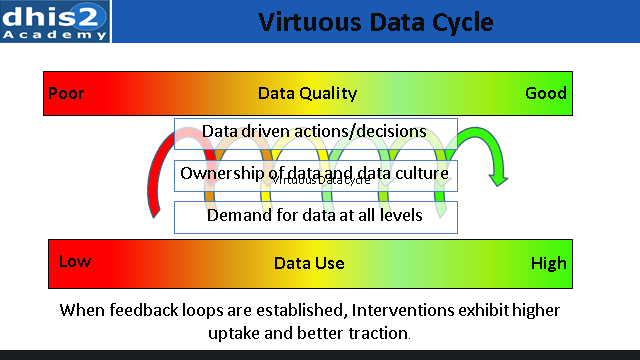
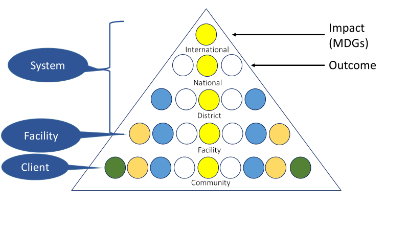
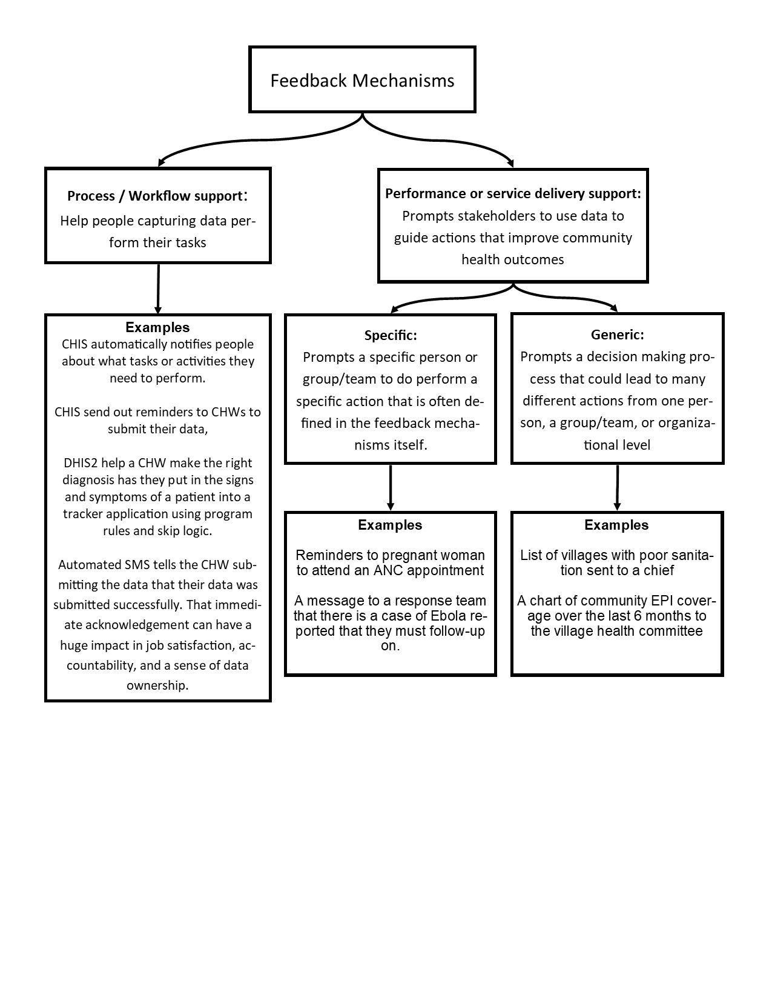
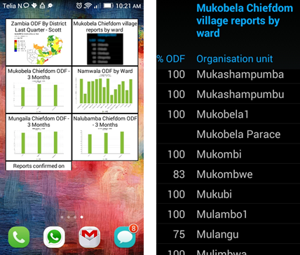
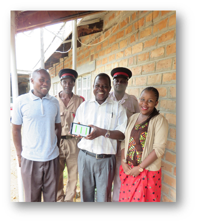
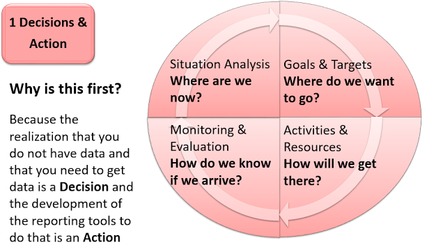
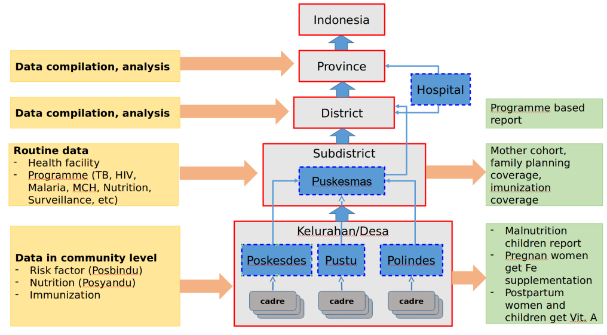
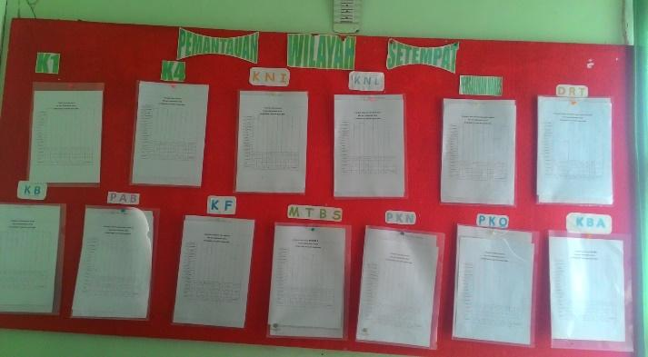
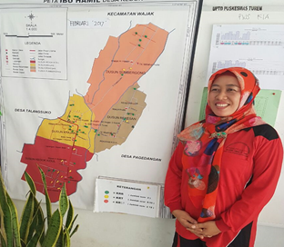

# Data Quality and Use 

The primary purpose of a CHIS is to generate information that can be used by CHWs and other stakeholders at various levels to improve and strengthen community health programs, to enhance the health of populations.

Despite the primary importance of enabling data use, it is an area which lags behind in overall CHIS strengthening efforts, as more focus is given to the use of new technologies and devices to automate data collection and transmission processes. This module thus seeks to understand what we mean by data use, what are its critical determinants, and how can this be strengthened overall.

## The Virtuous Cycle of Data Use and Data Quality 

The "vicious data cycle" is a scenario where the CHIS is seen by CHWs and other stakeholders to provide poor quality data, so they do not trust it and will not use it. They use their own sources, external surveys, or, even worse, create new systems (adding to fragmentation) for meeting their information needs. If they don't use data, the CHIS will be further neglected, produce even poorer quality data, and this leads to more non-use.

Fortunately, the reverse also holds true, as shown in the "Virtuous data cycle". The more the data quality is trusted, the more it is used and this further improves the quality of data. As shown in the feedback loops in the diagram, this is an ongoing, incremental process that takes time and needs to be driven by increased demand for data, local ownership of data and visible links between data and decision making. The end result of this virtuous cycle is a vibrant culture of information use

This link between data quality and use requires CHIS developers to attack the problem of poor data use at both the demand and supply sides, and strengthening their interlinkages. The demand side involves improving awareness and capacities of stakeholders to use data for strengthening community health management, while the supply side implies improving the overall quality of the CHIS generated data. We see the DHIS2 as a tool that can help strengthening both these ends and their inter-linkages. But first we discuss what we mean by data quality, and how can the tools in DHIS2 help to strengthen quality. 

## Strengthening Supply Side: Essential Elements of Data Quality

Good quality data is that which is trusted by decision makers to be used for basing their decisions on. Characteristics of good quality data include: Correctness, Completeness, Current, and Consistency

**Correctness (accuracy)**
*Does data accurately reflects the reality it seeks to measure?*

- Are the data a reflection of what is actually happening in the community?
- Are there mistakes in data entry?
 - Are correct values being recorded in the appropriate places?
 - If there are errors, are they systematic, (e.g. due to a misunderstanding of the indicator definition), accidental (i.e. random), or intentional?
- Are there calculation errors being made?

**Completeness**
*Are all CHWs reporting on all the data elements they are supposed to report on?*

- Are all units reporting?
- Are all CHWs transmitting all the forms expected?
- In each report, are all the required data elements being reported?
- What is the percentage of "zero" reporting (i.e. for cells for which there is no service delivery, there is a zero recorded rather than a blank)?

**Current (Timeliness)**
*Is data being reported in a timely manner according to set norms?*

- Are facilities reporting by the deadline of reporting established by the MoH?
- Are reporting periods standardized across the country (i.e. the reporting period starts and ends on the same dates in all facilities and districts)?

**Consistency**
*Are the patterns of data reported, consistent, and not consisting of outliers?*

- When compared with previous months, is there a consistent pattern (e.g. a similar distribution of cases of diseases, or age/gender proportionality)?
- Are there values from CHWs that are markedly discrepant to values from similar CHWs (i.e. outliers)?

## Data Quality Tools in DHIS2 

In addition to using data, there are many standard data quality tools embedded within DHIS2:

**Data input validation:** The most basic data quality check in DHIS2 is to make sure that the data being captured is correctly formatted. The DHIS2 gives the user a message that the value entered is not the correct format and will not save the value until it has been changed to an accepted value. E.g. text cannot be inputted in a numeric field. The different types of data values supported in DHIS2 are explained in the user manual in the chapter on data elements.

**Min and max ranges:** To stop typing mistakes during data entry (e.g. typing '1000' instead of '100') the DHIS2 checks that the value being entered is within a reasonable range. This range is based on the previously collected data by the same health facility for the same data element, and consists of a minimum and a maximum value. As soon as the users enters a value outside the user will be alerted that the value is not accepted. In order to calculate the reasonable ranges, the system needs at least six months (periods) of data.

**Validation rules:** A validation rule defines a relationship between a number of data elements. The expression forms a condition which should assert that certain logical criteria are met. For instance, a validation rule could assert that the total number of vaccines given to infants is less than or equal to the total number of infants.

The validation rules can be defined through the user interface and later be run to check the existing data. When running validation rules the user can specify the organization units and periods to check data for. When the checks are completed a report will be presented to the user with validation violations explaining which data values that need to be corrected.

The validation rules checks are also built into the data entry process so that when the user has completed a form the rules can be run to check the data in that form only, before closing the form.

**WHO DQA and Outlier Analysis App:** In DHIS2.27 and newer the WHO DQA App is available. This is a powerful tool to analyze data consistency over time and identify outliers. The standard deviation-based outlier analysis provides a mechanism for revealing values that are numerically distant from the rest of the data. Outliers can occur by chance, but they often indicate a measurement error or a heavy-tailed distribution (leading to very high numbers). In the former case one wishes to discard them while in the latter case one should be cautious in using tools or interpretations that assume a normal distribution. The analysis is based on the standard normal distribution.

**Completeness and timeliness reports:** Completeness reports show how many data sets (forms) that have been submitted by organization unit and period. There are three different methods to calculate completeness:

1. Based on completeness button in data entry.
2. Based on a set of defined compulsory data elements.
3. Based on the total registered data values for a data set.

The timeliness report is based on a system setting called "Days after period end to qualify for timely data submission" and shows

- which organization units in an area that are reporting on time,
- the percentage of timely reporting facilities in a given area.

## Additional Data Quality Resources

*Find these resources located in the appendices of this document.*

1. **Improving health data quality, recommendations, and guidelines.** "\[This\] report focuses on which measures that should be put in place to improve data quality. Suggested improvements are based on lessons learnt in Malawi which also have validity beyond the national experience."
2. **Manual for the DHIS2 quality tool**. This is a manual for basic use of the DHIS2 quality tool. The manual explains the possibilities of the quality tool, as an input to capacity building and workshops. The data quality tool not only displays potential data errors, but also contributes to improved understanding of the data quality.
3. **Mobile CBHIS Data Quality Guidelines**. This a comprehensive, general guidance on community based health information systems. It consists of 3 sections:
	- Designing Mobile Data Collection Systems for Improved Data Quality. This component includes guidelines on designing mobile data collection systems, along with checklist for assessing a system's mobile data collection forms and systems.
	- Implementing Programs to Increase Ownership and Commitment to Data Quality. This component includes guidelines on engendering accountability and ownership for data quality, along with a checklist to assess feedback loops and to motivate frontline health workers on data quality issues.
	- Verifying Field Level CBHIS Data. This component includes guidance on how to adapt a Community Trace and Verify (CTV) tool to verify whether individuals who are reported as being provided with services have actually received them."
4. **Data Quality Audit Tool**. The DQA Tool focuses on (1) verifying the quality of reported data, and (2) assessing the underlying data management and reporting systems for standard program-level output indicators. Two versions of the DQA Tool have been developed:
	- the "Data Quality Audit Tool" which provides guidelines to be used by an external audit team to assess a program/project's ability to report quality data; and
	- the "Routine Data Quality Assessment Tool" (RDQA) which is a simplified version of the DQA Tool that allows programs and projects to assess the quality of their data and strengthen their data management and reporting systems."

## Strengthening Demand Side: Understanding Levels of Data Use

Figure 3 The information Triangle showing three levels of information use

As can be seen in figure 2, data use for the CHIS occurs at three levels, each of which needs to work with the other levels.

### Client/Beneficiary Level

The individual who accesses health services from the CHW is termed as the client or beneficiary, and should be the main action level for CHWs and community stakeholders to provide preventive, promotive, rehabilitative or curative care. Beneficiaries include pregnant women, children below five years, communities implementing health programs and individual households with chronic infectious and non-communicable diseases. The different programs of the health system often treat these beneficiaries in isolated ways, depending on the programs of care they are enrolled in, with implications on the CHIS, and limiting taking a holistic picture of care and wellbeing needs.

One of the goals of the CHIS is to provide for a more holistic perspective, both from the perspective of the beneficiary needs and of the different health services that are being provided to them.

### Facility Level 

The facility in-charge uses data to ensure adequate resources to support community activities and to ensure supportive supervision. Facilities are the link between communities and the health system and facility managers serve as the first point of call for the CHWs for receiving appropriate supervision and informed feedback, and advice on provision of better health care to the beneficiaries.

To enable these functions and other support such as the provision of adequate infrastructure, staffing, equipment and supplies, facilities need reliable CHIS data.

Facilities are also at the front line of promoting "discussions about data", providing feedback to CHWs and stakeholders on performance and other activities to promote the virtuous data cycle. CHIS data also provides facilities with a picture of the overall resources needed and the "missing data" that shows the real disease burden in their area, and ensuring that CHWs provide services necessary according to the basic health services package. Facilities need to combine the CHIS data with their own service data to create an integrated picture of the health of the catchment population for upward reporting to the district and higher levels.

### Health Systems Level 

Managers at higher (district and national) levels use the systems approach to strengthen CHW systems of governance, human resources, service delivery, infrastructure, finances and information systems. Data comes from multiple sources, including CHIS, the facility HIS, program specific systems, the census and health surveys and is used for two purposes.

1. to develop policies and plans that shape of the CHIS, including decentralization, resource distribution, standard operating procedures, and supporting the tasks performed by CHWs.
2. to monitor and report on health system indicators such as the SDGs, MDGs and key performance indicators which contain CHIS data.

CHIS data use takes place at multiple levels and for diverse purposes. A strong CHIS thus becomes a firm foundation of the overall national HIS. The different purposes the CHIS supports can be linked back to the functions of recording, tracking and reporting defined in Chapter 1. While recording and tracking are core functions to support services at the client/beneficiary levels, the reporting function builds upon the recording function to meet the information needs of the facility management and health systems levels.

## Principles to Enhance Data Use

In this subsection, we discuss key CHIS design principles to enhance data use. These include:

1. Design for decentralized use
2. Enabling local use engaging a larger group of stakeholders
3. Strengthening feedback mechanisms
4. Design for sustainable data use
5. Develop Community Action Plans
6. Develop CHIS M&E Framework
7. Build Community Capacity for Data Use

### 1. Decentralized Use

The further one moves from the community, the less data is used for action. A fundamental principle of the HISP CHIS approach is that data should be used as close to its point of generation as possible. A decentralized CHIS empowers CHWs, supervisors and community leaders to feel ownership and accountability of the program. When the people closest to the ground feel ownership and accountability of the health outcomes of a program the outcomes of that program will be stronger. Driving down authority and accountability to the lowest levels will demonstrate the full utility of the CHIS.

The more the CHIS is designed to strengthen decision making at decentralized local levels, the more chance there is for information to be demanded and used at lower levels to improve service delivery. To enable this, the CHIS needs to provide data with high granularity and user-friendly data analysis tools. A CHIS that is designed primarily to support local-level decision making, with some of the data that flows up collaterally, will ensure a high chance of improved data quality and enable effective local use of data for informed decision making.

> **Example**
>
> **Decentralized data use: The EPI example**
> Anyone who has been to small, rural health facilities anywhere in the world will have seen EPI cumulative coverage graphs proudly pasted on the wall. This is a best practice achieved by one unit in Geneva that has convinced every country in the world to monitor EPI at facility level by drawing a simple graph that records key immunizations given every month towards a set target. This practice has been sustained over many years by a number of simple data use processes outlined in the virtuous data cycle above.
> 
> 1. Facility staff are trained to fill the graphs using clear, simple SOPs in the local language.
> 2. Facility staff have a sense of pride in watching coverage increase every month.
> 3. Supervisors, even from other programs, check these graphs when they visit a facility. 
> 4. Districts have resources to provide ready-printed graphs (photocopied if necessary) for every commodity at every facility, and to do supportive supervision of EPI. 
> 5. National EPI units have been convinced that this is standard practice in all other countries, so they should do it too! 
> 6. Community members when visiting the facility expect to be able to see how EPI is doing in their area. 

### 2. Engaging Stakeholders

Various local government, non-government and civil society groups are engaged in ensuring the health of a community. These include village chiefs, local political leaders, women's groups, and NGOs who are engaged in activities such as implementing programs, conducting training, monitoring data, investigating critical events such as maternal and child deaths and others. While the primary stakeholder for the CHIS is local government, engaging these other stakeholders in strengthening data quality, enhancing use, opening up the information for wider public scrutiny, can go a long way in strengthening the CHIS.

> **Example**
>
> **Engaging Stakeholders: The Punjab example**
> Recently, the state of Punjab in India developed a health transparency portal in which all public facilities and private facilities empaneled with the state would self-report details of their facility, including address, contact person, services offered and their respective costs, equipment available, and doctors on call. Using this information, a community member should be able to identify what health services he can access where and most cost-effectively. The citizen can then also provide a rating for the services that he/she has received, which can then also be used by other citizens to inform their choice of service access. By making this health facility information open to the public, the information use serves two key purposes. One, empower the health worker to make better choices on health care. Two, allows the state to identify what are their gaps in service delivery and take necessary corrective action.

### 3. Strengthening Feedback Mechanisms 

When *strong* feedback mechanisms are implemented many profound phenomenon can occur, but two that stand out are:

1. Reporting rates and data accuracy improve, because CHWs see the value of quality data.
2. If community based stakeholders track their own performance at a local level, they improve their performance too.

We know from the transformational feedback model that a ***strong*** feedback mechanism is one that:

- **Improves information transparency.** People who need data have data. Raw data is able to be converted into knowledge and acted upon.
- **Enable two-way dialogue.** Feedback mechanisms need to connect the stakeholder to the performance community health program. As stakeholder make decisions and perform actions based upon the knowledge they obtain from the feedback mechanisms, community health is effected and subsequently is reflected in the data displayed in the feedback mechanisms. This cyclical process is a form of two-way dialogue. Another form of feedback that enables a two-way dialogue is support and supervision which is covered in chapter 5. |
- **Enables networks for learning.** With multiple stakeholders in the community receiving feedback they can network together and devise stronger and more robust solutions to community health problems. It is a common misconception that community health projects must have all the answers to all problems that a community faces, but in truth the strongest community health programs is one in which the community learns from its members and devises this own informed solutions.

Feedback mechanisms minimize the barriers between data, decision making and actions, but simply pushing data down to stakeholders will not have this effect. A feedback mechanism must enable the stakeholder to receive data and then transform that data into information. Information has meaning while raw data is typically viewed as more abstract and meaningless. Then information must be processed into knowledge. Knowledge is contextual and actionable, but only possible if the stakeholder trusts and has confidence in the source of the information, the raw data. Therefor:

- **Every feedback mechanism must be customized to the best way to give information down to a stakeholder based upon their characteristics and roles.**

Consequently, pushing information via a dashboard on a computer is not enough. This is especially true at facility and community level where they will probably not have access to a computer, the time, nor the ability to do data mining. In these cases, push out only critical indicators that they do not need a computer or log-in to an application.

There are multiple types of feedback mechanisms. Below is a chart that describes these diverse types. The selection of which type of feedback to use is dependent on the role and actions of your identified stakeholders. Typically, a single stakeholder may receive multiple types of feedback mechanisms.

*Figure 3.3:* Feedback Mechanism Model

#### Guidance on Developing Feedback Mechanisms

There is not a single technology solution for every stakeholder. For example, a CHW may receive an automated text SMS reminding them to send their monthly disease surveillance report. They might also then receive an automated HTML report via an SMS that shows how their community or catchment is performing in terms of disease burden compared to the district and other communities. In that example, the CHW is receiving feedback mechanisms that supports their workflow but also one that supports the intervention or service delivery. Both are delivered via SMS because that is the most direct way to reach the CHW. A simple text messages prompts a very specific action. The HTML report may not explicitly tell the CHW to perform specific actions but it may prompt them to do something they know will improve their catchment performance.

When choosing the best technology and messaging, the following can be considered:

1. What are the indicators that provide the information stakeholders use to base their decisions and actions? -- Best practice is to prioritize a list of minimum essential indicators with the stakeholder, as to many of them presents too much noise and renders the feedback mechanisms useless.
2. What is the technical ability of the CHW to interpret data? -- Best practice is to keep information able to be interpreted by a child with little formal education. The "12-year-old test" will ensure that you are presenting data in an easily comprehensible and actionable manner.
3. How often do stakeholders need to get information? Is there targeted information that certain stakeholders need? Are there formal reports that need to be created for different stakeholders (Newsletter, monthly or quarterly information dissemination)? Who do the stakeholders disseminate the information to?
4. The person who does data mining is not always the same as the person that does presentation and communication, ask who does the presenting?
5. What is the most direct way to present them the data? Please remember that often the most direct way is via push notifications like email and SMS. Only enabling access to data through dashboards in DHIS2 dashboards can be a barrier for access.
6. How is the indicator going to be captured? If you identify an indicator for a feedback mechanisms you must ensure that the data elements of that indicator are captured at the right hierarchy level and at the right frequency to provide for the feedback mechanisms.

**Automated tools for feedback -- DHIS2**

There are many ways to get information to people. It is important to remember that data for decision making must be easy to access. Below are some examples of different technologies used for feedback mechanisms. This is not a comprehensive list, but highlights common feedback technology solutions as they have been applied to a CHIS.

- **Automated SMS:** DHIS2 can send out automated messages for the following occasions:
- **Validation rule alerts:** Validation rules can be used for many purposes. Data quality checks is the most common practice, but validation rules can be used for programmatic alerts as well. For example, a validation rule "Cholera Total Cases == 0". In this case any instance where more than zero cholera cases have been reported the user group for set to receive automated validation rule alerts will be notified that there are cases of cholera, exactly where they were reported and they would then be able to send out a disease control response team.
- **Reminder to submit data:** It is always a best practice to send reminders to facility and community health workers to submit their routine data via SMS. Often community health workers do not monitor closely the day of the month or even the week so it is important make sure they are reminded to submit their data.
- **Reminder of upcoming events using tracker:** This could be used if tracking patients from the community level through a treatment to remind them of an upcoming appointment. It could also be used to remind a community health work of who they need to meet with for follow-up outreach like in the case of a newborn tracking project.
- **Alert of missed appointment using tracker:** Enabling community health workers to follow-up with people in their communities what have missed an appointment can be very effective especially if the clinical care providers are unable to follow-up with patients that have missed appointments.
- **HTML report:** Often stakeholders are using different mobile technology, but nearly all mobile devices now have a basic web browser. Using iReports standard reports can be generated for a specific stakeholder based upon their permission levels in DHIS2. For instance, you could make a standard report that is sent to all chiefs. The chiefs will only be able to see data for the organizational units they are assigned in this report. You can then embed the link to the report into an automatic SMS that is sent to all Chiefs. The chief received the SMS and by clicking on the link the web browser will automatically open to the chief's custom report.
- **Automated Emails:** Much like automated SMS, DHIS2 can be configured to send out automated Emails for the following occasions:
	- Pushing Dashboard
	- Validation rule alerts
	- Messaging
	- Sharing interpretations
- **Public Facing Websites:** Using the web portal app or a custom webpage public analytics can be published to a website. This has proven to be a tremendously effective way to give the general public or government staff that have access to the internet access to health data on their communities and projects.
- **Standardized and custom dashboards:** DHIS2 enables users with the proper permissions to have access to customized or standard dashboards consisting of a broad range of analytics (charts, maps, pivot tables, scorecards, league tables, etc.)
- **PDF Reports:** Using standard reports DHIS2 can produce automated, customized PDF reports.
- **HTML Reports:** DHIS2 is able to produce automated HTML reports. These reports can be useful in calculating complex indicators that are not available in DHIS2
- **Dashboard Android Application:** The dashboard application allows anyone with a DHIS2 dashboard to access that dashboard via their android smartphone.
- **Sharing data interpretations in DHIS2:** Any analytical tool developed in DHIS2 is able to be commented on and those comments can be made available publicly or to a specific user group. This is an effective way of sharing information with groups of users and sparking discussion around that data. This can also be a method of sharing information and assigning tasks to multiple users
- **Scorecard applications:** Scorecards are simple but powerful analytic tools to present a great deal of data quickly in an easily consumable fashion. Scorecards have been specifically designed for village health teams enabling community health stakeholders to quickly get a clear idea of areas where community health is underperforming.

> **Dashboards**
> 
> Dashboards allow for the easy access of analytics with pre-defined parameters. Charts, tables, and maps are created once, gathered into thematic dashboards, and then posted on the DHIS2 home page. These visualizations are updated as new data come into the system. Anyone with access to this dashboard can easily find these visualizations as soon as they open DHIS2, encouraging them to revisit DHIS2 regularly, and dig deeper into data analytics.
>
> Like feedback loop notifications, these visualizations can be customized for each user group and organization unit. When combined with "relative periods," powerful visualizations can be dynamically updated, and customized by the viewer's role and location. Imagine you are an obstetrician managing traditional birth attendants in a rural district. At the end of March, you might receive a static table from the MoH called "maternal mortality in the nation last year". If you open your DHIS2 dashboard, you might see an interactive bar chart titled "Maternal Deaths in \*My\* District Last Month, By Ward". This information is much more meaningful to you, and you can use it to inform you programs.

##### **Case Study: Zambia Chiefs Sanitation Dashboard Widget**
In 2014, the Ministry of Local Government and Housing in Zambia with UNICEF support launched the community lead total sanitation (CLTS) project. To engage community stakeholders, this project empowers local Chiefs with actionable community sanitation data via a DHIS2 dashboard widget on a tablet. The questions and answers below illustrate how it was decided what and how chiefs should be presented with this feedback mechanisms.
**1. What are the indicators that provide the information stakeholders use to base their decisions and actions?** Open defecation free status (ODF) is the measure of the household coverage of "adequate latrine." This indicator is able to tell the chiefs which areas are performing well and which ones are performing poorly.
**2. What is there technical ability to analyze data?**
Chiefs in general have a low ability to analyze data. Therefore, Chiefs are only presented with one indicator: latrine coverage. Chiefs do want to know how they are performing against their neighboring chiefdoms so they are presented their whole chiefdom latrine coverage in a bar chart against their neighboring chiefdoms. They are also shown how their district compares against the whole country and how each village in their chiefdom performs.
**3. How often do stakeholders need to get information?** Chiefs meet with village headmen monthly, but chiefs may reach out to villages or perform inspections at any time, so chiefs need access to information at all times.
**4. Who presents the data?** Chiefs are able to understand the data directly from the widget. In some situations where the chief is unable a chief\'s advisor is trained on how to use the tablet and widget.
**5. What is the most direct and efficient way to present and communicate that data to them?** Chiefs need to be able to interact with this data at any time. All chiefs are able to use smart phones, but remembering log-in credentials was identified as a bottleneck to using applications. Therefore, Chiefs are presented with these analytics via a widget on a tablet which is provided by the project.
**6. How is it planned for that data to be captured?** ODF is calculated = (the number of adequate latrines/the number of households) X 100. Both the number of adequate latrines and the number of household are captured by the village sanitation action group monthly from individual households via paper records. Monthly a community champion aggregates the household data to the village level and the village aggregate are transmitted into the CHIS by the community champion via a DHIS2 application on a project feature phone. For more information on this use-case please see the Zambia Sanitation Use-Case in the annex. Figure 1 in this Case Study show Chiefs Mukobela's widget. 

*Figure 1:* Example Widget from Chief Mukobela Chiefdom

### 4. Design for Sustainable Use

To gain full value of the CHIS, it needs to provide sustainable use, implying the use processes will be supported in the long run, and should be able to evolve with changing needs. Some steps towards sustainable use, include clearly defined goals, targets and indicators and a CHIS M&E framework

**A: CHIS Indicators, Goals, and Targets**

Broadly agreed goals and targets and a set of indicators linked to them is the basic tool to promote the shift to an information-led CHIS. To ensure maximum use, all data collected by the CHIS should directly relate to indicators selected to monitor efforts to improve health system performance.

Indicators which are defined as a *"variable that help to measure changes, directly or indirectly*" ^[WHO, 1981] is at the core of promoting a culture of information use. Crafting indicators that are useful for communities is the center of the process of monitoring community health services and systems and is one of the most important skills required for CHIS design.

A good indicator provides information about a broad range of conditions through a single measure and enables CHWs and their supervisors to compare themselves to others doing similar work. Indicators for community actors (CHW, community leaders, community health groups) must be:

A compendium of standards and measurement issues for 40 indicators has been produced by WHO^[WHO, 2017] and at regional level by the West African Health Organization. These need to be adapted to country contexts and again to the community level.

### 5. Develop Community Action Plans

Community action plans vary across countries, but the essential goal is to have a common set of activities that have been agreed to by local stakeholders and will be achieved in a set time period. These plans need to be developed around locally generated CHIS data from the initial situation analysis, through setting targets, allocating resources, and using indicators to monitor results.

Traditionally, in most health systems the lowest level creating action plans is district, but a strong CHIS can drive reporting and feedback mechanisms to community level to develop action plans at that level. This can be a powerful way to bolster program performance, empower local authority, and instill ownership and accountability.

There are many ways to produce action plans and this will vary from country to country or even community to community, but there are many universal best practice of community action plans to consider, listed below:

- Publicize the action plan to get maximum accountability
	- Publicly post the action plan at a community gathering spot like a health facility, school, water point, traditional ceremony area, etc.
	- Have a website that enables anyone to see community performance. Make sure that all community members know how they can access the website.
	- Ensure that other community organizations such as PTA, religious study groups, social/athletics clubs, women's groups, etc. are also aware of the action plan.
- Turn the action plan into a contract.
	- Make the community members sign the action plan and acknowledge that they understand what needs to happen.
	- Require that the community electronically submit their action plan into the CHIS, with a picture of it or manual entry.

### 6. Develop CHIS M&E Framework 

A Monitoring and evaluation (M&E) framework should be developed to monitor and evaluate the action plan, using the same indicators and parameters as the plan.

The M&E framework is a systematic method of organizing and defining indicators, goals, and Baseline values and targets, and is part of the standard operating procedures.

The M&E framework will dictate what indicators stakeholders have available to them and it will form the foundation of conducting performance review and developing action plans.

Below is a template for a community M&E Framework:

| **Program** | **Key Indicator** | **Numerator** | **Denominator** | **Baseline (Date)** | **2020 Target** | **Data Source** | **Frequency** | **Responsible Person** |
| :- | :- | :- | :- | :- | :- | :- | :- | :- |
| Antenatal Care (ANC) | **1st visit coverage** | ANC 1^st^ visits | Expected Pregnancies | 72% | 80% | CHIS | Monthly | CHW |
| Antenatal Care (ANC) | **LLITN ANC coverage** | ANC LLITN distributed | Expected Pregnancies | 62% | 80% | CHIS | Quarterly | CHW |
| Delivery and Postnatal Care | **Facility delivery rate** | Facility Deliveries | Expected Deliveries | 43% | 55% | CHIS | Monthly | Facility |
| Delivery and Postnatal Care | **PNC coverage** | PNC \<48 hours | Expected Deliveries | 52% | 70% | CHIS | Monthly | CHW / Facility |
| PMTCT | **ANC HIV test rate** | ANC HIV tested | ANC 1^st^ visits | 72% | 90% | HMIS | Monthly | Facility / CHW |
| EPI | **Measles coverage** | Measles dose given | Children \<1 year | 53% | 75% | HMIS | Monthly | Facility |
| Malaria | **Malaria test rate** | Malaria case treated | RDT performed | 47% | 70% | CHIS | Quarterly | CHW |

*Table 1 Template for Community M&E framework, with key performance indicators.*

### 7. Build Community Capacity for Data Use 

There are many creative ways to encourage data use at the local level. In this section, we identify some that have been seen to be effective. These include:

#### Storytelling

Storytelling is a skill that exists in all communities and has been passed through generations. It is a good way to communicate information as telling stories is a basic way for our brains to process and organize information and stories help to connect the "Why," the core value of what we do to the "What" and "When" of the database.

The CHIS, and training should be designed to help CHW stakeholders to tell relevant data-related stories to their communities as a major part of feedback. The CHIS should help CHWs to understand the context of the audience, choose an appropriate visual that focuses attention on key issues and then to tell the story. Constructing a story is important and each story should have:

1. The beginning -- Introduce the plot and build context
2. The Middle -- Spend time here. Talk about "what could be" with the goal of convincing your audience the need for action
3. The End -- End with a call to action

Storyboarding is a useful skill that helps to establish structure, find focus of the story and highlights important points

#### Encourage friendly competition

Comparison between similar reporting units allows competition at the community level and is another way to prompt data use. If CHWs or communities understand specific actions that could be taken to resolve a community health issue, then enabling communities to compete and providing a "prize" to the best performing.

> **Example**
>
> **Competition - The Zambia Indoor Residual Spraying Example**
> The National Malaria Control Center and partners using DHIS2 are able to track in real-time CHW performing indoor residual spraying of insecticides. They then provided a prize to the CHW that sprays the most houses and a prize to the village with the most houses sprayed. Then villages and CHW are encouraged to monitor the performance of their peers in real-time. This type of competitive game has a profound impact for minimal costs.

#### Empower Community Champions

Identifying "champions" of data use within the communities is essential to sustaining the CHIS. The champions will vary from community to community, but all should be actively connected to the program leads and be given data that can promote the uptake of the program. In most communities, there are traditional or religious leaders that have tremendous influence and are able to speak to a large number of community members on a regular basis. Empowering them with data and specific actions the community could take to improve may be the best way of broadcasting the program to a large number of people.

Community Champions (traditional, religious leaders etc.) should have influence to mandate that community members follow through on actions. Community members that did not comply with the action plan or were found to be the bottlenecks may be punished.

> **Example**
>
> **Empowering Community Champions -The Zambia Sanitation Preachers**
> In Zambia community pastors were given prepared sermons in local language with references to specific Bible passages on the value of community sanitation. These highly respected religious leaders are then able to reach a broad audience of community members.

#### Stimulate local action

Getting community stakeholder, leaders, and changes agents to do what they planned to do is often a major bottleneck unto itself. If the organization at community level is poor or the CHWs are themselves unresponsive or simply overwhelmed it can be very difficult to get the community to perform the activities they have set out to do. It is critical to instill a sense of accountability and ownership for the outcomes of these activities. Below are some best practices to establish to this:

- Phone calls from supervisors to CHWs or community members with responsibilities.
- Track key indicators that show impact of the actions.
- Show key indicators from other communities so they can gauge their performance and create competition.
- Reward the best performing community with a ceremony, certificate, or trophy.
- Produce a district/state newsletter that ranks communities based upon their performance and includes stories about successes and best practices.

> **Example**
>
> **Local Action - Punishment to Improve Sanitation Access** 
> In Zambia, community members that would not build latrines were made to build latrines at the chief\'s palace every month until they built one at their own house. The latrines at the Chief's palace could then be available for traditional ceremonies, community meetings, and weddings, that often happen at the chief's palace.

## Case study: Local use of Information in Indonesia |
Indonesia is a densely populated country with estimated population of 260 million people and a well-developed infrastructure with regional variations. Administratively, the country is divided into 36 provinces and 514 districts. The Ministry of Health (MoH) (also known as Kementerian Kesehatan) is a government institution, which organize public health affairs within the Indonesian government. The basic health care within the country depends highly on the provision of services at the health facilities, which are managed by the districts. Larger health facilities such as public hospitals are managed directly by the hospital service department under the MoH. The involvement of community level to improve health provision service was adopted in Indonesia through the Community Based Health Services (UKBM). This involved the establishment of pustu (Sub health center), posyandu (Integrated Health Post) and poskesdes (Village health post) (Indonesia Health Profile 2014). As is typical in most countries, health data in Indonesia is collected at the lower level mostly in a monthly basis and send to the higher level with most of the decision making and planning are done at the higher level with top down push of regulation and policies. 

In its ambition to strengthen the CHIS, the MoH in Indonesia with its stakeholders embarked in a mission to introduce district dashboards as an integrated dissemination platform. The initiative composed of a situation analysis activity where an assessment was conducted to establish the existing infrastructures and create awareness to the district dashboards. The assessment revealed several findings, however this report attempts to document the finding observed in relation to local information use at the lower level. 

**Data Flow** 
At the community level, the data collected is central on the mother and child health as these are the two family members who need to be prioritized in health service care. At the health facility, outpatient and inpatient data are collected together with other data from health programs (HIV, TB, Malaria, etc.). Data at the health facilities are usually aggregated and sent to the higher administrative level for processing and analysis. The use of health information system to manage data was observed to be highly used with disparities on the level, which the systems starts. For example, some community posts had access to the health information system for data collection and reporting generating while other communities' posts in other districts were collecting and reporting using paper and books. 

*Figure 1:* Data Flow from Community level to national level 

**Local Information Use** - Approaches Observed during Assessment 

- *Data dissemination strategies:* The health facilities and community level posts had a structured means of documenting the maternal and child cases within the community. Figures 2 & 3 demonstrate the graphical and textual based reports which the facilities use to track maternal cases within their community. The graphical mechanism also categorizes the cases into three cases (i.e. red, green, and yellow). Red cases are those exposed to risk factors, yellow cases have intermediate risk factors, and green cases are low risk. The cases are also positioned within their villages and street locale for easy follow ups. 

*Figure 2 & 3:* Local use of data 

- *Monthly meetings in PHC:* Data from health workers in the community level usually are collected by the Program Manager at the end of the month. Regular meetings are conducted where the Program Managers present the coverage by the villages and discuss the health problems in that month and the priorities. More discussions were done on how to improve the achievement and areas of low coverage e.g. immunization coverage. 
- *Quarterly meeting with stakeholders:* Quarterly, a cross sectorial meeting is conducted at the district level, Head of health facilities present health data at the current quarter, discuss the role of cross sectoral stakeholders (head of sub-district, head of villages, religious leader, schools, etc.) to improve community service. 

