# Sustainable CHIS DHIS2 Design and Architecture 

A sustainable CHIS needs to be well designed to meet the information needs of the relevant stakeholders and flexible enough to evolve with changing information needs of the system. Architectural considerations are important for the CHIS to not be standalone and capable of speaking with other systems. This requires a well-designed data model to guarantee outputs and outcomes of the envisioned CHIS. This chapter discusses considerations to build sound architecture and design for a CHIS using the DHIS2. It has been written with the following assumptions in mind:

- Person leading the data model design has extensive working knowledge of DHIS data models: aggregated, events, and tracker
- Person leading the roll out has extensive knowledge of the national infrastructure and previous experience on similar roll-outs
  
### 1. Mapping Current State Business Processes

The worst configuration of a CHIS in DHIS2 is typically where the current community health program business processes are simply digitized into DHIS2 without any modifications to optimize them. To avoid this mistake the first step to designing a well-functioning CHIS in DHIS2 to perform a thorough mapping of the current state of the community health program M&E data flow. The principal goal of mapping the current state are to:

1. Harmonize CHW reporting tools into as few as possible 
2. Standardized the harmonized reporting tools across the whole country.
3. Identify what is working well.
4. Identify what is not working well and how it could be improved.

There are essentially two steps to mapping the current business process.

1. Compile all current data collection forms. For each form identify:
   - What are the data elements and indicators on this data collection form? Are these in the CHIS M&E framework? If not, should we still capture them?
   - Who is responsible for capturing the data and how long does it take complete?
   - What is the frequency of the completing the reporting form?
   - What are the common mistakes or difficulties with completing the data collection form?
   - What job aids or workflow support tools are built into the data collection form? Do they work? Are more needed?
   - Map the electronic or paper data flow from point of collection to central level
     - What organizational unit is the data captured against?
     - What are the points of aggregation? Who performs the aggregations?
2. Compile all current data analysis/data use tool. For each tool identify:
   - What is the level of granularity of the data presented?
     * Organizational level of aggregation (i.e. community, facility, district, or national)
     * Periodicity level of aggregation (i.e. daily, weekly, monthly, ex.)
   - What decisions are made or actions performed based on that tool?
   - What are the problems or issues with the tool?
   - What could be done to address these problems or issues?

### 2. Considerations in Translating Business Process to DHIS2

Translating the data flows of community in DHIS2 is the most crucial step in the design process. There are nine critical elements that must be considered. These are:

1. Types of CHW data
2. Reporting periods and frequency
3. Organizational hierarchy: reporting structures & relation to national HMIS
4. Vertical health programs and integrated reporting
5. Implementing partner considerations
6. Core indicators & analysis needs
7. Infrastructure considerations
8. Technology considerations (devices, connectivity)
9. Security

#### Types of CHW data

**Community health service delivery data** is often considered an extension of facility-based services to the community with strong linkages to referrals. CHWs also participate in other periodic household level data collection activities, as well as campaigns, education and prevention, and community-based surveillance. 

1. **CHW Aggregate data reporting**: aggregated data from CHWs on routine service delivery and outreach activities are reported into DHIS2 alongside aggregate facility data. The data structure should allow for disaggregation by services delivered in the community or in the facility, as well as meaningful aggregation at the lowest levels of the HMIS hierarchy.  
2. **Household surveys**: annual household surveys are conducted by CHWs and data can be used to populate community-level denominators or provide annual data for triangulation with routine service delivery data. 
3. **Campaigns:** CHWs may be responsible for supporting community-based campaign style interventions that are planned as supplemental activities to routine service delivery
4. **Individual-level longitudinal data**: digitalization of person-centered data collection, such as clients in the community enrolled into a vertical health program like Family Planning services; or clients tracker for prevention, education and service delivery through integrated digital registers.

The various reporting structures should be mapped against the availability of paper-based and electronic tools to determine the most appropriate point of data integration in DHIS2. 

#### Reporting Periods/Frequency

While the frequency of source data collection may vary depending on the availability of CHW level data collection tools, it is important to consider the harmonization of reporting period or frequency for integrating aggregate CHW data with aggregate facility data in an HMIS. For example, a given set of related elements for a service such as RDT testing should share the same frequency (e.g. in a DHIS2 dataset_ to enable comparable analysis of community and facility data.

#### Organization Units & Reporting Structures

The logic of reporting structures should be considered with relation to aggregation through the organisation unit hierarchy and linkages with HMIS administrative structures, such as facility catchment areas or supervisory reporting flows from CHWs to facilities. Another important consideration is how to add CHWs in the reporting hierarchy. Given the scale and number of CHWs, this becomes one of the fundamental decisions in CHIS design.

A organizational tree represents the administrative or geographical division located inside a hierarchy. For example:

> - Country, HQ \[L1\]
>   - Province, district (administrative unit) \[L2\]
>     - Facility, clinic, hospital (providing services) \[L3\]

Designing the organization unit hierarchy to integrate community and facility data should take into account: 

1. **Where** the data is associated with (i.e. individual patient, household, village, health facility, community health posts, facility catchment areas etc.).
2. **What** the data means. Is the data able to be aggregated up the hierarchy in a meaningful way? Is data captured at that organizational unit meaningful to that level?
3. **When** is the data captured. The period assigned to the data set or the program should be aggregable up the hierarchy to larger and larger periods. For example, you can not have a monthly reported data element at community level aggregating into a weekly data element at its parent facility.
4. **Who** captures the data and provides the services. This is especially important for community health programs where we need to know the actions and services delivered by individual CHWs; or need to maintain a mapping from CHW rosters to more stable HMIS hierarchies for data integrationl. 

##### Scale - How big is too big for the hierarchy? 

If CHWs or individual communities are included in the hierarchy and the CHIS is taken to national scale it is very likely that the CHIS/HMIS will contain tens of thousands of organizational units. As long as the organization units are well defined and organized it is very possible to have a huge number of organizational units. For example, the Zambia CHIS contains nearly 45,000 organizational units representing all villages in the country.

In dealing with the above multiplicity of conditions presented, CHW can be created as an organization unit in DHIS2 or as a user for the org unit. In each case, it is important to consider and evaluate vis-à-vis the complete organization hierarchy for the country or project, to ensure the hierarchy is manageable, typically not going beyond 7-8 levels.

#### Vertical Health Programs vs Integrated reporting 

In some cases, CHWs networks focus on health program specific interventions and reporting (malaria, HIV, infant feeding habits, contraception counselling, etc.). In other cases, CHWs may be trained on different types of services, such as outreach and education, integrated community case management or integrated RMNCAH services. These reporting structures should be considered in the design and assignment of data sets to user groups and org units. 

#### Implementing Partner Reporting 

In some countries, CHW networks are supported by specific projects or implementing partners, a dimension which is not typically represented in a national HMIS. These reporting and data flows should be defined to determine the appropriate level of aggregation and integration with HMIS data. Where the CHIS is in a separate instance, it may also be possible to accommodate analysis by implementing partner dimensions using features such as data set attributes. 

#### Core indicators & analysis needs

CHIS system design should be driven by the expected outputs and analytics required from the system. Core indicators may be defined through country level steering committees or routine HMIS reviews with government stakeholders. These processes should take into consideration alignment and integration with facility-based and HMIS data; as well as defining reporting requirements based on data use. Though this is a general rule of thumb in the design of any information system at any level, it is a crucial consideration in a CHIS when the scale of data is very large and has immediate implications on the workload of a CHW, as well as the fluctuation of CHWs, availability of devices and connectivity, and other operational challenges. 

#### Infrastructure Considerations

- **Backend Infrastructure & Hosting- Local vs Cloud DHIS:** Sizing- Server hosting becomes crucial in case of CHIS if mobile based reporting using SMS is to be used. SMS based reporting will not work if the server is hosting on a cloud outside the country, as it will involve international messaging. As such, it is in such the server must hosting within the country.
- **SMS Gateway Setup and Maintenance:** To enable SMS based reporting, integration with SMS gateway is a primary requirement. Local/country based gateway providers should be contacted and APIs checked for enabling integration.
- **Toll Free vs. User Paid:** In case of making SMS' free for the sender/CHW, mobile service provider or gateway service provider with toll free subscription is required for integration. In this case, the cost needs to be borne by the MoH centrally and provided toll free for the CHWs
- **Airtime Management & Reimbursement to Workers:** In case of using mobile based reporting for CHWs (SMS or internet based), use and management of airtime is to be allocated for reporting planned. An effective system of reimbursement for CHWs must be defined, as if CHWs do not receive the money in time for what they have spent, they could resist the use of the phone.
- **Assessing Network Connectivity and Power Supply:** While initiating reporting from CHWs using mobile phone, an assessment of network coverage needs to be considered, especially in rural and border areas. The timings of internet supply is often variable and needs to be considered in defining reporting routines. Often, CHWs must deal with intermittent power supply which impedes reporting and also the charging of their phones and other devices.
- **Device Ownership and Usage:**
	- Right at the time of giving the devices (phones, tables, etc.) to CHWs, it is important to clarify the 'ownership' of the devices along with responsibilities of maintenance, upkeep and loss. There is often confusion on whether the device is owned by the institution or the individual, and what the respective responsibilities are.
	- However, if the CHWs are expected to use personal devices for reporting, it is all the more important to clarify issues on airtime/data cost along with the reimbursement mechanism.

#### Technology Considerations (Devices, Connectivity)

| | **Paper** | **SMS/USSD** | **Simple phones** | **Smart Phones** | **3rd party integration** | **Computers** |
|:- |:- |:- |:- |:- |:- |:- |
| **When to use it** | Always an option, especially when digitizing data is not a priority | Digitizing data at source is priority, reporting burden is very low, mobile internet is not available or phones are not able to be provided. | Digitizing data at source is priority, higher reporting burden, CHWs have a low ability to use smart phones, and mobile internet is available | Digitizing data at source is priority, reporting, mobile internet is available, and CHWs are able to use smartphones. | Digitizing data at source is priority & a data collection solution is implemented | Digitizing data depending on the level of computer availability |
| **Scalability** (geography, service, users, domains) | Scalable across all three elements | Technically east to scale, while training of users will required when adding new elements | Easy to scale geography & users, but not in terms of increasing reporting requirements | Easy to scale in terms of geography, users, and increasing data | Managing integration is an ongoing task; Scaling across users is easiest, while scaling on services & domain will need to be built within the integration approach | Easy to scale across all 3 |
| **Data Granularity** | Possible to design for deeper dis-aggregation | Not advised for very disaggregate data or long forms | Not advised for very disaggregate data or multistage tracker programs. | Possible to design for deeper dis-aggregation and complex tracker programs. | Integration approach should build in all capturing whatever is reported | Possible to design for deeper disaggregation |
| **Sustainability** (Initial cost, ongoing cost) | Initial & ongoing printing; Training cost | Low cost solution; but at extremely high-volume of SMS costs can become significant; Training is a cost; Reporting incentives to CHWs | Initial & ongoing training cost; Procurement; Ongoing internet costs; Reporting incentives to CHWs | Initial & ongoing training cost; Procurement; Ongoing internet costs; Reporting incentives to CHWs | Integration of systems is a big cost | Initial training costs; Ongoing hardware maintenance |
| **Human Capacity** | Needs training on forms & logic of forms vs. registers | Needs training on forms & logic of SMS. Significant issues can be expected with short codes for SMS and timeout errors for USSD. | Training on forms, training on reporting using the application. CHWs should be able to troubleshoot basic application and phone problems | Training on forms, training on reporting using application. CHWs need to be able to troubleshoot basic application and phone problems | Training of CHWs is not required, as the integration is happening at server level | Training on forms: Training on the logic of forms vs. registers |

*Figure 4.3:* Conceptualizing Data Acquisition

#### Security

DHIS2 is inherently a very secure software. Furthermore, many countries have strict laws on data security especially in terms of patient level data. Make sure you are aware of all national laws and policies around data security prior to developing a CHIS in DHIS2. As it is applied to CHIS in DHIS2 generally there are several considerations:

- If CHWs are tracking individual patients ensure that CHWs are only able to see the patients that are assigned to them.
- Ensure users are only able to see data as it applies to their role, actions, and decisions. Do not give users access to more data than they need.
- Access to data should always be protected by at least one level of access control. (i.e. password, pin code, etc) Simply swiping a mobile device to "unlock" it is not considered access control.
- Interception of unencrypted data via mobile signals is possible for SMS, USSD and J2ME. There are measures possible to prevent this. Please contact the core DHIS2 team for more information.
- Servers should be in a secure setting.
- Users should not be given more access to DHIS2 applications or features than what is necessary based on their duties.
- Sharing and privacy settings in DHIS2 can significantly increase security but must be carefully managed. For more information please see the DHIS2 User Manual.

### 3. Develop Mock-Ups and Prototypes of Analytics Outputs (Feedback Mechanisms) 

All information systems should be designed for data use. An architect does not start constructing a building before he knows exactly what it will look like and the features it will have by making a blueprint and a mockup or prototype. Likewise, for a CHIS prior to system configuration all of the stakeholder analytics, feedback mechanisms, and dashboards must be designed and have mockups and prototypes.

In chapter two, these guidelines introduced the process for identifying stakeholders and in chapter three the process for selecting a feedback mechanisms for stakeholders was covered. Now that you know the data-use framework (who needs data and how it needs to be presented) the final step is to create mockups and prototypes of what those feedback mechanisms actually will look like.

A mockup is a scale model of what the feedback mechanisms looks like. For example, below is a mockup of a district ICCM dashboard. This mockup was developed prior to the configuration of the data base.

*Figure 4.4:* Prototype of a CHIS District Dashboard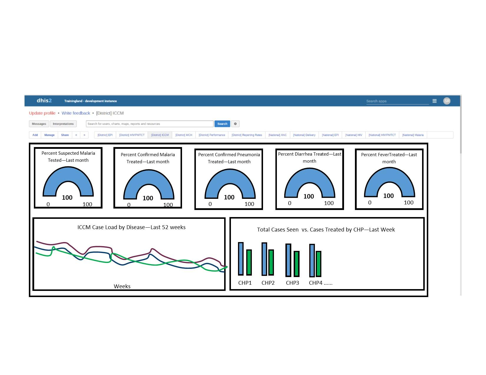

The mockup is then used to:

- Ensure all data elements and indicators necessary for the stakeholders is being included in the system.
- All indicators are able to be presented in the analytics shown considering the degree of granularity of the analytics. For example, the mockup of the bar charts above is weekly counts at community health post (CHP) level. That means we are able to calculate those indicators given the data we have available at the frequency desired (weekly) at CHP level. Alternatively, if we only had the data elements available to create that indicator captured monthly at facility level we would not be able to calculate the indicator to a sufficient degree of granularity as what is required (weekly and at CHP level).
- Guide the actual development of the live analytics and feedback mechanisms.

### 4. Drawing CHIS Data Flow in DHIS2

The goals of this process are:

1. Develop a clear idea of the desired state of the CHIS in DHIS2
2. Formulate how to harmonize parallel or redundant existing data flows
3. Resolve overly burdensome or unclear standard operating procedures
4. Formulate how to reconcile multiple reporting hierarchies into one.
5. Identify job aids or workflow support that could be incorporated into the DHIS2 data capture tools.
6. Develop new data flow diagram/wireframe

### 5. Developing Reporting Guidelines 

From the assessment and system design chapters, data flow from beginning to end is clearly defined. To develop data capture guidelines, start with the first event of the data flow and move upwards including all events, whether they utilize paper, mobile applications, or computers. **For each point at which data is captured or transmitted the exact process and responsibilities for how that event is achieved needs to be defined.**

For each step in the data flow define each event in the format in Figure 4.4.

------------------------------------------ ---------------------------------------------------------------------------------------------------------------------------------------------------------------------------------------------------------------------------------------------------------------------------------------------------------------------------------
| **Event** | ***Event name*** |
| :- | :- |
| Dataset/Reporting tool(s) |  The name of the data set or reporting tool(s) |
| Modality of transmission or entry |  Name the application that is used and on what device or outline the paper trail to data entry. (Remove this if the event is only data capture and not transmission or entry into DHIS2) |
| Responsible person |  This is the person/role that is ultimately responsible for the completion of this event. |
| Periodicity |  The frequency with which this event takes place. For example, "monthly," "weekly," or "quarterly |
| Event deadline |  When the event should be completed. For example, "The 10^th^ of the current month," "By 17:00 on Tuesday of the Current Week", or "By the 5^th^ of the first month in the new quarter." |
| Data transmission or entry incentive |  What is the reporting incentive and how is the incentive delivered? (if applicable) |
| Data quality checks performed |  Outline what are the checks that are performed during this event. This does not include the quality checks performed after the data has been submitted. |
| Access to reporting tools | How are necessary reporting tools (e.g. registries, reporting forms, applications, phones, etc.) stored, accessed, and replenished? |
| Narrative |  The narrative describes the event in long text. It is very specific. This could include best practices, instructions on completing the paper registries, instructions for ordering or making new registries, instructions for using mobile phones, etc. Think practically on what could form bottlenecks for data submission. |

*Figure 4.5:* Data Capture SOPs

#### Frequent Questions on Data Capture Guidelines

What if my CHIS has a paper trail from CHW or community levels to facility or district level?

Some CHIS do not have data submission at CHW or community level. In this event, paper records or registries are produced at community level and then physically transported to facilities or higher levels. It is important for the protocol to include *all* CHIS activities, even if they are paper trail, as the timeliness and quality of one reporting stage directly impacts the success of the next.

Can the data capture guidelines be made to follow the roles of CHIS users?

Yes. You may be more use to seeing SOPs based on programmatic roles, while these data capture guidelines are based on the data flow. Many countries and programs incorporate the data capture guidelines into a larger programmatic SOP organized by stakeholder roles/titles (e.g. CHW, CHW Supervisor, District Health Officer, etc). The data capture guidelines can be incorporated into this format as long as a sufficient level of detail is provided for each event performed by the stakeholder.

What if my CHIS uses paperless patient registries at CHW level?

In some CHIS, CHWs may be tracking individual patients completely paperless via DHIS2 tracker application or similar application on an android or feature phone. In this event, there will not be a paper registry where information is initially recorded and there will be no production of periodic, aggregate reports. In these cases, typically it is best to consider the patient-CHW interaction and the capturing the patient data as a single event to be included in the data capture guidelines. Keep these factors in mind:

- In some cases, tracker use significantly increases the reporting burden of the CHW, so in high patient volume settings patient tracker may be too burdensome. However, configured as job aid for the CHW employing program rules and skip logic using the tracker application can reduce the reporting burden, increase data quality, and support CHW service delivery.
- Tracker will provide much more granular data and has shown to be appropriate at community level in disease elimination, epidemic control, expanded immunization programs, referral tracking, and neonate tracking.
- At community level, tracker should only be used if there is a targeted action requiring data from a single tracked entity. The specific response to that data should also be defined in the data capture guidelines.

### 6. Develop CHIS Meta-Data Dictionary

A meta-data dictionary is used to describe all of the meta-data attributes. The enables that system users and administrators understand the meaning and purpose of each meta-data item. A reference metadata dictionary is available for download from the DHIS2 CHIS resources based on the WHO and UNICEF recommended guidelines for monitoring CHW data, including core indicators, datasets, data elements and recommended disaggregations. 

### 7. Perform DHIS2 Configuration 

The final step after compiling a meta-data dictionary to actually perform DHIS2 system configuration. 

**See the CHIS System Design chapter for more information on DHIS2 configuration for CHW reporting and integration of community and HMIS data.**

### 8. Populate Prototype Database and Test

Thoroughly testing a CHIS is critical prior to deployment. There are several goals of testing:

- Test indicator calculation - mock or legacy data should be imported into the prototype database to test if all the indicator calculations are correct.
- Use acceptance (analytics) - to test if all stakeholders are satisfied with the analytics, dashboards, and feedback mechanisms user experience.
- User acceptance (data entry) - to test if all stakeholder performing data entry are satisfied with the data entry user experience. It is also necessary to test if any skip logic, validations, alerts, workflow support, or job aids are working and users are satisfied.
- Bug capture and reporting. With virtually all new database there will be glitches or bugs. It you are thoroughly testing your database then most of these bugs will be noticed. It is best to resolve all bugs before you deploy your CHIS to scale. Bugs can be reported DHIS2 JIRA ([[http://jira.dhis2.org]{.ul}](http://jira.dhis2.org))

> Important
> 
> **Have a "sandbox" database for testing**
> It is a very good idea to have a cone of your production database to perform testing in. Any change you make to your productions database should be tested first in your "sandbox" prior to being done in your production.

> Important
>
> **DHIS2 version updates**
> It is best to keep up to date on versions of DHIS2. There is a new version of DHIS2 released every four months. Typically, it is best to keep one or two versions behind the latest releases. If you do not keep up with the releases then you may find it difficult to find people to support your version of DHIS2 when you do have serious problems. Upgrades need to be planned well in advance. The same testing process outlined here for a new database can be employed when you have upgraded. Please remember that something almost always breaks or stops working when you upgrade a large production database so please be plan and test thoroughly before upgrading.

### 9. Deploy

There are many ways to deploy a CHIS. The deployment strategy is dependent on many things like training strategy, scale of the CHIS, etc. In general, there are two deployment strategies, "The big bang and a phased roll-out. Both strategies tend to ultimately cost the same amount of resources.

1. "The Big Bang" - This deployment strategy is often used in situations where development, testing, and initial training of users can or must be achieved quickly. This typically a CHIS small in scope with a lot of implementation support staff working initially on it. This strategy is preferred in situations where rapid crisis response is necessary like in a disease outbreak where community data is needed for epidemic control. Because of the rushed nature of this strategy, there will be technical issues that are identified post deployment that may hinder system use.
2. Phased Roll-out - This is the most typical approach to deployment of the CHIS where deployment is done region by region. Depending on the scale of the CHIS this may take years, but it will result in a much more stable, well tested CHIS.

## Tiered Technical Support to CHISs

To provide support to the CHIS, the technical central unit must be able to capture, catalogue, and process all support requests, system errors, and flaws (also known as "bugs"). In most large information systems, a multi-tiered support system is required. Multi-tiered means simple issues are able to be addressed by lower level supervisors and more difficult or complex issues are moves up the tiers until they reach someone who is able to address them. Below is model of a CHIS tiered support system with an example issue that that tier may be expected to address.

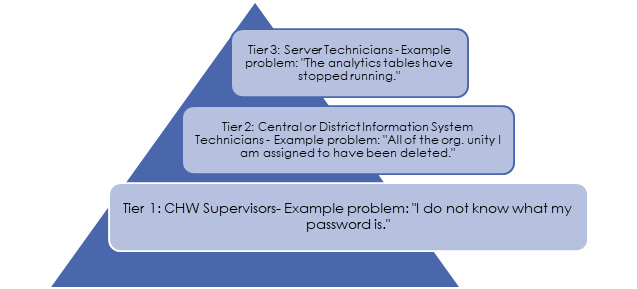

*Figure 4.6*: Model of a CHIS Tier Support System

The vast majority of issues requiring support will be simple issues that should be able to be addressed by the first tier of support. Often this first tier is the CHW's direct supervisors. This tier should be able to address simple hardware and software issues. If the CHW supervisors cannot resolve the issue that will then have to escalate it to a higher tier.

Tier Two requests are addressed by are often addressed by district level or sub-national information systems officers, who are trained to manage system configuration issues and all advanced issues around the user interface, data imports and exports.

Tier Three requests are typically addressed by central level IT support persons. They should be able to respond to any back-end maintenance requests.

Many countries with very large-scale CHIS will have more tiers than three. While, smaller programs may have fewer. Regardless of the number of tiers, it is essential that support requests can be submitted by any user directly through either their DHIS2 instance, phone or by email. Using the messaging application, a user may message to the 'Central Technical Support' user group for their sub-national technical support group depending on how the tiers are composed. The "Technical Support" user group is typically made up of central level technicians. Similarly, they could call or email the technical team directly. Once a request for support has been sent to the technical team should acknowledges receipt of the request within a short time period like 12 hours

*Best Practice*

Have a 24-hour technical support hotline and support desk user group in DHIS2 maned by central level HMIS support staff. When users of the system have difficulties using the system if they feel that they have no avenue to receive technical support they may ultimately quite using the system. A 24-hour, toll free technical support hotline and support desk can give users a sense of support and resolve issues on the fly. Additionally, for CHIS users with a computer they can use the DHIS2 messenger to send support requests to the support desk user group. Below is an example of South Africa's guide to using their support desk build into DHIS2 messenger.

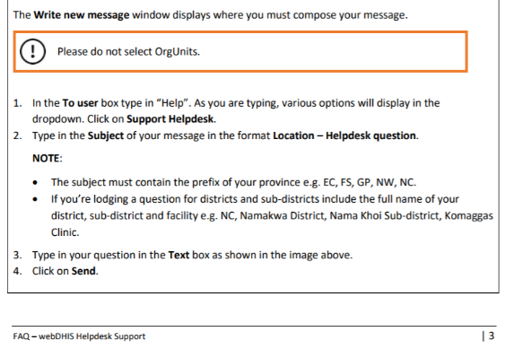
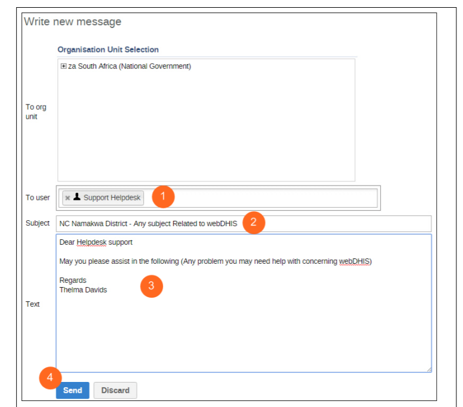

## Some Design Guidelines for More Sustainable CHIS

In this section, we discuss some design guidelines to develop more sustainable CHIS. A running theme across these guidelines is our effort to shift the focus from a more supply side approach to one that is more grounded in a demand side based thinking that is human-centered and focused to reducing the data burden of CHWs and adding value to their everyday work. These design guidelines include:

1. Build the CHIS based on a participatory design approach
2. Have an architectural thinking to design at the core
3. Design CHIS based on an overarching framework of data governance and standards
4. Design CHIS to support local action rather than enabling more control and surveillance from the top
5. Build CHIS based on existing infrastructure conditions, that necessarily must be hybrid in nature
6. Plan for incremental evolution of the systems, and not seek to design based on a "clean slate" approach

These guidelines are now discussed in some greater detail.

### Participatory Design Approach

A participatory design approach assumes that the end users are not just passive providers of data and recipients of systems that are "designed from nowhere," but are actively engaged in their co-construction together with the design and development teams. While traditionally, various techniques have been described to enable participatory design (storytelling, focus groups, interviews, mock ups, etc.), these techniques have been developed based on assumption of co-location, single systems, largely situated in single organizational settings. However, the diverse settings of CHIS in terms of scale, prior experience with computerization, levels of literacy and extreme diversity, require these techniques to be sensitively adapted and extended.

The advent of web-based systems implies that the designers and developers become more geographically and culturally remote from the users, and further challenges the use of traditional participatory design techniques. Appropriate approaches to enable participatory design need to be customized to existing contextual conditions, which may also involve the use of online methods coupled with some co-located means. This is of course easier said than done, given some of the challenges discussed, but needs to become an integral part of the project planning process.

> **Example**
>
> **Case Study: Participatory Design in India**
> A HISP project in rural India ongoing is aimed at building patient centric systems for primary health care. This project was carried out by a collaboration of the HISP team from the University of Oslo and India, and a public health team from the Post Graduate Institute of Medical Education Research (PGIMER), Chandigarh, India. This collaboration enabled the creation of multi-disciplinary expertise required for system design.
> 
> To ensure the active involvement of the CHWs a "living lab" was established in one rural clinic, which was a designated study area for PGIMER. The living lab has become a site for the design study team to work with the CHWs and medical doctors to understand their everyday challenges and needs. By situating the living lab in the clinic, the CHWs also developed a strong ownership of the system, as they saw themselves integral to its process of evolution, and both sides could mutually understand the perspective of the other. The developer team could gain insights into the world of the CHW which they otherwise would never have obtained through the use of traditional design approaches.
>
> For example, during a discussion the CHWs said they wanted the system to generate the primary registers. This was a novel insight, as the assumed approach took the primary registers as a given to the situation, and started the design based on existing data collection formats. This insight structured the design of the system in a novel way, which when completed provided more value and increased job satisfaction to the CHWs. 

The important takeaway from this excerpt is the need to develop approaches to design in context which represents the world of work of the CHW. The living lab is one such approach, and there will surely be others. In different contexts, appropriate approaches will need to be constructed to enable these processes of contextualized design.

### Architectural Thinking at the Core of Design

Architectural thinking in simple terms implies a systems and holistic thinking which seeks to ensure that the different existing systems can "speak with each other" in a relatively seamless manner. This speaking with each other is not just a technical problem requiring technical solutions, but involves complex institutional challenges of getting health programs and people to speak with each other. This undoubtedly is more challenging than building the technical solutions, and needs to come as the primary effort.

Another characteristic of the architectural thinking is that the system development is seen as a long term and evolutionary approach, and thus decisions should not be taken based on a static and one time thinking. An implication here is not to take decisions at one point which will prevent you from taking other choices in the future which may become available and be preferred.

For example, taking the decision to use a proprietary platform may prevent you from building interoperability with other systems in the future. This requires a forward-thinking approach, which seeks to predict future informational requirements, and also be on top with technological trends, and what kind of new opportunities that come up in the future. The system design should ensure we are able to keep on top of these challenges and are able to leverage on the opportunities when they do come up.

> **Example**
> 
> **Case Study: Collaborative Design in the Living Lab**
>
> Taking another example from the living lab project, a starting point of the design was to first understand the different systems the CHWs were currently engaged with.
>
> CHWs were dealing with 9 different systems (computer and paper based) which involved 22 primary registers, and 30 monthly reports, with a lot of overlaps and redundancies between them. A process of mapping the redundancies listed out all the data elements in these registers, identifying the existing duplicates and creating a consolidated list of all the non-repeating data elements. This list was then used to develop the metadata definitions to be customized in the DHIS2 database. Further, this metadata was then adapted to the national MDDS (Metadata and Data Standards) to ensure scalability. In this way, linkages between the different systems were identified, ensuring linkages at the data collection level, which then enabled generation of the primary registers, the main concern of the CHWs.
> 
> This process was carried out jointly by CHWs and the system designers, who as a team could identify unwanted or unused elements which would not have been possible by the designers alone. This process also ensured that the designed CHIS would be integrated with the everyday work practices of the CHWs, was primarily aimed at providing added value to CHWs through reducing their work burden. Further, it was designed to be expanded in the future, for example by aligning to the national standards, in terms of generating all required reports for upward reporting and to support local action.

An important takeaway from this excerpt is that system design is not just about creating technical artefacts as solutions, but should be grounded in the everyday work practices and artefacts in use by the CHWs.

### Design to Support Local Action

Local action refers to all the work being carried out by the CHW, which includes all information related work which relates to the recording, reporting and tracking functions performed by the CHWs. Local action represents the CHW doing recording and reporting, as well as local analysis of data and taking steps to improve health services delivery. While analysis is an important aspect of the CHW work, and one which we actively seek to enhance, we should not lose tracking of the recording and reporting functions which the CHW is obliged to perform. Expecting her to enhance her action taking function, while ignoring her recording and reporting functions, will be unfair to the CHW as she will be reprimanded by her seniors.

An important aspect of the design process is to understand from the perspective of the CHWs what they consider relevant local action (spanning her three key functions), and what outputs she needs from the CHIS to support her different functions.

From the example given above of the living lab, a primary need of the CHW was to support the generation of primary registers, as that would dramatically reduce their work burden, and free up time for provision of more effective care. Such an approach also exemplifies the advantage of taking a holistic systems approach rather than a narrow program specific and standalone. The benefits of adopting a holistic approach influences all the different roles of the CHW and all the health programs. On the contrary, an isolated stand-alone approach enhances fragmentation with limited benefits.

Chapter 3 provides more specific example of local use, so we are not repeating those issues here. The reader is advised to read that chapter for more specific examples of approaches to enhance local use.

### Adopt Hybrid Approaches

Hybrid approaches are those that cater to a multiplicity of settings, political conditions, and infrastructures. This is key to ensuring scalability and with it sustainability. Community conditions by design are variable, multiple, and relatively dynamic. The CHIS design process must necessarily be hybrid in nature and be capable of catering to this multiplicity. The hybrid approaches encompass technical, institutional and project management approaches.

For example, building a system that relies completely for its operations on internet connectivity only caters to a single environment -- the presence of continuous and reliable internet supply -- and is unable to functions in settings where this condition is not met. Such a system is unlikely to succeed in a scalable manner, as ideal internet condition is unlikely to be available throughout a province, or even all sub-districts within a district. An approach here would be to design a hybrid system which can run in both regions of internet availability or not. Allowing for offline data entry, and subsequent syncing of data with the server when internet is available, is a practical solution to deal with these multiple environments. The DHIS2 has adopted such functionality, which has contributed to its widespread use in a multiplicity of environments and settings.

> **Example**
>
> **Case Study: Different approaches in South Africa and Cuba**
> Different political settings also call for hybrid approaches.
> The HISP project in South Africa, experienced great success with bottom up, participatory approaches in the changing post-apartheid environment of where enhancing health worker environment was at the core of the health reform agenda.
>
> This same approach when transferred to the HISP project in Cuba turned out to be dramatically unsuccessful as the environment was extremely top down, driven by the office of the President. In hindsight, in this environment, HISP should have first obtained buy-in from the top, used this buy-in to create spaces to work with participatory design approaches at the field level, and gradually build ownership using that approach. In the absence of top-down approval, the bottom were fearful of engaging with the alien approach of bottom up design of HISP, and reacted by rejecting the project.

A takeaway from this discussion is the need to first analyze the given contextual conditions, then identify feasible approaches for design and implementation. Always be open to adapt and improvise on the way, and not to be dogmatic to a certain approach which may have worked in a different setting and time frame.

### Design CHIS based on existing strengths

The HISP approach to CHIS design has always emphasized the importance of the installed base, existing work practices and the CHIS history which exists, and seek to nurture or cultivate it over time. This approach uses the basis that all systems have a history and past, and there are deeply embedded systems and human behavior and attitudes, which can never be done away with.

This HISP approach is the opposite to the "clean slate" approach popularized by management consultants in North America in the nineties, and operationalized through the methodology of "business process reengineering (BPR)." This clean slate approach has been adapted by designers of CHIS where they are not sensitive to what already exists, but has not had much success, such as when adopted in Ethiopia in early 2000 during the health sector reform process.

The dominant assumption of BPR system development is based on a clean slate approach, which

1. Seeks to "obliterate" existing processes and systems and start from scratch, creating a clean slate.

2. Assumes that the existing work practices and attitudes of the CHWs is irrational, not modern, needs to be killed and replaced with techniques and technologies that are more modern and rational.

> **Exampel**
>
> **Case Study: CHIS design in Mozambique**
> A HISP project was introducing DHIS in the community health system in Mozambique While conducting training at the community level, various strengths of the CHWs were seen.
>
> 1. CHWs had strong abilities to multi-task, developed through decades of working in extremely resource constrained environments. For example, they could engage in providing care in addition to doing administrative tasks at the same time.
> 2. CHWs were very strongly linked to multiple local and non-work environments, such as the church. So, when the printer of the health facility was not working, they would go to the nearby church to print out the urgently required report.
>
> Instead of seeing the practices of the CHWs as being irrational and impediments to the introduction of new systems, it was recognized that these should be seen as potentials that should be leveraged upon to support the system introduction.
> 
> This exposed the limitations of existing approaches to design and implementation using the "clean slate" approach.

The takeaway from this discussion is the need to seriously consider history in the system design process, what the positive and negative potentials that come with it are, and how the positive potential can be incrementally leveraged upon and cultivated over time.

## Interoperability with DHIS2 in CHIS

### Why Interoperability?

Community settings have particularities such as poor internet coverage, uneven infrastructure and largely manual systems that make it very difficult to deploy a complete web-based system. There may be also multiple pre-existing systems, owned by different stakeholders which are performing distinct functions, and which have a high degree of user acceptance. As a result, there is a significant need for finding alternative ways through interoperability to bring the data into DHIS2 so required aggregations can take place, analytical dashboards can be created, and for tracking of patient based care. Interoperability aims at sharing data between two systems without disturbing them. In contrast, integration involves the merging of two systems into one, so only one system continues and the other one is not needed anymore. Given that in general there will a reluctance of a system owner to give up their system, integration will often meet resistance in the context of CHIS.

In summary, interoperability can be seen to respond to the following use cases:

- Systems like ODK and CommCare are being used in various contexts to collect individual and aggregate data, and this needs to be interoperated with DHIS.
- Due to ease of portability and better mobile network coverage (than internet), mobile phone could be used to collect data, and can be most easily transmitted through SMS. This SMS data then needs to be imported to the DHIS2, and further processed.
- Where manual systems dominate, Excel sheets could be used to enter data, and then these Excel files need to be sent into DHIS2 for further processing.
- Community based data could also be collected in hospital systems, where residents go to receive referral care. This hospital data, typically collected in an Electronic Medical Record kind of system, then also needs to be interoperated with DHIS2.

We provide examples of use cases that represent these above conditions, and then provide a technical overview of how interoperability was achieved with DHIS2. For each of these use cases, we also present some technical guidelines on how interoperability can be achieved in other contexts.

## Use Cases of Interoperability

### Open Data Kit (ODK) -- DHIS2

The National Institute of Epidemiology, Chennai India is building a system on DHIS2 for fever surveillance. The aim is to record all cases of fever reported in a district to understand epidemiological patterns that underlie these fever cases. For this, they need to capture name based data on fever surveillance which they are doing using ODK. Each case records required demographic information and fever details. This data is then required to be pushed into DHIS2 for further tracking, generation of hotspots and creating required reports and indicators displayed through the dashboard. Thus, building interoperability between the ODK and DHIS2 was a core task in the system development process.

### CommCare -- DHIS2

In Nepal the Hellen Keller Institute (HKI) is using DHIS2 as a nutrition tracking system. Derived from census population of households in selected districts of Nepal, DHIS2 captures individual level data on demographics and selected nutrition parameters. Based on this data interventions are carried out and impact on nutrition parameters need are monitored at the individual level. To collect this programmatic data HKI is using CommCare. The programmatic CommCare data needs to be interoperated with the census based data in DHIS2. Furthermore, DHIS2 is also being used for various other data reporting formats for other program needs. There is thus the requirement to build a common warehouse of data where these multiple programs data together with the nutrition data could be analyzed for cross-cutting indicators, and displayed through attractive and easy to use dashboards.

### Excel Import -- DHIS2

While the use of Excel sheets for community level data is a common use case in the context of CHIS, the use case discussed concerns comprehensive case based management of malaria. This project, implemented in Odisha state in India, involes the collection of data on malaria cases in a name based format using Excel due to low internet availability. The Excel files with name-based data is periodically sent to the higher authorities through emails or pen drives etc. At central levels the excel file is converted into a CSV and manually imported into DHIS2 via the data import application. DHIS2 is then able to automatically aggregating to higher levels in the HMIS. The DHIS2 thus contains both name based and aggregate data. Thus, there is a requirement to send the data in these Excel sheets to DHIS2 for monitoring and maintaining the data quality and also enable the connection between the different elements of entire longitudinal record of the patient. The challenge here was to develop a methodology for importing the Excel data into DHIS2.

### SMS Data Import -- DHIS2

The use of SMS based reporting is another common means of data collection and transmission in community health settings. WHO India initiated the use of SMS based system for supporting their Mass Drug Administration for LF in a campaign spanning 34 rural districts of India over an intensive one week period. SMS rather than web-based transmission was selected because many of the CHWs did not have the resources to access smartphones, so were not oriented to its use. Further, SMS was selected because data needed to be collected only for few elements (such as number of households visited, males, females and children administered the drug, and side effects observed). In this campaign, the CHWs would go house to house administering the drugs, recording the data on their phones, and then sending it by SMS which was received by the DHIS2, where dynamic dashboards were constructed to monitor coverage by day and geography.

### Open MRS and DHIS2 Interoperability

OpenMRS is the platform on which an EMR was customized for an integrated hospital management system for district hospital in Himachal Pradesh, India. The system collects individual level data as a patient goes through different encounters in a hospital including registration, billing, OPD, IPD, lab tests, pharmacy etc. This individual level data needs to be aggregated (by hospital, department, period, etc.) and then sent into DHIS2 where aggregate reports, for morbidity and mortality can be prepared, hospital management and administrative indicators (for example, average length of stay and bed occupancy rates) can be generated, and comparisons across the different hospitals in the state can be made. This would not have been possible through the OpenMRS system alone, and so the technical task involved building interoperability between the two applications, and ensuring a process to synch the two databases at predefined intervals.

After presenting these different use cases of interoperability with DHIS2, in the next section the technical approach for this is discussed including guidelines for implementing the interoperability solution.

## Technical Approach for Interoperability

### For ODK and CommCare Cases

A similar process of building interoperability was followed in both the cases. A tool (Data Motor) was designed that requests for data from the CommCare/ODK application. Data is pulled out from the API through this pool and is pushed through the API again to DHIS2 application. The diagram below depicts this process.

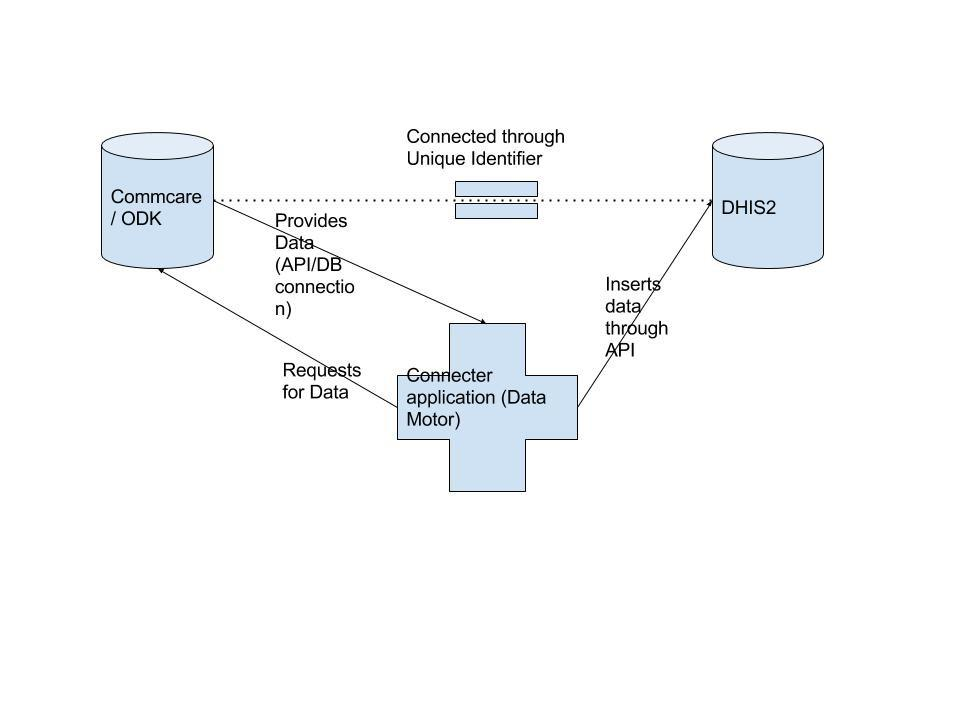

*Figure 4.6:* DHIS2 Interoperability Model with CommCare and ODK

#### Guidelines for Implementation

1. Identify "**data points**" which needs to be shared from the data collection system.
2. Find out where they fit in the data model of the system from which they are to be **pulled**.
3. Find out where they fit in the data model of the system into which they are to be **pushed**.
	- In case of DHIS2 these are Data Elements, Periods and Organization Units
	- In case of ODK and CommCare these are questions/data entry prompts.
4. Map the two data models based on a **unique identifier** between the two.
5. Make the data motor
	- Fetch data from one data collection system,
	- Restructure the data to fit the data model of the other data collection system
	- Push the restructured data in the other system
	- Keep unique identifier in both systems for integrity checks
6. Set up the data motor to auto run periodically
7. Keep a log of all activity that the motor does for monitoring and debugging.

### Excel Import to DHIS2

An Excel micro has been created in DHIS2 with a predefined Excel template. The data from Excel is mapped to UIDs for data elements, organization units and periods for which the data which needed to be imported in DHIS2. The mapping in Excel should only have to be completed one time. Once the mapping is done the data can be maintained in the Excel sheets and imported in DHIS application when internet is available. The data is sent to DHIS2 through the UIDs being mapped in the Excel sheet and sent to respective program and program stages in DHIS2 in the case of name based data.

**Guidelines for Implementation**

- To maintain the data quality, minimum open text fields should be used in the format. More of drop-down options should be created so that user can select the required options which can be easily linked to DHIS2 data values.
- The sheet should be protected so that the user cannot add any new fields or make any changes in the application.
- Validations same as in DHIS2 need to be built in the Excel sheets.
- Organization unit codes are a preferred option for sending the data to DHIS2 to avoid any mismatch in the organization unit names.
- It is important to have a unique identifier for each record in DHIS2. This unique identifier can then be used to link the longitudinal records (program stages) of the patient so that the patient can be updated as and when visits are made and duplicates are not created.

### For OpenMRS-DHIS2 Interoperability

The interoperability module from the EMR based on OpenMRS to the DHIS2 was developed by the HISP India team to support an architecture where the name based encounter data was stored in the individual hospital's server, would be aggregated through queries and the data would be moved to the state repository (DHIS2) through a data exchange module. The architecture envisaged was that the name-based data was retained at the facility and aggregated data moved on to the state DHIS2 portal through the data exchange module.

The interoperability standard (SDMX - Statistical Data and Metadata Exchange, initially promoted by WHO and later replaced by the ADX standard), data was exchanged between OpenMRS and DHIS2, and all metadata (data elements and facilities) were synchronized taking DHIS2 as the base and aggregated information into it using DHIS2 API services on periodic basis. The reports exchanged included all national disease program reports, reports on disease profiles for the population, and stocks and inventory reports. Implementing this module was a tremendous challenge. Technically, creating the data transfer required writing hundreds of queries to aggregate and push the data into DHIS2. Initially, it was done manually, where some staff had to just push the export button. When this was not done regularly, this transfer process was automated to enable it at a fixed time everyday where the data would be synched. This too was problematic, because of the intermittent and unreliable internet and power supply.

The architecture for this data exchange is sketched out in Figure 4.7.

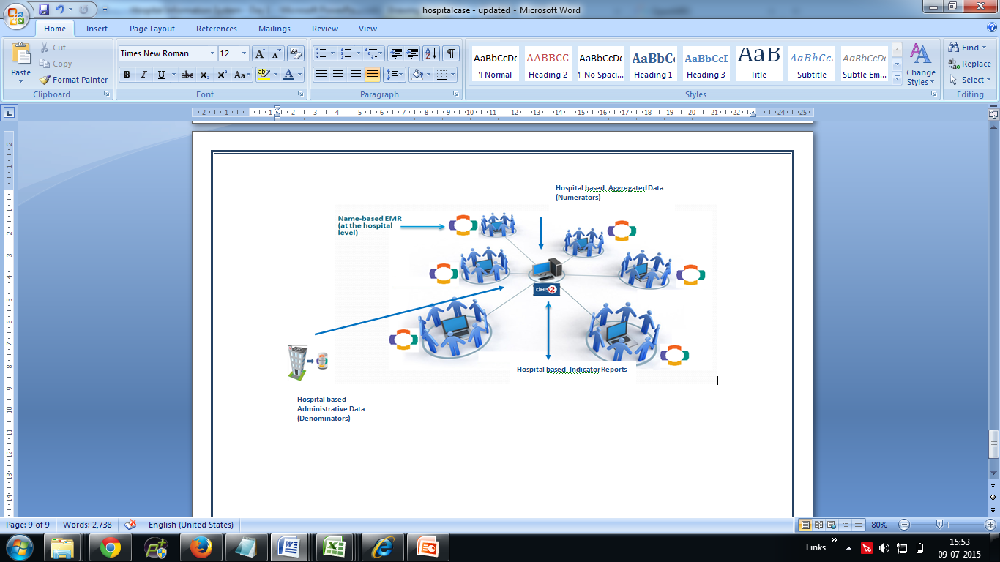

*Figure 4.7:* DHIS2 interoperability with OpenMRS

#### Guidelines for Implementation

- All the data which needs to be transferred to the DHIS2 requires to be defined as data elements in the DHIS2. Data sets need to be created for the aggregate reports required.
- All indicators need to be created in the DHIS2, and also all numerator data (such as number of beds and number of doctors) need to be stored in the DHIS2 which are then used for the generation of indicators.
- Queries need to be written to aggregate the name based data from the OpenMRS database, and then post it into DHIS2 as the defined data elements.
- Reports and dashboards need to be customized in the DHIIS2
- An automatic scheduler should be created to enable periodic data exchange.

### SMS Import in DHIS2

SMS gateway and APIs are required for receiving the SMS in the DHIS2. If feedback messages also need to be sent (to confirm receipt or not of the SMS in the DHIS2) to the user, an API for sending messages will also be required. The messages need to be sent on a specific number and the same could be read for a predefined set of data items. Separator such as dot (.) or space ( ) could be used for separating the data elements while sending the messages to make them easier for the user to understand. The phone number of the users need to be registered for the respective organization units to which they belong, such that when the SMS is received from the same number, it can be registered at the organization unit.

#### Guidelines for Implementation

- While using the SMS functionality, the data elements to be reported should be minimal for the user to remember the sequence. The sequence and format should be provided written on paper to the CHW for ease of use.
- It is significant to have the phone numbers registered for all the users, and it should be ensured that the user sends the message through the same numbers for the data to be registered at the correct organization units.
- The pictures below describe the different screen shots the user will see in the process of sending the SMS and receiving the confirmation message.

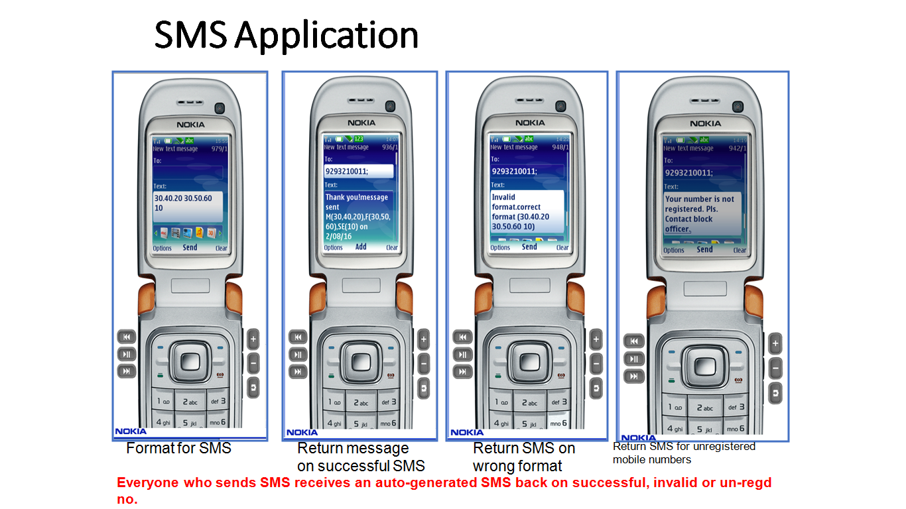

*Figure 4.8:* Example SMS Import into DHIS2

## Use cases

### India Use Case - Mobile Based Reporting by CHWs

Mobile based reporting is a vital part of CHIS in many contexts. In this section, we discuss three different modes of mHealth based reporting from the community level in India.

1. SMS based reporting for HMIS in Punjab, India.
2. SMS based reporting for supporting cancer survey in Punjab, India.
3. GPRS based reporting for HMIS in Himachal Pradesh, India.

In each case we provide details of the technology, the implementation and capacity building processes, the issues and challenges faced and how they were resolved.

#### SMS-Based Reporting for HMIS in Punjab, India

In 2011, the national MoH initiated a pilot project across 5 blocks in 5 different states covering about 200 CHWs, to test the technical efficacy of mobile based reporting from the community level.

A simple JAVA based application was developed in J2ME and installed in the mobile phone of the CHW. A modem with a SIM was installed at the block (sub-district) level to receive the messages. A software "SMS Listener" was installed in the computer of the Block Program Manager along with the offline DHIS2 application. When the CHW sends the report through the mobile application, it comes through a SMS. The SMS listener installed received this SMS in Binary form and imported the data into respective organization unit by recognizing the mobile number from which the message has been received. The mobile number of a particular health worker was entered in DHIS2 offline application for their respective organization units. Some useful lessons were learnt from the pilot. There were technical issues encountered such as the clogging of modems, signal issues in hilly areas, and some data loss. Some CHWs were reluctant to use the mobile as they felt more comfortable with paper based reporting.

Overall, the pilots were seen to be successful, and two states Punjab and Himachal Pradesh came forward for a full statewide scaling for this mobile based reporting

#### mHealth-Based Reporting for HMIS in Punjab

Punjab state has about 5000 CHWs, with each sub-center having 2 ANMs (Auxiliary Nurse Midwife), one regular and the other contractual. The state provided each ANM with a mobile phone (Nokia 2330 Classic) to enable reporting the monthly routine HMIS data.

Unlike the pilot which was based on the offline DHIS2, Punjab went for an online application, developed in J2ME (JAVA) and in Punjabi language. The application was installed via Bluetooth in the mobile phone of the ANM. This was a simple SMS based solution. It included three forms to be filled by the ANM: Daily Reporting, Monthly 1 & Monthly 2. After filling these forms, the ANM sent her data through SMS on a number for which the SIM was installed in the Modem at the state's server. After importing the data in DHIS2 an Acknowledgement SMS was is sent back to the ANM for the confirmation of the report. There were two modems installed at state server one modem each for 10-10 districts.

*Figure 4.9:* Example J2ME Data Entry Application

This was an online DHIS2 application with the three datasets. The mobile number of every ANM was registered on the sub-center on which the ANM was posted. As soon as the message is received from a number it is converted into an XML file and imported in DHIS2 for the respective organization unit on which the respective number is registered. Since every sub-center had two ANMs, under each sub-center two more organization units were created ANM1 & ANM2 and the numbers were registered in their respective user names. This mobile project ran in parallel to the state HMIS application on DHIS2, and it was expected that after a few months of reporting all community data in the DHIS2 would only come through the mobile reporting.

Along with mobile phones a CUG connection was provided which included a Rs 200 credit for the ANM to enable SMS reporting along with free calling facility.

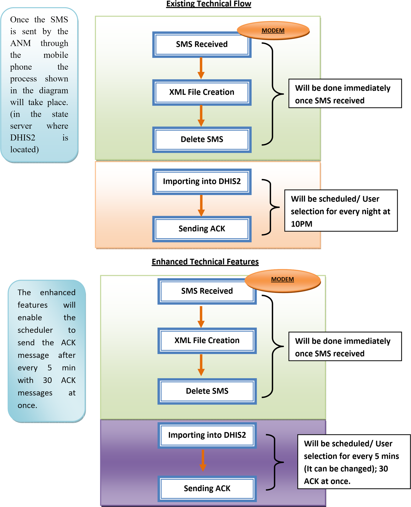

*Figure 4.10:* Punjab Use-Case Data Flow Model

The process of implementation involved the following steps:

- Procurement of Hardware: Nokia 2330 Classic with SIMS card and EZ-SMS model modem for receiving the SMS.
- Finalization of formats: Three formats were finalized: Daily Dataset, Monthly 1 and Monthly 2 with 10, 56, and 83 data elements respectively.
- ANM Classification: The ANMs were classified as ANM 1 and ANM2.
- Installation: The JAR file of the three datasets were installed using Bluetooth in 5000 mobile phones and pasting of stickers on the back of mobile phones mentioning ANM names and sub centers. This process took place at state head quarter over one and a half months.
- Distribution of mobile phones in districts: After installation, the mobiles were sent in the respective districts and distributed to the ANMs prior to the trainings.
- Preparing Training Manual: The training manual in Punjabi was then prepared demonstrating the use of application through screen shots and diagrams, and these were distributed during the training session
- Capacity Building: The trainings on the use of the application were carried out over 2 months covering 4545 health workers and done at state/district/block/sub center levels. Two-member teams were created each covering 5-7 districts. On the first day, a district TOT was done, followed by block level trainings.
- Handholding Support: One-year handholding support was provided through a 3-member team placed at the state head quarter.

#### Issues and Challenges Experienced

**Daily Dataset:** Initially the ANMs showed resentment towards the application, which became easier with time. Key to this resentment was the Daily reporting which included data elements representing activities done on mainly on Wednesdays in the EPI sessions, which meant that other than on Wednesday, the elements were reported as zeros. This pattern, the ANMs felt would be perceived by the administrators that they were slacking off on other days. To deal with this rising resistance, the administrators had to ultimately scrap daily reporting.

**Age Factor:** The elderly ANMs were resistant, as they had not used a mobile phone before. So, making these ANMs learn the application was a difficult task.

**Other Issues:** Signal issues, balance related issues and delays in confirmation reports from the server side was experienced due to load on application

**Modem Clogging:** The modems were receiving nearly 5000 SMS daily which put a huge load on the state server and modem, which delayed the sending of the acknowledgement message which created a panic among the ANMs if their reports were received or not. Also, the messages started failing because the mobile operator kept the unreceived messages only for 3 days on its server. Two more modems were installed for sending the acknowledgement messages to enable huge load sharing.

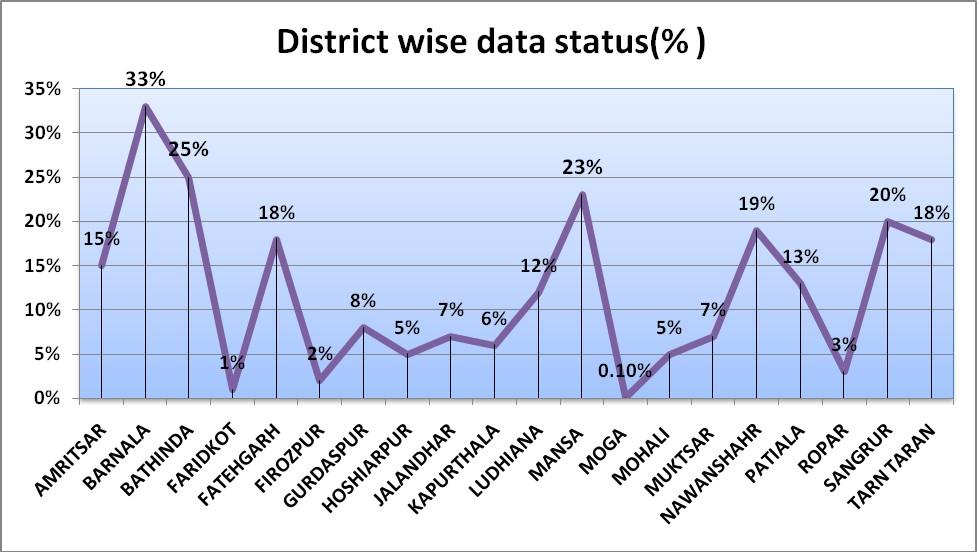
*Figure 4.11:A district wise data status percentage showing the reporting percentage in initial days.*

A district wise data status percentage showing the reporting percentage in initial days.

**Key Take-Aways:**

- Increasing reporting frequency just because the technology enabled that is not a good idea as it increased the sense of surveillance for the ANMs.
- Modems seemed ill-equipped to handle large scale SMS traffic, and a SMS gateway solution would have been more appropriate for a full-scale project.
- State is considering Android based application for HMIS reporting.

### Punjab SMS-Based Cancer Survey Reporting Use Case

After the success of the routine HMIS reporting in 2011, the state initiated in 2012 a new SMS based project for cancer survey for:

- To generate awareness on warning signs and symptoms of Cancer.
- To enable early detection of the disease based on the symptoms
- To identify disease incidence (actual number of cases) for further planning

The implementation process for the survey is briefly outlined:

- Survey in rural areas was done by CHWs, while in urban areas by nursing and medical college students
- The surveyor went to each and every household of his/her own area
- Survey was done using a questionnaire including proformas: One, for capturing basic information of each and every family member of a household, such as name, age group, education and family history of cancer, etc.; Two, if any person was found cancer positive or with symptoms of cancer name based details specific to the disease was collected, and reported through the mobile phone (JAVA SMS application) into the DHIS2.
- Same mobile phones (Nokia 2330) and modems were used for the survey.

The previously existing list of old mobile numbers were used, and then the new numbers used were added and registered in the DHIS2 application. The surveyor sent the SMS of a particular case, which was converted into a XML file and then imported in the respective organization unit, where a Unique ID of that particular case was generated and sent back on the acknowledgement SMS. The surveyor then noted this unique number on the particular form to track the case in the online application. The mobile application was used in the rural areas, whereas in the urban areas where the internet was more reliable, data was entered directly into the online application.

#### Data flow 

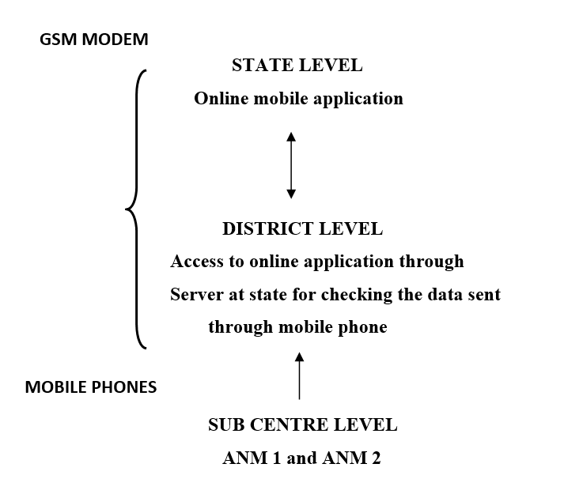

*Figure 4.12:* Data Flow from Sub-Center Level to State Level.

#### The Capacity Building Process

Before a state-wide roll out a pilot was done in one district over 2 blocks, and a similar implementation process to the HMIS was initiated. A 150-member training team was constituted, and state-wide training was completed in 2 weeks.

- Trainings were conducted at the district HQ or at the block level
- Two-three-member training team conducted training at each site.
- Attendance of the training participants was taken
- CHWs collected the mobile phones when they came for the training
- One member did the application installation, while the other focused on training, using an Emulator followed by a PowerPoint presentation
- In the hands-on session, the field worker was trained on how to fill all the fields included in the dataset, and send the data through the mobile.
- For urban areas, the form was designed on the DHIS2 Tracker. The individual record was entered on the patient registration screen and the output in form of reports can be viewed through reports available in the application

The data from rural area through mobile reporting was done smoothly but still the issue of modem clogging persisted. To cater to this issue one server administrator was placed at the state server room to monitor the SMS traffic on a real-time basis. In urban areas, the user was not able to save the data in the online application because of the huge database. To address this, an Excel import functionality was introduced to enter proforma 2 data in the Excel sheet which was then pulled into DHIS2.

### Himachal Pradesh SMS-Based HMIS Reporting Use Case

After a one block pilot, the state agreed to go for a whole state pilot. Learning from Punjab led to a change from SMS to a GPRS based application. Some of the learnings from the HP pilot included:

- GPRS recharge was more expensive than SMS
- GPRS connectivity poor in hilly and remote areas.
- State did not give phones to the ANMs, and their existing phones were used.
- The GPRS based solution was not compatible on many of the user phones and also incompatible with the Opera mini browser. Out of 201 mobile phones only 74 phones were compatible i.e. only 37%.
- The ANMs found it difficult to operate a web based solution and the GPRS settings to be done on the phone were cumbersome for the ANM

After the learnings from the pilot, the state agreed to go for a J2ME application. The Monthly Sub Centre form was selected for the reporting. The state subsequently decided to buy phones for the ANMs, and chose Nokia C1-01, and Rs 50 was given to each ANM for charging. Similar to Punjab, a J2ME SMS based application was developed for sending the reports. But the formats chosen were not only for sub-center like in Punjab, but multiple formats were selected:

- SC Form-- For sub center health worker (monthly)
- IDSP -- For sub center health worker (weekly)
- PHC Form 1 & PHC Form 2 -- For PHC health worker (monthly)
- CHC Form 1 & CHC Form 2 -- For CHC health worker (monthly)
- Mortality -- For SC, PHC, CHC health worker (monthly)

JAR files for all these formats were created, and installed on respective facility phones.

#### SMS Gateway Solution

From the learnings of Punjab implementation, it was found that modem was not a good choice for a full state wide roll out hence instead of Modem, SMS gateway solution was used.

- State's Department of Information Technology (DIT) already had a SMS gateway solution bought from a private player.
- The implementers contacted this provider to build the integration with DHIS2. But then the State changed the provider to the government IT department. This required the integration to be redone.
- The server and SMS gateway were both placed in the state IT office which created many logistical challenges.
- The final application integrated with SMS gateway was deployed.

Some of the issues experienced included:

- In testing it was found that the government IT department did not support the compressed SMS which was previously used in Punjab.
- The server only supported the basic SMS length of 160 characters and for some operators it was only 110/120 characters. This was often insufficient, as our SMS was prefixed with a keyword HP NRHM.
- At the 161^st^ character, the server could not understand the second SMS which was not prefixed with HP NRHM and as a result the second SMS got lost, leading to complete data not being reported.
- So, the SC form was divided into three parts containing 100 characters each, but was not an optimal solution to divide one form into three parts.
- The application was then reworked with the second SMS at the 121^st^ character also being prefixed with the keyword HP NRHM. The second SMS would cut at 121^st^ character and the reporting became smoother.
- In some of the blocks, the ANM was responsible for multiple sub centers, but in the application only one mobile number could be assigned to one organization unit. To address this, a 4-digit Facility Code was introduced for every organization unit, which enabled one health worker to report from multiple organization units from the same mobile phone.

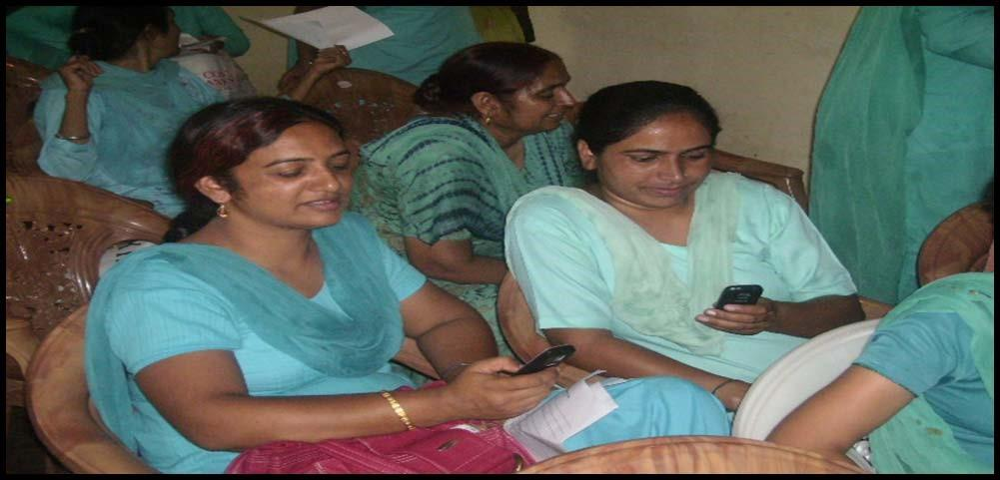

*Figure 4.13: ANMs going through the application in one of the training sessions in Kangra District.*

##### Capacity Building Process

- The training was done mainly at block level, through a 2-3-person training team.
- Attendance of training participants along with their mobile numbers was taken.
- Health workers collected their mobile phones when they came for training.
- One member was responsible for the application installation while the other was for the training on formats and the application.
- Mobile numbers were registered in the respective organization unit in DHIS2.
- One member sensitized the health worker to send the report using mobile phone through the Emulator, followed by hands on training.
- Orientation was provided on the formats, and described in the training manuals which were distributed to all health workers.
- Respective facility codes were also given to the health workers, and they were asked to send a dummy SMS to check the working of the application.
- Then this dummy data was deleted from the server side and the health workers were asked to start their monthly reporting on the reporting date.

##### Issues and challenges

- The vendor of SMS gateway was changed implying a rework of the whole integration process.
- The SMS was relatively expensive on the short code.
- The short code was changed which implied changing the short code in 201 mobile phones again
- Deployment and maintenance of the server was difficult due to the strict government norms such as no remote access to the server was provided, requiring a physical update to the server each time.

The table below summarizes the differences in approaches to the mobile health application in Punjab and Himachal.

| **Punjab** | **Himachal Pradesh** |
| :- | :- |
| J2ME SMS based | J2ME SMS based |
| Modem | SMS gateway solution |
| Only SC Form | Multiple forms for SC, CHC, and IDSP form S |
| State initiated the training dates | State conducting their own HMIS trainings along with Mobile district TOT. In district TOT dates for block trainings were taken. Application is being installed in block trainings itself |
| Postpaid CUG Tariff plan of Airtel | Pre-paid , no CUG, BSNL |
| Training only given to ANM and supervisor. | All health workers and supervisors were trained. |

*Figure 4.14:* Difference among India Use Cases.

