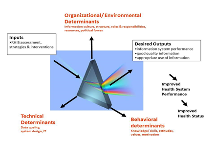
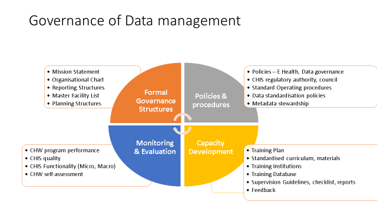
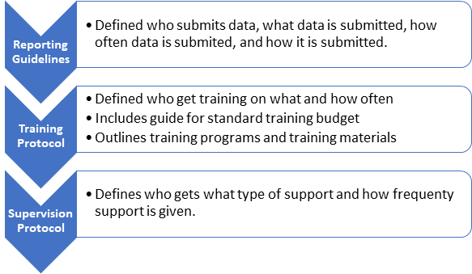
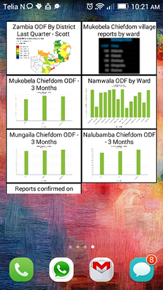
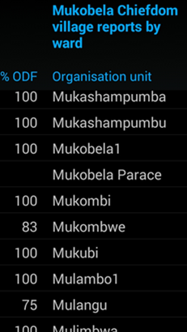
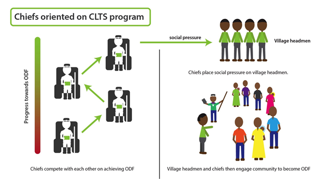
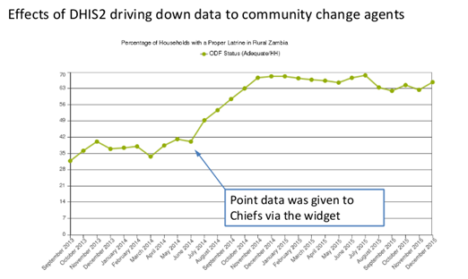
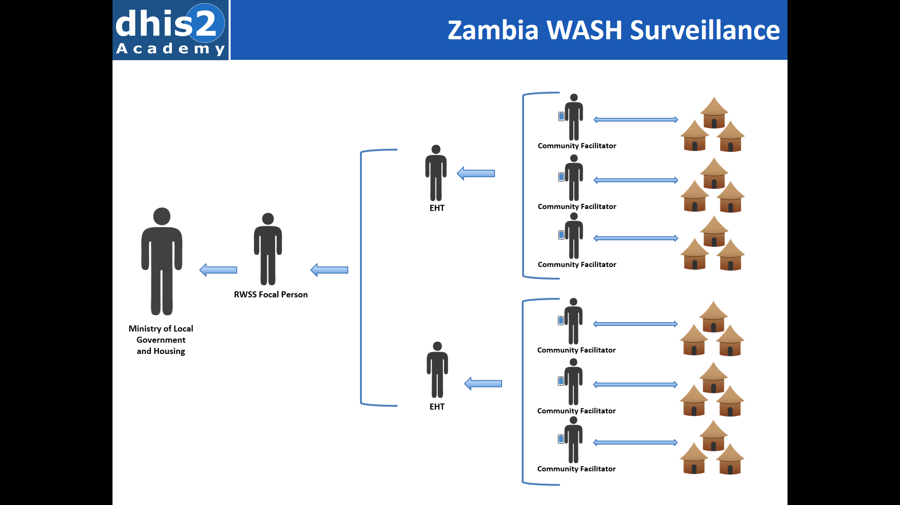
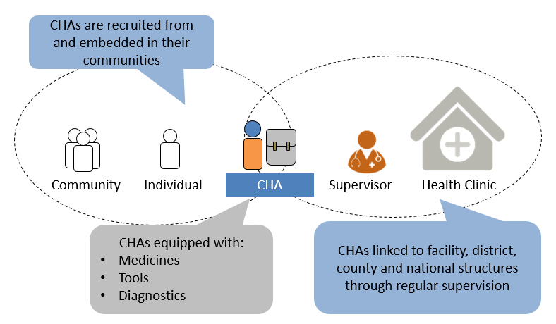
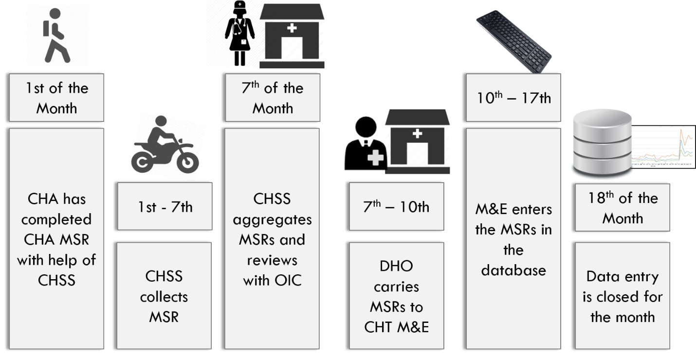

# Chapter 6 Sustainability and Governance

## Introduction 

Ensuring sustainability, broadly concerning how the CHIS endures over time and space is one of the most difficult challenge that policy makers and implementers have to deal with.

The key to long term sustainability rests with governance of data management, which is a cross-cutting issue that involves formal management structures, policies and procedures, staffing, and workforce development, monitoring and evaluation of the CHIS program. By the end of this chapter, readers should be able to:

*Learning Objectives*

-   Describe sustainability of CHIS, and its important facets.

-   Explain what "designing for sustainability" means and the important considerations in this process.

-   Explain the important role of governance in enhancing sustainability of the CHIS.

-   Describe the four components of governance for CHIS data management.

## What Do We Mean by Sustainability?

Sustainability of HIS in general, and CHIS in particular, is one of the most significant challenges facing designers, implementers, and policy makers of CHIS. Sustainability is a "wicked" problem, implying that if you try to address one of its facets, other problems will arise elsewhere. For example, to address the problem of CHIS continuity, a donor may be approached for funding. However, this may lead to other dependencies that can further put pressure on sustainability.

Some relevant characteristics of a sustainable CHIS include:

1.  The CHIS must be well integrated into existing organizational routines of work practices, budgeting, training, reporting, and infrastructure provision.

2.  On one hand the CHIS has to be well institutionalized, on the other hand, it must remain flexible, so that it can continue to evolve with the changing informational needs of the health system. This often leads to a dilemma of ensuring both stability and change, which designers and implementers have to constantly engage with.

3.  The CHIS must be integrated with other systems like the routine facility HIS to ensure it does not remain standalone and lead to double work for the CHWs. A standalone CHIS is a sure recipe for unsustainability.

4.  The outputs of the CHIS must provide real value to the key stakeholders, particularly the CHWs and their supervisors, but also mid-level and senior system managers.

## Ensuring CHIS Sustainability

To address sustainability the primary focus of CHIS design should be on strengthening the "demand side" conditions such as how the CHIS adds value to the CHW, how it is integrated with their everyday work practices, and their needs for ongoing technical and public health support, rather than the dominant "supply side" approach of merely providing computers, internet and training.

To make a CHIS sustainable, planners need to address key technical, organizational and behavioral factors. These are explained in detail in the Performance of Routine Information Systems (PRISM) framework[^8] and shown schematically in Figure 6.1 below.

*Figure 6.1:* The PRISM framework

In this approach, CHIS inputs such as assessments, interventions and strategies need to be addressed by technical, organizational, and behavioral determinants in order to achieve the desired outputs of a sustainable system that produces good quality information used to improve overall health system performance. A few aspects focused specifically on CHIS sustainability are detailed below.

1\. Technical Design

a.  ***Integrated CHIS***: There are a number of examples of CHIS developed as an integrated part of the overall HMIS, linked directly to other systems in the community, particularly the routine facility information systems. Using an architectural approach, the CHIS becomes part of the system, reducing CHW workload and adding value,

b.  **Increasing ICT infrastructure**: MHealth projects are increasingly based on internet connectivity, which is increasing exponentially allowing the use of android devices and mobile phones. However, This infrastructure must be carefully assessed, ensuring that the CHIS projects use available connectivity to its maximum while becoming fully operational.

c.  **Free open Source software (FOSS) systems*: ***Successful CHIS projects are developed based on free open source software such as DHIS2, ensuring interoperability with other systems. FOSS flexibility and iterative design processes allow ongoing changes required for the application. As a result, the CHIS can evolve with changing needs, constantly adapted to the needs of the end users.

2\. Human Behavior

Human behavior is the most difficult aspect of implementing a sustainable CHIS, and this aspect needs consistent attention. This phenomenon is increasingly being addressed by dealing with common issues with CHIS such as:

a.  ***Changing Facility Staff attitude to CHWs.*** Many health workers do not understand the role of CHWs and look down on their work as being second class. Major effort needs to be put into encouraging facility level workers to support the community health services, the CHIS and providing CHWs with necessary feedback, support and supervision. Facility staff also need to be involved in addressing sustainable remuneration of CHWs, building this into the budgets, to increase motivation, reduce dropout, and minimize attrition.

b.  ***Providing targeted feedback*** CHIS stakeholders need to see the practical value of data and increase data use through regular, targeted feedback that demonstrates data driven actions based on data. This further increases local demand for and use of data, stimulates ownership and promotes a culture of information use, creating the virtuous data cycle. (see figure 3.1)

c.  ***CHIS provides added value to end users***. For the CHIS to add value to the CHWs, the system design must be integrated with their work practices, reduce their work burden and add value for them to perform their work. A CHIS that is designed for local use and program monitoring rather the surveillance needs of administrators, means that CHWs and stakeholders are motivated to use the system.

d.  ***Ongoing CHIS support and capacity strengthening***. CHIS should focus on ongoing training, and provide support to CHWs in the many challenges they face when they use the system, providing feedback and support rather than criticism. CHIS supervision needs to encourage CHWs to use the system and make it sustainable.

3\. Organization

a.  ***Strong Data governance:*** Governance is key to sustainability of any CHIS. All community level stakeholders must agree to common data standards and high-level coordination based on accountability, transparency and local participation. Key to these standards, are common data collection formats that reduce the data burden of the CHW and minimise the fragmentation of the CHIS. These in the long run contribute to systems becoming sustainable and enduring.

b.  ***Plan for scaling up:*** Many CHIS projects are initiated as pilots with a limited timeframe and funding, known as "pilotitis". This needs to be avoided and scaling up planned for from the beginning with adequate resources and support. CHIS is about bringing about long term institutional and human behavior change, and systems take a long time to mature, usually beyond the short term "project" timeframe.

In summary, various reasons, technical, institutional, and human related, contribute to the CHIS becoming sustainable. Many of the reasons are inter-connected, requiring a holistic design and a health systems based approach to address sustainability.

Unsustainable systems do not scale, do not add value to the administrators who want data on the entire catchment population and not just from pilot areas. This challenge has been called the "all or nothing" consideration in HIS. Because the CHIS are not able to surmount these challenges, they don't add value, and thus do not attract the required support from the administrators. This vicious cycle of unsustainable systems that do not scale and thus add limited or no value to users, leads to poor support and further adds to the unsustainability of the CHIS.

## CHIS Governance 

Information systems are not what they used to be and are becoming more important as interdependence among systems increases and demands for social accountability increase. Health information systems are becoming more important as information and communication technology spreads and have a greater impact on health workers lives, with pressures growing for more and better quality data. This trend is occurring at the same time as other significant changes are taking place with demands for greater transparency, participation and accountability and a reduction in the "digital divide" between countries. The challenge to CHIS designers and implementers is to build relationships of trust between stakeholders and to deliver effective social accountability.

The growing expectation that it is right to be involved in decisions that affect one's future and the increasing knowledge about what is going on in the health system are a powerful combination to pressure health managers to improve trust between different levels of the system. Civil society, health workers and other stakeholders are increasingly demanding participation in decisions that are made about them, insisting on transparency about allocation of resources and using the internet and social media to voice these demands. At the same time international organisations are insisting on accountability, demanding value for money for aid projects.

These three concepts -- participation, accountability and transparency -- are the core principles of good governance and need to be applied to any development of a CHIS.

***Participation*** in CHIS governance emphasizes the broad participation of stakeholders in the direction and operation of information systems to develop a degree of consensus around decision making rules and capacity development processes. Participation implies increased citizen participation and greater community representation than traditional systems, creating opportunities for stakeholders to make meaningful contributions to decision-making, and seeks to broaden the range of people who have access to such opportunities. Technology may provide important forces leading to empowerment in participatory models, though face to face meetings remain important

***Transparency*** refers to the availability of information to the general public and clarity about government rules, regulations, and decisions. Transparent procedures include open meetings, financial disclosure statements, freedom of information legislation, budgetary review, and audits. Transparent CHIS governance, therefore, means not hiding things from community stakeholders, not engaging in shady deals and not making discretionary decisions. There should be clear guidelines to adhere upon, based on openness.

**Accountability** in governance refers to the collective responsibility of officials to preserve the public's trust in government by delivering on policy outcomes and safeguarding public funds. Accountable governance of a CHIS involves systems and coordinated actions through which the MoH (with donors) ensures the effectiveness, efficiency and economy of expenditure. It relies on tools that promote value-for-money, integrity and transparency in government, such as external control, internal control, sanctions, and enforcement. These tools create an enabling environment for greater accountability and improved governance.

### Governance implications for donors and government

While governance is ultimately the role of government, accountable governance is not the responsibility of one institution, but many entities and individuals across all levels, particularly local government for the CHIS.

The donor community (development partners) has a distinct role in supporting government to develop and implement CHIS governance guidelines around transparency, accountability and accountability. The donors wield considerable influence over the availability of resources and need to support the design principles, harmonize CHIS and end pilotitis. 

### Governance of Data Management

Effective data governance is the key to sustainability and is essential to all forms of routine HIS, including CHIS.

Data management governance is at the core of all information systems and is crucial for the sustainable functioning of a CHIS. This section is adapted from "Guidelines for Data Management Standards in Routine Health Information Systems[^9]" and readers are encouraged to refer to that for further details.

This section defines CHIS governance, provides an overview of governance of CHIS, and proposes standards for data management governance which, when applied, can strengthen CHIS performance.

> *Governance in data management can be defined as:* The development and implementation of administrative policies, procedures, and processes that define workflow, program inputs and outputs, management structure and oversight functions, and the methods and frequency of performance evaluation.

Data management governance dictates how the different components of the CHIS, at the same or different levels of the health system, work together to achieve a common goal - quality health data for decision making. For the purposes of this guideline, governance is applied largely to CHIS and is seen as a core function of high level management at all levels -that is, to monitor, assess, and strengthen these systems to facilitate improvements in service delivery

Data management governance ensures that data is of high quality - current, correct, consistent, and complete - as well as readily available to stakeholders (i.e., ensuring access to consumers, or those who require health information to inform decision making). In practical terms, that means putting personnel, policies, procedures, and organizational structures in place to ensure that data is accurate, consistent, secure, and available.

The process of data management governance for a CHIS should foster cross-organizational collaboration, facilitate structured policy making and balance ad hoc or narrow information needs with the interest of the Community health system. Interventions to improve governance should address the institutional, behavioral, and technical determinants of CHIS performance described above and focus on improving the desired CHIS output of good-quality data that is regularly used to improve service delivery.

Good governance requires commitment at all levels. It is not enough to have good structures, policies and procedures at the top. They need to be implemented by a dedicated team of well-trained stakeholders at the lower levels who have the motivation and skills to monitor and evaluate the CHIS based on the principles of participation, accountability and transparency.

*Figure 6.2* Governance of Data management

This model brings together in one place a number of concepts dealt with in other places in this guideline including:

-   Formal governance structures such as SOPs and strategic planning and financial systems, as well as oversight mechanisms such as technical working groups (TWG).

-   Workforce development, training, and supervision to identify best practices pertaining to CHIS staffing. (Chapter 5)

-   Policies and procedures for data management, with particular regard to standard operating procedures, data and metadata stewardship. (Chapter 4)

-   CHIS assessment, starting with general assessment questions and then exploring the Performance of Routine Information Systems (PRISM) model to see how CHIS converts inputs into appropriate outputs by influencing determinants of health outputs (organizational, behavioral, and technical) and their influence on overall health system performance.(Chapter 2)

-   Ways to promote a culture of information use is the core theme of this manual.

## Formal Governance Structures

CHIS governance is the oversight and monitoring function necessary to ensure that the CHIS functions as designed. Adequate governance allows the system to identify threats to performance and make necessary corrections, as well as to find opportunities to improve the CHIS and advance the aims of the system.

Governance structures are the formal mechanisms through which this oversight and local management takes place, including organizational frameworks, TWG (Technical Working Groups), and boards of directors. Governance structures oversee the management functions and inputs to ensure optimal system functioning

### Mission Statement

A mission statement is a formal expression of the purpose of the CHIS and its reason for being. A good mission statement states the reason for the organization's existence and includes goals, names primary stakeholders, and articulates how the organization provides value to stakeholders.

### Organizational Chart

An organizational chart is a diagram used to depict the CHIS structure and personnel. It helps organize personnel by identifying management control within the organization.

An organizational chart is useful for planning, resolving disputes, and managing change. It can be used as a baseline for planning, budgeting, and workforce modeling as it gives a succinct overview of the organization.

### Effective participation structures

CHIS oversight committees should be formed at each level of the system---that is, in each district and facility, to monitor CHIS system performance. The committee should be made up of CHIS stakeholders from health care institutions, implementing partners, local governments, and, where possible, civil society. These committees should facilitate the CHIS mission in their area of influence by monitoring performance, alerting CHIS management to strengths and weaknesses, and facilitating capacity building.

Village Health Committees are crucial to spread participatory processes to the lowest levels and these need capacity development, funding and regular feedback to become effective

The CHIS regulatory authority and data governance council (see policies and participation section) also need to have effective representation of community stakeholders

### Reporting Structures

In a CHIS, data and information begin at the service delivery point in the community and then flow toward the center to be shared with stakeholders to ensure that relevant information, based on quality data is available to those who need it in timely fashion.

Reporting structures include directives (SOPs) from CHIS management, which state who reports what and to whom, when reports are due, in what format and by which mechanisms.

In the context of CHIS, reporting structures clearly define:

-   The source document for reporting---that is, the individual client record

-   The standardized, aggregate, periodic report for reporting to the next level

-   Reporting deadlines---the date reports of various types are due to the next level.

-   Indicator calculation guidelines and compilation, and completing the forms

-   Reporting Procedures for sending the data to the next level.

-   Data quality review procedures

-   Sanctions (if any) for failure to meet reporting obligations.

-   Responsibilities of staff members to monitor reporting of performance and compliance, and enforcement of these standards?

### Master Facilities List

A master facilities list, in DHIS2, is a complete listing of all health service delivery sites in a country, including CHIS reporting units, with information about capacity and services available. It is dynamic and should be kept up to date as reporting units (CHWs) are added to or subtracted from the system.

A master facilities list improves record keeping by improving transparency and reporting efficiency. It minimizes duplicate reporting and promotes analysis and synthesis of data to improve decision making and health system functioning.

### Planning Structures

Planning is critical to ensure that CHIS resources are targeted efficiently and according to need, so that maximal benefit is achieved from CHIS investments. Planning *structures* refers to mechanisms for planning, such as periodic program reviews and needs assessments, combined with financial reviews and budgeting. Setting targets and situational analyses are also aspects of regular planning.

## Policies and Procedures for Data Management Governance

The management of CHIS data should be standardized such that the steps performed in turning data into information are the same throughout the system---from one district or CHW to another.

These policies and procedures are an integral part of governance and should be well defined, detailed, written down, and made accessible to all staff and other stakeholders in the data management process. Processes should be supported by policies that are well known and enforced, so that standards are applied uniformly across the system. The following are standards and best practices for data management policies and procedures.

### CHIS Regulatory Authority

For a CHIS to function effectively, all community role-players should routinely report, using standard mechanisms, to the CHIS. Regulatory authority often takes the form of public institutions empowered to regulate public health practice according to government imposed standards. This is necessary to ensure complete reporting from all sources of health service delivery including CHWs. However, the MOH often has no formal influence over CHWs to ensure reporting, other than the regulatory authority provided through government.

To efficiently target resources for disease control and prevention, CHIS managers need to understand where disease is occurring in the population and where services are being utilized. Without accurate targeting based on complete, reliable data, resources can be wasted by sending too much to areas that do not need it or too little to areas that do.

### E- Health and Information and Communication Technology Policies

ICT governance is essential to ensure that there are rules and regulations guiding use of electronic tools for managing and transmitting data and information, such as computers (hardware and software), networks, tablets, personal data assistants (PDAs), flash media, and communication tools, such as cell phones, modems, e-mail, instant messaging, and social networking.

A policy framework should be developed by the MOH to manage ICT resources in the system. What resources to acquire, how they should be used and by whom, when they should be upgraded or replaced, and how they are maintained should all be codified into the framework to ensure efficient stewardship of CHIS resources.

Because CHIS personnel should not be expected to have knowledge of maintenance and repair of ICT hardware and software, outside resources can be utilized. Reputable, licensed computer hardware and software vendors and repair firms can be contracted to maintain the ICT resources in the CHIS, reducing the burden on HMIS personnel and allowing them to focus on data collection, analysis, and use for planning and management.

### CHIS Data Governance Plan Based on Best International Practices

A CHIS governance plan refers to roles and processes that serve as a guideline for fulfilling, sustaining, and extending CHIS planning. A governance plan crosses all organizational layers, including stakeholders, administration, maintenance, strategy, policy, and support. ^\[1\]^

A CHIS governance plan should clearly state who does what, when, and how with regard to CHIS management, to management of data and information, and to decision making. A governance plan is useful in times of transition or change in the CHIS, since it provides a reference tool to clarify roles and settle disputes.

### Data Standardization Policies, Framework, and Procedures

Most countries still lack policies that bring together the various components of CHIS under a single unifying framework and provide clear lines of responsibility and functionality. CHIS management structures should be strengthened centrally and resources and authority decentralized to serve the specific needs of the people involved in implementing CHIS, particularly at the periphery.

The CHIS framework in both national health policies and strategic plans should encapsulate an integrated CHIS as part of overall health systems strengthening and governance reform, with buy-in to the plan from local government, political authorities, the MOH, and donors. The framework should recommend the pooling of CHIS expertise and resources into "one plan, one framework and one funding mechanism."[^10]

Countries also need a practical CHIS operational plan wherein all CHIS activities within the MOH are centrally guided, with clear lines of decentralized responsibilities in the spirit of administrative, financial, and operational decentralization toward districts.

As defined in the CHIS framework, institutionalized mechanisms should be developed for integrated CHIS data quality assurance (as measured by its completeness, accuracy, timeliness, and consistency), with validation rules for electronic systems and a team approach to data quality. In addition, these policies should:

1.  Specify interoperability of CHIS subsystems.

2.  Define human resource needs and capacity strengthening requirements.

3.  Define responsibilities for data collection, information flow, and use.

National policies should provide for a balanced, limited set of national CHIS indicators, which are regularly reviewed in a participative manner, with clearly defined numerators and denominators, data sources, baselines, and national targets. There should be a regular indicator review process in which program and subnational managers participate to ensure that the existing indicator set fulfills their needs.

Most countries have policies, laws, and regulations governing health services that, if applied, would greatly improve health system functioning. Too often inadequate resources or a lack of incentives mean that these policies are not enforced. Their implementation could be strengthened by the application of SOPs.

### Metadata stewardship

In CHIS, stewardship of metadata, or responsible planning and management of data about data, is needed to foster consistent use of data management resources and facilitate data mapping among computer systems. A data steward holds responsibility for maintaining a data element in a metadata registry. Data stewardship roles are common when organizations need to exchange data precisely and consistently among computer systems and to reuse data-related resources.

A data steward ensures that each assigned data element:

1.  Has a clear and unambiguous definition.

2.  Does not conflict with other data elements in the metadata registry.

3.  Is being used and is being used consistently in all interlinked computer systems; unused data elements are removed.

4.  Has adequate documentation on appropriate usage and notes.

5.  Is documented with regard to its origin and sources of authority.

Assignment of data elements to an individual promotes trust in systems where users can contact a specific staff member with questions on specific data elements.

### Data Quality Assessment and Auditing

CHIS data quality should be assessed periodically to enhance confidence in data and promote use of the data for decision making. Data quality should be assessed routinely for high-priority indicators as a part of regular supervision, and less often for other indicators. A periodic assessment of CHIS performance should include a data quality assessment.

### Data Standards

Governance refers to a process which outlines the process and mechanisms of how decisions are taken. In the CHIS case, the governance decisions concern how and why new systems are introduced, and their implications. As emphasized throughout this document, the CHIS is not a standalone system, but is linked by standards with other data collection processes and systems based on the six WHO building blocks.

Data standards are multifaceted in nature, involving both technical and semantic standards:

1.  Technical (syntactic) standards such as data transfer protocols.

2.  Semantic (nomenclature) aspects. Important semantic standards in the context of CHIS include metadata stewardship issues such as :

    a.  Meta data naming conventions for data elements, indicators, organizational units, shape files and others.

    b.  Reporting periods for different elements and the formats in which they are reported, that enable ease of compilation of data for the CHW.

A universal governance problem is that donors and NGOs want to introduce their own parallel community systems and data collection formats without being accountable to other standards and systems in the community setting. This lack of governance adds to the workload of the CHWs since all data collection work converges on them, and magnifies the fragmentation.

This situation is primarily due to the absence of a higher level mechanism for governance of data and standards. A typical governance mechanism is the establishment of a steering committee at the MoH level, and all proposals for the introduction of new systems should be approved by them. For example, they should need ensure that the new system being proposed is feasible, how it overlaps with other systems, what duplications are involved, the implications on data collection burden, compliance with laid out standards, and whether the required outputs can be met through existing systems. Such a systematic and thorough process of governance goes a long way to control duplications and redundancies and reducing the work burden of the CHW. However this governance needs to be enforced at lower levels, with responsibility and authority being given to districts and facilities to prevent parallel systems proliferating.

These guiding principles generated a community driven framework of standards, as contrasted with those which are typically imposed from the top with most often sub-optimal results. A framework of standards which represent everyday work, and are bottom up driven are more likely to add value and be accepted by the CHWs.

### Standard Operating Procedures (SOPs)

SOPs are the translation of policies and procedures into day to day life of the CHIS stakeholders. All stakeholders need their roles and responsibilities clearly defined in a set of SOPs that form part of the organizational culture of the CHIS. SOPs should describe clearly who should do what, when, and with what resources, to manage and maintain the CHIS.

There are many ways to define SOPs, and the actual SOPs vary tremendously from country to country and project to project. The SOPs outlined below represent some very basic, practical SOPs that could serve as the foundation for country or program specific SOPs.

#### Overview

There are three, basic SOPs outlined in this manual:

1.  Reporting Guidelines in Chapter 4

2.  Training protocol in the Chapter 5

3.  Supervision protocol in Chapter 5

*Figure 6.3:* Standard operating procedures outlined in this manual.

#### SOP Best Practices

1.  **Harmonize multiple programs into a single protocol.** This is especially true for the data capture protocol described in this chapter and the training and supervision protocols in the training chapter.

2.  **Develop SOPs for each individual community project** especially if multiple data flows exist from.

3.  **Turn the SOP into illustrated posters** and have the facility staff post them on their walls for public viewing.

4.  **Print SOPs and make sure all CHWs, facility staff, and district staff have copies**

5.  **Stakeholders to sign the SOPs** at the completion of training.

6.  **Stakeholder participation in the creation and approval of SOPs.** The SOPs must institutionalize the best practices and workflow of the actors in the CHIS. Include representation from all relevant stakeholders in the process of developing SOPs.

7.  **Ensure all data elements and indicators are captured.** The project should have an M&E framework (see Chapter 3) that should clearly define all data elements and indicators. The CHWs should clearly understand the meaning, and measurement of each data element and indicator to remove ambiguity

8.  **Use data capture guidelines at trainings.** To build accountability, CHWs and facility staff need to know they are part of a larger system. They need to know how their data is used for planning at higher levels and specific actions at lower levels.

9.  **Have the CHWs explain the data capture guidelines.** This teach-back method is an effective adult learning practice. By explaining the data capture guidelines, this elevates the CHW's credibility with the health committee.

10. **Produce, simple-to-use, local language guidelines.** CHWs and facility staff need guides and instructions on what to do. Consider making posters or small laminated portable data capture guidelines for CHWs and facilities to put on the wall or carry with them that outline their role and responsibilities based upon the data capture guidelines.

11. **Have CHWs, facility, district staff and national staff sign guidelines.** This is a symbolic "commitment" measure. The aim is that they have read it, understand their reporting responsibilities as defined in the data capture guidelines, and will carry out these responsibilities.

12. **Produce simple videos or audio and upload them to phones.** Responsibilities and actions for every event are made easier with a simple, local-language videos or audio guides that facility staff and CHWs can refer to.

## CHIS Staffing and Workforce Planning and Development

People are the lifeblood of CHIS, and even the best system would generate no information products without the combined efforts of all CHIS staff. An entire chapter of these guidelines are dedicated to capacity development, but the topic outline is repeated here to reinforce its importance in CHIS governance.

-   Training needs to be carefully planned and costed, with the appropriate infrastructure, equipment and curriculum, trained teachers

-   CHIS staff must have the training they need to perform the tasks expected and to produce the data and information necessary to monitor the community health system.

-   Adequate numbers of staff is also necessary. A staff that is too small risks underperformance, while a staff that is too large wastes precious CHIS resources.

-   The staff and its training should be organized, efficient and of high quality.

-   Certain standard elements of CHIS staffing and training help ensure high quality output from the workforce while avoiding redundancy or wastage.

Components of CHIS planning and development that should be covered by this planning and development process include

+-------------------------------------------+-------------------------------------------------------------------------------+
| **Training Infrastructure and staff**     | -   Costed training plan                                                      |
|                                           |                                                                               |
|                                           | -   Standardized training curriculum/materials                                |
|                                           |                                                                               |
|                                           | -   Equipped training institutions                                            |
|                                           |                                                                               |
|                                           | -   Adequate numbers of competent, trained trainers                           |
+-------------------------------------------+-------------------------------------------------------------------------------+
| **Supportive Supervision and Mentoring:** | -   Guidelines for standardized, effective supervision                        |
|                                           |                                                                               |
|                                           | -   Standardized supervisory checklists                                       |
|                                           |                                                                               |
|                                           | -   Targeted feedback mechanisms                                              |
|                                           |                                                                               |
|                                           | -   Standardized supervision reports---tracking results and monitoring trends |
|                                           |                                                                               |
|                                           | -   Schedule of supervisory visits                                            |
|                                           |                                                                               |
|                                           | -   Data quality checks                                                       |
+-------------------------------------------+-------------------------------------------------------------------------------+

*Table 6. 5* Requirements for CHIS capacity development

## Monitoring and Evaluation

Monitoring and evaluation (M&E) is the final, but crucial component of Data Governance and concerns maintaining data quality and ensuring quality of the overall CHIS as well as regular assessments of CHIS functionality. This is in addition to the standard programmatic M&E, which is not covered here.

### Maintaining CHIS Quality

CHIS quality is essential and the determinants are similar to those already described for sustainability -technical, organizational, and behavioral factors that convert CHIS functions into the key outputs in the form of quality data that is regularly used so as to improve health system performance. (PRISM framework[^11])

#### Technical Determinants

These are the specialized know-how and technology to develop, manage, and improve CHIS processes and performance. Affecting CHIS performance both directly and via behavioral factors, they include: CHIS design, computer software, as well as the complexity of information technology, reporting forms and procedures.

#### Organizational Determinants

These relate to organizational structure, resources, procedures, support services, and work environment that promote a "culture of information"---the capacity and control to promote values and beliefs within the organization by collecting, analyzing, and using information to achieve the organization's goal and mission. Organizational factors include: governance, planning, resource availability, training and capacity development, supervision, finances, information distribution, and the culture of information.

#### Behavioral Determinants

These include: the CHIS users' demand for data, data quality checking skills, competence and problem-solving skills for CHIS tasks, confidence levels in their ability to perform CHIS tasks, and motivation to perform at peak ability. These behavioral factors are influenced by both technical and organizational determinants (above).

### Assessing CHIS Functionality

Assessment has been dealt extensively in Chapter 2 and is summarised here.

A major test of the effectiveness of CHIS governance is regular participatory assessment to see whether CHIS is improving health program outputs and health impacts. Yet, surprisingly, this aspect of performance is rarely formally evaluated.

CHIS impacts on health programs can be measured by four simple questions:

-   Is the information relevant?

-   Is the information of good quality? (Is it timely, consistent, complete, and accurate?)

-   Is the information presented in a user-friendly way? (Is it easy to access and easy to interpret?)

-   Is there capacity to act on the information provided?

The answers to these questions need to be approached in a way that addresses the health systems framework and should be further elaborated by asking:

-   Has the CHIS been decentralized, and have lower-level program managers contributed to decision making?

-   Have the systems been integrated and contributed to broader program integration?

-   Has CHIS contributed to evidence-based decision making and more effective health outcomes?

### Assessment methods

Here we provide an overview of some of the popular methodologies to assess CHIS functionality, including:

#### Decentralised Self-Assessment

To strengthen data management, countries should institutionalize regular self-assessment data use meetings, particularly at facility and district levels. Self-assessment should use local data to calculate indicators in order to review performance against targets for client, facility, and system indicators and to compare the results to those of similar institutions, other geographic areas, and national norms. Self-assessment meetings should be conducted at least quarterly and should be made part of routine SOPs for work and management procedures.

#### Health Metrics Network Assessment Framework

This comprehensive assessment framework, considered the gold standard for HIS assessment, is the basis for the Macro-assessment described in chapter 2. The HMN framework deals with the holistic HIS (the CHIS being just one aspect) and is not discussed further here, but constitutes a valuable tool for evaluating overall HIS functionality, in which CHIS plays a significant role.

The full HMN assessment asks stakeholders approximately 200 questions regarding all six HIS components---HIS resources, indicators, data sources, data management, information products, and data dissemination and use ---and scores the answers electronically, producing a series of graphs for each component.

#### The PRISM Framework

The PRISM framework and toolkit takes a holistic approach to CHIS monitoring and evaluation, seeking to assess system performance by investigating CHIS performance determinants (the technical, organizational, and behavioral factors described above). Performance, as assessed by the PRISM methodology, is measured by the level of data quality, the extent of data use for decision making, and the management capacity.

PRISM assessments can be used to establish a baseline measurement of performance and can then be repeated after interventions to gauge their effectiveness. PRISM tools can also be used for routine monitoring of CHIS performance (such as conducting data quality checks as part of routine supervision).

## Conclusion

Many of the governance issues dealt with above are illustrated in a case study from Zambia in which an NGO- initiated project transitioned to government ownership while achieving remarkable results for community sanitation.

## Case Study: Community Led Total Sanitation from Zambia

This case study describes the development of an information system for Water and sanitation for Health (WASH) based on the DHIS2 platform. This system was built by Akros, an NGO, and were engaged with the challenge of sustainability after successful implementation of the system. The case illustrates the approach they adopted in transition the system from the NGO to the government in their bid to establish sustainability. This case is thus unique in illustrating the challenges of transitioning systems to establish robust government ownership.

In 2013, DFID funded a Water and Sanitation for Health (WASH) program in Zambia. Community led total sanitation (CLTS) conducted by the Zambian Ministry of Local Government and Housing (MLGH), UNICEF, and an implementing partner. In response to concerns of poor data reporting and targets which were not being achieved, the team layered a unique mobile-to-web application (M2W) using DHIS2, over traditional paper based CLTS data collection methods, resulting in an innovative service delivery and monitoring system dubbed "CLTS M2W". CLTS M2W uses mobile feature phones, automated data feedback loops, and engagement of traditional leaders to provide communities with the ability to clearly see their progress towards sanitation goals.

These tools require data collection at the community level by Sanitation Action Groups in each village, data entry onto phone by community champions, and the management of this process by local chiefs and at district level. CLTS M2W paved the way for unprecedented CLTS uptake in Zambia, facilitating the creation of over 1,500,000 new users of sanitation over 18 months.

#### Government involvement and Ownership

The leadership of the Ministry of Local Government and Housing was critical from the beginning of the project, but most important was the leadership of the local government in the districts and the traditional leadership of chiefs in the villages, where the intervention was ongoing. When a CLTS program is first introduced in a district, the intervention, technology, and supervision is initially led by the implementing partners with the goal of ultimately transitioning ownership of the program fully to the government. Though the initiation visits were led by the governments' partners, the following visits and all supervision visits were led by the district government officials with each subsequent visit involving less outside partner involvement than the prior.

Focal Point Persons (FPP) are the local or national government employees who coordinate these activities and channel knowledge and communication for programs in the field and at the district level. To promote their ownership and engagement of the data, FPPs receive DHIS2 data analysis training during supervision visits. Long term sustainability requires fully trained ministry staff and community champions, who understand and can troubleshoot the system.

#### Capacity Development

Trainings were conducted by partner staff to district staff, who then trained community champions (CCs) and Sanitation action groups (SAGs) in a training of trainers approach. There were different trainings at every level of data collection and regular feedback to ensure that data collection tools were properly used and understood.

-   The Sanitation Action Groups required an understanding of the paper-based data collection tools, what was being monitored and why;

-   Community Champions needed to operate feature phones for data reporting, understand the data being collected and the feedback loops they were receiving;

-   Environmental Health Technicians (EHTs) required training to understand the mobile platform and how to troubleshoot minor problems. EHTs and other government officials also benefited from data use trainings.

District Water Sanitation and Hygiene Education (DWASHE) committees were created in districts with staff from all government ministries to review sanitation progress at quarterly meetings. They are trained in the use of DHIS2, using specially developed dashboards and other visualization tools to enable them to inspect the sanitation state of the districts and make district WASH plans based on these data.

#### Feedback to Stakeholders

Custom-developed reports with DHIS2 data are sent to partners monthly, giving an overview of "open defecation free" (ODF) status, and reporting rates. There are several iterations of these html based reports, designed to communicate the necessary information to the receivers.

-   EHTs receive information on total reports received out of the total expected within their assigned catchment area.

-   UNICEF and MLGH receive reports on sanitation progress of each data element per district.

These reports were designed to help EHTs target their activities based on which CCs need help reporting, and respectively can help UNICEF and MLGH in resource allocation.

#### Involvement of chiefs

After a few months of monitoring data and not seeing a dramatic effect on latrine construction, a program manager proposed incorporating the power of traditional leadership into the protocol design of CLTS. A tablet-based chiefdom widget was designed to enable chiefs to view relevant information without logging in to DHIS2 and requiring minimal mobile data to support. This information is presented in charts, tables, and graphics, that exist on the home screen of the tablets.

and

*Figure 6.5 (left):* Snapshot of the Chief's Visualization App active on a tablet home screen.

*Figure 6.6 (right):* Enlarged list of sanitation performance of individual villages of the chiefdom.

Armed with this information, chiefs could compare the performance of their villages to their neighboring chiefdoms villages' performance, combining the power of community behavior changes, with the traditional authority chiefs must instigate that change. Following tablet distribution came positive change in open defecation free status, as chiefs used their influence to encourage their headman and villages to build more latrines (see figures 6.7 & 6.8).

*Figure 6.7:* Figure illustrating the influence and process of chiefdom orientation

*Figure 6.8:* Sanitation Uptake over Time. Ministry of Local Government Republic of Zambia *Figure 6.8:* Sanitation Uptake over Time. Ministry of Local Government Republic of Zambia

#### CHIS Development

The development process benefited from a "boots-on-the-ground" approach at district level and below in Zambia. This local understanding combined with DHIS2 skills enabled an agile development approach that allowed for flexible platform creation and modification as needs and priorities shifted. This flexibility allowed the data collection process to mature as needs developed. As the program grew and donor interest expanded, data collection was able to expand to include monitoring of water access, face washing and environmental cleanliness.

The paper tools themselves also changed: originally, paper sheets were printed on single-sided documents and distributed to SAGs, but as the program grew, notebooks were printed for SAGs to collect their monthly reports and share with the CC. The notebooks included helpful tools and guides for implementing CLTS in their communities on the front and back cover and prevented the loss of paper records.

One key example of agility that the development approach facilitated was the selection of the most appropriate hardware for data collection. Smart phones were piloted in the first year, but were not working well due to the low literacy level of the CCs and the added costs associated with more expensive and fragile phones. The pilot approach allowed procurement and training strategies to shift to use simpler feature phones, a more fitting option for the data collection tool.

The CHIS development strategy also relied heavily on the CHIS pillar that stressed balancing the reporting burden. Pushing against the tendency to collect more, do more, and learn more is tough work. As stakeholders learn of a successful program, they want to be involved. Keeping the reporting burden of village SAGs and CCs light enables reporting incentives to remain low, reporting rates high and training costs low. Nowhere was this more evident than in the roll out of water access monitoring. Initial requests had CCs collecting an additional 12 new data elements. It took months of negotiation, a pilot, and subsequent data collection revisions to keep the list of new data elements reasonable.

Historically, a paper to Excel system was used for CLTS, requiring community facilitators to collect and aggregate hand-written reports for each village Sanitation Action Group (SAG). Environmental Health Technicians (EHTs) collected aggregated paper records from community facilitators and reported to the district to enter Microsoft Excel. These Excel records were submitted to the central level for manual aggregation into one master Excel file for data analysis. This process was error prone, extremely slow, and only offered basic analytical functions.

*Figure 6.9:* Data flow of CLTS reports. Sanitation action groups (SAGs) in each village report data to community champions (CCs). CCs submit data to the DHIS2 via mobile phones. EHTs oversee CC cadres.

The new system depicted above in Figure 3 was designed to maintain the paper-based village SAG forms containing 14 data elements on latrine construction. Data burden was reduced by reporting only data for a set of indicators developed with MLGH for performance of village-level sanitation. CC's were given mobile feature phones with a java app to report SAG data directly onto the DHIS2 database, minimizing reporting duplication.

#### SOP Development

Strong protocol development and implementation also helped move the program towards sustainable success. These protocols (e.g. Supervision Visit Protocol, Surveillance Protocol, Event Protocol, Exit Protocol, and Final SV Checklist) were developed together with MLGH, based on improving existing practices and are the basis for activities that Surveillance Officers, Environmental Health Technicians, and traditional leaders undergo for successful implementation.

A key protocol that ensured government engagement throughout all parts of the reporting process was the Event Protocol. This protocol provides a foundation for government transition support as well as structured approach to each necessary task that delineates for each event: who is responsible, when it should occur, why it should occur, and what the goal of that event is. Within the WASH program, these events are Community Mobilization, Mobile Surveillance Training, SAG Data Collection, CC Data Collection, EHT Feedback, District Monitoring, ODF Verification, Quarterly Ward Meetings, and Quarterly DWASHE Meetings.

Two examples are given in Figures 6.10 and 6.11:

+----------------------------------------------------------------------------------------------------------------------------------------------------------------------------------+------------------------------------------------------------------------------------------------+
| > **Community Mobilization**                                                                                                                                                     |                                                                                                |
+----------------------------------------------------------------------------------------------------------------------------------------------------------------------------------+------------------------------------------------------------------------------------------------+
| Responsible Person                                                                                                                                                               | Chief and/or Senior Headmen                                                                    |
+----------------------------------------------------------------------------------------------------------------------------------------------------------------------------------+------------------------------------------------------------------------------------------------+
| Periodicity                                                                                                                                                                      | Ongoing                                                                                        |
+----------------------------------------------------------------------------------------------------------------------------------------------------------------------------------+------------------------------------------------------------------------------------------------+
| Purpose                                                                                                                                                                          | To continue building village-level awareness of and support for community-led total sanitation |
+----------------------------------------------------------------------------------------------------------------------------------------------------------------------------------+------------------------------------------------------------------------------------------------+
| Outcome                                                                                                                                                                          | Continued propagation of improved latrines                                                     |
+----------------------------------------------------------------------------------------------------------------------------------------------------------------------------------+------------------------------------------------------------------------------------------------+
| CLTS community mobilization includes any event that involves a SAG, CC, EHT, Headman and/or Chief pushing the CLTS agenda at the village-level.                                  |                                                                                                |
|                                                                                                                                                                                  |                                                                                                |
| On a monthly basis, the SAG mobilizes each household in the village, fills out the CLTS Data Collection Sheet while monitoring latrine propagation and conducting sensitization. |                                                                                                |
+----------------------------------------------------------------------------------------------------------------------------------------------------------------------------------+------------------------------------------------------------------------------------------------+

*Figure 6.10:* Table illustrating community mobilization.

+-------------------------------------------------------------------------------------------------------------------------------------------------------------------------------------------------------------------------------------------------------------------------------------------------------------------------------------------------+-------------------------------------------------------+
| > **ODF Verification**                                                                                                                                                                                                                                                                                                                          |                                                       |
+-------------------------------------------------------------------------------------------------------------------------------------------------------------------------------------------------------------------------------------------------------------------------------------------------------------------------------------------------+-------------------------------------------------------+
| Responsible Person                                                                                                                                                                                                                                                                                                                              | District CLTS Focal Point Person                      |
+-------------------------------------------------------------------------------------------------------------------------------------------------------------------------------------------------------------------------------------------------------------------------------------------------------------------------------------------------+-------------------------------------------------------+
| Periodicity                                                                                                                                                                                                                                                                                                                                     | When a village claims ODF status                      |
+-------------------------------------------------------------------------------------------------------------------------------------------------------------------------------------------------------------------------------------------------------------------------------------------------------------------------------------------------+-------------------------------------------------------+
| Purpose                                                                                                                                                                                                                                                                                                                                         | To verify if villages are open defecation free        |
+-------------------------------------------------------------------------------------------------------------------------------------------------------------------------------------------------------------------------------------------------------------------------------------------------------------------------------------------------+-------------------------------------------------------+
| Outcome                                                                                                                                                                                                                                                                                                                                         | Villages that claim ODF are verified to be ODF or not |
+-------------------------------------------------------------------------------------------------------------------------------------------------------------------------------------------------------------------------------------------------------------------------------------------------------------------------------------------------+-------------------------------------------------------+
| This process helps maintain data quality. When the District CLTS FPP logs into DHIS, he/she will see a notification on the Dashboard for any villages that claim ODF status. The notification will indicate the name of the village and prompt the District CLTS FPP to mobilize the verification team to conduct a field visit to the village. |                                                       |
|                                                                                                                                                                                                                                                                                                                                                 |                                                       |
| It is the EHT's responsibility to coordinate a verification team, acquire funds from the District Office and verify the village. After the verification visit, the EHT reports their findings through the DHIS2 mobile application's ODF Verification Form.                                                                                     |                                                       |
|                                                                                                                                                                                                                                                                                                                                                 |                                                       |
| Once a village has been verified for 3 months, a team of District Officers then visits the village to conduct a spot-check certification. Districts are able to monitor ODF progression through DHIS2 visualization tools.                                                                                                                      |                                                       |
+-------------------------------------------------------------------------------------------------------------------------------------------------------------------------------------------------------------------------------------------------------------------------------------------------------------------------------------------------+-------------------------------------------------------+

*Figure 6.11:* Table illustrating ODF verification.

These protocols strengthen operations, and streamline reporting by standardizing expectations for all roles, and providing people with needed tools to meet these expectations.

#### Lessons learned

1.  Government sustainability was fostered from the very inception of the program as program implementers worked hand-in-hand with MLGH at all levels of the hierarchy. Surveillance visits always incorporated local government staff.

2.  Visualization of data by key 'change agents', in this case local chiefs and traditional leaders creates ownership and motivation. These change agents were provided a means to understand the performance of their villages in relation to sanitation practices and not only had the data, but the leadership authority to encourage village level improvement.

3.  Clear documentation through SOPs is essential for clear system functioning and management of all parties.

4.  Multi-ministerial collaboration is important. In this case, Ministry of Chiefs and Traditional Affairs (MOCTA) and MLGH collaborated to ensure chiefs and traditional leaders were engaged in sanitation at local level. This was a success.

A future goal is to better link data from MLGH with data from the Ministry of Health. Specifically, MLGH data (CLTS intervention data) is currently captured within an instance of DHIS2, with health-outcome data (e.g. diarrheal disease incidence) captured in a separate instance of DHIS2 (Ministry of Health). By linking the two systems, it will be easier to understand the impact of the CLTS program on health outcomes.

## Case Study Liberia Community Based Information System (CBIS) 

### The National Community Health policy and programs

In 2015, the national policy on Community Health Services was revised to fully reflect the community health components of the National Health Plan. The Revised National Community Health Services Policy aims to strengthen Liberia's health system and health services that were lost due to the Ebola Virus Disease (EVD) crisis, to provide health security by reducing risks due to epidemics and other health threats' to accelerate progress towards universal health coverage by improving access to safe and quality health services and to narrow the equity gap for Liberia's most vulnerable populations that live in the last mile.

Community-based services are vital to the health and wellbeing of these communities. Additionally, the recent Ebola epidemic in Liberia and across West Africa highlighted the critical role that communities play in addressing their own health needs and changing their own health behaviors.

A key feature of this revised policy is the institution of a new cadre of Community Health Assistants (CHAs), who are selected from and serve communities located more than a one-hour walk (more than 5km) from the nearest health facility. Through established criteria, CHAs are selected by their respective communities to undergo an integrated and standardized CHA training. Upon successful completion of the training, these individuals will be certified as CHAs. Throughout training and continuing after certification, CHAs will be supervised to deliver an integrated and standardized service delivery package---which includes curative, preventive, promotive, rehabilitative and palliative services as well as epidemic surveillance services---to households in their communities.

#### Community Health Services Vision

*A coordinated national community health care system in which households have access to life-saving services and are empowered to mitigate potential health risks.*

### Key figures in Liberia's CHA program structure 

#### Community

The Community Health Committee (CHC) is elected by the community with guidance from the catchment Health Facility. The CHC is to oversee and assist in the selection of CHAs and provide administrative support for health activities in the community. The committee shall comprise of a total number of 5 - 9 elected members depending on the size of the community. Every attempt should be made that at least 30 % of the members are women

The Health Facility Development Committee's (HFDC) primary responsibility is to act as a governing body for all CHCs in the facility catchment area. The CHSS, in consultation with the OIC, shall serve as secretary to the HFDC. The HFDC is to meet monthly, providing a direct connection between community members and the District Health Team (DHT)/County Health Team (CHT), as well as local representatives and coordinating bodies of the Ministry of Internal Affairs

#### Community Health Assistant (CHA)

CHAs is recruited by the community, trained and supervised the formal health system (Facility) to deliver an integrated and standardized service delivery package, which includes preventive, curative, promotive, rehabilitative and palliative services and epidemic surveillance to households located more than a one-hour walk (>5km) from the nearest health facility. CHAs will be responsible for recording information on individuals in each household during visits when conducted and services are provided. These data are reported into an aggregated monthly service report and sent to the facility at the end of each month.

[Profile of CHAs]{.ul}

-   Permanent resident in the community which s/he serves, between 18 and 50 years of age

-   Involved in community project/s in the past, trustworthy and respected

-   Able to read and write and to add, subtract and multiply

-   A good mobilizer and communicator fluent in the village dialect

#### Community Health Services Supervisor (CHSS)

Community Health Services Supervisor (CHSS) is a clinically trained professional assigned to the health facility to supervise the CHAs. The CHSS shall provide field-based supervision to CHAs working in remote catchment communities of the health facility. One CHSS shall supervise up to 10 CHAs and is responsible to manage the CBIS system and serve as first point of contact for CHAs at facility level, provide leadership and clinical supervisions to CHAs, ensure logistics (forms, commodities, etc.) and to aggregate data from the CHAs and submit to the relevant facility.

#### Officer in Charge (OIC) of the Facility

The OIC is responsible for coordinating all health-related activities in all catchment communities for each health facility. He/she is responsible to supervise the CHSS and provide feedbacks to health facility development committee (HFDC) on which he/she serve as secretary.

#### Community Health Services Focal Point (CHFP)

The Community Health Department of each CHT shall be responsible for integrating all community health activities into their county operational plan. The Community Health Focal Person (CHFP), assigned by the CHT, work under the supervision of the Community Health Department Director (CHDD) to coordinate all community health activities in the county. He/she work with the District Health Teams and facilities in the implementation of the community health programs.

### The CBIS

During the Ebola epidemic it became clear that the fragmentation of the current health information system made it impossible to have the "right information at the right time and in the right place". Many HIS subsystems were not interconnected, and stakeholders did not coordinate, contributing even further to the fragmentation by setting up separate reporting systems. After the Ebola crisis, strengthening the National Health Information System (HIS), and the Monitoring and Evaluation (M&E) system was recognized by the Ministry of Health of Liberia as one of the key interventions of the Investment Plan.

In 2016 as the National Community Health Assistant (CHA) Program was created, the need for a CHIS became apparent. With the support of development partners, the MoH developed a comprehensive community-based information system (CBIS) as a subsystem within the HIS. These partners formed an M&E sub-group, which informed the system and development of tools to capture information from the CHA Program.

The CBIS connects community-level health services with national health system, the lowest tier where service is provided. MOH attaches great importance to the preventive, curative, awareness, etc services provided by CHAs

Data collection and reporting forms and ledgers were develop and built in the DHIS2 system. Future efforts include integrating CBHIS, LMIS and HRIS to improve management of community-based health services, produce supply chain efficiency gains and reduce stock-outs.

#### Service Delivery Package and Data Sources

The ministry, with support from development partners, developed an integrated service delivery package for the Community Health Assistant (CHA) program, using modular packages. The CHA service package focuses on disease prevention, surveillance, reproductive, maternal, neonatal and child health, including integrated Community Case Management and its main approach is community mobilization, health education and health promotion. The goal is help residents realize that they are responsible to manage their own health matters; communities are empowered to create structures and identify and put together resources for health.

#### Liberia Data Flow

Data collection tools from each of these module-based service delivery area were developed. Each of these service specific tools will be aggregated into the monthly service report each month at the level of the community health assistant (CHA) and at the level of the community health services supervisor (CHSS). The graphics illustrate this process.

#### Reporting Timeline

### Data Use 

CBIS was designed as a streamlined flexible system to allow for decentralized data entry and local use.

#### Data Use at the CHA level

Data forms (ledgers) are kept in the community once completed, to keep an accurate record in the community of the work of the CHA. The CHA aggregates the ledgers into the CHA Monthly Service Report. This report is per community catchment area and can be entered into DHIS-2 to show indicators at the community level. For example, The CHA Monthly Service Report can be used in DHIS-2 to show a spike in the incidents of malaria in children under five in a given catchment area.

#### Data Use at the CHSS (facility) level

Each CHSS is responsible for analyzing CHA Forms to make informed decisions and targeted remedial supervision based on findings. For example: if the number of patients treated for malaria is much lower than the number of patients treated for malaria, the CHSS can coach the CHA on the value of routine visits and community education on malaria. Or if the number of home births is high compared to number of facility births the CHSS can coach the CHA to encourage facility delivery.

The CHSS Monthly Service Report shows the aggregated indicators across all the CHAs, aggregated at the Health Facility level. They use this data to see the status of the communities around health facilities. For example, any maternal death in a CHSS catchment area is investigated.

#### Data Use at County level

The M&E Officer is responsible for providing information to various line managers, program supervisors and other stakeholders in the county. CBIS data should be analyzed and used in coordination and other management meetings. For example, the M&E Officer can provide data or help the stakeholders understand the data for the CHA program such as high numbers of diarrhea in certain facilities.

#### Data Use at Central level

The Central Level CBIS builds the capacity of the County Teams, training county level M&E staff how to create and run reports. He / She analyzes the data to troubleshoot and strategize for the programs. The data and reports should be accessible to the Ministry of Health and partners to use for decision making at all levels of the health system.

\[1\] *Technopedia,* "Governance Plan," [[http://www.techopedia.com/definition/2910/governance-plan]{.ul}](http://www.techopedia.com/definition/2910/governance-plan).

\[2\] "Paris Declaration on Aid Effectiveness: Ownership Harmonization, Alignment, Results and Mutual Accountability," in *The Paris Declaration on Aid Effectiveness and the Accra Agenda for Action* (Paris: Organization for Economic Co-operation and Development, n.d.), 4--13, [[http://www.oecd.org/dac/effectiveness/34428351.pdf]{.ul}](http://www.oecd.org/dac/effectiveness/34428351.pdf).
