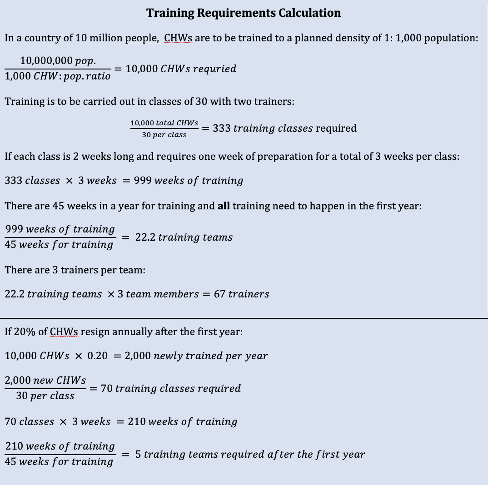
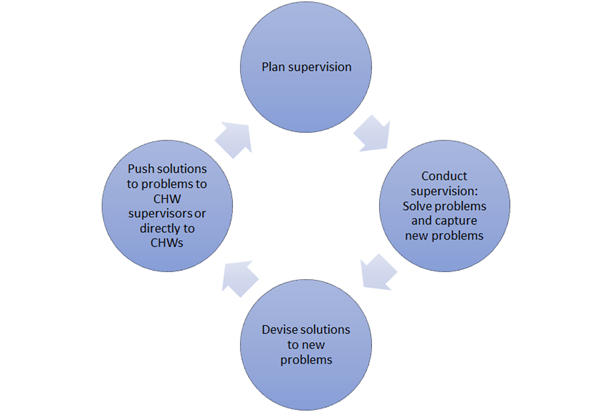
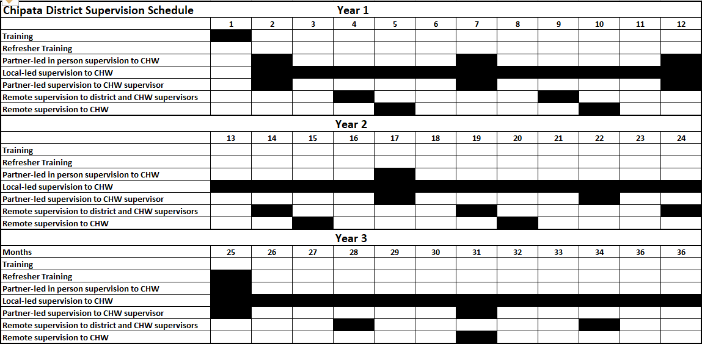
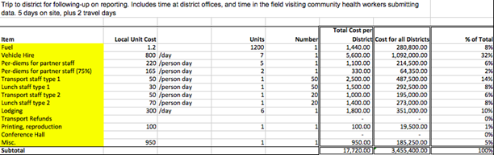
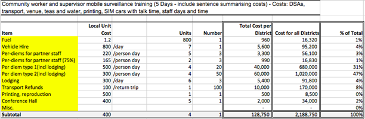

# Training and Supervision

## Introduction
This chapter describes how to operationalize the design principle, "[Capacity strengthening]() of CHWs" for CHIS. This involves a number of processes to support the developing of CHW knowledge, skills and support, improving decentralized use of data and feedback to CHWs to increase data quality. Most CHIS in developing countries are still paper-based, though many are moving towards more digitized systems. This requires that CHIS training is introduced and is continually followed up through all stages of the information cycle.

## Training needs assessment 

The first step in any new CHIS capacity development program has to be a Training needs Assessment that looks at the existing situation surrounding the CHIS and the needs to improve this situation. Ideally this should be done as an integral part of the overall CHW training plan, with CHIS experts forming part of the overall CHW training needs assessment

This assessment needs to look at the existence of basic requirements for a CHIS and answer a number of practical questions about what is needed to address these requirements

### Requirements for a Sustainable CHIS Training Strategy 

Capacity strengthening of CHWs is a significant challenge and lies at the core of developing a sustainable CHIS. There are some inherent limiting conditions to effective capacity strengthening programs including:

- *Decentralization:* To ensure sustainability, CHWs should receive support and training locally in a decentralized approach, as close to their place of work as possible.
- *Training Conflicts:* CHWs because of the nature of their work are continually being pulled into different kinds of training programs, and CHIS skills tend to receive relatively lower priority.
- *Literacy:* CHWs, especially the older ones, typically come with weak computer literacy, and sometimes even basic literacy skills, making learning about information and computers a difficult task.
- *Acknowledgement of CHIS skills:* CHWs typically do not get recognized for building CHIS related skills, and that does not show in their job advancement or annual appraisals.
- *Scale:* This, in particular, is a very significant challenge. While there be a few dozen districts in a province, there may be a thousand villages and hundreds of CHWs. Training cannot be done through traditional means of classroom, and requires the use of different and innovative training methods such as mentorship, in-service training and online media.
- *Attrition:* loss amongst CHWs means that the CHIS is continuously challenged by the exodus of trained staff.
- *Refresher Training Budgets:* The continuity of CHIS is normally subject to limited training budgets, implying that new CHIS do not receive adequate training, particularly after the initial training. Therefore, a sustainable CHIS requires a continuous stream of refresher trainings for old CHWs and comprehensive trainings for new CHWs.

### Some questions to address in the CHIS training needs assessment 

**CHIS Training** 

- How many CHWs need training in CHIS 
	- How often should they be trained 
	- How long will training be? 
- Who will train them? Who will train the trainers? 
- How is CHIS training related to other CHW training? 
- Who will do the CHIS training? .... 
	- How will they be trained?\... 
	- What curriculum will they use? 

**Supervision**
- Who will do supervision ? 
	- Who will support the supervisors? 
- How will supervision be done? 
	- How many CHWs per supervisor? 
	- How often? 

### Planning CHW training requirements 

Sustainable CHW training is an ongoing exercise that starts with pre-service training, and is supported by an active program of supervision, support, and mentorship. New CHWs need to learn the CHIS in the institutions where they receive their other training, which could be an institution like a CHW college. CHIS training needs need to be planned, based on the desired density of CHWs, the skills needed, and their retention rate.

This calculation is explained in detail in Figure 5.5.

### Physical requirements for training

CHIS training requires four conditions to be met:

1. CHW colleges should have lecturers who can teach CHWs CHIS competences.
2. Local CHW supervisors can provide regular support to handle the 10 most common requests of CHWs. Supervisors also review the reporting systems.
3. CHW supervisors and CHW college lecturers can get help from the national level.
4. There should be SOPs providing protocols and explanations of the data capture and transmission events. Supporting documentation provides explanations of data fields; the app they use are available in the language the CHW college lecturers know best.

CHW college lecturers teach the reporting systems regularly and should know the CHW tasks. They are the right staff to carry out the initial in-service training when the system is introduced. This contributes to the institutionalization of the training for reporting in the CHW colleges. If more trainers are needed during the initial training, CHW supervisors can assist.

The national team adapting the CHIS to the needs of the country should be as representative as possible. Some CHW college lecturers, CHW coordinators, and CHWs should participate as well as national level HMIS and program officers. This team should provide the training of all CHW lecturers and participate in parts of the training for the CHWs.

## Training Plan

A training plan to strengthen CHIS capacity should be developed, based on the needs assessment.

The plan needs to answer certain basic questions around a number of Capacity Strengthening Domains raised in the needs assessment

Domain | Questions to be answered
:- | :-
Who to train?  | CHWs, CHW supervisors, Facility in-charges, District program managers, Trainers
What to train?  | Public health skills and Technical CHIS skills
When to train?  | Frequency and Duration of training
Where to train?  | Pre-service, In-service, Supervision and support
How to train?  | Training materials and methodology
What will training cost?  | Budget

### Who to Train?

Various kinds of staff, such as CHWs, their supervisors, and CHS managers will have different training needs.

- CHWs need to have appropriate training if they are able to effectively use the CHIS to perform their everyday tasks of recording, reporting, micro-planning and data driven actions. In addition to CHWs,
- CHIS training also needs to be imparted to supervisors, which is often the most neglected part of most CHIS programs. Data use training for supervisors needs to be integrated into overall supervision skills training and become the focal point of problem identification, support and monitoring of CHWs. Supervisors need to be able to use data before, during and after supervision.
- Similarly, CHIS managers perform different functions and will need training adapted to their specific needs. They may already have advanced knowledge in public health and available computer skills, and may need specific training on the use of DHIS2 for data analysis and dissemination of analyzed information. For this, they could request training materials specifically tailored to their DHIS2 database.
- Community leaders and stakeholders may also need to be trained in the use of data or to be able to discern data quality issues. Community stakeholders and leaders need specific training according to their roles and responsibilities. These actors need to put into context the data they receive from the CHW and feedback they receive from DHIS2 and take the appropriate actions to improve service delivery.

Involving leaders in data use can have dramatic impact on a community program, as can be seen from the Zambia case study (see Chapter 6). Community leaders understand the local context and they should be involved in setting the local targets for the individual CHWs, adjusting these targets each year based on performance and population. Community leaders should also be involved in local management of the CHWs and use data on incentives, density, and attrition rates to ensure that the program is working effectively. Training to them should address these needs.

### What to Train?

We divide the skills required into two broad categories of technical and public health related. These are briefly discussed.

1. Technical skills
	- Use of DHIS2
	- Use of mobile devices
	- Hardware and software support skills
2. Public health skills
	- Understanding data, indicators and supporting concepts
	- Understanding how data is used to inform local action.

#### Technical skills

**DHIS2:** Skills in the use of DHIS2 is fundamental. However, DHIS2 is a large piece of software, and the CHW needs to know only particular functionalities, such as:

- **Mobile Devices:** Many CHWs use mobile devices for data collection and reporting. They need to know how to use the device for recording data, send it either by SMS or the web, and to confirm receipt of reports. Further, if equipped with a smartphone, they should be able to use the value-added services available such as SMS, MMS, WhatsApp, Facebook and other social media tools. This not only helps them to access technical support when needed, but also stimulates interest in the devices when they are able to communicate with friends and family.
- **Data Quality Checks:** CHWs should be able to assess data for correctness, currentness, consistency and completeness (the 4Cs) both on paper and on mobile devices.
- **How to Generate and Transmit Reports:** CHWs have large reporting requirements, and they should be able to use the DHIS2 to generate their required reports, and transmit them to the next level. For this they need to understand reporting formats and mode and times of transmitting reports.
- **Hardware and Software Support:** Typically, the CHW is located remotely and far away from easily accessible means of technical support. Hardware support is never easy, and long periods of non-functioning equipment can significantly erode the interest of the CHW in the CHIS. The CHW should be as self-sufficient as possible, able to do basic troubleshooting tasks with the hardware and software (DHIS2).

These skills include ability to:

- Reset passwords.
- Reboot the hardware.
- Reinstall applications on mobile devices
- Logging into mobile applications
- Diagnose why a printer is not working and provide basic maintenance.
- Read a user manual or SOP to diagnose a problem.
- Accurately communicate with the supporter on the problems they experience and the solution required.

#### Public Health skills

Public health skills should be related to the scope of work and should include:

- Understanding data elements, indicators, and public health concepts: Understand the meaning of data, indicators, and supporting concepts such as coverage, and data quality parameters. For this, she can be aided with appropriate data and indicator dictionaries which describe each term used, its meaning, how it is collected (or generated), data sources and procedures for its collection and reporting. Concepts such as coverage are useful for her to understand her targets and the proportion she is able to reach or not. Understanding of data quality parameters can help the CHW interrogate the quality of data that she is collecting and take corrective actions closest to the source, which is most desirable.
- Use of data to inform local action: Unless CHWs understand the data to be entered, the CHIS tends to be useless. This is the reason for including the ability to take informed action on the CHW's competences. Without experiencing use from the CHIS, the CHWs will stop using it or they may enter data carelessly, hence the importance of understanding data flow. Also, if staff at higher levels of the health services do not respond to the data CHWs enter (by providing required support), the CHWs lose their sense of the CHIS being useful.

As the role of a CHW varies from broad-based IEC and community development to specific programs for MCH, Malaria and home-based care, their use of data will vary accordingly. "Data use" is different at higher and lower levels of the health system and training must recognize that and develop appropriate curricula for each level, linked to SOPs.

Whoever is being trained, exercises should be practical for the audience, referring to "real life" data analysis scenarios, versus theoretical or academic cases.

While data use is a skill that is learned in the field under mentorship of a more experienced CHW or during formal supervision from the facility staff, it is something which can also be supplemented with more formal training on concepts. For example, use the DHIS2 to plot graphs to:

- Match achievements versus targets to identify her areas of improvement.
- Compare their facility and neighboring facilities.
- Gain a better understanding of their performance over time and space.

The competences listed above constitute some elements of the repertoire needed for CHWs to use the CHIS. These competences, combined with support and encouragement from their supervisors and colleagues, provide them with a sense of ownership of the CHIS and the data.

### When and Where to train? Modes of Capacity Strengthening

A successful training strategy requires:

1. Pre-service training that provides new graduates with an integrated package of skills that includes CHIS.
2. Continuous support and supervision from decentralized teams of supervisors who themselves have necessary CHIS skills.
3. In-service training where needed to address specific CHIS issues.

These three approaches to CHIS training need to be adopted and approached in an integrated and cohesive process, starting with comprehensive pre-service training, followed by regular in-service training, with continuous supportive supervision, mentorship and continuous learning woven into all activities.

This three-pronged training strategy requires different modes of capacity strengthening. For example, while pre-service training is best done through institutionalized approaches of CHW colleges, continuous support requires supportive supervision from nearby facilities and peer-to-peer learning.

Skills for CHWs should be built through continual training, and it is important to transfer these competencies to the everyday work of the CHW.

There are many factors that improve the likelihood that transfer actually happens:

1. Learners are motivated during the training.
2. Learners imitate practice shown by trainers, videos or written material during training.
3. Learners solve problems requiring more than imitation during training.
4. Learners improve self-efficacy during training.
5. The training environment is as realistic as possible.
6. There are opportunities for practicing newly acquired competence at work after training.
7. Colleagues, superiors and others put social pressure on workers to perform.
8. Support is available after training when needed.

The first five factors are taken into consideration in the pre-service CHIS training. The three last factors concern the circumstances at work during in-service training and supervision.

#### Pre-Service Training

CHW pre-service education varies enormously between countries, from a few weeks up to a year, and CHIS skills also have great variations. After pre-service training, CHWs should have basic CHIS skills such as knowing how to use SOPs, how to capture and record data, how to use the mobile applications, and how to contact support.

**Timing** of CHIS training is essential and should happen at the time the CHIS becomes functional.

- Training before the system is up and running means that CHWs forget all they have learned when the CHIS is launched and the training was probably not as practical as it should have been.
- Training after the system is up and running results in frustrated, angry and disappointed CHWs appearing for training. The trainers will have a very hard time changing their negative attitude.

While there is no one way to train CHWs in CHIS, the following principles should be adhered to for better learning outcomes

1. Training should focus on practical data collection and data use skills. Regardless of the amount of time available, more than half of the training needs to be practice.
2. CHIS training should be fully integrated into other programmatic training. Service delivery, data collection, data analysis and data use should thus be part of the process of client care and systems management.
3. Repeating the activity for each program strengthens CHIS competence. Rather than including reporting activities in just one session, it is better to repeat reporting activities throughout the training.
4. The different tools need to be introduced in the first program. The CHW practices summarizing and entering data in the collection tools (paper or electronic) and acting on feedback received using role play.
5. Training should include both the paper based forms and ICT device, interpreting the reports on health status, and service performance.
6. Looking up help in the SOPs or in the device, and contacting the CHW coordinator for support are problem solving methods best taught in separate sessions.
7. Length of training should be tailored to CHW knowledge
	- CHWs who are already familiar with paper reporting and feature phones can be easily trained on routine reporting in a short amount of time. Possibly even in one day.
	- CHWs who have not used smartphones before will require more time, one to several additional days
	- If the training includes many health programs, a week or more of CHIS training is appropriate.

> **Note**
>
> Sample outlines of a training program and examples of training materials are available at dhis2.org

> **Best Practice: Training Session** {.note}
> 
> Each training session should include one topic, e.g. Comparing health in my village with the neighbor villages, and it should last for 30±10 minutes. A session should be structured like this:
> 
> 1. Introduction. Plenary presentation
> 		- Introduction of the topic, including a demo where learners watch, not do.
> 		- Explain new functionality and data structure, include demo.
> 2. Practical hands-on exercises, individuals, or pairs. More than half the time of the session. Trainers walking around helping the learners when necessary.
> 		- Hand out Minimal Manual and SOPs
> 		- Make the learners follow the instructions in the Minimal Manual.
> 		- Give the learners two exercises which differ slightly from the Minimal Manual.
> 3. Summary. Plenary discussion with the participants.
> 		- Discuss functionality/data structure and confront misconceptions
> 		- Discuss usefulness

Making the users follow the Minimal Manuals and SOPs during training has the advantage that they become familiar with written materials and are more likely to look up in the manuals and successfully solve problems on their own after training.

##### Training Protocols

As community health programs expand and decentralize, training quality may decline, resulting in diminished project outcomes and poor data quality. Having a robust set of training protocols in place can help prevent this situation. A training protocol helps to develop training material and events that are standardized, scalable, and reproducible.

Additionally, it is important to capture institutional knowledge from past supervision and trainings. To learn from successes and avoid repeating the same mistakes, use the SOPs as living documents where institutional knowledge is captured on what works and what doesn't in your particular setting.

Training approaches will vary from country to country or even project to project. The best practice is to have an integrated approach in which the training protocol and materials are harmonized across programs. The shared location for these documents should be clear for each training defined in the training protocol.

The training protocol template below is not a complete training package, but should be used to outline all CHIS trainings, from community up to national level. It defines critical information about planned trainings, both for pre-service and in-service training.

| **Training Name** | Standardized name |
| :- | :- |
| **Purpose of Training** | Why it is being carried out, backed up by concrete, action-oriented learning objectives |
| **Duration** | Days / weeks / months of training |
| **Frequency** | Some training may be once off, but some others may need to be repeated periodically epically at district and facility level where there is typically high staff turn-over. |
| **Venue/ Location** | : Where will the training take place in general (district office, chief's palace, ministry of health HQ, etc.)? |
| **Attendees** | Who is being trained, and how many attendees are expected? |
| **Facilitators** | Who are these and how many are required? What are their minimum qualifications, and what training should they have received? |
| **Training program** | Goals and Objectives for the overall training and learning objectives for each presentation or exercise |
| **Participant assessment** | How are you assessing that the participants understand all the materials? This is typically best done with a pre-exam, grading of exercises, and post-exam. What is the pass rate for the participants? |
| **Links** | Links to standardized materials, presentations, exams, facilitator\'s manual, etc. |
| **Post training follow-up** | After trainings, it is often necessary to conduct a follow-up or supervision visit to reinforce training materials and if possible directly support the first round of data submission. |
| **Guidelines for editing materials** | All training materials will need to be edited over time as the program matures and the system is updated. Define who has control over the standard materials, how edits can be made, how new materials will be updated, and when new materials will be announced to everyone conducting trainings |
| **Training best practices** | List of best practices developed from conducting the training event. |
| **Access to training materials** | Where are training materials both electronic and physical stored? Who is responsible for maintaining an adequate supply of training materials? How are stocks of training materials controlled or distributed? |

*Table 5.1:* Training Protocol Table

#### In-service training

Initial in-service training on CHIS may require from a day to a week, depending on the CHWs pre-service training, the scope of the information systems and their familiarity with IT if mobile devices are used.

Initial in-service training should aim at the CHWs being comfortable with CHIS with help from their supervisors. In-service CHIS training for CHWs should wherever possible be done by the same people doing supervision for other CHW activities. CHIS training, like CHW training should be decentralized as low as possible, while still ensuring adequate quality.

In addition to CHWs, other CHIS stakeholders may also need an orientation to data use

1. Community leaders such as chiefs and others who have the power to influence program activities and can be empowered through data
2. Community health committees might need to know how to interpret data.
3. District level and local government officials involved in the program and some implementing partners will need to be trained on web-based DHIS2 analytics and management.

For each of these, you will have to develop a training protocol and organize the logistics.

It is vital to make sure the appropriate people come to each training. Failure to do so results in project failure or require an additional training in the future. Government personnel can assist in selecting the appropriate participants. At District-level DHIS2 trainings, for example, a District officer should serve as the lead point-of-contact for all training related guidance on invitation lists, scheduling, and provide guidance on government protocols for inviting attendants to a training. CHIS project timeline should have a general outline for trainings. Allow yourself adequate time for planning and communication prior to each training.

Each administrative level should have a point person for CHIS training. Refer to this and work with your district point person to coordinate schedules for these trainings.

> **Best Practice: Learning in Pairs** {.note}
> 
> Making the participants work in pairs after gaining initial skills has positive effects on learning.
> 
> 1. They discuss, which helps people understand.
> 2. Participants who have a low confidence with tech devices see their colleague manages, and this is the strongest incentive for improved confidence.
> 3. Spectators watching others explore, experiment and trouble shoot can imitate their ways of doing it.

## Post-Training Supervision and Support

Supervision and support is the key to sustainable CHIS functioning, yet often is neglected, underfunded, and given low priority by supervisors, who themselves often do not have adequate skills to support CHIS.

The CHIS training should feed into a strong data system with well-trained users. However, no system or individual is perfect, and there should be regular, structured follow-up to monitor data quality. This follow-up will be ongoing in supervision visits.

> **Best Practice** {.note}
>
> CHIS users should have one point of support, which means that CHIS supervisor should be integrated into the general CHW support team. Since they know the CHW supervisor and get support them for other issues, having them supporting the CHIS is an advantage.

To ensure an efficient continuous training and surveillance system, periodical Supervision Visits (SV) are performed to community health workers by the CHW direct supervisor and possibly implementing partners or other Ministry staff.

How supervision is conducted varies from country to country or program to program, but there are three core goals of any type of supervision:

1. Ensure quality, timely reporting from the community and feedback from the CHIS to the community.
2. Review program principles, SOP, and service delivery with the reporting cadre.
3. Troubleshoot program, hardware, and software challenges

To achieve these core goals, a supervision visit should examine at least these aspects of CHW functioning:

- The CHW's ability to perform service delivery (Diagnose and treat diseases, conduct community sensitization events, etc.).
- The CHW's ability to capture data, record data, and perform data quality checks.
- The CHW's ability to submit data and troubleshoot data transmission/application problems.
- The CHW's ability to perform basic data analysis and communicate that analysis to community change agents.
- The CHW's major bottlenecks in service delivery, reporting, or communicating.
- Any additional issues faced by the CHW (Lack of community support, distances too far to travel, not enough time to perform activities, etc.).

> **Best practice** {.note}
> 
> Introduce the CHWs and the CHW SOP to community leaders during supervision. Community leaders are often key agents of community behavior change. They must understand and support the role of the CHWs working for their constituents. You can support their engagement by helping them understand the role CHWs and their data play in preventing and treating diseases in the community.

- If community leaders do not support the CHWs the community health program in many countries is more likely to fail.
- Engage community leaders from the start.
- If possible, request their support to monitor CHW reporting rates or conduct data verifications.

In some community health programs, large community orientation sessions are held to introduce CHWs, explain their roles and the services they provide, and have community leaders publicly support CHWs. This elevates the role of the CHW and provides them with the necessary credibility to do their job well.

### Types of Supervision:

There are many ways in which to conduct supervision. The style and approach will change over time as the process is refined and becomes tailored to the specific needs and desired outcomes of the supervision. For the purposes of these guidelines we have outlined two broad types of supervision: In-person and Remote.

#### In-Person Supervision

A common type of supervision is direct face-to-face meetings with CHIS supervisors or the CHWs. An in-person meeting will directly impact the program performance and provides an opportunity to provide on-the-job support or address complex problems or issues. It is also the best way to provide direct technical support in the field that cannot be done remotely. In person supervision, however, is costly to maintain.

In-person supervision can be central or local:

1. **Central** or regional level (government or partner organization) supervisor travels to meet with the CHW supervisors or CHWs with district and local staff and other key stakeholders.
	- Pros: Excellent at capturing and addressing issues in a timely manner. Able to provide expert support directly to CHWs. Highly promotes status of CHWs
	- Cons: Costly and ultimately unsustainable
2. **Local**: The district, clinic, or CHW supervisor staff meets directly with the CHW without partners.
	- Pros: Inexpensive and capable to sustain. Captures and addresses more routine, simple problems. Provides CHW with continuous sense of support.
	- Cons: May not be capable of addressing complex technical problems

#### Remote Supervision

In addition to on-site supervision visits, remote supervision through phone calls, Skype, WhatsApp, or another platform can be used to discuss with CHW supervisors or CHWs. When the topics to be discussed are simple and uncontroversial, remote supervision saves time and resources. This may work well on following-up tasks and status reports.

Remote support works best for:

- Support to CHW supervisors who are on track and do not need problem solving support
- Preparation to ensure readiness for an on-site visit could also be done remotely.

Remote support is less effective for:

- Introduction of changed or new practices or discussion of controversial or complex issues are less likely to succeed through remote communication.
- Improving poor performing or deteriorating community health programs or CHIS.

Two types of remote supervision are described below:

1. **Remote supervision to districts and CHW Supervisors:** The partner or central or provincial government has a remote Skype or phones call with the district office or sub-district actors to support healthy program implementation.
	- Pros: Inexpensive and capable to sustain. Captures problems as they are interpreted from the CHW supervisors. Provides supervisors a feeling of accountability.
	- Cons: Does not hear problems directly from CHWs.
2. **Remote supervision to CHW:** The Supervisor contacts the CHW.
	- Pros: Enables CHWs to directly express problems and concerns. Provides CHWs a sense of accountability and support. Can be done whenever a CHW has a specific technical problem that local supervisors are unable to address.
	- Cons: In large scale programs, it may not be possible to contact for all CHWs.

### Supervision Protocol

CHIS supervision (in-person and remote) should be clearly described through a supervision protocol that provides oversight to each supervisor, embedded within a larger programmatic CHW supervision protocol.

The protocol defines the type and frequency of how supervision and support is provided to all levels of the CHIS. Just as with the training protocol, it is necessary to clearly define the supervision so that they are standardized, scalable, and reproducible. A CHIS supervision visit protocol outlines in detail the following for each type of supervision:

| | |
|:- |:- |
| Supervision Type | In-person or remote  Central or local |
| Purpose | Aims and objectives of the supervision |
| Target Audience | Who receives the supervision?  How many participants should be in a session?  Where will supervision take place |
| Team Members | Who conducts the supervision?  How many supervisors are required? |
| Frequency | How often should this event take place? Insert the supervision calendar as described. Take note if this frequency is meant to decline over time and outline that schedule here. |
| Objectives | Clearly define targets, with associated performance or outcome indicators that can be monitored for effectiveness of the supervision. |
| Pre-supervision | Tasks or activities prior to supervision (e.g. gather materials, send invitations, run validation rules, get phone credit, print dashboards, etc.) |
| Activity Checklist | Activities or topics to cover during supervision (e.g. check ability of CHW to describe data elements, use phone for reporting, review data quality issues, describe health indicators, troubleshoot application issues, etc.)  Post supervision reporting requirements by the supervisor. These could describe outcomes of the supervisions, findings, next steps, etc.  Budget for the supervision. Describe what is and what is not an acceptable expense. |
| Narrative | Describe the events of the supervision in narrative form. |
| Common Findings | Keep a running list of common findings, questions, issues, or experiences had during supervision.  This list can serve to prepare new CHW supervisors, plan additional supervisions, and document institutional knowledge. |
| Feedback on Best Practices | How do CHWs and other stakeholders benefit most from supervision?  What worked well? What did not work?  Best practices of supervision so other CHIS supervisors can learn from others. |

*Figure 5.2:* Supervision Protocol Template

#### Targeting Supervision

Typically, supervision employs a blanket approach in that every CHW receives the same supervision regardless of the specific issues that they face. This antiquated approach is uninformed and does not address or uncover all of the problems that CHWs may be experiencing. CHWs must feel like their issues are being heard and taken seriously, and they must see specific actions that address their issues. Targeted supervision is a cycle of planning supervision, conducting supervision, solving problems, capturing new problems, solving those problems, and planning supervision again. Figure 5.3 summarizes this:

*Figure 5.3:* Targeted Supervision Cycle

- **Planning Supervision**: Before a CHIS supervision visits the supervisor should analyze data from each community and community health worker to be visited. Analysis should focus on data quality as well as key output, outcome, or impact indicators. As you plan, keep a list of key issues and data errors to address during the field visit. Dashboards for comparison between wards/villages/communities will be helpful in guiding targeting. These points can guide you in making list of
	- Areas where data shows problems that need personal supervision
	- Medium/low priority areas where remote supervision can be given
- **Conducting supervision**: CHW supervisors should provide solutions to known existing issues and capture new capture the priority issues faced by CHWs.
- **Post supervision**: After supervision has occurred, analyze the problems that have been identified and develop solutions to them. Then push these solutions to the CHWs. It may be possible to directly push devised solution to CHW's or their supervisors via a feedback mechanism prior to conducting another supervision visit.
- **Planning supervision again:** While planning the next round of supervision target CHWs based upon the problems they have reported and during supervision ensure that CHWs are receiving solutions.

> **Best Practice** {.note}
> 
> Before supervision, run validation rules for each CHW or community you are going to visit. Print out the specific data quality issues you want to share with the CHW.
>
> - Results of the validation rule analysis.
> - Dashboards, scorecards, or any analytics.

> **Best Practice** {.note}
> 
> Use DHIS2 event capture or tracker to record the details of every supervision visit.
> 
> - Use mobile applications to capture the most pressing problems faced by CHWs
> - Observe a CHW actually perform the action they are trained to do.
> - Always ensure that there is a free text box in which the supervisor can record an issue that is not included in the pre-existing option set.

#### Data Quality during Supervision

Supervision should aim to maintain and support the 4Cs of data quality:

1. Correctness: (Accuracy) Submitted data is believable based on the context; the units and ranges for the data are what is expected. Note that validation rules can be built in DHIS2 to help guide data correctness.
2. Currentness: (Timeliness) The reported data is current and was collected during the correct time frame; the figures are not identical to last month's data, which may indicate falsification of data or submitting an old data set.
3. Completeness: All forms are completed, and within each form, all required data elements are filled out.
4. Consistency:
	- High quality data does not usually vary over time for most PHC activities, apart from seasonal variations.
	- Always check data for "outliers" that may reflect data entry errors.
	- Data is submitted regularly and on time. Data reporters are consistent in their adherence to data submission practices.

These are the items field officers should train their eyes for once data collection begins. Issues in data quality could reflect poor or inadequate training.

#### On-the-Job Support during Supervision

Supervision visits should cover issues identified prior to the visit, but supervision visits are also ideal times to conduct on-the-job support to address program performance, resolve issues in real time, and enforce SOPs. On-the-job support should include:

1. A general overview of performance at all levels to give the CHW or the Supervisor a better sense of perspective and motivate them to better performance:
	- How CHWs performance (key indicators, reporting rates, reporting completeness) compares to other CHWs, district performance, national performance, etc.
	- How CHW supervisors perform in relation to national performance:
		- Average reporting rate for the CHWs under the supervisor compared to national.
		- Average program performance for the CHW supervisor compared to national levels.

    Specifically discuss performance of those groups that are present. Present the data and ask them for feedback on why they think they are performing better/ worse than their peers.
2. Discussion of common data errors as identified by your pre-visit data analysis. Explain what those errors are, and clarify them. Review data entry forms, focusing on data elements that are commonly entered incorrectly. Correct data errors and resubmit the corrected data during the supervision visit.
3. Identify challenges if there is a noticeable difference between CHW performances. The team should create specific tasks to address those challenges.
4. Hardware and software troubleshooting should be addressed. Any outstanding issues should be resolved and CHWs should be shown how to resolve those issues themselves in the future. CHW supervisors should travel with extra phones/tablets during SVs.
5. If community workers have data entry that is late or outstanding, they should be encouraged during these visits to submit the missing data.
6. The visit should conclude with a summary to the entire group, based on discussions in the small groups, key findings, challenges, successes, and action points. These should be documented in a supervisory report that is left on site, as well as on DHIS2.

#### After Supervision

After a supervision visit, it is important to capture what was discussed and learned during the visit. A formal report containing this information should be completed shortly after the visit and submitted into the CHIS. The report should capture where the visit took place, who was met, which activities were discussed, and what the findings and recommendations were. These reports should be specific, as they will guide program surveillance officers and other staff in how to follow-up on issues and with whom. They might also inform program staff of larger patterns that require attention.

> **Best practice** {.note}
> 
> CHWs become motivated when issues they communicate to their supervisor are resolved. This could include diverse things like hardware and internet, understanding of health indicators and fear of making mistakes. Also, issue or resources and public health competence resolved motivate the CHW to improve their performance, CHIS work included. Facility and district management as well as partners need to help the CHW supervisors resolving CHWs' issues.

#### Scheduling

Developing long-term schedule for supervision is important for budgeting, planning, and supporting the success of the system. Scheduling of supervision often happens prior to project implementation. While the frequency of your supportive supervision depends on the scale and scope of your intervention, we recommend for a large community health programs,

- The first supervision visit should happen during the first or second reporting period to assist CHWs complete their initial data submission.
- For the first six months to one year supervision should take place every 4-8 weeks.
- Once consistent competency and quality have been attained, visits can be reduced to quarterly or less.
- A district or area that is performing particularly well, may not require such frequency.
- CHWs should receive supervision and support whenever they visit the health facility or district offices to receive commodities or materials.
- If the program is launched by a partner organization and is intended to transition to government control ensure that the frequency of supervision is of a type and at the frequency that the ministry can sustain.

With the point person in each district, establish an appropriate schedule of visits.

##### Example of a Supervision Schedule

Figure 5.4 is an example of a three-year supervision schedule for a district that is implementing a CHW ICCM program by a large NGO that will transition to government control by the end of year three.

*Figure 5.4* - Example Supervision Schedule

- In the first year, partner-lead in-person supervision to CHWs and CHW supervisors is conducted three times. This is important because partner-led supervision will be very effective, but it will also be expensive to sustain.
- In year two, partner-led supervision only happens twice.
- In year three, partner-led supervision happens just once.

You also see the local-led supervision to CHWs happens monthly. This is because in this example CHWs must visit the health facility monthly to get resupplied on commodities. During that time the CHW also received supervision from the Clinic In-Charge.

In this example for years one and two the implementing partner with central government staff conduct bi-annual remote supervision to CHW supervisors and directly to CHW themselves. In year three bi-annual, remote supervision continues to CHW supervisors while remote supervision to CHWs offices once. It is envisioned that the supervision schedule for year three is sustainable by the government without direct support from partners or donors.

#### Budgeting

Keep in mind the same best practices principles as when budgeting for training.

Figure 5.5 is a sample budget for surveillance visits is below. All unit costs listed are arbitrary and not necessarily representative of real costs.

It is typically necessary to produce a detailed budget for supervision visits so that supervisors clearly understand what is and is not an allowable, budgeted cost.

*Figure 5.5:* Example In-person Supervision Visit Budget

## Training CHW College Lecturers and CHW Coordinators

Lecturers at all CHW colleges should be able to teach the CHWs effectively and follow them up in the field. If the teachers have a background of M&E or public health, they should be familiar with indicators, reporting systems, and evidence based health management. If CHW lecturers come from a clinical background, they will need to learn these topics.

All trainers need thorough training on new IT systems. The rule of thumb is trainers should know the subject matter 10 times as well as the learners. This means 10 times as long training as the CHWs. Trainers need:

1. A wide selection of training data and examples.
2. To learn the pros and cons of various reports and also how to interpret reports.
3. To know the 10 most common support requests from users. Note that these requests will not be known until a pilot has been run for a couple of months.

To become effective CHIS trainers and supporters, explicit explanations, and practice are essential. This includes:

- Knowing how to carry out operations on your own phone while giving instructions to the CHW.
- Helping the learner rather than taking over the learner's device during on-site training.
- Convincing CHW about personal and organizational usefulness through the trainer telling personal stories. This helps the learners relate to their own practice.
- Being aware of common mistakes and misconceptions which should be collected internationally.

Training material for CHW college lecturers and coordinators should be available for download and adaptation.

## Core team

Implementation of the CHIS needs a core team to train the CHW college lecturers and coordinators and to follow through implementation. This requires a multidisciplinary team with broad knowledge base with skills in CHW, public health and IT and its members should be members of the team managing the overall CHW program, rather than a separate team. They should have several years of experience and preferably also be people who have been CHW or CHIS champions in some respects in their work.

The team adapting the reporting system to national needs participants from CHWs, CHW college lecturers and coordinators, public health, and IT people and should have strong stakeholder representation from decentralized levels. Some countries tend to pick juniors for such tasks, since the seniors are too busy with other projects. However, for the CHIS to succeed, system implementation has to be anchored in the top level, put pressure on the colleges and health services to select the right people and ensure continued monitoring and feedback of project activities.

## Preparations for Training

### Budgeting

Efforts should be made to keep costs low and existing resources be used wherever possible. Some guidelines on preparing the budget include:

- Follow organizational policies in using approved budget templates and rates (indirect, DSAs, etc.) for all expenses including:
- Travel (e.g. fuel, car hire, lodging)
- Personnel (e.g. per diems, meal costs)
- Venue (e.g. conference space, tea breaks)
- Materials (e.g. printing, hardware, projectors)
- Miscellaneous items
- Build budget based on in-sheet calculations of materials needed, unit cost of that material, and number of units needed. You can also build in additional multipliers to illustrate number of units per attendee. This allows flexibility in updating the budget if unit costs change, or number of participants increases or decreases.
- Budget anticipated expenses in local currency, with a conversion rate built in (that can be updated as needed) to convert to the desired currency of your organization or funder.

A sample budget for a five-day training using hypothetical costs is given in figure 5.6:

*Figure 5.6:* Sample 5-day Training Budget

### Technical Preparations

When preparing for the training, ensure all the practical technical requirements including computers and a router are in place. This means knowing whether to use a cloud based DHIS2 training instance or local DHIS2 training instance. The availability of internet connectivity influences such a decision.

If the training location is rural and might have problems with internet connectivity, it is best to have a local DHIS2 training instance set up on a computer. A local instance allows users to access the DHIS2 training server via computer IP without the need for internet connectivity. However, the number of users that can work effectively from one computer IP is limited by the router size; it is important to know the number of attendees, to select a router that can support the number of participants. You should familiarize yourself with local network providers and hardware capacity (mifis, etc.) they produce.

To use a local instance, you need to have it set up ahead of time on a computer. Your technical experts should help you set this up; the CHIS DHIS2 community of practice, www. Knowledge-gateway.org/dhis2-chis-community, includes three guides on the necessary steps for this set up (A1.i. Setting up a Virtual Machine, A1.ii. Building your DHIS2 Local Instance, A1.iii. Sharing Your DHIS2 Server). The use of a production instance of DHIS2 should be avoided for training purposes. Before doing the training, the exercises should be tested in the chosen instance (local or cloud based) to ensure everything is working. Troubleshoot issues detected during testing so they do not arise during training. You may have a second person repeat the test to spot any issues missed in the first round.

> *Best Practice* {.note}
> 
> If training with a local server connection, at the end of the training, let the learners access a remote server, to experience delays in the network for operating the system and for challenging their patience. Without experiencing the delays, they may later interpret network delays as faults in their device.

### Event Space and Agendas

Be aware of the number of attendees you expect at each training, as providing sufficient materials and space will be necessary. Event space should be large enough for the group and also appropriate for the planned activities. Consider:

1. The type of seating you require (round table, individual desks, etc.).
2. Technological requirements (computers for all, Wi-Fi bandwidth, etc.),
3. Finance for conference center allowances, participant food and beverages
4. Trainers need space to walk around to observe and help each participant.

### Materials

> **Sample Material List** {.example}
>
> Training of community-based, aggregate DHIS2 system with mobile data entry.
> - Minimal Manuals to be distributed to each participant. 
> - Standard Operating Procedures as relevant to the participants. 
> - Projector(s). 
> - Flip chart(s). 
> - Markers. 
> - Notepads and pens for each participant. 
> - 1 set of hardware for each attendee (Smartphone, tablet, feature phone). 
> - Printed copies of\..... (list will vary): 
> - Attendance Sheet. 
> - Participant's Agenda (1 copy per participant). 
> - Hardware Agreement Forms (2 copies per person receiving hardware, one for them to keep, one to be collected). 
> - DHIS2 App Configuration Guide (1 copy per data collector supervisor and district officer). 
> - Village/Community ID Form (used in determining organizational unit hierarchies). 
> - Practical Exercises. 
> - Data Collection Form(s) that will stay on paper, (multiple copies per participant). 
> - Aggregate Data Collection Form (to be put on paper then into DHIS2).

The materials you will need for your trainings will depend on your activities. To ensure you are planning for everything, walk through your training agenda with a partner, and discuss what will be done for each part of the training, taking note of the materials needed.

The agenda for training sessions should be defined well-ahead of the training and included in materials distributed. See sample agenda for community supervisor/facility staff training.

> *Best Practice: Phone Tracking System* {.note}
> 
> When distributing phones for mobile surveillance, have a tracking system for this hardware.
> 
> 1. Number each phone box and two copies of the phone agreement (i.e. #1 on a box and on both agreement forms) and hand both to a community health worker supervisor to fill in the forms against the details of that phone.
> 2. Ensure that the phones and boxes do not get mixed up.
> 3. Collect the agreement forms, and have a council sign and stamp both copies. One copy will remain with the district, and the other will be returned to the partner and kept in the district box file in the office.
> 4. Use a QR code generator to generate a QR code with the phone\'s information (number, CHW, SIM number, district, etc.). You can then print this QR code onto a heavy-duty label sticker and apply the sticker to the back of the phone or inside the phone in the battery compartment.
> 5. If providing SIM cards with phones, document the associated SIM card and phone.
> 6. To prevent tampering of the SIM card is provided with the phone, glue the SIM into the phone by placing the SIM card in the phone and applying glue to the back.

> **Best Practice: Minimal Manuals for Tasks** {.note}
>
> User documentation should be packaged in Minimal Manuals. These manuals explain a specific work task (e.g. enter monthly data from village health register or compare health in your village with the neighboring villages). After explaining the work task, the Minimal Manual provides numbered step-by-step instructions with screenshots, so that users recognize what to do. Keep in mind that Minimal Manuals do NOT explain the functionality of the app, one by one, like a typical vendor user manual.

> **Note** {.note}
>
> Since users prefer doing and not reading, the manuals should be a short as possible while still containing all steps.

## Evaluation of Training

Evaluation of training is essential, both during training and afterwards. Evaluation may be either qualitative (feelings of trainees about quality of training) or quantitative (data quality). Some options for evaluation are included below:

1. **Feedback during Training:** It is important to know whether your participants feel they are or are not benefitting from your trainings. This can inform future trainings and lead to improvements.
	- Get participants to write their feelings anonymously on paper or "post its" at the end of each day - Green for Good and red for bad.
	- Facilitators then review the responses from the "post its" at the end of the day and modify the training accordingly based upon responses.
2. **Competence Assessment:** Performing an assessment at the end of the training is another source of knowledge. This can be used to:
	- Tie work performance to learning outcomes after training.
	- Evaluate the training as a whole.
    These assessments should be similar to, but not identical to, the exercises done during the training, and should require trainees to apply rather than recite what they learned. Make sure the test is accompanied by a rubric to ensure fairness if responses are graded.
3. **Data Quality:** A cost effective evaluation of transfer of competence from training to practice is to assess the quality of the data entered by the CHWs and to link this data quality with the training.
	- Data quality can be assessed automatically in the database.
	- Interviews with the CHWs can tie their performance to the training, software, hardware, support, social pressure and other factors.
4. **Impact Assessment:** These are complicated and expensive assessments and need specialized training, technologies and skills so are not covered here.

