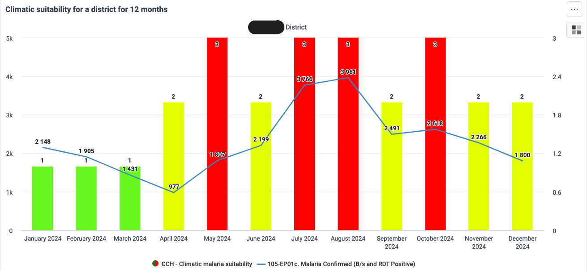

# Climatic suitability mapping

## Background and context

Data from health information systems, when combined with geographical information systems (GIS) and remote sensing, can improve knowledge of climatic, environmental, and biodiversity factors in the dynamic transmission patterns of [climate-sensitive diseases](https://idpjournal.biomedcentral.com/articles/10.1186/s40249-018-0501-9). In particular, climate change impacts transmission of vector-borne diseases like malaria and dengue by making certain environments more suitable for mosquitoes and parasites than in the past.

Uganda’s National Malaria Control Program, in collaboration with HISP Uganda, has developed a malaria suitability indicator in DHIS2 based on climatic thresholds for precipitation, relative humidity, and temperature, which affect both mosquito and parasite survival. This analysis helps identify and classify high-risk districts, enabling targeted intervention planning and early warning systems.

The approach described below can be used as a template for adaptation by other countries, taking into account the country-level differences in geography, epidemiology, mosquito and parasite species distribution. The dashboards have been replicated for the Laos PDR context on the public [DHIS2 HMIS demo instance.](https://demos.dhis2.org/hmis/dhis-web-dashboard/#/nwZvNZUmL4Z).

## Country spotlight: Uganda’s Climatic Suitability for Malaria Using DHIS2

### Context

Malaria poses a significant public health challenge for Uganda, which consistently ranks among the countries with the highest global burden of malaria-related illness and death. In 2023, the World Malaria Report indicated that Uganda reported 12.5 million malaria cases, ranking third worldwide. While ongoing interventions aim to reduce this burden and advance toward elimination, their success depends on the program’s ability to access, analyze, and use timely, high-quality data to support evidence-based decision-making.

Uganda’s climatic conditions play a critical role in malaria transmission by influencing the suitability of environments for mosquito vectors. Understanding climatic suitability within Uganda’s specific context is therefore essential for informing and optimizing malaria interventions.

Building on existing implementations, the [IRI Map room](https://iridl.ldeo.columbia.edu/maproom/Health/Regional/Africa/Malaria/CSMT/index.html) and by the EU climate and health observatory ([Climate-ADAPT)](https://climate-adapt.eea.europa.eu/en/observatory/evidence/health-effects/vector-borne-diseases/malaria-factsheet) and [research evidence](https://malariajournal.biomedcentral.com/articles/10.1186/1475-2875-5-38). Uganda has adopted an approach that assesses climatic suitability for Propsomalaria transmission. This involves indicator-based analysis using precipitation, relative humidity, and temperature, each with defined thresholds to determine transmission potential. Once climate data is imported into DHIS2, it is used to calculate the suitability indicator. Based on this indicator, analytic products such as maps are generated to identify and classify districts according to predefined climatic thresholds.

### Indicator definition

The climatic suitability indicator for malaria transmission is based on a combination of climatic/environmental thresholds that affect both mosquito and parasite survival. According to *Grover-Kopec et al*. (2006), conditions for a period of a month are considered suitable for malaria transmission when: monthly precipitation is at least 80 mm, the average monthly temperature is between 18°C and 32°C, and average relative humidity is at least 60%. *Benali et al.* (2014) also support these thresholds, though with a much broader temperature range, indicating that the *Plasmodium* parasite can survive within a temperature range of 15.4°C to 35°C, with monthly precipitation above 80 mm and relative humidity above 60%. These thresholds can be adjusted to reflect the local epidemiological context, in close consultation with the National Malaria Control Program. The three parameters can be combined into a composite measure within a single indicator—referred to as composite parameter suitability—or analyzed separately as single parameter suitability, depending on the specific needs and priorities of the malaria program.

## Implementation in DHIS2

As shown in Table 1, this analysis is currently performed monthly at the district level but could be adapted for weekly assessments at sub-district levels. In this case, we applied the *Grover-Kopec et al*. (2006) thresholds to each parameter monthly by district. By aggregating the results for each parameter, it becomes possible to configure corresponding indicators in DHIS2, as illustrated in Table 2.

*Table 1: Parameter aggregation, periodicity, and thresholds*

+--------------------------------------------------------+------------------------------+-----------+-----------------+----------------------------+
| **Parameter**                                          | **Aggregation**              | **Level** | **Periodicity** | **Suitable thresholds^a^** |
+--------------------------------------------------------+------------------------------+-----------+-----------------+----------------------------+
| Precipitation(mm)                                      | Sum of daily ( accumulation) | District  | Month           | ≥ 100 mm                   |
+--------------------------------------------------------+------------------------------+-----------+-----------------+----------------------------+
| Temperature (°C)                                       | Daily average                | District  | Month           | 20°C – 30°C                |
+--------------------------------------------------------+------------------------------+-----------+-----------------+----------------------------+
| Relative Humidity (°C)                                 | Daily average                | District  | Month           | 50% – 80%                  |
+--------------------------------------------------------+------------------------------+-----------+-----------------+----------------------------+
| ^**a**^ *Using Grover-Kopec et al. (2006)’s threshold* |                              |           |                 |                            |
+--------------------------------------------------------+------------------------------+-----------+-----------------+----------------------------+

1.  ***Composite parameters suitability***

You can also conduct a composite parameter suitability. For example, **“CCH - Climatic Suitability for Malaria (All)”** in Table 2, a logical indicator expression is applied to assess whether each parameter meets its defined threshold. When a threshold is met, the expression assigns a value of 1; otherwise, it assigns 0. The indicator sums the results of all three parameters and generates a score. Legend colors, illustrated below, are visualized in DHIS2 through maps and charts displayed on dashboards.

+---------------+---------------------------------+
| **Score**     | **Description**                 |
+---------------+---------------------------------+
| 3             | All three conditions met        |
+---------------+---------------------------------+
| 2             | Two conditions met              |
+---------------+---------------------------------+
| 1             | One condition met               |
+---------------+---------------------------------+
| 0             | None of the conditions were met |
+---------------+---------------------------------+

2.  ***Single parameter suitability***

You can also conduct a single-parameter suitability. For example, **“CCH - Climatic Suitability for Malaria (Precipitation)”** in table 2 uses the same logical expression to determine whether the parameter’s value meets its defined threshold. If the threshold is met, the expression assigns a value of 1; otherwise, it assigns 0. The resulting binary output is then visualized in DHIS2 using maps and charts, with legend colors applied to display “Suitable” or “Not suitable” as shown below:

+---------------+-----------------+
| **Score**     | **Description** |
+---------------+-----------------+
| 1             | Suitable        |
+---------------+-----------------+
| 0             | Not suitable    |
+---------------+-----------------+

3.  ***Count of suitable months***

You can also calculate the number of months a district met the climatic suitability criteria. For example, the indicator “CCH – Count of Climatic Suitability for Malaria (All)” in Table 2 counts how many months a district met the defined thresholds. A logical expression is applied to evaluate, for each month, whether the district satisfied the suitability conditions, either using all three parameters combined or a single parameter, depending on the configuration. This count provides a clear indication of which districts experienced the highest climatic suitability for malaria transmission during a given review period, such as one year.

*Table 2: Indicator configuration in DHIS2*

+--------------------------------------------------------+--------------------------------------------------------------------------------------------------------------------------------+----------------------------------------------------------------------------------------+-----------------+
| **Name**                                               | **Description**                                                                                                                | **Numerator**                                                                          | **Denominator** |
+--------------------------------------------------------+--------------------------------------------------------------------------------------------------------------------------------+----------------------------------------------------------------------------------------+-----------------+
| **Composite parameters suitability**                   |                                                                                                                                |                                                                                        |                 |
+--------------------------------------------------------+--------------------------------------------------------------------------------------------------------------------------------+----------------------------------------------------------------------------------------+-----------------+
| CCH - Climatic Suitability for Malaria (All)           | Suitability for all 3 climatic parameters (precipitation, temperature, and relative humidity)                                  | if((#{Pjd8Rn6mTb0}\>=18 && #{Pjd8Rn6mTb0}\<=32),1,0)                                   | 1               |
|                                                        |                                                                                                                                |                                                                                        |                 |
|                                                        |                                                                                                                                | \+                                                                                     |                 |
|                                                        |                                                                                                                                |                                                                                        |                 |
|                                                        |                                                                                                                                | if((#{DZte8CXJ6zJ}\>=60 && #{DZte8CXJ6zJ}\<=80),1,0)                                   |                 |
|                                                        |                                                                                                                                |                                                                                        |                 |
|                                                        |                                                                                                                                | \+                                                                                     |                 |
|                                                        |                                                                                                                                |                                                                                        |                 |
|                                                        |                                                                                                                                | if((#{RMaMv7SrUYd}\>=80 && #{RMaMv7SrUYd}\<=200),1,0)                                  |                 |
+--------------------------------------------------------+--------------------------------------------------------------------------------------------------------------------------------+----------------------------------------------------------------------------------------+-----------------+
| CCH - Count of Climatic Suitability for Malaria (All)  | Count of months the district met suitability for all 3 climatic parameters (precipitation, temperature, and relative humidity) | subExpression(if((if((#{Pjd8Rn6mTb0}\>=20 && #{Pjd8Rn6mTb0}\<=30),1,0)+                | 1               |
|                                                        |                                                                                                                                |                                                                                        |                 |
|                                                        |                                                                                                                                | if(#{DZte8CXJ6zJ}\>=50 && #{DZte8CXJ6zJ}\<=80,1,0)                                     |                 |
|                                                        |                                                                                                                                |                                                                                        |                 |
|                                                        |                                                                                                                                | +if((#{RMaMv7SrUYd}\>=100 && #{RMaMv7SrUYd}\<=200),1,0))==3,1,0)).aggregationType(SUM) |                 |
+--------------------------------------------------------+--------------------------------------------------------------------------------------------------------------------------------+----------------------------------------------------------------------------------------+-----------------+
| **Single parameter suitability**                       |                                                                                                                                |                                                                                        |                 |
+--------------------------------------------------------+--------------------------------------------------------------------------------------------------------------------------------+----------------------------------------------------------------------------------------+-----------------+
| CCH - Climatic Suitability for Malaria (Precipitation) | Climatic suitability for precipitation                                                                                         | iif((#{DZte8CXJ6zJ}\>=80 && #{DZte8CXJ6zJ}\<=200),1,0)                                 | 1               |
+--------------------------------------------------------+--------------------------------------------------------------------------------------------------------------------------------+----------------------------------------------------------------------------------------+-----------------+
| CCH - Climatic Suitability for Malaria (Precipitation) | Climatic suitability for precipitation                                                                                         | iif((#{DZte8CXJ6zJ}\>=80 && #{DZte8CXJ6zJ}\<=200),1,0)                                 | 1               |
+--------------------------------------------------------+--------------------------------------------------------------------------------------------------------------------------------+----------------------------------------------------------------------------------------+-----------------+
| CCH - Climatic Suitability for Malaria (RH)            | Climatic suitability for relative humidity                                                                                     | if(#{hsQg4SfG5pO}\>=60 && #{hsQg4SfG5pO}\<=80,1,0)                                     | 1               |
+--------------------------------------------------------+--------------------------------------------------------------------------------------------------------------------------------+----------------------------------------------------------------------------------------+-----------------+
| CCH - Climatic Suitability for Malaria (temperature)   | Climatic suitability for temperature                                                                                           | if((#{Pjd8Rn6mTb0}\>=18 && #{Pjd8Rn6mTb0}\<=32),1,0)                                   | 1               |
+--------------------------------------------------------+--------------------------------------------------------------------------------------------------------------------------------+----------------------------------------------------------------------------------------+-----------------+

## ***Examples of analytic outputs***

1.  **Monthly climatic suitability by district:** This analysis supports the monthly stratification of districts according to their level of climatic suitability for malaria transmission. When lag time is incorporated, or when the analysis is performed at a higher frequency (e.g., weekly), it can further enhance anticipatory action and early response planning. The approach can be applied to both the composite and single-parameter indicators, as illustrated in Figures 1, 4, and 5.
2.  **Count of suitable months by district:** Figure 2 illustrates the number of climatically suitable months per year, which helps identify districts most susceptible to malaria transmission. Extending this analysis across multiple years could reveal recurring patterns and trends in suitability for each district.
3.  **Climatic suitability vs. confirmed cases by district:** As shown in Figure 3, comparing confirmed malaria cases with climatic suitability data within the same year can help illustrate the correlation between increases in case numbers and favorable climatic conditions.

+-----------------------------------------------------------------------------------------------------+----------------------------------------------------------------------------------------------------------------+
| {width="304"} | {width="271"} |
+-----------------------------------------------------------------------------------------------------+----------------------------------------------------------------------------------------------------------------+

+---------------------------------------------------------------------------------------------+-------------------------------------------------------------------------------------------+
| {width="311"} | {width="308"} |
+---------------------------------------------------------------------------------------------+-------------------------------------------------------------------------------------------+

## ***Use potential***

1.  **Targeted intervention planning:** Monthly and annual suitability assessments enable stratification of districts based on risk levels. This supports the prioritization of high-risk districts for malaria prevention interventions such as IRS, SMC, or LLIN distribution, ensuring efficient use of limited resources.
2.  **Impact validation:** By comparing malaria incidence trends in areas with high climatic suitability against those in less suitable areas, programs can retrospectively evaluate the effectiveness of interventions. This comparison can also be enhanced using counterfactual scenarios to isolate the impact of specific strategies.
3.  **Early warning and forecasting:** Factoring in lag time between climate exposure (month of suitability) and anticipated disease onset allows for the development of short-term alerts and anticipatory actions. When integrated with real-time or forecasted climate data (e.g., precipitation, temperature), this enables proactive planning and outbreak preparedness.
4.  **Climate-health risk communication:** Climatic suitability data, visualized at sub-national levels, provides a powerful communication tool to engage the public, health workers, and decision-makers. It enhances understanding of climatic associated seasonal and geographic risk, encouraging timely behavior change and preparedness at all levels.

## ***Limitations***

1.  **Does not account for interventions and non-climatic drivers:** it focuses on environmental conditions but overlooks key influences like vector control coverage, health system access, population movement, and socio-economic factors. As a result, they may overestimate risk in areas with strong interventions or underestimate risk where non-climatic drivers are dominant.
2.  **Limited spatial and temporal resolution,** National-scale or district-level models may miss micro-environmental variation where local transmission patterns diverge from broader trends. If based on monthly may miss short-term fluctuations are important for timely intervention.
3.  **Lag effects are complex and variable:** The time lag between climate conditions and malaria incidence can vary by context, making it difficult to apply a single standard across different geographies or transmission settings.
4.  **Assumes static thresholds:** Fixed thresholds (e.g., rainfall ≥100mm) may not reflect regional ecological differences in vector ecology or parasite biology. Thresholds may shift over time due to climate change or vector adaptation.
5.  **Limited use for very low transmission settings:** In areas approaching elimination, sporadic outbreaks may not align with climatic patterns due to imported cases or focal transmission, reducing the value of broad suitability metrics.
