# Transition Kit from Old Data Entry App (Legacy App) to New Data Entry App (Aggregate data)

- [Transition Kit from Old Data Entry App (Legacy App) to New Data Entry App (Aggregate data)](#transition-kit-from-old-data-entry-app-legacy-app-to-new-data-entry-app-aggregate-data)
  - [Introduction](#introduction)
  - [Benefits in brief](#benefits-in-brief)
  - [Feature comparison of Old (Legacy App) vs. New App.](#feature-comparison-of-old-legacy-app-vs-new-app)
  - [Feature comparison of Old (Legacy App) vs. New App Details with Screenshots](#feature-comparison-of-old-legacy-app-vs-new-app-details-with-screenshots)
    - [Initial Interface Review](#initial-interface-review)
    - [Option Menu Use/Function](#option-menu-usefunction)
    - [Sections and Filters](#sections-and-filters)
    - [Run Validation](#run-validation)
    - [Data Element Details](#data-element-details)
  - [New Features for V42](#new-features-for-v42)
    - [Pivot options in aggregate datasets sections](#pivot-options-in-aggregate-datasets-sections)
      - [Default](#default)
      - [Pivot](#pivot)
      - [Move a category to rows](#move-a-category-to-rows)
      - [Content displayed before/after section](#content-displayed-beforeafter-section)
  - [Moving a Dataset from the Legacy (Old App) to the New App](#moving-a-dataset-from-the-legacy-old-app-to-the-new-app)
    - [Review Current Configuration](#review-current-configuration)
    - [Understand Changes](#understand-changes)
    - [Prepare for Migration](#prepare-for-migration)
  - [Limitations of New App](#limitations-of-new-app)
  - [Use cases](#use-cases)
    - [Default form:](#default-form)
    - [Section form](#section-form)

## Introduction

This transition kit is designed to support DHIS2 users and implementers in moving from the legacy aggregate Data Entry app to the New Data Entry App. It provides practical guidance, highlights key differences, and outlines updated workflows to ensure a smooth transition.

The goal is to help users adapt quickly and efficiently to the new interface and functionalities introduced in the latest DHIS2 versions, while maintaining **data quality and reporting continuity**.

## Benefits in brief

1. **Modern and user-friendly interface:** More intuitive layout, improved navigation, and responsive design.
2. **Detailed data element information:** Includes code, data element ID, category option combo ID, and last updated details.
3. **Support for configurable forms**(default, section, and HTML-based).
4. **Offline functionality** (especially via DHIS2 Android).
5. **Enhanced validation and feedback**: Interactive side panels with categorized alerts.
6. **Active development and support:** Unlike the deprecated legacy app, the new app is continuously improved and maintained.
7. **Accessibility enhancements**: Better keyboard navigation and usability for a wider range of users.

## Feature comparison of Old (Legacy App) vs. New App.

| **Features**           | **Old App (Legacy App)**             | **New App**                                                  |
|-------------------------|---------------------------------------|--------------------------------------------------------------|
| **Interface**           | Dataset & Period on right; OU on left | OU, Dataset, Period all selected from persistent top bar     |
| **Menus**               | Top-right corner                     | Options button (includes Help)                               |
| **Sections/Filters**    | Visible after period selection        | Available directly at top bar                                |
| **Data element filter** | Limited to one section at a time      | Global filter across sections; can narrow to one section      |
| **Run validation**      | Button at top right menu; opens popup | Bottom of form; interactive side panel with categorized alerts |
| **Data element details**| Popup window for comments/follow-up   | Inline side panel; comments, audit history, legends available |

## Feature comparison of Old (Legacy App) vs. New App Details with Screenshots

###  Initial Interface Review

**New App**: Organisation unit, dataset, and period selected from a persistent top bar. Modern, user-friendly design with improved usability.

**Legacy App**: OU on left panel, dataset selected separately. Outdated interface and workflows.

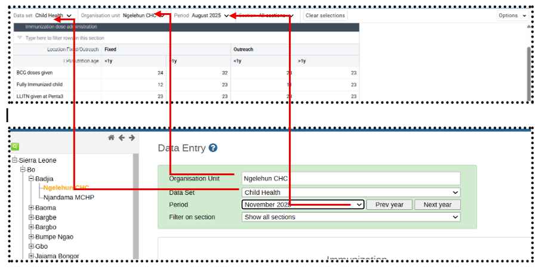

### Option Menu Use/Function

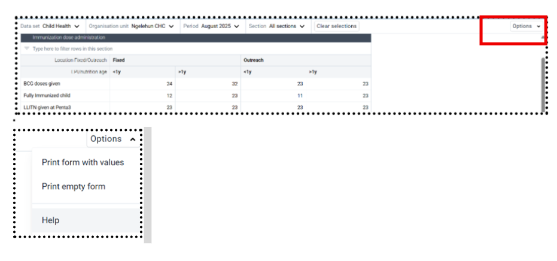

**New App**
1. **Print form with values**: Prints the current data entry form including all entered data values. Useful for reviews, audits, or physical record-keeping.
2. **Print empty form**: Prints a blank version of the dataset form. Useful for offline data collection or field distribution.
3. **Help:** Opens documentation or guidance related to the Data Entry App. Supports users in understanding the interface and resolving issues.

When you click on Help the window will open that is very useful for understanding data entry status at a glance.Built in shortcuts make data entry faster and more efficient.

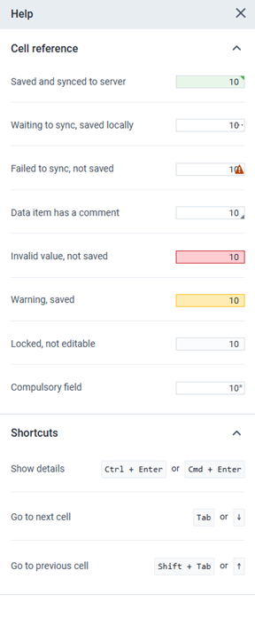

**Old App (Legacy App)** The Print form and Print blank form button is available at the extreme right top corner.

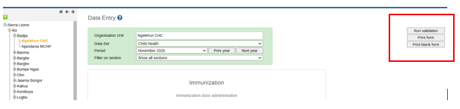

### Sections and Filters

Both are supported with section forms where you can select the section of the form

**New App:** Sections displayed on the top bar; global filter across all sections with the option to narrow down by section.

**Old App (Legacy App):** Section forms only available after selecting the period; filters worked within one section at a time.

**Benefit**: Greater efficiency when working with large/complex forms.

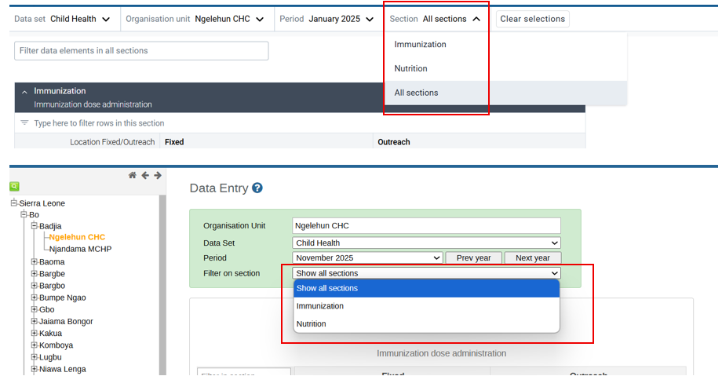

>Note
> In the **Old App (Legacy App),** the data element filter was limited to one section at a time. This meant that if you wanted to find a data element, you had to first navigate to the specific section where it was located (filtering worked only within that active section).
> 
> In the **New App**, the filter is global across all sections and can be applied to one section at a time. This means you can search for any data element from the top filter bar, and it will display results across the entire form, regardless of which section the element belongs to.
> 
> Additionally, when a specific section is open, the filter can be used to narrow down elements within that section alone. This dual functionality offers flexibility and significantly improves efficiency, especially when working with large or complex forms.

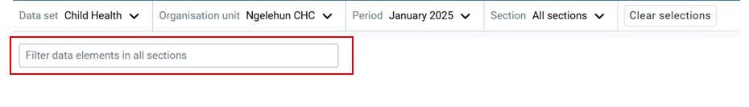
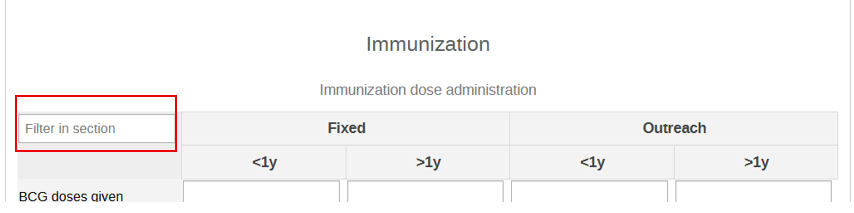
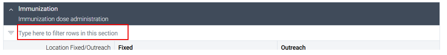

### Run Validation

**New App:** Validation results shown in a **side panel**, grouped into categories: High, Medium, Low. Alerts are summarized for easier review.

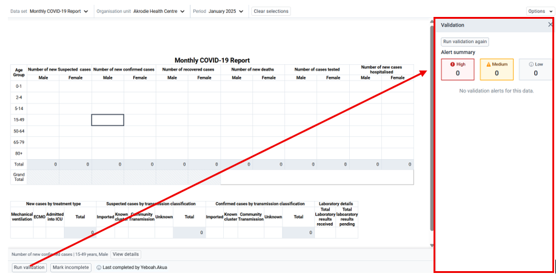

**Old App**: The **“Run Validation”** button is present  (usually in the top right menu bar). And it only pops up the window with all violations messages if any.

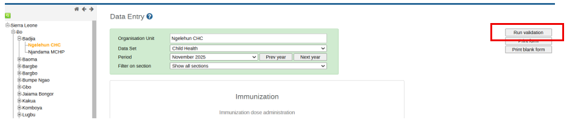

### Data Element Details

**New App** Users can add comments and mark data items for follow-up directly from the data entry screen which gives a more clear view and understanding.Comments, audit history, and legends are handled via side panels

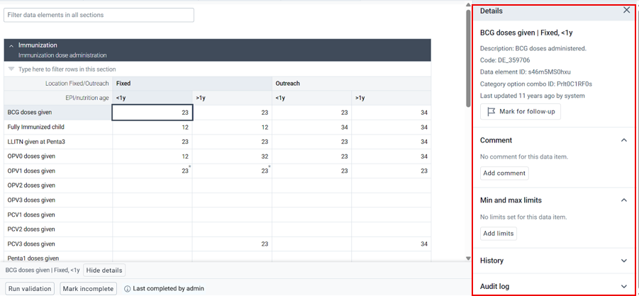

**Old App (Legacy App)** When a user **double-clicked on a data cell** in the Data Entry app (Aggregate), a **popup window** opened.

This popup allowed users to:

* Enter or edit a value
* Add a comment related to the specific data value
* View or update the last updated date
* See who last edited the value

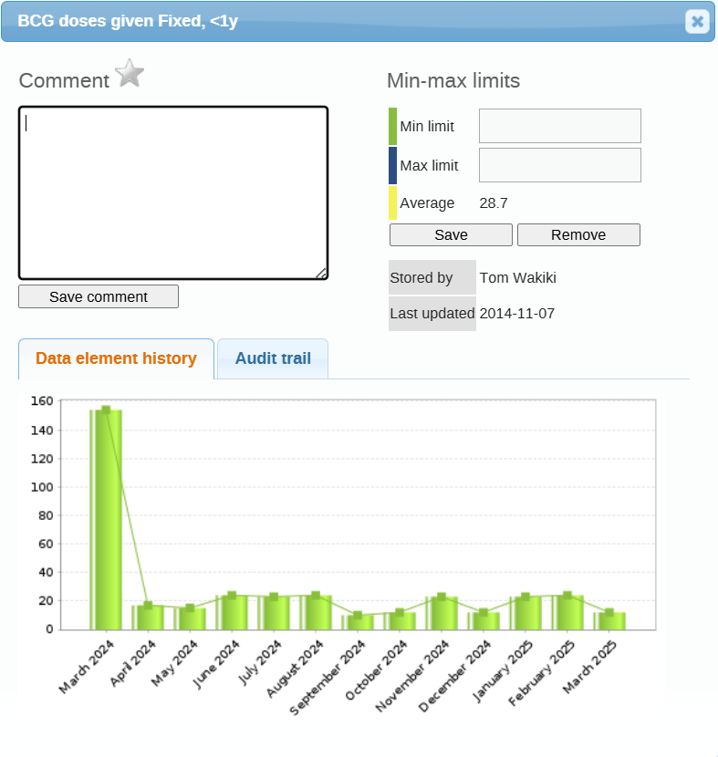

## New Features for V42

### Pivot options in aggregate datasets sections

These pivot tables control how data elements and category option combos are displayed within a section of a dataset.

**Configuring Pivot Options for a Data Set**

1. Open the data set - Navigate to the data set you have created and to which you’ve already assigned data elements.
2. Go to 'Manage Sections' - In the data set settings, click on Manage Sections to organize how your form is structured.
3. Select 'Pivot Options' - Inside the section management view, choose Pivot Options to define how your data will be displayed in analytics.
4. Choose the layout based on your design
5. Configure the pivot options (e.g. whether data elements appear as rows or columns) according to the reporting design and data structure you need.

#### Default
By default, data elements are arranged in rows, while categories (disaggregation dimensions) are displayed in columns.

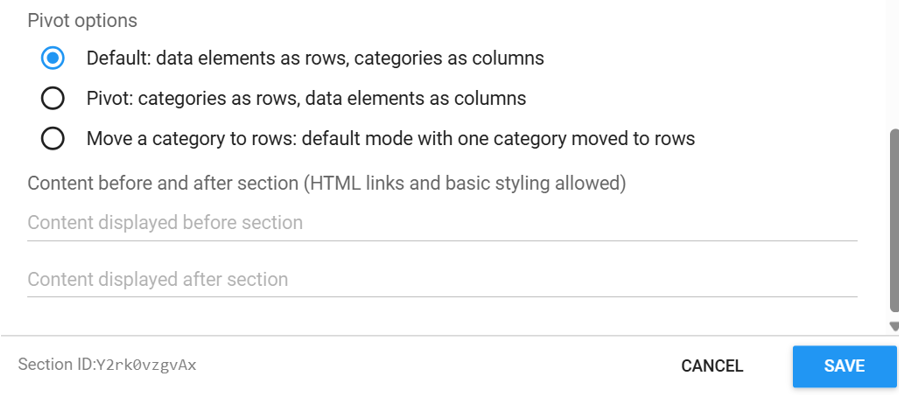      

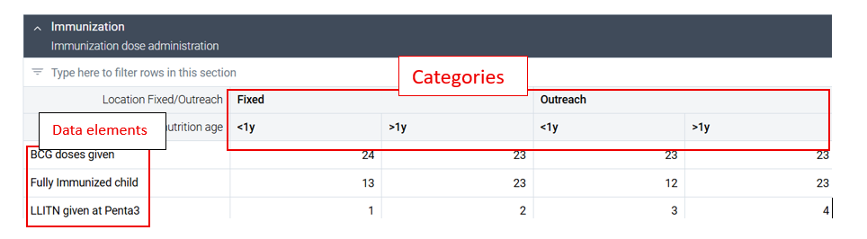

#### Pivot

Categories as rows, data elements as columns
   * Useful when there are **many data elements** and few categories
   * Makes the form **more compact horizontally**
  
  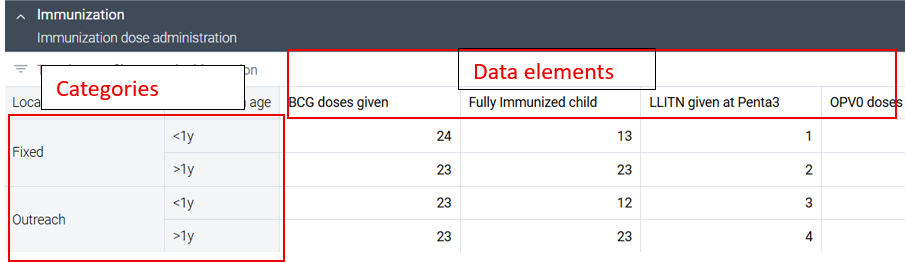

#### Move a category to rows

* It is a hybrid layout
* One category dimension is moved to rows
* It helps to give more control when the dataset is large.

  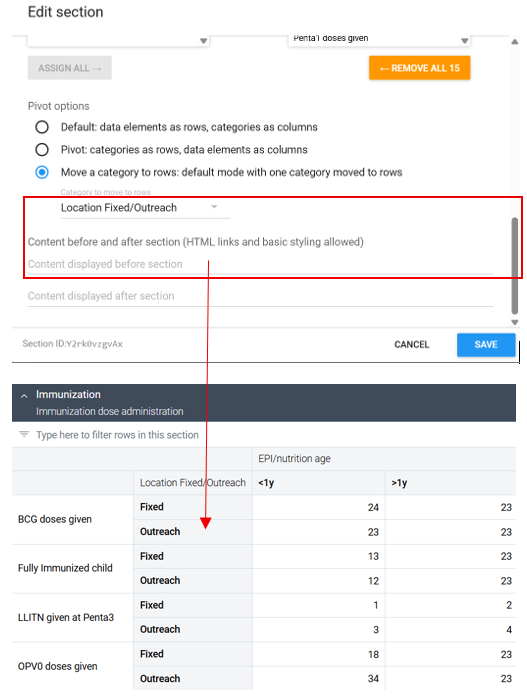

#### Content displayed before/after section

You can add HTML-based instructions, notes, or links that appear above or below the section form — useful for guidance or data entry rules.

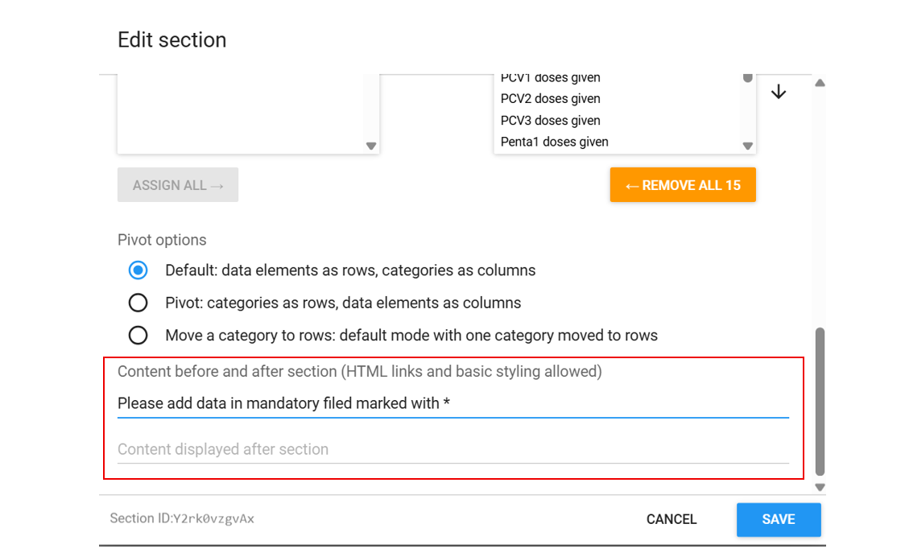
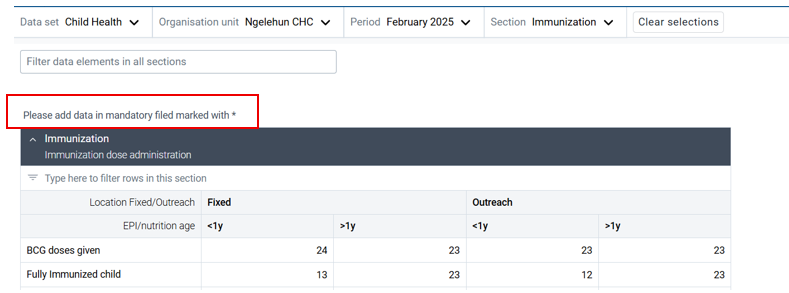

## Moving a Dataset from the Legacy (Old App) to the New App

### Review Current Configuration

* Data elements and category combinations
* Custom or section forms (Check if using Java script)
* Validation rules
* Indicators

### Understand Changes

* Interface - The user interface is different 
* Custom forms  - using Java script are no longer supported but HTML is supported
* Section forms -  are supported but can have different style with use of pivot - style options
* Filtering - Improved filter and search feature

### Prepare for Migration

* Redesign custom forms without using Java script
* Re - adjust the section forms
* Test all the forms in New App

## Limitations of New App

| **Limitations**                  | **Alternative/Workaround**                               |
|----------------------------------|-----------------------------------------------------------|
| No JavaScript support in custom forms | Use indicators for calculations and validations for logic checks |
| No enhanced styling               | Use HTML (only simple table layouts)                     |

## Use cases

Below are the practical examples showing how forms behave in the **Legacy Data Entry App** compared to the **New Data Entry App**.

### Default form:

1. Interface
  
   **Legacy App** 
    - Organisation unit selected from left-hand panel; dataset separately
    - Outdated layout, harder to navigate between forms

   **New App** 
   - Organisation unit, dataset, and period all selected from the **persistent top bar**. 
   - Modern, cleaner layout for faster switching.
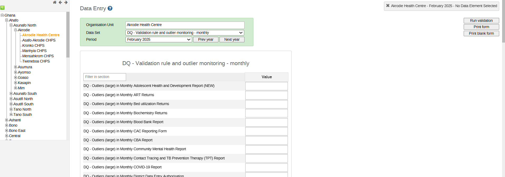
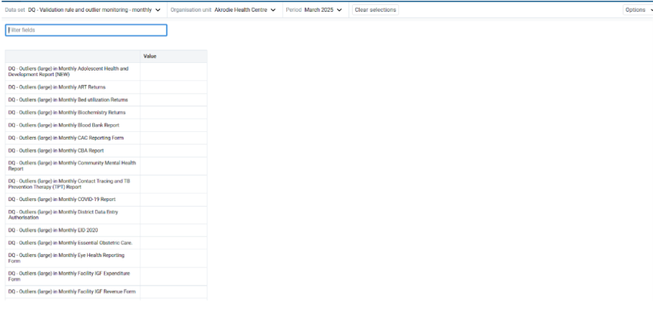

1. Organization unit

    **Legacy App**: All OUs displayed, even if the dataset is not assigned (inactive ones appear greyed).

    **New App**: Only OUs assigned to the form are enabled
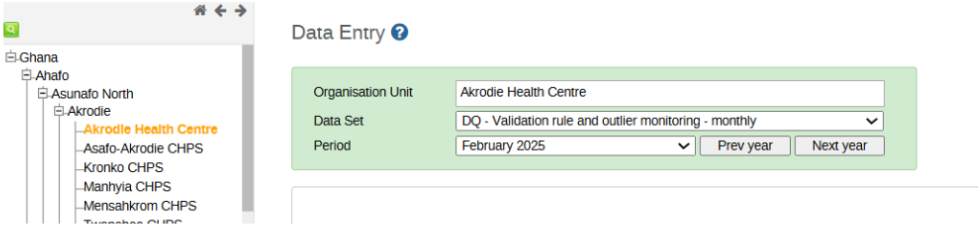
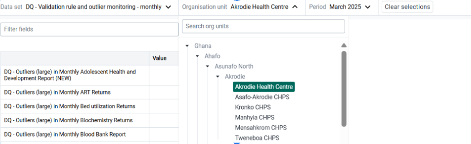

1. Error Display:

   **Legacy App**: AError shown in popup messages

   **New App**: Errors displayed inline within the form, with clearer indicators

   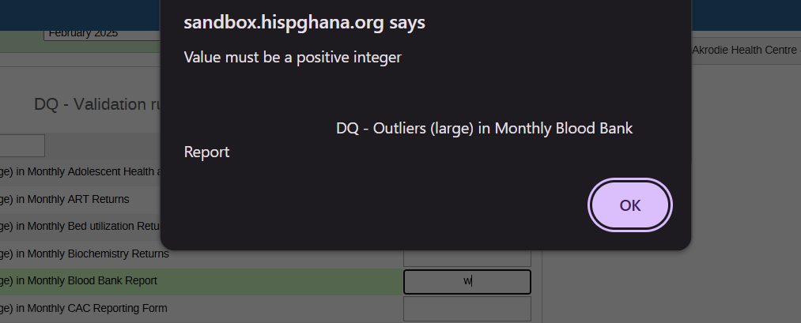
   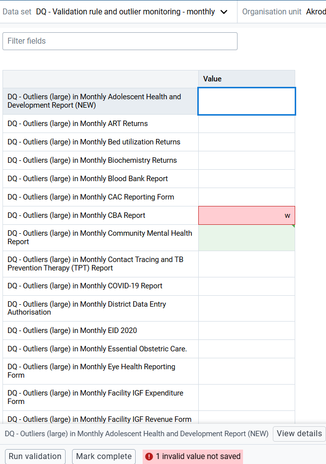

2. Run validation interface

   **Legacy App**: “Run Validation” button in top-right menu; results in a popup.

   **New App**:Validation button at the bottom of the form; results appear in a <strong>side panel</strong>, grouped into <em>High / Medium / Low</em>.

      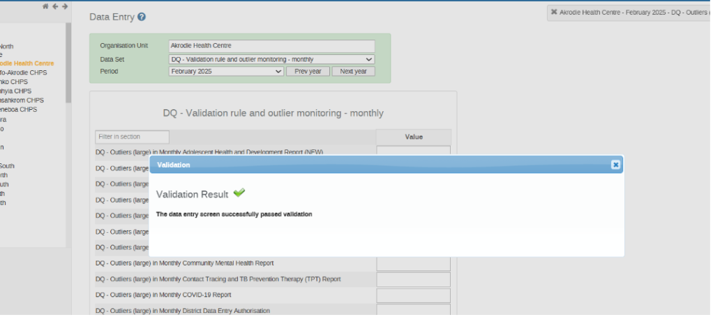
      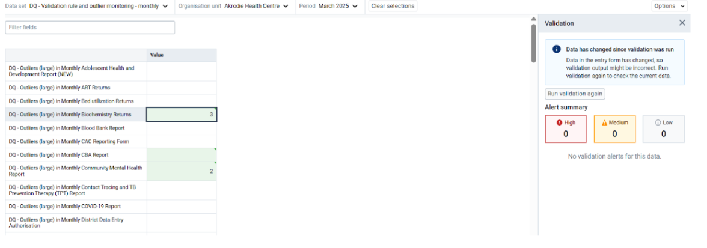

### Section form

1. Interface
  
   **Legacy App**: Sections appear only after period selection

   **New App**:Section tabs are visible at the top bar immediately

      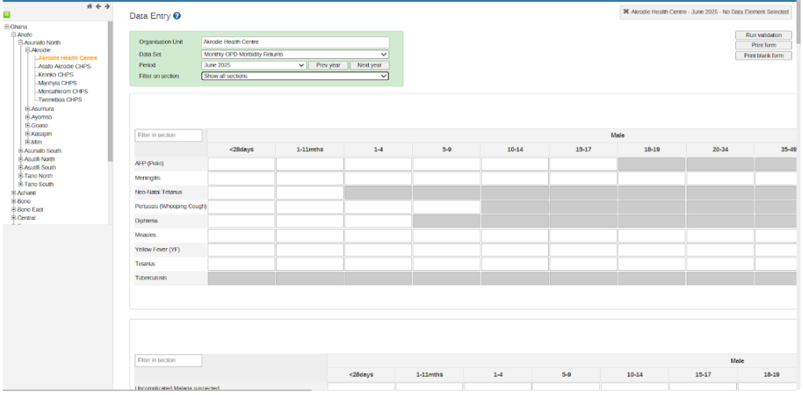
      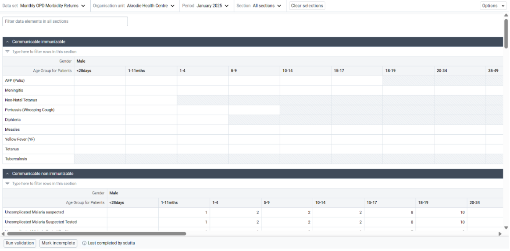

2. Filter section

   **Legacy App**: Filter applies to one section at a time

   **New App**:Global filter across all sections, plus ability to narrow to a single section.
   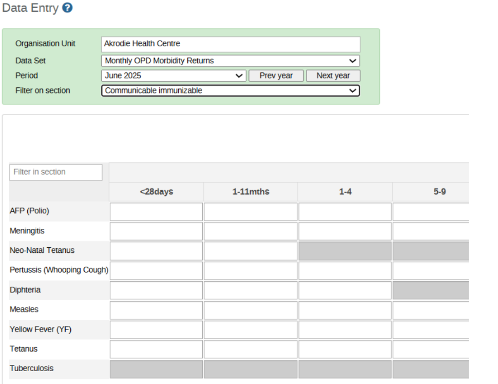
   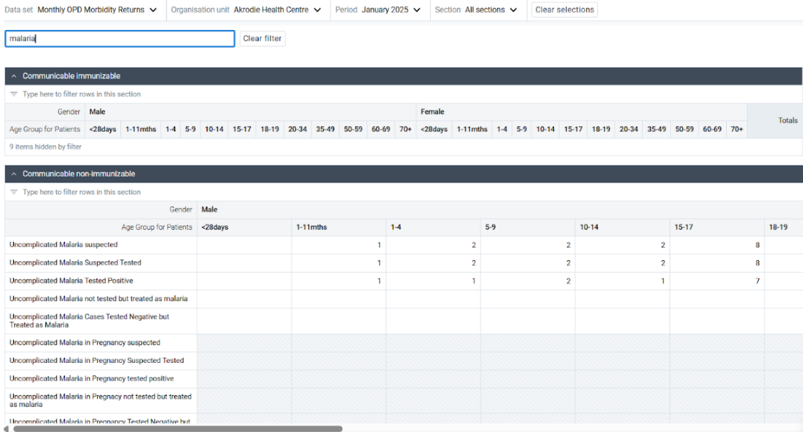

3. New features
   * Row/Column Switching for categories (e.g., “Communicable immunizable” dataset section).
   * Not available in Legacy App.
   * Makes large forms easier to read horizontally or vertically.
  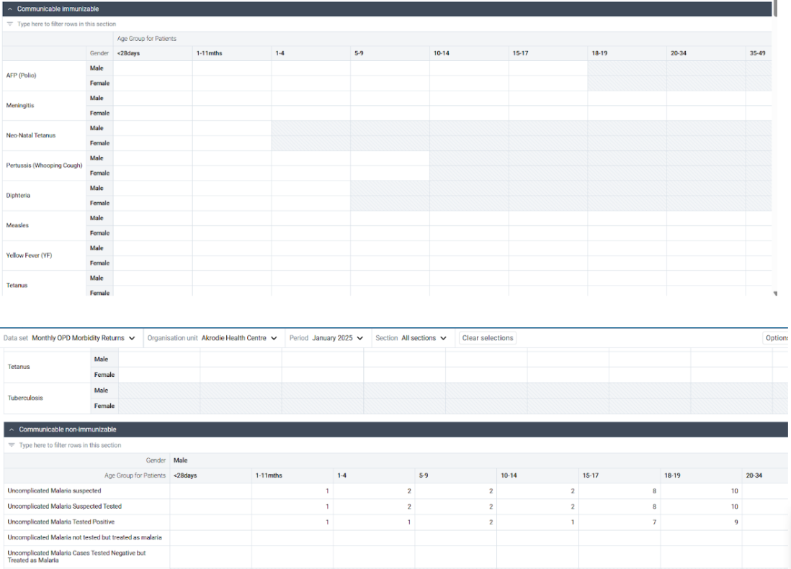

