# Event Reports to Line Listing Transition Guide

***NB: This guide uses screenshots from a Lao PDR demo database. The Lao PDR Ministry of Health has graciously allowed us access to their reporting units, geography and metadata for the purposes of creating training material, guidance and performing testing; data items however are fictional and not representative of any person or value within Lao PDR.***

## Introduction

In DHIS 2.38, the [line listing application](https://docs.dhis2.org/en/use/user-guides/dhis-core-version-master/analysing-data/line-listing.html) was introduced. The line listing app replaces and supplements the line listing functionality that is available within the event reports app. Due to its enhanced feature set, the line listing app can be useful to introduce within an implementation; however there can be significant barriers to introducing a new application without careful consideration. This is particularly the case for a user base that may be trained on how to use the event reports app, as there could be significant resistance to utilizing a new app within their current workflow. This document seeks to outline approaches to successfully implement the line listing app, along with references that can be used to better understand its functionality. 

This app was released under a [continuous release cycle within the DHIS2 app hub](https://apps.dhis2.org/app/a4cd3827-e717-4e09-965d-ab05df2591e5). This means that the application is treated as an independent DHIS2 application; it needs to be installed and updated on its own cycle independent of the core DHIS2 software. 

The line listing application presents several different challenges to an implementation that key implementation personnel need to be aware of in order to scale and utilize its feature set effectively within both new and existing user bases. 

As it is a continuous release, the line listing app needs to be managed and updated within the DHIS2 app hub.
There are user permissions that are added to DHIS2 only after the line listing app is installed. These will need to be added to new or existing user roles in order for users to be able to access the line listing app.
The interface and functionality are very different then other analysis apps, and training will likely be needed to introduce this app effectively. 
It does not fully replace the event reports app, as any type of aggregated pivot tables will still need to be made in events reports, while it is recommended that line lists are made within the line list app. User sensitization to this process will likely be needed.

In order to successfully introduce the line listing app, we recommend that implementation personnel outline a procedure of activities they can follow until the app is successfully implemented. An example set of tasks that we will use and outline in this guide include the following:

1. Understand the features of the line listing app and how to use them
2. Understand when to use the line listing app and when to use the event reports app
3. Become familiar with the continuous release cycle and how this affects how the line listing app is managed
4. Understand how to install and update the line listing app via the DHIS2 app hub
5. Understand the user permissions associated with the line listing app
6. Develop a plan to sensitize users to the line listing app, via training and other communications
7. Create and implement training and communications materials to users to show them how to use the line listing app
8. Evaluate users response to the line listing app and support them as needed

## Features of the Line Listing App

In order to start a review of the features within the line listing app, first have a look at the [user documentation](https://docs.dhis2.org/en/use/user-guides/dhis-core-version-master/analysing-data/line-listing.html). This document discusses some of the key features and outlines the interface within the line listing app. 

To further supplement the documentation, a series of videos that demonstrates the line listing app functionality is available. These videos are located on YouTube. A playlist has been created [here](https://www.youtube.com/playlist?list=PLo6Seh-066Rx5BXFCBKs6pRtuRnJTpXEN), while each of these videos can be found below.

### Feature comparison of event reports line listing and the line listing app

| FEATURE 	| LINE LISTING APP 	| EVENT REPORTS 	|
|:---:	|:---:	|:---:	|
| Types of reports 	| The line list app is capable of making line list type reports only. 	| The event reports app can make both pivot table style reports as well as line list type reports. The line list type reports in event reports have less functionality when compared to the line listing app however, and it is recommended the line listing app be used to create line lists.  	|
| Boolean type data elements (yes/no)  	| Seen as “Yes” or “No” and “Not Answered” 	| Seen as “Yes” , “No” and “N/A” 	|
| User interface/ Navigation 	| Groups dimensions by tab. Tabs include: Input (Event/Enrollment), Program (dates, status, org unit, data items), Your dimensions (OU group sets, etc.), Global dimensions. The layout now persists on top of the line list, and you can drag and drop items as needed to modify the layout Can collapse items through “View” options. You can change the display density, font size, digit separator via the table options. You can include the organisation unit hierarchy in output 	| Follows a very similar input method as other apps (what, where, when - data, periods, org units) followed by OU group sets. Need to select between line list or pivot table type reports. Rearrange column order by opening the layout tab. Can collapse options via arrow selectors. Can change display density, font size, digit separator (also present in DV) via table options. Can include the organisation unit hierarchy in output 	|
| Dates  	| In the line list app you will see the date as yyyy/mm/dd. Time will be added if it is a date-time field only. 	| In the event reports app you will see the date as yyyy/mm/dd 00:00:00:0 (time is included no matter what type of data element/attribute it is) 	|
| Filter out events based on different dates 	| You can filter out events on the basis of report date,due date, scheduled date, enrollment date and incident date 	| N/A. You are not able to filter events out using the different dates associated with your program.  	|
| Global dimensions  	| You can see the users who have created/modified the event and when was the event last updated. 	| N/A. There are no global dimension options available in event reports. 	|
| Download in excel 	| Downloads the table according to the inputs you have selected within the app. 	| Extra columns are added to the download, even if not selected (ex. event/program status, event ID, program stage ID, etc.) 	|
| Repeated events 	| Each row can represent an individual event; but you also have added features which allow you to take a single enrollment and add all of the repeated events to the same line by DE. 	| You can only display repeated events as separate lines/rows. It does allow for aggregation of events vs. enrollments in pivot tables however. 	|
| Legends 	| Legends can be used for values that use a numeric number type (number, positive or zero integer, etc.). 	| N/A. Legends can not be applied to numeric data elements in event reports. 	|
| Data across multiple stages 	| Create line lists across multiple stages; this includes data elements that are reused across stages. The line list app will dynamically update to include the source stage of the repeated data element. 	| Create line lists across multiple stages. A data element can only be selected once; if it is reused in another stage it can not be selected again. 	|
| Conditions/ Filters 	| On text attributes : Exactly Is not Contains Does not contain Is empty Is not empty The filters on numeric items are the same as event reports The filters on option sets are the same as event reports 	| On text attributes : Contains Is exact # items are the same Option sets the same 	|
| Time Dimensions 	| Events :  Select from the event date, enrollment date or incident date Enrollment: Select from the enrollment date or incident date Add in global dimensions as needed. Events or enrollments use these as period selections for the line list, filtering out events or enrollments that do not meet the selected time dimension criteria. 	| Events :  Shows the event date, enrollment date and incident date (even when the incident date is not used in the program) Enrollment: Shows the enrollment date and incident date (even when the incident date is not used in the program) Events use the event date to show events on the line list. Enrollments use the enrollment date to show enrollments on the line list. This is based on the period specified in the “period” selector. 	|

## How to use Event Reports and Line Listing Together

The event reports app and line listing app should be used together at the moment, as the line listing app does not completely replace all of the functionality in event reports. It is important to note that any line list created in event reports can be opened in the line listing app. You will be able to make changes to these line lists, but will not be able to overwrite them in the line listing app. You will have to save a new copy of this report after you have made your updates. 

Here is an example of a line list that was created in event reports, opened in the line listing app and then updated. We can see the “Save” option is greyed out. To save these changes, we would need to select“Save as” - which would create a new copy of the line list. 

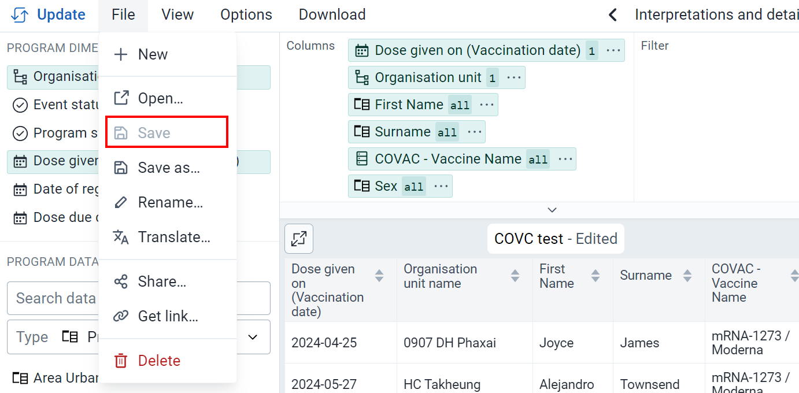

Keep this consideration in mind if you are transitioning any of your existing line lists from event reports to the line listing app.

### Event Reports

The event reports app should be used any time you are wanting to make a pivot table style report, like this

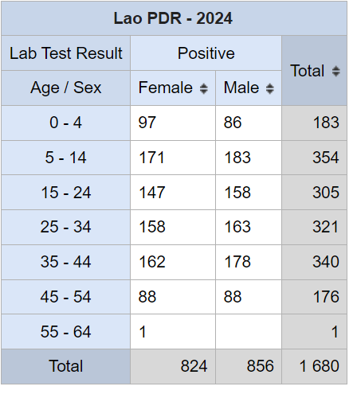

There are two output types when making a pivot table in event reports:

- Event
- Enrollment

The event type output will count events, even repeated ones, in the output when making the table. The enrollment type output will only count the enrollment, so repeated events will not be counted in these totals (event data will be taken from the most recent event when using the enrollment). Here is an example comparison for vaccination doses, where the vaccinations are contained within a repeatable stage. 

You will see in this output that the number of doses when using the event output is larger than the registrations using the enrollment type output. This is because the enrollment type output is only counting the unique registrations. Keep this in mind when you are making your pivot tables in event reports.

### Line Listing

The line listing app should be used any time you are wanting to make a line list, like this

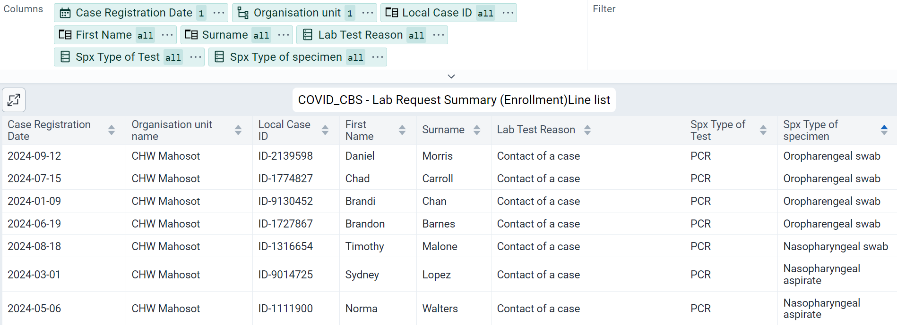

The line listing app also allows you to make lists using both event and enrollment type. There are several differences between these two types in the line listing app. Please review the [user documentation](https://docs.dhis2.org/en/use/user-guides/dhis-core-version-master/analysing-data/line-listing.html) and feature demonstration videos which highlight these differences further.

## Line Listing Continuous Release

The line listing app is made available via a continuous release cycle. This means that the line listing app is updated independently of the core DHIS2 software. As a result the line listing app is not bundled with the core DHIS2 software, it must be installed and updated via the DHIS2 app hub.

### Installing the Line Listing App

In order to install the line listing app, a user must have access to the app management app in DHIS2.

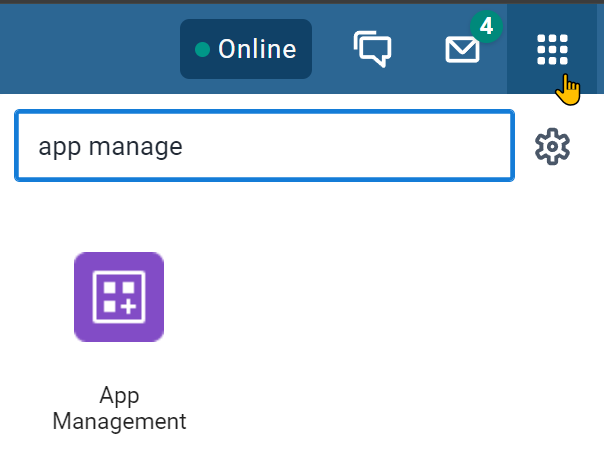

From within the app management app:

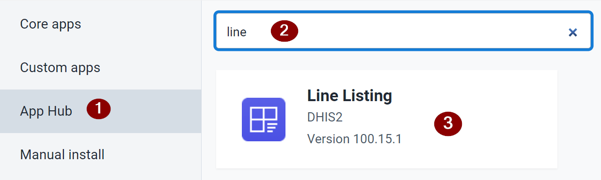

1. Select the app hub
2. Search for the line listing app
3. Select the line listing app

After selecting the line listing app, you will have an option to install the app to your system. 

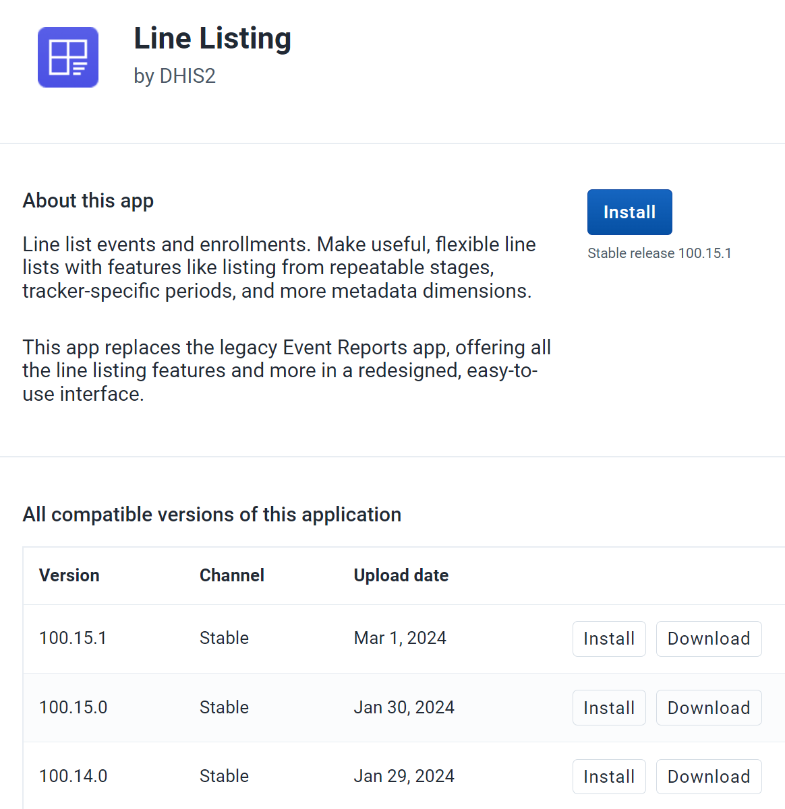

You will see there are different versions of the app available. It is recommended that you install the latest version, especially if it is your first time using the app. 

Select “Install” in order to install the app to your system.

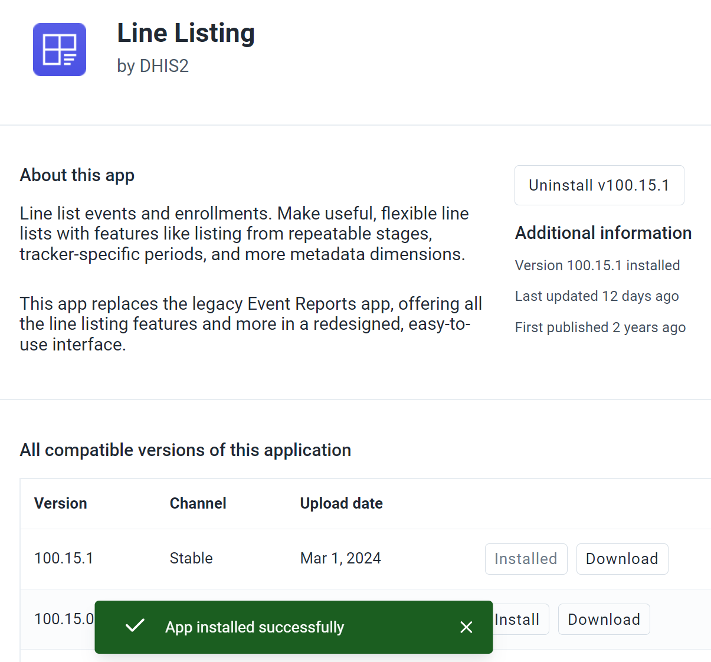

You should receive a notification that the app has been installed successfully at the bottom of the screen. The blue install button will also now change to an “uninstall” button.

## User Access

After the line listing app is installed, a user needs to be granted access to the app. In addition, the user may need to be given specific permissions to create and save the line lists they make in different ways. This can be achieved in two ways:

Creating a new user role and assigning this user role to relevant users
Updating an existing user role. Users with access to that role will automatically be granted the new authorities needed to work with the line listing app.
In most scenarios, it is recommended that an existing user role is updated. Essentially, anyone who had access to use event reports should also be able to access the line listing app; so those roles providing access to event reports should be updated accordingly to include access to the line listing app.

After installing the line listing app, a new authority is added to the list when managing a user role. This authority is the “linelisting app” and is located within the “Other authorities” section. Add this authority to a new or existing user role in order to give access to the line listing app. 

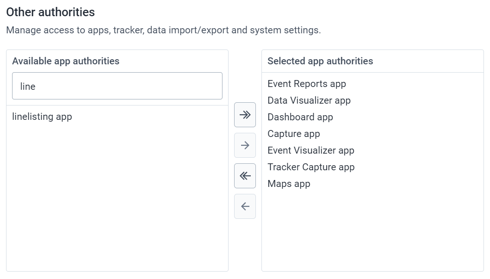

You may also want to verify the user role has the correct permissions related to creating line lists. These are still attached to the metadata authorities for event reports. 

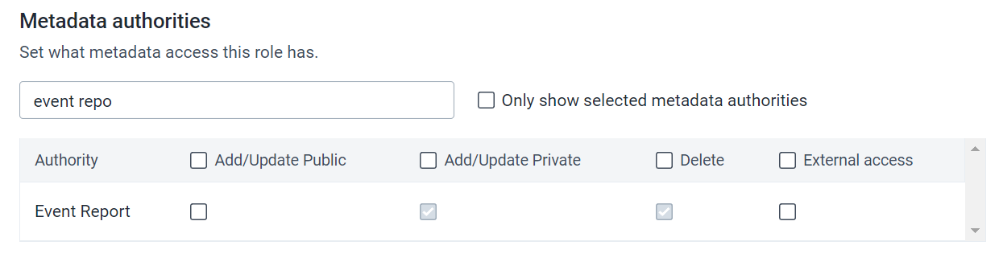

### Updating the Line Listing App

#### Reviewing changes to the app

The line listing app will be updated routinely, however it does not automatically update itself. This is by design, as while it is relatively easy to update the app, it is recommended that a review of the changes implemented in the app are reviewed prior to making the actual update.

Let us take a look at an earlier version of the line list app

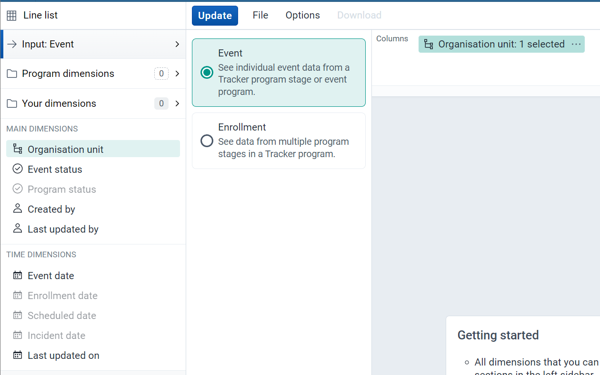

In this version of the app, you selected the input in one tab, while the program was selected in the “program dimensions” tab. Dimensions like the organisation unit and time period are located on the left side of the app. 

Compare this to an updated version of the line listing app.

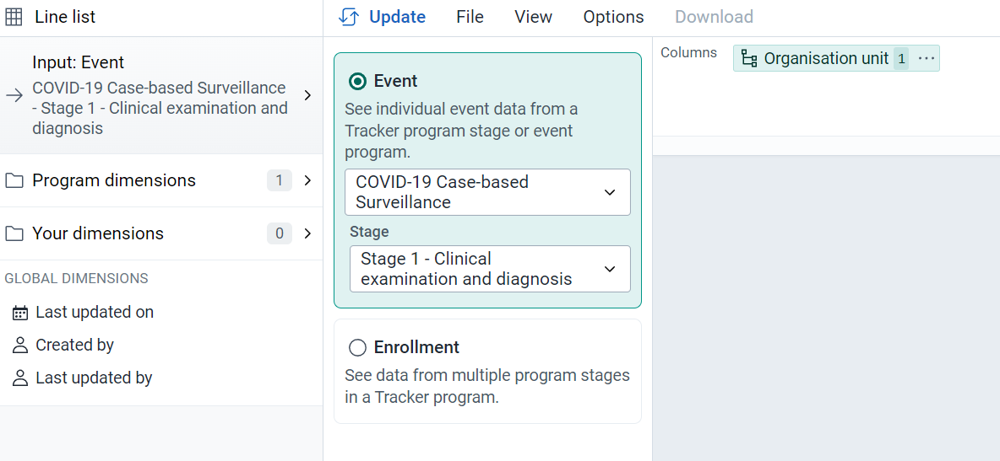

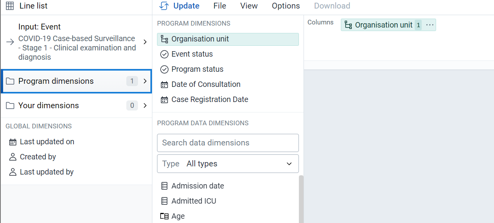

In this updated version, we can see that we select the program from within the input tab, and that the organisation units and time dimensions are selected within the program dimensions tab instead of being on the left side of the screen. Further to this, a new “global dimensions” section has been added. 

These are significant changes in the workflow, and users would need to be made aware of these changes before they are rolled out. There could also be new features that get added to the app over time, and these could also be useful for users to understand. 

In order to review these changes, you can either review the latest DHIS2 demo on https://play.dhis2.org or, preferably, install the latest version of the app on a development server which is a copy of your own system. Using the second option, it is also worthwhile to test the app to make sure it functions as you would expect it to before upgrading the version on your production system (if it does not, it is worth holding off on the upgrade until any issues you discover are fixed). 

To review a summary of the latest changes, access the software release notes located on https://dhis2.org/downloads/. Scroll down to “Core software” and access the “feature overview” for a description of new features. 

***Based on what you see during your testing, you should create and implement a strategy to inform users of new features, changes in functionality, layout, etc. within the app.***

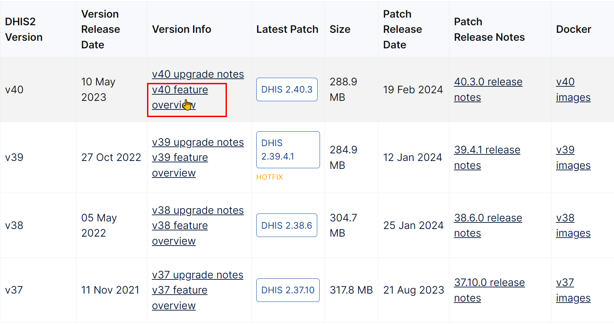

#### Updating the app

In order to update the line listing app, a user must have access to the app management app in DHIS2.

From within the app management app:

1. Select the app hub
2. Search for the line listing app
3. Select the line listing app

After selecting the line listing app, you will have an option to update the app that exists on your system. 

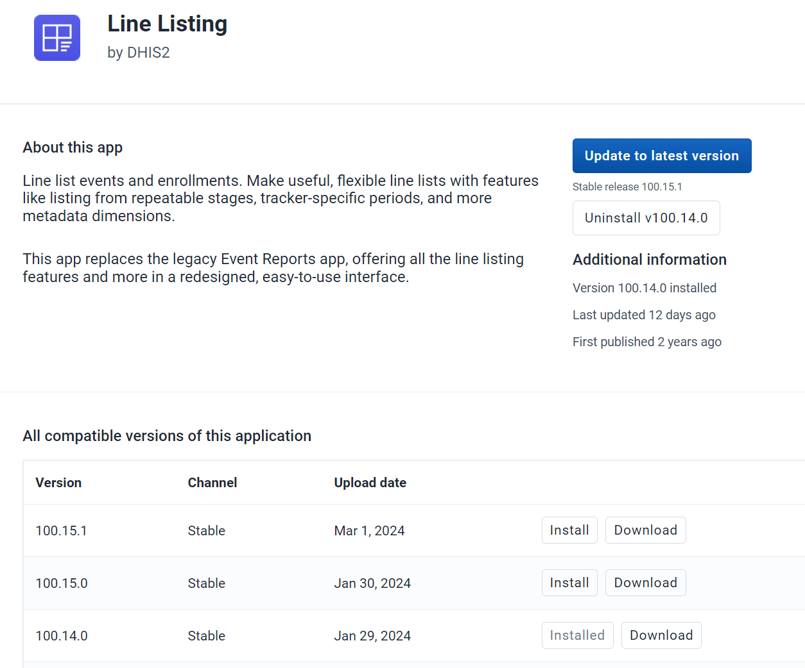

If you have followed the procedure outlined in the section “Reviewing changes to the app” ***then you should only update to the version of the app in which you have tested and created a roll out strategy to inform users of changes for***. If this is the latest version of the app, you can select the blue “update to latest version” button. If this is another version of the app, scroll down and select “install” to upgrade the current app to a newer version. 

After updating the app, you will receive a notification that the app has been updated successfully.

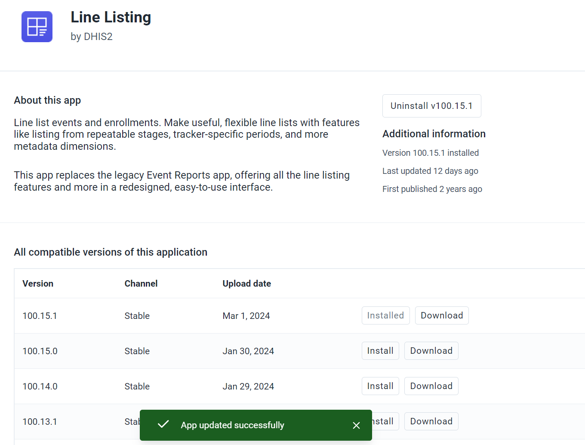

## Reference Training Materials

Training materials from the DHIS2 academy “Tracker Data Capture & Analysis Fundamentals” can be adapted for local use in country and is located here: 

https://github.com/dhis2/training-docs/blob/main/content/tracker_use/tg_event_reports_and_linelist.md 

Please note that this guide includes a review of creating pivot table type reports in event reports, as event reports and line listing should be used together.

