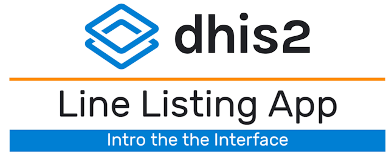

# Event Reports to Line Listing Transition Guide

***NB: This guide uses screenshots from a Lao PDR demo database. The Lao PDR Ministry of Health has graciously allowed us access to their reporting units, geography and metadata for the purposes of creating training material, guidance and performing testing; data items however are fictional and not representative of any person or value within Lao PDR.***

## Introduction

In DHIS 2.38, the [line listing application](https://docs.dhis2.org/en/use/user-guides/dhis-core-version-master/analysing-data/line-listing.html) was introduced. The line listing app replaces and supplements the line listing functionality that is available within the event reports app. Due to its enhanced feature set, the line listing app can be useful to introduce within an implementation; however there can be significant barriers to introducing a new application without careful consideration. This is particularly the case for a user base that may be trained on how to use the event reports app, as there could be significant resistance to utilizing a new app within their current workflow. This document seeks to outline approaches to successfully implement the line listing app, along with references that can be used to better understand its functionality. 

This app was released under a [continuous release cycle within the DHIS2 app hub](https://apps.dhis2.org/app/a4cd3827-e717-4e09-965d-ab05df2591e5). This means that the application is treated as an independent DHIS2 application; it needs to be installed and updated on its own cycle independent of the core DHIS2 software. 

The line listing application presents several different challenges to an implementation that key implementation personnel need to be aware of in order to scale and utilize its feature set effectively within both new and existing user bases. 

As it is a continuous release, the line listing app needs to be managed and updated within the DHIS2 app hub.
There are user permissions that are added to DHIS2 only after the line listing app is installed. These will need to be added to new or existing user roles in order for users to be able to access the line listing app.
The interface and functionality are very different then other analysis apps, and training will likely be needed to introduce this app effectively. 
It does not fully replace the event reports app, as any type of aggregated pivot tables will still need to be made in events reports, while it is recommended that line lists are made within the line list app. User sensitization to this process will likely be needed.

In order to successfully introduce the line listing app, we recommend that implementation personnel outline a procedure of activities they can follow until the app is successfully implemented. An example set of tasks that we will use and outline in this guide include the following:

1. Understand the features of the line listing app and how to use them
2. Understand when to use the line listing app and when to use the event reports app
3. Become familiar with the continuous release cycle and how this affects how the line listing app is managed
4. Understand how to install and update the line listing app via the DHIS2 app hub
5. Understand the user permissions associated with the line listing app
6. Develop a plan to sensitize users to the line listing app, via training and other communications
7. Create and implement training and communications materials to users to show them how to use the line listing app
8. Evaluate users response to the line listing app and support them as needed

## Features of the Line Listing App

In order to start a review of the features within the line listing app, first have a look at the [user documentation](https://docs.dhis2.org/en/use/user-guides/dhis-core-version-master/analysing-data/line-listing.html). This document discusses some of the key features and outlines the interface within the line listing app. 

To further supplement the documentation, a series of videos that demonstrates the line listing app functionality is available. These videos are located on YouTube. A playlist has been created [here](https://www.youtube.com/playlist?list=PLo6Seh-066Rx5BXFCBKs6pRtuRnJTpXEN), while links to each video are located below.

1. [Creating a new line list and reviewing the the menu options within the line listing app](https://www.youtube.com/watch?v=hxgDyBXj7a8&list=PLo6Seh-066Rx5BXFCBKs6pRtuRnJTpXEN&index=2)
2. [Reviewing how the line listing app handles repeated event data (enrollments and events)](https://www.youtube.com/watch?v=urgF6Np7RDk&list=PLo6Seh-066Rx5BXFCBKs6pRtuRnJTpXEN&index=3)
3. [Creating a line list using data from multiple stages](https://www.youtube.com/watch?v=juOy38ZNLbA&list=PLo6Seh-066Rx5BXFCBKs6pRtuRnJTpXEN&index=4)
4. [Creating a line list with numeric data and adding a legend to the line list](https://www.youtube.com/watch?v=9-G_4qcNT3o&list=PLo6Seh-066Rx5BXFCBKs6pRtuRnJTpXEN&index=5)

<iframe width="560" height="315" src="https://www.youtube.com/embed/AwqLT35fjCg?si=niOC0VEOVA7lGiQ9" title="YouTube video player" frameborder="0" allow="accelerometer; autoplay; clipboard-write; encrypted-media; gyroscope; picture-in-picture; web-share" referrerpolicy="strict-origin-when-cross-origin" allowfullscreen></iframe>