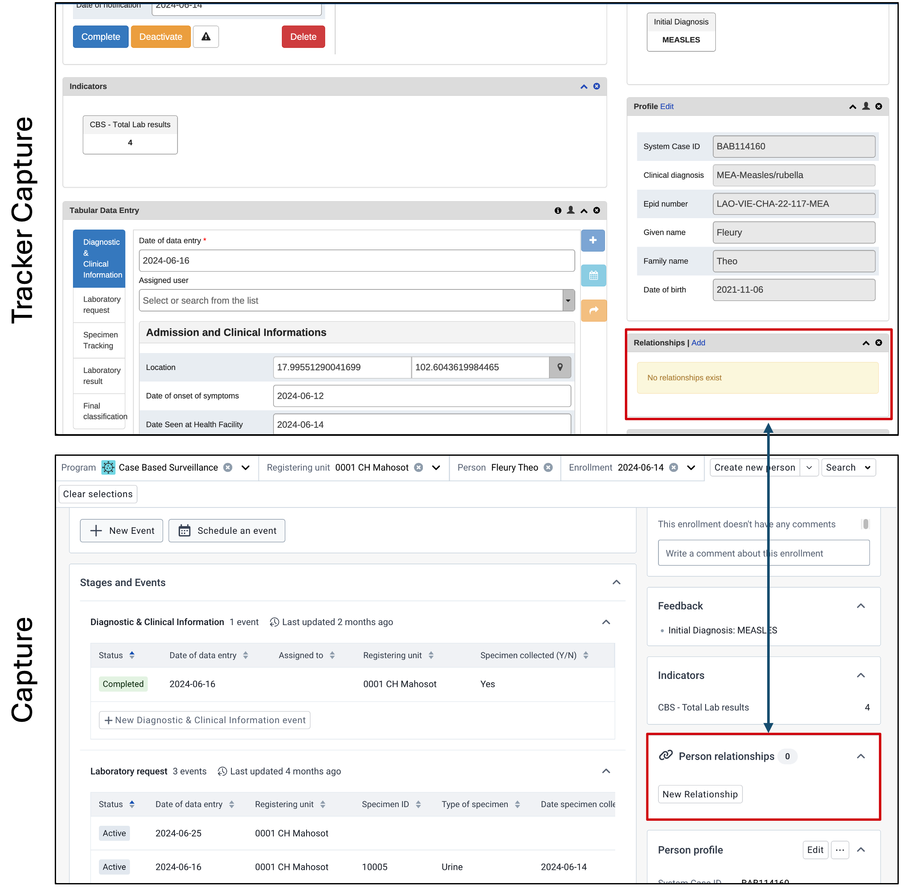

# Tracker Capture to Capture Transition Kit

***NB: This guide uses screenshots from a Lao PDR demo database. The Lao PDR Ministry of Health has graciously allowed us access to their reporting units, geography and metadata for the purposes of creating training material, guidance and performing testing; data items however are fictional and not representative of any person or value within Lao PDR.***

## Introduction

In DHIS 2.41, the capture app reached feature parity with the tracker capture app. This means that, in addition to the enhanced functionality that is being introduced within the capture app, all of the operations that were available within tracker capture can also be performed in the capture app. Further, in DHIS 2.42, the previous tracker capture API will no longer be supported. As a result, some planning is needed to transition users from the tracker capture app to the capture app, ensuring that users are aware of how the workflow and functionality that they are currently performing and using translates over to the capture app.

In order to successfully introduce the capture app, we recommend that implementation personnel outline a procedure of activities they can follow until the app is successfully implemented. An example set of tasks that we will use and outline in this guide include the following:

1. Understand the features of the capture app and how to use them
2. Understand how these new features are translated over from tracker capture
3. Understand which features are new to the capture app when compared to tracker capture
6. Understand the user permissions associated with capture app
7. Develop a plan to sensitize users to the capture app, via training and other communications
8. Create and implement training and communications materials to users to show them how to use the capture app
9. Evaluate users response to the capture app and support them as needed

## Features of the Capture App

In order to start a review of the features within the capture app, first have a look at the [user documentation](https://docs.dhis2.org/en/use/user-guides/dhis-core-version-master/tracking-individual-level-data/capture.html). This document discusses some of the key features and outlines the interface within the capture app.

To further supplement the documentation, a series of videos that demonstrates the capture app functionality is available. These videos are located on YouTube. A playlist has been created [here](), while each of these videos can be found below.

## Feature comparison of the tracker capture and capture apps

In this section, we will compare several distinct operations in the tracker capture and capture apps to show how they are performed and where items in the user interface can be found. 

### Selecting programs and org units

Here we can see how org units and programs are selected in each respective app. 

In ***tracker capture***, we have the org units on the left hand side bar, with the program being selected on the right. If you open the tracker dashboard, then you are brought to a new screen. and these selectors are not avaialable.

In ***capture***, we have a top bar where both the programs and org units can be selected. This top bar persists regardless of where you are in the capture app. The organisation unit is selected from the label "Registering unit." This label is meant to more clearly indicate where a tracked entity was initially registered.

### Reviewing the initial interface

In addition to the org unit and program selectors, additional items in capture have been modified.

1. The working lists in capture are still directly above the front page line list. The working list features have been greatly expanded in capture, and is described in the user documentation, the video demonstrations linked in [features](#features-of-the-capture-app) section of this document and the section in this document on new capture app features. We can see that the full label of the working list is shown in capture, which replaces the icons that are shown in tracker capture. 
2. The Search and Registration buttons are located to the right of the registering unit/org unit dropdown in capture. The order of the buttons has also changed, with the registration button being first followed by search. The registration button is now dynamic and will change its text based on the tracked entity type you are registering. 
3. Items including downloading the data or modifying which attributes appear on the front page line list have been collapsed into menu buttons in capture. 

#### Modifying the front page line list layout

Selecting which columns appear as been moved from the grid icon to a settings icon in capture.

#### Downloading data

Downloading data has been moved from the arrow icon to a menu button in capture

### Registration

In the capture app, the registration button is now located next to the org unit selector. The registration button has been updated to be more dynamic, with the label being modified based on the tracked entity type the program us using. We can see this in the example below for the capture app; the tracked entity type is "malaria case" and the registration button reads "Create new malaria case."

#### The registration page

The registration page has received an interface update to be more in line with the overall design within capture. The regisration page also supports additonal information, such as indicators and feedback, directly on the registration page within the capture app.

#### Display of duplicates during registration

When registering a new person, the look of duplicate detection has changed slightly in capture. To reduce horizontal scrolling/collapsing of text, selected attributes appear in a vertical list for each duplicate that is detected. The dialogue buttons for saving a new case and cancelling the enrollment/creation of the TEI have also been changed when compared to tracker capture.

### Searching

In the capture app, the search button is now located next to the registration button. 

#### The search page

The search page in capture is now updated to have tabbed layout; unique tracked entity attributes along with searchable, non-unique tracked entity attributes are divided into collabsible sections. You are also able to create working lists that can be saved and viewed through accessing the search page in capture.

### The dashboard

The dashboard in capture has received a significant update, and a full description of this new dashboard is available [here](#describing-the-new-dashboard-in-capture). We can see many of the elements have been moved and given a modified look within capture. Stages and events are now grouped together within the data entry section of the dashboard, rather then presented in a timeline or tabular format as is seen in tracker capture. All of the widgets, like indicators etc. have been moved to the right side of the screen. We also see that the top bar used to initially select the program persists, with information added on the tracked entity you are working with. 

### Data Entry

Data entry in capture takes on a bit of a different look and feel when compared to capture. As program stages and events are not displayed above in a timeline or at the side in tabular fashion, the steps create and edit events is different. We can see a comparison of this change in appearance in the image below. 

***Creating a new event*** is also handled differently in capture compared to tracker capture. 

In **tracker capture**, if in timeline data entry, you would select the "add new" button within the timeline, followed by the event and event date, in order to create a new event. 

In **capture**, you can scroll down to the stage you want to create a new event for, and create a new event. This will take you directly to the event itself where you can either select a past or present date, or schedule the event for the future if your configuration allows for it. 

***Completing an enrollment*** is moved to a new enrollment widget located on the right side of the screen in capture. In capture, you 

1. Select the enrollment actions button
2. Select the complete button

Other actions within the tracker capture enrollment widget have also been moved to this new enrollment actions button in capture including:

1. Marking the record for follow up
2. Performing transfers (this is discuessed more in the [referrals and transfers](#referrals-and-transfers) section)
3. Mark as cancelled (similar to deactivate in tracker capture)
4. Deleting the record (there are new permissions related to who can delete the record discussed in the [user permissions](#user-permissions) section)

### Relationships

In both tracker capture and capture, you are able to make relationships using a relationship widget.

The process to add these relationships has been modified.

In **tracker capture** you would

1. Select the "Add" button within the widget. This would result in a pop up
2. From the pop up, you would select the relationship type
3. You would then select the program
4. You then have options to search for an existing TEI or add a new one

In **capture** 

1. Select "new relationship." This will take you to a new screen rather then a pop up window
2. You then select the relationship type
3. From here you then have options to search for an existing TEI or create a new one
4. Finally, you can select your program and either perform the final relatonship actions through searching or adding a new TEI

### Enrolling in multiple programs

Enrolling a TEI into another program is very similar in both tracker capture and the capture app, with the largest changes being in the interface as is demonstrated below. 

1. Select the program from within the enrollment dashboard
2. Verify that you want to enroll them in the program you have selected
3. Shared details between the two programs will automatically be filled in; you can fill in the remaining details as needed
4. Save the enrollment to complete this process

### Referrals and Transfers

You can perform referrals/have a single event in a different location as well as perform a permanent transfer in the capture app. How this is done is a bit different when compared to tracker capture.

Lets start with reviewing a single event in a different location. We can do two operations essentially.

1. We can create an event in a different org unit at the time of data entry
2. We can schedule an event in a different org unit, similar to the previous referral functionality

#### Create an event in a different org unit at the time of data entry

In order to create a new event in a different org unit at the time of data entry in ***tracker capture*** you need to: 

1. Select the org unit you want the new event to appear in on the left side menu
2. Select the program you want the registered event to be in
3. Search for the TEI in the program and navigate to the dashboard
4. Create the event
5. The event will appear in the org unit you have selected

In order to create a new event in a different org unit at the time of data entry in ***capture*** you need to: 

1. Search for the TEI in the program. This can be from any org unit, including the registering unit or another organisation unit.
2. Navigate to TEI dashboard
3. Change the org unit selected in the registering unit dropdown
4. Create the event, enter the details and save the event

#### Schedula an event in a different org unit

In order to schedule a one-time referral to have an event in another org unit in ***tracker capture***, you need to:

1. Search for the TEI in the program and navigate to the dashboard 
2. Use the "make referral" action button in the data entry widget
3. Select the event you want to have scheduled in the other org unit
4. Select the org unit you want the event scheduled in
5. Select the event date that you want to schedule for the new event
6. Select the "one-time" referral button

In order to schedule a one-time referral to have an event in another org unit in ***capture***, you need to:

1. Search for the TEI in the program and navigate to the dashboard 
2. Change the registering unit to the org unit you want to schedule the event in
3. Use the "schedule an event" action button in the data entry widget
4. Select the event you want to have scheduled in the other org unit
5. Select the event date that you want to schedule for the new event
6. Select the "one-time" referral button

#### Performing a permanent transfer

In order to perform a permanent transfer in ***tracker capture***

1. Search for the TEI in the program and navigate to the dashboard 
2. Use the "make referral" action button in the data entry widget
3. Select the org unit you want to transfer the TEI to
4. Select the "Move permanently" button

In order to perform a permanent transfer in ***capture***

1. Search for the TEI in the program and navigate to the dashboard
2. From the enrollment widget, select the "enrollment actions" dropdown. Then select the "transfer" option
3. Select the org unit you want to transfer the TEI to and select "Transfer"

### Working lists

## New Features in the Capture app

A review of the new features available in the capture app, is available here. You can also refer to the section [features of the capture app](#features-of-the-capture-app) to review the user documentation as well as a series of videos that have been made describing the capture apps functionality.

### Working Lists

### The enrollment dashboard

The dashboard starts with the following items:

1. Top Bar/Header - The top of the dashboard defines your context. For example in the image below the context is as follows, the selected program is "Malaria case notification, investigation and response", the organisation unit is "PPM Chanthabouli", the selected person is "Contrerars" and the enrollment date is "2022-07-01".

2. Quick Actions - The widget will show the frequently used actions for the current enrollment.

3. Program stage list - Stages can be collapsed or expanded to reveal the events inside.

**Collapsed stages**: In the collapsed state, you can view the summary information about stage including:

- Icon
- Program stage name
- Program stage description (on hovering the information icon)
- Total number of events - Last updated date Depending on the status of events, there can be additional information regarding: total number of overdue events or total number of scheduled events.

**Expanded Stages:**

When you expand the one of the stages, you will see the table contains the data of events in the stage. This includes mandatory columns:

- Status,
- Report date and
- Registering unit,
- Additional columns depend on the data elements that have been selected as Display in the list of events in maintenance

In the case of a program stage with repeated events, events are sorted by event date with the most recent located at the top of list.

#### Widget Descriptions

1. Stages and Events - This is for doing data entry using either default or custom forms. Depending on the program definition, in particular program stages and events will be displayed.

2. Comments about enrollment - This is to allow you to make any general comments on the enrollment of the TEI.

3. Indicators - Any indicator defined for the selected program will have its value calculated and displayed under this widget.

4. Relationships - This helps to relate the selected TEI (the one whose dashboard is shown) to another TEI depending on the relationships that are defined in the system.

5. Person Profile - This is to edit TEI's profile or attributes. You can also delete the TEI using this widget if the person has the appropirate level of access.

6. Enrollment - The enrollment widget shows key details regarding the enrollment. A number of actions can also be completed via this widget related to the enrollment including:

- Change the enrollment status to Active, Canceled or Completed using the buttons in the menu.
- Mark or remove the enrollment for a follow-up.
- Transfer the enrollment to another organisation unit
- Delete the enrollment
- Add coordinates to the enrollment (if the enrollment is configured to capture coordinates)

Feedback (this widget is not displayed in this example) - In this widget you can place summary information about the TEI for review. For example if the person has allergies or you want to display information on related to their current diagnosis, you can place this information here based on what has been entered in the program.

## User Permissions

## Training Material
