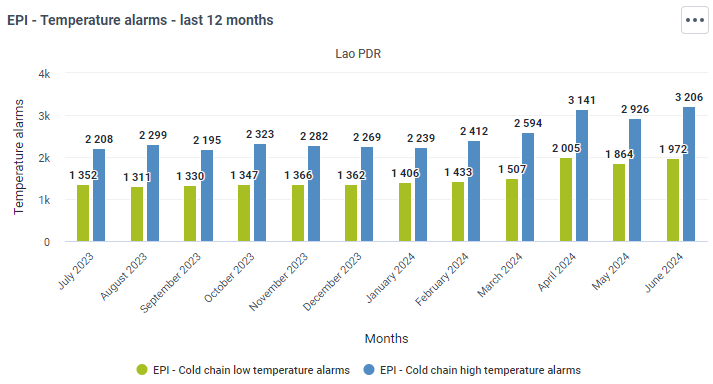

# Data Visualization Best Practices

## Introduction
Data visualization is a powerful tool for understanding and communicating data. The choices made in visualization are crucial and should be guided by the type of data and the message that needs to be conveyed. Proper visualization can reveal patterns, trends, and insights that might be missed in raw data. Fortunately, data visualization follows established rules and design principles that align with the type of variables being used, ensuring that it is not a matter of personal opinion but rather a structured and effective approach.  

## Variables
**Any Measurable Characteristic is a Variable**  
Variables can be broadly classified into two categories:  
1. Categorical (Qualitative)  
2. Numerical (Quantitative)  

Understanding these categories is essential to selecting the correct chart type and designing it effectively.  

### Categorical Variables
- **Nominal** - Unordered categories (e.g., marital status). These categories do not have a meaningful order.  
  - For example, marital statuses like single, married, divorced, and widowed are distinct categories without a ranked order.  
- **Ordinal** - Categories with a meaningful order (e.g., disease status). These categories have a logical sequence.  
  - For example, disease severity might be classified as mild, moderate, and severe, which has an inherent order.  

> **Note**:
>
>**Binary variables are a subtype of dichotomous variables**, assigned either a 0 or a 1 (e.g., Male (0) and Female (1)). They represent two categories, usually for simple yes/no, true/false conditions. Dichotomous variables can be discrete or continuous, similar to regular discrete and continuous variables.

   

### Numerical Variables
- **Discrete** - Countable number of variables (e.g., number of siblings, dead/alive = discrete dichotomous). Discrete variables take specific values and cannot be meaningfully divided.  
  - For example, you can't have half a sibling or be half alive.  
- **Continuous** - Infinite values within a given interval (e.g., weight and height, pass/fail = continuous dichotomous). Continuous variables can take any value within a range.  
  - For example, height can be 170.5 cm or 170.55 cm.  

## Choosing the Right Chart  
What’s the best way to choose the right visualization for the data at hand? [From data to Viz](https://www.data-to-viz.com/) proposes an exhaustive map of visualizations matched to the category of data. 
  
Another Chart Chooser is mapped in the [Extreme Presentation Method](https://extremepresentation.com/).  

    

The summary below is based on the visualizations available in the core DHIS2 Data Visualizer App.  

### Categorical Variables
#### Single categorical variable

- **Barplot**: Displays the frequency or proportion of categories using bars. Each bar represents a category, and its height indicates the value.  
- **Pie chart**: Represents parts of a whole as slices of a circle. Each slice’s size is proportional to the category's frequency.  
- **Spider plot**: Also known as a radar chart, it shows multiple categories on axes starting from the same point. Useful for displaying performance metrics across different categories.  

#### Multiple categorical variables  
- **Grouped/stacked Barplot**: Grouped barplots show bars for each category side by side, while stacked barplots stack them on top of each other.  
- **Heatmap**: Uses colour to represent values in a matrix format, where one dimension represents one category and another dimension represents the second category.

### Numerical Variables
#### Single numerical variable
- **Histogram**: Shows the distribution of a numerical variable by dividing the data into bins and displaying the frequency of observations in each bin.  

#### Two numerical variables
- **Ordered**  
  - **Area plot**: Similar to line plots but with the area under the line filled. Useful for showing cumulative values over time.  
  - **Line plot**: Displays information as a series of data points connected by straight lines. Suitable for trends over time.  
- **Unordered**  
  - **Histogram**: This can also be used to compare the distributions of two different variables.  
  - **Scatter plot**: Plots two variables as points on a Cartesian plane. Each point represents an observation's values on the two variables.  

#### Three numerical variables  
- **Stacked area plot**: Shows multiple series of data as layers stacked on top of each other. Each layer represents a series' value.  
- **Line plot**: Can be used to show multiple series of data over time.

#### Four or more numerical variables  
- **Ordered**:  
  - **Stacked area plot**: Shows multiple series of data as layers stacked on top of each other. Each layer represents a series' value.  
  - **Line plot**: This can show trends of several variables over time.  
- **Unordered**:
  - **Heatmap**: Uses color gradients to represent data values in a matrix, making it easy to spot patterns and outliers.  

### Specific Visualization Styles
>**Note**
>
>**Data speaks louder than words!**

In data visualization, choosing the right type of chart or graph is crucial for effectively communicating your data. Each visualization style has its strengths and is best suited for specific types of data and analytical purposes. This chapter explores a variety of visualization styles, detailing their applications and best practices. Whether you're looking to show trends over time, compare quantities, highlight correlations, or illustrate parts of a whole, selecting the appropriate visualization method will enhance clarity and insight. By understanding the nuances of each style, you can ensure that your data tells a compelling and accurate story.

#### Correlation
>**Note**
>
>Correlation assumes a causal relationship unless specified otherwise. Be cautious in interpreting correlation as causation.  

- **Scatterplot**: Shows the relationship between two continuous variables, each having its axis. Each point represents an observation's values on the two variables. It's useful for identifying trends, clusters, and outliers. For example, a scatterplot can display the relationship between the number of immunization campaigns conducted in various districts and the resulting immunization coverage rate.

- **Column + line timeline**: Shows the relationship between an amount (columns) and a rate (line). This combination is often used to compare a quantity with its rate of change over time, such as HIV-tested patients (columns) and positivity rate (line).

  

#### Ranking

>**Note**
>
>Emphasizes the item's position in an ordered list rather than the absolute value.  

- **Ordered bars/columns**: Shows ranks of values more easily when sorted. This visualization helps to quickly see the highest and lowest values. An ordered bar column chart can be used to display the number of TB cases in each district, sorted in descending order to highlight the districts with the highest burden.

- **Slopes**: Shows how ranks have changed over time. Useful for visualizing changes in ranking positions, such as tracking the incidence of malaria in different regions over several years to see how the ranking of regions by incidence rate changes over time.

  

#### Change Over Time  

>**Note**
>
>Keep gaps between columns small to highlight data shape.
Use markers for irregular data points.  

- **Column**: Emphasizes changing trends. Columns are used to show discrete data points over time. For example, monthly case figures can be shown as a column chart.
  - **Keeping the space between columns** in a column chart close to each other is crucial for emphasizing the continuity and patterns within the data. When columns are placed closely together, it creates a more cohesive visual representation, making it easier to compare values across categories or periods. This proximity helps the viewer quickly identify trends, variations, and overall data distribution, enhancing the clarity and effectiveness of the chart. Additionally, minimizing the gaps between columns reduces visual clutter and ensures that the focus remains on the data itself, rather than on the empty spaces.  

  

- **Line**: Best for visualizing continuous data over time. Line charts are effective for showing trends, cycles, and fluctuations. For example, a line chart could track the changes in CD4 cell counts over time for a cohort of patients, illustrating the impact of treatment interventions.  

- **Year over Year (column and line)** - Compares the same period across different years to show trends over multiple years using lines. For example, the YoY line could be used to compare malaria incidences across several years, while the YoY columns could be used to visualizing the annual malaria number of malaria cases over multiple years.  

- **Area charts**: Good to show changes in totals but tricky for components. Area charts are powerful for illustrating trends and changes over time, providing a strong visual impact by highlighting the magnitude and total values of data sets. They are particularly effective for showing cumulative data and allowing comparisons of multiple data series. However, they can become cluttered and difficult to read when multiple categories are involved, as distinguishing individual components can be challenging. Additionally, changes in lower layers can distort the perception of upper layers, potentially leading to misinterpretation. While effective for highlighting totals, area charts are less suitable for discrete data points or non-cumulative data and can be problematic for colourblind viewers or black-and-white prints. For example, it could be tracking the total number of TB or malaria cases reported across different regions over a year to visualize the overall burden and trends.  

Magnitude   

>**Note**
>
>Small gaps highlight data shape. Best for a single series of data.  

- **Column/Paired column/bar**: Compare sizes, usually numbers rather than rates or percentages. For instance, HIV case figures for different regions can be compared using a bar chart. In this case, it is appropriate to keep the distance between the columns as they represent separate entities rather than variables through time.  

 

#### Performance Metrics  

- **Radar**: Radar charts, also known as spider or web charts, are efficient for displaying multiple variables, making them ideal for visualizing performance metrics such as the strengths and weaknesses of a team across various skills. They allow for a comprehensive view of data at a glance, highlighting comparative performance across different categories. However, radar charts can become cluttered and hard to interpret with more than five groups, leading to overlapping lines and a confusing presentation. This type of chart is not suitable for trendline visualizations as it does not effectively display changes over time. Pros of radar charts include their ability to compare multiple variables simultaneously and their intuitive, visual appeal. Cons include potential clutter with too many variables, difficulty in precise comparison, and the risk of misinterpretation due to the distortion of area size. Common mistakes include overloading the chart with too many variables, not starting scales from zero, and using them to represent data trends rather than comparative metrics.  

  

#### Part-to-Whole  

>**Note**
>
>Remember colorblind-friendly designs. You can change the style of the graph in the data visualizer app by accessing **Options>Style>Color Set**  

  

- **Stacked column/bar**: Shows how a single entity breaks down into components. This is useful for comparing the composition of different groups.
Stacked columns or bar charts **should be avoided when** a detailed comparison of individual data points is required, when dealing with a large number of categories when showing trends over time, when data categories are not additive, when highlighting individual segment changes, or when data intervals are non-uniform. These charts can obscure important details and lead to misinterpretation if used improperly.  

- **Pie chart**: Each slice represents a part of the whole, which can be useful for showing proportions. Pie charts **should be avoided when** comparing multiple categories, showing trends over time, needing precise value representation, dealing with negative values, when the total is not meaningful, and for complex data sets. These limitations can lead to misinterpretation and obscure important details, making other chart types like bar, line, or scatter plots more appropriate for these scenarios.  

  

#### Single Value Display
- **Gauge**: Used to represent a single value within a range, similar to a speedometer. It is ideal for showing progress towards a target or current status against a benchmark. It could be used to display the current immunization coverage rate as a percentage of the target.  

  
- **Single Value**: Displays a single metric prominently. Useful for highlighting key performance indicators (KPIs) or critical numbers. In DHIS2 it is possible to associate colour-based legends to highlight progress or thresholds.   

  

#### Detailed Analyses  
- **Pivot Tables**: Useful for summarizing, analyzing, exploring, and presenting summary data. Pivot tables are interactive and can be used to create custom reports. For example, tables can be used to summarize the number of TB cases by district and month, allowing users to drill down into specific data points for more detailed analysis.  

  

**Scorecards** provide an added value by visually representing key performance indicators (KPIs) against predefined targets. They are particularly useful for tracking progress, identifying areas for improvement, and communicating performance at a glance. For instance, a scorecard could display the performance of various health facilities in terms of patient satisfaction, staff efficiency, and resource utilization. This tool helps stakeholders quickly assess whether they are meeting their goals and where interventions might be needed. Scorecards foster accountability and transparency within health systems, ensuring everyone is aligned towards common objectives.

  

#### Spatial
- **Choropleth**: Standard for rates on maps. Uses varying shades of a colour to represent data values for different regions. For example, population density by region can be shown using a choropleth map.

>**Note**
>
>**Attention to normalization** - you technically cannot compare raw numbers between regions of distinct size or population. Always use rates.  

  

- **Proportional symbol**: Good for totals. Symbols of different sizes are placed on a map to indicate the value at each location.  

  

  

- **Dot density**: Shows the location of events. Each dot represents a set number of occurrences of a phenomenon.  

  

- **Heat map**: Uses grid-based data values with an intensity colour scale. It shows data density and can be used for data that varies smoothly over an area, like temperature rates.  

  

#### Google Earth Integration with DHIS2  
DHIS2 offers powerful integration with Google Earth Engine, allowing users to access a range of detailed datasets, such as population (WorldPop), building footprints, elevation, land use, and climate data.   

The detailed steps and best practices for integrating Google Earth Engine with DHIS2 can be found in the [DHIS2 Documentation](https://community.dhis2.org/t/using-population-elevation-landcover-and-climate-layers-in-dhis2-maps/51586) and the [DHIS2 Version 2.39 Overview](https://dhis2.org/overview/version-239/). These pages provide comprehensive guides and updates on the functionalities of DHIS2, including the integration with Google Earth Engine and the capabilities of using population, elevation, landcover, and climate layers within the DHIS2 Maps application.  

##### Best Practices for Integration  
- **Data Utilization**: Use the extensive datasets available from Google Earth Engine to enhance your spatial analysis. This includes integrating population density maps, land use patterns, and climate data to better understand health trends and resource distribution.  
- **Customization**: Tailor the integration to meet the specific needs of your health programs by leveraging the flexibility of DHIS2’s mapping capabilities. This can involve customizing map layers to highlight key indicators relevant to your programs.  
- **Performance Monitoring**: Regularly monitor and update your Google Earth Engine access and configurations to ensure optimal performance and data accuracy.  

### Common Mistakes  
#### Ignoring Data Density  
Overlooking the issue of data density can lead to charts that are cluttered and difficult to interpret. When data points overlap too much, important patterns and trends can be obscured, making it challenging for viewers to extract meaningful insights.  

#### Spaghetti Chart  
**Avoid cluttering your chart with too much information**. A spaghetti chart is an overly complex line chart with many intersecting lines, making it hard to read.  

  

Alternatives to avoid messy charts:  
- **Small multiples**, also known as panel charts or trellis charts, are a series of similar graphs or charts using the same scale and axes, allowing easy comparison across different categories. You can create multiple line charts and display them in the dashboard one next to the other. E.g. Showing the monthly TB cases for different regions in separate subplots.  
- **Organizational Units**. Check whether it is necessary to provide the info for every OU. Highlight one or a few key series in a line chart and show the remaining series in a more muted colour to reduce clutter and emphasize important trends. E.g. Highlighting the regions with the highest TB cases while showing other regions in lighter lines for context.  

  

- **Interactive dashboards** allow users to filter and explore data dynamically, which can be especially useful for complex multi-series data. In DHIS2 Dashboards users can select specific regions or periods to view detailed trends in TB cases.  
- **Heatmaps** use colour to represent data values in a matrix, allowing for easy comparison of values across two dimensions. The maps in DHIS2 can be displayed as SIngle (Aggregate), Split views, or Timeline.  

#### Overcluttered Visuals  
Adding too many elements makes the chart hard to read. **Simplify visuals by focusing on the most relevant data and using clear, concise legends and labels**.  

  

In addition, this map uses a colour scheme that might not be accessible to colourblind individuals, making it difficult to interpret for a significant portion of the population. **Use colorblind-friendly palettes** that ensure all users can distinguish between different data values. Tools like [ColorBrewer](https://colorbrewer2.org/) provide palettes designed for colourblind accessibility. Refer to the “Part-to-whole” section of the document to see how to change the colour scheme of your visualizations.  

#### Crammed Dashboards  
Squeezing too many visualizations into a single dashboard can make them unreadable and ineffective. Each visualization should have enough space to be interpreted. Overloading a dashboard with too many elements can overwhelm the viewer and obscure key insights. Aim for a balanced layout where each visualization can be easily read and understood.  

  

#### Lack of Context  
Failing to provide necessary context, such as labels, titles, legends, and explanatory notes, can leave the audience confused about what the chart is representing. **Context is crucial for helping viewers understand the data being presented and drawing accurate conclusions**.  

A visualization should always have:  
- **Titles**: Always include a descriptive title that clearly states what the chart is about. The title should provide enough information to make the chart understandable at a glance.  
- **Axis Labels**: Label the x-axis and y-axis to specify what data they represent. Include units of measurement where applicable.  
- **Legends**: Provide a legend when using colours, symbols, or different lines to distinguish between multiple data series or categories. Ensure the legend is clear and easy to interpret.  
- **Explanatory Notes**: Include any necessary explanatory notes or footnotes to clarify data sources, any assumptions made, or specific data points that require additional context. In DHIS2 one could add notes and explanations by clicking the three dots on teh right of the visualizations and selecting “Show details and interpretations”.  

  

>**Note**:
>
>Due to the interactive nature of DHIS2 dashboards, including specific timeframes (e.g., "last 12 months") in the titles can lead to confusion if filters are applied, such as changing the period to the last 6 months. This discrepancy between the title and the visualized data can cause misunderstandings. Therefore, it is recommended to avoid specifying the timeframe in the title to maintain clarity and accuracy.

#### Pie Chart
**Humans are bad at reading angles**. Avoid pie charts for detailed comparisons. In a pie chart, it can be difficult to compare the sizes of slices accurately.  
A bar or a column can be equally used through horizontal bars that focus more on the comparison between the categories than the values.  

  

#### Totals and Parts  
**Presenting a total and its parts in the same chart can be misleading, redundant, and visually cluttered, making it difficult for the audience to accurately interpret the data**. To enhance clarity and focus, it is better to use separate charts for the total and its components.  

- **Misleading Representation**: Combining the total and its parts in the same chart can be misleading. The total value includes all parts, and placing them together may create a false impression of comparison between different metrics. Moreover, including both totals and parts in a single chart can detract from the clarity and focus. The audience might find it confusing to distinguish between the total and the individual contributions.  
- **Scale Issues**: The total and its components often have vastly different scales. The total number will always be larger than any of its parts, making it difficult to interpret and compare the smaller values accurately.  
- **Redundancy**: Showing both the total and its parts in the same chart is redundant. Since the total is simply the sum of the parts, it doesn’t provide additional information and can clutter the visualization.  

  

As an alternative, one could opt for:  
- **Separate Bar Charts**: Use one bar chart to display the total number of doses given in the country and another bar chart to show the doses distributed by each district. This separation maintains clarity and allows for easier comparison and understanding.  
- **Stacked Bar Chart**: Use a stacked bar chart where each bar represents the total doses for the country, but the bar is divided into segments representing each district. This method keeps the parts and totals together but differentiates the contributions of each part. This is only acceptable if the number of entities is not cluttering the visualization and falling into the same trap as the spaghetti chart.

#### Inappropriate Chart Types
Using the wrong type of chart for the data can mislead viewers and obscure the intended message. Each chart type has its strengths and weaknesses, and choosing the correct one is crucial for effective data visualization.  
- **Example 1**: Using a line chart to display categorical data, such as the number of health facilities by type (e.g., clinics, hospitals, mobile units), is inappropriate. Line charts are designed to show trends over time and assume a sequential order in the data points. Categorical data, however, do not have a natural order and are best represented by bar charts or pie charts.  
- **Example 2**: Using a pie chart to display small differences in a large number of categories, such as the number of malaria cases in different regions, is inappropriate. Pie charts work best with a small number of categories where differences are large and easily distinguishable. With many categories, the slices become too small to differentiate, making the chart hard to read and interpret. Bar charts are better for comparing many categories with small differences. For example  
- **Example 3**: Using a radar chart (also known as a spider chart) to display trendlines over time is inappropriate. Radar charts are designed to compare multiple variables across different categories in a circular format. They are not suited for showing trends over time because they do not follow a sequential order and can make it difficult to interpret changes over time. Line charts or bar charts are more appropriate for illustrating trends over time as they depict changes in data points along a continuous timeline.  

  

- **Example 4**: Using a double-axis chart with columns to display the number of HIV tests performed in different districts (x-axis) and a line to depict the HIV test positivity rate across these districts is inappropriate. The line incorrectly implies a sequential relationship and trend across districts. Each district's positivity rate is a standalone value and should not be connected as if they follow a continuous trend. Instead, the best way to visualize this data would be a pivot table. A pivot table allows you to display the number of HIV tests and the positivity rate side by side for each district without implying a false trend or relationship between the districts.  

  

#### Separate Entities vs Change Over Time  
When visualizing separate entities, such as the doses of a vaccine distributed across different districts, using distinct columns for each district helps clearly distinguish between the different entities. This approach ensures that the data for each district is easy to compare, highlighting the variations in vaccine distribution between districts. Conversely, when visualizing changes over time, such as the number of vaccines distributed in a specific organizational unit, columns should be placed with minimal separation to emphasize the continuity and trends over the period. This close placement helps to illustrate the flow and progression of vaccine distribution, making it easier to identify patterns, peaks, and troughs in the data.  

  

### Conclusion  
**Effective data visualization requires selecting the appropriate chart type based on the variable types and the message you wish to convey**. It’s essential to avoid common mistakes and ensure clarity for the audience. For instance, when illustrating spatial distribution, a map is more relevant as it effectively shows clusters and the distribution of high and low-coverage areas. When checking efforts, absolute numbers are more meaningful if they include target values for comparison. Additionally, for accurate comparisons, it is crucial to normalize data distribution. Good visualization practices enhance understanding and facilitate better decision-making, ensuring that the data tells a compelling and accurate story.  

Would you like to test your knowledge of variables and data visualization best practices? **Take the [quiz](https://docs.google.com/forms/d/e/1FAIpQLSddz_jtVrFSJssNiCYTHQ12tm6x1A6Gs6QB5Lhlmeq0Je3vDw/viewform?usp=sf_link)**!  
