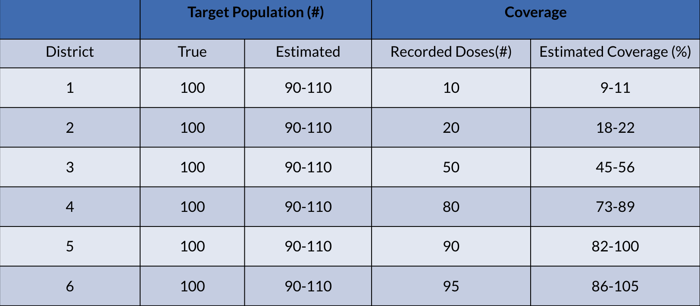
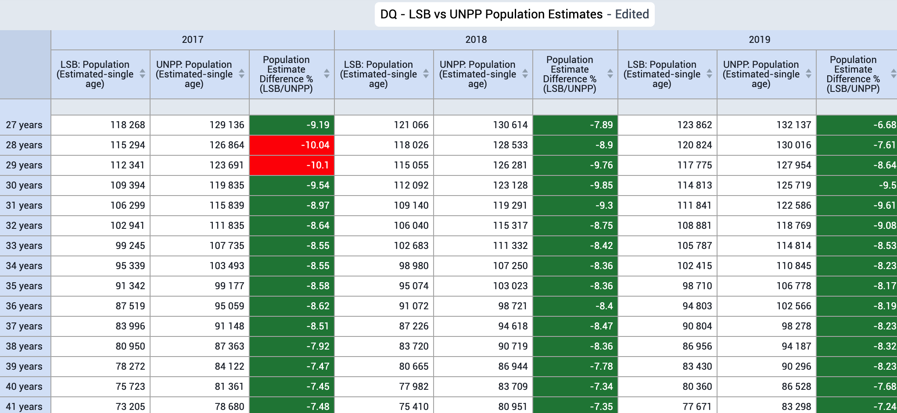
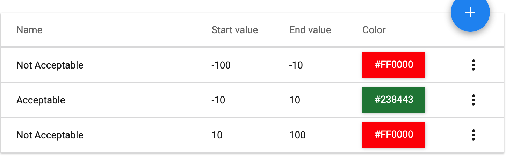
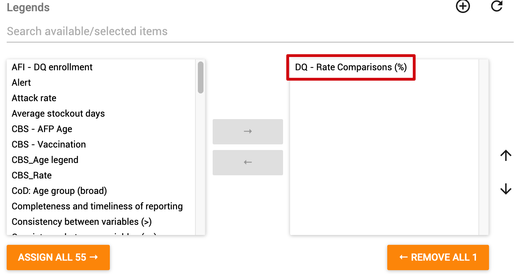
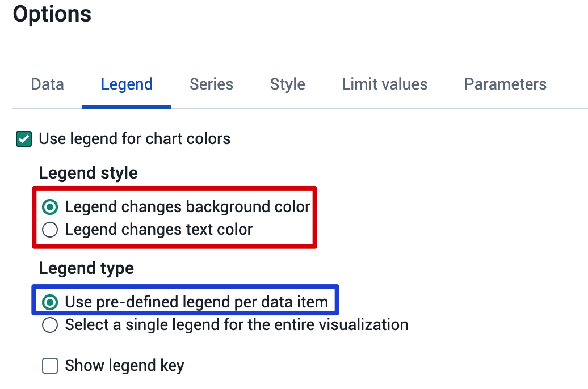
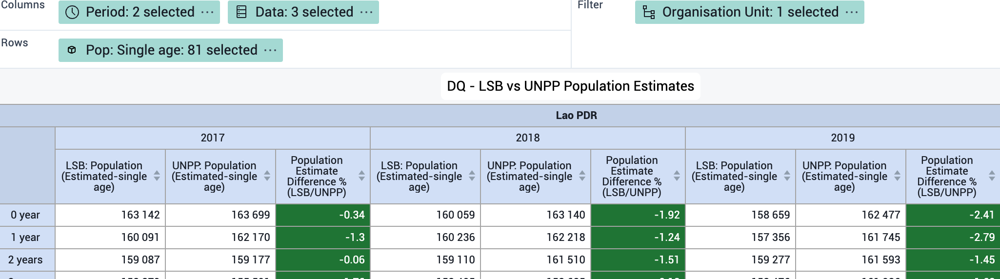
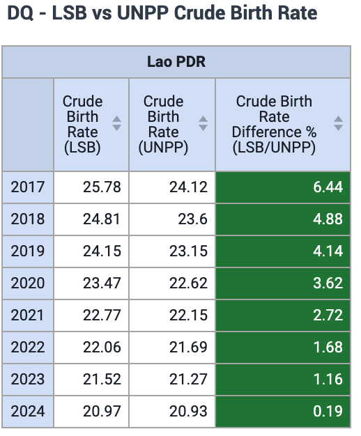
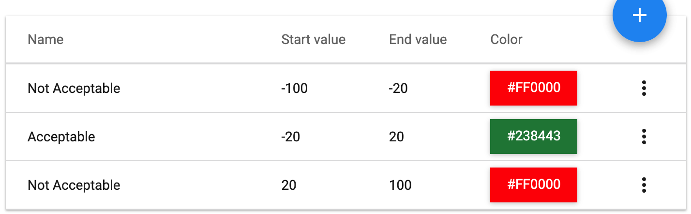
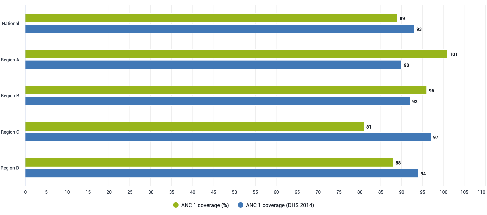
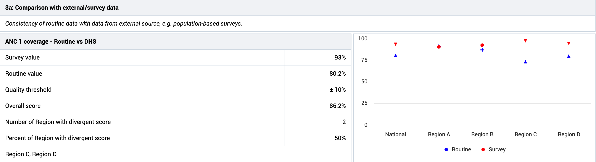

# Denominators

The quality of denominators is a critical part of data quality to assess. While this is often not a DHIS2 specific problem, DHIS2 has several tools that allow you to make comparisons of your denominators over time. 

## Why are denominators important?

- The reliability of routine coverages depends upon the reliability of denominators
- As coverage rises, estimates are increasingly sensitive to errors in denominators

An an example, see the effect that 10% error in target population estimates has on estimated coverage

For more background on denominators and how they can be assessed, please refer to the following resources:

- [WHO guidance document on denominators - Assessing and improving the accuracy of target population estimates for immunization coverage](https://www.who.int/publications/m/item/assessing-and-improving-the-accuracy-of-target-population-estimates-for-immunization-coverage)

- [A presentation prepared by HISP UiO on denominators](https://docs.google.com/presentation/d/1SpF0ATmYOB7cyS3vrrbdHNlnzgtXLRmwnwyy5bOJYVU/edit?usp=sharing)

## Assessing population data in DHIS2

What we have attempted to do is take existing guidelines for assessing denominators and demonstrate ways in which these can be performed directly in DHIS2. The methods we will highlight are the following:

1. Compare your DHIS2 population with other sources (totals, births, by age/sex etc.)
    - Highlight differences that are ≥ 10%
2. Compare implied rates (ex. crude birth and infant mortality) with other sources
    - Highlight differences that are ≥ 20%
3.  Assess the annual growth rate
    - Highlight differences that are ≥ 10%
4.  Compare routine coverage estimates to survey coverage estimates
    - Highlight differences that are ≥ 10%
5.  Compare national targets (ex. births) with the sum of subnational targets
    - Highlight when national births ≠ the sum of subnational births
6. Review the trends of your data over time
    - Plot your numerator and denominator data together and look for inconsistencies in reporting

### Sources of data for comparison

In order to compare your existing data (this could be national data, census data, etc.) in DHIS2, you will need data from an external source. Some examples of sources where you can obtain comparison data include:

- World Population Prospects
  - https://population.un.org/wpp/ 
- World Bank (uses a variety of sources, does not calculate on their own)
  - https://data.worldbank.org/indicator/ 
- IGME (UN Inter-agency Group for Child Mortality Estimation)
  - https://childmortality.org/

### Importing data for comparison

In order to make these comparisons possible in DHIS2, you will need to export data from one or more of these (or similar) sources into DHIS2. 

It is also possible to download the data from DHIS2 as well as another source into something like Excel in order to make these comparisons. 

This guide will use examples in which data has been imported into DHIS2 from different sources; however you can see examples of similar analyses being performed via the use of Excel in [this presentation](https://docs.google.com/presentation/d/1SpF0ATmYOB7cyS3vrrbdHNlnzgtXLRmwnwyy5bOJYVU/edit?usp=sharing).

 ## Comparing your DHIS2 population data with other sources

The first method we will outline is comparing your existing DHIS2 population data with data from an external source. In this example, our external data is taken from the [UN World Population Prospects](https://population.un.org/wpp/) that has been imported into our DHIS2 instance, while our existing data is taken from the Lao Statistics Bureau - an internal source used by the Ministry of Health in Lao PDR that is already in their local DHIS2 instances (also via import). 

A couple notes on readying your data before making these comparisons:

- Keep in mind the age disaggregations that are in your existing data. Externally sourced data may provide data in 1-year age/sex groupings that you will have to aggregate to match your own, internally used disaggregations
- Check the geography of the data; external sources may only have national data that you can use for comparison - but the more granular you can make this comparison (for example, province, district, etc.) - the better

Here is an example of this comparison in DHIS2 using a pivot table in data visualizer:

Some rules for when we make this comparison:

- Highlight differences ≥ 10%
- Discuss possible reasons for large inconsistencies (ex. the method used by your statistics office to project population, change in parameters based on new studies, etc.)

The main reason in performing this analysis is to determine the confidence you can have in your population/denominator figures. This can be used as evidence internally, but also with partners, if you have little variation when compared to external sources that use a different method of calculating estimates for the same location. 

If you identify significant differences consistently throughout your data, then this may require you to re-consider the estimates you are using.

### Steps for making this visualization

***First, ensure you have both your existing data as well as your external data available in DHIS2.***

To calculate the difference between the two populations, make an indicator with the following formula:

> **Example**
>
> Indicator type : percentage (factor of 100)
>
> Numerator: Population 1 - Population 2
> Denominator: Population 1
>
> \[
> Indicator = {\frac{Population1-Population2}{Population1}} \times 100
> \]

To highlight differences ≥ 10%, make a legend and apply it to your indicator 

Make the legend via maintenance

Apply it to your indicator in the "legends" section of the indicator

Make a pivot table in data visualizer. Add your 2 population data elements you are comparing, along with your comparison indicator. If you are using disaggregations, add these to the table as well. Filter by org unit, or show all of them, depending on your needs. 

Ensure you apply the legend to your table

An example layout, along with the output, can be seen below.

## Comparing your implied rates with other sources

Implied rates are a calculated rate that are not directly measured but is derived from available data. Examples of this include crude birth rate and infant mortality rate. 

We can use the [UN World Population Prospects](https://population.un.org/wpp/) as our source for our external data in this example.  

We can import this information into a DHIS2 data element in the event the rates are already calculated for you without providing the numerator and denominator; or create an indicator if we are able to obtain the numerator and denominator for the purposes of import.

An example of this comparison can be seen here:

Some rules when making this comparison:

- Highlight differences that are ≥ 20%
- Compare your implied rate over time with global trends. Are the trends over time similar to global ones or not?

If you are seeing large differences that are ≥ 20%, it is worthwhile checking both the numerator and the denominator for its consistency in these cases.

### Steps for making this visualization

***First, ensure you have both your existing data as well as your external data available in DHIS2.***

To calculate the difference between the two populations, make an indicator with the following formula:

> **Example**
>
> Indicator type : percentage (factor of 100)
>
> Numerator: Rate 1 - Rate 2
> Denominator: Rate 1
>
> \[
> Indicator = {\frac{Rate1-Rate2}{Rate1}} \times 100
> \]

To highlight differences ≥ 20%, make a legend and apply it to your indicator 

Make the legend via maintenance

Apply it to your indicator in the "legends" section of the indicator

Make a pivot table in data visualizer. Add your 2 implied rates that you are comparing, along with your comparison indicator. Filter by org unit, or show all of them, depending on your needs. 

## Assessing your annual growth rate

## Compare routine coverage estimates to survey coverage estimates

To get an idea of the accuracy of your coverage estimates, it can be useful to compare coverages that have been calculated using a different methodology in estimating both the numerator and denominator. Due to the rigourous nature of a survey's design, they are often considered accurate; and if your routine estimates line up with your survey data this can be useful in determining the accuracy of your routine estimates. 

We can perform this type of comparison both directly in data visualizer, as well as by using the [data quality annual report app](https://apps.dhis2.org/app/73f87a14-d71c-40b8-8363-0d956745ba06)

Here is an example of this comparison from the data visualizer app:

And an example from the DQ annual report app:

Some rules when making this comparison:

- You are able to set a quality threshold in terms of what is an acceptable difference between your routine and survey coverage estimates; we can use ≥ 10% as a general rule however

If you are seeing large differences that are ≥ 10%, it is worthwhile checking both the numerator and the denominator for its consistency. In particular, when you are comparing denominators, it will be useful to understand the method the survey used to estimate its denominators and if this can support you in making your internal targets more accurate. 

### Steps for making this visualization

***First, ensure you have both your existing data as well as your external data available in DHIS2.***

If you are using data visualizer, you can make a bar, column or line chart and visually identify differences that exceed your threshold. You can also create a pivot table in order to calculate (using an indicator and legend you create) and highlight any significant differences if needed. 

If you are using the DQ annual report app, you will need to configure your comparisons under the "external data comparison" tab.