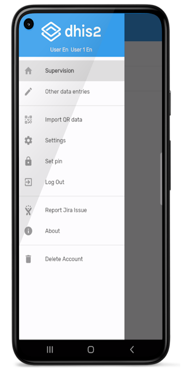
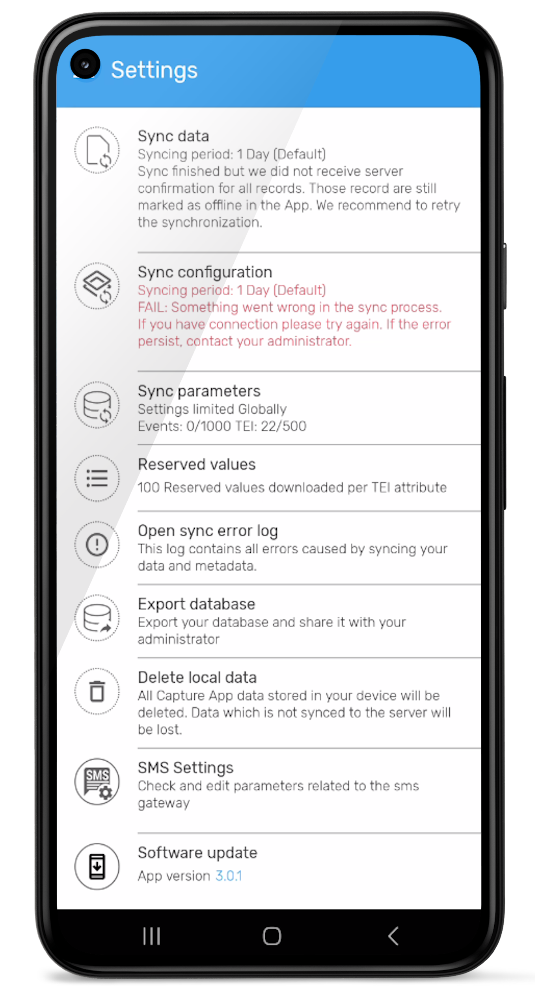
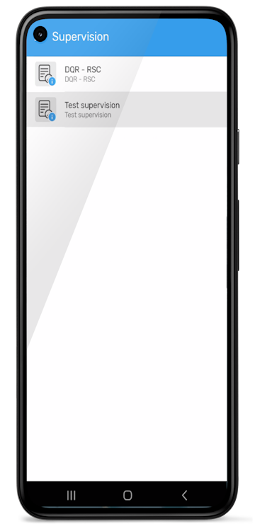
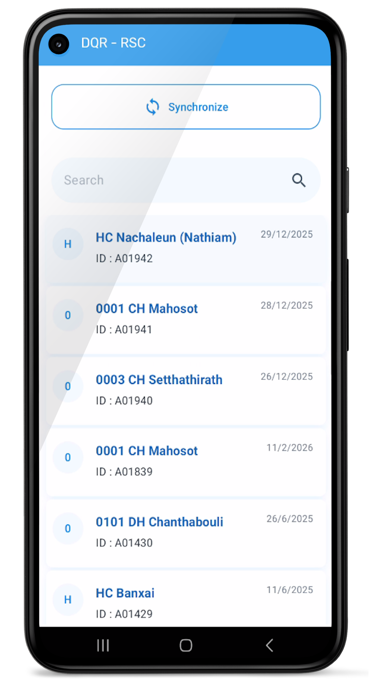
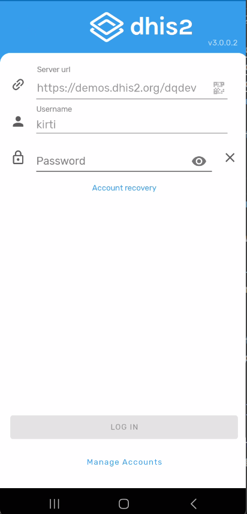
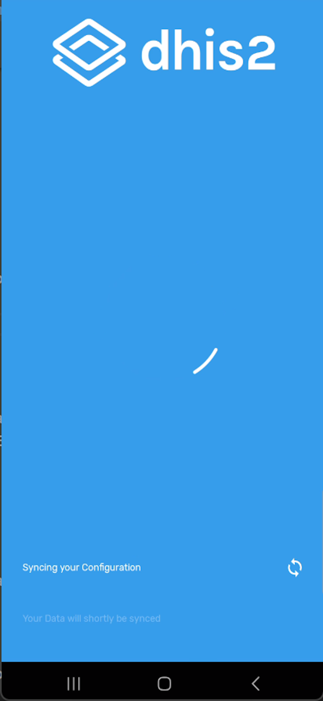
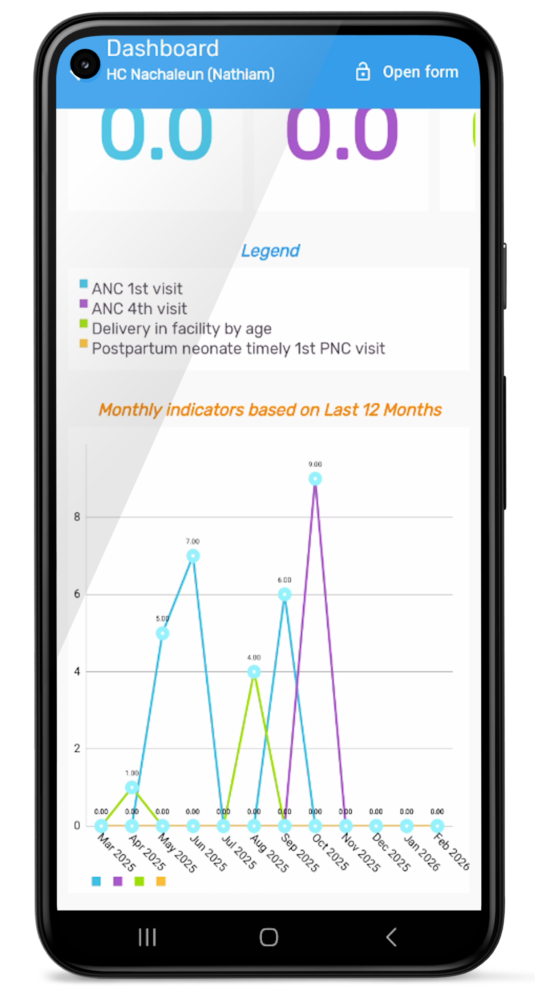
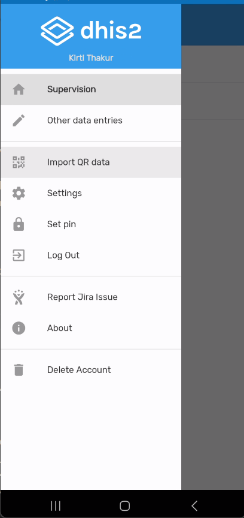
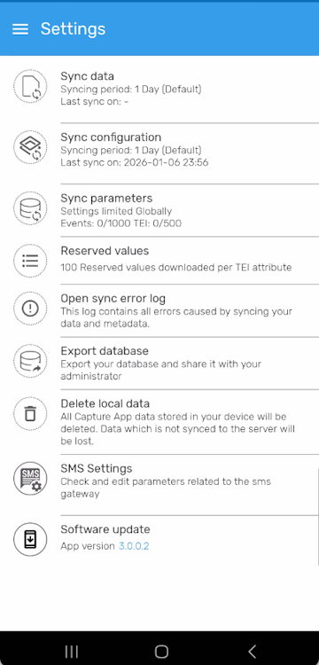
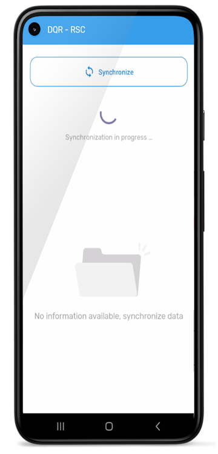

# User guide to the Supervision App - Android version

- [User guide to the Supervision App - Android version](#user-guide-to-the-supervision-app---android-version)
  - [Background](#background)
  - [Technical Specification and  Installation](#technical-specification-and--installation)
    - [Android requirement and App development](#android-requirement-and-app-development)
    - [Installation instruction](#installation-instruction)
    - [Login page](#login-page)
    - [Home interface](#home-interface)
    - [Open the form](#open-the-form)
    - [Filling the supervision form](#filling-the-supervision-form)
    - [Supervision dashboard: results visualization](#supervision-dashboard-results-visualization)
    - [Data synchronisation](#data-synchronisation)

## Background

The mobile supervision app is designed for users on the ground. It enables them to synchronize supervision schedules, and offers the following main features:

* A dashboard showing the current status of indicators;  
* An overview of previous supervision action plans;  
* Access to supervision tracker forms;  
* Synchronization for sending collected data to DHIS2;  
* Offline functioning.

## Technical Specification and  Installation

### Android requirement and App development
   
   This application has been developed and tested using Android version 1x. The app should work on Android 13 and above, but please note that the development and bug fixing was done on version 1x. The app can be used with a phone or tablet running the Android operating system.

### Installation instruction

Until the app is published on the Playstore, you can install it manually by getting the link from your DHIS2 administrator.
  1. To install the app, you should first download it using the link [Android Supervision App](https://drive.google.com/file/d/1icloLMhiRr-474HA-sFgrYWIs1aHNoD9/view?usp=sharing)  
  2. Once you've downloaded the app's APK file, go to the download folder on your phone or tablet and double-click on the file.
   
   

Then, follow the instructions to finalize the installation and open the App.

### Login page

Once opened, the first thing to do is to log in to the App using your DHIS2 user account.

### Home interface

After login, we can see the available supervision form(s) (from the tracker configured in DHIS2). Examples: DQR-RSC, …  
It is important to get started with the three-step configuration synchronization by clicking on : 

1. the three horizontal lines;
2. on Settings; 
3. on Configuration synchronization.

After the configuration synchronization, come back to the homepage and click on the following :

1. Select the tracker to be used.
2. Click here to synchronize data: this will update the downloaded data for the dashboard and for filling in fields in the tracker. This is useful when changes have occurred between the time of planning and the time of supervision.
3. Select the organization unit to be supervised from the list
4. For the selected organization unit, the various planned supervisions (events) are displayed. The most recent are at the top, and the name of the program to be supervised (or program area) appears next to the date. Clicking on each event displays the charts of the indicators whose quality you wish to check. The single values displayed at the top correspond to the values of the period indicated at the top. To display the values of another period, simply click on the period and select the new period in the calendar.

### Open the form

After clicking on a scheduled supervision, click on the **Open form** button in the top right corner. You will then have access to the content of the form, showing the sections with their content hidden. Click on **Show fields** to expand the fields in a section so that you can fill them in, then repeat the process until you reach the end of the form. 

### Filling the supervision form

After opening the form, click on the “Show details” link of each section of the form to access the fields to be filled in.   
 
When you have finished, click on the following icon to save your work :

### Supervision dashboard: results visualization

It is possible to view supervision results directly from the Android, even if the data is not synchronized. To do so, click on the chart button at the bottom center.  

You can display other indicators by clicking on the other tabs of the dashboard.

    Note: The dashboard is automatically generated from the data entered, even if there is no Internet connection.

It is possible to share the dashboard in pdf format on or offline. When online, the dashboard pdf file can be shared using all the communication apps available on the Android device: Whatsapp, Snapchat, Gmail, Slack, etc. However, when an Internet connection is not available, the file can be shared via Bluetooth. To do this, you'll need to make sure that Bluetooth mode is enabled on both devices, and that they are paired. You can also download the file to your device by clicking on: Share > Printer > pdf

### Data synchronisation

After you've saved the supervision data, when you are back online, you need to synchronize the data with the server.   
To do this, go back to the supervision selection page and click on the synchronize button.

It is also possible to go to the “Settings” menu and click on “Synchronize data” to send the site supervision data set entered locally onto the server.
