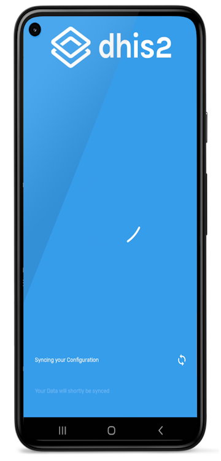
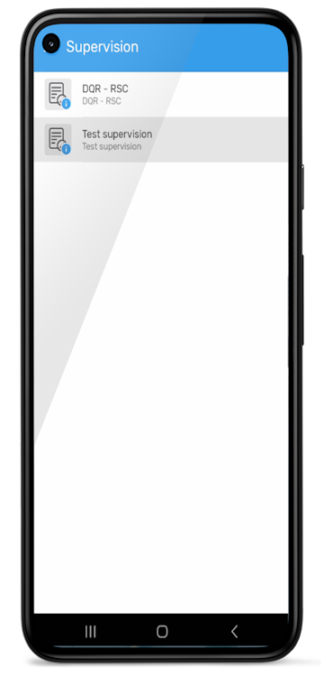
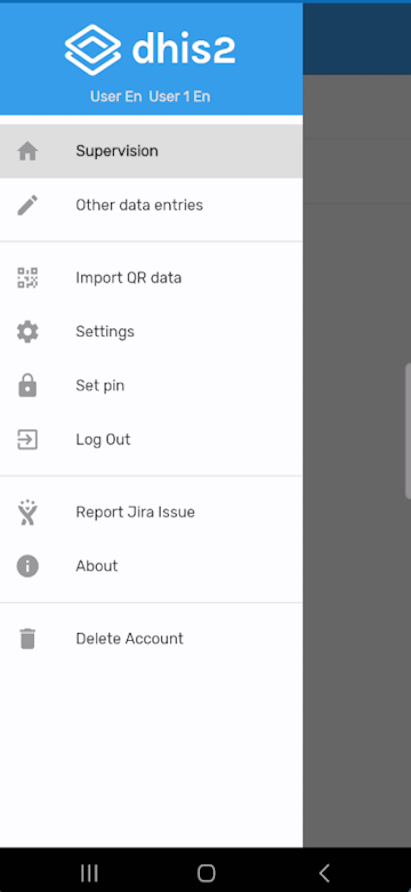
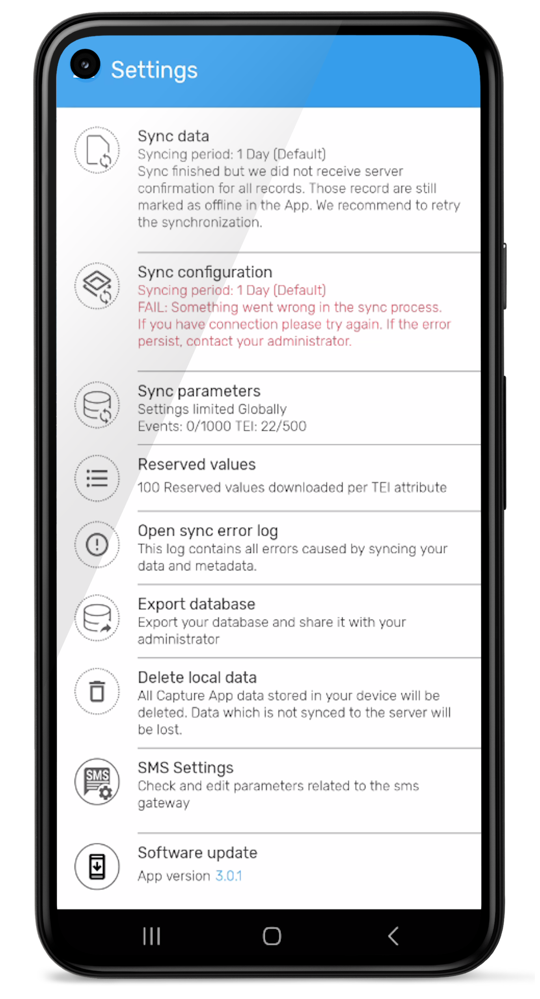
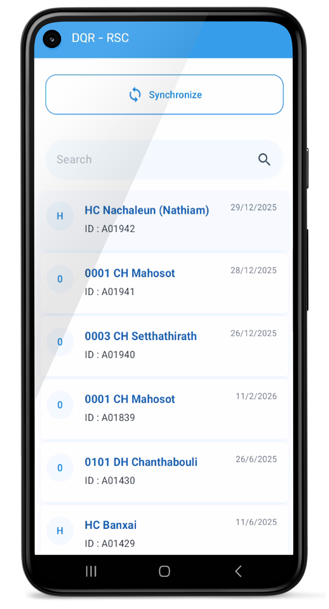
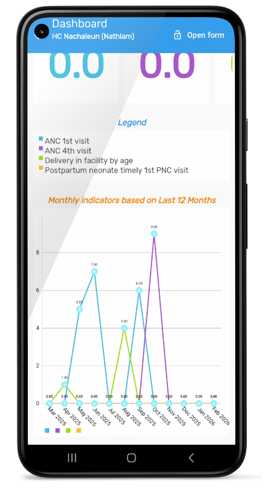

# User Guide to the Supervision App - Android version

## Background

The Supervision App is designed for field users to manage and monitor supervision activities. It allows synchronization with DHIS2 and supports offline use.

Main features:

* A dashboard showing the current status of indicators.
* An overview of previous supervision action plans.
* Access to supervision tracker forms.  
* Synchronization for sending collected data to DHIS2. 
* Offline functioning.

## Technical Specification and Installation

### Android Requirements

* Works on Android 13 and above
* Compatible with phone and tablets

### Installation Instructions

Until the app is published on the Playstore, you can install it manually.

1. Download the APK from your DHIS2 administrator or by getting the link from your DHIS2 administrator. [Android Supervision App](https://github.com/HISPWCA/Supervision-Apks/releases/tag/v.1.2.5)
2. Locate the file in your Downloads folder.
3. Tap the file and follow on‑screen instructions to install or update the app

## Login page

1. Open the App
2. Enter your URL,Username and Password
3. Tap Login to access the home interface.

## Home interface

After login, you will see available supervision forms Examples: DQR-RSC,

First time set-up:

1. Tap to three horizontal lines (menu).
2. Go to Settings.
3. Select Configuration Synchronization

## Selecting a Supervision Event

1. Choose the **tracker program** (e.g DQR-RSC)

2. Select the **organization unit** to be supervised  

3. View planned supervisions(events).The most recent appear at the top.

4. Clicking on each event displays the charts of the indicators whose quality you wish to check. The single values displayed at the top correspond to the values of the period indicated at the top.
5. To display the values of another period, simply click on the period and select the new period in the calendar.

## Open the form

1. Tap Open form (top right).
2. Sections are collapsed by default. Tap **Show Fields** to expand.
3. Fill in the required fields section by section.
4. Tap Save (bottom right) when finished.

## Supervision Dashboard: Results Visualization

It is possible to view supervision results directly from the Android, even if the data is not synchronized. 

1. To do so, click on the chart button at the bottom center.  
2. You can display other indicators by clicking on the other tabs of the dashboard.

    Note: The dashboard is automatically generated from the data entered, even if there is no Internet connection.

3. It is possible to share the dashboard in pdf format on or offline. When online, the dashboard pdf file can be shared using all the communication apps available on the Android device: Whatsapp, Snapchat, Gmail, Slack, etc. However, when an Internet connection is not available, the file can be shared via Bluetooth. 
4. To do this, you'll need to make sure that Bluetooth mode is enabled on both devices, and that they are paired. You can also download the file to your device by clicking on: Share > Printer > pdf

## Data synchronisation

After saving supervision data:
- When back online, go to the supervision selection page and tap Synchronize.
- Alternatively, go to Settings > Synchronize Data to upload locally saved supervision data to the DHIS2 server.

