# User Guide to the Supervision App - Web Version

## Introduction

It's well known that data quality and data use are closely linked. To improve data use, we must also strive to improve data quality, and vice versa. Various tools, including the Routine Data Quality Assessment (RDQA) tool, have been developed and used to assess data accuracy and the functioning of the Health Information System (HIS) across its six components. However, the RDQA tool and its use have shown some limitations, namely:

* The **RDQA tool is Excel-based**, and the results of supervision visits stay on people's computers without being shared. As a result, it is **difficult to get an overview of the problems encountered in the field during supervision** visits across the country;

* Difficulties in monitoring the implementation of recommendations made during supervision visits;

* Archiving of Excel files

* **Lack of transparency in the selection of health facilities and districts to be visited.** This has led to a situation where health facilities located along good roads or in towns with decent infrastructure are the most visited.

In response to this problem, a number of institutions have developed digital solutions: 

* Since 2019, HISPWCA has started implementing a digital tool to facilitate supervision and also the archiving of historical data from these supervisions. This digitalization is based on WHO's RDQA tool. After the development of the first version of the tool, it has been used in Mali.

* Since 2021, MEASURE MALARIA/JSI has been implementing an Android app and a DHIS2 package for the supervision and archiving of mRDQA supervision data. After a test phase in Côte d'Ivoire and Sierra Leone, its use has been initiated in Mali, Guinea and Burkina Faso.

PATH is currently developing a web and mobile application based on the DHIS2 data quality audit file.

Aware of the duplication of efforts by partners in different countries, the Global Fund, USAID and WHO decided to support the implementation of a standardized electronic tool, ready to host other specific supervision tools.

The app currently includes two supervision tools: 

1. **eRDQA** (Routine Data Quality Assessment) and
2. **DQR-RSC** (Data Quality Review Routine Supervision Checklist).

**The approach to using the various forms in the application remains the same, from planning to performing supervision in the field**.

The screenshots used in this guide are based on the web version of **DQR-RSC**. The Android version is covered in a separate guide.

## Supervision Workflow Overview

## Step by Step Instructions to Use the Supervision App

## Access to the App

To access the App, proceed as follows:  
     
1. Log in to DHIS2 with your user account and password  
2. Click on the “Search box”  
3. Enter Sup or Supervisor in the Search box  
4. Click on the app icon to access the app.

   

**Note** When you open the application, you will land on the **Main Page**, where all dashboards are displayed.To begin configuring or using the app, click on the **“Settings”** module located on the left-side panel

## Settings

### Supervision Settings

When you click the **Settings** tab, four sub-tabs appear. The first one (selected by default) is **Supervision Settings**.

This tab contains two main configuration areas:

1. Tracker Program Selection: Allows you to select the Tracker Program used to configure the supervision form.By default, it uses **Generate Supervisions as Events**.  
2. Tracker Program Configuration List: Displays all Tracker Programs that have already been configured for supervision.

   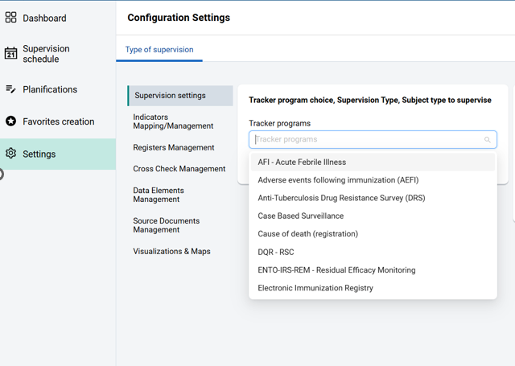

* Selecting the tracker program under supervision settings
   
    * Select the tracker
    * Select the type on what basis - **Organisation units** (supervision of activities carried out in facilities) or **Agent** (supervision of workers in the facilities.Its Greyed out as its not active) 
    * Select the Configuration type. Select Configuration type Normal Supervisison Program (if not DQR - RSC)
  
   

* Configuring Supervisor & Supervision Status  
To start with this we need to specify the following:  
   * Program stage  
   * Supervisor  
   * Supervision status  
  Fill in the program stage, supervisor and supervision status fields:  
  
   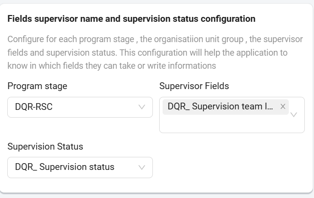

* Other fields:
  
  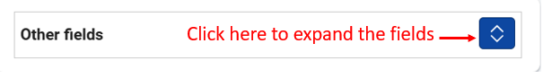

This part of the configuration is useful for RDQA-type configurations, where a number of neutral data elements will be replaced by more meaningful names at the time of supervision, or to define how many times an object should be collected. This means telling the app which tracker fields correspond to what:

1. **Supervision attribute autogenerated ID:** specifies which program attribute corresponds to the supervision ID.  
2. **How many indicators:** specifies the data element used to indicate the number of indicators that need to be checked on the site.  
3. **How many source documents ?:** specifies the data element used to indicate the number of source documents that need to be checked on site.That determines how many data elements need to be checked on the site.  
4. **Most recent verification period**: specifies  the data element used to indicate the most recent date of the verification periods
5. **Indicator period type**: specifies the data element used to indicate the indicator period type.  
6. **Time consistency period type**: specifies the data element used to indicate the time consistency period type.  
7. **Register name:** specifies the data element used to indicate the name of the register to be used for checking data elements.  
8. **Register keyword**: identifies the keyword to be replaced with the name of the register in the completeness section of the data elements. This keyword will generally be “registre” and/or “register” depending on whether you are using French and/or English. If you are using another language, please use the most appropriate term. If you have written this keyword in different ways in your tracker program, please fill in all possible variations, case-sensitive.  
9. **Global program area:** specifies the type of indicator linked to a specific program (area) to be monitored. The default domains are: SNIS, Malaria, HIV, TB, Vaccination, Maternal health. However, other areas can be added if required. This field is therefore used to indicate the data element that specifies the area to be supervised when the activity is scheduled.  
10. **Program keyword:** identifies the keyword to be replaced by the program name, particularly in cross-checking sections. This keyword will generally be “programme” and/or “program” depending on whether you use English and/or French. If you use another language, please use the most appropriate term. IF you have written this keyword in different ways in your tracker program, please fill in all possible variations, case-sensitive.  
11. **Number of periods in DHIS2:** specifies the number of periods for which you wish to automatically retrieve data already entered in DHIS2 for checking purposes. If you select 3 and it is April 2024, the app will automatically fill in the corresponding fields for each indicator with the values for March, February and January 2024. 
12. **Period - 1 keywords (as for Period - n keywords):** indicates to the app the keywords it will use to write the true period of the historical data to be retrieved from DHIS2. This option is useful when you want to retrieve values already entered in DHIS2 for checking or comparison purposes. For example, in the generic tracker, the name “*Indicator 1 -  DHIS2 monthly value Period-1*” should be replaced by “*ANC1 - **Jan 2024 value***”. The “**Period -1**” keyword is used to replace Period -1 with Jan 2024 if it's February 2024. The indicator 1 part is also replaced by the real name of the indicator chosen at the time of planning the visit, giving “***ANC1 - value of Jan 2024***”. Click directly in the field, then click on the “***Enter***” button on the keyboard (Month 1, Quarter 1,Trimester 1).  **Period -2 keywords:** Same as period -1  **Period -3 keywords:** Same as period -1  
13. **Please select the modules**: Provide the Schedule section with the list of modules to be administered for each supervised facility.

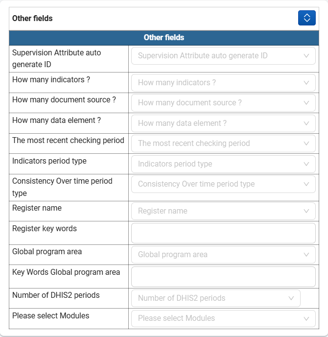

* Configuration of the elements
   
   The interface below allows you to manually add several additional elements to a type of supervision. These elements enhance the data quality analysis.

   1. You can configure the indicator, cross-checking, consistency over time, data element, and source document.
   1. Click on the corresponding buttons to add and configure each type of element. The details of each element are presented below.
   
    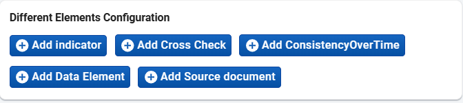

1. **Indicator configuration**

     * **Indicator 1:** Defines the data element corresponding to indicator 1.  
     * **Period -1 DHIS2 value:** Defines the data element to be assigned the period -1 value of indicator 1. “Period - 2 DHIS2 value” to “Period - n DHIS2 value” do the same for periods -2 to - n.  
     * **Indicator keywords:** defines the keyword to be used to replace the generic name indicator 1 with the name of the indicator, e.g. “***Indicator 1** - DHIS2 monthly value Period -1*” -> “ **ANC1** - Jan 2024 value”.  
     * Repeat for each indicator.
     * **Margin of error:** selects the data element that will receive the margin of error to be configured for the accuracy of the indicator.

2. **Cross-checks configuration**

    * **Program area:** indicates the type of indicator related to a program specific (area) to supervise.  
    * **Primary cross-check:** selects the data element from which cross-check 1 information will be collected.  
    * **Secondary cross-check:** selects the data element for cross-check information 2.  
    * **Cross-check keywords:** fill in this field with cross-check and corresponding cross-check. After each word is written, click on the “Enter” button on the keyboard. They will then be taken into account in the dashboard and on the Android side
    * **Margin of error:** allows you to select the data element that will collect information on the margin of error of cross-checks.  
    * Repeat the above steps for each cross-check.
  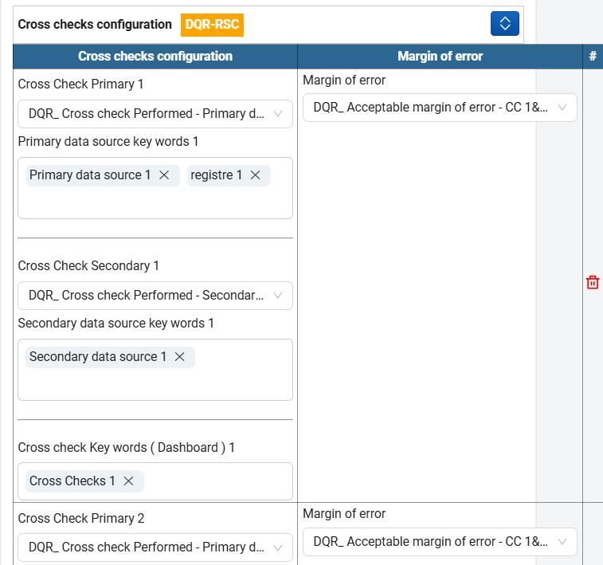

3. **Consistency over time**  
   * **Program area:** specifies the type of indicator linked to a specific program (area) to be supervised.  
   * **Time consistency:** specifies the data element used to indicate the name of the indicator to be used for time consistency.  
   * **Margin of error:** specifies the data element that collects information on the margin of error for consistency over time.
  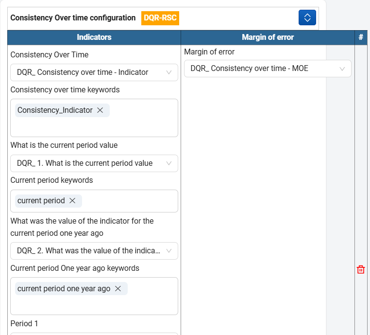

4. **Data elements and source documents**  
   * Data element: specifies the data element that allows you to indicate the name of the data element to be used for checking a register's data elements in terms of fill completeness.   
   * Keywords: Specifies the generic keyword that will correspond to the actual name of the data element in the app.
    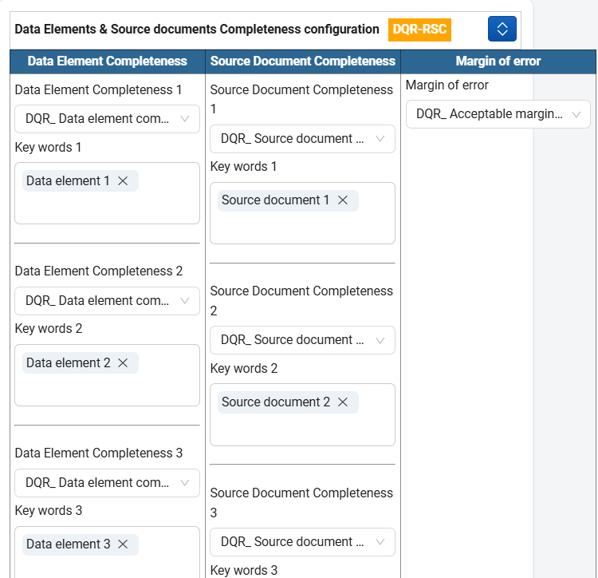

5. **Source documents:**   
   * Source document: specifies the data element used to indicate the name of the source document to be assessed.
   * Keywords: specifies the generic keyword that corresponds to the actual name of the document in the app. Example “source document 1”.

6. **Margin of error:** 

     

   **About other tracker programs, the module selection list is added as follows :**
     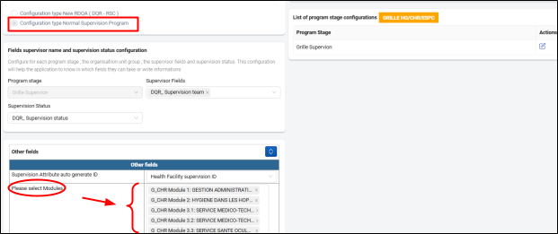
     
     Once you have finished, click on the **Update Configuration** button. 
    
    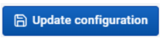

### Mapping/Indicator management

#### Mapping of indicators

In this section, the administrator can configure indicators by program, i.e. SNIS, Maternal Health, Immunization, HIV AIDS, TB, Malaria. These pre-configured programs are linked to the corresponding DHIS2 metadata content. However, the user has the option of adding other programs and indicators.  

To configure or match an indicator proposed in the checklist with a DHIS2 indicator, you need to:  

1. Select the indicator mapping sub-menu in the “**Settings**” menu. 

   
  
When you select this menu, the following will appear: click on “Create new indicator” and continue the process by first creating the program group (e.g., HIV, TB, etc.)

* If there is an existing group already configured, proceed as follows:
  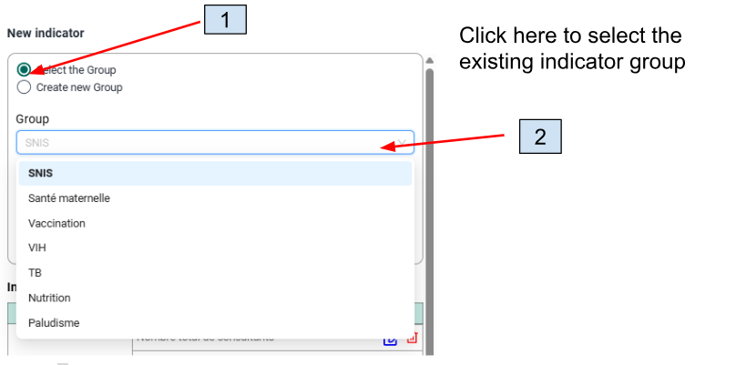

* If the group does not exist and we want to create it, proceed as follows:
  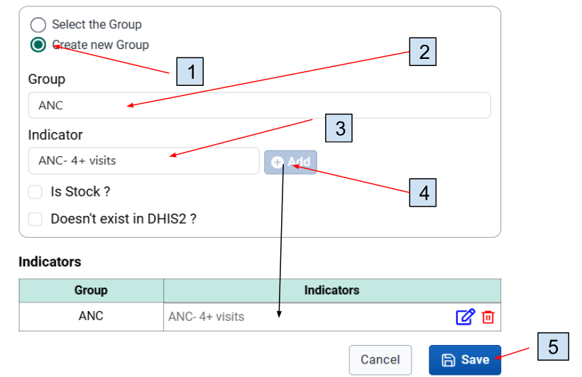
    
  The image above shows how to add an indicator by creating a new group. Follow the steps below:
  1. Select the “Create a new group” option.Check this option so you can set a custom group name for your indicators
  2. Enter the group name.In the **Group** field, enter the name of the group you want to add your indicators to. Example: ANC.
  3. Enter the indicator name.  In the **Indicator** field, enter the name of the indicator you want to add
  4. Click the “Add” button.  After entering the indicator name, click + Add. The indicator will appear in the table below under the corresponding column.
  5. Save the group and indicators.To add more indicators to the program, simply repeat the same step until you complete the desired list.Once all the indicators have been added, click on the **Save** button to validate and save the data.
    
Here is an example of the HMIS program group in the image below:
  

      
Marker 1 on the following image allows you to select the data element or indicator in dhis2.The selection of the data element or indicator on the left is immediately reflected in the field on the right. To complete the mapping, click on the radio button.
  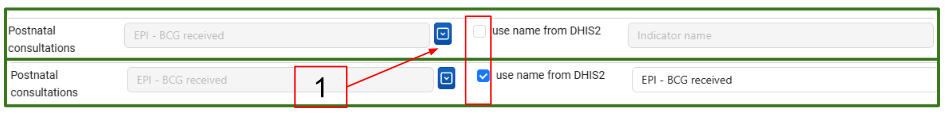

Select the corresponding data element or indicator in DHIS2

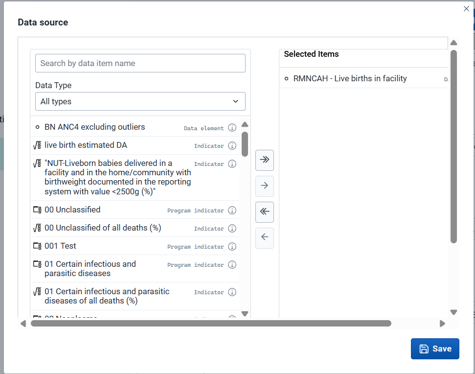

To do this, 

* Search for the desired indicator or data element and select it (marker 2). 

* For (marker 3), select the dataset in which the data element is located. This will tell the app how often to retrieve data from DHIS2. 
* If the data set is monthly, then the periods that the app will consider will be months. 
* If an indicator is configured, then the app will select a dataset from among the datasets containing the data elements that form the indicator.

#### Modifying the program or indicators in an existing program (indicator type):

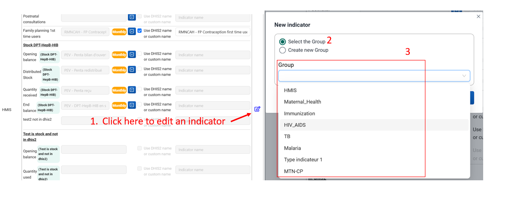

If necessary, modify the indicator as proposed in your Excel copy to match what's in DHIS2. To do this, proceed as follows:

1. Click on the edit icon
2. Select the group
3. Choose the relevant program in the dropdown menu.

Once you have finished the mapping, click on “Save the mapping” at the top right.

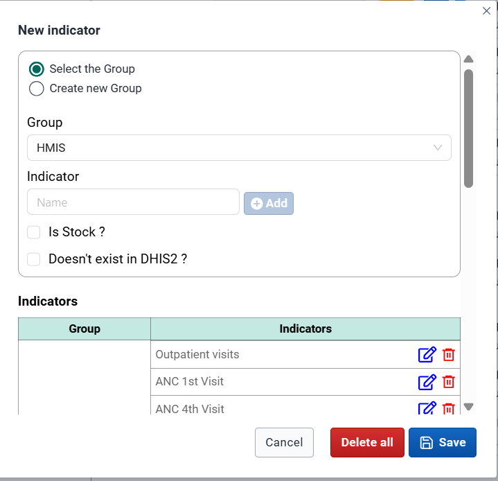

### Register management

The app allows you to configure, for the various  programs being monitored, the information verification registers during supervision.  
In this section, the administrator can configure **the registers** by program, namely SNIS, Maternal Health, Immunization, HIV/AIDS, TB, and Malaria. However, the user can add other registers.

To create or match a register proposed in the checklist, you must:  

1. Select the “Register Management” submenu in the “**Settings**” menu.
  
   When you click on this menu, here’s what appears: 
   
   1. Click on **\+ Add** to continue the configuration process. 
   2. Choose the program group (e.g., HIV, TB, etc.), 
   3. Add the new register to the group, as shown in the following images.
   4. Save
   
    

### Cross-checks management

In this section, the tools needed to cross-check information or data are configured for the program being supervised, and the process is the same as for register management above.

### Data elements management

This section allows you to pre-assign data elements to be counted or checked for completeness and accuracy in the tools needed to cross-check information for the program being supervised, and the configuration process is the same as for register management above.

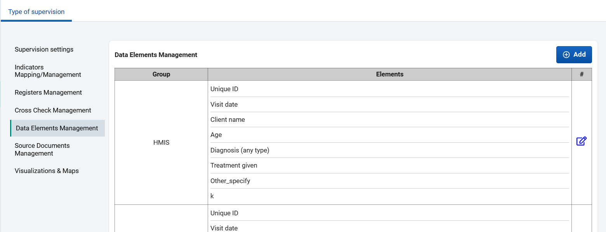

### Document sources management
The process applied to the other sections (register management, cross-checks management, data elements management) also applies to this one. This section allows you to assign document sources to verify information for the program being supervised.

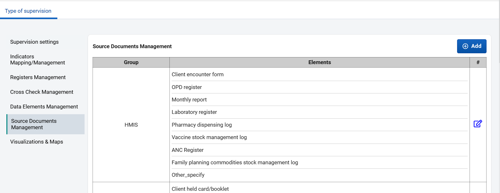

### Visualizations (Charts) and Maps

A link is made between the application and some favorites related to indicators from the monitoring forms configured in DHIS2 using the tracker program.   
If there is already a configuration for charts and maps in the system, the steps for configuring charts, tables, and maps in the monitoring application are shown in the image below.

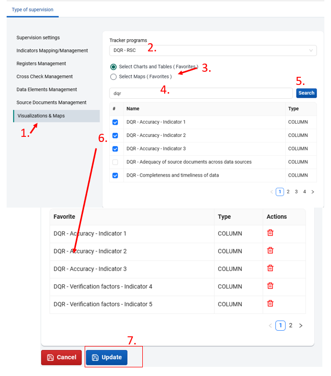

Follow the steps below to add a chart, table, or map (favorite) to a supervision type:

1. Click on **Visualizations and Map**
2. **Select the Tracker program**: From the “Tracker Programs” drop-down menu, choose the relevant program.  
3. **Choose the visualization type**: Check the “**Select Charts and Tables (Favorites)**” or “**Select Maps (Favorites)**” option.  
4. **Search for the favorite**: In the search field, type a keyword (e.g., `anc`) to filter the visualizations available for that keyword.  
5. **Run the search**: Click on the “**Search**” button.   
6. **Select the desired favorite**: Check the box corresponding to the chart or table you want to add.**Verify the selection**: The name of the selected favorite will automatically appear at the bottom of the window, in the “Favorites” section.  
7. **Save the configuration**: Click on the “**Save**” button to finalize.  
   
NB: After saving, you can delete a favorite by clicking on the trash can icon as follows:

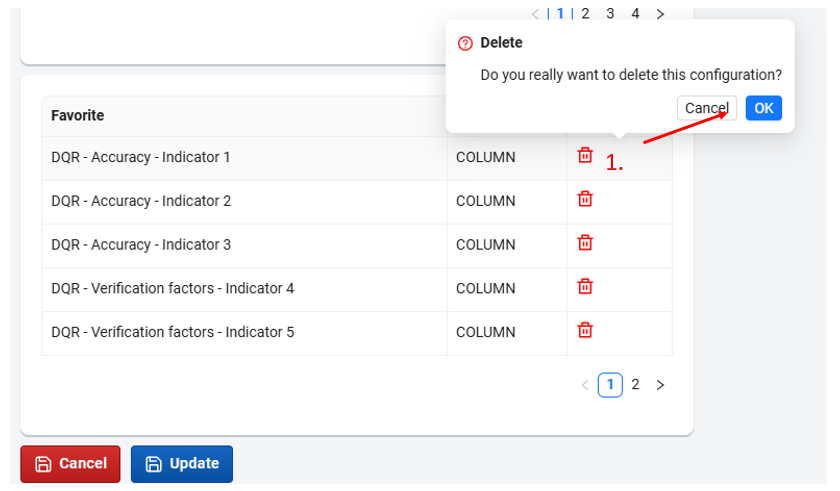

## Favorites creation

1. Selecting the supervision form
   
   By clicking on the **Create favorites** field, you'll see the supervision sheets (checklists or programs) available in DHIS2. Choose the one you're interested in. This will give you access to the interface for configuring the indicators entered in a favorite. 

   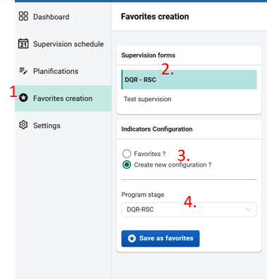

2. Configuring the favorite indicators
   
   There are two possibilities for this indicator configuration: either you create a new favorite with its entire content, or you improve a favorite already created in the system.

   
   
   * Creating a new favorite
   
     A favorite is a pre-selection of indicators, source documents and any parameters required for on-site supervision or data verification visits. For example, during an RDQA visit, you need to pre-select the indicators whose data you are going to check, the source documents to be used for verification, the data elements whose completeness you are going to check in the register, and so on. To avoid having to make this selection at each visit, the application allows you to create a favorite containing the choices made for later reuse (either during the same output or for another period).

     
     
     To create a new favorite, you need to:
     * Select the checklist (or DHIS2 program) to be used.  
     * Check “Create a new configuration”.  
     * Choose the program stage (if the tracker has several stages, e.g. one stage for the district level and another for the Health Facility level, you can configure a favorite for each level). 
  
       
       Once the program stage has been selected, a table appears on the right-hand side, proposing the definition of the supervision area (program area), indicators, source documents and register data elements to be used for verification. 

       For a start, those familiar with the Excel version of the tool can build on it, as the electronic version is a replica of the existing Excel version. 
       
       There are 4 levels to fill in:
       
       1. Indicator configuration: at this level, the choice of ***global program area*** in the drop-down list applies to the other chapters. We can also choose the ***number of indicators*** to be supervised, and this choice will also affect the number of fields in the other three chapters.The **“Indicator name”** field has a drop-down menu allowing you to choose the indicators already configured in the app settings for this particular program.The **“Margin of error”** field will be filled in manually, according to what the staff of the program to be supervised has decided to be the standard
   
       2. Cross-check configuration**  
       The **Primary Source** field allows you to choose from a drop-down list already configured in the app Settings.  The **Secondary Source** field also allows you to choose from a drop-down list already configured in the app Settings.   
       The **Margin of Error** field will be manually filled in according to what the staff of the program to be supervised has decided should be the standard.
       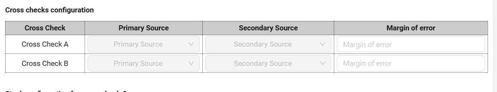
       3. Consistency over time
       The **Indicator Name** field has a drop-down menu allowing you to select the indicators already configured in the application settings for this particular program.  
       The **Margin of error** field will be manually filled in according to what the staff of the program to be supervised has decided to be the standard.
       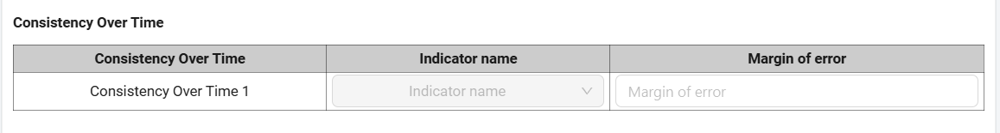
    
       4. **Data elements and source document**  This section allows you to choose the number of data elements to be included in the data completeness check. This choice will have an impact on the number of fields to be filled in the **data element** and **source document** columns.  
       The **How many data elements** field allows you to choose the number of data elements to check for completeness.  
       The **How many source documents** field allows you to select the number of source documents that supervisors will check in the field.  
       The **Register name** field allows you to select from a drop-down list the register names configured in the application settings for a specific program.   
       The **Data Element** field allows you to select from a drop-down list the data elements configured in the app settings for a specific program.   
       The **Source Document** field allows you to select the source documents configured in the app settings for a specific program.  
       The **Margin of error** field will be manually filled in according to what the staff of the program to be supervised has decided to be the standard. At this stage, filling in this field is not mandatory.
       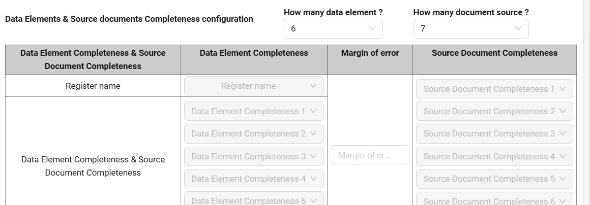

    * Save as favorite   
  
  * Modifying an existing favorite
  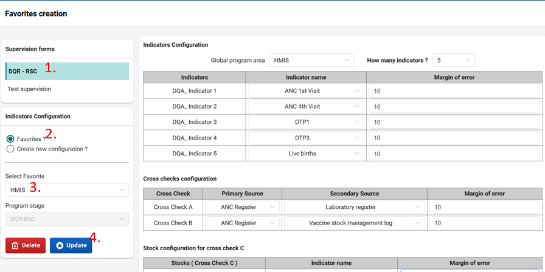
    1. Choose your supervision   
    2. Click on the button from “Favorites”  
    3. Choose the favorite you need from the drop - down menu. After selecting the favorite name, its content is displayed in the table on the right. In this table, you can modify the different elements.  
    4. When you have finished the modification, click on the Update button .

## Scheduling

### Supervisions scheduling interface

When you click on the **Scheduling** section, a three-level interface appears:

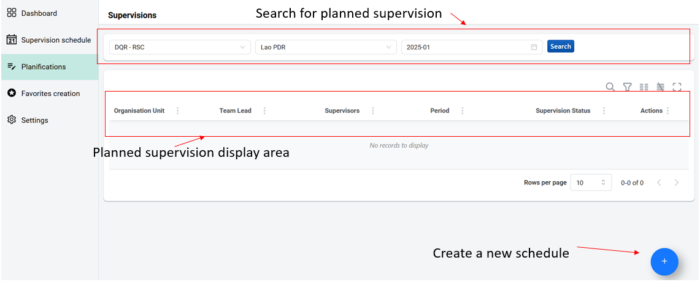

* **The Search bar,** with the supervision form to be selected, the target organization unit for supervision, the period for scheduled supervision and the **Search** button for displaying scheduled supervision queries**.**  
* **The scheduled supervisions display area**  
* **The button for creating new schedules**

#### Creating a new schedule

1. To create a new schedule, click on the + icon button at the bottom right of the first interface of the Schedule option.  
2. In the schedule creation interface, there are two steps
   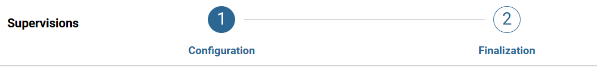

   * **The configuration**
     The configuration of the new schedule consists of:

     
     * Selecting the entity (organization unit).
     * Selecting the tracker program (DQR-RSC, ECD, etc.).
     * Selecting a favorite if available. If not, exit to create a new favorite in the “**Create favorites**” section.
     * To cancel the process, simply click on the blue button as shown below.
     * Other programs - In this case, there is no need to select a favorite.

   * **The finalization** At this stage, you have to choose between types of schedule:
   * 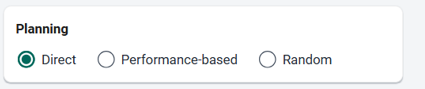

     * **Direct**: for arbitrary site selection  
     * **Performance-based**: allows you to request the app to select a number of sites on the basis of their performance against some selected indicators  
     * **Random**: allows you to request the app to randomly suggest sites to visit, after specifying the number of sites to be visited

#### Direct scheduling

Choosing this option assumes that the supervisor knows in advance the problems in one or more of the structures he or she decides to supervise. To do this, the supervision scheduler clicks on the **Direct** button, then adds the supervision teams, and selects one or more organization units in which supervision will take place. 
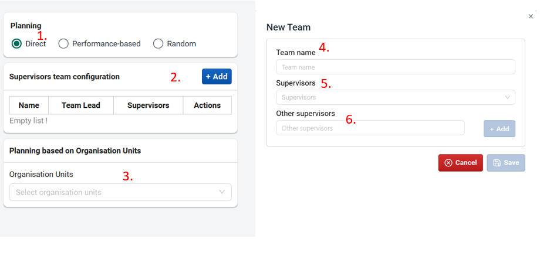
If all supervisors have a DHIS2 user account, don’t click on the **Add** button in the **Other supervisors** section**.**

1. Specify the team lead
2. Choose the organization units to be supervised (image below).
3. Assign dates and supervision teams to each site.
  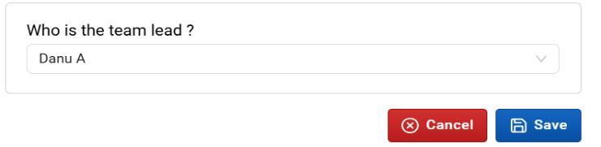
  
  
   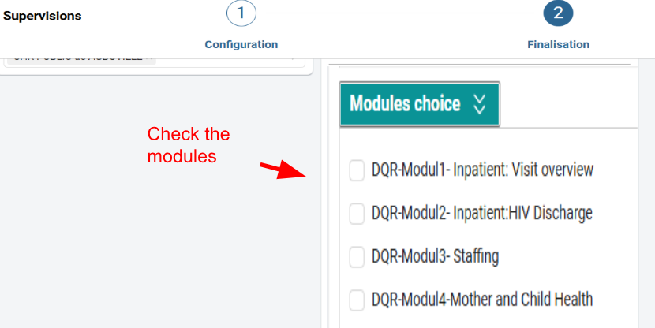
   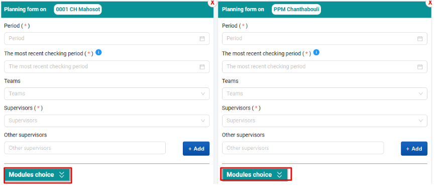
    
  

       Note: It is possible to choose the following module(s) applicable to the facilities scheduled for supervision: This has already been configured in the section settings Configuration other fields- Please select the modules…

1. Click on the **Schedule the supervision(s)** button to complete the process
   

#### Performance-based scheduling

Choosing this option assumes that the supervision scheduling team wants to carry out supervision based on the performance of some indicators at the sites to be supervised.

There are two ways of selecting indicators for this type of scheduling: 

* From favorites  
* Direct (define your own list of indicators on the fly). This list can then be saved as a favourite

**Note** There is a difference between a favorite for indicator-based scheduling and a general favorite based on indicators chosen by a program to be supervised in the field. It should also be noted that these favorites are created from the **direct** creation of the favorites.

Start by choosing the **Performance-based** supervision.

1. Clicking on the **Select the indicators** button allows you to choose directly the indicators in DHIS2
   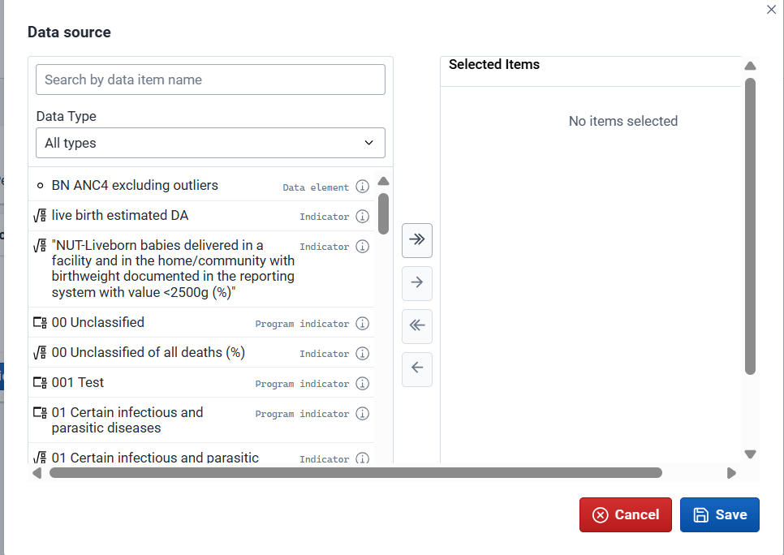

2. Choosing the indicators
3. By clicking on **Save**, we can save this schedule as a **favorite** and also add supervision teams as explained in the **Direct scheduling** section**.

   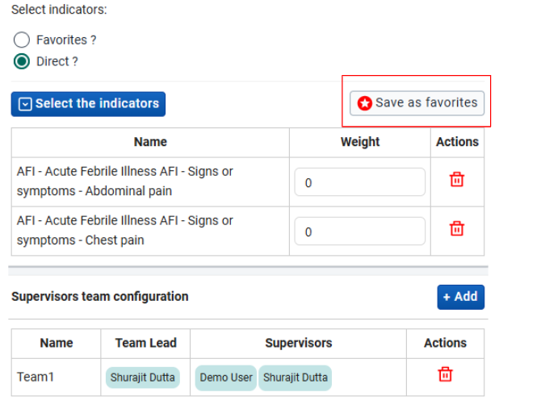
   

 4. After selecting the supervision team, the next step is to select the **organization units** and **period**. At this level, you choose either the national, regional or district level, depending on your needs, and then you must assign an **organization unit group set** to access the period to be explored for performance analysis.
 5. Once you've filled in all the required fields, click on the **Display results** button to view the health facilities matching your selection criteria.

#### Random scheduling

By choosing this option, the supervision schedulers are not supposed to have any specific information prior to choosing the sites to supervise. Instead, they will go to a higher hierarchy level to select a random number of structures to visit.  
To do this, they must first configure the supervision teams in the same way as for the previous options.

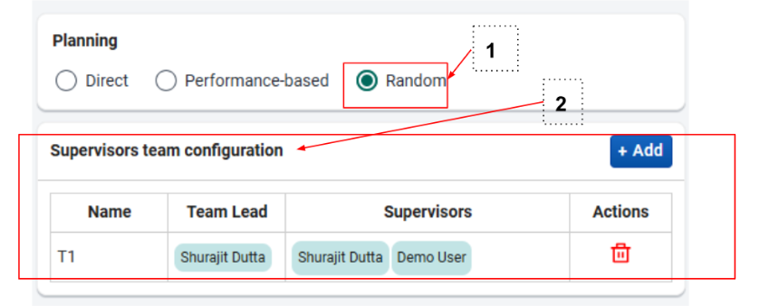 

## Supervision Schedule

This interface allows the users to view the different supervisions scheduled over time.   
It has two parts: 
1. A search box for scheduled supervisions by supervision form
   * Program: this field allows you to select the supervision form from a drop-down menu.
   * Organization unit: allows you to select the facilities that will be subject to planned supervision audits.
   * Period: selects the period of planned supervision to be checked
   * Scheduling: allows you to filter planned supervisions. There are three possibilities:
     *  My supervisions: corresponds to supervisions assigned to the user as supervisor.
     *  Scheduled by me: corresponds to supervisions scheduled by the logged-in user.  
     *  All: corresponds to all supervisions scheduled in the system during the period the user wishes to check.
     *  Once you have selected all the queries, click on the **Apply** button to view the search result.
  
     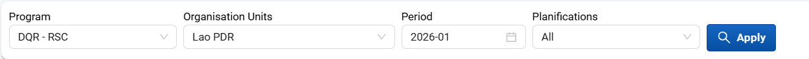 

2. A display area for search result - It is represented by four field subgroups. From left to right, we have:
   * **At the top left**, **the calendar** with the date fields in which the health facilities to be supervised are displayed.
   * **On the left, at the bottom of the calenda**r, we have a small field containing schedules by type and number. These are **scheduled** supervisions, **cancelled** supervisions, supervisions **in progress** and **completed** supervisions.
   * **At the top right**, a field containing the **organization units** to be supervised, with the planned **period**, the **supervision status** and a rectangle icon with an upward arrow, leading to the supervision form field in the corresponding Tracker program if the supervisor wants to use the web at the supervision site.
   * **At the bottom right**, we have a field displaying the schedule results in a pie chart showing the colorations assigned to the supervision status.

   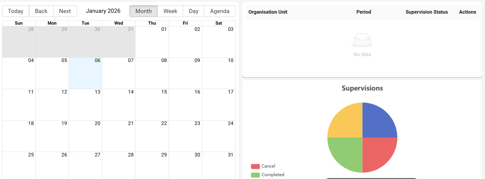 

## Dashboard

This Dashboard has been customized to suit the needs of each supervision form integrated into the app.   
Its interface has two levels:

1. A filter zone for scheduled supervisions by supervision form.
  
The user can use this dashboard to analyze data from supervisions carried out in the field. To do so, he/she must select some information to display the results as tables or charts:

* the supervision form in the program drop-down list,  
* the organization unit,   
* the organization unit level,   
* the period.

To display the data, click on the **Apply** button after selecting all the appropriate options. 

2. A display area for dashboard elements
   
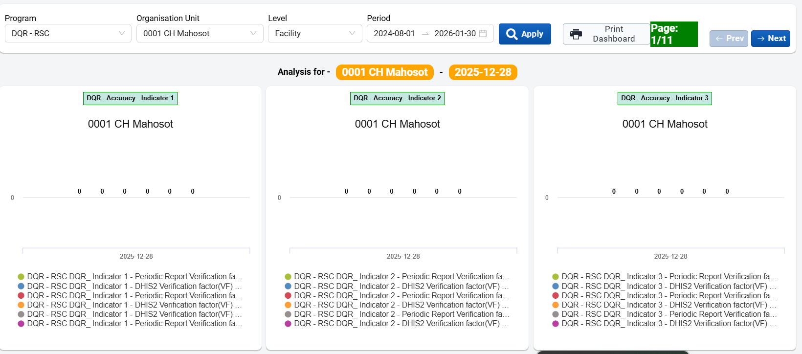 
