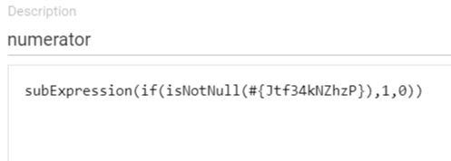
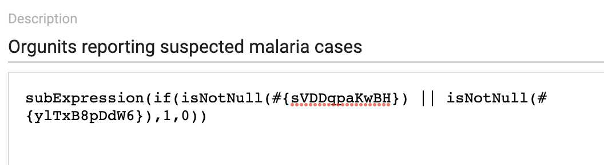
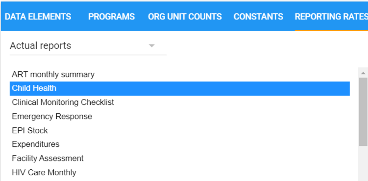
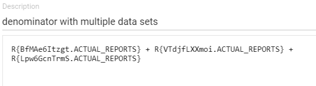
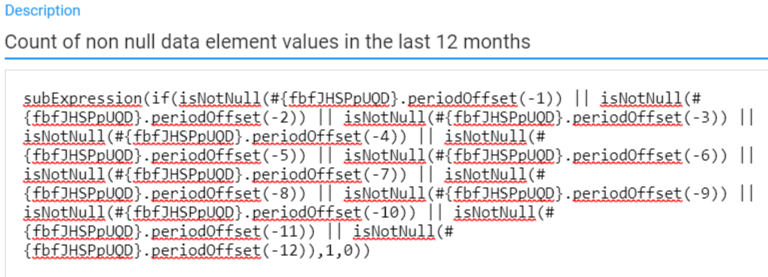
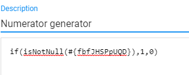
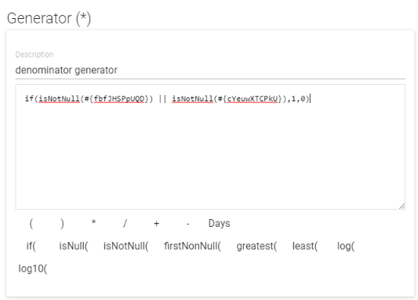
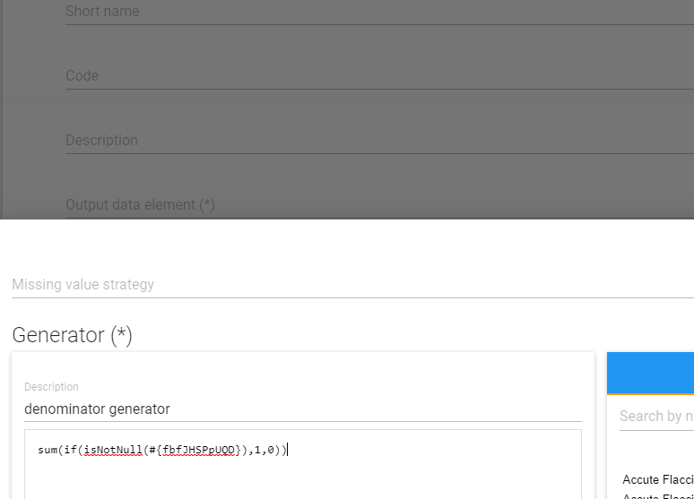

# Data Quality

This chapter discusses various aspects related to data quality.

## Measuring data quality

Is the data complete? Is it collected on time? Is it correct? These are
questions that need to be asked when analysing data. Poor data quality
can take many shapes; not just incorrect figures, but a lack of
completeness, or the data being too old (for meaningful use).

## Reasons for poor data quality

There are many potential reasons for poor quality data, including:

  - Excessive amounts collected; too much data to be collected leads to
    less time to do it, and “shortcuts” to finish reporting

  - Many manual steps; moving figures, summing up, etc. between
    different paper forms

  - Unclear definitions; wrong interpretation of the fields to be filled
    out

  - Lack of use of information: no incentive to improve quality

  - Fragmentation of information systems; can lead to duplication of
    reporting

## Improving data quality

Improving data quality is a long-term task, and many of the measures are
organizational in nature. However, data quality should be an issue from
the start of any implementation process, and there are some things that
can be addressed at once, such as checks in DHIS2. Some important data
quality improvement measures are:

  - Changes in data collection forms, harmonization of forms

  - Promote information use at local level, where data is collected

  - Develop routines on checking data quality

  - Include data quality in training

  - Implement data quality checks in DHIS2

## Using DHIS2 to improve data quality

DHIS2 has several features that can help the work of improving data
quality; validation during data entry to make sure data is captured in
the right format and within a reasonable range, user-defined validation
rules based on mathematical relationships between the data being
captured (e.g. subtotals vs totals), outlier analysis functions, as well
as reports on data coverage and completeness. More indirectly, several
of the DHIS2 design principles contribute to improving data quality,
such as the idea of harmonising data into one integrated data warehouse,
supporting local level access to data and analysis tools, and by
offering a wide range of tools for data analysis and dissemination. With
more structured and harmonised data collection processes and with
strengthened information use at all levels, the quality of data will
improve. Here is an overview of the functionality more directly
targeting data quality:

### Data input validation

The most basic type of data quality check in DHIS2 is to make sure that
the data being captured is in the correct format. The DHIS2 will give
the users a message that the value entered is not in the correct format
and will not save the value until it has been changed to an accepted
value. E.g. text cannot be entered in a numeric field. The different
types of data values supported in DHIS2 are explained in the user manual
in the chapter on data elements.

### Min and max ranges

To stop typing mistakes during data entry (e.g typing ‘1000’ instead of
‘100’) the DHIS2 checks that the value being entered is within a
reasonable range. This range is based on the previously collected data
by the same health facility for the same data element, and consists of a
minimum and a maximum value. As soon as a the users enters a value
outside the user will be alerted that the value is not accepted. In
order to calculate the reasonable ranges the system needs at least six
months (periods) of data.

### Validation rules

A validation rule is based on an expression which defines a relationship
between a number of data elements. The expression has a left side and a
right side and an operator which defines whether the former must be less
than, equal to or greater than the latter. The expression forms a
condition which should assert that certain logical criteria are met. For
instance, a validation rule could assert that the total number of
vaccines given to infants is less than or equal to the total number of
infants. The left and right sides must return numeric values.


The validation rules can be defined through the user interface and later
be run to check the existing data. When running validation rules the
user can specify the organisation units and periods to check data for,
as running a check on all existing data will take a long time and might
not be relevant either. When the checks have completed a report will be
presented to the user with validation violations explaining which data
values need to be corrected.

The validation rules checks are also built into the data entry process
so that when the user has completed a form the rules can be run to check
the data in that form only, before closing the form.

### Outlier analysis

The standard deviation based outlier analysis provides a mechanism for
revealing values that are numerically distant from the rest of the data.
Outliers can occur by chance, but they often indicate a measurement
error or a heavy-tailed distribution (leading to very high numbers). In
the former case one wishes to discard them while in the latter case one
should be cautious in using tools or interpretations that assume a
normal distribution. The analysis is based on the standard normal
distribution.

### Completeness and timeliness reports

Completeness reports will show how many data sets (forms) have been
submitted by organisation unit and period. You can use one of three
different methods to calculate completeness; 1) based on completeness
button in data entry, 2) based on a set of defined compulsory data
elements, or 3) based on the total registered data values for a data
set.

The completeness reports will also show which organisation units in an
area are reporting on time, and the percentage of timely reporting
facilities in a given area. The timeliness calculation is based on a
system setting called Days after period end to qualify for timely data
submission.


## Calculating completeness for data elements
In some DHIS2 implementations it has been observed that reporting is inconsistent for all data elements in a data set. DHIS2 by default only assesses the reporting rates of data sets and not of the individual data elements in that data set. The goal of a data element reporting rate is to assess the reporting consistency of a single value. This is for aggregate data elements only.

A reporting rate is: 100 x (Number of received values / Number of expected values)

To calculate the reporting rate for a data element we have to define an indicator with the numerator (number of received values) and the denominator (number of expected values), and with a factor  of 100 (percentage indicator type). There is only one way to define the numerator, however there are various options for calculating the denominator.

DHIS 2.38 and higher has functionality for defining such indicators directly. In 2.37 and below requires that predictors are used as an intermediate step in the calculation. These two approaches are described separately.

### Instructions for 2.38 and higher

DHIS 2.38 and higher supports calculation of both numerator and denominator directly with indicators. For the denominator, there are several alternatives for defining the denominator, i.e. "expected number of reports", each of which is described with some guidance on when they are appropriate.


#### Numerator
The *numerator* should be the **count of values** for a data element. For this we recommend using the subExpression and isNotNull conditional statements in the expression. This will return a 1 value for any time there is a number (including zero) entered for this data element. An example is given below.

 

For data elements that are dissaggregated with a category combination, you need to consider whether to count data elements as "reported" if there is data for any of the disaggregations (category option combinations), or if it's more relevant to make the completeness indicator for one particular disaggregation. The example above will do the former. To check completeness for one category option combination, include its ID in the inner expression.

#### Denominator definition
These are the main options for defining the denominator calculation, i.e. count of expected reports:

1. Count of reported values of another data element that is part of the same data set
2. Count of orgunits to which the data set(s) the data element is part of is assigned
3. Count of orgunits that have previously reported on the data element itself

##### Option 1

This option is based on using the number of reported values for another data element as the **expected values** in the completeness calculation. This other data element can be chosen based on different criteria, described below.

A limitation of this approach is that it will not give an overview of the **overall** completeness of the data, only the completeness of specific data elements within data sets. It therefore needs to be analysed together with the general data set completeness or e.g. option 2.

###### Based on core indicator
If the data element you want to get a reporting rate for is used in a key performance indicator calculation with routinely reported data in the denominator, using the count of values reported for the denominator to calculate completeness is recommended. This option is not viable if the data element is not used in an indicator calculations, or if the denominator is based on a population estimate or other value  that is not reported with the same periodicity as the numerator.

To explain this option we will start with an example indicator, *Suspected cases tested for Malaria (%)*:

> Total malaria tested cases / (Clinic suspected cases + Community suspected cases)


Now we want to know the reporting rate of *Total malaria tested cases* so we will use *clinic suspected cases and community suspected cases* to define the count of our expected values. If I wanted to make a data element reporting rate based on the first denominator option, the denominator in this example would be:

```
subExpression(if(isNotNull(#{sVDDqpaKwBH}) || isNotNull(#{ylTxB8pDdW6}),1,0))
```



This expression will return a 1 value if there is anything (including a zero) entered for either clinic suspected cases or community suspected cases, which then corresponds to the expected number of reports of malaria cases tested (our numerator).

The advantage of this option is that it gives a good indication of the completeness/consistency of data used to calculate a particular core indicators (like *Suspected cases tested for Malaria (%)* in the above example). 


*Based on related data element*

This option is similar to the above, but using a data element that is closely related to the data element in the numerator to calculate the denominator. For example, if you are looking at a reporting rate for inpatient malaria cases under 5 years (numerator), then you might consider using inpatient malaria cases 5 years and above, inpatient malaria deaths, outpatient malaria cases, etc.


*Based on data element in the same data set*

This option is similar to the above, but using a data element reported in the same data set or data set section as the data element you are calculating the reporting rate for (numerator) - without necessarily being logically related. With this approach, you should choose a data element that is always (or often) reported on in the data set. For example, in a data set with maternal health data, more health facilties will likely report on a data element for "Antenatal care first visits" than for "Assisted delivery", and "Antenatal care first visits" would therefore be a better estimation of the number of expected reports.


##### Option 2

This option is recommended for countries that are collecting a data element across multiple data sets and still want to have the expected reports based upon data set organisation unit assignment.

To configure this option you simply need to select either the **expected** or **actual** reports for the data sets you want to sum in the denominator. These can be selected under the "Reporting rates" tab of the indicator expression window. Choosing **actual reports** will give an indicator for the completeness of data element among the organisation units that reported, whilst using **expected reports** will give an indicator for the completeness of data element among all organisation units expected to report.






##### Option 3

In this option we check to see if this facility has reported on the data element you are assessing for reporting rate at all in the last 12 months (other longer or shorter periods of time could be use). In this way the numerator data element is the same as the denominator data element except we also use the periodOffSet expression to evaluate in each of the previous 12 months if there was a value recorded.



Example of option 3 denominator.

```
subExpression(if(isNotNull(#{fbfJHSPpUQD}.periodOffset(-1)) || isNotNull(#{fbfJHSPpUQD}.periodOffset(-2)) || isNotNull(#{fbfJHSPpUQD}.periodOffset(-3)) || isNotNull(#{fbfJHSPpUQD}.periodOffset(-4)) || isNotNull(#{fbfJHSPpUQD}.periodOffset(-5)) || isNotNull(#{fbfJHSPpUQD}.periodOffset(-6)) || isNotNull(#{fbfJHSPpUQD}.periodOffset(-7)) || isNotNull(#{fbfJHSPpUQD}.periodOffset(-8)) || isNotNull(#{fbfJHSPpUQD}.periodOffset(-9)) || isNotNull(#{fbfJHSPpUQD}.periodOffset(-10)) || isNotNull(#{fbfJHSPpUQD}.periodOffset(-11)) || isNotNull(#{fbfJHSPpUQD}.periodOffset(-12)),1,0))
```

### Instructions for 2.37 or lower.

If you are using 2.37 or lower you will have to use a combination of predictors and indicators to calculate data element reporting rates. One predictor will be used to calculate the value for **expected reports** and save it as a data element, another predictor is used to calculate the value for **expected reports** and save it as a data element, and finally those two data elements are combined into a completeness indicator.

Note that predictors will need to be scheduled to run on the server. See the **Final Steps** section for guidance on this.


#### Numerator

For this you have to make a predictor that uses isNotNull confidential statements in the generator. This will return a 1 value for any time there is a number (including zero) entered for this data element.

Steps to make the predictor:

1. Make your output data element.

2. Assign the output data element to your predictor.

3. Set the period type (typically monthly).

4. Assign the org unit level for the analysis (typically facility level).

5. Configure the generator as below.

6. Set the sequential sample count to 0

7. Set the annual sample count to 0

8. Leave the sequential skip count blank

9. Create a predictor group and add this predictor to that group.

10. Now define the predictor for the denominator and then add that predictor the to same predictor group that you have added the numerator predictor to.




#### Denominator 

The denominator can be one of these options.

1. Count of reported values of another data element that is part of the same data set
2. Count of orgunits to which the data set(s) the data element is part of is assigned
3. Count of orgunits that have previously reported on the data element itself

##### Option 1

This option is based on using the number of reported values for another data element as the expected values in the completeness calculation. This other data element can be chosen based on different criteria, described below.

A limitation of this approach is that it will not give an overview of the overall completeness of the data, only the completeness of specific data elements within data sets. It therefore needs to be analysed together with the general data set completeness or e.g. option 2.

###### Based on core indicator
If the data element you want to get a reporting rate for is used in a key performance indicator calculation with routinely reported data in the denominator, using the count of values reported for the denominator to calculate completeness is recommended. This option is not viable if the data element is not used in an indicator calculations, or if the denominator is based on a population estimate or other value  that is not reported with the same periodicity as the numerator.

To explain this option we will start with an example indicator, *Suspected cases tested for Malaria (%)*:

> Total malaria tested cases / (Clinic suspected cases + Community suspected cases)

Now in order to calculate the reporting rate of *Suspected cases tested for Malaria (%)* we will use **clinic suspected cases** and **community suspected cases** to define the count of our expected values. To create the denominator predictor for this example you first follow steps 1-4 of creating the numerator described above. The generator in this example is:

```
if(isNotNull(Clinic suspected cases) OR isNotNull(Community suspected cases),1,0)
```



Set the sequential sample count to 0. Set the annual sample count to 0. Leave the sequential skip count blank and add the predictor to the predictor group.

*Based on related data element*

This option is similar to the above, but using a data element that is closely related to the data element in the numerator to calculate the denominator. For example, if you are looking at a reporting rate for inpatient malaria cases under 5 years (numerator), then you might consider using inpatient malaria cases 5 years and above, inpatient malaria deaths, outpatient malaria cases, etc.


*Based on data element in the same data set*

This option is similar to the above, but using a data element reported in the same data set or data set section as the data element you are calculating the reporting rate for (numerator) - without necessarily being logically related. With this approach, you should choose a data element that is always (or often) reported on in the data set. For example, in a data set with maternal health data, more health facilties will likely report on a data element for "Antenatal care first visits" than for "Assisted delivery", and "Antenatal care first visits" would therefore be a better estimation of the number of expected reports.


##### Option 2

This option is recommended for countries that are collecting a data element across multiple data sets and still want to have the expected reports based upon data set organisation unit assignment.

This option does *not* require creating a predictor for the numerator. To configure this option you simply need to select either the **expected** or **actual** reports for the data sets you want to sum in the denominator, together with the numerator value generated by the predictor as described above. The actual/expected reports can be selected under the "Reporting rates" tab of the indicator expression window. Choosing **actual reports** will give an indicator for the completeness of data element among the organisation units that reported, whilst using **expected reports** will give an indicator for the completeness of data element among all organisation units expected to report.


##### Option 3

In this option we check to see if this facility has reported on the data element you are assessing for reporting rate at all in the last 12 months (other longer or shorter periods of time could be used). In this way the numerator data element is the same as the denominator data element except we also use the periodOffSet expression to evaluate in each of the previous 12 months if there was a value recorded.

This predictor for option 3 is defined in the same way as steps 1-4 of the numerator. The generator should be:



The sequential sample count should be set to 12 if you want to sample 12 previous months. Any other amount of months could be sampled as well by changing this value.

Set the annual sample count to 0. Leave the sequential skip count blank, and add the predictor to the predictor group.

#### Final steps

1. In the scheduler app create a predictor rule and set it to run weekly. Select the predictor rule group that includes the predictors for the numerator and the denominator. The relative start should be -30 and the relative end should be 0 for monthly data.

2. Make sure that the predictor rule is scheduled to run several hours before the analytics tables are scheduled to run.

3. Make the data element reporting rate indicators that include the numerator and the denominator data elements that you have defined from the predictors. The indicator should be set to percentage.
