# Data quality

# Introduction

In this toolkit, we will describe some of the common principles associated with data quality, identify the tools and approaches within DHIS2 that can contribute to data quality review and describe how to implement features and approaches regarding data quality within the health information system. This will include template procedures and lessons learned from training and utilizing these features in the field. 

# Data Quality Principles

The DHIS2 approach for data quality follows what is outlined within the [WHO Data Quality Assurance (DQA) guidelines](https://www.who.int/data/data-collection-tools/health-service-data/data-quality-assurance-dqa). For the best results in implementing DHIS2 data quality features, it is recommended that you review these guidelines as reference to this toolkit. In the DQA guidelines, several frequencies for the review of data are identified: 

_Routine Review_

These should be regular (e.g. weekly/monthly etc. depending on the frequency of data collection) reviews of data quality built into a system of checks of the HMIS or other program reporting systems as part of a feedback cycle that identifies errors in near real-time so they can be corrected as they occur. This routine examination of data can be more holistic and either cross-cutting or programme-specific, and can be conducted by different users of data (e.g. HMIS managers, program managers, etc.).

_Discrete Assessments_

These are needed to look at the quality of health facility data being used both to measure the performance of the health sector and also for policy and planning purposes. These assessments should be carried out before a planning cycle, such as in advance of an annual health sector review (periodicity is country-specific, but likely most comparable to an annual cycle).

_Periodic Review_

These should focus on a single disease or program area and should be timed to meet the planning needs of the specific program (e.g. prior to program reviews).

DHIS2 is able to support these different frequencies of data quality review. This toolkit will focus on measures involved in the routine review of data quality as general observations indicate this can be challenging to implement in practice. These routine practices can be built on and used for the purposes of discrete and periodic review as needed.


## Measuring data quality

During a typical review of data quality, there are 4 measures of data quality that are typically assessed:


1. Completeness and Timeliness
2. Internal Consistency
3. External Consistency
4. Consistency of denominator data


### Completeness and Timeliness

Completeness is measured either by reviewing reporting rates for an entire reporting form/data set or by reviewing the completeness of specific data elements within reporting forms when additional accuracy is required. 

<span style="text-decoration:underline;">Data set completeness - reporting rates</span>

In DHIS2, reporting rate completeness = Received reports/expected reports x 100%

* Received reports: the number of data sets for a given period and organisation unit which have been marked as complete by the data entry clerk, using the “complete” button in the data entry app

* Expected reports: the number of organisation units a data set is assigned to based on the reporting period the data set should be reported on. For a monthly dataset assigned to 100 facilities we expect 100 reports in a month.

<span style="text-decoration:underline;">Data set timeliness</span>

Reporting timeliness:  Received reports on time/expected reports x 100%


* Received reports on time: the number of data sets for a given period and organisation unit which have been marked as complete _within a deadline specified for that particular data set_.

“On time” is dependent on the configuration within a country or organization, and is often based on procedures that have been locally defined. For example, in a monthly reporting form on time could be defined as 15 days after the end of the previous reporting month. In that case, submitting data by June 15 for May data would be considered timely.

<span style="text-decoration:underline;">Data element completeness</span>

The goal of a data element reporting rate is to assess the reporting consistency of a single variable. This is applicable to aggregate data elements only.

Data element completeness = Number of received values / Number of expected values x 100%

This section[LINK] in this toolkit describes completeness and timeliness measures in DHIS2 in more detail.

### Internal Consistency

Internal consistency is meant to compare internal data sources to determine if there are significant variations based on either statistical rules or logical comparisons. In DHIS2, we can support the review of internal consistency through several measures including:


* Consistency between related variables
* Consistency over time
* Outlier analysis
* Through the use of validation rules
* Min-max analysis

These are described in more detail within this section[LINK]


### External Consistency

External consistency is meant to compare your data with data from other sources. For example, you could compare data in a routine health information system with data collected from a survey. If this external data is imported into DHIS2, several comparative measures can be used to review external consistency via data visualizer, the WHO data quality app and through the use of validation rules.

This is described in more detail within this section[LINK]


### Consistency of denominator data

This measure reviews the denominators that are used to calculate coverage. This can involve aspects of both internal and external consistency. For example, comparing related census population estimates such as estimated pregnant women, estimated live births and estimates of &lt;1 year would be an internal comparison; while comparing these census measures with UN population estimates would be an example of external consistency. 

This is described in more detail within this section[LINK]


# Data entry for aggregate data

As much as possible, data quality issues should be detected and addressed as early as possible. By the time data is entered into DHIS2, it will often have been recorded first on patient cards or registers, then manually tallied into tally sheets, before the data is aggregated into weekly, monthly or quarterly values and recorded in aggregate facility reporting forms. Finally, data from these aggregate forms is entered into DHIS2. The design and quality of all these different tools, and the training provided and time allocated to staff to correctly perform these data collection activities are critical for the quality of the data.


## Design of data entry

Design of the data collection forms is an often overlooked element of good data quality. Design of paper-based data collection tools and forms is beyond the scope of this document, but well-designed paper based forms which are easy for data collection staff to fill out are an important factor in improving data quality. Forms which are extremely complex may be difficult to fill out on paper, leading to possible transcription errors on the original paper form. These errors may then be propagated into digital form (i.e. DHIS2) when electronic data entry takes place. 

[Data entry forms](https://docs.dhis2.org/en/use/user-guides/dhis-core-version-master/configuring-the-system/metadata.html#manage_data_set) [LINK] in DHIS2 can either be auto-generated (default or section forms) or have custom design (custom forms). Using HTML and JavaScript, complex custom forms can be created by DHIS2 implementers which can mimic very closely the layout and design of a paper form. So-called section forms are auto-generated by DHIS2, and consist of sections of data which share a common type of disaggregation.  Section forms are generally easier to maintain and work well on mobile devices such as Android. Section forms should be the preferred option when possible. Section forms however may not align with the design of paper forms, which may complicate the process of data entry, thereby leading to a higher likelihood of mistakes being made during the transcription process.

Custom forms are sometimes necessary to be able to make a data entry form that makes it easy to transfer from paper to digital; however, custom forms are sensitive to changes in the underlying metadata (e.g. data elements and category dimensions).  This may lead to data being entered into the incorrect data element/category option combination without the user noticing it. Complicated custom forms may also require extra work to make “tabbing” between cells work correctly, which is important for efficient data entry without errors.

More generally, data entry forms that are overwhelmingly big (such as tables with 100+ rows x 10+ columns, not uncommon for recording morbidity data) come with the risk of the data entry user losing track of what row/column (e.g. disease and age/sex disaggregation) data is being entered into.

While we will not cover all the aspects of creating data entry forms here, consider some of these items in your design **_prior to_** configuring any data set in DHIS2 as this may aid in reducing some potential data quality issues before they arise.


* What are the data elements on the form?
* Which period is the form going to be collected?
* Are there any disaggregations associated with the data elements that need to be made?
* Which organisation units should be reporting on the form routinely?
* Are there any items that can be automated -- ie. indicators or calculated totals?
* Are there any items we should collect using other means (population data, cumulative totals, etc.)
* Design your dimensions with data use in mind, not data collection [LINK]. 
    * This means that the disaggregation of data values at the time of collection should be easily aggregated up along the various dimensions ie. they add up to a meaningful total
* Reuse dimensions as much as possible as this increases the ability to compare disaggregated data (e.g. age groups, fixed/outreach, sex, etc.)

It is also critical that data elements are configured with the appropriate value types, to allow only the right type of data values to be saved. For example, making sure data elements used for capturing service delivery usage, cases/deaths, number of tests etc should be configured as zero or positive integers, to prevent negative numbers or decimals.


## Validation rules

Validation rules[LINK] are a critical component of ensuring that  individual data values which are related follow defined patterns. As a simple example, it is not possible to have more people who test positive for malaria than the number of people who were tested for malaria. Similarly, if there are any people who have tested positive for malaria, there should be at least as many people who were tested. 

In DHIS2, validation rules consist of two values (a left side and a right side) which are compared using a mathematical operator (less than, greater than, etc) to produce a logical true or false result. Validation rules compare values which are within DHIS2, at the level of capture and periodicity as defined by the validation rule. Using our examples above, a validation rule can look like the following in DHIS2:


If this data is collected monthly at the facility level, then it can be compared at least every month at the facility level, and additionally can be run at higher levels and lower frequencies if needed (for example, at district level for a year). 

Note that validation rules are not triggered when working offline in the web-based Data entry app; however they do work offline when using the DHIS2 android application on a mobile device. 


### Configuring validation rules

Let us create the validation rule example we have mentioned previously in DHIS2. As malaria testing can be performed using different methods, we will create this rule specifically for RDT tests.


1. Start by opening the Maintenance app and select the Validation tab.

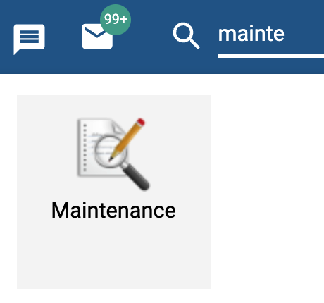


2. Create a new rule by selecting the “+” icon underneath validation rule


3. Review the fields that will be used to describe the rule. You will need to enter a name, select the importance and period type and define your left side, right side and operator at minimum.

4. Add a name. The name must be unique among the validation rules in the system. Try to make it descriptive so you understand what it is representing. In this example, we could use the name “MAL - Positive (RDT) &lt;= Tested (RDT).” 

5. Add an instruction. This field is not required, but this is what the user will see in both validation analysis as well as when reviewing validation rules in data entry. For this reason, it is recommended that an instruction is always in place to make it clear to the user how to review the validation rule. 

6. (Optional) Assign the rule a short name, code, description.


7. Select an Importance: High, Medium or Low. This is a description of the validation rule that will be displayed to the user and does not affect priority or whether it is run or not.

8. Select a Period type. Note that you can not select a period type that is less than the frequency of data entry. If your data is collected monthly, you can not set the period as weekly for example. 

9. Create the left side of the expression:
    1. Click Left side.
    2. Select Sliding window if you want to view data relative to the period you are comparing. [See also About validation rules.](https://docs.dhis2.org/en/use/user-guides/dhis-core-version-master/configuring-the-system/metadata.html#about_validation_rule) 
    3. Select a Missing value strategy. This selection sets how the system evaluates a validation rule if data is missing.


| Option                         	| Description                                                                                                                                                                                                                                         	|
|--------------------------------	|-----------------------------------------------------------------------------------------------------------------------------------------------------------------------------------------------------------------------------------------------------	|
| Never skip                     	| The validation rule will never be skipped in case of missing data, and all missing operands will be treated effectively as a zero. This is the default option. Always select this option if you use the Exclusive pair or Compulsory pair operator. 	|
| Skip if all values are missing 	| The validation rule will be skipped only if all of the operands which compose it are missing                                                                                                                                                        	|
| Skip if any value is missing   	| The validation rule will be skipped if any of the values which compose the expression are missing.                                                                                                                                                  	|
   4. Type a Description.
   5. Build an expression based on the available data elements, program objects, organisation units, counts and constants. To do this, In the right pane, double-click the data objects you want to include in the expression. Combine them with the mathematical operators located below the left pane.


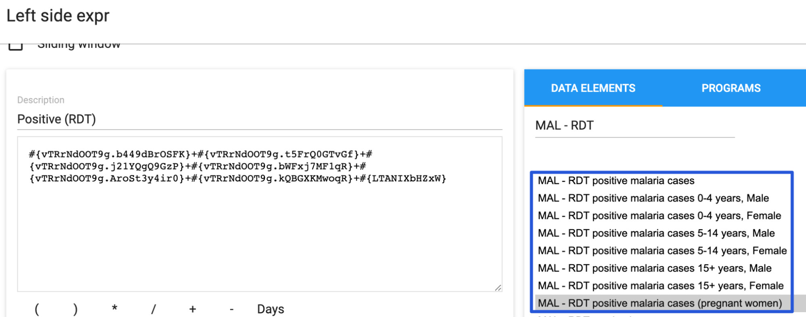

```
Note:

It is recommended to use the disaggregated data elements instead of the total data element as shown in the figure above i.e. all of the positive malaria cases by age and sex as we see here. This is because during validation rule analysis, when looking at the details, if the total data element was selected the details will be empty and you will not be able to drill down to identify where the problem originates from.
```


  6. As you add your data items from the right pane to the left pane, you will be seeing #{data element uid.category option combo uid}. This may not make a whole lot of sense, but if you scroll down you will see the name in plain text. 

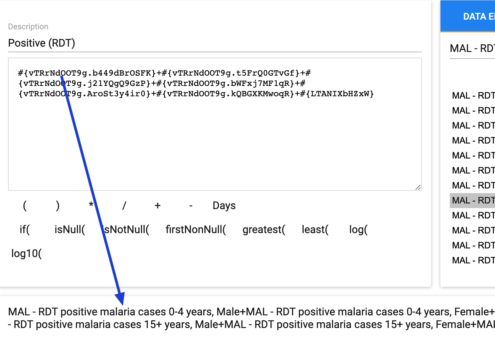


7. Once you have selected all of your required inputs, select Save. The left side description should appear after saving the left side.

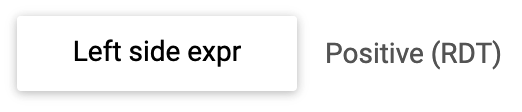


10. Select an Operator: Compulsory pair, Equal to, Exclusive pair, Greater than, Greater than or equal to or Not equal to.

    1. The **_Compulsory pair_** operator allows you to require that data values must be entered for a form for both left and right sides of the expression, or for neither side. This means that you can require that if one field in a form is filled, then one or more other fields that you have selected must also be filled.
    2. The **_Exclusive pair_** operator allows us to assert that if any value exists on the left side then there should be no values on the right side (or vice versa). This means that data elements which compose the rule on either side should be mutually exclusive from each other, for a given time period / organisation unit /attribute option combo. 
    3. In this example we will select less than or equal to


11. Create the right side of the expression, following the same process as for the left side (point 9 above)
12. With your left side, operator, and right side selected you should see the descriptions and operators for each of these items within the validation maintenance screen


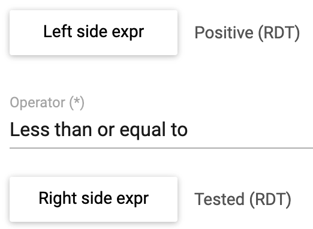

13. (Optional) Choose which Organisation unit levels this rule should be evaluated for. Leaving this empty will cause the validation rule to be evaluated at all levels and is the most frequently used option. 

14. (Optional) Click Skip this rule during form validation to avoid triggering this rule while doing data entry. Normally this is not selected so the user can also review this validation rule during data entry

15. Click Save to save the validation rule


#### Creating validation rule groups

After we have created our validation rules, we should group them together. Grouping similar validation rules together helps in particular when reviewing the validation rules together in bulk analysis. 

Go to Maintenance> Validation> Validation Group

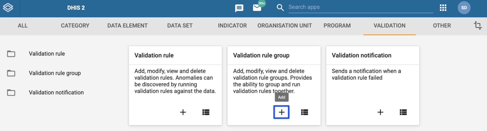

Select the add button and fill in the details of the validation group (the name, code and description).

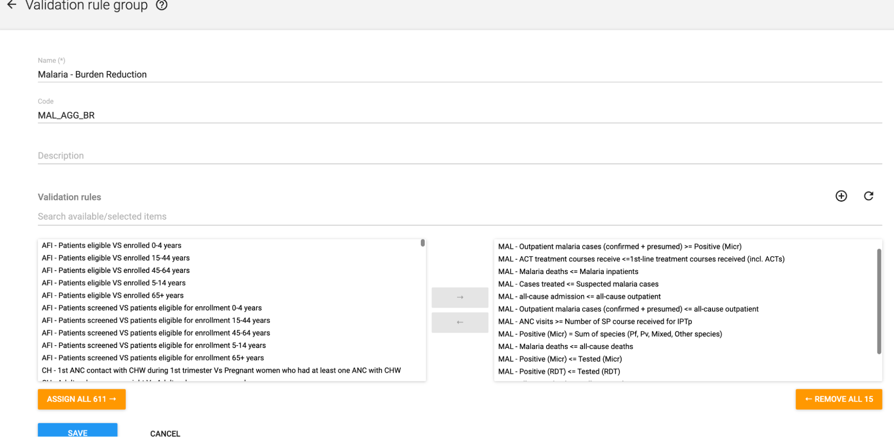

Add in all of the related validation rules that you have made to group by selecting them from the left pane and moving them to the right pane. When you have added all of your related rules to the group, select “Save.” How to best define groups depends on how data elements and data sets are structured in a particular implementation. However, examples can be:

* Making a group with all validation rules link to data elements in one specific data set (for example a monthly data set for malaria reporting)
* Making a group with all validation rules linked to data element in one particular section of data set (for example a _malaria_ _section_ of an integrated HMIS data set)
* Making a group with all validation rules linked to data element across several related data sets (for example across separate _malaria testing_ and _malaria treatment _data sets)

#### Review validation rule violations in data entry

As each system will have a different configuration, validation rules will need to be made as outlined in the “Configuring validation rules” section in this document prior to reviewing any violations. Once you have made all of the validation rules you require, you will want to use them to check your data on a routine basis. We can review validation rules in both data entry as well as through validation analysis[SECTION LINK]. When reviewing validation rules, we will only be alerted to those rules that are violated; not those that pass the checks we have created. 

Let us take a look at our example again


We can start by reviewing our validation rules in the data entry app. We have set the period for the validation rule we have defined as “monthly” as the data for malaria is collected monthly. In our example, the data comes from the following table

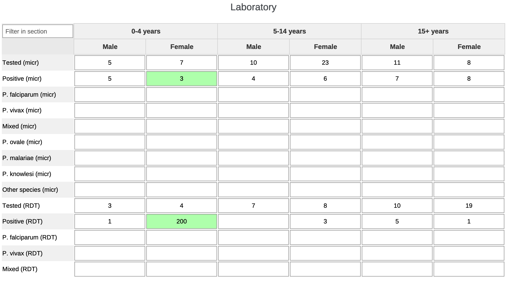

In order to check if there is any issue with our data based on the validation rules we have defined, we can scroll either to the top or bottom of the data set within the data entry app and select “Run validation” [Note: validation rules will also run if you select “Complete” at the bottom of the data entry screen].

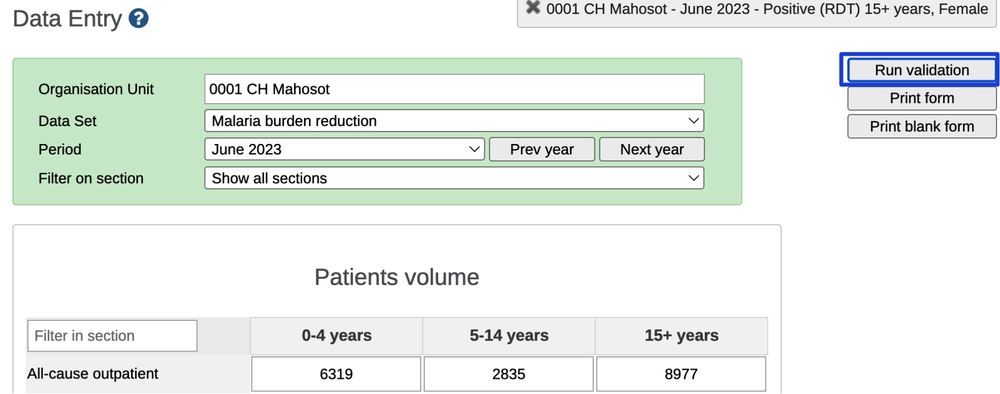

This will run any of the validation rules that are using data elements within the data set you have selected.

We can see the results within a pop-up window showing us the validation rules that have been violated when checked within data entry. 

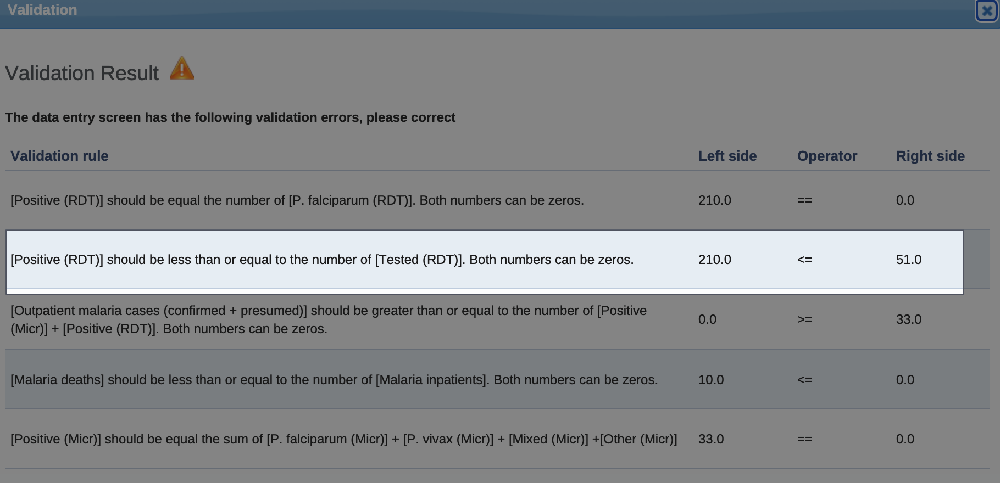

We can see there are multiple violations, including the rule that was created previously. At this time, it would be a good idea to review each of these rules to ensure that the data values in this dataset have been entered correctly before finalizing the data entry process. If possible, incorrect values should be changed in order to minimize errors at the source of collection. 

Reviewing our example we can see an obvious error and would want to correct this to the correct value


If we go through and correct all the errors that were identified as part of running validation within this dataset, period and organisation unit combination and run validation again, we should get a message indicating that validation has passed successfully.


Ideally, we should strive to have validation rules created prior to performing training on data entry for a particular program, as it would allow you to perform training on validation violations and correction during training. During training, you should then make sure all data sets successfully pass validation where possible prior to submission. 

#### Review validation rule violations in data entry (beta)

Validation rules can also be run in the new data entry app (available from version 2.39). Do this by selecting either “Run validation” at any time or “Mark complete” if the data set is supposed to be completed. 


Results will show on the right side of the data entry app, indicating the number of High, Medium and Low priority violations as well as listing the violations highlighted in the appropriate colour depending on the priority they have been assigned. We will see the new app displays the violations slightly differently then the previous data entry app, showing the instruction, then the left side along with its value, the operator, and the right side along with its value. 


We would want to go through a similar process as described for the data entry app and review each of the values associated with these rules to determine if a correction can be made prior to proceeding with other operations in DHIS2.

### Validation rule notifications

Validation rule notifications provide a way to create messages that can be sent in response to a validation rule being violated. These notifications consist of the validation rule(s) which trigger the notification, recipient(s), and the message that is tied to the violation. The notifications can be sent out as messages to intended recipients using 3 mechanisms within DHIS2: e-mail, SMS and through the DHIS2 internal messaging service. A review of configuring e-mail and SMS in DHIS2 is located here[LINK]. Here is an example of a validation rule notification sent out via e-mail.


Regarding the creation and use validation rule notifications, we need to be careful to ensure that the results within a message are not ignored. Usually, we would be conservative in the number of notifications we are creating so that users do not receive too many messages. Experience dictates that when this is the case, users tend to ignore these messages and areas that are actually problematic are not fixed. In general, create notifications for priority areas of correction and ensure that these notifications are being sent only to the users who need to see them. Other violations can be identified via routine data quality review procedures.

In order to create a validation rule notification, user groups are used to define the recipients. Please refer to the [documentation on user groups](https://docs.dhis2.org/en/use/user-guides/dhis-core-version-master/configuring-the-system/users-roles-and-groups.html#mgt_usergroup) to review how to create a user group in DHIS2. 

#### Configuring Validation Notifications

Go to Maintenance> Validation> Validation Notification


Select the add button to review the details of a new validation notification. There are a number of fields that we can break down. 

1. Name: This is the name for the validation notification you are creating
2. Code: You can also add in a code if required. The code can be used to uniquely identify the notification instead of the UID for example.


3. Validation rules: In this section you decide which validation rules you want to add to your notification. While you can add more than one validation rule to your notification, to make messages easier to interpret it is generally recommended that only one validation rule is within your notification. Keep in mind that there could be multiple violations within a given period if the users receiving the notification have access to several organisation units, and each violation would be identified in the message you are sending. 

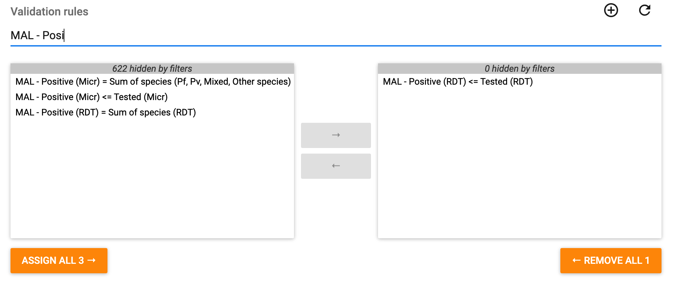

4. User groups: This section defines who will receive the notification that you are creating. You must have user groups created in order to use validation notifications. You can review[ this section in the documentation](https://docs.dhis2.org/en/use/user-guides/dhis-core-version-master/configuring-the-system/users-roles-and-groups.html#mgt_usergroup) in order to review how to create user groups. Depending on the method you are using to send the message, the user must have the related relevant information filled in. For example, if you are sending notifications via e-mail, users within the user group you have selected need to have their e-mail filled in or they will not receive the notification.You can select multiple user groups if needed, but just keep in mind that you should only be sending out the notification to those who need to receive this information rather than trying to target a wide range of users who may ignore the message. 

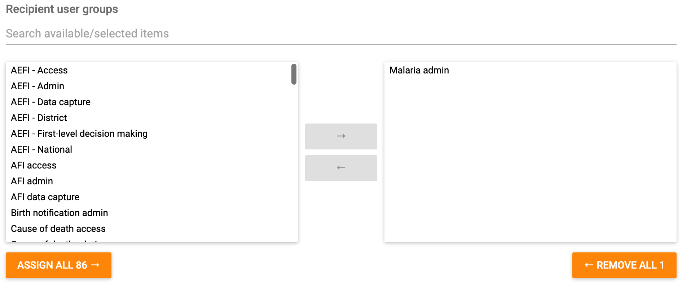

5. Notification strategy: Here we decide how we want to send out our notifications when multiple validation violations are detected (for example over several org units and/or time periods). 
    1. Collective summary: This will generate a summary of all of the violations that have been detected for the period(s)/organisation unit(s) you are monitoring during your review of the validation rules. For example, if you detect 10 violations, these will be all summarized together in one e-mail/SMS/DHIS2 message
    2. Single notification: In this case, a message will be sent out for each and every validation violation that is detected for the organsation units and periods you are reviewing. For example, if you detect 10 violations, then 10 separate messages will be sent out. Use this option sparingly for high priority violations.


6. Notify users in hierarchy only: 
7. Message template: In this section, we define what the message will look like when it is sent out to our recipients. The template can consist of both template variables as well as plain text. The template variables will be replaced with the values collected from DHIS2.


We can review an example of an output message to review how template variables and plain text appear within a notification when it is sent out.


1. This represents the subject template in the message. Each violation will have this displayed prior to showing you the contents of the message template. 
2. In the template itself we have a mix of free text and variables. The first variable is the left side description. In the message, this is replaced with Positive (RDT). 
3. This is the left side value. It is replaced in the actual message with the value as taken from DHIS2
4. This is the operator for the validation rule
5. This is the right side description, replaced with Tested (RDT) in the message
6. This is the right side value, taken from DHIS2
7. This is the organisation unit
8. This is the period

We can see we can use a number of different variables to create our message and provide correct outputs to the person reviewing the notification. 

To create the template, populate the message with a mix of free text and by selecting appropriate variables from the right side of the screen. 


Once you are done filling in these fields, select Save to save the notification.


### Recommendation on validation rules configuration

Validation rules is a powerful tool to prevent data entry errors, but if they are not configured in an appropriate way they can also be a source of error by nudging users to “fix” mistakes.

In some cases, there may be validation rules that you would like to create which are _most often_ real data quality problems, but which may be falsely flagged by DHIS2. An example of this is the comparison between women making their first (ANC1)  and fourth antenatal care visit (ANC4). Seen as an overall population, we can say that the number of  ANC1 visits should be greater than or equal to the number of ANC4 visits. Every woman making a fourth visit has also made the first visit, but inevitably some women will not show up for their fourth appointment. Thus, ANC4 should always be less than or equal to ANC1; however, this is not appropriate as a validation rule, because ANC visits are spread over several months, and women may make different visits in different health facilities. For example, a health facility may have 100 ANC 1 visits and 74 ANC 4 visits in a year (ANC 1 ≥ ANC 4), but in one individual month there could be 9 women making their 4th visit and only 8 making their first visit (ANC 1 &lt; ANC 4). This is not a data quality problem, but would be recorded as such with a validation rule comparing ANC1 and ANC4. 

We recommend _not_ creating validation rules in these instances, as this may be confusing to the data entry user seeing the validation rule warning, and they may in the worst case edit the data to meet the validation rule criteria. If you _do_ create this type of validation rule, the message to users should clearly state that the validation rule warning should be examined, but may not be an actual data quality problem in all cases.

The health data toolkits[LINK] - specifically the various aggregate metadata packages - includes validation rules for different health programmes 

* Refer to metadata packages - include examples of validation rules for key programmes


## Min-max values

The “Min-Max” functionality of DHIS2 is a set of features that allows you to check for outliers in the data _during data entry_. The min-max value is based on setting minimum and maximum accepted values for a combination of data element, category option combination and organization unit. During data entry, values outside these minimum and maximum thresholds are highlighted in the data entry screen. Similar to validation rules, if a data value is outside the boundaries defined by the min/max values, DHIS2 will still allow the data value in question to be saved. However, the value will be highlighted in the data entry screen and a dialog box will be displayed which the user will need to acknowledge. 

There are two main advantages with the min-max functionality: 

* It allows data quality issues to be detected and flagged at the point of data entry, so that the user entering data can immediately verify the data, correct typos etc.

* Unlike validation rules, that can only be defined when there are multiple data elements with a logical relationship between them, min-max values can be set for any numeric data element for which a minimum of historical data is available.

Note: for data sets disaggregated with an attribute category combination, the min-max values applies to all attribute option combinations.


### Configuring min/max values

Min-max values can either be set manually in the data entry app, or using methods that calculate minimum and maximum values based on statistical methods from historical data. Note that for reasons outlined in further detail below [LINK], we do _not_ recommend using the tool built in to DHIS2 to generate min-max values.


#### Configuring and viewing min/max values 

Min-max values can currently only be viewed within the data entry app; the dedicated “min-max analysis” component of the Data quality app has been deprecated.


#### Viewing and configuring min/max values in the data entry app

In the data entry app, double clicking within an input field (i.e. the cells for data entry) open as a pop-up window with information about that particular data element and category option combination. 


The section in the top right corner of the window shows any currently set min-max limits, and allows users with the appropriate permissions to remove and/or save new min-max values. As explained below, these values will then be applicable to that particular combination of data element, category option combination and organization units. The _Data element history_ graph will also show the maximum value when set. 

#### Viewing and configuring min/max values in the data entry (beta) app

In the data entry (beta) app, information about min-max values is shown by highlighting an input field (i.e. the cells for data entry) and clicking the View details button in the toolbar at the bottom of the app. 


This opens a Details panel on the right side of the screen, with a dedicated section for min-max limits. Any user can see the currently set min-max values, and users with the appropriate permissions can also edit or delete them. 


#### Built-in generator

DHIS2 includes functionality to bulk generate and remove min-max values for one or more data sets for a selection of organisation units. This functionality is found in the Data administration app. Follow these steps to generate or remove min-max values in bulk:


1. Select the Min-Max Value Generation section
2. Select one or more data sets for which you want to generate min-max values. Min-max values will be generated/removed for all data elements with category option combinations in that data set
3. Select the organization unit boundary to generate values for. Min-max values will be generated/removed for all organization units below the selected orgunit, including the   all orgunit itself.
4. Select either Generate or Remove min-max values.

Note: min-max values are only generated for combinations for data element, category option combination and orgunit for which data already exists, and this happens independently of how the data set is assigned.


DHIS2 generates min-max values by determining the mean of all existing data values (for a given data element/category option combo/organisation unit combination) and then calculating lower and upper bounds based on a certain number of standard deviations from this mean. The number of standard deviations that is used is based on a system setting property called _Data analysis std dev factor_. The default value that is used is 2 standard deviations. This can be changed in the System settings app, under the General section.

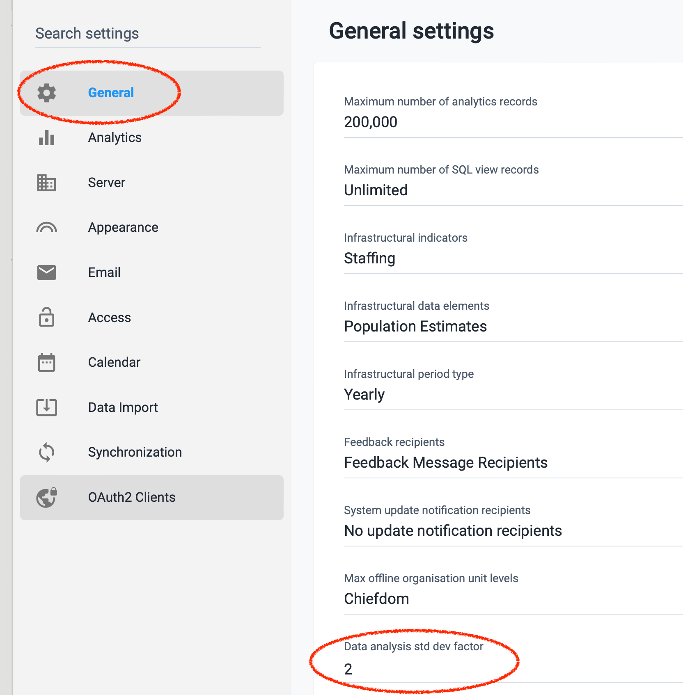


##### Limitations with min/max values

As a general rule, we do _not_ recommend using the Min-Max value generation tool with its current functionality, as it has several major limitations that causes it to generate min-max values that are too restrictive. This means too many values will be flagged as potentially wrong in the data entry app, which can both be a nuisance to data entry personnel and potentially lead them to incorrectly edit values so that they are within the limits. 

There are _some_ cases where this functionality might work sufficiently well to be used: if there is enough historical data to base the statistical analysis on, data is reasonably normally distributed (i.e. not seasonal, and not changing over time), and there are no facilities that always report very low numbers. In reality, however, there are very few cases where this is the case. In practice, one or more of these requirements are most often _not_ met:


* There will be certain small health facilities that consistently report very low numbers every month. In a hypothetical example of a health facility that reports values of 2 or 3 every second month in one year, the threshold based on 2 standard deviations above/below the mean will be 1,5 and 3,5. In other words, if the facility reports 1 or 4 in a month it would be outside the threshold. 

* Data is very often _not_ normally distributed. The typical example of this is data associated with rainy seasons, such as malaria. However, even data that is not typically considered seasonal will have certain months in the year with higher or lower numbers, for example reproductive health (including as a consequence immunizations, PMTCT etc).

* Min-max values will be generated for all combinations of data element, category option combination and orgunit for which there is any value. So for example, even is a health facility has only recently started reporting in DHIS2 and data only exists for a couple of months, min-max values will be generated - but from a very limited basis.

* Because the built in min-max generation can only be done based on the _mean_ of the existing data, it is sensitive to any existing outliers. 


#### Custom generation of min-max values

There is a [DHIS2 API](https://docs.dhis2.org/en/develop/using-the-api/dhis-core-version-240/maintenance.html?h=2.40#webapi_min_max_data_elements) that allows saving and removing min-max values. It is therefore possible to generate the min-max values outside using other tools, and then import them via the API. A limitation of this approach is that the API only allows you to POST or DELETE _individual_ values (for one data element, category option combination, orgunit combination). However, since this min-max does not need to be updated frequently (unlike for example analytics) it is possible to work around this limitation.


#### Prototype tool for min-max generation

As a prototype to test improved methods for generating min-max values has been developed, a [python tool](https://github.com/search?q=owner%3Aolavpo+min-max&type=repositories) has been developed with more flexibility in generation of min-max values. Detailed documentation on how to use this tool is available in the [github repository](https://github.com/search?q=owner%3Aolavpo+min-max&type=repositories).

This tool is designed to address the main shortcomings of the built-in min-max generation functionality:

* It allows setting different parameters according to the median values reported by orgunits; for example, min-max for small facilities can be set based on the previously highest values rather than standard deviations, and larger facilities can have a stricter threshold.

* It allows setting a minimum completeness of data for an orgunit before it tries to generate min-max values.

* It allows doing normalization of data using box-cox transformation before setting min-max values, to work better with data that is not normally distributed. 
* It supports using median in addition to mean as a basis for setting thresholds.

**Note** that the tool is for now only a prototype, and should be tested thoroughly in a test environment before it is used in a production environment.


#### Review min/max values in data entry

No user action is required to review min-max values in the data entry app: when a number outside the specified min-max value is entered, a pop-up window immediately appears with a warning message, and the cell is highlighted in dark orange. 


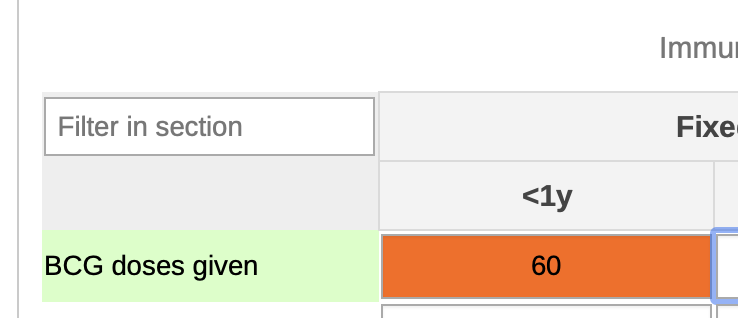


Upon marking the data set as complete or using the Run validation button, the min-max violations are also listed in a similar way as validation rule violations.

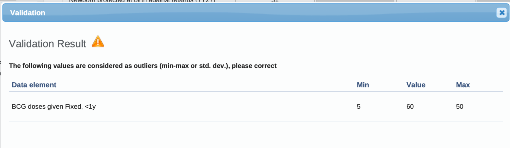

#### Review min-max values in the Data quality app

Min-max values can be reviewed in batch as part of Outlier detection in the Data Quality app. Min-max is available as one of the available “Algorithms”.


To perform an analysis of values outside the min-max thresholds:

1. select one or more data sets for analyse
2. select one or more organization units
3. specify start and end date
4. Select Min-max values as the Algorithm
5. Click Start

The result is presented as a list showing the data element, period and organization unit where a value outside the min and max thresholds have been reported.


The _Value_ column is the reported data value, _Deviation_ is how much above the max or below the min thresholds the number is, and the _Min_ and _Max_ columns show the min-max thresholds for the particular data element and organization unit. The table is sorted by Deviation, since the violations with the highest deviation have the biggest impact on the overall data. Follow-up allows data values to be marked for follow-up; they can then be review later using the Follow-up analysis [LINK] functionality.

# Assessing data quality

DHIS2 has a wide range of functions for assessing data quality, available across different apps and functions, and this section gives and overview of this functionality. It is structured according to the type of data quality metric:


* Completeness and timeliness of data
* Consistency of data across related variables
* Consistency of data over time

## Completeness and timeliness

_Completeness_ of reporting gives an indication of how much of the expected data has actually been reported. In DHIS2, most of the completeness checks are based on assessing the _data set_ completeness, i.e. how many data sets (forms) have been submitted by organisation unit and period. The timeliness calculation is based on a system setting called Days after period end to qualify for timely data submission. 

The built-in functionality for completeness and timeliness in DHIS2, e.g. what is built into the Data Visualizer, Reports and Maps application, refers to _data set _reporting rates. However, we can also configure DHIS2 to assess the proportion of facilities that are _consistently reporting_, as well as the completeness of individual data elements.


### Data set completeness and timeliness

The completeness reports will also show which organisation units in an area are reporting on time, and the percentage of timely reporting facilities in a given area. 

Data set completeness and timeliness can be reviewed in the reports app as well as  core visualization apps (Data visualizer and Maps). The core visualization apps allow for you to review completeness and timeliness in more significant detail across multiple org units and periods; however the reports app has a simplified user experience that has been validated by its widely observed use in comparison to other apps within DHIS2. 


#### Using Data Visualizer

In data visualizer, you will be able to review dataset completeness and timeliness measures similar to the reports app; however you are now free to select multiple data sets, periods and organisation units at the same time. You can also add completeness and timeliness measures to charts and tables that include other data, such as health service delivery data, to verify that the data you are reviewing is representative of the situation within the country you are working with. This gives you much more flexibility when compared to the reports app; however the additional options can make it less accessible compared to the reports app. Ideally, these visualizations are pre-made and placed on a dashboard for users to review routinely; however it is useful for a subset of users to know how to create outputs using these metrics within the data visualizer.

Within data visualizer, select your “Data” input, along with “Data Set” as the data type. This will allow you to search or add filters for the data set and metric type that you want to add to your visualization.


Here is an example of a chart comparing BCG doses given with the reporting rate of the immunization data set

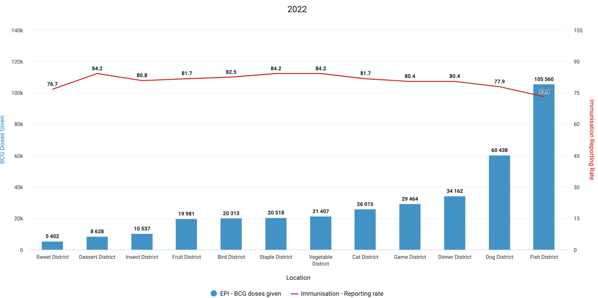

We can quickly note that several of the districts have reporting rates &lt; 80%, and therefore the data being displayed may not be fully representative of the situation in the country. It may be important to verify this through a more detailed analysis reviewing the facilities affecting this value and/or using data element completeness [LINK]

We can go through some examples of tables and charts you could potentially create when reviewing completeness and timeliness within the data visualizer app

**Example 1** : Pivot Table comparing completeness and timeliness over several datasets, periods and organisation units

Select Pivot table as the output type


* Select data and modify the data type to Data Sets
* Select the metrics you want to add to your table

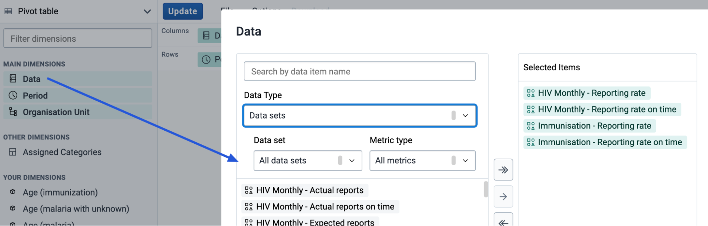

Either hide or update the data selector and proceed to modify your periods and organisation units


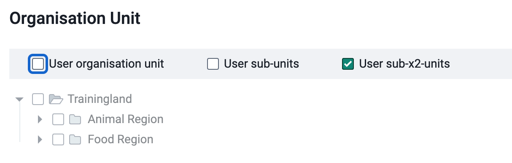

After all of your selections are made modify your layout and update your table

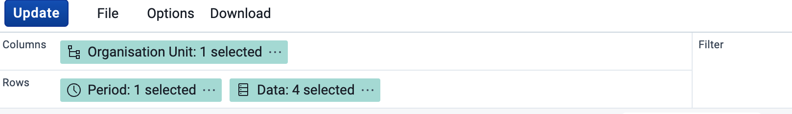

You should now be able to see the table with your inputs selected. 

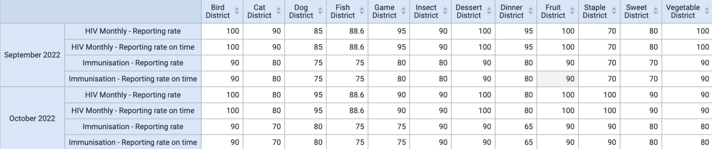


**Example 2** : Line chart comparing completeness and timeliness over several periods

Select line as the output type

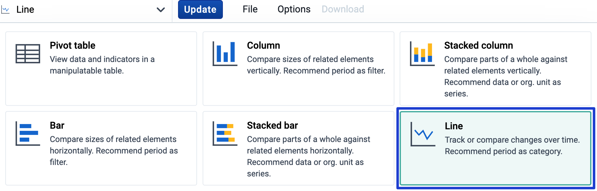

* Select data and modify the data type to Data Sets
* Select the metrics you want to add to your chart. Only one is selected here but you can use as many as necessary.

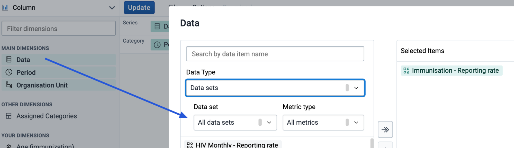

* Either hide or update the data selector and proceed to modify your periods and organisation units.


* Modify the layout of your chart and update when ready

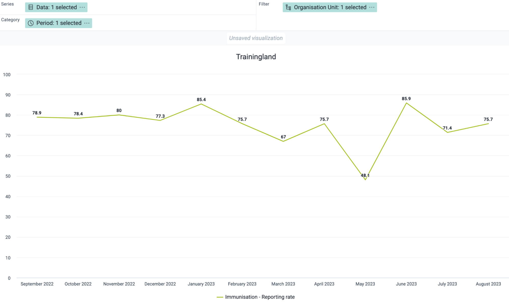

**Example 3** : A 2-axes chart comparing service data with dataset completeness

Select column as the output type

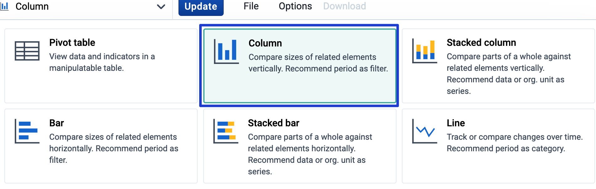

* Select data and modify the data type to Data Sets. Select the metric(s) you want to add to your chart


* Change the data type. Data elements are used in this example, but you are able to combine the completeness and timeliness metric with any of the existing DHIS2 data types in data visualizer


* Either hide or update the data selector and proceed to modify your periods and organisation units.


* Modify the layout of your chart and update when ready


* To move one of the items to the 2nd axes, select Options, then Series. Modify the data items to appear on the axes you want using the correct visualization type and update your chart


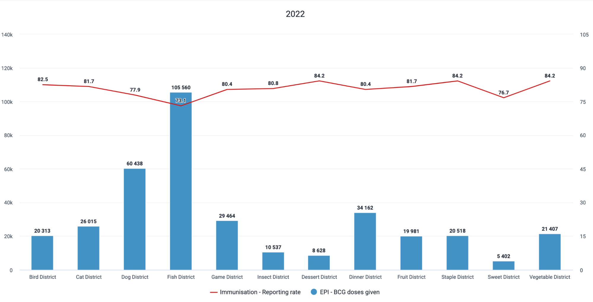


* Additional options, such as ordering the chart items and adding chart titles can then be added to the chart using the options button within the visualizer app

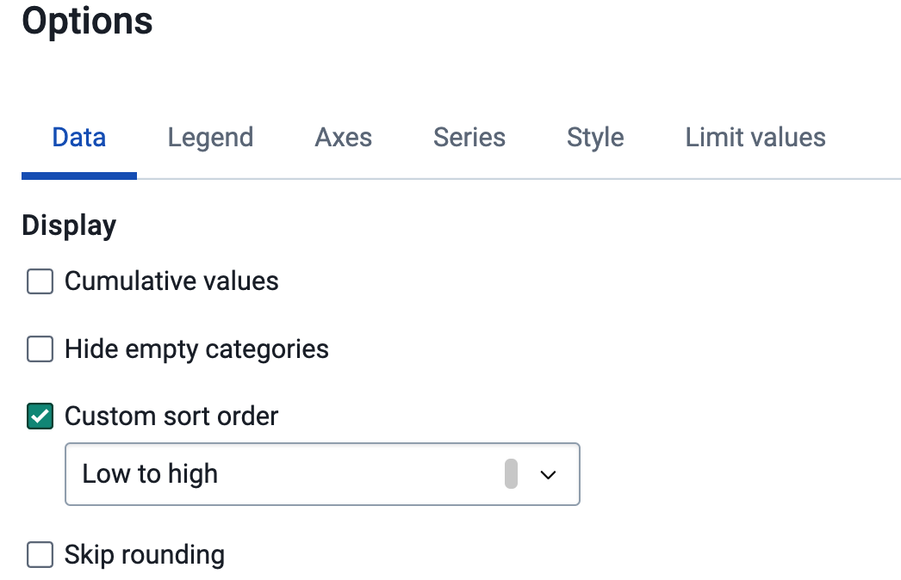
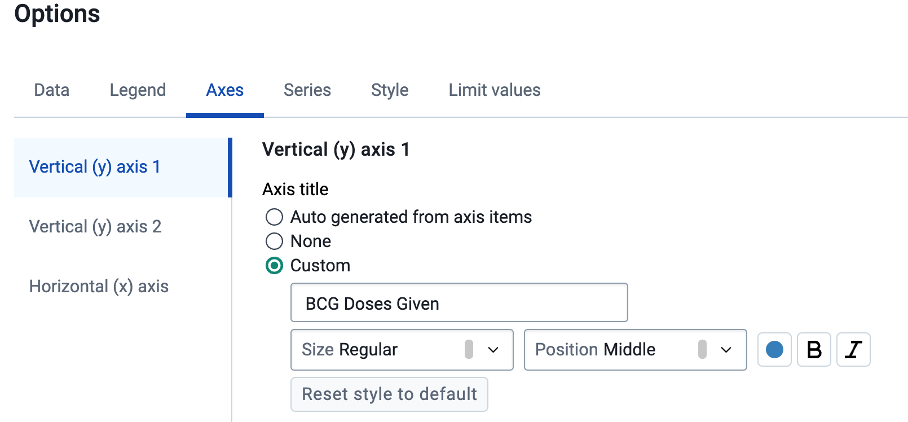


#### Using the reports app

In order to review completeness and timeliness within the reports app, navigate to apps -> Reports


From here, select “Get Report” under the Reporting Rate Summary heading

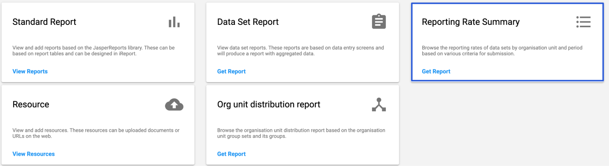

Start by selecting your inputs:

1. Which organisation units you want to review. You select the parent organsation unit, and all of the children within that parent will be selected (along with the overall result for the organisation unit selected). 

2. Select the data set you want to review completeness and timeliness information.

3. Selecting the reporting period, followed by the period itself/

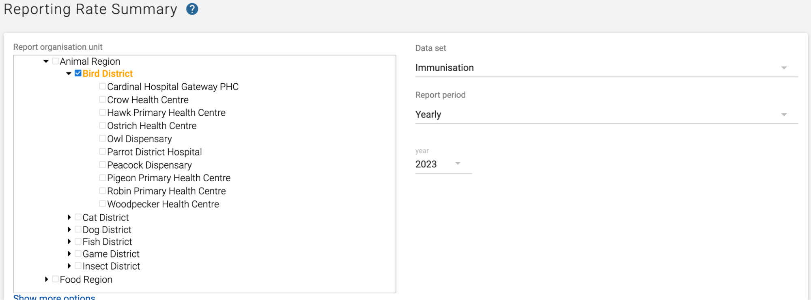

If you select Show more options, you can use an organisation unit group set to select organisation unit groups to further filter your report; however this is optional.


After you have selected all of your inputs, select “Get report” to produce the report.


This will produce a report with the following columns

1. Name: The name of the organisation unit

2. [Dataset name] - Actual reports: This is the number of reports within the period you selected that were marked as complete

3. [Dataset name] - Expected reports: This is the number of expected reports within the period you selected. This is automatically calculated based on the time dimension and the assignment of the data set to orgunits.

4. [Dataset name] - Reporting rate: This is the reporting rate: actual reports reports/expected reports x 100%

5. [Dataset name] - Actual reports on time: This is the number of reports within the period you selected that were marked as complete **_within the timeframe that is defined as “on time” for the selected dataset_**

6. [Dataset name] - Reporting rate on time : This rate = actual reports reports on time /expected reports x 100%

#### Configuring Data Set Completeness

Data Set completeness is based on the organisation unit assignment of your dataset. This determines the value for your expected reports based on the periodicity of the dataset. This is configured within the maintenance app

Navigate to maintenance -> data set -> and select or create the intended data set. Within this data set scroll to the very bottom to find the organisation unit assignment


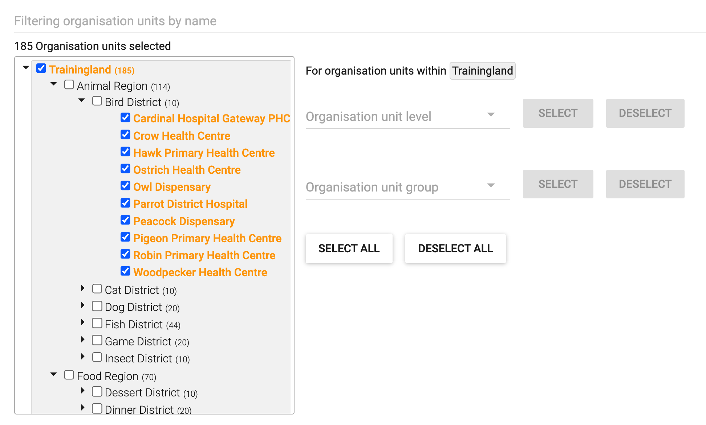

You can assign your dataset to organisation units by selecting them individually or using levels or groups. 

The important factor to consider here is to make sure that the dataset **_IS NOT_** assigned to any organisation units that are not expected to report on the dataset. This is because the number of expected reports will be consistently incorrect. For example, in the above screenshot this dataset is assigned to 185 organisation units. Let us say that this dataset is reported on monthly. Each month, 185 submissions will be expected. If only 160 organisation units report on this data set, your completenesss will never exceed 160/185 x 100% = 86% in any given month. This is because those additional 25 organisation units will never fill in the data set as they are not meant to. This is a key consideration when assigning your dataset to organisation units correctly. 


#### Configuring Data Set Timeliness

Timeliness is also configured within the maintenance app when creating or editing a dataset, using the field “days after period to qualify for a timely submission.”

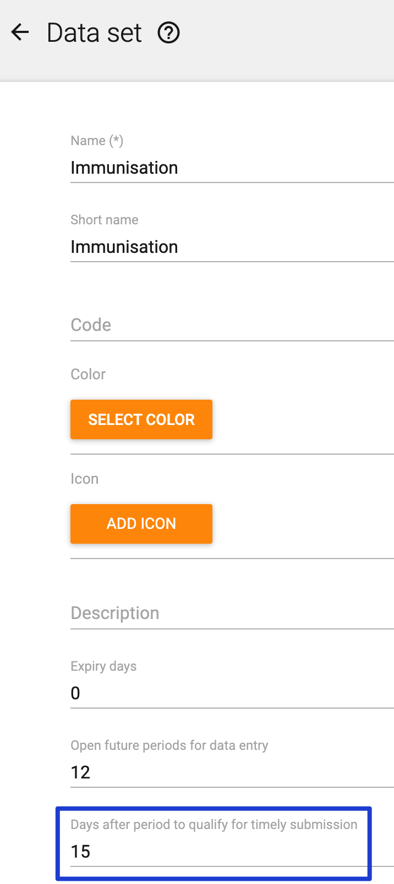

In the above example, the data set is collected monthly and the timeliness is set to 15. This 
means that the data set must be completed within 15 days after the end of the previous month in order to qualify as a timely submission.


### Data element completeness

Data set completeness and timeliness are useful measures to monitor the overall reporting performance of the system. However, there are several conditions that needs to be met for the data set completeness to give a representative indication of completeness of the data within the data set:


* Users must remember to mark the data set as complete when data has been entered

* User must actually enter data in the form before marking it as complete

* Assignment of data set to orgunits (facilities) must be correct 

Often, one or more of these conditions are _not_ met, which means that it is necessary to also do additional analysis of the reporting completeness. In this section we show 


* how to analyse the proportion of facilities that _consistently report_ data element values over a time period, and

* how to analyse completeness of an individual data element

Common for the approaches outlined is that they require us to configure additional metadata for each variable we want to assess. In practice, this means that they can only be implemented for a limited set of data elements. The implementation section[LINK] below discusses this further.


#### Orgunits consistently reporting

Assessing the proportion of facilities that _consistently report_ over a time period is a completeness metric that adds another dimension to our understanding of data completeness compared to the data set completeness. In cases where a subset of facilities only report intermittently, it is useful to know what percentage of health facility that _consistently report_ over a certain time period, such as one year. For example, if in one month a dispensary reports and a district hospital does not, and the next month it is opposite, the completeness numbers will remain constant but the data on service delivery is likely quite different within that district.

We defined facilities consistently reporting as: 100 X (Facilities reporting every period within a time period)/(Facilities reporting in any period within a time period)

This check could in principle be done based both on the overall data set reporting, or based on a data element within the data set. In the example provided here, we show how to do the latter, since assessing this at the data set level could be achieved by looking at the annual data set reporting rate for individual facilities.


#### Configuring reporting consistency

We will show how to make an indicator for _percentage of orgunits (facilities) consistently reporting_ for one particular data element. It is not possible to calculate this as an indicator directly, so we will use predictors.

This means that we will configure:

Data elements:

* Facilities reporting in all periods within the time period
* Facilities reporting in any period within the time period

Predictors:

* Facilities reporting in all periods within the time period
* Facilities reporting in any period within the time period

Indicator:

* Facilities consistently reporting the data element in the time period (%), for example “ANC 1 - facilities consistently reporting last 12 months (%)

In addition, visualisations should be made and shared with users, and we suggest organising the metadata in groups, and potentially also a data set for the data elements. Whether these groups should be in dedicated Data quality groups or part of existing groups for each health programme (or both) depends on the configuration standards and SoPs in a particular implementation; for clarity, the [demo instance](demos.dhis2.org/hmis) where an example of this configuration can be reviewed uses dedicated groups.

In the following, we will use ANC 1 (i.e. pregnant women making their first antenatal care visit) as an example.


#### Creating data elements

Data elements are needed to hold the aggregate data values generated by the two predictors doing the actual calculations for this indicator. The data elements should be named according to local naming convention, be in the aggregate domain, and (in most cases) have value type Positive or zero integer. 


For ANC 1, we could create these two data elements:

* DQ - ANC 1 orgunits reported in all the last 12 Months
* DQ - ANC 1 orgunits reported in any of the last 12 months


#### Creating predictors

Next, we must set up two predictors to calculate the data values for our two data elements. Documentation on predictors is available here [LINK]

1. Provide name (required), short name, code and description to the predictor

   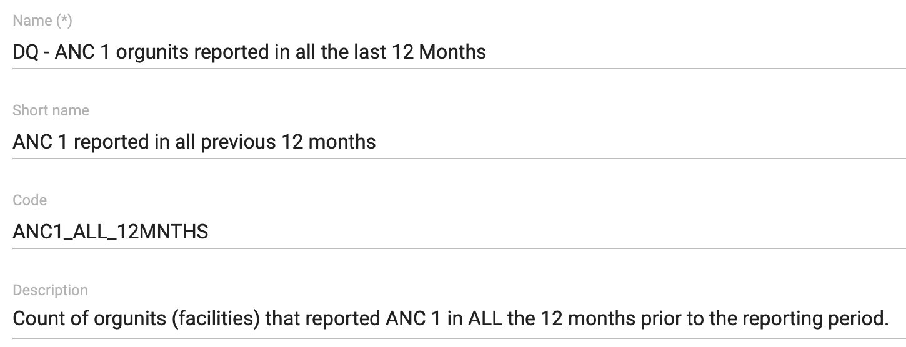

2. Specify the output data element; this should refer to the data elements we created in the previous step

   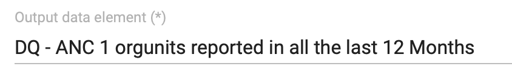

3. Specify the period type of the predictor; this should match the period type of the data element we are assessing. In this example, we are assessing ANC 1, which we assume is collected monthly.

    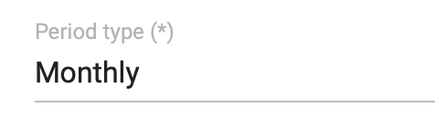

4. Specify the organisation unit level. For this data quality indicator, this should be the level at which data is collected, typically the facility level.  \
We also need to make a selection in the “Organisation units providing data”, which should be “At selected level(s) only”, since we are calculating the consistently of reporting only based on the level we have selected as the data collection level.

    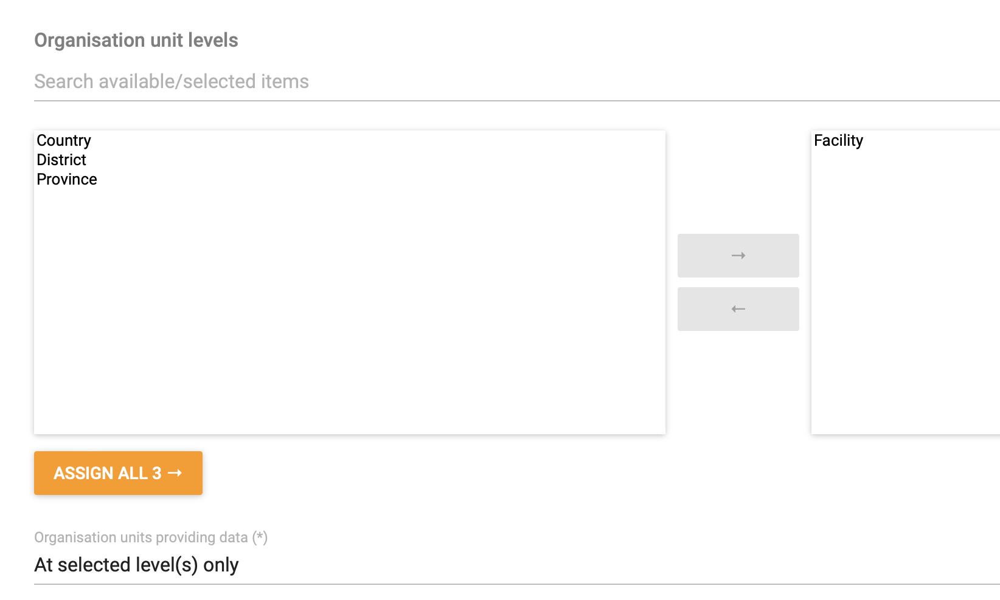

5. Next, we must specify the Generator. This is where we define the actual expression for calculating the consistency of reporting.

    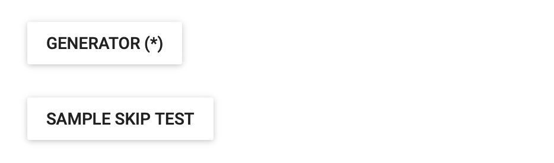

    1. To calculate the predictor for “number of orgunits reported in _all_ the last 12 Months”, we use the formula “if( sum( if(isNotNull([data element]), 1, 0)) == 12, 1, 0)”
        1. **if**(**isNotNull(**[data element]**), 1, 0)**, and produces a 1 if a value exists, and 0 otherwise
        2. **sum**( if(isNotNull([data element]), 1, 0)** )** adds up the number of periods in which the if(isNotNull()) statement returns 1. So it adds 1 for each period in which a value has been reported.
        3. **if**(sum(if(isNotNull([data element]), 1, 0))** == 12, 1, 0) **checks whether the number of periods that has been added up by sum() equals the number of periods we as assessing. If we are assessing a monthly data set for a 1-year period, we comper this to 12. If the number of periods with a value  matches 12, the predictor produces a 1. This indicates that the organisation unit has reported in all the previous 12 months.

    
        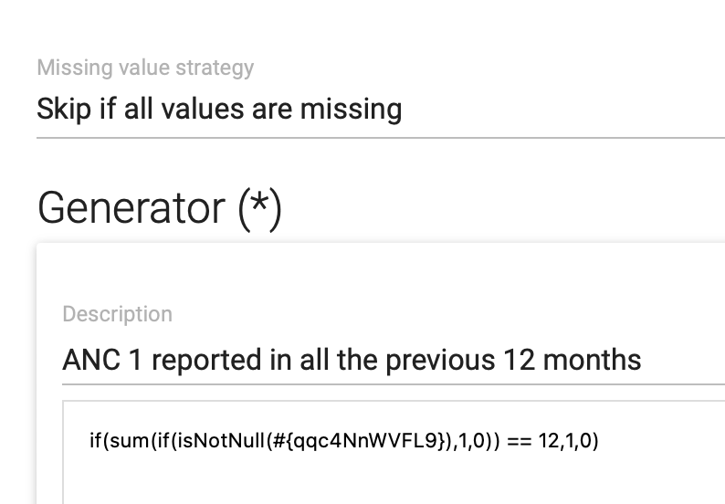


    2. To calculate the predictor for “number of orgunits reported in _any _of the last 12 Months”, we use the formula “if(isNotNull([data element]),1,0)”
        4. **if**(**isNotNull(**[data element]**), 1, 0)**, and produces a 1 if a value exists in any of the periods, and 0 otherwise. 1 indicates that the organisation unit has reported in _at least one _of the previous 12 months.

       


6. Finally, we need to specify the sample and skip counts. Sample skip test should not be set. Sequential sample count should be set to the number of periods we want to calculate the consistency of reporting for. For monthly data that we want to assess for one year, we should set the Sequential sample count to 12. This means that the 12 months preceding the period which we are generating the predictor for will be checked.  \
Annual sample count and sequential sample count should both be 0. 

   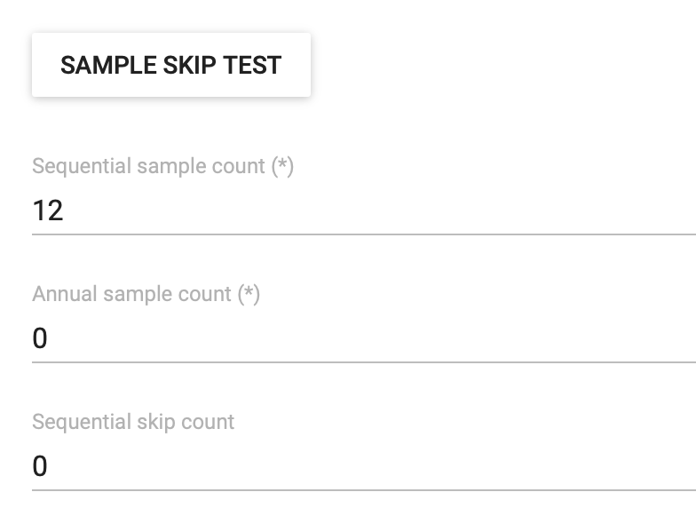

#### Creating the indicator

When the two data elements and two predictors have been defined, we can define the indicator that produces the actual data quality metric we are interested in: the percentage of facilities that have consistently reported a given data element in the last year. 


1. The indicator name, shortName, code and description should be specified according to local naming and coding conventions.

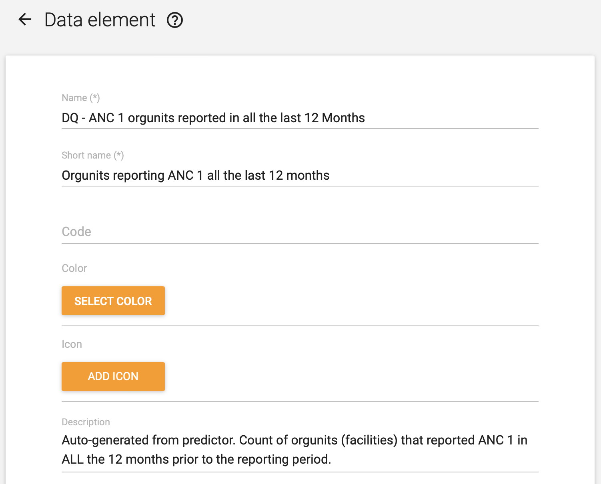


2. The indicator should** not** be annualized, and the indicator type should be Percentage (factor = 100)

3. The numerator expression should be Facilities that have reported in all the previous 12 months (assuming the data is monthly)

4. The denominator expression should be Facilities that have reported in any of the previous 12 months (assuming the data is monthly)


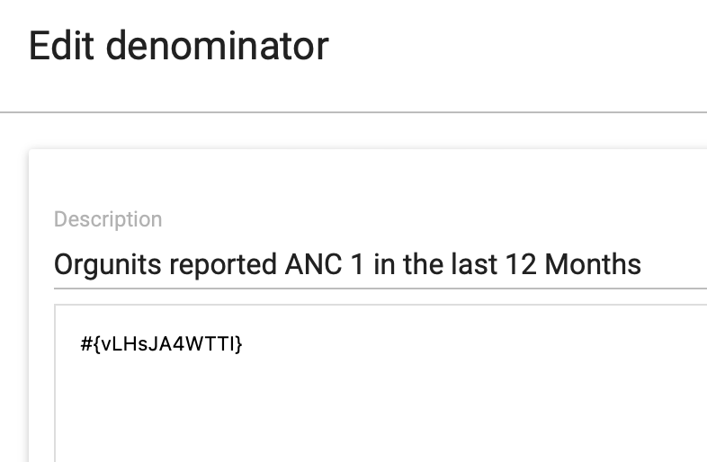

After predictors have been generated and aggregate analytics have been run (see below [LINK]), the indicator is available for use in the Data visualizer and Maps applications..

#### Calculating data element completeness

In some DHIS2 implementations it has been observed that reporting is inconsistent for all data elements in a data set. DHIS2 by default only assesses the reporting rates of data sets and not of the individual data elements in that data set. The goal of a data element reporting rate is to assess the reporting consistency of a single value. This is for aggregate data elements only.

A reporting rate is: 100 x (Number of received values / Number of expected values)

To calculate the reporting rate for a data element we have to define an indicator with the numerator (number of received values) and the denominator (number of expected values), and with a factor of 100 (percentage indicator type). While the numerator is always the count of data values, there are various options for defining the denominator, and which one of these is appropriate must be decided based on the local situation.

How data element completeness is configured in DHIS2 also depends on the DHIS2 version: some ways of defining the numerator and denominator requires that predictors are used as an intermediate step in the calculation, in particular in 2.37 and below. Note that predictors will need to be scheduled to run on the server, see the final section[LINK] for guidance on instructions.

#### Configuring the numerator - values received

We first review how to define the _numerator_ of our data element completeness indicator. As explained above, this will always be the count of data values that has been reported for a certain data element. There are nonetheless a few things that must be considered.

**Zero value storage**

For several reasons [link], it is generally recommended to _not_ store zero values being reported for data elements unless there is a clear reason for it (for example the “aggregation type” being of a type where zeros are relevant, such as average). This has implications when reviewing data element completeness, since for data elements where zero values are not entered and stored we cannot differentiate between facilities that have 0 to report and facilities that have not reported. One option is to enable zero values storage for the specific data elements where you want to define data element completeness indicators. However, this is difficult to implement in practice since data entry users must then know for what specific data input fields a 0 is expected. A more practical option is to focus configuration of data element completeness on data elements where all or almost all facilities are expected to have a value > 0 to report, and being explicit in descriptions of the indicator and visualizations that reaching 100% data element completeness is not necessarily expected.

**Disaggregations**

How to take into consideration any disaggregations that might be applied to the data element is critical, because it affects how to configure the indicator expressions and also whether use of predictors are needed or not. For example, if a data element for a child vaccination such as BCG that is disaggregated by &lt; 1 year and 1+ year, should the data element completeness be based on:

* One specific category option combination. For example, “reported” means having reported for “BCG doses &lt; 1 year”.

* Both category option combinations. For example, “reported” means having reported for “BCG doses &lt; 1 year” or “BCG doses &lt; 1 year”.

* Either of category option combination. For example, “reported” means having reported for “BCG doses &lt; 1 year” or “BCG doses &lt; 1 year”

The decision on this depends on the specific data element and disaggregation. For child vaccinations, the target age group for vaccinations is &lt; 1 year, and it might be common that there is no data to report in the 1+ year age group. Thus it would make sense to define the completeness for &lt; 1 year specifically. On the other hand, if “Confirmed malaria cases” is disaggregated into &lt; 5 years and 5+ years, facilities can be expected to have a values for each age group and it would make sense to consider both values to be expected; in this case, the denominator must be adjusted accordingly.

The same consideration applies when data sets are disaggregated with an attribute option combination[LINK], though this is less common.

The following table outlines the alternative approaches for configuring the numerator, considering whether the data element is disaggregated, how to evaluate completeness of disaggregations when applicable, and whether they can be configured directly in indicators or first using predictors.

|                                                                                                                        	| 2.38 and above                                                                           	| 2.37 and below 	|
|------------------------------------------------------------------------------------------------------------------------	|------------------------------------------------------------------------------------------	|----------------	|
| Data element with no disaggregation                                                                                    	| Indicator (with subExpression)                                                           	| Predictor      	|
| Data element with disaggregation - analysis of one category option combo                                               	| Indicator (with subExpression)                                                           	| Predictor      	|
| Data element with disaggregations - counting each category option combo with a value as “reported”                     	| Indicator (with subExpression); multiply denominator with number of categoryOptionCombos 	| Predictor      	|
| Data element with disaggregation - all category option combos must have value for data element to be “reported”        	| Predictor                                                                                	| Predictor      	|
| Data element with disaggregation - if any category option combos has a value the data element is considered “reported” 	| Predictor                                                                                	| Predictor      	|


We explain first how to configure the options that can be done with indicators directly, and then we show the configuration with predictors, 


#### Numerator configuration with indicator and subExpressions

As explained above, the numerator should be the count of values for a data element (with or without disaggregation). From version 2.38, this can be done directly in an aggregate indicator using a subExpression with a isNotNull conditional statement in the expression. This will return a 1 value for any time there is a number (including zero) entered for this data element. An example is given below.

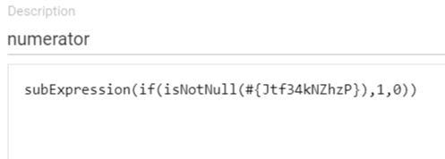

* **if(isNotNull(**[data element id]**), 1, 0) **will return 1 for every value for that data element, 0 otherwise.
    * If the data element has no disaggregation, it will return 1 or 0 depending on whether data has been reported.

    * If the _id_ specified inside isNotNull() includes a specific category option combination (for example isNotNull(#{TWWbtMMWD51.JKuWbG5bWAu})), it will return 1 or 0 depending on whether data has been reported for that specific data element + category option combination

    * If the data element is disaggregated, but no category option combination is specified, it will return 1 _for each data value across category option combination_. So if a data element has a &lt; 1 year, 1+ year disaggregation and a facility has reported a value for both, the expression will return 2. In this case, the denominator must be adjusted accordingly.

* **subExpression** if(isNotNull([data element id])** ) **ensures that the if(isNotNull()) statement is executed at the level of data collection, before the expression is aggregated over time and up the organization unit hierarchy.

To summarise, what should be used as a expression for the numerator is: 

|                                                                                                    	| Method                                  	| Expression with example data element                             	|
|----------------------------------------------------------------------------------------------------	|-----------------------------------------	|------------------------------------------------------------------	|
| Data element with no disaggregation                                                                	| Indicator                               	| subExpression( if( isNotNull(#{TWWbtMMWD51}), 1, 0))             	|
| Data element with disaggregation - analysis of one category option combo                           	| Indicator                               	| subExpression( if( isNotNull(#{TWWbtMMWD51.JKuWbG5bWAu}), 1, 0)) 	|
| Data element with disaggregations - counting each category option combo with a value as “reported” 	| Indicator; denominator must be adjusted 	| subExpression( if( isNotNull(#{TWWbtMMWD51}), 1, 0))             	|


#### Numerator configuration - with predictor

Versions 2.37 and below does not support subExpressions in indicators. For this you have to make a predictor that uses isNotNull() conditional statements in the generator. 

As explained above, whether the data element is disaggregated or not, and how to account for the disaggregation in terms of completeness dictates exactly how the Generator expression should be defined. The following table shows each of the alternative approaches and the corresponding generator expression to use:


|                                                                                                                        	| Generator expression with sample data element                                                        	|
|------------------------------------------------------------------------------------------------------------------------	|------------------------------------------------------------------------------------------------------	|
| Data element with no disaggregation                                                                                    	| if( isNotNull(#{OWk2WulfJYQ}), 1, 0)                                                                 	|
| Data element with disaggregation - analysis of one category option combo                                               	| if( isNotNull(#{TWWbtMMWD51.JKuWbG5bWAu}), 1, 0)                                                     	|
| Data element with disaggregations - counting each category option combo with a value as “reported”                     	| if( isNotNull(#{TWWbtMMWD51.JKuWbG5bWAu}), 1, 0) +  if( isNotNull(#{TWWbtMMWD51.UIQxmxgioxH}), 1, 0) 	|
| Data element with disaggregation - all category option combos must have value for data element to be “reported”        	| if(  isNotNull(#{TWWbtMMWD51.JKuWbG5bWAu}) &&  isNotNull(#{TWWbtMMWD51.UIQxmxgioxH}),  1, 0)         	|
| Data element with disaggregation - if any category option combos has a value the data element is considered “reported” 	| if( isNotNull(#{OWk2WulfJYQ}), 1, 0)                                                                 	|


When you have decided on what appropriate approach, follow these steps to make the predictor:


5. Make your output data element.

6. Assign the output data element to your predictor.

7. Set the period type (typically monthly).

8. Assign the org unit level for the analysis (typically facility level).

9. Configure the generator as below.

10. Set the sequential sample count to 0

11. Set the annual sample count to 0

12. Leave the sequential skip count blank

13. Define the Generator, using one of the expressions outlined above.


14. Create a predictor group and add this predictor to that group.


#### Configuring the denominator - expected values

While the numerator for a data element completeness indicator is always the count of data values received (with some variations in how disaggregations are managed), there are several ways to define the “expected reports received” denominator. These options include:


1. Count of orgunits to which the data set(s) the data element is part of is assigned

2. Count of orgunits for which the data set(s) the data element is part of has been marked as completed (reported)

3. Count of reported values of another data element that is part of the same data set

4. Count of orgunits that have previously reported on the data element itself


Which of these options are appropriate depends several contextual factors, such as how correct and updated the assignment of  data set is, and whether the purpose is to look at the overall completeness of the data element (how much of the true figure do I capture) or the completeness within a data set (how completely are facility staff and data entry clerks filling in the reporting form). Each option is outlined below, with instructions for configuration both in 2.38 and above, and 2.37 and below.


##### Option 1 - Count of orgunits to which the data set(s) the data element is part of is assigned

The first option is to use the assignment of the data set that the data element is part of as the basis for calculating completeness. This measure is quite similar to how the data set completeness (reporting rates) described above [LINK] works. This option is relatively straightforward to configure, since the “expected reports” of a data set is available directly to use in indicator expressions. The main limitation of using the data set expected reports as the denominator for data element completeness is that it assumes that data set assignment is correct and kept up to date.

To use this as a denominator, simply choose the _expected reports_ variable that is available when configuring the indicator denominator:


The denominator expression is R{[data set id].EXPECTED_REPORTS}, for example R{tQc4Gv2Jwco.EXPECTED_REPORTS}

Special care needs to be taken in cases where the same data element is reported in multiple data sets. If the data sets are not used in the same organization units, adding up the expected reports for each data set will give a correct denominator. However, if there is a risk that the same organization units will have two data sets assigned with the data element included, this option will not provide a reliable denominator.


##### Option 2 - Count of orgunits for which the data set(s) has been received

Option 2 is similar to option 1, but instead of using the actual reports as denominator rather than expected reports. Choosing actual reports will give an indicator that assesses the completeness of the data element among the organization units that reported, i.e. a measure of how often a particular data element is filled in the data sets that are submitted. 


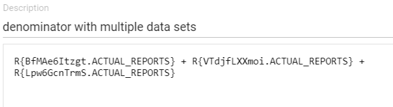


Again, special care needs to be taken in cases where the same data element is reported in multiple data sets. If the data sets are not used in the same organization units, adding up the expected reports for each data set will give a correct denominator. However, if there is a risk that the same organization units will have two data sets assigned with the data element included, this option will not provide a reliable denominator.


##### Option 3 - Count of reported values of another data element

This option is based on using the number of reported values for another data element as the expected values in the completeness calculation. This other data element can be chosen based on different criteria, described below. Note that when looking at data element completeness based on other data elements, the results should be analyzed together with the overall data set completeness.

_Based on data element in the same data set_

This option is similar to the above, but using a data element reported in the same data set or data set section as the data element you are calculating the reporting rate for (numerator) - without necessarily being logically related. With this approach, you should choose a data element that is always (or often) reported on in the data set. For example, in a data set with maternal health data, more health facilities will likely report on a data element for “Antenatal care first visits” than for “Assisted delivery”, and “Antenatal care first visits” would therefore be a better estimation of the number of expected reports.

_Based on core indicator_

If the data element you want to get a reporting rate for is used in a key performance indicator calculation with routinely reported data in the denominator, using the count of values reported for the denominator to calculate completeness is recommended. This option is not viable if the data element is not used in an indicator calculations, or if the denominator is based on a population estimate or other value that is not reported with the same periodicity as the numerator. 

As an example, consider the indicator Suspected cases tested for Malaria (%):

100 x (Malaria tested cases / Suspected cases)

In this case, it can be useful to look at the completeness of Malaria cases tested with the count of Suspected cases as denominator. 

The advantage of this option is that it gives a good indication of the completeness/consistency of data used to calculate a particular core indicator. 

_Based on related data element_

This option is similar to the above, but using a data element that is closely related to the data element in the numerator to calculate the denominator. For example, if you are looking at a reporting rate for inpatient malaria cases under 5 years (numerator), then you might consider using the count of inpatient malaria cases 5 years and above, inpatient malaria deaths, outpatient malaria cases or similar as denominator.

**Configuration**

Please refer to the section on how to configure the numerator[LINK] if using a related data element as denominator. The exact same considerations and configuration steps apply.


##### Option 4 - Count of orgunits that have previously reported on the data element itself

The final option is to use the count of facilities that have reported on the data element previously, within a given time frame, as denominator. This is similar to the denominator used for the indicator on “facilities consistently reporting” [LINK]. This can be a good estimation of the number of expected reports, in particular in cases where data set assignment is not accurate: if a facilities has reported on a particular data element previously, it typically means the the facility is providing whatever service/diagnostic the data element represents and one can expect it should report on it routinely. However, the results should still be analyzed together with the overall data set completeness since it will not include facilities that are _supposed_ to report, but have not done so in the given time period.

To calculate the count of times an orgunit has reported on the data element you are assessing in any of the previous last 12 months, we must use a predictor and extra data element. This is the same calculation as for the denominator described above in the section on Orgunits consistently reporting[LINK]. In summary, a predictor with a generator 

**if**(**isNotNull(**[data element]**), 1, 0) **

and sequential sample count set to the number of previous periods you want to assess will produce the count to use as denominator.

#### Ad-hoc analysis of completeness for multiple data elements

The approaches outlined above for calculating data element completeness gives many alternatives in terms of how exactly to define the numerator and denominator, and allows us to produce indicators that can be used in charts, maps and tables on a dashboard. However, because they require us to add at least one new metadata object for every variable we want to assess, they are best suited to be configured for a subset of key data elements.

To get a better understanding of data element completeness of a large number of data elements within a data set, we can relatively easily produce this in the data visualizer app as a Pivot table or chart by following these steps:


1. Open Data visualizer, and choose Pivot table as the chart type
2. As Data dimension, choose:
    1. The expected or actual reports for a particular data set
    2. All or some data elements within the same data set, using the “Details only” option for disaggregation
3. Modify the layout, placing Periods as columns (e.g. for last 12 months) and Data on Rows \


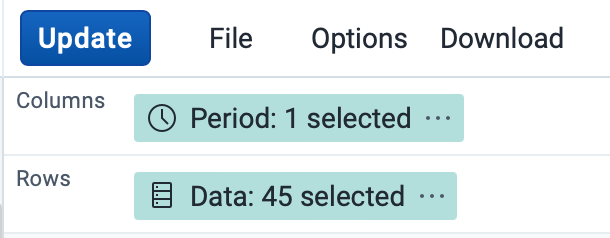


4. Open Option and
    3. Enable Row totals
    4. In the Advanced section, change the Aggregation type to “Count”

5. Update the visualization, and optionally sort the total column from high to low (note: the total for “expected reports” will show NaN, but remain at the top)


The table produced is now showing on the top row the data element completeness “denominator”, i.e. the expected reports based on the data set (actual reports can also be used). In the other rows, the data element completeness “numerator” for each data element (with disaggregation) is shown. This table allows you to quickly review the completeness of a large number of data elements within a data set.

Following the same approach (using aggregation type “Count”), if looking at a single period a bar chart sorted from High to low will give a quick overview of data element completeness.


## Consistency of related data

### Scatter plots in data visualizer


This is a scatterplot in which an outlier analysis or two related variables at the facility level is being performed. The two variables on this chart are related to one another - ANC 1 and ANC 4 - and this is why you can see many of the values so closely clustered together in green colour.

Outlier analyses within data visualizer using scatterplots allows you to identify if related values fit into an expected model or deviate in some way. Red values on the chart do not fit the expected model, and the farther these red values are from the outlier lines, the more likely there is an underlying issue causing these values to not fit the expected model correctly.

These scatterplots can use several methods to identify these outliers, and each of these methods have different levels of sensitivity (ie. each one will detect more or less outliers based on their calculation). The different methods currently available are 

* Interquartile range
* Z-score
* Modified z-score

Z-score has been included as it is a well understood method; however it is the least sensitive of the 3 methods.

#### Create a scatter plot

Scatter plots can be created in the data visualizer app. 

Start the process by selecting the scatter plot from the visualization selector in data visualizer.


Review the layout after selecting this chart type. Certain items are locked which differentiates it from a number of charts. You must select data items for both the vertical (Y) and horizontal (X) axes of the chart. The points will also always be org units. As discussed, you should select related data items for this type of chart. If you select unrelated data items, your output is unlikely to be useful.

Select your vertical and horizontal data. We will select ANC 1 and ANC 4 as they are related (you will typically see less ANC4 than ANC1 within an identified period for example).

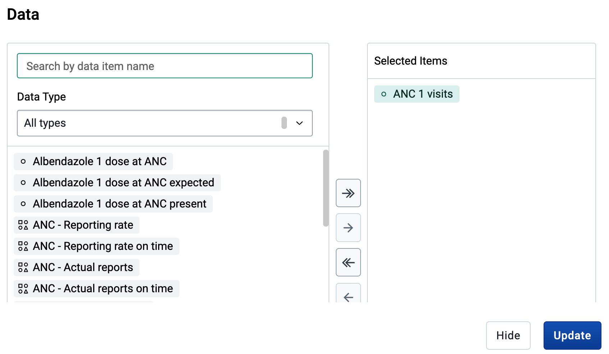
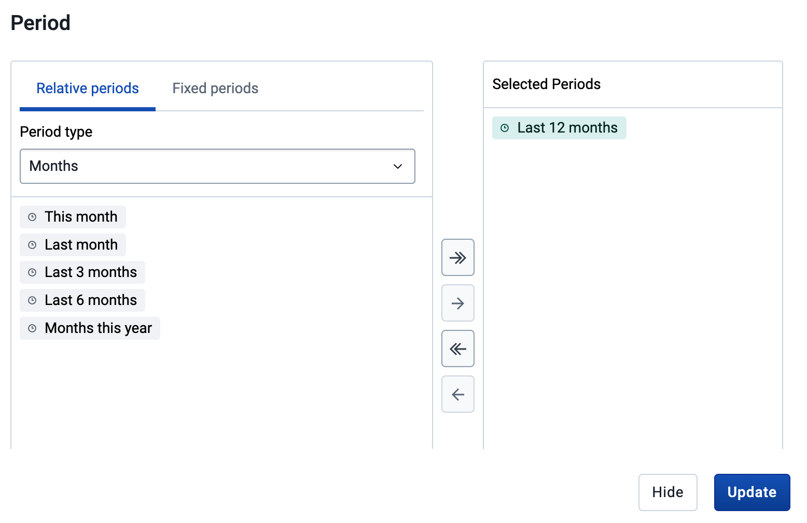


Select your org unit (in this case all facilities)

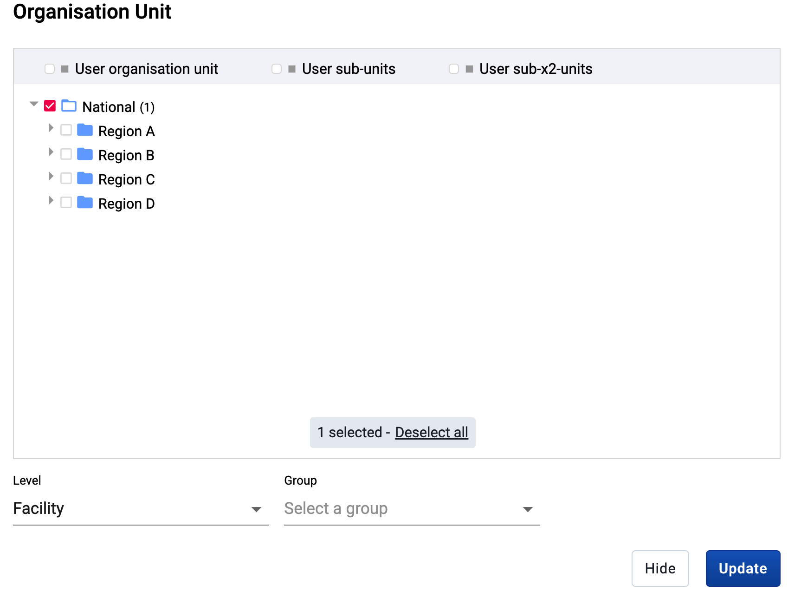

Select your period

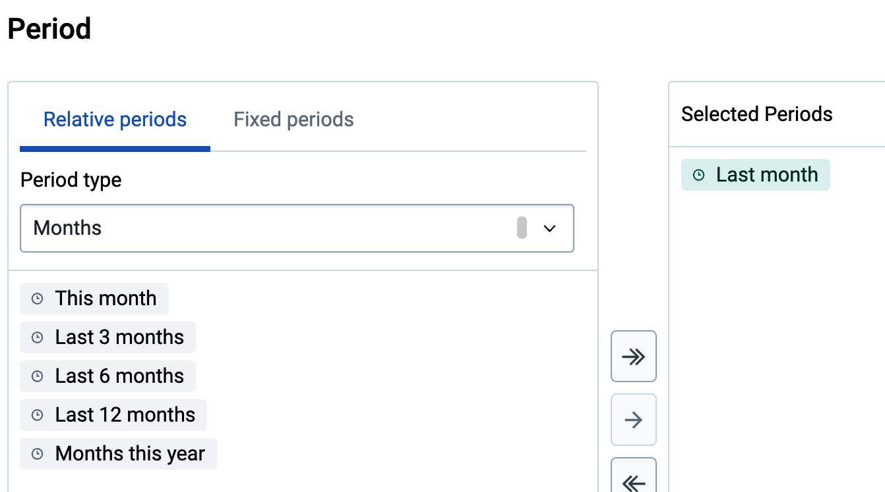

Update your chart.

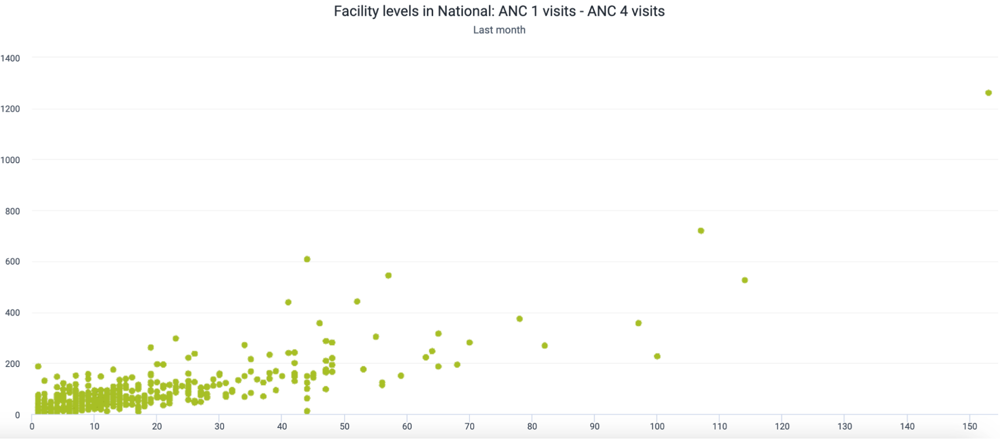

You will now see the scatterplot between these two related items. We can see how they are clustered closely in the bottom left corner of the chart as this is where the majority of values lie. We have not yet added our outlier information to this chart; we can do this as a next step.


#### Add outlier details

To add in the outlier details select the chart options and the “outliers” section

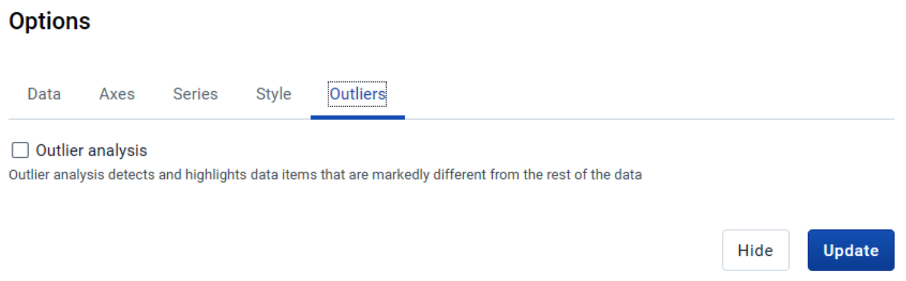

Enable both the outlier analysis as well as the extreme lines.

For the outlier analysis, we will use the method of interquartile range. This is a method of outlier detection that can be applied to scatterplot data. Here is a reference if you need more info : [https://medium.com/analytics-vidhya/outliers-in-data-and-ways-to-detect-them-1c3a5f2c6b1e](https://medium.com/analytics-vidhya/outliers-in-data-and-ways-to-detect-them-1c3a5f2c6b1e)

You do not need to completely understand this method of outlier detection; just note that all 3 methods will determine outliers by seeing if they fit a model as described by the different methods selected.

You can also select the “Extreme lines” option. This will help you to identify the most extreme outlier values that are potential sources of error

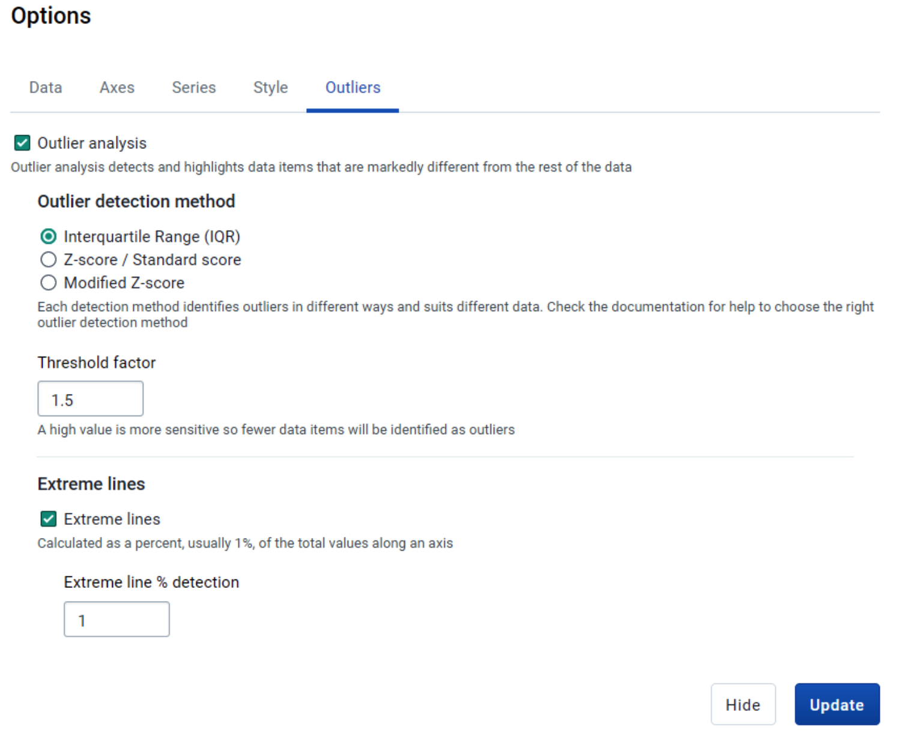

After selecting these options, update your chart.


Let us review how we can interpret our output. First, let us zoom in on our cluster of values to review them more closely. We can do this by dragging our mouse cursor over the area we want to zoom into.


We can reset the zoom if needed by selecting “reset zoom” after we have zoomed in

Review one of the outlier values highlighted in red

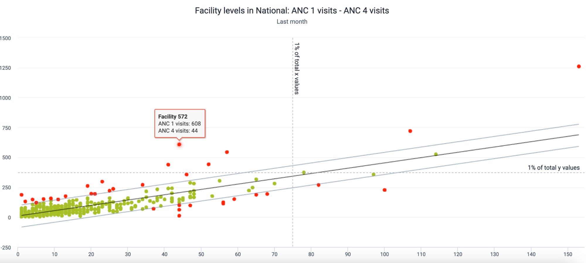

The model for this data is very narrow (ie, most values are closely clustered together); however we see some values that are quite far outside of the outlier boundaries. Neither of these values on its own may be considered an outlier (there are other ANC 1 values that are higher, and other ANC 4 values that are higher); however, this value pairing we have highlighted on the above chart lies outside of the range of 1% of the total y values (which represents ANC 1). This is because a typical ANC 4 value in this range has a much lower ANC 1 value in comparison when reviewing the majority of the other data values.

When reviewing this type of chart, you therefore must review the relationship between the two items being compared and also compare the values to the cluster that falls within the boundaries of the outlier model. In this case, either ANC 1 or ANC 4 values could be incorrect (if we decrease the ANC 1 values OR increase the ANC 4 values, this facility will likely fit in the model accordingly); or this could just be an anomaly having a different ratio between ANC 1 and ANC 4 higher than the interquartile range threshold of 1.5 that has been defined (ie. these values are correct and do not need to be modified). It is more likely that the ANC 1 value is the problem however, as the majority of ANC 4 values in this range have a lower ANC 1 value. As it is such a high outlier as compared to the rest of the data however (given its distance from the outlier boundary and that is outside the 1% y-value line) it does warrant investigation to determine if these values are correct within this facility.

### Validation rule analysis

Validation rules are integrated into the data entry apps of DHIS2, and can be reviewed there during data entry[LINK to above section]. Validation rule violations can also be viewed in the Validation rule analysis section of the Data quality app. This is useful as it allows you to review validation rule violations in bulk; rather than reviewing them for a specific organisation unit, period and dataset you can review them for many organisation units over any specified period of time. This also makes it possible for users who do not do data entry, or even have access to the data entry app, to analyse and monitor validation rule violations.

When reviewing validation rules using this method, it is best to divide your validation rules into validation rule groups. The configuration of these groups is shown in the section https://docs.google.com/document/d/1CkL9Cb6rU5m1XIYDJQfKU-f73Ze8HKKyb0xCknbJ3Ik/edit#heading=h.3ll3cq25tjxs

In order to run validation rule analysis, go to the data quality app and select “Run validation”

Apps -> Data Quality


Select Run validation under the “Validation Rule Analysis” heading

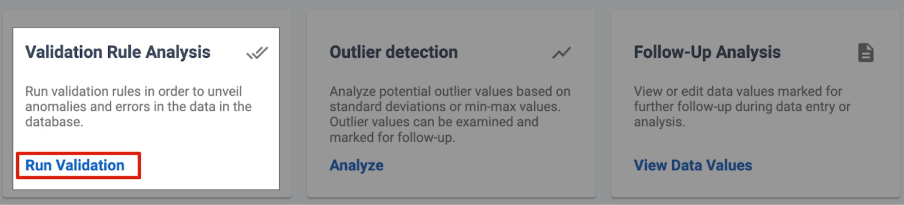

From here, you will need to select your inputs. This includes the following:

* The organisation unit
* The start and end date. This defines the period that you are reviewing. 
    * For the period, the start and end dates should fully cover the period you want to review. If you want to review monthly data, this means your start date will the 1st of the month, while your end date should be the 1st of the next month. For example, in this screenshot, data from June 2023 - August 2023 is being reviewed. 
* The validation rule group. This should contain the validation rules you want to review
* Send notifications: this will send out any validation notifications based on the validation violations that are found
* Persist new results

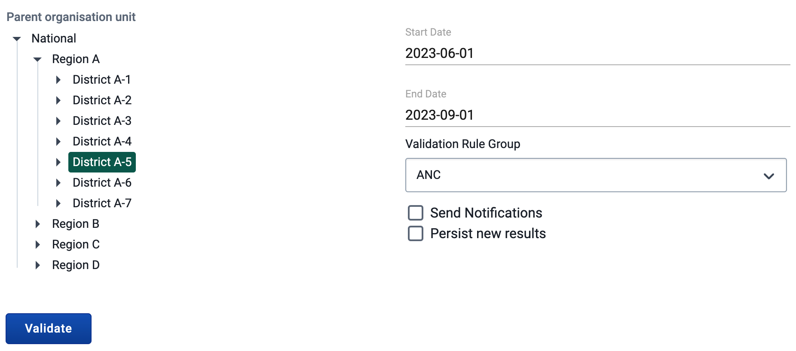

Once you have selected the inputs select “Validate.” It may take a little while to run the validation analysis depending on the amount of data you have selected to review. If you are planning to review large amounts of data at once (for example many org units across many periods including many validation rules), the validation rule analysis will take longer to run in comparison to running it for a smaller amount of data. 

If there are no violations of the validation rules, you'll see a message saying “Validation passed successfully.” If there are validation violations, they will be presented in a list like the following:

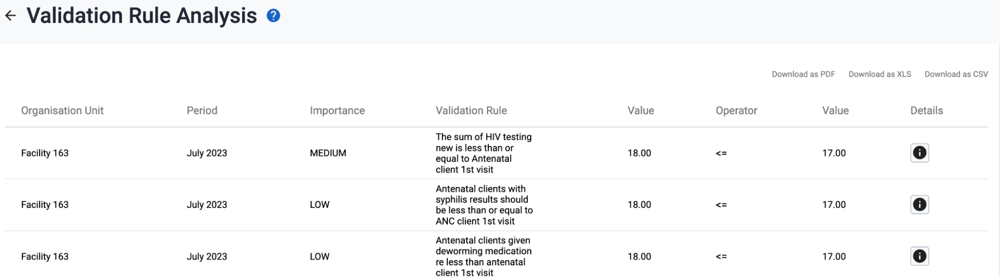


To review the validation details, select the info button under the details column. 

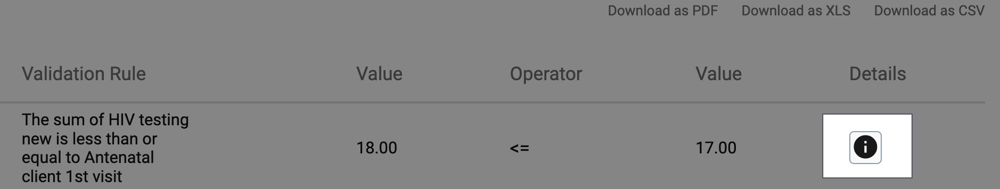

This will open up a pop-window with more information on the violation

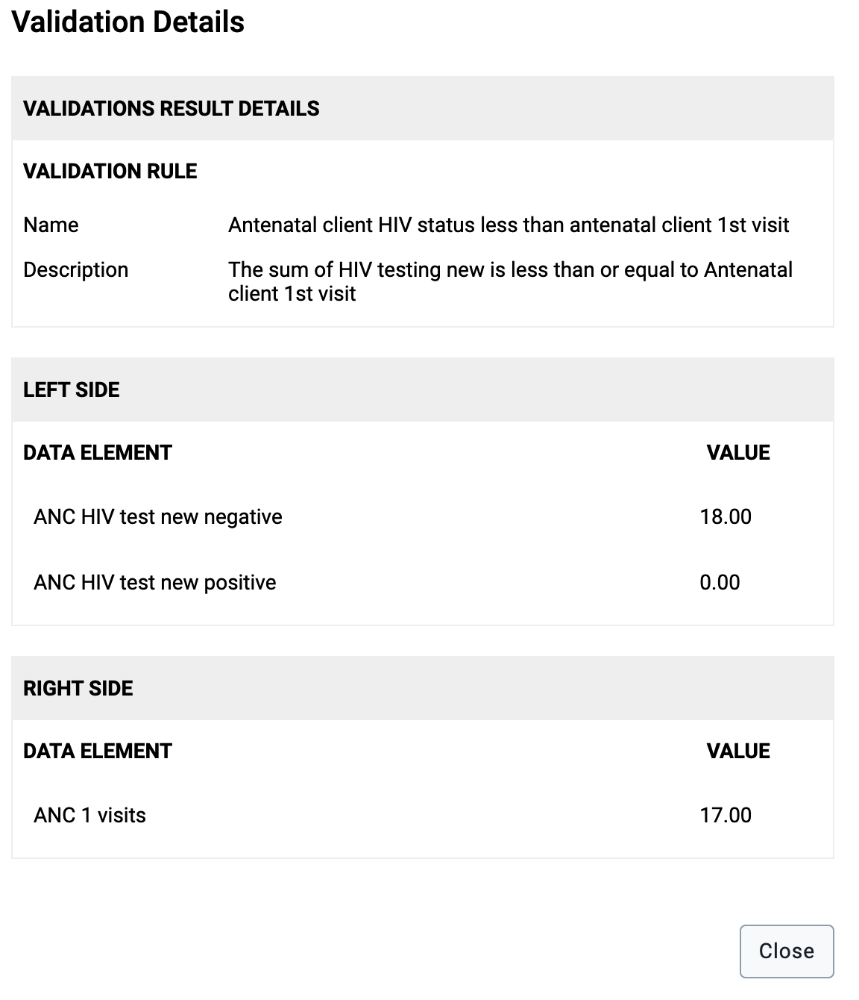

We can see how validation rule analysis can be useful in reviewing the violations for multiple org units/time periods at once, as we can also see all the component parts of the violation. This can allow us to identify exactly which value is incorrect and requires further follow-up.

The validation details show a the name and description of the violation along with all of the data elements that are part of the validation rule along with their values.

You are also able to download these validation rule violations. This may be helpful if you want to refer to this list and follow-up on values to fix them over time. Do this by selecting one of the file types in the top right corner after running validation analysis.

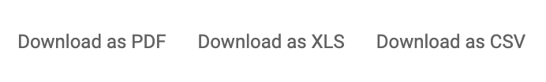


## Consistency over time

[section coming later]


### Year-over-year charts


This is a year-over-year (line) chart. A year-over-year (line) chart is used to evaluate consistency over time of a single data type (data element, indicator, etc.). In this example, we are displaying data for ANC 1 visits for all 12 months within a year for 2023, 2022 and 2021. This chart allows us to easily identify obvious outliers as we are able to see increases or decreases (if they exist) quite easily when compared to current and previous data. As an example, you can see obvious outliers in January 2023, May 2022 and September 2023 by reviewing each of the lines on this chart and comparing them to their own historical trends. The next step would be taking this chart and drilling down into the hierarchy for these specific periods in order to find the source of these outliers. These charts could be placed on a dashboard for key variables within your workflow to allow for staff to review these on a routine basis based on how frequently the data is collected. 

In order to create this visualization, you will use data visualizer


Select year-over-year (line) to start creating this chart


#### The interface - Period selection and filter

After we select this chart type, we can see that both the category and the series are automatically populated with period types. The period selection on the left menu where other dimensions are selected is also greyed out. Organisation units and data are automatically placed in the filter. For this reason, this chart type works best when only one data item is selected for comparison. Multiple organisation units can be used in the filter however depending on what you want displayed (it will filter the data belonging to these organisation units).

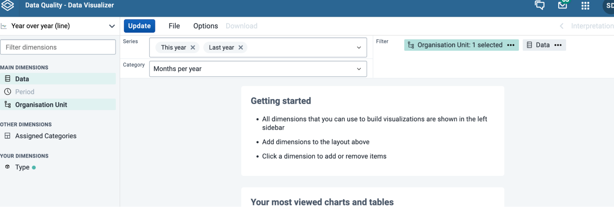

#### The interface - Category

In this example, the category determines the periods that will be displayed along the x-axis and group the data together. So with “months per year” selected, all the months within a year from January - December will be displayed. If we were to select “Quarters per year” it would instead display the 4 quarters of a year along the x-axis.

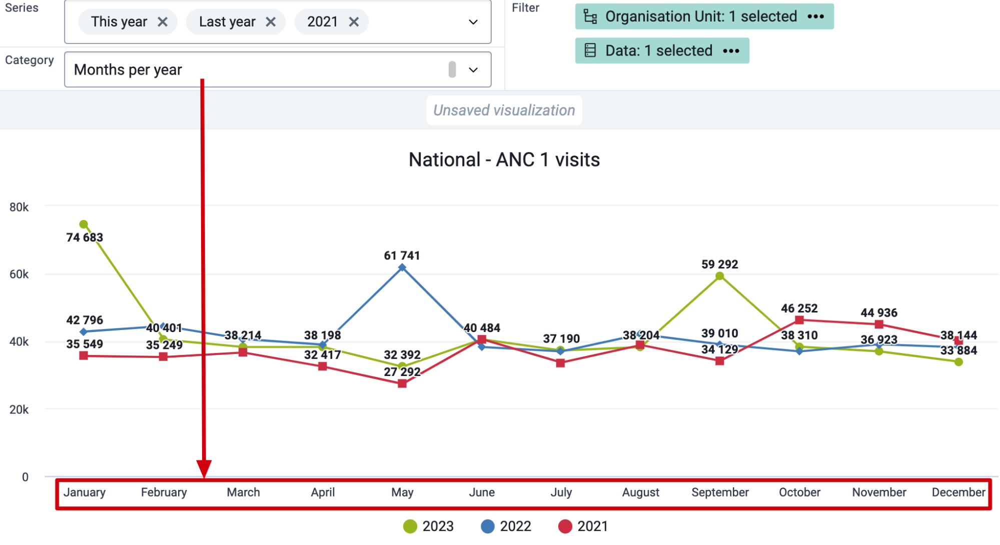


You will notice that the selections in the categories are all relative periods, you can not select for example specific months in the category in this chart type.


#### The interface - Series

The series determines which years you will be displaying data for. If I have this year and last year selected, it will display these years respectively based on the current date. I can also specify years rather than a relative period, for example 2021, 2022 and 2023.

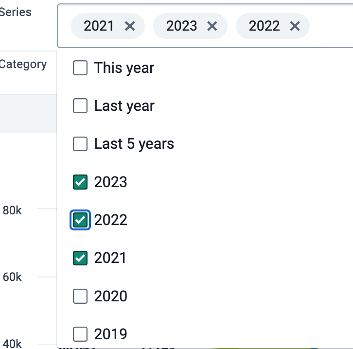

With these two options selected I am now creating a chart which will display data from January - December (due to the category selection) along the x-axis. And with 2021, 2022 and 2023 selected as my series, data values from these 3 years will be displayed by month on the year over year chart.

#### The interface - Data

When selecting data, it is best to only select one data item. These could be supplemented by choosing groups or disaggregations to further filter the data by, however as the data selection is automatically added to the filter and can not be moved, adding in more than one data item will have no effect on the chart.


**Update and review the chart**

We can now update our chart. In this case we are using the default country organisation unit, however we could also change this if necessary.

We can see how the chart has been generated based on our category and series period selection as well as the selection of our data item (in this case ANC 1st visit).

The series has determined which years we are displaying data for, while the category determines how to group the data along the x-axis.


## WHO Data Quality Tool

The WHO Data Quality Tool is an application available in the [DHIS2 App Hub](https://apps.dhis2.org/), supporting a range of data quality analysis functionality based on the WHO Data Quality Review framework. At the time it was released around 2016, much of the data quality analysis functionality was not available in the core DHIS2 applications. Over the years, this has changed and most of the analysis can now be done in DHIS2 core. In the coming 1-2 years, the WHO Data Quality app will no longer be updated for new DHIS2 versions. A new and modernized application is being developed to fill remaining functionality gaps, primarily related to automatic generation of annual data quality reports.

The below table gives an overview of what functionality is available in the WHO Data Quality Tool and what is available in DHIS2 core (as of 2.38).

| Analysis functionality                             	| WHO Data Quality Tool                   	| DHIS2 core apps 	|
|----------------------------------------------------	|-----------------------------------------	|-----------------	|
| Completeness and timeliness of data sets           	| Supported                               	| Supported       	|
| Completeness and timeliness of data elements       	| Limited support (in annual report only) 	| Supported       	|
| Validation rule analysis                           	| Not supported                           	| Supported       	|
| Min-Max outlier analysis                           	| Not supported                           	| Supported       	|
| Consistency of related data using scatterplots     	| Supported                               	| Supported       	|
| Analysis of negative dropout rates                 	| Supported                               	| Supported       	|
| Year-over-year charts                              	| Supported                               	| Supported       	|
| Outlier analysis (time series)                     	| Supported                               	| Supported       	|
| Consistency over time using scatterplots           	| Supported                               	| Not supported   	|
| Automatic generation of annual data quality report 	| Supported                               	| Not supported   	|

A dedicated [user manual](https://docs.dhis2.org/en/use/optional-apps/who-data-quality-tool/installation-and-configuration.html#how-to-configure-the-dhis2-based-who-data-quality-tool) is available for the WHO Data Quality Tool, and its functionality is therefore not discussed in this guide.

[section coming later here]
