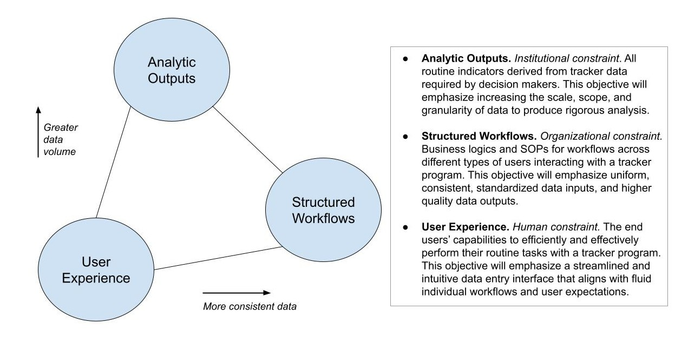

# Design Objectives and Ideation { #design-objectives-and-ideation } 

## Introduction to the Tracker System Design Guide { #introduction-to-the-tracker-system-design-guide } 

This guide discusses some of the foundational design principles for building useful Tracker programs. Tracker designs vary greatly depending on use case and national HIS context. This guide is **written to cover the majority of use cases within the broad domain of health services which tracks individual “Persons”**, although many of the generic principles described also apply to case-based surveillance, logistics, education, and other domains. 

The following narrative guide segments a complex process of tracker design into five interconnected pieces: **formative ideation, defining the tracked entity, program stage structure, tracker analytics, and interaction design.** The guide assumes your team already has a clearly defined project scope and a clearly defined problem statement i.e. you know what specific problems you are trying to solve with Tracker.  However, real digitalization processes are rarely linear: iterative designs and prototypes of the Tracker program will likely require revisiting your analytics or data entry requirements, weighing trade offs, and exploring new approaches.

For more information about how to navigate the DHIS2 Maintenance app to perform the configuration tasks described, please refer to the [DHIS2 User Guide.](#configure_programs_in_maintenance_app) A short summary of the Tracker data model can be found in documentation [here](https://docs.dhis2.org/en/topics/training-docs/tracker-use-academy/tracker-data-model/tracker-data-model-session-summary.html) and is presented on Youtube [here](https://www.youtube.com/watch?v=bQFJ1TYB4Cc&list=PLo6Seh-066Rwew5Dh50otwA0__hCDYdwQ&index=3). For a step-by-step guided exercise on configuring Tracker from scratch, you can check the[ Trainer’s Guide to Creating a Tracker Program](https://docs.dhis2.org/en/topics/training-docs/tracker-config-course/traineraposs-guide-to-creating-a-tracker-program.html). 

For more regarding Tracker implementation strategies and best practices, please refer to the **Tracker Implementation guide.**

## Objectives of Tracker Design { #objectives-of-tracker-design } 

When viewed through the lens of digitalization in healthcare, there are at least three major objectives to recording individual level data through DHIS2 Tracker: improved **analytic outputs**, **structured workflows** of service provision, and a satisfying **user experience** during routine data collection.

In some areas of system design these objectives may work in concert, but they will often present competing priorities and perspectives.

{ .center width=80% }

For example, imagine a health worker entering a patient’s data about their monthly hypertension visit and medication. The district health officer wants this program to report total patients with uncontrolled blood pressure, broken down by demographic details and comorbidities such as diabetes, so she knows how to allocate resources. The health facility manager stresses that the patient can only be provided medication for diabetes after the new diagnosis has been confirmed by a laboratory result. The health worker, who has fifty cases to record today, has responded to a dozen complex questions on patient status, but must wait for the diabetes lab result to enter the medication data in Tracker. He may prefer to simply keep a word document with his notes for every patient seen, and make a manual tally for new diabetes patients.

The end goal of designing a “tracker program” is therefore to provide a socio-technical solution that sufficiently satisfies all three objectives. The designer must aim to understand each perspective, and mediate tensions arising during the design process.

 

## Formative Ideation Phase { #formative-ideation-phase } 

During the [formative phase of the tracker implementation,](https://docs.dhis2.org/en/implement/tracker-implementation/build-your-tracker-programs.html#design-and-configuration-process) you should consult frequently with end users and key program stakeholders within the health system. Interview questions, field visits, and focus groups will give you a sense of the current clinical workflow for managing patient diagnosis, treatment, and care, as well as the flow of patient-derived data from facility to national level. The purpose here is to create a detailed overview of current reporting practices within the health system, and then explore, define, and “ideate” different social and technical interventions within the project scope that are related to the routine collection of individual-level data.

This phase involves understanding health workers’ technical skills and tasks, the data they routinely collect, their clinical workflows, the role of data clerks and supervisors, and other routine reports used by decision makers. Some useful frameworks for structuring this type of information are found in the [DHIS2 Design Lab’s Digitalization Project Toolkit.](https://www.mn.uio.no/hisp/english/dhis2-design-lab/digitalization-project-toolkit/) The WHO’s Digital Adaptation Kits also provide examples of Generic User Personas, User Scenarios, and Generic Workflows

It is very important to collect existing paper or electronic forms within your project scope to understand what types of individual level-data are being collected currently; what indicators are required at national and sub-national levels; and how facilities manage their registries on a day-to-day basis. You should be able to describe how relevant data are routinely recorded, processed and transferred, from multiple perspectives.

### Diagram Current Reporting Procedure { #diagram-current-reporting-procedure } 

By the end of your interviews, you should be able to describe these perspectives as business processes, and illustrate these processes with **flow diagrams**. The examples below show various business processes for recording and reporting Covid-19 case_data:

* a **client services workflow,** or a “patient journey” diagram, describing how persons move between service providers depending on outcomes of their tests or treatments, from the person’s perspective. Example: [CDC Interim Guidance on Covid-19 Case Investigation (2020)](https://www.researchgate.net/figure/Client-Flow-for-Integrated-EPI-Family-Planning-Services_fig2_273133507). See also a family planning and EPI example: [_Successful Proof of Concept of Family Planning and Immunization Integration in Liberia,_ Cooper et al. Global Health Science and Practice 2015](https://www.researchgate.net/figure/Client-Flow-for-Integrated-EPI-Family-Planning-Services_fig2_273133507).
* a **registry workflow diagram** describing how the record of an individual case file is processed by different service providers or data clerks, given various pathways of screening, treatment and care. Example: [DHIS2 Metadata Toolkit for a Covid-19 Case Surveillance Tracker program](https://docs.dhis2.org/en/topics/metadata/covid-19-surveillance/covid-19-case-surveillance/design.html#workflow-covid-19-case-surveillance-tracker)
* a **reporting dataflow chart** showing the types and frequency of data that are systematically exchanged between relevant health institutions or across jurisdictions. Example: [CDC Covid-19 Case Surveillance FAQ ](https://www.cdc.gov/coronavirus/2019-ncov/images/case-surveillance.jpg?_=67746?noicon)
* [if reporting from health clinics] a **clinical algorithm**, or a “decision tree”, illustrating the order in which a given health worker should gather patient information, screen, triage, diagnose and/or provide services for a specific condition. Example: [_Adoption of COVID-19 triage strategies for low-income settings,_ Ayebare et al. The Lancet Respiratory Medicine, March 2020](https://www.thelancet.com/journals/lanres/article/PIIS2213-2600%2820%2930114-4/fulltext)

> **Tip**
>
> Recommended Flow Diagram Tools: Pen/paper, Excel/Powerpoint, diagrams.net, draw.io, Miro, lucidchart, etc

After you have flow diagrams go through review with program stakeholders, you should be able to identify data collection requirements for your Tracker system, including essential reporting indicators, program M&E indicators, personal identifiers, question lists, and option lists. Stakeholders will likely present various competing requests for data points, so it is important to focus on documenting the most essential data points across all stakeholders, and create a separate list of requested and optional “nice to have” indicators to review later. Data collection requirements can be documented in Excel or a similar tool at this early stage, before configuring a prototype in DHIS2.

### Mapping Health System Concepts to DHIS2 Tracker { #mapping-health-system-concepts-to-dhis2-tracker } 

You are now ready to begin sketching the structure of the DHIS2 Tracker system.

As you review the diagrams described above, you should be able to “map” these health system concepts with their DHIS2 equivalents.

|Health System concept|DHIS2 Tracker Representation|
|--- |--- |
|Client, Patient, or Suspected Case|Tracked Entity Instance (Person or Case)|
|Case File|Enrollment|
|Patient Identifier|Tracked Entity Instance attribute|
|Encounter|Event|
|Appointment|Scheduled Event|
|Form Field/ Data variable|Data Element|

For a full overview of the tracker data model terminology, see the [Tracker Use Academy documentation](https://docs.dhis2.org/en/topics/training-docs/tracker-use-academy/tracker-data-model/tracker-data-model-session-summary.html). 

