# Program Stages Structure

After deciding the personal identifiers to be used, you are ready to draw the broad structure of your program by defining the **program stages.**

 
Tracker programs can have one or many program stages. Each program stage defines a specific type of event within the program, including what data should be collected, in what order, and with what data validations or interaction logic (program rules). Using a paper forms analogy, you can think of each program stage as a specific form in the patient’s case file. For each type of encounter with a patient, whether it is a diagnostic consultation or a routine follow-up, the care provider should fill out a particular form with predefined questions.

For example, a simple “Disease Treatment” program might have an initial case report stage, a treatment stage, a laboratory stage, and an outcome stage.

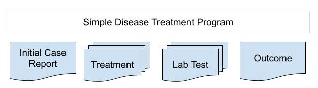{ .center width=70% }

This program stage design would be rendered in the Tracker Capture app like so:

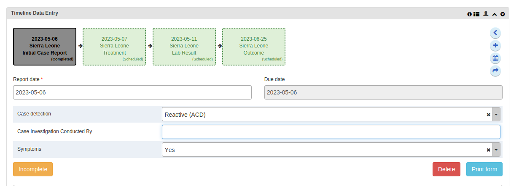{ .center width=80% }

At this step, there are three important characteristics of program stages to consider:

* **Content**: what questions are present in each stage, and how should they be arranged?
* **Frequency**: can certain stages be performed more than once?
* **Sequencing**: should program stages be entered in a certain order, and with a certain spacing of time between them?

## Content: Data Elements and Sections

A program stage is essentially composed of data elements and a data entry form.

The first step when creating and naming a program stage is to assign data elements. See **_Sequencing_** below for more on entering Program Stage Details. If you first need to create data elements in the tracker domain, refer to the user guide. When creating data elements, you will see that there are many possibilities for data element **value** **type**. You can also assign to the data element one Option Set (i.e. a list of multiple choice selections).

Here are some rules of thumb when creating **tracker domain data elements**:

* It is vital to consider the appropriate value type for your data element. Once you have entered a value for this data element in any program, the value type cannot be easily changed without losing previous values. Other data element properties such as name, description, and store zero values can be changed after data values are already entered in the database.
* The most commonly used value types are text, integer, and number. If you are using other more restrictive value types, be sure you read the documentation carefully and test the value type in advance, so you can be sure you really need to use it.
* In general, to ensure data quality, the end user should enter the data at the_ lowest level of abstraction _available. For example, entering raw blood pressure as an integer value is preferable than entering blood pressure status as text, such as “BP hypertensive” and “BP normal”. Blood pressure status can be calculated automatically in DHIS2 from the patient’s blood pressure value, following a consistent national convention.
* If a Text value type is required, an option set is always preferable to free text entered by the user, as this reduces human error and makes resulting data easier to analyse.
* “Aggregation type” refers to the _default_ aggregation method when combining raw data element values across all events. However, tracker-based indicators are most often calculated through _program indicators (see below)_ which are more flexible and customizable after data have already been captured. So do not worry whether your aggregation type should be COUNT, NONE, or SUM.
* Most data elements with an option set use value type TEXT, where the option set’s value type is also TEXT. If you use a different value type for a data element with an option set–for example, a list of possible numeric values—then be sure that the selected value types match between the data element and option set. Also remember that the data element’s aggregation will be based on the option set code, so these codes will need to conform to the chosen value type.
* If the value type is TEXT, aggregation type will most commonly be COUNT or NONE.
* If the value type is numeric, aggregation type will most commonly be COUNT, NONE, SUM, or AVERAGE. Other aggregation types are available for numeric value types (e.g. standard deviation), but be sure to test in advance to see if you really need them.

When deciding on data element value type, one frequently encountered challenge is the need to select _multiple_ values from a predefined list (“Select Multiple” type questions). While this feature is available in [Aggregate datasets as of v2.40](https://dhis2.atlassian.net/browse/DHIS2-14481?), there is no specific data value type for this in DHIS2 Tracker, so there are two different design strategies employed. 

* If the list of options is fairly short (3-10) but users might select all or none of them, you configure separate “Yes Only” (checkbox) data elements for each option. You may want to include a “Select All” checkbox or a “Select None” checkbox. This gives maximum flexibility for data entry, but too many may make the data entry form extremely long.
* If the list of options is somewhat long (10-20+), but the user will generally select a limited number of them (1-4), then you create different data elements for “Choice 1”, “Choice 2”, “Choice 3”, etc, each with the same option set. With program rules, the form shows Choice 2 data element if Choice 1 is filled, and shows Choice 3 if Choice 2 is filled (see below for more details on program rule design). 

Once you select the data elements, you will see seven or eight possible parameters for each data element. For most program configurations, you will only need to consider here the **Compulsory **check box. During data entry for the stage, users will be blocked from saving their event until all Compulsory data elements have been entered. As the program designer, you must think very carefully about whether any data element would really be required and available in all cases. If a null or unknown value is ever possible, then the data element should not be compulsory–or it could confuse end users and lead to poor data quality. Note that if a data element should only turn compulsory under certain conditions, then this can be configured by program rule action.

For details on the other parameters, see the [User Guide](#create-or-edit-a-tracker-program).

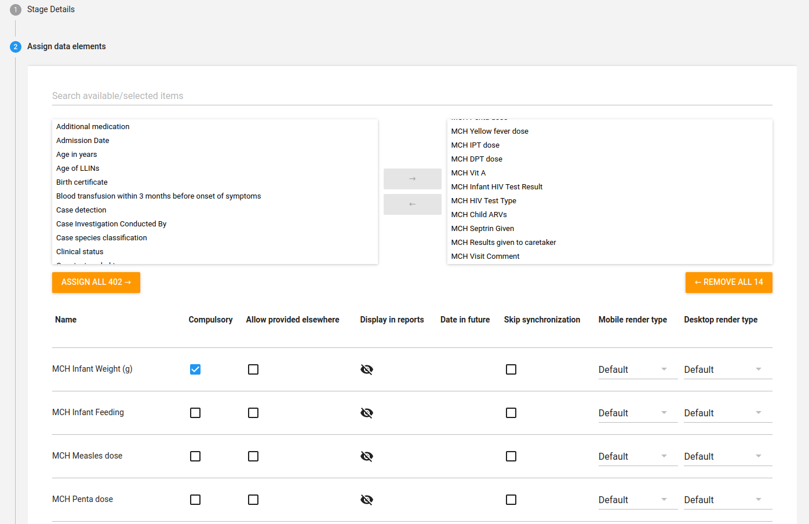

Once you have selected the contents of the program stage, you decide how you want to structure data entry for the stage. 

Just like Event Programs and Data Sets, there are three types of data entry forms in Tracker:

| Form type | Description |
|:--|:----|
|Basic|Lists all data elements which belong to the program. You can change the order of the data elements at any time.|
|Section|A section groups data elements in a specific order. You can then arrange the order of the sections to create the desired layout of the data entry form at any time.|
|Custom|Defines the data entry form as an HTML page which you can customise as needed. (NOTE: this is ONLY available in the Tracker Capture app.)|

When no custom or section form is defined, the basic form will be used. Basic forms are simplest to use because they are essentially a long list of all data elements assigned to the stage. However, if the number of program stage data elements gets too long and requires scrolling to see them all, then the form can make it difficult for the user to find a specific data element. 

Sections are essentially sub-headers within the data entry form. Since they group the data elements together they create a kind of vertical structure to help end user navigation. For this reason, **section forms are generally recommended**. In the Android app, all sections are collapsed by default when opening the stage; the user needs to click on the section header to see its data elements.

Custom forms give maximum flexibility to design a DHIS2 data entry experience  that mimics paper forms or other national information systems, including custom colours, inline images, and display formats. However, most implementations should avoid custom forms if possible, for a number of reasons. They require additional work to set up and maintain as new data are added; do not work in the Android app; they are not tested to work with new DHIS2 updates; if they break then they require urgent assistance from a skilled system administrator familiar with HTML to troubleshoot. Custom forms take precedence over section forms if both are present. 

Information on how to configure program stage forms is found in the [user guide](#configure_tracker_program_in_Maintenance_app), and examples are found on the Play demos.

## Frequency: Repeatable Stages

Program stages can be one-off or **repeatable**. Why make a program stage repeatable? When the stage captures data on something that is predictable in scope, but indefinite in frequency. For example, an HIV surveillance program might have a repeatable stage for Patient Visit, because most patients receive antiretroviral treatment every month. They may receive this treatment once, twice, ten times, or hundreds of times in their lifetime.

It is important to note that there is no maximum number of times that a repeatable stage can be generated per enrollment. Without a strict limit, it may be difficult for end users to go back and review or edit previously repeated events, or users may accidentally create a large number of unneeded events. However, program rules can be written to show a warning or error message when the count of a program stage exceeds a certain threshold. This process is described in the Community of Practice. 

The major drawback of using repeatable stages comes from DHIS2 analytics, specifically more complex program indicators that use data element values from multiple events. Consider the “Treatment stage” of the program described above, and assume there are generally four treatment events.

The following program indicators would be possible with a repeatable treatment stage:

* The average number of treatment events per patient
* Count of patients enrolled last year with more than five treatment events total
* Count of patients over 18 years old who received medication at their latest treatment visit
* Count of male patients who received medication during one or more treatment events last month

The following program indicators would NOT be possible with a repeatable treatment stage, but _would_ be possible if there were separate, ordinal treatment stages (Treatment 1, Treatment 2, etc).

* Average difference in patient weight between the first treatment event and the outcome event
* Count of patients who received medication at a treatment visit less than 5 weeks after enrollment last month
* Count of patients who received medication during two consecutive visits total

From both usability and maintenance perspectives, it is generally simplest to use fewer program stages. However, the analytics requirements for your program should be considered before finalising the program structure, in case repeatable stages present a challenge.

## Sequencing: Stage Workflow and Scheduling Events

Take another look at the patient flow diagrams above. You will find there is a predictable pathway for patient data as it passes through a data collection system. There are clear entry points into and exit points out of the program, and a number of standard processes performed in between. 

Once you have defined the contents of each stage, and determined whether any of them can be repeated, then you should consider if there is a logical order in which stages would be entered by your end users. This sequential business logic of data entry should be explicitly defined in your system design guide to support training of Tracker end users and improve interpretation of Tracker analytics.

As an example, the “Simple Disease Treatment Program” has four stages: an initial case report, treatment, lab test, and outcome. On enrollment, diagnostic details are entered into the Initial Case Report. If the patient recovers, dies, or is considered lost to follow up, this is recorded in the Outcome stage. Treatment and Lab Tests can each be repeated many times, but must occur sometime between Initial Case Report and Outcome stages. Usually, lab tests and treatment visits will be asynchronously documented by separate health workers at a lab and at a clinic. 

{ .center width=80% }

The end user’s sequential process of moving between initial case report, treatment, and lab test forms should be reviewed in more detail.

* Can a case file be opened before a laboratory test has confirmed diagnosis?
* Can treatment be administered before diagnosis was confirmed by a lab result?
* Should patients receive treatment on the same day as the initial case report?
* If a follow-up test is required after a clinical treatment, how is the laboratory notified?
* Is there a recommended interval between Treatment visits, e.g. once every 30 days?

These questions require a subject matter expert with contextual understanding of the health system’s case management procedures and clinical workflows. If strict protocols should be followed, for example minimum days between treatment visits, they can be reinforced through DHIS2 system design.

At this design phase, it may be instructive to review the different types of dates in DHIS2 Tracker and how they relate to the data entry process.

This table explains the dates which are editable by the end user during data entry. The names of each of them can be edited during program configuration to make these concepts easier to understand in context.

|Date|Description|
|--- |--- |
|Enrollment date|The date the TEI is actually enrolled in the program|
|Incident date|The date of the real-world occurrence which triggers the first event for the TEI|
|Report date|The date of the event to use for reporting purposes. It can be defined either as the date when the encounter actually occurred, or the date when the event was recorded in the system.|
|Due date|The date when the event is scheduled to occur. A due date in the future can be set upon enrollment, or during data entry. Unlike report date, event dates can be set in the future.|

There are more dates recorded for each event. See the full list in [Appendix A](#appendix-a-tracker-dates) below.

There is no default method to strictly define the order of program stage data entry in Tracker. However, there are a few handy approaches to ordering program stages in a way that guides the end user.

First, program stages can be sorted when configuring the program in the Maintenance App. Go to **(4) Program Stages**, click the three-dot “Actions” menu on any stage, and you will be able to move the stage up or down the list. After you click “Save”, this will change the vertical sort order of the stages within the Tracker Capture app, whether you add new program stage events with the “Tabular Data Entry” widget or the “Timeline Data Entry” widget.

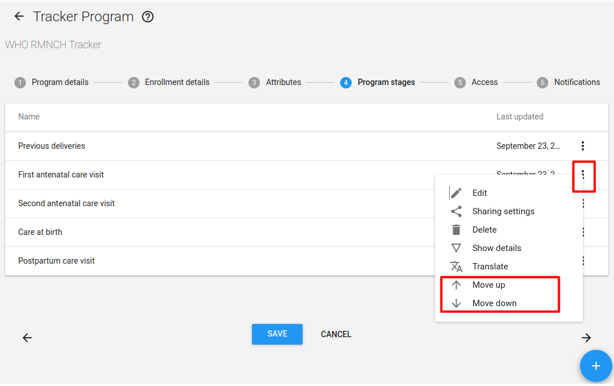{ .center width=80% }

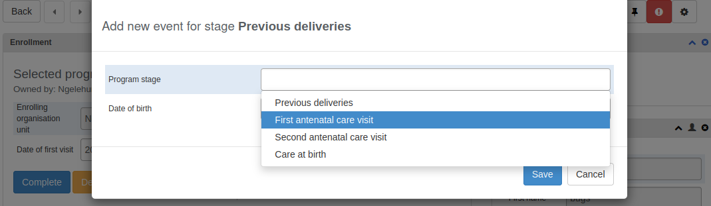{ .center width=80% }

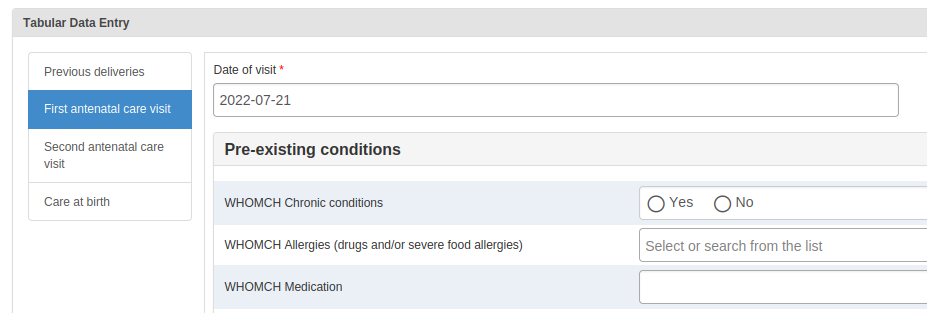{ .center width=80% }

In some use cases, implementations can make the stage order even clearer by adding an ordinal prefix to each stage name, for example, Stage 0 - Previous Deliveries, Stage 1 - First ANC, 2 - Second ANC visit, etc. 

Another way to enforce program stage sequence is with program rules. Notice the ANC program above has a “Postpartum care visit” stage listed in the maintenance app, but the stage is not yet visible on data entry. That is because there is a program rule condition to Hide the Postpartum Care stage unless there is a birth recorded in the “Care at Birth” stage. Such program rules could be cascaded on top of each other to apply a strict sequential logic, so completing Stage One unlocks Stage Two, completing Stage Two unlocks stage Three, etc.

Here are additional methods for setting a standard sequence of program stages.

* **Show first stage on registration page** will embed the first-listed stage on the registration page, forcing the user to complete the first stage before a patient can be enrolled into the program. In the Maintenance App, this setting is configured in the “Program Details” section, not the Program Stage Details section.

    

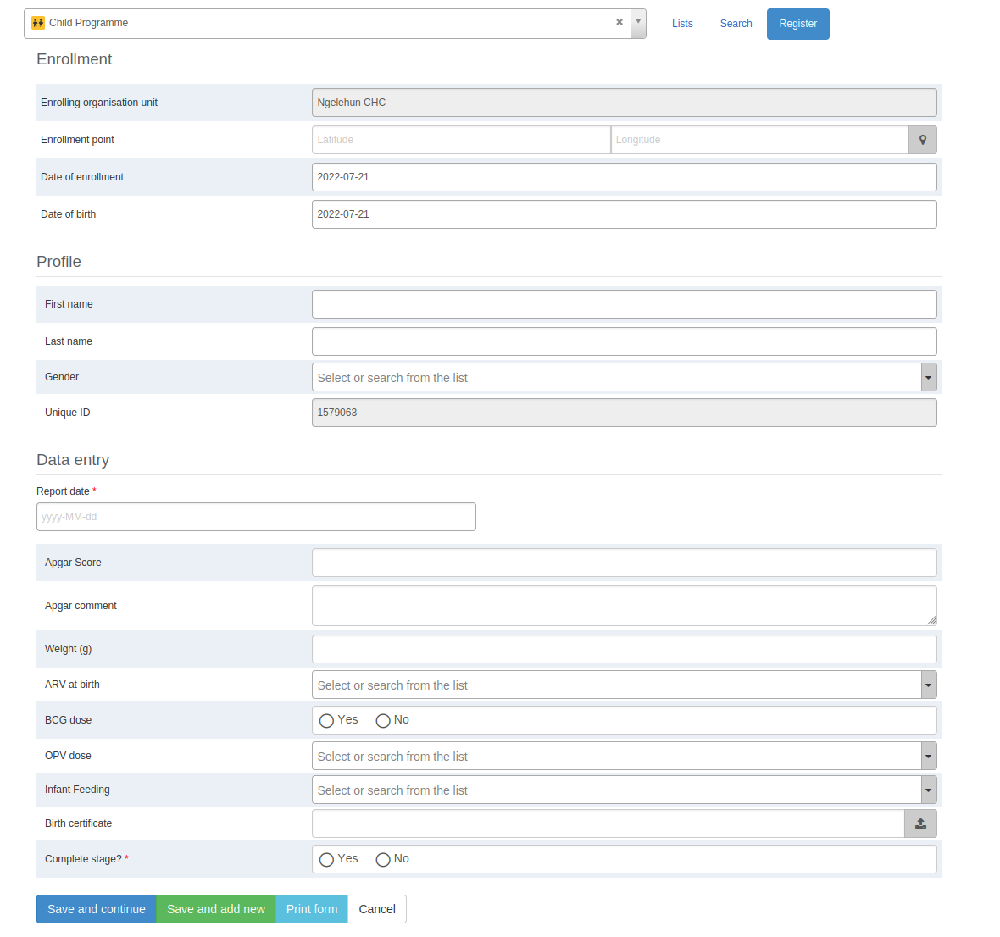{ .center width=80% }

* **Ask user to complete the program after completing the stage**. This program stage setting is useful to mark the final program stage of the sequence, since it nudges the user to close the enrollment after the stage is complete.

    

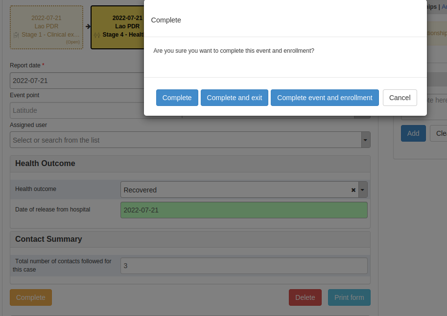{ .center width=80% }

* **Open data entry form after enrollment** will take the user directly to the stage’s data entry form after completing registration. That means the event will be opened by default, with an ACTIVE status. [This setting](#enrollment-with-open-data-entry-form) can only be activated if [“Auto-generate event”](#enrollment-with-auto-generated-events) has been checked.
* **Auto-generate (scheduled) events** after enrollment. This setting will auto-generate a scheduled event for the stage a defined number of days after the enrollment date. For example, an Initial Case Report stage could open immediately after enrollment, while a Lab stage is auto-generated, scheduled to take place seven days after entering into the program. This implies that the Initial Case Report occurs before the Lab stage. Only use this setting if the program follows a standard sequence of events with predictable spacing between them.
* **Set spacing for the next scheduled event in a repeatable program stage.** Once the user has completed a repeatable program stage, he/she can schedule the next event for the stage. The program will auto-suggest a due date for the next event. This might be the most recent event date plus the [“standard interval days”](https://community.dhis2.org/t/automatic-scheduling/45961/2) value, or a date-type data element from the last event (configure program rules like the example [here](https://community.dhis2.org/t/same-report-date-for-2-different-events/46735/6)). 
*  **Event Period types.** This configurable setting sets a specific type of period to every event in the program stage. Instead of selecting a date for the event date, end users select a period, such as a day, week, or month. Users are prevented from entering more than one event for the period selected. See example with a “daily” event period type here.

The table below summarises configuration approaches for sequencing of program stages

<table>
  <tr>
   <td><strong>Order of Stage </strong>
   </td>
   <td><strong>Flow control</strong>
   </td>
   <td><strong>Configuration Approaches</strong>
   </td>
  </tr>
  <tr>
   <td rowspan="3">First
   </td>
   <td>Strict direction (user must comply)
   </td>
   <td>Show first stage on registration page
   </td>
  </tr>
  <tr>
   <td>Flexible guidance (user might not comply)
   </td>
   <td>Open data entry form after enrollment
   </td>
  </tr>
  <tr>
   <td>Strict direction
   </td>
   <td>Program rules hide other stages until first stage completion
   </td>
  </tr>
  <tr>
   <td rowspan="3">Middle
   </td>
   <td>Flexible guidance
   </td>
   <td>Guide user on which stage to perform next through warning boxes, prefixing stage names, etc
   </td>
  </tr>
  <tr>
   <td>Strict direction
   </td>
   <td>Program rules to show error on completion of stages if entered in incorrect order
   </td>
  </tr>
  <tr>
   <td>Flexible guidance
   </td>
   <td>Auto-scheduling stages with due date in a particular order (farthest in future is the “last” stage)
   </td>
  </tr>
  <tr>
   <td rowspan="2">Last
   </td>
   <td>Flexible
   </td>
   <td>Program stage setting: Ask user to complete the program after completing the stage
   </td>
  </tr>
  <tr>
   <td>Flexible/Strict
   </td>
   <td>Program rule: Show warning asking user to complete program after entering data into final program stage 
   </td>
  </tr>
</table>

## Scheduled Events and Due Dates

Just as patients can be due for appointments, a person enrolled in a tracker program can be scheduled for an event. In technical terms, an event has a status of  `SCHEDULED` if it has a due date, but not a report date. Scheduled events can help the end user see which stages need to be entered next during data entry. They can be viewed in the DHIS2 Line Listing app, and a working list in Capture can show upcoming or missed appointments. Further the “due date” can be used to schedule program notifications, such as reminders to patients about upcoming appointments.

There are however limitations with event scheduling functionality to consider. 

* Every enrollment may only have one scheduled event at a time from each program stage, even if the stage is repeatable. 
* The auto-suggested due date may be a weekend or holiday, so the user should confirm if the due date is valid before scheduling the event. 
* Users may change the due date of an event whenever they like, but those re-scheduling actions are not logged, and only the latest due date is available. Further, once a scheduled event is opened and the event status changes from “scheduled” to “active”, you cannot see when that action occurred, or which user opened it. This means it is difficult to analyse appointment follow-through, i.e. estimate how many scheduled appointments become active visits. 
* In many use cases, a program stage will _never_ be scheduled, and so the “due date” concept may simply be confusing to end users. In such a scenario you may consider checking “Hide due date” when configuring program stage details in the Maintenance app.

### The Event and Enrollment Lifecycles

Each event and enrollment has a status field. They can also be marked as soft deleted or lost to follow up. With the right permissions, end users can also create or delete events.

Once your tracker has been deployed, you may want to review how closely users are following the prescribed control flow or investigate faulty data. These status fields of events and enrollments will help you understand user activity, and also generate appropriate program indicators.

**Enrollments**

* **ACTIVE**. It is used meanwhile when the tracked entity participates in the program.
* **COMPLETED**. It is used when the tracked entity finishes its participation in the program.
* **CANCELLED**. "Deactivated" in the web UI. It is used when the tracked entity cancelled its participation on the program.

**Events**

* **ACTIVE**. When events are created by “Add New”, they are immediately set to ACTIVE. If an event has ACTIVE status, it is possible to edit the event details. COMPLETED events can be turned ACTIVE again and vice versa.
* **COMPLETED**. An event changes the status to COMPLETED only when a user clicks the complete button. If an event has COMPLETED status, it is not possible to edit the event details. ACTIVE events can be turned COMPLETED again and vice versa.
* **SKIPPED**. Scheduled events that no longer need to happen. In Tracker Capture, there is a button for that.
* **SCHEDULE**. If an event has no event date (but it has a due date) then the event status is saved as SCHEDULE. When events are created by the “Schedule Event” tab, they are immediately set to status SCHEDULE until they have an Event Date.
* **OVERDUE**. If the due date of a scheduled event (no event date) has expired, it can be interpreted as OVERDUE.
* **VISITED**. (Removed since 2.38. VISITED migrated to ACTIVE). In Tracker Capture it is possible to reach VISITED by adding a new event with an event date, and then leave before adding any data to the event. The VISITED status is not visible in the UI, and in all means treated in the same way as an ACTIVE event.

## One Stage or Multiple? Grouping Services as Sections vs Stages

Reviewing what we have described in above, we see that data elements can be organised both by program stages and by sections within stages. Program stages can either be one-off or repeatable. Program rules can be employed to show or hide certain stages or sections depending on previous data values, creating control flows for entering data in a defined order.

One of the most critical steps in designing tracker programs is therefore understanding how to use stages and sections effectively to organise different data elements together. 

In the health domain, we can broadly group tracker data elements as sets of **"services"** provided to each person. These services could be administered: 

* during the same encounter and by the same provider
* during the same encounter, but entered by different users
* in a standard sequence of periodic encounters 
* in a non-structured asynchronous manner, with services recorded either during the same encounter or different encounters, or by the same provider or different providers

As a general rule of thumb, **_a user should be able to enter all services provided at a single encounter within the same program stage_**. Moving between stages is normally unnecessary, unless different users enter data for distinct services, or unless additional data only becomes available later (e.g. test results, new visit to case, etc).

Some examples of how services under the same program could be modelled as stages or sections are shown below. We will return to the previous example of a generic “Treatment program” with stages for Case Report, Treatment, Lab, and Outcome. Could the Treatment and Lab services be considered included within the same stage?

1. **All core services in the one repeatable “Visit” stage**
    1. Such a configuration is ideal when all services can be provided at the same visit by the same individual
    2. In this example, the Case Report is non repeatable as it only occurs once, during enrollment.
    3. This example also shows a “Select Services” Section with Checkboxes (Yes Only data elements) and program rules to hide the other Service sections unless this service is “checked off”. This may quicken the user’s workflow by allowing them to easily skip other Sections (Services) with many questions.
    4. It can be assumed that the Outcome is recorded at the same time as a treatment or lab test result. If a value is entered for the case Outcome, a program rule asks the user to complete the enrollment. Program Rules could also prevent future Visit events from opening for this case.

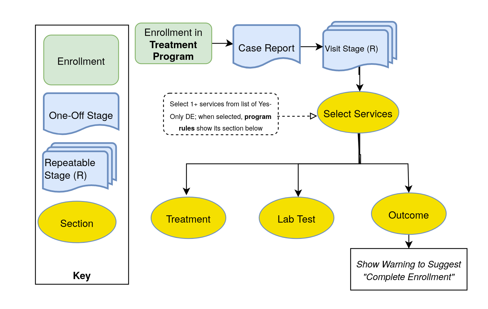{ .center width=80% }

2. **All core services as their own non-repeatable or repeatable stages**
	1. his is a better design if the lab test results are entered asynchronously with the treatment offered (by different users or at different time points).
	2. However, program indicators across Treatment and Lab Result stages are more difficult to calculate, for instance “Days between Positive Lab Result and Treatment” or “Received Treatment two or more times before receiving positive Lab Result” 
	3. This example still has a non-repeatable Case Report stage to enter basic case details. Some programs also Show or Hide subsequent events in a stage based on details entered during enrollment or initial case report.
	4. Since the Lab Results and Treatment are separated, so is the Outcome stage. Here you can configure the setting to complete the program after stage completion.

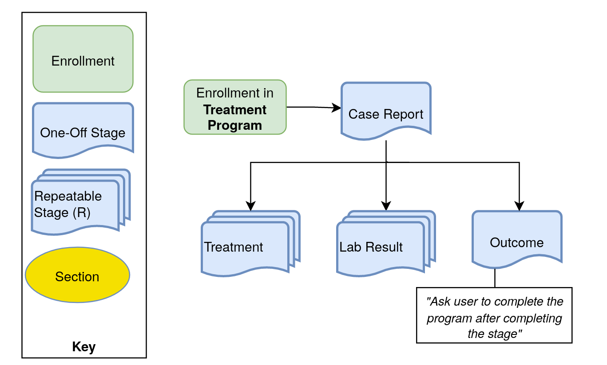{ .center width=80% }

3. **One repeatable Visit stage, show other stages as needed**
    1. Similar to the Example # 2 in that the key services (Treatment and Lab Result) are split into two repeatable stages for the distinct users. However, the two stages might share a required list of questions–such as a  “Quick Check” of patient symptoms possibly requiring emergency care–before adding new events to any service stage. This list of data elements could be the bulk of data entry required at every Visit, with Treatment and Lab Results entered asynchronously by distinct service providers.
    2. Similar to Example # 1, this Visit Stage could include “Select Services” questions, including Program rules which enable hiding the subsequent stages until the Visit Stage is completed on the current date.
    3. This also serves as a way to calculate the true number of “Visits” when there are two or more repeatable sections. In Example #2, program indicators could calculate how many total Treatment events and Lab Results events which occurred, but not how many happened together at the same encounter (i.e. on the same day).
    4. If there are multiple conditions in the program and multiple Lab Results possible, it may be necessary to record each result as a discrete event.
    5. Other prevention programs, different providers offer distinct services = asynchronous data entry

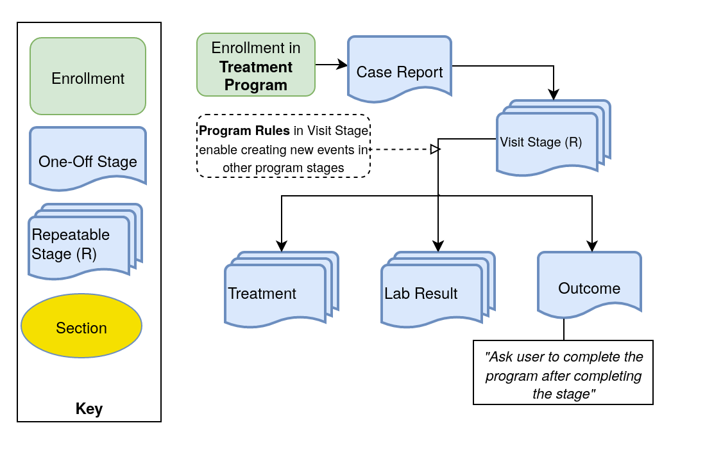{ .center width=80% }

4. **Each iteration of a service has its own stage**
    1. No repeatable stages, so must assume fixed maximum number of encounters within enrollment (example, maximum of three follow up tests provided to each TB contact, so FU 1, FU 2, FU3 can each be separate stages)
	2. In some use cases there are a fixed number of encounters that could or should be seen for every person. For example, a person suspected of TB should be seen EXACTLY five times, on a fixed schedule between each visit. In this scenario, it would make sense to have a separate non-repeatable stage for each step in the sequence: Treatment #1, Treatment #2, and Treatment #3, etc. Program rules could hide all other treatments until Treatment #1 is completed; Treatment # 3 is hidden until treatment #2 is completed, and so on.
    3. The main positive of this approach is that you can set fixed due date intervals between each encounter. It is also easier to filter with enrollment program indicators data based on where a given data element value occurred within the sequence ( “TB contacts starting treatment at visit # 3”).
    4. This is however unrecommended, because any such “fixed maximum” of encounters are likely to change as systems evolve, and it is difficult to revert to a repeatable stage once data has been entered. Line lists and event type program indicators are more complicated to configure, as you need to combine multiple stages together. Furthermore, it may be burdensome to maintain each stage separately, since changes must be made to each separate stage, and confusing for data entry personnel to navigate.

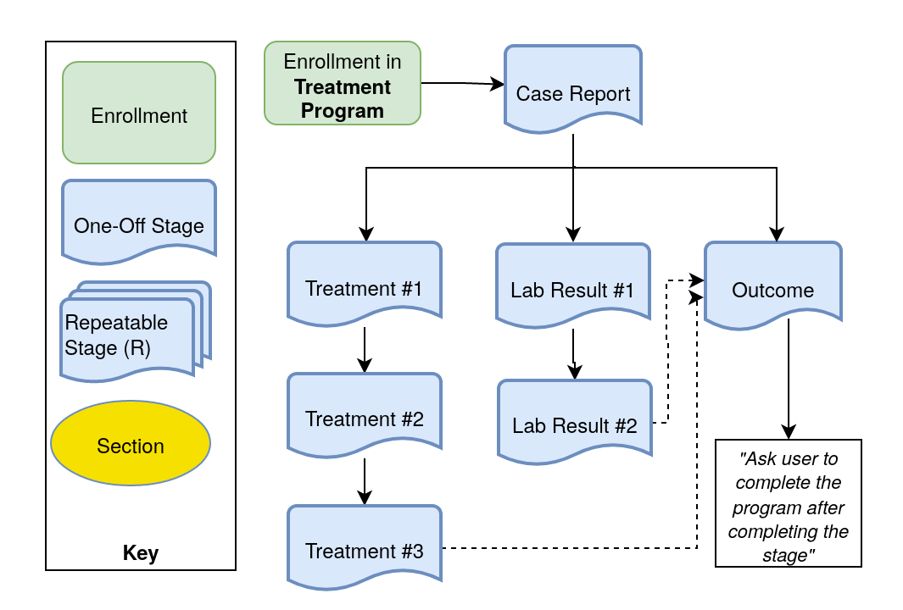{ .center width=80% }

**Example of HIV Prevention tracker**

In this HIV Prevention program in Latin America, each enrollment begins with a risk assessment stage for case surveillance data (such as key population status). Once enrolled, every encounter is a “Visit” with multiple sections, shown or hidden as needed, for HIV Test, Post-Exposure Prophylaxis, Risk Assessment follow up, and STI screening. If severe risk of contracting HIV is discovered, another section for PrEP is made available. If a case becomes HIV+ while enrolled, a warning box suggests that they are enrolled in a separate HIV Case surveillance program. 

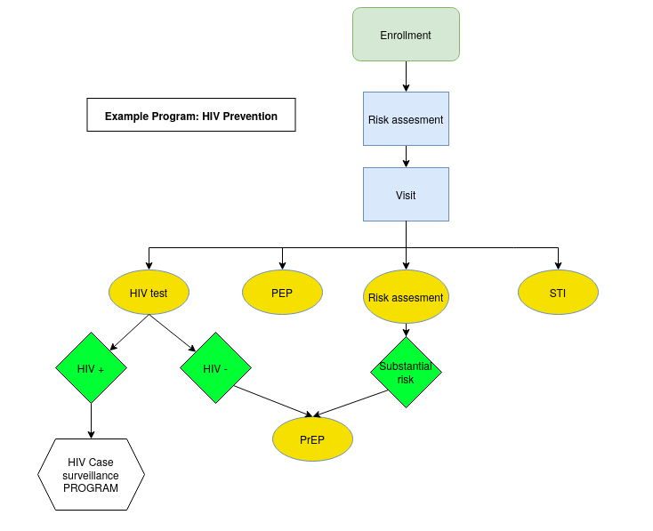

Program stage design has implications for designing appropriate analytics to line list and aggregate tracker data. For programs in health where users have multiple “touch points” to the same individual, it may be easier to separate user workflows into different program stages. However, as we will see, it is generally easier to configure and use program indicators if all data are grouped into a single program stage. 

## Appendix A: Tracker Dates

**Full List of Dates Available in Tracker Model**

|Tracker date|Viewable|Description|
|--- |--- |--- |
|TEI created date|API|Tracked Entity Instance (TEI) first created in DHIS2 database.|
|TEI lastUpdated date|API|Last time any Attribute of the TEI was updated|
|TEI createdAtClient date|API|Date when the TEI was generated by the end user. Used when syncing TEI created on Android app with the DHIS2 database.|
|Enrollment created date|API|Enrollment first created in DHIS2 database.|
|Enrollment lastUpdated date|API|Last time any event in the enrollment was updated|
|Enrollment date|API/UI|The date the TEI is actually enrolled in the program|
|Incident date|API/UI|The date of the real-world occurrence which triggers the first event for the TEI|
|Completed By date|API|Date when the enrollment was marked complete|
|Event created date|API|Event first generated in DHIS2 database.|
|Event lastUpdated date|API|Last time any data value in the event was updated|
|Event date|API/UI|The date the user enters for when the event actually occurs|
|Due date|API/UI|The scheduled date of the event, either generated when closing the previous event, auto-generated, or edited when opening the event.|
