# Tracker Analytics

There are four main ways that tracker data can be consumed by DHIS2 analytics apps to produce analytic outputs, such as tables, graphs, and maps.

* Line Listing
* Event data items in Data Visualizer app
* Program Indicators
* Indicators (see “Common Challenge 4: Aggregation and Disaggregation”)

## Line Listing (v2.38 and above)

Produces a list of all enrollments or events in a program that meet defined criteria. Those criteria can be a combination of organisation units, time dimensions, and specific data values. For example, you could define a line list for all enrollments in the Malaria treatment program, where the organisation unit is all facilities in the district, enrollment dates were within the last 3 months, and the value for data element ‘’Case Outcome” is death.

The fields for each row in the list can be specified by the user, for example a tracked entity attribute (case ID), a data element value in a given program stage (malaria medication). The example below from the Inpatient morbidity and mortality event program shows admissions by admission date, gender, and discharge date– all filtered by age at admission. It therefore combines tracked entity attributes (TEA), program indicator values, and data element values.

When using tracker programs, you can combine multiple stages, and show data from last X events from each stage in a horizontal list.

More details can be found here in [documentation](#using-the-line-listing-app).

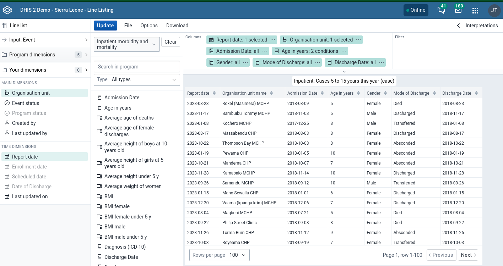{.center width="90%"}

Note that many of the Line List features are also possible with a Working List in the Capture App or Tracker App. For an end user, Working List may be more useful than a Line List, because you don’t need to open a new window/app to view the patient list, and clicking on an individual case within a Working List will take you directly to the TEI profile page.

For data analysts, line listings are very useful to pinpoint individual outliers that meet certain conditions, especially across organisation units and periods. However, it is very difficult to see _underlying trends_ in the data by viewing a long list of events or enrollments. As tracker programs grow in scale, you will want to see tracker data aggregated in a meaningful way.

The DHIS2 Core team recommends using the new Line Listing app instead of the old “Event Reports” app, which has been superseded by Line Listing, and will no longer be supported in future releases.

## Event Data Items in Data Visualizer app

It is also possible to aggregate some event data items directly within the Data Visualizer app to produce pivot tables and charts. Reports in the data visualizer app can be manipulated and changed in real time by the end user.

Importantly, only numeric data values can be aggregated. How these numeric values are aggregated is set by the data element’s aggregation type, or the aggregation can be set in _Options_ for the entire visualisation. These visuals of tracker data could be generated directly from the Data Visualizer App:

_Average weight in grams at birth in the child program, by month at facility_

_Total number of households checked by malaria focus investigations, by district this year_

For some configurations, Data Visualizer can be a quick way to get a summary of event data inputs. But there are critical **limitations** to aggregating data elements directly:

* The query includes all data element values found in all events for the given program, org unit, and period dimensions. If the data element is present in multiple stages, or is within a repeatable stage, then those data element values would be aggregated together.
* Only the event date can be used as the time dimension, not the enrollment date, nor a retrospective period boundary to create a “cohort” of events from before the period started.
* You cannot aggregate by an option set value (categorical variable), such as total events where the “Outcome” data element is “Cured”.
* You cannot apply filters to exclude numeric data element values entered in error above or below thresholds, such as excluding all "infant weights above 10,000g"
* You cannot apply create disaggregations based on a second event data item, whether numeric or categorical, such as “weight at birth, above and below 35 weeks gestation” or “weight at birth by sex”
* Note that with the **Maps** app, you can apply event data item filters to event layer queries. The filtered queries can also aggregate values up geographical levels. Such filters are not available in the Data Visualizer app.

Most importantly, it is very difficult to show basic event counts or enrollment counts with given criteria in the data visualizer app. For common Trackers in the health do, you want to generate a simple count of patients or encounters that meet certain conditions. The aggregation of individual data element values is not as essential.

## Program Indicators

Program indicators (PI) are how you can easily configure multi-layered queries of your individual level data. They allow for the creation of values based on data elements and/or tracked entity attributes belonging to tracker programs. Essentially, we can take the individual data items within a tracker program and generate aggregate values to be used in routine analysis.

PI can be used to summarise data within an event or across an entire enrollment, combining data entered from several different stages or tracked entity attributes. Some configurations might also include PI in the “TEI dashboard” on web or Android, to provide calculations across or within events and provide a summary of the enrollment to the user during data entry (total number of events, % of data element values that are blank, days since last visit, etc). Our focus in this section is on configuring program indicators to show summary data (counts, sums, averages, etc.) for all of the events or enrollments within a specified org unit/period.

There are two _types_ of program indicators:

* **Event**: Dimensions based on event org unit and (by default) event date. This will perform an operation based on all of the events within a single program stage
* **Enrollment**: Dimensions based on enrollment org unit and (by default) enrollment date. Can evaluate data values from across multiple program stages, but when querying based on a single data element value, evaluates data from the most recent event of each repeatable stage by default.

{ .center width="80%" }

There are five components of program indicators that define how the value is calculated. They are evaluated in this order (see below for why this can be important).

|Evaluation|Component|Commentary|
|--- |--- |--- |
|1|Organisation Unit|For event type it is the org unit of the event. For enrollment type it is enrollment org unit, even if some events in an enrollment were entered elsewhere.|
|2|Period|Defined by analytics period boundaries. Depending on the PI type, it defaults to the enrollment date or event date falling between start and end of the reporting period.|
|3|Filter|Create a value filter for the event or enrollment. Include tracked entity instance attribute values, or any data elements within a specific program stage (event type), or any data elements within any program stages. A variety of [functions and variables are available](#program_indicator_functions_variables_operators) for additional operations, like filtering for TEIs where the number of years between the enrollment date and the date of birth is more than 18.|
|4|Expression|The criteria above define which enrollments (or event) to include. The expression is the value that is applied to each enrollment (or event). Usually it will be event_count, enrollment_count, or tei_count, but can also be a data element value or more complex expression.|
|5|Aggregation Type|How to aggregate up the expression applied to each enrollment (or event). Usually “count” or “average”.|

PI are most powerful in the **FILTER** condition to define whether an enrollment or event meets certain criteria. Filter criteria can be derived from _multiple_ data elements and/or events and/or tracked entity attributes. This capability is of critical importance to most patient-centric and case reporting contexts, where you are not concerned with aggregating atomic data element values, but rather counting events (encounters) and patients (enrollments) that meet certain conditions.

For this reason it is **highly recommended to configure program indicators** for all routine reporting needs from the Tracker system. 

### What Is a Program Indicator Really, and Why Does It Matter?

Technically, a program indicator is a pre-configured java snippet that can be translated by the DHIS2 analytics engine into a SQL expression. When you include a program indicator in an analytics query, for instance opening a chart in Data Visualizer, that SQL expression gets combined with the period and organisation unit dimensions into a query, and the resulting database query of the enrollment and/or event analytics tables returns an output.

|  |  | 
| ----- | -------- | 
| 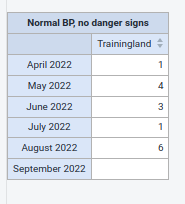     |  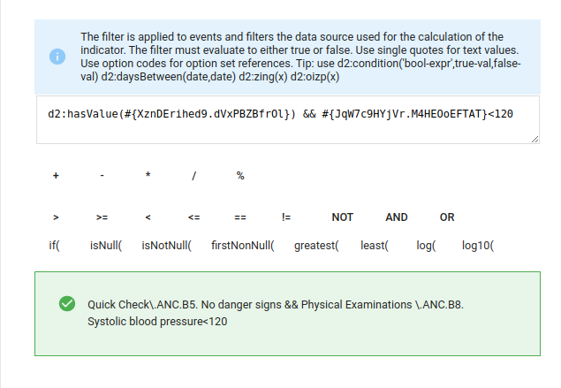         |

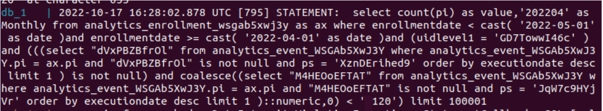

This quick technical explanation is important for understanding a few key things about Program Indicators. 

First, PIs allow very complex SQL queries to be constructed with minimal configuration by the system designer. In the example above, just one line of code in the PI filter produces 8 lines of SQL code, which would be repeated for every period and organisation unit dimension of an analytics query. Compared to SQL queries, program indicators are relatively easy to configure, and when managed skillfully they are flexible enough to cover _most_ of the important queries you would need to perform on tracker data.

Second, program indicator values are not stored within DHIS2 database, but they provide a framework for a query to the database analytics tables which is made “on the fly”, or as soon as a visualisation with a program indicator is loaded by an end user. This means that you don’t need to re-generate analytics tables every time you create or edit a program indicator. 

These two points come with tradeoffs. PI are flexible and easy to set up, but the resulting SQL queries are not optimised for performance, and at large scale they can be very inefficient. PI are also calculated on-demand, which means that every time a user loads a dashboard with program indicators, the user also triggers a query of the database. Many users can together make simultaneous and inefficient analytics queries, putting unneeded stress on the server and leading to a major slow-down of the entire system.

>  :mag: **Country Case Study**
>
>The performance impacts of program indicators were evident during Covid-19 vaccine campaigns, when millions of tracker enrollments were queried by hundreds of end user dashboards daily, often leading to serious performance challenges. [Lessons learned from this experience](#tracker-performance-at-scale) provided a framework with specific techniques for improving tracker analytics at scale, such as [Tracker-to-Aggregate scripts](#integrating-tracker-and-aggregate-data) for periodically writing program indicator values to to aggregate data elements. 

Finally, just like aggregate data elements, program indicators **require an organisation unit dimension and a period dimension** to return a meaningful value. But whereas an aggregate data element is entered for a single period and a single organisation unit, tracker data are naturally much more complicated: a single enrollment will likely have multiple events over time, and each event may be entered by different facilities. However, the PI will ultimately output only one value for each combination of organisation unit & period. When you design program indicators, you will therefore need to carefully consider how the “where” and the “when” of your longitudinal data should be interpreted.

What follows are illustrative examples of challenges when defining and configuring program indicators, particularly with the program indicator type, period boundaries, organisation unit assignment, and (dis)aggregation. 

### Common Challenge 1: Event vs Enrollment type

The most important decision when building a program indicator is whether it should be event type or enrollment type.

Most implementers know that both types of PI can filter by data element values and/or Tracked Entity Attribute values (TEA). And if the program indicator must evaluate values from two or more program stages, only enrollment type PI can be used. 

But a very common mistake is to confuse the two types when aggregating data from repeatable program stages.

Recall that events represent distinct _encounters_ and enrollments represent distinct _case files_. When you are using program indicators to produce aggregate counts of tracker data, the same conceptual logic applies: in general, we use event type PIs when we want to count distinct encounters, and use enrollment type when we want to count distinct case files (or persons).

Implementers must ask: _do I want to sum up all encounters, or just the unique persons?_

In this example from the Tracker Use Level 1 academy, we are counting cases with underlying conditions in a Covid-19 vaccination program. The data element “COVAC - Underlying conditions” is found in a repeatable program stage.

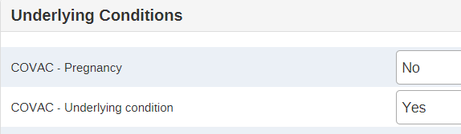{ .center width=70% }

We make two program indicators: one is enrollment type with enrollment count aggregation, and the other is event type using an event count aggregation. 

You will see the event based indicator reports higher values as it is counting the underlying condition variable for every event; this does not make sense in this scenario if you want to know the total number of unique people with an underlying condition.

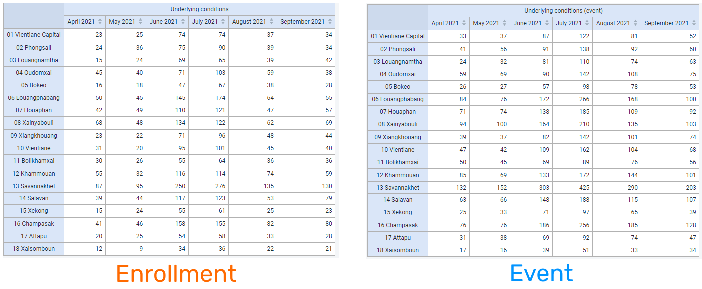{ .center width=80% }

Why is this the case? 

The same patient can have multiple events with this data element value. These events can all take place within the same period. Furthermore, the same person could have events in different districts (organisation units). So there exists **a high risk of double counting individuals with event type PI**.

Meanwhile there is only one enrollment date, and one enrolling organisation unit, associated with each enrollment.

|  |  |  | 
| ----- | -------- | -------- | 
| 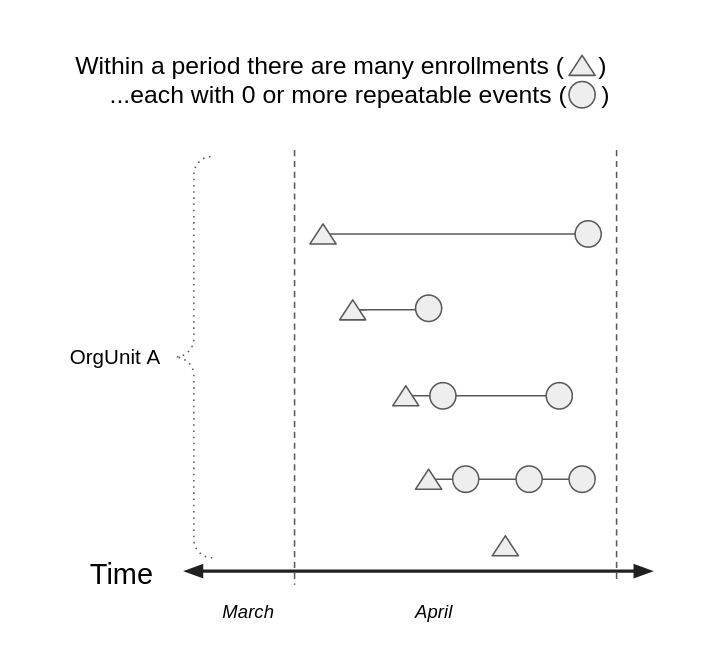| 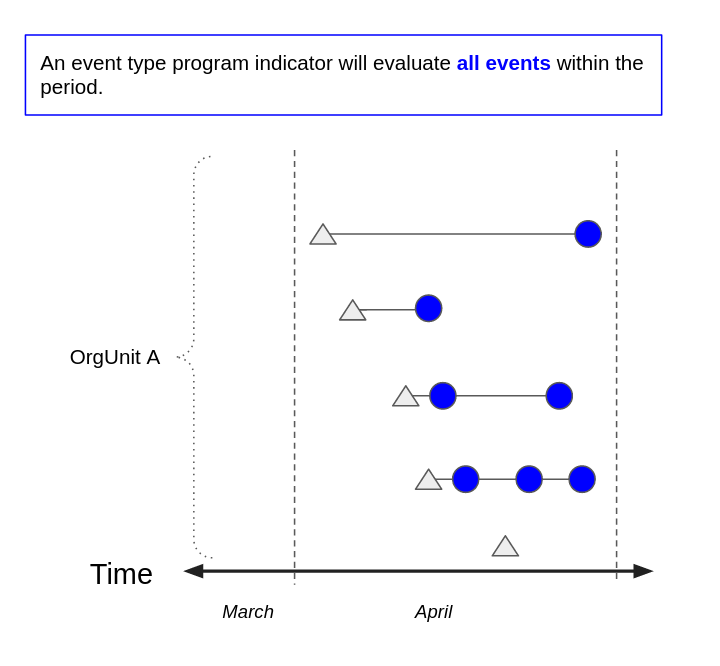|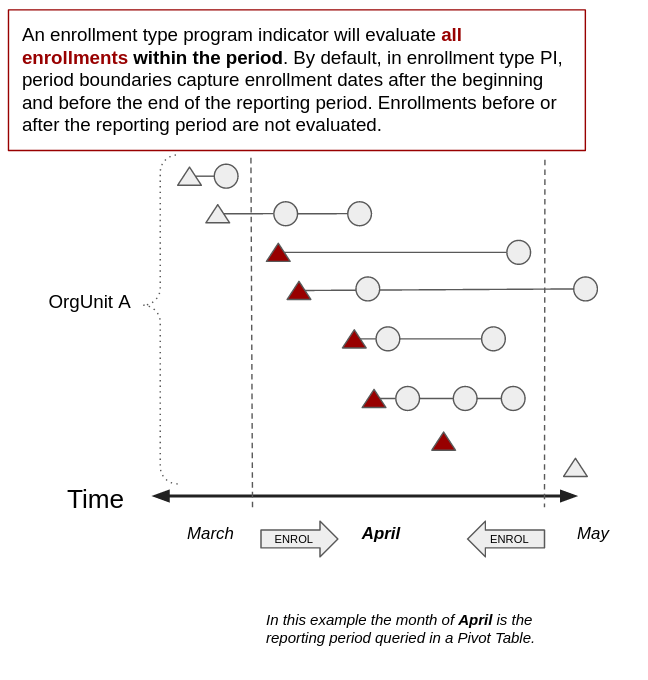 | 

 

If you want to count unique individuals, enrollment type is usually the better approach.

But take another look at the example program indicator for Underlying Conditions. It may be possible to have an enrollment with two separate responses to that question. Perhaps an underlying condition went unreported at the initial visit, and in a later visit the value is different. How would an enrollment type program indicator handle multiple values for a data element in the same program stage?

Within a program stage that has repeated events, enrollment type indicators use the data **from the most recent event that has a data value for that data element.** In the diagram below, enrollments are not counted if they do not have any events for the program stage in the filter, and only events with a value for the data element are evaluated.

It is usually valuable to only consider the most recent value for each case, since that value may be considered more timely and more accurate. But in some instances, you want to evaluate all enrollments that _ever_ had a certain value for a data element. This is where the **`d2:count`** class of functions are helpful in the PI filter. They ensure the program indicator evaluates all events within each enrollment and counts the number that meet the criteria. 

Using these functions in program indicator filters you can answer questions like this:

* `d2:count(#{jdRD35YwbRH.zocHNQIQBIN})>=1`

_“How many TB patients had at least one result for a smear microscopy test?"_

* `d2:countIfValue(#{jdRD35YwbRH.zocHNQIQBIN},'Positive')>=1`

_“How many TB patients had at least one _positive_ result for a smear microscopy test”?_

 
* `d2:countIfCondition(#{edqlbukwRfQ.vANAXwtLwcT},'>8')>=1`

_“How many pregnancies had at least one ANC visit with a haemoglobin value over 8?”_

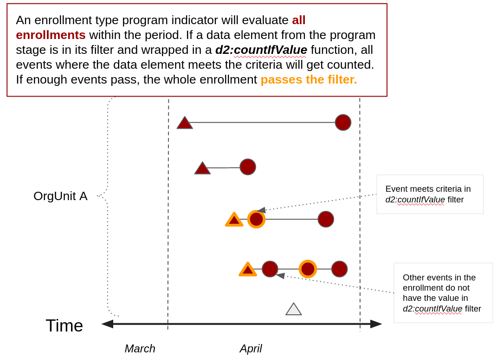{ .center width="80%" }

You can build a program indicator filter with a combination of data elements and tracked entity attribute values. With enrollment indicators, these data elements can come from different program stages, and you can even scan for a data element value that meets certain criteria within all events of a stage. However, you cannot build multiple subexpressions within a `d2:countIfCondition` filter to ensure that two data element values are present in the same event.

As an example, you can filter for enrollments where any event reported Underlying Conditions:

`d2:countIfValue(#{covacprogramUID.underlyingcondUID},'Yes')>=1`

And can filter for enrollments where any event reported a Pregnancy and any event reported Underlying Conditions:

`d2:countIfValue(#{covacprogramUID.pregnancymarkUID},'Yes')>=1  && d2:countIfValue(#{covacprogramUID.underlyingcondUID},'Yes')>=1`

But you CANNOT filter that both pregnancy and underlying conditions were reported in the SAME event with enrollment type program indicators. That kind of evaluation (two values within the same event) is only possible in event type program indicators. 

Finally, large scale implementations should note that _when count* functions are added to the filter, this will add performance challenges for PI evaluation_. In the backend, enrollment type indicators join the analytics_enrollment_[programUID] with analytics_event_[stageUID] table whenever the program indicator is queried. Each use of count* during this query will lead to a separate scan of the event table, and a separate join performed. The flexibility of `d2:countIf` has led to some of the largest delays witnessed with loading dashboards.

The differences between the two PI types are elaborated in the table below.

||Event Type|Enrollment Type|
|--- |--- |--- |
|Organization Unit dx|Event OrgUnit|Enrollment OrgUnit|
|Period dx (default)|Event date|Enrollment date|
|Can filter by TEA values|Yes|Yes|
|Can filter by multiple values in a single non-repeatable stage|Yes|Yes|
|Can filter by multiple values in a repeatable stage|Yes|Selects the value from latest event of stage in period*|
|Can filter by values in multiple program stages|No|Yes|

 \* If a `d2:countIfValue` function is applied, the value may occur in any event of a repeatable stage. If the function is applied across multiple data elements, each of the data element values in a repeatable stage may occur, but across different events.

### Common Challenge 2: Program Indicator Periodicity

All analytics queries require at least one period dimension, such as a “Last Week”, “January 2022” or, “This Year”. However, tracker data are longitudinal by nature, and therefore not inherently tied to a single base period.

Program indicators define the periodicity of an analytics query using **_analytics period boundaries_**.

Any dates derived from tracker data can be used as the boundary targets to evaluate tracker data. If the specified date value falls within the range established by these period boundaries, then that enrollment or event is included within the query.

Two defaults are automatically configured when you choose the program indicator type.

* By default, the date to be used as the boundary target is determined by the program indicator type. Enrollment type PI use enrollment date as the target, while event type PI use the event date.
* By default, the period boundaries are set to the start and end of the reporting period in the analytics query.

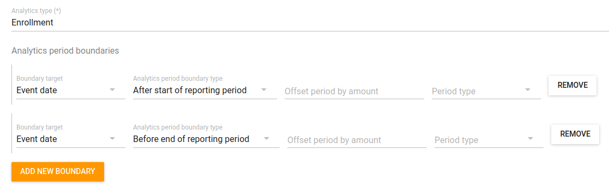{ .center width="80%" }

This means that for _most_ event type program indicators, the program indicator periodicity is defined as event dates falling within the reporting period. For _most_ enrollment type program indicators, the program indicator periodicity is defined as enrollment dates falling within the reporting period.

The diagrams below display how the default period boundaries for event type and enrollment type PI select events or enrollments to be evaluated. If you place a program indicator in a pivot table to query events in April this year, the default boundaries for an event type program indicator will evaluate all events that occurred within the month of April this year.

|  |  | 
| ----- | -------- |
| 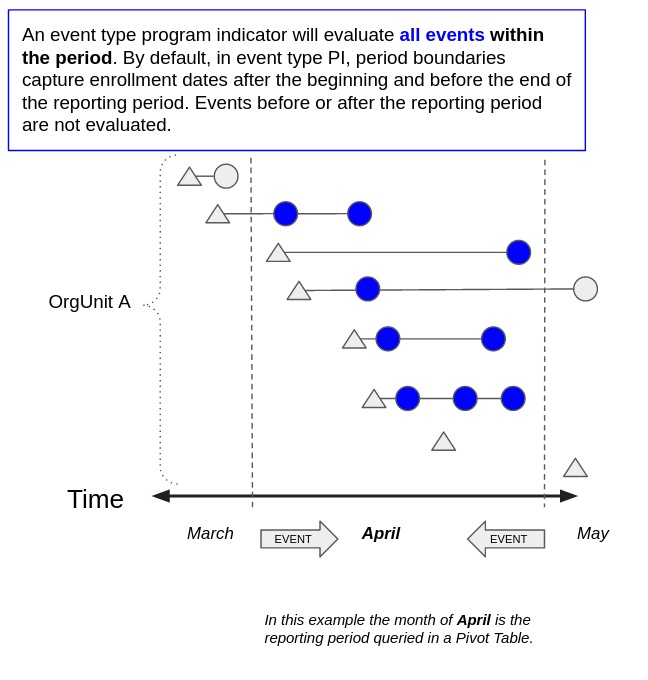| |

However, these default period boundaries can be adapted for specific analytic needs.

##### Removing a Period Boundary

It can be helpful to think of the first word of a period boundary type, “before” or “after”, as arrows which point backward or forward in time. Having two boundaries set with opposing directions of time (“after start” and “before end“) ensures that the boundaries are enclosed. If you delete either one, then the boundaries become open-ended. This can be used to create a **_cumulative_** program indicator, as in  “count all enrollments before the end of the reporting period”. A query for the month of April would then select all enrollments from any time before the end of April. 

Note that such “cumulative count” PI should be used with caution due to performance implications. If you were to query the last 12 months of data with a cumulative count PI, a separate cumulative query would be made for each of those monthly periods, rather than summing subsequent monthly counts (adding the Month 2 total to the cumulative value for Month 1, adding the Month 3 total to that Month 2 cumulative value, etc.)

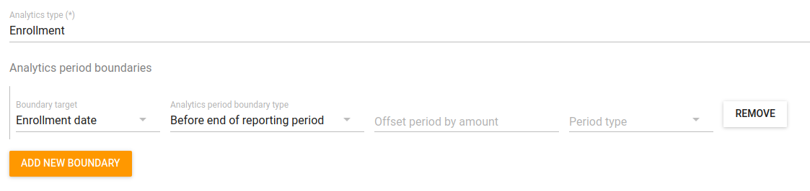{ .center width="80%" }

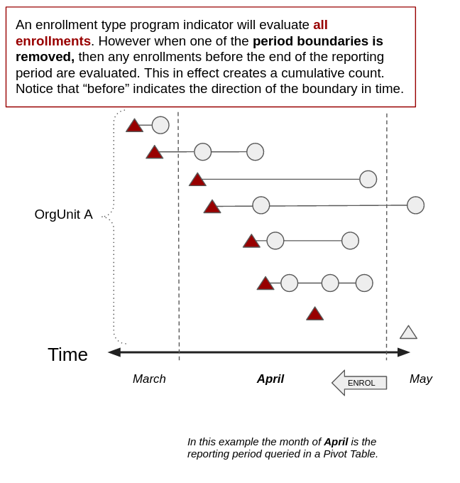{ .center width="80%" }

##### Adding and Mixing Period Boundaries

When working with enrollment type PI to filter by data values from two or more events, a common misperception is that the period boundaries will span the period when those events occurred. But as described above, the default period boundaries will target all _enrollment dates _within the period. In case management programs where cases are usually active for a long time, for example an HIV case surveillance program, most enrollment dates may actually be many months or years before the period of interest. 

In such scenarios, you can switch the boundary target of an enrollment type PI to the event date. All enrollments with at least one event falling in the reporting period are then evaluated.

{ .center width="80%" }

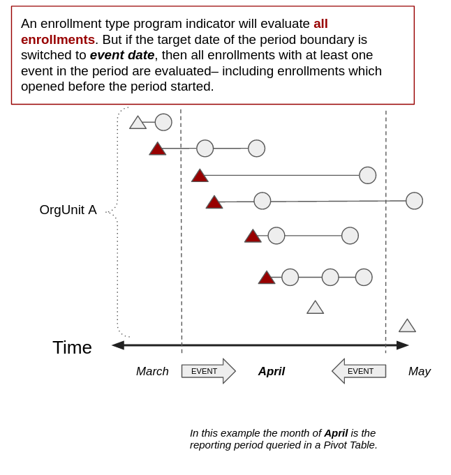{ .center width="80%" }

Just as you can change or delete period boundaries, multiple types of period boundaries can also be layered on top of each other to restrict the periodicity further.

For example, you can have an enrollment type PI that restricts the evaluation to event dates within the period, and enrollment dates before the period start date. This ensures that all the events evaluated are “follow ups”, since the enrollment was first opened in a previous period.

>**Tip**
>
>If you include a data element value in the filter, the PI would query the data element value in the latest follow up event this month. If that data element value is wrapped in a `d2:countIfValue()` function, the PI query will search data element values from all follow up events this month.

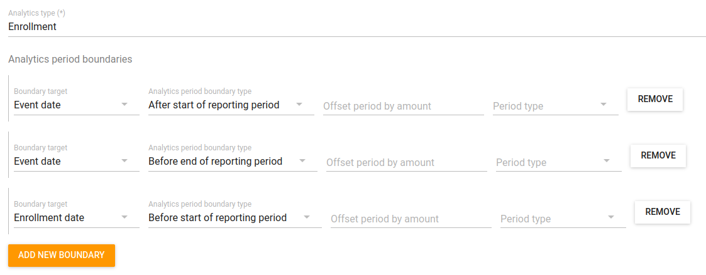{ .center width="80%" }

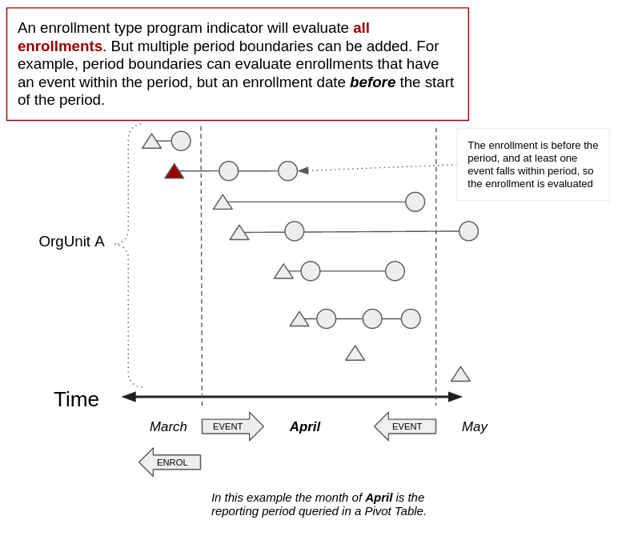{ .center width="80%" }

If the boundary target should be restricted to events from a specific stage, then you can select “Custom” boundary target, and enter the text `PS_EVENTDATE:{programStageUid}`

The custom boundary target could also be a tracked entity attribute or data element of date data type, for example a date of birth TEIA, or data element value for “lab test result date”. See the [User Guide](#about_program_indicators) for more examples of custom boundary targets and additional data elem.

##### Period Boundary Offsets

In most scenarios, the period of the analytics query is the period when events or enrollments should take place. In a few very specific use cases of longitudinal analysis, the program indicator should evaluate tracker data from a certain amount of time before (or after) the reporting period. These are referred to as **cohorts**, and can be useful in a variety of contexts:

* Dropouts: evaluating enrollments where events were expected to occur in the reporting period, but they did not take place.
* Expected event intervals which do not align with the reporting period interval:
    * A laboratory test should be performed 6 weeks after an inpatient visit. 
    * Routine hypertension management visit should be every 5 weeks, and you want to know how many had controlled blood pressure at their latest visit in the previous three months
* Program management: an HIV cohort counts those patients who have been enrolled in ART for precisely six months sometime during the period, and of those patients, how many of them have had a Viral Load test.

When defining a period boundary, two optional values–Offset Period by amount and Period Type–define how to move (“offset”) the period boundary relative to the reporting period.

In the example below, the analytics period boundaries for an enrollment type PI are moved back one month. The offset period type is Monthly, and the Offset period by amount is -1. 

This is how we create a **_cohort_** with our program indicator by shifting the analytics window to examine tracker data from a previous time frame, relative to the analytics period.

> **Important**
>
>Period offsets with negative values will reposition the target _backwards_ in time. Positive offset boundaries are more rare in practice, since they evaluate tracker data from _after_ the reporting period has ended. This is an unlikely scenario for "real time analysis" in routine HIS use cases.

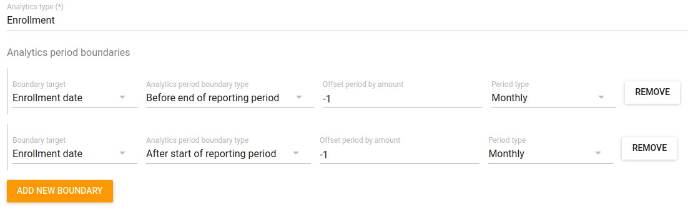{ .center width="80%" }

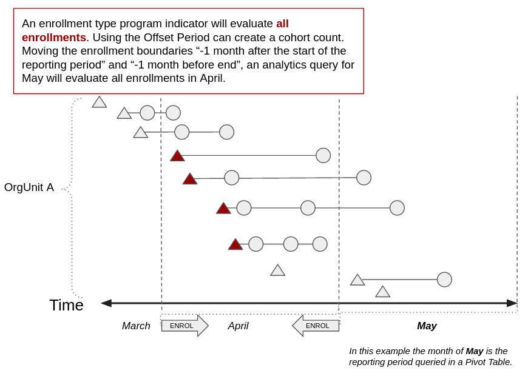{ .center width="80%" }

What‘s important from this example is to note that the enrollment boundary has simply shifted to exactly one month before the analytics period opened, and ends one month before the reporting period closes. 

* A query for the month of May shows enrollments entered for the month of April. 
* An annual query for the year of 2022 would actually evaluate all enrollments from December 1, 2021 until November 30, 2022.
* A weekly query for week 18 2023 (May 1-7) would likewise shift one month back, and evaluate all enrollments from April 1-7 2023.

To build on the "cohort" program indicator, you may want to blend enrollment date and event date period boundaries as in the previous section, but utilise the period offset effectively.

In this example, we want to count enrollments which were created in the previous month but had at least one event in the current reporting month. This could be useful for describing case follow up: how many new cases in your program had a follow up visit within one month’s time?

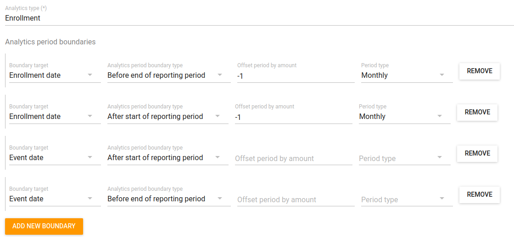{ .center width="80%" }

{ .center width="80%" }

_Fixed-Window Cohort or Relative-Window Cohort?_

Notice that we have still defined period offsets on _both_ the opening and closing period boundaries for enrollment date. Here, the “window” for our cohort is all enrollments entered after one month before the analytics period opens until one month before the analytics period closes. This cohort window is therefore **_dependent on the duration of the analytics period_**.

If end users select a weekly analytics period, the cohort window would be one week long, whereas if they select an annual analytics period, the cohort window would be one year long, and so on.

This is not ideal for many cohort analysis situations, where a fixed duration of the cohort window is elemental in the definition of the program indicator itself. For instance, you may want to find how many hypertension patients had a followup visit within precisely 90 days after enrollment. Or, you want to define a monthly cohort window like above, but calculate the average monthly number of cases in this monthly cohort over one year.

One option is to use a flexible “relative window” cohort, but state within the name or description of the program indicator that this should only be used with specific types of periods, e.g. monthly. However, this will likely be open to misinterpretation.

If your program indicator specifies a fixed window for the cohort, it is better to base opening and closing of the cohort period boundaries on a **single** point, such as the beginning of the analytics period. This approach ensures a fixed duration of the cohort window, regardless of the period queried. 

In the example below, a monthly enrollment cohort is generated, even though the reporting period is weekly. One could imagine adding on boundaries targeting the event date, to answer the question: “how many cases enrolled in the previous month have had a follow up visit in the present week?”

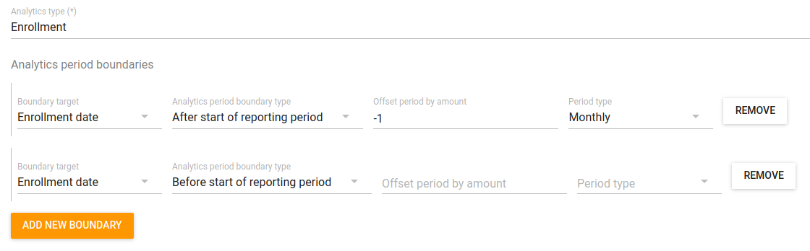{ .center width="80%" }

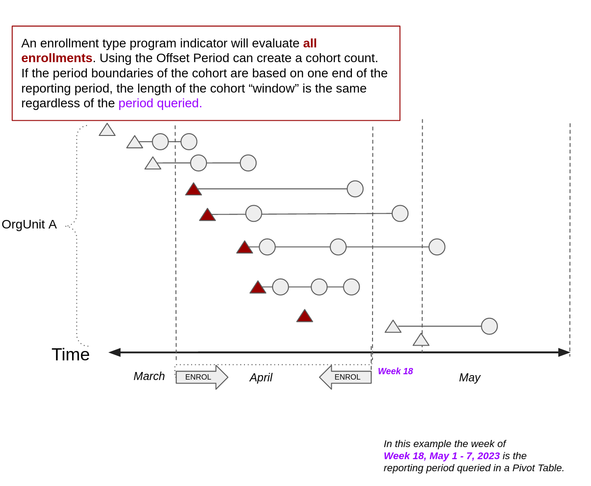{ .center width="80%" }

Note that because the cohort length is a fixed and essential part of the program indicator definition, you would need to create a new program indicator for every fixed duration of the cohort needed (monthly cohort, weekly cohort, etc).

### Common Challenge 3: Transfers and Ownership

The previous sections on tracker analytics have examined complexities that arise from episodic longitudinal data across a single dimension: time. Yet another essential dimension is **location**. As we saw above, the organisation unit is the first component analysed when a program indicator is being calculated. So how should we determine the “location” of an enrollment when its associated events actually took place at multiple distinct organisation units?

 
In health systems, people often move between health facilities to receive services for the same condition. They might be diagnosed at a primary health centre, then move to a specialised clinic for treatment. Their test results could be entered by a lab technician at yet another location. A community health worker might follow up with a home visit after treatment is initiated.

> :mag: **Country Use Cases**
>
>Depending on the context, patient movement can occur with high frequency. [In one trial of a DHIS2 Tracker for antenatal care in Bangladesh](https://www.researchprotocols.org/2021/7/e26918) for example, pregnancy registrations and follow up treatment could be provided both by community health workers and public rural health clinics, all sharing the same patient health record on a Tracker program with Open access. Out of about [14,000 total registrations](https://iambodo.github.io/projects/tutorials/ereg_migration_viz_types.html), 81% had at least one follow up visits after the initial registration event; out of 7750 follow up visits, about 8% occurred at a different organisation unit than registration. This meant that different public facilities–even different _types_ of facilities–provided services to the same individual. 

In DHIS2 Tracker, multiple org units may enter event data for the same enrollment. There are three different ways that the second facility (“Org Unit B”) might access an enrollment record created at another facility  (“Org Unit A”) and create a new event.

* The patient makes a **spontaneous visit** to OrgUnit B. This assumes that the user’s Search Scope allows for access to TEI registered in OrgUnit A. It also assumes that the program access level is either Open, Audited, or Protected. (See [Docs](https://docs.dhis2.org/en/develop/using-the-api/dhis-core-version-master/tracker.html#webapi_nti_access_level) for explanation of the different program access settings). 
* The user at OrgUnit A makes a **One-time Referral** to OrgUnit B. The program can have any access level to allow this, however OrgUnit B will need to be assigned the program. Users from OrgUnit B will only be able to enter data for a single event within the specified program stage, and they will not be able to edit the previous events.
* The user at OrgUnit A makes a **Permanent Transfer** to OrgUnit B. The program can have any access level to allow this, however OrgUnit B will need to be assigned the program. This differs from One-Time Referral as OrgUnit B will have edit access to all program stages for the enrollment, which will also be accessible to OrgUnit B in working lists and through search. After this transfer, it could be said that this enrollment now “belongs to” orgUnit B because Ownership has been conferred.

Information on how to use One-time referral and Move Permanently in the Tracker Capture app is found in the User Guide. Transfer and referral workflows are currently being designed for the Capture app.

Lets diagram how program indicators handle enrollments with events from different org Units. In the examples below, a **permanent transfer** is made from OrgUnit A to OrgUnit B.

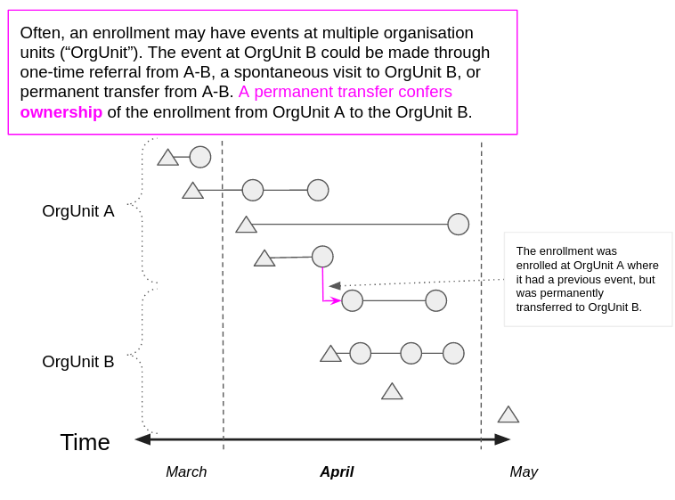{ .center width="80%" }

Ordinarily, an event type program indicator will simply determine its “Where” dimension by which events took place at each organisation unit. Similarly, an enrollment type program indicator will evaluate based on the organisation units where users originally created each enrollment.

|  |  | 
| ----- | -------- |
| | 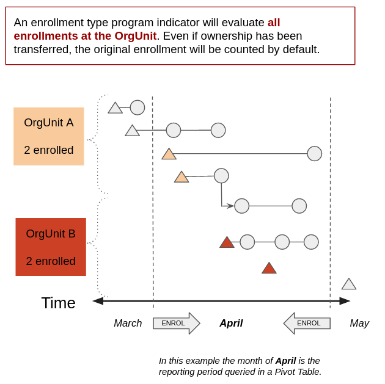|

When transfers occur, there are a few types of queries that are difficult to answer with PI accurately, such as:

* Taken together, how many **unique patients** were seen in both OrgUnit A and OrgUnit B during the month of April?
    * Problem: An event type PI with an V{enrollment_count} expression would count all unique enrollments that had at least one event at OrgUnit A and OrgUnit B. But when aggregating to a higher level, this would double count the transferred patient, which had events at both OrgUnits during the same period.
* Assuming at least one visit should happen every month, how many patients should orgUnit B expect in May?
    * Problem: PI could count all enrollments made at OrgUnit B before the start of May, but this would not include the transfer in from OrgUnit A, which should be expected in May.
* For all enrollments made at orgUnit A in March, how many follow up visits did they have in April?
    * Problem: It would be possible to construct an event type PI with custom analytic period boundaries to find enrollments made before in March, and events made in April. However, with event type PI, the two events after transfer to OrgUnit B would not be counted for OrgUnit A.

In some programs for long lasting chronic diseases, an enrollment may be open for a long time, and a single patient may transfer multiple times. The core issue becomes more apparent when working with enrollment type PI for analysing data across multiple events at different intervals, such as a registration event with a timely follow up visit.

In this simple example, we want to find how all patients enrolled in the previous month, but also had a follow up visit (event) in the reporting period. How should we classify patients who were transferred within or during the reporting period? Is it more important to know where they were enrolled, or where their latest visits took place? 

{ .center width="80%" }

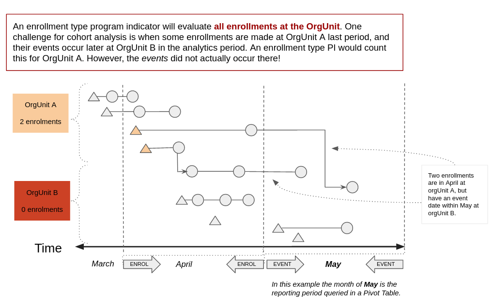{ .center width="80%" }

But here, _only the organisation unit of enrollment can be used_. This could have serious consequences for large implementations such as HIV or Infant Nutrition trackers, where patients might be enrolled for multiple years and move repeatedly. When patients have transferred, the enrollment orgUnit misrepresents which orgUnit was really responsible for providing services and entering data. Most program managers would instead want to monitor the status of patients based on their last place they received services, not where patients enrolled years prior.

##### Ownership Analytics (v2.40 and above)

Starting in DHIS2 version 2.40, the “organisation unit field” for PI calculation is available in the Maintenance app (found above the analytics period boundaries settings for each PI). This feature grants system designers greater flexibility to configure  the organisation unit dimension of PI calculation, and addresses the problems identified above.

There are now several options to assign the organisation unit used for PI calculation.

* Event organisation unit (default for event type PI, not available for enrollment type PI)
* Enrollment organisation unit (default for enrollment type PI)
* Registration organisation unit (where the TEI was created)
* Owner organisation unit at start of reporting period
* Owner organisation unit at end of reporting period 

The last two options allow designers to configure how the PI organisation unit dimension should be decided: the location before _or after_ a transfer is made during the reporting period.

Let’s return to the previous example. We want to see patients that had an enrollment in the previous month, and at least one event in the reporting period. Here, we select “**Owner at end organisation unit**” as the **organisation unit field**.

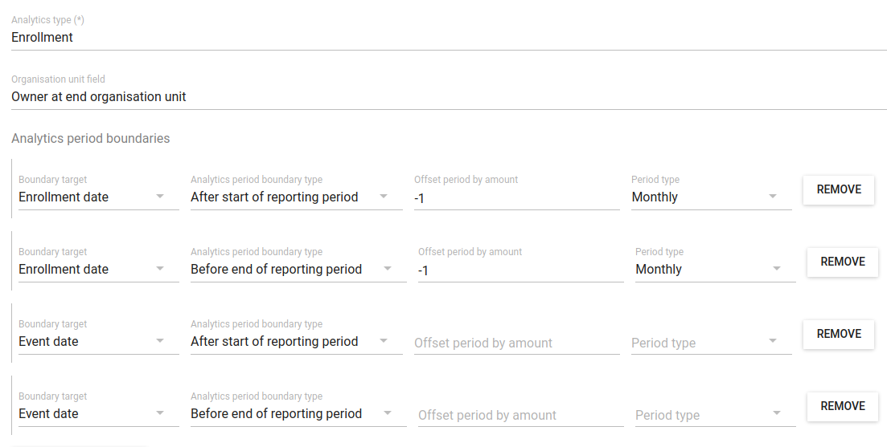{ .center width="80%" }

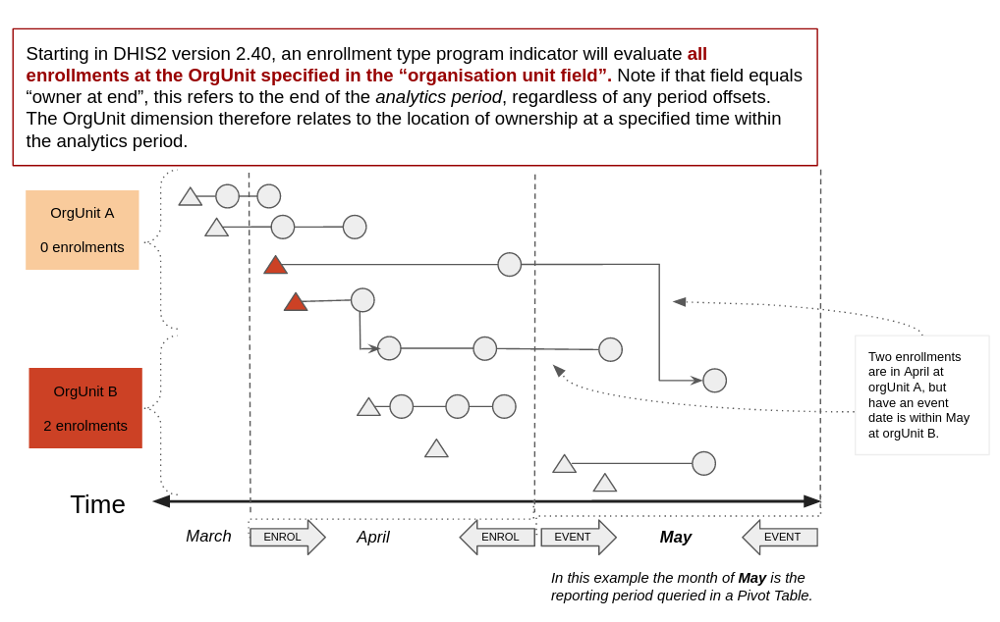{ .center width="80%" }

What happens? The two transferred enrollments from OrgUnit A are now counted for OrgUnit B. This occurs because they were owned by OrgUnit B as of the end of the reporting period being queried. 

Returning to our previous challenges, clever use of ownership analytics could prove instrumental in solving them.

* Taken together, how many **unique patients** were seen in both OrgUnit A and OrgUnit B during the month of April?
    * _Problem: An event type PI with an V{enrollment_count} expression would count all unique enrollments that had at least one event at OrgUnit A and OrgUnit B. But when aggregating to a higher level, this would double count the transferred patient, which had events at both OrgUnits during the same period._
    * Answer: An enrollment type PI with an V{enrollment_count} expression, and event target period boundaries from the start and end of the month. The organisation unit field is “owner at end of the month”, the transferred enrollment would count for OrgUnit A, and not OrgUnit B.
* Assuming patients should have at least one visit every month, how many patients should orgUnit B expect in May?
    * _Problem: PI could count all enrollments made at OrgUnit B before the start of May, but this would not include the transfer in from OrgUnit A, which should be expected in May._
    * Answer: An enrollment type PI with an V{enrollment_count} expression, and enrollment target period boundaries before the start of the month. The organisation unit field is “owner at start of the reporting period”, the transferred enrollment would count for OrgUnit B.
* For all enrollments made at orgUnit A in March, how many follow up visits did they have in April?
    * _Problem: It would be possible to construct an event type PI with custom analytic period boundaries to find enrollments made before in March, and events made in April. However, with event type PI, the two events after transfer to OrgUnit B would not be counted for OrgUnit A._
    * Answer: An event type PI with an V{event_count} expression,  enrollment target period boundaries with a period offset to cover the previous month, and event target period boundaries to capture all events within the reporting period. You can then decide how to handle transfers made within the reporting period. If the organisation unit field is “owner at start of reporting period”, then the two events at orgUnit B, created after the ownership transfer, would still count for OrgUnit A.

Several caveats should be considered when using the ownership organisation unit in analytics.

* Even when there are analytic period boundary offsets shifting the analytics window forward or backward in time, the organisation unit dimension remains the owner at the **beginning or end end of the reporting period.**
* If several periods are combined in such a query, then the owner at the beginning of the first period or the owner at the end of the last period should be used. So while “Months this year” and “this Year” cover the same amount of time, “Months this year” would show 12 periods and calculate ownership as of the end of each month separately, whereas “This year” would show one period and only examine ownership at the end of the year.
* Referrals do not confer ownership of the enrollment and its events. When referrals are made, only the “referral out” organisation unit is the owner for purposes of analytics.
* When a permanent transfer is performed in Capture or Tracker Capture, that date of ownership transfer is the **_current date_**. Therefore, if data entry staff record referrals made in the past, or perform backentry of legacy data, the ownership history should be accurately updated in the DHIS2 backend SQL by system administrators.
* As of v2.40, the total number of referrals and transfers cannot be calculated using program indicators. This includes questions such as “How many patients were transferred this period?” and “How many patients have been referred in total, and of those, how many completed the event after their referral?” While it may be possible to [find this information through SQL views](https://community.dhis2.org/t/calculate-transferred-patients/44892/3) of the Ownership history table, it is not yet possible to develop a PI to calculate number of transfer or referral actions as of May 2023. This is being developed for future DHIS2 releases.

### Common Challenge 4: Aggregation and Disaggregation 

The sections above have assumed that the expected value of a program indicator should be a count of cases or encounters that meet certain conditions. We now turn to how program indicators configuration can be adapted to produce different outputs than case counts, for example percentages or averages.

First, recall that every program indicator requires an  “Expression” and an “Aggregation Type”, both of which are used to aggregate PI values. For PI as case counts, these are typically very simple, such as Expression = V{enrollment_count} and Aggregation Type = Count. They can be adapted for different aggregations, such as “the average number of vaccines enrolled to each infant born last year”.

Next, it is important to remember that program indicators can also form the numerator or denominator of an Indicator. Here you can relate tracker-based data inputs to aggregate data values from DHIS2 datasets. Most programs use this so-called “super indicators” approach to calculate an intervention’s **_population coverage rates_**, by including population values in the denominator and program indicator values are in the denominator. For instance, you might compute newborns with BCG vaccination as a percentage of all newborns born at a health facility, where BCG vaccines administered is derived from a tracker program and newborns is a facility level HMIS form. The indicator numerator and denominator can include inline expressions, and the indicator itself has an aggregation type. 

If a program indicator is included in an indicator numerator, there are four different properties that define aggregation every time the indicator value is queried. These properties are applied in a specific order, described below.

**Aggregation Properties and Order Calculated**

|Order|Feature|Aggregation Level Applied|Example|
|--- |--- |--- |--- |
|1|PI Expression|Each event (or enrollment, depending on PI type)|Days between the date or birth and the first BCG vaccine|
|2|PI Aggregation Type|Within all events (or enrollments) for each period and orgUnit dimension|Average number of days between birth and BCG vaccine|
|3|Indicator Expressions (Numerator/Denominator)|Modifies PI value after Aggregation Type, if needed, before dividing numerator by denominator|If the org unit is on average more than 60 days between birth and BCG, value is 1, otherwise 0|
|4|Indicator Aggregation Type|How to combine values for multiple org units and/or multiple periods|Sum number of facility org units that provide “delayed ART” this period|

What about _disaggregating_ program indicators by important TEI characteristics, like patient age and sex? Unlike the aggregate indicators, program indicators do not allow on-the-fly data disaggregation by category option combination. In order to disaggregate a program indicator, a new program indicator has to be created for every disaggregation required.

In order to create a disaggregation, a new subexpression is conjoined to the **filter** of the program indicator. For instance, the filter for _patients with underlying conditions_ PI described in the section above:

`d2:countIfValue(#{covacprogramUID.underlyingcondUID},'Yes')>=1`

Adding a disaggregation for patient sex would require two additional program indicators filtering for tracked entity attribute values, one for Male and one for Female.

`d2:countIfValue(#{covacprogramUID.underlyingcondUID},'Yes')>=1 && A{sex}==’Male’`

`d2:countIfValue(#{covacprogramUID.underlyingcondUID},'Yes')>=1 && A{sex}==’Female’`

To restrict the filter by age, add a subexpression to filter the time between date of birth and the start date of the analytics period.

`d2:countIfValue(#{covacprogramUID.underlyingcondUID},'Yes')>=1 && d2 yearsBetween(A{dob}, V{analytics_period_start}>=60)`

These additions may not be a challenge to produce a small number of disaggregations. However, in situations where there are many disaggregations, it is a tedious task to manually duplicate and modify each program indicator, and maintain changes to them long term. For instance, disaggregating by two sexes and four age ranges together would require eight different program indicators.

Two custom DHIS2 apps have been developed to automate disaggregating of program indicators by multiple conditions.

 * [Program Indicator Disaggregator app (credit: HISP Tanzania)](https://github.com/hisptz/program-indicator-disaggregator)

* [Program Dataset Connector app (credit: BAO systems)](https://community.dhis2.org/t/program-dataset-connector-pdac/42988)

> **Tip**
>
>If you use the PDAC application, you can apply disaggregations of a program indicator to category combinations of an aggregate data element. This facilitates a tracker-to-aggregate data pipeline, which has a number of advantages such as speeding up analytics queries on dashboards.

## Implications of Tracker Analytics for Data Use

* Tracker data are both longitudinal and geographically distributed. This means data for a single TEI are not inherently tied to one period or one organisation unit. Program indicators define how to query tracker data based on one period dimension and one organisation unit dimension.
* When designing a program indicator for aggregating tracker data, it is essential to define whether you are counting unique encounters (events) or patients (enrollments, or, if enrollment is repeatable, TEI).
* All unique patient counts must use enrollment type PI, since event type will lead to double counting of patients at lower levels. Similarly, all longitudinal PI (calculations requiring data from more than one event) must use enrollment type PI. For DHIS2 versions below 2.40, patient counts and longitudinal indicators are tied to the organisation unit where the patient enrolled, which is sometimes not the location where services were delivered.
* Enrollment type PI provide a powerful way to query longitudinal data, but in patient management contexts where the enrollment is likely opened for a long duration, adding `d2:countIf()` statements should be used with discretion. When calculated on the fly on dashboards, these statements slow dashboards and diminish system performance. 
* In enrollment type PI there is the possibility to misinterpret the “where” dimension as the event organization unit, rather than the enrollment organization unit. This should be communicated to end data users in dashboards and training.
* When developing PI with custom “analytics period boundaries” or custom “organisation unit”, be sure to include text describing these customizations in the name and description of the PI and any indicators its a part of, as well as any visualisations or dashboards presenting those data, in order to support interpretation of the result.
* At national scale, event type PI are generally much faster than enrollment type PI to calculate, and potentially easier for end users to interpret. When designing essential program indicators for your program, try to find ways to include all the relevant program data in a single program stage if possible. Program rules allow Assigning data element values from a previous event into subsequent events, or into another stage. Further, program rules can be employed to only show specific sections program stages based on certain data values are entered, making it easier to include all relevant data into a single stage.
* See the Tracker Implementation Guidance for more lessons from COVID-19 vaccine systems on configuration of [Tracker analytics at scale](#analytics-performance) 

Once you have an idea of tracked entity attributes, program stages, data elements, and required program indicators you should be able to draw a **system design diagram** for your proposed Tracker system, highlighting how an individual enrollment progresses between each stage. See the DHIS2 Metadata Package documentation for [examples](https://docs.dhis2.org/en/topics/metadata/disease-surveillance/acute-febrile-illness/design.html#program-configuration).

After you have developed a schematic for your program, or an early prototype, you should review additional features that will facilitate end user data entry.

You may also want to review this early prototype with stakeholders and a selection of end users for a round of feedback on the feasibility of the proposed program design.