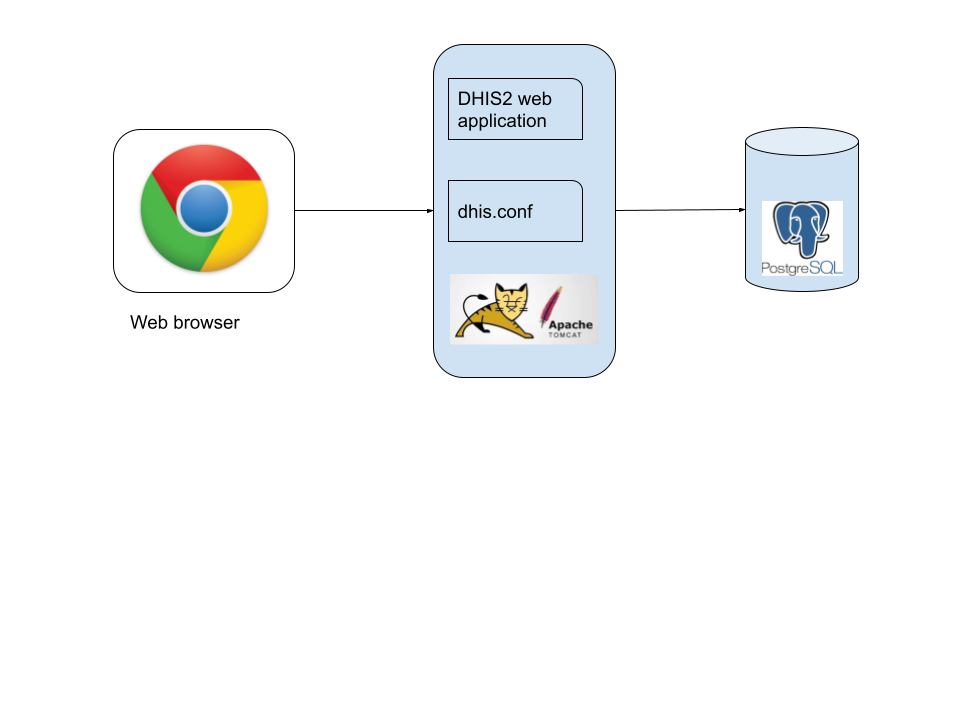

# A quick guide to DHIS2 implementation

Any implementation of District Health Information Software (DHIS2)
should aim at establishing sustainable systems that are flexible to
changing needs in the health sector. It is important to acknowledge that
this will take many years, with continuous structures for capacity
building, best practice sharing, and innovation. This quick guide will
provide a very crude overview of the different facets of DHIS2
implementation.

## Planning and organizing

### Structures needed

  - A DHIS core team (DCT) of 4-5 people will be needed to administer a
    national HMIS. Their responsibilities and required skills should be
    clearly defined. The DCT will participate in DHIS2 Academies,
    organize training and end-user support for various user groups in the
    country.

  - A Technical Steering Committee, or equivalent, will be needed to
    steer the coordination between health programs, other information
    systems and development partners and Universities. They will lead
    integration efforts and make decisions regarding the overall
    architecture of information systems.

### Integration efforts

  - Throughout the implementation, simultaneous efforts of information
    system integration and data exchange need to be conducted. The
    leading principle for this work should be to create a
    decision-driven and indicator-focused system.

### Equipment and internet

  - An assessment needs to establish the needs for hardware. Desktops,
    laptops, tablets, mobile phones all have different qualities, and
    typically a mix of these different technologies will need to be
    supported.

  - Server and hosting alternatives needs to be critically examined with
    regards to capacity, infrastructural constraints, legal framework,
    security and confidentiality issues.

  - Internet connection for all users will be needed. Mobile internet
    will be adequate for majority of users doing data collection and
    regular analysis.

  - Options for mobile phone users, bulk sms deals etc, should be
    examined if appropriate.

### Roll-out strategy

  - The DCT will play a key role here and each member should have clear
    responsibilities for the roll-out covering: user support, user
    training, liaison with health programs, etc.

  - Broader support structures need to be established to provide
    support, supervision, and communication with global/regional network
    of expert users and developers.

  - Information use must be a focus area from the start and be a
    component both in the initial system design and the first round of
    user training. Data collection and data quality will only increase
    with real value of the information. District review meetings and
    equivalent should be supported with appropriate information products
    and training.

  - Training will typically be the largest investment over time, and
    necessitates structures for continuous opportunities. Plan for a
    long term training approach catering for a continuous process of
    enabling new users and new system functionalities.

  - Supervision and data quality assessment should be held frequently.

## Adapting DHIS2

### Scope of system

  - Based on the decisions the system should support (system scope);
    customization and adaptation of the platform will be needed for
    DHIS2 aggregate, tracker, and/or events. Each action will need
    special competence, and should be led by the DCT.

  - Assessment of the intended users and beneficiaries is needed, such
    as related to their information needs, and hardware and network
    needs.

  - An understanding of the larger architecture of the HIS (the "HIS
    ecosystem") is important; what other systems are there, and how
    should they interact with DHIS2? Consider what needs there will be
    for interoperability between electronic systems.

  - If there are needs that are not currently supported by DHIS2, an
    assessment of additional software development is necessary. These
    can be addressed locally by developing a custom web app or feed into
    the overall core platform development roadmap process organized by
    UiO.

### Setting up DHIS2

  - Reporting units: implementing the different reporting units (service
    outlets) and hierarchies including grouping.

  - Data collection needs: Which indicators are needed, what data
    variables will go into their calculation, and how should this data
    be collected? Design data elements, disaggregation categories, data
    sets, and collection forms.

  - Information for action (indicators, dashboards, other outputs): what
    are the information products the various users will need? Tables,
    charts, maps, dashboards. Routines for dissemination and sharing.

  - User management: Create user roles and groups, routines for managing
    users, define access to features, and appropriate sharing of
    content.

  - DHIS2 governance document (roles by profile, how to change metadata
    and under what conditions).

### Hosting

  - Hosting DHIS2 on a national scale is a considerable undertaking which requires planning, provisioning, monitoring and management of potentially complex hardware and/or cloud resources.  For a full discussion of the various tradeoffs of different approaches see the [server hosting](#server-hosting) section.

## Capacity building

### DHIS core team (DCT)

  - DCT will need all skills necessary for a sustainable, evolving
    system. This includes technical skills (DHIS2 adaptation, server
    maintenance), system knowledge (architectures and design
    principles), organizational (integration strategies), and project
    management (organizing structured support and training).

  - DCT members should attend the regional/global DHIS2 Academy
    frequently (e.g. twice a year) to ensure high quality training,
    continuous communication with the broader expert community, and to
    make sure the local team is up to date with new functionalities and
    enhancements in recent releases of the DHIS 2 platform. DCT will be
    responsible for adapting and cascading this regional training
    curriculum to a broader group of users within country.

### Country training strategies

  - DCT should offer training in relation to the implementation, and
    continuously thereafter to meet growing demands, system updates and
    staff turnover.

  - Adapting and developing training material and reference guides to
    reflect local information needs and local system content is
    important.

### Continuous training opportunities

  - As user experience is growing, more advanced training should be
    offered. Information use training for district medical officers and
    health program managers is crucial early on to enroll stakeholders
    to use the information in decision making.

# High level planning and budgeting guidance for sustainable DHIS2 systems { #planning-budgeting }

Proper planning and budgeting is an important activity in order to sustain a good system design over time, making sure the DHIS2 system develops in a healthy way, is updated frequently, responds to user needs and operates according to rules and regulations. This includes making sure the system responds to basic user needs in terms of data collection, data quality checks, data analysis and presentations, and remains relevant to all key health programs and at all levels of the health system (from facility/community to national level).

A strong DHIS2 implementation that is sustainable over time and adaptable to changing programmatic needs requires a number of cross cutting functions to be in place and well-functioning. We refer to these as foundational domains, which includes areas such as leadership and governance, security and infrastructure. These are important building blocks in order to support both aggregated and individual level data systems. The figure below illustrates the foundations for DHIS2 - these will all require financial support internally and often externally in the form of organisational strengthening and capacity building, technical assistance and local operational costs.

The purpose of this section is to provide guidance on planning and budgeting DHIS2 strengthening activities, with a particular emphasis on the foundational domains. It is not straightforward to provide clear costing guidance in each domain in this model, since the particular activities will vary greatly depending on the current state or maturity of the domain, the capacity of the local core DHIS2 team, and local cost levels. Because it is not possible to provide generic costing estimates in real value (dollars), we instead describe the cost categories and factors to consider when making a budget.

## DHIS2 Maturity Profile Tool

A tool is available ("DHIS2 Maturity Profile") to map the maturity of a DHIS2 implementation in a country in order to help identify areas in need of strengthening. The assessment tool is structured as a set of questions per each domain shown in the figure above, and will give a snapshot of the current maturity of DHIS2 in a country. This assessment is intended to be performed regularly in collaboration between DHIS2 experts/HISP groups and Ministries of Health and results in a summary report with recommendations.

The DHIS2 maturity profile supports countries to;

- measure and understand if the country is progressing on health information system strengthening, beyond summarising the activities performed
- encourage investments in core DHIS2 capacity (i.e. foundational areas) that contributes to a sustainable HIS supporting health programs
- align across investments/donor interventions
- assist in planning DHIS2 implementation and strengthening activities
- identify areas in need of more in depth evaluation or monitoring

The DHIS2 Maturity Profile is an important tool for building and costing coordinated and sustainable DHIS2 plans in a country.

## Budgeting considerations

Costs can roughly be divided in;

- Local personnel costs (DHIS2 core team and capacity building)
- Technical assistance costs (from HISP groups or others, including fees and travel)
- Local operational costs (e.g. training costs, devices, hosting, support to end users)

The largest investments in DHIS2 strengthening are associated with building and maintaining local capacity in the country, but for new implementations there are costs to help get started, support the initial configuration and training etc.

Costs are generally highest when getting started and first scaling up DHIS2. Certain costs are one-off, meaning they will only occur once, such as gathering requirements and configuring the initial system, but most costs are recurring each year. For example, an initial investment in purchasing computers or mobile devices must be backed up with a long term plan to replace a certain number of these devices every year, perpetually. Similarly, there needs to be a plan and budget for training of new staff, refresher training, server hosting, regular security audits, and ongoing system maintenance and improvements etc. It is very important to ensure that there is sustainable funding over time to support the system.

Depending on the state of the core team or maturity of the country, the nature of assistance will change. In an early stage of an implementation, there may be need for external support even for relatively routine or basic activities. As a local capacity and a strong core team is developed, most activities can be handled internally. Outside expertise will then primarily be in the form of providing advice and capacity building in new areas or for new functionality.

General budgeting guidance are located [here](https://docs.google.com/spreadsheets/d/104-c0m0CZ6Wcfm8vCAJ-8Os-5GzZRSaT/edit#gid=1341095871). Note that the guidance mostly covers one-off costs, but we recommend that countries plan longer term and factor in costs that are recurring.

## Planning and budgeting the strengthening of foundational areas

Next is a description of the foundations of DHIS2, what you need to think about when it comes to budgeting and planning and some relevant resources. Further down you will find guidance to plan, budget and build/maintain both aggregate and tracker programs

### Leadership and governance

Solid governance and coordination mechanisms are crucial to support an HMIS that is coherent across programs, up to date and well maintained. An aim is to have a cross-ministry steering committee bringing together key health information stakeholders across the ministry responsible for high-level strategic decisions relating to content and scope for DHIS2. The group should have representatives from across all major health programs, with both technical and public health leadership, and should be given a clear mandate. Additionally, a technical working group can meet more frequently and have the mandate to make decisions of practical nature.

While this is not a quick fix in any country, guidance and technical assistance from HISP groups on how to establish and run such coordinating mechanisms can be useful. They can also help prepare or participate in such meetings.

#### Resources

- Links to guidance/implementation guidance
- Generic Scope of Work

### Strategy and investment

Strategy and coordinated investments means having digital strategies which address areas where DHIS2 is used, such as HMIS (aggregated data), surveillance, case based surveillance and community based data. Countries should conduct regular HMIS needs assessments and develop costed work plans. The sustainability of HMIS funding and investments over time also points to a mature DHIS2 implementation. This includes planning for DHIS2 strengthening, but also planning for the personnel needs in the whole "data-chain", such as health personnel with time and capacity to work with data, district health information officers, statisticians etc.

There might be costs associated with assistance to support this strategy development work, conducting needs assessment and writing costed plans.

#### Resources

- Links to guidance/implementation guidance

### DHIS2 security and compliance

DHIS2 implementations need to align with local legislation and be protected from breaches and data loss. This requires personnel with the right skills, well-defined policies, auditing procedures and key security tools and documents that are used routinely. There should be a person responsible for implementing security policy covering DHIS2, at a senior level within the Ministyr of Health. If this responsibility is not defined, or the person is not sufficiently senior, overseeing and implementing other key elements of a security framework is difficult. Related to this, both *data* and *technical* ownership should be clearly established and defined for the DHIS2 system. The *data owner* is the person or unit responsible for data backup and retention policy, and access control approvals. The *technical owner* is responsible for the infrastructure, change management and system maintenance.

There should be a document describing the security policy for the DHIS2 system, which outlines processes and procedures for implementing and managing security at server, instance and data level. A regular (e.g. yearly) internal and/or external audit of the DHIS2 system should be conducted that verifies adherence of the implementation against this defined policy. The audit should also specifically test the server and the DHIS2 instances for security issues.

Finally, key security tools and documents should be available and used as needed. Examples of such tools and documents include risk registers, threat model, privacy impact assessment, non-disclosure agreements, and incident response plans.

Security and compliance is to a large extent about policies and delegation of responsibility, and costing of this domain should take into account resources to allow relevant staff to take on the necessary responsibility. When policies and key tools and documents are not in place, budgeting for technical assistance to develop and implement these may be needed. Similarly, there should be a plan and budget for regular audits.

#### Resources

- [Security considerations when implementing DHIS2](#security-considerations)
- Generic Scope of Work

### Core team for DHIS2 maintenance

The vital part to any DHIS2 implementation is to identify a DHIS2 core team that will be central to the DHIS2 rollout and responsible for the day-to-day maintenance and further development of the national DHIS2 system. This team will be a critical component in the long term sustainability of the system and to ensure local ownership. This team needs to be established at the beginning of the DHIS2 implementation and lead the local customization process.

A team can either be funded through secondments of staff to MoH from external organisations or as annual salaries if existing staff exist in the MoH (across programs and departments). One can incentivise participation and long term involvement through regular core team meetings e.g. configuration workshops, coordination meetings, training events (in country and regional DHIS2 academies) for the core team.

Key to building capacity of the core DHIS2 team is that all technical assistance activities are planned in a way that allows the local team to be involved and learn from outside expertise as far as practically possible. Building the core team is therefore a cross-cutting concern that should be considered when outside expertise is involved to strengthen any of the foundational areas.

Costs will include salaries or secondments, workshops with travel and per diems, technical assistance to provide capacity building support, as well as DHIS2 academy sponsorships.

#### Resources

- Link to description of roles/competencies needed in core team
- Capacity building plan example
- Generic Scope of Work

### DHIS2 metadata and org units

Metadata quality refers to the quality of the DHIS2 configuration, such as how data elements, indicators, reporting forms (data sets) and analytical outputs (dashboards) are configured. For example, whether there are misconfigurations that can potentially lead to system errors, or if the metadata is organised in a way that facilitates use of information by end users.

The quality of the organisational unit hierarchy (e.g. districts, health facilities refers to whether they are completely represented in DHIS2, including both public, private and non-governmental sectors, and whether they are kept up to date with associated information.

While maintenance of metadata and orgunits is in general an integral part of the ongoing work of the core DHIS2 team, it will often be necessary to plan for metadata assessments and cleaning exercises from time to time. Outside technical assistance may be required to support this, as addressing certain types of issues can be very technically challenging.

#### Resources

- [Guidance on metadata quality and integrity](#metadata-integrity-and-quality)
- [Metadata assessment tool](https://github.com/dhis2/metadata-assessment)
- Generic Scope of Work

### Training end users

Training of end users of DHIS2 at all levels of the health system is a critical component of a successful DHIS2 implementation. Countries should have a plan for systematically training new staff, providing refresher training on a regular basis, and addressing training gaps on data entry, validation and use. A common problem and an area with large potential is local level data use. Thorough investigations and documentation of local data use practices in selected districts is needed to support this. Based on these investigations, next steps can be adaptation of analysis tools to local practices and data policies (incl. denominator data at each level), design and configuration of local level data analysis products and distributing these tools to other districts.

HISP groups typically conduct Training of Trainers (TOT) to help countries run their own end-user training. Costs associated with training are both TA and travel for HISP groups, and local costs to host and contact cascaded training, such as venue, trainers, training materials, per diems, travel etc.

#### Resources

- Links to guidance/implementation guidance
- Generic Scope of Work

### Facility and population profile

In order to ensure overviews of the target population and the available services and personnel it is important with complete and up to date population and facility data. When CRVS data (e.g. births and deaths) is available and complete, this could be linked to DHIS2 and used to calculate denominators. Population data (denominators) from census data is more typically used in DHIS2, and should be available for use at subnational level. Census estimates may not be available or appropriate at all relevant levels used in DHIS2, and there should therefore be SOPs and routines making projections available for local use.

A facility list or register should be available in DHIS2 that covers all relevant facilities, including community units where those are reporting. This list should be kept up to date, which in most cases means that there is a process for involving the sub-national level (e.g. district) in the facility list maintenance. Human Resource data (workforce) should also be linked to facilities, with details on the type and number of staff kept up to date on a regular basis.

In addition to the ongoing staff requirements to keep this information updated and relevant in DHIS2, the main cost items is technical assistance to integrate the relevant types of data into DHIS2, either as a one-time operation or by establishing some form of interoperability with CRVS, master facility list or human resource systems.

#### Resources

- Links to guidance/implementation guidance
- Generic Scope of Work

### Infrastructure

Sufficient infrastructure means that the system is being hosted in a secure and stable environment (either on-premise or cloud based), that there are enough working devices for end users, and that ICT support is available and needed. Different projects and programs will have different infrastructure needs; some countries enter the data at facility level on paper and digitise it at district level, while others run full scale digital implementations with personal devices for health workers. In addition to the actual infrastructure there are associated costs such as mobile device management and device inventory.

There are many different options for hosting an online system, both in terms of where to put the server (e.g. in-house vs. cloud) and who to manage the server (e.g. in-house vs. outsourced). Server and hosting alternatives need to be critically examined with regards to capacity, infrastructural constraints, legal frameworks, security and confidentiality issues. These decisions may need to be revisited at least annually as server complexity, data types (e.g. aggregate vs. patient) and local capacity may change over time. It is important to budget for device replacement as devices eventually will break down or get lost.

#### Resources

- [Overview of deployment strategies](#deployment-strategies)
- [DHIS2 server installation tools and guide (draft)](https://github.com/bobjolliffe/dhis2-tools-ng)
- Generic Scope of Work

### Improving or implementing a new programme/data set - aggregate data

The maturity of an aggregate DHIS2 implementation can be measured by looking at metrics such as reporting completeness, timeliness and consistency, whether there are available data use guidelines or forums, and job descriptions for staff working with the data. Reviews of data collection tools, indicators and data use products are also needed at regular intervals, and the data collection tools should generally be aligned with current international (e.g. WHO) standards within the health area. Improving some of these can require training of the core team or end users or technical assistance with DHIS2 configuration.

Expanding the scope of the DHIS2 implementation into new health areas or domains with aggregate data collection requires careful consideration of status and maturity of the foundational domains. Adding new domains, e.g. inclusion of additional health programmes, disease surveillance or community-level reporting (CHIS), puts additional demand on the foundation areas. If the foundational areas are already weak, the likelihood that the expansion will not be successful increases.

In general, the foundational domains should all be at minimum acceptable level before additional aggregate domains are implemented, i.e. scoring at least "Early progress" when using the Maturity Profile tool. When planning and budgeting implementation of new aggregate domains, it is critically important that the plans also provide for strengthening the foundational areas that are in need of improvement. It is important to keep in mind that even foundational areas that have previously been performing well may be negatively affected by additions of new aggregate reporting, and that this needs to be compensated for in the implementation plan. For example, a server/hosting arrangement that was previously sufficient may no longer be appropriate if hundreds of new users are introduced, and the model for end user training that works well for facility level users may no longer be appropriate if reporting from the community level is introduced.

There are different approaches to incorporating a new health domain into DHIS2. When DHIS2 is being introduced as a data collection tool, this can be done on the basis of an existing information flow and using existing primary data collection tools (e.g. paper registers and forms), or as part of a revision to the overall reporting system. Potentially, global metadata configuration packages may be used for parts of this process. Furthermore, another system may be used for data collection, and integrated in DHIS2 through an interoperability solution. These different scenarios have implications for the planning and budgeting. In general, a project to introduce new health areas into DHIS2 will require orientation meetings, a requirements gathering process, DHIS2 configuration, testing and training. In addition there are local costs associated with devices, salaries, training etc for the staff as described above.

#### Resources

- [WHO Health Data Toolkit](https://dhis2.org/who/)
- [Metadata packages](https://dhis2.org/metadata/)
- [CHIS implementation guide](https://docs.dhis2.org/en/implement/chis-implementation/background.html)
- [Aggregate system design](#data-elements-and-custom-dimensions)
- Scope of Work

### Improving or implementing a new programme/data set - individual data/tracker

Developing and implementing individual level/tracker systems can be more complicated than working with aggregated data. The system design may require more work and testing as it touches on concrete work processes and typically involves larger data sets and business logic. Additionally, there are more users, meaning a bigger need for training, devices and support.

The same cost categories as for aggregate systems apply for building and improving tracker systems. However, developing and implementing a tracker program requires the DHIS2 core team to work closely with the clinical staff to understand and fit their work processes. It is more time consuming to design and build a good tracker program both for the implementers and for the key personnel that are providing the requirements. Whether building a tracker programme from scratch or adapting a metadata configuration package, close collaboration with end users is needed. The tracker should be field tested in a realistic setting and adjusted based on the results from the testing. Remote guidance and onsite technical assistance can help in this process.

A tracker program typically affects a lot of users, and training of trainers, end user training and devices and connectivity are large budget posts. It is therefore generally more costly to add a new tracker programme than a new data set for aggregate reporting. In most cases, a tracker program needs to be costed per program.

More resources on considerations for tracker can be found in the [tracker implementation guide](https://docs.dhis2.org/en/implement/tracker-implementation/introduction.html).

In general, the foundational domains should all be at minimum acceptable level before additional tracker programs are implemented, i.e. scoring at least "Early progress", and preferably "Adequate" when using the Maturity Profile tool. No foundational areas in the maturity profile tool should have the score "Not yet achieved" before starting a tracker program, and DHIS2 security and compliance should always be at least "Adequate". As with aggregate systems, when planning and budgeting implementation of new individual data domains, it is critically important that the plans also provide for strengthening the foundational areas that are in need of improvement. The project plan should clearly identify actions to improve foundational pieces of DHIS2 while planning for new tracker programs. It is also key that the attention to aggregate reporting is not lost as a country embarks on advanced tracker programs - often it is the same personnel working on both.

#### Resources

- [WHO Health Data Toolkit](https://dhis2.org/who/)
- [Metadata packages](https://dhis2.org/metadata/)
- [Tracker implementation guide](https://docs.dhis2.org/en/implement/tracker-implementation/introduction.html)
- Scope of Work

# Conceptual Design Principles

This chapter provides a introduction to some of the key conceptual
design principles behind the DHIS2 software. Understanding and being
aware of these principles will help the implementer to make better use
of the software when customising a local database. While this chapter
introduces the principles, the following chapters will detail out how
these are reflected in the database design process.

The following conceptual design principles will be presented in this
chapter:

  - All meta data can be added and modified through the user interface

  - A flexible data model supports different data sources to be
    integrated in one single data repository

  - Data Input \!= Data Output

  - Indicator-driven data analysis and reporting

  - Maintain disaggregated facility-data in the database

  - Support data analysis at any level in the health system

In the following section each principle is described in more detail.

## All meta data can be added and modified through the user interface

The DHIS2 application comes with a set of generic tools for data
collection, validation, reporting and analysis, but the contents of the
database, e.g. what data to collect, where the data comes from, and on
what format, will depend on the context of use. These meta data need to
be populated into the application before it can be used, and this can be
done through the user interface and requires no programming. This allows
for more direct involvement of the domain experts that understand the
details of the HIS that the software will support.

The software separates the key meta data that describes the raw data
being stored in the database, which is the critical meta data that
should not change much over time (to avoid corrupting the data), and the
higher level meta like indicator formulas, validation rules, and groups
for aggregation as well as the various layouts for collection forms and
reports, which are not that critical and can be changed over time
without interfering with the raw data. As this higher level meta data
can be added and modified over time without interfering with the raw
data, a continuous customisation process is supported. Typically new
features are added over time as the local implementation team learn to
master more functionality, and the users are gradually pushing for more
advanced data analysis and reporting
outputs.

## A flexible data model supports different data sources to be integrated in one single data repository

The DHIS2 design follows an integrated approach to HIS, and supports
integration of many different data sources into one single database,
sometime referred to as an integrated data repository or a data
warehouse.

The fact that DHIS2 is a skeleton like tool without predefined forms or
reports means that it can support a lot of different aggregate data
sources. There is nothing really that limits the use to the health
domain either, although use in other sectors are still very limited. As
long as the data is collected by an orgunit (organisational unit),
described as a data element (possibly with some disaggregation
categories), and can be represented by a predefined period frequency, it
can be collected and processed in DHIS2. This flexibility makes DHIS2 a
powerful tool to set up integrated systems that bring together
collection tools, indicators, and reports from multiple health programs,
departments or initiatives. Once the data is defined and then collected
or imported into a DHIS2 database, it can be analysed in correlation to
any other data in the same database, no matter how and by whom it was
collected. In addition to supporting integrated data analysis and
reporting, this integrated approach also helps to rationalise data
collection and reduce duplication.

## Data input \!= Data output

In DHIS2 there are three dimensions that describe the aggregated data
being collected and stored in the database; the where - organisation
unit, the what - data element, and the when - period. The organisation
unit, data element and period make up the three core dimensions that are
needed to describe any data value in the DHIS2, whether it is in a data
collection form, a chart, on a map, or in an aggregated summary report.
When data is collected in an electronic data entry form, sometimes
through a mirror image of the paper forms used at facility level, each
entry field in the form can be described using these three dimensions.
The form itself is just a tool to organise the data collection and is
not describing the individual data values being collected and stored in
the database. Being able to describe each data value independently
through a Data Element definition (e.g. ‘Measles doses given \<1 year’)
provides important flexibility when processing, validating, and
analysing the data, and allows for comparison of data across collection
forms and health programs.

This design or data model approach separates DHIS2 from many of the
traditional HIS software applications which treat the data collection
forms as the key unit of analysis. This is typical for systems tailored
to vertical programs’ needs and the traditional conceptualisation of the
collection form as also being the report or the analysis output. The
figure below illustrates how the more fine-grained DHIS2 design built
around the concept of Data Elements is different and how the input (data
collection) is separated from the output (data analysis), supporting
more flexible and varied data analysis and dissemination. The data
element ‘Measles doses given \<1 y’ is collected as part of a Child
Immunisation collection form, but can be used individually to build up
an Indicator (a formula) called ‘Measles coverage \<1y’ where it is
combined with the data element called ‘Population \<1y’, being collected
through another collection form. This calculated Indicator value can
then be used in data analysis in various reporting tools in DHIS2, e.g.
custom designed reports with charts, pivot tables, or on a map in the
GIS module.

## Indicator-driven data analysis and reporting

What is referred to as a Data Element above, the key dimension that
describes what is being collected, is sometimes referred to as an
indicator in other settings. In DHIS2 we distinguish between Data
Elements which describe the raw data, e.g. the counts being collected,
and Indicators, which are formula-based and describe calculated values,
e.g. coverage or incidence rates that are used for data analysis.
Indicator values are not collected like the data (element) values, but
instead calculated by the application based on formulas defined by the
users. These formulas are made up of a factor (e.g. 1, 100, 100, 100
000), a numerator and a denominator, the two latter are both expressions
based on one or more data elements. E.g. the indicator "Measles coverage
\<1 year" is defined a formula with a factor 100, a numerator ("Measles
doses given to children under 1 year") and a denominator ("Target
population under 1 year"). The indicator "DPT1 to DPT3 drop out rate" is
a formula of 100 % x ("DPT1 doses given"- "DPT3doses given") / ("DPT1
doses given"). These formulas can be added and edited through the user
interface by a user with limited training, as they are quite easy to set
up and do not interfere with the data values stored in the database (so
adding or modifying an indicator is not a critical operation).

Indicators represent perhaps the most powerful data analysis feature of
the DHIS2, and all reporting tools support the use of indicators, e.g.
as displayed in the custom report in the figure above. Being able to use
population data in the denominator enables comparisons of health
performance across geographical areas with different target populations,
which is more useful than only looking at the raw numbers. The table
below uses both the raw data values (Doses) and indicator values (Cov)
for the different vaccines. Comparing e.g. the two first orgunits in the
list, Taita Taveta County and Kilifi County, on DPT-1 immunisation, we
can see that while the raw numbers (659 vs 2088) indicate many more
doses are given in Kilifi, the coverage rates (92.2 % vs 47.5 %) show
that Taita Taveta are doing a better job immunising their target
population under 1 year. Looking at the final column (Immuniz. Compl. %)
which indicates the completeness of reporting of the immunisation form
for the same period, we can see that the numbers are more or less the
same in the two counties we compared, which tells us that the coverage
rates can be reasonably compared across the two counties.

## Maintain disaggregated facility-data in the database

When data is collected and stored in DHIS2 it will remain disaggregated
in the database with the same level of detail as it was collected. This
is a major advantage of having a database system for HIS as supposed to
a paper-based or even spreadsheet based system. The system is designed
to store large amounts of data and always allow drill-downs to the
finest level of detail possible, which is only limited by how the data
was collected or imported into the DHIS2 database. In a perspective of a
national HIS it is desired to keep the data disaggregated by health
facility level, which is often the lowest level in the orgunit
hierarchy. This can be done even without computerising this level,
through a hybrid system of paper and computer. The data can be submitted
from health facilities to e.g. district offices by paper (e.g. on
monthly summary forms for one specific facility), and then at the
district office they enter all the facility data into the DHIS2 through
the electronic data collection forms, one facility at a time. This will
enable the districts health management teams to perform facility-wise
data analysis and to e.g. provide print-outs of feedback reports
generated by the DHIS2, incl. facility comparisons, to the facility
in-charges in their district.

## Support data analysis at any level in the health system

While the name DHIS2 indicates a focus on the District, the application
provides the same tools and functionality to all levels in the health
system. In all the reporting tools the users can select which orgunit or
orgunit level to analyse and the data displayed will be automatically
aggregated up to the selected level. The DHIS2 uses the orgunit
hierarchy in aggregating data upwards and provides data by any orgunit
in this hierarchy. Most of the reports are run in such a way that the
users will be prompted to select an orgunit and thereby enable reuse of
the same report layouts for all levels. Or if desired, the report
layouts can be tailored to any specific level in the health system if
the needs differ between the levels.

In the GIS module the users can analyse data on e.g. the sub-national
level and then by clicking on the map (on e.g. a region or province)
drill down to the next level, and continue like this all the way down to
the source of the data at facility level. Similar drill-down
functionality is provided in the Excel Pivot Tables that are linked to
the DHIS2 database.

To speed up performance and reduce the response-time when providing
aggregated data outputs, which may include many calculations (e.g.
adding together 8000 facilities), DHIS2 pre-calculates all the possible
aggregate values and stores these in what is called a data mart. This
data mart can be scheduled to run (re-built) at a given time interval,
e.g. every night.

# Setting Up a New Database

The DHIS2 application comes with a set of tools for data collection,
validation, reporting and analysis, but the contents of the database,
e.g. what data to collect, where the data comes from, and on what format
will depend on the context of use. These meta data need to be populated
into the application before it can be used, and this can be done through
the user interface and requires no programming. What is required is
in-depth knowledge about the local HIS context as well as an
understanding of the DHIS2 design principles (see the chapter “Key
conceptual design principles in DHIS2”). We call this initial process
database design or customisation. This chapter provides an overview of
the customisation process and briefly explains the steps involved, in
order to give the implementer a feeling of what this process requires.
Other chapters in this manual provide a lot more detail into some of the
specific steps.

## Strategies for getting started

The following section describes a list of tips for getting off to a good
start when developing a new database.

1.  Quickly populate a demo database, incl. examples of reports, charts,
    dashboard, GIS, data entry forms. Use real data, ideally
    nation-wide, but not necessarily facility-level data.

2.  Put the demo database online. Server hosting with an external
    provider server can be a solution to speed up the process, even if
    temporary. This makes a great collaborative platform and
    dissemination tool to get buy-in from stakeholders.

3.  The next phase is a more elaborate database design process. Parts of
    the demo can be reused if viable.

4.  Make sure to have a local team with different skills and background:
    public health, data administrator, IT and project management.

5.  Use the customisation and database design phase as a learning and
    training process to build local capacity through learning-by-doing.

6.  The country national team should drive the database design process
    but be supported and guided by experienced implementers.

## Controlled or open process?

As the DHIS2 customisation process often is and should be a
collaborative process, it is also important to have in mind which parts
of the database are more critical than others, e.g. to avoid an
untrained user to corrupt the data. Typically it is a lot more critical
to customise a database which already has data values, than working with
meta data on an “empty” database. Although it might seem strange, much
customisation takes place after the first data collection or import has
started, e.g. when adding new validation rules, indicators or report
layouts. The most critical mistake that can be made is to modify the
meta data that directly describes the data values, and these as we have
seen above, are the *data elements* and the *organisation units*. When
modifying these definitions it is important to think about how the
change will affect the meaning of the data values already in the system
(collected using the old definitions). It is recommended to limit who
can edit these core meta data through the user role management, to
restrict the access to a core customisation team.

Other parts of the system that are not directly coupled to the data
values are a lot less critical to play around with, and here, at least
in the early phases, one should encourage the users to try out new
things in order to create learning. This goes for groups, validation
rules, indicator formulas, charts, and reports. All these can easily be
deleted or modified later without affecting the underlying data values,
and therefore are not critical elements in the customisation process.

Of course, later in the customisation process when going into a
production phase, one should be even more careful in allowing access to
edit the various meta data, as any change, also to the less critical
meta data, might affect how data is aggregated together or presented in
a report (although the underlying raw data is still safe and correct).

## Steps for developing a database

The following section describes concrete steps for developing a database
from scratch.

### The organisational hierarchy

The organisational hierarchy defines the organisation using the DHIS2,
the health facilities, administrative areas and other geographical areas
used in data collection and data analysis. This dimension to the data is
defined as a hierarchy with one root unit (e.g. Ministry of Health) and
any number of levels and nodes below. Each node in this hierarchy is
called an organisational unit in DHIS2. The design of this hierarchy
will determine the geographical units of analysis available to the users
as data is collected and aggregated in this structure. There can only be
one organisational hierarchy at the same time so its structure needs
careful consideration.

Additional hierarchies (e.g. parallel administrative boundaries to the
health care sector) can be modelled using organisational groups and
group sets, but the organisational hierarchy is the main vehicle for
data aggregation on the geographical dimension. Typically national
organisational hierarchies in public health have 4-6 levels, but any
number of levels is supported. The hierarchy is built up of parent-child
relations, e.g. a Country or MoH unit (the root) might have e.g. 8 child
units (provinces), and each province again ( at level 2) might have
10-15 districts as their children. Normally the health facilities will
be located at the lowest level, but they can also be located at higher
levels, e.g. national or provincial hospitals, so skewed organisational
trees are supported (e.g. a leaf node can be positioned at level 2 while
most other leaf nodes are at level 5).

### Data Elements

The Data Element is perhaps the most important building block of a DHIS2
database. It represents the *what* dimension, it explains what is being
collected or analysed. In some contexts, this is referred to an
indicator, but in DHIS2 we call this unit of collection and analysis a
data element. The data element often represents a count of something,
and its name describes what is being counted, e.g. "BCG doses given" or
"Malaria cases". When data is collected, validated, analysed, reported
or presented it is the data elements or expressions built upon data
elements that describe the WHAT of the data. As such the data elements
become important for all aspects of the system and they decide not only
how data is collected, but more importantly how the data values are
represented in the database, which again decides how data can be
analysed and presented.

A best practice when designing data elements is to think of data
elements as a unit of data analysis and not just as a field in the data
collection form. Each data element lives on its own in the database,
completely detached from the collection form, and reports and other
outputs are based on data elements and expressions/formulas composed of
data elements and not the data collection forms. So the data analysis
needs should drive the process, and not the look and feel of the data
collection forms.

### Data sets and data entry forms

All data entry in DHIS2 is organised through the use of data sets. A
data set is a collection of data elements grouped together for data
collection, and in the case of distributed installs they also define
chunks of data for export and import between instances of DHIS2 (e.g.
from a district office local installation to a national server). Data
sets are not linked directly to the data values, only through their data
elements and frequencies, and as such a data set can be modified,
deleted or added at any point in time without affecting the raw data
already captured in the system, but such changes will of course affect
how new data will be collected.

Once you have assigned a data set to an organisation unit that data set
will be made available in Data Entry (under Services) for the
organisation units you have assigned it to and for the valid periods
according to the data set's period type. A default data entry form will
then be shown, which is simply a list of the data elements belonging to
the data set together with a column for inputting the values. If your
data set contains data elements with categories such as age groups or
gender, then additional columns will be automatically generated in the
default form based on the categories. In addition to the default
list-based data entry form, there are two more alternatives, the
section-based form and the custom form. Section forms allow for a bit
more flexibility when it comes to using tabular forms and are quick and
simple to design. Often your data entry form will need multiple tables
with subheadings, and sometimes you need to disable (grey out) a few
fields in the table (e.g. some categories do not apply to all data
elements), both of these functions are supported in section forms. When
the form you want to design is too complicated for the default or
section forms then your last option is to use a custom form. This takes
more time but gives you full flexibility in term of the design. In
DHIS2 there is a built in HTML editor (FcK Editor) for the form designer
and you can either design the form in the UI or paste in your html
directly (using the Source window in the editor.

### Validation rules

Once you have set up the data entry part of the system and started to
collect data then there is time to define data quality checks that help
to improve the quality of the data being collected. You can add as many
validation rules as you like and these are composed of left and right
side expressions that again are composed of data elements, with an
operator between the two sides. Typical rules are comparing subtotals to
totals of something. E.g. if you have two data elements "HIV tests
taken" and "HIV test result positive" then you know that in the same
form (for the same period and organisational unit) the total number of
tests must always be equal or higher than the number of positive tests.
These rules should be absolute rules meaning that they are
mathematically correct and not just assumptions or "most of the time
correct". The rules can be run in data entry, after filling each form,
or as a more batch like process on multiple forms at the same time, e.g.
for all facilities for the previous reporting month. The results of the
tests will list all violations and the detailed values for each side of
the expression where the violation occurred to make it easy to go back
to data entry and correct the values.

### Indicators

Indicators represent perhaps the most powerful data analysis feature of
the DHIS2. While data elements represent the raw data (counts) being
collected the indicators represent formulas providing coverage rates,
incidence rates, ratios and other formula-based units of analysis. An
indicator is made up of a factor (e.g. 1, 100, 100, 100 000), a
numerator and a denominator, the two latter are both expressions based
on one or more data elements. E.g. the indicator "BCG coverage \<1 year"
is defined a formula with a factor 100, a numerator ("BCG doses given to
children under 1 year") and a denominator ("Target population under 1
year"). The indicator "DPT1 to DPT3 drop out rate" is a formula of 100 %
x ("DPT1 doses given"- "DPT3 doses given") / ("DPT1 doses given").

Most report modules in DHIS2 support both data elements and indicators
and you can also combine these in custom reports, but the important
difference and strength of indicators versus raw data (data element's
data values) is the ability to compare data across different
geographical areas (e.g. highly populated vs rural areas) as the target
population can be used in the denominator.

Indicators can be added, modified and deleted at any point in time
without interfering with the data values in the database.

### Report tables and reports

Standard reports in DHIS2 is a very flexible way of presenting the data
that has been collected. Data can be aggregated by any organisational
unit or orgunit level, by data element, by indicators, as well as over
time (e.g. monthly, quarterly, yearly). The report tables are custom
data sources for the standard reports and can be flexibly defined in the
user interface and later accessed in external report designers such as
iReport or BIRT. These report designs can then be set up as easily
accessible one-click reports with parameters so that the users can run
the same reports e.g. every month when new data is entered, and also be
relevant to users at all levels as the organisational unit can be
selected at the time of running the report.

### GIS (Maps)

In the integrated GIS module you can easily display your data on maps,
both on polygons (areas) and as points (health facilities), and either
as data elements or indicators. By providing the coordinates of your
organisational units to the system you can quickly get up to speed with
this module. See the GIS section for details on how to get started.

### Charts and dashboard

One of the easiest way to display your indicator data is through charts.
An easy to use chart dialogue will guide you through the creation of
various types of charts with data on indicators, organisational units
and periods of your choice. These charts can easily be added to one of
the four chart sections on your dashboard and there be made easily
available right after log in. Make sure to set the dashboard module as
the start module in user settings.

# Security Considerations

The purpose of these guidelines is to assist DHIS2 implementers and system owners to take reasonable and appropriate measures to identify and manage the risks associated with running the DHIS2 system. The hope is that it will be particularly useful for system owners who might otherwise struggle to define and impose technical constraints on implementers.

DHIS2 is implemented by many different types of organisations at different scales and for different purposes. The primary system owner in mind here is a government health department or ministry, but many of the guiding principles should also be applicable to NGOs and private sector organisations.

The DHIS2, as a web-based system, reaches its maximum potential when it is accessible over the open internet by health workers using whatever devices might be available to them and through whatever internet connectivity providers are available (eg. 4G mobile phone systems). We have seen how when using such an open model it is possible to roll-out national systems across countries and programs over a matter of months rather than years.

Unfortunately, over the same period we have also seen a rising threat to internet based systems from both criminal and state actors. Attacks have become more frequent and more sophisticated. The need to be more rigorous and street smart is much more apparent now than when the first web-based versions of DHIS2 were being rolled out 10 years ago.

Comprehensive security practice is concerned with CONFIDENTIALITY, INTEGRITY and AVAILABILITY of data.

The DHIS2 has been remarkably successful in being adapted and sustained in many countries as the national health information system, typically as the aggregate routine reporting system. Whereas the confidentiality of routine data is arguably a not very important concern, the **integrity** and **availability** of the data becomes more important as the system becomes more institutionalised over time. The impact of data loss in particular becomes more serious.

The nature of the data collected in DHIS2 has also become more sensitive. Increasingly a DHIS2 database will contain a significant amount of personal identifiable information (PII) or personal data. This can be patient demographic data, but also health worker personal data (email, telephone, address, messages) captured as User information. Adequate measures need to be in place to protect the **confidentiality** of such data and the privacy of the persons involved.

## Context of use

### Legal and regulatory context

There are no universal set of laws, practices and principles which apply everywhere. The dominant recent legislation regarding privacy in countries of the European Union, for example, is the [GDPR](https://gdpr.eu/) (General Data Protection Regulation, in force from May 2018). This legislation introduces a set of guiding principles and accompanying terminology which differs in scope, justificatory narrative and intent from the U.S. [HIPAA](https://www.cdc.gov/phlp/publications/topic/hipaa.html) (Health Insurance Portability and Accountability Act), which is the primary legislation governing health data in that country.

These are both relatively new and complex pieces of legislation. Countries where DHIS2 is being used are generally not subject to either HIPAA or GDPR compliance, but many have developed or are developing national legislation in the area - for example the Protection Of Personal Information Act 2013 in South Africa, and the Personal Data Protection Bill, 2019 (draft) in India. Implementers and system owners should make the effort to familiarize themselves fully with the legislation in their jurisdiction of use. The [UNCTAD](https://unctad.org/page/data-protection-and-privacy-legislation-worldwide) maintains a page with up-to-date privacy legislation for each country across the world.

For public sector systems (perhaps the majority of cases of DHIS2 usage) there might be additional policies and standard operating procedures related to the security of systems and data which also carry the weight of law.

In most cases, pleading ignorance of the law is not a defense.

Operating outside the context of any relevant legislation and policy is difficult, but in contexts where the existing regulatory environment is outdated or not adequate, appropriate controls need to be established by consensus within the scope of the DHIS2 system itself.

### Human and organisational context

It is a characteristic of "advanced" capitalist economies that there is a highly developed division of labor. We see this clearly in the IT sector in Europe and the US where there are very clear distinctions between system administrators, programmers, network engineers, information end users as well as highly developed IT management structures, roles and practices, particularly in large organisations.

It is foolish to expect to find the same sort of structures and roles in all countries, particularly where the DHIS2 might be the first, or at least the most important, national system in a national health ministry. Implementing a complex web-based system like DHIS2 without a relatively modern base of management and skilled labor brings with it unique risks and challenges. Developing the appropriate organisational forms to manage the risk and allow the system to flourish and sustain is at least as important as any technical considerations.

The challenge is exacerbated where there is a complex mix of government departments, partner organisations and donors, all of whom might not share the same perspectives and priorities regarding security and privacy.

## Measures
### Organisational measures

In the face of the organisational challenges that system owners might face, it becomes more important, rather than less so, for the system owners to develop an appropriate plan to manage the security of the system. What follows is a small collection of practical advice.

Having a security management plan is the first step to asserting any sort of ownership over the system. Where the ministry of health is a passive user of the system developed and managed by partner organisations they are not asserting ownership.

Security is a management issue. You cannot delegate it to the lowliest, most technical person in the organisation (common!) nor can you outsource it to a technical partner (also common). You will almost certainly lean on these resources but the motivation should be driven from management.

In an ideal world there might be a chief security officer (CSO) with professional background in some of the many security and governance frameworks (TOGAF, ITIL, ISO27000x etc). It is much more likely that this will not be the case and people need to make a more agile plan with what resources they have. Improvisation can be key. Having a bad, or at least poorly developed, plan for managing security is much better than having no plan at all. A weak plan can be improved and further developed.

We recommend that organisations adopt some of the methodology of the likes of ISO27002 (Information Security Management) without necessarily embarking on a route towards ISO27000 compliance. At a very minimum this would imply that:

> 1\.  You have a high level statement summarising your organisation\'s security posture. A one pager which should highlight principles and intentions and signal the commitment of senior management to the process.
> 
> 2\.  You have clearly identified someone (reasonably senior) in the team who will take on the role of developing, maintaining and implementing the security plan. We can call it the security manager.
> 
> 3\.  The security manager is committed to a process of identifying, documenting and mitigating risks. This is an ongoing process which generally revolves around the maintenance of a risk register which is subject to regular review.
>
> 4\. There is a process in place (including time and budget) for regular internal and/or external audit of the DHIS2 deployment, configuration and metadata, including the organization\'s security plan.
>
> 5\. There is a Data Sharing Agreement among the parties that define what data is handled, for what purpose and how, setting clear limits and boundaries to avoid the breach of patient data, as well as protecting the integrity and confidentiality of data.
>
> 6\. Data and technical ownership is established for the DHIS2 system.

Many of the other artifacts and processes envisaged in a framework like ISO 27000 could emerge naturally from this cycle. For example, if there is no disaster recovery plan or backup strategy that would be highlighted as a major risk in the register. Assembling and maintaining a register like this allows the team to identify and prioritize tasks which need to be done and assess progress towards achieving a better posture.

As a minimum, the following documents should be created as first step of any security program:
- Asset inventory
- Risk assessment/Risk register document
- Backup policy
- Disaster Recovery policy
- Incident Response plan
- Identity and Access Management plan

To help implementers to kick-start their security programs, we have developed a set of templates anyone can use and adapt to their own needs, called [Security Starter Kit](https://drive.google.com/drive/folders/17sPX4aWSQvfKSJVbRBPfjNJvPS16OmF4). You can read more [here](https://docs.google.com/document/d/1bEzUB-xh8Bmd4JNWOFMKi5IzpcJVfpJldRs-sAqQcXM/).

### System Configuration measures
There are also a number of measures which can be taken to improve security at the level of DHIS2 configuration, for example related to ensuring appropriate system and data access. A proposed high priority (top 10) list of system configuration measures are included here:

> **System administration**
> 
> 1\. There is a limited number (less than 5) of people with superuser (full) access to the system. 
> *Can easily be assessed through the API: `/api/users.json?filter=userCredentials.userRoles.authorities:!in:[_ALL_]&filter=userCredentials.userRoles.authorities:in:\[ALL]`*
> 
> 2\. System administrators are only given authority to perform functions that are relevant for their system administration roles.
> *For example, an administrator responsible for managing charts and dashboards does not need rights to edit organisation units.*
> 
> 3\. The default DHIS2 user account (username "admin") is deleted or disabled.
> *The admin account should only be used when DHIS2 is started for the first time, to set up a personal superuser. It should then be disabled and/or deleted. The status of the admin account can be verified using the API: `/api/users.json?filter=userCredentials.username:eq:admin&fields=name,userCredentials\[name,disabled\]`*

> **User management**
>
> 4\. There are procedures in place to disable or remove user accounts of people who leave the service.
> *There should be clear procedures in place to disable/delete user accounts of people who leave the (health) service. Some indication of this can be derived from the API, by looking at user accounts that are not disabled and have not logged in to the system e.g. in the current year: `/api/users.json?filter=userCredentials.disabled:eq:false&filter=userCredentials.lastLogin:lt:2021`*
> 
> 5\. All user accounts in the system are personal, i.e. not shared by several individuals.
> *User accounts should not be shared by several individuals, as this makes auditing impossible. This is especially critical if Tracker is used for individual-level data.*
> 
> 6\. There are clearly defined user roles and user groups, with guidance on what roles and groups should be used according to the positions within the (health) service of the user.
> 
> 7\. If self-registration of users is enabled, the user role given to these users should be very limited, e.g. to only viewing public dashboards.
>
> 8\. Disabling accounts might be a good way to limit the access to some users that have been forgotten in the system. DHIS2 provides a scheduled task to automate this. However, be aware that this might have consequences (leading to data loss) while using Android devices as explained in the [official documentation](https://docs.dhis2.org/en/full/use/user-guides/dhis-core-version-master/dhis2-user-manual.html#mgt_user). 

> **Tracker**
> 
> 9\. Access to Tracker data is limited to users with a legitimate need for the edit/view the data through appropriate use of sharing and user groups. No tracker programmes intended for use to record information on individual persons are configured with public access.
> *Tracker data is typically linked to individuals, and should therefore be restricted to users with a legitimate use of this data. While it might be a good idea that aggregate data is accessible to all users, this is not the case with Tracker data.*
> 
> 10\. Tracker programmes are configured so that users can only search for and access data for people they have a legitimate reason for viewing.
> *For example, a user working within one health facility should not be assigned to a district. The "tracked entity search organisation unit" should not be set broader than what is practically necessary, if used.*

> **Android**
>
> Using mobile devices (Android) in DHIS2 is becoming more common due to their offline and last-mile capabilities. However it comes with additional requirements to look at from the security perspective as the exposure increases passing from one server containing information to multiple devices that might contain sensitive information.
>
> If sensitive information is being stored in the devices, concern should be raised via training and/or documentation. And system administrators might want to enable different measures that could help reduce the risks for which the Android Settings Web App (ASWA) is available.
>
> The ASWA allows system administrators (among other things) to:
>
> - Force the DHIS2 local database encryption on the devices to prevent the leak of data by malicious actors in case of having access to a device.
> - Allowing/disallowing the screenshot capabilities reduces (but not limits) the risk of leaking confidential information.
>
> A section of the official documentation [(DHIS2 Android App](https://docs.dhis2.org/en/full/use/dhis2-android-app.html#capture_app_android_settings_webapp)) describes all these in detail.
>
> On top of this the Android application might be individually configured to ask for a PIN code as another layer of security to the username/password pair.
>
> In implementations where risk of devices being lost/stolen exists, system administrators might want to add another layer of security brought by tools like Mobile Device Management which could allow remote wiping, location, etc. A specific guide is available in the official documentation: [managing mobile devices](https://docs.dhis2.org/en/full/implement/managing-mobile-devices.html).

### Technical measures

There are many ways that a DHIS2 system can be provisioned, including on different physical environments (on-premises, co-location, private cloud, public cloud) using different operating systems, using containers, load-sharing, replication etc. There are different detailed sets of security controls which can and should be applied depending on these design choices which are made in provisioning.

In the most general sense we can that there should be:

- a documented set of technical controls mandated
- an audit process against those controls

Organisations such as the Centre for Internet Security ([https://cisecurity.org](https://cisecurity.org)) maintain detailed benchmarks for software products which can be used to compile a set of controls for your implementation. In most cases you won\'t apply all of them but will select the ones which are most relevant. From the list available at [https://www.cisecurity.org/cis-benchmarks/](https://www.cisecurity.org/cis-benchmarks/) you should download and study the benchmarks for Apache Tomcat, Postgresql, nginx (or Apache2). In addition, depending on your technology choices you might find benchmarks for Ubuntu linux, lxd, Docker or Microsoft Windows relevant to your implementation.

A proposed high priority (top 10) list of technical measures that should be in place:

> 1\. Operating system is a LTS (long term service edition).
> 
> 2\. There is an automatic process for applying OS security patches.
> 
> 3\. Host and/or network based firewall configured exposing only the necessary services to the network.
> 
> 4\. Administrative access to DHIS2 server is via SSH according to agreed good practices - keys authentication only, no root access, explicit users allowlist, low number of max authentication attempts.
> 
> 5\. DHIS2 version is not more than 3 versions behind the latest release. Process exists to apply patch releases regularly.
> 
> 6\. Automated backup system is in place and regularly tested, including offsite.
> 
> 7\. Postgres and system users follow the least privilege principle: allow only minimal permissions and access.
> 
> 8\. DHIS2 is exposed via a web-proxy server configured with TLS/SSL (must score a minimum of A in [ssllabs](https://www.ssllabs.com/ssltest/)).
> 
> 9\. Database data is in a separate location (data partition, hard disk, cloud storage, etc) allowing encryption at rest.
> 
> 10\. Monitoring and alerting systems are in place for system metrics (CPU, memory, disk, network, database, web proxy at minimum) with adequate authentication mechanisms (e.g. 2FA, SSO, strong password requirements) and role based access.

# DHIS2 server hosting

This chapter outlines the challenges of setting up a DHIS2 system in production.  It describes various approaches that we commonly see in practice and looks critically at the advantages and disadvantages of each.  It aims to provide practical and pragmatic advice to organisations planning a DHIS2 implementation.  The document refers to a national Ministry of Health (MOH) as the typical system owner, but most of the considerations apply to other types of organisations as well.

## Architecture

### Most basic DHIS2 installation

DHIS2 is a database backed java web application which can be setup to run very simply, using just a java servlet engine such as tomcat or jetty and a postgresql database server.  A person with reasonable technical ability can read the DHIS2 reference guide and setup the two packages and the database connection between them relatively simply on a laptop machine.  This type of setup is quite common for developers or people who just want to try DHIS2 out locally and see what it looks like.  The DHIS2 web application file (the WAR file) is downloaded from the https://dhis2.org/downloads page, the database connection is configured in dhis.conf and the DHIS2 application is accessed via a web browser connecting to the running tomcat server. 

Setting up and running DHIS2 in production involves a lot more than just the connected software components.  Hardware resources need to be provisioned and managed. Software needs to be installed with security, performance and maintainability in mind.  In most cases there will be more than one DHIS2 system and potentially other systems within the architecture. Account needs to be taken of the surrounding infrastructure (monitoring systems, messaging systems, interoperability components etc). Most importantly, a considerable mix of technical skills and experience (warmware) are required to design, install and manage the system.

### DHIS2 in production

Planning for a DHIS2 server that is running in a production environment is a much more detailed and extensive exercise due to the fact that:
- the application will typically need to be continuously available 24x7 with very little scheduled or unscheduled downtime
- the data it will hold is valuable and potentially sensitive
- large sites may have tens of thousands of users and millions of records
- the system will need to be actively maintained and updated over many years

All of the above give rise to quite complex requirements regarding physical infrastructure, security and performance constraints and a broad range of technical skill, none of which are immediately visible when viewing the simple architecture above.  It is essential that the server implementation is properly planned for when an implementation is in its planning stage in order to be able to mobilize the physical and human resources to meet these requirements.

## Making a plan
### Security
Its always useful to have security in mind at the outset.  Practically this might mean that you have budgeted for:
1. a security officer as part of the core team.  A major part of the role of the security officer will be to make a security management plan, eg. following the guidelines of ISO27001.
2. internal or preferably external audit of the system annually. There is more detail on security in this guide in its [own section](#security-considerations).
### Backups and archiving
The detailed considerations here should derive from the security plan and be setup according to the installation process.  We draw special attention here because, in our experience over the years, the most common "disasters" we see relate to inadequate backups, often leading to irrevocable data loss.

Important aspects of the backup plan to consider are 
1. What are the point in time recovery targets (how much data can you afford to lose)
2. Automation.  A backup plan which is dependent on human intervention to take the backups is not a reliable plan
3. Offsite archiving.  Storing backups on the same machine has some value but consideration needs to made for the possibility of catastrophic failure of the machine (or nearby machines).  This includes cloud Virtual Machines.  Also the cost of high speed disk capacity.  For those who can, offsite archiving using object storage (S3 compatible) is now available from a range of cloud providers and is generally the cheapest and simplest way to deal with archiving.
4. Testing.  Backups need to be periodically tested (preferably automated) to ensure that those files you believe to be backups are actually good backups.

There are other aspects to the backup plan, but the important point to make is that it should be a serious consideration at the start of a project rather than an afterthought.  There always budgetary trade-offs to be made, so any backup plan should be properly costed taking into account retention requirements vs budget.

## Physical environment

One of the more important parts of your plan will involve making decisions on the physical environment your servers will be running in.  The first broad choice is between owning your own equipment and hosting facility or making use of a cloud service provider and paying for the use of resources and potentially other services such as application management.  There is no right or wrong answer and how you choose will be determined by factors such as cost, available skills, existing infrastructure, regulatory compliance etc.  DHIS2 has been successfully implemented using a variety of deployment models, though each one comes with its own set of risks and challenges.  In this section we offer a few thoughts on each and end with a brief summary table of factors to consider.

### In the basement
This slightly tongue-in-cheek description refers to organisations which purchase server equipment and set it up in a server room in the building.  Having everything close-at-hand maximizes the sense of control over the resources, but with control comes greater responsibility.

This approach is by far the hardest to get right.  Typical challenges include:

1.  inadequate fire safety controls
2.  water damage risk due to incorrect air conditioners and/or nearby plumbing
3.  availability of continuous power supply on separate circuit from the rest of the building
4.  inadequate or non-existent dust control
5.  cable damage due to rodent infestations
6.  24x7 physical access to government buildings is often difficult outside office hours

The architectural considerations alone make it quite an expensive proposition.  Placing server class equipment and racks into an unregulated environment will shorten workable life and void warranties.

Because of the costs and risk involved, in most cases we would not advise going this route.  There is also a larger mix of technical skills required, including data centre engineering, network and security engineering which can be avoided using one of the approaches below.

### Ministry or national government data centre
Acknowledging the difficulties above, many countries have a strategy of concentrating the hosting requirements either into government-wide or ministry-wide purpose built data centres.

- management varies
- FOSS skills are not always widespread - a lot of windows, hyperV, vmware
-  access to services, network configuration changes etc can be very bureacratic
-  we often see performance issues with VMs which have been over-provisioned, particularly disk performance of database servers

### In-country co-location or virtual hosting
Some countries have successfully made use of local data centre providers to either host physical servers (co-location) or to rent virtual resources.  This approach has the advantage of meeting requirements around geo-location of data (eg. all data must be stored in the country).  Also government tends to have greater leverage over such companies than with large global commercial providers - they are less likely to be cut off when payment of the bill is late! 

Potential risks with this approach are:
- due to economies of scale, local hosting tends to be more expensive than global cloud companies
- where government has mandated that a particular company be used as the "preferred provider" there are often problems with performance and customer service

### Commercial cloud providers
- generic infrastructure as a service (linode, aws, azure etc)
- specialized DHIS2 service providers - Software as a service (BAO, BlueSquare, HISP SA etc)

|Approach|Description|Cost|Skills|Security|
|--------|-----------|----|------|--------|
|In the basement|Server is installed in the ministry, typically in a re-purposed room|Setup costs can be high, getting the room up to standard regarding power, aircon etc|High level of skill required ranging from system admin, network admin and data centre knowledge|Physical and network security are additional challenges|
|National government data centre|MOH applications are hosted in a purpose builty data centre managed as a cross-government service|Cost to the MOH varies according to the cost recovery mechanisms of the data centre.  Ranges from zero to considerably higher than commercial cloud|Skills required by to run the system limited to system administration.  Dependency that other skills related to networks and virtual machine management and provisioning are available at the data centre|Security concerns are shared across implementers and data centre provider|
|Commercial cloud 1 (Infrastructure as a service)|MOH has an account with a commercial cloud company and pays for the use of server resources|Generally the lowest cost option.  Considerable variation of pricing plans across the market|Mostly just sysadmin skills required to setup and run the system.  Management processes need to be in place to manage the budget and ensure bills are paid.|Security concerns are shared across implementers and cloud provider|
|Commercial cloud 2 (Software as service)|MOH has an account with a commercial cloud company which offers DHIS2-as-a-service|More expensive than infrastructure as a service, but no need to pay for expensive system administrator salaries|Management processes need to be in place to manage the budget and ensure bills are paid|Most security concerns are managed by the service provider|

## Required Skillset
DHIS2 is a relatively complex system to administer.  The system administration team will need expertise and experience in:
- ubuntu linux
- Apache2 or nginx web proxy
- Apache tomcat 
- Postgresql database
If this experience is not available in-house, the ministry would be well advised to outsource some of the management to a local entity with such a skills portfolio, even if this is seen as a transitory arrangement.

## Maintenance

Beyond installation, the ongoing activities typically consists of : 
1. provisioning of staging/test/training instances as required 
2. monitoring performance and tuning the software to suit 
3.  managing and testing backups 
4.  patching (typical frequency 4-6 weeks) of minor version upgrades 
5.  plan and execute major DHIS2 instance upgrade (annually)
6.  major operating system/database server upgrades (every 2-3 years)

UIO can provide training on the overall architecture and all things DHIS2-specific and also link the maintainers into the global community of practice in DHIS2 system administration.  Note that there are pre-requisite requirements in terms of the skills listed above.  It is not practical or sensible to depend on system administrators who do not have the requisite experience.

## Software installation and configuration
There are a number of resources made available by the UIO team to aid in installation:

- The definitive DHIS2 reference [guide](https://docs.dhis2.org/en/manage/manage.html) is maintained by DHIS2 developers and is important to read thoroughly for a full description of DHIS2 configuration and functionality from the backend perspective.  An experience system administrator can find what she needs in there to design a full production-ready DHIS2 installation.  There is quite a lot of additional work to do to provision, monitor and secure the surrounding environment.
- Ideally installation should be automated, rather than a hand-crafted work of art.  We provide some [tooling]([https://github](https://github.com/bobjolliffe/dhis2-tools-ng)) for automating at least most aspects of installation using LXD containers.  This has proved useful to many implementations and takes guidance from the reference material above and elsewhere to encode good practice by default. 
- A current [project](https://github.com/dhis2/dhis2-server-tools) is to modernize the installation approach above and reimplement it to use ansible playbooks and to lessen the dependency on LXD.

# DHIS2 as Data Warehouse

This chapter will discuss the role and place of the DHIS2 application in
a system architecture context. It will show that DHIS2 can serve the
purpose of both a data warehouse and an operational system.

## Data warehouses and operational systems

A *data warehouse* is commonly understood as a database used for
analysis. Typically data is uploaded from various operational /
transactional systems. Before data is loaded into the data warehouse it
usually goes through various stages where it is cleaned for anomalies
and redundancy and transformed to conform with the overall structure of
the integrated database. Data is then made available for use by
analysis, also known under terms such as*data mining*and *online
analytical processing*. The data warehouse design is optimized for speed
of data retrieval and analysis. To improve performance the data storage
is often redundant in the sense that the data is stored both in its most
granular form and in an aggregated (summarized) form.

A *transactional system* (or *operational system* from a data warehouse
perspective) is a system that collects, stores and modifies low level
data. This system is typically used on a day-to-day basis for data entry
and validation. The design is optimized for fast insert and update
performance.

There are several benefits of maintaining a data warehouse, some of them
being:

  - *Consistency:* It provides a common data model for all relevant data
    and acts as an abstraction over a potentially high number of data
    sources and feeding systems which makes it a lot easier to perform
    analysis.

  - *Reliability:* It is detached from the sources where the data
    originated from and is hence not affected if data in the operational
    systems are purged or lost.

  - *Analysis performance:* It is designed for maximum performance for
    data retrieval and analysis in contrast to operational systems which
    are often optimized for data capture.

There are however also significant challenges with a data warehouse
approach:

  - *High cost:* There is a high cost associated with moving data from
    various sources into a common data warehouse, especially when the
    operational systems are not similar in nature. Often long-term
    existing systems (referred to as legacy systems) put heavy
    constraints on the data transformation process.

  - *Data validity:* The process of moving data into the data warehouse
    is often complex and hence often not performed at regular and timely
    intervals. This will then leave the data users with out-dated and
    irrelevant data not suitable for planning and informed decision
    making.

Due to the mentioned challenges, it has lately become increasingly
popular to merge the functions of the data warehouse and operational
system, either into a single system which performs both tasks or with
tightly integrated systems hosted together. With this approach, the
system provides functionality for data capture and validation as well as
data analysis and manages the process of converting low-level atomic
data into aggregate data suitable for analysis. This sets high standards
for the system and its design as it must provide appropriate performance
for both of those functions; however, advances in hardware and parallel
processing is increasingly making such an approach feasible.

In this regard, the DHIS2 application is designed to serve as a tool for
both data capture, validation, analysis and presentation of data. It
provides modules for all of the mentioned aspects, including data entry
functionality and a wide array of analysis tools such as reports,
charts, maps, pivot tables and dashboard.

In addition, DHIS2 is a part of a suite of interoperable health
information systems which covers a wide range of needs and are all
open-source software. DHIS2 implements the standard for data and
meta-data exchange in the health domain called SDMX-HD. There are many
examples of operational systems which also implements this standard and
potentially can feed data into DHIS2:

  - iHRIS: System for management of human resource data. Examples of
    data which is relevant for a national data warehouse captured by
    this system is "number of doctors", "number of nurses" and "total
    number of staff". This data is interesting to compare for instance
    to district performance.

  - OpenMRS: Medical record system being used at hospital. This system
    can potentially aggregate and export data on inpatient diseases to a
    national data warehouse.

  - OpenELIS: Laboratory enterprise information system. This system can
    generate and export data on number and outcome of laboratory tests.

## Aggregation strategy in DHIS2

The analysis tools in DHIS2 read aggregated data from *data mart*
tables. A data mart is a data store optimized for meeting the most
common user requests for data analysis. The DHIS2 data mart contains
data aggregated in the*space dimension* (the organisation unit
hierarchy), *time dimension* (over multiple periods) and for *indicator
formulas* (mathematical expressions including data elements). Retrieving
data directly from data marts provides good performance even in
high-concurrency environments since most requests for analysis can be
served with a single, simple database query against the data mart. The
aggregation engine in DHIS2 is capable of processing low-level data in
the multi-millions and managing most national-level databases, and it
can be said to provide *near real-time access* to aggregate data.

DHIS2 allows for setting up scheduled aggregation tasks which typically
will refresh and populate the data mart with aggregated data every
night. You can choose between aggregating data for the last 12 months
every night, or aggregate data for the last 6 months every night and the
last 6 to 12 months every Saturday. The scheduled tasks can be
configured under "Scheduling" in "Data administration" module. It is
also possible to execute arbitrary data mart tasks under "Data mart" in
"Reports" module.

## Data storage approach

There are two leading approaches for storing data in a data warehouse,
namely the *normalized* and *dimensional* approach. DHIS2 lends a bit
from the former but mostly from the latter. In the dimensional approach,
the data is partitioned into *dimensions* and *facts*. Facts generally
refer to transactional numeric data while dimensions are the reference
data that gives context and meaning to the data. The strict rules of
this approach make it easy for users to understand the data warehouse
structure and provides for good performance since few tables must be
combined to produce meaningful analysis, while it, on the other hand,
might make the system less flexible and harder to change.

In DHIS2 the facts correspond to the data value object in the data
model. The data value captures data as numbers, yes/no or text. The
*compulsory dimensions* which give meaning to the facts are the *data
element*, *organisation unit hierarchy* and *period* dimensions. These
dimensions are referred to as compulsory since they must be provided for
all stored data records. DHIS2 also has a custom dimensional model which
makes it possible to represent any kind of dimensionality. This model
must be defined prior to data capture. DHIS2 also has a flexible model
of groups and group sets which makes it possible to add custom
dimensionality to the compulsory dimensions after data capture has taken
place. You can read more about dimensionality in DHIS2 in the chapter by
the same name.

# DHIS2 as a platform

DHIS2 can be perceived as a platform on several levels. First, the
application database is designed ground-up with flexibility in mind.
Data structures such as data elements, organisation units, forms and
user roles can be defined completely freely through the application user
interface. This makes it possible for the system to be adapted to a
multitude of local contexts and use-cases. We have seen that DHIS2
supports most major requirements for routine data capture and analysis
emerging in country implementations. It also makes it possible for DHIS2
to serve as a management system for domains such as logistics, labs and
finance.

Second, due to the modular design of DHIS2 it can be extended with
additional software modules. These software modules can live side by
side with the core modules of DHIS2 and can be integrated into the DHIS2
portal and menu system. This is a powerful feature as it makes it
possible to extend the system with extra functionality when needed,
typically for country specific requirements as earlier pointed out.

The downside of the software module extensibility is that it puts
several constraints on the development process. The developers creating
the extra functionality are limited to the DHIS2 technology in terms of
programming language and software frameworks, in addition to the
constraints put on the design of modules by the DHIS2 portal solution.
Also, these modules must be included in the DHIS2 software when the
software is built and deployed on the web server, not dynamically during
run-time.

In order to overcome these limitations and achieve a looser coupling
between the DHIS2 service layer and additional software artifacts, the
DHIS2 development team decided to create a Web API. This Web API
complies with the rules of the REST architectural style. This implies
that:

  - The Web API provides a navigable and machine-readable interface to
    the complete DHIS2 data model. For instance, one can access the full
    list of data elements, then navigate using the provided hyperlink to
    a particular data element of interest, then navigate using the
    provided hyperlink to the list of forms which this data element is
    part of. E.g. clients will only do state transitions using the
    hyperlinks which are dynamically embedded in the responses.

  - Data is accessed through a uniform interface (URLs) using a
    well-known protocol. There are no fancy transport formats or
    protocols involved - just the well-tested, well-understood HTTP
    protocol which is the main building block of the Web today. This
    implies that third-party developers can develop software using the
    DHIS2 data model and data without knowing the DHIS2 specific
    technology or complying with the DHIS2 design constraints.

  - All data including meta-data, reports, maps and charts, known as
    resources in REST terminology, can be retrieved in most of the
    popular representation formats of the Web of today, such as HTML,
    XML, JSON, PDF and PNG. These formats are widely supported in
    applications and programming languages and give third-party
    developers a wide range of implementation options.

There are several scenarios where additional software artifacts may
connect to the DHIS2 Web API.

## Web portals

First, Web portals may be built on top of the Web API. A Web portal in
this regard is a web site which functions as a point of access to
information from a potential large number of data sources which
typically share a common theme. The role of the Web portal is to make
such data sources easily accessible in a structured fashion under a
common look-and-feel and provide a comprehensive data view for end
users.

Aggregate data repository: A Web portal targeted at the health domain
may use the DHIS2 as the main source for aggregate data. The portal can
connect to the Web API and communicate with relevant resources such as
maps, charts, reports, tables and static documents. These data views can
dynamically visualize aggregate data based on queries on the
organisation unit, indicator or period dimension. The portal can add
value to the information accessibility in several ways. It can be
structured in a user-friendly way and make data accessible to
inexperienced users. It can provide various approaches to the data,
including:

  - Thematic - grouping indicators by topic. Examples of such topics are
    immunization, mother care, notifiable diseases and environmental
    health.

  - Geographical - grouping data by provinces. This will enable easy
    comparison of performance and workload.

Mash-up: The Web portal is not limited to consuming data from a single
Web API - it can be connected to any number of APIs and be used to mash
up data from auxiliary systems within the health domain. If available
the portal might pull in specialized data from logistics systems
tracking and managing ARV medicines, from finance systems managing
payments to health facilities and from lab systems tracking lab tests
for communicable diseases. Data from all of these sources might be
presented in a coherent and meaningful way to provide better insight in
the situation of the health domain.

Document repository: The Web portal can act as a document repository in
itself (also referred to as content management system). Relevant
documents such as published reports, survey data, annual operational
plans and FAQs might be uploaded and managed in terms of ownership,
version control and classification. This makes the portal a central
point for document sharing and collaboration. The emergence of
high-quality, open source repository/CMS solutions such as Alfresco and
Drupal makes this approach more feasible and compelling.

Knowledge management: KM refers to practices for identifying,
materializing and distributing insight and experience. In our context it
relates to all aspects of information system implementation and use,
such as:

  - Database design

  - Information system usage and how-to

  - End-user training guidelines

  - Data use, analysis and interpretation

Knowledge and learning within these areas can be materialized in the
form of manuals, papers, books, slide sets, videos, system embedded help
text, online learning sites, forums, FAQs and more. All of these
artifacts might be published and made accessible from the Web portal.

Forum: The portal can provide a forum for hosting discussions between
professional users. The subject can range from help for performing basic
operations in the health information system to discussions over data
analysis and interpretation topics. Such a forum can act as an
interactive source for information and evolve naturally into a valuable
archive.

## Apps

Second, third-party software clients running on devices such as mobile
phones, smart phones and tablets may connect to the DHIS2 Web API and
read and write to relevant resources. For instance, third-party
developers may create a client running on the Android operating system
on mobile devices targeted at community health workers who needs to keep
track of the people to visit, register vital data for each encounter and
receive reminders of due dates for patient care while travelling freely
in the community. Such a client application might interact with the
patient and activity plan resources exposed by the DHIS2 Web API. The
developer will not be dependent on deep insight into the DHIS2 internal
implementation, rather just basic skills within HTTP/Web programming and
a bit of knowledge of the DHIS2 data model. Understanding the DHIS2 data
model is made easier by the navigable nature of the Web API.

## Information Systems

Third, information system developers aiming at creating new ways of
visualizing and presenting aggregate data can utilize the DHIS2 Web API
as the service layer of their system. The effort needed for developing
new information systems and maintaining them over time is often largely
under-estimated. Instead of starting from scratch, a new application can
be built on top of the Web API. Developer attention can be directed
towards making new, innovative and creative data representations and
visualizations, in the form of e.g. dashboards, GIS and charting
components.

# Integration concepts { #integration } 

DHIS2 is an open platform and its implementers are active contributors
to interoperability initiatives, such as openHIE. The DHIS2 application
database is designed with flexibility in mind. Data structures such as
data elements, organisation units, forms and user roles can be defined
completely freely through the application user interface. This makes it
possible for the system to be adapted to a multitude of local contexts
and use-cases. DHIS2 supports many requirements for routine data capture
and analysis emerging in country implementations, both for HMIS
scenarios and as a basic data collection and management system in
domains such as [logistics, laboratory management and
finance](#Integration_and_interoperability).

## Integration and interoperability { #Integration_and_interoperability } 

Based on its platform approach, DHIS2 is able to receive and host data
from different data sources and share it to other systems and reporting
mechanisms. An important distinction of integration concepts is the
difference between data integration and systems interoperability:

  - When talking about **integration**, we think about the process of
    making different information systems appear as one, making
    electronic data available to all relevant users as well as the
    harmonization of definitions and dimensions so that it is possible
    to combine the data in useful ways.

  - A related concept is **interoperability**, which is one strategy to
    achieve integration. We consider DHIS2 interoperable with other
    software applications because of its capability to exchange data.
    For example, DHIS2 and OpenMRS are interoperable, because they allow
    to share data definitions and data with each other. Interoperability
    depends on standards for data formats, interfaces, codes and
    terminologies. These would ideally be internationally agreed-upon
    standards, but in practice may also consist of de facto standards
    (which has wide acceptance and usage but is not necessarily formally
    balloted in a standards development organisation) and other more
    local agreements within a particular context.

DHIS2 is often used as an integrated data warehouse, since it contains
(aggregate) data from various sources, such as [Mother and Child health,
Malaria program, census data, and data on stocks and human
resources](#Objectives_of_integration). These data sources share the
same platform, DHIS2, and are available all from the same place. These
subsystems are thus considered integrated into one system.

Interoperability in addition will integrate data sources from other
software applications. For example, if census data is stored in a
specialized [civil registry or in a vital events
system](#Health_information), interoperability between this database and
DHIS2 would mean that census data would also be accessible in DHIS2.

Finally, the most basic integration activity (that is not always taken
into account in the interoperability discussion) is the possibility to
integratedata from existing paper systems or parallel vertical systems
into DHIS2. Data will be entered directly into DHIS2 without passing
through a different software application. This process is based on
creating consistent indicator definitions and can already greatly reduce
fragmentation and enhance data analysis through an integrated data
repository.

## Objectives of integration { #Objectives_of_integration } 

In most countries we find many different, **isolated** health
information systems, causing many information management challenges.
Public Health Information System have seen an explosive and often
uncoordinated growth over the last years. Modern information technology
makes it less costly to implement ICT4D solutions, which can lead to a
high diversity of solutions. A staggering example was the mHealth
moratorium declaration of Uganda´s MoH in 2012, as a reaction to an
avalanche of around [50 mHealth
solutions](http://www.ictworks.org/2012/02/22/ugandan-mhealth-moratorium-good-thing)
that were implemented within the course of a few years. Most of these
solutions were standalone approaches that did not share their data with
the national systems and rarely were developed beyond pilot status.

This may lead to the conclusion, that all systems should be connected or
that **interoperability is an objective** in itself. However DHIS2 is
often employed in contexts, where infrastructure is weak, and where
resources to run even basic systems reliably are scarce. Fragmentation
is a serious problem in this context, however interoperability
approaches can only resolve some of the fragmentation problems - and
often interoperability approaches result in an additional layer of
complexity.

> **Example**
>
> **Complexity of Logistics solutions in Ghana**  
> In the area of Logistics or Supply Chain Management, often a multitude of parallel, overlapping or competing software solutions can be found in a single country. As identified in a [JSI study in 2012](http://docplayer.net/23773118-Ghana-landscape-analysis-of-supply-chain-management-software-tools-in-use.html), eighteen (18!) different software tools were documented as being used within the public health supply chain in Ghana alone.

Systems interoperability therefore seems as one possibility to remove
fragmentation and redundancies and give public health officers a concise
and balanced picture from available data sources. However the effort of
connecting many redundant software solutions would be very high and
therefore seems questionable. In a first step, focus should be on
**reducing the number of parallel systems**and identifying the most
relevant systems, afterwards these relevant systems can be integrated.

On this background, we want to define the major objectives of DHIS2
integration approaches:

  - **Calculation of indicators**: Many indicators are based on
    numerators and denominators from different data sources. Examples
    include mortality rates, including some mortality data as numerator
    and population data as denominator, staff coverage and staff
    workload rates (human resource data, and population and headcount
    data), immunization rates, and the like. For the calculation, you
    need both the numerator and denominator data, and they should thus
    be integrated into a single data warehouse. The more data sources
    that are integrated, the more indicators can be generated from the
    central repository.

  - **Reduce manual processing** and entering of data: With different
    data at the same place, there is no need to manually extract and
    process indicators, or re-enter data into the data warehouse.
    Especially interoperability between systems of different data types
    (such as patient registers and aggregate data warehouse) allows
    software for subsystems to both calculate and share data
    electronically. This reduces the amount of manual steps involved in
    data processing, which increases data quality.

  - **Reduce redundancies**: Often overlapping and redundant data is
    being captured by the various parallel systems. For instance will
    HIV/AIDS related data elements be captured both by both multiple
    general counselling and testing programs and the specialized
    HIV/AIDS program. Harmonizing the data collection tools of such
    programs will reduce the total workload of the end users. This
    implies that such data sources can be integrated into DHIS2 and
    harmonized with the existing data elements, which involves both data
    entry and data analysis requirements.

  - Improve **organizational aspects**: If all data can be handled by
    one unit in the ministry of health, instead of various subsystems
    maintained by the several health programs, this one unit can be
    professionalized. With staff which sole responsibility is data
    management, processing, and analysis, more specialized skills can be
    developed and the information handling be rationalized.

  - Integration of **vertical programs**: The typical government health
    domain has a lot of existing players and systems. An integrated
    database containing data from various sources becomes more valuable
    and useful than fragmented and isolated ones. For instance when
    analysis of epidemiological data is combined with specialized
    [HIV/AIDS, TB, financial and human resource data, or when
    immunization is combined with logistics/stock](#nn) data, it will
    give a more complete picture of the situation.

DHIS2 can help streamlining and **simplifying system architecture**,
following questions such as:What is the objective of the integration
effort? Can DHIS2 help reduce the number of systems? Can an DHIS2
integration help provide relevant management information at a lower
cost, at at higher speed and with a better data quality than the
existing systems? Is DHIS2 the best tool to replace other systems, or is
another fit-for-purpose solution that can interoperate with DHIS2 more
appropriate? More practical information on defining these objectives can
be found in [*STEP 1 of the 6-Step implementation
guideline*](https://www.dhis2.org/downloads).

## Health information exchange { #Health_information } 

Since there are different use-cases for health information, there are
different types of software applications functioning within the health
sector. We use the term architecture for health information to describe
a plan or overview of the various software applications, their specific
uses and data connections. The architecture functions as a plan to
coordinate the development and interoperability of various subsystems
within the larger health information system. It is advisable to develop
a plan that covers all components, including the areas that are
currently not running any software, to be able to adequately see the
requirements in terms of data sharing. These requirements should then be
part of specifications for the software once it is developed or
procured.

The **[openhealth information exchange (openHIE)](https://ohie.org/)**
is an interoperable interpretation of this architecture, with an HMIS or
DHIS2 often assuming a significant role in it.The openHIE framework has
been developed with a clear focus on countries in low resource settings,
through the participation of several institutions and development
partners, including the Oslo HISP program.

The schematic overview below shows the main elements of the openHIE
framework, containing a component layer, an interoperability services
layer and external systems. The openHIE component layer covers meta or
reference data (Terminology, Clients, Facilities), Personal data (Staff,
Patient History) and national health statistics. The purpose is to
ensure the availability of the same meta data in all systems that
participate in the corresponding data exchange (e.g. indicator
definitions, facility naming, coding and classification). In some cases,
like the case of the Master Facility Registry, the data may also be used
to provide information to the general public through a web portal. While
the interoperability layer ensures data brokerage between the different
systems, the external systems layer contains several sub-systems, many
at point of service level, with often overlapping functional range.

There are different approaches to define an eHealth architecture. In the
context of this DHIS2 guideline, we distinguish between approaches based
on a 1:1 connection versus approaches based on an n:n connection
(many-to-many).

### *1:1* integration { #integrationSection } 

In many countries a national HMIS is often the first system to be rolled
out to a large number of facilities and to manage a large number of data
on a monthly or quarterly basis. When countries start to develop their
health system architecture further, DHIS2 often will be connected to
some other systems. This connection is often done directly through a
simple script, which automates a data transfer.

We talk of a 1:1 connection because it is limited to two systems. In the
case of an LMIS/HMIS integration, one LMIS will transfer data to DHIS2
as defined in the script. This hands-on approach often represents a
first step and is one of the most common use cases on the way to an
interoperable openHIE architecture. However, this simplicity also brings
along disadvantages: In case a second logistics system would want to
transfer data to DHIS2 (e.g. commodity data for a specific disease
program), a second script would have to be written, to perform this
task. These two scripts would then run independently from another,
resulting in two separate 1:1 connections.

### *n:n* integration { #nn } 

A different approach is based on placing a purpose-built software to
serve as an **interoperability layer** or BUS approach, managing the
data transfer between possibly several systems on either side (n:n).
This could be the case if for example you wanted to collect stock level
data through different LMIS applications, and then share it to a central
warehouse LMIS, the HMIS and some vertical disease programs system. The
openHIE reference software to assume this role is the ["OpenHIM"](http://openhim.org), but
systems like ["MOTECH"](https://motechproject.org/) have also been used
for this purpose as will be discussed below.

While this approach may result in a higher initial effort, it promises
to make further integration project easier, because the interoperability
layer is being alimented with definitions and mappings that can be
re-used for connecting the next systems.

In practice, there are certain challenges to this approach. It takes a
considerable effort of qualified resources to activate APIs and with
each new release of any involved system, data flows require re-testing
and if necessary adaptations. Also, to be successful these
implementation projects typically have to go through a series
of[*complex steps*](https://www.dhis2.org/downloads), such as the
agreement on an interoperability approach embedded in the national
eHealth strategy, the definition of data standards and sustainable
maintenance structure, and attaining a stakeholder consensus on data
ownership and sharing policies. There can be some long term consequences
when data and systems are knitted together - it creates new roles, jobs
and tasks which didn't exist before and may not have been planned for
(metadata governance, complex system administration, boundary
negotiators, etc.).

> **Example**
>
> **Grameen DHIS2/CommCare middle layer in Senegal**  
> In [Integration concepts](#integration), [MOTECH](https://motechproject.org/) serves as technical middle layer between an LMIS for mobile data collection at the health facility level ([CommCare](http://www.commcarehq.org)) and DHIS2, allowing to define data mapping, transformation rules and data quality checks. The interface is set-up to transfers data from CommCare Supply to DHIS2 whenever data is saved into a CommCare form at facilities. For each commodity, data on consumption, available stock, losses and stock-out data is transferred from CommCare to DHIS2.  
The higher initial investment of the Senegal approach hints towards a more ambitious long-term system architecture, foreseeing that the MOTECH platform may in future serve to accommodate further interoperability task. However we do not see any of the country activities tightly embedded in a text-book eHealth architecture, which would clearly define areas of priority, leading systems for each priority and the relations and resulting APIs between these different components. One may argue that interoperability projects are built on a weak foundation if there is no previous consensus on an architectural master plan. On the other hand it is also valuable to allow system initiatives to organically develop, as long as they are rooted in well-founded country needs.

### Architecture, standards and mapping

An important element of an eHealth architecture is the inclusion of
**international eHealth standards**. Standards are especially relevant
for n:n connections, less so for direct (1:1) connections.

Some standards are on the technical level (e.g. transmission methods),
other on the contents side (e.g. WHO 100 core indicators). Gradually
aligning national system initiatives to these standards can give
countries access to proven solutions, benefitting from medical and
technological innovation.

> **Example**
>
> **Ghana EPI**  
> The Ghana case illustrates how the WHO EPI reporting requirements serves to define standard data in DHIS2. This standardization at the dataset and terminological level is the basis for the system integration. In the area of DHIS2, work is ongoing with WHO to develop standardized datasets, which could in the future open up new opportunities for interoperability and efficiency gains by offering some consistency of metadata across systems, and also encouraging countries to reuse existing solutions.

At the **language** level, there is a need to be consistent about
definitions. If you have two data sources for the same data, they need
to be comparable. For example, if you collect malaria data from both
standard clinics and from hospitals, this data needs to describe the
same thing if they need to be combined for totals and indicators. If a
hospital is reporting malaria cases by sex but not age group, and other
clinics are reporting by age group but not sex, this data cannot be
analysed according to either of these dimensions (even though a total
amount of cases can be calculated). There is thus a need to agree on
uniform definitions.

In addition to uniform definitions across the various sub-systems,
**data exchange standards** must be adopted if data is to be shared
electronically. The various software applications would need this to be
able to understand each other. DHIS2 is supporting several data formats
for import and export, including the most relevant standard ADX. Other
software applications are also supporting this, and it allows the
sharing of data definitions and aggregate data between them. For DHIS2,
this means it supports import of aggregate data that are supplied by
other applications, such as [OpenMRS](http://openmrs.org) (for patient
management) and [iHRIS](https://www.ihris.org/) (for human resources
management).

A crucial element of the architecture is how organize data **mapping**.
Typically the metadata of different systems does not match exactly.
Unless an MoH has been enforcing a consequent data standard policy,
different systems will have different codes and labels for a facility.
one System may call it *District Hospital - 123*, the other system may
refer to it as Malaria Treatment Centre - 15. To be able to transfer
data, somewhere the information that these two facilities correspond
needs to be stored.

In the case of a 1:1 connection, this mapping has to be done and
maintained for every connection, in case of an n:n interoperability
approach, one side of the definitions can be re-used.

In order to assure that the data can flow smoothly, you need to have
clear responsibilities on both sides of the system regarding data
maintenance and troubleshooting. For example, there need to be
previously defined standard procedures for such activities as adding,
renaming, temporarily deactivating or removing a facility on either of
the two systems. Changes of database fields that are included in a
transferred data record need also to be coordinated in a systematic way.

## Aggregate and transactional data

DHIS2 has been expanding its reach into many health systems. Starting
from its familiar grounds of aggregate data sets for routine data it has
included patient related data and then data in the areas of HR, finance,
logistics and laboratory management, moving towards operational or
transactional data.

We can differentiate between transactional and aggregate data. A
**transactional system** (or operational system from a data warehouse
perspective) is a system that collects, stores and modifies detailed
level data. This system is typically used on a day-to-day basis for data
entry and validation. The design is optimized for fast insert and update
performance. DHIS2 can incorporate aggregate data from external data
sources, typically aggregated in the space dimension (the organisation
unit hierarchy), time dimension (over multiple periods) and for
indicator formulas (mathematical expressions including data elements).

When we look at a transactional system, such as a logistics software for
the entire supply chain or parts of it, there is one fundamental
decision to take: Do you need to track all detailed transactions at all
levels, including such operations as returns, transfer between
facilities, barcode reading, batch and expiry management? Or can you get
most of your needed decision insight results using aggregate data?

Supply chains may often be well monitored and to some degree, managed,
as long as data are reliably available where and when they are needed
for operational decisions and for monitoring purposes.. The main
indicators *intake, consumption and stock level at the end of period*can
be managed without electronic transactions and often suffice to give the
big picture of system performance, and may reduce the needs for system
investment.

Being realistic about what data need to be collected, how often, and who
will be using them is important so you don’t create systems that fail
due to lack of use or unrealistic expectations about how the data will
be used. Digital logistics management systems can work well when they
are fully integrated into routine workflows and designed to make the
users’ jobs easier or more efficient.

> **Note**
>
> The expectation, that more detailed data leads to better logistics
> management is not always fulfilled. Sometimes the ambitious attempt to
> regularly collect logistics transaction data results in less data
> quality, for example because the data recording, which may have to
> happen on a daily basis instead of a monthly or quarterly basis, is
> not carried out reliably. On the other hand, if the transactional
> system is well maintained and monitored, more detailed data can help
> identify inaccuracies and data quality challenges, reduce wastage (due
> to expiry or CCE failure), support a recall, manage performance and
> lead to improvements in supply chain decision making. Analysing
> detailed data may help to discover root causes of some problems and
> improve the data quality in the long run.

DHIS2 can assume different roles in interoperability scenarios. A common
interoperability scenario is for DHIS2 to receive aggregate data from an
operational system, in which case the operational system adds up the
transactions before passing it on to DHIS2. However, DHIS2 may to a
certain extent also be configured to store detailed transactional data,
receiving it from external systems or through direct data entry in
DHIS2.

On this basis we try making a comparative overview, comparing aggregate
DHIS2 data management with data management of external specialized
system. This can serve as a rough orientation, but is not static since
both the capabilities of DHIS2 and its interpretation by implementers
are broadening with almost each release.

| Area | Aggregate DHIS2 | External specialized systems |
|---|---|---|
| Logistics | Aggregate data, e.g. end-of-month facility stock levels can be send through DHIS2. DHIS2 can produce simple stock level and consumption reports. | Supply chain management support logistics system operations and can track detailed stock movements (Issuing, resupplying, allocating, wastage) and record details such as production batch numbers. SCM systems create forecasting, replenishment and elaborate control reports, allowing for real time monitoring of stock levels, notifications (low stock, workflow management, CCE failure, etc.), supported estimations, and emergency orders. |
| Finance | Aggregate data, e.g. on total expenditure or cash level can be send through DHIS2. DHIS2 can produce simple finance overview reports, e.g. on remaining budgets. | Finance management systems allow fully traceable recording of financial transactions according to legal requirements, including budgeting, transfers, cancellations, reimbursements etc. Multi-dimensional tagging of transactions allows for analytical reports. |
| Patient tracking | Disease or program related data are collected by DHIS2, DHIS2 Tracker also allows a simplified longitudinal view on medical records, including patient history and multi-stage clinical pathways. | Specialized hospital management systems can cover and optimize complex workflows between different departments (e.g. reception, payment counter, wards, OPD, IPD, laboratory, imaging, storeroom, finance and HR administration, medical device maintenance, etc.). |
| Human Resources | DHIS2 collects human resource related indicators, for example planned positions and vacancies per facility. | A specialized HR management system can track detailed status information and changes for a Health Worker (accreditation, promotion, sabbatical, change of position, change of location, additional training, etc.). It comes with pre-designed reports for both operational oversight and planning. |

## Different DHIS2 integration scenarios

The different objectives described above lead to different integration
scenarios. DHIS2 can assume multiple **roles** in a system architecture:

  - Data input: data entry (offline, mobile), data import (transactional
    data, aggregate data)

  - Data storage, visualisation and analysis with in-built tools (DWH,
    reports, GIS)

  - Data sharing to external tools (e.g. DVDMT), via web APIs, web apps

    In the following paragraphs we discuss the data input and data
    sharing approaches, then we present the example of the vertical
    integration where DHIS2 often assumes all these roles.

    The role of DHIS2 to store, visualise and analyse data is discussed
    seperpately in the [data warehouse
    section](https://docs.dhis2.org/master/en/implementer/html/ch05.html).

### Data input

There are several aspects on how DHIS2 deals with data input. On the
most basic level, DHIS2 serves to replace or at least mirror paper-based
data collection forms, integrating the data electronically. This will
result in **manual data entry** activities at facility or at health
administration level. The next input option is to **import data**. DHIS2
allows to import data through a user interface, which is a method
requiring little technical knowledge, but needs to be executed manually
every time data needs to be made available. A detailed description of
the import functions can be found in the [DHIS2 user
guides](https://docs.dhis2.org/master/en/user/html/dhis2_user_manual_en_full.html#import).

> **Tip**
>
> The manual data entry and import approach require relatively little technical effort. They may also be used temporarily to pilot a data integration approach. This allows user to test indicators and reports, without having to employ dedicated technical resources for the development of automated interoperability functions, either through a 1:1 or an n:n connection.

### Data sharing

There are three sharing scenarios, (1) a simple [*data
export*](https://docs.dhis2.org/master/en/user/html/dhis2_user_manual_en_full.html#export),
(2) [*DHIS2 apps and (3) external apps or websites connecting to the
DHIS Web
API*](https://docs.dhis2.org/master/en/developer/html/dhis2_developer_manual_full.html).
Similar to the import functions described in the data input section, the
most accessible way of data sharing is to use the data export functions
that are available from the user menu, requiring little technical
knowledge.

Due to its modular design DHIS2 can be extended with **additional
software modules, which can be downloaded from the DHIS2**[*App
store*](https://www.dhis2.org/appstore). These software modules can live
side by side with the core modules of DHIS2 and can be integrated into
the DHIS2 portal and menu system. This is a powerful feature as it makes
it possible to extend the system with extra functionality when needed,
typically for country specific requirements as earlier pointed out.

The downside of the software module extensibility is that it puts
several constraints on the development process. The developers creating
the extra functionality are limited to the DHIS2 technology in terms of
programming language and software frameworks, in addition to the
constraints put on the design of modules by the DHIS2 portal solution.
Also, these modules must be included in the DHIS2 software when the
software is built and deployed on the web server, not dynamically during
run-time.

In order to overcome these limitations and achieve a looser coupling
between the DHIS2 service layer and additional software artefacts, the
DHIS2 development team decided to create a **Web API**. This Web API
complies with the rules of the REST architectural style. This implies
that:

  - The Web API provides a navigable and machine-readable interface to
    the complete DHIS2 data model. For instance, one can access the full
    list of data elements, then navigate using the provided hyperlink to
    a particular data element of interest, then navigate using the
    provided hyperlink to the list of forms which this data element is
    part of. E.g. clients will only do state transitions using the
    hyperlinks which are dynamically embedded in the responses.

  - Data is accessed through a uniform interface (URLs) using a
    well-known protocol. There are no fancy transport formats or
    protocols involved - just the well-tested, well-understood HTTP
    protocol which is the main building block of the Web today. This
    implies that third-party developers can develop software using the
    DHIS2 data model and data without knowing the DHIS2 specific
    technology or complying with the DHIS2 design constraints.

  - All data including meta-data, reports, maps and charts, known as
    resources in REST terminology, can be retrieved in most of the
    popular representation formats of the Web of today, such as HTML,
    XML, JSON, PDF and PNG. These formats are widely supported in
    applications and programming languages and gives third-party
    developers a wide range of implementation options.

This Web API can be accessed by different external information system.
The effort needed for developing new information systems and maintaining
them over time is often largely underestimated. Instead of starting from
scratch, a new application can be built on top of the Web API.

Extenal systems can offer different options for visualizing and
presenting DHIS2 data, e.g. in the form of dashboards, GIS and charting
components. Web portals targeted at the health domain can use DHIS2 as
the main source for aggregate data. The portal can connect to the Web
API and communicate with relevant resources such as maps, charts,
reports, tables and static documents. These data views can dynamically
visualize aggregate data based on queries on the organisation unit,
indicator or period dimension. The portal can add value to the
information accessibility in several ways. It can be structured in a
user-friendly way and make data accessible to inexperienced users. An
example for this is the [Tanzania HMIS Web
Portal](https://appstore.hisptanzania.org/).

## DHIS2 maturity model

Taking into account all the above elements on system architecture and
data types, DHIS2 implementers have several options on how to approach
implementations:

  - Focus on transactional or aggregate data

  - Focus on data integration or systems interoperability

Given the efforts required to implement systems interoperability, many
Ministries of Health are going for the pragmatic shortcut of integrating
data such as basic stock level data **directly into their existing
national DHIS2**. As a rapidly evolving platform, DHIS2 has been adding
a lot of functionality over the last years, especially in DHIS2 Tracker.
Taking the example of logistics data, the following main functions are
currently available:

  - Data entry form mirroring the widely used Report and Requisition
    (R\&R) paper form. Data entry by facilities is possible through the
    desktop browser or a mobile app, including in offline mode. These
    electronic forms can be filled by staff based on the paper stock
    cards, that are normally placed next to the commodity in the store
    room.

  - DHIS2 can then produce reports for central level performance
    monitoring, giving commodity and program managers an understanding
    of how the logistics system is functioning.. Depending on how the
    logistics system operates, these data may also be able to support
    operational decision-making although a more complete analysis of
    logistics business processes and users should be conducted first.

  - Stock data can be transformed into logistics indicators, that can be
    put into context with other program indicators, for example
    cross-referencing number of patients treated with a specific
    pathology and corresponding drug consumption.

Although each country that we look at in the use cases has their own
development path towards system integration, some common learnings can
be drawn from their experiences. The maturity model below describes an
evolutionary approach to cope with integration and interoperability
challenges, allowing the different stakeholders in a national Health
System to grow professional analytics and data usage habits.

The maturity model suggests moving from aggregate data to transactional
data and from stand-alone to interoperable systems (using the example of
logistics data).

1.  DHIS2 is often one of the first systems to cover the health
    administration and several facility levels of a country. At first
    core disease indicators are covered (for example corresponding to
    the 100 WHO Core Health Indicators).

2.  In a second phase, different stakeholders seek to complement the
    disease and service delivery data they are reporting with basic LMIS
    data. This can be done on an aggregate basis in DHIS2, e.g. by
    including stock levels and consumption in periodic reports. This
    will provide high level information on logistics system performance
    but may or may not provide sufficient insights to support improved
    logistics system operations.

3.  At a more mature stage, there may be a legitimate need for
    specialized logistics systems, especially when a very detailed
    transactional view is wanted to have a more granular control, (e.g.
    returns, transfers between facilities, batch numbers and expiries,
    etc.). DHIS2 Tracker can offer some event or patient related data
    management functions, but cannot always achieve the degree of
    workflow support provided by other, more specialized solutions.

4.  In a mature technological and managerial environment, the logistics
    transactions can be shared to DHIS2 in an aggregate form, moving
    from a stand-alone to an integrated scenario.

## Implementation steps for successful data and system integration

The purpose of this step-by-step DHIS2 Implementation Guide is to
provide a methodology for implementers to create and support a DHIS2
integration scenario. The guide is based on the best practices and
lessons learned. The guide advocates for a country driven, iterative,
and agile approach that begins with collecting user stories and
functional requirements. The guide is intended as a framework that can
be adapted to the specific context of each country. The content
describes specific examples for each step detailing user stories, data
specifications, job aids and checklists to guide the use of the
reference implementation software. The basic structure, including the 6
steps, are basedon the [OpenHIE implementation
methodology](https://wiki.ohie.org/display/documents/OpenHIE+Planning+and+Implementation+Guides):

**Step 1**: Identify Stakeholders and Motivations for Improved Facility
Data

**Step 2**: Document Facility Registry Specifications and User Stories

**Step 3**: Set Up Initial Instance

**Step 4**: Identify Gaps & Iterative Development via User Testing

**Step 5**: Scaling the Registry Implementation

**Step 6**: Provide Ongoing Support

In addition to these steps related to interoperability, it is also
interesting to reference back to some of the general DHIS2
implementation experiences and best practises given in the sections on
[Recommendations for National HIS
Implementations](https://docs.dhis2.org/master/en/implementer/html/dhis2_implementation_guide_full.html#d0e86)
and [Setting Up a New
Database](https://docs.dhis2.org/master/en/implementer/html/dhis2_implementation_guide_full.html#d0e250).
A typical DHIS2 implementation approach which is also vital for
interoperability projects is a **participatory** approach. This approach
stresses to include right from project start [a local
team](https://docs.dhis2.org/master/en/implementer/html/dhis2_implementation_guide_full.html#d0e255)
with different skills and background to assume responsibility as soon as
possible.

### Step 1: Define strategy, stakeholders and data usage objectives

In a first step, the objectives of the integration project will be
defined. As with every technology project, there should be a clear
**consensus on strategic and functional objectives**. Technological
innovation and feasibility should not be the sole driving force but
rather a clearly defined organisational goal. Therefore this step is
also intended to answer the question: “Why do we want to connect systems
or integrate data from different sources with DHIS2?”

On a practical level, this leads to questions on the data integration
approach, such as:

  - Do you want to eliminate paper forms or even eliminate data sets
    that are redundant or not needed anymore?

  - Can you integrate the (aggregate) data into DHIS2?

  - Can you integrate the detailed (e.g. patient level or transactional)
    data into DHIS2, using DHIS2 tracker functions?

  - If you want to create a data exchange connection between DHIS2 and
    another system, how do you define ownership and responsibilities?

Activities to answer this question are described below and will lay the
groundwork for an DHIS2 interoperability project.

#### Identify Stakeholders and Motivations

It is in the nature of interoperability projects to have more than one
stakeholder. Stakeholders from different areas need to agree on a common
system approach, for example the team responsible for the national HMIS
(e.g. the M\&E department or Planning Department) and the Logistics
Department in case of an LMIS implementation. These two main areas often
have sub-divisions, e.g. in the logistics area the procurement unit, the
warehousing unit, the transport unit. In addition, stakeholders from
disease specific programs will have their own regimens and commodity
managers. In addition to these local actors, international partners
(agencies, donors, iNGOs, consultancies) are often also involved in the
decision making process.

Therefore it´s interesting to look at the main motivations of the
stakeholders and how to mitigate risks resulting from potential
diverging interests.

  - Central MoH Departments such as **M\&E&**Planning often are the main
    stakeholders for a standardisation of indicators and IT Systems

  - **Central IT departments** have a general interest over (often
    locally controlled) technology choices and ownership, hardware and
    software purchases. They are often dealing with network and hardware
    issues but lack experience dealing with complex web-based
    architectures and data exchanges.

  - **Specialized disease programs** are often under pressure to deliver
    very program specific indicators, both for their own management but
    also responding to donor driven approaches. They may also feel more
    comfortable controlling their proper IT system to be sure their
    needs are prioritized.

  - **Specialized functional areas** (such as Human Resources,
    Logistics, Hospital Management) are often in a sandwich position,
    having to cater to the information needs of several different
    stakeholders, while trying to achieve operational efficiency with
    limited resources.

By identifying who is interested to provide or utilize the data, the
lead implementers can start to form a project team to inform the design
and implementation. One method for characterizing stakeholders involves
grouping interested parties by their functional roles. The existing
infrastructure and procedures are also important to understanding
governance and curation options. Understanding the stakeholders and
their corresponding systems is a critical first step.

#### eHealth System inventory

It is important to get a clear view on the overall IT systems landscape.
This can help make sure that interoperability investment is done to
strengthen the main systems and that the investments contribute to a
**simplification** of the system architecture. For example, if the
system inventory shows that there are a lot of redundant functional
systems, e.g. more than 10 different logistics systems or modules in a
country, the interoperability project should try to contribute to a mid
or long-term rationalization of this situation. This could mean to
participate in a national consensus finding process to identify the most
future-proof solutions, identify national “champions” for each
speciality and develop a roadmap for aligning these systems or data and
removing underutilized or redundant systems.

Also in this context it is interesting to analyse whether simple
indicators can be collected and managed in DHIS2 itself and how this can
complement logistics system improvement efforts (as this is later
explained in an [LMIS example](#lm)). Once the stable and sustainable
systems have been identified, planning for a data exchange with DHIS2
can start.

#### Explore Opportunities and Challenges

The motivations driving an implementation can be detailed by the
perceived opportunities or challenges that stakeholders face. This might
include the desire to share data across systems related to health
facilities for supply chain management, monitoring and evaluation,
health service delivery and many other systems. User stories and use
cases will be documented in depth during Step 2, but a high level vision
of motivations to engage with partners is also needed.

#### Organisation and HR

Clear national policies on data integration, data ownership, routines
for data collection, processing, and sharing, should be in place at the
start of the project. Often some period of disturbance to the normal
data flow will take place during integration, so for many the long-term
prospects of a more efficient system will have to be judged against the
short-term disturbance. Integration is thus often a stepwise process,
where measures need to be taken for this to happen as smoothly as
possible.

> **Example**
>
> **Ghana CHIM**  
>
> - **Stakeholder cooperation**: The Ghana *Centre for Health Information Management*(CHIM) has a clear position towards vertical programs and other partners with proper software initiatives. CHIM establishes DHIS2 as an attractive data collection option, supporting other GHS stakeholders to connect to DHIS2 and to work on a common interoperability strategy, evolving DHIS2 according to stakeholder needs. **This also includes data sharing agreements**.
> - **Strong sense of system ownership**: CHIM has a strong determination to build up the necessary know-how inside the CHIM team to configure and maintain the system. The CHIM team consists of Health Information Officers, that combine Public Health and Data Management skills.

Also, having clearly defined **system maintenance and update
procedures** can certainly help to manage interoperability.

> **Example**
>
> **Ghana CHIM**  
> As an example, in the case of Ghana DHIS2, a clear yearly system update cycle is in place: Towards the end of each year, new indicators are created and the corresponding paper forms are issued. Staff will receive training and is prepared for data entry. The new form for EPI data was included in this update cycle and EPI staff was prepared for data entry as part of the process. This systematic procedure allows GHS to quickly respond to the needs of stakeholders such as the EPI Programme and accommodate their data and reporting needs with a limited and predictable investment. It puts CHIM in a position to contribute to the rationalization and simplification of the national Health System Architecture, gradually integrating the data management for more **vertical programs**, both on the side of data entry and analytics.

A key principle for HISP is to engage the local team in building the
system from the very beginning, with guidance from external experts if
needed, and not to delay knowledge transfer towards the end of the
implementation. Ownership comes first of all from building the system
and owning every step of this process.

### Step 2: Document Specifications and Requirements

  - Collect existing metadata

  - Document data specifications

  - Document user stories

### Step 3: Carry Out Specifications and Identify Gaps

  - Implement the specifications

  - Identify and piroritize incomplete user stories

### Step 4: Iteration and User Testing

  - Agile and iterative development

  - User testing

  - Collect, reconcile and upload data

### Step 5: Scale-Up

  - Confirm user roles and responsibilities

  - User training

  - Critical integrations

### Step 6: Ongoing Support { #title_nxr_lxp_41b } 

While during the implementation phase a temporary support structure
should be available, afterwards a permanent support structure needs to
be set-up. The main challenge is to have clear responsibilities. In an
ideal situation, we are dealing with two stable systems that each have
already their own clearly defined support structure.

However in reality some recurring challenges may have to be dealt with:
Many Public Health System are undergoing dynamic developments, leading
to changes in data collection needs or calculation of indicators.

Interoperability tends to be a tedious technical and organisational
charge. All of the three described initiatives have consumed a
considerable effort of qualified **resources** to activate APIs. In
addition, with each new release of any involved system, data flows
require re-testing and if necessary adaptations. To be successful these
implementation projects typically have to go through a series of complex
steps, such as the agreement on an interoperability approach embedded in
the national eHealth strategy, the definition of data standards and
sustainable maintenance structure, and attaining a stakeholder consensus
on data ownership and sharing policies. There can be some long term
consequences when data and systems are knitted together - it creates
**new roles, tasks and categories of labour** which need to be planned
for (metadata governance, complex system administration, boundary
negotiators, etc.). A solution could be to discuss the new
responsibilities beforehand, assigning them to job descriptions, teams
and specific positions.

#### Metadata responsibility

Another important area is that of **metadata governance**, particularly
in the scenarios of secondary use of data. In a stand-alone set-up,
metadata, such as facility or commodity codes can be managed without
much consideration of other stakeholder´s needs. But in an
interoperability environment, metadata changes will have effects outside
of the individual system. Metadata governance can be highly formalised
through registries or more manual through human processes.

In order to determine the appropriate approach, is it useful to estimate
the expected *metadata maintenance effort* and the consequences of
unsynchronized metadata across different systems. In the case of the
LMIS/DHIS2 integrations, there are potentially thousands of facility
identifiers that could go out of synch. However normally, facility
identifiers do not change often since the physical infrastructure of
most public health system is relatively constant. As to the commodities,
although regimes and priority drugs may change over time, the number of
datasets is relatively small: The commodity list of a program often
contains less than 20 products. Therefore often it can be practical to
update a commodity manually, and not invest into an interoperability
solutions such as an automated metadata synchronization.

## Specific integration and interoperability use cases

DHIS2 has been expanding its reach into many health systems. Starting
from its familiar grounds of aggregate data sets for routine data it has
included patient related data and then data in the areas of HR, finance,
logistics and laboratory management. This is in line with the
development of DHIS2 in many country settings, where implementers are
pushing the use beyond its originally intended scope.

This is also reflected in the overall system architecture. Since the
expanding functionality of DHIS2 reduces the urgency to introduce or
maintain other specialized systems, the number of potential data
interfaces decreases. This **reduced complexity** in system architecture
is certainly a benefit for a Health System with limited resources.

For several years now, DHIS2 has grown its data management activities
organically, allowing the actual usage to lead to sometimes unforeseen
solutions. However, there are also limits to where leveraging DHIS2
seems useful. In the following sections, special systems will be
described.

### Logistics Management { #lm } 

**a) Introduction**

Logistics Management Systems **(LMIS)** or Supply Chain Management
Systems **(SCM)** serve to replace paper systems to increase
standardization, transparency, timeliness of procurement, efficiency,
safety, cost-effectiveness, and to reduce waste. National SCMS/LMIS can
cover such functions as commodity planning, budgeting, procurement,
storage, distribution and replenishment of essential drugs and
consumables.

**b) Implementing LMIS in DHIS2**

Supply chains can often be well controlled with aggregate data only, as
long as data is provided reliably from all relevant levels and followed
up upon. The main indicators intake, consumption and stock level at the
end of period can be managed without electronic transactions and often
suffice to give the big picture, reducing the needs for system
investment. As a rapidly evolving platform, DHIS2 has been adding a lot
of functionality over the last years, especially in DHIS2 Tracker. The
following main functions are currently available:

  - Data entry form mirroring the widely used Report and Requisition
    (R\&R) paper form. Data entry by facilities is possible through the
    desktop browser or a mobile app, including in offline mode. In
    online mode the form can calculate requisition proposals, offering
    the facility manager to modify the request and comment on it. These
    electronic forms can be filled by staff based on the paper stock
    cards, that are normally placed next to the commodity in the store
    room.

  - DHIS2 can then produce reports for central decision making, giving
    commodity and program managers the possibility to accept or modify
    delivery suggestions.

  - Stock data can be transformed into logistics indicators, that can be
    put into context with other program indicators, for example
    cross-referencing number of patients treated with a specific
    pathology and corresponding drug consumption.

**c) Interoperability Options**

LMIS is an area where a multitude of parallel, overlapping or competing
software solutions can be found in a single country. As identified in a
JSI study in 2012(Ghana Ministry of Health, July 2013: Landscape
Analysis of Supply Chain Management Tools in Use), eighteen (18\!)
different software tools were documented as being in use within the
public health supply chain in Ghana alone.

Although a basic LMIS configuration based on aggregate data can take you
very far, in some cases a transactional LMIS is necessary if you need to
track such detailed operations as returns, transfer between facilities,
barcode reading, batch and expiry management. Also some specialized HQ
functions such as creating forecasting, replenishment and elaborate
control reports are often done in specialized tools.

DHIS2 has integrated aggregate data from external systems such as
openLMIS and CommCare through automated data interfaces. As a result,
stock data is available in shared dashboards, displaying health service
and stock data next to each other.

# Deployment Strategies

DHIS2 is a network enabled application and can be accessed over the
Internet, a local intranet and as a locally installed system. The
deployment alternatives for DHIS2 are in this chapter defined as i)
offline deployment ii) online deployment and iii) hybrid deployment. The
meaning and differences will be discussed in the following sections. Note
that the online deployment mode is by far the most common, and also what is 
recommended in all but exceptional cases. With an online deployment, partial
offline use of DHIS2 can be supported through use of mobile devices, as discussed
in the [Android implementation guide](https://docs.dhis2.org/en/implement/android-implementation/executive-summary.html).

## Offline Deployment

An offline deployment implies that multiple standalone offline instances
are installed for end users, typically at the district level. The system
is maintained primarily by the end users/district health officers who
enters data and generate reports from the system running on their local
server. The system will also typically be maintained by a national
super-user team who pay regular visits to the district deployments. Data
is moved upwards in the hierarchy by the end users producing data
exchange files which are sent electronically by email or physically by
mail or personal travel. (Note that the brief Internet connectivity
required for sending emails does not qualify for being defined as
online). This style of deployment has the obvious benefit that it works
when appropriate Internet connectivity is not available. On the other
side there are significant challenges with this style which are
described in the following section.

  - Hardware: Running stand-alone systems requires advanced hardware in
    terms of servers and reliable power supply to be installed, usually
    at district level, all over the country. This requires appropriate
    funding for procurement and plan for long-term maintenance.

  - Software platform: Local installs implies a significant need for
    maintenance. From experience, the biggest challenge is viruses and
    other malware which tend to infect local installations in the
    long-run. The main reason is that end users utilize memory sticks
    for transporting data exchange files and documents between private
    computers, other workstations and the system running the
    application. Keeping anti-virus software and operating system
    patches up to date in an offline environment are challenging and bad
    practices in terms of security are often adopted by end users. The
    preferred way to overcome this issue is to run a dedicated server
    for the application where no memory sticks are allowed and use a
    Linux based operating system which is not as prone to virus
    infections as MS Windows.

  - Software application: Being able to distribute new functionality and
    bug-fixes to the health information software to users are essential
    for maintenance and improvement of the system. Relying on the end
    users to perform software upgrades requires extensive training and a
    high level of competence on their side as upgrading software
    applications might be a technically challenging task. Relying on a
    national super-user team to maintain the software implies a lot of
    travelling.

  - Database maintenance: A prerequisite for an efficient system is that
    all users enter data with a standardized meta-data set (data
    elements, forms etc). As with the previous point about software
    upgrades, distribution of changes to the meta-data set to numerous
    offline installations requires end user competence if the updates
    are sent electronically or a well-organized super-user team. Failure
    to keep the meta-data set synchronized will lead to loss of ability
    to move data from the districts and/or an inconsistent national
    database since the data entered for instance at the district level
    will not be compatible with the data at the national level.

## Online deployment

An online deployment implies that a single instance of the application
is set up on a server connected to the Internet. All users (clients)
connect to the online central server over the Internet using a web
browser. This style of deployment currently benefits from the huge
investments in and expansions of mobile networks in developing
countries. This makes it possible to access online servers in even the
most rural areas using mobile Internet modems (also referred to as
*dongles*).

This online deployment style has huge positive implications for the
implementation process and application maintenance compared to the
traditional offline standalone style:

  - Hardware: Hardware requirements on the end-user side are limited to
    a reasonably modern computer/laptop and Internet connectivity
    through a fixed line or a mobile modem. There is no need for a
    specialized server, any Internet enabled computer will be
    sufficient.

  - Software platform: The end users only need a web browser to connect
    to the online server. All popular operating systems today are
    shipped with a web browser and there is no special requirement on
    what type or version. This means that if severe problems such as
    virus infections or software corruption occur one can always resort
    to re-formatting and installing the computer operating system or
    obtain a new computer/laptop. The user can continue with data entry
    where it was left and no data will be lost.

  - Software application: The central server deployment style means that
    the application can be upgraded and maintained in a centralized
    fashion. When new versions of the applications are released with new
    features and bug-fixes it can be deployed to the single online
    server. All changes will then be reflected on the client side the
    next time end users connect over the Internet. This obviously has a
    huge positive impact for the process of improving the system as new
    features can be distributed to users immediately, all users will be
    accessing the same application version, and bugs and issues can be
    sorted out and deployed on-the-fly.

  - Database maintenance: Similar to the previous point, changes to the
    meta-data can be done on the online server in a centralized fashion
    and will automatically propagate to all clients next time they
    connect to the server. This effectively removes the vast issues
    related to maintaining an upgraded and standardized meta-data set
    related to the traditional offline deployment style. It is extremely
    convenient for instance during the initial database development
    phase and during the annual database revision processes as end users
    will be accessing a consistent and standardized database even when
    changes occur frequently.

This approach might be problematic in cases where Internet connectivity
is volatile or missing in long periods of time. DHIS2 however has
certain features which require Internet connectivity to be available
only part of the time for the system to work properly, such as the
MyDatamart tool presented in a separate chapter in this guide.

## Hybrid deployment

From the discussion so far one realizes that the online deployment style
is favourable over the offline style but requires decent Internet
connectivity where it will be used. It is important to notice that the
mentioned styles can co-exist in a common deployment. It is perfectly
feasible to have online as well as offline deployments within a single
country. The general rule would be that districts and facilities should
access the system online over the Internet where sufficient Internet
connectivity exist, and offline systems should be deployed to districts
where this is not the case.

Defining decent Internet connectivity precisely is hard but as a rule of
thumb the download speed should be minimum 10 Kbyte/second and
accessibility should be minimum 70% of the time.

In this regard, mobile Internet modems which can be connected to a
computer or laptop and access the mobile network are an extremely
capable and feasible solution. Mobile Internet coverage is increasing
rapidly all over the world, often provides excellent connectivity at low
prices and is a great alternative to local networks and poorly
maintained fixed Internet lines. Getting in contact with national mobile
network companies regarding post-paid subscriptions and potential
large-order benefits can be a worthwhile effort. The network coverage
for each network operator in the relevant country should be investigated
when deciding which deployment approach to opt for as it might differ
and cover different parts of the country.

## Hosting of DHIS2 online

The online deployment approach raises the question of where and how to
host the server which will run the DHIS2 application. The first broad choice is between owning your own equipment and hosting facility or making use of a cloud service provider and paying for the use of resources and potentially other services such as application management.  There is no right or wrong answer and how you choose will be determined by factors such as cost, available skills, existing infrastructure, regulatory compliance etc.  DHIS2 has been successfully implemented using a variety of deployment models, though each one comes with its own set of risks and challenges.  

The [server hosting](#server-hosting) section of this guide provides an overview of typical hosting options, and brief summary table of factors to consider.# End-user Training

The following topics will be covered in this chapter:

  - What training is needed

  - Strategies for training

  - Material and courses

## What training is needed

In a large system like a country health information system, there will
be different roles for different people. The different tasks usually
depends on two factors; what the person will be doing, i.e. mainly
collect data, or analyse it, or maintain the database, and where the
person is located, like a facility, a district office, or at national
level. A first task will then be to define the different users. The most
common tasks will be:

  - Data entry

  - Data analysis processing, preparing reports and other information
    products

  - Database maintenance - managing changes to the database

Data entry is typically decentralized to lower levels, such as a
district. Data processing takes place at all levels, while database
maintenance usually is centralized. The following table gives an example
of user groups and what tasks they typically have:

Note here that many of the tasks are not directly linked to the use of
DHIS2. Data analysis, data quality assessment, preparing feedback and
planning regular review meetings are all integral to the functioning of
the system, and should also be covered in a training strategy.

## Strategies for training

To cover the wide array of tasks/users listed above, a training strategy
is helpful. The majority of users will be at lower level; entering and
using data. Only a few will have to know the database in-depth, usually
at national level. The following are useful tips for end-user training
strategies.

### Training of trainers

Since the number of units and staff increase exponentially for each
level (a country may have many provinces, each with many districts, each
with many facilities), training of trainers is the first step. The
number of trainers will vary, depending on the speed of implementation
envisioned. As described below, both workshops and on-site training are
useful, and especially for the on-site training many people will be
needed.

The trainers should be at least at the level of advanced users, in
addition knowing how the database is designed, how to install and
troubleshoot DHIS2, and some issues of epidemiology, i.e. concepts that
are useful for monitoring and evaluation of health services. As the
capabilities of the staff increase, the trainers would also need to
increase their skills.

### Workshops and on-site training

Experience has showed that training both in workshops/training sessions,
and on-site in real work situations are complementary. Workshops are
better for training many at the same time, and are useful early on in
the training sessions. Preferably the same type of users should be
trained.

On-site training takes place at the work-place of the staff. It is
useful to have run a more organized training session like in a workshop
before, so that on-site training can focus on special issues the
individual staff need more training on. Training on-site will involve
less people, so it will be possible to include different types of users.
An example would be a district training, where the district information
officers and the district medical officer can be trained together. The
communication between different users is important in the sense that it
forms a common understanding of what is needed, and what is possible.
Training can typically be centred around local requirements such as
producing outputs (reports, charts, maps) that would be useful for local
decision-support.

### Continuation of training

Training is not a one off thing. A multi-level training strategy would
aim at providing regular training as the skills of the staff increase.
For example, a workshop on data entry and validation should be followed
by another workshop on report generation and data analysis some time
later. Regular training should also be offered to new staff, and when
large changes are made to the system, such as redesign of all data
collection forms.

## Material and courses

There is comprehensive material available for training and courses. The
main source will be the three manuals available from the DHIS2
documentation repository, to be found
[here](http://dhis2.org/documentation).

The user documentation covers the background and purpose of DHIS2
together with instructions and explanations of how to perform data
entry, system maintenance, meta-data set-up, import and export of data,
aggregation, reporting and other topics related to the usage of the
software. The developer documentation covers the technical architecture,
the design of each module and use of the development frameworks behind
DHIS2. The implementation guide is targeted at implementers and
super-users and addresses subjects such as system design, database
development, data harmonization, analysis, deployment, human resources
needed and integration with other systems. The end user manual is a
light-weight version of the user documentation meant for end users such
as district records officers and data entry clerks. All can be
opened/downloaded as both PDF and HTML, and are updated daily with the
latest input from DHIS2 users worldwide.

The development of these guides depend on input from all users. For
information how to to add content to them, please see the appendix on
documentation in the User Documentation. Here you will also find
information about how to make localized documentation, including
versioning in different languages.

From 2011, regional workshops and courses will be held at least once a
year by the international DHIS2 community. The goal is to have national
technical teams working with DHIS2 customization and implementation.
Sessions will also include training and capacity building by these teams
in-country. End-user training, i.e. training of district M\&E officers,
should take place in each county by these teams.

