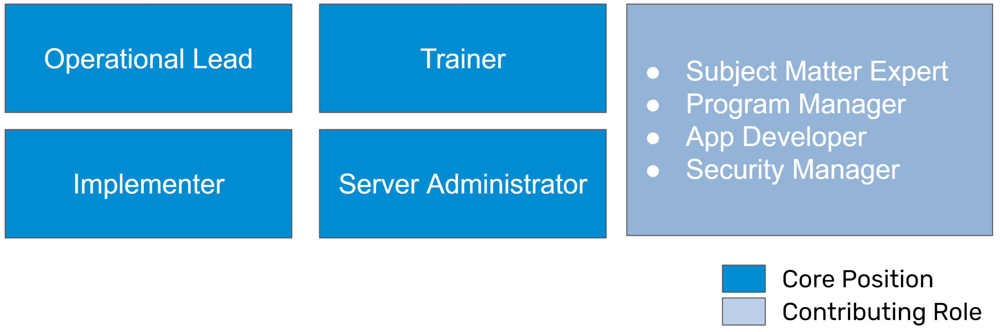

# DHIS2 Core Teams

A DHIS2 core team is a local team that manages the planning, implementation and evaluation of DHIS2. They are meant to be a group of staff that have a mixed set of competencies in order to handle various challenges involved with their local DHIS2 implementation. As a mix of skills are needed, a DHIS2 core team does not have to necessarily consist of only government staff; staff from other institutions such as universities or local companies can also be part of the core team; however, ideally everyone part of the core team should be located in the country they are supporting. 

These core teams are ideally formed at the beginning of a DHIS2 implementation so they can learn various DHIS2 skills over time; however there will likely be cases that are more fluid, either with the core team being formed months or years after DHIS2 is implemented, or members of the core team changing due to various circumstances surrounding retention of staff.

A DHIS2 core team can vary in size depending on the context (it may be 1-2 members in a very small country with a simple implementation, and can be much larger within a complex implementation and/or large country). There are a couple key roles that we will identify within the core team approach however. 

## The DHIS2 core team framework

The DHIS2 Core team framework defines a set of principles that are meant to define long-term, sustainable capacity building processes
Emphasis on local ownership. It is a pivot from previous messaging around DHIS2, as we see specialization of roles bearing an increased amount of weight across a number of implementations:

- Understands that DHIS2 skills have become increasingly complex
- Recognizes that foundational skills are necessary for success
- Is not a shortcut or quick fix, but a method to build sustainable capacity, expertise and leadership over a prolonged period of time
- Requires strategic investment in local staff
- Moves away from the idea that “anyone can do anything” in DHIS2

## Core Team Structure

As part of the DHIS2 core team, we recommend 4 core positions and 4 contributing roles. Additional optional roles can also be added based on local context.

> **Important**
>
>We define ***core positions*** as those that are required positions within the core team. Excluding the server administrator, we recommend these core positions are dedicated, full time roles focused on DHIS2 (however, we recognize this may not always be possible in practice). The server administrator is identified as a core role due to its importance within the implementation, but may not necessarily be a full time role depending on the infrastructure being managed.
>
>***Contributing roles*** are roles that provide external input to the DHIS2 core team on an as needed basis. These are roles that are required to ensure success within the DHIS2 implementation, but are not dedicated, full time roles focused only on DHIS2. We see these roles as providing input when needed while still performing their other duties. 
>
>***Optional roles*** are roles that may be needed depending on the specific use cases within an implementation. These roles often include specialized skills, such as developing custom middle ware or building and maintaining custom applications. 
>
>It should be noted that the specific language used to define these roles may vary. Match these role names to specific roles identified in country.

## Role Descriptions

### Core Positions

**Operational Lead**

This role leads the DHIS2 core team, and has a project management role for DHIS2 projects and initiatives (which can also be delegated to core team members). He/she has the overall responsibility for coordinating with internal and external groups and partners on activities related to DHIS2. It is critical that this role/team is responsible for facilitating and maintaining an integrated DHIS2 serving routine information needs of the whole ministry/health government and not just a sub-system, e.g. parallel system for health statistics. 

**Implementer**

Implementers are responsible for operationalizing and scaling up the DHIS2 configuration. Implementers work with all other members within the DHIS2 technical team and across departments and programmes within the Ministry in order to understand a system’s requirements and develop solutions to meet them. This includes adding additional functionality, integrating new programs, modifying routines to incorporate DHIS2 and supporting users to use the application. 

Implementers will also consider how DHIS2 fits into a health information architecture, focusing on what type of information needs to be exchanged and what type of work processes or agreements may facilitate this exchange. Processes and procedures to maintain the integrity of the DHIS2 system to operate efficiently over an extended time period, including upgrade procedures, managing metadata and users, etc. are often also drafted and enforced by the implementation team.

> **Note**
>
>The implementer role is subdivided into 2 roles: Implementer - Program and Implementer - Technical 
>
>This reflects the need of this role to have some flexibility. The ***Implementer - Program*** role will spend more time on gathering requirements, creating documentation and focusing on the use the system. The ***Implementer - Technical*** role will spend more time on managing the DHIS2 configuration - creating datasets, tracker programs and managing user access controls as examples.

**Trainer**

A trainer supports the training of staff to use DHIS2 by developing training material, documentation and job aids for use within the implementation, and provide both training of trainers and direct end-user training.  Trainers can operate at various levels, focusing on fundamental concepts including data-entry, to more advanced concepts such as data use or system administration. 

Training and support staff will work to establish mechanisms for providing end-user support on DHIS2, coordinating with local DHIS2 administrators at the sub-national level. These sub-national level administrators will serve as the first point of contact for end users, whilst the training and support staff of the national core team will support issues that can not be resolved locally.

Training and user support staff will also need expertise in DHIS2, which necessitates some overlap in the tasks with staff working on DHIS2 design, customisation and system administration. While experts in fields such as adult education or teaching can support creating structures for training, a person experienced in the use of the DHIS2 concept being discussed will need to be involved in the training of said concept.

> **Note**
>
>The trainer role is subdivided into 3 roles/responsibilities: Trainer - Program, Trainer - Technical and Trainer - General
>
>The ***Trainer - Program*** role will spend more time on performing training activities related to use of DHIS2 (or its surrounding processes such as documentation, standard operating procedures, etc.). The ***Trainer - Technical*** role will spend more time on training activities related to configuring DHIS2. ***Trainer - General*** is not a role but a responsibility, and relates to the trainer's ability to create learning content and work with complementary learning tools (for example, image and video editing software, learning management systems, etc.).

**Server Administrator**

A server administrator is responsible for managing both the server(s) and DHIS2 instances that contribute to an implementation or configuration. For the server, this includes security updates, performance monitoring, documentation and implementation of backup strategies. For the DHIS2 instances this can include DHIS2 version upgrades, managing the instances (creating, moving, removing instances), monitoring their uptime, etc. This role is crucial to ensuring DHIS2 can be accessed and is working well. A server administrator may do all of these tasks directly or work with a service provider to perform these activities jointly.

**Server Administrator**

A server administrator is responsible for managing both the server(s) and DHIS2 instances that contribute to an implementation or configuration. For the server, this includes security updates, performance monitoring, documentation and implementation of backup strategies. For the DHIS2 instances this can include DHIS2 version upgrades, managing the instances (creating, moving, removing instances), monitoring their uptime, etc. This role is crucial to ensuring DHIS2 can be accessed and is working well. A server administrator may do all of these tasks directly or work with a service provider to perform these activities jointly.

### Contributing Roles

**Subject Matter Expert**

Subject matter experts have experience on how services are delivered within various settings (schools, health facilities, etc.) and understand the types of information that is required to effectively monitor and evaluate a program's delivery. They will be able to assist with the review and analysis of data, support the implementation of indicator frameworks and contribute to identifying and defining the types of analysis the program should routinely have access to.

**Program Manager**

Program Manager's coordinate various project's within the specific program they are responsible for. They are often responsible for the outcomes of these projects and for reporting progress directly within their organization (such as a government ministry). They have a broad understanding of their programs monitoring and evaluation needs, including the inputs and outputs required to manage the program effectively. Program manager's should work with the operational lead responsible for implementing DHIS2 in order to communicate their specific requirements. This can be one of their staff or a co-ordinating body, such as the Health Information Systems unit.

**Security Manager**

The security manager is meant to take care of identifying, addressing and managing security related matters within the organization and its stakeholders, specifically around availability, confidentiality and integrity of data, platform (software and infrastructure) and organization (data and infrastructure). The Security Manager must be able to influence decisions on security-related matters and therefore requires a good degree of autonomy. To effectively understand, analyze and defend an organization, visibility is important and therefore they should be involved in all conversations around confidentiality, integrity and availability as part of their scope of work.

This position is usually held on a senior level, as close as possible with the organization’s leadership team and on the same line of authority, working with and reporting to them.

**Data Scientist**

A data scientist is a professional who utilizes statistical analysis, machine learning, and programming skills to extract insights and knowledge from structured and unstructured data. They play a crucial role in helping organizations make data-driven decisions by analyzing complex data sets, developing predictive models, and visualizing data to communicate findings effectively.

They can support your organization in taking your DHIS2 data analysis to the next level, making concrete correlations and defining relationships between various policy interventions and their outcomes and effectiveness.

### Optional Roles

**App Developer**

App developer's extend the functionality of DHIS2 by creating custom apps that work within the DHIS2 platform to meet specific requirements that are best suited to a custom solution. App developer's will often work with an implementer in order to understand these requirements in greater detail.

**Integration Expert**

An integration expert is a developer focused on ensuring data exchange, interoperability and/or integration can occur between different systems. They will understand common frameworks and technologies for facilitating these operations and be able to create various tools to allow these exchanges to happen.  

## Required Competencies

The DHIS2 core team requires a mix of various skills in order to help support the implementation. This can include:

- DHIS2 design and systems analysis
- DHIS2 customization, architecture, and metadata, including interoperability
- DHIS2 implementation ‘best practices’, including interacting with users and stakeholders for harmonization of forms, indicators and implementation strategy
- Data use and design of relevant dashboards and reports
- Planning and conducting ToT (training of trainers) and end-user training
- Project management and administration

When working with a core team, it is important to note that ***you are not*** looking to build a team with these skills from the beginning; however you are looking to identify individuals that are able to grow into the roles that have been identified. 