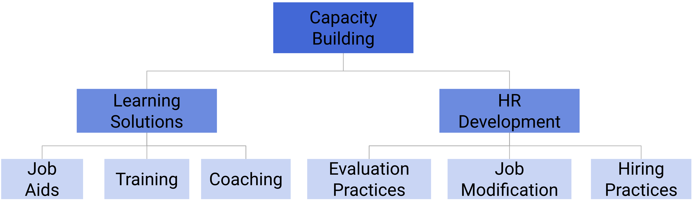

# Assessing your core team and creating learning pathways

## Capacity Building Strategies

We can divide capacity building strategies into two components:

1. Learning Solutions
2. HR (Human Resources) Development

For a detailed breakdown on developing learning solutions, please refer to this [link](https://docs.dhis2.org/en/topics/training-docs/general-guidance/capacity-building-considerations.html#developing-new-learning-solutions)

For HR Development, our main focus is on building the core team as we have outlined here in the [Core Positions](#core-positions) section. In order to identify members of the core team and create long-term strategies for developing their capacity, we suggest that a couple of complementary activities are performed.

1. Identification of roles and responsibilities based on the core team structure adopted in-country. This is to include the names of the individuals that will fulfill these roles.
2. A capacity building needs assessment. This assessment is meant to set a baseline for the skills currently possessed within the core team, as well as to identify what current gaps are in order to build long-term plans to address them.
3. A core team capacity building plan. The core team plan is meant to use the results of the core team needs assessment in order to build long-term development plans for each member of the core team. 

### Capacity Building Needs Assessment

The DHIS2 Capacity Building Needs Assessment is a tool developed to assess the capacity of each individual within a DHIS2 core team. The tool is meant to be modular and will need modification in order to make it work within specific contexts. An understanding of the DHIS2 technical areas and contributing skill sets is needed in order to optimize the use of this assessment tool. 

[Access the assessment](https://docs.google.com/forms/d/1dyh-Q7idHF0bJDrAbijP8PcYzszVl0BTa7bqIjjgra8/edit)

***Assessment Objectives***

1. To provide an overview of the strengths and gaps for each member of the DHIS2 core team
2. To identify specific DHIS2 skills for each member of the DHIS2 core team that need support for improvement
3. To provide inputs into an overall DHIS2 core team improvement plan

***Target Audience***

The target audience for the capacity building needs assessment are any countries that either have implemented DHIS2 already and are considering strengthening their DHIS2 core team, or any country that is considering implementing DHIS2 and wants to evaluate their current skills in order to identify which specific areas to focus capacity building initiatives around. 
 
***Assessment Process***

The DHIS2 capacity building needs assessment can be administered in 3 ways
1. Self-administered
2. Guided with a supervisor
3. Guided with a 3rd party

A table, outlining the pros and cons of each method, can be found below:

| Method                   | Pros                                                                                                               | Cons                                              | Additional considerations                        |
|--------------------------|--------------------------------------------------------------------------------------------------------------------|---------------------------------------------------|--------------------------------------------------|
| Self-Administration      | Quickest method                                                                                                    | Can lead to bias & misinterpretation of questions | Whole team needs to be on-board with the process |
| Guided with a supervisor | Can review core capacity gaps immediately after the assessment                                                     | Can lead to misuse of information                 | Supervisors need detailed knowledge of DHIS2     |
| Guided with a 3rd party  | Understands all of the components of the assessment. Can review core capacity gaps immediately after the assessment | Can be costly                                     | Requires a strong relationship with the MoH      |

The technical areas are separated into the 5 core roles identified in the DHIS2 core team planning guidance:

1. Operational Lead
2. Implementer - Program
3. Implementer - Technical
4. Trainer
5. Server Administrator

For each role, skill categories are listed and can be rated on a score of 0-3 (or not applicable)

The template itself is meant to serve as reference "menu" of skill categories. These skill categories will need to be further divided into granular areas that may need improvement. As an example, within the role "Implementer - Technical," a skill category to be assessed is "Create and manage user-based access controls." This category contains references to user authorities, user roles, user groups and metadata and data sharing. The person assessed may be well versed in creating user roles and users, but may not be able to adequately manage the application of sharing settings; therefore this particular skill would be the area of focus within this category. 

> **Important**
>
> The assessment recognizes that a person may be performing multiple roles. When they fill in the assessment, they should fill in all of the sections that apply to them. If there is a role that they are currently not performing, but there is a vision for them to perform that role in the near future; they should also fill in those sections as well.

***Results and Long-Term Planning***

Once the individual skills assessments have been performed, a capacity building plan based on these assessments needs to be created. An accompanying template for the capacity building plan is available and can be referred to for further instruction on how to design the plan based on inputs from this assessment.

Ideally, these assessments results should be used to provide individual staff members a long-term view on how gaps in their capacity will be addressed over time. 

By completing the assessment and plan in a structured manner, it also offers an opportunity to present to partners for funding and technical assistance, where additional effort on considering the needs within your setting have been taken into account in order to develop a long-term, strategic plan to deal with capacity gaps that may exist in your setting.

A detailed system of scoring, both by individual topic area as well as per technical area, are produced as a result of the assessment. ***This scoring is not meant to be used to assess performance.*** It is meant to establish a baseline of skills, identify priority areas for intervention and to be used to measure the effectiveness of capacity building interventions in the future (ie. the scores are the baseline; when the assessment is performed again you can compare them with your previous scores).

### Core Team Capacity Building Plan

The core team capacity building plan is meant to take the inputs from the capacity building needs assessment and formulate a long-term strategy for addressing gaps that have been identified as a result of the assessment. The core team capacity building plan by its nature takes a modular approach to building capacity. This allows you to modify the assessment to meet your needs, understanding that the positions identified as a priority will vary depending on local context. 

[Access the template](https://docs.google.com/document/d/1Y97RPHXguY6CWn-FwBxdj_6mG0Xj9DHiniL9aiQGsDA/edit?usp=sharing)

This document describes the capacity building plan for strengthening the/establishing a local DHIS2 core team. This includes the different roles defined within the core team and a budgeted overview of capacity building activities for the specific staff members filling these roles. The activities and budget should be maintained in a separate spreadsheet, and it is recommended it is updated at least annually.

In addition, this document has sample terms of reference (ToRs) for each of the positions identified in the [Core Positions](#core-positions) section of this document.

With the results of the capacity building needs assessment available, you should be able to identify the types of training activities that each member of the core team needs to receive. This can be a mix of remote and in-person training events, on-the-job coaching, academy attendance, etc. The main goal is to address the gaps you have identified in a structured fashion, removing priority gaps over an extended period of time as they are filled within the core team's skill set. 

The core team capacity building plan is also meant to be budgeted. This means that the costs for each activity that has been identified is outlined clearly. Ideally, a funding source will also be identified; however if it is not the case where funding is available for these activities, the plan can be used to advocate for long-term capacity building with interested stakeholders. 

### DHIS2 Learning Paths

As additional inputs into the Core Team Capacity Building plan, a learning path tool has been developed. This tool uses the roles identified in the DHIS2 core team and provides recommended academy courses that they can take. Note that this does not mean a person may need to take all of the academies identified via the tool, but it is likely they would benefit from learning the skills associated with each of these academies. While they can attend an academy to learn these skills, they can also use online resources or receive training locally. 

[Access the learning paths tool here](https://dhis2.org/academy/learning-paths/)

## Resources Summary

1. [Description of learning solutions](https://docs.dhis2.org/en/topics/training-docs/general-guidance/capacity-building-considerations.html#developing-new-learning-solutions)
2. [Capacity building needs assessment](https://docs.google.com/forms/d/1dyh-Q7idHF0bJDrAbijP8PcYzszVl0BTa7bqIjjgra8/edit)
3. [Core team capacity building plan](https://docs.google.com/document/d/1Y97RPHXguY6CWn-FwBxdj_6mG0Xj9DHiniL9aiQGsDA/edit?usp=sharing)
4. [DHIS2 Learning Paths](https://dhis2.org/academy/learning-paths/)