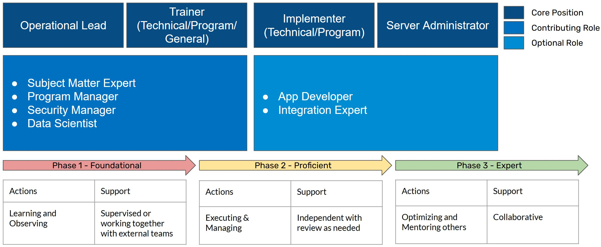
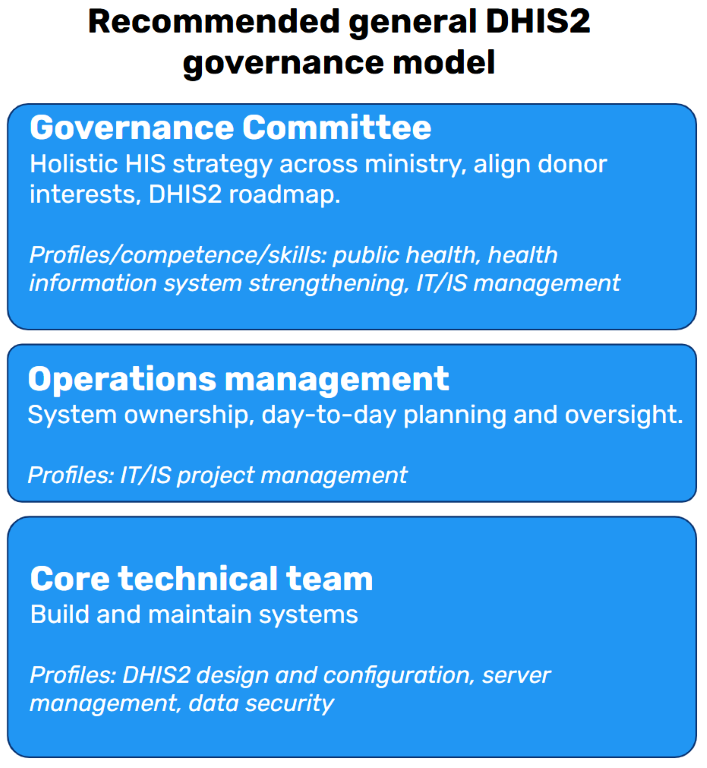
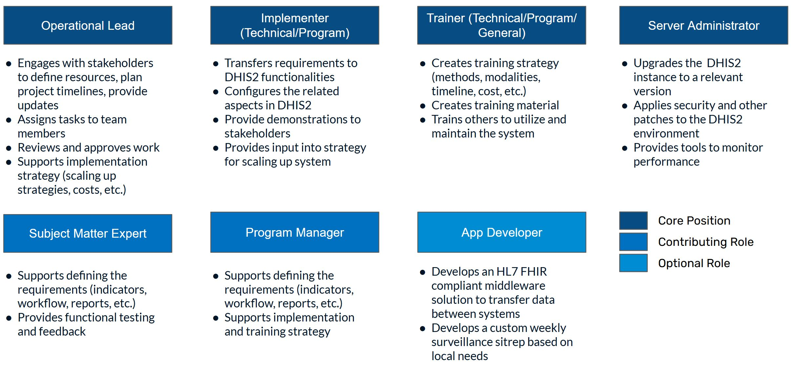

# Core Team Routines

Once you have formed your core team, assessed them, and created learning paths to build the teams capacity, it is important to define how the team will work together. If you require external TA, routines should also be in place so they are supporting the outcomes of your internal team to improve while also providing you with high-quality implementation support. 

## Phases of the Core Team

The core team should be viewed through the lense of 3 different phases:

1. Foundational
2. Proficient
3. Expert

> **Important**
>
>The team does not necessarily have to start at the lowest phase; this will be different for every implementation and will be defined based on the core team assessment. 
>
>It is also important to note that different team members may fall under different phases. For example, you may have an expert on the team mentoring members in the lower phases. 

**1. Foundational**

The team is focused on acquiring new skills and receiving advice from others. 

- They operate under close supervision; relying on instruction and learning aids to carry out key tasks.
- Key Focus: Accuracy over speed; building a reliable knowledge base.
- Support Needs: Requires active mentorship and frequent check-ins to ensure alignment with best practices. 
  
**2. Proficient**

The team has moved from acquisition to application. They can handle the vast majority of standard tasks independently and have developed the intuition to troubleshoot common problems.

- Capable of managing end-to-end workflows; can identify and resolve routine errors independently.
- Key Focus: Consistency, efficiency, and expanding their scope of responsibility.
- Support Needs: Occasional guidance on non-standard or complex use cases and/or functionality; peer-review required for high-stakes deliverables.

**3. Expert** 

The team is now at a point where there is significant skill and leadership within. While they are the primary authority in their domain, they recognize that problems can requires a specialized review or systemic-level intervention from time to time. 

- Acts as a subject matter expert (SME); mentors others; handles complex use-cases and scenarios.
- Key Focus: Strategy, optimization, and edge-case resolution.
- Support Needs: Collaborative escalation. They may require "Tier 3" or architectural support for systemic issues or highly specialized technical roadblocks that fall outside standard operational guidelines.

These phases are summarized in the diagram below, referencing the core team roles along with potential phases the team will follow over time

*Figure 1: Core team roles with phases*

## Governance

A full detailed breakdown of governance as it relates to DHIS2 can be found [here](https://docs.google.com/presentation/d/1hY7KG0axxENjBfXVf3hRTHKMyIrDgWAQVUNJ2CkPzS0/edit?slide=id.g123699e563d_0_163#slide=id.g123699e563d_0_163); however it is important to note the core teams role within this structure. 

From the figure below, we can see where the DHIS2 core team fits within this broader governance structure.

***Figure 2: DHIS2 Governance Structure***

The main idea here is that, while the DHIS2 core team will have its own set of expertise and skill, it is meant to work collaboratively within a system where high level strategic decisions have been made, rather then independently deciding what/how/when certain use cases or functionality should be introduced and scaled up. 

In particular, the ***operational lead*** will serve as a bridge, defining day-to-day operations and liasing regularly with, ideally, a cross-ministry committee bringing key health information stakeholders together to make joint decisions.

While the core team is part of a broader governance structure that looks after the entirety of the DHIS2 implementation, the team itself should have some built in routines that allow it to function as an independent unit on tasks that are agreed and assigned to it. The operational lead will often serve in a capacity to lead this team; however as the team matures and skill develops, others in the team should have clear mechanisms to provide insight and their own expertise in guiding the teams direction. 

We can divide this direction into different sub-groups in which the team should develop a shared understanding of.

1. Technical
2. Strategic
3. Organizational 

### Technical

On the technical side, as the team matures, they may identify multiple ways to implement a solution in DHIS2. Additionally,  new functionality will be introduced over time allowing solutions to be implemented in previously challenging ways. For this reason, it is important not to define strict criteria in how solutions can be implemented. Instead, a focus on following specific procedures across the team, in which everyone working on the system can follow, should be created. These can include the use of technical standards such as HL7 FHIR and ICD11; but should also include practicalites like naming metadata, assigning user permissions, using development instances, etc. For more details, please review the [Standard Operating Procedure (SOP)](https://docs.dhis2.org/en/implement/maintenance-and-use/standard-operating-procedures.html) section of our documentation. This ideally form the foundation of a strong set of best practices that the the entire team can follow.

> **Important**
>
> When you are first getting started, particularly when the team is in the early phases of coming together, you may rely on external support. This external support can help you draft these procedures if best practices are not yet well understood internally. As a group, you should ensure that all external partners that are supporting you follow these procedures. This becomes important as, over time, systems can be over run with unnecessary elements making it difficult to manage and use. This is discussed more in our section on [metadata integrity and quality](https://docs.dhis2.org/en/implement/maintenance-and-use/metadata-maintenance/metadata-integrity-and-quality.html). While it is often difficult to entirely avoid this, having your team and the external partners supporting them follow procedures to prevent the system from becoming difficult to use can save a great deal of frustration, time and money in the long run.

### Strategic

As it is recommended that a core team be part of a broader governance structure, decisions made by the core team regarding what to implement, which resources are available and managing projects against realistic timelines ideally becomes a shared responsibility. In reality, this can be difficult to achieve. In the early stages of the core teams formation in particular, the team will likely be pushed to implement complex solutions, often in parrallel, with a small amount of resources. 

It then becomes important for the core team to put thought and effort into carefully selecting which projects to implement so resources and timelines can be managed effectively. In particular, it should be noted that your particular DHIS2 implementation may not be able to absorb a particularly complex use case, or that DHIS2 may not even be the appropriate system to use to implement a given solution. Please review the sections on [planning and  budgeting](https://docs.dhis2.org/en/implement/implementing-dhis2/planning-and-budgeting.html) along with the [tracker implementation guidance](https://docs.dhis2.org/en/implement/tracker-implementation/is-my-project-ready-for-tracker.html) in particular for more information on evaluating your system and planning strategic areas for implementing within the core team.

### Organizational

Each time the core team works on a project, they will have distinct responsibilities. This is not to say a core team  members responsibilities will not overlap (for example, the implementers and trainer's may be the same people); however it is necessary to define clear roles for each member of the team. Using an example, we can outline how the team can work together. Note that, in this example, *core, contributing and optional roles* are all part of implementing this solution. Depending on the phase in which this the team currently is in, external support may be needed to support or fill in these various roles. 

> **Example**
>
> In this example, the core team is tasked with implementing a new tracker program for surveillance. It is meant to encompass all notifiable diseases within the country. The tracker program in DHIS2 will require integration with the with lab system in the country, retrieving various information including the type of test performed along with its test result depending on the disease in question. HL7 FHIR must be used to exchange this data. 

***Figure 3: Core team roles with assigned responsibilities***

Reviewing ***Figure 3*** above, we can see there are many moving pieces when implementing a solution in DHIS2. Ensuring these roles are well defined beforehand so that core team members can stay on task is necessary in order to achieve a desired outcome. Complexity will ultimately increase if there are many interested stakeholders as well as external TA being provided, and it will be up to the ***operational lead*** along with the governance committee to manage these additional inputs in such cases. 