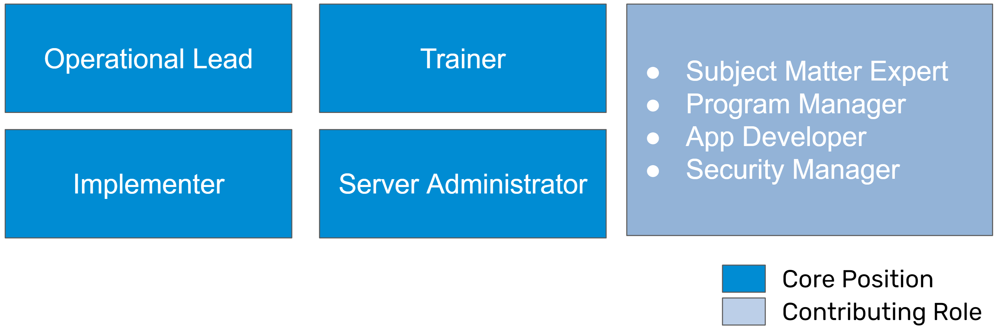
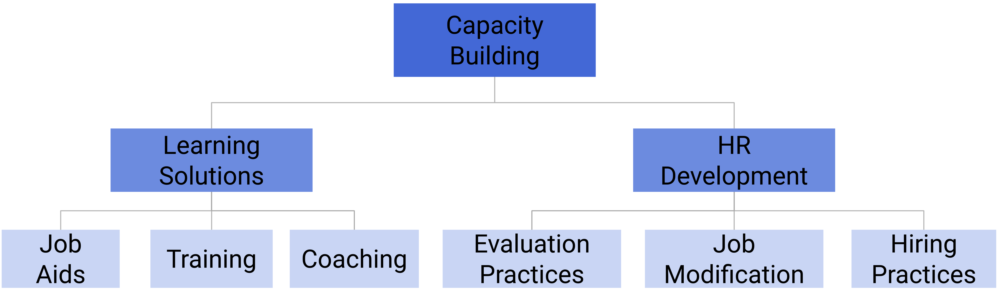

# DHIS2 Core Teams

A DHIS2 core team is a local team that manages the planning, implementation and evaluation of DHIS2. They are meant to be a group of staff that have a mixed set of competencies in order to handle various challenges involved with their local DHIS2 implementation. As a mix of skills are needed, a DHIS2 core team does not have to necessarily consist of only government staff; staff from other institutions such as universities or local companies can also be part of the core team; however, ideally everyone part of the core team should be located in the country they are supporting. 

These core teams are ideally formed at the beginning of a DHIS2 implementation so they can learn various DHIS2 skills over time; however there will likely be cases that are more fluid, either with the core team being formed months or years after DHIS2 is implemented, or members of the core team changing due to various circumstances surrounding retention of staff.

A DHIS2 core team can vary in size depending on the context (it may be 1-2 members in a very small country with a simple implementation, and can be much larger within a complex implementation and/or large country). There are a couple key roles that we will identify within the core team approach however. 

## The DHIS2 core team framework

The DHIS2 Core team framework defines a set of principles that are meant to define long-term, sustainable capacity building processes
Emphasis on local ownership. It is a pivot from previous messaging around DHIS2, as we see specialization of roles bearing an increased amount of weight across a number of implementations:

- Understands that DHIS2 skills have become increasingly complex
- Recognizes that foundational skills are necessary for success
- Is not a shortcut or quick fix, but a method to build sustainable capacity, expertise and leadership over a prolonged period of time
- Requires strategic investment in local staff
- Moves away from the idea that “anyone can do anything” in DHIS2

## Core Team Structure

As part of the DHIS2 core team, we recommend 4 core positions and 4 contributing roles. Additional optional roles can also be added based on local context.

> **Important**
>
>We define ***core positions*** as those that are required positions within the core team. Excluding the server administrator, we recommend these core positions are dedicated, full time roles focused on DHIS2 (however, we recognize this may not always be possible in practice). The server administrator is identified as a core role due to its importance within the implementation, but may not necessarily be a full time role depending on the infrastructure being managed.
>
>***Contributing roles*** are roles that provide external input to the DHIS2 core team on an as needed basis. These are roles that are required to ensure success within the DHIS2 implementation, but are not dedicated, full time roles focused only on DHIS2. We see these roles as providing input when needed while still performing their other duties. 
>
>It should be noted that the specific language used to define these roles may vary. Match these role names to specific roles identified in country.

## Role Descriptions

### Core Positions

**Operational Lead**

This role leads the DHIS2 core team, and has a project management role for DHIS2 projects and initiatives (which can also be delegated to core team members). He/she has the overall responsibility for coordinating with internal and external groups and partners on activities related to DHIS2. It is critical that this role/team is responsible for facilitating and maintaining an integrated DHIS2 serving routine information needs of the whole ministry/health government and not just a sub-system, e.g. parallel system for health statistics. 

**Implementer**

Implementers are responsible for operationalizing and scaling up the DHIS2 configuration. Implementers work with all other members within the DHIS2 technical team and across departments and programmes within the Ministry in order to understand a system’s requirements and develop solutions to meet them. This includes adding additional functionality, integrating new programs, modifying routines to incorporate DHIS2 and supporting users to use the application. 

Implementers will also consider how DHIS2 fits into a health information architecture, focusing on what type of information needs to be exchanged and what type of work processes or agreements may facilitate this exchange. Processes and procedures to maintain the integrity of the DHIS2 system to operate efficiently over an extended time period, including upgrade procedures, managing metadata and users, etc. are often also drafted and enforced by the implementation team.

> **Note**
>
>The implementer role is subdivided into 2 roles: 
>- Implementer - Program and 
>- Implementer - Technical 
>
>This reflects the need of this role to have some flexibility. The ***Implementer - Program*** role will spend more time on gathering requirements, creating documentation and focusing on the use the system. The ***Implementer - Technical*** role will spend more time on managing the DHIS2 configuration - creating datasets, tracker programs and managing user access controls as examples.

**Trainer**

A trainer supports the training of staff to use DHIS2 by developing training material, documentation and job aids for use within the implementation, and provide both training of trainers and direct end-user training.  Trainers can operate at various levels, focusing on fundamental concepts including data-entry, to more advanced concepts such as data use or system administration. 

Training and support staff will work to establish mechanisms for providing end-user support on DHIS2, coordinating with local DHIS2 administrators at the sub-national level. These sub-national level administrators will serve as the first point of contact for end users, whilst the training and support staff of the national core team will support issues that can not be resolved locally.

Training and user support staff will also need expertise in DHIS2, which necessitates some overlap in the tasks with staff working on DHIS2 design, customisation and system administration. While experts in fields such as adult education or teaching can support creating structures for training, a person experienced in the use of the DHIS2 concept being discussed will need to be involved in the training of said concept.

> **Note**
>
>The trainer role is subdivided into 3 roles/responsibilities: 
>- Trainer - Program 
>- Trainer - Technical and 
>- Trainer - General
>
>The ***Trainer - Program*** role will spend more time on performing training activities related to use of DHIS2 (or its surrounding processes such as documentation, standard operating procedures, etc.). The ***Trainer - Technical*** role will spend more time on training activities related to configuring DHIS2. ***Trainer - General*** is not a role but a responsibility, and relates to the trainer's ability to create learning content and work with complementary learning tools (for example, image and video editing software, learning management systems, etc.).

**Integration Expert**

An integration expert is a developer focused on ensuring data exchange, interoperability and/or integration can occur between different systems. They will understand common frameworks and technologies for facilitating these operations and be able to create various tools to allow these exchanges to happen.  

**Server Administrator**

A server administrator is responsible for managing both the server(s) and DHIS2 instances that contribute to an implementation or configuration. For the server, this includes security updates, performance monitoring, documentation and implementation of backup strategies. For the DHIS2 instances this can include DHIS2 version upgrades, managing the instances (creating, moving, removing instances), monitoring their uptime, etc. This role is crucial to ensuring DHIS2 can be accessed and is working well. A server administrator may do all of these tasks directly or work with a service provider to perform these activities jointly.

### Contributing Roles

**Subject Matter Expert**

Subject matter experts have experience on how services are delivered within various settings (schools, health facilities, etc.) and understand the types of information that is required to effectively monitor and evaluate a program's delivery. They will be able to assist with the review and analysis of data, support the implementation of indicator frameworks and contribute to identifying and defining the types of analysis the program should routinely have access to.

**Program Manager**

Program Manager's coordinate various project's within the specific program they are responsible for. They are often responsible for the outcomes of these projects and for reporting progress directly within their organization (such as a government ministry). They have a broad understanding of their programs monitoring and evaluation needs, including the inputs and outputs required to manage the program effectively. Program manager's should work with the operational lead responsible for implementing DHIS2 in order to communicate their specific requirements. This can be one of their staff or a co-ordinating body, such as the Health Information Systems unit.

**Security Manager**

The security manager is meant to take care of identifying, addressing and managing security related matters within the organization and its stakeholders, specifically around availability, confidentiality and integrity of data, platform (software and infrastructure) and organization (data and infrastructure). The Security Manager must be able to influence decisions on security-related matters and therefore requires a good degree of autonomy. To effectively understand, analyze and defend an organization, visibility is important and therefore they should be involved in all conversations around confidentiality, integrity and availability as part of their scope of work.

This position is usually held on a senior level, as close as possible with the organization’s leadership team and on the same line of authority, working with and reporting to them.

**Data Scientist**

A data scientist is a professional who utilizes statistical analysis, machine learning, and programming skills to extract insights and knowledge from structured and unstructured data. They play a crucial role in helping organizations make data-driven decisions by analyzing complex data sets, developing predictive models, and visualizing data to communicate findings effectively.

They can support your organization in taking your DHIS2 data analysis to the next level, making concrete correlations and defining relationships between various policy interventions and their outcomes and effectiveness.

### Optional Roles

**App Developer**

App developer's extend the functionality of DHIS2 by creating custom apps that work within the DHIS2 platform to meet specific requirements that are best suited to a custom solution. App developer's will often work with an implementer in order to understand these requirements in greater detail.

**Security Manager**

A security expert will understand both legal frameworks/international best practices for protecting information as well as various procedures and technical methods that can be used to implement these frameworks and practices. Ideally, they should inform practices such as the creation and sharing of users, storage of data, etc. and provide information on country-wide policies related to security. 

## Required Competencies

The DHIS2 core team requires a mix of various skills in order to help support the implementation. This can include:

- DHIS2 design and systems analysis
- DHIS2 customization, architecture, and metadata, including interoperability
- DHIS2 implementation ‘best practices’, including interacting with users and stakeholders for harmonization of forms, indicators and implementation strategy
- Data use and design of relevant dashboards and reports
- Planning and conducting ToT (training of trainers) and end-user training
- Project management and administration

When working with a core team, it is important to note that ***you are not*** looking to build a team with these skills from the beginning; however you are looking to identify individuals that are able to grow into the roles that have been identified. 

## Core Team Principles

When forming a core team, a couple core principles need to be considered. 

- These positions are not empty titles. The team must be ready to get their hands dirty and do the work! Appointments should not be adversely influenced by motivations external to making the system operate as effectively as possible. It is noted this is challenging in practice; however this is what is needed to have the system work well over time.
- The person(s) within these positions may not be competent in all of the necessary skills from the beginning, but must be motivated to learn how DHIS2 works and/or how it can be managed. That being said, some pre-requisite skills are needed and are discussed further in the section [Forming a Core Team](#forming-a-core-team). 
- The team itself will need long-term, dedicated support in order to invest in their own learning and support a sustainable implementation
- The team is often involved in training of trainer (ToT) activities as both participants and instructors
The HISP network will always be there, but over time the support should decrease

The idea behind a core team is that it should be involved in all DHIS2 operations, even those it does not necessarily have a high degree of competency in yet. This means that external TA, consultants, etc. should always work with the core team when implementing a solution in DHIS2, not just build the solution and provide it to the organization like is seen in a typical client/provider relationship. 

If the country partners with external TA, the external TA should support the core team by:

- Performing any new activity (configuration, training, planning, etc.) together with the core team. Depending on the competency of the team this can mean anything from providing high level explanations to detailed breakdowns and guidance
- In the beginning, this can add significant time to the implementation of projects as the core team is learning many new skills. These means some additional costs may need to be accounted for initially in order to give enough time for anyone giving external assistance to also explain items and work with the core team.
- External support can be there to support tasks initially, but over time core tasks should be driven, managed and implemented by the core team. HISPs and other TA can act as advanced support in these cases. 

## Forming a Core Team

When forming a core team, it is essential to remember that building this team will take time. A long-term approach and vision is therefore needed. In the past, approaches for DHIS2 personnel to learn a little bit of everything quickly were promoted; and this was a valid approach at the time -- however we now see the need for more specialization as requirements have become more complex and the skills associated with managing a DHIS2 implementation have evolved. 

As an example, let us review the implementer role identified in the [Core Positions](#core-positions) section. This role has a wide variety of skills that they need to be knowledgeable on, including being able to perform complex DHIS2 configuration, manage the import of metadata and data and documenting and explaining the configuration in a way that makes sense to a variety of stakeholders as examples. 

It is unlikely you will find someone with these specific skills right from the start; however what you are looking for when building the core team is to be able to identify individuals with the right mix of experience and foundational skills to build on so they can mature into specific roles over time. 

Note that it is now increasingly important that the individuals selected for these roles ***have a relevant amount of background education and experience*** to be able to succeed in the role they are selected for. If someone has never used Linux, then becoming a server admin may be out of reach. If they have no public health knowledge, then asking them to contribute to the analysis of data or data use in general may not be a natural fit. The point that is being emphasized here is that ***it should not be considered that anyone can be successful in any DHIS2 role.*** You must consider identifying the right people with the right background knowledge and building specific skills on top of this foundational knowledge. If they do not have this foundational knowledge, then it may require a person obtains some specific education or training prior to learning different DHIS2 related skills. 

We suggest the team is built in the following order

1. Operational Lead
2. Implementer
3. Trainer
4. Server Administrator

> **Note**
>
> In the case of an implementation that is resource constrained, there is 1 core position that is recommended initially, the operational lead. This person should be based in country. As time progresses, ideally other core positions are filled when/where possible. The second position that should be filled is that of the implementer. From here, you will be able to branch out to additional roles as necessary. Contributing roles are still recommended and are likely to be external in this scenario, at least at the beginning.

### Key Principles

- The core team should be based in the country when possible; however different contexts may require an alternative approach
- The core team should be in a position to meet and collaborate with the Ministries they are working with on a routine basis.
- Ideally the team is composed of internal Ministry staff with the required DHIS2 skills and experience to maintain a high quality DHIS2 system; however it is possible to include non-Ministry staff in the core team depending on the situation
- Often there is a need during a transition period to have external DHIS2 experts either seconded to the government or part of a virtual DHIS2 core team managed by the government, while based outside the ministry, e.g. in a local University or NGO. This can be more intense during the formation of the core team and hopefully decreases as time goes in. These relationships can be maintained over the long-term however so these agencies can act as advanced support when needed.
- The key principle is to secure support and resources for implementing a long-term vision, making sure the roles and responsibilities in this team are clearly defined and that the work is funded long-term

## Sustaining the Core Team

- In terms of financing these roles, while support can come from partners, it is vital that the core team is independent of this financing to generally strengthen the health information systems in the country. If a project is over and the team no has to dissolve as a result, this will adversely affect the DHIS2 implementation, as the core team is a long-term, strategic investment. 
- Ideally funding is allocated in annual budgets - regular support through the ministries routine budgets will strengthen the sustainability of the team. If not there should ideally be an exit strategy with this in mind. 
- Solid governance should direct the work of the core team; the priorities of key strategic tasks should not come from the core team itself, but from a governing body that oversees DHIS2 priorities. The core team should also report to a similar body.
- The core team should strive towards harmonised, integrated systems. This may require some understanding and alignment with local HIS architectures and strategies along with a review of global best practices to drive this forward in a sustainable manner.
- It is important that the team has strong backing from the authorities, but at the same time freedom to hire based on competence and merit and not personal connections. 

### Retention Strategies

A significant challenge lies with retaining core team staff, particularly after they have gained skills that may be valuable in the broader global development market. In many Ministries in particular, it can be difficult to retain skilled staff that may be sought out by other agencies as they increase their expertise. It is often not possible in these scenarios to match salaries; therefore retention strategies centre around providing opportunities for personal growth. This can include:

- Participation in DHIS2 academies
- Becoming a mentor
- Becoming a regional expert in a specialized field
- Academic scholarships (masters and PhD)

Within these areas additional opportunities, such as traveling for conferences and trainings as either a participant or facilitator, can also present itself as funding opportunities become available. 

## Capacity Building Strategies

We can divide capacity building strategies into two components:

1. Learning Solutions
2. HR (Human Resources) Development

For a detailed breakdown on developing learning solutions, please refer to this [link](https://docs.dhis2.org/en/topics/training-docs/general-guidance/capacity-building-considerations.html#developing-new-learning-solutions)

For HR Development, our main focus is on building the core team as we have outlined here in the [Core Positions](#core-positions) section. In order to identify members of the core team and create long-term strategies for developing their capacity, we suggest that a couple of complementary activities are performed.

1. Identification of roles and responsibilities based on the core team structure adopted in-country. This is to include the names of the individuals that will fulfill these roles.
2. A capacity building needs assessment. This assessment is meant to set a baseline for the skills currently possessed within the core team, as well as to identify what current gaps are in order to build long-term plans to address them.
3. A core team capacity building plan. The core team plan is meant to use the results of the core team needs assessment in order to build long-term development plans for each member of the core team. 

### Capacity Building Needs Assessment

The DHIS2 Capacity Building Needs Assessment is a tool developed to assess the capacity of each individual within a DHIS2 core team. The tool is meant to be modular and will need modification in order to make it work within specific contexts. An understanding of the DHIS2 technical areas and contributing skillsets is needed in order to optimize the use of this assessment tool. 

[Access the assessment](https://docs.google.com/forms/d/1dyh-Q7idHF0bJDrAbijP8PcYzszVl0BTa7bqIjjgra8/edit)

***Assessment Objectives***

1. To provide an overview of the strengths and gaps for each member of the DHIS2 core team
2. To identify specific DHIS2 skills for each member of the DHIS2 core team that need support for improvement
3. To provide inputs into an overall DHIS2 core team improvement plan

***Target Audience***

The target audience for the capacity building needs assessment are any countries that either have implemented DHIS2 already and are considering strengthening their DHIS2 core team, or any country that is considering implementing DHIS2 and wants to evaluate their current skills in order to identify which specific areas to focus capacity building initiatives around. 
 
***Assessment Process***

The DHIS2 capacity building needs assessment can be administered in 3 ways
1. Self-administered
2. Via a supervisor sitting down with each team member
3. Via an external party that understands DHIS2 well sitting down with each team member

A table, outlining the pros and cons of each method, can be found below:

The technical areas are separated into the 5 core roles identified in the DHIS2 core team planning guidance:

1. Operational Lead
2. Implementer - Program
3. Implementer - Technical
4. Trainer
5. Server Administrator

For each role, skill categories are listed and can be rated on a score of 0-3 (or not applicable)

The template itself is meant to serve as reference "menu" of skill categories. These skill categories will need to be further divided into granular areas that may need improvement. As an example, within the role "Implementer - Technical," a skill category to be assessed is "Create and manage user-based access controls." This category contains references to user authorities, user roles, user groups and metadata and data sharing. The person assessed may be well versed in creating user roles and users, but may not be able to adequately manage the application of sharing settings; therefore this particular skill would be the area of focus within this category. 

> **Important**
>
> The assessment recognizes that a person may be performing multiple roles. When they fill in the assessment, they should fill in all of the sections that apply to them. If there is a role that they are currently not performing, but there is a vision for them to perform that role in the near future; they should also fill in those sections as well.

***Results and Long-Term Planning***

Once the individual skills assessments have been performed, a capacity building plan based on these assessments needs to be created. An accompanying template for the capacity building plan is available and can be referred to for further instruction on how to design the plan based on inputs from this assessment.

Ideally, these assessments results should be used to provide individual staff members a long-term view on how gaps in their capacity will be addressed over time. 

By completing the assessment and plan in a structured manner, it also offers an opportunity to present to partners for funding and technical assistance, where additional effort on considering the needs within your setting have been taken into account in order to develop a long-term, strategic plan to deal with capacity gaps that may exist in your setting.

A detailed system of scoring, both by individual topic area as well as per technical area, are produced as a result of the assessment. ***This scoring is not meant to be used to assess performance.*** It is meant to establish a baseline of skills, identify priority areas for intervention and to be used to measure the effectiveness of capacity building interventions in the future (ie. the scores are the baseline; when the assessment is performed again you can compare them with your previous scores).

### Core Team Capacity Building Plan

The core team capacity building plan is meant to take the inputs from the capacity building needs assessment and formulate a long-term strategy for addressing gaps that have been identified as a result of the assessment. The core team capacity building plan by its nature takes a modular approach to building capacity. This allows you to modify the assessment to meet your needs, understanding that the positions identified as a priority will vary depending on local context. 

[Access the template](https://docs.google.com/document/d/1Y97RPHXguY6CWn-FwBxdj_6mG0Xj9DHiniL9aiQGsDA/edit?usp=sharing)

This document describes the capacity building plan for strengthening the/establishing a local DHIS2 core team. This includes the different roles defined within the core team and a budgeted overview of capacity building activities for the specific staff members filling these roles. The activities and budget should be maintained in a separate spreadsheet, and it is recommended it is updated at least annually.

In addition, this document has sample terms of reference (ToRs) for each of the positions identified in the [Core Positions](#core-positions) section of this document.

With the results of the capacity building needs assessment available, you should be able to identify the types of training activities that each member of the core team needs to receive. This can be a mix of remote and in-person training events, on-the-job coaching, academy attendance, etc. The main goal is to address the gaps you have identified in a structured fashion, removing priority gaps over an extended period of time as they are filled within the core team's skill set. 

The core team capacity building plan is also meant to be budgeted. This means that the costs for each activity that has been identified is outlined clearly. Ideally, a funding source will also be identified; however if it is not the case where funding is available for these activities, the plan can be used to advocate for long-term capacity building with interested stakeholders. 

### DHIS2 Learning Paths

As additional inputs into the Core Team Capacity Building plan, a learning path tool has been developed. This tool uses the roles identified in the DHIS2 core team and provides recommended academy courses that they can take. Note that this does not mean a person may need to take all of the academies identified via the tool, but it is likely they would benefit from learning the skills associated with each of these academies. While they can attend an academy to learn these skills, they can also use online resources or receive training locally. 

[Access the learning paths tool here](https://dhis2.org/academy/learning-paths/)

## Resources Summary

1. [Description of learning solutions](https://docs.dhis2.org/en/topics/training-docs/general-guidance/capacity-building-considerations.html#developing-new-learning-solutions)
2. [Capacity building needs assessment](https://docs.google.com/forms/d/1dyh-Q7idHF0bJDrAbijP8PcYzszVl0BTa7bqIjjgra8/edit)
3. [Core team capacity building plan](https://docs.google.com/document/d/1Y97RPHXguY6CWn-FwBxdj_6mG0Xj9DHiniL9aiQGsDA/edit?usp=sharing)
4. [DHIS2 Learning Paths](https://dhis2.org/academy/learning-paths/)
