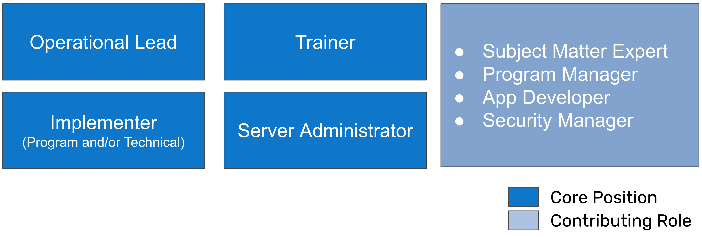

# DHIS2 Core Teams

A DHIS2 core team is a local team that manages the planning, implementation and evaluation of DHIS2. They are meant to be a group of staff that have a mixed set of competencies in order to handle various challenges involved with their local DHIS2 implementation. As a mix of skills are needed, a DHIS2 core team does not have to necessarily consist of only government staff; staff from other institutions such as universities or local companies can also be part of the core team; however, ideally everyone part of the core team should be located in the country they are supporting. 

These core teams are ideally formed at the beginning of a DHIS2 implementation so they can learn various DHIS2 skills over time; however there will likely be cases that are more fluid, either with the core team being formed months or years after DHIS2 is implemented, or members of the core team changing due to various circumstances surrounding retention of staff.

A DHIS2 core team can vary in size depending on the context (it may be 1-2 members in a very small country, and can be much larger in country with a very large population). There are a couple key roles that we will identify within the core team approach however. 

## Core Team Structure

As part of the DHIS2 core team, we recommend 4 core positions and 4 contributing roles. 

It is suggested that core positions are dedicated, full time roles working on the DHIS2 implementation; while the contributing roles are meant to contribute to DHIS2 development in addition to their other routine tasks.

We suggest the team is built in the following order

1. Operational Lead
2. Implementer
3. Trainer
4. Server Administrator

> **Note**
>
> In the case of an implementation that is resource constrained, there is 1 core position that is recommended initially, the operational lead. This person should be based in country. As time progresses, ideally other core positions are filled when/where possible. The second position that should be filled is that of the implementer. From here, you will be able to branch out to additional roles as necessary. Contributing roles are still recommended and are likely to be external in this scenario.

## Role Descriptions

### Core Positions

=== "Operational Lead"

The DHIS2 operational lead leads the DHIS2 core team, and has a  project management role for DHIS2 projects and initiatives (which can also be delegated to core team members). He/she has the overall responsibility for coordinating with internal and external groups and partners on activities related to DHIS2. It is critical that this role/team is responsible for facilitating and maintaining an integrated DHIS2 serving routine information needs of the whole ministry/health government and not just a sub-system, e.g. parallel system for health statistics. 

=== "Implementer"

Implementers are responsible for operationalizing and scaling up the DHIS2 configuration. Implementers work with all other members within the DHIS2 technical team and across departments and programmes within the Ministry in order to understand a system’s requirements and develop solutions to meet them. This includes adding additional functionality, integrating new programs, modifying routines to incorporate DHIS2 and supporting users to use the application. 

Implementers will also consider how DHIS2 fits into a health information architecture, focusing on what type of information needs to be exchanged and what type of work processes or agreements may facilitate this exchange. Processes and procedures to maintain the integrity of the DHIS2 system to operate efficiently over an extended time period, including upgrade procedures, managing metadata and users, etc. are often also drafted by the implementation team.

=== "Trainer"

A trainer supports the training of staff to use DHIS2 by developing training material, documentation and job aids for use within the implementation, and provide both training of trainers and direct end-user training.  Trainers can operate at various levels, focusing on fundamental concepts including data-entry, to more advanced concepts such as data use or system administration. 

Training and support staff will work to establish mechanisms for providing end-user support on DHIS2, coordinating with local DHIS2 administrators at the sub-national level. These sub-national level administrators will serve as the first point of contact for end users, whilst the training and support staff of the national core team will support issues that can not be resolved locally.

Training and user support staff will also need expertise in DHIS2, which necessitates some overlap in the tasks with staff working on DHIS2 design, customisation and system administration. While experts in fields such as adult education or teaching can support creating structures for training, a person experienced in the use of the DHIS2 concept being discussed will need to be involved in the training of said concept.

=== "Server Administrator"

A server administrator is responsible for managing both the server(s) and DHIS2 instances that contribute to an implementation or configuration. For the server, this includes security updates, performance monitoring, documentation and implementation of backup strategies. For the DHIS2 instances this can include DHIS2 version upgrades, managing the instances (creating, moving, removing instances), monitoring their uptime, etc. This role is crucial to ensuring DHIS2 can be accessed and is working well. A server administrator may do all of these tasks directly or work with a service provider to perform these activities jointly.

### Contributing Positions

## Required Competencies

The DHIS2 core team requires a mix of various skills in order to help support the implementation. This can include:

- DHIS2 design and systems analysis
- DHIS2 customization, architecture, and metadata, including interoperability
- DHIS2 implementation ‘best practices’, including interacting with users and stakeholders for harmonization of forms, indicators and implementation strategy
- Data use and design of relevant dashboards and reports
- Planning and conducting ToT (training of trainers) and end-user training
- Project management and administration

When working with a core team, it is important to note that you are not looking to build a team with these skills from the beginning; however you are looking to identify individuals that are able to grow into the roles that have been identified. 

## Core Team Principles

## Forming a Core Team

## Retention Strategies

## Capacity Building Strategies

## Core Team Needs Assessment

## Core Team Plan

### DHIS2 Learning Paths
