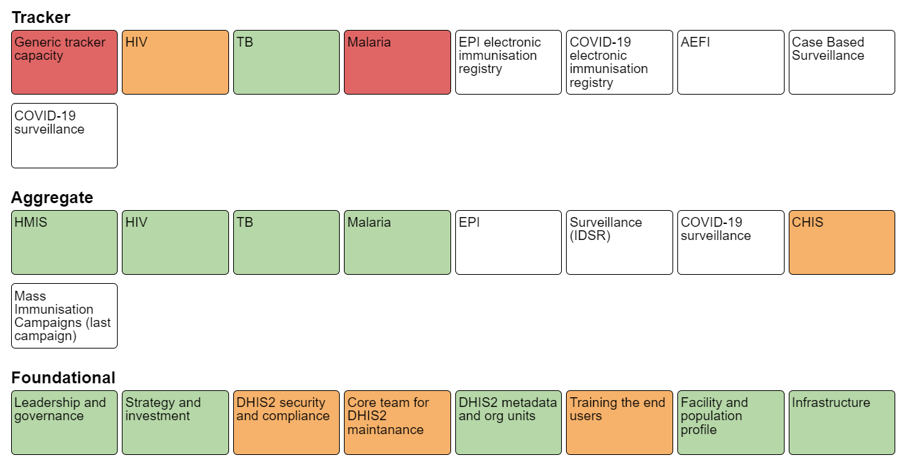

# High level planning and budgeting guidance for sustainable DHIS2 systems { #planning-budgeting }

Proper planning and budgeting is an important activity in order to sustain a good system design over time, making sure the DHIS2 system develops in a healthy way, is updated frequently, responds to user needs and operates according to rules and regulations. This includes making sure the system responds to basic user needs in terms of data collection, data quality checks, data analysis and presentations, and remains relevant to all key health programs and at all levels of the health system (from facility/community to national level).

A strong DHIS2 implementation that is sustainable over time and adaptable to changing programmatic needs requires a number of cross cutting functions to be in place and well-functioning. We refer to these as foundational domains, which includes areas such as leadership and governance, security and infrastructure. These are important building blocks in order to support both aggregated and individual level data systems. The figure below illustrates the foundations for DHIS2 - these will all require financial support internally and often externally in the form of organisational strengthening and capacity building, technical assistance and local operational costs.

The purpose of this section is to provide guidance on planning and budgeting DHIS2 strengthening activities, with a particular emphasis on the foundational domains. It is not straightforward to provide clear costing guidance in each domain in this model, since the particular activities will vary greatly depending on the current state or maturity of the domain, the capacity of the local core DHIS2 team, and local cost levels. Because it is not possible to provide generic costing estimates in real value (dollars), we instead describe the cost categories and factors to consider when making a budget.

## DHIS2 Maturity Profile Tool

A tool is available ("DHIS2 Maturity Profile") to map the maturity of a DHIS2 implementation in a country in order to help identify areas in need of strengthening. The assessment tool is structured as a set of questions per each domain shown in the figure above, and will give a snapshot of the current maturity of DHIS2 in a country. This assessment is intended to be performed regularly in collaboration between DHIS2 experts/HISP groups and Ministries of Health and results in a summary report with recommendations.

The DHIS2 maturity profile supports countries to;

- measure and understand if the country is progressing on health information system strengthening, beyond summarising the activities performed
- encourage investments in core DHIS2 capacity (i.e. foundational areas) that contributes to a sustainable HIS supporting health programs
- align across investments/donor interventions
- assist in planning DHIS2 implementation and strengthening activities
- identify areas in need of more in depth evaluation or monitoring

The DHIS2 Maturity Profile is an important tool for building and costing coordinated and sustainable DHIS2 plans in a country.

## Budgeting considerations

Costs can roughly be divided in;

- Local personnel costs (DHIS2 core team and capacity building)
- Technical assistance costs (from HISP groups or others, including fees and travel)
- Local operational costs (e.g. training costs, devices, hosting, support to end users)

The largest investments in DHIS2 strengthening are associated with building and maintaining local capacity in the country, but for new implementations there are costs to help get started, support the initial configuration and training etc.

Costs are generally highest when getting started and first scaling up DHIS2. Certain costs are one-off, meaning they will only occur once, such as gathering requirements and configuring the initial system, but most costs are recurring each year. For example, an initial investment in purchasing computers or mobile devices must be backed up with a long term plan to replace a certain number of these devices every year, perpetually. Similarly, there needs to be a plan and budget for training of new staff, refresher training, server hosting, regular security audits, and ongoing system maintenance and improvements etc. It is very important to ensure that there is sustainable funding over time to support the system.

Depending on the state of the core team or maturity of the country, the nature of assistance will change. In an early stage of an implementation, there may be need for external support even for relatively routine or basic activities. As a local capacity and a strong core team is developed, most activities can be handled internally. Outside expertise will then primarily be in the form of providing advice and capacity building in new areas or for new functionality.

General budgeting guidance are located [here](https://docs.google.com/spreadsheets/d/104-c0m0CZ6Wcfm8vCAJ-8Os-5GzZRSaT/edit#gid=1341095871). Note that the guidance mostly covers one-off costs, but we recommend that countries plan longer term and factor in costs that are recurring.

## Planning and budgeting the strengthening of foundational areas

Next is a description of the foundations of DHIS2, what you need to think about when it comes to budgeting and planning and some relevant resources. Further down you will find guidance to plan, budget and build/maintain both aggregate and tracker programs

### Leadership and governance

Solid governance and coordination mechanisms are crucial to support an HMIS that is coherent across programs, up to date and well maintained. An aim is to have a cross-ministry steering committee bringing together key health information stakeholders across the ministry responsible for high-level strategic decisions relating to content and scope for DHIS2. The group should have representatives from across all major health programs, with both technical and public health leadership, and should be given a clear mandate. Additionally, a technical working group can meet more frequently and have the mandate to make decisions of practical nature.

While this is not a quick fix in any country, guidance and technical assistance from HISP groups on how to establish and run such coordinating mechanisms can be useful. They can also help prepare or participate in such meetings.

#### Resources

- Links to guidance/implementation guidance
- Generic Scope of Work

### Strategy and investment

Strategy and coordinated investments means having digital strategies which address areas where DHIS2 is used, such as HMIS (aggregated data), surveillance, case based surveillance and community based data. Countries should conduct regular HMIS needs assessments and develop costed work plans. The sustainability of HMIS funding and investments over time also points to a mature DHIS2 implementation. This includes planning for DHIS2 strengthening, but also planning for the personnel needs in the whole "data-chain", such as health personnel with time and capacity to work with data, district health information officers, statisticians etc.

There might be costs associated with assistance to support this strategy development work, conducting needs assessment and writing costed plans.

#### Resources

- Links to guidance/implementation guidance

### DHIS2 security and compliance

DHIS2 implementations need to align with local legislation and be protected from breaches and data loss. This requires personnel with the right skills, well-defined policies, auditing procedures and key security tools and documents that are used routinely. There should be a person responsible for implementing security policy covering DHIS2, at a senior level within the Ministyr of Health. If this responsibility is not defined, or the person is not sufficiently senior, overseeing and implementing other key elements of a security framework is difficult. Related to this, both *data* and *technical* ownership should be clearly established and defined for the DHIS2 system. The *data owner* is the person or unit responsible for data backup and retention policy, and access control approvals. The *technical owner* is responsible for the infrastructure, change management and system maintenance.

There should be a document describing the security policy for the DHIS2 system, which outlines processes and procedures for implementing and managing security at server, instance and data level. A regular (e.g. yearly) internal and/or external audit of the DHIS2 system should be conducted that verifies adherence of the implementation against this defined policy. The audit should also specifically test the server and the DHIS2 instances for security issues.

Finally, key security tools and documents should be available and used as needed. Examples of such tools and documents include risk registers, threat model, privacy impact assessment, non-disclosure agreements, and incident response plans.

Security and compliance is to a large extent about policies and delegation of responsibility, and costing of this domain should take into account resources to allow relevant staff to take on the necessary responsibility. When policies and key tools and documents are not in place, budgeting for technical assistance to develop and implement these may be needed. Similarly, there should be a plan and budget for regular audits.

#### Resources

- [Security considerations when implementing DHIS2](#security-considerations)
- Generic Scope of Work

### Core team for DHIS2 maintenance

The vital part to any DHIS2 implementation is to identify a DHIS2 core team that will be central to the DHIS2 rollout and responsible for the day-to-day maintenance and further development of the national DHIS2 system. This team will be a critical component in the long term sustainability of the system and to ensure local ownership. This team needs to be established at the beginning of the DHIS2 implementation and lead the local customization process.

A team can either be funded through secondments of staff to MoH from external organisations or as annual salaries if existing staff exist in the MoH (across programs and departments). One can incentivise participation and long term involvement through regular core team meetings e.g. configuration workshops, coordination meetings, training events (in country and regional DHIS2 academies) for the core team.

Key to building capacity of the core DHIS2 team is that all technical assistance activities are planned in a way that allows the local team to be involved and learn from outside expertise as far as practically possible. Building the core team is therefore a cross-cutting concern that should be considered when outside expertise is involved to strengthen any of the foundational areas.

Costs will include salaries or secondments, workshops with travel and per diems, technical assistance to provide capacity building support, as well as DHIS2 academy sponsorships.

#### Resources

- Link to description of roles/competencies needed in core team
- Capacity building plan example
- Generic Scope of Work

### DHIS2 metadata and org units

Metadata quality refers to the quality of the DHIS2 configuration, such as how data elements, indicators, reporting forms (data sets) and analytical outputs (dashboards) are configured. For example, whether there are misconfigurations that can potentially lead to system errors, or if the metadata is organised in a way that facilitates use of information by end users.

The quality of the organisational unit hierarchy (e.g. districts, health facilities refers to whether they are completely represented in DHIS2, including both public, private and non-governmental sectors, and whether they are kept up to date with associated information.

While maintenance of metadata and orgunits is in general an integral part of the ongoing work of the core DHIS2 team, it will often be necessary to plan for metadata assessments and cleaning exercises from time to time. Outside technical assistance may be required to support this, as addressing certain types of issues can be very technically challenging.

#### Resources

- [Guidance on metadata quality and integrity](#metadata-integrity-and-quality)
- [Metadata assessment tool](https://github.com/dhis2/metadata-assessment)
- Generic Scope of Work

### Training end users

Training of end users of DHIS2 at all levels of the health system is a critical component of a successful DHIS2 implementation. Countries should have a plan for systematically training new staff, providing refresher training on a regular basis, and addressing training gaps on data entry, validation and use. A common problem and an area with large potential is local level data use. Thorough investigations and documentation of local data use practices in selected districts is needed to support this. Based on these investigations, next steps can be adaptation of analysis tools to local practices and data policies (incl. denominator data at each level), design and configuration of local level data analysis products and distributing these tools to other districts.

HISP groups typically conduct Training of Trainers (TOT) to help countries run their own end-user training. Costs associated with training are both TA and travel for HISP groups, and local costs to host and contact cascaded training, such as venue, trainers, training materials, per diems, travel etc.

#### Resources

- Links to guidance/implementation guidance
- Generic Scope of Work

### Facility and population profile

In order to ensure overviews of the target population and the available services and personnel it is important with complete and up to date population and facility data. When CRVS data (e.g. births and deaths) is available and complete, this could be linked to DHIS2 and used to calculate denominators. Population data (denominators) from census data is more typically used in DHIS2, and should be available for use at subnational level. Census estimates may not be available or appropriate at all relevant levels used in DHIS2, and there should therefore be SOPs and routines making projections available for local use.

A facility list or register should be available in DHIS2 that covers all relevant facilities, including community units where those are reporting. This list should be kept up to date, which in most cases means that there is a process for involving the sub-national level (e.g. district) in the facility list maintenance. Human Resource data (workforce) should also be linked to facilities, with details on the type and number of staff kept up to date on a regular basis.

In addition to the ongoing staff requirements to keep this information updated and relevant in DHIS2, the main cost items is technical assistance to integrate the relevant types of data into DHIS2, either as a one-time operation or by establishing some form of interoperability with CRVS, master facility list or human resource systems.

#### Resources

- Links to guidance/implementation guidance
- Generic Scope of Work

### Infrastructure

Sufficient infrastructure means that the system is being hosted in a secure and stable environment (either on-premise or cloud based), that there are enough working devices for end users, and that ICT support is available and needed. Different projects and programs will have different infrastructure needs; some countries enter the data at facility level on paper and digitise it at district level, while others run full scale digital implementations with personal devices for health workers. In addition to the actual infrastructure there are associated costs such as mobile device management and device inventory.

There are many different options for hosting an online system, both in terms of where to put the server (e.g. in-house vs. cloud) and who to manage the server (e.g. in-house vs. outsourced). Server and hosting alternatives need to be critically examined with regards to capacity, infrastructural constraints, legal frameworks, security and confidentiality issues. These decisions may need to be revisited at least annually as server complexity, data types (e.g. aggregate vs. patient) and local capacity may change over time. It is important to budget for device replacement as devices eventually will break down or get lost.

#### Resources

- [Overview of deployment strategies](#deployment-strategies)
- [DHIS2 server installation tools and guide (draft)](https://github.com/bobjolliffe/dhis2-tools-ng)
- Generic Scope of Work

### Improving or implementing a new programme/data set - aggregate data

The maturity of an aggregate DHIS2 implementation can be measured by looking at metrics such as reporting completeness, timeliness and consistency, whether there are available data use guidelines or forums, and job descriptions for staff working with the data. Reviews of data collection tools, indicators and data use products are also needed at regular intervals, and the data collection tools should generally be aligned with current international (e.g. WHO) standards within the health area. Improving some of these can require training of the core team or end users or technical assistance with DHIS2 configuration.

Expanding the scope of the DHIS2 implementation into new health areas or domains with aggregate data collection requires careful consideration of status and maturity of the foundational domains. Adding new domains, e.g. inclusion of additional health programmes, disease surveillance or community-level reporting (CHIS), puts additional demand on the foundation areas. If the foundational areas are already weak, the likelihood that the expansion will not be successful increases.

In general, the foundational domains should all be at minimum acceptable level before additional aggregate domains are implemented, i.e. scoring at least "Early progress" when using the Maturity Profile tool. When planning and budgeting implementation of new aggregate domains, it is critically important that the plans also provide for strengthening the foundational areas that are in need of improvement. It is important to keep in mind that even foundational areas that have previously been performing well may be negatively affected by additions of new aggregate reporting, and that this needs to be compensated for in the implementation plan. For example, a server/hosting arrangement that was previously sufficient may no longer be appropriate if hundreds of new users are introduced, and the model for end user training that works well for facility level users may no longer be appropriate if reporting from the community level is introduced.

There are different approaches to incorporating a new health domain into DHIS2. When DHIS2 is being introduced as a data collection tool, this can be done on the basis of an existing information flow and using existing primary data collection tools (e.g. paper registers and forms), or as part of a revision to the overall reporting system. Potentially, global metadata configuration packages may be used for parts of this process. Furthermore, another system may be used for data collection, and integrated in DHIS2 through an interoperability solution. These different scenarios have implications for the planning and budgeting. In general, a project to introduce new health areas into DHIS2 will require orientation meetings, a requirements gathering process, DHIS2 configuration, testing and training. In addition there are local costs associated with devices, salaries, training etc for the staff as described above.

#### Resources

- [WHO Health Data Toolkit](https://dhis2.org/who/)
- [Metadata packages](https://dhis2.org/metadata/)
- [CHIS implementation guide](https://docs.dhis2.org/en/implement/chis-implementation/background.html)
- [Aggregate system design](#data-elements-and-custom-dimensions)
- Scope of Work

### Improving or implementing a new programme/data set - individual data/tracker

Developing and implementing individual level/tracker systems can be more complicated than working with aggregated data. The system design may require more work and testing as it touches on concrete work processes and typically involves larger data sets and business logic. Additionally, there are more users, meaning a bigger need for training, devices and support.

The same cost categories as for aggregate systems apply for building and improving tracker systems. However, developing and implementing a tracker program requires the DHIS2 core team to work closely with the clinical staff to understand and fit their work processes. It is more time consuming to design and build a good tracker program both for the implementers and for the key personnel that are providing the requirements. Whether building a tracker programme from scratch or adapting a metadata configuration package, close collaboration with end users is needed. The tracker should be field tested in a realistic setting and adjusted based on the results from the testing. Remote guidance and onsite technical assistance can help in this process.

A tracker program typically affects a lot of users, and training of trainers, end user training and devices and connectivity are large budget posts. It is therefore generally more costly to add a new tracker programme than a new data set for aggregate reporting. In most cases, a tracker program needs to be costed per program.

More resources on considerations for tracker can be found in the [tracker implementation guide](https://docs.dhis2.org/en/implement/tracker-implementation/introduction.html).

In general, the foundational domains should all be at minimum acceptable level before additional tracker programs are implemented, i.e. scoring at least "Early progress", and preferably "Adequate" when using the Maturity Profile tool. No foundational areas in the maturity profile tool should have the score "Not yet achieved" before starting a tracker program, and DHIS2 security and compliance should always be at least "Adequate". As with aggregate systems, when planning and budgeting implementation of new individual data domains, it is critically important that the plans also provide for strengthening the foundational areas that are in need of improvement. The project plan should clearly identify actions to improve foundational pieces of DHIS2 while planning for new tracker programs. It is also key that the attention to aggregate reporting is not lost as a country embarks on advanced tracker programs - often it is the same personnel working on both.

#### Resources

- [WHO Health Data Toolkit](https://dhis2.org/who/)
- [Metadata packages](https://dhis2.org/metadata/)
- [Tracker implementation guide](https://docs.dhis2.org/en/implement/tracker-implementation/introduction.html)
- Scope of Work
