# Planning upgrades

The entity responsible for the DHIS2 system (for example the HMIS unit in the Ministry of Health) should have a clear policy for system upgrades, and well as a written SOP describing *how* upgrades should be performed (see [SOP section](#upgrade_sop_templates)). Part of this should be to define a general upgrade calendar describing when key activities should typically take place (see [upgrade calendar section](#making_an_upgrade_calendar) below).

For each upgrade cycle, a detailed plan and timeline should be developed, tailored to the current context and specificities of the upgrade. One upgrade may require development work related to an integration or custom app which needs to be taken into account in the plan. Another upgrade might involve user-facing changes that require some level of training, which must perhaps be coordinated with other activities (i.e. quarterly review meetings where many users are already in one location).

At a high level, the upgrade plan should include these activities:

1. [Metadata cleaning](#upgrade-metadata_cleaning)
2. [Evaluating changes](#upgrade-evaluating_changes)
3. [Testing](#upgrade-testing)
4. [Make modifications](#upgrade-making_necessary_modifications)
5. [Communication and training](#upgrade-communication_and_training)
6. Apply upgrade to production

## Metadata cleaning { #upgrade-metadata_cleaning }

Over time, integrity issues might develop in the DHIS2 metadata as configurations are modified and amended. These integrity issues are not always immediately visible, but may cause problems during upgrades. For example, they might cause the automated database migrations to fail, or make fetching and rendering of metadata in apps to fail. It is therefore good practice to review and fix metadata integrity issues as a first step in any major version upgrade. The [metadata integrity]() section describes how this can be performed. In particular, issues highlighted by the metadata integrity check as *critical* or *severe* should be addressed before upgrading; integrity checks labelled *warning* do not typically cause problems for upgrades.

## Evaluating changes { #upgrade-evaluating_changes }

With a new release, it's important to thoroughly review the documentation associated with that release. The most straightforward place to access these is via [dhis2.org/downloads](https://dhis2.org/downloads), where each supported version is presented with links to the relevant documents:

* **release notes** give an overview of all changes in the release, with links to specific jira tickets and documentation sections where relevant. Each major, patch and hotfix release has a separate release note document.
* **upgrade notes** provide detailed technical information and requirements for the release and upgrade process, for example highlighting changes in support for java or postgresql versions, renaming of database tables or API endpoints that might affect custom script and integrations etc. This is critical for people planning and performing the actual upgrade on the server, but can also relevant for other DHIS2 core team members.
* **feature overview** is a permanent link to the release notes published with the major version (e.g. v40 or v41), which lists new functionality for that major version (include the release notes, which for patch and hotfix versions only lists minor changes and bugs that have been addressed).
* (TBC) **deprecated features** lists specific features, functionalities and API endpoints that have been deprecated in the major version.

For each upgrade, and in particular when upgrading to a new major version, these documents need to be reviewed by the core team supporting the upgrade process. If upgrading several versions (e.g. from 2.39 to v41), the documents for *each* release must be reviewed. Not all changes are relevant for every implementation, but those that are likely to be relevant for a particular system should be documented. Based on this, a plan can be made for how the changes will be managed.

It can be useful to consider changes as falling into three main categories, which need to be addressed in different ways:

1. **Changes directly affecting end users**
   
    This category include changes affecting how end users interact with the system. This can range from having to use an entirely new application for a core activity (i.e. from *Pivot Table* to *Data Visualizer* or *Tracker Capture* to *Capture*), to smaller changes to the user interface.

    It is important here to consider the type of user affected. A large majority of users typically use just a few apps apps for data entry and/or analysis, and changes affecting these users in many ways have the biggest impact and consequences. Other apps are used by a relatively small number of users, often limited to core national staff (e.g. in the Ministry of Health), and providing orientation or even additional training to this group is much cheaper and easier.

    The core team in charge of the update must consider the relevant changes in this category to consider the potential consequences and what sort of activities should be planned to ensure end users can continue to use the system with minimal interruption. It is always good practice to send a notification to all users prior to an upgrade informing them of when the upgrade will take place, what changes they will experience after the upgrade, and reminding them of how to get support if they face any problems. For smaller changes, this may be sufficient to address changes visible to end users.

    When there are larger changes, more comprehensive communication and training may be necessary. Examples of this include:

    * creating short manuals or job aids explaining the changes
    * organising webinars and/or providing video walk-throughs
    * in-person training or orientation, potentially piggybacking on other activities

    Which of these are relevant must be determined by the core team based on the changes and local circumstances.

2. **API or database schema changes**

    * Changes to the API or
    * any integrations or custom apps/tools that might be affected

    These changes require planning for validation and potentially revision of the affected apps and/or tools.

3. **Configuration changes**

    Configuration changes are changes introduced in an upgrade that requires the core team of administrators to make changes to the DHIS2 metadata configuration to ensure that the system continues to function as expected. These changes are thus not directly visible to end users, unless they are not addressed and the systems stops working. This type of change is not very common as it's most often handled automatically during the upgrade process, but it does happen occasionally.

## Testing { #upgrade-testing }

Testing is typically the most time-consuming and important step and is addressed in detail in a separate [Testing section]() that covers both.

## Making necessary modifications { #upgrade-making_necessary_modifications }

This involves acting on the required changes that have been identified in the evaluation phase. The modifications typically fall into two main categories:

* **Metadata modifications**: Changes to the DHIS2 configuration itself might be needed to ensure compatibility with the new version. As mentioned previously, it is quite rare that the necessary changes are not applied automatically during the upgrade process. The upgrade notes are a key source of exceptions, along with the outcome of the testing campaigns.

* **Apps and integrations**: Any custom apps, scripts, or integrations with other systems might need updating:
  * Reviewing and updating API calls to use the latest endpoints
  * Testing and updating custom apps to ensure compatibility
  * Modifying integration scripts to handle any changes in data structure
  * Updating authentication methods if security requirements have changed

It is particularly important to plan these modification phases well in advance if the effort needs to be procured from third-parties.

## Communication and training { #upgrade-communication_and_training }

Effective communication and training are critical to the success of major upgrades; when significant changes are being rolled out. This involves several key aspects:

**Communication strategy:**  

* Develop a clear communication plan that reaches all stakeholders
* Send formal notifications to the Ministry of Health and other key institutions
* Communicate planned downtime well in advance to all system users
* Create a timeline of changes and share it with affected users
* Establish clear channels for support and feedback during and after the upgrade

**User notifications should include:**  

* Dates and times of the planned upgrade
* Expected system downtime duration
* List of major changes users will experience
* New features or improvements they can expect
* Where to find help if they encounter issues
* Contact information for support

**Training considerations:**  

* Identify which user groups need training based on the changes
* Determine appropriate training approaches for different user groups:
  * In-person workshops for major changes
  * Online webinars for minor updates
  * Self-paced learning materials
  * Quick reference guides or job aids
* Consider budget implications for:
  * Training venue and logistics
  * Travel costs for trainers and participants
  * Development of training materials
  * Staff time for preparation and delivery

**Training resources:**  

* Create or update user manuals
* Develop quick reference guides for new features
* Record video tutorials for common tasks
* Prepare practical exercises for hands-on learning
* Consider developing a train-the-trainer program for sustainable capacity building

## Key considerations

Two important aspects to all of the above are cost and time. Both need to be carefully considered.

### Budgeting

When planning for an upgrade, several cost components need to be considered and budgeted for:

**Training and documentation costs:**

* Development of training materials and user guides
* Printing and distribution of documentation
* Venue and logistics for training sessions
* Per diem and travel costs for trainers and participants
* Staff time for preparing and conducting training

**Technical updates:**

* Developer time for updating custom apps and tools
* Modifications to existing integrations
* Updates to scripts and automated processes
* External consultant fees if required

**Testing resources:**

* Staff time for comprehensive testing
* Additional server resources during testing phase
* Tools or software needed for testing
* Time for beta testing program coordination

**Infrastructure:**

* Test server setup and maintenance
* Additional storage for testing environments
* Backup systems and storage
* Potential hardware upgrades if required by new version

**Support and contingency:**

* Help desk or support staff during transition
* Buffer for unexpected technical issues
* Emergency response team availability
* Rollback preparation if needed

### Making an upgrade calendar { #making_an_upgrade_calendar }

A well-structured upgrade calendar helps organize the upgrade process and ensure all stakeholders are aligned. Here's how to approach it:

**Annual planning:**

Upgrades are typically not a one-off event, but need to occur on a regular basis. In particular, you may want to:

* Schedule major upgrades during lower-activity periods
* Align with fiscal/reporting year requirements
* Consider national holidays and major health events
* Plan for regular patch updates throughout the year

**Timeline components:**

The timeline and intensity of activities varies significantly between major version upgrades and patch upgrades. Here's a comparison of typical phases and durations:

| Phase | Activities | Major Version | Patch Version |
|-------|------------|---------------|---------------|
| Planning | • Initial assessment • Stakeholder consultations • Resource allocation • Metadata cleaning | 1-2 months *Required* | 1-2 weeks *Routine* |
| Development | • Technical preparations • Update of custom solutions • Documentation updates | 1-3 months *Required* | 1-2 weeks *If needed* |
| Testing | • System testing • User acceptance testing • Beta testing program | 1-2 months *Required* | 1-2 weeks *Recommended* |
| Training | • Material preparation • Training sessions • User orientation | 1-2 months *Required* | *Usually not needed* |
| Implementation | • Final backups • Upgrade execution • Initial monitoring | 1-2 weeks *Required* | 1-2 days *Required* |
| Post-upgrade | • Enhanced support period • Performance monitoring • Issue resolution | 1 month *Required* | 1 week *Recommended* |

```mermaid
---
config:
  theme: default
  gantt:
    titleTopMargin: 15
    fontSize: 20
    sectionFontSize: 24
    barHeight: 40
    leftPadding: 250
    numberSectionStyles: 2
    gridLineStartPadding: 50
---
gantt
    title Upgrade Timeline Comparison (weeks)
    dateFormat  w
    axisFormat %W
    tickInterval 4weeks


    section Major Version
    Planning        :maj1, 2024-01-01, 2M
    Development     :maj2, after maj1, 3M
    Testing         :maj3, 2024-05-01, 2M
    Training        :maj4, 2024-06-01, 1M
    Implementation  :crit, maj5, after maj4, 2w
    Post-upgrade    :maj6, after maj5, 1M
    section Patch Version
    Planning        :pat1, 2024-01-01, 1w
    Development     :pat2, after pat1, 1w
    Testing         :pat3, after pat1, 2w
    Implementation  :crit, pat4, after pat3, 2d
    Post-upgrade    :pat5, after pat4, 1w
    section Hotfix
    Testing         :hot1, 2024-01-01, 1d
    Implementation  :crit, hot4, after hot1, 1d

```

> **Note**
> 
> * Major Version upgrades involve significant changes and require all phases to be executed thoroughly
> * Patch upgrades focus mainly on bug fixes and security updates, requiring less extensive preparation and testing. Risk, and duration, are increased if jumping several patch versions, and reduced if keeping to the latest patch version.
> * Hotfixes
> * Actual durations may vary based on system complexity, customizations, and available resources

**Tips for success:**  

* Build in buffer time for unexpected issues
* Consider dependencies between different phases
* Account for approval processes and administrative requirements
* Include regular checkpoints and progress reviews
* Plan for communication at each major milestone
