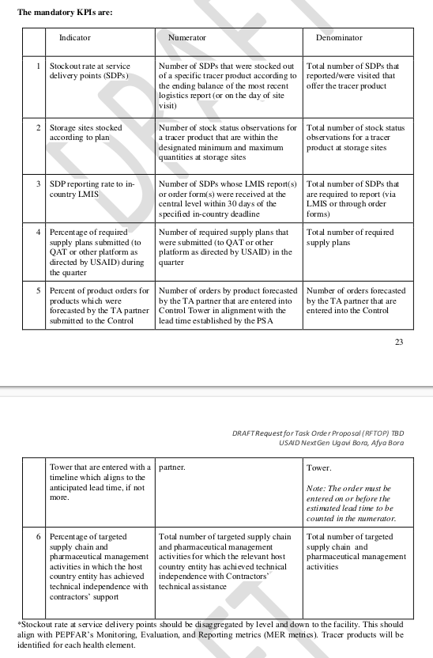
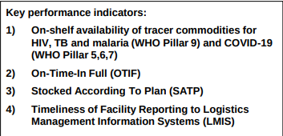
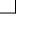
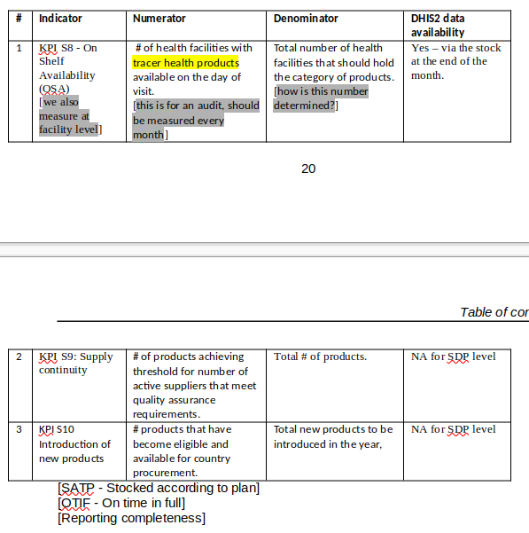
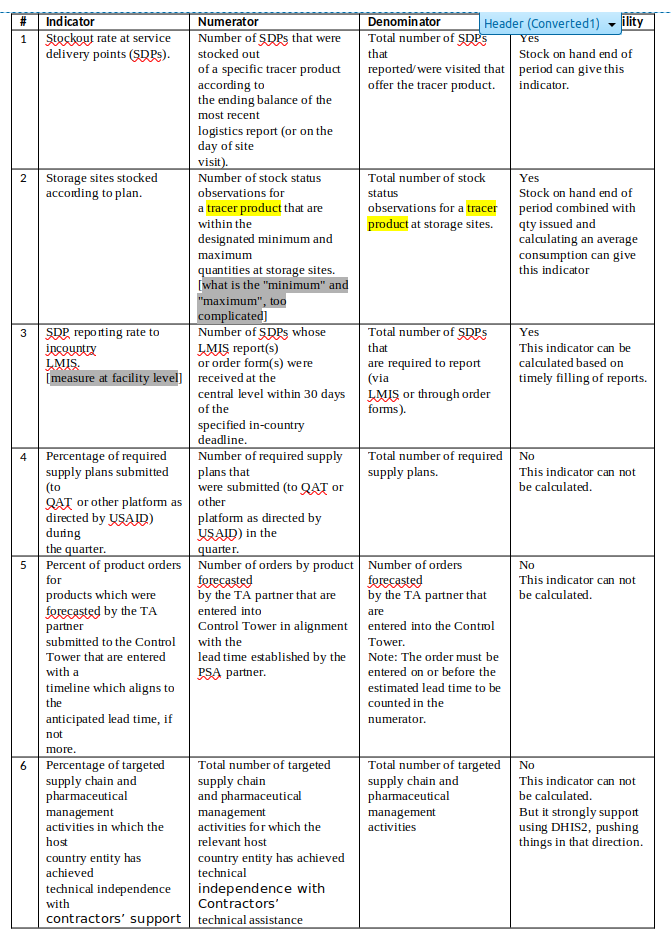

# DATA USE AND DATA QUALITY

##	LMIS data quality

xxx - To review
https://docs.dhis2.org/en/use/user-guides/dhis-core-version-240/collecting-data/data-quality.html
https://www.who.int/data/data-collection-tools
Manual for the DHIS2 quality tool
Improving Data Quality in Mobile Community-Based Health Information Systems
xxx
Text box:
The entities of all metrics is the quantity of an item (health care product) which are always measured in units of "Each" (single tablet, ampoule, compress) and never in unit packs.
xxx

### Introduction
While logistics and supply chain management is usually associated with the production, storage and distribution of (commercial) products, the associated data is far more important but usually as invisible as the roots of a tree. The physical flow (storage and distribution) of goods and consignments is by far the easiest task in logistics and supply chain management while the real, albeit less obvious, challenges are managing the complex flows of associated data: obtaining accurate as well as up-to-date logistics data in a timely way and sharing them throughout the supply network in real-time in order to allow decision-making which ensures that the required quantities of required healthcare products are in the places where they are required for providing healthcare services at the time the are required.
Trust between all actors and stakeholders are critical and indispensable for any effective and efficient supply network and the data is only as good as the trust the stakeholders have in it. Healthcare facility staff who do not trust supply managers will "inflate" order quantities hoping that this behaviour will increase supplies to them ("ration gaming"). On the other hand, if supply managers do not trust the facility level data they will resort to their own "estimates" for calculating replenishment orders which are always inferior to the systematic use of accurate and timely end-user data. Apart from continuously improving services, trust in data can be enhanced by freely and openly sharing data across supply networks, ideally in real-time.

The large number of different data quality dimensions are structured by UNICEF into the following four categories:
Access to data
- Data accessibility
Output quality dimensions
- Relevance
- Correctness
- Completeness
- Accuracy
- Reliability (reproducibility)
- Consistency
- Timeliness and punctuality
- Frequency
- Interpretability
- Comparability
Process quality dimensions
- Burden for data collectors
- Appropriateness of data sources
- Data collection process
- Transparency and documentation of data sources
Institutional quality
- Transparency and credibility
While conventional, paper-based LMIS data management systems require balancing various tradeoffs, such as the amount of data fields or data accuracy and timeliness, the use of digital data collection and management systems improve accuracy, timeliness, accessibility, consistency etc. at the same time.

###	Data accessibility
Generally, data is only of any use if the systems and people which require them have timely, easy and complete access for decision-making. While (even paper-based) data is usually readily available at the healthcare facility level, the time sharing and exchange of data across the entire supply network is indispensable and critical.
Storekeepers at healthcare facilities require visibility of their stock as well as visibility of order status and supply managers at upstream levels need timely access to updated and accurate stock data for effective and timely stock replenishment. Other stakeholders such as health managers at all levels of the health systems and other actors such as (commercial) suppliers or (international) donors also require access to logistics data for reporting and auditing.
Within the constraint of network connectivity, the use of digital LMIS systems allows instant and complete access of all LMIS data from all levels of the supply network without any national or international stakeholder. This data is accessible in tables displaying time series of essential LMIS data as well as customised reports. The same effectiveness and efficiency would be impossible to achieve by distributing paper-based records manually.
As DHIS2 stores and manages all data in a central database, all data is easily accessible by design.
Through its native and well documented API-endpoints, DHIS2 allows any professional information system to easily integrate for synchronising ("reading" as well as "writing) data.
Regular (daily) backups of the databases ensure that all data remains accessible even if parts of the information system network temporarily fails.

### Data output quality
The data output quality refers to the collected and shared data as such.

#### Relevance
Relevance of LMIS data refers to the ability to serve the purpose and make the decisions for which it was collected and shared. The main purpose of LMIS is ensuring effective and efficient stock replenishment while avoiding (preventable) expiry of stocks.
Different stakeholders in the supply network and in the health system may require different data for different purposes at different times. Generally speaking, too much data is being collected without having a clear purpose in mind.
In principle, managing supply networks effectively and efficiently requires only a small number of data points. For example, at the healthcare facility level, only stock transaction quantities (distributed/issued, discarded and lost stock) are relevant while all other (secondary) data can be derived. At upstream levels, in addition data on orders, consignments as well as details of stocks (batch numbers and expiry dates) need to be managed.
The use of DHIS2 at the healthcare facilities encourages limiting collected data points as it only complements data which is not (and cannot be) available in mSupply and the use of best practices is encourage during the design phase projects and advising project members.

#### Correctness
Data correctness refers to collecting the data items which correspond to the data fields which are being collected. For example, entering distributed quantities into the correct data field (column) of a paper-based or digital form.
The use of DHIS2 contributes to correctness by minimising the number of data fields which need to be collected. For example, when using DHIS2-RTS (Real-Time System) only transaction quantities are recorded and therefore the mistaken entry into a wrong data field (column) is impossible. The use of barcode scanners eliminates the risk of mistakenly recording any data for the wrong healthcare product in the wrong row.

#### Completeness
Data completeness refers to the number of data points (or data fields, reporting forms, number of healthcare facilities) for which data is recorded during every reporting period. If all collected data is relevant and essential then, by definition, one hundred percent of all data points are required for one hundred percent of the reporting periods for taking decisions.
For example, for effective and efficient stock replenishment it is absolutely critical that stock on hand and distribution quantities are collected every month for each and every item (healthcare product).
DHIS2 contributes to data completeness by intuitively visualising data gaps in Pivot tables as well as with various verification tools (see below).
When using the DHIS2-RTS (Real-time system) the issue of data completeness does not really arise as there is no retroactive recording or reporting of LMIS data during every reporting period. Instead all transactions are recording at the time the physical transaction (distribution or discard of stock) takes place and therefore necessary all data will be complete (unless recording of the stock transaction is omitted altogether).

#### Accuracy
Accuracy refers to the agreement of value of the collected data points with the physical entity which is being measured and reported. For example, whether the reported stock on hand actually corresponds to the quantity which is physically available in the store. Data accuracy requires both, to correctly count the stock and then to enter the correct quantity.
Neither manual nor digital data management systems can ever ensure the accuracy of all data and, in principle, information systems will not be able to detect incorrect counts or transactions which were mistakenly not corrected. However, DHIS2 provides various tools to identify data inconsistencies (see below). Often checks and balances will point to certain data values which are definitely incorrect and indicating the correct range of a certain data value but without allowing to determine the exact correct data value.

#### Reliability (reproducibility)
Reliability, or reproducibility, refers to the stability of data values if the data collection is repeated. For example, typically the end-of-year physical stock count will be carried out by two (or more) teams which both count the same stock (while any transactions are frozen) and should produce identical stock reports.
However, since recounting data is very time consuming it is rarely undertaken and DHIS2 will not immediately contribute to reliability of collected data.

#### Consistency
Consistency, or coherence, of data refers to the ability of being reconciled and whether the "numbers add up". For example, the stock on hand before and after a transaction must be identical to the transaction quantity or the stock on hand at the end of the reporting quantity must be identical with the sum of the stock on hand at the beginning of the reporting period and all transaction quantities during the reporting period.
DHIS2 contributes to data consistency with various checks and balances (see below). The DHIS2-RTS (Real-Time stock management system) updates the stock on hand instantly after recording any transaction quantity and allows storekeepers to quickly identify (obvious) discrepancies which in turn allow verifying, for example, the transaction quantity.

#### Timeliness and punctuality
Timeliness ("freshness", "up-to-dateness") refers to the delay between the change of the observed value and its reporting. Since periodic (usually monthly) reporting systems do not require immediate reporting of any changes to LMIS data, except for real-time systems, in practice only punctuality can be determined and measured. For real-time systems, timeliness only applies to data sharing and is measured by determining the difference between recording the transaction on a mobile device and the time it is synchronised with the (central) DHIS2 server.
Punctuality of data (collection) refers to completion of data collection before the defined due date. For example, for monthly stock reports, ideally stock data should be recorded and transmitted on the last day of the month at the latest. However, timeliness is related to the reporting frequency. For example, even if stock data is reliably reported on the last day of the month, no updates whatsoever are available between two reporting periods. Generally speaking, the "older" (more outdated) LMIS data is, the greater the difference between the last reported data value and current data value is likely to be and therefore the less useful it is.
Therefore, for any LMIS the optimal (best possible) system is a real-time data collection and sharing.
No information system can ensure that human beings record data on time but DHIS2 allows measuring any delays, providing feedback in reports and therefore encouraging staff to report on time.
For LMIS data the importance of timeliness depends on stock levels. As long as the current stock level does not prompt any stock replenishment, sharing that stock data will not prompt any action (replenishment) and is therefore not of immediate importance. On the other hand, it is critical to report low stock levels and stockouts as quickly as possible. DHIS2 allows both, regular monthly reporting as well as recording and sharing data on stockouts for the concerned healthcare products immediately as and when they occur.
Since the DHIS2-RTS (Real-Time stock management system) does not require any (retro-active) recording and reporting of data, timeliness is a given by default as every transaction is recorded and reported in real-time (or as soon as a network is available). In practice, network connectivity is likely to be intermittent but daily data updates are also sufficient for quickly responding to shortages and stockouts. Since, even at the healthcare facility level, real-time data recording and sharing is feasible, there is no reason to compromise and settle for anything less than real-time.

#### Frequency
The frequency refers to the length of the reporting period which is usually one month for LMIS data. For LMIS data, the higher the frequency the better with a real-time system being optimal.
The frequency of LMIS data collection and reporting at the healthcare facility level must be coordinated with business processes at the supplying medical stores to ensure that the data from (recent) stock reports is used as quickly as possible for calculating stock replenishment orders.
The "aggregate" periodic reporting provides for all commonly used reporting frequencies and periods such as daily, weekly, monthly, quarterly or annually with the real-time, transactional reporting being the preference.

#### Interpretability
Interpretability refers to the ease of understanding interpreting data and its usability and is an answer to the question "does the data make sense".
Essential LMIS data are clearly defined and do not allow for much choice. Apart from the unusual terminology in logistics and supply chain management, all LMIS data points, such as stock on hand or transaction quantities, are intuitive and easily understood.

#### Comparability
LMIS data needs to be comparable over time as well as across healthcare facilities and levels of the supply network. For example, all storekeepers throughout the supply network need to always count all healthcare products in units of use (tablet, syringe etc.) and not in (different) packaging quantities in order to be comparable. Another example is that stock transaction quantities need to be consistently recorded for the same time periods, usually in months, at all levels of the supply network. All actors in the supply network need to use the same (derived) data, for example performance management metrics.
DHIS2 contributes to comparability by providing all healthcare facilities with standardised and preset reporting forms for the whole country with predefined reporting periods which cannot be changed by users (unless they have administrator rights).
Likewise, in DHIS2 performance metrics for measuring the quality of logistics services are standardised across healthcare facility which ensures comparability.

### Data process quality
Data output quality is affected by data process quality which refers to the appropriateness of data sources, the means of obtaining, collecting and processing data as well as data verification and documentation.

#### Burden for data collectors
Generally, the effort, time and other resources required for accurate and timely data collection and sharing must be balanced with the benefits of using this data and ultimate with the direct or indirect impact the (additional) data has on improving stock availability and minimising stockouts at the healthcare facility level.
Minimising the burden of healthcare facility staff for obtaining, recording, aggregating and sharing data is a particular importance for managing LMIS data at the healthcare facility where health systems are plagued with collection of redundant LMIS data as well as primary and secondary data which is not used for a clearly defined purpose.
For example, healthcare facility staff are required to record "opening balances" and "closing balances" which are entirely redundant. Another typical example is the request to calculate metrics such as "stockout days" which are cumbersome to calculate by manual analysis of paper records although better and more easily obtainable metrics for calculating and monitoring stock availability are available.
The use of DHIS2 in itself cannot prevent or reduce the number of unnecessary und redundant data points implementing organizations wish to collect, as DHIS2 itself is flexible and allows to easily change the configuration of reporting forms. However, the importance of reducing the workload for healthcare facility staff is a key principle in designing LMIS tools and prominent in the documentation and technical advice provided.
The integration of DHIS2 at the healthcare facility level with mSupply allows eliminating the collection of redundant data. For example, the "Stock receipt" which is commonly collected is fully and professionally managed in mSupply and therefore does not need to be collected, a second time, in DHIS2. Nevertheless, mSupply can provide complete, detailed and accurate visibility of stock receipt if and as required.

#### Appropriateness of data sources
All periodic reporting systems rely on manual records such as batch cards, stock cards and other records as their primary data source even if the (monthly) reports (secondary data source) are recorded directly on digital devices. Therefore, for the period (monthly) reporting the use of DHIS2 relies entirely on the accuracy and reliability of the manual stock records and does not document or provide information on these data sources. For LMIS data the appropriateness of data sources is not critical in the sense that there are no alternative data sources.
However, for the data recorded and stored in and shared by DHIS2, the log files provide complete details and visibility of the place of data collection (provided the geolocation function is configured), the identity of the person who has logged into the mobile device as well as an exact date and time stamp of each and every data point which is being recorded as well as any changes to those data.
The DHIS2-RTS (Real-Time stock management system) allows managing medical stocks entirely without any paper-records. The only physical ("external") data source it relies on is the barcode which is attached to each healthcare product in the medical store. As for any other data recorded and managed in DHIS2, the DHIS2-RTS records the geolocation, user identity as well as a data and time stamp (hours, minutes, seconds and split seconds) of every recorded transaction.

#### Data collection process
The conventional process of counting (quantities), recording data and manually collating numbers at the end of the month is prone to error by recording data values for the wrong item, mistakes while copying data from one record to another as well as for collating data mentally or with a calculator. This manual process is not limited to healthcare facilities but is repeated at several other levels, such as the district, provincial and central level.
The collection, storage and sharing of data from the healthcare facility level using mobile devices eliminates any mistakes at upstream levels, both by eliminating any need to manually copy data as well as by automatically aggregating data or performing any other calculations automatically.
In the best case of using DHIS2-RTS, no duplication of any data is required (or even possible) and therefore any mistakes which would occur by duplicating data are safely avoided. As long as the collection of primary data (stock transaction quantities) is correct, all further errors are avoided. Furthermore, the entire data collection, storage and sharing process is digitally documented in log files with the data, user credentials, geolocation as well as data and time stamps which can be analysed and audited any time simply by downloaded data from the central DHIS2 server.

#### Transparency and documentation of data sources
The general meaning of providing clear, openly accessible information about operations, research design and data collection methodology which are documented for collecting health systems data does not equally apply to LMIS data as the data collection is a straightforward process which does not allow different options.
However, the information provided above on the documentation of the data collection, storage, processing and sharing mentioned above contributes to fulfilling this requirement.

### Institutional quality
LMIS data is only as good as the trust stakeholders in the health system have in it. Unfortunately, doubts about data quality and accuracy are quite common and, in the worst case, leads to ignoring LMIS data reported by healthcare facilities and second guessing essential LMIS data such as monthly (aggregate) stock issues.
DHIS2 greatly improves quality in data as records are transparent, easily accessible to and instantly shared with all stakeholders and can easily be analysed and audited.

### Summary of the DHIS2 contribution to data quality
The table below summarises how DHIS2 contributes to high data quality standards by design and various automatic algorithms.

| **Data quality dimension**  | **DHIS2 contribution** |
| :--- |  :--- |
| Access | Global accessibility from a single DHIS2 instance |
| Relevance | Data collection (forms) according to best practices |
| Correctness | Minimising the number of data fields, Barcode scanners for identifying healthcare products |
| Completeness | Intuitive visualisation of data gaps, Data completeness reports, Completeness by design when using DHIS2-RTS |
| Accuracy | Data consistency checks |
| Reliability (reproducibility) | - |
| Consistency | Data consistency checks, Instant stock on hand updates when using DHIS2-RTS |
| Timeliness and punctuality | Report punctuality analysis, Timeliness by design when using DHIS-RTS |
| Frequency | Flexible use of any reporting frequency, Real-time reporting (best practice) with DHIS2-RTS |
| Interpretability | Use of only essential LMIS data by design |
| Comparability | Standardised and present data reporting forms |
| Burden for data collectors | Minimal LMIS data collection by design, Avoids data redundancy |
| Appropriateness of data sources | Complete visibility of data collection through log files |
| Data collection process | Digitised data collection, Automated data sharing (synchronisation),Eliminates mistakes by data duplication and copying |
| Transparency and documentation | Transparency of data collection through log files |
| Transparency and credibility | Transparency and auditability of all data and log files |

## DHIS2 LMIS data quality analysis
DHIS2 natively features a range of tools and applications for preventing the entry of erroneous data, real-time validation of already entered data and (retro-active) analysis of entered data for identifying (potentially) false data values as well as data which was not recorded on time.

### DHIS2 data validation of individual data values
The native DHIS2 data validation features allow validating data values during data entry entry and thereby minimizing data handling errors. Data validation means ensuring that entered data values are within predefined ranges.
The DHIS2 "Value type" setting, which is natively available for all "Data elements", allows restricting the entry of data values to certain number sets such as natural numbers ("Positive Integer") or positive integers (which includes zero). This setting also prevents "accidental" data entry such as mistakenly entering text into a numeric data field.
During data entry, DHIS2 will indicate any data values which are outside the defined data range by highlighting the data field with a red background and displaying an additional error message on the screen. For example, DHIS2 will prevent users from entering non-integer or any negative values in a stock on hand field and prevent the user from saving any report until the error is corrected.
Users can open a on-screen pop-up window which will display the entire history of entered data values in a bar chart and line chart which allows to quickly identify inconsistent values and outliers.
The DHIS2-RTS (Real-Time System) goes even further by not only displaying an alert in real-time if negative data values are entered but even preventing the user from saving the data entry and continuing entry of any further data. In addition, a specific minimum and maximum data value can be configured for each data field which will display a real-time alert if the user enters a value which is outside of the configured range.
The DHIS2-RTS system prevents negative stock on hand values, prevents entry of any non-integer values in any data field and prevents entry of negative or zero values for any transaction quantities.
A dedicated DHIS2 "Validation rule" application allows configuring complex validation rules based on data values from different data fields such as entering any data values which would lead to negative stock on hand values. When users execute the validation, DHIS2 will display a list of alerts in a dedicated sidebar.
The DHIS2 "Data Quality" app allows defining a z-score, identifying any data values which lie outside of the set range and are therefore likely to be outliers.

###	Completeness and timeliness of reports
DHIS2 natively allows to set a "Days after period end to qualify for timely data submission" which allows to then determine whether reports were submitted on time. At the end of the monthly data recording users confirm completion by selecting the "Complete" button on the data entry screen. 
This data and time stamp then allows to generate a range of default reports for the completeness of reports in terms of data recordings for each data field as well as the timeliness (on-time) of reported data values.

## 3 LMIS data use
Although logistics and supply chain management is often associated with and perceived as handling (storing and transporting) physical goods and stocks, in reality logistics and main, and difficult, issues in logistics supply chain management is obtaining and processing timely and accurate data. The most difficult tasks in supply chain management of ensuring the availability of stocks in the place they are required and at the time they are required is entirely determined by data. Provided that stocks are available, the material handling (storage and transportation) is by far the easiest task.
Therefore data in general, and data from the last mile (first data mile) in particular, is absolutely essential, critical and indispensable. Only supply networks driven by first mile demand data can be effective as well as efficient and ensure that all goods required for providing high quality health care services are available at the service delivery point when they are needed.
Far too often, any logistics data is lumped together as "indicators" or even "Key Performance Indicators" (KPI) while actually logistics data serves different and distinct purposes.

###	Data use for inventory control
Inventory control (science, policies and systems for replenishing medical stocks at healthcare facilities and other medical stocks) lies at the heart of all supply chains and depends on the accurate and timely data from the healthcare facility as well as upstream levels. Therefore it is accurate and timely data together with rational and professional inventory control policies with make or break supply chains. Although the use of logistics data usually focuses on "reporting", the use for inventory control is by far the most important purpose.
Without stock data from healthcare facilities, supply managers have to resort to surrogate data such as shipments to healthcare facilities which inevitably causes demand distortion and reduces stock availability at all levels of the supply network.
Fortunately stock replenishment calculations require very little data but that data must be timely and absolutely correct:
- Stock on hand (the result of a physical stock count at the end of every month): indispensable for calculating stock replenishment quantities
- Aggregate, monthly stock issues ("consumption") are indispensable for demand analysis and forecasting future demand
If accurate and reliable data on stock receipts at healthcare facilities is available, then the stock on hand can be calculated from the stock on hand at the beginning and the end of the month.
Unfortunately, public health systems tend to collect too much logistics data which is not used for decision making and the key for reducing shortages and stockouts is collecting as little data but as accurately, timely and efficiently as possible.

###	Data use for logistics performance management
In an ideal world with perfectly functioning supply networks, where neither stockouts nor overstocking occur, monitoring and measuring the quality of logistics services would not be needed. In practice, measuring and monitoring logistics performance is critical and indispensable. Not for generating "reports" and dashboards which may or not be used but rather for informing corrective action which changes and eventually optimises all inventory control parameters in order to increase and maximise stock availability while minimising stock wastage at health care facilities.
Despite a plethora of statistics, indicators and key performance indicators, a comprehensive and complete performance management system only requires the collection of a handful of data fields at the healthcare facility level:
- Number of stock items managed (and changes over time)
- Monthly demand quantities (monthly aggregates or transaction quantities)
- Stock on hand quantities (at the end of the month or ideally in real-time)
- Stock discards quantities
- Stock correction quantities
- Date and time of completion of monthly stock data reports
- Date and time of stock transactions (where real-time systems are used)
In addition to the above, the following data fields need to be recorded and stored in the national eLMIS system for all medical stores at all levels:
 - Batch number (serial number) and expiry dates of all healthcare products
 - Inventory control parameters (and any changes over time)
 - Customer order details (customer name, date, items, quantities etc.)
 - Customer order fulfilment dates and lead times (for all of its components)
 - Consignment details (items, quantities, recipient, shipment and arrival date etc.)
 - Cost of healthcare products (at the batch level)

###	Data use for analytics and reporting
Finally, data is also needed for various analytics (other than performance management) and routine reporting. However, it should be stressed, that reports which have the sole purpose of complying with reporting requirements and do not inform or initiate any (corrective) action are just a waste of valuable resources.
Data, such as on available stocks, are useful for health workers and various managerial staff even if they are not responsible for taking corrective action and other data, such as monthly demand aggregated at facility, district, regional and national level, are required for (long-term) planning by various managers.
Typically, (monthly) stock data is reported in Pivot tables by healthcare product and reporting period (months) or line charts for time series analyses, such as determining trends.

## Logistics metrics
The overall objective of analysing logistics data and calculating metrics is improving the stock availability of healthcare goods for health seekers as well as health professionals and minimising shortages and stockouts while producing reports is of secondary importance.
Pure statistics such as stock on hand or aggregate monthly demand do not allow any inference of the quality of logistics services and are therefore not indicators for anything. Nevertheless, these statistics are indispensable for managing stocks and are absolutely indispensable for inventory control. On the other hand, performance metrics have clearly defined ranges for poor and excellent performance and can therefore guide management decisions. Statistics and performance metrics serve very different purposes and should be distinguished conceptually but both are essential and indispensable.
The performance management builds on first determining what factors influence logistics performance and (at the same time) allow taking corrective action ("actionable"). Then the best metrics for measuring those factors are determined, measured and visualised in DHIS2. Any metrics or other calculations which do not result in any corrective action are considered of very limited value.

###	Benchmarks
The table below provides an overview comparison of authoritative standards for logistics metrics from the Target Software Standards (TSS, Gavi), Data for Immunization Supply Chain (DISC, approved by Gavi Alliance Partners), Immunization Agenda 2030 (IA2030, IA2030 Coordination Group)  and The Global Fund.

| **Metric**  | **TSS** | **DISC** | **IA2030S** | **TGF** | **PEPFAR** |
| :--- |  :---: |  :---: |  :---: |  :---: |  :---: |
| On-Shelf Availability (OSA) / Full stock availability | x | x | - | x | x |
| On-Time In-Full (OTIF) | x | x | - | x | - |
| Order Cycle-Time (CT) | x | - | - | - | - |
| Forecast Accuracy (FA) / Forecasted demand ratio | x | x | - | - | - |
| Product loss | x | - | - | - | - |
| Quality Test Rate | x | - | - | - | - |
| Product Quality Adherence | x | - | - | - | - |
| Stocked According to Plan (SATP) | x | x | - | x | x |
| Inventory Turns | x | - | - | - | - |
| Total SC Cost as & of Distributed Product Value | x | - | - | - | - |
| LMIS Order Reporting Rate | x | - | - | - | - |
| Closed vial wastage | x | x | x | - | - |
| Functional status of cold chain equipment | x | x | x | - | - |
| Temperature alarm rates | x | x | - | - | - |
| Timeliness of facility reporting | - | - | - | x | - |
| % districts reporting stock availability (vaccines and supplies) at a service delivery level | - | - | x | - | - |
| % districts having electronic vaccine and supply stock management system to monitor vaccine stock down to service delivery | - | - | x | - | - |
| Stock out events of DTP or MCV at national level | - | - | x | - | - |
| Stock out days at national level | - | - | x | - | - |
| Stock out events of DTP or MCV at sub-national level | - | - | x | - | - |
| Effective Vaccine Management Assessment (EVMA) conducted | - | - | x | - | - |
| Percentage of sites with functional PQS equipment | - | - | x | - | - |
| EVM score (not just whether it has been conducted) | - | - | x | - | - |

xxx
Monitoring, Evaluation, and Reporting Indicator Reference Guide. PEPFAR. MER 2.0 (Version 2.7), September 2023.

**USAID**
Stockout rates (at warehouses and SDPs).
Order Fill Rate
Inventory Accuracy Rate
Stocked According to Plan
Adequate Shelf Life (upon delivery)
Stock Wastage due to Expiration or Damage
Very professional and precise but indicators are for warehouses and not explicitly specified for SDP.

**The Global Fund**
https://www.theglobalfund.org/media/11402/fundingmodel_supply-chain-health-services-spot-checks-information-session_presentation_en.pdf

These four are found in various documents and audit reports but not in the final document only mentioned as a foot note. But I cannot imagine TGF just abandoned them.

See also:
https://docs.google.com/spreadsheets/d/1QTLVKoWZ-hJXSa0QNICcETFhoQQOMDMCpXnusjgTyUs/edit#gid=1538656318

xxx

KPI’s

Relevant KPI’s are:
    • KPI’s which are immediately useful for managing the supply chain
    • KPI’s demanded by The Global Fund
    • KPI’s demanded by PEPFAR [His "decision" that PEPFAR is relevant]
[What about TSS, DISC  and IA2030

Data available in DHIS2 for especially HIV and Malaria, but depending upon the country also for Reproductive Health, Essential Medicines and vaccines.:
    1. Frequency is monthly data collection  [except for RTS]
    2. Data per Service Delivery Point [and by item]
    3. Stock on hand beginning of period [redundant data]
    4. Stock on hand end of period [must be result of a physical stock count]
    5. Qty issued
    6. Qty received [redundant data]
    7. Qty lost [what does "lost" mean?, unaccounted for discrepancy, "stock correction"]

KPI’s useful for managing the supply chain at SDP level & possible to form based on the data available.
As indicators calculated only monthly, and seen at district level and above. [Difference between KPI and Indicator?]

KPI’s demanded by PEPFAR

The indicators #1 for The Global Fund and # 1-3 for PEPFAR can be calculated based on the DHIS2 data in these countries.
The indicators # 4-6 for PEPFAR are anyway not calculated based directly on information from SDP level. Meaning that reporting to both TGF and PEPFAR can be managed via these DHIS2 indicators.

###	Required logistics data
If logistics data is only collected at the health care facility, then some data (such as stock receipts) which is already recorded at the upstream levels has to be duplicated while in an integrated system the data points collected at the healthcare facility level can be minimised. In the best case where a real-time transactional system at the healthcare facility level is integrated with a national eLMIS, only stock transactions have to be recorded at the healthcare facility while all other data points can be either calculated or are already available in the national eLMIS. The table below provides an overview of the data points which need to be collected depending on the level of integration.

| **Metric**  | **Stock on hand** | **Stock receipt** | **Stock distribution** | **Stock loss** | **Stock correction** |
| :--- |  :---: |  :---: |  :---: |  :---: |  :---: |
| Monthly reporting without integration | x | x | x | x | - |
| Monthly reporting within integration | x | - | x | x | - |
| Real-time system with integration | - | - | x | x | x |

The table below indicates the data points which are required for calculating the metrics reference above and available in DHIS2 but excludes the IA2030 metrics because the latter do not include any facility level metrics. All other metrics can only be calculated in the national eLMIS. Metrics concerning cold chain appliances could be recorded in DHIS2 but are not included in the DHIS2 LMIS module and require using an additional and separate DHIS2 Tracker program.

| **Metric**  | **Stock on hand** | **Stock receipt** | **Stock distribution** | **Stock loss** | **Stock correction** |
| :--- |  :---: |  :---: |  :---: |  :---: |  :---: |
| On-Shelf Availability (OSA) / Full stock availability | x | - | - | - | - |
| On-Time In-Full (OTIF) | x | - | - | - | - |
| Order Cycle-Time (CT) | - | - | - | - | - |
| Forecast Accuracy (FA) / Forecasted demand ratio | - | - | - | - | - |
| Product loss | - | - | - | x | - |
| Quality Test Rate | - | - | - | - | - |
| Product Quality Adherence | - | - | - | - | - |
| Stocked According to Plan (SATP) | x | - | x | - | - |
| Inventory Turns | x | - | x | - | - |
| Total SC Cost as & of Distributed Product Value | - | - | - | - | - |
| LMIS Order Reporting Rate | - | - | - | - | - |
| Closed vial wastage | - | - | x | x | - |
| Functional status of cold chain equipment | - | - | - | - | - |
| Temperature alarm rates | - | - | - | - | - |
| Timeliness of facility reporting | x | x | x | x | x |

###	Source of data and calculations
As DHIS2 provides some simple analytics based on healthcare facility level data and mSupply provides comprehensive analytics on all aspects of logistics and supply chain management, duplication of data, calculations, analytics and visualisations needs to be avoided.
DHIS2 only calculates essential stock data which cannot be collected in mSupply directly and only provides some basic analytics based on data collected in DHIS2.
DHIS2 synchronises this essential healthcare facility level data (stock on hand, stock issues, stock corrections and stock losses) with mSupply but mSupply does not synchronise data with DHIS2 which would be replicated. However, mSupply data such as order status information may be shared with DHIS2 as preconfigured pdf-reports which can be shared through the DHIS2 notification system.
By default, the main calculations, analytics and visualisations on all aspects of logistics and supply chain management are provided by and in mSupply as a dedicated national eLMIS system. As all essential DHIS2 data is also available in mSupply, supply managers use mSupply analytics and visualisations as their only resource for managing all aspects of their work. Any other managers (other than supply managers) which require detailed logistics reports from mSupply, are provided (read) access to mSupply for consulting mSupply reports reports.
Unless mandated by national policies and protocols and inevitable, mSupply data is not "pushed" to and stored in DHIS2 for visualisations as this would require managing and maintaining redundant data sets.

###	Overview of DHIS2 logistics metrics
Given the extensive analytics functionality in DHIS2, users are tempted to configure a wide range of analytics and visualisations, often duplicating measurements for specific metrics, without a clear objectives and an overall concept.
As DHIS2 analytics strive to be specific and of practical day to day use for healthcare facility staff, DHIS2 data collection and analytics have the following objectives:
- collect as little data as possible (but as much as necessary)
- only analyse data collected at the healthcare facility level in DHIS2 (and not in other upstream systems)
- only provide analytics which are meaningful to and "actionable" by healthcare facility staff
- avoid representing the same logistics metric in different ways
DHIS2 recommends and provides the following, intentionally limited, list of logistics data statistics and logistics metrics:
Logistics data statistics
- Stock receipt
- Stock distribution
- Stock redistribution
- Stock discard
- Stock on hand
- Stock correction
Logistics indicators
- Coefficient of variation / absolute values
- Coefficient of variation / distribution
- Stockout / list of items with stockouts
- Stock availability
- Stockout percentage
- Number of stockouts (count)
- Stockout duration by item / months with stockouts
- Stockout duration by item / days with stockouts
- Stockout duration / distribution
- Stock coverage time by item / months of stock [inverse "Stock turns"]
- Stock coverage time / months of stock / distribution
- Stock coverage time / category
- Stock coverage time / category / distribution
- Stock discrepancy by item / absolute values
- Stock discrepancy / count
- Stock discrepancy / percentage
- Report completeness
- Reporting rate
- Reporting rate on time

**Categories: only 3!!!!!**
Coefficient of variation [demand]
Stock coverage time (including stockouts) [stock on hand]
Stock discrepancy [logistics data consistency, data quality]
Report completeness
Report timeliness

These indicators can be evaluated in different ways:
    • Measuring absolute (daily/monthly) values
    • Measuring changes over time (improvements and deterioration)
    • Measuring averages
    • Comparing measurements against clearly defined targets (thresholds)

Confirm whether all DHIS2 metrics are "Manifestation" indicators?
and whether all root cause indicators are only available in national eLMISs?

## DHIS2 logistics data statistics
Xx

xxx
- explain limitations for every metric!: what if data is incomplete, under what condition is the metric not meaningful
- Got each of the statistics and indicators explain if and at what level they can be aggregated
xxx
Interpretation?
Corrective action?
xxx

- Definition
- Measurement period
- Calculation
- Meaning/Interpretation?
- Corrective action
- Aggregation options: items / time / geography

###	Stock receipt
Xx

###	Stock distribution
Xx
monthly/daily?
Definition
Total quantity of each item distributed from the medical store (central pharmacy, distribution centre etc.) to users (patients and health professionals) or the next lower level in the supply network.
Calculation
Aggregation of individual distribution transactions at different times and two different services and wards.
Meaning
Xx

###	Stock redistribution
Xx

###	Stock discard
Xx

###	Stock on hand
Xx
Definition
Result of the physical stock count of each item at the medical store on the last day of the month.
Calculation
None (count)
Meaning
Xx
Limitations
Xx
- need to count at regular intervals

###	Stock correction
Xx

##	DHIS2 logistics indicators
Xx

###	Coefficient of variation (CoV)
Xx

###	Stock coverage time
Xx

x.3 Stockout
Xx
Definition
Stock on hand of zero (no stock) at the time of the physical stock count.
Calculation
Calculated for each item separately.
Stock on hand = 0.
Meaning
A stockout always requires urgent action to resupply the facility.
The definition of a stockout is somewhat arbitrary as a stock of one tablet is nearly as useless as a stockout but it is still useful to measure these "worst" cases while low stock levels and "near stockouts" are accurately capture by the stock coverage time.
x.4 Stockout count
Xx
Definition
Count of the number of stockouts across all stock items at the end of the month.
Stock items are all those items which the respective medical stores intends and is supposed to keep in stock at all times.
Calculation
Calculated for each item separately.
Determine for each item whether it is out of stock and then count all items with a stockout.
Meaning
Xx
x.5 Stock availability
Xx
Definition
Percentage of items on the stock item list which are not out of stock.
Calculation
Calculated for all stock items of the stock item list.
- Determine the number stock items on the stock item list
- Determine for each item whether it is out of stock 
- Count all items which are in stock
- Divide the number of items which are in stock by the number of items on the stock item list
- Calculate as percentage
Meaning
This metric allows to quickly assess the service level provided to customer for a large number of stock items with a single metric in a very meaningful way.
Stock availability = 0%: all items are out of stock
Stock availability = 100%: all items are in stock (no items are out of stock)
x.6 Stockout duration
Xx
Definition
During a period of 12 months (for example), the number of months during which a stockout occurred during the time of the physical stock count.
Calculation
Calculated for each item separately.
For each item, determine whether it was out of stock during the physical stock count at the end of each month.
Count the number of months during which a stockout was reported.
Meaning
In most cases, stock counts are only carried out at the end of the month and considering only stockouts which occurred at the end of the month is somewhat arbitrary as stockouts can occur right after a physical stock count and stocks can be replenished just be the physical stock count or (as the other extreme) stockouts can occur just before the physical stock count and stocks can be replenished right after the stock count.
But, statistically, such exceptions will even out. For example, an item which is out of stock during 10 days of every month is likely to cause 1 stockout every 3 months.
In practice data is available only from stock counts once a month and in these cases there is no other way of determination.
x.7 Stockout duration distribution
Xx
Definition
The possible stockout duration between 0 and 12 months (x-axis) is plotted against the number of items (y-axis) with the respective stockout duration during the past 12 months.
Calculation
Calculated for all items in the stock item list.
- Calculate the stockout duration for each item
- Count the number of items for which the respective stockout duration was determine
- Present as absolute count or as percentage of all items
Meaning
This metric allows to quickly assess the service level and quality of stock management across a large number of stock items (even several hundred) with a single visualization in a very meaningful way.
Ideally no stockouts should occur.
If stockouts do occur, the shorter the stockout duration the better.
Stockout duration distributions skewed to the left indicate that, on average, stockout durations are short which is better than a stockout duration skewed to the right which indicates long stockouts.
x.9 Stock coverage time
Xx
Definition
Stock on hand divided by the monthly distribution quantity of the most recent month(s) expressed as a fraction.
Calculation
- Determine the stock on hand of each item
- Determine the monthly distribution quantity of the same item
- Divide the stock on hand by the monthly distribution quantity for the same item
- Express calculation result as a fraction
Meaning
The stock coverage time corresponds to the number of months the medical store can continue delivering items provided that (!) demand does not change (does not differ from the demand used for the calculation) and (!) that for the entire stock coverage time period no resupplies are received.
To some degree the stock coverage, which can only be measured once a month after the physical stock count, as a monthly "snapshot" is arbitrary as the physical stock count might be taken just before the stock replenishment (where stock levels and therefore stock coverage times are low) or just after the stock replenishment (where stock levels and therefore stock coverage times are high).
If monthly demand is zero, this metric cannot be calculated and has no meaning although one could argue that it is infinite as long as no stockout has occurred.
A stock coverage time of zero corresponds to a stockout (as the stock on hand must be zero)
If stock coverage times are "low", shortages and stockouts are likely.
If stock coverage times are "high", shortages and stockouts are unlikely but the likelihood of expiry of stock before it can be used is high.
Quantifying stock coverage times as "low" or "high" is highly arbitrary.
Actual stock coverage times should always be related to target stock levels.
x.10 Stock coverage time ranges
Xx
Definition
Stock coverage time ranges divide the stock coverage times from o to (in theory) infinity into distinct "bins" as this allows to simplify visualizations. These ranges are often defined arbitrarily in terms of the number of months which is not meaningful. Rather, the actual stock coverage times need to be related to inventory control policy and the target stock level. Note that, even in an ideally managed store, stock levels must fluctuate between stock replenishments.
For the sake of simplicity, because it is common practice and in order to be comparable, safety stock levels and working stock levels are also measured in multiples of monthly demand rather than absolute numbers.
The following stock levels (only) are relevant for setting stock coverage time ranges
- Safety stock level: ideally stocks should never drop below the safety stock level
- Working stock: difference between the stock on hand right after replenishment and right before the next replenishment which usually corresponds to the demand of one month
Regardless of the inventory control policy, by definition, stock levels must always fluctuate only between the safety stock level and the safety stock level + working stock. This leads to four clearly and unambiguously defined stock coverage time ranges:
- Stockout: stock coverage on hand zero
- Under-stocked: stocks non-zero but below safety stock level
- Appropriate stocks: stocks between safety stock level and safety stock level + working stock
- Overstocked: stocks above safety stock level + working stock
Calculation
This metric is calculated for each item separately.
- Calculate the stock coverage time as months of demand
- Determine the range ("bin") which the stock coverage time falls into
- Assign the respective category to each item.
Meaning
While stock coverage times give an indication of whether an item is "rather" under- or overstocked it does not allow an objective assessment. A stock coverage time of 3.5 is "appropriate" if the safety stock level is 3 months but under-stocked if the safety stock level is 6 months.
This metric allows objectively assessing whether stock levels are too low, appropriate or too high using the inventory control parameters as objective criteria.
x.11 Stock coverage time range count
Xx
Definition
The number of items in each of the stock coverage time ranges are counted and represented as a bar chart.
Calculation
This metric is calculated for all stock items in the stock item list.
- Determine the stock coverage time range for each item
- Count the number of items in each of the stock coverage time ranges
The result can be represented as absolute number or as a percentage of all items in the stock item list.
Meaning
Ideally, all items should fall in the "appropriate" range and there should be no (or very few) items which are under- or overstocked.
This metric allows to objectively and quickly assess the service level as well as the quality of stock management with a single bar chart for a large number of items.

###	Stock discrepancy
Xx

###	Report completeness
Xx

###	Report timeliness
Xx

## National eLMIS metrics
Xx
mSupply provides a wide range of analytics, reports and dashboards and should be the primary reference for any logistics data for supply managers, in particular for order fulfilment.
- Items (item catalogue, prices, item categories)
- Purchasing reports (purchase orders, goods received, open purchase orders, tenders)
- Stock reports (stock on hand, stock value, stockouts, stockout days, customer demand, remaining shelf life, stock coverage time, stock corrections)
- Transaction reports (stock receipts, stock issues)
- Customer orders (requisitions)
- Customer invoices
- Customer order shortfall reports (stock on order?)
- Backorder report
- Consignment and shipment reports
- Custom reports

On-Time In-Full (OTIF)
Order Cycle Time (CT)
Forecast Accuracy (FA) / Forecasted demand
Quality Test Rate
Product Quality Adherence
Inventory Turns

xxx
- On-time delivery
- Appropriateness of order-up-to-level
- Regularity of (monthly) orders

## LMIS performance management framework
Xx

###	General principles
Xx

###	"Manifestation" indicators ("symptoms")
Xx

###	Root cause indicators ("diagnosis")
Xx

###	Programme specific indicators
Xx

###	Corrective action ("therapy")
Xx

###	Summary with flow chart
Xx

## HMIS/LMIS triangulation
Xx

### Data triangulation
Xx
