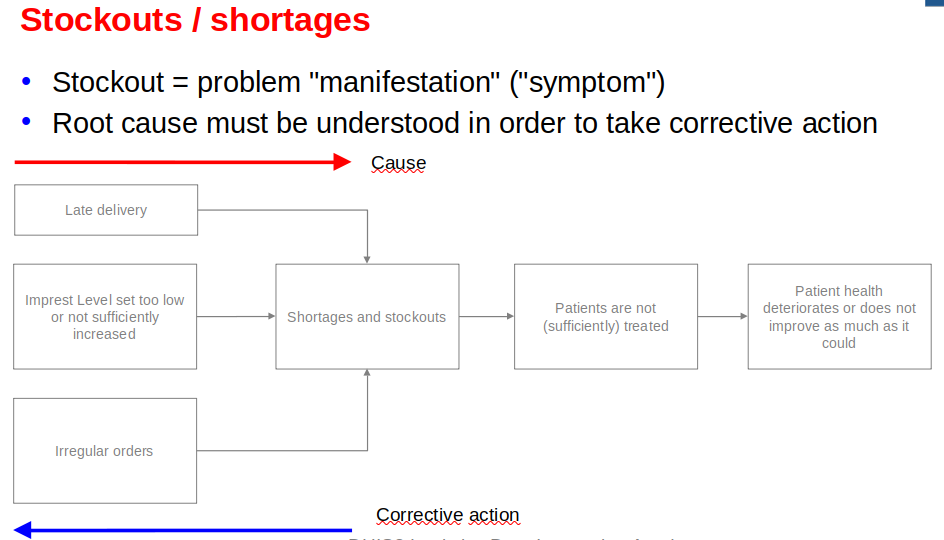
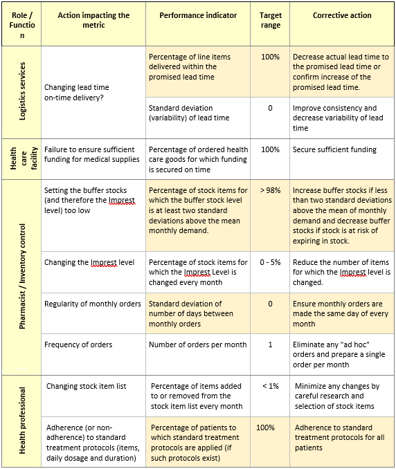
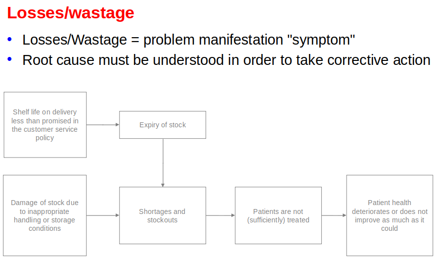
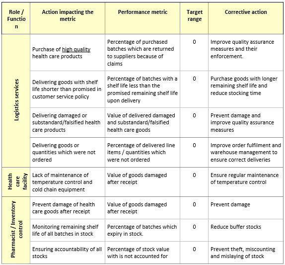
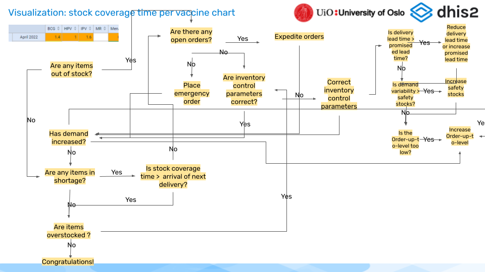

# DATA USE AND DATA QUALITY

##	LMIS data quality

Text box:
The entities of all metrics is the quantity of an item (healthcare product) which are always measured in units of "Each" (single tablet, ampoule, compress) and never in unit packs.
xxx

### Introduction
While logistics and supply chain management is usually associated with the production, storage and distribution of (commercial) products, the associated data is far more important but usually as invisible as the roots of a tree. The physical flow (storage and distribution) of goods and consignments is by far the easiest task in logistics and supply chain management while the real, albeit less obvious, challenges are managing the complex flows of associated data: obtaining accurate as well as up-to-date logistics data in a timely way and sharing them throughout the supply network in real-time in order to allow decision-making which ensures that the required quantities of required healthcare products are in the places where they are required for providing healthcare services at the time the are required.  
Trust between all actors and stakeholders are critical and indispensable for any effective and efficient supply network and the data is only as good as the trust the stakeholders have in it. Healthcare facility staff who do not trust supply managers will "inflate" order quantities hoping that this behaviour will increase supplies to them ("ration gaming"). On the other hand, if supply managers do not trust the facility level data they will resort to their own "estimates" for calculating replenishment orders which are always inferior to the systematic use of accurate and timely end-user data. Apart from continuously improving services, trust in data can be enhanced by freely and openly sharing data across supply networks, ideally in real-time.

The large number of different data quality dimensions are structured by UNICEF (Data quality Framework, 2021) into the following four categories:  

Access to data
- Data accessibility  

Output quality dimensions
- Relevance  
- Correctness  
- Completeness  
- Accuracy  
- Reliability (reproducibility)  
- Consistency  
- Timeliness and punctuality  
- Frequency  
- Interpretability  
- Comparability  

Process quality dimensions
- Burden for data collectors  
- Appropriateness of data sources  
- Data collection process  
- Transparency and documentation of data sources  

Institutional quality
- Transparency and credibility  

While conventional, paper-based LMIS data management systems require balancing various tradeoffs, such as the amount of data fields or data accuracy and timeliness, the use of digital data collection and management systems improve accuracy, timeliness, accessibility, consistency etc. at the same time.

###	Data accessibility
Generally, data is only of any use if the systems and people which require them have timely, easy and complete access for decision-making. While (even paper-based) data is usually readily available at the healthcare facility level, the time sharing and exchange of data across the entire supply network is indispensable and critical.  
Storekeepers at healthcare facilities require visibility of their stock as well as visibility of order status and supply managers at upstream levels need timely access to updated and accurate stock data for effective and timely stock replenishment. Other stakeholders such as health managers at all levels of the health systems and other actors such as (commercial) suppliers or (international) donors also require access to logistics data for reporting and auditing.  
Within the constraint of network connectivity, the use of digital LMIS systems allows instant and complete access of all LMIS data from all levels of the supply network without any national or international stakeholder. This data is accessible in tables displaying time series of essential LMIS data as well as customised reports. The same effectiveness and efficiency would be impossible to achieve by distributing paper-based records manually.  
As DHIS2 stores and manages all data in a central database, all data is easily accessible by design.  
Through its native and well documented API-endpoints, DHIS2 allows any professional information system to easily integrate for synchronising ("reading" as well as "writing) data.  
Regular (daily) backups of the databases ensure that all data remains accessible even if parts of the information system network temporarily fails.  

### Data output quality
The data output quality refers to the collected and shared data as such.

#### Relevance
Relevance of LMIS data refers to the ability to serve the purpose and make the decisions for which it was collected and shared. The main purpose of LMIS is ensuring effective and efficient stock replenishment while avoiding (preventable) expiry of stocks.  
Different stakeholders in the supply network and in the health system may require different data for different purposes at different times. Generally speaking, too much data is being collected without having a clear purpose in mind.  
In principle, managing supply networks effectively and efficiently requires only a small number of data points. For example, at the healthcare facility level, only stock transaction quantities (distributed/issued, discarded and lost stock) are relevant while all other (secondary) data can be derived. At upstream levels, in addition data on orders, consignments as well as details of stocks (batch numbers and expiry dates) need to be managed.  
The use of DHIS2 at the healthcare facilities encourages limiting collected data points as it only complements data which is not (and cannot be) available in mSupply and the use of best practices is encourage during the design phase projects and advising project members.  

#### Correctness
Data correctness refers to collecting the data items which correspond to the data fields which are being collected. For example, entering distributed quantities into the correct data field (column) of a paper-based or digital form.  
The use of DHIS2 contributes to correctness by minimising the number of data fields which need to be collected. For example, when using DHIS2-RTS (Real-Time System) only transaction quantities are recorded and therefore the mistaken entry into a wrong data field (column) is impossible. The use of barcode scanners eliminates the risk of mistakenly recording any data for the wrong healthcare product in the wrong row.

#### Completeness
Data completeness refers to the number of data points (or data fields, reporting forms, number of healthcare facilities) for which data is recorded during every reporting period. If all collected data is relevant and essential then, by definition, one hundred percent of all data points are required for one hundred percent of the reporting periods for taking decisions.  
For example, for effective and efficient stock replenishment it is absolutely critical that stock on hand and distribution quantities are collected every month for each and every item (healthcare product).  
DHIS2 contributes to data completeness by intuitively visualising data gaps in Pivot tables as well as with various verification tools (see below).  
When using the DHIS2-RTS (Real-time system) the issue of data completeness does not really arise as there is no retroactive recording or reporting of LMIS data during every reporting period. Instead all transactions are recording at the time the physical transaction (distribution or discard of stock) takes place and therefore necessary all data will be complete (unless recording of the stock transaction is omitted altogether).

#### Accuracy
Accuracy refers to the agreement of value of the collected data points with the physical entity which is being measured and reported. For example, whether the reported stock on hand actually corresponds to the quantity which is physically available in the store. Data accuracy requires both, to correctly count the stock and then to enter the correct quantity.  
Neither manual nor digital data management systems can ever ensure the accuracy of all data and, in principle, information systems will not be able to detect incorrect counts or transactions which were mistakenly not corrected. However, DHIS2 provides various tools to identify data inconsistencies (see below). Often checks and balances will point to certain data values which are definitely incorrect and indicating the correct range of a certain data value but without allowing to determine the exact correct data value.

#### Reliability (reproducibility)
Reliability, or reproducibility, refers to the stability of data values if the data collection is repeated. For example, typically the end-of-year physical stock count will be carried out by two (or more) teams which both count the same stock (while any transactions are frozen) and should produce identical stock reports.  
However, since recounting data is very time consuming it is rarely undertaken and DHIS2 will not immediately contribute to reliability of collected data.

#### Consistency
Consistency, or coherence, of data refers to the ability of being reconciled and whether the "numbers add up". For example, the stock on hand before and after a transaction must be identical to the transaction quantity or the stock on hand at the end of the reporting quantity must be identical with the sum of the stock on hand at the beginning of the reporting period and all transaction quantities during the reporting period.  
DHIS2 contributes to data consistency with various checks and balances (see below). The DHIS2-RTS (Real-Time stock management system) updates the stock on hand instantly after recording any transaction quantity and allows storekeepers to quickly identify (obvious) discrepancies which in turn allow verifying, for example, the transaction quantity.

#### Timeliness and punctuality
Timeliness ("freshness", "up-to-dateness") refers to the delay between the change of the observed value and its reporting. Since periodic (usually monthly) reporting systems do not require immediate reporting of any changes to LMIS data, except for real-time systems, in practice only punctuality can be determined and measured. For real-time systems, timeliness only applies to data sharing and is measured by determining the difference between recording the transaction on a mobile device and the time it is synchronised with the (central) DHIS2 server.  
Punctuality of data (collection) refers to completion of data collection before the defined due date. For example, for monthly stock reports, ideally stock data should be recorded and transmitted on the last day of the month at the latest. However, timeliness is related to the reporting frequency. For example, even if stock data is reliably reported on the last day of the month, no updates whatsoever are available between two reporting periods. Generally speaking, the "older" (more outdated) LMIS data is, the greater the difference between the last reported data value and current data value is likely to be and therefore the less useful it is.  
Therefore, for any LMIS the optimal (best possible) system is a real-time data collection and sharing.  
No information system can ensure that human beings record data on time but DHIS2 allows measuring any delays, providing feedback in reports and therefore encouraging staff to report on time.  
For LMIS data the importance of timeliness depends on stock levels. As long as the current stock level does not prompt any stock replenishment, sharing that stock data will not prompt any action (replenishment) and is therefore not of immediate importance. On the other hand, it is critical to report low stock levels and stockouts as quickly as possible. DHIS2 allows both, regular monthly reporting as well as recording and sharing data on stockouts for the concerned healthcare products immediately as and when they occur.  
Since the DHIS2-RTS (Real-Time stock management system) does not require any (retro-active) recording and reporting of data, timeliness is a given by default as every transaction is recorded and reported in real-time (or as soon as a network is available). In practice, network connectivity is likely to be intermittent but daily data updates are also sufficient for quickly responding to shortages and stockouts. Since, even at the healthcare facility level, real-time data recording and sharing is feasible, there is no reason to compromise and settle for anything less than real-time.

#### Frequency
The frequency refers to the length of the reporting period which is usually one month for LMIS data. For LMIS data, the higher the frequency the better with a real-time system being optimal.  
The frequency of LMIS data collection and reporting at the healthcare facility level must be coordinated with business processes at the supplying medical stores to ensure that the data from (recent) stock reports is used as quickly as possible for calculating stock replenishment orders.  
The "aggregate" periodic reporting provides for all commonly used reporting frequencies and periods such as daily, weekly, monthly, quarterly or annually with the real-time, transactional reporting being the preference.

#### Interpretability
Interpretability refers to the ease of understanding interpreting data and its usability and is an answer to the question "does the data make sense".  
Essential LMIS data are clearly defined and do not allow for much choice. Apart from the unusual terminology in logistics and supply chain management, all LMIS data points, such as stock on hand or transaction quantities, are intuitive and easily understood.

#### Comparability
LMIS data needs to be comparable over time as well as across healthcare facilities and levels of the supply network. For example, all storekeepers throughout the supply network need to always count all healthcare products in units of use (tablet, syringe etc.) and not in (different) packaging quantities in order to be comparable. Another example is that stock transaction quantities need to be consistently recorded for the same time periods, usually in months, at all levels of the supply network. All actors in the supply network need to use the same (derived) data, for example performance management metrics.  
DHIS2 contributes to comparability by providing all healthcare facilities with standardised and preset reporting forms for the whole country with predefined reporting periods which cannot be changed by users (unless they have administrator rights).  
Likewise, in DHIS2 performance metrics for measuring the quality of logistics services are standardised across healthcare facility which ensures comparability.

### Data process quality
Data output quality is affected by data process quality which refers to the appropriateness of data sources, the means of obtaining, collecting and processing data as well as data verification and documentation.

#### Burden for data collectors
Generally, the effort, time and other resources required for accurate and timely data collection and sharing must be balanced with the benefits of using this data and ultimate with the direct or indirect impact the (additional) data has on improving stock availability and minimising stockouts at the healthcare facility level.  
Minimising the burden of healthcare facility staff for obtaining, recording, aggregating and sharing data is a particular importance for managing LMIS data at the healthcare facility where health systems are plagued with collection of redundant LMIS data as well as primary and secondary data which is not used for a clearly defined purpose.  
For example, healthcare facility staff are required to record "opening balances" and "closing balances" which are entirely redundant. Another typical example is the request to calculate metrics such as "stockout days" which are cumbersome to calculate by manual analysis of paper records although better and more easily obtainable metrics for calculating and monitoring stock availability are available.  
The use of DHIS2 in itself cannot prevent or reduce the number of unnecessary und redundant data points implementing organizations wish to collect, as DHIS2 itself is flexible and allows to easily change the configuration of reporting forms. However, the importance of reducing the workload for healthcare facility staff is a key principle in designing LMIS tools and prominent in the documentation and technical advice provided.  
The integration of DHIS2 at the healthcare facility level with mSupply allows eliminating the collection of redundant data. For example, the "Stock receipt" which is commonly collected is fully and professionally managed in mSupply and therefore does not need to be collected, a second time, in DHIS2. Nevertheless, mSupply can provide complete, detailed and accurate visibility of stock receipt if and as required.  

#### Appropriateness of data sources
All periodic reporting systems rely on manual records such as batch cards, stock cards and other records as their primary data source even if the (monthly) reports (secondary data source) are recorded directly on digital devices. Therefore, for the period (monthly) reporting the use of DHIS2 relies entirely on the accuracy and reliability of the manual stock records and does not document or provide information on these data sources. For LMIS data the appropriateness of data sources is not critical in the sense that there are no alternative data sources.  
However, for the data recorded and stored in and shared by DHIS2, the log files provide complete details and visibility of the place of data collection (provided the geolocation function is configured), the identity of the person who has logged into the mobile device as well as an exact date and time stamp of each and every data point which is being recorded as well as any changes to those data.  
The DHIS2-RTS (Real-Time stock management system) allows managing medical stocks entirely without any paper-records. The only physical ("external") data source it relies on is the barcode which is attached to each healthcare product in the medical store. As for any other data recorded and managed in DHIS2, the DHIS2-RTS records the geolocation, user identity as well as a data and time stamp (hours, minutes, seconds and split seconds) of every recorded transaction.

#### Data collection process
The conventional process of counting (quantities), recording data and manually collating numbers at the end of the month is prone to error by recording data values for the wrong item, mistakes while copying data from one record to another as well as for collating data mentally or with a calculator. This manual process is not limited to healthcare facilities but is repeated at several other levels, such as the district, provincial and central level.  
The collection, storage and sharing of data from the healthcare facility level using mobile devices eliminates any mistakes at upstream levels, both by eliminating any need to manually copy data as well as by automatically aggregating data or performing any other calculations automatically.  
In the best case of using DHIS2-RTS, no duplication of any data is required (or even possible) and therefore any mistakes which would occur by duplicating data are safely avoided. As long as the collection of primary data (stock transaction quantities) is correct, all further errors are avoided. Furthermore, the entire data collection, storage and sharing process is digitally documented in log files with the data, user credentials, geolocation as well as data and time stamps which can be analysed and audited any time simply by downloaded data from the central DHIS2 server.

#### Transparency and documentation of data sources
The general meaning of providing clear, openly accessible information about operations, research design and data collection methodology which are documented for collecting health systems data does not equally apply to LMIS data as the data collection is a straightforward process which does not allow different options.  
However, the information provided above on the documentation of the data collection, storage, processing and sharing mentioned above contributes to fulfilling this requirement.

### Institutional quality
LMIS data is only as good as the trust stakeholders in the health system have in it. Unfortunately, doubts about data quality and accuracy are quite common and, in the worst case, leads to ignoring LMIS data reported by healthcare facilities and second guessing essential LMIS data such as monthly (aggregate) stock issues.  
DHIS2 greatly improves quality in data as records are transparent, easily accessible to and instantly shared with all stakeholders and can easily be analysed and audited.

### Summary of the DHIS2 contribution to data quality
The table below summarises how DHIS2 contributes to high data quality standards by design and various automatic algorithms.

| **Data quality dimension**  | **DHIS2 contribution** |
| :--- |  :--- |
| Access | Global accessibility from a single DHIS2 instance |
| Relevance | Data collection (forms) according to best practices |
| Correctness | Minimising the number of data fields, Barcode scanners for identifying healthcare products |
| Completeness | Intuitive visualisation of data gaps, Data completeness reports, Completeness by design when using DHIS2-RTS |
| Accuracy | Data consistency checks |
| Reliability (reproducibility) | - |
| Consistency | Data consistency checks, Instant stock on hand updates when using DHIS2-RTS |
| Timeliness and punctuality | Report punctuality analysis, Timeliness by design when using DHIS-RTS |
| Frequency | Flexible use of any reporting frequency, Real-time reporting (best practice) with DHIS2-RTS |
| Interpretability | Use of only essential LMIS data by design |
| Comparability | Standardised and present data reporting forms |
| Burden for data collectors | Minimal LMIS data collection by design, Avoids data redundancy |
| Appropriateness of data sources | Complete visibility of data collection through log files |
| Data collection process | Digitised data collection, Automated data sharing (synchronisation),Eliminates mistakes by data duplication and copying |
| Transparency and documentation | Transparency of data collection through log files |
| Transparency and credibility | Transparency and auditability of all data and log files |

## LMIS data quality analysis
DHIS2 natively features a range of tools and applications for preventing the entry of erroneous data, real-time validation of already entered data and (retro-active) analysis of entered data for identifying (potentially) false data values as well as data which was not recorded on time.

### LMIS data validation
The native DHIS2 data validation features allow validating data values during data entry entry and thereby minimizing data handling errors. Data validation means ensuring that entered data values are within predefined ranges.  
The DHIS2 "Value type" setting, which is natively available for all "Data elements", allows restricting the entry of data values to certain number sets such as natural numbers ("Positive Integer") or positive integers (which includes zero). This setting also prevents "accidental" data entry such as mistakenly entering text into a numeric data field.  
During data entry, DHIS2 will indicate any data values which are outside the defined data range by highlighting the data field with a red background and displaying an additional error message on the screen. For example, DHIS2 will prevent users from entering non-integer or any negative values in a stock on hand field and prevent the user from saving any report until the error is corrected.  
Users can open a on-screen pop-up window which will display the entire history of entered data values in a bar chart and line chart which allows to quickly identify inconsistent values and outliers.  
The DHIS2-RTS (Real-Time System) goes even further by not only displaying an alert in real-time if negative data values are entered but even preventing the user from saving the data entry and continuing entry of any further data. In addition, a specific minimum and maximum data value can be configured for each data field which will display a real-time alert if the user enters a value which is outside of the configured range.  
The DHIS2-RTS system prevents negative stock on hand values, prevents entry of any non-integer values in any data field and prevents entry of negative or zero values for any transaction quantities.  
A dedicated DHIS2 "Validation rule" application allows configuring complex validation rules based on data values from different data fields such as entering any data values which would lead to negative stock on hand values. When users execute the validation, DHIS2 will display a list of alerts in a dedicated sidebar.  
The DHIS2 "Data Quality" app allows defining a z-score, identifying any data values which lie outside of the set range and are therefore likely to be outliers.

###	Data value completeness
Before exporting data (either through the Import/Export app or the Data Visualizer app) it is important to check the following three settings:

**Storing zero values**
Maintenance > Data element > "Store zero data values"
For logistics data collection this setting must be always selected. Otherwise zero values will appear as blank fields and it will be impossible to distinguish whether the user entered a zero or left the field blank. If "Store zero data values" is not selected, then zero values will neither appear in the Data entry forms nor in the analytics. Apart from making data completeness analyses impossible, it is also not possible to analyse any zero values such as stockouts.

**Displaying zero values**
- System Settings > Analytics > "Include zero data values in analytics tables"
If the setting "Store zero data values" is set, zero values are recorded in the Data entry form. However, those zero values are only shown in the analytics if in the "System Settings" app the setting "Include zero data values in analytics tables" is set in the "Analytics".

**Completion of all data fields compulsory**
- Maintenance > Data set > "All fields for data elements required"

If the Data set is tagged as "All fields for data elements required" then the user must complete (enter values for) all data fields in the Data entry form. If this setting is selected and has been selected from the onset of data collection, then the system will ensure that all data has been recorded if the respective completeness report indicates 100% completion. In this case, the data completeness analysis can be limited to only two cases:
- time periods when that setting was not (yet) selected
- time periods for which the completeness report is not 100%

The objective of the data value completeness analysis is determining how consistently data is actually being collected. Data value completeness can be determined across the following dimensions:
- All data fields
- By healthcare facility (Organisation Unit)
- By reporting period (month/year)
- By item (healthcare product)
- By LMIS data fields (stock on hand, stock distribution etc.)
- By time series (OU/item/LMIS data field)
Data completeness is determined by simply counting the number of data fields for which values were reported without verifying the correctness of those values and then presenting those counts as percentages as well as histograms.

#### Across all data fields
Allows determining the data fields reported across all data dimensions which provides a general overview of data completeness.

#### By healthcare facility (Organisation Unit)
Allows determining healthcare facilities (districts, provinces) etc. which are (not) reporting data or not reporting consistently and completely.

#### By reporting period (month/year)
Allows determining when reporting commenced and how consistent reporting is over time.

#### By item (healthcare product)
Allows determining how consistently and completely data is reported by item.

#### By time series (OU/item/LMIS)
Allows determining LMIS data fields (stock on hand, stock distribution etc.) for which data is not reported consistently and completely.

### Data verification
In principle, the actually correct data values can never be determined and be known retrospectively. Even if paper (or digital) records are maintained, their accuracy cannot be verified retrospectively with certainty. However, there are certain measurements which allow determining with certainty or with a certain probability that data values are incorrect.

**Negative values**
Except for stock corrections, stock data values (stock on hand as well as any transactions) can, by definition, not be negative. For example, a negative value for stock on hand must, by definition, be wrong even if the actual value is (and will never) be known.

**Variability**
It is possible, but very unlikely, that data values in a time series will be identical over several periods. For example, distribution quantities and stock on hand are likely to vary month by month. If data values are identical (or have a very low variability) it is possible that data is simply being "copy/pasted" without actually being measured (counted etc.).

**Correlation**
Data values which are highly correlated are also suspicious for being accurate. For example, if, over several time periods, stock receipts and stock distributions are identical this could only be explained by continuous shortages (whatever is received is being distributed immediately) or by "copy/pasting" data without measuring (counting etc.).

###	Data report completeness and timeliness
DHIS2 natively allows to set a "Days after period end to qualify for timely data submission" which allows to then determine whether reports were submitted on time. At the end of the monthly data recording users confirm completion by selecting the "Complete" button on the data entry screen.  
This binary native DHIS2 reporting functionality allows users to confirm completeness of an entire Data set. The collected data depends on whether "All fields for data elements required" is configured in the Data set or not. If "All fields for data elements required" is not selected, the user can report the Data set as "Complete" even without entering a single value. If "All fields for data elements required" is collected the user will be prevented from selecting "Complete" unless all data fields are filled. However, if the user is forced to complete all data fields before selecting "Complete" for a Data set, the user may be tempted to record random values which will impair data quality.
This data and time stamp then allows to generate a range of default reports for the completeness of reports in terms of data recordings for each data field as well as the timeliness (on-time) of reported data values.
DHIS2 natively features the following reports for any kind of Data set:
- Actual reports
- Actual reports on time
- Expected reports
- Reporting rate
- Reporting rate on time
For details please refer to the Implementation guidance chapter on "Data Quality Principles"  
https://docs.dhis2.org/en/implement/data-quality/principles.html
The

## LMIS data use
Although logistics and supply chain management is often associated with and perceived as handling (storing and transporting) physical goods and stocks, in reality logistics and main, and difficult, issues in logistics supply chain management is obtaining and processing timely and accurate data. The most difficult tasks in supply chain management of ensuring the availability of stocks in the place they are required and at the time they are required is entirely determined by data. Provided that stocks are available, the material handling (storage and transportation) is by far the easiest task.  
Therefore data in general, and data from the last mile (first data mile) in particular, is absolutely essential, critical and indispensable. Only supply networks driven by first mile demand data can be effective as well as efficient and ensure that all goods required for providing high quality healthcare services are available at the service delivery point when they are needed.  
Far too often, any logistics data is lumped together as "indicators" or even "Key Performance Indicators" (KPI) while actually logistics data serves different and distinct purposes.

###	Data use for inventory control
Inventory control is a scientific field which studies policies and systems for replenishing medical stocks at healthcare facilities and other medical stocks and is coloquially referred to as "quantification". Inventory control lies at the heart of all supply chains and depends on the accurate and timely data from the healthcare facility as well as upstream levels. Therefore it is accurate and timely data together with rational and professional inventory control policies with make or break supply chains. Although the use of logistics data usually focuses on "reporting", the use for inventory control is by far the most important purpose.  
Without stock data from healthcare facilities, supply managers have to resort to surrogate data such as shipments to healthcare facilities which inevitably causes demand distortion and reduces stock availability at all levels of the supply network.
Fortunately stock replenishment calculations require very little data but that data must be timely and absolutely correct:
- Stock on hand (the result of a physical stock count at the end of every month): indispensable for calculating stock replenishment quantities
- Aggregate, monthly stock distribution ("consumption") are indispensable for demand analysis and forecasting future demand
If accurate and reliable data on stock receipts at healthcare facilities is available, then the stock on hand can be calculated from the stock on hand at the beginning and the end of the month.  
Unfortunately, public health systems tend to collect too much logistics data which is not used for decision making and the key for reducing shortages and stockouts is collecting as little data but as accurately, timely and efficiently as possible.

###	Data use for logistics performance management
In an ideal world with perfectly functioning supply networks, where neither stockouts nor overstocking occur, monitoring and measuring the quality of logistics services would not be needed. In practice, measuring and monitoring logistics performance is critical and indispensable. Not for generating "reports" and dashboards which may or not be used but rather for informing corrective action which changes and eventually optimises all inventory control parameters in order to increase and maximise stock availability while minimising stock wastage at healthcare facilities.  
Despite a plethora of statistics, indicators and key performance indicators, a comprehensive and complete performance management system only requires the collection of a handful of data fields at the healthcare facility level:
- Number of stock items managed (and changes over time)
- Monthly distribution quantities (monthly aggregates or transaction quantities)
- Stock on hand quantities (at the end of the month or ideally in real-time)
- Stock discards quantities
- Stock correction quantities
- Date and time of completion of monthly stock data reports
- Date and time of stock transactions (where real-time systems are used)  
In addition to the above, the following data fields need to be recorded and stored in the national eLMIS system for all medical stores at all levels:
 - Batch number (serial number) and expiry dates of all healthcare products
 - Inventory control parameters (and any changes over time)
 - Customer order details (customer name, date, items, quantities etc.)
 - Customer order fulfilment dates and lead times (for all of its components)
 - Consignment details (items, quantities, recipient, shipment and arrival date etc.)
 - Cost of healthcare products (at the batch level)

###	Data use for analytics and reporting
Finally, data is also needed for various analytics (other than performance management) and routine reporting. However, it should be stressed, that reports which have the sole purpose of complying with reporting requirements and do not inform or initiate any (corrective) action are just a waste of valuable resources.  
Data, such as on available stocks, are useful for health workers and various managerial staff even if they are not responsible for taking corrective action and other data, such as monthly demand aggregated at facility, district, regional and national level, are required for (long-term) planning by various managers.  
Typically, (monthly) stock data is reported in Pivot tables by healthcare product and reporting period (months) or line charts for time series analyses, such as determining trends.

## Logistics metrics
The overall objective of analysing logistics data and calculating metrics is improving the stock availability of healthcare goods for health seekers as well as health professionals and minimising shortages and stockouts while producing reports is of secondary importance.  
Pure statistics such as stock on hand or aggregate monthly demand do not allow any inference of the quality of logistics services and are therefore not indicators for anything. Nevertheless, these statistics are indispensable for managing stocks and are absolutely indispensable for inventory control. On the other hand, performance metrics have clearly defined ranges for poor and excellent performance and can therefore guide management decisions. Statistics and performance metrics serve very different purposes and should be distinguished conceptually but both are essential and indispensable.  
The performance management builds on first determining what factors influence logistics performance and (at the same time) allow taking corrective action ("actionable"). Then the best metrics for measuring those factors are determined, measured and visualised in DHIS2. Any metrics or other calculations which do not result in any corrective action are considered of very limited value.

###	Benchmarks
The table below provides an overview comparison of authoritative standards for logistics metrics from the Target Software Standards (TSS, Gavi), Data for Immunization Supply Chain (DISC, approved by Gavi Alliance Partners), Immunization Agenda 2030 (IA2030, IA2030 Coordination Group)  and The Global Fund.  

| **Metric**  | **TSS** | **DISC** | **IA2030S** | **TGF** | **PEPFAR** | **USAID** |
| :--- |  :---: |  :---: |  :---: |  :---: |  :---: |  :---: |
| On-Shelf Availability (OSA) / Full stock availability | x | x | - | x | x | x |
| Stocked According to Plan (SATP) | x | x | - | x | x | x |
| On-Time In-Full (OTIF) | x | x | - | x | - | x |
| Forecast Accuracy (FA) / Forecasted demand ratio | x | x | - | - | - | - |
| Order Cycle-Time (CT) | x | - | - | - | - | - |
| Timeliness of facility reporting | - | - | - | x | x | x |
| Product loss | x | - | - | - | - | x |
| Stock record accuracy | - | - | - | - | - | x |
| Quality Test Rate | x | - | - | - | - | - |
| Product Quality Adherence | x | - | - | - | - | - |
| Remaining shelf life at delivery | - | - | - | - | - | x |
| Inventory Turns | x | - | - | - | - | - |
| Total SC Cost as & of Distributed Product Value | x | - | - | - | - | - |
| LMIS Order Reporting Rate | x | - | - | - | - | - |
| Closed vial wastage | x | x | x | - | - | - |
| Functional status of cold chain equipment | x | x | x | - | - | - |
| Temperature alarm rates | x | x | - | - | - | - |
| % districts reporting stock availability (vaccines and supplies) at a service delivery level | - | - | x | - | - | - |
| % districts having electronic vaccine and supply stock management system to monitor vaccine stock down to service delivery | - | - | x | - | - | - |
| Stock out events of DTP or MCV at national level | - | - | x | - | - | - |
| Stock out days at national level | - | - | x | - | - | - |
| Stock out events of DTP or MCV at sub-national level | - | - | x | - | - | - |
| Effective Vaccine Management Assessment (EVMA) conducted | - | - | x | - | - | - |
| Percentage of sites with functional PQS equipment | - | - | x | - | - | - |
| EVM score (not just whether it has been conducted) | - | - | x | - | - | - |

###	Required logistics data
If logistics data is only collected at the healthcare facility, then some data (such as stock receipts) which is already recorded at the upstream levels has to be duplicated while in an integrated system the data points collected at the healthcare facility level can be minimised. In the best case where a real-time transactional system at the healthcare facility level is integrated with a national eLMIS, only stock transactions have to be recorded at the healthcare facility while all other data points can be either calculated or are already available in the national eLMIS. The table below provides an overview of the data points which need to be collected depending on the level of integration.

| **Metric**  | **Stock on hand** | **Stock receipt** | **Stock distribution** | **Stock loss** | **Stock correction** |
| :--- |  :---: |  :---: |  :---: |  :---: |  :---: |
| Monthly reporting without integration | x | x | x | x | - |
| Monthly reporting within integration | x | - | x | x | - |
| Real-time system with integration | - | - | x | x | x |

The table below indicates the data points which are required for calculating the metrics reference above and available in DHIS2 but excludes the IA2030 metrics because the latter do not include any facility level metrics. All other metrics can only be calculated in the national eLMIS. Metrics concerning cold chain appliances could be recorded in DHIS2 but are not included in the DHIS2 LMIS module and require using an additional and separate DHIS2 Tracker program.

| **Metric**  | **Stock on hand** | **Stock receipt** | **Stock distribution** | **Stock loss** | **Stock correction** |
| :--- |  :---: |  :---: |  :---: |  :---: |  :---: |
| On-Shelf Availability (OSA) / Full stock availability | x | - | - | - | - |
| On-Time In-Full (OTIF) | x | - | - | - | - |
| Order Cycle-Time (CT) | - | - | - | - | - |
| Forecast Accuracy (FA) / Forecasted demand ratio | - | - | - | - | - |
| Product loss | - | - | - | x | - |
| Quality Test Rate | - | - | - | - | - |
| Product Quality Adherence | - | - | - | - | - |
| Stocked According to Plan (SATP) | x | - | x | - | - |
| Inventory Turns | x | - | x | - | - |
| Total SC Cost as & of Distributed Product Value | - | - | - | - | - |
| LMIS Order Reporting Rate | - | - | - | - | - |
| Closed vial wastage | - | - | x | x | - |
| Functional status of cold chain equipment | - | - | - | - | - |
| Temperature alarm rates | - | - | - | - | - |
| Timeliness of facility reporting | x | x | x | x | x |

###	Source of data and calculations
As DHIS2 provides some simple analytics based on healthcare facility level data and mSupply provides comprehensive analytics on all aspects of logistics and supply chain management, duplication of data, calculations, analytics and visualisations needs to be avoided.  
DHIS2 only calculates essential stock data which cannot be collected in mSupply directly and only provides some basic analytics based on data collected in DHIS2.  
DHIS2 synchronises this essential healthcare facility level data (stock on hand, stock issues, stock corrections and stock losses) with mSupply but mSupply does not synchronise data with DHIS2 which would be replicated. However, mSupply data such as order status information may be shared with DHIS2 as preconfigured pdf-reports which can be shared through the DHIS2 notification system.  
By default, the main calculations, analytics and visualisations on all aspects of logistics and supply chain management are provided by and in mSupply as a dedicated national eLMIS system. As all essential DHIS2 data is also available in mSupply, supply managers use mSupply analytics and visualisations as their only resource for managing all aspects of their work. Any other managers (other than supply managers) which require detailed logistics reports from mSupply, are provided (read) access to mSupply for consulting mSupply reports reports.  
Unless mandated by national policies and protocols and inevitable, mSupply data is not "pushed" to and stored in DHIS2 for visualisations as this would require managing and maintaining redundant data sets.

###	Overview of DHIS2 logistics metrics
Given the extensive analytics functionality in DHIS2, users are tempted to configure a wide range of analytics and visualisations, often duplicating measurements for specific metrics, without a clear objectives and an overall concept.  
As DHIS2 analytics strive to be specific and of practical day to day use for healthcare facility staff, DHIS2 data collection and analytics have the following objectives:
- collect as little data as possible (but as much as necessary)
- only analyse data collected at the healthcare facility level in DHIS2 (and not in other upstream systems)
- only provide analytics which are meaningful to and "actionable" by healthcare facility staff
- avoid representing the same logistics metric in different ways  
DHIS2 recommends and provides the following, intentionally limited, list of logistics data statistics and logistics metrics:  

>**Logistics data statistics**
>>- Stock receipt  
>>- Stock distribution  
>>- Stock redistribution  
>>- Stock discard  
>>- Stock on hand  
>>- Stock correction  
>
>**Logistics performance indicators**  
>>**Demand (Distribution quantity) performance indicators**
>>>- Coefficient of variation / absolute values  
>>>- Coefficient of variation / distribution  
>>
>>**Stock quantity performance indicators**
>>>- Stockout / list of items with stockouts  
>>>- Stock availability across items  
>>>- Stockout percentage across items  
>>>- Number of stockouts (count)  
>>>- Stockout duration by item / months with stockouts  
>>>- Stockout duration by item / days with stockouts  
>>>- Stockout duration / distribution  
>>>- Stock coverage time by item / months of stock  
>>>- Stock coverage time / months of stock / distribution  
>>>- Stock coverage time / category  
>>>- Stock coverage time / category / distribution  
>>
>>**Stock accuracy performance indicators**
>>>- Stock discrepancy by item / absolute values  
>>>- Stock discrepancy / count  
>>>- Stock discrepancy / percentage  
>>
>>**Report performance indicators**
>>>- Report completeness  
>>>- Reporting rate  
>>>- Reporting rate on time  

These indicators can be evaluated in different ways:  
- Measuring absolute (daily/monthly) values  
- Measuring changes over time (improvements and deterioration)  
- Measuring averages  
- Comparing measurements against clearly defined targets (thresholds)  

### DHIS2 logistics data statistics

For each of the logistics data statistics, this section will provide the:
- Definition
- Reporting period
- Calculation
- Limitations
- Short interpretation
- Aggregation options: items / time / geography
- Visualization options (only those which are meaningful)
A detailed interpretation and the recommended action are explained in the section "Logistics performance management framework".
Except for the rare case of fully digitized stock management systems, manual records such as batch cards, stock cards and various ledgers are used for recording all stock transactions (such as stock receipts and distributions). At the end of every reporting period those records are reviewed, the required data values are tallied up with a calculator which are then reported.

#### General principles
- all logistics data needs to be collected with the same periodicity (for example, if stock on hand is recorded and reported monthly, distributions also need to be recorded and reported monthly)
- real-time data collection, such as with the DHIS2-RTS (Real-Time Stock management system) allows generating daily, monthly and annual reports automatically by the system
- daily reporing periods are not advisable as they are associated with a very high workload on (health) staff for daily reporting
- weekly reporting periods are not advisable because they are never commensurate with monthly and annual periods
- in terms of logistics, logistics data should be recorded and reported for all healthcare goods which are (regularly) managed by a health facility (and not only for "tracer" products)
- collected logistics data is only meaningful if it is regularly and systematically collected for all items and all transactions

####	Stock receipt

Ideally, collection of stock receipt data should not be necessary if a national eLMIS system is implemented which keeps accurate record of the shipments to each health facility which, with some delay, correspond to the stock receipts. For each consignment, national eLMIS systems should track the shipment date as well as the date on which the health facility confirmed actual receipt, separately.
Therefore recording stock receipts at health facilities (again) means that redundant data is collected which poses un unnecessary burden on facility staff. Instead, stock receipt data should be made available to facility staff through dashboards which automatically visualize data from the national eLMIS.  

**Definition**: "stock receipt" is defined as the quantity of each item which is received from the upstream logistics service as replenishment order. Supplies are usually received once a month with additional receipts of backorders and emergency orders. However the frequency of supplies may differ according to national policies.  
**Reporting period**: monthly aggragetions are recommended except for real-time systems where daily as well as monthly aggregations automated by the system are recommended. If the supply of healthcare facilities is less frequent than once a month, then the measurement period can be adjusted, for example to a period of three months.  
**Calculation**: total stock receipts for each item are calculated by adding up the quantities received in each consignment during the respective reporting period.  
**Limitations** calculating correct totals requires aggregating all consignment (packing list) quantities for each item which were received during the respective reporting month.  
**Short Interpretation**: generally, the stock receipts, after taking the lead time (delays for delivery) into account, need to correspond with the respective order quantities for the same item which in turn correspond to the distributions of previous monthly periods. Ideally, if deliveries are made reliably, the received quantity of every month should correspond to the quantity ordered during the period corresponding to the promised lead time earlier.  
**Corrective action**: if the receipt quantities do not correspond (closely) to the quantities ordered the period corresponding to the promised lead time earlier, then the logistics services supplying the healthcare facility needs to improve reliability of delivery. Alternatively, if the promised lead time cannot be adhered to, the lead time parameter in the stock replenishment calculations can be increased in order to match actual lead times.  
**Aggregation options**: aggregating stock receipt quantities across different items is not meaningful but for each item separately, they can be aggregated across several time periods, across several health facilities and both as a sum.  
**Visualization options**:  pivot table, column chart, bar chart, line chart or single value chart.  

####	Stock distribution

The logistics term "distribution" is often referred to as "consumption" or "issues" but means the same data.

**Definition**: total quantity of each item distributed from the (central) pharmacy at the healthcare facility to the respective wards and services in the healthcare facility. Depending on their procedures, out-patient-departments, community health workers, inpatients wards, laboratories, operating theatres etc. may be supplied daily, weekly, monthly and/or on request. For various reasons, the return of goods back to the (central) pharmacy should be avoided but if necessary this should be recorded as "negative" distributions.  
**Reporting period**: monthly aggragations are recommended except for real-time systems where daily as well as monthly aggregations automated by the system are recommended.  
**Calculation**: total stock distributions for each item are calculated by adding up the quantities distributed to all of the services and wards during the respective reporting period.    
**Short Interpretation**: stock distributions (which correspond to customer demand) lie at the origin of any supply chain (demand chain) and are not related to any other logistics data. Instead, the interpretation of quantities ordered and used by the respective services and wards depends on the number of patients, their medical condition, duration of treatment etc. and needs to be assessed by health professionals. The only logistical consideration is that items which have no demand at all for several months should be discussed with health staff for confirming the need for continuing to stock them as they are likely to expire before being used.  
**Limitations** if stock is returned to the (central) pharmacy, in principle the stock distribution quantities should be corrected in the period when the distribution was made. If the "negative" distribution is recorded in a later period, the actually (monthly) distribution quantities will be distorted although the overall total across all concerned periods will still be correct.  
**Corrective action**: items without demand for prolonged periods of time should be discussed with health staff for confirming the need for continuing to stock them as they are likely to expire before being used.  
**Aggregation options**: aggregating stock distribution quantities across different items is not meaningful but for each item separately, they can be aggregated across several time periods, across several health facilities and both as a sum. The average demand across several reporting periods may be used for evening out fluctuations or for comparing distribution quantities between (similar) health facilities.  
**Visualization options**: pivot table, column chart, bar chart, line chart or single value chart.  

####	Stock redistribution
Redistributions between health facilities is in principle a good way to avoid shortages and stockouts and avoid that patients are not being (sufficiently) treated. However, stock redistributions should be an exception. If stock redistributions are frequent, an assessment of the reasons leading to this "damage control" measure should be made. Ideally, stock redistributions should be managed in the national eLMIS by issuing a virtual return from the respective halth facility and a virtual shipment to another health facility while physically shipping the goods directly between the two healthcare facilities. Otherwise the distribution quantities for both healthcare facilities will be distorted and vicious cycle will perpetuate the shortage and stockouts (the health facility with the shortage or stockout continuous to receive too little stock because demand is false low and the health facility redistributing stock continuous to be overstocked as their demand includes part of the demand of another health facility).

**Definition**: total quantity of each item (re)distributed from the (central) pharmacy to another health facility. When loans are returned from the health facility to which stock was redistributed, those quantity need to be recorded as "negative" redistributions in order to balance stocks. If they are instead recorded as any other receipt, those will not match the stock shipped from the supplying medical warehouse.  
**Reporting period**: monthly aggragations are recommended except for real-time systems where daily as well as monthly aggregations automated by the system are recommended.  
**Calculation**: total stock redistributions for each item are calculated by adding up the quantities redistributed to all other health facility during the respective reporting period.  
**Short Interpretation**: any stock redistributions should be considered as an anomaly.  
**Corrective action**: any stock redistribution should prompt an assessment of the overall supply and distribution system as well as measures for preventing stock imbalances in future.  
**Aggregation options**: aggregating stock redistribution quantities across different items is not meaningful but for each item separately, they can be aggregated across several time periods, across several health facilities and both as a sum.  
**Visualization options**: pivot table, column chart, bar chart, line chart or single value chart.  

####	Stock discard

Terms such as "wastage", "expired" or "losses" are often used as synonyms. However, in terms of logistics processes and workflows, any healthcare product which has expired, is damaged or unusable for another reason still needs to be removed from stock and be placed in a locked quarantine area until safe disposal. Moreover, expired and damaged stock needs to be identified and recorded as such as stock expired stock may not be noticed.  
Note that "losses" caused by theft (shrinkage) are never known and can only be detected indirectly when stock discrepancies are noted. However, stock discrepancies can also be caused by miscounting, miscalculations or mislaying stock and therefore stolen quantities can only be suspected but cannot be known.

**Definition**: total quantity of each item which was removed from stock,  placed in quarantine and (eventually) disposed of.   
**Reporting period**: monthly aggragations are recommended except for real-time systems where daily as well as monthly aggregations automated by the system are recommended.  
**Calculation**: total stock discarded for each item are calculated by adding up the quantities discarded during the respective reporting period.  
**Short Interpretation**: stock discards are, in principle, avoided but should at least be exception.  
**Corrective action**: if stock is damaged, the storage conditions need to be improved accordingly. For example if stock is damaged by freezing vaccines, the cold chain management needs to be improved. If stock expires either stock levels need to be reduced or the remaining shelf life at the time of delivery from the supply medical warehouse needs to be increased.  
**Aggregation options**: aggregating discarded quantities across different items is not meaningful but for each item separately, they can be aggregated across several time periods, across several health facilities and both as a sum.  
**Visualization options**: pivot table, column chart, bar chart, line chart or single value chart.  

#### Stock on hand

**Definition**: Stock on hand is defined as the quantity of each item which is physically present in the (central) pharmacy. It must be determined by a physical stock count which should be carried out at the end of every reporting period, usually the end of the month. This stock count corresponds to the "closing stock" which means the stock at the end of the reporting period. In order to avoid confusion, stock balances which are the result of calculations such as adding and subtracting stock transactions from the "opening stock" should not be referred to as "Stock on hand". If stocks of the same item are held in different locations, those quantities need to be counted separately but then be added up for calculating the total.  
**Reporting period**: monthly aggragations are recommended except for real-time systems where daily as well as monthly aggregations automated by the system are recommended.   
**Calculation**: the stock on hand is calculated simply by counting the total quantities which are available in the (central) pharmacy at the time of counting/reporting.  
**Short Interpretation**: the stock on hand is the result of transactions and can therefore only be influenced indirectly through stock transactions and the desired stock levels depend on numerous parameters. However, items should never stock out and stockouts should always be considered as an emergency.  
**Corrective action**: any stockout should be considered as an emergency which prompts immediate action. Open (unfilled) order quantities (which have not been delivered yet) should be expedited (delivered as soon as possible) or additional emergency orders should be placed immediately. In addition, a carefuly review of the causes for the stockout should be carried out and remedied to prevent stockouts from recurring.  
**Aggregation options**: aggregating stock on hand across different items is not meaningful but for each item separately, they can be aggregated across several time periods, across several health facilities and both as a sum. The average stock on ahd across several reporting periods may be used for evening out fluctuations or for comparing stock on hand between (similar) health facilities.  
**Visualization options**: pivot table, column chart, bar chart, line chart or single value chart.

#### Stock correction

The term "stock correction" is distinct and different from "stock discards" (losses, wastage, expiry etc.)

**Definition**: stock correction quantities are deliberately recorded by storekeepers to account for discrepancies between the actual, physical stock (stock on hand) and the stock which should be available according to calculations based on the stock on hand at the beginning of the month and all recorded stock transactions during the month. The stock correction is only recorded after all possible reasons for mistakes in the records are verified. Stock corrections are only recorded for quantities which cannot be accounted for and be explained. These are are caused by mistakes or miscounts (which remain unnoticed), stock which is mislayed or theft. The actual cause of these discrepancies is and remains unknown. However, determining these discrepancies is better than only noting them as a result of a correction but without being aware of them.  
**Reporting period**: monthly aggragations are recommended except for real-time systems where daily as well as monthly aggregations automated by the system are recommended.  
**Calculation**: stock discrepancies are calculated as follows:  
Stock correction =  
\+ Stock on hand from the previous month (end of the previous month = beginning of the current month)  
\+ Stock receipt  
\- Stock distribution  
\- Stock redistribution  
\- Stock discard  
\- Stock on hand   
**Short Interpretation**: any value other than zero for the stock correction indicates a mistake or theft and is a sign of poor stock management. A positive stock correction means that there is more stock on hand than their should be for example because more physical stock was entered into stock than recorded or because less physical stock than recorded was distributed or both. A negative stock correction means that more stock was physically distributed than recorded or less stock was physically received than recorded, stock was mislaid or stolen.  
**Corrective action**: the need for recording any stock discrepancy should prompt an inquiry on the possible reasons, particularly if the occur for several items and/or repeatedly for the same items.   
**Aggregation options**: aggregating stock discrepancies quantities across different items is not meaningful but for each item separately, they can be aggregated across several time periods, across several health facilities and both as a sum. Note that if stock discrepancies "cancel each other out" over several reporting periods and result in zero, this is better than not. However, two mistakes which "cancel each other out" still means that two mistakes were made which should be followed up.  
**Visualization options**: pivot table, column chart, bar chart, line chart or single value chart.  

###	DHIS2 logistics performance indicators
While logistics data statistics are "just numbers" without any desired ranges, logistics performance indicators have optimal ranges which should be achieved and any deviation from the optimal ranges (too high or too low) needs to prompt immediate corrective action.

####	Demand (Distribution quantity) performance indicators
Xx

#####	Coefficient of variation (CoV) / absolute values
**Definition**: the coefficient of variation (CoV) is a measure for the variability of customer demand (distribution quantities).
**Reporting period**: calculations are usually based on monthly time series.
**Calculation**: standard deviation of a monthly time series divided by the mean of the same time series.  
**Short Interpretation**: the lower the coefficient of variation, the lower demand variability (level of fluctuations) and the higher the coefficient of variation the more variable and erratic demand is. If customer demand (distribution quantities) is entirely level (identical every month) then the coefficient of variation would be zero. The highest coefficient of variation in any time series results from a single values having any non-zero value and all other values in the time series having zero values. The maximum possible coefficient of variation depends on the length of the time series. For a time series of six months, the maximum possible coefficient of variation is 2.45 and or a time series of twelve months the maximum possible coefficient of variation is 3.46. By definition, a time series with a coefficient of variation of more than 1.0 is considered as erratic and demand cannot be forecasted with any reasonable accuracy. A coefficient of variation of less than 0.5 can be considered as low (optimal) and time series with a coefficient of variation between 0.5 to 1 as medium variability.
**Corrective action**: if demand variability is low no corrective action is needed but the low demand variability should be maintained. If demand shows high variability or is erratic, causes such be analysed. "Intrinsic" reasons for demand variability such as changing number of patients and medical conditions cannot be influenced. However, "extrinsic" reasons such as irregular and unsystematic orders of hospital serivces and wards, expiry of stocks after distribution from the central pharmacy as well as inconsistent application of standard treatment protocols can be addressed.
**Aggregation options**: the aggregation (averaging) of coefficients of variations across different items is not meaningful. Instead histograms (frequency distribution charts) should be used to visualize coefficients of variations across several items.
**Visualization options**: pivot table. 

#####	Coefficient of variation (CoV) / distribution
**Definition**: histogram (frequency distribution charts) of the coefficient of variation of all items in the same healthcare facility and for the same time period.
**Reporting period**: monthly for the respective time series of the previous months. For example the histogram for July will be based on the time series of the six months from January to June.   
**Calculation**: after calculating the coefficient of variation for each item for any specific month, the number of items for which the coefficient of variation falls into a bin (starting with 0 and in increments of 0.1) is counted.
**Short Interpretation**: ideally the histogram would show a single bar at coefficient of variation equal to zero but in practice the distribution should at least be positively skewed which means that it should have its mode in the low variability range. In any case the histogram is expected to show or shape resembling a normal distribution. in the worst case, all coefficients of distribution are negatively skewed and all in the range of erratic demand (coefficient of variation greater than 1).
**Corrective action**: same as for the coefficient of variation / absolute values  
**Aggregation options**: values from individual items can be aggregated across several or all items, healthcare facilities (at all levels) and time periods by adding the respective coefficient of variation values to the respective ranges. 
**Visualization options**: pivot table or histogram.  

#### Stock quantity performance indicators
Xx

##### Stockout / list of items with stockouts
**Definition**: list of items with stock on hand of zero during the monthly physical stock count.   
**Reporting period**: monthly for monthly stock reporting and monthly as well as daily for the real-time system.
**Calculation**: none, the items with stockouts are simply listed.  
**Short Interpretation**: ideally no items should ever be out of stock and the fewer items are out of stock the better. Items which are out of stock can be evaluated for available substitutes and the consequences for patients in case of a stockout.   
**Corrective action**: short term: expedite open orders and/or place additional orders for immediate shipment and/or redistribute from nearby healthcare facilities. Long-term: analyse reasons for stockouts and take corrective action (see logistics performance management framework).   
**Aggregation options**: lists can aggregated across items, time periods and healthcare facilities.    
**Visualization options**: pivot table and stacked column charts.

##### Stock availability
Xx
**Definition**:   
**Reporting period**:   
**Calculation**:  
**Short Interpretation**:   
**Corrective action**:   
**Aggregation options**:    
**Visualization options**:  

##### Stockout percentage
Xx
**Definition**:   
**Reporting period**:   
**Calculation**:  
**Short Interpretation**:   
**Corrective action**:   
**Aggregation options**:    
**Visualization options**:  

##### Number of stockouts (count)
Xx
**Definition**:   
**Reporting period**:   
**Calculation**:  
**Short Interpretation**:   
**Corrective action**:   
**Aggregation options**:    
**Visualization options**:  

##### Stockout duration by item / months with stockouts
Xx
**Definition**:   
**Reporting period**:   
**Calculation**:  
**Short Interpretation**:   
**Corrective action**:   
**Aggregation options**:    
**Visualization options**:  

##### Stockout duration by item / days with stockouts
Xx
**Definition**:   
**Reporting period**:   
**Calculation**:  
**Short Interpretation**:   
**Corrective action**:   
**Aggregation options**:    
**Visualization options**:  

##### Stockout duration / distribution
Xx
**Definition**:   
**Reporting period**:   
**Calculation**:  
**Short Interpretation**:   
**Corrective action**:   
**Aggregation options**:    
**Visualization options**:  

##### Stock coverage time by item / months of stock
Xx
[Inverse Stock turns]
**Definition**:   
**Reporting period**:   
**Calculation**:  
**Short Interpretation**:   
**Corrective action**:   
**Aggregation options**:    
**Visualization options**:  

##### Stock coverage time / months of stock / distribution
Xx
**Definition**:   
**Reporting period**:   
**Calculation**:  
**Short Interpretation**:   
**Corrective action**:   
**Aggregation options**:    
**Visualization options**:  

##### Stock coverage time / category
Xx
**Definition**:   
**Reporting period**:   
**Calculation**:  
**Short Interpretation**:   
**Corrective action**:   
**Aggregation options**:    
**Visualization options**:  

##### Stock coverage time / category / distribution
Xx
**Definition**:   
**Reporting period**:   
**Calculation**:  
**Short Interpretation**:   
**Corrective action**:   
**Aggregation options**:    
**Visualization options**:  

#### Stock accuracy performance indicators
Xx

##### Stock discrepancy by item / absolute values
Xx
**Definition**:   
**Reporting period**:   
**Calculation**:  
**Short Interpretation**:   
**Corrective action**:   
**Aggregation options**:    
**Visualization options**:  

##### Stock discrepancy / count
Xx
**Definition**:   
**Reporting period**:   
**Calculation**:  
**Short Interpretation**:   
**Corrective action**:   
**Aggregation options**:    
**Visualization options**:  

##### Stock discrepancy / percentage
Xx
**Definition**:   
**Reporting period**:   
**Calculation**:  
**Short Interpretation**:   
**Corrective action**:   
**Aggregation options**:    
**Visualization options**:  

#### Reporting quality performance indicators
Xx

##### Report completeness
Xx
**Definition**:   
**Reporting period**:   
**Calculation**:  
**Short Interpretation**:   
**Corrective action**:   
**Aggregation options**:    
**Visualization options**:  

##### Reporting rate
Xx
**Definition**:   
**Reporting period**:   
**Calculation**:  
**Short Interpretation**:   
**Corrective action**:   
**Aggregation options**:    
**Visualization options**:  

##### Reporting rate on time
Xx
**Definition**:   
**Reporting period**:   
**Calculation**:  
**Short Interpretation**:   
**Corrective action**:   
**Aggregation options**:    
**Visualization options**:  

### National eLMIS metrics
Xx
list metrics which are not available in DHIS2 but should be available from national eLMIS, study TSS indicators! study the GF etc. metrics above which can be calculated by national eLMIS.
 provides a wide range of analytics, reports and dashboards and should be the primary reference for any logistics data for supply managers, in particular for order fulfilment.
- Items (item catalogue, prices, item categories)
- Purchasing reports (purchase orders, goods received, open purchase orders, tenders)
- Stock reports (stock on hand, stock value, stockouts, stockout days, customer demand, remaining shelf life, stock coverage time, stock corrections)
- Transaction reports (stock receipts, stock issues)
- Customer orders (requisitions)
- Customer invoices
- Customer order shortfall reports (stock on order?)
- Backorder report
- Consignment and shipment reports
- Custom reports

On-Time In-Full (OTIF)
Order Cycle Time (CT)
Forecast Accuracy (FA) / Forecasted demand
Quality Test Rate
Product Quality Adherence
Inventory Turns

xxx
- On-time delivery
- Appropriateness of order-up-to-level
- Regularity of (monthly) orders

## Logistics performance management framework
Ideally, performance is managed by upstream (national) logistics services with performance indicators being made available to end-users in real time in the end-user eLMIS. Therefore, ideally, upstream logistics services continuously improve logistics services without the need for any further involvement by end-users.  
However, some activities and processes which are controlled by health professionals and mainly out of control by logistics services, need to be measured and monitored by end-users who also need to initiate and complete some corrective action. Moreover, all performance indicators managed by upstream logistics services but which are relevant to end-users must be shared with and readily accessible to end-users.
Performance indicators are measured and represented by different means:
- Pivot Tables
- Data Visualizer
- Maps
- Preconfigured dashboards
- Customised dashboards  
Reports may be configured according to national policies, standards and requirements according to the applied stock management system:
"Basic" mode: (mainly) monthly reports
"Advanced" mode: real time analysis and reports (at least daily updates)
While in most cases users and managers start out designing dashboards and visualisations, the sole objective of the DHIS2 Logistics performance management concept is to improve the quality of logistics services provided to services delivery points by increasing stock availability and minimising stockouts. Therefore the entire concept is "purpose-driven" and conceived "in reverse" (compared to conventional approaches):
 - the overall objective of health systems is preventing, treating diseases and alleviating suffering (reducing morbidity and mortality) which (among many others) requires availability of high quality healthcare goods
 - the overall logistics objective is reducing shortages and stockouts
 - what metrics are suitable for measuring and monitoring shortages and stockouts
 - what corrective action (for reducing shortages and stockouts) is possible and effective, who has the possibility of taking corrective action, how and when
 - what metric is suitable to determine what corrective action(s) is/are most appropriate
 - what data is needed for their calculation
 - collect the data (reliably, accurately and timely, ideally in real-time)
 - what representation of the data and metrics is most suitable for analytics and visualizations
 - only after all of the above, visualizations and dashboards are developed
 xxx
 Question: Confirm whether all DHIS2 metrics are "Manifestation" indicators?
and whether all root cause indicators are only available in national eLMISs?

###	General principles
As for the entire concept, the ultimate objective of performance management is improving health services for end-users, patients and health professionals rather than (only) complying with national and donor reporting requirements.  
One fundamental principle is that all actors, end-users (health professionals) as well as logistics staff impact logistics services and must closely collaborate for continuously improving these services. However, rather than being responsible “collectively”, distinct accountabilities and responsibilities must be assigned to and assumed by all actors in order to avoid endless finger pointing without any effective, corrective action being taken.  
Other principles are:
- The ultimate objective is improving services (not only "reporting")
- All performance metrics must "actionable" in associated with specific corrective actions
- All required data must actually be available and must be collected regularly
- All data is entered directly into DHIS2 at the healthcare facility (end-user level)
- All metrics are measured directly in DHIS2 or in the upstream eLMIS
- Clear distinction between logistics data and performance metrics
- Facilities only measure metrics at healthcare facility level (not for upstream levels)
- Single metric for any specific measurement (no redundancy)
- Comprehensive and complete set of metrics measuring all relevant aspects of logistics and supply chain management
- The system should be as simple and precise as possible
- All logistics and health actors impact logistics services performance
- Standard set of indicators across all programmes and health facilities
- Indicators are measured for all stock items (and not only "tracer" items)
- "Programme specific" indicators only if/when needed (occasionally)
- Only a single indicator for measuring any "manifestation" indicator
- 5 "manifestation" indicators (not more)
- Clearly defined targets for every performance indicator
- "Manifestation" indicator = determining "symptom"
- "Root cause" indicator = "diagnosis" and identifying problem
- Corrective action = "therapy"
- Clearly defined responsibilities and accountabilities for measuring and corrective action
- Clearly defined corrective action for any deviations

###	"Manifestation" indicators ("symptoms")
Manifestation” indicators primarily serve for detecting “symptoms” and establishing the presence, extent and scope of any logistics performance problem.
- Purpose: monitoring
- Question to be answered: what is the quality of services?
- Clearly defined target range of the indicator
- Question: is there a problem and if so what is the extent and scope?
- If the problem is confirmed: analyse root cause(s)
Only two “manifestation” indicators are sufficient for covering logistics services at end-user level: 
- Stock shortages and stockouts measured as stock coverage time
- Inappropriate utilization / stock losses
- Health programme specific indicators
The stock availability is commonly aggregated across the stock item list at a healthcare facility or across several healthcare facilities and measured as stock availability or "On Shelf Availability" (OSA).  
In fact, the multitude of metrics which are in use are simply variation or combination of the key performance indicators above and therefore redundant. As long as a different measurement does not result in identifying an additional root cause or a different corrective action, it is superfluous.

###	Root cause indicators ("diagnosis")
But measuring in itself is (nearly) useless and if there is no ability or willingness to improve logistics services then there is no point in measuring them in the first place. Therefore, if a “symptom” is detected, the “root cause” indicators serve to “diagnose” the underlying problem which allows taking appropriate corrective action.
- Purpose: determining problem causes
- Manifestation indicators have several root causes, but
- One indicator per root cause
- Only measure what can be changed
- Defined threshold for taking action
- Every indicator measured by one actor
- Specific actor takes corrective action
- Fix the problem!
Root cause indicators for stock shortages and stockouts
- Adding new items
- Buffer stocks too low
- Imprest System not used
- Orders made irregularly
Root cause indicators for inappropriate utilization and losses
- Poor/inappropriate prescription
- Overstocking (for any reason)
- Not respecting First-expiry-first-out
- Damage by poor storage conditions
While manifestation indicators (such as a shortage or stockout) may have more than one root cause, a single indicator is sufficient for determining the presence of any of the root causes and redundancy of indicators is avoided.  
Only root causes which can be addressed and corrected are measured since identifying a root cause which cannot be changed is (nearly) useless.  
For both the “manifestation” and “root cause” indicators, thresholds for corrective action need to be clearly defined and possibly different thresholds which define different corrective actions or different levels of urgency of implementing corrective action.  
Every indicator should be clearly assigned to a specific actor who is in charge of measuring, monitoring as well as initiating and implementing corrective action.  
While a large number of different metrics have been used for measuring shortages and stockouts, in fact there are only a small number of root causes.  

The table below shows the details of all possible root causes for shortages and stockouts, the responsible actor, how they can be measured as well as the required corrective action.

Likewise, at the end-user level, losses have only very few root causes:

The details of all possible root causes for losses and wastage, the responsible actor, how they can be measured as well as the required corrective action are given in the table below.

###	Programme specific indicators
While the framework presented above covers all indicators required for measuring and monitoring the quality of logistics services, some health programmes and national health systems may require measuring additional metrics for the sake of complying with donor reporting or national requirements. For example:
- EPI: open/closed vial wastage
- AIDS: multi-month dispensing (patients receiving three months’ supply of ARVs)
- TB: use of GeneXpert tests

###	Corrective action ("therapy")
Determining, initiating and implementing corrective action is the key step for giving any meaning to performance management. The process is as follows:
- Measure and monitor “manifestation” indicators (stockouts and losses)
- Compare measurement with target
- If within target range: continuous improvement
- If outside target range: analyse root cause indicator(s)
- Identify root cause(s)
- Determine staff who can implement corrective action
- Implement corrective action
- Measure impact of correct action
- Repeat from step 1
The implementation of a real time stock management system in combination with a well-developed national eLMIS system would allow developing an “expert system” which continuously measures and monitors a comprehensive set of performance metrics and displays the root cause analysis as well as the required corrective actions on a dashboard without the need for any further (human) analysis.

###	Summary with flow chart
Xx

xxx
**Analysis and (corrective) action - Stock distribution**

| **Analysis (Observation)**  | **Potential reason** | **(Corrective) action** |
| :--- |  :--- |  :--- |
| Demand data incomplete (missing data points) | Lack of compliance by staff or technical fault of data collection | Train staff, Remedy faults in the information system |
| Aggregate, monthly customer demand per item | (only valid in comparison with other values) | Compare values with previous time periods and against available benchmarks |
| No (low) demand | Stockouts (shortages) of items | Take immediate measures for resupply of items |
| Stable demand | Population and vaccination seeking stable | (None) |
| Demand increasing | Temporary fluctuation, compensation for earlier shortages, increase of vaccination seeking, population increase | If demand increase is stable and expected to last, review and adjust inventory control parameters |
| Demand decreasing | Population decrease, shortage of vaccines, decrease of vaccine seeking | Analyse potential reasons for demand decrease and only review and adjust inventory control parameters if the decrease is confirmed to be permanent |
| Demand intermittent [include erratic here?] | Shortage of vaccines, (intermittent) problems of access to vaccination services
 | Analyse potential reasons for intermittent demand and review and adjust inventory control parameters if caused by shortages and stockouts |
| Demand erratic | ?? | ??Stabilize demand? |
| Demand patterns of different items correlated | More likely to be a supply problem? | ?? |

**Analysis and (corrective) action - Stock on hand**
The value of analysing stock on hand levels (which make no indication of customer demand) and their fluctuations are of much less importance than the analysis of stock coverage times.

xxx Add explanations for each visualisation: 
DHIS2-LMIS Data quality and data use Web structure 29-05-2024.odt

## HMIS/LMIS triangulation
Xx
xxx
Data triangulation, improving health outcomes
Xxx
https://drive.google.com/drive/u/0/folders/1PqZzM65TU0Z5zLwe9fyZdvweSEZIf1ZT
xxx

## References
Xx
HISP Centre University of Oslo: Data Quality and Use, DHIS2 Documentation. Accessed 11.11.2023. https://docs.dhis2.org/en/implement/chis-implementation/data-quality-and-use.html
The DICE consortium: "Stepwise Toolkit for Planning & Budgeting Interoperability of Digital Health Solutions". Digital Health Center of Excellence, not dated. Accessed 26.10.2023. https://a78da35e-056b-4420-8e4f-41e3283327e3.usrfiles.com/ugd/55ae33_5af35824932c48d89287928244b60a8d.pdf
The Global Fund: "Adjustments to the KPI Framework". The Global Fund, 44th Board meeting, GF/B44/15B, 11-12 November 2020, Virtual. Accessed 26.10.2023. https://www.theglobalfund.org/media/8d89221958393a7/bm44_15b-adjustmentskpiframework_report_en.pdf
The Global Fund: "Key Performance Indicators (KPIs) Handbook for the 2023-2028 Strategy. PowerPoint presentation. The Global Fund, May 2023. Accessed 26.10.2023. https://www.theglobalfund.org/media/12681/strategy_globalfund2023-2028-kpi_handbook_en.pdf
The Global Fund: "Information Session: Supply Chain and Health Services Spot Checks". The Global Fund, Monitoring & Oversight Workstream, 23 September 2021. Accessed 26.10.2023. https://www.theglobalfund.org/media/11402/fundingmodel_supply-chain-health-services-spot-checks-information-session_presentation_en.pdf
UNICEF: "Data quality Framework". United Nations Childre's Fund (UNICEF), Division of Data, Analytics, Planning and Monitoring. New York: December 2021. Accessed 26.10.2023. file:///home/user/Downloads/Data-Quality-Framework-1.pdf

https://docs.dhis2.org/en/implement/chis-implementation/data-quality-and-use.html?h=data+quality
(Breno) Overlapping or related work with the following publications? To be confirmed and eventually cited:

    8. Recommendations on digital interventions for health system strengthening 2019 https://www.who.int/publications/i/item/9789241550505 
    9. Digital Implementation Investment Guide (DIIG): Integrating Digital Interventions into Health Programmes 2020
https://www.who.int/publications/i/item/9789240010567 
    10. Stepwise Toolkit for Planning & Budgeting Interoperability of Digital Health Solutions
https://a78da35e-056b-4420-8e4f-41e3283327e3.usrfiles.com/ugd/55ae33_5af35824932c48d89287928244b60a8d.pdf 
xxx
xxx Monitoring, Evaluation, and Reporting Indicator Reference Guide. PEPFAR. MER 2.0 (Version 2.7), September 2023. 

**The Global Fund**
https://www.theglobalfund.org/media/11402/fundingmodel_supply-chain-health-services-spot-checks-information-session_presentation_en.pdf

