# DHIS2 eLMIS sandbox

## eLMIS solutions configuration guide


https://lmis.integration.dhis2.org/sandbox

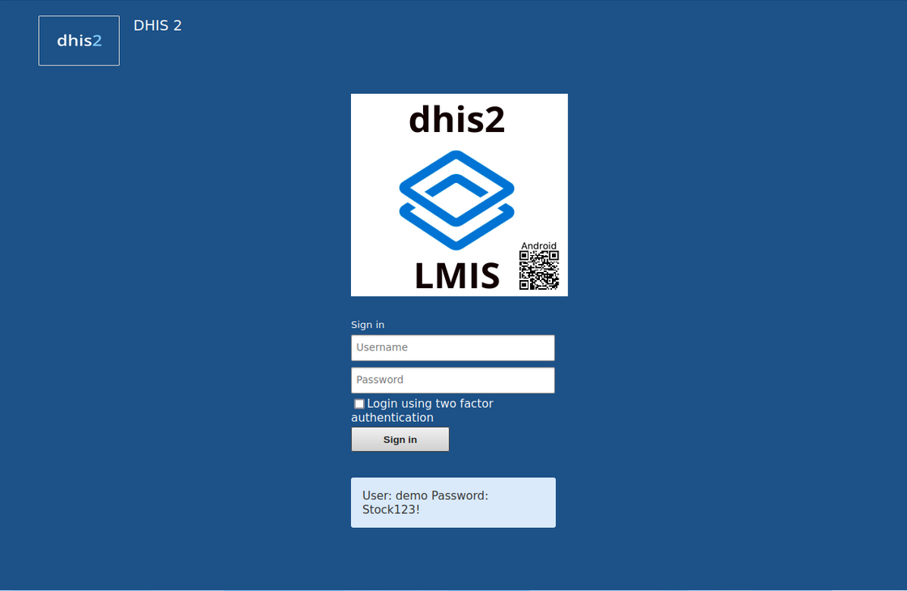

### 1 INTRODUCTION

This document is intended to demonstrate some fully functional prototype for using DHIS2 logistics applications at the health care facility level.

#### 1.1 Audience

This guide is intended for users interested in using DHIS2 for logistics applications at the health care facility level as well as for implementers supporting any implementations.

#### 1.2 Purpose

This short guide intends to demonstrate the feasibility of and options for configuring DHIS2 as end-user logistics applications while promoting best practices for logistics management.

This guide explains (only) the settings specific to the use case such as the Category options or Data Set settings but not the details of Organisation Units, User roles etc. which are not specific to the configuration.

The metadata configurations are presented in the order in which they appear in the DHIS2 "Maintenance" app.

Users are encouraged to adopt these prototypes to their specific use cases, situations, constraints and needs.

#### 1.3 Design principles

The applications are all "designed for Android" (mobile applications) for use on mobile devices (mobile phones or tablet computers). This also means that all applications can be used off-line for any period of time and data can be synchronized once a suitable network connection is available (again).

All applications are kept as simple as possible and only configured with essential features in order to minimize the workload of (health) staff at health care facilities as well as the amount of data as much as possible.

As much as possible wherever possible native DHIS2 functionality is used.

#### 1.4 System access and updates

The sandbox can be accessed through the following URL:

https://lmis.integration.dhis2.org/sandbox

The credentials (user name and password) are provided on the login page.

For accessing the applications on the mobile device, the DHIS2 Capture app needs to be downloaded from Google Plastore and be installed on the mobile device. Access is available with the same credentials as for the web portal.

Users are welcome to explore the system by entering data and modifying the configuration. However, all data will be erased and all changes will be reset to the original version very day during the night hours.

#### 1.5 Feedback

Please provide any feedback, suggestions for improvements or other use cases on the DHIS2 communityLMIS channel:

https://community.dhis2.org/c/implementation/supply-chain-and-lmis/46

### 2a MONTHLY STOCK DATA RECORDING / "aggregate" data entry form

This Default Data Entry Form ("aggregate") allows storekeepers at health care facilities to enter monthly data on demand ("consumption") as well as stock on hand digitally on a on- or off-line on a mobile device and synchronize the data with a central DHIS2 server for analysis, data sharing and integration with national eLMIS systems.

#### 2a.1 Use case

At the end of the month, storekeepers will count the quantity of all health care products in the medical store and record the stock on hand. Furthermore, to obtain the total amount of each health care product issued from the medical store from the first to the last day of the month and record the total monthly demand ("consumption") directly on a mobile device. The list of stock items ("Data Elements") can be adapted to each health care facility as needed and user access can be given selectively to individual storekeepers as required.

#### 2a.2 DHIS2 configuration guide

The configuration of this Default Data Entry form uses "Disaggregation categories" as this is technically the only way to display a table for recording data in the DHIS2 Capture app on a mobile device and relies only on basic, native DHIS2 functionality.

| **CATEGORY** | **System default settings** |
| --- | --- |
| > Category option | Name:<br>\- "Stock correction"<br>\- "Stock discarded"<br>\- "Stock distributed"<br>\- "Stock on hand"<br>\- "Stock received"<br>\- "Stock redistributed"<br>(Not shared). |
| > Category | Name: "Monthly stock report - Data<br>collection"<br>Data dimension type: "Disaggregation"<br>Assigned Category option in the following<br>order:<br>\- "Stock received"<br>\- "Stock distributed"<br>\- "Stock redistributed"<br>\- "Stock discarded"<br>\- "Stock on hand"<br>\- "Stock correction"<br>(Not shared). |
| > Category combination | Name: "Monthly stock report - Data<br>collection"<br>Data dimension type: "Disaggregation"<br>Skip category total in reports: tag<br>Categories: "Monthly stock report - Data<br>collection"<br>(Not shared). |
| > Data element | Name (examples only, configure according<br>to national drug list):<br>\- "CLOXACILLIN, 250 mg, caps."<br>\- "FOLIC ACID, 5 mg, tab."<br>\- "METRONIDAZOLE, 500 mg, tab."<br>\- "ORAL REHYDRATION SALTS (O.R.S.),<br>sachet 20.5 g/1 L"<br>\- "PARACETAMOL (acetaminophen), 500 mg,<br>tab."<br>\- "SALBUTAMOL, 0.1mg/puff, 200 puffs,<br>inhaler"<br>Domain type (\*): "Aggregate"<br>Value type (\*): "Integer"<br>Aggregation type (\*): "Sum"<br>Store zero data values: tag<br>Category combination (\*): "Monthly stock<br>report - Data collection"<br>(Not shared). |
| > Data set | Name: "Monthly stock report - Data<br>recording"<br>Color:<br>"#00ACC1"![]<br>(media/image2.png)<br>Icon:<br>Expiry days: "5"<br>Open future periods for data entry: "1"<br>Days after period to qualify for timely<br>submission: "15"<br>Period type (\*): "Monthly"<br>Category combination (\*): "None"<br>Render sections as tabs: tag<br>Data elements: assign as required (see<br>above)<br>Organisation units: select as required<br>Sharing settings: share with users or user<br>groups as required<br>Sections: created a "Section" for each<br>group of health care products such as<br>disinfectants, oral drug products etc. as<br>required |
| > Data visualizer | Name: "DHIS2 end-user eLMIS - Stock<br>report / Last 3 months / Facility"<br>Visualization type: "Pivot table"<br>Columns<br>\- Period: "Last 3 months"<br>\- Your Dimensions: "Monthly stock report<br>- Data collection" (select all six<br>Category options)<br>Rows: Data: select Data elements as<br>required<br>Filter: Organisation Unit: select<br>Organisation units as required |

#### 2a.3 DHIS2 user interfaces

**Web portal / Data Entry form**


**Web portal / Data Visualizer**


**Capture Android app**


**2b MONTHLY STOCK DATA RECORDING AND CALCULATION / "aggregate" data entry form**

This Default Data Entry Form ("aggregate") allows storekeepers at health care facilities to enter monthly data on demand ("consumption") as well as stock on hand digitally on a on- or off-line on a mobile device and synchronize the data with a central DHIS2 server for analysis, data sharing and integration with national eLMIS systems.

In addition to the configuration presented above, this Default Data Entry Form automatically calculates the "Opening balance" (stock on hand from the end of the previous month), "Closing balance" (Opening balance plus all stock receipts minus all stock issues) as well as "Stock discrepancy" (difference between the Stock on hand as counted and the calculated Closing balance).

#### 2b.1 Use case

At the end of the month, storekeepers will count the quantity of all health care products in the medical store and record the stock on hand. Furthermore, to obtain the total amount of each health care product issued from the medical store from the first to the last day of the month and record the total monthly demand ("consumption") directly on a mobile device. The list of stock items ("Data Elements") can be adapted to each health care facility as needed and user access can be given selectively to individual storekeepers as required.

The calculations are prompted by running the Predictors either separately or by configuring the "Scheduler" app to run all Predictors at the same time.

#### 2b.2 DHIS2 configuration guide

The configuration of this Default Data Entry form uses "Disaggregation categories" as this is technically the only way to display a table for recording data in the DHIS2 Capture app on a mobile device. The results of the Predictor calculations are "assigned" to the respective Category Options.

| **CATEGORY** | **System default settings** |

Category option

Name:
- "Closing balance"
- "Opening balance"
- "Stock correction"
- "Stock discarded"
- "Stock discrepancy"
- "Stock distributed"
- "Stock on hand"
- "Stock received"
- "Stock redistributed"
(Not shared).


Category

Name: **"Monthly stock report - Data collection"**
Data dimension type: "Disaggregation"
Assigned Category option in the following order:
- "Opening balance"
- "Stock received"
- "Stock distributed"
- "Stock redistributed"
- "Stock discarded"
- "Stock on hand"
- "Closing balance"
- "Stock discrepancy"
- "Stock correction"
(Not shared).


Category combination

Name: **"Monthly stock report - Data collection and calculation"**
Data dimension type: "Disaggregation"
Skip category total in reports: tag
Categories: "Monthly stock report - Data collection and calculation"
(Not shared).


Data element

Name (examples only, configure according to national drug list):
- "CLOXACILLIN, 250 mg, caps. - CL"
- "FOLIC ACID, 5 mg, tab. - CL"
- "METRONIDAZOLE, 500 mg, tab. - CL"
- "ORAL REHYDRATION SALTS (O.R.S.), sachet 20.5 g/1 L - CL"
- "PARACETAMOL (acetaminophen), 500 mg, tab. - CL"
- "SALBUTAMOL, 0.1mg/puff, 200 puffs, inhaler - CL"
Domain type (*): "Aggregate"
Value type (*): "Integer"
Aggregation type (*): "Sum"
Store zero data values: tag
Category combination (*): "Monthly stock report - Data collection and calculation"
(Not shared).


Data set

Name: **"Monthly stock report - Data recording and calculation"**
Color: "#00838F"
Icon:
Expiry days: "5"
Open future periods for data entry: "1"
Days after period to qualify for timely submission: "15"
Period type (*): "Monthly"
Category combination (*): "None"
Render sections as tabs: tag
Data elements, assign:
- "CLOXACILLIN, 250 mg, caps. - CL"
- "FOLIC ACID, 5 mg, tab. - CL"
- "METRONIDAZOLE, 500 mg, tab. - CL"
- "ORAL REHYDRATION SALTS (O.R.S.), sachet 20.5 g/1 L - CL"
- "PARACETAMOL (acetaminophen), 500 mg, tab. - CL"
- "SALBUTAMOL, 0.1mg/puff, 200 puffs, inhaler - CL"
Organisation units: select as required
Sharing settings: share with users or user groups as required


Indicator type

Name: **"Number (Factor 1)"**
Factor: "1"


>  **Indicator**
>
>  - Name: **"Stockouts"**
>   Short name: "Stockouts"
>    Description: "Number of items with a stockout"
>    Numerator description: "Stockouts - Numerator"
>    Numerator: [Item 1.Stock on hand]
>   ```
>   if(#{uwQn42CZ5qI.eKdBeWyrmPN}==0,1,0)+
>   if(#{Ev8PDcJ9I5X.eKdBeWyrmPN}==0,1,0)+
>   if(#{irAGhTCJcO8.eKdBeWyrmPN}==0,1,0)+
>   if(#{Z4bjHvGS6aH.iIC4YhgrxQY}==0,1,0)+
>   if(#{Csg4rTaIYDj.eKdBeWyrmPN}==0,1,0)+
>   if(#{mIYcOnLcqes.eKdBeWyrmPN}==0,1,0)
>   ```
>   Denominator: "1"
>  - Name: **"0-1 months"**
>   Short name: "0-1 months"
>    Description: "Number of items with a coverage time of 0-1 months"
>    Numerator description: "0-1 months - Numerator"
>    Numerator: [Item 1.Stock on hand / Item 1.Stock.distributed>0 && Item 1.Stock on hand / Item 1.Stock.distributed<1]
>   ```
>   if(#{uwQn42CZ5qI.eKdBeWyrmPN}/#{uwQn42CZ5qI.VCzZmn4Xpjg}>0 && #{uwQn42CZ5qI.eKdBeWyrmPN}/#{uwQn42CZ5qI.VCzZmn4Xpjg}<1,1,0)+
>   if(#{Ev8PDcJ9I5X.eKdBeWyrmPN}/#{Ev8PDcJ9I5X.VCzZmn4Xpjg}>0 && #{Ev8PDcJ9I5X.eKdBeWyrmPN}/#{Ev8PDcJ9I5X.VCzZmn4Xpjg}<1,1,0)+
>   if(#{irAGhTCJcO8.eKdBeWyrmPN}/#{irAGhTCJcO8.VCzZmn4Xpjg}>0 && #{irAGhTCJcO8.eKdBeWyrmPN}/#{irAGhTCJcO8.VCzZmn4Xpjg}<1,1,0)+
>   if(#{VNT5TGE3uBQ.eKdBeWyrmPN}/#{VNT5TGE3uBQ.VCzZmn4Xpjg}>0 && #{VNT5TGE3uBQ.eKdBeWyrmPN}/#{VNT5TGE3uBQ.VCzZmn4Xpjg}<1,1,0)+
>   if(#{Csg4rTaIYDj.eKdBeWyrmPN}/#{Csg4rTaIYDj.VCzZmn4Xpjg}>0 && #{Csg4rTaIYDj.eKdBeWyrmPN}/#{Csg4rTaIYDj.VCzZmn4Xpjg}<1,1,0)+
>   if(#{mIYcOnLcqes.eKdBeWyrmPN}/#{mIYcOnLcqes.VCzZmn4Xpjg}>0 && #{mIYcOnLcqes.eKdBeWyrmPN}/#{mIYcOnLcqes.VCzZmn4Xpjg}<1,1,0)
>   ```
>   Denominator: "1"
>  - **Name**: "1-2 months"
>   *Short name*: "1-2 months"
>    *Description*: "Number of items with a coverage time of 1-2 months"
>    *Numerator description*: "1-2 months - Numerator"
>    *Numerator*: [Item 1.Stock on hand / Item 1.Stock.distributed>=1 && Item 1.Stock on hand / Item 1.Stock.distributed<2]
>   ```
>   if(#{uwQn42CZ5qI.eKdBeWyrmPN}/#{uwQn42CZ5qI.VCzZmn4Xpjg}>=1 && #{uwQn42CZ5qI.eKdBeWyrmPN}/#{uwQn42CZ5qI.VCzZmn4Xpjg}<2,1,0)+
>   if(#{Ev8PDcJ9I5X.eKdBeWyrmPN}/#{Ev8PDcJ9I5X.VCzZmn4Xpjg}>=1 && #{Ev8PDcJ9I5X.eKdBeWyrmPN}/#{Ev8PDcJ9I5X.VCzZmn4Xpjg}<2,1,0)+
>   if(#{irAGhTCJcO8.eKdBeWyrmPN}/#{irAGhTCJcO8.VCzZmn4Xpjg}>=1 && #{irAGhTCJcO8.eKdBeWyrmPN}/#{irAGhTCJcO8.VCzZmn4Xpjg}<2,1,0)+
>   if(#{VNT5TGE3uBQ.eKdBeWyrmPN}/#{VNT5TGE3uBQ.VCzZmn4Xpjg}>=1 && #{VNT5TGE3uBQ.eKdBeWyrmPN}/#{VNT5TGE3uBQ.VCzZmn4Xpjg}<2,1,0)+
>   if(#{Csg4rTaIYDj.eKdBeWyrmPN}/#{Csg4rTaIYDj.VCzZmn4Xpjg}>=1 && #{Csg4rTaIYDj.eKdBeWyrmPN}/#{Csg4rTaIYDj.VCzZmn4Xpjg}<2,1,0)+
>   if(#{mIYcOnLcqes.eKdBeWyrmPN}/#{mIYcOnLcqes.VCzZmn4Xpjg}>=1 && #{mIYcOnLcqes.eKdBeWyrmPN}/#{mIYcOnLcqes.VCzZmn4Xpjg}<2,1,0)
>   ```
>   *Denominator*: "1"
>  - Name: **"2-3 months"**
>   Short name: "2-3 months"
>    Description: "Number of items with a coverage time of 2-3 months"
>    Numerator description: "2-3 months - Numerator"
>    Numerator: [Item 1.Stock on hand / Item 1.Stock.distributed>=2 && Item 1.Stock on hand / Item 1.Stock.distributed<3]
>   ```
>   if(#{uwQn42CZ5qI.eKdBeWyrmPN}/#{uwQn42CZ5qI.VCzZmn4Xpjg}>=2 && #{uwQn42CZ5qI.eKdBeWyrmPN}/#{uwQn42CZ5qI.VCzZmn4Xpjg}<3,1,0)+
>   if(#{Ev8PDcJ9I5X.eKdBeWyrmPN}/#{Ev8PDcJ9I5X.VCzZmn4Xpjg}>=2 && #{Ev8PDcJ9I5X.eKdBeWyrmPN}/#{Ev8PDcJ9I5X.VCzZmn4Xpjg}<3,1,0)+
>   if(#{irAGhTCJcO8.eKdBeWyrmPN}/#{irAGhTCJcO8.VCzZmn4Xpjg}>=2 && #{irAGhTCJcO8.eKdBeWyrmPN}/#{irAGhTCJcO8.VCzZmn4Xpjg}<3,1,0)+
>   if(#{VNT5TGE3uBQ.eKdBeWyrmPN}/#{VNT5TGE3uBQ.VCzZmn4Xpjg}>=2 && #{VNT5TGE3uBQ.eKdBeWyrmPN}/#{VNT5TGE3uBQ.VCzZmn4Xpjg}<3,1,0)+
>   if(#{Csg4rTaIYDj.eKdBeWyrmPN}/#{Csg4rTaIYDj.VCzZmn4Xpjg}>=2 && #{Csg4rTaIYDj.eKdBeWyrmPN}/#{Csg4rTaIYDj.VCzZmn4Xpjg}<3,1,0)+
>   if(#{mIYcOnLcqes.eKdBeWyrmPN}/#{mIYcOnLcqes.VCzZmn4Xpjg}>=2 && #{mIYcOnLcqes.eKdBeWyrmPN}/#{mIYcOnLcqes.VCzZmn4Xpjg}<3,1,0)
>   ```
>   Denominator: "1"
>  - Name: **"3-4 months"**
>   Short name: "3-4 months"
>    Description: "Number of items with a coverage time of 3-4 months"
>    Numerator description: "3-4 months - Numerator"
>    Numerator: [Item 1.Stock on hand / Item 1.Stock.distributed>=3 && Item 1.Stock on hand / Item 1.Stock.distributed<4]
>
>   ```
>    if(#{uwQn42CZ5qI.eKdBeWyrmPN}/#{uwQn42CZ5qI.VCzZmn4Xpjg}>=3 && #{uwQn42CZ5qI.eKdBeWyrmPN}/#{uwQn42CZ5qI.VCzZmn4Xpjg}<4,1,0)+
>    if(#{Ev8PDcJ9I5X.eKdBeWyrmPN}/#{Ev8PDcJ9I5X.VCzZmn4Xpjg}>=3 && #{Ev8PDcJ9I5X.eKdBeWyrmPN}/#{Ev8PDcJ9I5X.VCzZmn4Xpjg}<4,1,0)+
>    if(#{irAGhTCJcO8.eKdBeWyrmPN}/#{irAGhTCJcO8.VCzZmn4Xpjg}>=3 && #{irAGhTCJcO8.eKdBeWyrmPN}/#{irAGhTCJcO8.VCzZmn4Xpjg}<4,1,0)+
>    if(#{VNT5TGE3uBQ.eKdBeWyrmPN}/#{VNT5TGE3uBQ.VCzZmn4Xpjg}>=3 && #{VNT5TGE3uBQ.eKdBeWyrmPN}/#{VNT5TGE3uBQ.VCzZmn4Xpjg}<4,1,0)+
>    if(#{Csg4rTaIYDj.eKdBeWyrmPN}/#{Csg4rTaIYDj.VCzZmn4Xpjg}>=3 && #{Csg4rTaIYDj.eKdBeWyrmPN}/#{Csg4rTaIYDj.VCzZmn4Xpjg}<4,1,0)+
>    if(#{mIYcOnLcqes.eKdBeWyrmPN}/#{mIYcOnLcqes.VCzZmn4Xpjg}>=3 && #{mIYcOnLcqes.eKdBeWyrmPN}/#{mIYcOnLcqes.VCzZmn4Xpjg}<4,1,0)
>   ```
>   
>    Denominator: "1"
>  - Name: **"4-5 months"**
>   Short name: "4-5 months"
>    Description: "Number of items with a coverage time of 4-5 months"
>    Numerator description: "4-5 months - Numerator"
>    Numerator: [Item 1.Stock on hand / Item 1.Stock.distributed>=4 && Item 1.Stock on hand / Item 1.Stock.distributed<5]
>
>   ```
>    if(#{uwQn42CZ5qI.eKdBeWyrmPN}/#{uwQn42CZ5qI.VCzZmn4Xpjg}>=4 && #{uwQn42CZ5qI.eKdBeWyrmPN}/#{uwQn42CZ5qI.VCzZmn4Xpjg}<5,1,0)+
>    if(#{Ev8PDcJ9I5X.eKdBeWyrmPN}/#{Ev8PDcJ9I5X.VCzZmn4Xpjg}>=4 && #{Ev8PDcJ9I5X.eKdBeWyrmPN}/#{Ev8PDcJ9I5X.VCzZmn4Xpjg}<5,1,0)+
>    if(#{irAGhTCJcO8.eKdBeWyrmPN}/#{irAGhTCJcO8.VCzZmn4Xpjg}>=4 && #{irAGhTCJcO8.eKdBeWyrmPN}/#{irAGhTCJcO8.VCzZmn4Xpjg}<5,1,0)+
>    if(#{VNT5TGE3uBQ.eKdBeWyrmPN}/#{VNT5TGE3uBQ.VCzZmn4Xpjg}>=4 && #{VNT5TGE3uBQ.eKdBeWyrmPN}/#{VNT5TGE3uBQ.VCzZmn4Xpjg}<5,1,0)+
>    if(#{Csg4rTaIYDj.eKdBeWyrmPN}/#{Csg4rTaIYDj.VCzZmn4Xpjg}>=4 && #{Csg4rTaIYDj.eKdBeWyrmPN}/#{Csg4rTaIYDj.VCzZmn4Xpjg}<5,1,0)+
>    if(#{mIYcOnLcqes.eKdBeWyrmPN}/#{mIYcOnLcqes.VCzZmn4Xpjg}>=4 && #{mIYcOnLcqes.eKdBeWyrmPN}/#{mIYcOnLcqes.VCzZmn4Xpjg}<5,1,0)
>   ```
>   
>    Denominator: "1"
>  - Name: **"5-6 months"**
>   Short name: "5-6 months"
>    Description: "Number of items with a coverage time of 5-6 months"
>    Numerator description: "5-6 months - Numerator"
>    Numerator: [Item 1.Stock on hand / Item 1.Stock.distributed>=5 && Item 1.Stock on hand / Item 1.Stock.distributed<6]
>
>   ```
>    if(#{uwQn42CZ5qI.eKdBeWyrmPN}/#{uwQn42CZ5qI.VCzZmn4Xpjg}>=5 && #{uwQn42CZ5qI.eKdBeWyrmPN}/#{uwQn42CZ5qI.VCzZmn4Xpjg}<6,1,0)+
>    if(#{Ev8PDcJ9I5X.eKdBeWyrmPN}/#{Ev8PDcJ9I5X.VCzZmn4Xpjg}>=5 && #{Ev8PDcJ9I5X.eKdBeWyrmPN}/#{Ev8PDcJ9I5X.VCzZmn4Xpjg}<6,1,0)+
>    if(#{irAGhTCJcO8.eKdBeWyrmPN}/#{irAGhTCJcO8.VCzZmn4Xpjg}>=5 && #{irAGhTCJcO8.eKdBeWyrmPN}/#{irAGhTCJcO8.VCzZmn4Xpjg}<6,1,0)+
>    if(#{VNT5TGE3uBQ.eKdBeWyrmPN}/#{VNT5TGE3uBQ.VCzZmn4Xpjg}>=5 && #{VNT5TGE3uBQ.eKdBeWyrmPN}/#{VNT5TGE3uBQ.VCzZmn4Xpjg}<6,1,0)+
>    if(#{Csg4rTaIYDj.eKdBeWyrmPN}/#{Csg4rTaIYDj.VCzZmn4Xpjg}>=5 && #{Csg4rTaIYDj.eKdBeWyrmPN}/#{Csg4rTaIYDj.VCzZmn4Xpjg}<6,1,0)+
>    if(#{mIYcOnLcqes.eKdBeWyrmPN}/#{mIYcOnLcqes.VCzZmn4Xpjg}>=5 && #{mIYcOnLcqes.eKdBeWyrmPN}/#{mIYcOnLcqes.VCzZmn4Xpjg}<6,1,0)
>   ```
>   
>    Denominator: "1"
>  - Name: **"6-7 months"**
>   Short name: "6-7 months"
>    Description: "Number of items with a coverage time of 6-7 months"
>    Numerator description: "6-7 months - Numerator"
>    Numerator: [Item 1.Stock on hand / Item 1.Stock.distributed>=6 && Item 1.Stock on hand / Item 1.Stock.distributed<7]
>
>   ```
>    if(#{uwQn42CZ5qI.eKdBeWyrmPN}/#{uwQn42CZ5qI.VCzZmn4Xpjg}>=6 && #{uwQn42CZ5qI.eKdBeWyrmPN}/#{uwQn42CZ5qI.VCzZmn4Xpjg}<7,1,0)+
>    if(#{Ev8PDcJ9I5X.eKdBeWyrmPN}/#{Ev8PDcJ9I5X.VCzZmn4Xpjg}>=6 && #{Ev8PDcJ9I5X.eKdBeWyrmPN}/#{Ev8PDcJ9I5X.VCzZmn4Xpjg}<7,1,0)+
>    if(#{irAGhTCJcO8.eKdBeWyrmPN}/#{irAGhTCJcO8.VCzZmn4Xpjg}>=6 && #{irAGhTCJcO8.eKdBeWyrmPN}/#{irAGhTCJcO8.VCzZmn4Xpjg}<7,1,0)+
>    if(#{VNT5TGE3uBQ.eKdBeWyrmPN}/#{VNT5TGE3uBQ.VCzZmn4Xpjg}>=6 && #{VNT5TGE3uBQ.eKdBeWyrmPN}/#{VNT5TGE3uBQ.VCzZmn4Xpjg}<7,1,0)+
>    if(#{Csg4rTaIYDj.eKdBeWyrmPN}/#{Csg4rTaIYDj.VCzZmn4Xpjg}>=6 && #{Csg4rTaIYDj.eKdBeWyrmPN}/#{Csg4rTaIYDj.VCzZmn4Xpjg}<7,1,0)+
>    if(#{mIYcOnLcqes.eKdBeWyrmPN}/#{mIYcOnLcqes.VCzZmn4Xpjg}>=6 && #{mIYcOnLcqes.eKdBeWyrmPN}/#{mIYcOnLcqes.VCzZmn4Xpjg}<7,1,0)
>   ```
>   
>    Denominator: "1"
>  - Name: **"7-8 months"**
>   Short name: "7-8 months"
>    Description: "Number of items with a coverage time of 7-8 months"
>    Numerator description: "7-8 months - Numerator"
>    Numerator: [Item 1.Stock on hand / Item 1.Stock.distributed>=7 && Item 1.Stock on hand / Item 1.Stock.distributed<8]
>
>   ```
>    if(#{uwQn42CZ5qI.eKdBeWyrmPN}/#{uwQn42CZ5qI.VCzZmn4Xpjg}>=7 && #{uwQn42CZ5qI.eKdBeWyrmPN}/#{uwQn42CZ5qI.VCzZmn4Xpjg}<8,1,0)+
>    if(#{Ev8PDcJ9I5X.eKdBeWyrmPN}/#{Ev8PDcJ9I5X.VCzZmn4Xpjg}>=7 && #{Ev8PDcJ9I5X.eKdBeWyrmPN}/#{Ev8PDcJ9I5X.VCzZmn4Xpjg}<8,1,0)+
>    if(#{irAGhTCJcO8.eKdBeWyrmPN}/#{irAGhTCJcO8.VCzZmn4Xpjg}>=7 && #{irAGhTCJcO8.eKdBeWyrmPN}/#{irAGhTCJcO8.VCzZmn4Xpjg}<8,1,0)+
>    if(#{VNT5TGE3uBQ.eKdBeWyrmPN}/#{VNT5TGE3uBQ.VCzZmn4Xpjg}>=7 && #{VNT5TGE3uBQ.eKdBeWyrmPN}/#{VNT5TGE3uBQ.VCzZmn4Xpjg}<8,1,0)+
>    if(#{Csg4rTaIYDj.eKdBeWyrmPN}/#{Csg4rTaIYDj.VCzZmn4Xpjg}>=7 && #{Csg4rTaIYDj.eKdBeWyrmPN}/#{Csg4rTaIYDj.VCzZmn4Xpjg}<8,1,0)+
>    if(#{mIYcOnLcqes.eKdBeWyrmPN}/#{mIYcOnLcqes.VCzZmn4Xpjg}>=7 && #{mIYcOnLcqes.eKdBeWyrmPN}/#{mIYcOnLcqes.VCzZmn4Xpjg}<8,1,0)
>   ```
>   
>    Denominator: "1"
>  - Name: **"8-9 months"**
>   Short name: "8-9 months"
>    Description: "Number of items with a coverage time of 8-9 months"
>    Numerator description: "8-9 months - Numerator"
>    Numerator: [Item 1.Stock on hand / Item 1.Stock.distributed>=8 && Item 1.Stock on hand / Item 1.Stock.distributed<9]
>
>   ```
>    if(#{uwQn42CZ5qI.eKdBeWyrmPN}/#{uwQn42CZ5qI.VCzZmn4Xpjg}>=8 && #{uwQn42CZ5qI.eKdBeWyrmPN}/#{uwQn42CZ5qI.VCzZmn4Xpjg}<9,1,0)+
>    if(#{Ev8PDcJ9I5X.eKdBeWyrmPN}/#{Ev8PDcJ9I5X.VCzZmn4Xpjg}>=8 && #{Ev8PDcJ9I5X.eKdBeWyrmPN}/#{Ev8PDcJ9I5X.VCzZmn4Xpjg}<9,1,0)+
>    if(#{irAGhTCJcO8.eKdBeWyrmPN}/#{irAGhTCJcO8.VCzZmn4Xpjg}>=8 && #{irAGhTCJcO8.eKdBeWyrmPN}/#{irAGhTCJcO8.VCzZmn4Xpjg}<9,1,0)+
>    if(#{VNT5TGE3uBQ.eKdBeWyrmPN}/#{VNT5TGE3uBQ.VCzZmn4Xpjg}>=8 && #{VNT5TGE3uBQ.eKdBeWyrmPN}/#{VNT5TGE3uBQ.VCzZmn4Xpjg}<9,1,0)+
>    if(#{Csg4rTaIYDj.eKdBeWyrmPN}/#{Csg4rTaIYDj.VCzZmn4Xpjg}>=8 && #{Csg4rTaIYDj.eKdBeWyrmPN}/#{Csg4rTaIYDj.VCzZmn4Xpjg}<9,1,0)+
>    if(#{mIYcOnLcqes.eKdBeWyrmPN}/#{mIYcOnLcqes.VCzZmn4Xpjg}>=8 && #{mIYcOnLcqes.eKdBeWyrmPN}/#{mIYcOnLcqes.VCzZmn4Xpjg}<9,1,0)
>   ```
>   
>    Denominator: "1"
>  - Name: **"9-10 months"**
>   Short name: "9-10 months"
>    Description: "Number of items with a coverage time of 9-10 months"
>    Numerator description: "9-10 months - Numerator"
>    Numerator: [Item 1.Stock on hand / Item 1.Stock.distributed>=9 && Item 1.Stock on hand / Item 1.Stock.distributed<10]
>
>   ```
>    if(#{uwQn42CZ5qI.eKdBeWyrmPN}/#{uwQn42CZ5qI.VCzZmn4Xpjg}>=9 && #{uwQn42CZ5qI.eKdBeWyrmPN}/#{uwQn42CZ5qI.VCzZmn4Xpjg}<10,1,0)+
>    if(#{Ev8PDcJ9I5X.eKdBeWyrmPN}/#{Ev8PDcJ9I5X.VCzZmn4Xpjg}>=9 && #{Ev8PDcJ9I5X.eKdBeWyrmPN}/#{Ev8PDcJ9I5X.VCzZmn4Xpjg}<10,1,0)+
>    if(#{irAGhTCJcO8.eKdBeWyrmPN}/#{irAGhTCJcO8.VCzZmn4Xpjg}>=9 && #{irAGhTCJcO8.eKdBeWyrmPN}/#{irAGhTCJcO8.VCzZmn4Xpjg}<10,1,0)+
>    if(#{VNT5TGE3uBQ.eKdBeWyrmPN}/#{VNT5TGE3uBQ.VCzZmn4Xpjg}>=9 && #{VNT5TGE3uBQ.eKdBeWyrmPN}/#{VNT5TGE3uBQ.VCzZmn4Xpjg}<10,1,0)+
>    if(#{Csg4rTaIYDj.eKdBeWyrmPN}/#{Csg4rTaIYDj.VCzZmn4Xpjg}>=9 && #{Csg4rTaIYDj.eKdBeWyrmPN}/#{Csg4rTaIYDj.VCzZmn4Xpjg}<10,1,0)+
>    if(#{mIYcOnLcqes.eKdBeWyrmPN}/#{mIYcOnLcqes.VCzZmn4Xpjg}>=9 && #{mIYcOnLcqes.eKdBeWyrmPN}/#{mIYcOnLcqes.VCzZmn4Xpjg}<10,1,0)
>   ```
>   
>    Denominator: "1"
>  - Name: **"10-11 months"**
>   Short name: "10-11 months"
>    Description: "Number of items with a coverage time of 10-11 months"
>    Numerator description: "10-11 months - Numerator"
>    Numerator: [Item 1.Stock on hand / Item 1.Stock.distributed>=10 && Item 1.Stock on hand / Item 1.Stock.distributed<11]
>
>   ```
>    if(#{uwQn42CZ5qI.eKdBeWyrmPN}/#{uwQn42CZ5qI.VCzZmn4Xpjg}>=10 && #{uwQn42CZ5qI.eKdBeWyrmPN}/#{uwQn42CZ5qI.VCzZmn4Xpjg}<11,1,0)+
>    if(#{Ev8PDcJ9I5X.eKdBeWyrmPN}/#{Ev8PDcJ9I5X.VCzZmn4Xpjg}>=10 && #{Ev8PDcJ9I5X.eKdBeWyrmPN}/#{Ev8PDcJ9I5X.VCzZmn4Xpjg}<11,1,0)+
>    if(#{irAGhTCJcO8.eKdBeWyrmPN}/#{irAGhTCJcO8.VCzZmn4Xpjg}>=10 && #{irAGhTCJcO8.eKdBeWyrmPN}/#{irAGhTCJcO8.VCzZmn4Xpjg}<11,1,0)+
>    if(#{VNT5TGE3uBQ.eKdBeWyrmPN}/#{VNT5TGE3uBQ.VCzZmn4Xpjg}>=10 && #{VNT5TGE3uBQ.eKdBeWyrmPN}/#{VNT5TGE3uBQ.VCzZmn4Xpjg}<11,1,0)+
>    if(#{Csg4rTaIYDj.eKdBeWyrmPN}/#{Csg4rTaIYDj.VCzZmn4Xpjg}>=10 && #{Csg4rTaIYDj.eKdBeWyrmPN}/#{Csg4rTaIYDj.VCzZmn4Xpjg}<11,1,0)+
>    if(#{mIYcOnLcqes.eKdBeWyrmPN}/#{mIYcOnLcqes.VCzZmn4Xpjg}>=10 && #{mIYcOnLcqes.eKdBeWyrmPN}/#{mIYcOnLcqes.VCzZmn4Xpjg}<11,1,0)
>   ```
>   
>    Denominator: "1"
>  - Name: **"11-12 months"**
>   Short name: "11-12 months"
>    Description: "Number of items with a coverage time of 11-12 months"
>    Numerator description: "11-12 months - Numerator"
>    Numerator: [Item 1.Stock on hand / Item 1.Stock.distributed>=11 && Item 1.Stock on hand / Item 1.Stock.distributed<12]
>
>   ```
>    if(#{uwQn42CZ5qI.eKdBeWyrmPN}/#{uwQn42CZ5qI.VCzZmn4Xpjg}>=11 && #{uwQn42CZ5qI.eKdBeWyrmPN}/#{uwQn42CZ5qI.VCzZmn4Xpjg}<12,1,0)+
>    if(#{Ev8PDcJ9I5X.eKdBeWyrmPN}/#{Ev8PDcJ9I5X.VCzZmn4Xpjg}>=11 && #{Ev8PDcJ9I5X.eKdBeWyrmPN}/#{Ev8PDcJ9I5X.VCzZmn4Xpjg}<12,1,0)+
>    if(#{irAGhTCJcO8.eKdBeWyrmPN}/#{irAGhTCJcO8.VCzZmn4Xpjg}>=11 && #{irAGhTCJcO8.eKdBeWyrmPN}/#{irAGhTCJcO8.VCzZmn4Xpjg}<12,1,0)+
>    if(#{VNT5TGE3uBQ.eKdBeWyrmPN}/#{VNT5TGE3uBQ.VCzZmn4Xpjg}>=11 && #{VNT5TGE3uBQ.eKdBeWyrmPN}/#{VNT5TGE3uBQ.VCzZmn4Xpjg}<12,1,0)+
>    if(#{Csg4rTaIYDj.eKdBeWyrmPN}/#{Csg4rTaIYDj.VCzZmn4Xpjg}>=11 && #{Csg4rTaIYDj.eKdBeWyrmPN}/#{Csg4rTaIYDj.VCzZmn4Xpjg}<12,1,0)+
>    if(#{mIYcOnLcqes.eKdBeWyrmPN}/#{mIYcOnLcqes.VCzZmn4Xpjg}>=11 && #{mIYcOnLcqes.eKdBeWyrmPN}/#{mIYcOnLcqes.VCzZmn4Xpjg}<12,1,0)
>   ```
>   
>    Denominator: "1"
>  - Name: **"1-2 years"**
>   Short name: "1-2 years"
>    Description: "Number of items with a coverage time of 1-2 years"
>    Numerator description: "1-2 years - Numerator"
>    Numerator: [Item 1.Stock on hand / Item 1.Stock.distributed>=12 && Item 1.Stock on hand / Item 1.Stock.distributed<24]
>
>   ```
>    if(#{uwQn42CZ5qI.eKdBeWyrmPN}/#{uwQn42CZ5qI.VCzZmn4Xpjg}>=12 && #{uwQn42CZ5qI.eKdBeWyrmPN}/#{uwQn42CZ5qI.VCzZmn4Xpjg}<24,1,0)+
>    if(#{Ev8PDcJ9I5X.eKdBeWyrmPN}/#{Ev8PDcJ9I5X.VCzZmn4Xpjg}>=12 && #{Ev8PDcJ9I5X.eKdBeWyrmPN}/#{Ev8PDcJ9I5X.VCzZmn4Xpjg}<24,1,0)+
>    if(#{irAGhTCJcO8.eKdBeWyrmPN}/#{irAGhTCJcO8.VCzZmn4Xpjg}>=12 && #{irAGhTCJcO8.eKdBeWyrmPN}/#{irAGhTCJcO8.VCzZmn4Xpjg}<24,1,0)+
>    if(#{VNT5TGE3uBQ.eKdBeWyrmPN}/#{VNT5TGE3uBQ.VCzZmn4Xpjg}>=12 && #{VNT5TGE3uBQ.eKdBeWyrmPN}/#{VNT5TGE3uBQ.VCzZmn4Xpjg}<24,1,0)+
>    if(#{Csg4rTaIYDj.eKdBeWyrmPN}/#{Csg4rTaIYDj.VCzZmn4Xpjg}>=12 && #{Csg4rTaIYDj.eKdBeWyrmPN}/#{Csg4rTaIYDj.VCzZmn4Xpjg}<24,1,0)+
>    if(#{mIYcOnLcqes.eKdBeWyrmPN}/#{mIYcOnLcqes.VCzZmn4Xpjg}>=12 && #{mIYcOnLcqes.eKdBeWyrmPN}/#{mIYcOnLcqes.VCzZmn4Xpjg}<24,1,0)
>   ```
>   
>    Denominator: "1"
>  - Name: **"2-3 years"**
>   Short name: "2-3 years"
>    Description: "Number of items with a coverage time of 2-3 years"
>    Numerator description: "2-3 years - Numerator"
>    Numerator: [Item 1.Stock on hand / Item 1.Stock.distributed>=24 && Item 1.Stock on hand / Item 1.Stock.distributed<36]
>
>   ```
>    if(#{uwQn42CZ5qI.eKdBeWyrmPN}/#{uwQn42CZ5qI.VCzZmn4Xpjg}>=24 && #{uwQn42CZ5qI.eKdBeWyrmPN}/#{uwQn42CZ5qI.VCzZmn4Xpjg}<36,1,0)+
>    if(#{Ev8PDcJ9I5X.eKdBeWyrmPN}/#{Ev8PDcJ9I5X.VCzZmn4Xpjg}>=24 && #{Ev8PDcJ9I5X.eKdBeWyrmPN}/#{Ev8PDcJ9I5X.VCzZmn4Xpjg}<36,1,0)+
>    if(#{irAGhTCJcO8.eKdBeWyrmPN}/#{irAGhTCJcO8.VCzZmn4Xpjg}>=24 && #{irAGhTCJcO8.eKdBeWyrmPN}/#{irAGhTCJcO8.VCzZmn4Xpjg}<36,1,0)+
>    if(#{VNT5TGE3uBQ.eKdBeWyrmPN}/#{VNT5TGE3uBQ.VCzZmn4Xpjg}>=24 && #{VNT5TGE3uBQ.eKdBeWyrmPN}/#{VNT5TGE3uBQ.VCzZmn4Xpjg}<36,1,0)+
>    if(#{Csg4rTaIYDj.eKdBeWyrmPN}/#{Csg4rTaIYDj.VCzZmn4Xpjg}>=24 && #{Csg4rTaIYDj.eKdBeWyrmPN}/#{Csg4rTaIYDj.VCzZmn4Xpjg}<36,1,0)+
>    if(#{mIYcOnLcqes.eKdBeWyrmPN}/#{mIYcOnLcqes.VCzZmn4Xpjg}>=24 && #{mIYcOnLcqes.eKdBeWyrmPN}/#{mIYcOnLcqes.VCzZmn4Xpjg}<36,1,0)
>   ```
>   
>    Denominator: "1"
>  - Name: **">3 years"**
>   Short name: ">3 years"
>    Description: "Number of items with a coverage time of >3 years"
>    Numerator description: ">3 years - Numerator"
>    Numerator: [Item 1.Stock on hand / Item 1.Stock.distributed>=36]
>
>   ```
>    if(#{uwQn42CZ5qI.eKdBeWyrmPN}/#{uwQn42CZ5qI.VCzZmn4Xpjg}>=36,1,0)+
>    if(#{Ev8PDcJ9I5X.eKdBeWyrmPN}/#{Ev8PDcJ9I5X.VCzZmn4Xpjg}>=36,1,0)+
>    if(#{irAGhTCJcO8.eKdBeWyrmPN}/#{irAGhTCJcO8.VCzZmn4Xpjg}>=36,1,0)+
>    if(#{VNT5TGE3uBQ.eKdBeWyrmPN}/#{VNT5TGE3uBQ.VCzZmn4Xpjg}>=36,1,0)+
>    if(#{Csg4rTaIYDj.eKdBeWyrmPN}/#{Csg4rTaIYDj.VCzZmn4Xpjg}>=36,1,0)+
>    if(#{mIYcOnLcqes.eKdBeWyrmPN}/#{mIYcOnLcqes.VCzZmn4Xpjg}>=36,1,0)
>   ```
>   
>    Denominator: "1"
>  - Name: **"CLOXACILLIN, 250 mg, caps. - CL / Coverage time"**
>   Short name: "CLOXACILLIN, 250 mg, caps. - CL / Coverage time"
>    Description: "CLOXACILLIN, 250 mg, caps. - CL / Coverage time"
>    Numerator description: "CLOXACILLIN, 250 mg, caps. - CL / Coverage time"
>
>   ```
>    #{uwQn42CZ5qI.eKdBeWyrmPN}/#{uwQn42CZ5qI.VCzZmn4Xpjg}
>   ```
>   
>    Denominator: "1"
>  - Name: **"FOLIC ACID, 5 mg, tab. - CL / Coverage time"**
>   Short name: "CLOXACILLIN, 250 mg, caps. - CL / Coverage time"
>    Description: "CLOXACILLIN, 250 mg, caps. - CL / Coverage time"
>    Numerator description: "CLOXACILLIN, 250 mg, caps. - CL / Coverage time"
>
>   ```
>   #{uwQn42CZ5qI.eKdBeWyrmPN}/#{uwQn42CZ5qI.VCzZmn4Xpjg}
>   ```
>   
>    Denominator: "1"
>  - Name: **"METRONIDAZOLE, 500 mg, tab. - CL / Coverage time"**
>   Short name: "METRONIDAZOLE, 500 mg, tab. - CL / Coverage time"
>    Description: "METRONIDAZOLE, 500 mg, tab. - CL / Coverage time"
>    Numerator description: "METRONIDAZOLE, 500 mg, tab. - CL / Coverage time"
>
>   ```
>    #{uwQn42CZ5qI.eKdBeWyrmPN}/#{uwQn42CZ5qI.VCzZmn4Xpjg}
>   ```
>   
>    Denominator: "1"
>  - Name: **"ORAL REHYDRATION SALTS (O.R.S.), sachet 20.5 g/1 L - CL / Coverage time"**
>   Short name: "ORAL REHYDRATION SALTS (O.R.S.), sachet 20.5 g/1 L - CL / Coverage time"
>    Description: "ORAL REHYDRATION SALTS (O.R.S.), sachet 20.5 g/1 L - CL / Coverage time"
>    Numerator description: "ORAL REHYDRATION SALTS (O.R.S.), sachet 20.5 g/1 L - CL / Coverage time"
>
>   ```
>   #{Z4bjHvGS6aH.iIC4YhgrxQY}/#{Z4bjHvGS6aH.zogrUrI7Crs}
>   ```
>   
>    Denominator: "1"
>  - Name: **"PARACETAMOL (acetaminophen), 500 mg, tab. - CL / Coverage time"**
>   Short name: "PARACETAMOL (acetaminophen), 500 mg, tab. - CL / Coverage time"
>    Description: "PARACETAMOL (acetaminophen), 500 mg, tab. - CL / Coverage time"
>    Numerator description: "PARACETAMOL (acetaminophen), 500 mg, tab. - CL / Coverage time"
>
>   ```
>   #{Nn1L7CNEtC8.iIC4YhgrxQY}/#{Nn1L7CNEtC8.zogrUrI7Crs}
>   ```
>   
>    Denominator: "1"
>  - Name: **"SALBUTAMOL, 0.1mg/puff, 200 puffs, inhaler - CL / Coverage time"**
>   Short name: "SALBUTAMOL, 0.1mg/puff, 200 puffs, inhaler - CL / Coverage time"
>    Description: "SALBUTAMOL, 0.1mg/puff, 200 puffs, inhaler - CL / Coverage time"
>    Numerator description: "SALBUTAMOL, 0.1mg/puff, 200 puffs, inhaler - CL / Coverage time"
>
>   ```
>   #{mIYcOnLcqes.eKdBeWyrmPN}/#{mIYcOnLcqes.VCzZmn4Xpjg}
>   ```
>   
>    Denominator: "1"


Legend

Name: **"Stock discrepancy"**
Code: "STOCK DISCREPANCY"
Legend item "Negative"


Name: "Negative"

Start value: "-1000000"

End value: "0"

Colour: #8411D7
Legend item "Correct stock"


Name: "Correct stock"

Start value: "0"

End value: "1"

Colour: #68FE4C
Legend item "Positive"


Name: "Positive"

Start value: "1"

End value: "1000000"

Colour: #FF2000


Name: **"Stock coverage time"**
Code: "STOCK_COVERAGE_TIME"
Legend item "Stockout"


Name: "Stockout"

Start value: "0"

End value: "0.00001"

Colour: #EE391E
Legend item "Understock"


Name: "Understock"

Start value: "0.0001"

End value: "2"

Colour: #FEFB08
Legend item "Adequate stock"


Name: "Adequate stock"

Start value: "2"

End value: "3"

Colour: #0BFF00
Legend item "Overstock"


Name: "Overstock"

Start value: "3"

End value: "12"

Colour: #0011FF
Legend item "Excessive stock"


Name: "Excessive stock"

Start value: "12"

End value: "1000"

Colour: #DC00FF


> Predictor
>
> The following 3 Predictors need to be created for each Data element separately:
>
> - Name: **CLOXACILLIN, 250 mg, caps. - CL / Closing balance**
>   Output data element (*); CLOXACILLIN, 250 mg, caps. - CL
>   Output category option combo: "Closing balance"
>   Generator:
>   #{uwQn42CZ5qI.DDi5WPwhtVZ}
>   +#{uwQn42CZ5qI.FhxQW61lsG7}
>   -#{uwQn42CZ5qI.VCzZmn4Xpjg}
>   -#{uwQn42CZ5qI.gSTwuZJQ2sl}
>   -#{uwQn42CZ5qI.NwUY4l4x6Gl}
>   -#{uwQn42CZ5qI.fzhyKGI9Pa0}
>   CLOXACILLIN, 250 mg, caps. - CL Opening balance +CLOXACILLIN, 250 mg, caps. - CL Stock received -CLOXACILLIN, 250 mg, caps. - CL Stock distributed -CLOXACILLIN, 250 mg, caps. - CL Stock redistributed -CLOXACILLIN, 250 mg, caps. - CL Stock discarded -CLOXACILLIN, 250 mg, caps. - CL Stock correction
> - Name: **CLOXACILLIN, 250 mg, caps. - CL / Opening balance**
>   Output data element (*); CLOXACILLIN, 250 mg, caps. - CL
>   Output category option combo: "Opening balance"
>   Generator: avg(#{uwQn42CZ5qI.eKdBeWyrmPN})
>   avg(CLOXACILLIN, 250 mg, caps. - CL Stock on hand)
> - Name: **CLOXACILLIN, 250 mg, caps. - CL / Stock discrepancy**
>   Output data element (*); CLOXACILLIN, 250 mg, caps. - CL
>   Output category option combo: "Stock discrepancy"
>   Generator: #{uwQn42CZ5qI.eKdBeWyrmPN}-#{uwQn42CZ5qI.Q2LQDdGMNXm}
>   CLOXACILLIN, 250 mg, caps. - CL Stock on hand-CLOXACILLIN, 250 mg, caps. - CL Closing balance
>
> - Period type (*): Monthly
>   Organisation unit levels: "Facility"
>   Organisation units providing data (*): "At selected level(s) only"
>   Sequential skip count (*): "1"
>   Annual sample count (*): "0"


Data visualizer

Name: **"Monthly stock report - Recording and calculation"**
Visualization type: "Pivot table"
Columns: "Your dimensions" / "Monthly stock reporting - Data collection and calculation" (select all nine Category options)
Rows:

- Data: select the Data elements as required

- Period: "Last 3 months"
  Filter: Organisation Unit: select Organisation units as required

  

#### 2b.3 DHIS2 user interfaces

Web portal / Data Entry form


**Web portal / Data Visualizer**

Monthly stock report - Data collection


Monthly stock report - Data collection and calculation


**Capture Android app**


### 3 REAL-TIME STOCK MANAGEMENT TOOL** / **TRACKER PROGRAM

This Tracker Program provides a native, user-friendly DHIS2 solution for real-time stock management and reporting of health care products.

#### 3.1 Use case

The DHIS2-RTS provides a web and mobile app-based tool (with off-line capability), real-time digital solution for stock management which can be integrated with national eLMIS systems for managing stock replenishment as well as end-to-end supply chain analytics.

The system provides global, real-time stock and data visibility from healthcare facilities to pharmacy staff as well as health and logistics staff at all levels of the supply chain regardless of their physical location.

Staff at healthcare facilities replace data collection on paper or with spreadsheet applications by recording data directly on mobile devices on-line (with off-line capability) using a dedicated mobile device application. Staff at healthcare facilities or at the district level no longer have to re-enter data provided by pharmacies into Excel files (or any other application) for calculating monthly replenishment orders.

The current, paper- (or spreadsheet) based, workflow for replenishing pharmacies at assisted healthcare facilities is replaced by a fully digital, integrated and systematic workflow which is standardized across all healthcare facilities.

#### 3.2 DHIS2 configuration

The following logic is used for configuring the metadata used for the Tracker Program:

Data element Represent the various transactions which affect the Stock on hand calculations (receipt, distributions, corrections, count etc.)

---

Option set The "Deliver to" Data element uses the "Deliver to" Option Set which lists the names of the different departments Tracked entity attribute The item attributes are Item code, description and the barcode (field for scanning) Tracked entity type The item (health care product) is tracked

The "Previous stock balance" Data element is needed for the Program rules to temporarily store Stock on hand values.

The Tracker Program uses a single repeatable Program stage named "Stock on hand":

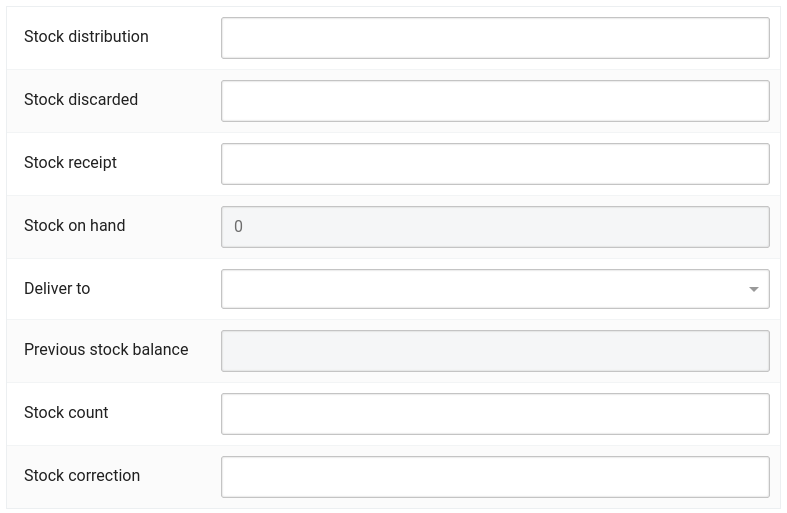

The table below summarizes the main metadata configurations and settings for the Tracker Program on which the customized DHIS2-RTS is based and using "in the background". While not visible to users it is indispensable and critical for customizing the configuration to individual countries as well as for managing data such as adding or removing items (health care products).

| **CATEGORY** | **System default settings** |
| --- | --- |
| > Organisation unit | According to national protocols<br>and policies and/or existing<br>DHIS2 configuration |
| > Data element | Name (\*):<br>\- "Deliver to": "Text" /<br>"Option set" = "Deliver to"<br>\- "Previous stock balance":<br>"Positive integer"<br>\- "Stock correction":<br>"Number"<br>\- "Stock count": "Positive<br>integer"<br>\- "Stock discard": "Positive<br>integer"<br>\- "Stock distribution":<br>"Positive integer"<br>\- "Stock on hand": "Positive<br>integer"<br>\- "Stock received":<br>"Positive integer"<br>Domain type (\*): "Tracker"<br>Value type (\*): see above<br>Store zero data values: tag<br>Primary Details / Name:<br>"Deliver to"<br>Primary Details / Value type:<br>"Text"<br>Options / Name:<br>\- "Diagnostic imaging<br>(X-ray)" / "diagn_imag"<br>\- "Emergency Room" /<br>"emerg_room"<br>\- "High Dependency Unit" /<br>"hi_dep_unit"<br>\- "Inpatient Medical<br>Department" / "inp_med_dep"<br>\- "Inpatient Surgical<br>Department" /<br>"inp_surg_dep"<br>\- "Laboratory Department" /<br>"lab_dep"<br>\- "Mortuary" / "mort"<br>\- "Obstetrics an Gynaecology<br>services" / "obs_gyn"<br>\- "Operating Theatre" /<br>"op_theatre"<br>\- "Out-Patient Department" /<br>"outpat_dep"<br>\- "Paediatric Department" /<br>"paed_dep"<br>\- "Physiotherapy Department"<br>/ "phys_dep"<br>\- "Recovery Room" /<br>"rec_room"<br>\- "Sanitation and<br>Housekeeping" / "san_housek"<br>\- "Sterilization Department"<br>/ "sterii_dep"<br>\- "Transfusion services" /<br>"transf_serv" |
| > Option set | Primary Details / Name:<br>"Deliver to"<br>Primary Details / Value type:<br>"Text"<br>Options / Name:<br>\- "Diagnostic imaging<br>(X-ray)" / "diagn_imag"<br>\- "Emergency Room" /<br>"emerg_room"<br>\- "High Dependency Unit" /<br>"hi_dep_unit"<br>\- "Inpatient Medical<br>Department" / "inp_med_dep"<br>\- "Inpatient Surgical<br>Department" /<br>"inp_surg_dep"<br>\- "Laboratory Department" /<br>"lab_dep"<br>\- "Mortuary" / "mort"<br>\- "Obstetrics an Gynaecology<br>services" / "obs_gyn"<br>\- "Operating Theatre" /<br>"op_theatre"<br>\- "Out-Patient Department" /<br>"outpat_dep"<br>\- "Paediatric Department" /<br>"paed_dep"<br>\- "Physiotherapy Department"<br>/ "phys_dep"<br>\- "Recovery Room" /<br>"rec_room"<br>\- "Sanitation and<br>Housekeeping" / "san_housek"<br>\- "Sterilization Department"<br>/ "sterii_dep"<br>\- "Transfusion services" /<br>"transf_serv"<br>\- "Others" / "other" |
| > Tracked entity attribute | Name:<br>\- "Item barcode"<br>\- "Item code"<br>\- "Item description"<br>"Value type (\*)": "Text"<br>"Aggregation type (\*)":<br>"None"<br>"Unique": "Unique" /<br>"Organisation unit" |
| > Tracked entity type | Name: "Item"<br>"Minimum number of attributes<br>required to search": "1"<br>"Feature type": "None"<br>"Tracked entity type<br>attributes":<br>\- Item code / not "Searchable"<br>\- Item description / not<br>"Searchable"<br>\- "Display in list":<br>unchecked<br>\- "Mandatory": unchecked<br>\- "Searchable": see above<br>Note: "Item barcode" is<br>intentionally not included here. |
| > Program | "Real-Time Stock management" |
| 1 Program details | "Name (\*)": "Real-Time Stock<br>Management"<br>"Short name (\*)": "Real-Time<br>Stock Management"<br>"Tracked entity type (\*)":<br>"Item"<br>"Display front page list":<br>check (appears as white tick in<br>a blue square)<br>"Access level": "Open"<br>"Minimum number of attributes<br>required to search": "1". |
| 2 Enrolment details | "Show incident date": check |
| 3 Attributes |  |
| 1 Assign attributes | "Program tracked entity<br>attributes":<br>\- Item barcode<br>\- Item code<br>\- Item description |
| 2 Create registration form | Leave blank |
| 4 Program stages |  |
| 1 Stage Details | Name: "Stock on Hand"<br>"Scheduled days from start<br>(\*)": "0"<br>Repeatable: check (appears as<br>white tick in a blue square) |
| 2 Assign data elements | Selected items:<br>\- "Stock count"<br>\- "Stock distribution"<br>\- "Stock correction"<br>\- "Stock discarded"<br>\- "Stock received"<br>\- "Stock on Hand"<br>\- "Deliver to"<br>\- "Previous stock balance" |
| 3 Create data entry form | BASIC: "Stock management":<br>\- "Stock distribution"<br>\- "Stock count"<br>\- "Stock discarded"<br>\- "Stock received"<br>\- "Stock on hand"<br>\- "Deliver to"<br>\- "Previous stock balance" |
| 5 Access | X Organisation units:<br>\- "0001 CH Mahosot"<br>\- "0002 CH Mittahap»<br>"Roles and Access":<br>"Real-Time Stock Management"<br>"APPLY TO SELECTED STAGES":<br>"Stock on Hand" |
| 6 Notification | Leave blank |
| > Program rule |  |
| Assign Stock correction | Program (\*): "Real-Time Stock<br>Management"<br>Name (\*): "Assign Stock<br>correction"<br>Condition: "d2:hasValue(<br>#{Stock count} )"<br>Action: "Assign value"<br>Data element to assign to:<br>"Stock on hand"<br>Expression to evaluate and<br>assign: "#{Stock<br>count}-#{Previous stock<br>balance}" |
| Assign Stock on hand | Program (\*): "Real-Time Stock<br>Management"<br>Name (\*): "Assign Stock on<br>Hand"<br>Condition: "true"<br>Action: "Assign value"<br>Data element to assign to:<br>"Stock on hand"<br>Expression to evaluate and<br>assign: "#{Previous stock<br>balance}+#{Stock<br>received}-#{Stock<br>distribution}-#{Stock<br>discarded}" |
| Assign Stock on hand correction | Program (\*): "Real-Time Stock<br>Management"<br>Name (\*): "Assign Stock<br>correction"<br>Condition: "d2:hasValue(<br>#{Stock count} )"<br>Action: "Assign value"<br>Data element to assign to:<br>"Stock on hand"<br>Expression to evaluate and<br>assign: "#{Stock count}" |
| Assign previous stock balance | Name (\*): "Assign previous<br>stock balance"<br>Condition: "d2:hasValue(<br>#{Initial stock on hand -<br>Previous event} )"<br>Action: "Assign value"<br>Data element to assign to:<br>"Previous Stock Balance"<br>Expression to evaluate and<br>assign: "#{Initial stock on<br>hand - Previous event}" |
| > Program rule variable | Program (\*): "Real-Time Stock<br>Management"<br>Name / Data element<br>\- "Initial stock on hand -<br>Previous event": "Data element<br>from previous event" / "Stock<br>on hand"<br>\- "Previous stock balance":<br>"Data element in current<br>event" / "Previous stock<br>balance"<br>\- "Stock correction": "Data<br>element in current event" /<br>"Stock on hand"<br>\- "Stock count": "Data<br>element in current event"/<br>"Stock on hand"<br>\- "Stock discarded": "Data<br>element in current event" /<br>"Stock discarded"<br>\- "Stock distribution":<br>"Data element in current<br>event" / "Stock distribution"<br>\- "Stock received": "Data<br>element in current event" /<br>"Stock received"<br>Source type (\*): see above<br>Data element: see above |
| > Use case configuration app | Configure Program<br>General<br>\- Program Types: "Logistics"<br>\- Description: "Real-time<br>stock management application"<br>\- Program \*: "Real-Time Stock<br>Management"<br>Details<br>\- Item Code \*: "Item code"<br>\- Item Description \*: "Item<br>description"<br>\- Stock on Hand \*: "Stock on<br>hand"<br>Transactions<br>\- Distributed to \*: "Deliver<br>to"<br>\- Distributed Stock \*: "Stock<br>distribution"<br>Corrected<br>\- Corrected Stock \*: "Stock<br>correction"<br>\- Stock Count \*: "Stock<br>count"<br>Discarded<br>\- Discarded Stock \*: "Stock<br>discard" |
| > Line Listing app | Reports can be customized to the<br>national requirements but, as a<br>starting point, some essential<br>reports are listed below. |
| Digital stock card | Input<br>\- Event<br>Program dimensions<br>\- Program: Real-Time Stock<br>Management<br>\- Stage: Stock on Hand<br>Columns<br>\- Event date: "Months this<br>year"<br>\- Deliver to (no condition)<br>\- Item code (no condition)<br>\- Item description (no<br>condition)<br>\- Previous Stock Balance (no<br>condition)<br>\- Stock receipt (no condition)<br>\- Stock distribution (no<br>condition)<br>\- Stock discard (no condition)<br>\- Stock correction (no<br>condition)<br>\- Stock on hand (no condition)<br>Filter<br>\- Organisation unit / "User<br>organisation unit"<br>Options<br>\- Style / Digit group<br>separator: "Comma" |
| Transaction reports | Input<br>\- Event<br>Program dimensions<br>\- Program: Real-Time Stock<br>Management<br>\- Stage: Stock on Hand<br>Columns<br>\- Event date: "Months this<br>year"<br>\- Deliver to (no condition)<br>\- Item code (no condition)<br>\- Item description (no<br>condition)<br>\- Stock distribution (no<br>condition)<br>Filter<br>\- Organisation unit / "User<br>organisation unit"<br>Options<br>\- Style / Digit group<br>separator: "Comma" |
| Current Stock on hand | Input<br>\- Enrollment (!)<br>Program dimensions<br>\- Program: Real-Time Stock<br>Management<br>Columns<br>\- Item code (no condition)<br>\- Item description (no<br>condition)<br>\- Stock on hand:<br>\- - "Conditions": none<br>\- - "Repeated events": "Most<br>recent events" = "1",<br>"Oldest events" = "0"<br>\- Enrollment date: "Relative<br>periods" and "Months": "This<br>month" and "Last 12 months"<br>Filter<br>\- Organisation unit / "User<br>organisation unit"<br>Options<br>\- Style / Digit group<br>separator: "Comma"<br>\- Legend: "Choose a single<br>legend for the entire<br>visualization": "Stockout" |
| > Data Visualizer / Data element |  |
| Monthly report - Summary | Name<br>DHIS2-RTS Monthly report -<br>Summary<br>Type: "Pivot table"<br>Columns<br>"RTS - Monthly stock report"<br>(from "Your Dimensions"):<br>\- Previous stock balance<br>\- Stock receipt<br>\- Stock distribution<br>\- Stock discard<br>\- Stock correction<br>\- Stock on hand<br>Rows<br>\- Data: "Data Type" = "Data<br>elements", then select all Data<br>elements with suffix "MTH"<br>\- Period: "Fixed periods" and<br>"Monthly", then select the<br>last three months (or more as<br>required)<br>Filter<br>\- Organisation unit: "0001 CH<br>Mahosot"<br>Options<br>\- Empty data: "Hide empty<br>columns" and "Hide empty<br>rows": check both |
| Monthly report - Detailed | Name<br>"DHIS2-RTS Monthly report -<br>Detailed"<br>Type: "Pivot table"<br>Columns<br>"RTS - Monthly stock report"<br>(from "Your Dimensions"):<br>\- Previous stock balance<br>\- Stock receipt<br>\- "DIS - Diagn. imaging"<br>\- "DIS - Emergency Room"<br>\- "DIS - High Depend. Unit"<br>\- "DIS - Housekeeping"<br>\- "DIS - Inp. Med. Depart."<br>\- "DIS - Inp. Surg. Depart."<br>\- "DIS - Laboratory Depart."<br>\- "DIS - Mortuary"<br>\- "DIS - Obst. & Gynae."<br>\- "DIS - OPD"<br>\- "DIS - Oper. Theatre"<br>\- "DIS - (Other)"<br>\- "DIS - Paed. Dep."<br>\- "DIS - Physioth. Dep."<br>\- "DIS - Recovery Room"<br>\- "DIS - Steril. Dep."<br>\- "DIS - Transf. services"<br>\- Stock distribution<br>\- Stock discard<br>\- Stock correction<br>\- Stock on hand<br>Rows<br>\- Data: "Data Type" = "Data<br>elements", then select all Data<br>elements with suffix "MTH"<br>\- Period: "Fixed periods" and<br>"Monthly", then select January<br>to December 2023<br>Filter<br>\- Organisation unit: "0001 CH<br>Mahosot"<br>Options<br>\- Empty data: "Hide empty<br>columns" and "Hide empty<br>rows": check both |
| Daily report - Summary | Name<br>DHIS2-RTS Daily report - Summary<br>Columns<br>"RTS - Monthly stock report"<br>(from "Your Dimensions"):<br>\- Previous stock balance<br>\- Stock receipt<br>\- Stock distribution<br>\- Stock discard<br>\- Stock correction<br>\- Stock on hand<br>\- Period: "Fixed periods" and<br>"Monthly", then select the<br>last three months (or more as<br>required)<br>Rows<br>Note that the order of these two<br>fields can be switched either<br>displaying items with their<br>chronological order of<br>transactions or displaying days<br>in chronological order with the<br>transactions of every day in<br>alphabetical order of the items.<br>\- Data: "Data Type" = "Data<br>elements", then select all Data<br>elements with suffix "DAY"<br>Filter<br>\- Organisation unit: "0001 CH<br>Mahosot"<br>Options<br>\- Empty data: "Hide empty<br>columns" and "Hide empty<br>rows": check both |
| Daily report - Detailed | Name<br>DHIS2-RTS Daily report -<br>Detailed<br>Columns<br>"RTS - Monthly stock report"<br>(from "Your Dimensions"):<br>\- Previous stock balance<br>\- Stock receipt<br>\- "DIS - Diagn. imaging"<br>\- "DIS - Emergency Room"<br>\- "DIS - High Depend. Unit"<br>\- "DIS - Housekeeping"<br>\- "DIS - Inp. Med. Depart."<br>\- "DIS - Inp. Surg. Depart."<br>\- "DIS - Laboratory Depart."<br>\- "DIS - Mortuary"<br>\- "DIS - Obst. & Gynae."<br>\- "DIS - OPD"<br>\- "DIS - Oper. Theatre"<br>\- "DIS - (Other)"<br>\- "DIS - Paed. Dep."<br>\- "DIS - Physioth. Dep."<br>\- "DIS - Recovery Room"<br>\- "DIS - Steril. Dep."<br>\- "DIS - Transf. services"<br>\- Stock distribution<br>\- Stock discard<br>\- Stock correction<br>\- Stock on hand<br>Rows<br>\- Data: "Data Type" = "Data<br>elements", then select all Data<br>elements with suffix "DAY"<br>\- Period: "Fixed periods" and<br>"Daily", then select all days<br>for 2023<br>Filter<br>\- Organisation unit: "0001 CH<br>Mahosot"<br>Options<br>\- Empty data: "Hide empty<br>columns" and "Hide empty<br>rows": check both |

#### 3.3 DHIS2 user interfaces

**Web portal / Capture app**

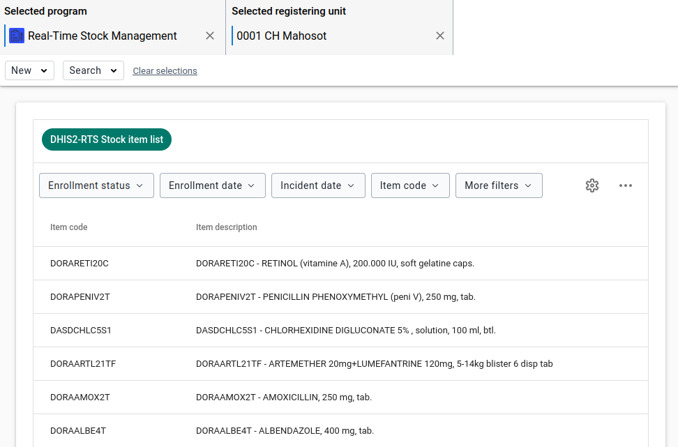

**Web portal / Line Listing app**

Digital stock card

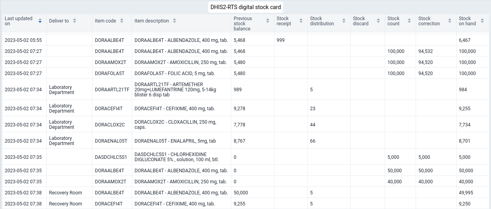

Stock distribution report

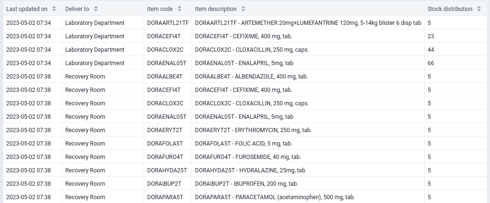

Current stock on hand

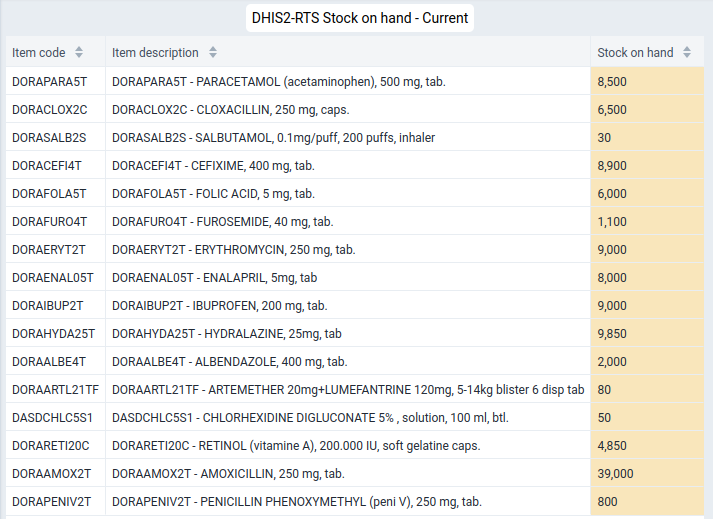

**Web portal / Data Visualizer app**

Monthly report - Summary

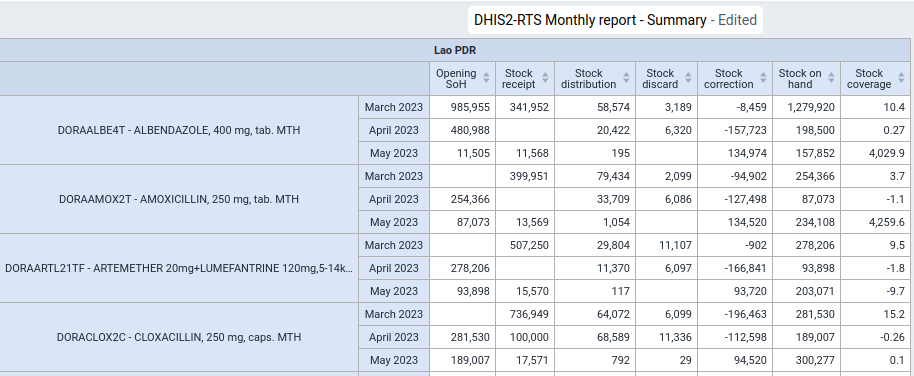

Monthly report - Detailed

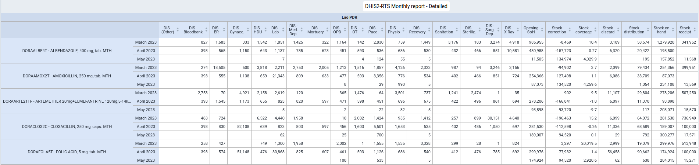

Daily report - Summary

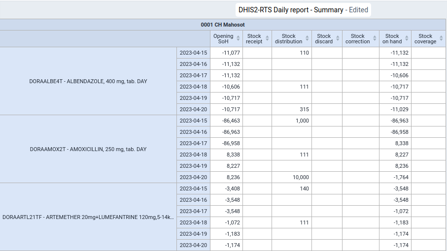

Daily report - Detailed

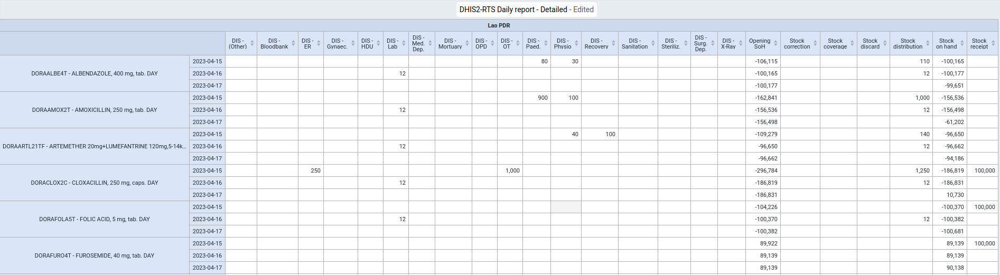

**Capture Android app**

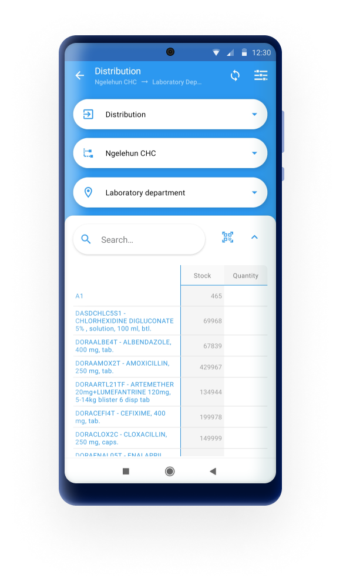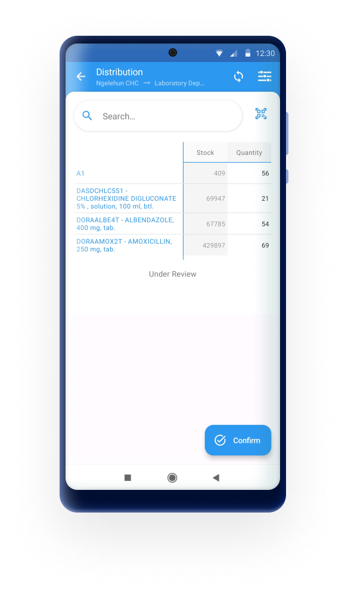

### 4 MANUAL TEMPERATURE RECORDING / "aggregate" data entry form

This simple Default Data Entry allows digitizing the the twice daily manual temperature recordings on paper forms, sharing and analysing them digitally on the DHIS2 database

#### 4.1 Use case

Twice a day, in the morning when starting work and in the afternoon before leaving, the storekeeper reads out the room temperature from the storeroom as well as each refrigerator and freezer used for storing vaccines and other drug products and records the minimum, current as well as maximum temperature on a mobile device. The storekeeper at the health care facility as well as cold chain technicians or biomedical engineers anywhere else can access the record and review the data table as well as the chart for assessing the cold chain.

#### 4.2 DHIS2 configuration

The configuration of this Default Data Entry form uses "Disaggregation categories" as this is technically the only way to display a table for recording data in the DHIS2 Capture app on a mobile device. Every refrigerator, freezer or other place (such as a store room) where temperature needs to be recorded is configured as a separate "Data element". The application uses only simple and native DHIS2 functionality.

| **CATEGORY** | **System default settings** |
| --- | --- |
| > Category option | Name:<br>\- "Current"<br>\- "Maximum"<br>\- "Minimum"<br>\- "Stock on hand"<br>\- "Temperature recording - morning"<br>\- "Temperature recording - afternoon"<br>Organisation units: assign as required |
| > Category | Name: "Temperature recording - Time of<br>day"<br>Category options:<br>\- "Temperature recording - morning"<br>\- "Temperature recording - afternoon"<br>Name: "Temperature recording - Time of<br>day"<br>Category options: "Temperature recording<br>- Measurement"<br>\- "Minimum"<br>\- "Current"<br>\- "Maximum"<br>Data dimension type: "Disaggregation"<br>(Not shared). |
| > Category combination | Name: "Monthly stock report - Data<br>collection"<br>Data dimension type: "Disaggregation"<br>Skip category total in reports: tag<br>Categories: "Monthly stock report - Data<br>collection"<br>(Not shared). |
| > Data element | Name (examples only, configure according<br>to national drug list):<br>\- "Vaccine refrigerator 1"<br>\- "Vaccine refrigerator 2"<br>Domain type (\*): "Aggregate"<br>Value type (\*): "Number"<br>Aggregation type (\*): "Sum"<br>Store zero data values: tag<br>Category combination (\*): "Health<br>facility - temperature recording"<br>(Not shared). |
| > Data set | Name: "Health facility - Temperature<br>monitoring"<br>Color:<br>"#304FFE"<br>Icon:<br>Expiry days: "2"<br>Open future periods for data entry: "1"<br>Days after period to qualify for timely<br>submission: "15"<br>Period type (\*): "Daily"<br>Category combination (\*): "None"<br>Data elements:<br>\- "Vaccine refrigerator 1"<br>\- "Vaccine refrigerator 2"<br>Organisation units: select as required<br>Sharing settings: share with users or user<br>groups as required |
| > Data visualizer | Name: "Temperature monitoring - Daily<br>reporting / Table"<br>Visualization type: "Pivot table"<br>Columns:<br>\- Data: "Vaccine refrigerator 1",<br>"Vaccine refrigerator 2"<br>\- Your Dimensions:<br>\- - "Temperature recording - Time of<br>day": "Temperature recording -<br>morning", "Temperature recording -<br>afternooon"<br>\- - "Temperature recording -<br>Measurement": "Minimum", "Current",<br>"Maximum"<br>Rows<br>\- Period: "Last 30 days"<br>Filter: Organisation Unit: select<br>Organisation units as required<br>+++<br>Name: "Temperature monitoring - Daily<br>reporting / Chart / Vaccine refrigerator 1<br>/ Last 30 days#"<br>Visualization type: "Line"<br>Series: "Temperature recording -<br>Measurement": "Minimum", "Current",<br>"Maximum"<br>Category:<br>\- "Temperature recording - Time of<br>day": "Temperature recording -<br>morning", "Temperature recording -<br>afternoon"<br>\- Period: "Relative periods" / "Days"<br>/ "Last 30 days"<br>Filter: Organisation Unit: select<br>Organisation units as required |

#### 4.3 DHIS2 user interfaces

**Web portal / Data Entry form**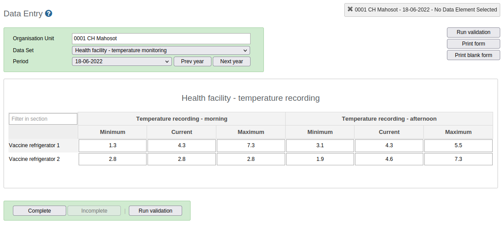

**Web portal / Data Visualizer**

Temperature monitoring - Daily reporting / Table

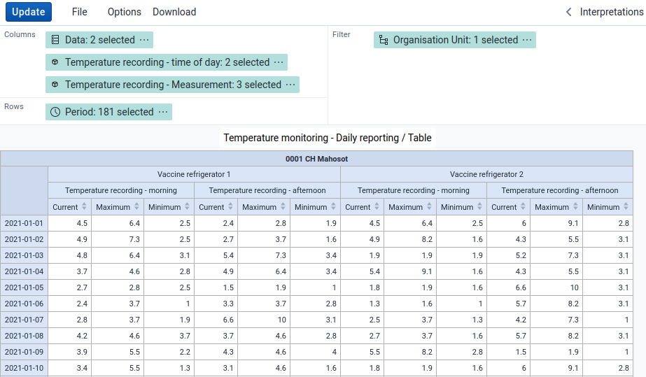

**Capture Android app**


**5** **HEALTH CARE PRODUCT CATALOGUE / Tracker program**

This simple Tracker program allows building and digitally sharing a simple product catalogue with a picture of the product as well as essential product information which health professionals can consult on a mobile device on- or offline.

#### 5.1 Use case

A health worker who requires information on what health care products are available at the respective health or requires details on the product searches on- or offline in the product catalogue, views the image, consults the specifications and (where available) opens the link to more detailed information.

#### 5.2 DHIS2 configuration

The product catalogue is configured as a very simple "Tracker program" which uses only simple, native DHIS2 functionality but without any actual program "stages".

| **CATEGORY** | **System default settings** |
| --- | --- |
| > Tracked entity attribute | Name:<br>\- "Electronic product<br>information" / "URL"<br>\- "Item barcode image" / "Text"<br>\- "Item code" / "Text"<br>\- "Item description" / "Text"<br>\- "Item group code" / "Text"<br>\- "Item group description" /<br>"Text"<br>\- "Product image" / "Image"<br>\- "Regulations" / "Text"<br>\- "Required storage temperature /<br>° Celsius" / "Text"<br>\- "Secondary packaging quantity"<br>/ "Text"<br>\- "WHO EML classification number"<br>/ "Text"<br>\- "WHO EML classification<br>description" / "Text"<br>Short Name (\*): (same as name)<br>Value type (8\*): (see above)<br>Aggregation type (\*): "None" |
| > Tracked entity type | Name: "Health care product<br>specifications"<br>Minimum number of attributes<br>required to search: "1"<br>Feature type: "None"<br>Tracked entity type attributes,<br>assign in the following order:<br>\- "Product image" [ensures image<br>is visible]<br>\- "Item code"<br>\- "Item group code"<br>\- "Item group description"<br>\- "Item description"<br>\- "Secondary packaging quantity"<br>\- "WHO EML classification number"<br>\- "WHO EML classification<br>description"<br>\- "Required storage temperature /<br>° Celsius"<br>\- "Regulations"<br>\- "Electronic product<br>information" / URL<br>\- "Item barcode image"<br>Display in list: tag all<br>Mandatory: tag all<br>Searchable: tag all |
| > Program |  |
| > 1 Program details | Name (\*): "Health care product<br>catalogue"<br>Short name (\*): "Health care<br>product catalogue"<br>Color:<br>"#F50057"<br>Icon:<br>Tracked entity type (\*): "Health<br>care product specifications"<br>Category combination (\*): "None"<br>Display front page list: tag<br>Access level: "Open"<br>Completed events expiry days: "0"<br>Expiry days: "0"<br>Minimum number of attributes<br>required to search: "1"<br>Maximum number of tracked entity<br>instance to return in search: "0" |
| > 2 Enrollment details | Show incident date: tag |
| > 3 Attributes | Assign attributes in the following |
| > | order: |
| > 1 Assign attributes | <br>\- "Item description" / <br>"Default"<br>\- "Item code" / "Bar code"<br>\- "WHO EML classification <br>description" / "Default"<br>\- "Item group code" / "Default"<br>\- "Item group description" / <br>"Default"<br>\- "WHO EML classification number" <br>/ "Default"<br>\- "Secondary packaging quantity" <br>/ "Default"<br>\- "Required storage temperature / <br>° Celsius" / "Default"<br>\- "Regulations" / "Default"<br>\- "Electronic product <br>information" / "Default"<br>\- "Item barcode image" / <br>"Default"<br>\- "Product image" / "Default"<br>Display in list: tag all<br>Mandatory: leave all untagged<br>Searchable: tag all<br>Mobile render type: (see above) |
| > 3 Attributes | "SECTION" assign Tracked entity |
| > | attributes in the following order: |
| > 2 Create registration form | <br>\- "Item code"<br>\- "Item description"<br>\- "Item group code"<br>\- "Item group description"<br>\- "Secondary packaging quantity"<br>\- "WHO EML classification number"<br>\- "WHO EML classification <br>description"<br>\- "Required storage temperature / <br>° Celsius"<br>\- "Regulations"<br>\- "Electronic product <br>information"<br>\- "Item barcode image"<br>\- "Item barcode image"<br>\- "Product image |
| > 4 Program stages | (none) |
| > 5 Access | Organisation units: assign as<br>required |
| > 6 Notifications | (none) |

#### 5.3 DHIS2 user interfaces

**Web portal / Capture app**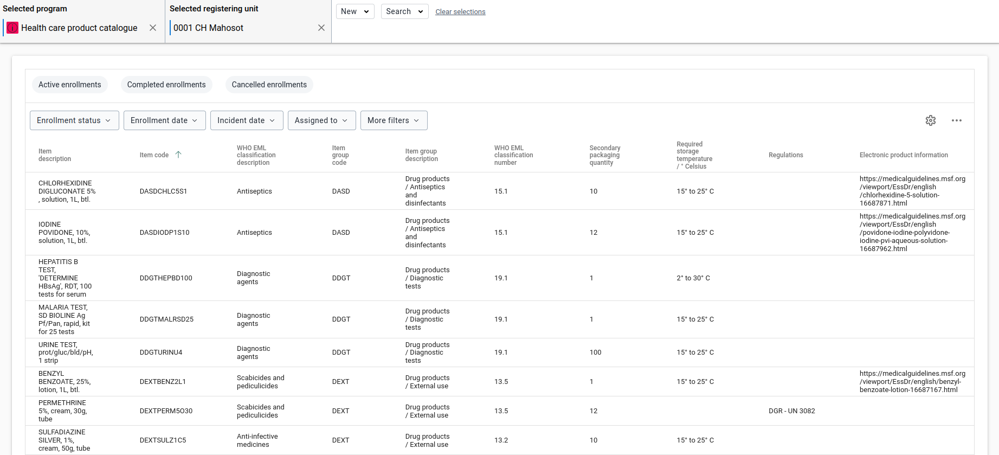

**Capture Android app**

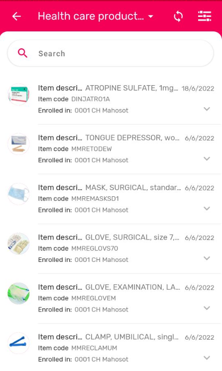

### 6 BIOMEDICAL ENGINEERING LIFE CYCLE MANAGEMENT / Tracker program

This simple Tracker program provides an asset register similar to the product catalogue which can be customized to any type of biomedical equipment, including but not limited to cold chain equipment. In addition, this mobile application allows maintaining a detailed record of installation, alarm record, equipment status, servicing, repair and disposal and thereby covering the entire life cycle of biomedical equipment with records available to health care facility staff off-line and to any other other authorized staff anywhere in the country through the web portal.

#### 6.1 Use case

The biomedical engineering or cold chain technician team establishes a detailed asset register for each health care facility or uploads data from a national database. Biomedical engineers or technicians document the installation, testing, commissioning and initial training when setting up new pieces of equipment. Health staff and/or technicians carry out period (daily/weekly/monthly) equipment checks and document alarm events, causes as well as resolution. Biomedical engineers and/or technicians maintain a detailed record for each servicing or repair which documents works, parts repaired or replaced and testing. Finally, when the equipment reaches the end of its useful life time, the decommissioning and disposal of equipment is documented before removing it from the asset register.

#### 6.2 DHIS2 configuration

This application is configured as a "Tracker program" which uses only simple, native DHIS2 functionality. The number, description and contents of each of the stages can be very easily customized to national needs without the need for any programming knowledge.

| **CATEGORY** | **System default settings** |
| --- | --- |
| > Data element | Name (for stages)<br>\- "Biomedical equipment<br>alarm" / "Long text"<br>\- "Biomedical equipment<br>disposal" / "Long text"<br>\- "Biomedical equipment<br>installation" / "Long text"<br>\- "Biomedical equipment<br>repair" / "Long text"<br>\- "Biomedical equipment<br>servicing" / "Long text"<br>\- "Biomedical equipment<br>status" / "Long text"<br>Name (for questions within<br>stages)<br>\- "Alarm cause" / "Long<br>text"<br>\- "Alarm corrective action" /<br>"Long text"<br>\- "Alarm escalated and<br>supervisor informed" / "Long<br>text"<br>\- "Alarm resolved" / "Long<br>text"<br>\- "Alarm type" / "Long<br>text"<br>\- "Audible or visible alarm"<br>/ "Long text"<br>\- "Equipment switches on" /<br>"Long text"<br>Domain type: "Tracker"<br>Value type: see above |
| > Tracked entity type attributes | Name:<br>\- "Brand name" / "Text"<br>\- "Country of Origin" /<br>"Text"<br>\- "Department of<br>installation" / "Text"<br>\- "Equipment code" / "Text"<br>\- "Equipment image" /<br>"Text"<br>\- "Equipment model" /<br>"Text"<br>\- "Manufacturer" / "Text"<br>\- "Provided by" / "Text"<br>\- "Serial Number" / "Text"<br>\- "Type of equipment" /<br>"Text"<br>\- "Warranty expiry date" /<br>"Text"<br>Aggregation type (\*): "None" |
| > Tracked entity type | Name: "Biomedical equipment<br>life cycle management"<br>Enable tracked entity instance<br>audit log: tag<br>Minimum number of attributes<br>required to search: 1<br>Maximum number of tracked entity<br>instances to return in search:<br>100<br>Tracked entity type attributes<br>(assign in the following order):<br>\- "Equipment image" /<br>"Text"<br>\- "Type of equipment" /<br>"Text"<br>\- "Brand name" / "Text"<br>\- "Equipment model" /<br>"Text"<br>\- "Equipment code" / "Text"<br>\- "Manufacturer" / "Text"<br>\- "Country of Origin" /<br>"Text"<br>\- "Department of<br>installation" / "Text"<br>\- "Provided by" / "Text"<br>\- "Serial Number" / "Text"<br>\- "Warranty expiry date" /<br>"Text"<br>\- "Unique identification<br>number" / "Text"<br>Display in list: tag all<br>Mandatory: leave untagged<br>Searchable: tag all except for<br>"Equipment image" |
| > Program |  |
| > 1 Program details | Name (\*): "Biomedical<br>equipment life cycle<br>management"<br>Short name (\*): "Biomedical<br>equipment life cycle<br>management"<br>Color:<br>"#6<br>200EA"<br>Icon:<br>Tracked entity type (\*):<br>"Biomedical equipment life<br>cycle management"<br>Category combination (\*):<br>"None"<br>Display front page list: tag<br>Access level: "Open"<br>Completed events expiry days:<br>"0"<br>Expiry days: "0"<br>Minimum number of attributes<br>required to search: "1"<br>Maximum number of tracked entity<br>instances to return in search:<br>"0" |
| > 2 Enrollment details | Allow future enrollment dates:<br>tag<br>Show incident data: tag<br>Ignore overdue events: do not<br>tag |
| > 3 Attributes | Program tracked entity |
| > | attributes (assign in the |
| > 1 Assign attributes | following order):<br>\- "Unique identification <br>number" / "Text"<br>\- "Type of equipment" / <br>"Text"<br>\- "Equipment image" / <br>"Text"<br>\- "Department of <br>installation" / "Text"<br>\- "Manufacturer" / "Text"<br>\- "Brand name" / "Text"<br>\- "Equipment model" / <br>"Text"<br>\- "Equipment code" / "Text"<br>\- "Serial Number" / "Text"<br>\- "Country of Origin" / <br>"Text"<br>\- "Provided by" / "Text"<br>\- "Warranty expiry date" / <br>"Text"<br>Display in list: tag all<br>Mandatory: not tagged<br>Searchable: tag all except <br>"Equipment image"<br>Mobile render type: "Default" <br>except "Qr code" for "Unique <br>identification number" |
| > 3 Attributes | Name: "Biomedical life cycle |
| > | equipment monitoring" |
| > 2 Create registration form | <br>"SECTION" assign Tracked <br>entity attributes in the <br>following order:<br>\- "Type of equipment" / <br>"Text"<br>\- "Department of <br>installation" / "Text"<br>\- "Unique identification <br>number" / "Text"<br>\- "Manufacturer" / "Text"<br>\- "Brand name" / "Text"<br>\- "Equipment model" / <br>"Text"<br>\- "Equipment code" / "Text"<br>\- "Serial Number" / "Text"<br>\- "Country of Origin" / <br>"Text"<br>\- "Provided by" / "Text"<br>\- "Equipment image" / <br>"Text"<br>\- "Warranty expiry date" / <br>"Text" |
| > 4 Program stages | Name: "Biomedical equipment<br>installation"<br>Assign data elements / Create<br>data entry form "BASIC":<br>\- "Biomedical equipment<br>installation"<br>Name: "Biomedical equipment<br>alarm" / "Repeatable"<br>Assign data elements / Create<br>data entry form "BASIC":<br>\- "Alarm type"<br>\- "Alarm cause"<br>\- "Alarm corrective action"<br>\- "Alarm resolved"<br>\- "Alarm escalated and<br>supervisor informed"<br>Name: "Biomedical equipment<br>status" / "Repeatable"<br>Assign data elements / Create<br>data entry form "BASIC":<br>\- "Biomedical equipment<br>status"<br>Name: "Biomedical equipment<br>servicing" / "Repeatable"<br>Assign data elements / Create<br>data entry form "BASIC":<br>\- "Biomedical equipment<br>servicing"<br>Name: "Biomedical equipment<br>repair" / "Repeatable"<br>Assign data elements / Create<br>data entry form "BASIC":<br>\- "Biomedical equipment<br>repair"<br>Name: "Biomedical equipment<br>disposal"<br>Assign data elements / Create<br>data entry form "BASIC":<br>\- "Biomedical equipment<br>disposal"<br>Display generate event box when<br>completed: tag<br>Auto-generate event: tag<br>Hide due date: tag |
| > 5 Access | Organisation units: assign as<br>requested |
| > 6 Notifications | (not applicable) |
| > Line Listing | Name: "Biomedical equipment<br>alarm report"<br>Columns:<br>\- "Last updated on"<br>\- "Type of equipment"<br>\- "Brand name"<br>\- "Alarm type"<br>\- "Alarm cause" / Condition<br>"is not empty / not null"<br>(optional)<br>\- "Alarm corrective action"<br>\- "Alarm resolved"<br>\- "Alarm escalated and<br>supervisor informed"<br>Filter<br>\- Organisation Unit: select<br>Organisation units as required<br>\- Event date: "Last 3 months"<br>Name (configure the reports<br>accordingly):<br>\- "Biomedical equipment<br>disposal report"<br>\- "Biomeical equipment repair<br>report"<br>\- "Biomedical equipment<br>service report"<br>\- "Biomedical equipment status<br>report" |

#### 6.3 DHIS2 user interfaces

**Web portal / Tracker program**

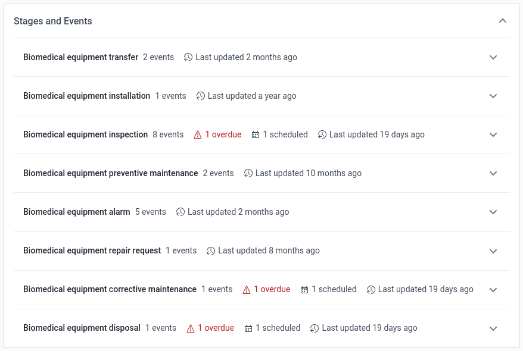

**Web portal / Line listing**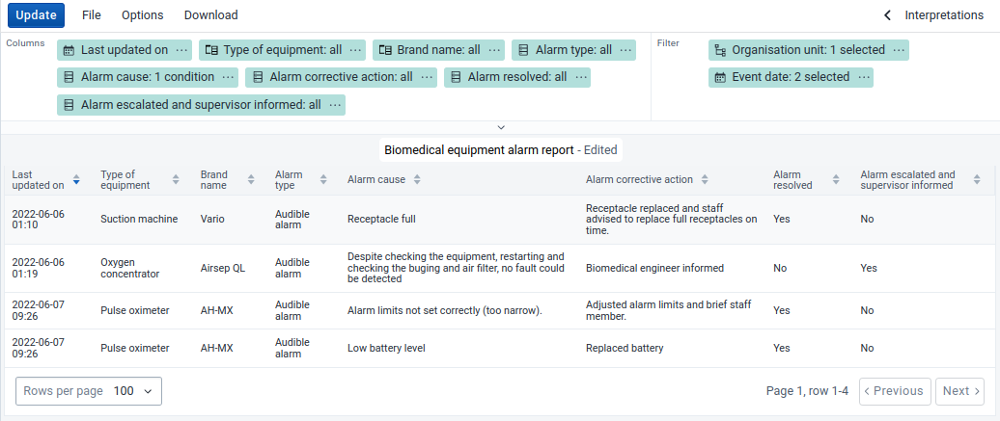

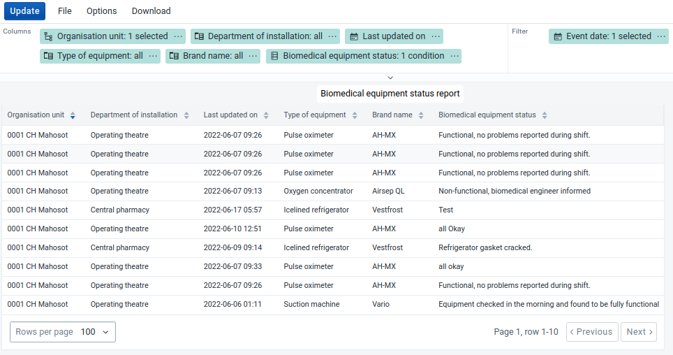

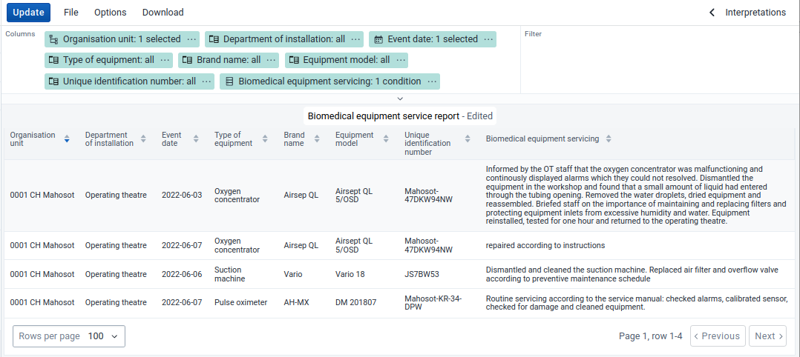

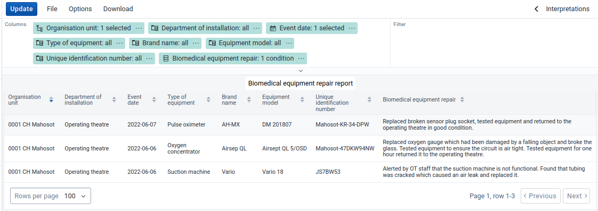

**Capture Android app**

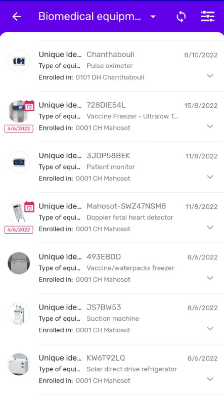

### 7 COLD CHAIN EQUIPMENT LIFECYCLE MANAGEMENT / Tracker program

This very simple Tracker program is very similar to the biomedical equipment lifecycle management solution but customized for cold chain equipment and considers the World Health Organization PQS (Program Quality Standards) appliance catalogue as well as the WHO PQS standard for Global asset identification.

In addition it offers a solution for creating and maintaining a dedicated catalogue of (selected) prequalified equipment which serves as a template for registering and enrolling new cold chain appliances. This allows "copying" the template of any specific prequalified appliance and adding device specific attributes such as the serial number or manufacturing date.

For purposes of demonstration a few specifications of a few refrigerators and freezers from the WHO PQS catalogue are configured but the same approach can be used for any other type of health care equipment.

#### 7.1 Use case

The cold chain equipment lifecycle management "Tracker program " allows establishing, updating and maintaining a complete catalogue of cold chain appliances with all their "generic" specifications commonly used in the country with .

Whenever a new piece of cold chain appliance is delivered to and installed at a healthcare facility, the respective "generic" appliance is selected from the national catalogue and "enrolled" in the "Cold chain equipment lifecycle management / Tracker program" of the respective "Organisation Unit". The "enrolment" is completed with device specific attributes such as the manufacturing date, GTIN and serial number which can be "copied" directly from the scanned GS1 DataMatrix code attached to the appliance.

For healthcare facilities where cold chain appliance are not yet furnished with GS1 DataMatrix codes, alternatively a unique identifier can be assigned to every appliance.

#### 7.2 DHIS2 configuration

This application is configured as a "Tracker program" which uses only simple, native DHIS2 functionality. The number, description and contents of each of the stages can be very easily customized to national needs without any programming knowledge.

| **CATEGORY** | **System default settings** |
| --- | --- |
| > Organisation unit | In addition to the national health<br>facility register and structure,<br>create a OU for the PQS catalogue<br>repository:<br>Name (\*): "World Health<br>Organization PQS catalogue"<br>Short name (\*): "WHO PQS<br>catalogue" |
| > Data element | Name:<br>\- "Alarm cause" / "Long text"<br>\- "Alarm corrective action" /<br>"Long text"<br>\- "Alarm escalated to supervisor"<br>/ "Yes/No"<br>\- "Alarm resolved" / "Yes/No"<br>\- "Alarm type" / "Long text"<br>\- "Assessment of technical fault"<br>/ "Long text"<br>\- "Clean refrigerator with water<br>and mild detergent" / "Yes/No"<br>\- "Clean the grill on the side of<br>the refrigerator" / "Yes/No"<br>\- "Cold chain appliance<br>installation report" / "Long<br>text"<br>\- "Cold chain appliance product<br>number" / "Long text"<br>\- "Cold chain appliance restored<br>to service" / "Yes/No"<br>\- "Cold chain technician" /<br>"User name "<br>\- "Daily inspection completed" /<br>"Yes/No"<br>\- "Daily tasks completed" /<br>"Yes/No"<br>\- "Defect image" / "Image"<br>\- "Equipment removed from cold<br>chain appliance inventory" /<br>"Yes/No"<br>\- "Interventions" / "Long text"<br>\- "Lid gasket checked for sealing<br>when the lid is closed" / "Yes/No"<br>\- "Method of disposal" / "Long<br>text"<br>\- "Monthly tasks" / "Long text"<br>\- "Reason for disposal" / "Long<br>text"<br>\- "Reason for repair request" /<br>"Long text"<br>\- "Received at" / "Organisation<br>unit"<br>\- "Received from" /<br>"Organisation unit"<br>\- "Sent from" / "Organisation<br>unit"<br>\- "Technical fault resolved" /<br>"Yes/No"<br>\- "Transferred to" /<br>"Organisation unit"<br>\- "Urgency of repair request" /<br>"Long text"<br>\- "Water droplets wiped off from<br>the inside wall" / "Yes/No"<br>\- "Water removed at the bottom of<br>the refrigerator" / "Yes/No"<br>\- "Weekly tasks" / "Text"<br>Domain Type (\*): "Tracker"<br>Value type (\*): see above<br>Aggregation type (\*): "None" |
| > Tracked entity attribute | Name (\*):<br>\- "Appliance image" / "Image"<br>\- "Company" / "Text"<br>\- "Energy source" / "Text"<br>\- "Freezer gross volume (litres)"<br>/ "Number"<br>\- "GS1 GIAI" / "Text"<br>\- "GTIN" / "Text"<br>\- "Manufactured in" / "Text"<br>\- "Manufacturer\'s reference" /<br>"Text"<br>\- "Place of installation" /<br>"Text"<br>\- "PQS code" / "Text"<br>\- "PQS code category" / "Text"<br>\- "Product number" / "Text"<br>\- "Production date" / "Date"<br>\- "Product number" / "Text"<br>\- "Serial number" / "Text"<br>\- "Type of appliance" / "Text"<br>\- "Unique identifier" / "Text"<br>\- "Vaccine gross volume (litres)"<br>/ "Number"<br>\- "Vaccine storage capacity<br>(litres)" / "Number"<br>Name (\*): (see above)<br>Short name (\*): same as "Name<br>(\*)".<br>Value type: "Text".<br>Aggregation type: "None"<br>Inherit: check (appears as a blue<br>tag with a white tick) |
| > Tracked entity type | Name (\*): "Cold chain appliance"<br>Color": leave empty<br>Icon": leave empty<br>Description": leave empty<br>Enable tracked entity instance audit<br>log: check (appears as white tick in<br>a blue box)<br>Minimum number of attributes<br>required to search: 1<br>Tracked entity type attributes:<br>assign the following Tracked entity<br>attributes in this order<br>\- "Appliance image" / "Image"<br>\- "Place of installation" /<br>"Text"<br>\- "PQS code category" / "Text"<br>\- "PQS code" / "Text"<br>\- "Type of appliance" / "Text"<br>\- "Company" / "Text"<br>\- "Manufactured in" / "Text"<br>\- "Manufacturer\'s reference" /<br>"Text"<br>\- "Energy source" / "Text"<br>\- "Vaccine storage capacity<br>(litres)" / "Number"<br>\- "Vaccine gross volume (litres)"<br>/ "Number"<br>\- "Freezer gross volume (litres)"<br>\- "Production date" / "Date"<br>\- "Product number" / "Text"<br>\- "GTIN" / "Text"<br>\- "Serial number" / "Text"<br>\- "GS1 GIAI" / "Text"<br>\- "Unique identifier" / "Text"<br>\- "Unique identifier scan" /<br>"Text"<br>\- "Donated by" / "Text"<br>Display in list: tag all<br>Searchable: tag except for<br>"Appliance image", "Manufactured<br>in" and "Production date" |
| > Program |  |
| > 1 Program details | Name (\*): "Cold chain appliance<br>lifecycle<br>management"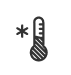<br>Short name (\*): " Cold chain<br>appliance lifecycle management".<br>Color: "#64B5F6"<br>Icon: "cold chain outline"<br>Tracked entity type (\*): select<br>"Cold chain appliance".<br>Category combination (\*): select<br>"None".<br>Display front page list: tag |
| > 2 Enrollment details | Allow future enrollment dates: do<br>not tag<br>Allow future incident dates: do not<br>tag<br>Only enrol once (per tracked entity<br>instance lifetime): do not tag<br>Show incident date: tag<br>Description of incident date: "Cold<br>chain appliance management"<br>Description of enrollment date:<br>leave blank<br>Ignore overdue events: leave<br>untagged.<br>Feature type: "Point"<br>Related program: (blank)<br>Note that the "Feature type" will<br>prompt the user to enter the<br>geolocation during registration (by<br>entering longitude and latitude on<br>the web or selecting the pin icon on<br>a mobile device). |
| > 3 Attributes | "Program tracked entity |
| > | attributes": select and arrange in |
| > 1 Assign attributes | the following order:<br>\- "Appliance image"<br>\- "Place of installation"<br>\- "PQS code category"<br>\- "PQS code"<br>\- "Type of appliance"<br>\- "Company"<br>\- "Manufactured in"<br>\- "Manufacturer\'s reference"<br>\- "Production date"<br>\- "Product number"<br>\- "GTIN"<br>\- "Serial number"<br>\- "GS1 GIAI"<br>\- "Unique identifier"<br>Display in list: tag all<br>Mobile render type: see above |
| > 3 Attributes | Name: "Cold chain appliance |
| > | lifecycle management" |
| > 2 Create registration form | <br>\- "Appliance image"<br>\- "Place of installation"<br>\- "PQS code category"<br>\- "PQS code"<br>\- "Type of appliance"<br>\- "Company"<br>\- "Manufactured in"<br>\- "Manufacturer\'s reference"<br>\- "Production date"<br>\- "Product number"<br>\- "GTIN"<br>\- "Serial number"<br>\- "GS1 GIAI"<br>\- "Unique identifier" |
| > 4 Program stages | Name: |
| > |  |
| > 1 Stage details | \- "Cold chain appliance transfer" <br>/ "Repeatable"<br>\- "Cold chain appliance <br>installation" / "Repeatable"<br>\- "Cold chain appliance <br>inspection" / "Repeatable"<br>\- "Cold chain appliance weekly <br>preventive maintenance" / <br>"Repeatable"<br>\- "Cold chain appliance monthly <br>preventive maintenance" / <br>"Repeatable"<br>\- "Cold chain appliance alert" / <br>"Repeatable"<br>\- "Cold chain appliance repair <br>request" / "Repeatable"<br>\- "Cold chain appliance corrective <br>maintenance" / "Repeatable"<br>\- "Cold chain appliance disposal" <br>/ not repeatable<br>Repeatable: see above |
| > 4 Program stages | **Cold chain appliance transfer** |
| > |  |
| > 2 Assign data elements | \- "Sent from"<br>\- "Transferred to"<br>\- "Received from"<br>\- "Received at"<br>**Cold chain appliance <br>installation**<br>\- "Cold chain appliance <br>installation report"<br>**Cold chain appliance inspection**<br>\- "Daily inspection completed"<br>\- "Functional status"<br>**Cold chain appliance weekly <br>preventive maintenance**<br>\- "Water removed at the bottom of <br>the refrigerator"<br>\- "Water droplets wiped off from <br>the inside wall"<br>\- "Lid gasket checked for sealing <br>when the lid is closed"<br>**Cold chain appliance monthly <br>preventive maintenance**<br>\- "Clean refrigerator with water <br>and mild detergent"<br>\- "Clean the grill on the side of <br>the refrigerator"<br>**Cold chain appliance alarm**<br>\- "Alarm type"<br>\- "Alarm cause"<br>\- "Alarm corrective action"<br>\- "Alarm resolved"<br>\- "Alarm escalated to supervisor"<br>**Cold chain appliance repair <br>request**<br>\- "Reason for repair request"<br>\- "Urgency of repair request"<br>\- "Defect image"<br>\- "Cold chain technician"<br>**Cold chain appliance corrective <br>maintenance**<br>\- "Assessment of technical fault"<br>\- "Interventions"<br>\- "Technical fault resolved"<br>\- "Equipment restored to service"<br>**Cold chain appliance disposal**<br>\- "Reason for disposal"<br>\- "Method of disposal"<br>\- "Equipment removed from cold <br>chain appliance inventory"<br>Display in report: make visible for <br>all items<br>Mobile render type: "Default"<br>Desktop render type: "Default" |
| > 4 Program stages | "BASIC" is configured by default, |
| > | no configuration is needed. |
| > 3 Create data entry form |  |
| > 5 Access | "Organisation units": tag the<br>health care facility for assigning<br>to the DHIS2 Capture.<br>"Roles and access": "Biomedical<br>equipment life cycle management"<br>appears by default<br>"SELECT ALL" |
| > 6 Notifications | (not applicable) |
| > Relationship type | Name (\*): "World Health<br>Organization PQS catalogue"<br>Relationship name seen from<br>initiating entity (\*): "World<br>Health Organization PQS catalogue"<br>From constraint (\*): "Tracked<br>entity instance"<br>Tracked entity type \*: "Cold chain<br>appliance"<br>Program: "Cold chain appliance<br>lifecycle management"<br>To constraint (\*): "Tracked entity<br>instance"<br>Tracked entity type \*: "Cold chain<br>appliance"<br>Program: "Cold chain appliance<br>lifecycle management" |
| > Program rule | Program (\*): "Cold chain appliance<br>lifecycle management"<br>Name (\*): "GS1 GIAI<br>specifications"<br>Description: "Parses the GS1 GIAI,<br>"extracts" GTIN, serialized number<br>and production date and writes them<br>to the respective attribute<br>fields".<br>Condition: "d2:hasValue(A{GS1<br>GIAI})"<br>Action "Assign value"<br>GTIN<br>\- Tracked entity attribute to<br>assign to: "GTIN"<br>\- Expression to evaluate and<br>assign:<br>"d2:extractDataMatrixValue(<br>\'gtin\', A{GS1 GIAI})"<br>Production date<br>\- Tracked entity attribute to<br>assign to: "Production date"<br>\- Expression to evaluate and<br>assign:<br>"d2:extractDataMatrixValue(<br>\'production date\', A{GS1 GIAI})"<br>Serial number<br>\- Tracked entity attribute to<br>assign to: "Serial number"<br>\- Expression to evaluate and<br>assign:<br>"d2:extractDataMatrixValue(<br>\'serial number\', A{GS1 GIAI})" |
| > Program rule variable | Name: "GS1 GIAI"<br>Source type (\*): "Tracked entity<br>attribute"<br>Tracked entity attribute: "Cold<br>chain appliance lifecycle management<br>GS1 GIAI" |
| > Line Listing | Name: "Cold chain equipment<br>lifecycle management"<br>Columns:<br>\- "Last updated on"<br>\- "Type of equipment"<br>\- "Brand name"<br>\- "Alarm type"<br>\- "Alarm cause" / Condition "is<br>not empty / not null" (optional)<br>\- "Alarm corrective action"<br>\- "Alarm resolved"<br>\- "Alarm escalated and supervisor<br>informed"<br>Filter<br>\- Organisation Unit: select<br>Organisation units as required<br>\- Event date: "Last 3 months" |
| > Android Settings app | Appearance \> Program \> Specific<br>settings \> Add a Program Setting<br>Select "Cold chain appliance<br>lifecycle management"<br>Allow the user to create a TEI<br>without searching: check (appears as<br>a white tick in a green box)<br>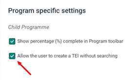 |

#### 7.3 DHIS2 user interfaces

**Web portal / Tracker program**

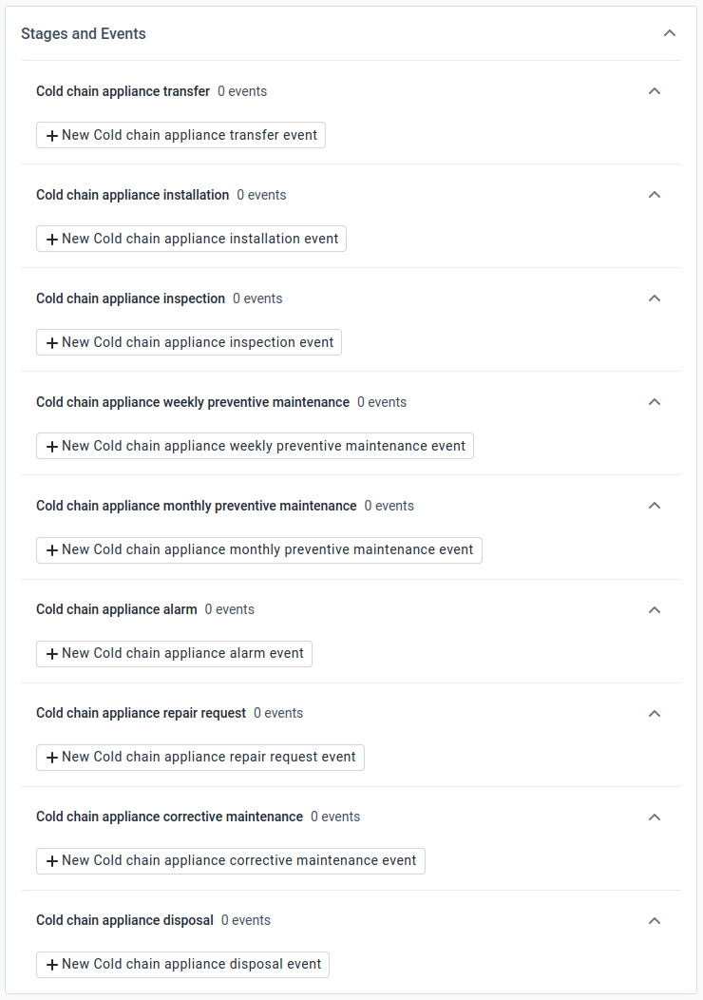

**Web portal / Line listing**


**Capture Android app**

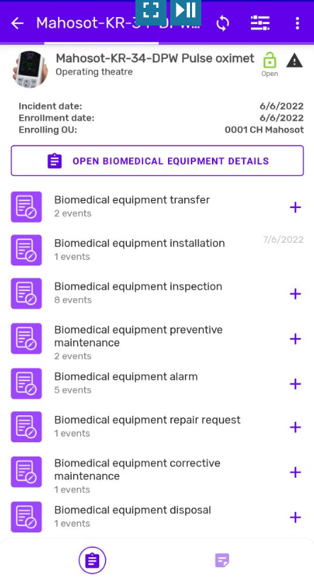

#### 7.4 Workflow for registering new appliances

While details on all DHIS2 workflows are available in the general DHIS2 documentation and although the "cloning" of appliances uses only native DHIS2 functionality, it is an "edge case", a very specific use of the "Relationship" function and therefore the steps are explained below:

The workflow below explains the workflow for the following example:

A new icelined refrigerator (E003/007) has been delivered to the health facility (OU) "0001 CH Mahosot". The user "registers" and "enrols" this new appliance using the default specifications from the catalogue of PQS pre-qualified appliances in the "World Health Organization PQS catalogue". These "generic" appliance specifications are then "copied" for creating a new appliance at the "0001 CH Mahosot" before adding the appliance specific attributes such as the serial number or the manufacturing date. User:

- opens the DHIS2 Capture Android app on a mobile device and authenticates: the DHIS2 home screen opens showing all Programs and Data sets

- select "Cold chain equipment lifecycle management": a list of all registered and enrolled appliances is displayed

- selects "World Health Organization PQS catalogue" from the "ORG. UNIT" filter: a catalogue with all of the PQS pre-qualified appliances appears

- searches for and selects the cold chain appliance which is being installed: a single appliance is listed

- taps on the cold chain appliance: the TEI dashboard of the Tracker Program for this particular appliance is displayed

- taps on the "Relationship" icon at the bottom in the middle: a separate dialogue window opens

- taps on the "+" icon: a list of available "Relationships" appears
- selects "World Health Organization PQS catalogue" from the list of "Relationships": a separate dialogue window opens

- taps in the header "All Cold chain appliance": a drop-down dialogue window opens

- selects "Cold chain appliance lifecycle management": a list of appliances appears

_Note: this screen may look like "back to square one" (as it looks like the home screen) but is a necessary step in the whole process_

- selects the "+ Create new" icon at the right bottom of the screen: the OU dialogue window opens

- selects the "Organisation unit" where the appliance is being installed by checking the box (in our example "0001 CH Mahosot")

- selects the "Done" icon: the calendar dialogue window opens: by default the current date is pre-selected

- selects the installation data of the appliance from the calendar
- selects the "ACCEPT" icon: the dialogue window of the "cloned" (newly "registered" and "enrolled" device) with the selected "Enrolloing OU" and "Enrollment date" is displayed

- expands the lower section "2 Cold chain appliance lifecycle management" by tapping on the caret down (inverted caret) symbol ( ): the list of specifications (Tracked Entity Attributes) is displayed

- scans the GS1 DataMatrix code on the appliance which "populates" the GTIN, serialized number and production date fields automatically (if no GS1 DataMatrix code is available, those details are entered manually)

- completes the "Place of installation"
- selects the pin icon to record the geolocation (longitude/latitude) of the place of installation

- selects the blue "Save" icon at the bottom right: the dialogue window displaying all available "Relationships" is displayed

- selects the red trash icon displayed next to the "Relationship" entry: "There are no relationships, click + to add a new one" appears

_Note that once the new appliance has been "cloned" in the health facility where the appliance is installed, there is no need to maintain any "Relationship" with "World Health Organization PQS catalogue" catalogue item._

- selects the back arrow: the "cloned" appliance appears on the Tracker Program home screen

- taps on the grey synchronization icon appearing next to the "cloned" appliance: the "Sync needed" dialogue window opens

- taps on the "Send" icon: the new appliance is synchronized with the central server (provided a network connection is available)

- continues work or closes the Capture Android app.

Note that this workflow is currently only available in Capture Android app as the DHIS2 web app does not (yet) allow changing the Organisation Unit (OU) when creating a new Tracked Entity Instance (TEI) but this enhancement is planned for future DHIS2 versions.

**8** **GS1 DATAMATRIX CODE PARSING / Event program**

This Event program allows any DHIS2 user to "read" GS1 DataMatrix codes and parse ("split") the information stored in the alphanumeric text string into their components as indicated by their Application Identifiers (AIs). This Event program is intended for demonstrating DHIS2 capabilities which can be integrated into other applications such as for Traceability and Verification System (TRVST) and the biomedical engineering life cycle management in future.

Currently there are two use cases: reading GS1 DataMatrix codes printed on health care products and reading out the product identification number, batch number, expiry date and serialized number (unit pack number) and presenting them in the correct human readable format. Secondly, to read GS1 DataMatrix codes standardized according to the World Health Organization PQS performance specification E003 for "Global asset identification" and reading out the production identification number (Global Trade Item Number GTIN), production date, unique serial number and the PQS number.

#### 8.1 Use case

A storekeeper or a health worker such as an immunization worker, scans the GS1 DataMatrix code at the point of dispensing or before administering a vaccination for:

- Recording the batch number and serialized number in the eRegistry of the patient

- Referencing the batch numer and serilized number in case of an AEFI (Adverse Effect Following Immunization)

- Identifying batches subject to a batch recall
- Managing of health care products at the batch level
- Alerting users in case health care products have expired
- Complying with national Track & Trace regulations (in force in many countries since 2019)

- Drug quality verification for detecting counterfeit or falsified health care products

- "Decommissioning" serialized numbers in national or global Track & Trace databases

- Tracking unit packs end to end through global supply networks
- Matching unit pack distribution paths with temperature records of storage equipment

- Identifying cold chain equipment assets (and other biomedical equipment) through a unique GS1 DataMatrix code.

#### 8.2 DHIS2 configuration

| **CATEGORY** | **System default settings** |
| --- | --- |
| > Data element | Name (\*):<br>\- "Batch number" / "Text"<br>\- "Expiration date" / "Text"<br>\- "Global Individual Asset<br>Identifier (GIAI)" / "Text"<br>\- "GS1 DataMatrix code data<br>string" / "Text"<br>\- "PQS number" / "Text"<br>\- "Production date" / "Text"<br>\- "Product identification<br>number" / "Text"<br>\- "Remaining shelf life"<br>\- "Serialized number":<br>"Text"<br>Short name (\*): same as "Name<br>(\*)"<br>Domain type (\*): "Tracker"<br>Value type (\*): see above |
| > Program |  |
| > 1 Program details | Name: "GS1 DataMatrix code<br>parsing"<br>Color:<br>"\<br>#8E24AA"<br>Icon:<br>Short name: "GS1 DataMatrix code<br>parsing"<br>Category combination (\*):<br>"None"<br>Expiry days: "0"<br>Block entry form after completed:<br>tag<br>Validation strategy (\*): "On<br>complete"<br>Pre-generate event UID: tag |
| > 2 Assign data elements | Assign Data elements in the<br>following order:<br>\- "GS1 DataMatrix code data<br>string"<br>\- "Product identification<br>number"<br>\- "Batch number"<br>\- "Serialized number"<br>\- "Expiration date"<br>\- "Production date"<br>\- "PQS number"<br>\- "Global Individual Asset<br>Identifier (GIAI)"<br>Allow provided elsewhere: tag all<br>Display in reports: select all<br>Mobile render type: "Default"<br>except "Qr code" for "GS1<br>DataMatrix code data string" |
| > 3 Create data entry form | BASIC<br>"GS1 DataMatrix code data<br>string"<br>"Product identification number"<br>"Batch number"<br>"Serialized number"<br>"Expiration date"<br>"Production date"<br>"PQS number"<br>"Global Individual Asset<br>Identifier (GIAI)" |
| > 4 Access | \- Select all 5 health care<br>facilities in Mali |
| > 5 Create notifications | (not applicable) |
| > Program rule | Program (\*): "GS1 DataMatrix<br>code parsing" |
| 1 Enter Program rule details | <br>Name (\*): "GS1 DataMatrix code <br>parsing"<br>Description: "Parsing of GS1 <br>DataMatrix code string into <br>product identification number, <br>batch number, expiration date (as <br>represented in the data string) <br>and serial number as well <br>reformatted expiration date" |
| 2 Enter Program rule expression | d2:hasValue( #{GS1 DataMatrix<br>code data string} ) |
| 3 Define program rule actions | Action: "Assign value"<br>Data element to assign to:<br>"[Batch number]{.underline}"<br>Expression to evaluate and<br>assign:<br>"d2:extractDataMatrixValue(<br>\'lot number\', #{GS1 DataMatrix<br>code data string})"<br>Action: "Assign value"<br>Data element to assign to:<br>"[Expiration date]{.underline}"<br>Expression to evaluate and<br>assign:<br>"d2:extractDataMatrixValue(<br>\'expiration date\', #{GS1<br>DataMatrix code data string})"<br>Action: "Assign value"<br>Data element to assign to:<br>"[Global Individual Asset<br>Identifier (GIAI)]{.underline}"<br>Expression to evaluate and<br>assign:<br>"d2:extractDataMatrixValue(<br>8004, #{GS1 DataMatrix code data<br>string})"<br>Action: "Assign value"<br>Data element to assign to: "[PQS<br>number]{.underline}"<br>Expression to evaluate and<br>assign:<br>"d2:extractDataMatrixValue( 22,<br>#{GS1 DataMatrix code data<br>string})"<br>Action: "Assign value"<br>Data element to assign to:<br>"[Production date]{.underline}"<br>Expression to evaluate and<br>assign:<br>"d2:extractDataMatrixValue(<br>\'production date\', #{GS1<br>DataMatrix code data string})"<br>Action: "Assign value"<br>Data element to assign to:<br>"[Product identification<br>number]{.underline}"<br>Expression to evaluate and<br>assign:<br>"d2:extractDataMatrixValue(<br>\'gtin\', #{GS1 DataMatrix code<br>data string})<br>Action: "Assign value"<br>Data element to assign to:<br>"[Serialized<br>number]{.underline}"<br>Expression to evaluate and<br>assign:<br>"d2:extractDataMatrixValue(<br>\'serial number\', #{GS1<br>DataMatrix code data string})" |
| > Program rule variable | Program (\*): "GS1 DataMatrix<br>code parsing"<br>Name (\*): "GS1 DataMatrix -<br>Expiration date dd-mm-yyyy<br>Source type (\*): "Data element<br>in current event"<br>Data element: "Expiration date<br>dd-mm-yyyy"<br>Program (\*): "GS1 DataMatrix<br>code parsing"<br>Name (\*): "GS1 DataMatrix code<br>data string"<br>Source type (\*): "Data element<br>in current event"<br>Data element: "GS1 DataMatrix<br>code data string" |
| > Program indicator | A separate Program indicator has<br>to be created for every "pair"<br>of item description and<br>transaction type. For example:<br>DASDCHLC5S1 - Distribution |
| 1 Program indicator details | \- Program (\*): Real-Time Stock<br>Management<br>\- Name (\*): DASDCHLC5S1 -<br>Distribution<br>\- Aggregation type: "Sum"<br>\- Analytics type (\*): "Event"<br>\- Analytics period boundaries:<br>\- - Boundary target: "Event<br>date"<br>\- - Analytics period boundary<br>type: "After start of reporting<br>period"<br>\- - Offset period by amount: 0<br>\- - Period type: (leave blank)<br>\- - Boundary target: "Event<br>date"<br>\- - Analytics period boundary<br>type: "Before end of reporting<br>period"<br>\- - Offset period by amount: 0<br>\- - Period type: (leave blank)<br>\- Display in form: select<br>(appears as a white tick in a<br>blue square) |
| 2 Edit expression | \- #{CSszngrLaoW.smwdEfUz8vo}<br>"Stock on Hand\\.Stock<br>distribution" |
| 3 Edit filter | \- A{XYvrLoYSMRU} ==<br>\'DASDCHLC5S1\'<br>"Item code == \'DASDCHLC5S1\'" |
| > Android Settings app | Appearance \> Program \> Specific<br>settings \> Add a Program Setting<br>Select "Cold chain appliance<br>lifecycle management"<br>Allow the user to create a TEI<br>without searching: check (appears<br>as a white tick in a green box)<br> |

#### 8.3 DHIS2 user interfaces

**Web portal / Tracker program**


**Web portal / Line listing program**


**Capture Android app**


