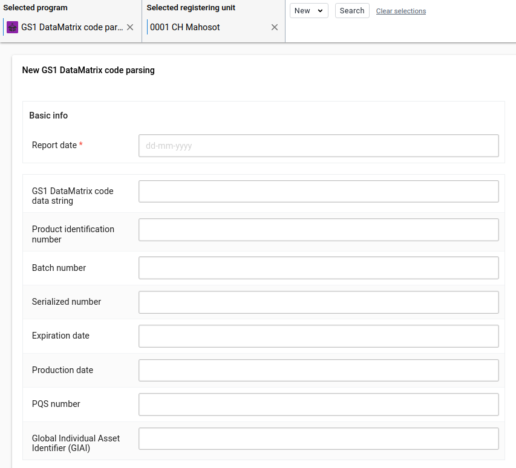
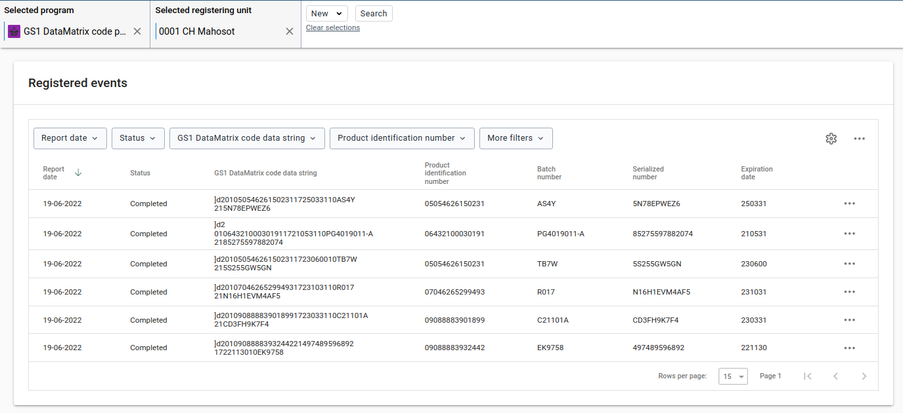
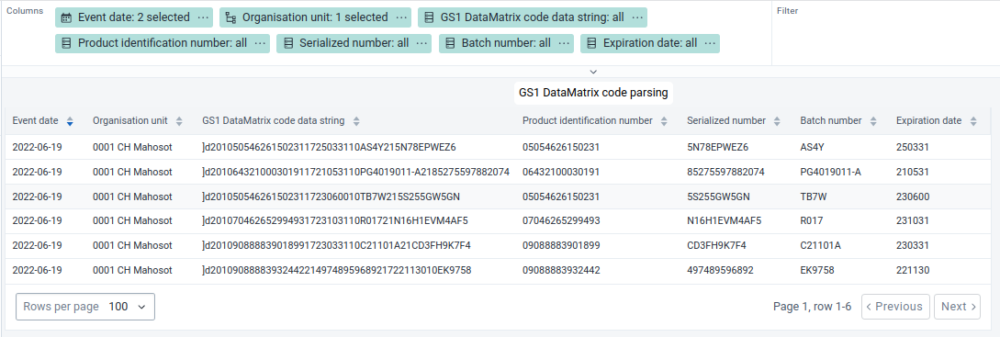
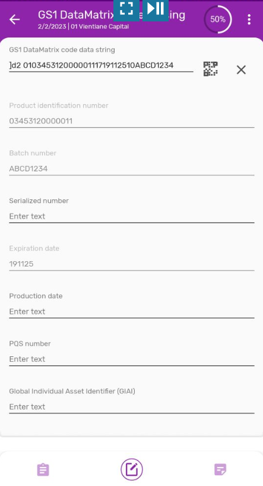

# GS1 DATAMATRIX CODE PARSING / Event program

## Introduction

This Event program allows any DHIS2 user to "read" GS1 DataMatrix codes and parse ("split") the information stored in the alphanumeric text string into their components as indicated by their Application Identifiers (AIs). This Event program is intended for demonstrating DHIS2 capabilities which can be integrated into other applications such as for Traceability and Verification System (TRVST) and the biomedical engineering life cycle management in future.

Currently there are two use cases: reading GS1 DataMatrix codes printed on health care products and reading out the product identification number, batch number, expiry date and serialized number (unit pack number) and presenting them in the correct human readable format. Secondly, to read GS1 DataMatrix codes standardized according to the World Health Organization PQS performance specification E003 for "Global asset identification" and reading out the production identification number (Global Trade Item Number GTIN), production date, unique serial number and the PQS number.

#### Use case overview

A storekeeper or a health worker such as an immunization worker, scans the GS1 DataMatrix code at the point of dispensing or before administering a vaccination for:

- Recording the batch number and serialized number in the eRegistry of the patient

- Referencing the batch numer and serilized number in case of an AEFI (Adverse Effect Following Immunization)

- Identifying batches subject to a batch recall
- Managing of health care products at the batch level
- Alerting users in case health care products have expired
- Complying with national Track & Trace regulations (in force in many countries since 2019)

- Drug quality verification for detecting counterfeit or falsified health care products

- "Decommissioning" serialized numbers in national or global Track & Trace databases

- Tracking unit packs end to end through global supply networks
- Matching unit pack distribution paths with temperature records of storage equipment

- Identifying cold chain equipment assets (and other biomedical equipment) through a unique GS1 DataMatrix code.

## Maintenance Web App - DHIS2 metadata configuration

This chapters provides a complete overview all metadata elements and their settings which are required specifically for configuring the DHIS2-GS1 DataMatrix code parsing.

### Metadata overview
The required metadata settings seetings are presented in the order in which it is presented in the DHIS2 Maintenance Web App.

>**1 DATA ELEMENT**  
>>2.1 Data element - "Tracker"  
> 
>**1 PROGRAM**  
>>2.1 Program  
>>2.2 Tracked entity attribute  
>>2.3 Program rule  
>>2.4 Program rule variable  

### 1 DATA ELEMENT
Data elements represent the items (healthcare products) for which logistics data is recorded and managed.

### 1.2 Data element - "Tracker"
These Data elements are required for configuring the Program stages of the DHIS2-GS1 Tracker Program.
>**1 Batch number**  
>>**Name \(*)**: "Batch number"  
>>**Short name \(*)**: "Batch number"  
>>**Domain Type \(*)**: "Tracker"  
>>**Value type \(*)**: "Text"  
>>**Aggregation type (*)**: "None"  
>
>**2 Expiration date**  
>>**Name \(*)**: "Expiration date"  
>>**Short name \(*)**: "Expiration date"  
>>**Domain Type \(*)**: "Tracker"  
>>**Value type \(*)**: "Text"  
>>**Aggregation type (*)**: "None"  
>
>**3 Global Individual Asset Identifier (GIAI)**  
>>**Name \(*)**: "Global Individual Asset Identifier (GIAI)"  
>>**Short name \(*)**: "Global Individual Asset Identifier (GIAI)"  
>>**Domain Type \(*)**: "Tracker"  
>>**Value type \(*)**: "Text"  
>>**Aggregation type (*)**: "None"  
>
>**4 GS1 DataMatrix code data string**  
>>**Name \(*)**: "GS1 DataMatrix code data string"  
>>**Short name \(*)**: "GS1 DataMatrix code data string"  
>>**Domain Type \(*)**: "Tracker"  
>>**Value type \(*)**: "Text"  
>>**Aggregation type (*)**: "None"  
>
>**5 PQS number**  
>>**Name \(*)**: "PQS number"  
>>**Short name \(*)**: "PQS number"  
>>**Domain Type \(*)**: "Tracker"  
>>**Value type \(*)**: "Text"  
>>**Aggregation type (*)**: "None"  
>
>**6 Production date**  
>>**Name \(*)**: "Production date"  
>>**Short name \(*)**: "Production date"  
>>**Domain Type \(*)**: "Tracker"  
>>**Value type \(*)**: "Text"  
>>**Aggregation type (*)**: "None"  
>
>**7 Product identification number**  
>>**Name \(*)**: "Product identification number"  
>>**Short name \(*)**: "Product identification number"  
>>**Domain Type \(*)**: "Tracker"  
>>**Value type \(*)**: "Text"  
>>**Aggregation type (*)**: "None"  
>
>**8 Serialized number**  
>>**Name \(*)**: "Serialized number"  
>>**Short name \(*)**: "Serialized number"  
>>**Domain Type \(*)**: "Tracker"  
>>**Value type \(*)**: "Text"  
>>**Aggregation type (*)**: "None"  

#### 2.1 Program
>**1 Program details**
>>**Program type**: "Event Program"  
>>**Name \(*)**: "GS1 DataMatrix code parsing"  
>>**Short name (*)**: "GS1 DataMatrix code parsing"  
>>**Color**: "#8E24AA"  
>>**Icon**: "stock out outline"  
>>**Version**: (automatically numbered by the system)  
>>**Category combination (*)**: select "None"  
>>**Completed events expiry days**: "0"  
>>**Expiry days**: "0"  
>>**Block entry form after completed**: tag (appears as white tick in a blue square)  
>>**Validation strategy**: "On complete" 
>
>**2 Assign attributes**
>>>**Search available/selected items**: select and arrange in the following order:
>>>>"GS1 DataMatrix code data"  
>>>>"Product identification number"  
>>>>"Batch number"  
>>>>"Serialized number"  
>>>>"Expiration date"  
>>>>"Production date"  
>>>>"PQS number"  
>>>>"Global Individual Asset Identifier (GIAI)"  
>>>>"Allow provided elsewhere": tag all
>>>>"Display in reports": select all
>>>>"Mobile render type": "Default" except "Qr code" for "GS1 DataMatrix code data string"
>>
>>**2 Create data entry form**
>>>**"BASIC"** (configured by the system by default, no configuration is needed).
>>
>**4 Access**
>>**Organisation units**: tag the health care facilities where the Tracker Program is used  
>>**Roles and access**: "GS1 DataMatrix code parsing" appears by default  
>>**SELECT ALL**: tag (a white tick appears in the blue square)
>
>**5 Notifications**
>(not applicable)

#### 2.2 Tracked entity attribute
The DHIS2-RTS uses the "Item code" and "Item descriptions" as the two Tracked entity attributes of the Trached entity type "Item".
Note that the "Item code" is unique only for any specific Organisation Unit but the same "Item code" can be used in any number of different Organisation Units.

>**1 Batch number**  
>>**Name \(*)**: "Batch number"  
>>**Short name (*)**: "Batch number"  
>>**Domain type \(*)**: "Tracker"  
>>**Value type**: "Text"  
>>**Aggregation type**: "None"  
>
>**2 Expiration date**  
>>**Name \(*)**: "Expiration date"  
>>**Short name \(*)**: "Expiration date"  
>>**Domain type \(*)**: "Tracker"  
>>**Value type**: "Text"  
>>**Aggregation type**: "None"  
>
>**3 Global Individual Asset Identifier (GIAI)**  
>>**Name \(*)**: "Global Individual Asset Identifier (GIAI)"  
>>**Short name \(*)**: "Global Individual Asset Identifier (GIAI)"  
>>**Domain type \(*)**: "Tracker"  
>>**Value type**: "Text"  
>>**Aggregation type**: "None"  
>
>**4 GS1 DataMatrix code data string**  
>>**Name \(*)**: "GS1 DataMatrix code data string"  
>>**Short name \(*)**: "GS1 DataMatrix code data string"  
>>**Domain type \(*)**: "Tracker"  
>>**Value type**: "Text"  
>>**Aggregation type**: "None"  
>
>**5 PQS number**  
>>**Name \(*)**: "PQS number"  
>>**Short name \(*)**: "PQS number"  
>>**Domain type \(*)**: "Tracker"  
>>**Value type**: "Text"  
>>**Aggregation type**: "None"  
>
>**6 Product identification number**  
>>**Name \(*)**: "Product identification number"  
>>**Short name \(*)**: "Product identification number"  
>>**Domain type \(*)**: "Tracker"  
>>**Value type**: "Text"  
>>**Aggregation type**: "None"  
>
>**7 Production date**  
>>**Name \(*)**: "Production date"  
>>**Short name \(*)**: "Production date"  
>>**Domain type \(*)**: "Tracker"  
>>**Value type**: "Text"  
>>**Aggregation type**: "None"  
>
>**8 Serialized number**  
>>**Name \(*)**: "Serialized number"  
>>**Short name \(*)**: "Serialized number"  
>>**Domain type \(*)**: "Tracker"  
>>**Value type**: "Text"  
>>**Aggregation type**: "None"  

#### 2.3 Program rule

The Program rules which can be applied to any GS1 AI (Application Identifier), "find" the AIs in the text string, extract the data between those AIs and assign those sub-strings ("snippets") to the right data field according to the AI number.

One Program rule is required for every AI which is (potentially) used in a GS1 DataMatrix code string. The nearly 200 AIs (application identifiers) which are most likely to be used in logistics and supply chain management for healthcare products and currently available are listed in the "Data matrix code" table:  
https://docs.dhis2.org/en/use/user-guides/dhis-core-version-240/configuring-the-system/programs.html#configure_program_rule
Note that the "Data Title" has to be followed literally for the Program rule to run correctly. As the PQS number is not listed as a GS1 AI, AI 241 ("Customer part number") is used but other AIs may be used instead.

The Program rule in this Event program allows parsing all GS1 AIs which are mandatory for GS1 DataMatrix codes applied to finished drug products (product identificaiton number, batch number, expiration date and serialized number) as well as for the "Global Asset Identification" (WHO/PQS/E003/BC01.1) which require GTIN (product identification number), production date, serialized number and PQS number.

>**1 GS1 - DataMatrix code parsing**  
>>**1 Enter program rule details**  
>>>**Program \(*)**: "GS1 DataMatrix code parsing"  
>>>**Description**: "Parsing of GS1 DataMatrix code string into product identification number, batch number, expiration date (as represented in the data string) and serial number as well reformatted expiration date"  
>>
>>**2 Enter program rule expression**  
>>>**Condition**: "d2:hasValue(#{GS1 DataMatrix code data string})"  
>>
>>**3 Define program rule actions**  
>>>**Action details** 
>>>>**1 Production date**
>>>>>**Action \(*)**: "Assign value"
>>>>>**Data element to assign to**: "Production date"
>>>>>**Expression to evaluate and assign**: "d2:extractDataMatrixValue('PROD_DATE', #{GS1 DataMatrix code data string})"
>>>>
>>>>**2 PQS number**
>>>>>**Action \(*)**: "Assign value"
>>>>>**Data element to assign to**: "PQS number"
>>>>>**Expression to evaluate and assign**: d2:extractDataMatrixValue('CUSTOMER_PART_NUMBER', #{GS1 DataMatrix code data string})
>>>>
>>>>**3 Product identification number**
>>>>>**Action \(*)**: "Assign value"
>>>>>**Data element to assign to**: "Product identification number"
>>>>>**Expression to evaluate and assign**: "d2:extractDataMatrixValue('GTIN', #{GS1 DataMatrix code data string})"
>>>>
>>>>**4 Expiration date**
>>>>>**Action \(*)**: "Assign value"
>>>>>**Data element to assign to**: "Expiration date"
>>>>>**Expression to evaluate and assign**: "d2:extractDataMatrixValue('EXP_DATE', #{GS1 DataMatrix code data string})"
>>>>
>>>>**5 Serialized number**
>>>>>**Action \(*)**: "Assign value"
>>>>>**Data element to assign to**: "Serialized number"
>>>>>**Expression to evaluate and assign**: "d2:extractDataMatrixValue('SERIAL_NUMBER', #{GS1 DataMatrix code data string})"
>>>>
>>>>**6 Batch number**
>>>>>**Action \(*)**: "Assign value"
>>>>>**Data element to assign to**: "Batch number"
>>>>>**Expression to evaluate and assign**: "d2:extractDataMatrixValue('LOT_NUMBER', #{GS1 DataMatrix code data string})"

#### 2.5 Program rule variable
>**1 GS1 DataMatrix code data string**
>>**Program \(*)**: "GS1 DataMatrix code parsing"  
>>**Name \(*)**: "GS1 DataMatrix code data string"  
>>**Source type \(*)**: "Data element in current event"  
>>**Data element**: "GS1 DataMatrix code data string"  

#### DHIS2 user interfaces

**Web portal / Tracker program**

**Web portal / Line listing program**

**Capture Android app**

