# Monthly Stock Data Recording / "Aggregate" Data Entry Form

This Default Data Entry Form ("aggregate") allows storekeepers at health care facilities to enter monthly data on demand ("consumption") as well as stock on hand digitally on a on- or off-line on a mobile device and synchronize the data with a central DHIS2 server for analysis, data sharing and integration with national eLMIS systems.

## Use case

### Monthly stock report - Data recording

At the end of the month, storekeepers will count the quantity of all health care products in the medical store and record the stock on hand. Furthermore, to obtain the total amount of each health care product issued from the medical store from the first to the last day of the month and record the total monthly demand ("consumption") directly on a mobile device. The list of stock items ("Data Elements") can be adapted to each health care facility as needed and user access can be given selectively to individual storekeepers as required.

### Monthly stock report - Data recording and calculation

In addition to the above: at the end of the month after the physical stock count and all data has been entered, Predictors automatically calculate the following data:

- Opening balance: identical with the "Stock on hand" from the end of the previous month

- Closing balance: Opening balance + Stock received - Stock distributed 
- Stock redistributed - Stock discarded   

- Stock discrepancy: Stock on hand (as counted) - Closing balance

- Stock on hand Yes/No: calculates whether a stockout occurred at the end of the month (at the time of the physical stock count)  

## Maintenance Web App - DHIS2 metadata configuration

The configuration of this Default Data Entry form uses "Disaggregation categories" as this is technically the only way to display a table for recording data in the DHIS2 Android Capture App on a mobile device and relies only on basic, native DHIS2 functionality.

### Metadata overview
The required metadata settings seetings are presented in the order in which it is presented in the DHIS2 Maintenance Web App.

>**1 CATEGORY**  
>>1.1 Category option  
>>1.2 Category  
>>1.3 Category combination 
> 
>**2 DATA ELEMENT**  
>>2.1 Data element - "Aggregate"  
>>2.3 Data element group  
> 
>**3 DATA SET**  
>>3.1 Monthly stock reporting
> 
>**4 INDICATOR**  
>>4.1 Indicator  
>>4.1.1 Indicator type
> 
>**5 OTHER**  
>>5.1 Legend  
>>5.2 Predictor  
>>5.3 Predictor group

### 1 CATEGORY

#### 1.1 Category option
>**1 Stock correction**  
>>**Name \(*)**: "Stock correction"  
>>**Short name \(*)**: "Stock correction"  
>>**Organisation units selected**: (select as required) 
>
>**2 Stock discarded**  
>>**Name \(*)**: "Stock discarded"  
>>**Short name \(*)**: "Stock discarded"  
>>**Organisation units selected**: (select as required) 
>
>**3 Stock distributed**  
>>**Name \(*)**: "Stock distributed"  
>>**Short name \(*)**: "Stock distributed"  
>>**Organisation units selected**: (select as required) 
>
>**4 Stock received**  
>>**Name \(*)**: "Stock received"  
>>**Short name \(*)**: "Stock received"  
>>**Organisation units selected**: (select as required) 
>
>**5 Stock redistributed**  
>>**Name \(*)**: "Stock redistributed"  
>>**Short name \(*)**: "Stock redistributed"  
>>**Organisation units selected**: (select as required) 
>
>**6 Stock correction**  
>>**Name \(*)**: "Stock on hand"  
>>**Short name \(*)**: "Stock on hand"  
>>**Organisation units selected**: (select as required) 

#### 1.2 Category
>**1 MSR - Monthly stock report - Data recording**  
>>**Name \(*)**: "MSR - Monthly stock report - Data recording"  
>>**Short name \(*)**: "Monthly stock report - Data recording"  
>>**Data dimension type \(*)**: "Disaggregation"  
>>**Data dimension**: tag (appears as white tick in a blue square)  
>>**Category options**: *note the order of "Category options"*:  
>>>"Stock received"  
>>>"Stock distributed"  
>>>"Stock redistributed"  
>>>"Stock discarded"  
>>>"Stock on hand"  
>>>"Stock correction"  
>
>**2 MSR - Monthly stock report - Data recording and calculation**  
>>**Name \(*)**: "MSR - Monthly stock report - Data recording and calculation"  
>>**Short name \(*)**: "Monthly stock report - Data recording and calculation"  
>>**Data dimension type \(*)**: "Disaggregation"  
>>**Data dimension**: tag (appears as white tick in a blue square)  
>>**Category options**: *note the order of "Category options"*:  
>>>"Opening balance"  
>>>"Stock received"  
>>>"Stock distributed"  
>>>"Stock redistributed"  
>>>"Stock discarded"
>>>"Stock on hand"  
>>>"Closing balance"  
>>>"Stock discrepancy"  
>>>"Stock correction"  
>>>"Stock on hand Yes/No"  

#### 1.3 Category combination
>**1 MSR Monthly stock report - Data recording**  
>>**Name \(*)**: **Monthly stock report - Data recording**  
>>**Data dimension type \(*)**: "Disaggregation"  
>>**Skip category total in report \(*)**: check (appears as white tick in a blue square)   
>>**Categories**: "Monthly stock report - Data recording"
>
>**2 Monthly stock report - Data recording and calculation**  
>>**Name \(*)**: **Monthly stock report - Data recording and calculation**  
>>**Data dimension type \(*)**: "Disaggregation"  
>>**Skip category total in report \(*)**: check (appears as white tick in a blue square)   
>>**Categories**: "Monthly stock report - Data recording and calculation"

### 2 DATA ELEMENT

### 2.1 Data element
Data elements represent the items (healthcare products) for which logistics data is recorded and managed. A separate and unique Data element needs to be configured for each item (healthcare product).

>**1 ATROPINE SULFATE, 1mg/ml, 1ml, amp. - MSR**
>>**Name \(*)**: "ATROPINE SULFATE, 1mg/ml, 1ml, amp. - MSR"  
>>**Short name \(*)**: "DINJATRO1A"
>>**Code \(*)**:  "DINJATRO1A"
>>**Domain Type \(*)**: "Aggregate"  
>>**Value type \(*)**: "Integer"  
>>**Aggregation type (*)**: "Sum"  
>>**Store zero data values**: tag (appears as white tick in a blue square) 
>>**Category combination \(*)**: "Monthly stock report - Data collection"  
>
>**[Number] [Item] - MSR**
>>**Name \(*)**: "X [Item] - MSR"  
>>**Short name \(*)**: "[Item code]"
>>**Code \(*)**:  "[Item code]"
>>**Domain Type \(*)**: "Aggregate"  
>>**Value type \(*)**: "Integer"  
>>**Aggregation type (*)**: "Sum"  
>>**Store zero data values**: tag (appears as white tick in a blue square) 
>>**Category combination \(*)**: "Monthly stock report - Data collection"  

### 2.2 Data element group

The creation of Data element groups is a DHIS2 best practice but also a precondition for using the "Group Predictor" functionality which allows using a placeholder and the Data element group ID for creating a single Predictor which is automatically applied to all Data elements in the respective Data element group. For example for calculating the stock coverage time.

>**1 Stock item list - MSR**  
>**Name \(*)**: "Stock item list - MSR"  
>**Short name \(*)**: "Stock item list - MSR"
>**Data elements \(*)**: *select all Data elements with the "MSR" suffix"*    

### 3 Data set

This Default Data Entry Form ("aggregate") allows storekeepers at health care facilities to enter monthly data on demand ("consumption") as well as stock on hand digitally on a on- or off-line on a mobile device and synchronize the data with a central DHIS2 server for analysis, data sharing and integration with national eLMIS systems.

#### 3.1 Data set
Data sets for each Organisation unit are required for recording and storing monthly stock report data.
The sections can be displayed in the Data Entry (beta) Web App as well as in the Capture Android App either in a single table or as separate tabs.
The configuration for two Data sets are presented below, but either the one or the other should be used:
- "MSR - Monthly stock report - Data recording"
- "MSR - Monthly stock report - Data recording and calculation"

>**1 MSR - Monthly stock report - Data recording**  
>>**Name \(*)**: "MSR - Monthly stock report - Data recording"  
>>**Short name \(*)**: "Monthly stock report - Data recording"
>>**Color**: "#00ACC1"  
>>**Expiry days**: "5"  
>>**Open future periods for data entry**: "1"  
>>**Days after period to qualify for timely submission**: "5"  
>>**Period type**: "Monthly"  
>>**Category combination**: "None"  
>>**Render sections as tabs**: tag (appears as white tick in a blue square)  
>>**Data elements**  
>>>*Add all Data elements with the suffix "MSR" required for the respective health facility*.
>>
>>**Organisation units selected**: (select as for the Tracker Program) 
>>
>>**Actions**
>>>**Manage sections**
>>>>**Name**
>>>>>**1 DASD**
>>>>>>**DASD**
>>>>>>**Data elements**
>>>>>>>CHLORHEXIDINE DIGLUCONATE 5% , solution, 1L, btl. - MSR  
>>>>>>>IODINE POVIDONE, 10%, solution, 1L, btl. - MSR  
>>>>>**2 [Section 2]**  
>>>>>>**[Section 2]**  
>>>>>>**Data elements**  
>>>>>>>[Data element]  

### 4 Indicator

#### 4.1 Indicator

Indicators are used for calculating the following logistics metrics:

- Number of items in stock coverage bins (0-1, 1-2, 2-3 months etc.) for visualizing the stock coverage time distribution 

- Stock coverage time (stock on hand / average monthly demand)

- Stock availability (percentage of items which are on hand)

- Stockout count (number of items which are out of stock)

For the "Stock coverage time" indicator it would in principle be preferable to configure the "Stock coverage time" as Predictor (as it would allow using the "Group predictor" function) but because the "Stock coverage time" requires displaying decimals and the Data Entry form only allows a single number format for all Category Options, an indicator is used instead. This approach allows freely setting the number of decimals in the Indicator settings. Note that items will have to be added and removed individually if the stock item list is changed.

>**1 0-1 months - MSR**  
>For each item the Indicator returns "1" if the item has stock and stock coverage time is less than 1 and otherwise returns "0" and then adds up these results for calculating the number of items with a stock coverage time of 0-1 months. 
>>**Name \(*)**: "0-1 months - MSR"  
>>**Short Name \(*)**: "0-1 months"  
>>**Description**: "Number of items with a coverage time of 0-1 months"  
>>**Decimals in data output**: "0"  
>>**Indicator type \(*)**: "Number (Factor 1)"  
>>**Edit numerator**:
>>>**Description**: "O-1 months - MSR - Numerator"
>>>**Calculation**: 
>>>if(#{uwQn42CZ5qI.eKdBeWyrmPN}/#{uwQn42CZ5qI.VCzZmn4Xpjg}>0 && #{uwQn42CZ5qI.eKdBeWyrmPN}/#{uwQn42CZ5qI.VCzZmn4Xpjg}<1,1,0)+
f(#{Ev8PDcJ9I5X.eKdBeWyrmPN}/#{Ev8PDcJ9I5X.VCzZmn4Xpjg}>0 && #{Ev8PDcJ9I5X.eKdBeWyrmPN}/#{Ev8PDcJ9I5X.VCzZmn4Xpjg}<1,1,0)+
if(#{irAGhTCJcO8.eKdBeWyrmPN}/#{irAGhTCJcO8.VCzZmn4Xpjg}>0 && #{irAGhTCJcO8.eKdBeWyrmPN}/#{irAGhTCJcO8.VCzZmn4Xpjg}<1,1,0)+
if(#{VNT5TGE3uBQ.eKdBeWyrmPN}/#{VNT5TGE3uBQ.VCzZmn4Xpjg}>0 && #{VNT5TGE3uBQ.eKdBeWyrmPN}/#{VNT5TGE3uBQ.VCzZmn4Xpjg}<1,1,0)+
if(#{Csg4rTaIYDj.eKdBeWyrmPN}/#{Csg4rTaIYDj.VCzZmn4Xpjg}>0 && #{Csg4rTaIYDj.eKdBeWyrmPN}/#{Csg4rTaIYDj.VCzZmn4Xpjg}<1,1,0)+
if(#{mIYcOnLcqes.eKdBeWyrmPN}/#{mIYcOnLcqes.VCzZmn4Xpjg}>0 && #{mIYcOnLcqes.eKdBeWyrmPN}/#{mIYcOnLcqes.VCzZmn4Xpjg}<1,1,0  
>>>
>>>if([Item 1] Stock on hand/[Item 1] Stock distributed]>0 &&
[Item 1] Stock on hand/[Item 1] Stock distributed]<1,1,0)+
if([Item 2] Stock on hand/[Item 2] Stock distributed]>0 &&
[Item 2] Stock on hand/[Item 2] Stock distributed]<1,1,0)+
etc.
>>
>>**Edit denominator**:
>>>**Description**: "O-1 months - MSR - Denominator"  
>>>**Calculation**: "1"
>
>**2 1-2 months - MSR**  
>For each item the Indicator returns "1" if the stock coverage time is greater than or equal to 1 but less than 2 and otherwise returns 0and then adds up these results for calculating the number of items with a stock coverage time greater of 1-2 months.
>>**Name \(*)**: "1-2 months - MSR"  
>>**Short Name \(*)**: "1-2 months"  
>>**Description**: "Number of items with a coverage time of 1-2 months"  
>>**Decimals in data output**: "0"  
>>**Indicator type \(*)**: "Number (Factor 1)"  
>>**Edit numerator**:
>>>**Description**: "1-2 months - MSR - Numerator"
>>>**Calculation**: 
>>>if(#{uwQn42CZ5qI.eKdBeWyrmPN}/#{uwQn42CZ5qI.VCzZmn4Xpjg}>=1 && #{uwQn42CZ5qI.eKdBeWyrmPN}/#{uwQn42CZ5qI.VCzZmn4Xpjg}<2,1,0)+
if(#{Ev8PDcJ9I5X.eKdBeWyrmPN}/#{Ev8PDcJ9I5X.VCzZmn4Xpjg}>=1 && #{Ev8PDcJ9I5X.eKdBeWyrmPN}/#{Ev8PDcJ9I5X.VCzZmn4Xpjg}<2,1,0)+
if(#{irAGhTCJcO8.eKdBeWyrmPN}/#{irAGhTCJcO8.VCzZmn4Xpjg}>=1 && #{irAGhTCJcO8.eKdBeWyrmPN}/#{irAGhTCJcO8.VCzZmn4Xpjg}<2,1,0)+
if(#{VNT5TGE3uBQ.eKdBeWyrmPN}/#{VNT5TGE3uBQ.VCzZmn4Xpjg}>=1 && #{VNT5TGE3uBQ.eKdBeWyrmPN}/#{VNT5TGE3uBQ.VCzZmn4Xpjg}<2,1,0)+
if(#{Csg4rTaIYDj.eKdBeWyrmPN}/#{Csg4rTaIYDj.VCzZmn4Xpjg}>=1 && #{Csg4rTaIYDj.eKdBeWyrmPN}/#{Csg4rTaIYDj.VCzZmn4Xpjg}<2,1,0)+
if(#{mIYcOnLcqes.eKdBeWyrmPN}/#{mIYcOnLcqes.VCzZmn4Xpjg}>=1 && #{mIYcOnLcqes.eKdBeWyrmPN}/#{mIYcOnLcqes.VCzZmn4Xpjg}<2,1,0)
>>>
>>>if([Item 1] Stock on hand/[Item 1] Stock distributed]>=1 &&
[Item 1] Stock on hand/[Item 1] Stock distributed]<2,1,0)+
if([Item 2] Stock on hand/[Item 2] Stock distributed]>=1 &&
[Item 2] Stock on hand/[Item 2] Stock distributed]<2,1,0)+
etc.
>>
>>**Edit denominator**:
>>>**Description**: "1-2 months - MSR - Denominator"
>>>**Calculation**: "1"
>
>**3 2-3 months - MSR**  
>For each item the Indicator returns "1" if the stock coverage time is greater than or equal to 2 but less than 3 and otherwise returns 0and then adds up these results for calculating the number of items with a stock coverage time greater of 2-3 months.
>if(#{uwQn42CZ5qI.eKdBeWyrmPN}/#{uwQn42CZ5qI.VCzZmn4Xpjg}>=2 && #{uwQn42CZ5qI.eKdBeWyrmPN}/#{uwQn42CZ5qI.VCzZmn4Xpjg}<3,1,0)+
if(#{Ev8PDcJ9I5X.eKdBeWyrmPN}/#{Ev8PDcJ9I5X.VCzZmn4Xpjg}>=2 && #{Ev8PDcJ9I5X.eKdBeWyrmPN}/#{Ev8PDcJ9I5X.VCzZmn4Xpjg}<3,1,0)+
if(#{irAGhTCJcO8.eKdBeWyrmPN}/#{irAGhTCJcO8.VCzZmn4Xpjg}>=2 && #{irAGhTCJcO8.eKdBeWyrmPN}/#{irAGhTCJcO8.VCzZmn4Xpjg}<3,1,0)+
if(#{VNT5TGE3uBQ.eKdBeWyrmPN}/#{VNT5TGE3uBQ.VCzZmn4Xpjg}>=2 && #{VNT5TGE3uBQ.eKdBeWyrmPN}/#{VNT5TGE3uBQ.VCzZmn4Xpjg}<3,1,0)+
if(#{Csg4rTaIYDj.eKdBeWyrmPN}/#{Csg4rTaIYDj.VCzZmn4Xpjg}>=2 && #{Csg4rTaIYDj.eKdBeWyrmPN}/#{Csg4rTaIYDj.VCzZmn4Xpjg}<3,1,0)+
if(#{mIYcOnLcqes.eKdBeWyrmPN}/#{mIYcOnLcqes.VCzZmn4Xpjg}>=2 && #{mIYcOnLcqes.eKdBeWyrmPN}/#{mIYcOnLcqes.VCzZmn4Xpjg}<3,1,0)
>>>
>>>if([Item 1] Stock on hand/[Item 1] Stock distributed]>=2 &&
[Item 1] Stock on hand/[Item 1] Stock distributed]<3,1,0)+
if([Item 2] Stock on hand/[Item 2] Stock distributed]>=2 &&
[Item 2] Stock on hand/[Item 2] Stock distributed]<3,1,0)+
etc.
>>
>>**Edit denominator**:
>>>**Description**: "2-3 months - MSR - Denominator"
>>>**Calculation**: "1"
>
>**4 3-4 months - MSR**  
>For each item the Indicator returns "1" if the stock coverage time is greater than or equal to 3 but less than 4 and otherwise returns 0and then adds up these results for calculating the number of items with a stock coverage time of 3-4 months. 
>>**Name \(*)**: "3-4 months - MSR"  
>>**Short Name \(*)**: "3-4 months - MSR"  
>>**Description**: "Number of items with a coverage time of 3-4 months"  
>>**Decimals in data output**: "0"  
>>**Indicator type \(*)**: "Number (Factor 1)"  
>>**Edit numerator**:
>>>**Description**: "3-4 months - MSR - Numerator"
>>>**Calculation**: 
>>>if(#{uwQn42CZ5qI.eKdBeWyrmPN}/#{uwQn42CZ5qI.VCzZmn4Xpjg}>=3 && #{uwQn42CZ5qI.eKdBeWyrmPN}/#{uwQn42CZ5qI.VCzZmn4Xpjg}<4,1,0)+
if(#{Ev8PDcJ9I5X.eKdBeWyrmPN}/#{Ev8PDcJ9I5X.VCzZmn4Xpjg}>=3 && #{Ev8PDcJ9I5X.eKdBeWyrmPN}/#{Ev8PDcJ9I5X.VCzZmn4Xpjg}<4,1,0)+
if(#{irAGhTCJcO8.eKdBeWyrmPN}/#{irAGhTCJcO8.VCzZmn4Xpjg}>=3 && #{irAGhTCJcO8.eKdBeWyrmPN}/#{irAGhTCJcO8.VCzZmn4Xpjg}<4,1,0)+
if(#{VNT5TGE3uBQ.eKdBeWyrmPN}/#{VNT5TGE3uBQ.VCzZmn4Xpjg}>=3 && #{VNT5TGE3uBQ.eKdBeWyrmPN}/#{VNT5TGE3uBQ.VCzZmn4Xpjg}<4,1,0)+
if(#{Csg4rTaIYDj.eKdBeWyrmPN}/#{Csg4rTaIYDj.VCzZmn4Xpjg}>=3 && #{Csg4rTaIYDj.eKdBeWyrmPN}/#{Csg4rTaIYDj.VCzZmn4Xpjg}<4,1,0)+
if(#{mIYcOnLcqes.eKdBeWyrmPN}/#{mIYcOnLcqes.VCzZmn4Xpjg}>=3 && #{mIYcOnLcqes.eKdBeWyrmPN}/#{mIYcOnLcqes.VCzZmn4Xpjg}<4,1,0)
>>>
>>>if([Item 1] Stock on hand/[Item 1] Stock distributed]>=3 &&
[Item 1] Stock on hand/[Item 1] Stock distributed]<4,1,0)+
if([Item 2] Stock on hand/[Item 2] Stock distributed]>=3 &&
[Item 2] Stock on hand/[Item 2] Stock distributed]<4,1,0)+
etc.
>>
>>**Edit denominator**:
>>>**Description**: "3-4 months - MSR - Denominator"
>>>**Calculation**: "1"
>
>**5 4-5 months - MSR**  
>For each item the Indicator returns "1" if the stock coverage time is greater than or equal to 4 but less than 5 and otherwise returns 0and then adds up these results for calculating the number of items with a stock coverage time greater of 4-5 months.   
>>**Name \(*)**: "4-5 months - MSR"  
>>**Short Name \(*)**: "4-5 months - MSR"  
>>**Description**: "Number of items with a coverage time of 4-5 months"  
>>**Decimals in data output**: "0"  
>>**Indicator type \(*)**: "Number (Factor 1)"  
>>**Edit numerator**:
>>>**Description**: "4-5 months - MSR - Numerator"
>>>**Calculation**: 
>>>if(#{uwQn42CZ5qI.eKdBeWyrmPN}/#{uwQn42CZ5qI.VCzZmn4Xpjg}>=4 && #{uwQn42CZ5qI.eKdBeWyrmPN}/#{uwQn42CZ5qI.VCzZmn4Xpjg}<5,1,0)+
if(#{Ev8PDcJ9I5X.eKdBeWyrmPN}/#{Ev8PDcJ9I5X.VCzZmn4Xpjg}>=4 && #{Ev8PDcJ9I5X.eKdBeWyrmPN}/#{Ev8PDcJ9I5X.VCzZmn4Xpjg}<5,1,0)+
if(#{irAGhTCJcO8.eKdBeWyrmPN}/#{irAGhTCJcO8.VCzZmn4Xpjg}>=4 && #{irAGhTCJcO8.eKdBeWyrmPN}/#{irAGhTCJcO8.VCzZmn4Xpjg}<5,1,0)+
if(#{VNT5TGE3uBQ.eKdBeWyrmPN}/#{VNT5TGE3uBQ.VCzZmn4Xpjg}>=4 && #{VNT5TGE3uBQ.eKdBeWyrmPN}/#{VNT5TGE3uBQ.VCzZmn4Xpjg}<5,1,0)+
if(#{Csg4rTaIYDj.eKdBeWyrmPN}/#{Csg4rTaIYDj.VCzZmn4Xpjg}>=4 && #{Csg4rTaIYDj.eKdBeWyrmPN}/#{Csg4rTaIYDj.VCzZmn4Xpjg}<5,1,0)+
if(#{mIYcOnLcqes.eKdBeWyrmPN}/#{mIYcOnLcqes.VCzZmn4Xpjg}>=4 && #{mIYcOnLcqes.eKdBeWyrmPN}/#{mIYcOnLcqes.VCzZmn4Xpjg}<5,1,0)
>>>
>>>if([Item 1] Stock on hand/[Item 1] Stock distributed]>=4 &&
[Item 1] Stock on hand/[Item 1] Stock distributed]<5,1,0)+
if([Item 2] Stock on hand/[Item 2] Stock distributed]>=4 &&
[Item 2] Stock on hand/[Item 2] Stock distributed]<5,1,0)+
etc.
>>
>>**Edit denominator**:
>>>**Description**: "4-5 months - MSR - Denominator"
>>>**Calculation**: "1"
>
>**6 5-6 months - MSR**  
>For each item the Indicator returns "1" if the stock coverage time is greater than or equal to 5 but less than 6 and otherwise returns 0 and then adds up these results for calculating the number of items with a stock coverage of 5-6 months. 
>>**Name \(*)**: "0-1 months - MSR"  
>>**Short Name \(*)**: "0-1 months - MSR"  
>>**Description**: "Number of items with a coverage time of 0-1 months"  
>>**Decimals in data output**: "0"  
>>**Indicator type \(*)**: "Number (Factor 1)"  
>>**Edit numerator**:
>>>**Description**: "O-1 months - MSR - Numerator"
>>>**Calculation**: 
>>>if(#{uwQn42CZ5qI.eKdBeWyrmPN}/#{uwQn42CZ5qI.VCzZmn4Xpjg}>=5 && #{uwQn42CZ5qI.eKdBeWyrmPN}/#{uwQn42CZ5qI.VCzZmn4Xpjg}<6,1,0)+
if(#{Ev8PDcJ9I5X.eKdBeWyrmPN}/#{Ev8PDcJ9I5X.VCzZmn4Xpjg}>=5 && #{Ev8PDcJ9I5X.eKdBeWyrmPN}/#{Ev8PDcJ9I5X.VCzZmn4Xpjg}<6,1,0)+
if(#{irAGhTCJcO8.eKdBeWyrmPN}/#{irAGhTCJcO8.VCzZmn4Xpjg}>=5 && #{irAGhTCJcO8.eKdBeWyrmPN}/#{irAGhTCJcO8.VCzZmn4Xpjg}<6,1,0)+
if(#{VNT5TGE3uBQ.eKdBeWyrmPN}/#{VNT5TGE3uBQ.VCzZmn4Xpjg}>=5 && #{VNT5TGE3uBQ.eKdBeWyrmPN}/#{VNT5TGE3uBQ.VCzZmn4Xpjg}<6,1,0)+
if(#{Csg4rTaIYDj.eKdBeWyrmPN}/#{Csg4rTaIYDj.VCzZmn4Xpjg}>=5 && #{Csg4rTaIYDj.eKdBeWyrmPN}/#{Csg4rTaIYDj.VCzZmn4Xpjg}<6,1,0)+
if(#{mIYcOnLcqes.eKdBeWyrmPN}/#{mIYcOnLcqes.VCzZmn4Xpjg}>=5 && #{mIYcOnLcqes.eKdBeWyrmPN}/#{mIYcOnLcqes.VCzZmn4Xpjg}<6,1,0)
>>>
>>>if([Item 1] Stock on hand/[Item 1] Stock distributed]>=5 &&
[Item 1] Stock on hand/[Item 1] Stock distributed]<6,1,0)+
if([Item 2] Stock on hand/[Item 2] Stock distributed]>=5 &&
[Item 2] Stock on hand/[Item 2] Stock distributed]<6,1,0)+
etc.
>>
>>**Edit denominator**:
>>>**Description**: "5-6 months - MSR - Denominator"
>>>**Calculation**: "1"
>
>**7 6-7 months - MSR**  
>For each item the Indicator returns "1" if the stock coverage time is greater than or equal to 6 but less than 7 and otherwise returns 0and then adds up these results for calculating the number of items with a stock coverage time of 6-7 months. 
>>**Name \(*)**: "6-7 months - MSR"  
>>**Short Name \(*)**: "6-7 months - MSR"  
>>**Description**: "Number of items with a coverage time of 6-7 months"  
>>**Decimals in data output**: "0"  
>>**Indicator type \(*)**: "Number (Factor 1)"  
>>**Edit numerator**:
>>>**Description**: "6-7 months - MSR - Numerator"
>>>**Calculation**: 
>>>if(#{uwQn42CZ5qI.eKdBeWyrmPN}/#{uwQn42CZ5qI.VCzZmn4Xpjg}>=6 && #{uwQn42CZ5qI.eKdBeWyrmPN}/#{uwQn42CZ5qI.VCzZmn4Xpjg}<7,1,0)+
if(#{Ev8PDcJ9I5X.eKdBeWyrmPN}/#{Ev8PDcJ9I5X.VCzZmn4Xpjg}>=6 && #{Ev8PDcJ9I5X.eKdBeWyrmPN}/#{Ev8PDcJ9I5X.VCzZmn4Xpjg}<7,1,0)+
if(#{irAGhTCJcO8.eKdBeWyrmPN}/#{irAGhTCJcO8.VCzZmn4Xpjg}>=6 && #{irAGhTCJcO8.eKdBeWyrmPN}/#{irAGhTCJcO8.VCzZmn4Xpjg}<7,1,0)+
if(#{VNT5TGE3uBQ.eKdBeWyrmPN}/#{VNT5TGE3uBQ.VCzZmn4Xpjg}>=6 && #{VNT5TGE3uBQ.eKdBeWyrmPN}/#{VNT5TGE3uBQ.VCzZmn4Xpjg}<7,1,0)+
if(#{Csg4rTaIYDj.eKdBeWyrmPN}/#{Csg4rTaIYDj.VCzZmn4Xpjg}>=6 && #{Csg4rTaIYDj.eKdBeWyrmPN}/#{Csg4rTaIYDj.VCzZmn4Xpjg}<7,1,0)+
if(#{mIYcOnLcqes.eKdBeWyrmPN}/#{mIYcOnLcqes.VCzZmn4Xpjg}>=6 && #{mIYcOnLcqes.eKdBeWyrmPN}/#{mIYcOnLcqes.VCzZmn4Xpjg}<7,1,0)
>>>
>>>if([Item 1] Stock on hand/[Item 1] Stock distributed]>=6 &&
[Item 1] Stock on hand/[Item 1] Stock distributed]<7,1,0)+
if([Item 2] Stock on hand/[Item 2] Stock distributed]>=6 &&
[Item 2] Stock on hand/[Item 2] Stock distributed]<7,1,0)+
etc.
>>
>>**Edit denominator**:
>>>**Description**: "6-7 months - MSR - Denominator"
>>>**Calculation**: "1"
>
>**8 7-8 months - MSR**  
>For each item the Indicator returns "1" if the stock coverage time is greater than or equal to 1 but less than 2 and otherwise returns 0and then adds up these results for calculating the number of items with a stock coverage time of 7-8 months. 
>>**Name \(*)**: "7-8 months - MSR"  
>>**Short Name \(*)**: "7-8 months - MSR"  
>>**Description**: "Number of items with a coverage time of 7-8 months"  
>>**Decimals in data output**: "0"  
>>**Indicator type \(*)**: "Number (Factor 1)"  
>>**Edit numerator**:
>>>**Description**: "7-8 months - MSR - Numerator"
>>>**Calculation**: 
>>>if(#{uwQn42CZ5qI.eKdBeWyrmPN}/#{uwQn42CZ5qI.VCzZmn4Xpjg}>=7 && #{uwQn42CZ5qI.eKdBeWyrmPN}/#{uwQn42CZ5qI.VCzZmn4Xpjg}<8,1,0)+
if(#{Ev8PDcJ9I5X.eKdBeWyrmPN}/#{Ev8PDcJ9I5X.VCzZmn4Xpjg}>=7 && #{Ev8PDcJ9I5X.eKdBeWyrmPN}/#{Ev8PDcJ9I5X.VCzZmn4Xpjg}<8,1,0)+
if(#{irAGhTCJcO8.eKdBeWyrmPN}/#{irAGhTCJcO8.VCzZmn4Xpjg}>=7 && #{irAGhTCJcO8.eKdBeWyrmPN}/#{irAGhTCJcO8.VCzZmn4Xpjg}<8,1,0)+
if(#{VNT5TGE3uBQ.eKdBeWyrmPN}/#{VNT5TGE3uBQ.VCzZmn4Xpjg}>=7 && #{VNT5TGE3uBQ.eKdBeWyrmPN}/#{VNT5TGE3uBQ.VCzZmn4Xpjg}<8,1,0)+
if(#{Csg4rTaIYDj.eKdBeWyrmPN}/#{Csg4rTaIYDj.VCzZmn4Xpjg}>=7 && #{Csg4rTaIYDj.eKdBeWyrmPN}/#{Csg4rTaIYDj.VCzZmn4Xpjg}<8,1,0)+
if(#{mIYcOnLcqes.eKdBeWyrmPN}/#{mIYcOnLcqes.VCzZmn4Xpjg}>=7 && #{mIYcOnLcqes.eKdBeWyrmPN}/#{mIYcOnLcqes.VCzZmn4Xpjg}<8,1,0)
>>>
>>>if([Item 1] Stock on hand/[Item 1] Stock distributed]>=7 &&
[Item 1] Stock on hand/[Item 1] Stock distributed]<8,1,0)+
if([Item 2] Stock on hand/[Item 2] Stock distributed]>=7 &&
[Item 2] Stock on hand/[Item 2] Stock distributed]<8,1,0)+
etc.
>>
>>**Edit denominator**:
>>>**Description**: "7-8 months - MSR - Denominator"
>>>**Calculation**: "1"
>
>**9 8-9 months - MSR**  
>For each item the Indicator returns "1" if the stock coverage time is greater than or equal to 8 but less than 9 and otherwise returns 0and then adds up these results for calculating the number of items with a stock coverage time of 8-9 months. 
>>**Name \(*)**: "8-9 months - MSR"  
>>**Short Name \(*)**: "8-9 months - MSR"  
>>**Description**: "Number of items with a coverage time of 8-9 months"  
>>**Decimals in data output**: "0"  
>>**Indicator type \(*)**: "Number (Factor 1)"  
>>**Edit numerator**:
>>>**Description**: "8-9 months - MSR - Numerator"
>>>**Calculation**: 
>>>if(#{uwQn42CZ5qI.eKdBeWyrmPN}/#{uwQn42CZ5qI.VCzZmn4Xpjg}>=8 && #{uwQn42CZ5qI.eKdBeWyrmPN}/#{uwQn42CZ5qI.VCzZmn4Xpjg}<9,1,0)+
if(#{Ev8PDcJ9I5X.eKdBeWyrmPN}/#{Ev8PDcJ9I5X.VCzZmn4Xpjg}>=8 && #{Ev8PDcJ9I5X.eKdBeWyrmPN}/#{Ev8PDcJ9I5X.VCzZmn4Xpjg}<9,1,0)+
if(#{irAGhTCJcO8.eKdBeWyrmPN}/#{irAGhTCJcO8.VCzZmn4Xpjg}>=8 && #{irAGhTCJcO8.eKdBeWyrmPN}/#{irAGhTCJcO8.VCzZmn4Xpjg}<9,1,0)+
if(#{VNT5TGE3uBQ.eKdBeWyrmPN}/#{VNT5TGE3uBQ.VCzZmn4Xpjg}>=8 && #{VNT5TGE3uBQ.eKdBeWyrmPN}/#{VNT5TGE3uBQ.VCzZmn4Xpjg}<9,1,0)+
if(#{Csg4rTaIYDj.eKdBeWyrmPN}/#{Csg4rTaIYDj.VCzZmn4Xpjg}>=8 && #{Csg4rTaIYDj.eKdBeWyrmPN}/#{Csg4rTaIYDj.VCzZmn4Xpjg}<9,1,0)+
if(#{mIYcOnLcqes.eKdBeWyrmPN}/#{mIYcOnLcqes.VCzZmn4Xpjg}>=8 && #{mIYcOnLcqes.eKdBeWyrmPN}/#{mIYcOnLcqes.VCzZmn4Xpjg}<9,1,0)
>>>
>>>if([Item 1] Stock on hand/[Item 1] Stock distributed]>=8 &&
[Item 1] Stock on hand/[Item 1] Stock distributed]<9,1,0)+
if([Item 2] Stock on hand/[Item 2] Stock distributed]>=8 &&
[Item 2] Stock on hand/[Item 2] Stock distributed]<),1,0)+
etc.
>>
>>**Edit denominator**:
>>>**Description**: "8-9 months - MSR - Denominator"
>>>**Calculation**: "1"
>
>**10 9-10 months - MSR**  
>For each item the Indicator returns "1" if the stock coverage time is greater than or equal to 9 but less than 10 and otherwise returns 0 and then adds up these results for calculating the number of items with a stock coverage time of 9-10 months. 
>>**Name \(*)**: "9-10 months - MSR"  
>>**Short Name \(*)**: "9-10 months - MSR"  
>>**Description**: "Number of items with a coverage time of 9-10 months"  
>>**Decimals in data output**: "0"  
>>**Indicator type \(*)**: "Number (Factor 1)"  
>>**Edit numerator**:
>>>**Description**: "9-10 months - MSR - Numerator"
>>>**Calculation**: 
>>>if(#{uwQn42CZ5qI.eKdBeWyrmPN}/#{uwQn42CZ5qI.VCzZmn4Xpjg}>=9 && #{uwQn42CZ5qI.eKdBeWyrmPN}/#{uwQn42CZ5qI.VCzZmn4Xpjg}<10,1,0)+
if(#{Ev8PDcJ9I5X.eKdBeWyrmPN}/#{Ev8PDcJ9I5X.VCzZmn4Xpjg}>=9 && #{Ev8PDcJ9I5X.eKdBeWyrmPN}/#{Ev8PDcJ9I5X.VCzZmn4Xpjg}<10,1,0)+
if(#{irAGhTCJcO8.eKdBeWyrmPN}/#{irAGhTCJcO8.VCzZmn4Xpjg}>=9 && #{irAGhTCJcO8.eKdBeWyrmPN}/#{irAGhTCJcO8.VCzZmn4Xpjg}<10,1,0)+
if(#{VNT5TGE3uBQ.eKdBeWyrmPN}/#{VNT5TGE3uBQ.VCzZmn4Xpjg}>=9 && #{VNT5TGE3uBQ.eKdBeWyrmPN}/#{VNT5TGE3uBQ.VCzZmn4Xpjg}<10,1,0)+
if(#{Csg4rTaIYDj.eKdBeWyrmPN}/#{Csg4rTaIYDj.VCzZmn4Xpjg}>=9 && #{Csg4rTaIYDj.eKdBeWyrmPN}/#{Csg4rTaIYDj.VCzZmn4Xpjg}<10,1,0)+
if(#{mIYcOnLcqes.eKdBeWyrmPN}/#{mIYcOnLcqes.VCzZmn4Xpjg}>=9 && #{mIYcOnLcqes.eKdBeWyrmPN}/#{mIYcOnLcqes.VCzZmn4Xpjg}<10,1,0)
>>>
>>>if([Item 1] Stock on hand/[Item 1] Stock distributed]>=9 &&
[Item 1] Stock on hand/[Item 1] Stock distributed]<10,1,0)+
if([Item 2] Stock on hand/[Item 2] Stock distributed]>=9 &&
[Item 2] Stock on hand/[Item 2] Stock distributed]<10,1,0)+
etc.
>>
>>**Edit denominator**:
>>>**Description**: "9-10 months - MSR - Denominator"
>>>**Calculation**: "1"
>
>**11 10-11 months - MSR**  
>For each item the Indicator returns "1" if the stock coverage time is greater or equal to 10 but less than 11 and otherwise returns 0 and then adds up these results for calculating the number of items with a stock coverage time of 10-11 months. 
>>**Name \(*)**: "10-11 months - MSR"  
>>**Short Name \(*)**: "10-11 months - MSR"  
>>**Description**: "Number of items with a coverage time of 10-11 months"  
>>**Decimals in data output**: "0"  
>>**Indicator type \(*)**: "Number (Factor 1)"  
>>**Edit numerator**:
>>>**Description**: "1O-11 months - MSR - Numerator"
>>>**Calculation**: 
>>>if(#{uwQn42CZ5qI.eKdBeWyrmPN}/#{uwQn42CZ5qI.VCzZmn4Xpjg}>=10 && #{uwQn42CZ5qI.eKdBeWyrmPN}/#{uwQn42CZ5qI.VCzZmn4Xpjg}<11,1,0)+
if(#{Ev8PDcJ9I5X.eKdBeWyrmPN}/#{Ev8PDcJ9I5X.VCzZmn4Xpjg}>=10 && #{Ev8PDcJ9I5X.eKdBeWyrmPN}/#{Ev8PDcJ9I5X.VCzZmn4Xpjg}<11,1,0)+
if(#{irAGhTCJcO8.eKdBeWyrmPN}/#{irAGhTCJcO8.VCzZmn4Xpjg}>=10 && #{irAGhTCJcO8.eKdBeWyrmPN}/#{irAGhTCJcO8.VCzZmn4Xpjg}<11,1,0)+
if(#{VNT5TGE3uBQ.eKdBeWyrmPN}/#{VNT5TGE3uBQ.VCzZmn4Xpjg}>=10 && #{VNT5TGE3uBQ.eKdBeWyrmPN}/#{VNT5TGE3uBQ.VCzZmn4Xpjg}<11,1,0)+
if(#{Csg4rTaIYDj.eKdBeWyrmPN}/#{Csg4rTaIYDj.VCzZmn4Xpjg}>=10 && #{Csg4rTaIYDj.eKdBeWyrmPN}/#{Csg4rTaIYDj.VCzZmn4Xpjg}<11,1,0)+
if(#{mIYcOnLcqes.eKdBeWyrmPN}/#{mIYcOnLcqes.VCzZmn4Xpjg}>=10 && #{mIYcOnLcqes.eKdBeWyrmPN}/#{mIYcOnLcqes.VCzZmn4Xpjg}<11,1,0)
>>>
>>>if([Item 1] Stock on hand/[Item 1] Stock distributed]>=10 &&
[Item 1] Stock on hand/[Item 1] Stock distributed]<11,1,0)+
if([Item 2] Stock on hand/[Item 2] Stock distributed]>=10 &&
[Item 2] Stock on hand/[Item 2] Stock distributed]<11,1,0)+
etc.
>>
>>**Edit denominator**:
>>>**Description**: "1O-11 months - MSR - Denominator"
>>>**Calculation**: "1"
>
>**12 11-12 months - MSR**  
>For each item the Indicator returns "1" if the stock coverage time is greater than or equal to 11 but less than 12 and otherwise returns 0 and then adds up these results for calculating the number of items with a stock coverage time of 11-12 months. 
>>**Name \(*)**: "11-12 months - MSR"  
>>**Short Name \(*)**: "11-12 months - MSR"  
>>**Description**: "Number of items with a coverage time of 11-12 months"  
>>**Decimals in data output**: "0"  
>>**Indicator type \(*)**: "Number (Factor 1)"  
>>**Edit numerator**:
>>>**Description**: "11-12 months - MSR - Numerator"
>>>**Calculation**: 
>>>if(#{uwQn42CZ5qI.eKdBeWyrmPN}/#{uwQn42CZ5qI.VCzZmn4Xpjg}>=11 && #{uwQn42CZ5qI.eKdBeWyrmPN}/#{uwQn42CZ5qI.VCzZmn4Xpjg}<12,1,0)+
if(#{Ev8PDcJ9I5X.eKdBeWyrmPN}/#{Ev8PDcJ9I5X.VCzZmn4Xpjg}>=11 && #{Ev8PDcJ9I5X.eKdBeWyrmPN}/#{Ev8PDcJ9I5X.VCzZmn4Xpjg}<12,1,0)+
if(#{irAGhTCJcO8.eKdBeWyrmPN}/#{irAGhTCJcO8.VCzZmn4Xpjg}>=11 && #{irAGhTCJcO8.eKdBeWyrmPN}/#{irAGhTCJcO8.VCzZmn4Xpjg}<12,1,0)+
if(#{VNT5TGE3uBQ.eKdBeWyrmPN}/#{VNT5TGE3uBQ.VCzZmn4Xpjg}>=11 && #{VNT5TGE3uBQ.eKdBeWyrmPN}/#{VNT5TGE3uBQ.VCzZmn4Xpjg}<12,1,0)+
if(#{Csg4rTaIYDj.eKdBeWyrmPN}/#{Csg4rTaIYDj.VCzZmn4Xpjg}>=11 && #{Csg4rTaIYDj.eKdBeWyrmPN}/#{Csg4rTaIYDj.VCzZmn4Xpjg}<12,1,0)+
if(#{mIYcOnLcqes.eKdBeWyrmPN}/#{mIYcOnLcqes.VCzZmn4Xpjg}>=11 && #{mIYcOnLcqes.eKdBeWyrmPN}/#{mIYcOnLcqes.VCzZmn4Xpjg}<12,1,0)
>>>
>>>if([Item 1] Stock on hand/[Item 1] Stock distributed]>=11 &&
[Item 1] Stock on hand/[Item 1] Stock distributed]<12,1,0)+
if([Item 2] Stock on hand/[Item 2] Stock distributed]>=11 &&
[Item 2] Stock on hand/[Item 2] Stock distributed]<12,1,0)+
etc.
>>
>>**Edit denominator**:
>>>**Description**: "11-12 months - MSR - Denominator"
>>>**Calculation**: "1"
>
>**13 1-2 years - MSR**  
>For each item the Indicator returns "1" if the stock coverage time is greater rhan or equal to 12 but less than 24 and otherwise returns 0and then adds up these results for calculating the number of items with a stock coverage time of 12-24 months. 
>>**Name \(*)**: "1-2 years - MSR"  
>>**Short Name \(*)**: "1-2 years - MSR"  
>>**Description**: "Number of items with a coverage time of 1-2 years"  
>>**Decimals in data output**: "0"  
>>**Indicator type \(*)**: "Number (Factor 1)"  
>>**Edit numerator**:
>>>**Description**: "1-2 years - MSR - Numerator"
>>>**Calculation**: 
>>>if(#{uwQn42CZ5qI.eKdBeWyrmPN}/#{uwQn42CZ5qI.VCzZmn4Xpjg}>=12 && #{uwQn42CZ5qI.eKdBeWyrmPN}/#{uwQn42CZ5qI.VCzZmn4Xpjg}<24,1,0)+
if(#{Ev8PDcJ9I5X.eKdBeWyrmPN}/#{Ev8PDcJ9I5X.VCzZmn4Xpjg}>=12 && #{Ev8PDcJ9I5X.eKdBeWyrmPN}/#{Ev8PDcJ9I5X.VCzZmn4Xpjg}<24,1,0)+
if(#{irAGhTCJcO8.eKdBeWyrmPN}/#{irAGhTCJcO8.VCzZmn4Xpjg}>=12 && #{irAGhTCJcO8.eKdBeWyrmPN}/#{irAGhTCJcO8.VCzZmn4Xpjg}<24,1,0)+
if(#{VNT5TGE3uBQ.eKdBeWyrmPN}/#{VNT5TGE3uBQ.VCzZmn4Xpjg}>=12 && #{VNT5TGE3uBQ.eKdBeWyrmPN}/#{VNT5TGE3uBQ.VCzZmn4Xpjg}<24,1,0)+
if(#{Csg4rTaIYDj.eKdBeWyrmPN}/#{Csg4rTaIYDj.VCzZmn4Xpjg}>=12 && #{Csg4rTaIYDj.eKdBeWyrmPN}/#{Csg4rTaIYDj.VCzZmn4Xpjg}<24,1,0)+
if(#{mIYcOnLcqes.eKdBeWyrmPN}/#{mIYcOnLcqes.VCzZmn4Xpjg}>=12 && #{mIYcOnLcqes.eKdBeWyrmPN}/#{mIYcOnLcqes.VCzZmn4Xpjg}<24,1,0)
>>>
>>>if([Item 1] Stock on hand/[Item 1] Stock distributed]>=12 &&
[Item 1] Stock on hand/[Item 1] Stock distributed]<24,1,0)+
if([Item 2] Stock on hand/[Item 2] Stock distributed]>=12 &&
[Item 2] Stock on hand/[Item 2] Stock distributed]<24,1,0)+
etc.
>>
>>**Edit denominator**:
>>>**Description**: "12-24 months - MSR - Denominator"
>>>**Calculation**: "1"
>
>**14 2-3 years - MSR**  
>For each item the Indicator returns "1" if the stock coverage time is greater than or equal to 24 but less than 36 and otherwise returns 0 and then adds up these results for calculating the number of items with a stock coverage time of 24-36 months. 
>>**Name \(*)**: "2-3 years - MSR"  
>>**Short Name \(*)**: "2-3 years - MSR"  
>>**Description**: "Number of items with a coverage time of 2-3 years"  
>>**Decimals in data output**: "0"  
>>**Indicator type \(*)**: "Number (Factor 1)"  
>>**Edit numerator**:
>>>**Description**: "2-3 years - MSR - Numerator"
>>>**Calculation**: 
>>>if(#{uwQn42CZ5qI.eKdBeWyrmPN}/#{uwQn42CZ5qI.VCzZmn4Xpjg}>=24 && #{uwQn42CZ5qI.eKdBeWyrmPN}/#{uwQn42CZ5qI.VCzZmn4Xpjg}<36,1,0)+
if(#{Ev8PDcJ9I5X.eKdBeWyrmPN}/#{Ev8PDcJ9I5X.VCzZmn4Xpjg}>=24 && #{Ev8PDcJ9I5X.eKdBeWyrmPN}/#{Ev8PDcJ9I5X.VCzZmn4Xpjg}<36,1,0)+
if(#{irAGhTCJcO8.eKdBeWyrmPN}/#{irAGhTCJcO8.VCzZmn4Xpjg}>=24 && #{irAGhTCJcO8.eKdBeWyrmPN}/#{irAGhTCJcO8.VCzZmn4Xpjg}<36,1,0)+
if(#{VNT5TGE3uBQ.eKdBeWyrmPN}/#{VNT5TGE3uBQ.VCzZmn4Xpjg}>=24 && #{VNT5TGE3uBQ.eKdBeWyrmPN}/#{VNT5TGE3uBQ.VCzZmn4Xpjg}<36,1,0)+
if(#{Csg4rTaIYDj.eKdBeWyrmPN}/#{Csg4rTaIYDj.VCzZmn4Xpjg}>=24 && #{Csg4rTaIYDj.eKdBeWyrmPN}/#{Csg4rTaIYDj.VCzZmn4Xpjg}<36,1,0)+
if(#{mIYcOnLcqes.eKdBeWyrmPN}/#{mIYcOnLcqes.VCzZmn4Xpjg}>=24 && #{mIYcOnLcqes.eKdBeWyrmPN}/#{mIYcOnLcqes.VCzZmn4Xpjg}<36,1,0)
>>>
>>>if([Item 1] Stock on hand/[Item 1] Stock distributed]>=24 &&
[Item 1] Stock on hand/[Item 1] Stock distributed]<36,1,0)+
if([Item 2] Stock on hand/[Item 2] Stock distributed]>0=24 &&
[Item 2] Stock on hand/[Item 2] Stock distributed]<36,1,0)+
etc.
>>
>>**Edit denominator**:
>>>**Description**: "2-3 years - MSR - Denominator"
>>>**Calculation**: "1"
>
>**15 >3 years - MSR**  
>For each item the Indicator returns "1" if the stock coverage time is greater than 36 and otherwise returns 0 and then adds up these results for calculating the number of items with a stock coverage time of 36 months or greater. 
>>**Name \(*)**: ">=3 years - MSR"  
>>**Short Name \(*)**: ">=3 years - MSR"  
>>**Description**: "Number of items with a coverage time greater than 3 years"  
>>**Decimals in data output**: "0"  
>>**Indicator type \(*)**: "Number (Factor 1)"  
>>**Edit numerator**:
>>>**Description**: ">03 years - MSR - Numerator"
>>>**Calculation**: 
>>>if(#{uwQn42CZ5qI.eKdBeWyrmPN}/#{uwQn42CZ5qI.VCzZmn4Xpjg}>=36,1,0)+
if(#{Ev8PDcJ9I5X.eKdBeWyrmPN}/#{Ev8PDcJ9I5X.VCzZmn4Xpjg}>=36,1,0)+
if(#{irAGhTCJcO8.eKdBeWyrmPN}/#{irAGhTCJcO8.VCzZmn4Xpjg}>=36,1,0)+
if(#{VNT5TGE3uBQ.eKdBeWyrmPN}/#{VNT5TGE3uBQ.VCzZmn4Xpjg}>=36,1,0)+
if(#{Csg4rTaIYDj.eKdBeWyrmPN}/#{Csg4rTaIYDj.VCzZmn4Xpjg}>=36,1,0)+
if(#{mIYcOnLcqes.eKdBeWyrmPN}/#{mIYcOnLcqes.VCzZmn4Xpjg}>=36,1,0)
>>>
>>>if([Item 1] Stock on hand/[Item 1] Stock distributed]>=36+
if([Item 2] Stock on hand/[Item 2] Stock distributed]>=36+
etc.
>>
>>**Edit denominator**:
>>>**Description**: ">= 3 years - MSR - Denominator"
>>>**Calculation**: "1"
>
>**16 Stock coverage time - MSR**  
>For each item, this indicator calculates the stock coverage by dividing the stock on hand by the stock distributed ("consumption"). A separate indicator needs to be configured for each item (Data element).
>>**Name \(*)**: "[Item] - Coverage time - MSR"  
>>**Short Name \(*)**: "Coverage time - MSR"    
>>**Description**: "Stock on hand divided by the stock distributed"  
>>**Decimals in data output**: "1"  
>>**Indicator type \(*)**: "Number (Factor 1)"  
>>**Edit numerator**:
>>>**Description**: "[Item] - Coverage time - MSR - Numerator"
>>>**Calculation**: 
>>>#{uwQn42CZ5qI.eKdBeWyrmPN}/#{uwQn42CZ5qI.VCzZmn4Xpjg}
>>>
>>>[Item 1] - Stock on hand/[Item 1] Stock distributed
>>
>**17 Stock availability - MSR**  
>This indicator counts the number of items with non-zero stock, divides them by the number of items and multiplies the result by 100 in order to present the result as percentage. Note that items have to be added and removed manually when the stock item list is changed and the denominator also has to be adjusted accordingly.
>>**Name \(*)**: "Stock availability - MSR"  
>>**Short Name \(*)**: "Stock availability - MSR"  
>>**Description**: "Percentage of items with non-zero stock"  
>>**Decimals in data output**: "0"  
>>**Indicator type \(*)**: "Number (Factor 1)"  
>>**Edit numerator**:
>>>**Description**: "Stock availability - MSR - Numerator"
>>>**Calculation**: 
>>>if(#{uwQn42CZ5qI.eKdBeWyrmPN}==0,0,1)+
if(#{Ev8PDcJ9I5X.eKdBeWyrmPN}==0,0,1)+
if(#{irAGhTCJcO8.eKdBeWyrmPN}==0,0,1)+
if(#{Z4bjHvGS6aH.iIC4YhgrxQY}==0,0,1)+
if(#{Csg4rTaIYDj.eKdBeWyrmPN}==0,0,1)+
if(#{mIYcOnLcqes.eKdBeWyrmPN}==0,0,1)
>>>
>>>if([Item 1]==0,0,1) + if([Item 2]==0,0,1) + etc.
>>
>>**Edit denominator**:
>>>**Description**: "Stock availability - MSR - Denominator"
>>>**Calculation**: "0.06"
>
>**18 Stockout count - MSR**  
>This indicator counts the number of items with a stockout.
>>**Name \(*)**: "Stockout count - MSR"  
>>**Short Name \(*)**: "Stockout count - MSR"  
>>**Description**: "Number of items with at stockout"  
>>**Decimals in data output**: "0"  
>>**Indicator type \(*)**: "Number (Factor 1)"  
>>**Edit numerator**:
>>>**Description**: "Stockouts - MSR - Numerator"
>>>**Calculation**: 
>>>if(#{uwQn42CZ5qI.eKdBeWyrmPN}==0,1,0)+
if(#{Ev8PDcJ9I5X.eKdBeWyrmPN}==0,1,0)+
if(#{irAGhTCJcO8.eKdBeWyrmPN}==0,1,0)+
if(#{Z4bjHvGS6aH.iIC4YhgrxQY}==0,1,0)+
if(#{Csg4rTaIYDj.eKdBeWyrmPN}==0,1,0)+
if(#{mIYcOnLcqes.eKdBeWyrmPN}==0,1,0)
>>>
>>>if([Item 1]==0,1,0) + if([Item 2]==0,1,0) + etc.
>>
>>**Edit denominator**:
>>>**Description**: "Stockouts - MSR - Denominator"
>>>**Calculation**: "1"

#### 4.2 Indicator type
The "Indicator type" is a precondition for configuring any "Indicator".
>**1 Number (Factor 1)**  
>>**Name \(*)**: "Number (Factor 1)"  
>>**Factor \(*)**: "1"  

### 5 Other

#### 5.1 Legend

The following legends are applied to some visualizations:

- Stock coverage time: indicates stockouts, shortages, appropriate and overstocks

- Stock discrepancy: indicates correct stocks, positive or negative discrepancies

>**1 Stock discrepancy**
>>**Name \(*)**: 1 Stock discrepancy - MSR**
>>**Code**: "STOCK_DISCREPANCY"
>>**Name**
>>>**Name**: "Negative"  
>>>**Start value**: "-1000000"  
>>>**End value**: "0"  
>>>**Color code**: "#8411D7" (purple)  
>>>
>>>**Name**: "Correct stock"  
>>>**Start value**: "0"  
>>>**End value**: "1"  
>>>**Color code**: "#68FE4C" (green)  
>>>
>>>**Name**: "Positive"  
>>>**Start value**: "1"  
>>>**End value**: "1000000"  
>>>**Color code**: "#FF2000" (red)  
>
>**2 Stock coverage time**  
>>**Name \(*)**: "Stock coverage time - MSR**  
>>**Code**: "STOCK_COVERAGE_TIME"  
>>**Name**
>>>**Name**: "Stockout"  
>>>**Start value**: "0  
>>>**End value**: "0.0001"  
>>>**Color code**: "#EE391E" (red)  
>>
>>>**Name**: "Understock"  
>>>**Start value**: "0.0001"  
>>>**End value**: "3"  
>>>**Color code**: "#FEFB08" (yellow)  
>>
>>>**Name**: "Adequate stock"  
>>>**Start value**: "3"  
>>>**End value**: "4" 
>>>**Color code**: "#0BFF00" (green)  
>>
>>>**Name**: "Overstock"  
>>>**Start value**: "4"  
>>>**End value**: "12"  
>>>**Color code**: "#0011FF" (blue)  
>>
>>>**Name**: "Excessive stock"  
>>>**Start value**: "12"  
>>>**End value**: "1000" 
>>>**Color code**: "#DC00FF" (purple)  
>
>**3 Coefficient of variation**  
>>**Name \(*)**: "Coefficient of variation - MSR**  
>>**Code**: "COEFFICIENT_OF_VARIATIONS"  
>>**Name**
>>>**Name**: "Low variability"  
>>>**Start value**: "0  
>>>**End value**: "5"  
>>>**Color code**: "#41F80E" (Green)  
>>
>>>**Name**: "Medium variability"  
>>>**Start value**: "5"  
>>>**End value**: "10"  
>>>**Color code**: "#FEB24C" (yellow)  
>>
>>>**Name**: "Erratic variability"  
>>>**Start value**: "10"  
>>>**End value**: "100" 
>>>**Color code**: "#F03B20" (red)  

#### 5.2 Predictor

The following 3 Predictors need to be created for each item (Data element) separately:

- Opening balance: identical with the "Stock on hand" from the end of the previous month

- Closing balance: Opening balance + Stock received - Stock distributed 
- Stock redistributed - Stock discarded   

- Stock discrepancy: Stock on hand (as counted) - Closing balance

>**1 [Stock list] - Coefficient of variation - MSR**  
>>**Name \(*)**: "[Item] - Stock discrepancy - MSR"  
>>**Short name \(*)**: "[Item] - Stock discrepancy"
>>**Output data element \(*)**: "[Item]" (select any item from the Data set)  
>>**Output category option combo** "Coefficient of variation"  
>>**Period type \(*)**: "Monthly"  
>>**Organisation unit levels** "Facility"  
>>**Organisation units providing data \(*)** "At selected level(s) only"  
*THIS IS ABSOLUTELY CRITICAL and the lowest level in the hierarchy must be selected (and not "Country") otherwise Predictors are generated but the values are blank*  
>>**Generator \(*)**
>>>**Description**: "[Stock list] - Coefficient of variation"
>>>**Expression**: "forEach ?de in :DEG:nYcQWVqVsjx -->
stddevSamp(#{?de.zogrUrI7Crs})/avg(#{?de.zogrUrI7Crs})*10"
>>
>>**Sequential sample count \(*)**: "6"  
>>**Annual sample count \(*)**: "0"  
>
>**2 [Stock list] - Stock coverage time - MSR**  
>>**Name \(*)**: "[Stock list] - Stock coverage - MSR"  
>>**Short name \(*)**: "[Stock list] - Stock coverage - MSR"
>>**Output data element \(*)**: "[Item]" (select any item from the Data set)  
>>**Output category option combo** "Stock coverage"  
>>**Period type \(*)**: "Monthly"  
>>**Organisation unit levels** "Facility"  
>>**Organisation units providing data \(*)** "At selected level(s) only"  
*THIS IS ABSOLUTELY CRITICAL and the lowest level in the hierarchy must be selected (and not "Country") otherwise Predictors are generated but the values are blank*  
>>**Generator \(*)**
>>>**Description**: "[Stock list] - Stock coverage time"
>>>**Expression**: "forEach ?de in :DEG:nYcQWVqVsjx -->
#{?de.iIC4YhgrxQY}/#{?de.zogrUrI7Crs}"
>>
>>**Sequential sample count \(*)**: "0"  
>>**Annual sample count \(*)**: "0"  
>
>**3 [Stock list] - Stock discrepancy - MSR**  
>>**Name \(*)**: "[Stock list] - Stock discrepancy - MSR"  
>>**Short name \(*)**: "[Stock list] - Stock discrepancy - MSR"
>>**Output data element \(*)**: "[Item]" (select any item from the Data set)  
>>**Output category option combo** "Stock discrepancy"  
>>**Period type \(*)**: "Monthly"  
>>**Organisation unit levels** "Facility"  
>>**Organisation units providing data \(*)** "At selected level(s) only"  
*THIS IS ABSOLUTELY CRITICAL and the lowest level in the hierarchy must be selected (and not "Country") otherwise Predictors are generated but the values are blank*  
>>**Generator \(*)**
>>>**Description**: "[Stock list] - Stock discrepancy"
>>>**Expression**: "forEach ?de in :DEG:nYcQWVqVsjx -->
>>>avg(#{?de.iIC4YhgrxQY})
>>>+#{?de.PnxWz4HI5V0}
>>>-#{?de.zogrUrI7Crs}
>>>-#{?de.Q1Wh1szjrkC}
>>>-#{?de.CE1WL7cxNry}
>>>-#{?de.ERgIsOh37NR}
>>>-#{?de.iIC4YhgrxQY}"
>>
>>**Sequential sample count \(*)**: "1"  
>>**Annual sample count \(*)**: "0"  
>
>**4 [Stock list] - Stockout Yes/No - MSR**  
>>**Name \(*)**: "[Stock list] - Stockout Yes/No - MSR"  
>>**Short name \(*)**: "[Stock list] - Stockout Yes/No - MSR"
>>**Output data element \(*)**: "[Item]" (select any item from the Data set)  
>>**Output category option combo** "Stockout Yes/No"  
>>**Period type \(*)**: "Monthly"  
>>**Organisation unit levels** "Facility"  
>>**Organisation units providing data \(*)** "At selected level(s) only"  
*THIS IS ABSOLUTELY CRITICAL and the lowest level in the hierarchy must be selected (and not "Country") otherwise Predictors are generated but the values are blank*  
>>**Generator \(*)**
>>>**Description**: "[Stock list] - Stockout Yes/No"
>>>**Expression**: "forEach ?de in :DEG:nYcQWVqVsjx -->
if(#{?de.iIC4YhgrxQY}==0,1,0)"
>>
>>**Sequential sample count \(*)**: "0"  
>>**Annual sample count \(*)**: "0"  

#### 5.3 Predictor group

The "Predictor group" is required in order to allow running all Predictors periodically and together by the "Scheduler" rather than having to prompt them one by one. All Predictors required for the DHIS2-RTS can be grouped together and be run together in the Scheduler App.

>**1 Monthly stock report - Stock calculations**  
>**Name \(*)**: "Monthly stock report - Stock calculations - MSR"  
>**Predictors**
>>"[Item - MSR] - Closing balance"  
>>"[Item - MSR] - Opening balance"  
>>"[Item - MSR] - Stock discrepancy"  

#### DHIS2 user interfaces

**Web portal / Data Entry form**

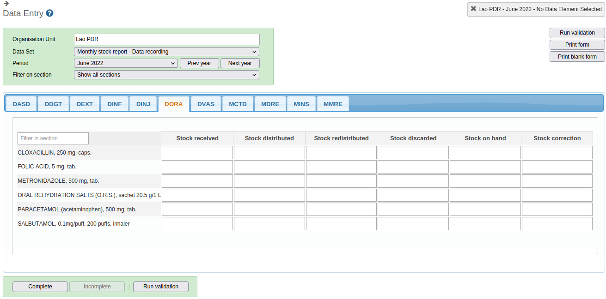

**Web portal / Data Visualizer**

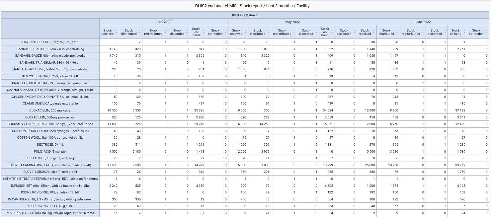

**Capture Android app**

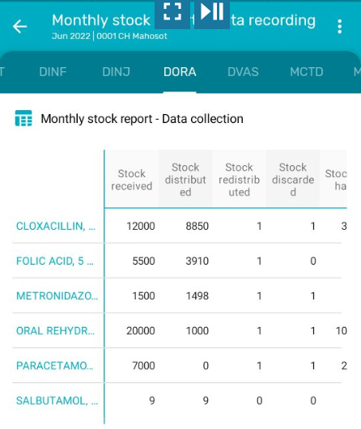

Data visualizer

Name: **"Monthly stock report - Recording and calculation"**
Visualization type: "Pivot table"
Columns: "Your dimensions" / "Monthly stock reporting - Data collection and calculation" (select all nine Category options)
Rows:

- Data: select the Data elements as required

- Period: "Last 3 months"
  Filter: Organisation Unit: select Organisation units as required

  

| > Data visualizer | Name: "DHIS2 end-user eLMIS - Stock report / Last 3 months / Facility" Visualization type: "Pivot table" Columns \- Period: "Last 3 months" \- Your Dimensions: "Monthly stock report - Data collection" (select all six Category options) Rows: Data: select Data elements as required Filter: Organisation Unit: select Organisation units as required |

The calculations are prompted by running the Predictors either separately or by configuring the "Scheduler" app to run all Predictors at the same time.

#### 2b.3 DHIS2 user interfaces

Web portal / Data Entry form

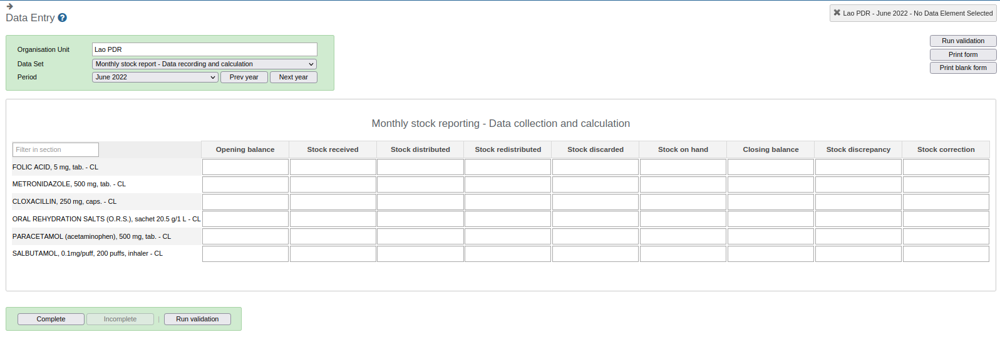

**Web portal / Data Visualizer**

Monthly stock report - Data collection

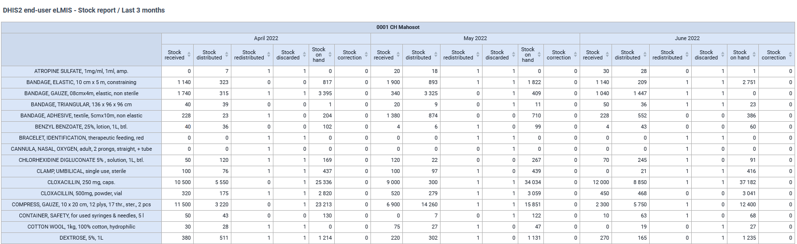

Monthly stock report - Data collection and calculation

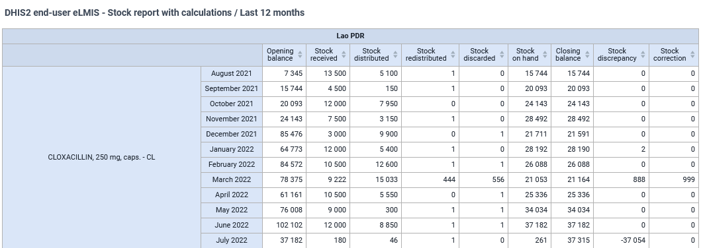

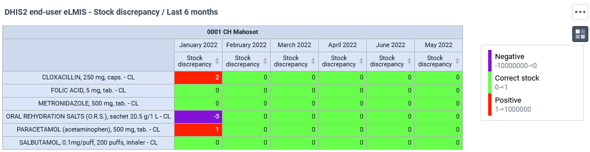

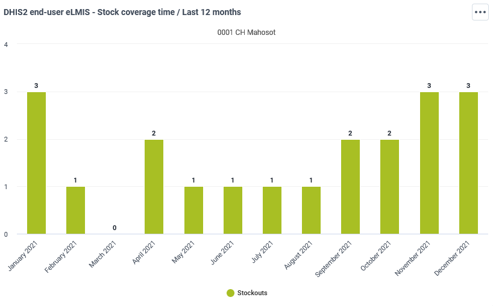

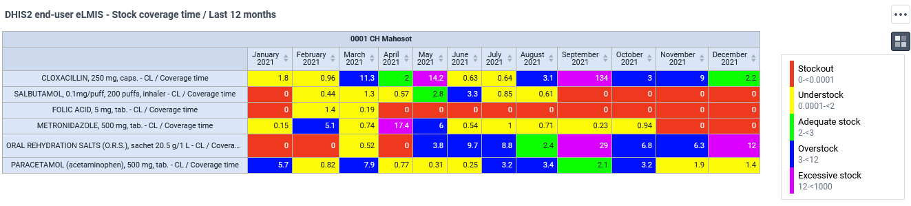

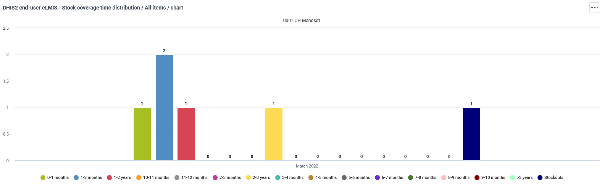

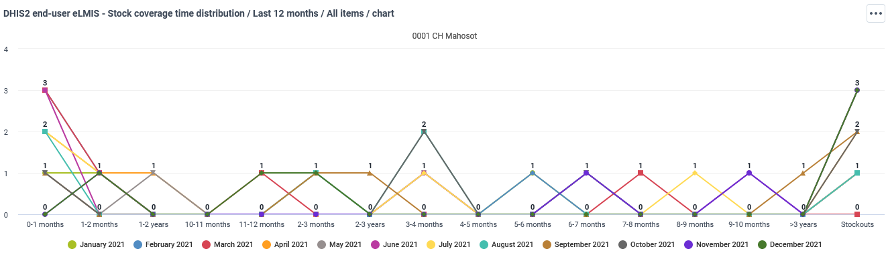

**Capture Android app**

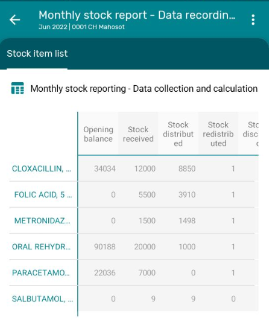
