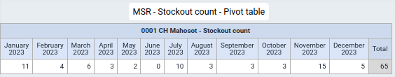
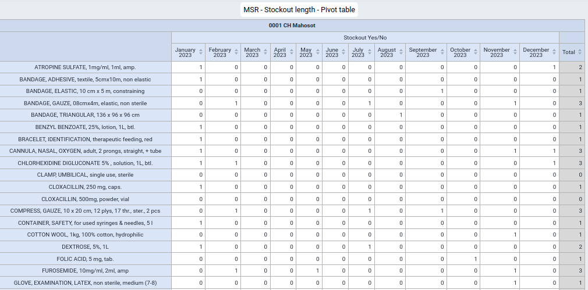
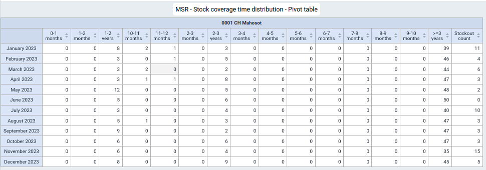
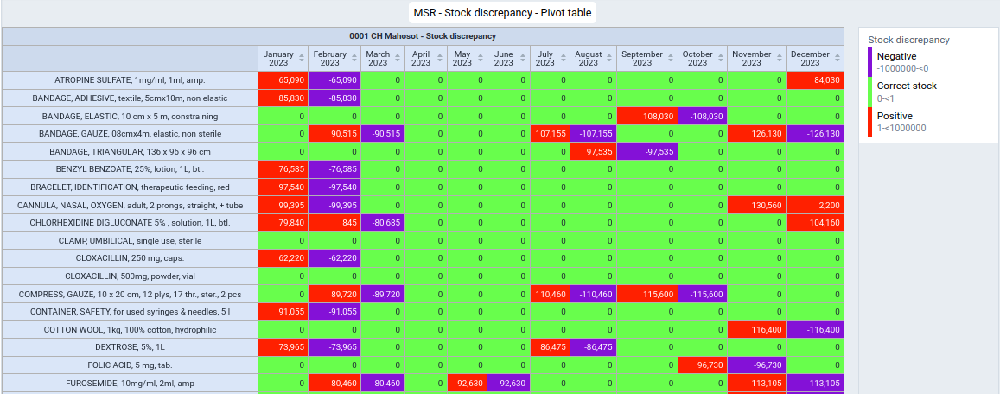
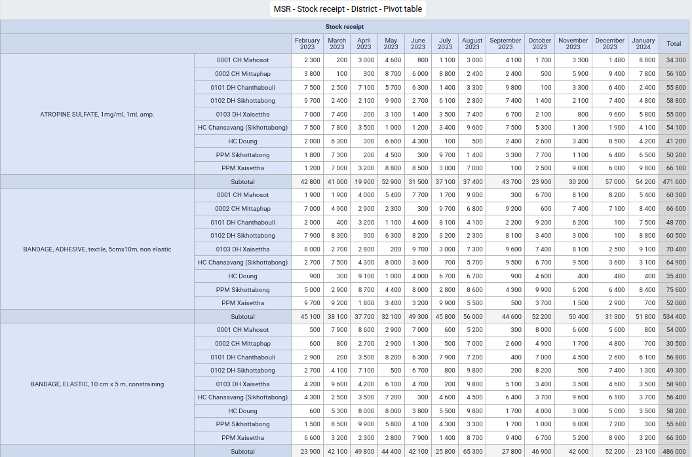
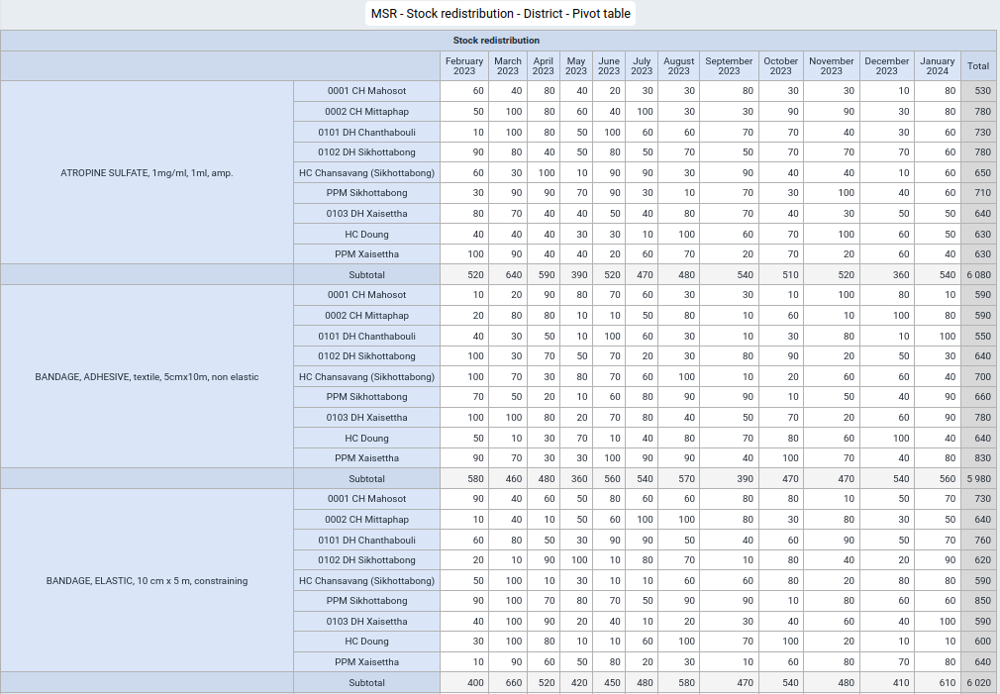
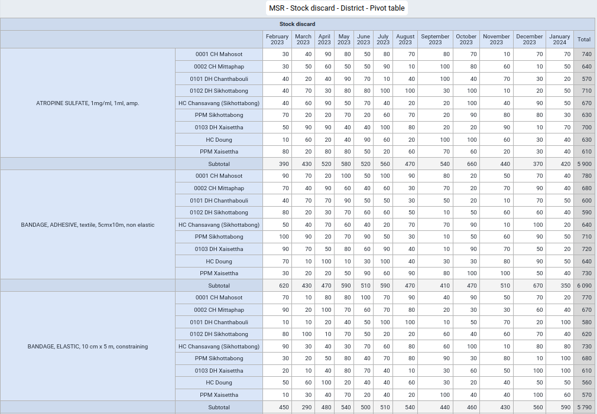
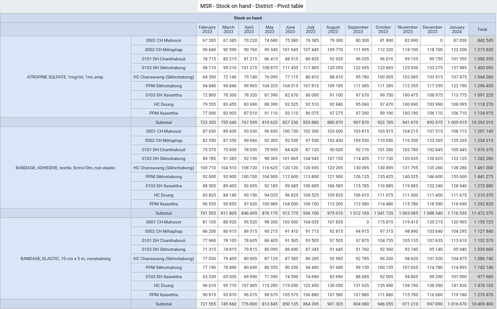
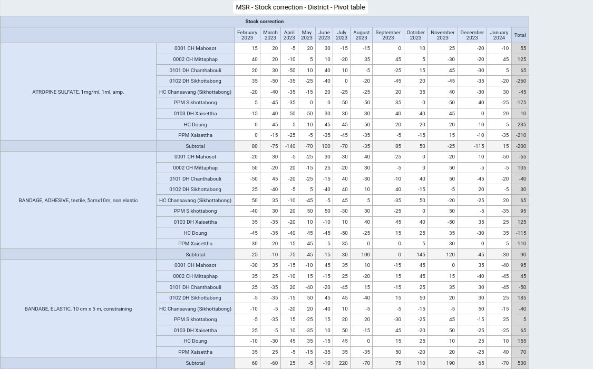

# Monthly Stock Data Recording / "Aggregate" Data Entry Form

This Default Data Entry Form ("aggregate") allows storekeepers at health care facilities to enter monthly data on demand ("consumption") as well as stock on hand digitally on a on- or off-line on a mobile device and synchronize the data with a central DHIS2 server for analysis, data sharing and integration with national eLMIS systems.

## Use case

### Monthly stock report - Data recording

At the end of the month, storekeepers will count the quantity of all health care products in the medical store and record the stock on hand. Furthermore, to obtain the total amount of each health care product issued from the medical store from the first to the last day of the month and record the total monthly demand ("consumption") directly on a mobile device. The list of stock items ("Data Elements") can be adapted to each health care facility as needed and user access can be given selectively to individual storekeepers as required.

### Monthly stock report - Data recording and calculation

In addition to the above: at the end of the month after the physical stock count and all data has been entered, Predictors automatically calculate the following data:

- Opening balance: identical with the "Stock on hand" from the end of the previous month

- Closing balance: Opening balance + Stock received - Stock distributed 
- Stock redistributed - Stock discarded   

- Stock discrepancy: Stock on hand (as counted) - Closing balance

- Stock on hand Yes/No: calculates whether a stockout occurred at the end of the month (at the time of the physical stock count)  

## Maintenance Web App - DHIS2 metadata configuration

The configuration of this Default Data Entry form uses "Disaggregation categories" as this is technically the only way to display a table for recording data in the DHIS2 Android Capture App on a mobile device and relies only on basic, native DHIS2 functionality.

### Metadata overview
The required metadata settings seetings are presented in the order in which it is presented in the DHIS2 Maintenance Web App.

>**1 CATEGORY**  
>>1.1 Category option  
>>1.2 Category  
>>1.3 Category combination 
> 
>**2 DATA ELEMENT**  
>>2.1 Data element - "Aggregate"  
>>2.3 Data element group  
> 
>**3 DATA SET**  
>>3.1 Monthly stock reporting
> 
>**4 INDICATOR**  
>>4.1 Indicator  
>>4.1.1 Indicator type
> 
>**5 OTHER**  
>>5.1 Legend  
>>5.2 Predictor  
>>5.3 Predictor group

### 1 CATEGORY

#### 1.1 Category option
>**1 Stock correction**  
>>**Name \(*)**: "Stock correction"  
>>**Short name \(*)**: "Stock correction"  
>>**Organisation units selected**: (select as required) 
>
>**2 Stock discarded**  
>>**Name \(*)**: "Stock discarded"  
>>**Short name \(*)**: "Stock discarded"  
>>**Organisation units selected**: (select as required) 
>
>**3 Stock distributed**  
>>**Name \(*)**: "Stock distributed"  
>>**Short name \(*)**: "Stock distributed"  
>>**Organisation units selected**: (select as required) 
>
>**4 Stock received**  
>>**Name \(*)**: "Stock received"  
>>**Short name \(*)**: "Stock received"  
>>**Organisation units selected**: (select as required) 
>
>**5 Stock redistributed**  
>>**Name \(*)**: "Stock redistributed"  
>>**Short name \(*)**: "Stock redistributed"  
>>**Organisation units selected**: (select as required) 
>
>**6 Stock correction**  
>>**Name \(*)**: "Stock on hand"  
>>**Short name \(*)**: "Stock on hand"  
>>**Organisation units selected**: (select as required) 

#### 1.2 Category
>**1 MSR - Monthly stock report - Data recording**  
>>**Name \(*)**: "MSR - Monthly stock report - Data recording"  
>>**Short name \(*)**: "Monthly stock report - Data recording"  
>>**Data dimension type \(*)**: "Disaggregation"  
>>**Data dimension**: tag (appears as white tick in a blue square)  
>>**Category options**: *note the order of "Category options"*:  
>>>"Stock received"  
>>>"Stock distributed"  
>>>"Stock redistributed"  
>>>"Stock discarded"  
>>>"Stock on hand"  
>>>"Stock correction"  
>
>**2 MSR - Monthly stock report - Data recording and calculation**  
>>**Name \(*)**: "MSR - Monthly stock report - Data recording and calculation"  
>>**Short name \(*)**: "Monthly stock report - Data recording and calculation"  
>>**Data dimension type \(*)**: "Disaggregation"  
>>**Data dimension**: tag (appears as white tick in a blue square)  
>>**Category options**: *note the order of "Category options"*:  
>>>"Opening balance"  
>>>"Stock received"  
>>>"Stock distributed"  
>>>"Stock redistributed"  
>>>"Stock discarded"
>>>"Stock on hand"  
>>>"Closing balance"  
>>>"Stock discrepancy"  
>>>"Stock correction"  
>>>"Stock on hand Yes/No"  

#### 1.3 Category combination
>**1 MSR Monthly stock report - Data recording**  
>>**Name \(*)**: **Monthly stock report - Data recording**  
>>**Data dimension type \(*)**: "Disaggregation"  
>>**Skip category total in report \(*)**: check (appears as white tick in a blue square)   
>>**Categories**: "Monthly stock report - Data recording"
>
>**2 Monthly stock report - Data recording and calculation**  
>>**Name \(*)**: **Monthly stock report - Data recording and calculation**  
>>**Data dimension type \(*)**: "Disaggregation"  
>>**Skip category total in report \(*)**: check (appears as white tick in a blue square)   
>>**Categories**: "Monthly stock report - Data recording and calculation"

### 2 DATA ELEMENT

### 2.1 Data element
Data elements represent the items (healthcare products) for which logistics data is recorded and managed. A separate and unique Data element needs to be configured for each item (healthcare product).

>**1 ATROPINE SULFATE, 1mg/ml, 1ml, amp. - MSR**
>>**Name \(*)**: "ATROPINE SULFATE, 1mg/ml, 1ml, amp. - MSR"  
>>**Short name \(*)**: "DINJATRO1A"
>>**Code \(*)**:  "DINJATRO1A"
>>**Domain Type \(*)**: "Aggregate"  
>>**Value type \(*)**: "Integer"  
>>**Aggregation type (*)**: "Sum"  
>>**Store zero data values**: tag (appears as white tick in a blue square) 
>>**Category combination \(*)**: "Monthly stock report - Data collection"  
>
>**[Number] [Item] - MSR**
>>**Name \(*)**: "X [Item] - MSR"  
>>**Short name \(*)**: "[Item code]"
>>**Code \(*)**:  "[Item code]"
>>**Domain Type \(*)**: "Aggregate"  
>>**Value type \(*)**: "Integer"  
>>**Aggregation type (*)**: "Sum"  
>>**Store zero data values**: tag (appears as white tick in a blue square) 
>>**Category combination \(*)**: "Monthly stock report - Data collection"  

### 2.2 Data element group

The creation of Data element groups is a DHIS2 best practice but also a precondition for using the "Group Predictor" functionality which allows using a placeholder and the Data element group ID for creating a single Predictor which is automatically applied to all Data elements in the respective Data element group. For example for calculating the stock coverage time.

>**1 Stock item list - MSR**  
>**Name \(*)**: "Stock item list - MSR"  
>**Short name \(*)**: "Stock item list - MSR"
>**Data elements \(*)**: *select all Data elements with the "MSR" suffix"*    

### 3 Data set

This Default Data Entry Form ("aggregate") allows storekeepers at health care facilities to enter monthly data on demand ("consumption") as well as stock on hand digitally on a on- or off-line on a mobile device and synchronize the data with a central DHIS2 server for analysis, data sharing and integration with national eLMIS systems.

#### 3.1 Data set
Data sets for each Organisation unit are required for recording and storing monthly stock report data.
The sections can be displayed in the Data Entry (beta) Web App as well as in the Capture Android App either in a single table or as separate tabs.
The configuration for two Data sets are presented below, but either the one or the other should be used:
- "MSR - Monthly stock report - Data recording"
- "MSR - Monthly stock report - Data recording and calculation"

>**1 MSR - Monthly stock report - Data recording**  
>>**Name \(*)**: "MSR - Monthly stock report - Data recording"  
>>**Short name \(*)**: "Monthly stock report - Data recording"
>>**Color**: "#00ACC1"  
>>**Expiry days**: "5"  
>>**Open future periods for data entry**: "1"  
>>**Days after period to qualify for timely submission**: "5"  
>>**Period type**: "Monthly"  
>>**Category combination**: "None"  
>>**Render sections as tabs**: tag (appears as white tick in a blue square)  
>>**Data elements**  
>>>*Add all Data elements with the suffix "MSR" required for the respective health facility*.
>>
>>**Organisation units selected**: (select as for the Tracker Program) 
>>
>>**Actions**
>>>**Manage sections**
>>>>**Name**
>>>>>**1 DASD**
>>>>>>**DASD**
>>>>>>**Data elements**
>>>>>>>CHLORHEXIDINE DIGLUCONATE 5% , solution, 1L, btl. - MSR  
>>>>>>>IODINE POVIDONE, 10%, solution, 1L, btl. - MSR  
>>>>>**2 [Section 2]**  
>>>>>>**[Section 2]**  
>>>>>>**Data elements**  
>>>>>>>[Data element]  

### 4 Indicator

#### 4.1 Indicator

Indicators are used for calculating the following logistics metrics:

- Number of items in stock coverage bins (0-1, 1-2, 2-3 months etc.) for visualizing the stock coverage time distribution 

- Stock coverage time (stock on hand / average monthly demand)

- Stock availability (percentage of items which are on hand)

- Stockout count (number of items which are out of stock)

For the "Stock coverage time" indicator it would in principle be preferable to configure the "Stock coverage time" as Predictor (as it would allow using the "Group predictor" function) but because the "Stock coverage time" requires displaying decimals and the Data Entry form only allows a single number format for all Category Options, an indicator is used instead. This approach allows freely setting the number of decimals in the Indicator settings. Note that items will have to be added and removed individually if the stock item list is changed.

>**1 0-1 months - MSR**  
>For each item the Indicator returns "1" if the item has stock and stock coverage time is less than 1 and otherwise returns "0" and then adds up these results for calculating the number of items with a stock coverage time of 0-1 months. 
>>**Name \(*)**: "0-1 months - MSR"  
>>**Short Name \(*)**: "0-1 months"  
>>**Description**: "Number of items with a coverage time of 0-1 months"  
>>**Decimals in data output**: "0"  
>>**Indicator type \(*)**: "Number (Factor 1)"  
>>**Edit numerator**:
>>>**Description**: "O-1 months - MSR - Numerator"
>>>**Calculation**: 
>>>if(#{uwQn42CZ5qI.eKdBeWyrmPN}/#{uwQn42CZ5qI.VCzZmn4Xpjg}>0 && #{uwQn42CZ5qI.eKdBeWyrmPN}/#{uwQn42CZ5qI.VCzZmn4Xpjg}<1,1,0)+
f(#{Ev8PDcJ9I5X.eKdBeWyrmPN}/#{Ev8PDcJ9I5X.VCzZmn4Xpjg}>0 && #{Ev8PDcJ9I5X.eKdBeWyrmPN}/#{Ev8PDcJ9I5X.VCzZmn4Xpjg}<1,1,0)+
if(#{irAGhTCJcO8.eKdBeWyrmPN}/#{irAGhTCJcO8.VCzZmn4Xpjg}>0 && #{irAGhTCJcO8.eKdBeWyrmPN}/#{irAGhTCJcO8.VCzZmn4Xpjg}<1,1,0)+
if(#{VNT5TGE3uBQ.eKdBeWyrmPN}/#{VNT5TGE3uBQ.VCzZmn4Xpjg}>0 && #{VNT5TGE3uBQ.eKdBeWyrmPN}/#{VNT5TGE3uBQ.VCzZmn4Xpjg}<1,1,0)+
if(#{Csg4rTaIYDj.eKdBeWyrmPN}/#{Csg4rTaIYDj.VCzZmn4Xpjg}>0 && #{Csg4rTaIYDj.eKdBeWyrmPN}/#{Csg4rTaIYDj.VCzZmn4Xpjg}<1,1,0)+
if(#{mIYcOnLcqes.eKdBeWyrmPN}/#{mIYcOnLcqes.VCzZmn4Xpjg}>0 && #{mIYcOnLcqes.eKdBeWyrmPN}/#{mIYcOnLcqes.VCzZmn4Xpjg}<1,1,0  
>>>
>>>if([Item 1] Stock on hand/[Item 1] Stock distributed]>0 &&
[Item 1] Stock on hand/[Item 1] Stock distributed]<1,1,0)+
if([Item 2] Stock on hand/[Item 2] Stock distributed]>0 &&
[Item 2] Stock on hand/[Item 2] Stock distributed]<1,1,0)+
etc.
>>
>>**Edit denominator**:
>>>**Description**: "O-1 months - MSR - Denominator"  
>>>**Calculation**: "1"
>
>**2 1-2 months - MSR**  
>For each item the Indicator returns "1" if the stock coverage time is greater than or equal to 1 but less than 2 and otherwise returns 0and then adds up these results for calculating the number of items with a stock coverage time greater of 1-2 months.
>>**Name \(*)**: "1-2 months - MSR"  
>>**Short Name \(*)**: "1-2 months"  
>>**Description**: "Number of items with a coverage time of 1-2 months"  
>>**Decimals in data output**: "0"  
>>**Indicator type \(*)**: "Number (Factor 1)"  
>>**Edit numerator**:
>>>**Description**: "1-2 months - MSR - Numerator"
>>>**Calculation**: 
>>>if(#{uwQn42CZ5qI.eKdBeWyrmPN}/#{uwQn42CZ5qI.VCzZmn4Xpjg}>=1 && #{uwQn42CZ5qI.eKdBeWyrmPN}/#{uwQn42CZ5qI.VCzZmn4Xpjg}<2,1,0)+
if(#{Ev8PDcJ9I5X.eKdBeWyrmPN}/#{Ev8PDcJ9I5X.VCzZmn4Xpjg}>=1 && #{Ev8PDcJ9I5X.eKdBeWyrmPN}/#{Ev8PDcJ9I5X.VCzZmn4Xpjg}<2,1,0)+
if(#{irAGhTCJcO8.eKdBeWyrmPN}/#{irAGhTCJcO8.VCzZmn4Xpjg}>=1 && #{irAGhTCJcO8.eKdBeWyrmPN}/#{irAGhTCJcO8.VCzZmn4Xpjg}<2,1,0)+
if(#{VNT5TGE3uBQ.eKdBeWyrmPN}/#{VNT5TGE3uBQ.VCzZmn4Xpjg}>=1 && #{VNT5TGE3uBQ.eKdBeWyrmPN}/#{VNT5TGE3uBQ.VCzZmn4Xpjg}<2,1,0)+
if(#{Csg4rTaIYDj.eKdBeWyrmPN}/#{Csg4rTaIYDj.VCzZmn4Xpjg}>=1 && #{Csg4rTaIYDj.eKdBeWyrmPN}/#{Csg4rTaIYDj.VCzZmn4Xpjg}<2,1,0)+
if(#{mIYcOnLcqes.eKdBeWyrmPN}/#{mIYcOnLcqes.VCzZmn4Xpjg}>=1 && #{mIYcOnLcqes.eKdBeWyrmPN}/#{mIYcOnLcqes.VCzZmn4Xpjg}<2,1,0)
>>>
>>>if([Item 1] Stock on hand/[Item 1] Stock distributed]>=1 &&
[Item 1] Stock on hand/[Item 1] Stock distributed]<2,1,0)+
if([Item 2] Stock on hand/[Item 2] Stock distributed]>=1 &&
[Item 2] Stock on hand/[Item 2] Stock distributed]<2,1,0)+
etc.
>>
>>**Edit denominator**:
>>>**Description**: "1-2 months - MSR - Denominator"
>>>**Calculation**: "1"
>
>**3 2-3 months - MSR**  
>For each item the Indicator returns "1" if the stock coverage time is greater than or equal to 2 but less than 3 and otherwise returns 0and then adds up these results for calculating the number of items with a stock coverage time greater of 2-3 months.
>if(#{uwQn42CZ5qI.eKdBeWyrmPN}/#{uwQn42CZ5qI.VCzZmn4Xpjg}>=2 && #{uwQn42CZ5qI.eKdBeWyrmPN}/#{uwQn42CZ5qI.VCzZmn4Xpjg}<3,1,0)+
if(#{Ev8PDcJ9I5X.eKdBeWyrmPN}/#{Ev8PDcJ9I5X.VCzZmn4Xpjg}>=2 && #{Ev8PDcJ9I5X.eKdBeWyrmPN}/#{Ev8PDcJ9I5X.VCzZmn4Xpjg}<3,1,0)+
if(#{irAGhTCJcO8.eKdBeWyrmPN}/#{irAGhTCJcO8.VCzZmn4Xpjg}>=2 && #{irAGhTCJcO8.eKdBeWyrmPN}/#{irAGhTCJcO8.VCzZmn4Xpjg}<3,1,0)+
if(#{VNT5TGE3uBQ.eKdBeWyrmPN}/#{VNT5TGE3uBQ.VCzZmn4Xpjg}>=2 && #{VNT5TGE3uBQ.eKdBeWyrmPN}/#{VNT5TGE3uBQ.VCzZmn4Xpjg}<3,1,0)+
if(#{Csg4rTaIYDj.eKdBeWyrmPN}/#{Csg4rTaIYDj.VCzZmn4Xpjg}>=2 && #{Csg4rTaIYDj.eKdBeWyrmPN}/#{Csg4rTaIYDj.VCzZmn4Xpjg}<3,1,0)+
if(#{mIYcOnLcqes.eKdBeWyrmPN}/#{mIYcOnLcqes.VCzZmn4Xpjg}>=2 && #{mIYcOnLcqes.eKdBeWyrmPN}/#{mIYcOnLcqes.VCzZmn4Xpjg}<3,1,0)
>>>
>>>if([Item 1] Stock on hand/[Item 1] Stock distributed]>=2 &&
[Item 1] Stock on hand/[Item 1] Stock distributed]<3,1,0)+
if([Item 2] Stock on hand/[Item 2] Stock distributed]>=2 &&
[Item 2] Stock on hand/[Item 2] Stock distributed]<3,1,0)+
etc.
>>
>>**Edit denominator**:
>>>**Description**: "2-3 months - MSR - Denominator"
>>>**Calculation**: "1"
>
>**4 3-4 months - MSR**  
>For each item the Indicator returns "1" if the stock coverage time is greater than or equal to 3 but less than 4 and otherwise returns 0and then adds up these results for calculating the number of items with a stock coverage time of 3-4 months. 
>>**Name \(*)**: "3-4 months - MSR"  
>>**Short Name \(*)**: "3-4 months - MSR"  
>>**Description**: "Number of items with a coverage time of 3-4 months"  
>>**Decimals in data output**: "0"  
>>**Indicator type \(*)**: "Number (Factor 1)"  
>>**Edit numerator**:
>>>**Description**: "3-4 months - MSR - Numerator"
>>>**Calculation**: 
>>>if(#{uwQn42CZ5qI.eKdBeWyrmPN}/#{uwQn42CZ5qI.VCzZmn4Xpjg}>=3 && #{uwQn42CZ5qI.eKdBeWyrmPN}/#{uwQn42CZ5qI.VCzZmn4Xpjg}<4,1,0)+
if(#{Ev8PDcJ9I5X.eKdBeWyrmPN}/#{Ev8PDcJ9I5X.VCzZmn4Xpjg}>=3 && #{Ev8PDcJ9I5X.eKdBeWyrmPN}/#{Ev8PDcJ9I5X.VCzZmn4Xpjg}<4,1,0)+
if(#{irAGhTCJcO8.eKdBeWyrmPN}/#{irAGhTCJcO8.VCzZmn4Xpjg}>=3 && #{irAGhTCJcO8.eKdBeWyrmPN}/#{irAGhTCJcO8.VCzZmn4Xpjg}<4,1,0)+
if(#{VNT5TGE3uBQ.eKdBeWyrmPN}/#{VNT5TGE3uBQ.VCzZmn4Xpjg}>=3 && #{VNT5TGE3uBQ.eKdBeWyrmPN}/#{VNT5TGE3uBQ.VCzZmn4Xpjg}<4,1,0)+
if(#{Csg4rTaIYDj.eKdBeWyrmPN}/#{Csg4rTaIYDj.VCzZmn4Xpjg}>=3 && #{Csg4rTaIYDj.eKdBeWyrmPN}/#{Csg4rTaIYDj.VCzZmn4Xpjg}<4,1,0)+
if(#{mIYcOnLcqes.eKdBeWyrmPN}/#{mIYcOnLcqes.VCzZmn4Xpjg}>=3 && #{mIYcOnLcqes.eKdBeWyrmPN}/#{mIYcOnLcqes.VCzZmn4Xpjg}<4,1,0)
>>>
>>>if([Item 1] Stock on hand/[Item 1] Stock distributed]>=3 &&
[Item 1] Stock on hand/[Item 1] Stock distributed]<4,1,0)+
if([Item 2] Stock on hand/[Item 2] Stock distributed]>=3 &&
[Item 2] Stock on hand/[Item 2] Stock distributed]<4,1,0)+
etc.
>>
>>**Edit denominator**:
>>>**Description**: "3-4 months - MSR - Denominator"
>>>**Calculation**: "1"
>
>**5 4-5 months - MSR**  
>For each item the Indicator returns "1" if the stock coverage time is greater than or equal to 4 but less than 5 and otherwise returns 0and then adds up these results for calculating the number of items with a stock coverage time greater of 4-5 months.   
>>**Name \(*)**: "4-5 months - MSR"  
>>**Short Name \(*)**: "4-5 months - MSR"  
>>**Description**: "Number of items with a coverage time of 4-5 months"  
>>**Decimals in data output**: "0"  
>>**Indicator type \(*)**: "Number (Factor 1)"  
>>**Edit numerator**:
>>>**Description**: "4-5 months - MSR - Numerator"
>>>**Calculation**: 
>>>if(#{uwQn42CZ5qI.eKdBeWyrmPN}/#{uwQn42CZ5qI.VCzZmn4Xpjg}>=4 && #{uwQn42CZ5qI.eKdBeWyrmPN}/#{uwQn42CZ5qI.VCzZmn4Xpjg}<5,1,0)+
if(#{Ev8PDcJ9I5X.eKdBeWyrmPN}/#{Ev8PDcJ9I5X.VCzZmn4Xpjg}>=4 && #{Ev8PDcJ9I5X.eKdBeWyrmPN}/#{Ev8PDcJ9I5X.VCzZmn4Xpjg}<5,1,0)+
if(#{irAGhTCJcO8.eKdBeWyrmPN}/#{irAGhTCJcO8.VCzZmn4Xpjg}>=4 && #{irAGhTCJcO8.eKdBeWyrmPN}/#{irAGhTCJcO8.VCzZmn4Xpjg}<5,1,0)+
if(#{VNT5TGE3uBQ.eKdBeWyrmPN}/#{VNT5TGE3uBQ.VCzZmn4Xpjg}>=4 && #{VNT5TGE3uBQ.eKdBeWyrmPN}/#{VNT5TGE3uBQ.VCzZmn4Xpjg}<5,1,0)+
if(#{Csg4rTaIYDj.eKdBeWyrmPN}/#{Csg4rTaIYDj.VCzZmn4Xpjg}>=4 && #{Csg4rTaIYDj.eKdBeWyrmPN}/#{Csg4rTaIYDj.VCzZmn4Xpjg}<5,1,0)+
if(#{mIYcOnLcqes.eKdBeWyrmPN}/#{mIYcOnLcqes.VCzZmn4Xpjg}>=4 && #{mIYcOnLcqes.eKdBeWyrmPN}/#{mIYcOnLcqes.VCzZmn4Xpjg}<5,1,0)
>>>
>>>if([Item 1] Stock on hand/[Item 1] Stock distributed]>=4 &&
[Item 1] Stock on hand/[Item 1] Stock distributed]<5,1,0)+
if([Item 2] Stock on hand/[Item 2] Stock distributed]>=4 &&
[Item 2] Stock on hand/[Item 2] Stock distributed]<5,1,0)+
etc.
>>
>>**Edit denominator**:
>>>**Description**: "4-5 months - MSR - Denominator"
>>>**Calculation**: "1"
>
>**6 5-6 months - MSR**  
>For each item the Indicator returns "1" if the stock coverage time is greater than or equal to 5 but less than 6 and otherwise returns 0 and then adds up these results for calculating the number of items with a stock coverage of 5-6 months. 
>>**Name \(*)**: "0-1 months - MSR"  
>>**Short Name \(*)**: "0-1 months - MSR"  
>>**Description**: "Number of items with a coverage time of 0-1 months"  
>>**Decimals in data output**: "0"  
>>**Indicator type \(*)**: "Number (Factor 1)"  
>>**Edit numerator**:
>>>**Description**: "O-1 months - MSR - Numerator"
>>>**Calculation**: 
>>>if(#{uwQn42CZ5qI.eKdBeWyrmPN}/#{uwQn42CZ5qI.VCzZmn4Xpjg}>=5 && #{uwQn42CZ5qI.eKdBeWyrmPN}/#{uwQn42CZ5qI.VCzZmn4Xpjg}<6,1,0)+
if(#{Ev8PDcJ9I5X.eKdBeWyrmPN}/#{Ev8PDcJ9I5X.VCzZmn4Xpjg}>=5 && #{Ev8PDcJ9I5X.eKdBeWyrmPN}/#{Ev8PDcJ9I5X.VCzZmn4Xpjg}<6,1,0)+
if(#{irAGhTCJcO8.eKdBeWyrmPN}/#{irAGhTCJcO8.VCzZmn4Xpjg}>=5 && #{irAGhTCJcO8.eKdBeWyrmPN}/#{irAGhTCJcO8.VCzZmn4Xpjg}<6,1,0)+
if(#{VNT5TGE3uBQ.eKdBeWyrmPN}/#{VNT5TGE3uBQ.VCzZmn4Xpjg}>=5 && #{VNT5TGE3uBQ.eKdBeWyrmPN}/#{VNT5TGE3uBQ.VCzZmn4Xpjg}<6,1,0)+
if(#{Csg4rTaIYDj.eKdBeWyrmPN}/#{Csg4rTaIYDj.VCzZmn4Xpjg}>=5 && #{Csg4rTaIYDj.eKdBeWyrmPN}/#{Csg4rTaIYDj.VCzZmn4Xpjg}<6,1,0)+
if(#{mIYcOnLcqes.eKdBeWyrmPN}/#{mIYcOnLcqes.VCzZmn4Xpjg}>=5 && #{mIYcOnLcqes.eKdBeWyrmPN}/#{mIYcOnLcqes.VCzZmn4Xpjg}<6,1,0)
>>>
>>>if([Item 1] Stock on hand/[Item 1] Stock distributed]>=5 &&
[Item 1] Stock on hand/[Item 1] Stock distributed]<6,1,0)+
if([Item 2] Stock on hand/[Item 2] Stock distributed]>=5 &&
[Item 2] Stock on hand/[Item 2] Stock distributed]<6,1,0)+
etc.
>>
>>**Edit denominator**:
>>>**Description**: "5-6 months - MSR - Denominator"
>>>**Calculation**: "1"
>
>**7 6-7 months - MSR**  
>For each item the Indicator returns "1" if the stock coverage time is greater than or equal to 6 but less than 7 and otherwise returns 0and then adds up these results for calculating the number of items with a stock coverage time of 6-7 months. 
>>**Name \(*)**: "6-7 months - MSR"  
>>**Short Name \(*)**: "6-7 months - MSR"  
>>**Description**: "Number of items with a coverage time of 6-7 months"  
>>**Decimals in data output**: "0"  
>>**Indicator type \(*)**: "Number (Factor 1)"  
>>**Edit numerator**:
>>>**Description**: "6-7 months - MSR - Numerator"
>>>**Calculation**: 
>>>if(#{uwQn42CZ5qI.eKdBeWyrmPN}/#{uwQn42CZ5qI.VCzZmn4Xpjg}>=6 && #{uwQn42CZ5qI.eKdBeWyrmPN}/#{uwQn42CZ5qI.VCzZmn4Xpjg}<7,1,0)+
if(#{Ev8PDcJ9I5X.eKdBeWyrmPN}/#{Ev8PDcJ9I5X.VCzZmn4Xpjg}>=6 && #{Ev8PDcJ9I5X.eKdBeWyrmPN}/#{Ev8PDcJ9I5X.VCzZmn4Xpjg}<7,1,0)+
if(#{irAGhTCJcO8.eKdBeWyrmPN}/#{irAGhTCJcO8.VCzZmn4Xpjg}>=6 && #{irAGhTCJcO8.eKdBeWyrmPN}/#{irAGhTCJcO8.VCzZmn4Xpjg}<7,1,0)+
if(#{VNT5TGE3uBQ.eKdBeWyrmPN}/#{VNT5TGE3uBQ.VCzZmn4Xpjg}>=6 && #{VNT5TGE3uBQ.eKdBeWyrmPN}/#{VNT5TGE3uBQ.VCzZmn4Xpjg}<7,1,0)+
if(#{Csg4rTaIYDj.eKdBeWyrmPN}/#{Csg4rTaIYDj.VCzZmn4Xpjg}>=6 && #{Csg4rTaIYDj.eKdBeWyrmPN}/#{Csg4rTaIYDj.VCzZmn4Xpjg}<7,1,0)+
if(#{mIYcOnLcqes.eKdBeWyrmPN}/#{mIYcOnLcqes.VCzZmn4Xpjg}>=6 && #{mIYcOnLcqes.eKdBeWyrmPN}/#{mIYcOnLcqes.VCzZmn4Xpjg}<7,1,0)
>>>
>>>if([Item 1] Stock on hand/[Item 1] Stock distributed]>=6 &&
[Item 1] Stock on hand/[Item 1] Stock distributed]<7,1,0)+
if([Item 2] Stock on hand/[Item 2] Stock distributed]>=6 &&
[Item 2] Stock on hand/[Item 2] Stock distributed]<7,1,0)+
etc.
>>
>>**Edit denominator**:
>>>**Description**: "6-7 months - MSR - Denominator"
>>>**Calculation**: "1"
>
>**8 7-8 months - MSR**  
>For each item the Indicator returns "1" if the stock coverage time is greater than or equal to 1 but less than 2 and otherwise returns 0and then adds up these results for calculating the number of items with a stock coverage time of 7-8 months. 
>>**Name \(*)**: "7-8 months - MSR"  
>>**Short Name \(*)**: "7-8 months - MSR"  
>>**Description**: "Number of items with a coverage time of 7-8 months"  
>>**Decimals in data output**: "0"  
>>**Indicator type \(*)**: "Number (Factor 1)"  
>>**Edit numerator**:
>>>**Description**: "7-8 months - MSR - Numerator"
>>>**Calculation**: 
>>>if(#{uwQn42CZ5qI.eKdBeWyrmPN}/#{uwQn42CZ5qI.VCzZmn4Xpjg}>=7 && #{uwQn42CZ5qI.eKdBeWyrmPN}/#{uwQn42CZ5qI.VCzZmn4Xpjg}<8,1,0)+
if(#{Ev8PDcJ9I5X.eKdBeWyrmPN}/#{Ev8PDcJ9I5X.VCzZmn4Xpjg}>=7 && #{Ev8PDcJ9I5X.eKdBeWyrmPN}/#{Ev8PDcJ9I5X.VCzZmn4Xpjg}<8,1,0)+
if(#{irAGhTCJcO8.eKdBeWyrmPN}/#{irAGhTCJcO8.VCzZmn4Xpjg}>=7 && #{irAGhTCJcO8.eKdBeWyrmPN}/#{irAGhTCJcO8.VCzZmn4Xpjg}<8,1,0)+
if(#{VNT5TGE3uBQ.eKdBeWyrmPN}/#{VNT5TGE3uBQ.VCzZmn4Xpjg}>=7 && #{VNT5TGE3uBQ.eKdBeWyrmPN}/#{VNT5TGE3uBQ.VCzZmn4Xpjg}<8,1,0)+
if(#{Csg4rTaIYDj.eKdBeWyrmPN}/#{Csg4rTaIYDj.VCzZmn4Xpjg}>=7 && #{Csg4rTaIYDj.eKdBeWyrmPN}/#{Csg4rTaIYDj.VCzZmn4Xpjg}<8,1,0)+
if(#{mIYcOnLcqes.eKdBeWyrmPN}/#{mIYcOnLcqes.VCzZmn4Xpjg}>=7 && #{mIYcOnLcqes.eKdBeWyrmPN}/#{mIYcOnLcqes.VCzZmn4Xpjg}<8,1,0)
>>>
>>>if([Item 1] Stock on hand/[Item 1] Stock distributed]>=7 &&
[Item 1] Stock on hand/[Item 1] Stock distributed]<8,1,0)+
if([Item 2] Stock on hand/[Item 2] Stock distributed]>=7 &&
[Item 2] Stock on hand/[Item 2] Stock distributed]<8,1,0)+
etc.
>>
>>**Edit denominator**:
>>>**Description**: "7-8 months - MSR - Denominator"
>>>**Calculation**: "1"
>
>**9 8-9 months - MSR**  
>For each item the Indicator returns "1" if the stock coverage time is greater than or equal to 8 but less than 9 and otherwise returns 0and then adds up these results for calculating the number of items with a stock coverage time of 8-9 months. 
>>**Name \(*)**: "8-9 months - MSR"  
>>**Short Name \(*)**: "8-9 months - MSR"  
>>**Description**: "Number of items with a coverage time of 8-9 months"  
>>**Decimals in data output**: "0"  
>>**Indicator type \(*)**: "Number (Factor 1)"  
>>**Edit numerator**:
>>>**Description**: "8-9 months - MSR - Numerator"
>>>**Calculation**: 
>>>if(#{uwQn42CZ5qI.eKdBeWyrmPN}/#{uwQn42CZ5qI.VCzZmn4Xpjg}>=8 && #{uwQn42CZ5qI.eKdBeWyrmPN}/#{uwQn42CZ5qI.VCzZmn4Xpjg}<9,1,0)+
if(#{Ev8PDcJ9I5X.eKdBeWyrmPN}/#{Ev8PDcJ9I5X.VCzZmn4Xpjg}>=8 && #{Ev8PDcJ9I5X.eKdBeWyrmPN}/#{Ev8PDcJ9I5X.VCzZmn4Xpjg}<9,1,0)+
if(#{irAGhTCJcO8.eKdBeWyrmPN}/#{irAGhTCJcO8.VCzZmn4Xpjg}>=8 && #{irAGhTCJcO8.eKdBeWyrmPN}/#{irAGhTCJcO8.VCzZmn4Xpjg}<9,1,0)+
if(#{VNT5TGE3uBQ.eKdBeWyrmPN}/#{VNT5TGE3uBQ.VCzZmn4Xpjg}>=8 && #{VNT5TGE3uBQ.eKdBeWyrmPN}/#{VNT5TGE3uBQ.VCzZmn4Xpjg}<9,1,0)+
if(#{Csg4rTaIYDj.eKdBeWyrmPN}/#{Csg4rTaIYDj.VCzZmn4Xpjg}>=8 && #{Csg4rTaIYDj.eKdBeWyrmPN}/#{Csg4rTaIYDj.VCzZmn4Xpjg}<9,1,0)+
if(#{mIYcOnLcqes.eKdBeWyrmPN}/#{mIYcOnLcqes.VCzZmn4Xpjg}>=8 && #{mIYcOnLcqes.eKdBeWyrmPN}/#{mIYcOnLcqes.VCzZmn4Xpjg}<9,1,0)
>>>
>>>if([Item 1] Stock on hand/[Item 1] Stock distributed]>=8 &&
[Item 1] Stock on hand/[Item 1] Stock distributed]<9,1,0)+
if([Item 2] Stock on hand/[Item 2] Stock distributed]>=8 &&
[Item 2] Stock on hand/[Item 2] Stock distributed]<),1,0)+
etc.
>>
>>**Edit denominator**:
>>>**Description**: "8-9 months - MSR - Denominator"
>>>**Calculation**: "1"
>
>**10 9-10 months - MSR**  
>For each item the Indicator returns "1" if the stock coverage time is greater than or equal to 9 but less than 10 and otherwise returns 0 and then adds up these results for calculating the number of items with a stock coverage time of 9-10 months. 
>>**Name \(*)**: "9-10 months - MSR"  
>>**Short Name \(*)**: "9-10 months - MSR"  
>>**Description**: "Number of items with a coverage time of 9-10 months"  
>>**Decimals in data output**: "0"  
>>**Indicator type \(*)**: "Number (Factor 1)"  
>>**Edit numerator**:
>>>**Description**: "9-10 months - MSR - Numerator"
>>>**Calculation**: 
>>>if(#{uwQn42CZ5qI.eKdBeWyrmPN}/#{uwQn42CZ5qI.VCzZmn4Xpjg}>=9 && #{uwQn42CZ5qI.eKdBeWyrmPN}/#{uwQn42CZ5qI.VCzZmn4Xpjg}<10,1,0)+
if(#{Ev8PDcJ9I5X.eKdBeWyrmPN}/#{Ev8PDcJ9I5X.VCzZmn4Xpjg}>=9 && #{Ev8PDcJ9I5X.eKdBeWyrmPN}/#{Ev8PDcJ9I5X.VCzZmn4Xpjg}<10,1,0)+
if(#{irAGhTCJcO8.eKdBeWyrmPN}/#{irAGhTCJcO8.VCzZmn4Xpjg}>=9 && #{irAGhTCJcO8.eKdBeWyrmPN}/#{irAGhTCJcO8.VCzZmn4Xpjg}<10,1,0)+
if(#{VNT5TGE3uBQ.eKdBeWyrmPN}/#{VNT5TGE3uBQ.VCzZmn4Xpjg}>=9 && #{VNT5TGE3uBQ.eKdBeWyrmPN}/#{VNT5TGE3uBQ.VCzZmn4Xpjg}<10,1,0)+
if(#{Csg4rTaIYDj.eKdBeWyrmPN}/#{Csg4rTaIYDj.VCzZmn4Xpjg}>=9 && #{Csg4rTaIYDj.eKdBeWyrmPN}/#{Csg4rTaIYDj.VCzZmn4Xpjg}<10,1,0)+
if(#{mIYcOnLcqes.eKdBeWyrmPN}/#{mIYcOnLcqes.VCzZmn4Xpjg}>=9 && #{mIYcOnLcqes.eKdBeWyrmPN}/#{mIYcOnLcqes.VCzZmn4Xpjg}<10,1,0)
>>>
>>>if([Item 1] Stock on hand/[Item 1] Stock distributed]>=9 &&
[Item 1] Stock on hand/[Item 1] Stock distributed]<10,1,0)+
if([Item 2] Stock on hand/[Item 2] Stock distributed]>=9 &&
[Item 2] Stock on hand/[Item 2] Stock distributed]<10,1,0)+
etc.
>>
>>**Edit denominator**:
>>>**Description**: "9-10 months - MSR - Denominator"
>>>**Calculation**: "1"
>
>**11 10-11 months - MSR**  
>For each item the Indicator returns "1" if the stock coverage time is greater or equal to 10 but less than 11 and otherwise returns 0 and then adds up these results for calculating the number of items with a stock coverage time of 10-11 months. 
>>**Name \(*)**: "10-11 months - MSR"  
>>**Short Name \(*)**: "10-11 months - MSR"  
>>**Description**: "Number of items with a coverage time of 10-11 months"  
>>**Decimals in data output**: "0"  
>>**Indicator type \(*)**: "Number (Factor 1)"  
>>**Edit numerator**:
>>>**Description**: "1O-11 months - MSR - Numerator"
>>>**Calculation**: 
>>>if(#{uwQn42CZ5qI.eKdBeWyrmPN}/#{uwQn42CZ5qI.VCzZmn4Xpjg}>=10 && #{uwQn42CZ5qI.eKdBeWyrmPN}/#{uwQn42CZ5qI.VCzZmn4Xpjg}<11,1,0)+
if(#{Ev8PDcJ9I5X.eKdBeWyrmPN}/#{Ev8PDcJ9I5X.VCzZmn4Xpjg}>=10 && #{Ev8PDcJ9I5X.eKdBeWyrmPN}/#{Ev8PDcJ9I5X.VCzZmn4Xpjg}<11,1,0)+
if(#{irAGhTCJcO8.eKdBeWyrmPN}/#{irAGhTCJcO8.VCzZmn4Xpjg}>=10 && #{irAGhTCJcO8.eKdBeWyrmPN}/#{irAGhTCJcO8.VCzZmn4Xpjg}<11,1,0)+
if(#{VNT5TGE3uBQ.eKdBeWyrmPN}/#{VNT5TGE3uBQ.VCzZmn4Xpjg}>=10 && #{VNT5TGE3uBQ.eKdBeWyrmPN}/#{VNT5TGE3uBQ.VCzZmn4Xpjg}<11,1,0)+
if(#{Csg4rTaIYDj.eKdBeWyrmPN}/#{Csg4rTaIYDj.VCzZmn4Xpjg}>=10 && #{Csg4rTaIYDj.eKdBeWyrmPN}/#{Csg4rTaIYDj.VCzZmn4Xpjg}<11,1,0)+
if(#{mIYcOnLcqes.eKdBeWyrmPN}/#{mIYcOnLcqes.VCzZmn4Xpjg}>=10 && #{mIYcOnLcqes.eKdBeWyrmPN}/#{mIYcOnLcqes.VCzZmn4Xpjg}<11,1,0)
>>>
>>>if([Item 1] Stock on hand/[Item 1] Stock distributed]>=10 &&
[Item 1] Stock on hand/[Item 1] Stock distributed]<11,1,0)+
if([Item 2] Stock on hand/[Item 2] Stock distributed]>=10 &&
[Item 2] Stock on hand/[Item 2] Stock distributed]<11,1,0)+
etc.
>>
>>**Edit denominator**:
>>>**Description**: "1O-11 months - MSR - Denominator"
>>>**Calculation**: "1"
>
>**12 11-12 months - MSR**  
>For each item the Indicator returns "1" if the stock coverage time is greater than or equal to 11 but less than 12 and otherwise returns 0 and then adds up these results for calculating the number of items with a stock coverage time of 11-12 months. 
>>**Name \(*)**: "11-12 months - MSR"  
>>**Short Name \(*)**: "11-12 months - MSR"  
>>**Description**: "Number of items with a coverage time of 11-12 months"  
>>**Decimals in data output**: "0"  
>>**Indicator type \(*)**: "Number (Factor 1)"  
>>**Edit numerator**:
>>>**Description**: "11-12 months - MSR - Numerator"
>>>**Calculation**: 
>>>if(#{uwQn42CZ5qI.eKdBeWyrmPN}/#{uwQn42CZ5qI.VCzZmn4Xpjg}>=11 && #{uwQn42CZ5qI.eKdBeWyrmPN}/#{uwQn42CZ5qI.VCzZmn4Xpjg}<12,1,0)+
if(#{Ev8PDcJ9I5X.eKdBeWyrmPN}/#{Ev8PDcJ9I5X.VCzZmn4Xpjg}>=11 && #{Ev8PDcJ9I5X.eKdBeWyrmPN}/#{Ev8PDcJ9I5X.VCzZmn4Xpjg}<12,1,0)+
if(#{irAGhTCJcO8.eKdBeWyrmPN}/#{irAGhTCJcO8.VCzZmn4Xpjg}>=11 && #{irAGhTCJcO8.eKdBeWyrmPN}/#{irAGhTCJcO8.VCzZmn4Xpjg}<12,1,0)+
if(#{VNT5TGE3uBQ.eKdBeWyrmPN}/#{VNT5TGE3uBQ.VCzZmn4Xpjg}>=11 && #{VNT5TGE3uBQ.eKdBeWyrmPN}/#{VNT5TGE3uBQ.VCzZmn4Xpjg}<12,1,0)+
if(#{Csg4rTaIYDj.eKdBeWyrmPN}/#{Csg4rTaIYDj.VCzZmn4Xpjg}>=11 && #{Csg4rTaIYDj.eKdBeWyrmPN}/#{Csg4rTaIYDj.VCzZmn4Xpjg}<12,1,0)+
if(#{mIYcOnLcqes.eKdBeWyrmPN}/#{mIYcOnLcqes.VCzZmn4Xpjg}>=11 && #{mIYcOnLcqes.eKdBeWyrmPN}/#{mIYcOnLcqes.VCzZmn4Xpjg}<12,1,0)
>>>
>>>if([Item 1] Stock on hand/[Item 1] Stock distributed]>=11 &&
[Item 1] Stock on hand/[Item 1] Stock distributed]<12,1,0)+
if([Item 2] Stock on hand/[Item 2] Stock distributed]>=11 &&
[Item 2] Stock on hand/[Item 2] Stock distributed]<12,1,0)+
etc.
>>
>>**Edit denominator**:
>>>**Description**: "11-12 months - MSR - Denominator"
>>>**Calculation**: "1"
>
>**13 1-2 years - MSR**  
>For each item the Indicator returns "1" if the stock coverage time is greater rhan or equal to 12 but less than 24 and otherwise returns 0and then adds up these results for calculating the number of items with a stock coverage time of 12-24 months. 
>>**Name \(*)**: "1-2 years - MSR"  
>>**Short Name \(*)**: "1-2 years - MSR"  
>>**Description**: "Number of items with a coverage time of 1-2 years"  
>>**Decimals in data output**: "0"  
>>**Indicator type \(*)**: "Number (Factor 1)"  
>>**Edit numerator**:
>>>**Description**: "1-2 years - MSR - Numerator"
>>>**Calculation**: 
>>>if(#{uwQn42CZ5qI.eKdBeWyrmPN}/#{uwQn42CZ5qI.VCzZmn4Xpjg}>=12 && #{uwQn42CZ5qI.eKdBeWyrmPN}/#{uwQn42CZ5qI.VCzZmn4Xpjg}<24,1,0)+
if(#{Ev8PDcJ9I5X.eKdBeWyrmPN}/#{Ev8PDcJ9I5X.VCzZmn4Xpjg}>=12 && #{Ev8PDcJ9I5X.eKdBeWyrmPN}/#{Ev8PDcJ9I5X.VCzZmn4Xpjg}<24,1,0)+
if(#{irAGhTCJcO8.eKdBeWyrmPN}/#{irAGhTCJcO8.VCzZmn4Xpjg}>=12 && #{irAGhTCJcO8.eKdBeWyrmPN}/#{irAGhTCJcO8.VCzZmn4Xpjg}<24,1,0)+
if(#{VNT5TGE3uBQ.eKdBeWyrmPN}/#{VNT5TGE3uBQ.VCzZmn4Xpjg}>=12 && #{VNT5TGE3uBQ.eKdBeWyrmPN}/#{VNT5TGE3uBQ.VCzZmn4Xpjg}<24,1,0)+
if(#{Csg4rTaIYDj.eKdBeWyrmPN}/#{Csg4rTaIYDj.VCzZmn4Xpjg}>=12 && #{Csg4rTaIYDj.eKdBeWyrmPN}/#{Csg4rTaIYDj.VCzZmn4Xpjg}<24,1,0)+
if(#{mIYcOnLcqes.eKdBeWyrmPN}/#{mIYcOnLcqes.VCzZmn4Xpjg}>=12 && #{mIYcOnLcqes.eKdBeWyrmPN}/#{mIYcOnLcqes.VCzZmn4Xpjg}<24,1,0)
>>>
>>>if([Item 1] Stock on hand/[Item 1] Stock distributed]>=12 &&
[Item 1] Stock on hand/[Item 1] Stock distributed]<24,1,0)+
if([Item 2] Stock on hand/[Item 2] Stock distributed]>=12 &&
[Item 2] Stock on hand/[Item 2] Stock distributed]<24,1,0)+
etc.
>>
>>**Edit denominator**:
>>>**Description**: "12-24 months - MSR - Denominator"
>>>**Calculation**: "1"
>
>**14 2-3 years - MSR**  
>For each item the Indicator returns "1" if the stock coverage time is greater than or equal to 24 but less than 36 and otherwise returns 0 and then adds up these results for calculating the number of items with a stock coverage time of 24-36 months. 
>>**Name \(*)**: "2-3 years - MSR"  
>>**Short Name \(*)**: "2-3 years - MSR"  
>>**Description**: "Number of items with a coverage time of 2-3 years"  
>>**Decimals in data output**: "0"  
>>**Indicator type \(*)**: "Number (Factor 1)"  
>>**Edit numerator**:
>>>**Description**: "2-3 years - MSR - Numerator"
>>>**Calculation**: 
>>>if(#{uwQn42CZ5qI.eKdBeWyrmPN}/#{uwQn42CZ5qI.VCzZmn4Xpjg}>=24 && #{uwQn42CZ5qI.eKdBeWyrmPN}/#{uwQn42CZ5qI.VCzZmn4Xpjg}<36,1,0)+
if(#{Ev8PDcJ9I5X.eKdBeWyrmPN}/#{Ev8PDcJ9I5X.VCzZmn4Xpjg}>=24 && #{Ev8PDcJ9I5X.eKdBeWyrmPN}/#{Ev8PDcJ9I5X.VCzZmn4Xpjg}<36,1,0)+
if(#{irAGhTCJcO8.eKdBeWyrmPN}/#{irAGhTCJcO8.VCzZmn4Xpjg}>=24 && #{irAGhTCJcO8.eKdBeWyrmPN}/#{irAGhTCJcO8.VCzZmn4Xpjg}<36,1,0)+
if(#{VNT5TGE3uBQ.eKdBeWyrmPN}/#{VNT5TGE3uBQ.VCzZmn4Xpjg}>=24 && #{VNT5TGE3uBQ.eKdBeWyrmPN}/#{VNT5TGE3uBQ.VCzZmn4Xpjg}<36,1,0)+
if(#{Csg4rTaIYDj.eKdBeWyrmPN}/#{Csg4rTaIYDj.VCzZmn4Xpjg}>=24 && #{Csg4rTaIYDj.eKdBeWyrmPN}/#{Csg4rTaIYDj.VCzZmn4Xpjg}<36,1,0)+
if(#{mIYcOnLcqes.eKdBeWyrmPN}/#{mIYcOnLcqes.VCzZmn4Xpjg}>=24 && #{mIYcOnLcqes.eKdBeWyrmPN}/#{mIYcOnLcqes.VCzZmn4Xpjg}<36,1,0)
>>>
>>>if([Item 1] Stock on hand/[Item 1] Stock distributed]>=24 &&
[Item 1] Stock on hand/[Item 1] Stock distributed]<36,1,0)+
if([Item 2] Stock on hand/[Item 2] Stock distributed]>0=24 &&
[Item 2] Stock on hand/[Item 2] Stock distributed]<36,1,0)+
etc.
>>
>>**Edit denominator**:
>>>**Description**: "2-3 years - MSR - Denominator"
>>>**Calculation**: "1"
>
>**15 >3 years - MSR**  
>For each item the Indicator returns "1" if the stock coverage time is greater than 36 and otherwise returns 0 and then adds up these results for calculating the number of items with a stock coverage time of 36 months or greater. 
>>**Name \(*)**: ">=3 years - MSR"  
>>**Short Name \(*)**: ">=3 years - MSR"  
>>**Description**: "Number of items with a coverage time greater than 3 years"  
>>**Decimals in data output**: "0"  
>>**Indicator type \(*)**: "Number (Factor 1)"  
>>**Edit numerator**:
>>>**Description**: ">03 years - MSR - Numerator"
>>>**Calculation**: 
>>>if(#{uwQn42CZ5qI.eKdBeWyrmPN}/#{uwQn42CZ5qI.VCzZmn4Xpjg}>=36,1,0)+
if(#{Ev8PDcJ9I5X.eKdBeWyrmPN}/#{Ev8PDcJ9I5X.VCzZmn4Xpjg}>=36,1,0)+
if(#{irAGhTCJcO8.eKdBeWyrmPN}/#{irAGhTCJcO8.VCzZmn4Xpjg}>=36,1,0)+
if(#{VNT5TGE3uBQ.eKdBeWyrmPN}/#{VNT5TGE3uBQ.VCzZmn4Xpjg}>=36,1,0)+
if(#{Csg4rTaIYDj.eKdBeWyrmPN}/#{Csg4rTaIYDj.VCzZmn4Xpjg}>=36,1,0)+
if(#{mIYcOnLcqes.eKdBeWyrmPN}/#{mIYcOnLcqes.VCzZmn4Xpjg}>=36,1,0)
>>>
>>>if([Item 1] Stock on hand/[Item 1] Stock distributed]>=36+
if([Item 2] Stock on hand/[Item 2] Stock distributed]>=36+
etc.
>>
>>**Edit denominator**:
>>>**Description**: ">= 3 years - MSR - Denominator"
>>>**Calculation**: "1"
>
>**16 High variability**  
>For each item the Indicator returns "1" if the coefficient of variation is greater than 10 and otherwise returns 0 and then adds up these results for calculating the number of items with a coefficient of variation of more than 10 (high variability). Note that the actual coefficient of variation is multiplied by 10.
>>**Name \(*)**: "High variability"  
>>**Short Name \(*)**: "High variability - MSR"    
>>**Description**: "Number of items with a coefficient of variation between 0 and 5."  
>>**Decimals in data output**: "0"  
>>**Indicator type \(*)**: "Number (Factor 1)"  
>>**Edit numerator**:
>>>**Description**: "HIgh variability - Numerator"  
>>>**Calculation**:  
>>>if(#{LNAkkMTxqEW.U2tBADVisKH}>10,1,0)+
if(#{WyDZKSw82X6.U2tBADVisKH}>10,1,0)+
if(#{JPccVwAGRq9.U2tBADVisKH}>10,1,0)+
if(#{smxJz7Mt6ia.U2tBADVisKH}>10,1,0)+
if(#{AaIApgGQM6t.U2tBADVisKH}>10,1,0)+
if(#{vCTrmv52APd.U2tBADVisKH}>10,1,0)+
if(#{SOw2TcuFFH2.U2tBADVisKH}>10,1,0)+
if(#{RSIOx2u07Ln.U2tBADVisKH}>10,1,0)+
if(#{JStiDyaPfqy.U2tBADVisKH}>10,1,0)+
if(#{hZ1YvdcTDQM.U2tBADVisKH}>10,1,0)+
if(#{tsi32D8HQd5.U2tBADVisKH}>10,1,0)+
if(#{QWlPF8S0gCc.U2tBADVisKH}>10,1,0)+
if(#{a5uLTDt12eT.U2tBADVisKH}>10,1,0)+
if(#{U0AfOOyJMy2.U2tBADVisKH}>10,1,0)+
if(#{cyf6UdScfFM.U2tBADVisKH}>10,1,0)+
if(#{FeUTTNHpVzD.U2tBADVisKH}>10,1,0)+
if(#{mKSICD1rxG4.U2tBADVisKH}>10,1,0)+
if(#{mVNe1aS1pGl.U2tBADVisKH}>10,1,0)+
if(#{oLAXTZY6ken.U2tBADVisKH}>10,1,0)+
if(#{YYaRDUZyH9L.U2tBADVisKH}>10,1,0)+
if(#{HVteopBt0jr.U2tBADVisKH}>10,1,0)+
if(#{sWodd2tbjgZ.U2tBADVisKH}>10,1,0)+
if(#{yVYajDDYUfX.U2tBADVisKH}>10,1,0)+
if(#{eTJAr4sc83v.U2tBADVisKH}>10,1,0)+
if(#{U4KSmanl4JP.U2tBADVisKH}>10,1,0)+
if(#{FXsa5uG3IGn.U2tBADVisKH}>10,1,0)+
if(#{L34T9YDtCor.U2tBADVisKH}>10,1,0)+
if(#{W5mHXhSYFfQ.U2tBADVisKH}>10,1,0)+
if(#{cmSUyJOZwyl.U2tBADVisKH}>10,1,0)+
if(#{cT8sfosRXvU.U2tBADVisKH}>10,1,0)+
if(#{OaWKnMS7say.U2tBADVisKH}>10,1,0)+
if(#{Z4bjHvGS6aH.U2tBADVisKH}>10,1,0)+
if(#{Nn1L7CNEtC8.U2tBADVisKH}>10,1,0)+
if(#{RNYKSc3nAUg.U2tBADVisKH}>10,1,0)+
if(#{PtmZ9XqpPKi.U2tBADVisKH}>10,1,0)+
if(#{CohlLHi54B0.U2tBADVisKH}>10,1,0)+
if(#{Gu6u82RD9OW.U2tBADVisKH}>10,1,0)+
if(#{LiuYzxYr4Pt.U2tBADVisKH}>10,1,0)+
if(#{Tje33nJAG55.U2tBADVisKH}>10,1,0)+
if(#{euM2dlqleYH.U2tBADVisKH}>10,1,0)+
if(#{dASLmBTEehF.U2tBADVisKH}>10,1,0)+
if(#{qU2LvzoPn1z.U2tBADVisKH}>10,1,0)+
if(#{OkWaFxdUQY2.U2tBADVisKH}>10,1,0)+
if(#{YHIv7KQc2e7.U2tBADVisKH}>10,1,0)+
if(#{rt9D47Inb49.U2tBADVisKH}>10,1,0)+
if(#{i1iXbquZ5iv.U2tBADVisKH}>10,1,0)+
if(#{RcE30WBKrXI.U2tBADVisKH}>10,1,0)+
if(#{EAG0GfdSMAs.U2tBADVisKH}>10,1,0)+
if(#{N2aXs7VlJdJ.U2tBADVisKH}>10,1,0)+
if(#{xrjnOtFFTRC.U2tBADVisKH}>10,1,0)
>
>**17 Low variability**  
>For each item the Indicator returns "1" if the coefficient of variation is less than 5 and otherwise returns 0 and then adds up these results for calculating the number of items with a coefficient of variation of less than 5 (low variability). Note that the actual coefficient of variation is multiplied by 10.
>>**Name \(*)**: "Low variability"  
>>**Short Name \(*)**: "Low variability - MSR"    
>>**Description**: "Number of items with a coefficient of variation between 0 and 5."  
>>**Decimals in data output**: "0"  
>>**Indicator type \(*)**: "Number (Factor 1)"  
>>**Edit numerator**:
>>>**Description**: "High variability - Numerator"  
>>>**Calculation**:  
>>>if(#{LNAkkMTxqEW.U2tBADVisKH}<5,1,0)+
if(#{WyDZKSw82X6.U2tBADVisKH}<5,1,0)+
if(#{JPccVwAGRq9.U2tBADVisKH}<5,1,0)+
if(#{smxJz7Mt6ia.U2tBADVisKH}<5,1,0)+
if(#{AaIApgGQM6t.U2tBADVisKH}<5,1,0)+
if(#{vCTrmv52APd.U2tBADVisKH}<5,1,0)+
if(#{SOw2TcuFFH2.U2tBADVisKH}<5,1,0)+
if(#{RSIOx2u07Ln.U2tBADVisKH}<5,1,0)+
if(#{JStiDyaPfqy.U2tBADVisKH}<5,1,0)+
if(#{hZ1YvdcTDQM.U2tBADVisKH}<5,1,0)+
if(#{tsi32D8HQd5.U2tBADVisKH}<5,1,0)+
if(#{QWlPF8S0gCc.U2tBADVisKH}<5,1,0)+
if(#{a5uLTDt12eT.U2tBADVisKH}<5,1,0)+
if(#{U0AfOOyJMy2.U2tBADVisKH}<5,1,0)+
if(#{cyf6UdScfFM.U2tBADVisKH}<5,1,0)+
if(#{FeUTTNHpVzD.U2tBADVisKH}<5,1,0)+
if(#{mKSICD1rxG4.U2tBADVisKH}<5,1,0)+
if(#{mVNe1aS1pGl.U2tBADVisKH}<5,1,0)+
if(#{oLAXTZY6ken.U2tBADVisKH}<5,1,0)+
if(#{YYaRDUZyH9L.U2tBADVisKH}<5,1,0)+
if(#{HVteopBt0jr.U2tBADVisKH}<5,1,0)+
if(#{sWodd2tbjgZ.U2tBADVisKH}<5,1,0)+
if(#{yVYajDDYUfX.U2tBADVisKH}<5,1,0)+
if(#{eTJAr4sc83v.U2tBADVisKH}<5,1,0)+
if(#{U4KSmanl4JP.U2tBADVisKH}<5,1,0)+
if(#{FXsa5uG3IGn.U2tBADVisKH}<5,1,0)+
if(#{L34T9YDtCor.U2tBADVisKH}<5,1,0)+
if(#{W5mHXhSYFfQ.U2tBADVisKH}<5,1,0)+
if(#{cmSUyJOZwyl.U2tBADVisKH}<5,1,0)+
if(#{cT8sfosRXvU.U2tBADVisKH}<5,1,0)+
if(#{OaWKnMS7say.U2tBADVisKH}<5,1,0)+
if(#{Z4bjHvGS6aH.U2tBADVisKH}<5,1,0)+
if(#{Nn1L7CNEtC8.U2tBADVisKH}<5,1,0)+
if(#{RNYKSc3nAUg.U2tBADVisKH}<5,1,0)+
if(#{PtmZ9XqpPKi.U2tBADVisKH}<5,1,0)+
if(#{CohlLHi54B0.U2tBADVisKH}<5,1,0)+
if(#{Gu6u82RD9OW.U2tBADVisKH}<5,1,0)+
if(#{LiuYzxYr4Pt.U2tBADVisKH}<5,1,0)+
if(#{Tje33nJAG55.U2tBADVisKH}<5,1,0)+
if(#{euM2dlqleYH.U2tBADVisKH}<5,1,0)+
if(#{dASLmBTEehF.U2tBADVisKH}<5,1,0)+
if(#{qU2LvzoPn1z.U2tBADVisKH}<5,1,0)+
if(#{OkWaFxdUQY2.U2tBADVisKH}<5,1,0)+
if(#{YHIv7KQc2e7.U2tBADVisKH}<5,1,0)+
if(#{rt9D47Inb49.U2tBADVisKH}<5,1,0)+
if(#{i1iXbquZ5iv.U2tBADVisKH}<5,1,0)+
if(#{RcE30WBKrXI.U2tBADVisKH}<5,1,0)+
if(#{EAG0GfdSMAs.U2tBADVisKH}<5,1,0)+
if(#{N2aXs7VlJdJ.U2tBADVisKH}<5,1,0)+
if(#{xrjnOtFFTRC.U2tBADVisKH}<5,1,0)
>
>**18 Medium variability**  
>For each item the Indicator returns "1" if the coefficient of variation is greater than 5 but less or equal to 10 and otherwise returns 0 and then adds up these results for calculating the number of items with a coefficient of between 5 and 10 (medium variability). Note that the actual coefficient of variation is multiplied by 10.
>>**Name \(*)**: "Medium variability"  
>>**Short Name \(*)**: "Medium variability - MSR"    
>>**Description**: "Number of items with a coefficient of variation between 5 and 10."  
>>**Decimals in data output**: "0"  
>>**Indicator type \(*)**: "Number (Factor 1)"  
>>**Edit numerator**:
>>>**Description**: "Medium variability - Numerator"  
>>>**Calculation**:  
>>>if(#{LNAkkMTxqEW.U2tBADVisKH}<5,1,0)+
if(#{WyDZKSw82X6.U2tBADVisKH}<5,1,0)+
if(#{JPccVwAGRq9.U2tBADVisKH}<5,1,0)+
if(#{smxJz7Mt6ia.U2tBADVisKH}<5,1,0)+
if(#{AaIApgGQM6t.U2tBADVisKH}<5,1,0)+
if(#{vCTrmv52APd.U2tBADVisKH}<5,1,0)+
if(#{SOw2TcuFFH2.U2tBADVisKH}<5,1,0)+
if(#{RSIOx2u07Ln.U2tBADVisKH}<5,1,0)+
if(#{JStiDyaPfqy.U2tBADVisKH}<5,1,0)+
if(#{hZ1YvdcTDQM.U2tBADVisKH}<5,1,0)+
if(#{tsi32D8HQd5.U2tBADVisKH}<5,1,0)+
if(#{QWlPF8S0gCc.U2tBADVisKH}<5,1,0)+
if(#{a5uLTDt12eT.U2tBADVisKH}<5,1,0)+
if(#{U0AfOOyJMy2.U2tBADVisKH}<5,1,0)+
if(#{cyf6UdScfFM.U2tBADVisKH}<5,1,0)+
if(#{FeUTTNHpVzD.U2tBADVisKH}<5,1,0)+
if(#{mKSICD1rxG4.U2tBADVisKH}<5,1,0)+
if(#{mVNe1aS1pGl.U2tBADVisKH}<5,1,0)+
if(#{oLAXTZY6ken.U2tBADVisKH}<5,1,0)+
if(#{YYaRDUZyH9L.U2tBADVisKH}<5,1,0)+
if(#{HVteopBt0jr.U2tBADVisKH}<5,1,0)+
if(#{sWodd2tbjgZ.U2tBADVisKH}<5,1,0)+
if(#{yVYajDDYUfX.U2tBADVisKH}<5,1,0)+
if(#{eTJAr4sc83v.U2tBADVisKH}<5,1,0)+
if(#{U4KSmanl4JP.U2tBADVisKH}<5,1,0)+
if(#{FXsa5uG3IGn.U2tBADVisKH}<5,1,0)+
if(#{L34T9YDtCor.U2tBADVisKH}<5,1,0)+
if(#{W5mHXhSYFfQ.U2tBADVisKH}<5,1,0)+
if(#{cmSUyJOZwyl.U2tBADVisKH}<5,1,0)+
if(#{cT8sfosRXvU.U2tBADVisKH}<5,1,0)+
if(#{OaWKnMS7say.U2tBADVisKH}<5,1,0)+
if(#{Z4bjHvGS6aH.U2tBADVisKH}<5,1,0)+
if(#{Nn1L7CNEtC8.U2tBADVisKH}<5,1,0)+
if(#{RNYKSc3nAUg.U2tBADVisKH}<5,1,0)+
if(#{PtmZ9XqpPKi.U2tBADVisKH}<5,1,0)+
if(#{CohlLHi54B0.U2tBADVisKH}<5,1,0)+
if(#{Gu6u82RD9OW.U2tBADVisKH}<5,1,0)+
if(#{LiuYzxYr4Pt.U2tBADVisKH}<5,1,0)+
if(#{Tje33nJAG55.U2tBADVisKH}<5,1,0)+
if(#{euM2dlqleYH.U2tBADVisKH}<5,1,0)+
if(#{dASLmBTEehF.U2tBADVisKH}<5,1,0)+
if(#{qU2LvzoPn1z.U2tBADVisKH}<5,1,0)+
if(#{OkWaFxdUQY2.U2tBADVisKH}<5,1,0)+
if(#{YHIv7KQc2e7.U2tBADVisKH}<5,1,0)+
if(#{rt9D47Inb49.U2tBADVisKH}<5,1,0)+
if(#{i1iXbquZ5iv.U2tBADVisKH}<5,1,0)+
if(#{RcE30WBKrXI.U2tBADVisKH}<5,1,0)+
if(#{EAG0GfdSMAs.U2tBADVisKH}<5,1,0)+
if(#{N2aXs7VlJdJ.U2tBADVisKH}<5,1,0)+
if(#{xrjnOtFFTRC.U2tBADVisKH}<5,1,0)
>
>**19 Stock availability / %**  
>This indicator counts the number of items with non-zero stock, divides them by the number of items and multiplies the result by 100 in order to present the result as percentage. Note that items have to be added and removed manually when the stock item list is changed and the denominator also has to be adjusted accordingly.
>>**Name \(*)**: "Stock availability / %"  
>>**Short Name \(*)**: "Stock availability / % - MSR"  
>>**Description**: "Percentage of items with non-zero stock"  
>>**Decimals in data output**: "0"  
>>**Indicator type \(*)**: "Number (Factor 1)"  
>>**Edit numerator**:
>>>**Description**: "Stock availability - MSR - Numerator"
>>>**Calculation**: 
>>>if(#{uwQn42CZ5qI.eKdBeWyrmPN}==0,0,1)+
if(#{Ev8PDcJ9I5X.eKdBeWyrmPN}==0,0,1)+
if(#{irAGhTCJcO8.eKdBeWyrmPN}==0,0,1)+
if(#{Z4bjHvGS6aH.iIC4YhgrxQY}==0,0,1)+
if(#{Csg4rTaIYDj.eKdBeWyrmPN}==0,0,1)+
if(#{mIYcOnLcqes.eKdBeWyrmPN}==0,0,1)
>>>
>>>if([Item 1]==0,0,1) + if([Item 2]==0,0,1) + etc.
>>
>>**Edit denominator**:
>>>**Description**: "Stock availability - MSR - Denominator"
>>>**Calculation**: "0.06"
>
>**20 Stockout count - MSR**  
>This indicator counts the number of items with a stockout.
>>**Name \(*)**: "Stockout count - MSR"  
>>**Short Name \(*)**: "Stockout count - MSR"  
>>**Description**: "Number of items with at stockout"  
>>**Decimals in data output**: "0"  
>>**Indicator type \(*)**: "Number (Factor 1)"  
>>**Edit numerator**:
>>>**Description**: "Stockouts - MSR - Numerator"
>>>**Calculation**: 
>>>if(#{uwQn42CZ5qI.eKdBeWyrmPN}==0,1,0)+
if(#{Ev8PDcJ9I5X.eKdBeWyrmPN}==0,1,0)+
if(#{irAGhTCJcO8.eKdBeWyrmPN}==0,1,0)+
if(#{Z4bjHvGS6aH.iIC4YhgrxQY}==0,1,0)+
if(#{Csg4rTaIYDj.eKdBeWyrmPN}==0,1,0)+
if(#{mIYcOnLcqes.eKdBeWyrmPN}==0,1,0)
>>>
>>>if([Item 1]==0,1,0) + if([Item 2]==0,1,0) + etc.
>>
>>**Edit denominator**:
>>>**Description**: "Stockouts - MSR - Denominator"
>>>**Calculation**: "1"

#### 4.2 Indicator type
The "Indicator type" is a precondition for configuring any "Indicator".
>**1 Number (Factor 1)**  
>>**Name \(*)**: "Number (Factor 1)"  
>>**Factor \(*)**: "1"  

### 5 Other

#### 5.1 Legend

The following legends are applied to some visualizations:

- Stock coverage time: indicates stockouts, shortages, appropriate and overstocks

- Stock discrepancy: indicates correct stocks, positive or negative discrepancies

>**1 Coefficient of variation**  
>>**Name \(*)**: "Coefficient of variation**  
>>**Code**: "COEFFICIENT_OF_VARIATIONS"  
>>**Name**  
>>>**Name**: "Low variability"  
>>>**Start value**: "0  
>>>**End value**: "5"  
>>>**Color code**: "#41F80E" (Green)  
>>
>>>**Name**: "Medium variability"  
>>>**Start value**: "5"  
>>>**End value**: "10"  
>>>**Color code**: "#FEB24C" (yellow)  
>>
>>>**Name**: "Erratic variability"  
>>>**Start value**: "10"  
>>>**End value**: "100"  
>>>**Color code**: "#F03B20" (red)  
>
>**2 Stock coverage time**  
>>**Name \(*)**: "Stock coverage time**  
>>**Code**: "STOCK_COVERAGE_TIME"  
>>**Name**  
>>>**Name**: "Stockout"  
>>>**Start value**: "0  
>>>**End value**: "0.0001"  
>>>**Color code**: "#EE391E" (red)  
>>
>>>**Name**: "Understock"  
>>>**Start value**: "0.0001"  
>>>**End value**: "3"  
>>>**Color code**: "#FEFB08" (yellow)  
>>
>>>**Name**: "Adequate stock"  
>>>**Start value**: "3"  
>>>**End value**: "4" 
>>>**Color code**: "#0BFF00" (green)  
>>
>>>**Name**: "Overstock"  
>>>**Start value**: "4"  
>>>**End value**: "12"  
>>>**Color code**: "#0011FF" (blue)  
>>
>>>**Name**: "Excessive stock"  
>>>**Start value**: "12"  
>>>**End value**: "1000" 
>>>**Color code**: "#DC00FF" (purple)  
>
>**3 Stock discrepancy**  
>>**Name \(*)**:"Stock discrepancy"  
>>**Code**: "STOCK_DISCREPANCY"  
>>**Name**  
>>>**Name**: "Negative"  
>>>**Start value**: "-1000000"  
>>>**End value**: "0"  
>>>**Color code**: "#8411D7" (purple)  
>>>
>>>**Name**: "Correct stock"  
>>>**Start value**: "0"  
>>>**End value**: "1"  
>>>**Color code**: "#68FE4C" (green)  
>>>
>>>**Name**: "Positive"  
>>>**Start value**: "1"  
>>>**End value**: "1000000"  
>>>**Color code**: "#FF2000" (red)  
>
>**4 Stockout count**
This "Legend" is created for selecting a specific colour for column charts instead of a colour scheme being automatically assigned by the system.
>>**Name \(*)**: "Stockout count"  
>>**Code**: "STOCKOUT_COUNT"  
>>**Name**  
>>>**Name**: "Stockout count"  
>>>**Start value**: "0"  
>>>**End value**: "1000000"  
>>>**Color code**: "#F31812" (red)  

#### 5.2 Predictor

The following 3 Predictors need to be created for each item (Data element) separately:

- Opening balance: identical with the "Stock on hand" from the end of the previous month

- Closing balance: Opening balance + Stock received - Stock distributed 
- Stock redistributed - Stock discarded   

- Stock discrepancy: Stock on hand (as counted) - Closing balance

>**1 [Stock list] - Coefficient of variation - MSR**  
>>**Name \(*)**: "[Item] - Stock discrepancy - MSR"  
>>**Short name \(*)**: "[Item] - Stock discrepancy"
>>**Output data element \(*)**: "[Item]" (select any item from the Data set)  
>>**Output category option combo** "Coefficient of variation"  
>>**Period type \(*)**: "Monthly"  
>>**Organisation unit levels** "Facility"  
>>**Organisation units providing data \(*)** "At selected level(s) only"  
*THIS IS ABSOLUTELY CRITICAL and the lowest level in the hierarchy must be selected (and not "Country") otherwise Predictors are generated but the values are blank*  
>>**Generator \(*)**
>>>**Description**: "[Stock list] - Coefficient of variation"
>>>**Expression**: "forEach ?de in :DEG:nYcQWVqVsjx -->
stddevSamp(#{?de.zogrUrI7Crs})/avg(#{?de.zogrUrI7Crs})*10"
>>
>>**Sequential sample count \(*)**: "6"  
>>**Annual sample count \(*)**: "0"  
>
>**2 [Stock list] - Stock coverage time - MSR**  
>>**Name \(*)**: "[Stock list] - Stock coverage - MSR"  
>>**Short name \(*)**: "[Stock list] - Stock coverage - MSR"
>>**Output data element \(*)**: "[Item]" (select any item from the Data set)  
>>**Output category option combo** "Stock coverage"  
>>**Period type \(*)**: "Monthly"  
>>**Organisation unit levels** "Facility"  
>>**Organisation units providing data \(*)** "At selected level(s) only"  
*THIS IS ABSOLUTELY CRITICAL and the lowest level in the hierarchy must be selected (and not "Country") otherwise Predictors are generated but the values are blank*  
>>**Generator \(*)**  
>>>**Description**: "[Stock list] - Stock coverage time"  
>>>**Expression**: "forEach ?de in :DEG:nYcQWVqVsjx -->
#{?de.iIC4YhgrxQY}/#{?de.zogrUrI7Crs}"  
>>
>>**Sequential sample count \(*)**: "0"  
>>**Annual sample count \(*)**: "0"  
>
>**3 [Stock list] - Stock discrepancy - MSR**  
>>**Name \(*)**: "[Stock list] - Stock discrepancy - MSR"  
>>**Short name \(*)**: "[Stock list] - Stock discrepancy - MSR"
>>**Output data element \(*)**: "[Item]" (select any item from the Data set)  
>>**Output category option combo** "Stock discrepancy"  
>>**Period type \(*)**: "Monthly"  
>>**Organisation unit levels** "Facility"  
>>**Organisation units providing data \(*)** "At selected level(s) only"  
*THIS IS ABSOLUTELY CRITICAL and the lowest level in the hierarchy must be selected (and not "Country") otherwise Predictors are generated but the values are blank*  
>>**Generator \(*)**
>>>**Description**: "[Stock list] - Stock discrepancy"
>>>**Expression**: "forEach ?de in :DEG:nYcQWVqVsjx -->
>>>avg(#{?de.iIC4YhgrxQY})
>>>+#{?de.PnxWz4HI5V0}
>>>-#{?de.zogrUrI7Crs}
>>>-#{?de.Q1Wh1szjrkC}
>>>-#{?de.CE1WL7cxNry}
>>>-#{?de.ERgIsOh37NR}
>>>-#{?de.iIC4YhgrxQY}"
>>
>>**Sequential sample count \(*)**: "1"  
>>**Annual sample count \(*)**: "0"  
>
>**4 [Stock list] - Stockout Yes/No - MSR**  
>>**Name \(*)**: "[Stock list] - Stockout Yes/No - MSR"  
>>**Short name \(*)**: "[Stock list] - Stockout Yes/No - MSR"
>>**Output data element \(*)**: "[Item]" (select any item from the Data set)  
>>**Output category option combo** "Stockout Yes/No"  
>>**Period type \(*)**: "Monthly"  
>>**Organisation unit levels** "Facility"  
>>**Organisation units providing data \(*)** "At selected level(s) only"  
*THIS IS ABSOLUTELY CRITICAL and the lowest level in the hierarchy must be selected (and not "Country") otherwise Predictors are generated but the values are blank*  
>>**Generator \(*)**
>>>**Description**: "[Stock list] - Stockout Yes/No"
>>>**Expression**: "forEach ?de in :DEG:nYcQWVqVsjx -->
if(#{?de.iIC4YhgrxQY}==0,1,0)"
>>
>>**Sequential sample count \(*)**: "0"  
>>**Annual sample count \(*)**: "0"  

#### 5.3 Predictor group

The "Predictor group" is required in order to allow running all Predictors periodically and together by the "Scheduler" rather than having to prompt them one by one. All Predictors required for the DHIS2-RTS can be grouped together and be run together in the Scheduler App.

>**1 Monthly stock report - Stock calculations**  
>**Name \(*)**: "Monthly stock report - Stock calculations - MSR"  
>**Predictors**
>>"[Item - MSR] - Closing balance"  
>>"[Item - MSR] - Opening balance"  
>>"[Item - MSR] - Stock discrepancy"  

## Android Settings Web App - Offline Analytics

[To be completed]

## Data Entry (Beta) App - Data entry

[Explanation]

## Capture Android App - Data entry

Xx
[Screenshot]

## Data Visualizer App - Analytics

>**1 Health facility level**  
>>**1.1 Statistics**  
>>>- 1 MSR - Stock receipt - Pivot table
>>>- 2 MSR - Stock distribution - Pivot table  
>>>- 3 MSR - Stock redistribution - Pivot table  
>>>- 4 MSR - Stock discard - Pivot table  
>>>- 5 MSR - Stock on hand - Pivot table  
>>>- 6 MSR - Stock correction - Pivot table  
>>>- 7 MSR - Stock report complete - Last 3 months - Pivot table  
>>>- 8 MSR - Stock report complete - Last 12 months - Pivot table  
>>>- 9 MSR - Stock report complete - Column chart
>
>>**1.2 Indicators**  
>>>- 10 MSR - Coefficient of Variation x 10 - Pivot table  
>>>- 11 MSR - Coefficient of Variation x 10 - Stacked bar chart  
>>>- 12 MSR - Coefficient of Variation x 10 - Bar chart  
>>>- 13 MSR - Coefficient of Variation x 10 distribution - Pivot table  
>>>- 14 MSR - Coefficient of Variation x 10 distribution - Last 12 months - Stacked Column chart  
>>>- 15 MSR - Coefficient of Variation x 10 distribution - Last months - Column chart  
>>>- 16 MSR - Stock availability - Pivot table  
>>>- 17 MSR - Stock availability - Bar chart  
>>>- 18 MSR - Stock availability - Single value chart  
>>>- 19 MSR - Stock availability - Gauge chart  
>>>- 20 MSR - Stockouts - Stacked column chart  
>>>- 21 MSR - Stockout count - Pivot table  
>>>- 22 MSR - Stockout count - Column chart  
>>>- 23 MSR - Stockout count - Single value chart  
>>>- 24 MSR - Stockout length - Pivot table  
>>>- 25 MSR - Stockout length - Bar chart  
>>>- 26 MSR - Stock coverage time - Pivot table  
>>>- 27 MSR - Stock coverage time distribution - Pivot table  
>>>- 28 MSR - Stock coverage time distribution - Last 12 months - Column chart  
>>>- 29 MSR - Stock coverage time distribution - Last month - Column chart  
>>>- 30 MSR - Stock discrepancy - Pivot table  
>>>- 31 MSR - Stock discrepancy count - Column chart  
>
>**2 District level**  
>>**2.1 Statistics**  
>>>- 32 MSR - Stock receipt - Pivot table  
>>>- 33 MSR - Stock distribution - Pivot table  
>>>- 34 MSR - Stock redistribution - Pivot table  
>>>- 35 MSR - Stock discard - Pivot table  
>>>- 36 MSR - Stock on hand - Pivot table  
>>>- 37 MSR - Stock correction - Pivot table  
>>>- 38 MSR - Stock report complete - Last 3 months - Pivot table  
>>>- 39 MSR - Facilities - Map  

xxxxxxxxxxxxx

>>
>>**2.2 Indicators**  
>>>- 42 MSR - Coefficient of Variation x 10 - Pivot table  
>>>- 43 MSR - Coefficient of Variation x 10 - Stacked bar chart  
>>>- 44 MSR - Coefficient of Variation x 10 - Bar chart  
>>>- 45 MSR - Coefficient of Variation x 10 distribution - Pivot table  
>>>- 46 MSR - Coefficient of Variation x 10 distribution - Last 12 months - Stacked Column chart  
>>>- 47 MSR - Coefficient of Variation x 10 distribution - Last months - Column chart  
>>>- 48 MSR - Stock availability - Pivot table  
>>>- 49 MSR - Stock availability - Bar chart  
>>>- 50 MSR - Stock availability - Single value chart  
>>>- 51 MSR - Stock availability - Gauge chart  
>>>- 52 MSR - Stockouts - Stacked column chart  
>>>- 53 MSR - Stockout count - Pivot table  
>>>- 54 MSR - Stockout count - Column chart  
>>>- 55 MSR - Stockout count - Single value chart  
>>>- 56 MSR - Stockout length - Pivot table  
>>>- 57 MSR - Stockout length - Bar chart  
>>>- 58 MSR - Stock coverage time - Pivot table  
>>>- 59 MSR - Stock coverage time distribution - Pivot table  
>>>- 60 MSR - Stock coverage time distribution - Last 12 months - Column chart  
>>>- 61 MSR - Stock coverage time distribution - Last month - Column chart  
>>>- 62 MSR - Stock discrepancy - Pivot table  
>>>- 63 MSR - Stock discrepancy count - Column chart  
>

>>>- MSR DV 21 - Monthly Stock Reporting / Stockout count / Last 12 months / Health facility / Map  
>>>- MSR DV 17 - Monthly Stock Reporting / Stock availability / Last months / Health facility / Map
>
>**3 Provincial level**  
>>**3.1 Statistics**  
>>**3.2 Indicators**  
>
>**4 Country level**  
>>**4.1 Statistics**  
>>**4.2 Indicators**  
>
>**5 Visualization overview**  
>
   

| Visualization  |  Facility | District | Region | Country | Visualiations | Offline |
| :-------- | :---: | :---: | :---:| :---: |:---: | :---:|
| **STATISTICS / MONTHLY** |
| Stock receipt| Sum | Sum | Sum | Sum | Pivot table, Column |
| Stock distribution| Sum | Sum | Sum | Sum | Pivot table, Column |
| Stock redistribution| Sum | Sum | Sum | Sum | Pivot table, Column |
| Stock discard| Sum | Sum | Sum | Sum | Pivot table, Column |
| Stock on hand | Sum | Sum | Sum | Sum | Pivot table, Column |
| Stock correction | Sum | Sum | Sum | Sum | Pivot table, Column |
| Stock report complete | Sum | Sum | Sum | Sum | Pivot table, Column |
| Monthly report| Count | Count | Count | Count | Pivot |
| Health facility| 1 | Count | Count | Count | Pivot |  

   

| Visualization  | Facility | District | Region | Country | Visualiations | Offline |
| :-------- |  :---: | :---: | :---:| :---: |:---: | :---:|
| **INDICATORS** |
| Stock distribution / Coefficient of Variation | Calculation | -  | - | - | Pivot, Bar, Stacked bar |
| Stock distribution / Coefficient of Variation / distribution | Count | Count | Count | Count | Pivot Column |
| Stockout count | Count |  Count |Count | Count | Pivot, Column, Single value |
| Stockout length | Count |  Count |Count | Count | Pivot, Bar |
| Stock coverage time | Calculation |  |  |  |  |  |  |  | Pivot |
| Stock coverage time / Range | Calculation, Count | Count | Count | Count | Pivot |  |
| Stock coverage time / distribution | Count | Count | Count | Count | Pivot, Column |  |
| Stock discrepancy | Count |  Count |Count | Count | Pivot, Column |

By default, all the visualizations above are shown as time series (by month/by day)
   

### Health facility level

#### Statistics

>**1 MSR - Stock receipt - Pivot table**  
>
>**Visualization type**: select "Pivot table"  
>**Name \(*)**: "MSR - Stock receipt - Pivot table"  
>**Description**: "MSR DV 1 - Monthly Stock Reporting / Stock receipt / Last 12 months / Health facility / By item / Pivot table  
This report provides the monthly stock receipts as reported at the end of every month."  
>>**Columns**  
>>>**Period**: "Relative periods"  
>>>>**Period type**: "Months"  
>>>>**Selected Periods**: "Last 12 months"  
>>
>>**Rows**  
>>>**Data**  
>>>>**Data Type**: "Data elements"  
>>>>**Data element group**: select "[Stock item list] - MSR
>>>>**Disaggregation**: "Totals only"
>>>>**Selected items**: select all (->>)
>>
>>**Filter**: "Relative periods"  
>>>**Organisation unit**: "User organisation unit"  
>>>**YOUR DIMENIONS**
>>>>**Name**: "Monthly stock report"  
>>>>**Selected Items**: "Stock receipt"  
>

>**2 MSR - Stock distribution - Pivot table**  
>
>**Visualization type**: select "Pivot table"  
>**Name \(*)**: "MSR - Stock distribution - Pivot table"  
>**Description**: "MSR DV 2 - Monthly Stock Reporting / Stock distribution / Last 12 months / Health facility / By item / Pivot table  
This report provides the monthly stock distributions as reported at the end of every month."
>>**Columns**  
>>>**Period**: "Relative periods"  
>>>>**Period type**: "Months"  
>>>>**Selected Periods**: "Last 12 months"  
>>
>>**Rows**  
>>>**Data**  
>>>>**Data Type**: "Data elements"  
>>>>**Data element group**: select "[Stock item list] - MSR
>>>>**Disaggregation**: "Totals only"
>>>>**Selected items**: select all (->>)
>>
>>**Filter**: "Relative periods"  
>>>**Organisation unit**: "User organisation unit"  
>>>>**Selected Periods**: "Last 12 months"  
>>>**YOUR DIMENIONS**
>>>>**Name**: "Monthly stock report"  
>>>>**Selected Items**: "Stock distribution"  
>

>**3 MSR - Stock redistribution - Pivot table**  
>
>**Visualization type**: select "Pivot table"
>**Name \(*)**: "MSR - Stock redistribution - Pivot table"  
>**Description**: "MSR DV 3 - Monthly Stock Reporting / Stock redistribution / Last 12 months / Health facility / By item / Pivot table.    
This report provides the monthly stock redistributions as reported at the end of every month."
>>**Columns**  
>>>**Period**: "Relative periods"  
>>>>**Period type**: "Months"  
>>>>**Selected Periods**: "Last 12 months"  
>>
>>**Rows**  
>>>**Data**  
>>>>**Data Type**: "Data elements"  
>>>>**Data element group**: select "[Stock item list] - MSR
>>>>**Disaggregation**: "Totals only"
>>>>**Selected items**: select all (->>)
>>
>>**Filter**: "Relative periods"  
>>>**Organisation unit**: "User organisation unit"  
>>>>**Selected Periods**: "Last 12 months"  
>>>**YOUR DIMENIONS**
>>>>**Name**: "Monthly stock report"  
>>>>**Selected Items**: "Stock redistribution"  
>

>**4 MSR - Stock discard - Pivot table**  
>
>**Visualization type**: select "Pivot table"
>**Name \(*)**: "MSR - Stock discard - Pivot table"  
>**Description**: "MSR DV 4 - Monthly Stock Reporting / Stock discard / Last 12 months / Health facility / By item / Pivot table  
This report provides the monthly stock discards as reported at the end of every month."
>>**Columns**  
>>>**Period**: "Relative periods"  
>>>>**Period type**: "Months"  
>>>>**Selected Periods**: "Last 12 months"  
>>
>>**Rows**  
>>>**Data**  
>>>>**Data Type**: "Data elements"  
>>>>**Data element group**: select "[Stock item list] - MSR
>>>>**Disaggregation**: "Totals only"
>>>>**Selected items**: select all (->>)
>>
>>**Filter**: "Relative periods"  
>>>**Organisation unit**: "User organisation unit"  
>>>>**Selected Periods**: "Last 12 months"  
>>>**YOUR DIMENIONS**
>>>>**Name**: "Monthly stock report"  
>>>>**Selected Items**: "Stock discard"  
>

>**5 MSR - Stock on hand - Pivot table**  
>
>**Visualization type**: select "Pivot table"
>**Name \(*)**: "MSR - Stock on hand - Pivot table"
>**Description**: "MSR DV 5 - Monthly Stock Reporting / Stock on hand / Last 12 months / Health facility / By item / Pivot table  
This report provides the monthly stock on hand as reported at the end of every month.
>>**Columns**  
>>>**Period**: "Relative periods"  
>>>>**Period type**: "Months"  
>>>>**Selected Periods**: "Last 12 months"  
>>
>>**Rows**  
>>>**Data**  
>>>>**Data Type**: "Data elements"  
>>>>**Data element group**: select "[Stock item list] - MSR
>>>>**Disaggregation**: "Totals only"
>>>>**Selected items**: select all (->>)
>>
>>**Filter**: "Relative periods"  
>>>**Organisation unit**: "User organisation unit"  
>>>>**Selected Periods**: "Last 12 months"  
>>>**YOUR DIMENIONS**
>>>>**Name**: "Monthly stock report"  
>>>>**Selected Items**: "Stock on hand"  
>

>**6 MSR - Stock correction - Pivot table**  
>
>**Visualization type**: select "Pivot table"
>**Name \(*)**: "MSR - Stock correction - Pivot table"  
>**Description**: "MSR DV 6 - Monthly Stock Reporting / Stock correction / Last 12 months / Health facility / By item / Pivot table
This report provides the monthly stock corrections as reported at the end of every month."
>>**Columns**  
>>>**Period**: "Relative periods"  
>>>>**Period type**: "Months"  
>>>>**Selected Periods**: "Last 12 months"  
>>
>>**Rows**  
>>>**Data**  
>>>>**Data Type**: "Data elements"  
>>>>**Data element group**: select "[Stock item list] - MSR
>>>>**Disaggregation**: "Totals only"
>>>>**Selected items**: select all (->>)
>>
>>**Filter**: "Relative periods"  
>>>**Organisation unit**: "User organisation unit"  
>>>>**Selected Periods**: "Last 12 months"  
>>>**YOUR DIMENIONS**
>>>>**Name**: "Monthly stock report"  
>>>>**Selected Items**: "Stock correction"  
>

>**7 MSR - Stock report complete - Last 3 months - Pivot table**  
>
>**Visualization type**: select "Pivot table"
>**Name \(*)**: "MSR - Stock report complete - Last 3 months - Pivot table"
>**Description**: "MSR DV 7 - Monthly Stock Reporting / Stock report complete / Last 3 month / Health facility / By item / Pivot table
This report provides an overview of all stock data from the last month."
>>**Columns**  
>>>**Period**: "Relative periods"  
>>>>**Period type**: "Months"  
>>>>**Selected Periods**: "Last month"  
>>
>>**Rows**  
>>>**Data**  
>>>>**Data Type**: "Data elements"  
>>>>**Data element group**: select "[Stock item list] - MSR
>>>>**Disaggregation**: "Totals only"
>>>>**Selected items**: select all (->>)
>>
>>**Filter**: "Relative periods"  
>>>**Organisation unit**: "User organisation unit"  
>>>>**Selected Periods**: "Last 12 months"  
>>>**YOUR DIMENIONS**
>>>>**Name**: "Monthly stock report"  
>>>>**Selected Items**: "Stock distribution"  
>

>**8 MSR - Stock report complete - Last 12 months - Pivot table**  
>
>**Visualization type**: select "Pivot table"
>**Name \(*)**: "MSR - Stock report complete - Last 12 months - Pivot table"  
>**Description**: "MSR DV 8 - Monthly Stock Reporting / Stock report complete / Last 12 month / Health facility / By item / Pivot table
This report provides the an overview of all stock data from the previous 12 months."   
>>**Columns**  
>>>**Period**: "Relative periods"  
>>>>**Period type**: "Months"  
>>>>**Selected Periods**: "Last 12 month"  
>>
>>**Rows**  
>>>>>**Selected Items**:
>>>>>- "Stock receipt"  
>>>>>- "Stock distribution"  
>>>>>- "Stock redistribution"  
>>>>>- "Stock discard"  
>>>>>- "Stock on hand"  
>>>>>- "Stock correction"  
>>>>**YOUR DIMENIONS**
>>>>>**Name**: "Monthly stock report"  
>>
>>>**Filter**
>>>**Organisation unit**: "User organisation unit"  
>>>**Data**  
>>>>**Data Type**: "Data elements"  
>>>>**Selected items**: select the item of interest
>

>**9 MSR - Stock report complete - Column chart**  
>
>**Visualization type**: select "Pivot table"
>**Name \(*)**: **MSR - Stock report complete - Column chart**
>**Description**: "MSR DV 9 - Monthly Stock Reporting / Stock report complete / Last 12 month / Health facility / Individual item / Column chart
This report provides an overview of all stock data from the past 12 months represented as a bar chart for each of the transactions only for a single item."  
>>**Series**  
>>>**YOUR DIMENIONS**
>>>>**Name**: "Monthly stock report"  
>>>>**Selected Items**:
>>>>- "Stock receipt"  
>>>>- "Stock distribution"  
>>>>- "Stock redistribution"  
>>>>- "Stock discard"  
>>>>- "Stock on hand"  
>>>>- "Stock correction"  
>>
>>**Category**  
>>>**Period**: "Relative periods"  
>>>>**Period type**: "Months"  
>>>>**Selected Periods**: "Last 12 month"  
>>
>>**Filter**
>>>**Organisation unit**: "User organisation unit"  
>>>**Data**  
>>>>**Data Type**: "Data elements"  
>>>>**Selected items**: select one item of interest
>

#### Indicators

>**10 MSR - Coefficient of Variation x 10 - Pivot table**  
>
>**Visualization type**: select "Pivot table"
>**Name \(*)**: "MSR - Coefficient of Variation x 10 - Pivot table"  
>**Description**: "MSR DV 10 - Monthly Stock Reporting / Stock distribution / Coefficient of Variation x 10 / Last 12 months / Health facility / By item / Pivot table
This report provides the coefficient of variation (standard deviation of stock distribution divided by the average stock distribution) which is based on the previous six months for each of the twelve month as a Pivot table. Since decimals cannot be displayed in this report, the result of the actual calculation is multiplied by 10 and rounded to the next integer."  
>>**Columns**  
>>>**Period**: "Relative periods"  
>>>>**Period type**: "Months"  
>>>>**Selected Periods**: "Last 12 months"  
>>
>>**Rows**  
>>>**Data**  
>>>>**Data Type**: "Data elements"  
>>>>**Data element group**: select "[Stock item list] - MSR
>>>>**Disaggregation**: "Totals only"
>>>>**Selected items**: select all (->>)
>>
>>**Filter**: "Relative periods"  
>>>**Organisation unit**: "User organisation unit"  
>>>**YOUR DIMENIONS**
>>>>**Name**: "Monthly stock report"  
>>>>**Selected Items**: "Coefficient of variation"  
>>
>>**Options**  
>>>**Legend**  
>>>>**Use legend for chart colors**: tag (appears as a white tick in a green field)  
>>>>>**Legend type**
>>>>>>**Select a legend**: tag (appears as a white tick in a green field)  
>>>>>>**Legend**: "Coefficient of variation"
>>>>>**Show legend key** tag (appears as a white tick in a green field)  
>

>**11 MSR - Coefficient of Variation x 10 - Stacked bar chart**  
>
>**Visualization type**: select "Stacked bar"
>**Name \(*)**: "MSR - Coefficient of Variation x 10 - Stacked bar chart"  
>**Description**: "MSR DV 11 - Monthly Stock Reporting / Stock distribution / Coefficient of Variation x 10 / Last 12 months / Health facility / Across items / Stacked bar chart
This report provides the coefficient of variation (standard deviation of stock distribution divided by the average stock distribution) which is based on the previous six months as a group of column charts for each of the twelve months. Since decimals cannot be displayed in this report the result of the actual calculation is multiplied by 10 and rounded to the next integer."  
>>**Series**  
>>>**Period**: "Relative periods"  
>>>>**Period type**: "Months"  
>>>>**Selected Periods**: "Last 12 months"  
>>
>>**Category**  
>>>**Data**  
>>>>**Data Type**: "Data elements"  
>>>>**Data element group**: select "[Stock item list] - MSR
>>>>**Disaggregation**: "Totals only"
>>>>**Selected items**: select all (->>)
>>
>>**Filter**: "Relative periods"  
>>>**Organisation unit**: "User organisation unit"  
>>>**YOUR DIMENIONS**
>>>>**Name**: "Monthly stock report"  
>>>>**Selected Items**: "Coefficient of variation"  
>>
>>**Options**    
>>>**Data**  
>>>>**Lines**  
>>>>>**Target line**  
>>>>>>**Value**: "10"
>>>>>>**Title**: "Medium variability"
>>>>>>**Size**: "Regular"
>>>>>>**Position**: "Left"
>>>>>>**Colour**: select red
>>>>>**Base line**  
>>>>>**Value**: "5"
>>>>>**Title**: "Low variability"
>>>>>**Size**: "Regular"
>>>>>>**Position**: "Left"
>>>>>>**Colour**: select green
>>>
>>>**Legend**  
>>>>**Use legend for chart colors**: tag (appears as a white tick in a green field)  
>>>>>**Legend type**
>>>>>>**Select a legend**: tag (appears as a white tick in a green field)  
>>>>>>**Legend**: "Coefficient of variation"
>>>>>>**Show legend key** tag (appears as a white tick in a green field)  
>

>**12 MSR - Coefficient of Variation x 10 - Bar chart**  
>
>**Visualization type**: select "Bar"
>**Name \(*)**: "MSR - Coefficient of Variation x 10 - Bar chart"  
>**Description** "MSR DV 12 - Monthly Stock Reporting / Stock distribution / Coefficient of Variation x 10 / Last 12 months / Health facility / By item / Bar chart
This report provides the coefficient of variation (standard deviation of stock distribution divided by the average stock distribution) which is based on the previous six months as a group of column charts for each of the twelve months. Since decimals cannot be displayed in this report the result of the actual calculation is multiplied by 10 and rounded to the next integer."  
>>**Series**  
>>>**Period**: "Relative periods"  
>>>>**Period type**: "Months"  
>>>>**Selected Periods**: "Last 12 months"  
>>
>>**Category**  
>>>**Data**  
>>>>**Data Type**: "Data elements"  
>>>>**Data element group**: select "[Stock item list] - MSR
>>>>**Disaggregation**: "Totals only"
>>>>**Selected items**: select all (->>)
>>
>>**Filter**: "Relative periods"  
>>>**Organisation unit**: "User organisation unit"  
>>>**YOUR DIMENIONS**
>>>>**Name**: "Monthly stock report"  
>>>>**Selected Items**: "Coefficient of variation"  
>>
>>**Options**    
>>>**Data**  
>>>>**Lines**  
>>>>>**Target line**  
>>>>>>**Value**: "120"
>>>>>>**Title**: "Medium variability"
>>>>>>**Size**: "Regular"
>>>>>>**Position**: "Left"
>>>>>>**Colour**: select red
>>>>>**Base line**  
>>>>>>**Value**: "60"
>>>>>>**Title**: "Low variability"
>>>>>>**Size**: "Regular"
>>>>>>**Position**: "Left"
>>>>>>**Colour**: select green
>>>
>>>**Legend**  
>>>>**Use legend for chart colors**: tag (appears as a white tick in a green field)  
>>>>>**Legend type**
>>>>>>**Select a legend**: tag (appears as a white tick in a green field)  
>>>>>>**Legend**: "Coefficient of variation"
>>>>>**Show legend key** tag (appears as a white tick in a green field)  
>

>**13 MSR - Coefficient of Variation x 10 distribution - Pivot table**  
>
>**Visualization type**: select "Pivot table"
>**Name \(*)**: "13 MSR - Coefficient of Variation x 10 distribution - Pivot table"  
>**Description**: "MSR DV 13 - Monthly Stock Reporting / Coefficient of Variation x 10 distribution / Last 12 months / Health facility / By item / Pivot table
This report provides the coefficient of variation (standard deviation of stock distribution divided by average stock distribution) for each item at a health facility over the last 12 months with a colour legend."
>>**Columns**  
>>>**Data**  
>>>>**Data Type**: "Indicators"  
>>>>**Indicator group**: "Coefficient of variation"  
>>>>**Selected items**: select the following items in the following order:  
>>>>- Low variability
>>>>- Medium variability
>>>>- High variability
>>**Rows**  
>>>**Period**: "Relative periods"  
>>>>**Period type**: "Months"  
>>>>**Selected Periods**: "Last 12 months"  
>>
>>**Filter**: "Relative periods"  
>>>**Organisation unit**: "User organisation unit"  

>**14 MSR - Coefficient of Variation x 10 distribution - Last 12 months - Stacked column chart**  
>
>**Visualization type**: select "Pivot table"
>**Name \(*)**: "14 MSR - Coefficient of Variation x 10 distribution - Last 12 months - Stacked column chart"  
>**Description**: "MSR DV 14 - Monthly Stock Reporting / Coefficient of Variation x 10 distribution / Last 12 months / Health facility / By item / Stacked column chart
This report provides the number of items which fall into the respective coefficient of variation (standard deviation of stock distribution divided by average stock distribution) ranges (low, medium and high) across all items at a health facility over the last 12 months."
>>**Series**  
>>>**Data**  
>>>>**Data Type**: "Indicators"  
>>>>**Indicator group**: "Coefficient of variation"  
>>>>**Selected items**: select the following items in the following order:  
>>>>- Low variability
>>>>- Medium variability
>>>>- High variability
>>
>>**Category**  
>>>**Period**: "Relative periods"  
>>>>**Period type**: "Months"  
>>>>**Selected Periods**: "Last 12 months"  
>>
>>**Filter**  
>>>**Organisation unit**: "User organisation unit"  

>**15 MSR - MSR - Coefficient of Variation x 10 distribution - Last month - Column chart**  
>
>**Visualization type**: select "Pivot table"
>**Name \(*)**: "MSR - Coefficient of Variation x 10 distribution - Last month - Column chart"  
>**Description**: "MSR DV 15 - Monthly Stock Reporting / Coefficient of Variation x 10 distribution / Last month / Health facility / By item / Column chart
This report provides the number of items which fall into the respective coefficient of variation (standard deviation of stock distribution divided by average stock distribution) ranges (low, medium and high) across all items at a health facility for the last month."
>>**Series**  
>>>**Data**  
>>>>**Data Type**: "Indicators"  
>>>>**Indicator group**: "Coefficient of variation"  
>>>>**Selected items**: select the following items in the following order:  
>>>>- Low variability
>>>>- Medium variability
>>>>- High variability
>>
>>**Category**  
>>>**Period**: "Relative periods"  
>>>>**Period type**: "Months"  
>>>>**Selected Periods**: "Last month"  
>>
>>**Filter**  
>>>**Organisation unit**: "User organisation unit"  

>**16 MSR - Stock availability - Pivot table**  
>
>**Visualization type**: select "Pivot table"
>**Name \(*)**: "MSR - Stock availability - Pivot table"  
>**Description**: "MSR DV 16 - Monthly Stock Reporting / Stock availability / Last 12 months / Health facility / By item / Pivot table
This report provides the stock availability across all stock items for an individual health facility over the last 12 months with a colour legend."
>>**Columns**  
>>>**Period**: "Relative periods"  
>>>>**Period type**: "Months"  
>>>>**Selected Periods**: "Last 12 months"  
>>
>>**Rows**  
>>>**Organisation unit**: "User organisation unit"  
>>
>>**Filter**: "Relative periods"  
>>>**Data**  
>>>>**Data Type**: "Indicators"  
>>>>**Selected items**: select "Stock availability / %"
>>>>
>>**Options**  
>>>**Legend**  
>>>>**Use legend for chart colors**: tag (appears as a white tick in a green field)  
>>>>>**Legend type**
>>>>>>**Select a legend**: tag (appears as a white tick in a green field)  
>>>>>>**Legend**: "Stock availability / %"
>>>>>**Show legend key** tag (appears as a white tick in a green field)  

>**17 MSR - Stock availability - Bar chart**  
>
>**Visualization type**: select "Bar"
>**Name \(*)**: "MSR - Stock availability - Bar chart"  
>**Description**: "MSR DV 17 - Monthly Stock Reporting / Stock availability / Last 12 months / Health facility / Bar chart
This report displays the stock availability (number of items with non-zero stock on hand divided by the total number of stock items) as percentage for the past 12 months as column charts with a legend."  
>>**Series**  
>>>**Data**  
>>>>**Data Type**: "Indicators"  
>>>>**Selected items**: select "Stock availability / %"
>>
>>**Category**  
>>>**Period**: "Relative periods"  
>>>>**Period type**: "Months"  
>>>>**Selected Periods**: "Last 12 months"  
>>
>>**Filter**: "Relative periods"  
>>>**Organisation unit**: "User organisation unit"  
>>
>>**Options**    
>>>**Legend**  
>>>>**Use legend for chart colors**: tag (appears as a white tick in a green field)  
>>>>>**Legend type**
>>>>>>**Select a legend**: tag (appears as a white tick in a green field)  
>>>>>>**Legend**: "Stock availability / %"
>>>>>>**Show legend key** tag (appears as a white tick in a green field)  

>**18 MSR - Stock availability - Single value chart**  
>
>**Visualization type**: select "Single value"
>**Name \(*)**: "MSR - Stock availability - Single value chart"  
>**Description**: "MSR DV 18 - Monthly Stock Reporting / Stock availability / Last month / Health facility / Single value chart
This report displays the stock availability (number of items with non-zero stock on hand divided by the total number of stock items) as percentage for the last month as a single value chart with a legend."
>>**Series**  
>>>**Data**  
>>>>**Data Type**: "Indicators"  
>>>>**Selected items**: select "Stock availability / %"
>>
>>**Filter**: "Relative periods"  
>>>**Organisation unit**: "User organisation unit"  
>>>**Period**: "Relative periods"  
>>>>**Period type**: "Months"  
>>>>**Selected Periods**: "Last month"  
>>
>>**Options**    
>>>**Legend**  
>>>>**Use legend for chart colors**: tag (appears as a white tick in a green field)  
>>>>>**Legend style**
>>>>>>**Legend changes background color**: tag (appears as a white tick in a green field)  
>>>>>**Legend type**
>>>>>>**Select a legend**: tag (appears as a white tick in a green field)  
>>>>>>**Legend**: "Stock availability / %"
>>>>>>**Show legend key** tag (appears as a white tick in a green field)  
>

>**19 MSR - Stock availability - Gauge chart**  
>
>**Visualization type**: select "Gauge"
>**Name \(*)**: "MSR - Stock availability - Gauge chart"  
>**Description**: "MSR DV 19 - Monthly Stock Reporting / Stock availability / Last month / Health facility / Gauge chart
This report displays the stock availability (number of items with non-zero stock on hand divided by the total number of stock items) as percentage for the last month as a gauge  chart with a legend."
>>**Series**  
>>>**Data**  
>>>>**Data Type**: "Indicators"  
>>>>**Selected items**: select "Stock availability / %"
>>
>>**Filter**: "Relative periods"  
>>>**Organisation unit**: "User organisation unit"  
>>>**Period**: "Relative periods"  
>>>>**Period type**: "Months"  
>>>>**Selected Periods**: "Last month"  
>>
>>**Options**    
>>>**Legend**  
>>>>**Use legend for chart colors**: tag (appears as a white tick in a green field)  
>>>>>**Legend style**
>>>>>>**Legend changes background color**: tag (appears as a white tick in a green field)  
>>>>>**Legend type**
>>>>>>**Select a legend**: tag (appears as a white tick in a green field)  
>>>>>>**Legend**: "Stock availability / %"
>>>>>>**Show legend key** tag (appears as a white tick in a green field)  
>

>**20 MSR - Stockouts - Stacked column chart**  
>
>**Visualization type**: select "Stacked column"  
>**Name \(*)**: "MSR - Stockouts - Stacked column chart"  
>**Description**: "MSR DV 20 - Monthly Stock Reporting / Stockout by item / Last 12 months / Health facility / By item / Stacked column chart
For each of the last 12 months, this report displays a separate stacked column chart with all items which had a stockout."  
>>**Series** 
>>>**Data**  
>>>>**Data Type**: "Data elements"  
>>>>**Data element group**: select "[Stock item list] - MSR
>>>>**Disaggregation**: "Totals only"
>>>>**Selected items**: select all (->>)
>>
>>**Category**  
>>>**Period**: "Relative periods"  
>>>>**Period type**: "Months"  
>>>>**Selected Periods**: "Last 12 months"  
>>
>>**Filter**: "Relative periods"  
>>>**Organisation unit**: "User organisation unit"  
>>>**YOUR DIMENIONS**
>>>>**Name**: "Monthly stock report"  
>>>>**Selected Items**: "Stockout Yes/No"  
>

>**21 MSR - Stockout count - Pivot table**  
>
>**Visualization type**: select "Pivot table"  
>**Name \(*)**: "MSR - Stockout count - Pivot table"  
>**Description**: "MSR DV 21 - Monthly Stock Reporting / Stockout count / Last 12 months / Health facility / Pivot table
This report displays the number of stockouts for all items across a health facility for each of the past 12 months as a Pivot table."  
>>**Columns** 
>>>**Period**: "Relative periods"  
>>>>**Period type**: "Months"  
>>>>**Selected Periods**: "Last 12 months"  
>>
>>**Filter**  
>>>**Organisation unit**: "User organisation unit"  
>>>**Data**  
>>>>**Data Type**: "Indicators"  
>>>>**Indicator group**: select "Stockout count"
>>>>**Selected items**: select "Stockout count"

>**22 MSR - Stockout count - Column chart**  
>
>**Visualization type**: select "Column"  
>**Name \(*)**: "MSR DV 22 - Monthly Stock Reporting / Stockout count / Last 12 months / Health facility / Column chart
This report displays the number of stockouts for each of the past 12 months as a column chart."  
>>**Series** 
>>>**Period**: "Relative periods"  
>>>>**Period type**: "Months"  
>>>>**Selected Periods**: "Last 12 months"  
>>
>>**Category**  
>>>**Data**  
>>>>**Data Type**: "Indicators"  
>>>>**Indicator group**: select "Stockout count"
>>>>**Selected items**: select "Stockout count"
>>
>>**Filter**  
>>>**Organisation unit**: "User organisation unit"  

>**23 MSR - Stockout count - Single value chart**  
>
>**Visualization type**: select "Single value"
>**Name \(*)**: "MSR - Stockout count - Single value chart"  
>**Description**: "MSR DV 23 - Monthly Stock Reporting / Stockout count / Last month / Health facility / Single value chart
This report displays the number of stockouts during the last month as a single value chart."  
>>**Series**  
>>>**Data**  
>>>>**Data Type**: "Indicators"  
>>>>**Selected items**: select "Stockout count"
>>
>>**Filter**: "Relative periods"  
>>>**Organisation unit**: "User organisation unit"  
>>>**Period**: "Relative periods"  
>>>>**Period type**: "Months"  
>>>>**Selected Periods**: "Last month"  

>**24 MSR - Stockout length - Pivot table**  
>
>**Visualization type**: select "Pivot table"  
>**Name \(*)**: "MSR - Stockout length - Pivot table"  
>**Descriptions**: "MSR DV 24 - Monthly Stock Reporting / Stockout length / Last 12 months / Health facility / Pivot table 
This report displays a Pivot table by item with a "1" indicating a stockout (and "0" indicating stock was available) with a total for the past 12 months."  
>>**Columns** 
>>>**YOUR DIMENIONS**
>>>>**Name**: "Monthly stock report"  
>>>>**Selected Items**: "Stockout Yes/No"  
>>>**Period**: "Relative periods"  
>>>>**Period type**: "Months"  
>>>>**Selected Periods**: "Last 12 month"  
>>
>>**Rows**  
>>>**Data**  
>>>>**Data Type**: "Data elements"  
>>>>**Data element group**: select "[Stock item list] - MSR
>>>>**Disaggregation**: "Totals only"
>>>>**Selected items**: select all (->>)
>>
>>**Filter**  
>>>**Organisation unit**: "User organisation unit"  

>**25 MSR - Stockout length - Bar chart**  
>
>**Visualization type**: select "Pivot table"  
>**Name \(*)**: "MSR - Stockout length - Bar chart"  
>**Description**: "MSR DV 25 - Monthly Stock Reporting / Stockout length / Last 12 months / Health facility / Bar chart
This report displays a bar chart with the number of stockouts for each item during the past 12 months."  
>>**Series** 
>>>**YOUR DIMENIONS**
>>>>**Name**: "Monthly stock report"  
>>>>**Selected Items**: "Stockout Yes/No"  
>>
>>**Category**  
>>>**Data**  
>>>>**Data Type**: "Data elements"  
>>>>**Data element group**: select "[Stock item list] - MSR
>>>>**Disaggregation**: "Totals only"
>>>>**Selected items**: select all (->>)
>>
>>**Filter**  
>>>**Organisation unit**: "User organisation unit"  
>>>**Period**: "Relative periods"  
>>>>**Period type**: "Months"  
>>>>**Selected Periods**: "Last 12 month"  

>**26 MSR - Stock coverage time - Pivot table**  
>
>**Visualization type**: select "Pivot table"  
>**Name \(*)**: "MSR - Stock coverage time - Pivot table"  
>**Description**: "MSR DV 26 - Monthly Stock Reporting / Stock coverage time / absolute / Last 12 months / Health facility / Pivot table  
This report displays a Pivot table by item with the coverage time (stock on hand divided by stock distributed during the last month) for the past 12 months. A blank field is shown, if either the stock on hand or the stock distribution for a month is zero."  
>>**Columns** 
>>>**Period**: "Relative periods"  
>>>>**Period type**: "Months"  
>>>>**Selected Periods**: "Last 12 month"  
>>
>>**Rows**  
>>>**Data**  
>>>>**Data Type**: "Data elements"  
>>>>**Data element group**: select "[Stock item list] - MSR
>>>>**Disaggregation**: "Totals only"
>>>>**Selected items**: select all (->>)
>>
>>**Filter**  
>>>**Organisation unit**: "User organisation unit"  
>>>**YOUR DIMENIONS**
>>>>**Name**: "Monthly stock report"  
>>>>**Selected Items**: "Stockout coverage"  

>**27 MSR - Stock coverage time distribution - Pivot table**  
>
>**Visualization type**: select "Pivot table"  
>**Name \(*)**: "MSR - Stock coverage time distribution - Pivot table"  
>**Description**: "MSR DV 27 - Monthly Stock Reporting / Stock coverage time / distribution / Last 12 months / Health facility / Column chart
This report displays a Pivot table  with the number of items for which the coverage time fell into the respective coverage time bins (stockout, 1 to 12 months, 1-2 and 2-3 years or greater than or equal to 3 years) for each of the past 12 months."  
>>**Columns** 
>>>**Data**  
>>>>**Data Type**: "Indicators"  
>>>>**Data element group**: select "Stock coverage time"
>>>>**Selected items**: select the following indicators in the following order:
>>>>-  "Stockout count" 
>>>>-  "0-1 months" 
>>>>-  "1-2 months" 
>>>>-  "2-3 months" 
>>>>-  "3-4 months" 
>>>>-  "4-5 months" 
>>>>-  "5-6 months" 
>>>>-  "6-7 months" 
>>>>-  "7-8 months" 
>>>>-  "8-9 months" 
>>>>-  "9-10 months" 
>>>>-  "10-11 months" 
>>>>-  "11-12 months" 
>>>>-  "1-2 years" 
>>>>-  "2-3 years" 
>>>>-  ">=3 years" 
>>
>>**Rows**  
>>>**Period**: "Relative periods"  
>>>>**Period type**: "Months"  
>>>>**Selected Periods**: "Last 12 month"  
>>
>>**Filter**  
>>>**Organisation unit**: "User organisation unit"  
>>>**YOUR DIMENIONS**
>>>>**Name**: "Monthly stock report"  
>>>>**Selected Items**: "Stockout coverage"  
>

>**28 MSR - Stock coverage time distribution - Last 12 months - Column chart**  
>
>**Visualization type**: select "Column"  
>**Name \(*)**: "MSR - Stock coverage time distribution - Last 12 months - Column chart"  
>**Description**: "MSR DV 28 - Monthly Stock Reporting / Stock coverage time / distribution / Last 12 months / Health facility / Column chart
This report displays a group of column charts representing the number of items for 
each stock coverage time bin (in months and years) for the past 12 months."  
>>**Series** 
>>>**Data**  
>>>>**Data Type**: "Indicators"  
>>>>**Data element group**: select "Stock coverage time"
>>>>**Selected items**: select the following indicators in the following order:
>>>>-  "Stockout count" 
>>>>-  "0-1 months" 
>>>>-  "1-2 months" 
>>>>-  "2-3 months" 
>>>>-  "3-4 months" 
>>>>-  "4-5 months" 
>>>>-  "5-6 months" 
>>>>-  "6-7 months" 
>>>>-  "7-8 months" 
>>>>-  "8-9 months" 
>>>>-  "9-10 months" 
>>>>-  "10-11 months" 
>>>>-  "11-12 months" 
>>>>-  "1-2 years" 
>>>>-  "2-3 years" 
>>>>-  ">=3 years" 
>>
>>**Category**  
>>>**Period**: "Relative periods"  
>>>>**Period type**: "Months"  
>>>>**Selected Periods**: "Last 12 month"  
>>
>>**Filter**  
>>>**Organisation unit**: "User organisation unit"  

>>**29 MSR - Stock coverage time distribution - Last month - Column chart**  
>
>**Visualization type**: select "Column"  
>**Name \(*)**: "MSR - Stock coverage time distribution - Last month - Column chart"  
>**Description**: "MSR DV 29 - Monthly Stock Reporting / Stock coverage time / distribution / Last month / Health facility / Column chart
This report displays a group of column charts representing the stock coverage time distribution (in months and years) for the last month."  
>>**Series** 
>>>**Data**  
>>>>**Data Type**: "Indicators"  
>>>>**Data element group**: select "Stock coverage time"
>>>>**Selected items**: select the following indicators in the following order:
>>>>-  "Stockout count" 
>>>>-  "0-1 months" 
>>>>-  "1-2 months" 
>>>>-  "2-3 months" 
>>>>-  "3-4 months" 
>>>>-  "4-5 months" 
>>>>-  "5-6 months" 
>>>>-  "6-7 months" 
>>>>-  "7-8 months" 
>>>>-  "8-9 months" 
>>>>-  "9-10 months" 
>>>>-  "10-11 months" 
>>>>-  "11-12 months" 
>>>>-  "1-2 years" 
>>>>-  "2-3 years" 
>>>>-  ">=3 years" 
>>
>>**Category**  
>>>**Period**: "Relative periods"  
>>>>**Period type**: "Months"  
>>>>**Selected Periods**: "Last month"  
>>
>>**Filter**  
>>>**Organisation unit**: "User organisation unit"

>**30 MSR - Stock discrepancy - Pivot table**  
>
>**Visualization type**: select "Pivot table"  
>**Name \(*)**: "MSR - Stock discrepancy - Pivot table"  
>**Description**: ">MSR DV 30 - Monthly Stock Reporting / Stock discrepancy / list / Last 12 months / Health facility / Pivot table  
This report displays a list with the positive and negative stock discrepancy of the past 12 months. The stock discrepancy is calculated as follows
> Stock on hand from the previous month (final stock on hand)  
> + Stock receipt  
> - Stock distributed  
> - Stock redistributed  
> - Stock discard  
> - Stock correction  
> - Stock on hand"  
>>**Columns** 
>>>**Period**: "Relative periods"  
>>>>**Period type**: "Months"  
>>>>**Selected Periods**: "Last 12 month"  
>>
>>**Rows** 
>>>**Data**  
>>>>**Data Type**: "Data elements"  
>>>>**Data element group**: select "[Stock item list] - MSR
>>>>**Disaggregation**: "Totals only"
>>>>**Selected items**: select all (->>)
>>
>>**Filter**  
>>>**Organisation unit**: "User organisation unit"  
>>>**YOUR DIMENIONS**
>>>>**Name**: "Monthly stock report"  
>>>>**Selected Items**: "Stock discrepancy count"  

>**31 MSR - Stock discrepancy count - Column chart**  
>
>**Visualization type**: select "Column"  
>**Name \(*)**: "MSR - Stock discrepancy count - Column chart"  
>**Visualization type**: "MSR DV 31 - Monthly Stock Reporting / Stock discrepancy / count / Last 12 months / Health facility / Pivot table
This report displays the number of stock discrepancies for the past 12 months."    
>>**Series** 
>>>**YOUR DIMENIONS**
>>>>**Name**: "Monthly stock report"  
>>>>**Selected Items**: "Stock discrepancy count"  
>>  
>>**Category** 
>>>**Period**: "Relative periods"  
>>>>**Period type**: "Months"  
>>>>**Selected Periods**: "Last 12 month"  
>>
>>**Filter**  
>>>**Organisation unit**: "User organisation unit"  
>>>**Data**  
>>>>**Data Type**: "Data elements"  
>>>>**Data element group**: select "[Stock item list] - MSR
>>>>**Disaggregation**: "Totals only"
>>>>**Selected items**: select all (->>)
>

### District level

#### Statistics

>**32 MSR - Stock receipt - District - Pivot table**  
>
>**Visualization type**: select "Pivot table"  
>**Name \(*)**: "MSR - Stock receipt - Pivot table"  
>**Description**: "MSR DV 1 - Monthly Stock Reporting / Stock receipt / Last 12 months / Health facility / By item / Pivot table  
This report provides the monthly stock receipts by health facility in a district as reported at the end of every month."  
>>**Columns**  
>>>**Period**: "Relative periods"  
>>>>**Period type**: "Months"  
>>>>**Selected Periods**: "Last 12 months"  
>>
>>**Rows**  
>>>**Data**  
>>>>**Data Type**: "Data elements"  
>>>>**Data element group**: select "[Stock item list] - MSR
>>>>**Disaggregation**: "Totals only"
>>>>**Selected items**: select all (->>)
>>>**Organisation unit**: "User organisation unit"  
>>
>>**Filter**: "Relative periods"  
>>>**YOUR DIMENIONS**
>>>>**Name**: "Monthly stock report"  
>>>>**Selected Items**: "Stock receipt"  
>>
>>**Options**    
>>>**Data**  
>>>>**Totals**  
>>>>>**Legend style**
>>>>>>**Column sub-totals**: tag (appears as a white tick in a green field)  
>>>>>>**Row totals**: tag (appears as a white tick in a green field)  

>**33 MSR - Stock distribution - District - Pivot table**  
>
>**Visualization type**: select "Pivot table"  
>**Name \(*)**: "MSR - Stock distribution - Pivot table"  
>**Description**: "MSR DV 2 - Monthly Stock Reporting / Stock distribution / Last 12 months / District / By item / Pivot table  
This report provides the monthly stock distributions by health facility in a district as reported at the end of every month."
>>**Columns**  
>>>**Period**: "Relative periods"  
>>>>**Period type**: "Months"  
>>>>**Selected Periods**: "Last 12 months"  
>>
>>**Rows**  
>>>**Data**  
>>>>**Data Type**: "Data elements"  
>>>>**Data element group**: select "[Stock item list] - MSR
>>>>**Disaggregation**: "Totals only"
>>>>**Selected items**: select all (->>)
>>
>>**Filter**: "Relative periods"  
>>>**Organisation unit**: "User organisation unit"  
>>>>**Selected Periods**: "Last 12 months"  
>>>**YOUR DIMENIONS**
>>>>**Name**: "Monthly stock report"  
>>>>**Selected Items**: "Stock distribution"  
>>
>>**Options**    
>>>**Data**  
>>>>**Totals**  
>>>>>**Legend style**
>>>>>>**Column sub-totals**: tag (appears as a white tick in a green field)  
>>>>>>**Row totals**: tag (appears as a white tick in a green field)  

>**34 MSR - Stock redistribution - District - Pivot table**  
>
>**Visualization type**: select "Pivot table"
>**Name \(*)**: "MSR - Stock redistribution - District - Pivot table"  
>**Description**: "MSR DV 34 - Monthly Stock Reporting / Stock redistribution / Last 12 months / District / By item / Pivot table.    
This report provides the monthly stock redistributions by health facility in a district as reported at the end of every month."
>>**Columns**  
>>>**Period**: "Relative periods"  
>>>>**Period type**: "Months"  
>>>>**Selected Periods**: "Last 12 months"  
>>
>>**Rows**  
>>>**Data**  
>>>>**Data Type**: "Data elements"  
>>>>**Data element group**: select "[Stock item list] - MSR
>>>>**Disaggregation**: "Totals only"
>>>>**Selected items**: select all (->>)
>>>**Organisation unit**: "User organisation unit"  
>>
>>**Filter**: "Relative periods"  
>>>>**Selected Periods**: "Last 12 months"  
>>>**YOUR DIMENIONS**
>>>>**Name**: "Monthly stock report"  
>>>>**Selected Items**: "Stock redistribution"  
>>
>>**Options**    
>>>**Data**  
>>>>**Totals**  
>>>>>**Legend style**
>>>>>>**Column sub-totals**: tag (appears as a white tick in a green field)  
>>>>>>**Row totals**: tag (appears as a white tick in a green field)  

>**35 MSR - Stock discard - Pivot table**  
>
>**Visualization type**: select "Pivot table"
>**Name \(*)**: "35 MSR - Stock discard - Pivot table"  
>**Description**: "MSR DV 35 - Monthly Stock Reporting / Stock discard / Last 12 months / District / By item / Pivot table  
This report provides the monthly stock discards as reported at the end of every month."
>>**Columns**  
>>>**Period**: "Relative periods"  
>>>>**Period type**: "Months"  
>>>>**Selected Periods**: "Last 12 months"  
>>
>>**Rows**  
>>>**Data**  
>>>>**Data Type**: "Data elements"  
>>>>**Data element group**: select "[Stock item list] - MSR
>>>>**Disaggregation**: "Totals only"
>>>>**Selected items**: select all (->>)
>>>**Organisation unit**: "User organisation unit"  
>>>
>>**Filter**: "Relative periods"  
>>>>**Selected Periods**: "Last 12 months"  
>>>**YOUR DIMENIONS**
>>>>**Name**: "Monthly stock report"  
>>>>**Selected Items**: "Stock discard"  
>>
>>**Options**    
>>>**Data**  
>>>>**Totals**  
>>>>>**Legend style**
>>>>>>**Column sub-totals**: tag (appears as a white tick in a green field)  
>>>>>>**Row totals**: tag (appears as a white tick in a green field)  

>**36 MSR - Stock on hand - Pivot table**  
>
>**Visualization type**: select "Pivot table"
>**Name \(*)**: "MSR - Stock on hand - Pivot table"
>**Description**: "MSR DV 36 - Monthly Stock Reporting / Stock on hand / Last 12 months / District / By item / Pivot table  
This report provides the monthly stock on hand by health facility in a district as reported at the end of every month.
>>**Columns**  
>>>**Period**: "Relative periods"  
>>>>**Period type**: "Months"  
>>>>**Selected Periods**: "Last 12 months"  
>>
>>**Rows**  
>>>**Data**  
>>>>**Data Type**: "Data elements"  
>>>>**Data element group**: select "[Stock item list] - MSR
>>>>**Disaggregation**: "Totals only"
>>>>**Selected items**: select all (->>)
>>>**Organisation unit**: "User organisation unit"  
>>
>>**Filter**: "Relative periods"  
>>>>**Selected Periods**: "Last 12 months"  
>>>**YOUR DIMENIONS**
>>>>**Name**: "Monthly stock report"  
>>>>**Selected Items**: "Stock on hand"  
>>
>>**Options**    
>>>**Data**  
>>>>**Totals**  
>>>>>**Legend style**
>>>>>>**Column sub-totals**: tag (appears as a white tick in a green field)  
>>>>>>**Row totals**: tag (appears as a white tick in a green field)  

>**37 MSR - Stock correction - Pivot table**  
>
>**Visualization type**: select "Pivot table"
>**Name \(*)**: "MSR - Stock correction - Pivot table"  
>**Description**: "MSR DV 37 - Monthly Stock Reporting / Stock correction / Last 12 months / District / By item / Pivot table
This report provides the monthly stock corrections by health facility in a district as reported at the end of every month."
>>**Columns**  
>>>**Period**: "Relative periods"  
>>>>**Period type**: "Months"  
>>>>**Selected Periods**: "Last 12 months"  
>>
>>**Rows**  
>>>**Data**  
>>>>**Data Type**: "Data elements"  
>>>>**Data element group**: select "[Stock item list] - MSR
>>>>**Disaggregation**: "Totals only"
>>>>**Selected items**: select all (->>)
>>>**Organisation unit**: "User organisation unit"  
>>
>>**Filter**: "Relative periods"  
>>>>**Selected Periods**: "Last 12 months"  
>>>**YOUR DIMENIONS**
>>>>**Name**: "Monthly stock report"  
>>>>**Selected Items**: "Stock correction"  
>>
>>**Options**    
>>>**Data**  
>>>>**Totals**  
>>>>>**Legend style**
>>>>>>**Column sub-totals**: tag (appears as a white tick in a green field)  
>>>>>>**Row totals**: tag (appears as a white tick in a green 

>**7 MSR - Stock report complete - Last 3 months - Pivot table**  
>
>**Visualization type**: select "Pivot table"
>**Name \(*)**: "MSR - Stock report complete - Last 3 months - Pivot table"
>**Description**: "MSR DV 7 - Monthly Stock Reporting / Stock report complete / Last 3 month / Health facility / By item / Pivot table
This report provides an overview of all stock data from the last month."
>>**Columns**  
>>>**Period**: "Relative periods"  
>>>>**Period type**: "Months"  
>>>>**Selected Periods**: "Last month"  
>>
>>**Rows**  
>>>**Data**  
>>>>**Data Type**: "Data elements"  
>>>>**Data element group**: select "[Stock item list] - MSR
>>>>**Disaggregation**: "Totals only"
>>>>**Selected items**: select all (->>)
>>>
>>**Filter**: "Relative periods"  
>>>**Organisation unit**: "User organisation unit"  
>>>>**Selected Periods**: "Last 12 months"  
>>>**YOUR DIMENIONS**
>>>>**Name**: "Monthly stock report"  
>>>>**Selected Items**: "Stock distribution"  
>

   
>**8 MSR - Stock report complete - Last 12 months - Pivot table**  
>
>**Visualization type**: select "Pivot table"
>**Name \(*)**: "MSR - Stock report complete - Last 12 months - Pivot table"  
>**Description**: "MSR DV 8 - Monthly Stock Reporting / Stock report complete / Last 12 month / Health facility / By item / Pivot table
This report provides the an overview of all stock data from the previous 12 months."   
>>**Columns**  
>>>**Period**: "Relative periods"  
>>>>**Period type**: "Months"  
>>>>**Selected Periods**: "Last 12 month"  
>>
>>**Rows**  
>>>>>**Selected Items**:
>>>>>- "Stock receipt"  
>>>>>- "Stock distribution"  
>>>>>- "Stock redistribution"  
>>>>>- "Stock discard"  
>>>>>- "Stock on hand"  
>>>>>- "Stock correction"  
>>>>**YOUR DIMENIONS**
>>>>>**Name**: "Monthly stock report"  
>>
>>>**Filter**
>>>**Organisation unit**: "User organisation unit"  
>>>**Data**  
>>>>**Data Type**: "Data elements"  
>>>>**Selected items**: select the item of interest
>

>**9 MSR - Stock report complete - Column chart**  
>
>**Visualization type**: select "Pivot table"
>**Name \(*)**: **MSR - Stock report complete - Column chart**
>**Description**: "MSR DV 9 - Monthly Stock Reporting / Stock report complete / Last 12 month / Health facility / Individual item / Column chart
This report provides an overview of all stock data from the past 12 months represented as a bar chart for each of the transactions only for a single item."  
>>**Series**  
>>>**YOUR DIMENIONS**
>>>>**Name**: "Monthly stock report"  
>>>>**Selected Items**:
>>>>- "Stock receipt"  
>>>>- "Stock distribution"  
>>>>- "Stock redistribution"  
>>>>- "Stock discard"  
>>>>- "Stock on hand"  
>>>>- "Stock correction"  
>>
>>**Category**  
>>>**Period**: "Relative periods"  
>>>>**Period type**: "Months"  
>>>>**Selected Periods**: "Last 12 month"  
>>>
>>**Filter**
>>>**Organisation unit**: "User organisation unit"  
>>>**Data**  
>>>>**Data Type**: "Data elements"  
>>>>**Selected items**: select one item of interest
>

#### Indicators

## Map App - Analytics

>**1 Health facility level**  
>>- Library
>>- Selection
>
>**2 District level**  
>>- Library
>>- Selection
>
>**3 Regional level**  
>>- Library
>>- Selection
>
>**4 National level**  
>>- Library
>>- Selection
>
>**5 Thematic dashboards**  
>>- Essential LMIS KPIs
>>- MSR - Monthly Stock Reporting - Health facility level

## Dashboard App - Analytics

>**1 Health facility level**  
>>- 1 MSR Visualization library - Health facility level
>>- 2 Selection>
>**2 District level**  
>>- Library
>>- Selection
>
>**3 Regional level**  
>>- Library
>>- Selection
>
>**4 National level**  
>>- Library
>>- Selection
>
>**5 Thematic dashboards**  
>>- Essential LMIS KPIs
>>- Xx

>**1 MSR Visualization library - Health facility level**  
>
>**Dashboard title**: "MSR Visualization library - Health facility level"  
>**Dashboard description**: "Library of all available LMIS visualizations for the health facility level in the order of their documentation. These are intended for immediate use or adapting to national policies and requirements."    
>**Search for visualizations, reports and more** 
>>- MSR - Stock receipt - Pivot table
>>- MSR - Stock distribution - Pivot table  
>>- MSR - Stock redistribution - Pivot table  
>>- MSR - Stock discard - Pivot table  
>>- MSR - Stock on hand - Pivot table  
>>- MSR - Stock correction - Pivot table  
>>- MSR - Stock report complete - Last 3 months - Pivot table  
>>- MSR - Stock report complete - Last 12 months - Pivot table  
>>- MSR - Stock report complete - Column chart
>>- MSR - Coefficient of Variation x 10 - Pivot table  
>>- MSR - Coefficient of Variation x 10 - Stacked bar chart  
>>- MSR - Coefficient of Variation x 10 - Bar chart
>>- MSR - Stock availability - Pivot table  
>>- MSR - Stock availability - Bar chart  
>>- MSR - Stock availability - Single value chart  
>>- MSR - Stock availability - Gauge chart  
>>- MSR - Stockouts - Stacked column chart  
>>- MSR - Stockout count - Pivot table  
>>- MSR - Stockout count - Column chart  
>>- MSR - Stockout count - Single value chart  
>>- MSR - Stockout length - Pivot table  
>>- MSR - Stockout length - Bar chart  
>>- MSR - Stock coverage time - Pivot table  
>>- MSR - Stock coverage time distribution - Pivot table  
>>- MSR - Stock coverage time distribution - Last 12 months - Column chart  
>>- MSR - Stock coverage time distribution - Last month - Column chart  
>>- MSR - Stock discrepancy - Pivot table  
>>- MSR - Stock discrepancy count - Column chart  

>**2 MSR - Monthly Stock Reporting - Health facility level**  
>
>**Dashboard title**: "MSR - Monthly Stock Reporting - Health facility level"  
>**Dashboard description**: "This dashboard presents a selection of the DHIS2-LMIS Visualization library - MSR - Health facility level and is intended as a suggestion for customizing dashboards to national policies and requirements."    
>**Search for visualizations, reports and more** 
>>- MSR - Stock availability - Single value chart  
>>- MSR - Stock availability - Bar chart  
>>- MSR - Stockout count - Single value chart  
>>- MSR - Stock discrepancy count - Column chart  
>>- MSR - Stockouts - Stacked column chart  
>>- MSR - Stockout length - Bar chart  
>>- MSR - Stock coverage time distribution - Last month - Column chart  
>>- MSR - Coefficient of Variation x 10 - Bar chart
>>- MSR - Stock report complete - Last 3 months - Pivot table  