# DHIS2-RTS Real-Time Stock Management Tool / Tracker program

## Introduction

This document describes the use case, configuration and management of the DHIS2-RTS application for the real-time management of medical stocks at healthcare facilities using mobile devices.

### Use case overview

The DHIS2-RTS provides a web and mobile app-based tool (with off-line capability), real-time digital solution for stock management which can be integrated with national eLMIS systems for managing stock replenishment as well as end-to-end supply chain analytics.

The system provides global, real-time stock and data visibility from healthcare facilities to pharmacy staff as well as health and logistics staff at all levels of the supply chain regardless of their physical location.

Staff at healthcare facilities replace data collection on paper or with spreadsheet applications by recording data directly on mobile devices on-line (with off-line capability) using a dedicated mobile device application. Staff at healthcare facilities or at the district level no longer have to re-enter data provided by pharmacies into Excel files (or any other application) for calculating monthly replenishment orders.

The current, paper- (or spreadsheet) based, workflow for replenishing pharmacies at assisted healthcare facilities is replaced by a fully digital, integrated and systematic workflow which is standardized across all healthcare facilities.

Recording individual stock transactions rather than recording and reporting stock data once a month is a significant change of procedures which has many benefits:

- Stocks are (re)calculated in real-time during every stock transaction and users at any level have real-time visibility of stock levels as well as customer demand ("consumption")

- All transactions are recorded digitally on a central DHIS2 server and eliminate the cumbersome, boring, time-consuming and painstaking need for recording every transaction in a stock card

- The system, in principle, eliminates the need for counting all stocks at the end of the month which takes between (at least) 2-5 days every month during which the pharmacy is closed

- The system eliminates to manually tally up distributions for each item at the end of the month from stock cards which is an equally cumbersome, boring, time-consuming and painstaking activity

- The system eliminates redundancies for data collection with national LMIS systems (even if on paper or in Excel) as a single data value, namely the transaction quantity of every item, is recorded.

### Structures and preconditions

The application is based on adherence to specific structures and processes which inform the system design and functionality.

- All medical stocks are stored and managed in a single central pharmacy in every healthcare facility.

- While the system and the application are primarily designed for managing healthcare goods, any other types of goods such as food, cleaning materials, stationery etc. could also be managed.

- A single (central) pharmacy supplies all departments and services in a healthcare facility.

- The system will replace and facilitate certain current processes, but healthcare facilities are of course free to continue any additional manual or electronic data recording and processing systems (such as using batch cards, stock cards, delivery records, tally sheets etc.).

- All pharmacies have at least daily access to at least a 2G mobile phone network for transmitting data. However, it is strongly recommended that a permanent Internet connection is used as otherwise there is a high risk of losing all data which has not been synchronized yet in case of any fault of the mobile device.

- In case the system fails, pharmacies are able to "switch" back to a manual (backup) system, such as resuming the use of stock cards, at any time without in any way impairing the supply of the pharmacy.

- State authorities, health authorities (national, provincial, district level), management of healthcare facilities as well as pharmacy staff agree on using mobile devices for recording, storing, managing and transmitting pharmacy stock data.

- Mobile devices are available and reliably maintained.
- Staff at the healthcare facility are conversant with the use of mobile devices or can be trained (within reasonable time).

### System components

The system consists of the following distinct components:

- Central DHIS2 server and database

- DHIS2 web portal (user interface)

- DHIS2 Tracker Program

- DHIS2 Data Entry Form for monthly "snapshots" as well as a fallback open in case of DHIS2-RTS failure

- DHIS2 mobile app for recording transactions by scanning barcodes

- DHIS2 mobile app analytics in the DHIS2-RTS, particularly electronic stock cards and monthly stock report

- In addition (!!!) mobile app analytics in a default data entry form for monthly reporting and analysis

- Optionally (but highly recommended): national eLMIS which is integrated with DHIS2

The guiding principle of the DHIS2-RTS concept is using mainly national eLMIS functionality for managing all logistics processes and collecting only the data which is generated at the healthcare facility with the DHIS2-RTS app. This strictly follows the DRY ("Don\'t Repeat Yourself") software development principle: "Every piece of knowledge must have a single, unambiguous, authoritative representation within a system".

### Overview of business processes and workflows

The DHIS2-RTS mobile application is used by storekeepers of pharmacies and medical stores at healthcare facilities, called "end-users".

"Department and service" stands for any facility or service within any healthcare facility which holds and manages stocks of any kind which are regularly replenished such as patient wards, dispensaries (OPD), operating theatres, sterilization services, laboratory and blood transfusion services, diagnostic imaging, laundry, maintenance services or other services.

- Receiving and put-away of stocks received from upstream medical distribution centres

- Managing medical stocks

- Receiving, recording and managing periodic orders from wards and services (not part of the DHIS2-RTS mobile application but indispensable part of the workflow)

- Picking, packing and delivering ordered goods to departments and services

- Viewing current stock on hand

- Various analytics such as analysis of (aggregate) monthly demand

The mobile device application is primarily intended for collecting, temporarily storing and transmitting only essential data which could not be collected otherwise to the server.

Among other reasons, this approach minimizes the frequency, amount of data and size of data packages which need to be transmitted from the mobile device which reduces the time of data transmission, reduces costs and increases resilience of the data transmission to poor mobile Internet connections.

Around 50 stock items (Primary Health Care centre) to 500 stock items (hospitals) will and can be managed by this mobile device application. Although in principle there is no limitation by the system, usability decreases with an increasing number of stock items. For comparison: a hospital pharmacy in an industrialized country will manage around 3,000 drug products and around 20,000 other health care products.

The DHIS2 web portal may be used by managers at the healthcare facilities but is more likely to be used by health or logistics managers almost exclusively for consulting analytics reports.

### Stock calculations

The "Stock on hand" is (re)calculated in real-time after every transaction which are mainly recorded on the mobile device but are also be affected by transactions through the Tracker Program in the web portal or through integrations with a national upstream eLMIS.

The "Stock on hand" calculation is always iterative with the Program Rules processing every transaction one at a time. This means that the calculation is based on the current "Stock on hand" (which results from the most recent transaction) as well as the most recent transaction for again calculating the current "Stock on hand". Consequently, the system does not keep any historic memory of the "Stock on hand" at any time except for the current value. In principle the current "Stock on hand" could be calculated by adding all transactions for any specific item and Organisation Unit from the time the database was established. However, this would require increasingly complex calculations which are redundant and unnecessary.

It is important to note that, except for the "Correction" all transaction "Quantity" represent the quantities of the transaction while for the "Correction" the user is required to enter the result of the actual physical stock count while the system will calculate the difference between the two values as the (virtual) transaction quantity which is required for analysis.

The second important logistics data item which the system captures is the transaction quantity. This is critical for calculating the monthly demand which in turn is indispensable for demand analysis, forecasting, demand planning and stock replenishment calculations.

In principle, only transactions which increase the "Stock on hand" (receipts, "positive" corrections, return) should have positive signs while any transactions which reduce the "Stock on hand" (distribution, "negative" corrections, discard and transfer) should in principle should use negative signs. However, requiring storekeepers to use a "-" sign would not only pose an unnecessary hassle and delay, it would also be a significant source of errors. Therefore the "+" or "-" signs have to be "hard coded" into the metadata, particularly the Program Rules.

All transactions as well as the actual "Stock on hand" always have positive integer values and can never be zero (as this is by definition not a transaction).

Transactions have different boundaries and affect the calculated logistics data in different ways:

| Transaction type | Effect on "Stock on hand" | Effect on total monthly demand |
| :--- | :--- | :--- |
| Distribution | Decrease | Increase |
| Discard | Decrease | Not affected |
| Correction: SoH > calculated value | Increase | Not affected |
| Correction: SoH < calculated value | Decrease | Not affected |
| Return | Increase | Decrease |
| Transfer | Decrease | Not affected |
| Receipt | Increase | Not affected |

### Mobile device management

The entity or organization, such as the Ministry of Health, must provide and ensure maintenance of mobile devices and govern their use. For the sake of data protection, sustainability and managing data subscriptions, the use of private devices should be discouraged.

In order to avoid reliance on a single device and interruption in case that device fails, is lost or stolen, the DHIS2-RTS application should only be used if at least one back-up device is available at every health care facility.

The DHIS2-RTS mobile app is built on the concept and assumption that transactions are exclusively recorded on mobile devices. In principle, the web-based application could be used on desktop or laptop computer with an external barcode reader. However, these would not allow scanning barcodes directly at the storage location (shelf or pallet) inside storerooms. This would require first picking the items and then processing them at a table in the dispatch room. However, it would not be in any way practical to keep the barcodes in this place for processing the transactions using a barcode scanner.

If mobile devices are purchased specifically for the implementation of DHIS2-RTS, the native DHIS2 recommendations should be followed and in addition the following points need to be considered:

- In any case, they should feature SIM-cards for connecting to a mobile network as a primary or back-up means of data transmission and synchronization and allow connecting to WLAN

- Mobile devices must feature a rear camera for scanning bar codes
- Mobile devices should feature an integrated microphone (for the optional speech-to-text recording)

- For carrying out transactions, a small and light device should be favoured

- For studying the analytics, ideally a larger tablet computer should be used

- The device should withstand the rugged climatic conditions in the country in terms of temperature, humidity and dust and be resilient to drops and other physical damage

The DHIS2 documentation lists the following mobile device specification requirements: [DHIS2 Mobile Device Specifications](https://docs.dhis2.org/en/implement/android-implementation/mobile-device-specifications.html)

### Contingency plan in case of device failure

In case the mobile device fails or malfunctions for any reason (out of charge, damaged, not found, stolen, authentication forgotten) or the Internet access is not available for more than one day, healthcare facilities should consider using alternative mobile device or Internet access.

#### In case the Internet is unavailable for less than one day

- Wait for restoring of the Internet connection provided no urgent orders have to be treated

- Keep the requests from departments and services and carefully record the actually distributed quantities

- Retrospectively enter the transaction by scrolling down the stock item list and recording quantities

#### In case of Internet is unavailable for more than one day

- Resume manual recording of transactions on stock cards

- Use a DHIS2 Default Data Entry Form at the end of the month (which is much less work than retrospectively entering many transactions in the correct chronological order)

#### In case all systems fail

At any time, users can resort to the manual, paper- or spreadsheet-based method which were in use before the introduction of the DHIS2-RTS application:

- Carry out the physical stock count

- Record the stock on hand and monthly consumption on a worksheet printout or other paper record

- Calculate the monthly replenishment order using a paper record or a spreadsheet application

## Maintenance Web App - DHIS2 metadata configuration

This chapters provides a complete overview all metadata elements and their settings which are required specifically for configuring the DHIS2-RTS Tracker Program as well as the "aggregate" Data Entry form for recording daily and monthly "snapshots". Most of the settings can be modified and adapted to the specific context of an implementation while some settings, such as the Program rule or Use-case-configuration app, must not be modified as the function of the mobile application may be impaired.

### Metadata overview
The required metadata settings seetings are presented in the order in which it is presented in the DHIS2 Maintenance Web App.

>**1 CATEGORY**  
>>1.1 Category option  
>>1.2 Category  
>>1.3 Category combination 
> 
>**2 DATA ELEMENT**  
>>2.1 Data element - "Aggregate"  
>>2.2 Data element - "Tracker"  
>>2.2 Data element group  
> 
>**3 DATA SET**  
>>3.1 Data set  
> 
>**4 INDICATOR**  
>>4.1 Indicator  
>>4.2 Indicator type  
>>4.3 Program indicator  
> 
>**5 ORGANISATION UNIT**  
>>5.1 Organisation unit  
>>5.1 Organisation unit group  
> 
>**6 PROGRAM**  
>>6.1 Program  
>>6.2 Tracked entity attribute  
>>6.3 Tracked entity type  
>>6.4 Program rule  
>>6.5 Program rule variable  
> 
>**7 OTHER**  
>>7.1 Option set  
>>7.2 Legend  
>>7.3 Predictor  
>>7.4 Predictor group  

### 1 Category
This metadata is needed (only) for configuring an "aggregate" default Data entry form for "hosting" the daily and monthly aggregated Tracker data and making it available for various analytics visualizations and dashboards. In case the DHIS2-RTS mobile app (temporarily) falls, the aggregate Data Entry form can also be used for collecting monthly stock data.

#### 1.1 Category option
Note that the Category option names are intentionally kept short to reduce the overall width of the Data Entry form and ease visualizing and navigating the form. The "Stock distribution" corresponds to the total quantity of all the "DIS - [Deliver to] Category options and can be removed/added or be hidden/unhidden as and if needed.

>**1 DIS - (Other)**  
>>**Name \(*)**: "DIS - (Other)"  
>>**Short name \(*)**: "DIS - (Other)"  
>>**Organisation units selected**: (select as for the Tracker Program) 
>****
>**2 DIS - Diagn. imaging**  
>>**Name \(*)**: "DIS - Diagn. imaging"  
>>**Short name \(*)**: "DIS - Diagn. imaging"  
>>**Organisation units selected**: (select as for the Tracker Program) 
>****
>**3 DIS - Emergency Room**  
>>**Name \(*)**: "DIS - Emergency Room"  
>>**Short name \(*)**: "DIS - Emergency Room"  
>>**Organisation units selected**: (select as for the Tracker Program) 
>****
>**4 DIS - High Depend. Unit**  
>>**Name \(*)**: "DIS - High Depend. Unit"  
>>**Short name \(*)**: "DIS - High Depend. Unit"  
>>**Organisation units selected**: (select as for the Tracker Program) 
>****
>**5 DIS - Housekeeping**  
>>**Name \(*)**: "DIS - Housekeeping"  
>>**Short name \(*)**: "DIS - Housekeeping"  
>>**Organisation units selected**: (select as for the Tracker Program) 
>****
>**6 DIS - Inp. Med. Depart.**  
>>**Name \(*)**: "DIS - Inp. Med. Depart."  
>>**Short name \(*)**: "DIS - Inp. Med. Depart."  
>>**Organisation units selected**: (select as for the Tracker Program) 
>****
>**7 DIS - Inp. Surg. Depart.**  
>>**Name \(*)**: "DIS - Inp. Surg. Depart."  
>>**Short name \(*)**: "DIS - Inp. Surg. Depart."  
>>**Organisation units selected**: (select as for the Tracker Program) 
>****
>**8 DIS - Laboratory Depart.**  
>>**Name \(*)**: "DIS - Laboratory Depart."  
>>**Short name \(*)**: "DIS - Laboratory Depart."  
>>**Organisation units selected**: (select as for the Tracker Program) 
>****
>**9 DIS - Mortuary**  
>>**Name \(*)**: "DIS - Mortuary"  
>>**Short name \(*)**: "DIS - Mortuary"  
>>**Organisation units selected**: (select as for the Tracker Program) 
>****
>**10 DIS - OPD**  
>>**Name \(*)**: "DIS - OPD"  
>>**Short name \(*)**: "DIS - OPD"  
>>**Organisation units selected**: (select as for the Tracker Program) 
>****
>**11 DIS - Obst. & Gynae.**  
>>**Name \(*)**: "DIS - Obst. & Gynae."  
>>**Short name \(*)**: "DIS - Obst. & Gynae."  
>>**Organisation units selected**: (select as for the Tracker Program) 
>****
>**12 DIS - Oper. Theatre**  
>>**Name \(*)**: "DIS - Oper. Theatre"  
>>**Short name \(*)**: "DIS - Oper. Theatre"  
>>**Organisation units selected**: (select as for the Tracker Program) 
>****
>**13 DIS - Paed. Dep.**  
>>**Name \(*)**: "DIS - Paed. Dep."  
>>**Short name \(*)**: "DIS - Paed. Dep."  
>>**Organisation units selected**: (select as for the Tracker Program) 
>****
>**14 DIS - Physioth. Dep.**  
>>**Name \(*)**: "DIS - Physioth. Dep."  
>>**Short name \(*)**: "DIS - Physioth. Dep."  
>>**Organisation units selected**: (select as for the Tracker Program) 
>****
>**15 DIS - Recovery Room**  
>>**Name \(*)**: "DIS - Recovery Room"  
>>**Short name \(*)**: "DIS - Recovery Room"  
>>**Organisation units selected**: (select as for the Tracker Program) 
>****
>**16 DIS - Steril. Dep.**  
>>**Name \(*)**: "DIS - Steril. Dep."  
>>**Short name \(*)**: "DIS - Steril. Dep."  
>>**Organisation units selected**: (select as for the Tracker Program) 
>****
>**17 DIS - Transf. services**  
>>**Name \(*)**: "DIS - Transf. services"  
>>**Short name \(*)**: "DIS - Transf. services"  
>>**Organisation units selected**: (select as for the Tracker Program) 
>****
>**18 Previous stock balance**  
>>**Name \(*)**: "Previous stock balance"  
>>**Short name \(*)**: "Previous stock balance"  
>>**Organisation units selected**: (select as for the Tracker Program) 
>****
>**19 Stock correction**  
>>**Name \(*)**: "Stock correction"  
>>**Short name \(*)**: "Stock correction"  
>>**Organisation units selected**: (select as for the Tracker Program) 
>****
>**20 Stock discard**  
>>**Name \(*)**: "Stock discard"  
>>**Short name \(*)**: "Stock discard"  
>>**Organisation units selected**: (select as for the Tracker Program) 
>****
>**21 Stock distribution**  
>>**Name \(*)**: "Stock distribution"  
>>**Short name \(*)**: "Stock distribution"  
>>**Organisation units selected**: (select as for the Tracker Program) 
>****
>**22 Stock on hand**  
>>**Name \(*)**: "Stock on hand"  
>>**Short name \(*)**: "Stock on hand"  
>>**Organisation units selected**: (select as for the Tracker Program) 
>****
>**23 Stock receipt**  
>>**Name \(*)**: "Stock receipt"  
>>**Short name \(*)**: "Stock receipt"  
>>**Organisation units selected**: (select as for the Tracker Program) 
>****
>**24 Stock on hand Yes/No**  
>>**Name \(*)**: "Stock on hand Yes/No"  
>>**Short name \(*)**: "Stock on hand Yes/No"  
>>**Organisation units selected**: (select as for the Tracker Program) 
>****

#### 1.2 Category
>**1 RTS - Daily stock report**  
>>**Name \(*)**: **RTS - Daily stock report**  
>>**Short name \(*)**: "RTS - Daily stock report"  
>>**Data dimension type \(*)**: "Disaggregation"  
>>**Data dimension \(*)**: check (appears as white tick in a blue square)   
>>**Category options**: *note the order of "Category options"*:  
>>>"Previous stock balance"
>>>"Stock receipt"
>>>"DIS - Diagn. imaging"
>>>"DIS - Emergency Room"
>>>"DIS - High Depend. Unit"
>>>"DIS - Housekeeping"
>>>"DIS - Inp. Med. Depart."
>>>"DIS - Inp. Surg. Depart."
>>>"DIS - Laboratory Depart."
>>>"DIS - Mortuary"
>>>"DIS - Obst. & Gynae."
>>>"DIS - OPD"
>>>"DIS - Oper. Theatre"
>>>"DIS - (Other)"
>>>"DIS - Paed. Dep."
>>>"DIS - Physioth. Dep."
>>>"DIS - Recovery Room"
>>>"DIS - Steril. Dep."
>>>"DIS - Transf. services"
>>>Stock distribution
>>>Stock discard
>>>Stock correction
>>>Stock on hand
>>>Stock on hand Yes/No
>
>**2 RTS - Monthly stock report**  
>>**Name \(*)**: **RTS - Monthly stock report**  
>>**Short name \(*)**: "RTS - Monthly stock report"  
>>**Data dimension type \(*)**: "Disaggregation"  
>>**Data dimension \(*)**: check (appears as white tick in a blue square)   
>>**Category options**: *note the order of "Category options"*  
>>>"Previous stock balance"
>>>"Stock receipt"
>>>"DIS - Diagn. imaging"
>>>"DIS - Emergency Room"
>>>"DIS - High Depend. Unit"
>>>"DIS - Housekeeping"
>>>"DIS - Inp. Med. Depart."
>>>"DIS - Inp. Surg. Depart."
>>>"DIS - Laboratory Depart."
>>>"DIS - Mortuary"
>>>"DIS - Obst. & Gynae."
>>>"DIS - OPD"
>>>"DIS - Oper. Theatre"
>>>"DIS - (Other)"
>>>"DIS - Paed. Dep."
>>>"DIS - Physioth. Dep."
>>>"DIS - Recovery Room"
>>>"DIS - Steril. Dep."
>>>"DIS - Transf. services"
>>>Stock distribution
>>>Stock discard
>>>Stock correction
>>>Stock on hand

#### 1.3 Category combination
>**Name \(*)**: **RTS - Monthly stock report**  
>**Short name \(*)**: "RTS - Monthly stock report"  
>**Data dimension type \(*)**: "Disaggregation"  
>**Skip category total in report \(*)**: check (appears as white tick in a blue square)   
>**Categories**: "RTS - Monthly stock report"

### 2 Data element
Data elements represent the items (healthcare products) for which logistics data is recorded and managed.

All health care products which are registered in the DHIS2-RTS as "Tracked Entity Instance" (TEIs) need to be "mirrored" as identical Data Elements for configuring the Data Sets which are needed for every Organization Unit as a backup system.

Note that Data Elements and TEIs cannot be automatically "linked" but new TEIs can be exported, for example once a month, and "re-loaded" as Data Elements.

A separate Data Element is created for each health care product in use and the naming follows national conventions, ideally according to a national item master catalogue. In case DHIS2 is integrated with a national eLMIS item codes as well as item descriptions in DHIS2 must exactly match the item codes and item descriptions in the national eLMIS.

In case item codes are in use, they can be concatenated in the "Name" field together with the item description. However, not that if the item code is followed by the item description, all Data Elements will automatically and invariably be sorted by the item code which may useless for storing health care goods according to their groups.

The "Domain type" must be set to "Aggregate", the "Value type" to "Positive or Zero Integer" and the "Aggregation type" to "None". The field "Store zero data values" must be checked in order to allow storing the value of zero and the "Category combination" must be set to "Health facility - monthly stock report".

Data elements which have been created and used cannot be deleted from the database any more as the historic data needs to be maintained. But Data Elements which are no longer needed can simply be removed from the respective Data Sets.

#### 2.1 Data element - "Aggregate"
Below the configuration for a single Data Element is presented which needs to be applied to each item in the required item catalogue.
>**Name \(*)**: "DORAALBE4T - ALBENDAZOLE, 400 mg, tab. MTH"  
>**Short name \(*)**: "DORAALBE4T - ALBENDAZOLE, 400 mg, tab. MTH"
>**Code \(*)**:  "DORAALBE4T - MTH"
>**Domain Type \(*)**: "Aggregate"  
>**Value type \(*)**: "Positive or Zero Integer"  
>**Aggregation type (*)**: "Sum"  
>**Store zero data values**: tag (appears as white tick in a blue square) 
>**Category combination \(*)**: "RTS - Monthly stock report"  
>**Aggregation levels**: "Facility"  

#### 2.2 Data element - "Tracker"
These Data elements are required for configuring the Program stages of the DHIS2-RTS Tracker Program. Note that the Data element names must not have any prefixes or suffixes as these are redundant and will appear in the Line Listing.
>**1 Deliver to**  
>>**Name \(*)**: "Deliver to"  
>>**Short name \(*)**: "Deliver to"
>>**Domain Type \(*)**: "Tracker"  
>>**Value type \(*)**: "Text"  
>>**Aggregation type (*)**: "None"  
>>**Store zero data values**: do not tag (appears as white square) 
>>**Option set \(*)**: "Deliver to"  
>****
>**2 Previous Stock Balance**
>>**Name \(*)**: "Previous Stock Balance"  
>>**Short name \(*)**: "Previous Stock Balance"
>>**Domain Type \(*)**: "Tracker"  
>>**Value type \(*)**: "Positive Integer"  
>>**Aggregation type (*)**: "None"  
>>**Store zero data values**: tag (appears as white tick in a blue square) 
>****
>**3 Stock correction**  
>>**Name \(*)**: ""  
>>**Short name \(*)**: ""
>>**Domain Type \(*)**: "Tracker"  
>>**Value type \(*)**: "Number"  
>>**Aggregation type (*)**: "None"  
>>**Store zero data values**: tag (appears as white tick in a blue square)  
>****
>**4 Stock count**  
>>**Name \(*)**: "Stock count"  
>>**Short name \(*)**: "Stock count"
>>**Domain Type \(*)**: "Tracker"  
>>**Value type \(*)**: "Positive Integer"  
>>**Aggregation type (*)**: "None"  
>>**Store zero data values**: tag (appears as white tick in a blue square)   
>****
>**5 Stock discard**  
>>**Name \(*)**: "Stock discard"  
>>**Short name \(*)**: "Stock discard"
>>**Domain Type \(*)**: "Tracker"  
>>**Value type \(*)**: "Positive Integer"  
>>**Aggregation type (*)**: "None"  
>>**Store zero data values**: do not tag (appears as white square) 
>****
>**6 Stock distribution**  
>>**Name \(*)**: "Stock distribution"  
>>**Short name \(*)**: "Stock distribution"
>>**Domain Type \(*)**: "Tracker"  
>>**Value type \(*)**: "Positive Integer"  
>>**Aggregation type (*)**: "None"  
>>**Store zero data values**: do not tag (appears as white square) 
>****
>**7 Stock on hand**  
>>**Name \(*)**: "Stock on hand"  
>>**Short name \(*)**: "Stock on hand"
>>**Domain Type \(*)**: "Tracker"  
>>**Value type \(*)**: "Positive Integer"  
>>**Aggregation type (*)**: "None"  
>>**Store zero data values**: tag (appears as white tick in a blue square) 
>****
>**8 Stock receipt**  
>>**Name \(*)**: "Stock receipt"  
>>**Short name \(*)**: "Stock receipt"
>>**Domain Type \(*)**: "Tracker"  
>>**Value type \(*)**: "Positive Integer"  
>>**Aggregation type (*)**: "None"  
>>**Store zero data values**: do not tag (appears as white square) 

#### 2.3 Data element group

The creation of Data element groups is a DHIS2 best practice but also a precondition for using the "Group Predictor" functionality which allows using a placeholder and the Data element group ID for creating a single Predictor which is automatically applied to all Data elements in the respective Data element group. For example for calculating the stock coverage time.

>**1 Stock item list - DAY**  
>**Name \(*)**: "Stock item list - DAY"  
>**Short name \(*)**: "Stock item list - DAY"
>**Data elements \(*)**: *select all Data elements with the "DAY" suffix"*    
>****
>**2 Stock item list - MTH**  
>**Name \(*)**: "Stock item list - MTH"  
>**Short name \(*)**: "Stock item list - MTH"
>**Data elements \(*)**: *select all Data elements with the "MTH" suffix"*    

### 3 Data set

#### 3.1 Data set
Data sets for each Organisation unit are required both for recording daily and monthly "snapshots" of Tracker Program data as well as a fallback system in case the DHIS2-RTS fails.

>**1 RTS Monthly report**  
>>**Name \(*)**: "RTS Monthly report"  
>>**Short name \(*)**: "RTS Monthly report"  
>>**Expiry days**: "5"  
>>**Open future periods for data entry**: "1"  
>>**Days after period to qualify for timely submission**: "5"  
>>**Period type**: "Monthly"  
>>**Category combination**: "None"  
>>**Data elements**
>>>"Data elements: add all Data elements with the suffix "MTH" required for the respective health facility.
>>
>>**Organisation units selected**: (select as for the Tracker Program) 
>
>**2 RTS Daily report**  
>>**Name \(*)**: "RTS Daily report"  
>>**Short name \(*)**: "RTS Daily report"  
>>**Expiry days**: "5"  
>>**Open future periods for data entry**: "1"  
>>**Days after period to qualify for timely submission**: "5"  
>>**Period type**: "Daily"  
>>**Category combination**: "None"  
>>**Data elements**
>>>"Data elements: add all Data elements with the suffix "DAY" required for the respective health facility.
>>
>>**Organisation units selected**: (select as for the Tracker Program) 
>

### 4 Indicator

The Indicator functionality is used to configure the "Stock coverage time". In principle it would be preferable to configure the "Stock coverage time" as Predictor (as it would allow using the "Group predictor" function) but because the "Stock coverage time" requires displaying decimals and the Data Entry form only allows a single number format for all Category Options, an indicator is used instead. This approach allows freely setting the number of decimals in the Indicator settings.

Note that using the Indicator for calculating stock coverage times allows using only the distribution from the current month (which is highly inaccurate and leads to high fluctuations) and does not allow calculating an average, for example over the past three to six months.

#### 4.1 Indicator

The "Stockout days" indicator returns the value "1" for any day where the stock on hand is zero otherwise a "0" and allows automatically calculating the number of stockout days in a month.

For both Indicators, a separate Indicator is required for every Data element and the configuration below provides only one example.

>**1 Coverage time**  
>>**Name \(*)**: "[Data element name] - Coverage time"  
>>**Short Name \(*)**: "[Item code] - Coverage time"  
>>**Description**: "[Data element name] - Coverage time"  
>>**Decimals in data output**: "1"  
>>**Indicator type \(*)**: "Number (Factor 1)"  
>>**Legends**: "Stock coverage time"  
>>**Edit numerator**:
>>>**Description**: "[Data element name] - Coverage time - Numerator"
>>>**Calculation**: "#{XsOfl0jZU8S.dOkDb0N10Aw}/#{XsOfl0jZU8S.X57v4Hidl3C}"  
[Data element.Stock on hand] / [Data element.Stock distribution] /  
>>
>>**Edit denominator**:
>>>**Description**: "[Data element name] - Coverage time - Denominator"
>>>**Calculation**: "1"
>
>**2 Stockout days**  
>>**Name \(*)**: "[Data element name] - Stockout days"  
>>**Short Name \(*)**: "[Item code] - Stockout days"  
>>**Description**: "[Data element name] - Stockout days"  
>>**Indicator type \(*)**: "Number (Factor 1)"  
>>**Edit numerator**:
>>>**Description**: "[Data element name] - Stockout days - Numerator"
>>>**Calculation**: "#{GdVh0GGFZh1.t4Exdgy3kDb}"  
[Data element] T2A DAY Stock on hand Yes/No
>>
>>**Edit denominator**:
>>>**Description**: "[Data element name] - Coverage time - Denominator"
>>>**Calculation**: "1"

#### Indicator type

The "Indicator type" is a precondition for configuring any "Indicator".
>**1 Number (Factor 2)**  
>>**Name \(*)**: "Number (Factor 1)"  
>>**Factor \(*)**: "1"  

#### 4.3 Program indicator

Program indicators in conjunction with Predictors allow automatically aggregating Tracker Program data and recording daily and monthly aggregate values in the respective Data Entry forms for analysis and reporting.

A separate Program indicator has to be created for every "pair" of item description and transaction type and one example is given below for each of the transactions for one item:

- [Data element] - Distribution

- [Data element] - Discard

- [Data element] - Correction

- [Data element] - Receipt

- [Data element] - Stock on hand

The item is determined by setting a corresponding "filter" and the transaction type by selecting the respective Data element from the "Stock on Hand" program stage.

Below one example for the configuration of the aggregated, daily "Distribution" quantities is detailed for one item.

It is critically important that the "Aggregation type (\*)" of the Data element (for example for "Stock distribution") is set to "Sum" in the Data element settings since otherwise the transaction quantities will not aggregte.

Note that the same "Program Indicator" can be used for the Predictor for the "MTH" (monthly period) as well as the "DAY" (daily period).

>**1 [Data element] - Distribution**  
>>**1 Program indicator details**
>>>**Program \(*)**: "Real-Time Stock Management"  
>>>**Name \(*)**: "[Data element] - Distribution"  
>>>**Short Name \(*)**: "[Item code] - Distribution"  
>>>**Aggregation type \(*)**: "Sum"  
>>>**Analytics type**: "Event"  
>>>**Organisation unit field**: "Event organisation unit (default)  
>>>**Analytics period boundaries**  
>>>>**Boundary target**: "Event date"  
>>>>**Analytics period boundary target**: "Before end of reporting period"  
>>>>**Offset period by amount**: "0"  
>>>>**Boundary target**: "Event date"  
>>>>**Analytics period boundary target**: "After start of reporting period"  
>>>>**Offset period by amount**: "0"  
>>>
>>>**Display in form**: tag (appears as white tick in blue square)  
>>
>>**2 Edit expression**
>>>**Expression**: "#{RghnAkDBDI4.lpGYJoVUudr}"  
>>>Stock on hand\\.Stock distribution  
>>
>>**3 Edit filter**
>>>**Expression**: "A{hGtASyAiaZz} == '[Item code]'"  
>>>Item code == '[Item code]'
>
>**2 [Data element] - Discard**  
>>**1 Program indicator details**
>>>**Program \(*)**: "Real-Time Stock Management"  
>>>**Name \(*)**: "[Data element] - Discard"  
>>>**Short Name \(*)**: "[Item code] - Discard"  
>>>**Aggregation type \(*)**: "Sum"  
>>>**Analytics type**: "Event"  
>>>**Organisation unit field**: "Event organisation unit (default)  
>>>**Analytics period boundaries**  
>>>>**Boundary target**: "Event date"  
>>>>**Analytics period boundary target**: "Before end of reporting period"  
>>>>**Offset period by amount**: "0"  
>>>>**Boundary target**: "Event date"  
>>>>**Analytics period boundary target**: "After start of reporting period"  
>>>>**Offset period by amount**: "0"  
>>>
>>>**Display in form**: tag (appears as white tick in blue square)  
>>
>>**2 Edit expression**
>>>**Expression**: "#{RghnAkDBDI4.I7cmT3iXT0y}"  
>>>Stock on hand\\.Stock discard  
>>
>>**3 Edit filter**
>>>**Expression**: "A{hGtASyAiaZz} == '[Item code]'"  
>>>Item code == '[Item code]'
>
>**3 [Data element] - Correction**  
>>**1 Program indicator details**
>>>**Program \(*)**: "Real-Time Stock Management"  
>>>**Name \(*)**: "[Data element] - Correction"  
>>>**Short Name \(*)**: "[Item code] - Correction"  
>>>**Aggregation type \(*)**: "Sum"  
>>>**Analytics type**: "Event"  
>>>**Organisation unit field**: "Event organisation unit (default)  
>>>**Analytics period boundaries**  
>>>>**Boundary target**: "Event date"  
>>>>**Analytics period boundary target**: "Before end of reporting period"  
>>>>**Offset period by amount**: "0"  
>>>>**Boundary target**: "Event date"  
>>>>**Analytics period boundary target**: "After start of reporting period"  
>>>>**Offset period by amount**: "0"  
>>>
>>>**Display in form**: tag (appears as white tick in blue square)  
>>
>>**2 Edit expression**
>>>**Expression**: "#{RghnAkDBDI4.ej1YwWaYGmm}"  
>>>Stock on hand\\.Stock correction  
>>
>>**3 Edit filter**
>>>**Expression**: "A{hGtASyAiaZz} == '[Item code]'"  
>>>Item code == '[Item code]'
>
>**4 [Data element] - Receipt**  
>>**1 Program indicator details**
>>>**Program \(*)**: "Real-Time Stock Management"  
>>>**Name \(*)**: "[Data element] - Receipt"  
>>>**Short Name \(*)**: "[Item code] - Receipt"  
>>>**Aggregation type \(*)**: "Sum"  
>>>**Analytics type**: "Event"  
>>>**Organisation unit field**: "Event organisation unit (default)  
>>>**Analytics period boundaries**  
>>>>**Boundary target**: "Event date"  
>>>>**Analytics period boundary target**: "Before end of reporting period"  
>>>>**Offset period by amount**: "0"  
>>>>**Boundary target**: "Event date"  
>>>>**Analytics period boundary target**: "After start of reporting period"  
>>>>**Offset period by amount**: "0"  
>>>
>>>**Display in form**: tag (appears as white tick in blue square)  
>>
>>**2 Edit expression**
>>>**Expression**: "#{RghnAkDBDI4.j3ydinp6Qp8}"  
>>>Stock on hand\\.Stock receipt  
>>
>>**3 Edit filter**
>>>**Expression**: "A{hGtASyAiaZz} == '[Item code]'"  
>>>Item code == '[Item code]'
>
>**5 [Data element] - Stock on hand**  
>>**1 Program indicator details**
>>>**Program \(*)**: "Real-Time Stock Management"  
>>>**Name \(*)**: "[Data element] - Stock on hand"  
>>>**Short Name \(*)**: "[Item code] - Stock on hand"  
>>>**Aggregation type \(*)**: "Sum"  
>>>**Analytics type**: "Event"  
>>>**Organisation unit field**: "Event organisation unit (default)  
>>>**Analytics period boundaries**  
>>>>**Boundary target**: "Event date"  
>>>>**Analytics period boundary target**: "Before end of reporting period"  
>>>>**Offset period by amount**: "0"  
>>>>**Boundary target**: "Event date"  
>>>>**Analytics period boundary target**: "After start of reporting period"  
>>>>**Offset period by amount**: "0"  
>>>
>>>**Display in form**: tag (appears as white tick in blue square)  
>>
>>**2 Edit expression**
>>>**Expression**: "#{RghnAkDBDI4.ypCQAFr1a5l}"  
>>>Stock on hand\\.Stock on hand  
>>
>>**3 Edit filter**
>>>**Expression**: "A{hGtASyAiaZz} == '[Item code]'"  
>>>Item code == '[Item code]'
>

### 5 Organisation Unit

#### 5.1 Organisation Unit
The Organisation Unit, Organisation Unit group and Organisation Unit level are created and added according to national protocols and policies and/or existing DHIS2 configuration and there are no specific requirements for using the DHIS2-RTS.

### 6 Program
The DHIS2 Tracker Program, which lies at the core of the DHIS2-RTS application, is very simple to configure, uses only native DHIS2 functionality and governs the customized user interface on the mobile device.

#### 6.1 Program
>**1 Program details**
>>**Name \(*)**: "Real-Time Stock Management"  
>>**Short name (*)**: "Real-Time Stock Management"  
>>**Color**: "#64DD17"  
>>**Icon**: "rural post outline"  
>>**Icon**: (automatically numbered by the system)
>>**Tracked entity type (*)**: select "Item"  
>>**Category combination (*)**: select "None"  
>>**Display front page list**: tag (appears as a white tick in a blue square) 
>>**Access level**: "Open"  
>>**Completed events expiry days**: "0"  
>>**Expiry days**: "0"  
>>**Minimum number of attributes required to search**: "1"  
>>**Maximum number of treacked entity instances to return in search**: "0"  
>
>**2 Enrollment details**  
>>**Allow future enrollment dates**: do not tag  
>>**Allow future incident dates**: do not tag  
>>**Only enrol once (per tracked entity instance lifetime)**: do not tag  
>>**Show incident date**: tag (appears as a white tick in a blue square)   
>>**Description of incident date**: "Stock transaction"  
>>**Ignore overdue events**: do not tag  
>>**Feature type**: (blank)
>>
>**3 Attributes**
>>**1 Assign attributes**
>>>**Program tracked entity attributes**: select and arrange in the following order:
>>>>"Item code"  
>>>>"Item description"  
>>>*Note that the item code is separate as it is needed as a distinct field for scanning the barcode*.  
>>>**Display in list**: tag all  
>>>**Searchable**: tag "Item description" ("Item code tagged by the system)  
>>>**Mobile render type**: "Default"
>>>**Desktop render type**: "Default"
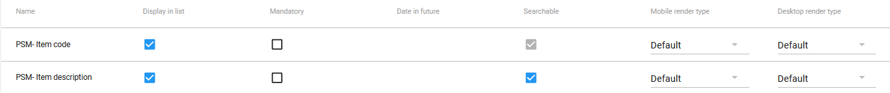
>>
>>**2 Create registration form**
>>>(leave blank, no configuration needed)
>>
>**4 Program stages**
>>**1 Stage details**
>>>**Name \(*)**: "Stock on Hand"  
>>>**Scheduled days from start (*)**: "0"  
>>>**Repeatable**: tag (appears as white tig in a blue square)  
>>
>>**2 Assign data elements**  
>>>**Search available/selected items**:  
>>>>"Stock distribution"  
>>>>"Stock discard"  
>>>>"Stock receipt"  
>>>>"Stock on hand"  
>>>>"Deliver to"  
>>>>"Previous stock balance"  
>>>>"Stock count"  
>>>>"Stock correction"  
>>>>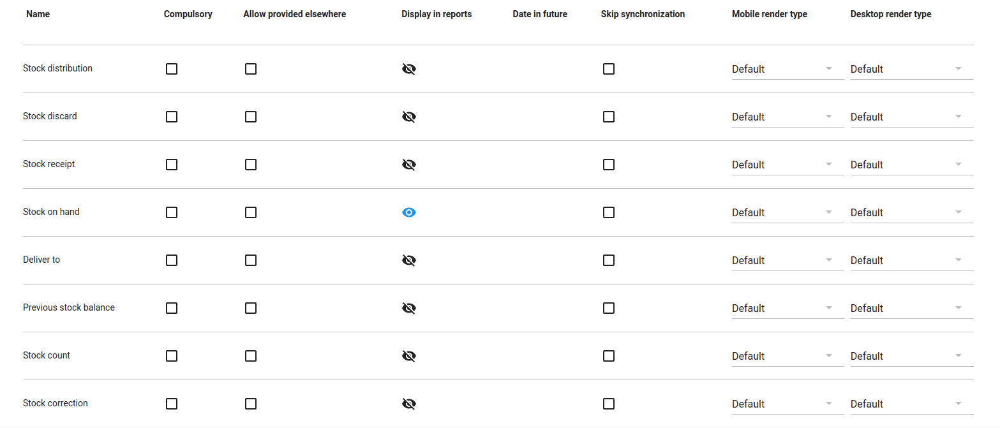
>>>
>>>**Display in report**: make visible for all items  
>>>**Mobile render type**: "Default"  
>>>**Desktop render type**: "Default"
>>
>>**3 Create data entry form**
>>>**"BASIC"** (configured by the system by default, no configuration is needed).
>
>**5 Access**
>>**Organisation units**: tag the health care facilities where the Tracker Program is used  
>>**Roles and access**: "Stock on Hand" appears by default  
>>**SELECT ALL**: tag (a white tick appears in the blue square)
>
>**6 Notifications**
>(not applicable)

#### 6.2 Tracked entity attribute
The DHIS2-RTS uses the "Item code" and "Item descriptions" as the two Tracked entity attributes of the Trached entity type "Item".
Note that the "Item code" is unique only for any specific Organisation Unit but the same "Item code" can be used in any number of different Organisation Units.

>**1 Item code**  
>>**Name \(*)**: "Item code"  
>>**Short name (*)**: "Item code"  
>>**Value type**: "Text"  
>>**Aggregation type**: "None"  
>>**Unique**: tag (appears as a blue tag with a white tick) 
>>**Option (from drop-down menu)**: "Organisation unit"
>>**Inherit**: do not tag  
>
>**2 Item description**  
>>**Name \(*)**: "Item description"  
>>**Short name \(*)**: "Item description"  
>>**Value type**: "Text"  
>>**Aggregation type**: "None"  
>>**Unique**: do not tag
>>**Inherit**: do not tag  

#### 6.3 Tracked entity type
>**1 Item**:  
>>**Name \(*)**: "Item"  
>>**Enable tracked entity instance audit log**: not checked
>>**Minimum number of attributes required to search**: 1  
>>**Maximum number of tracked entity instances to return in search**: 0  
>>**Feature type**: "None"  
>>**Tracked entity type attributes**: assign the following Tracked entity attributes in this order
>>>"Item code"  
>>>"Item description"  
>>
>>**Display in list**: tag all  
>>**Searchable**: tag all

#### 6.4 Program rule

In total, four Program rules are configured for completing all required calculations:

- "Assign previous stock balance"

- "Assign Stock on Hand"

The other two Program rule manage the "Stock correction" transaction:

- "Assign Stock correction"

- "Assign Stock on Hand correction".

Two Program rules together provide the real-time stock on hand update.

In principle, the transaction quantities from the current event are added to the current Stock on Hand.

If "Stock on hand" had a previous event, the "Stock on hand" value from the previous event is written to the Data Element "Previous Stock Balance". This Program rule "saves" the current "Stock on hand" value which is used as a basis for the (re)calculation of the current "Stock on hand". Using a single field would lead to an infinite recursion and an error as, for example, "Stock on hand" cannot be equal to "Stock on hand" + "Receipt" at the same time. Instead two different fields are needed which interact with each other:

- "Stock on hand": the most recent value before a transaction is effected

- "Previous stock balance": the most recent Stock on hand value is written to this field as soon as a new transaction is started

- The calculation of the current transaction is effected by adding all transaction quantities to the "Previous stock balance"

- After completing the transaction, the result of the calculation "overwrites" the "Stock on hand" field

- The process starts again from scratch

The screenshot below shows an example of a transaction. Before the transaction was started, the "Stock on hand" was 1. This value is written to the "Previous stock balance". When the "Stock receipt" of 1 is entered, the "Stock on hand" is increased to 2. Not that the "Previous stock balance" is still 1 which keeps the "memory" of the "Stock on hand" before the transaction started.

The two Data elements "Previous Stock Balance" and "Stock on hand" are greyed out as the are automatically updated by Program rules.

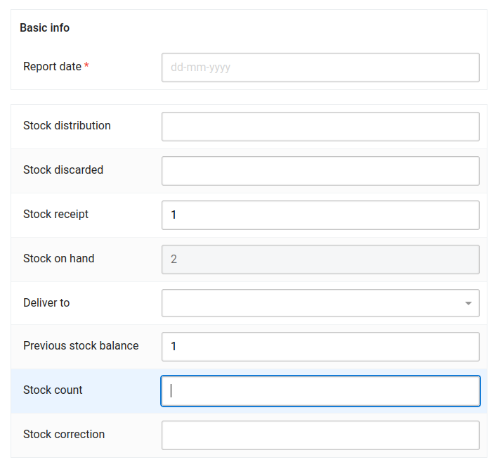

Note that the (re)calculation of the stock on hand is iterative, only based on the most recent transaction and not in anyway affected by retrospective editing of any other than the current transactions. Therefore any editing of past data must be categorically avoided. Any mistakes must only be corrected with the "Correction" transaction.

Two program rules manage the calculation of the "Stock correction". Entering a quantity corresponding to the difference between the "Stock on hand" currently stored in the system and the "Stock on hand" resulting from the physical stock count would require considering whether the correction is a positive or negative value and a calculation by the user which is prone to error. Instead storekeepers enter the result of the physical stock count and the two program rules update the "Stock on hand" and calculate the difference (which can be positive or negative) for the user:

- "Assign Stock on Hand": if the "Stock count" field has a value entered, this value "overwrites" (replaces) the "Stock on hand" which is currently stored in the system

- "Assign Stock correction": if the "Stock count" field has a value entered, the difference between the "Previous stock balance" and the "Stock count" is "written" to the field "Stock correction".

##### Calculations

Stock on Hand = "Previous stock balance" + "Stock received" - "Stock distribution" - "Stock discarded"

Stock correction = "Count" - "Previous stock balance", replaces "Stock on hand"

"Stock received" (positive integer): increases "Stock on hand"

"Stock distribution" (positive integer): decreases "Stock on hand"

"Stock discard" (positive integer): decreases "Stock on hand"

"Stock correction":

- negative integer if the physical stock count is less than the calculated value

- positive integer if the physical stock count is greater than the calculated value

>**1 Assign Stock on hand**  
>>**1 Enter program rule details**  
>>>**Program \(*)**: "Real-Time Stock Management"  
>>>**Trigger rule only for program stage**: "Stock on hand"  
>>>**Name \(*)**: "RTS - Assign Stock on Hand"  
>>>**Description**: "For all transactions other than "Stock correction" (therefore for "Distribution", "Discard" and "Receipt") this Program rule adds the transaction quantity to the previous stock balance to calculate the current stock on hand."  
>>>**Priority**:  "2"
>>
>>**2 Enter program rule expression**  
>>>**Condition**: "!d2:hasValue(#{RTS - Stock count})"  
>>
>>**3 Define program rule actions**  
>>>**Action details**   
>>>>**Action \(*)**: "Assign value"  
>>>>**Data element to assign to**: "Stock on hand"  
>>>>**Expression to evaluate and assign**: "#{RTS - Previous stock balance}+#{RTS - Stock receiptd}-#{RTS - Stock distribution}-#{RTS - Stock discard}"
>
>**2 Assign Stock on hand correction and Stock correction**  
>>**1 Enter program rule details**  
>>>**Program \(*)**: "Real-Time Stock Management"  
>>>**Trigger rule only for program stage**: "Stock on hand"  
>>>**Name \(*)**: "RTS - Assign Stock on hand correction and Stock correction"  
>>>**Description**: "If a "Stock correction" is entered, the Program rule assigns the "Quantity" (actual stock count) to the "Stock on hand" and calculates and stores the difference of both values as "Correction"."  
>>>**Priority**:  "3"
>>
>>**2 Enter program rule expression**  
>>>**Condition**: "d2:hasValue(#{RTS - Stock count})"  
>>
>>**3 Define program rule actions**  
>>>**Action details**   
>>>>**1 Assign "Stock on hand"**   
>>>>>**Action \(*)**: "Assign value"
>>>>>**Data element to assign to**: "Stock on hand"
>>>>>**Expression to evaluate and assign**: "#{RTS - Stock count}"
>>>>
>>>>**2 Assign "Stock correction"**   
>>>>>**Action \(*)**: "Assign value"
>>>>>**Data element to assign to**: "Stock correction"
>>>>>**Expression to evaluate and assign**: "#{RTS - Stock count}-#{RTS - Previous stock balance}"
>
>**3 Assign previous stock balance**  
>>**1 Enter program rule details**  
>>>**Program \(*)**: "Real-Time Stock Management"  
>>>**Trigger rule only for program stage**: "Stock on hand"  
>>>**Name \(*)**: "RTS -Assign previous stock balance"  
>>>**Description**: "Whenever a new transaction is effected, the Program rule fetches the "Stock on hand" from the previous event and temporarily stores it in the "Previous stock balance" field."  
>>>**Priority**:  "1"
>>
>>**2 Enter program rule expression**  
>>>**Condition**: "Condition: "d2:hasValue(#{RTS - Initial stock on hand - Previous event})"  
>>
>>**3 Define program rule actions**  
>>>**Action details**   
>>>>**Action \(*)**: "Assign value"  
>>>>**Data element to assign to**: "Previous stock balance"  
>>>>**Expression to evaluate and assign**: "#{RTS - Initial stock on hand - Previous event}"

#### 6.5 Program rule variable
>**1 Initial stock on hand - Previous event**
>>**Program \(*)**: "Real-Time Stock Management"  
>>**Name \(*)**: "Initial stock on hand - Previous event"  
>>**Source type \(*)**: "Data element from previous event"  
>>**Data element**: "Data element from previous event"  
>
>**2 Previous stock balance**
>>**Program \(*)**: "Real-Time Stock Management"  
>>**Name \(*)**: "Previous stock balance"  
>>**Source type \(*)**: "Data element in current event"  
>>**Data element**: "Previous stock balance"  
>
>**3 Stock correction**
>>**Program \(*)**: "Real-Time Stock Management"  
>>**Name \(*)**: "Stock correction"  
>>**Source type \(*)**: "Data element in current event"  
>>**Data element**: "Stock on hand"  
>
>**4 Stock count**
>>**Program \(*)**: "Real-Time Stock Management"  
>>**Name \(*)**: "Stock count"  
>>**Source type \(*)**: "Data element in current event"  
>>**Data element**: "Stock count"  
>
>**5 Stock discard**
>>**Program \(*)**: "Real-Time Stock Management"  
>>**Name \(*)**: "Stock discard"  
>>**Source type \(*)**: "Data element in current event"  
>>**Data element**: "Stock discard"  
>
>**6 Stock distribution**
>>**Program \(*)**: "Real-Time Stock Management"  
>>**Name \(*)**: "Stock distribution"  
>>**Source type \(*)**: "Data element in current event"  
>>**Data element**: "Stock distribution"  
>
>**7 Stock on hand**
>>**Program \(*)**: "Real-Time Stock Management"  
>>**Name \(*)**: "Stock on hand"  
>>**Source type \(*)**: "Data element in current event"  
>>**Data element**: "Stock on hand"  
>
>**8 Stock receipt**
>>**Program \(*)**: "Real-Time Stock Management"  
>>**Name \(*)**: "Stock receipt"  
>>**Source type \(*)**: "Data element in current event"  
>>**Data element**: "Stock receipt"  

### 7 Other

#### 7.1 Option set

Option sets are used for listing, managing and editing the "Deliver to" places. The use of options provides a great deal of flexibility to the customization by individual countries, which are indispensable, without having to modify the DHIS2-RTS app code itself. However, please note that if the "Deliver to" options are modified, the Program Indicators, Predictors as well as the "aggregate" Data entry form have to be adapted accordingly.

The following options are configured by default which can be customized by removing, changing or adding to national needs as required. It is important to always include the "(Other)" option to avoid that other departments or services are "polluted" with transaction data which actually does not apply to them.

>**1 Deliver to**  
>>**PRIMARY DETAILS**  
>>>**Name \(*)**: "Deliver to"  
>>>**Code**: "deliver_to"  
>>>**Value type \(*)**: "Text" 
>>
>>**OPTIONS**  
>>>**1 Diagnostic Imaging (X-ray)**
>>>>**Name \(*)**: "Diagnostic Imaging (X-ray)"  
>>>>**Code \(*)**: "diagn_imag"  
>>>
>>>**2 Emergency Room**
>>>>**Name \(*)**: "Emergency Room"  
>>>>**Code \(*)**: "emerg_room"  
>>>
>>>**3 High Dependency Unit**
>>>>**Name \(*)**: "High Dependency Unit"  
>>>>**Code \(*)**: "hi_dep_unit"  
>>>
>>>**4 Inpatient Medical Department**
>>>>**Name \(*)**: "Inpatient Medical Department"  
>>>>**Code \(*)**: "inp_med_dep"  
>>>
>>>**5 Inpatient Surgical Department**
>>>>**Name \(*)**: "Inpatient Surgical Department"  
>>>>**Code \(*)**: "inp_surg_dep"  
>>>
>>>**6 Laboratory Department**
>>>>**Name \(*)**: "Laboratory Department"  
>>>>**Code \(*)**: "lab_dep"  
>>>
>>>**7 Mortuary**
>>>>**Name \(*)**: "Mortuary"  
>>>>**Code \(*)**: "mortuary"  
>>>
>>>**8 Obstetrics & Gynaecology services**
>>>>**Name \(*)**: "Obstetrics & Gynaecology services"  
>>>>**Code \(*)**: "obs_gyn"  
>>>
>>>**9 Operating Theatre**
>>>>**Name \(*)**: "Operating Theatre"  
>>>>**Code \(*)**: "op_theatre"  
>>>
>>>**10 Out-Patient Department**
>>>>**Name \(*)**: "Out-Patient Department"  
>>>>**Code \(*)**: "outp_dep"  
>>>
>>>**11 Paediatric Department**
>>>>**Name \(*)**: "paed_dep"  
>>>>**Code \(*)**: "paed_dep"  
>>>
>>>**12 Physiotherapy Department**
>>>>**Name \(*)**: "pt_dep"  
>>>>**Code \(*)**: "pt_dep"  
>>>
>>>**13 Recovery Room**
>>>>**Name \(*)**: "Recovery Room"  
>>>>**Code \(*)**: "rec_room"  
>>>
>>>**14 Sanitation / Housekeeping**
>>>>**Name \(*)**: "Sanitation / Housekeeping"  
>>>>**Code \(*)**: "san_housek"  
>>>
>>>**15 Sterilization Department**
>>>>**Name \(*)**: "Sterilization Department"  
>>>>**Code \(*)**: "steriliz_dep"  
>>>
>>>**16 Transfusion services**
>>>>**Name \(*)**: "Transfusion services"  
>>>>**Code \(*)**: "transf_serv"  
>>>
>>>**17 (Other)**
>>>>**Name \(*)**: "(Other)"  
>>>>**Code \(*)**: "other"  

#### 7.2 Legend

A conventional legend for stockouts is applied to the "DHIS2-RTS Current Stock on hand" Line Listing report to indicate stockout occurrences with a red background:

- Stock on Hand = 0: red background

- Stock on Hand \>=1: light yellow background

- Name (\*): "Stockout"

>**1 Stockout**
>>**1 Stockout**
>>>**Name**: "Stockout"  
>>>**Start value**: "0"  
>>>**End value**: "1"  
>>>**Color code**: "#F74432" (red)  
>>
>>**1 Stock**
>>>**Name**: "Stock"  
>>>**Start value**: "1"  
>>>**End value**: "999999"  
>>>**Color code**: "#F9E6BB" (cream-coloure)  
>>
>>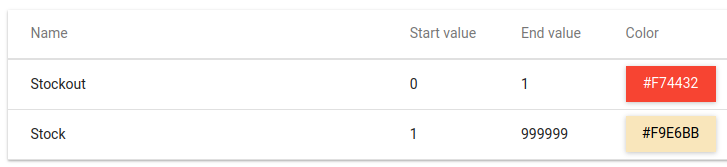

#### 7.3 Predictor

Predictors are used in two different ways:

- for "transferring" aggregate Program indicator values to the daily/monthly Data entry form

- "copying" the "Stock on hand" at the end of the previous month to the "Opening SoH" of the current month

- calculating the "Closing SoH" from the data values of the current month  

*Note that only transactional quantities (stock distributed, discarded and corrections) can be aggregated from the Tracker Program data. But as the stock balances are calculated after every transaction, aggregating them does not yield any meaningful results*.

The Predictors which "transfer" the Program indicators to the respective Category option of the Data Entry form provide users with daily or monthly "snapshots" of all transactions. Note that in principle the same Program indicator can be used for daily and monthly aggregations ("snapshots") but separate Predictors, one with the "Period type (\*)" daily is needed for daily "snapshots" and a second Predictor with "Period type (\*)" monthly is needed for monthly "snapshots".

One Predictor is needed for each item (Data element = Tracked Entity Instance), for each transaction type as well as for each "Deliver to" (Category option) and one each for the daily report and the monthly report as the "Group Predictor" function is not available for Program Indicators. List of Predictors required for every Data element:

- [Data element name] - Discard

- [Data element name] - Distribution - Diagnostic imaging (X-Ray)

- [Data element name] - Distribution - Distribution - total (for all wards/services)

- [Data element name] - Distribution - Emergency Room

- [Data element name] - Distribution - High Dependency Unit

- [Data element name] - Distribution - Inpatient Medical Department

- [Data element name] - Distribution - Inpatient Surgical Department

- [Data element name] - Distribution - Laboratory Department

- [Data element name] - Distribution - Mortuary

- [Data element name] - Distribution - Obstetric & Gynaecology services

- [Data element name] - Distribution - Opening balance (stock on hand)

- [Data element name] - Distribution - Operating Theatre

- [Data element name] - Distribution - Out-Patient Department

- [Data element name] - Distribution - Paediatric Department

- [Data element name] - Distribution - Physiotherapy Department

- [Data element name] - Distribution - Receipt

- [Data element name] - Distribution - Recovery Room

- [Data element name] - Distribution - Sanitation Housekeeping

- [Data element name] - Distribution - Sterilization Department

- [Data element name] - Distribution - Stock on hand (closing balance)

- [Data element name] - Distribution - Transfusion services

- [Data element name] - Distribution (Other)

- [Data element name] - Stock correction

Below the configuration for a single Predictor is given as an example while all other Predictors are created analogously:  
T2A - DORACEFI4T - CEFIXIME, 400 mg, tab. - DIST - Inpatient Medical Department - PR - MTH

>**1 T2A - [Item] - DIST - Diagnostic imaging (X-Ray) - PR - MTH**  
*This Predictor aggregates all "Distribution" transaction for the respective item and month*
>>
>>**Name \(*)**: "T2A - [Item] - DIST - Diagnostic imaging (X-Ray) - PR - MTH"  
>>**Short name \(*)**: "T2A - [Item code] - DIST - X-Ray - PR - MTH"
>>**Output data element \(*)**: "[Item] T2A MTH"  
>>**Output category option combo** "DIS - Diagn. imaging"  
>>**Period type \(*)**: "Monthly"  
>>**Organisation unit levels** "Facility"  
>>**Organisation units providing data \(*)** "At selected level(s) only"  
*THIS IS ABSOLUTELY CRITICAL and the lowest level in the hierarchy must be selected (and not "Country") otherwise Predictors are generated but the values are blank*  
>>**Generator \(*)**
>>>**Description**: "T2A - [Item code] - DIST - X-Ray - PR - MTH"
>>>**Expression**: "I{xwiNF9EsUHx}"  
*[Item code] - Distribution - Diagnostic imaging (X-Ray)*
>>
>>**Sequential sample count \(*)**: "0"  
>>**Annual sample count \(*)**: "0"  
>
>*Note: the Predictor "copies" the Program indicator without any aggregation (such as sum) as the aggregation is already achieved by the Program indicator. The "Sequential sample count" of 0 ensures that the transaction quantities of the current day or month are aggregated.*
>
>**2 T2A -  [Item] - SOH opening - PR - DAY**  
*This Predictor "copies" data values within the Data entry form*
>>
>>**Name \(*)**: "T2A -  [Item] - SOH opening - PR - DAY"  
>>**Short name \(*)**: "T2A -  [Item code] - SOH opening - PR - DAY"
>>**Output data element \(*)**: "[Item]"  
>>**Output category option combo** "Opening SoH"  
>>**Period type \(*)**: "Daily"  
>>**Organisation unit levels** "Facility"  
>>**Organisation units providing data \(*)** "At selected level(s) only"  
*THIS IS ABSOLUTELY CRITICAL and the lowest level in the hierarchy must be selected (and not "Country") otherwise Predictors are generated but the values are blank*  
>>**Generator \(*)**
>>>**Description**: "T2A - [Item code] - SOH opening - PR - DAY"
>>>**Expression**: "avg(#{ZNi9SCtVA83.rZ5LF3cNuPb})"  
*avg([Item code])*
>>
>>**Sequential sample count \(*)**: "0"  
>>**Annual sample count \(*)**: "0"  
>
>**3 T2A -  [Item] - SOH closing - PR - DAY**  
*This Predictor "copies" data values within the Data entry form*
>>
>>**Name \(*)**: "T2A -  [Item] - SOH closing - PR - DAY"  
>>**Short name \(*)**: "T2A -  [Item code] - SOH opening - PR - DAY"
>>**Output data element \(*)**: "[Item]"  
>>**Output category option combo** "Stock on hand"  
>>**Period type \(*)**: "Daily"  
>>**Organisation unit levels** "Facility"  
>>**Organisation units providing data \(*)** "At selected level(s) only"  
*THIS IS ABSOLUTELY CRITICAL and the lowest level in the hierarchy must be selected (and not "Country") otherwise Predictors are generated but the values are blank*  
>>**Generator \(*)**
>>>**Description**: "T2A - [Item code] - SOH closing - PR - DAY"  
>>>**Expression**: 
\#{ZNi9SCtVA83.srqJsVxtLdA}+
\#{ZNi9SCtVA83.iHrG3AK8XxK}-
\#{ZNi9SCtVA83.QjLESy7VVB6}-
\#{ZNi9SCtVA83.Hy0b1skIzyR}+
\#{ZNi9SCtVA83.tb7HW13vK6X}"  
*[Item] Opening SoH+[Item] Stock receipt-[Item] Stock distribution-[Item] Stock discard+[Item] Stock correction*  
*Please note that the "Stock correction" has to be added (and not be subtracted).*
>>
>>**Sequential sample count \(*)**: "0"  
>>**Annual sample count \(*)**: "0"  

#### 7.4 Predictor group

The "Predictor group" is required in order to allow running all Predictors periodically and together by the "Scheduler" rather than having to prompt them one by one. All Predictors required for the DHIS2-RTS can be grouped together and be run together in the Scheduler App

>**1 DHIS2-RTS - T2A - Predictorr - DAY**  
>**Name \(*)**: "DHIS2-RTS - T2A - Predictors DAY"  
>**Predictors**
>>"T2A - [Item] - [Deliver to] - PR - DAY"  
>>
>**2 DHIS2-RTS - T2A - Predictorr - DAY**  
>**Name \(*)**: "DHIS2-RTS - T2A - Predictors MTH"  
>**Predictors**
>>"T2A - [Item] - [Deliver to] - PR - MTH"  

## Scheduler Web App - Predictor Scheduling
"Scheduler" app allows configuring the automatic and periodic execution of Predictors by Predictor group for the daily and monthly Data entry forms.

>**1 DHIS2-RTS - T2A - Predictors - DAY**  
>>**Configuration**
>>>**Name \(*)**: "DHIS2-RTS - T2A - Predictors - DAY"  
>>>**Job type \(*)**: "Predictor"  
>>>**CRON Expression \(*)**: "00 05 00 * * *" ("At 12:05:00 AM)
>>
>>**Parameters**
>>>**Relative start**: "-1"  
>>>**Relative end**: "1"  
>>>**Predictor groups**: "DHIS2-RTS - T2A - Predictors DAY"  
This CRON job is automatically executed every day at 00:05. If required, the Scheduler can also be set to run more frequently, for example twice a day, every four hours or every hour.  
>
>**2 DHIS2-RTS - T2A - Predictors - MTH**  
>>**Configuration**
>>>**Name \(*)**: "DHIS2-RTS - T2A - Predictors - MTH"  
>>>**Job type \(*)**: "Predictor"  
>>>**CRON Expression \(*)**: "00 05 00 1 * *" ("At 12:05:00 AM, on day 1 of the month)
>>
>>**Parameters**
>>>**Relative start**: "-32"  
>>>**Relative end**: "1"  
>>>**Predictor groups**: "DHIS2-RTS - T2A - Predictors MTH"  
This CRON job is automatically executed on the first day of every month at 00:05. If required, the Scheduler can also be set to run more frequently, for example once a week or once a day.

## Users Web App - User management

The configuration of user roles, user groups and individual users will follow national policies and protocols and the majority of users will already have a DHIS2 user profile before starting the use of DHIS2-RTS. Nevertheless, all users need to have access to the Android Capture app for using the DHIS2-RTS application. If the daily or monthly Data entry form is used as a fallback in case the mobile application fails, users also require the respective user authorities for entering and editing data. Finally, all users should have access to the DHIS2 analytics.

### User
Existing users can be assigned additional user roles while a user profile needs to be created for all new users.

### User role
All users which are recording transactions must be (also) asssigned to the User role "DHIS2-RTS Android Capture app" while other users might not record any transaction but still need to access (only) the DHIS2 analytics.

>**1 DHIS2-RTS - Android Capture App**  
>>**Name \(*)**: "DHIS2-RTS - Android Capture App"  
>>**Description**: "Android Capture App data entry"  
>>**Metadata authorities**  
>>>"Data Value": "Add/Update Public" and "Delete"  
>>
>>**Other authorities / Selected tracker authorities**  
>>>"Search Tracked Entity Instance in All Org Units"  
>>>"View event analytics"  
>>>"Update tracked entities"  
>>>"Uncomplete events"
>
>**2 DHIS2-RTS - Analytics access**  
>>**Name \(*)**: "DHIS2-RTS - Analytics access"  
>>**Description**: "Dashboard and analytic apps access"  
>>**Other authorities / Selected app authorities**
>>>"Browser Cache Cleaner app"  
>>>"Menu Management app"  
>>>"Data Visualizer app"  
>>>"linelisting app"  
>>>"Dashboard app"  
>>
>>**Other authorities / Selected tracker authorities**  
>>>"View event analytics"  

### User group

The main purpose of user groups is facilitating configuration of "Sharing" settings (which determine viewing and editing rights) by groups rather than having to manage them at the level of hundreds of individual users.

User groups may be configured according to the User roles into the same two groups:
- DHIS2-RTS - Android Capture App

- DHIS2-RTS - Analytics access

## Android Settings Web App - Synchronization and Offline Analytics
The "Android settings Web App" allows customizing synchronization settings as well as configuring offline analytics.

>**Synchronization**  
>>**Global sync settings**
>>>**How often should metadata sync**: "Manual"  
>>>**How often should data sync**: "Manual"  
>>>*Note: it is critical that users can control the synchronization settings so that they can synchronize mobile devices whenever Tracked Entity Instances (TEIs) are added or removed and that they can (ideally) synchronize the mobile device after every transaction.*
>>
>>**Programs**
>>>**Programs specific download sync settings**
>>>>**Setting level**: "All Org Units"
>>>>**Maximum Tracked Entity Instance (TEI) download per program**: [to be confirmed]
>>>>**Download TEI with status**: "Only Active"
>>>>**Download TEI with enrollment date within**: "Any period"
>>>>**Download TEI that have been updated within**: "Any time period"
>
>**Analytics**  
>>**Program**  
>>>**1 Visualization A**  
>>>>**Program**: "Real-Time Stock Management"  
>>>>**Visualization item**: [to be added]  
>>>>**Visualization title**: [to be added]  
>>>
>>>**2 Visualization BA**  
>>>>**Program**: "Real-Time Stock Management"  
>>>>**Visualization item**: [to be added]  
>>>>**Visualization title**: [to be added]  

[*Offline analytics to be added*]

## Use Case Configuration Web App - Program Configuration
The Use Case Configuration Web app assigns the "Real-Time Stock Management" Tracker Program and some of its metadata to the customized mobile app. While the Tracker Program will have the appearance of any other Tracker Program on the Android Capture App home screen, selecting a Tracker Program which is assigned to the "Real-Time Stock Management" app will invoke the customized app instead of opening the conventional TEI dashboard.
Note that only programs which meeting certain configuration criteria can be selected and only those will appear for selection in the respective drop-down menu:  

- Tracker Program

- One repeatable Program Stage

- Program rules which update the stock on hand

- Event which is not autogenerated

- Data elements and Tracked Entity Attributes assigned to the Tracker program

- Value type of Data elements in Program stages: "Number" for "Stock correction" and "Positive integer" for all others

>**Configure Program**  
>*Note: when setting up the DHIS2-RTS for the first time, please use "Add Program" for configuring a new program.*
>>**Program name**: "Real-Time Stock Management"  
>>>**General**  
>>>>**Program Types**: "Logistics"  
>>>>**Description**: "DHIS2-RTS Real-Time Stock management system"
>>>>**Program \(*)**: "Real-Time Stock Management"  
>>>**Details**  
>>>>**Item Code \(*)**: "Item code"  
>>>>**Item Description \(*)**: "Item description"
>>>>**Stock on Hand \(*)**: "Stock on hand"  
>>>**Transactions**  
>>>>**Distributed**
>>>>>**Distributed to \(*)**: "Deliver to"  
>>>>>**Distributed Stock \(*)**: "Stock distribution"  
>>>>**Corrected**
>>>>>**Corrected Stock \(*)**: "Stock correction"  
>>>>>**Stock Count \(*)**: "Stock count"  
>>>>**Discarded**
>>>>>**Discarded Stock \(*)**: "Stock discard"  

## Data Entry (Beta) Web App - "Snapshots" and fallback data entry
Although the DHIS2-RTS mobile application is based solely on a Tracker program, a concurrent Data entry form is recommended for two purposes:

- Storing aggregate daily/monthly data for analysis and reporting

- Use as a fallback in the DHIS2-RTS mobile application is (temporarily) not available

- Aggregate data repository for aggregate analytics and visualizations

Consequently the list of Tracked Entity Instances (TEIs) for each Organsation Unit must always be aligned with corresponding Data set.
As Custom Data Entry Forms do not render (correctly/completely) on mobile devices, the Data sets must be configured as "Default" Data entry form to allow use on mobile devices.
Both Data entry forms (as configured according to the settings above) are configured to display all available data fields. However, the layout can be customized in the Data Visualizer Web App. Examples of monthly and daily Data entry forms:

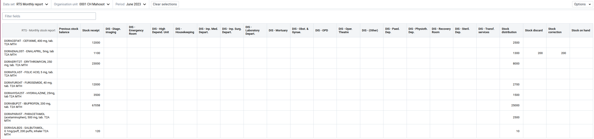

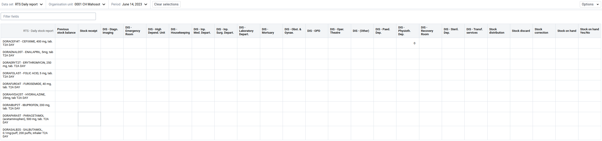

## Capture Web App - Tracked Entity Instance Management

The Capture Web App must not be used for recording or editing transactions as the lack of a time stamp displays them in an arbitrary order. Consequently, the "Previous stock balance" used for the next transaction is also selected arbitrarily among previous transactions, is incorrect and stock on hand is not updated correctly.
However, the Capture Web App is required for registering, enrolling, "completing" and (re)"activating" Tracked Entity Instances.
As a general comment, unlike Data sets, item lists cannot be "assigned" to several Organisation units and the list of every Organisation unit has to be managed and edited separately. However, DHIS2 Apps such as the Bulk Load App can be used for managing several items in one or several Organisation units with a single upload.

**Adding items**  
New items (healthcare products) have to be added to each Organisation unit separately by registering and enrolling before the DHIS2-RTS mobile app is used for the first time and whenever new items are received at the healthcare facility.
Note that while any number of Organisations can enroll and register the same item (for example Paracetamol, 500 mg, tab) those items require separate UIDs (ID numbers) in each Organisation unit. However, analysis such as Pivot tables can display data for the same item across different Organisation units.

**Removing items**  
Items may occasionally need to be removed from the item list of one or several Organisations when that item is no longer available and all stock has been depleted. This may arise because of changes to treatment protocols or when certain healthcare products are withdrawn from the market wich may be replaced with other products with similar but different specifications.
Items should never be deleted from any Organisation unit as all historical data, analysis and visualizations for those items would be lost. Instead the enrollment of Tracked Entity Instances can be changed to "Complete" which changes the enrollment status to "Completed".
Those items remain available in the Capture Web App but can be "hidden" in working lists by setting the "Enrollment status" filter to "Active". Nevertheless all historic data and all visualizations of "Completed" TEIs remain available.
Those items can be "hidden" in the Capture Web App by selecting the "Enrollment status" filter to "Active". The Android Settings Web App allows to only download TEIs with an "Active" status to mobile devices.

**"Reactivating items**  
Occasionnaly, items which have been in use at a healthcare facility and have been removed, need to available again. For example if a manufacturer resume production of a product which was with drawn from the market or if in case the change of treatment protocols requires resuming a healthcare product which was previously not recommended.
Tracked Entity Instances (TEIs) can be simply reactivated by changing the Enrollment to "Mark incomplete" which changes their status back to "Active". The analytics and visualizations will show the entire history of those items during periods when they were "Completed" as well as when they were "Active".

## Bulk Load Web App - Uploading Stock Receipts
Regestering and enrolling Tracked Entity Instances (TEIs) as well as uploading transactional data can be managed with different tools, among others with the Bulk Load Web App. This DHIS2 App has the advantage of automatically providing the structure and elements of any Tracker Program.
Before the first use, the Bulk Load Web App needs to installed from the Customs apps section of the DHIS2 App Management App.
In principle, using the Bulk Load app always has three steps:

- Download and save a "Template" as an Excel file

- Copy data to the Excel "Template"

- Upload the "Template" with the data

A single random IDs can be generating from the api by entering:
https://lmis.integration.dhis2.org/sandbox/api/system/id?

And multiple Ids by adding the required number:  
https://lmis.integration.dhis2.org/sandbox/api/system/id?limit=10

### Registering and enrolling new items
Prepare the item code(s) and item description(s) and ensure that the same item codes and descriptions are used in all Organisation units of the countries (although they require separate and unique UIDs).

- Open the "Bulk Load" Web app

- Select the "Download template" button

- Select "DOWNLOAD TEMPLATE" and save the Excel file on your computer

- Template: select "Real-Time Stock Mangement" from the drop-down menu

- Select available organisation untis to include in the template: tag, the Organisation unit tree will open

- Select the Organisation unit(s) for where items need to be registered and enrolled

- Select "DOWNLOAD TEMPLATE": an Excel file with the file name "Real-Time Stockmanagement.xlsx" will be downloaded

- Open the "TEI Instances" worksheet

- TEI id: enter a UID which is distinct for the DHIS2 instance (for example generated from the "UID Generator" in the BIF Web App)

- Select the respective "Org Unit *" from the drop-down menu in the Excel filed

- Enrollment Date (YYYY-MM-DD)*: enter the date of the enrollment (note that the date format has to be YYYY-MM-DD)

- Item code: enter the required item code(s)

- Item description: enter the required item code(s)

- Save the Excel file

- Revert to the Bulk Load Web app

- Select "Import data": the "Bulk data import" window opens

- Drag and drop the edited Excel file to the greyed field or click in the greyed field, navigate to and select the edited Excel file

- Select "IMPORT DATA": the data is uploaded and a "Synchronization Results" pop-up window opens with the details of the imported data

- Close the Bulk Load Web app

### Uploading stock receipts
This "manual" procedure is only needed if the DHIS2 instance is not (yet) integrated with a national eLMIS where the upload of consignment data is automated.  
*Note: transactions must never be uploaded in the past as the stock on hand balances will not be corrected. Therefore stock receipts can only be recorded after all transactions which are already recorded in the DHIS2 database*.

- Open the "Bulk Load" Web app

- Select the "Download template" button

- Select "DOWNLOAD TEMPLATE" and save the Excel file on your computer

- Template: select "Real-Time Stock Mangement" from the drop-down menu

- Select available organisation untis to include in the template: tag, the Organisation unit tree will open

- Select the Organisation unit(s) for where items need to be registered and enrolled

- Select "DOWNLOAD TEMPLATE": an Excel file with the file name "Real-Time Stockmanagement.xlsx" will be downloaded

- Open the "(1) Stock on Hand" worksheet

- Event id: enter a UID which is distinct for the DHIS2 instance (for example generated from the "UID Generator" in the BIF Web App)

- TEI Id: select the respective item from the drop-down menu in the Excel file

- Options: select "default" (the only available option)

- Date * (YYYY-MM-DD): enter the date of the transaction (note that the date format has to be YYYY-MM-DD)

- Previous Stock Balance: enter the current stock on hand (before the stock receipt)

- Stock receipt: enter the quantity which is being received

- Stock on hand: enter the stock balance after the transaction (Previous Stock Balance + Stock receipt)

- Save the Excel file

- Revert to the Bulk Load Web app

- Select "Import data": the "Bulk data import" window opens

- Drag and drop the edited Excel file to the greyed field or click in the greyed field, navigate to and select the edited Excel file

- Select "IMPORT DATA": the data is uploaded and a "Synchronization Results" pop-up window opens with the details of the imported data

- Close the Bulk Load Web app

## DV - Data Visualizer Web App - "Aggregate" Analytics and Visualizations

The DHIS2-RTS analytics are a critical and indispensable component of the DHIS2-RTS concept. The DHIS2-RTS app allows managing all transactions without the need for keeping paper records. However, recording transactions as such is nearly useless unless a record of all transactions is instantly available to the storekeeper. Despite the availability of detailed transactional reports, compliance with national (monthly) reporting requirements must also be maintained.

The DHIS2 analytics provides reports both on individual transactions as well as daily and monthly "snapshots" with aggregate transaction quantities and the final stock on hand.

Reports are accessible to all users with the respective authorities on mobile device (with limitations) as well as in the web portal.

>**RTS DV 1 - DHIS2-RTS Monthly report - Summary**  
>This report provides the monthly totals of all transactions but only with the total "Distribution" quantity without details on the "Deliver to" for "Distribution" transactions.  
>**Name \(*)**: "RTS DV 1 - DHIS2-RTS Monthly report - Summary"  
>>**Columns**  
>>>**Your Dimensions**: "RTS - Monthly stock report"
>>>>Previous stock balance  
>>>>Stock receipt  
>>>>Stock distribution  
>>>>Stock discard  
>>>>Stock correction  
>>>>Stock on hand  
>>
>>**Rows**  
Note that the order of these two fields can be switched either displaying items with their chronological order of transactions or displaying days in chronological order with the transactions of every day in alphabetical order of the items.
>>>**Data**  
>>>>**Data Type**: Data elements"  
>>>>**Selected Items**: [Item Name] T2A MTH  
>>>
>>>**Period**: "Relative periods"  
>>>>**Period type**: "Years"  
>>>>**Selected Periods**: "This year"  
>>
>>**Filter**: "Organisation unit" and tag "User organisation unit"  
>>
>>**Options**  
>>>**Empty data**  
>>>>**Hide empty columns**: tag (appears as white tick in a blue square)  
>>>>**Hide empty rows**: tag (appears as white tick in a blue square)  

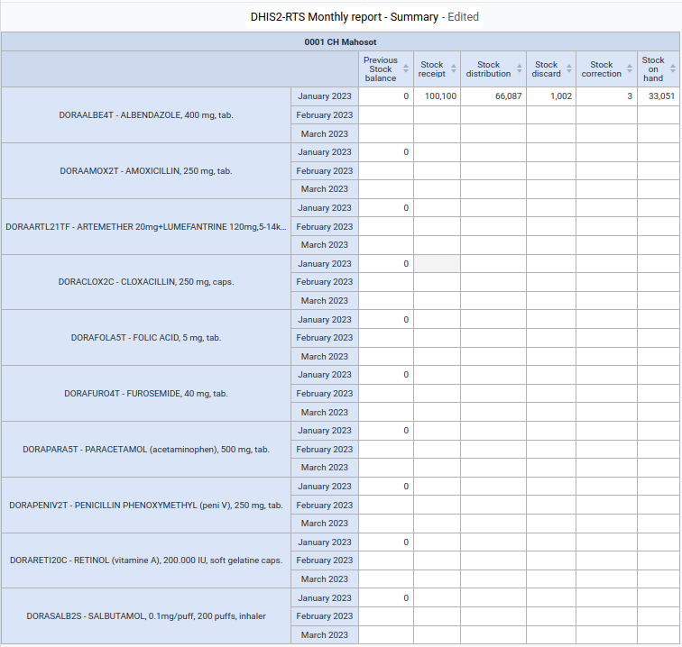

>**RTS DV 2 - DHIS2-RTS Monthly report - Detailed**  
>This report provides the monthly totals of all transactions with all details on total "Distribution" quantity by "Deliver to" (departments and services) for "Distribution" transactions.  
>**Name \(*)**: "RTS DV 2 - DHIS2-RTS Monthly report - Detailed"  
>>**Columns**  
>>>**Your Dimensions**: "RTS - Monthly stock report"
>>>>"Previous stock balance"  
>>>>"Stock receipt"  
>>>>"DIS - Diagn. imaging"  
>>>>"DIS - Emergency Room"  
>>>>"DIS - High Depend. Unit"  
>>>>"DIS - Housekeeping"  
>>>>"DIS - Inp. Med. Depart."  
>>>>"DIS - Inp. Surg. Depart."  
>>>>"DIS - Laboratory Depart."  
>>>>"DIS - Mortuary"  
>>>>"DIS - Obst. & Gynae."  
>>>>"DIS - OPD"  
>>>>"DIS - Oper. Theatre"  
>>>>"DIS - (Other)"  
>>>>"DIS - Paed. Dep."  
>>>>"DIS - Physioth. Dep."  
>>>>"DIS - Recovery Room"  
>>>>"DIS - Steril. Dep."  
>>>>"DIS - Transf. services"  
>>>>"Stock distribution"  
>>>>"Stock discard"  
>>>>"Stock correction"  
>>>>"Stock on hand"  
>>
>>**Rows**  
>>>**Data**  
>>>>**Data Type**: "Data elements"  
>>>>**Selected Items**: [Item Name] T2A MTH  
>>>
>>>**Period**: "Relative periods"  
>>>>**Period type**: "Years"  
>>>>**Selected Periods**: "This year"  
>>
>>**Filter**: "Organisation unit" and tag "User organisation unit"  
>>
>>**Options**  
>>>**Empty data**  
>>>>**Hide empty columns**: tag (appears as white tick in a blue square)  
>>>>**Hide empty rows**: tag (appears as white tick in a blue square)  

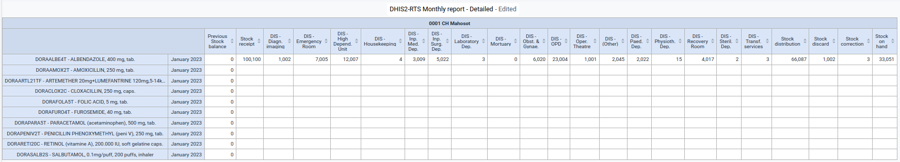

>**RTS DV 3 - DHIS2-RTS Stockout days count - Monthly**  
>This report automatically provides the monthly number of stockout days for each item which is managed with the DHIS2-RTS mobile application.
>**Name \(*)**: "RTS DV 3 - DHIS2-RTS Stockout days count - Monthly"  
>>**Columns**  
>>>**Period**: "Relative periods"  
>>>>**Period type**: "Month"  
>>>>**Selected Periods**: "Months this year"  
>>
>>**Rows**  
>>>**Data**  
>>>>**Data Type**: "Indicators"  
>>>>**Selected Items**: [Item Name] Stockout days  
>>>
>>**Filter**: "Organisation unit" and tag "User organisation unit"  
>>
>>**Options**  
>>>**Totals**  
>>>>**Columns totals**: tag (appears as white tick in a blue square)  
>>>>**Row totals**: tag (appears as white tick in a blue square)  
>>>**Empty data**  
>>>>**Hide empty columns**: tag (appears as white tick in a blue square)  
>>>>**Hide empty rows**: tag (appears as white tick in a blue square)  

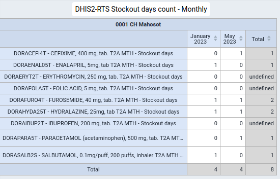

>**RTS DV 4 - DHIS2-RTS Daily report - Summary**  
>This report provides the daily totals of all transactions but only with the total "Distribution" quantity without details on the "Deliver to" for "Distribution" transactions.  
>**Name \(*)**: "RTS DV 1 - DHIS2-RTS Daily report - Summary"  
>>**Columns**  
>>>**Your Dimensions**: "RTS - Daily stock report"
>>>>Previous stock balance  
>>>>Stock receipt  
>>>>Stock distribution  
>>>>Stock discard  
>>>>Stock correction  
>>>>Stock on hand  
>>
>>**Rows**  
>>Note that the order of these two fields can be switched either displaying items with their chronological order of transactions or displaying days in chronological order with the transactions of every day in alphabetical order of the items.
>>>**Data**  
>>>>**Data Type**: Data elements"  
>>>>**Selected Items**: [Item Name] T2A MTH  
>>>
>>>**Period**: "Relative periods"  
>>>>**Period type**: "Years"  
>>>>**Selected Periods**: "This year"  
>>
>>**Filter**: "Organisation unit" and tag "User organisation unit"  

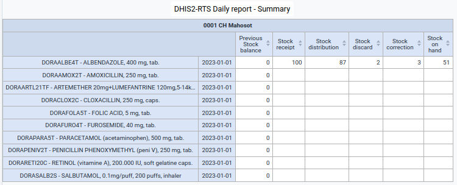

>**RTS DV 5 - DHIS2-RTS Daily report - Detailed**  
>This report provides the monthly totals of all transactions with all details on total "Distribution" quantity by "Deliver to" (departments and services) for "Distribution" transactions.  
>**Name \(*)**: "RTS DV 5 - DHIS2-RTS Daily report - Detailed"  
>>**Columns**  
>>>**Your Dimensions**: "RTS - Daily stock report"
>>>>"Previous stock balance"  
>>>>"Stock receipt"  
>>>>"DIS - Diagn. imaging"  
>>>>"DIS - Emergency Room"  
>>>>"DIS - High Depend. Unit"  
>>>>"DIS - Housekeeping"  
>>>>"DIS - Inp. Med. Depart."  
>>>>"DIS - Inp. Surg. Depart."  
>>>>"DIS - Laboratory Depart."  
>>>>"DIS - Mortuary"  
>>>>"DIS - Obst. & Gynae."  
>>>>"DIS - OPD"  
>>>>"DIS - Oper. Theatre"  
>>>>"DIS - (Other)"  
>>>>"DIS - Paed. Dep."  
>>>>"DIS - Physioth. Dep."  
>>>>"DIS - Recovery Room"  
>>>>"DIS - Steril. Dep."  
>>>>"DIS - Transf. services"  
>>>>"Stock distribution"  
>>>>"Stock discard"  
>>>>"Stock correction"  
>>>>"Stock on hand"  
>>
>>**Rows**  
>>>**Data**  
>>>>**Data Type**: "Data elements"  
>>>>**Selected Items**: [Item Name] T2A MTH  
>>>
>>>**Period**: "Relative periods"  
>>>>**Period type**: "Days"  
>>>>**Selected Periods**: "[2024]-xx-xx"  
>>
>>**Filter**: "Organisation unit" and tag "User organisation unit"  

>**RTS DV 6 - DHIS2-RTS Stockout days count - Daily**  
This report automatically provides the number of items which are out of stock every day for each item which is managed with the DHIS2-RTS mobile application.
>**Name \(*)**: "RTS DV 6 - DHIS2-RTS Stockout days count - Daily"  
>>**Columns**  
>>>**Period**: "Fixed periods"  
>>>>**Period type**: "Daily"  
>>>>**Selected Periods**: [2024]-xx-xx
>>
>>**Rows**  
>>>**Data**  
>>>>**Data Type**: "Indicators"  
>>>>**Selected Items**: [Item Name] Stockout days  
>>>
>>**Filter**: "Organisation unit" and tag "User organisation unit"  
>>
>>**Options**  
>>>**Totals**  
>>>>**Columns totals**: tag (appears as white tick in a blue square)  
>>>>**Row totals**: tag (appears as white tick in a blue square)  
>>>**Empty data**  
>>>>**Hide empty columns**: tag (appears as white tick in a blue square)  
>>>>**Hide empty rows**: tag (appears as white tick in a blue square)  

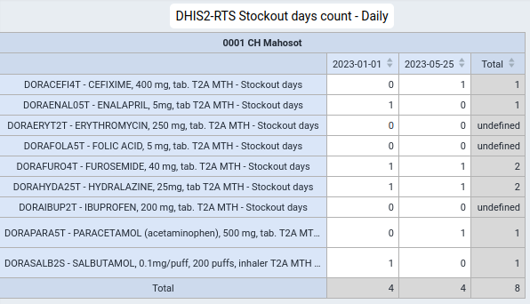

## LL - Line Listing Web App - Transaction Analytics and Visualizations

The Line Listing reports provide details of individual transactions but are not able to provide any type of aggregation.

Important notice: the "Last updated on" date and time stamp indicates the actual date that respective transaction was made on the mobile device (and not the date and time of synchronization). The time indicated in the Line Listing corresponds to the time set on the mobile device (which should ideally corresopnd to the DHIS2 server time).

For stock receipts entered through the web portal, the "Last updated on" reflects the server time of the DHIS2 instance. Therefore, the server time and the time on mobile devices must both be set to the same date and time and should correspond to the time zone used in the respective country. If the times set on mobile devices and the DHIS2 server instance differ, the Line Listing will no longer display all transactions made on mobile devices and the web portal in chronological order.

>**RTS LL 1 - DHIS2-RTS Digital stock card**  
This report replaces the manual (hand written) stock card and displays the accurate chronology of all transactions with the "Previous stock balance" and the "Stock on hand" (after the transaction).
>**Name \(*)**: "RTS LL 1 - DHIS2-RTS Digital stock card"  
>>**Input**: "Event"  
>>>**Program**: "Real-Time Stock Management"
>>>**Stage**: "Stock on Hand"
>>**Columns**
>>>Last updated on: "Today", "Last 90 days"
>>>"Deliver to": (no condition)
>>>"Item code": (no condition)
>>>"Item description": (no condition)
>>>"Previous Stock Balance": (no condition)
>>>"Stock receipt": (no condition)
>>>"Stock distribution": (no condition)
>>>"Stock discard": (no condition)
>>>"Stock correction": (no condition)
>>>"Stock on hand": (no condition)
>>
>>**Filter**: "Organisation unit" and tag "User organisation unit"  
>>
>>**Options**  
>>>**Style**  
>>>>**Digital group separator**: "Comma"

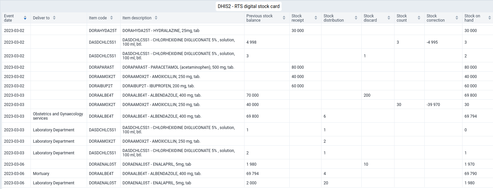

>**RTS LL 2 - Distribution report**  
This report (selectively) lists all "Distribution" transactions.
>**Name \(*)**: "RTS LL 2 - Distribution report"  
>>**Input**: "Event"  
>>>**Program**: "Real-Time Stock Management"
>>>**Stage**: "Stock on Hand"
>>**Columns**
>>>Last updated on: "Today", "Last 90 days"
>>>"Deliver to": (no condition)
>>>"Item code": (no condition)
>>>"Item description": (no condition)
>>>"Stock distribution": "greater than (\>)" 0
>>
>>**Filter**: "Organisation unit" and tag "User organisation unit"  
>>
>>**Options**  
>>>**Style**  
>>>>**Digital group separator**: "Comma"

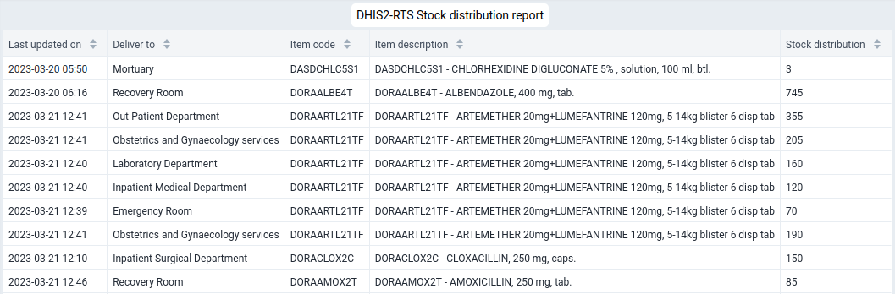

>**RTS LL 3 - DHIS2-RTS Current Stock on hand**  
This report is identical to viewing the stock item list with available stocks in the DHIS2-RTS and may be considered as redundant. The advantage of having a separate report is the possibility to give users (such as health staff in wards and services) read only access and not having to train them on the DHIS2-RTS. Moreover there is no need to select a "Transaction type" and "Deliver to" just to view the current stock position.  
Exceptionally and intentionally, "Event" (and not "Enrollment") has to be selected as "Input".
>**Name \(*)**: "RTS LL 3 - DHIS2-RTS Current Stock on hand"  
>>**Input**: "Enrollment"  
>>>**Program**: "Real-Time Stock Management"  
>>**Columns**
>>>"Item code": (no condition)
>>>"Item description": (no condition)
>>>"Stock on hand"
>>>>**Conditions**: (no condition)  
>>>>**Repeated events**: Most recent events: "1", Oldest events: "0"
>>
>>**Filter**
>>>**Organisation unit**: tag "User organisation unit"  
>>>**Enrollment date**
>>>>**Relative periods**: "Months"  
>>>>**Selected periods**: "This mont" and "Last 12 months"
>>
>>**Options**  
>>>**Style**  
>>>>**Digital group separator**: "Comma"
>>>**Legend**: tag "Use a legend for table cell colores"  
>>>>**Legend style**
>>>>>**Legend changes background color**: tag
>>>>>**Choose a single legend for the entire visualization**: tag
>>>>>**Legend**: Stockout

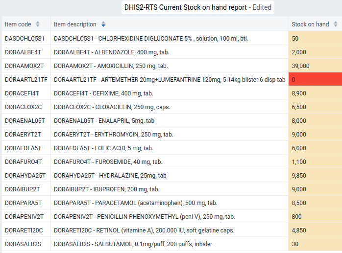

>**RTS LL 4 - DHIS2-RTS Discard report**  
This report (selectively) lists all "Discard" transactions.
>**Name \(*)**: "RTS LL 4 - DHIS2-RTS Discard report"  
>>**Input**: "Event"  
>>>**Program**: "Real-Time Stock Management"
>>>**Stage**: "Stock on Hand"
>>**Columns**
>>>Last updated on: "Today", "Last 90 days"
>>>"Deliver to": (no condition)
>>>"Item code": (no condition)
>>>"Item description": (no condition)
>>>"Stock discard": "greater than (\>)" 0
>>
>>**Filter**: "Organisation unit" and tag "User organisation unit"  
>>
>>**Options**  
>>>**Style**  
>>>>**Digital group separator**: "Comma"

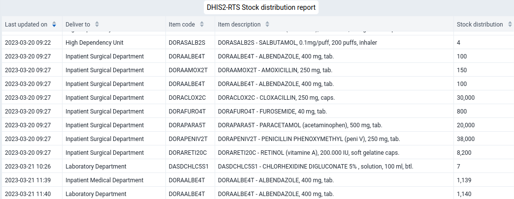

>**RTS LL 5 - DHIS2-RTS Stock correction report**  
This report (selectively) lists all "Stock correction" transactions.
>**Name \(*)**: "RTS LL 5 - DHIS2-RTS Stock correction report"  
>>**Input**: "Event"  
>>>**Program**: "Real-Time Stock Management"
>>>**Stage**: "Stock on Hand"
>>**Columns**
>>>Last updated on: "Today", "Last 90 days"
>>>"Deliver to": (no condition)
>>>"Item code": (no condition)
>>>"Item description": (no condition)
>>>"Stock correction": "greater than (\>)" 0
>>
>>**Filter**: "Organisation unit" and tag "User organisation unit"  
>>
>>**Options**  
>>>**Style**  
>>>>**Digital group separator**: "Comma"

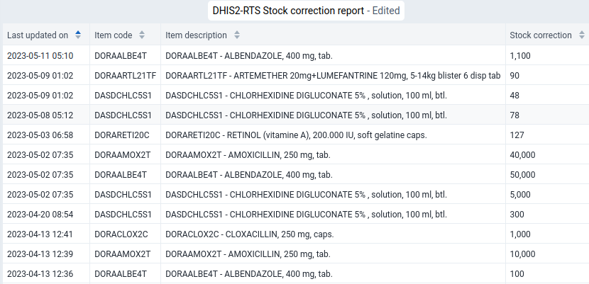

## MP - Maps Web App - Analytics and Visualizations
*[Under development]*

## DB - Dashboard Web App - DHIS2-RTS Dashboard
The dashboard should be considered as a visualization library which demonstrates a range of visualizations which can be used as suggested and can be rearranged or modified according to needs for analysis and reporting.

>**1 RTS DB 1 - DHIS2-RTS Real-Time Stock Management Dashboard**  
>>**Dashboard titel**: "RTS DB 1 - DHIS2-RTS Real-Time Stock Management Dashboard"  
>>**Layout**: "Freeflow"
>>**Items**
>>>RTS DV 1 - DHIS2-RTS Monthly report - Summary  
>>>RTS DV 2 - DHIS2-RTS Monthly report - Detailed  
>>>RTS DV 3 - DHIS2-RTS Stockout days count - Monthly  
>>>RTS DV 4 - DHIS2-RTS Daily report - Summary  
>>>RTS DV 5 - DHIS2-RTS Daily report - Detailed  
>>>RTS DV 6 - DHIS2-RTS Stockout days count - Daily  
>>>RTS LL 1 - DHIS2-RTS Digital stock card  
>>>RTS LL 2 - Distribution report  
>>>RTS LL 3 - DHIS2-RTS Current Stock on hand  
>>>RTS LL 4 - DHIS2-RTS Discard report  
>>>RTS LL 5 - DHIS2-RTS Stock correction report  
>>
>>**Sharing and access**
>>>**Dashboard sharing**
>>>>**User / Group** / **Access level**
>>>>>"RTS - Administrator" / "View and edit"
>>>>>"RTS - Analysts" / "View only"
>>>>>"RTS - Stock item list managers" / "View only"
>>>>>"RTS - Stock managers" / "View only"
>>
>>**More**
>>>"Make available offline" (option then appears as "Remove from offline storage)

## Android Capture App - DHIS2-RTS mobile application
The mobile device application (front-end, user interface) consists of a login screen, a single screen for entering and editing data by storekeepers and a third (and last) screen for viewing and correcting the summary.

### General use case

Medical stocks comprise drug products (tablets, injectable drug products, diagnostic tests etc.) as well as single use medical devices such as syringes, bandages, catheters, drains, x-ray films etc.

Medical stores are usually replenished once a month from district, provincial or national stores. Upon delivery, they receive a detailed packing list for each consignment which provides details of the item codes and names, quantities, batch numbers and expiry dates. After counting the quantity of each item, goods are put away and placed in order of the item group, within alphabetically and within by expiry date in the medical store.

Depending on the organization of the healthcare facility, every ward or service presents a request form with a list of required items and quantities once a day, several times a week according to an agreed schedule, every week or once a month to the central pharmacy. The storekeeper then picks the required quantities of the required items and prepares them for delivery to the requester.

Traditionally, medical stores are managed by recording each transaction in a batch card which is placed on the shelves next to each item. At the end of the month, the stock of each item is counted, the actual balance is compared with the running balance indicated in the batch card and, if necessary, the balance is corrected. All transactions of each batch card are summarized in a stock card which is also kept for each item and calculating the stock balance from all stock receipts and stock issues. The data on monthly stock issues as well as the stock on hand at the end of the month are then used for calculating monthly replenishment orders which closes the replenishment cycle.

This process is laborious, boring, prone to error and very time consuming. The monthly stock count alone takes between two to five working days every month.

The fundamental improvement of the DHIS2-RTS is to record only the stock transactions by scanning a bar code, adding the received stock from electronic packing lists and calculating the remaining balance in real-time. The stock card is then automatically provided by the DHIS2-RTS app as an output which eliminates the need for any paper records. The process of the monthly stock count is eliminated and replaced residual balance counting and (optionally) by spot checks.

The DHIS2-RTS will be used by

- health workers
- immunization workers
- community health workers
- medical storekeepers
- supervisors and medical store managers

for managing medical stocks at hospitals, Primary Healthcare facilities (clinics), Immunization services and those managed by community health workers.

One of the main tasks of storekeepers is keeping records of all transactions of all items they manage and providing detailed reports at the end of the month. These records include the following information for each transaction:

- place of the transaction (Organisation Unit)
- transaction date and time
- person who carried out the transaction (user)
- requesting ward or service
- item code and name (name of the drug product or single use device)
- quantity of the transaction

Storekeepers need to differentiate between and record the following transaction:

- stock receipts (from upstream stores)
- stock distributions
- stock discards
- stock corrections

Stock receipts are managed "manually" by the storekeeper through the DHIS2-RTS app, by "uploading" in the Tracker Program in the DHIS2 web portal with a template or through integration with the national eLMIS.

Almost all transactions are "distributions" of healthcare goods to wards and services. Occasionally expired or damaged goods have to be discarded and have to be removed from the stock but without being considered in the "distributed" quantity as otherwise the stock replenishment quantities would be falsely calculated too high. Finally, any discrepancies caused by mistakes, mislaying or theft need to be corrected in order to ensure accurate stock replenishment calculations.

[Question: include returns to upstream stores and redistributions to other healthcare facilities. The alternative is to manage these as "negative deliveries" from the upstream store].

The DHIS2-RTS data and analytics provides the storekeeper with information on:

- current stock on hand of every item
- total monthly transactions (receipts, distributions, discard and correction) for each item

- distributions by supplied ward or service

### General functionality

- The user interfaces display only absolutely essential information and kept as simple as possible
- only include text and visual elements which are absolutely indispensable
- fully functional offline (in principle for an indefinite period)
- Design is as simple and intuitive as possible to maximize usability and  minimizing training requirements
- Preventing data entry errors by alerts and user information

- should be designed for a highly repetitive task

- All quantities of all healthcare goods are exclusively indicated in units of measure (UoM) of "EA" (Each) and never in any packaging quantities. "EACH" refers to the smallest usable unit of a healthcare product such as one tablet, one syringe, one disposable glove or one pair (!) of sterile gloves (as these must always be used in pairs). In exceptional cases where the packaging quantity (such as "kit of 100 tests" is indicated in the item description, "EACH" refers to one kit (and not one test) as such products do not contain separate diagnostic tests but are an actual kit with bottles of liquids and other components sufficient for the indicated number of tests.

- All items are sorted alphabetically by their "Name"
- Any data values entered on the mobile device using the DHIS2 Capture Android is stored instantly upon entry and does not require "saving"

- The mobile device application intentionally does not allow users to export or download data from the mobile device in any way nor is this required. Previously recorded data can be viewed in dashboards on the mobile device or in the DHIS2 web portal

As the DHIS2-RTS is a native module in the DHIS2 Capture Android app, installation of the DHIS2 Capture Android app automatically includes installation of the DHIS2-RTS application.

### DHIS2 mobile device application user access (login and logout)

This process allows users to login and access the mobile device application.

As the DHIS2-RTS is a native module in the DHIS2 Capture Android app, the login (and logout) is also native functionality which applies to the DHIS2-RTS Stock app.

Users can login according to their user profile and account settings as configured in the DHIS2 web portal. Access to the DHIS2-RTS functionality is controlled through the user settings and the Tracker Program settings.

### DHIS2-RTS transaction types

The DHIS2-RTS mobile application features three transaction types:
- Distribution
- Discard
- Stock correction

More than 99% of all transactions will be "Distribution" transactions where storekeepers pick and pack healthcare goods requested by a department, service, community health care and immunization workers which are then either picked up by the requester or delivered by the pharmacy.

The DHIS2-RTS is designed for instant digital recording and explicitly not intended for recording transactions on paper records and re-entering them on a mobile device later as this would unnecessarily duplicate the work effort. Moreover, the main purpose of providing real-time stock updates to storekeepers and other stakeholders is not achieved by "retrospective" entry.

- Users enter transactions item by item immediately as the transactions take place and not retrospectively.

- A setting allows differentiating between actual distributions (issue to patients, wards, services and community health workers) as well as losses caused by expiry, damage, theft or any other use of stock which is not an actual stock issue.

- As the stock on hand is automatically calculated, users have the possibility of manually correcting any discrepancies by recording correcting the actual, current stock on hand.

#### "Distribution" transaction

##### "Distribution" transaction workflow

For each "Distribution" transaction the following workflow is required. User

- receives a written request from departments, services or community health workers indicating a list of healthcare products and their quantities which are requested and need to be prepared by the pharmacy

- starts the mobile device
- open the DHIS2-RTS mobile app
- selects the transaction type "Distribution"
- selects the "Organisation Unit" (name of the healthcare facility) if s/he has access to more than one

- selects the ward/service etc. which is requesting the goods and for which the order picking is carried out

- selects the first item by scrolling, searching or using the barcode scanner

- enters the quantity manually by typing on the on-screen keyboard
- repeats process for each requested item
- carries out a final review of all picked items and, if needed corrects, confirms (or discards) the transaction

- informs the requester to pick up the goods are delivers them to the requesting department/service

##### "Distribution" transaction use case

Details of the user action (odd numbers) and the resulting system behaviour (even numbers) with the respective user interface are shown below step by step.

| Number | User action / System behaviour |
| :---: | :--- |
| 1 | User authenticates and accesses the DHIS2 Capture Android app. |
| 2 | The DHIS2 Capture Android app home screen appears and displays all the DHIS2 Data Sets and Programs to which the user is assigned and has access to. 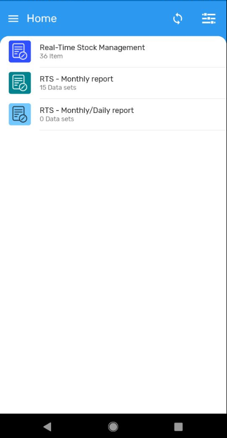 |
| 3 | User accesses the respective DHIS2-RTS Tracker program from the home screen by tapping on it. |
| 4 | The DHIS2-RTS home screen opens, and in the top bar by default "Distribution" appears as transaction type with a blue background. If the user is assigned to a single Organisation Unit, it appears by default under "From". By default the "Deliver to" field is blank to force the user to deliberately select one of the options. Note that the "Search" field is not active until the "From" and "Deliver to" fields are filled. 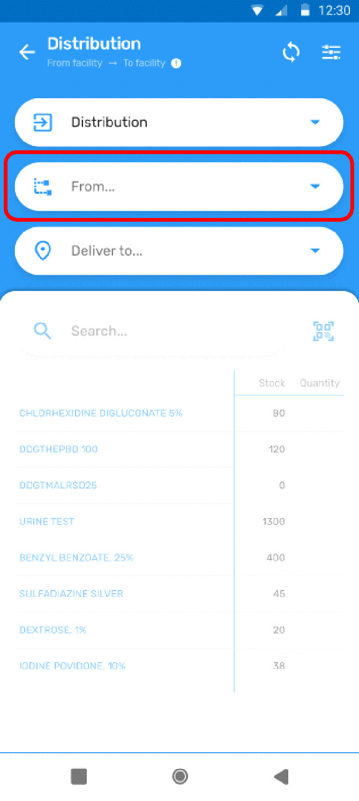 |
| 5 | Optionally (should be a very rare exception): the user opens the "From" drop-down menu. |
| 6 | A list of available Organisation Units is displayed in the drop-down menu. If the user is assigned to a single Organisation Unit, the field is "static" and no drop-down menu opens. 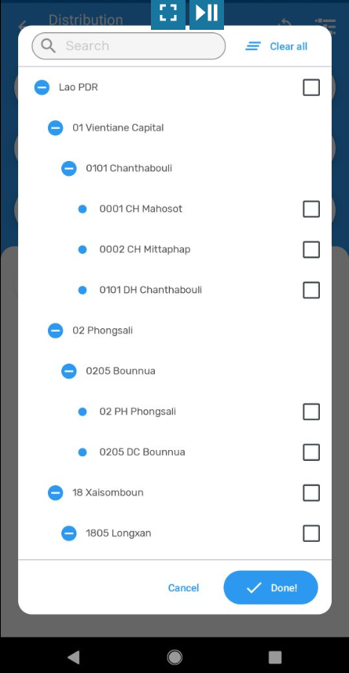 |
| 7 | User selects the required Organisation unit by checking the box and selecting "DONE". |
| 8 | The DHIS2-RTS home screen reverts which now indicates the selected Organisation unit. 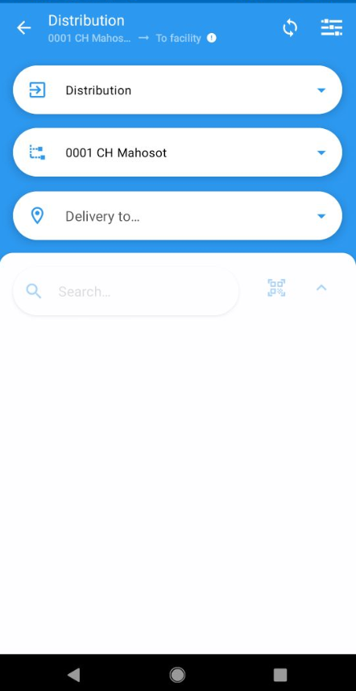 |
| 9 | User opens the "Deliver to\..." drop-down window for selecting the required department or service which requested the goods and to which the goods are being provided. Note that this drop-down window only applies to "Distribution" (but neither to "Discard" nor to "Correction"). By default the drop-down window is intentionally blank to force the user to enter a selection and the use cannot proceed before completing this selection. |
| 10 | The available "Deliver to" options are displayed in a drop-down window. Note that the details may differ by Tracker Program as these options can be freely configured in the respective "Option set". 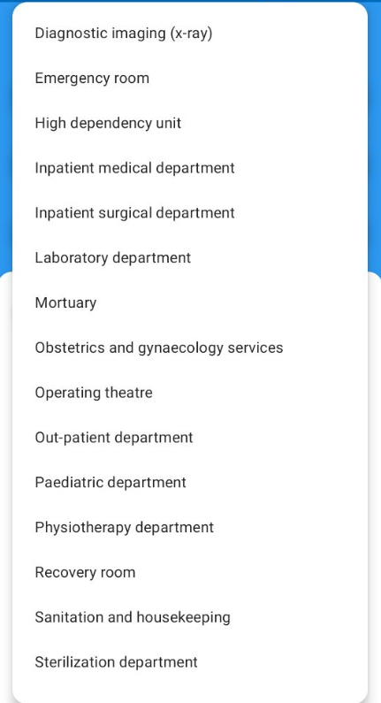 |
| 11 | User selects the required "Deliver to" department or service from the drop-down menu. |
| 12 | The drop-down menu collapses and displays only the selected "Deliver to" choice. Note that as soon as all three entries (transaction type, Organisation Unit and "Deliver to") have been selected, the stock item list with the current stock is immediately and automatically displayed. 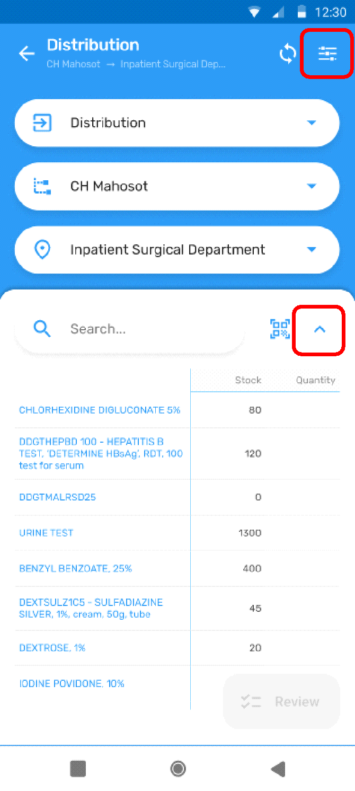 |
| 13 | This completes the selection of the transaction type, Organisation unit and the "Deliver to" option from the DHIS2-RTS home screen. User selects the "Settings" icon or the "\^" icon for "collapsing" the header. |
| 14 | The header information for the transaction type, Organisation unit and "Deliver to" selection is compacted into the header of the screen and displayed during the entire transaction. 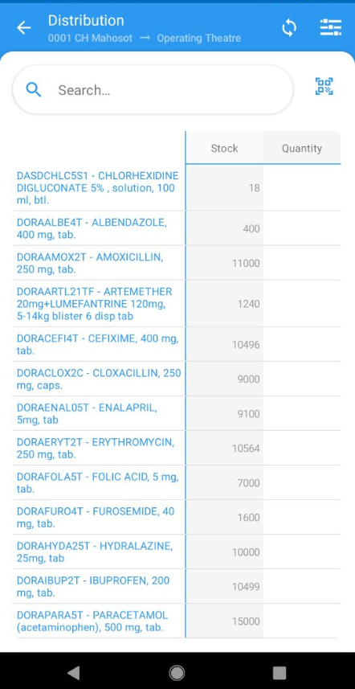 |
| 15 | In case the user tries to make a change to the transaction type after entering any quantity (or quantities), the "From" and "Deliver to" field a warning will appear that any data entered so far will be lost, cannot be retrieved and will have to be entered again. |
| 16 | A dialogue window with the warning is displayed at the bottom of the screen: 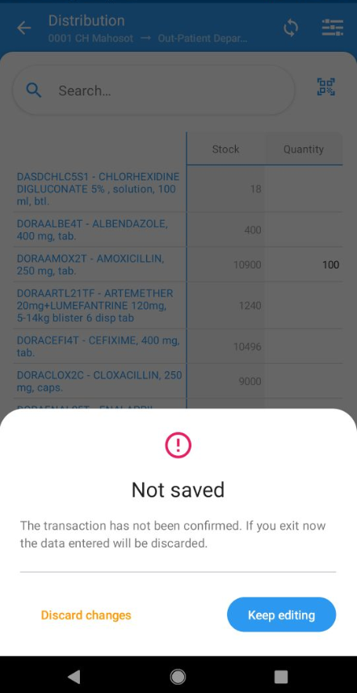 |
| 17 | The user can either select "Discard changes" and forgo the entered data or select "Keep editing" and proceed with the transaction with the previously selected Organisation Unit and "Deliver to" selection. |
| 18 | Depending on the choice, the home screen reverts or the user continues where s/he left off editing data. |
| 19 | The user is now ready to start preparing the requisition. The user has three possibilities for searching for items in the list. 1) Manually scrolling down the list until the requested item is found, 2) Entering a search term in the "Search" window, 3) Scanning the barcode attached to the item on the shelf. The first option is to simply scroll down the list and tap in the "Quantity" field. |
| 20 | The "Quantity" field becomes editable and the name of the item as well as the entered value appear between the list and the on-screen keyboard in a separate field.  |
| 21 | The second option is to enter text in the "Search" field. |
| 22 | The list displays only the items which contain the text entered in the "Search" field. Note that this screen is only "filtering" the entire list according to the most recent search but with the entire list "in the background" and none of the items are actually removed from the list. Also note that this filter is "contextual" and as characters are added, the list of results is automatically adapted and shortened according to the entered text string. The text in the search window can be edited or cleared by tapping on the "X" icon. As above the user taps in the "Quantity" field and enters a value. As soon as the user taps onto the blue ✓ icon or taps into another "Quantity" field, the "Stock" is recalculated in real-time. 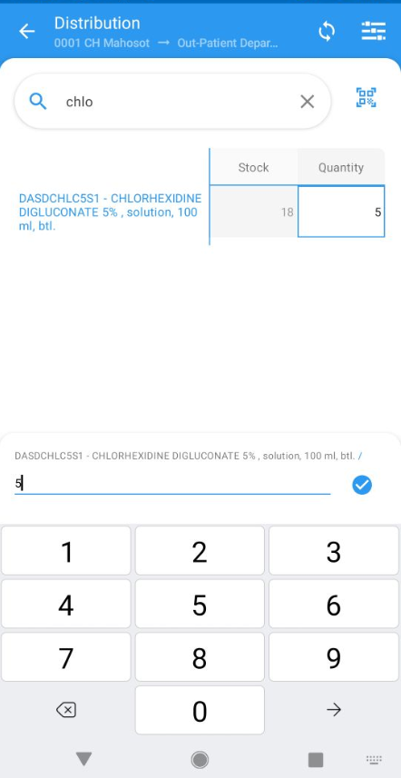 |
| 23 | The third and last option is tapping on the barcode symbol which is found on the far right of the "Search" window. |
| 24 | The barcode viewfinder window opens which displays a white field with a horizontal red line displaying the view of the mobile device camera: 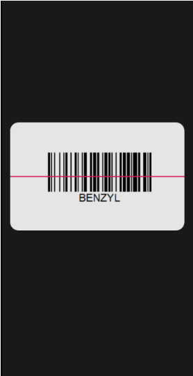 |
| 25 | User places the viewfinder window in front of the barcode which is attached to the label on the shelf and positions the red line across the centre of the barcode: 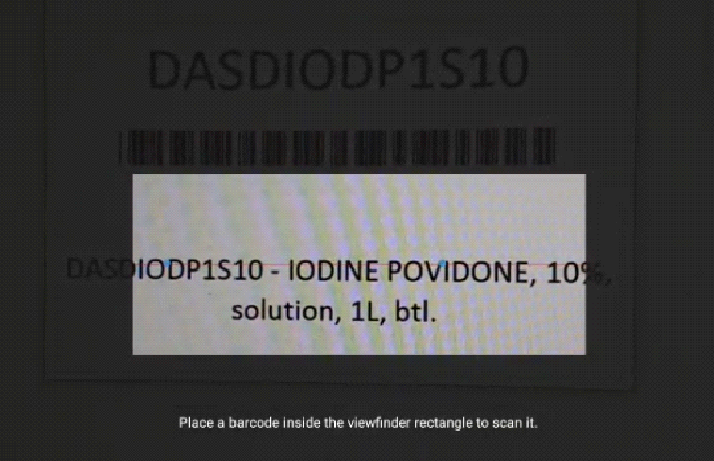 |
| 26 | The DHIS2 Capture Android app will audibly signal ("beep") as soon as the mobile device has captured the barcode, close the viewfinder window and display only the selected item in the window. The "Search" field will display the selected item as a search result. The window will display the current "Stock" (stock on hand, which should correspond to the actual remaining stock on the shelf) next to the item and reprints the item name with a quantity field at the bottom of the screen for editing. Note that this screen is only "filtering" the entire list according to the most recent search but with the entire list "in the background". 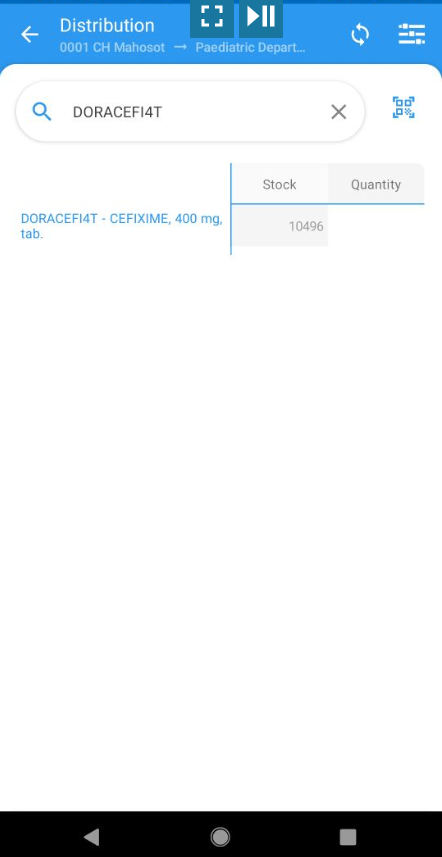 |
| 27 | User taps in the "Quantity" field for opening the on-screen keyboard and enters the picked quantity. Users are blocked from entering negative values, zero or positive non-integer values. |
| 28 | The entered "Quantity" is displayed in the respective line as well as in the separate dialogue window window above the on-screen keyboard. The user can edit the quantity or delete it by removing all digits with the "back" button. 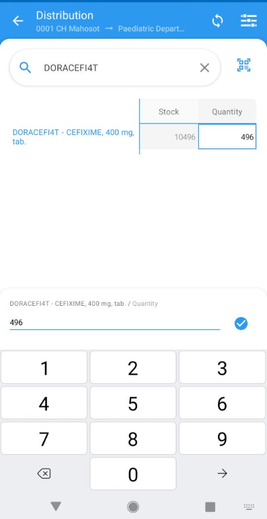 |
| 29 | User confirms the (final) quantity by tapping on the blue ✓ icon.|
| 30 | The on-screen keyboard and the editing line are closed and the entered quantity is instantly and automatically deducted from the "Stock" and immediately displays the final stock balance (after the respective quantity has been removed from the shelf). 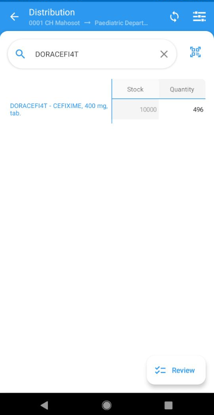 |
| 31 | The user effects another entry by tapping on the barcode icon or selecting the next item. Note that the list will only display items corresponding to the entry in the "Search" window and for viewing all (so far) selected items, the "Search" field has to be voided by tapping on the "X" icon. |
| 32 | This completes the recording of the first item which is picked and the user continues to pick the remaining items for the same department or service. The user can either continue using the barcode scanner which does not require "expanding" the entire list. If the user is not using the barcode scanner s/he needs to select the "x" in the search window for reverting to the entire list. Note that if the stock item list is "expanded" all entered values for the selected items are maintained. 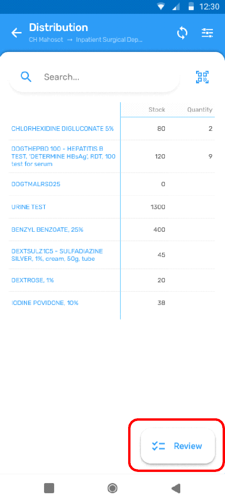 |
| 33 | After the last required item has been picked, the user selects the "Review" button at the bottom right of the screen. |
| 34 | The user is referred to the "Review" screen which displays only the previously selected items (and not the entire stock item list) with the entered "Quantity" in the alphabetical order of the stock item list. Note that "Under review" is displayed below the item list, the "Review" button is no longer displayed and instead the "Confirm" button is displayed. This screen allows comparing the selected items with the original request from the department or service and, if necessary, making corrections.  |
| 35 | Optionally: the user can revert from the "Review" to the previous data entry interface (for example because requested items were forgotten) without any previous entries being lost. |
| 36 | Optionally: after completing the corrections, the user advances to the "Review" screen again. |
| 37 | By tapping inside the "Quantity" field, the user can reopen the on-screen keyboard and edit as well as delete any quantity. |
| 38 | The on-screen keyboard is opened and the "Quantity" field is again editable. Note that in this final steps items cannot be added to the list any more and the "Search item" as well as the "Scan" icon can only be used for searching items within the list (in case the list is long and the user is not sure that a certain item was correctly picked). In case items are actually missing the user can either discard all entries and start from scratch or simply complete the transaction and then start a second transaction for the same ward or service for the items which were missed. In case the user entered an incorrect transaction type or "Deliver to" option, the user can discard the transaction by selecting the back button (arrow) but all entered "Quantity" fields will be lost. 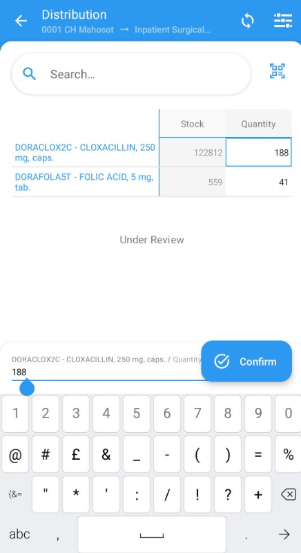 |
| 39 | Once the review and editing has been completed, the user selects the "Confirm" button. **_Note that this step is irreversible_** and cannot be reversed or be undone in any way. |
| 40 | The home screen reverts with all options in the header reset to their defaults. A dialogue window displaying "The transaction was successfully completed" appears at the bottom of the screen.  |
| 41 | User selects the synchronization icon at the top right of the screen. The synchronization of the local database with the central server can be effected at any time but any particular transaction can only be synchronized once it has been completed. |
| 42 | A dialogue window opens at the bottom of the screen with information on the synchronization. 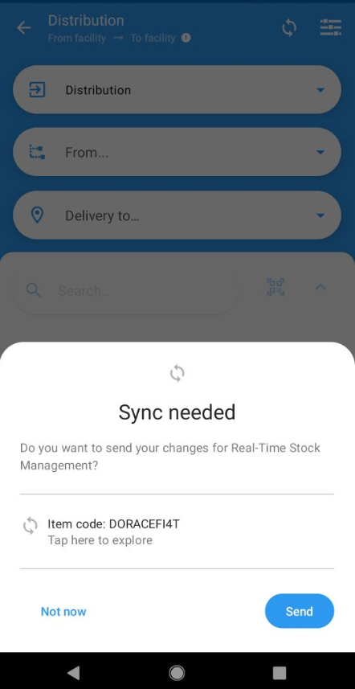 |
| 43 | User selects the "Send" button. |
| 44 | The successfully completed synchronization is confirmed by the "Synced" caption and by changing the colour of the synchronization icon from grey to green. Note that the user is offered the "Refresh" option even if the synchronization has been completed successfully in order to align with native DHIS2 behaviour. 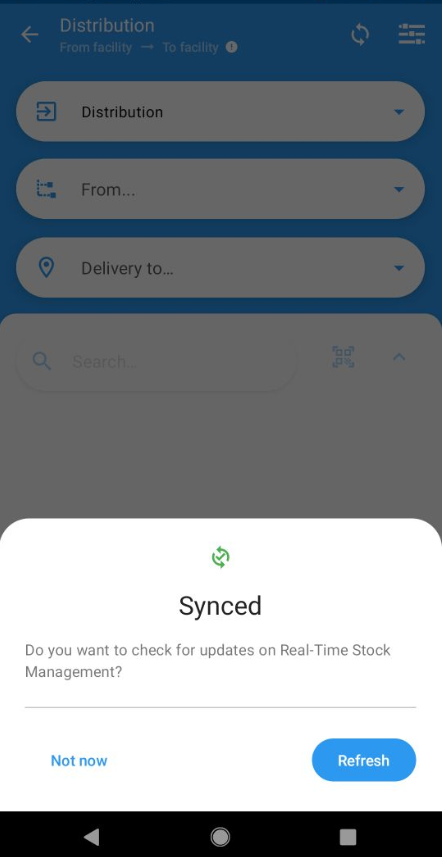 |
| 45 | User selects "Not now" to close the confirmation message. |
| 46 | The confirmation message closes, the home screen reverts and the user is ready for entering the next transaction.  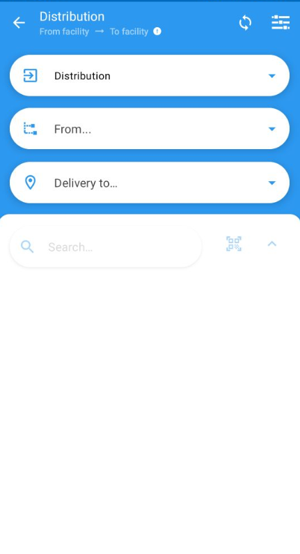 |

#### "Discard" transaction

##### "Discard" transaction workflow

Stock is discarded whenever healthcare goods are expired, damaged or no longer usable for other reasons. Those products must be removed from the "active" stock and segregated in a locked cupboard or room to prevent inadvertent use until the products are disposed of.

There are several reasons for differentiating between "Distribution" and "Discard" transactions:

- In terms of stock replenishment, discarded stock is issued from the stock but must not be included in the (monthly) demand. In most cases the discarded stock has to be replaced but only one-off (!) while included the quantity as "Distribution" transaction would falsely imply that those quantities have been distributed and use and that demand has increased

- The amount and value of discarded stock is an important indicator for the quality of stock management

The workflow and use case are almost identical with those of the "Distribution" transaction with the only difference that the "Deliver to" option is not required and therefore not displayed.

For each "Discard" transaction the following workflow is required: user

- identifies batches of health care products which are no longer usable

- starts the mobile device
- opens the DHIS2-RTS mobile app
- selects "Discard" from the transactions drop-down menu
- selects the healthcare facility ("Organisation Unit") if s/he has access to more than one

- scans the barcode of the first healthcare product
- records the quantity which is being discarded
- repeats process for each batch of all items
- carries out a final review of all picked items and confirms (or discards) the transaction

- places the selected products in quarantine to prevent inadvertent use

##### "Discard" transaction use case

This use case only shows the steps which differ from the "Distribution" use case.

| Number | User action / System behaviour |
| :---: | :--- |
| 1 | User accesses the DHIS2-RTS mobile device application. |
| 2 | The DHIS2-RTS home screen opens. 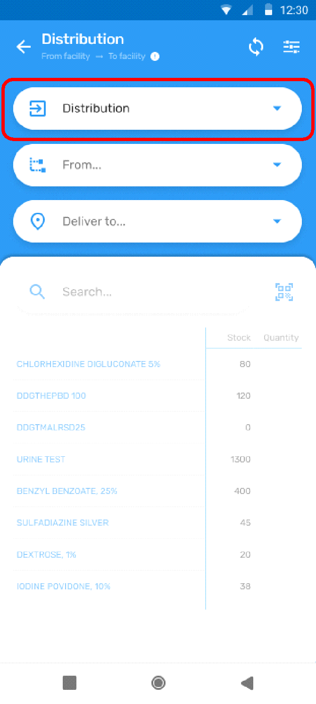 |
| 3 | User taps on the "Distribution" button of the DHIS2-RTS home screen. |
| 4 | A drop-down menu with all available transactions opens. 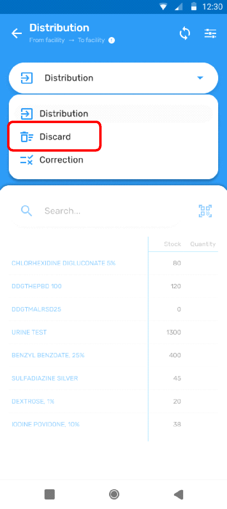 |
| 5 | User selects "Discard" from the drop-down menu. |
| 6 | "Discard" is displayed instead of "Distribution" in the header, the background colour changes to red and the text colour changes to red to signal that this is not a "Distribution" transaction and ensure users are aware that this is as "Discard" transaction. Note that the "Deliver to" field is no longer available.  |
| 7 | User selects the Organisation unit from the "From" drop-down menu (see "Distribution" transaction). |
| 8 | The header displays "Discard" as transaction type and the Organisation unit as "From" and the user is ready to select the items and quantities which need to be discarded in the same way as for the "Distribution" workflow. 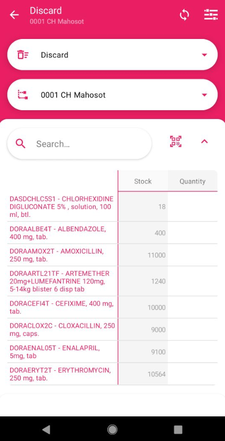 |

#### "Correction" transaction

##### "Correction" transaction workflow
Stock corrections must only be made if the mistake in previous transactions cannot be correct by recording additional transactions and may be needed for various reasons:

- Quantity received physically is more or less than received in the system

- Stock is lost
- Stock is mislaid (placed in another place and not found during counting)

- Theft
- The quantity recorded during any previous transaction is larger or smaller than the actual transaction quantity and the mistake was not noted during the transaction

In most case the mistake will never be found and it is important to differentiate these transactions from other transactions as they must not be taken into account for calculating demand and stock replenishment orders.

The workflow for "Correction" transactions is almost identical with the "Distribution" workflow with the important difference that, unlike all other transactions, the user does not enter the transaction quantity but instead enters the quantity resulting from a physical stock count and DHIS2-RTS then calculates the discrepancy. Moreover, the "Correction" transaction is the only transaction where entries or "0" (zero) make sense.

For each "Correction" transaction the following workflow is required, user:

- identifies an item with a discrepancy between the current stock on hand in DHIS2-RTS and the result of the physical stock count

- starts the mobile device
- opens the DHIS2-RTS mobile app
- selects "Correction" transaction from the drop-down menu
- selects the healthcare facility ("Organisation Unit") if s/he has access to more than one

- scans the barcode of the first healthcare product
- enters the quantity resulting from the physical stock
- repeats process for each item
- carries out a final review of all items for which a stock correction was entered

##### "Correction" transaction use case

This use case only shows the steps which differ from the "Distribution" use case.

| Number | User action / System behaviour |
| :---: | :--- |
| 1 | User accesses the DHIS2-RTS mobile device application. |
| 2 | The DHIS2-RTS home screen opens.  |
| 3 | User taps on the "Distribution" button of the DHIS2-RTS home screen. |
| 4 | A drop-down menu with the available transactions opens. 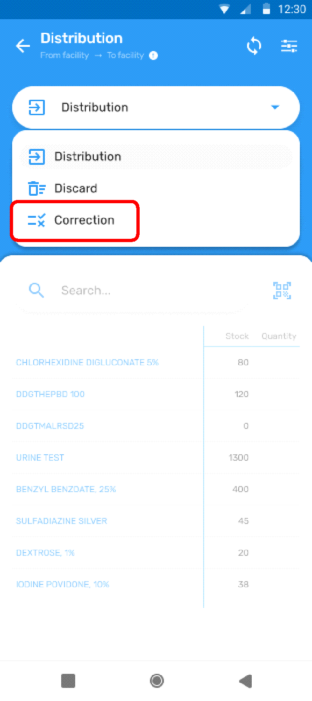 |
| 5 | User selects "Correction" from the drop-down menu. |
| 6 | "Correction" is displayed as transaction type instead of "Distribution" in the header, the background colour changes to orange and the text colour also changes to orange to signal that this is not a "Distribution" transaction and ensure users are aware that this is as "Correction" transaction. Note that the "Delivery to" option is no longer available and **_instead of the "Quantity" column, the "Count" column is displayed_**. 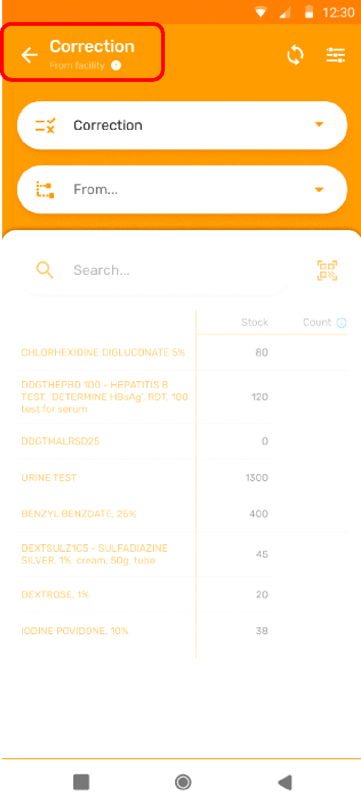  |
| 7 | User selects the Organisation unit from the "From" drop-down menu (see "Distribution" transaction). |
| 8 | The user selects the first item (see the instructions for the "Distribution" transaction) by scrolling, searching or using the barcode scanner. |
| 9 | Only the selected item appears on the screen. |
| 10 | User counts the actual quantity in stock, compares it with the calculated quantity displayed by the DHIS2-RTS app and, if any discrepancy is confirmed, **_enters the actual quantity in stock_**. Note that DHIS2 will "reset" the Stock on hand to the entered quantity and automatically calculate the difference with the previous value as "stock correction". |
| 11 | The user interface displays the correct stock on hand in the "Stock" column. |
| 12 | The user repeats the process above for every item to be picked, proceed to the "Review" and completes the transaction as described in the previous sub-chapter. |

### Mobile device analytics

DHIS2 natively provides users with on-line and off-line analytics.

The DHIS2-RTS analytics replaces "reading" of stock records which may be needed at any time by the storekeeper for:

- Consulting or verifying the current stock on hand
- Viewing any (recent) transaction by "Deliver to", item and/or date
- Analysing demand of a certain item

It is important to note that apart from the medical storekeepers as the main user, any other health professional in the same health care facility also would greatly benefit from access to analytics for:

- Checking the availability of certain health care products, for example before a physician prescribes a drug product and either confirming availability or prescribing an alternative drug product

- Checking the availability of stocks by department/ward supervisors before preparing their daily/weekly orders and, if necessary, ordering (more of) alternative health care products

#### Analytics through progressive web app (PWA)

The native DHIS2 progressive web app functionality allows viewing any DHIS2 dashboards which are configured as "Make available offline" on a mobile device through any installed web browser.

All the visualizations from the Line Listing app as well as the Data Visualizer app indicated in chapter 2.7.3 "DHIS2-RTS Dashboards" can be accessed through any web browser on a mobile device by any user has been granted the respective user access.

The DHIS2 analytics (as of the time the mobile device was connected to the Internet the last time ) can be viewed any time while the mobile device is offline. Any changes made to the data and analytics while the mobile device will not be visible but the last update of the data will be visible indefinitely while the mobile device is offline.

In order to view the the visualizations without the dashboard headers select "View fullscreen" from the three dot menu in the upper right corner of each visualization.

### Mobile device synchronization

The DHIS2-RTS mobile app uses the native synchronization functionality which is included in the detailed DHIS2 documentation. The simplest way for synchronizing the mobile after every transaction is using the synchronization icon (double reverse arrow) in the header bar without having to leave the DHIS2-RTS user interface. However, there are some important operational considerations which are specific to the real-time stock management use case.

Note that it is a logical impossibility, and not a technical shortcoming, to keep a correct real-time record of the stock on hand on both devices if one or both are working offline. It would be in principle possible to recalculate and correct the stock balance after both devices are synchronized, but the DHIS2-RTS does not have this capability.

As the program rules can run on the web portal as well as any number of different mobile devices, it is critical that for any specific item (healthcare product), transactions are made on a single device at a time. At any time, there must only be a single device which recalculates the stock on hand and after completion of that calculation which must be synchronized with the next device which effects any transaction for the same item.

After completion of the transactions, all data should be synchronized with the central DHIS2 server as soon as possible. But in any case, a successful synchronization must be completed before any other device (using the web portal or the mobile app) effects any transaction for the same item.

If two devices, for example two mobile devices or one mobile device and one desktop computer, each effect a transaction for the same item "in parallel", the program rules on either device will calculate different Stock on hand levels for the same item. Even if all devices are then synchronized, the Stock on hand from the last device which synchronizes with the server will "override" any Stock on hand calculation which was made "in parallel", the overall stock record will be incorrect and not correct until a manual stock "Correction" transaction is effected.

In general, DHIS2 web access will be used exclusively for effecting stock receipts and is explicitly strongly recommended not to use the web portal for effecting any "Distribution", "Discard" or "Correction" transactions as the Events in the Tracker Program have only a date stamp but no time stamp and therefore cannot keep correct track of the chronological order of transaction. In contrast, the DHIS2-RTS mobile app uses a date and time stamp with hour, minutes, seconds, split seconds and therefore keeps a precise record of the exact time the transaction was effected on the mobile device. Therefore, all "Distribution", "Discard" or "Correction" transactions must only be effected on mobile devices.

For the operational use of the real-time stock management system in practice this means:

- at any given time, transactions for any specific item must be effected on a single device (mobile device or on the web portal) which must be synchronized before any other transaction is made for the same item

- if more than one mobile device is used at the same Organisation Unit then only one of them must be used for effecting transactions for any particular item at any time and must be synchronized with the central DHIS2 server before the other mobile device effects any transaction for the same item

- stock receipt transactions must only be effected on the web portal after all mobile devices have synchronized all their data with the web portal

- mobile device must only resume effecting transactions after completion of a stock receipt on the web portal and only after a successful completion of the synchronization

In most health facilities only a single mobile device will be needed and the coordination with the stock receipts which take place only once or twice a month will not pose any difficulties.

In case a health facility uses more than one mobile device at the same time, these constraints just require a simple rule work process rule for preventing any data discrepancy or stock on hand mismatch: if storekeepers receive several requests from different wards/services for supplying the same item, those requests are "split" among the storekeepers according to the group of items. For example, one storekeeper will pick all the oral drug products for the surgical ward, paediatric ward and out patient department while another storekeeper (using the second mobile device) will pick all the dressing material. In this way, each of the devices maintains an accurate real-time record for the items which are being picked and after both mobile devices synchronize their data, all transactions as well as stock on hand will be reflected correctly on the central DHIS2 server.

In principle, transactions can be recorded on a mobile device indefinitely before synchronizing. However, it is still strongly recommended to synchronize all mobile devices after every transactions or at least once a day for the following reasons:

- visibility of the real-time stock data will be available to any other users, for example at the district level, only after synchronization

- in case the device fails or a synchronization failure can only be resolved by deleting all local data from the device, all data which has not been synchronized yet will be lost without any way to recover the data

If the network connectivity does not allow synchronizing mobile devices with the central server (at least) once a day, the DHIS2-RTS mobile application is not a suitable solution for managing stock at the health care facility.

Note that, by design, the DHIS2 Capture Android app does not automatically synchronize data with the central DHIS2 server during login and if any data was not yet synchronized before logging out, the synchronization will have to be prompted "manually".

## Import/Export Web App - Uploading DHIS2-RTS configuration
The configuration of the DHIS2-RTS Tracker Program from scratch can be completed in less than an hour. However, several other settings, among others Data elements, Data sets, Program indicators, Predictors and Analytics which are required for using the system.
The configuration of all these components can be greatly facilitated by exporting metadata from the DHIS2 sandbox which hosts the most up-to-date version and importing the metadata into another DHIS2 instance.  
https://lmis.integration.dhis2.org/sandbox/dhis-web-commons/security/login.action  
However, some important constraints should be considered:  
- Only a few Tracked Entity Instances and Data elements are configured which can server as templates for adding (or uploading) additional items  

- The coding and news of the sample TEIs/DEs will all have to be changed to national standards  

- Program indicators and Predictors need to be created for all of the added TEIs/DEs  

- Metadata needs to be adapted to any changes of the "Delivery to" options  

- Any additional items need to be added to the Visualizations  

- For the selected "Metadata export", all metadata from all sandbox tools will be exported, for example all legends and all user roles  

In principle two sets of data are required for exportign and importing:  

- Metadata dependency export: Real-Time Stock Management Tracker program  

- Metadata export: selected metadata  

The exportation of the data:
- Open the Import/Export Web App  

- Select "Metadata dependency export"  

- Object type: "Programs"  

- Object: "Real-Time Stock Management"  

- What format should the data be exported as?: "JSON"  

- Compression type: "Zip"  

- Select: "Export metadata dependencies"  

- Download the "metadata.json.zip" file  

- Select "Metadata export"  

- Tag the following metadata components:  
  * Category Option
  * Category
  * Category Combo
  * Category Option Combo
  * Data Element
  * Data Element Group
  * Indicator Type
  * Indicator
  * Indicator Group
  * Map
  * Option
  * Option set
  * Organisation Unit
  * Legend Set
  * Data Set
  * Visualization
  * Dashboard
  * Predictor
  * Predictor Group
  * User Role
  * User Group

- What format should the data be exported as?: "JSON"  

- Compression type: "Zip"  

- Select: "Export metadata"  

- Download the "metadata.json.zip" file  

- Upload both files to the DHIS2 instance where the DHIS2-RTS application will be hosted.

## MEDICAL STOCK MANAGEMENT WITH THE DHIS2-RTS APP

In any implementation, national regulations and guidelines must be respected. This chapter focuses on technical and practical aspects and should only be considered as recommendations which may or may not be useful.

### Preparations for implementing the mobile application

Using the DHIS2-RTS mobile application requires availability and sustainable management of an existing central DHIS2 server instance with technical support.

Most pharmacies rely on paper records such as stock cards, batch cards and various register books for managing stocks and stock data. Any health facility and anybody wanting to implement the use of the DHIS2-RTS system is well advised to consult with and obtain advice from HISP groups and colleagues who have implemented and are successfully using the system already.

Any implementation must be approved and planned by the national Health authorities as well as the respective health facilities.

Mobile device need to be provided and sustained, a really network connection needs to be available and financed and competent users need to be identified and trained on the application.

#### Providing and setting up mobile devices

Every health facility should have at least one tablet PCsavailable which is dedicated for use by storekeepers and, ideally, a second backup device which may be shared with other users at the health facility.

Private devices should not be used as this poses data security risks and leads to arguments about payment for the Internet connection. Details on the specifications for recommended devices are given in chapter 1.6.

#### Obtaining user access

At every health facility, at least the (main) pharmacist or storekeeper and another person replacing her/him in case of absence should have full access to the mobile device and the application. Other staff supervising pharmacists or storekeepers should also have access in order to be able to provide advice and training as well as understand any problems which may occur.

Every user must be configured in the central DHIS2 database with a username, password, user profile and corresponding user access and user rights.

#### Adding health facilities to DHIS2

Only health care facilities which use the DHIS2-RTS should be configured in the DHIS2-RTS Tracker Program and therefore any additional health facility which intend to implement the system must be configured by DHIS2 system administrator.

Any Organisation units which are already configured in the DHIS2 database and in use for other DHIS2 applications must be used to avoid duplication of facilities and facility names.

#### Setting up stock item list in DHIS2

A single, central stock item list for each health care facility is indispensable for using the DHIS2-RTS as well as for order management and stock management. In most cases, such a stock item list with details of all items which are permanently maintained in the pharmacy and are regularly replenished will already be available.

The stock item list can differ for each health facility, be standardized for each type of health care facility or level of care and can be standardized across all health faciliteis.

All stock item lists must use the same item codes and item descriptions which should be based on the national Essential Drug List managed by the Ministry of Health (MoH) in the country.

The consistent use of a single item code and item description across facilities is particularly important if the DHIS2-RTS system is integrated with a national, upstream LMIS system for managing medical stocks at the district, regional and central level.

It is very strongly recommended to only use "Each" as unit of measure (and never packages) which means that all health care products are managed as number of tablets, ampoules, cannulas, compresses etc. The use of packages is not practical as secondary packaging quantities are likely to differ between manufacturers and manufacturers may change secondary packaging quantities over time which makes the comparison of quantities over time as well as correct stock replenishment calculations impossible.

The use of some kind of item codes is required. It is important to note that the DHIS2-RTS mobile application will always (and can only) display all items in their alphabetical order and it is not possible to group items into drug products, dressing materials, drains, cannulas etc. Therefore all items would appear "scrambled" according to their alphabetical names. For this reason using item codification systems which group health care products into their category are useful.

If no coding system is used or the coding system (such as numbers) does not allow grouping items, grouping can be achieved by preceding item descriptions with abbreviations for product groups such as DORA (oral drugs), DVAS (vaccines), MDRE (dressing material) etc.

The stock item list (list of Data elements) will have to be manually harmonized and aligned with the TEIs registered for the respective Organisation unit but the list of TEIs can be "copied" and a list of Data elements can be uploaded.

Every Data set is assigned to the Organisation Unit for which it has been configured. Alternatively, all Organisation Units could use the same Data set.

"Expiry days" denotes the number of days after the end of the monthly reporting period until which data for that reporting period can still be entered. In order to allow completion of physical stock counts in the days following the end of the month in case the end of the month falls on a day off, the default setting is 5 (days).

"Open future periods for data entry" is set to 1 by default which allows to record data any time during the month of the current reporting period. For example, stock data for January can be entered and edited throughout the month from the first to the last day of January.

"Days after period to qualify for timely submission" is also set to 5 days for the sake of consistency meaning that reports completed within the first five days of the following month are considered having been submitted on-time.

The "Period type" is set to "Monthly" by default as all healthcare facilities are requested to submit reports every month.

#### Uploading initial stock

Before the DHIS2-RTS mobile application is used, a complete phyiscal stock count should be carried out to confirm the available stock on hand. The result of this stock count is then simply uploaded as "Previous stock balance" of zero, stock receipt and the stock on hand both corresponding to the stock on hand reflecting the physical stock count.

### Stock receipts

When consignments are received at the health care facility, the user confirms receipt to the district level where the stocks are uploaded from an electronic record.

The DHIS2-RTS design intentionally does not foresee any possibility for users to receive stocks through the DHIS2-RTS app itself as recording a large number of items one by one would be very cumbersome, time consuming and prone to error.

Stock receipts can be effected using the native Import/Export app or the third-party Bulk Load app. But ideally, all stock receipts should be effected directly and automatically through a real-time integration with the upstream, national LMIS. In this system, the items and quantities on the respective packing list are "loaded" into DHIS2 directly through its API-endpoints from the upstream, national LMIS as soon as the storekeeper has confirmed receipt.

## Medical stores management

This chapter should be considered as a recommendation and possible solution which has been tried and tested in the field but which needs to be adapted to ensure compliance with national regulations and policies.

Using the DHIS2 Reat-Time Stock management system requires a high level of discipline and accuracy since the application automatically recalculates the remaining stock balance after every transaction, any mistakes are perpetuated and have to be corrected in the system.

#### Storage equipment and health care good storage

All stocks should be arranged in alphabetical order of their item groups and within by item codes and item descriptions. The first batch of each item should be placed in a bin ("active bin") according to FEFO/FIFO. Any other batches which are not received in the tertiary supplier packaging should also be placed in separate bins while any health care goods delivered in tertiary supplier packaging should not be opened but placed on the shelf in the order of expiry dates. When the "active bin" is emptied, stock from the next batch can be placed in that bin for the next distribution.

In order to quickly identify the next batch for every item available for order picking, all "active" bins (first bin of each item only) should be fitted with barcodes which are clipped to the bin with a strong paper clip. The labels must not be pasted on the bins as otherwise a large number of bins without stock will accumulate which require a lot of storage space and it is much easier to just swap the barcode labels. The labels must also not be pasted on the shelves as the storage volumes fluctuate and it is much easier to change the location of bins with their labels.

Below an example of a best practice set-up from an actual implementation in hospital pharmacy is shown:

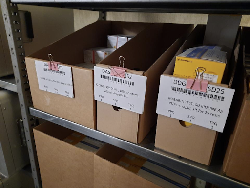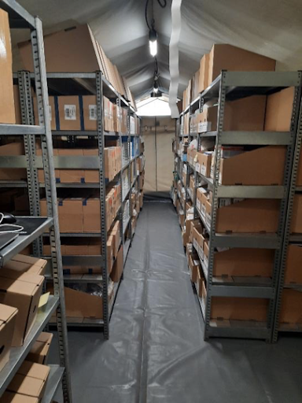

Note the scanning barcode requires good lighting conditions and that barcodes must not be placed to close together as at any time a single barcode must be visible in the barcode scanner viewer finder for that barcode to be promptly and correctly recognized by the software application.

#### Generating barcode labels for stock

Linear barcodes as well as QR codes are both equally recognized with the DHIS2-RTS mobile app. Linear barcodes have the advantage that they can be easily generated from a simple Excel spreadsheet but the disadvantage that they are quite long even for codes with only a few characters and the mobile device has to be held exactly horizontally during scanning (the red line in the barcode scanner window has to cover the entire barcode from left to right) in order for the barcode to be recognized.

Therefore the use of QR codes which require much less space, can be read from any angle and greater distances, is recommended which can be generated from numerous freely accessible website.

Barcode labels can be very simply printed from Excel on any computer provided that the "LibreBarcode39" font is installed:

- Close all Microsoft Excel files

- Copy the LibreBarcode39-Regular.ttf file to your computer

- In the Windows Explorer right-click on the file: a pop-up window opens

- Select "install": a pop-up window opens

- Select: "Yes": the font installs on the computer

- Open the Excel file for printing barcode labels: any copied Excel file with the font set to barcodes will now display barcodes

- Highlight any (additional) fields which should display barcodes

- Click in the drop-down window with the fonts

- Scroll down to the list of available fonts to the letter L which will appear as a barcode and display "Libre Barcode 39" when mousing over

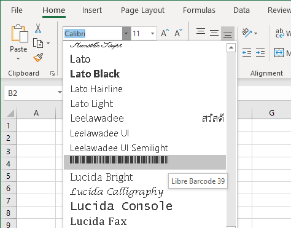

#### Stock receipts

The receipt of consignments should must be acknowledged to the medical distribution centre shipping them, ideally using a simple DHIS2 application. After receiving the respective (district) medical store has received this notification, the logistics team will upload the items and quantities indicated in the packing list to the respective Organisation unit (health facility) where those quantities will be automatically added to the "Stock on hand". Ideally, this process will be fully automatized by integrating the upstream national LMIS with the DHIS2 serve.

It is important that the mobile device at the health facility receiving consignments, synchronize their data after the stock receipt has been effected in order to update and display the correct Stock on hand on the mobile devices before picking any further orders.

In case of any discrepancies between the packing list and the physically received consignments, the logistic team should be contacted for either arranging delivery of the short-shipped items and quantities or correcting the records in national LMIS system. If excess stock was delivered, the logistics services can simply issue a packing list for the missing quantities which are again acknowledged with the IRIS "Goods Confirmation" application and will correct the record. Either way, the corrected stock receipt quantities will eventually be updated in the DHIS2 database.

#### Recording distributions

Storekeepers will usually receive a list of items and quantities required for each ward or service once a day, weekly or according to another established schedule.

The storekeeper will locate the first item on the list in the pharmacy, scan the barcode for selecting the correct item from the stock item list, and the picked quantity and then move on to pick the next item. This method is the fastest option and since a single row is displayed after scanning a barcode, the storekeeper cannot accidentally enter the value into the wrong row (for the wrong item). Alternatively, the storekeeper can scroll down the list until s/he finds the item or enter the required item in the search window.

Once all items in the required quantity have been picked, the storekeeper will confirm the transaction and deliver the goods to the requester before starting treatment of the next requisition.

Negative balances are deliberately blocked by the DHIS2-RTS mobile application to force storekeepers to effect corrections immediately since if delaying them would be allowed, stock discrepancies occurring by "postponed" corrections would inevitably accumulate. Therefore, if the remaining quantity on the shelf is greater than indicated as Stock on hand on the mobile device, the storekeeper can only pick the available quantity indicated in the mobile app. After completing the transaction, a stock correction needs to be made and then in a second transaction the now available quantities can be picked. Creating two separate transactions for the same ward or service will not make any difference for overall stock management and calculations. Alternatively, the storekeeper can interrupt the transaction but will lose all recorded data, then effect the stock transaction and start the initially intended transaction from scratch.

In case during the order picking mistakes were made, they cannot be corrected after confirming the transaction. If the recorded quantity is less than the actually picked quantity, the mistake can be simply corrected by effecting another transaction. If the recorded quantity is larger than picked (and needed) then either the "excess" quantity is delivered to the ward or service, kept aside to be included in the next distribution (without recording) or by creating a "Correction" transaction. However, if only a "Correction" transaction is effected, the full quantity recorded as shipped to the ward/service remains recorded in the system and these incorrect values cannot be corrected.

The "excess" quantity can also be given to another ward or service without recording. While the total stock on hand is thereby corrected, the statistics on distributions to each ward or service would again no longer be correct (and cannot be corrected).

#### Recording discarded stocks

Stock which is expired, damaged or unusable for other reasons must be removed from the stock and be stored in a locked cupboard or room which is dedicated only to stock waiting for disposable. In order to account for reduction of the stock on hand without allocating stocks as distribution to any specific ward or service, the storekeeper carries out a "Discard" transaction in the same way as for the "Distribution" transaction.

#### Recording stock corrections

Discrepancies between the physically available stock on hand on the shelf and the stock on hand balance calculated in the DHIS2-RTS mobile application may occur for various reasons.

- the quantities physically delivered to the health care facility are greater or less than in the electronic record (and not noted at the time of receipts)

- during order picking either greater or smaller quantities than indicated in the transaction are picked and delivered to wards and services (and not noted)

- stock is mislaid, misplaced in a wrong location, lost or stolen

In all of these cases, storekeepers must effect a "Correction" transaction in the DHIS2-RTS mobile application which will correct the calculated stock on hand. The number of "Correction" transactions and the quantities are a very good indicator for the overall quality of stock management.

In case "loans" are given to or received from other organizations or health care facilities options are not to create any transaction (as eventually the loan will be "repaid") or by effecting two stock corrections which cancel each other out.

#### Residual balance counting for stock on hand

As the stock on hand as well as the transaction quantities are instantly updated in the DHIS2-RTS mobile application, a complete and updated record of the current stock on hand is available in the system at any time and in principle no (monthly) physical stock counts are necessary. However, if stocks are never counted, discrepancies will only become apparent if and once negative stocks would occur during a transaction.

There are simple and fast ways for counting and checking the remaining stock on hand in certain situations which will allow detecting any discrepancies. This "residual batch counting" has the big advantage that the items with the largest number of stock transactions are counted more often and that discrepancies can, in principle, be detected immediately rather than only at the end of the month when it is often difficult to retrace the error.

Residual balance counting methods include:

- counting the remaining stock whenever a batch is depleted, and the next batch of an item is placed in the "active bin" (tertiary packaging is often provided in "round" quantities such as multiple of thousands with the quantities indicated on the tertiary packaging)

- just before opening any tertiary packaging, checking whether the remaining stock on hand is a "round" quantity (even without actually counting the entire remaining stock.

- physically counting the remaining stock on hand for small quantities of items which can be effected quickly

### Backup plan in case of system failure

Any digital systems can fail at any level: the mobile device at the health facility, the Internet connection can fail for prolonged periods and central servers and databases can fail.

In order to ensure continuity of services while at the same maintaining an accurate record of any transactions which could not be reported in DHIS2, a backup system needs to be in place from the beginning.

The simplest way is to continue or resume the use of stock cards for any transactions which cannot be reported in DHIS2.

For the "Advanced mode", the quantities distributed to each ward or service can be tallied up and entered with a single transaction for each ward or service once the system is restored. This will falsify the transaction dates but still maintain an accurate record of the total quantities distributed to each ward or service. In case of prolonged system failure, the "aggregate" Data entry form with a monthly reporting period can be used for documenting the stock on hand at the end of the month as well as the total quantities during the month. The details of these transactions will be permanently missing in the system but, after effecting a stock "Correction", use of the DHIS2-RTS mobile application can be resumed once all systems are restored.

## DHIS2 REAL-TIME STOCK INTEGRATION WITH NATIONAL eLMIS

As the integration of DHIS2 with an upstream, national eLMIS requires a detailed mapping of data and a dedicated project, this chapter can only provide an general outline of an integration.

The DHIS2-RTS concept is based on the assumption, that the DHIS2-RTS mobile application is used only for recording stock transactions and all forecasting, demand planning and calculation of stock replenishment orders are effected only by the national eLMIS.

Furthermore, that as soon as storekeepers at a health facility confirm receipt of consignments through a dedicated DHIS2 Event program, the respective items and quantities are synchronized with the DHIS2 server and recorded as stock receipt in the DHIS2 Tracker Program.

The integration of DHIS2 used (only) at the health facility level with a national eLMIS which is used for all logistics processes and workflows at all upstream (district, province and central) level together provide real-time and end-to-end visibility of all logistics data as well as a seamless, integrated end-to-end stock replenishment system.

The synchronization of facility level DHIS2 data with the central DHIS2 server is managed fully by native DHIS2 functionality. The integration of DHIS2 with the national eLMIS requires synchronization of data from the central DHIS2 server with the national eLMIS server as well as synchronization of (some) data from the national eLMIS server with the central DHIS2 server. As every DHIS2 entity features a unique ID, integration is best accomplished by using (only) these IDs rather than the actual field names appearing for users which are natively available from any DHIS2 instance through the Web API.

### Data synchronization from DHIS2 to national eLMIS from

The following data fields from the DHIS2 Tracker Program need to by synchronized with the national eLMIS server, ideally in real-time.

**Health facility data**

- Organisation unit name
- Item code (the item description is redundant and not needed)
- User names (for notifications)

**Transaction data**

- Current Stock on hand
- Stock "Distribution": quantities and date/time stamp, optional: "Deliver to"

- Optional: Stock "Discard": quantities and date/time stamp
- Optional: Stock "Correction": quantities and date/time stamp

**Stock receipts**

- Consignment: ID and date/time stamp, optional: user name

### Data synchronization from DHIS2 to national eLMIS from

The following data fields need to be synchronized from the national eLMIS to the central DHIS2 server, which in turn manages synchronization of the data with the respective mobile devices at health facilities.

**Consignment data**

- Organisation unit name
- Item code (the item description is redundant and not needed)
- Stock "Receipt": quantities and date/time stamp

Last edit: GMc on 17-01-2024 at 22:59
