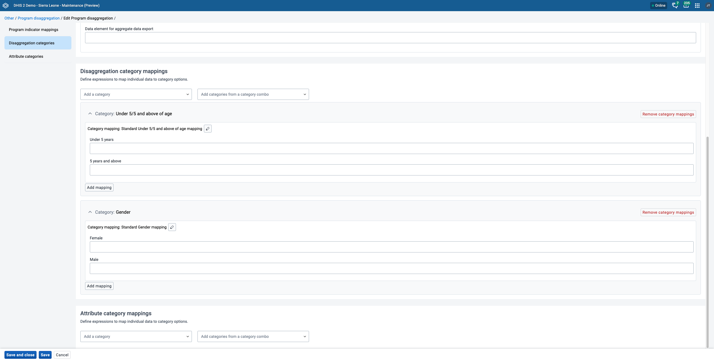

## The Concept

In version v42 there is now added the ability to assign Disaggregation Category Combinations to a Program Indicator and create a mapping between the program data and each category option contained in the combination. This creates a relationship between the tracker and aggregate data models which allows for analysing individual data in the same way and alongside aggregated data.

{ .center width=50% }
{ .center width=50% }

The Program Indicator Disaggregation mappings, defined at the Program level, provide a connection between the two data models within DHIS2. This ultimately allows a user to create disaggregated views of program data within the Data Visualizer using a single Program Indicator where previously one for each disaggregation was needed.

{ .center width=50% }

The following sections will illustrate how this new feature can be used.

## Setting up new Program disaggregation Mappings

1. Install or update the new Maintenance app (Preview)

    If the your instance does not already have the new version of the maintenance app installed go to the App Management App and search for Maintenance in the App Hub and install the app. If you already have it installed, then you should update the app to the latest version. Updates to this app are continuously released so it is good to make sure that you are using the most recent release.

    

2. Load the Program Disaggregation section of the Maintenance (Preview) App by selecting Program Disaggregations under the Other section or browsing to _yourinstanceurl_/apps/maintenance-preview#/programDisaggregations/

    

3. Select a Program from the drop down to enter the edit section and add Mappings to, for this example we will use the **Inpatient morbidity and mortality** program

4. This will load the Program Indicator Mapping and Categories definition screen

    

3. Select a Program Indicator from the drop down list, in this example we will use **BMI**

4. Under Disaggregation category combination Select **Gender and U5y** (you may need to create a new category combination containing the categories **Gender** and **Under 5/5 and above of age** if not present)

    

    Loading this category combination will display the Mapping selection drop down for each of the categories defined, as this is the first time these categories have been selected there are no mappings currently available.

7. Under the Disaggregation categories section you should see both of the categories from the combination added as suggestion. Click **Add category** for both both **Gender** and **U5y**

    

## Create the category mappings

8. In the text field under each Category enter an expression using the Program Data Elements and Attributes that defines the category. The expression uses the same syntax as the Filter section of the Program Indicator creation screen.  It is recommended to open a Program Indicator within the Program you are mapping, use the Filter screen to construct the expression and then copy it into this field. This allows you to use the inbuilt Expression validation of the Program Indicator filter builder. 

    
    

    This example is linking the value selected in the **Gender** data element in the Program to the category option. Since the Option set in this case is a text field the expression is set to match the text ‘Female’.      The next example for age shows a different way to define the relationship.

    

    To add the mapping for the Under 5 years and 5 years and above, since it is a numerical field you can use the operators > >= < <= == != to define the relationship

    

9. When mappings for all the category options click Save and exit

10. Open Data Visualizer, first let’s look at how these data were previously displayed. To do this create a visualisation to show the data of the 5 existing Program indicators with the built in disaggregations shown below.

    
    

12. Now remove the 4 Program Indicators with disaggregations specified and leave only the BMI Program Indicator.

    

14. You can now add **Gender** and **Under 5/5 and above of age** as disaggregation categories from the Your Dimensions column for the Program Indicator, click update and see the results.

    

    You can now compare the data from the two separate program indicators and the single program indicator that has been disaggregated.

# Transferring Program Indicator data via the Aggregate data exchange app

In addition to viewing a disaggregated Program Indicator in the Data Visualiser you can now transfer the Program Data, via the Disaggregated Program indicator, into a Data Element that shares the same Category Combination.

By adding the ID of a Data Element in the **Data element for aggregate data export** field and then setting up the aggregate data exchange app* to transfer data you can save Program data in the aggregate data model

