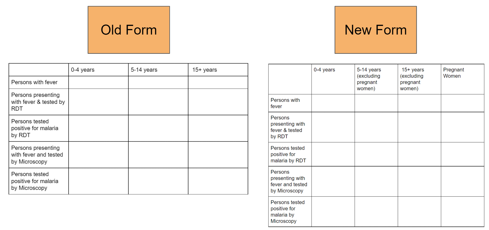
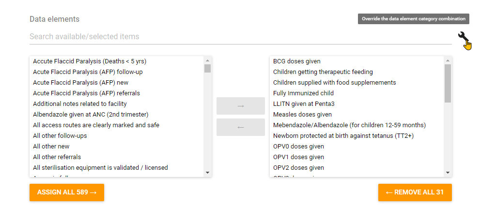

# Procedures for Managing Metadata
This sections discusses procedures and recommendations related to the long-term maintenance of metadata a DHIS2 implementation. It describes procedural challenges associated with co-ordinating long-term configuration processes and provides example standard operating procedures that can be adapted and used to better co-ordinate these processes.

## Overview
There are a number of technical tools and approaches to identify quality issues related to metadata that are discused within this guide. The focus of this section however is on the procedural issues that result in these metadata challenges occurring in the first place. By reviewing them and outlining measures to mitigate these challenges going forward; they can hopefully be avoided after a system has been reviewed and cleaned. Procedural issues that can result in complications when managing metadata include

- Lack of procedures for adding metadata or modifying the configuration
- Lack of coordination when adding new metadata
- Incorrect assumptions when adding WHO digital data packages
- Revisions of data collection tools over time

### Procedures for adding metadata or modifying the configuration

Procedures for adding metadata should be available for all DHIS2 implementations. You can view some example standard operating procedures for adding [aggregate metadata](https://docs.google.com/document/d/1VXnF5KPfiD45h6wH04kUNShQVno--TmckMHMyLqZm5I/edit?usp=sharing) and [users](https://docs.google.com/document/d/1pqEQVV5JR7tyo8Zd09vDi3RVQ9E9R782OYNl-w9-5zQ/edit?usp=sharing) respectively.

When implementing a standard operating procedure, training on each specific procedure should be considered. These procedures often go beyond the mechanics of customization/modification of metadata and require those that are adding or modifying the configuration to closely consider how objects are added to the system and the effect this has on the overall ease of use of the system. 

### Lack of coordination when adding new metadata

Beyond having specific procedures for adding metadata or modifying the configuration, these actions should be conducted in a co-ordinated manner. This co-ordination can be simple, such as internal discussions between team members, or complex, such as a committee who has an overview of all planned projects and can schedule modifications accordingly and will depend on the context of the implementation.

Lack of coordination can often lead to duplicate versions of metadata being created. As an example, if there are two admins adding the same new aggregate form within a system without informing each other, then a number of duplicate pieces of metadata will likely end up within the system.

In these scenarios, having a coordination mechanism outlined that informs those involved in configuring the DHIS 2 system what is happening can save significant time and effort later on as cleaning these duplicates can be a time consuming process.

### Incorrect assumptions when adding digital data packages

[WHO packages](https://dhis2.org/who/) may add a significant amount of duplicate metadata to a system. As an example, packages solely use indicators on their dashboard. These indicators may be duplicates of existing data elements. In addition, if items in an existing system populated with existing metadata are not matched before a WHO package is imported, then this may result in duplicate items (such as category options, option sets, etc.) being created during the import.

As a general rule, when importing a WHO package, try to re-use as much existing metadata as possible. This will likely involve editing the json file for the package prior to importing it so that IDs in the import file match existing IDs in the system you are importing to.

For the dashboards, the duplicate indicators may not be problematic, particularly if they are grouped together correctly. This should be judged on a case-by-case basis to determine their impact on the system prior to importing the package.

**Note : Importing packages should always be attempted in a development system first. Only when all issues have been sorted out should they be imported to a production system**

### Revisions of data collection tools over time

When data collection tools are updated over time, measures can be taken to re-use various objects rather then create a duplicate version of them.  

#### Programs

There should be no hesitation in reusing metadata between different event and tracker programs where possible. This metadata is always tied to the specific program that is being created and will maintain the required separation within the system.

#### Data Sets

For aggregate data sets, re-use of metadata may be less clear. A common problem is when disaggregations are modified from one form to the next. Let us take the example outlined in Figure 2.


**Figure 2**

From this form we can see that the disaggregations for each of the data elements have been changed. Rather then create new data elements in which to apply these new disaggregations to; you can use a function called "Category combination over ride." This feature allows a data element to be associated with multiple category combinations over time.

To override the category combination, open up your data set from maintenance. Where you add your data elements, you will see a small wrench icon. When you hover over it it will say “Over ride the data element category combination” (Figure 3).


**Figure 3**

From here you will open a menu which lists your data elements on the left side and allows you to over ride the category combinations on the right side (Figure 4)


**Figure 4**

Just select the category combination for the data element you want to over ride using this menu.

**Note : You may need to create new category options, categories and category combinations. If you do, please review the example [aggregate metadata procedure.](https://docs.google.com/document/d/1VXnF5KPfiD45h6wH04kUNShQVno--TmckMHMyLqZm5I/edit?usp=sharing)**

If, during this process, you also create a new data set, note that you should consider rationalizing your reporting rates if needed, as the new dataset you make would not have any of your previous reporting rates. If you want to maintain the reporting rates together, you can export/import them from the old data set to the new data set so you can review all of the legacy reporting rates with the new ones together if that is needed. ***You should test this process in a development instance***.

In order to retrieve the reporting rates, you can use the following query

```
api/completeDataSetRegistrations.json?dataSet=XA8e9AVn8Vo&startDate=2000-01-01&endDate=2017-07-01&orgUnit=mPlB2jqKNP0&children=true
```

Note that you should replacing the dataset ID with your own ID, the dates with your dates that you require and the organisation unit ID's with your own IDs.

Once you have the reporting rates, you can push them to the new data set using the following query

```
```
