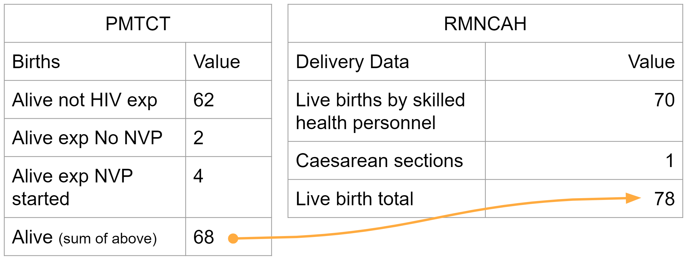
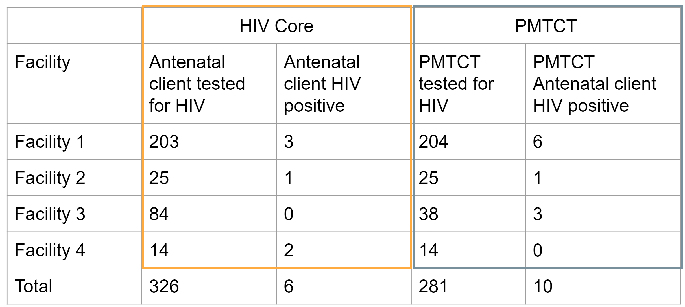
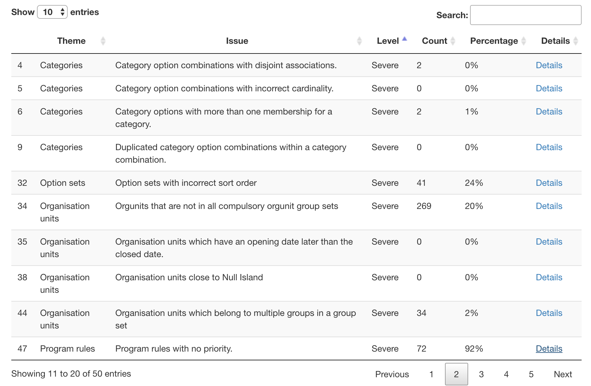
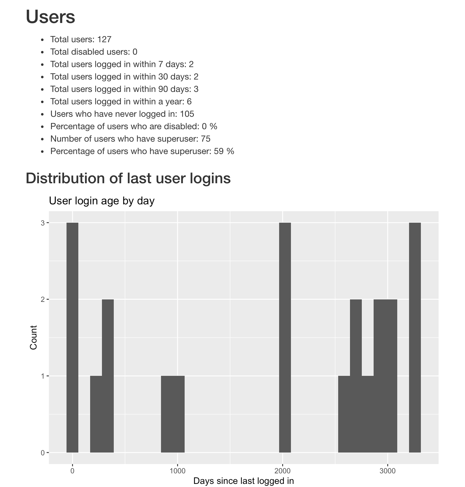
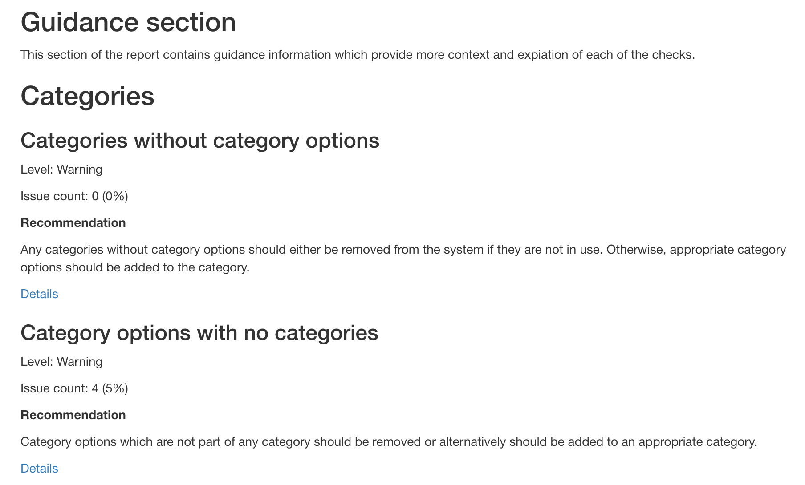

# Metadata integrity and quality

While metadata quality can be somewhat subjective, there are a number of key principles that can be objectively assessed and should be universally followed throughout DHIS2 implementations. In order to assess metadata quality, a metadata assessment can be performed. In this context, we can define metadata assessment as the review of the quality of a specific implementations configuration. While this is wide-ranging in scope, our goal is to break down the assessment process into manageable pieces that can be reviewed, prioritized and fixed over time. Regular metadata assessment and ongoing upkeep is an important part of long-term DHIS2 configuration and maintenance. While configuration tasks can often be performed quickly through a number of different mechanisms, without proper co-ordination there can be a number of challenges that a DHIS2 systems configuration can face over time. Some examples of the effects of these configuration challenges include:

- An inability to find the correct items when creating data outputs
- An inability to correctly disaggregate data when creating data outputs
- An inability to access the correct items when either entering data or creating data outputs
- Challenges with data quality (some examples: significant inaccuracies in long term trends of data and reporting rates, being able to store invalid data values, multiple variables representing the same concept storing different data values)
- Difficulty identifying the correct items to use when configuring data exchange mechanisms  
- Errors when upgrading DHIS2 versions
- Having an overwhelming amount of invalid metadata to manage

The purpose of this guide is to provide tools and procedures to identify problems with metadata. A separate guide on metadata maintenance is being developed that discusses configuration practices that can lead to metadata quality problems, and discusses how these can be avoided e.g. by avoiding to do configuration work in production systems and establishing SoPs for metadata modifications. Finally, a future section on Working with metadata will give guidance on how address metadata issues, such as removing objects that are no longer used.

Metadata maintenance and metadata assessment should be seen as related processes that feed into one another.

1. Reactive Process: As a result of configuration challenges, a DHIS2 system will need to be reviewed and cleaned accordingly.
2. Proactive Process: To prevent configuration challenges, processes can be put in place such that the DHIS2 configuration remains robust over time.


## Assessing metadata integrity and quality { #metadata_assessment_overview }

Reactive processes are about assessing metadata to identify potential challenges, and addressing these challenges. This can be a demanding process that needs to be properly planned, with time and resources dedicated to identify and resolve issues. While the planning and execution of a metadata assessment is discussed briefly [below](#metadata_assessment_planning), the focus in this guide is on the more practical and technical aspects of assessing metadata and addressing common issues.

This guide focuses primarily on two approaches to assessing metadata: 

1. through [manual review of metadata](#metadata_assessment_manual)
2. through a [metadata assessment tool](#metadata_assessment_tool) that can be connected directly to DHIS2 perform metadata checks

Both of these approaches are described below.

### Planning and performing a metadata assessment { #metadata_assessment_planning }

In order to perform the assessment, you may want to start by getting buy-in from a wide variety of stakeholders. In doing so, it may be useful to document the extent of the issues discussed within this guide by generating summary statistics on the problems that have been identified. This can be very useful to present to a large audience and can be used to support buy-in by providing brief explanations of the issues that have been identified. Within the **Metadata Assessment Reference Guide** you will find tools that will support you to both create quick summary counts of problems that you find in your own implementation as well as tools that generate more detailed reports on each specific item that requires attention. We recommend that the assessment includes the following components:

1. Define the scope of the assessment and sharing this with relevant stakeholders
2. Identifying the extent of the problems within an implementation through generating and documenting summary statistics of what has been found
3. Presenting these findings back to the group of stakeholders
4. Identifying the individual items that are problematic and coming up with strategies to mitigate or fix them as appropriate
5. Detailing and prioritizing the fixes
6. Implementing these fixes on development followed by production systems


## Manual review of metadata { #metadata_assessment_manual }

Use of the [metadata assessment tool](#metadata_assessment_tool) and the built-in [data integrity checks](#data_admin_data_integrity) is an efficient way of identifying many metadata problems in DHIS2, some review processes can not be automated. This includes the review of:

  - Naming Conventions
  - Indicator Formula
  - Duplicated metadata objects
  - Duplicated data sources
  - Dashboard item configuration
  - Program and dataset organisation unit assignment
  - Program and dataset sharing


### Documenting issues
Reviewing metadata to identify potential issues should always be done with a goal of addressing these issues. Fixes can sometimes be done immediately, but in many cases this is not possible. For example, it may be necessary to consult with different stakeholders to identify the appropriate data source or metadata definitions, or resolving the issues are technically complicated and require proper testing and review. It is therefore important to establish a mechanism for capturing the issues that are identified, so that they can be kept track of and a plan made to address them.


### Naming Conventions

For a full breakdown on the principles behind good naming conventions, please view this [resource](https://docs.dhis2.org/en/topics/metadata/dhis2-who-digital-health-data-toolkit/naming-conventions.html). Where possible, you should consider implementing these in the system(s) you are reviewing.

To update the names of your metadata in bulk, consider using the [DHIS2 metadata editor](https://workspace.google.com/marketplace/app/d2_metadata_review_tool/672531419470). This will allow you to edit all of your metadata in a google sheet and synchronize your information back to the server. You can view the full guide for the metadata editor [here](https://docs.google.com/document/d/1Y4u78llIOTb5gNPHLJks528kbz8czXH9O6yKMEaLFI0/edit?usp=sharing).

### Indicator Formula

A manual review of indicator formula may be needed in order to determine if the indicator formula are correct. The review of indicator formula, while potentially a configuration issue, has the potential to affect data quality and data outputs if incorrect assumptions are being made about the formula. Examples of issues you will want to check when reviewing indicator formula include:

1. Ensuring that the correct data elements are part of the numerator and denominator respectively by comparing the data elements with the numerator and denominator descriptions
2. Ensuring that the correct indicator type has been selected for the indicator being reviewed
3. Where possible, reviewing that the denominator is defined correctly (however; this may be more of a data quality issue and left for a more detailed data quality review exercise)

You can use the [DHIS2 metadata editor](https://workspace.google.com/marketplace/app/d2_metadata_review_tool/672531419470) to review some of the formulas if you are familiar with how this is set up, however a more traditional method of browsing indicators through the user interface can be done using the [WHO metadata browser app](https://apps.dhis2.org/app/af9a31fb-350c-4130-964b-3a413183aa54).

### Duplicate Data Sources

Duplicate data sources arise when you have multiple variables within a DHIS2 system reporting on the same concept. There are typically 3 types of duplicated data sources that you may see in DHIS2:

- Duplicate variables within the same data collection form
- Duplicate variables between different programs (usually on different forms)
- Duplicate variables within programs (either on the same or different forms)

#### Duplicate variables within the same data collection form

This occurs when one or more data elements is providing a total that is duplicated by one or more other data elements on the same form. As an example, we can review the forms available in Figure 1.


**Figure 1**

When this occurs, it is difficult to determine what is the correct value.

#### Duplicate variables between different programs

This occurs when you have two or more programs within an integrated system that are collecting the same information (Figure 2). In some cases programs can not agree on the value and this may need to be maintained as is. This will become problematic when trying to determine an agreed national value however as the values may be different between the different programs and this is not recommended to be maintained as is.


**Figure 2**

#### Duplicate variables within programs (either on the same or different forms)

This occurs when the same information is being collected within the same program (Figure 3). This can be problematic as there should be agreement between values when possible (and this may not be the case when this issue is found)


**Figure 3**

#### Resolving duplicate data sources

Similar to issues with defining denominators, this may need to be left for a more detailed data quality review. As these findings will often require form review/revision across various programs in order to rationalize these duplicate data sources, this issue will likely not be resolved through an immediate configuration change. It is important to identify these issues however and work with the programs to resolve them based on local procedures.

### Dashboard Item Configuration

There are two considerations to make when you are reviewing dashboard items:

1. Does the dashboard item need to be shared to be viewed by the user groups the dashboard is shared with
2. Does the dashboard item need relative organisation units or periods applied to it so it can be re-used/updated regularly

If it is the case where a dashboard item needs to show data for a fixed period or organisation unit, then there will be no need to apply any relativity to the item. If the item should be updated with new data routinely, or the users in which the dashboard is shared with do not have access to the fixed organisation units selected within the item, then these items should be reviewed and updated with correct relative period and organisation unit selections as appropriate.

### Program and data set organisation unit assignment

Check if the programs and data sets are assigned only to organisation units that are expected to report on them. For datasets this can cause problems with reporting rate completeness (the number of expected reports may be higher then it should be) and potentially data being entered where it should not be; while in the case of programs you could have tracked entities and/or events registered in organisation units they should not be.

<!--
#### Moving Aggregate Data


#### Moving Tracker Data
-->

### Program and data set sharing

Check if the metadata and data sharing settings have been applied correctly to both programs and data sets. In particular, if there are users or groups of users that can not perform operations on the programs or data sets that they should be able to, then these sharing settings may need to be modified.

A more detailed breakdown on the application of sharing settings to programs and data sets can be found in both the [documentation](https://docs.dhis2.org/en/use/user-guides/dhis-core-version-master/configuring-the-system/about-sharing-of-objects.html) as well as through a number of videos on [YouTube](https://www.youtube.com/playlist?list=PLo6Seh-066RwslDmyZkiKjejgMCKNaJTC).

### Category-related checks

#### Duplicate category options

Category options can and should be re-used across multiple categories to represent the same concept (e.g. an age group). In addition to reducing the clutter and potential confusing of having multiple options for the same concept, this facilities data analysis since data elements using the same category option can be presented together with the same disaggregation in visualisation tools.

If duplicate category options are identified and these are included in categories that are part of category combinations already associated with data, you should *not* attempt to de-duplicate these. However, if one of the category options have not yet been used, this could be removed and the other options used.

#### Category disaggregations

The category options in a data element category should in general add up to a meaningful total, as discussed in the [aggregate system design section](#categories-and-custom-dimensions). It is the total of the category that is displayed by default if looking at the value for a data element disaggregated by that data element. An example of this bad practice is to create a category for "Outpatients" with options "Cases" and "Deaths", which is applied to data elements for different diagnosis such as "Malaria". By default, a user looking at the "Malaria" data element will get the sum of "Malaria cases" and "Malaria deaths", which is a number that does not make sense.

There are certain cases where it may make sense to diverge from this general rule, in particular when the use of such a category can *substantially* reduce the number of data elements required. In these cases, the option to "Skip category total in reports" should be enabled for the category combination that category is part of.


## Using the metadata assessment tool { #metadata_assessment_tool }

While manual checks are necessary for a number of issues, a [metadata assessment tool](https://github.com/dhis2/metadata-assessment) has also been developed to automate a number of data quality checks. This includes the possibility of getting the summary results (number of violations) of the built-in [Data integrity checks](#data_admin_data_integrity). The metadata assessment tool is currently not integrated in DHIS2 itself, but is a standalone tool based on [R](https://www.r-project.org). This section will discuss how to interpret and use the output of the assessment tool, whilst how to download, install and run the tool is described on the [GitHub repository](https://github.com/dhis2/metadata-assessment) of the tool. A list with descriptions of the metadata checks included in the tool are described in the [Annex A](#metadata_assessment_tool_annex_a).

The metadata assessment tool is based primarily on DHIS2 SQL views: the tool imports a set of SQL views into the DHIS2 database being assessed (two for each data quality metric), and the accesses the outputs of those SQL views via the Web API and presents to the users. In addition, the tool presents certain outputs based directly on Web API queries (related to users), and can also show results of the built-in [Data integrity](#data_admin_data_integrity) checks.

> **Warning**
> The tool should not be used directly in production databases. While the only change the tool does to a database is to import SQL views, certain checks can be long-running and resource-intensive and may affect users interacting with the system. A parameter is available to diable slow queries.

### The report
The report itself is organised into four sections.

#### Summary table
The "Metadata Issues" summary table gives an overview of all the different metadata quality metrics, and allows sorting and filtering. This is useful to get a quick overview of the results (for example if there are any "critical" or "severe" issues), or if looking for specific issues (for example if there are any issues related to organisation units).



#### Users
The "Users" section provides key metrics related to users in the system. In addition to basic information about the total number of users and the number of users logging within a certain period, it also includes information that may be the basis to changes in user management practices:

* *Users who have never logged in*: large numbers of users account which have never been used indicate problems with the account invitation/creation process. If these accounts have been created with a default password, they may also pose a security issue.
* *Percentage of users that are disabled*: Taken together with the total number of users and the users who have logged in recently, this may give an indication of whether user accounts are disabled when users for different reasons no longer need or should have access to the system (e.g. because they leave their position).
* *Number/percentage of users that are superusers*: Only a handful of users should at most have superuser rights (the "ALL" authority).

In addition, two graphs showing the distribution over time of when users last logged in, and the distribution of users in the organisation unit hierarchy may be useful to understand if user assignment and management is handled correctly.



#### Guidance
The guidance section presents the same metrics as the summary table (and repeated in [Annex A](#metadata_assessment_tool_annex_a)), but together with an explanation and recommended action. It is organised into sections by topic.



### Interpreting the results
When interpreting the results of the report, it's important to keep in mind that not all the issues listed in the report are necessarily actual issues. The *Severity* of the different checks are important to keep in mind in this regards:

* *Info* indicates that the check is included primarily to provide useful contextual information, e.g. indicating the total number of a certain type of object.
* *Warning* apply to checks that either point to issues that may be problematic or indicate that the metadata is not well managed, but will generally not lead to problems with the functioning of the system.
* *Severe* issues can lead to serious problems, for example analytical outputs showing wrong numbers or no data at all.
* *Critical* issues are those that will almost certainly create various problems, for example potentially causing the analytic table generation process to fail.

While the different data quality metrics each include a recommendation on how the particular issue should be address, it generally does not go into the detail, technical steps that should be taken to fix the issue. It is not possible to give clear guidance for all issues, and the issues vary from the very basic (such as grouping data elements) to the very complex (for example duplicate category option combinations within a category combination). In general, it is recommended to solve the issues through the DHIS2 UI or the Web API as far as possible, as this provides some validation of the changes being made. Only as a last resort should issues be corrected in the database correctly. All but the most basic changes (such as grouping data elements) should be tested thoroughly in a non-production system.

A separate section in the implementation guide is in development that will provide more examples and guidance on addressing common metadata issues, such as batch edits, deleting data elements with data etc.

## ANNEX A - metadata assessment tool metrics { #metadata_assessment_tool_annex_a }

Updated 14.02.2022.
<!-- TODO: add "fixed" section on users? -->
<!-- Extracted from https://github.com/dhis2/metadata-assessment/tree/main/yaml -->

### Categories

#### Categories with no category options.
Categories should always have at least a single category option.

**Severity**: Warning

**Recommendation:** Any categories without category options should either be removed from the system if they are not in use. Otherwise, appropriate category options should be added to the category.

#### Additional default category option combos based on category option.
There should only be a single 'default' category option combination in the system. Having multiple default category option combinations may lead to irregularities in both data entry as well as analytical outputs.

**Severity**: Critical

**Recommendation:** All references to the additional default category option combination should be replaced with the desired default category option combination.

#### Category options with no categories.
All category options should belong to at least one category.

**Severity**: Warning

**Recommendation:** Category options which are not part of any category should be removed or alternatively should be added to an appropriate category.

#### Category option combinations with disjoint associations.
Under certain circumstances, category option combinations may exist in the system, but not have any direct association with category options which are associated with the category combinations. This situation usually occurs when category options have been added to a category and then the category is added to a category combination. New category option combinations are created in the system at this point. If any of the category options are then removed in one of the underlying categories, a so-called disjoint category option combination may result. This is a category option combination which has no direct association with any category options in any of the categories.

**Severity**: Severe

**Recommendation:** The disjoint category option combinations should be removed from the system if possible. However, if any data is associated with the category option combination, a determination will need to be made in regards of how to deal with this data.

#### Category option combinations with incorrect cardinality.
All category option combinations should have exactly the same number of category option associations as the number of categories in the category combination. If there are two categories in a category combination, then every category option combination should have exactly two category options.

**Severity**: Severe

**Recommendation:** Category option combinations which have an incorrect cardinality will be ignored by the DHIS2 analytics system and should be removed.

#### Category options with more than one membership for a category.
Nulla vitae feugiat blandit natoque placerat elementum pharetra senectus et aenean faucibus pellentesque. Quam, donec auctor in et mi penatibus penatibus. Mauris massa mauris sem vehicula eu hac fermentum odio mattis sed. Habitant convallis, pellentesque aenean, a nunc vitae non sapien eu suspendisse. Amet nisi sed quam hac.

**Severity**: Severe

**Recommendation:** Bibendum pellentesque nibh nisl vitae rutrum quis vestibulum feugiat porta et netus parturient mauris. Nec nascetur libero lacinia id vel mauris pulvinar at augue pharetra. Elementum urna eget mauris magnis proin. Risus sed sapien ante himenaeos. Hac vitae vestibulum vestibulum nulla vestibulum ut non consectetur vel lectus ultricies euismod. Suscipit sed sed orci.

#### Category combinations with no categories.
All category combinations should be associated with one or more categories.

**Severity**: Warning

**Recommendation:** Category combinations without categories are not usable by DHIS2. They should either be removed or the correct cateogries should be added to the category combo.

#### Category options combinations with no category combination.
All category option combinations should be associated with a category combo. In certain cases, when category combinations are deleted,the linkage between a category option combination and a category combination may become corrupted.

**Severity**: Warning

**Recommendation:** Check if any data is associated with the category combinations in question. Likely, the data should either be deleted or migrated to a valid category option combination. Any data which is associated with any of these category option combinations will not be available through either the data entry modules or any of the analytical apps.

#### Duplicated category option combinations within a category combination.
Within each category combination, a unique set of category option combinations should exist. In certain circumstances, duplicate category option combinations may exist in the system. This usually results from changes to category combinations after they have been created, or direct manipulation of the various category tables in the database. This may result in certain data element/category option combinations not appearing or being unavailable in the data entry screens and/or analytics apps.

**Severity**: Severe

**Recommendation:** Duplicated category option combinations within a category combination will require you to merge category option combinations together. This will require direct manipulation of the database, and should always be conducted first in a testing environment. Only after you have thoroughly tested your procedure, and have confidence that it works, should you perform the procedure on your production environment. The DHIS2 implementation team has created a series of SQL functions to help you remove these duplicated COCs from your system.

#### Categories with the same category options
Categories with the exact same category options should be considered to be merged. Categoriesw with the exact same category options may be easily confused by users in analysis.

**Severity**: Warning

**Recommendation:** If category combinations have already been created with duplicative categories,
it is recommended that you do not take any action, but rather ensure
that users understand that there may be two categories which are duplicative.

If one of the categories is not in use in any category combination, it should
consider to be removed from the system.


### Charts

#### Charts which have not been viewed in the past 12 months
Charts should be regularly viewed in the system. In many cases, users may create charts for temporary purposes and then never delete this. This can eventually lead to a lack of tidiness in the system. This can lead to charts being difficult to find in the visualization app.

**Severity**: Warning

**Recommendation:** Unused charts can be removed directly using the data visualization app by a user with sufficient authority. If charts are a part of any dashboard however, they will also need to be removed from the dashboard.


### Dashboards

#### Total number of dashboards in the system
Total number of dashboards in the system.
**Severity**: Info

**Recommendation:** DHIS2 should contain useful dashboards for users.
#### Dashboards with 1 or fewer views over the past three years
Dashboards that are not viewed by users can indicate limited data use, that  the dashboards have not been designed with an intention of reuse (for example as part of a training exersice or one-off data analysis), or that the user owning the dashboard is not longer active.

**Severity**: Warning

**Recommendation:** If the dashboards are relevant and useful but not view, efforts should be made  to increase data use (e.g. review sharing settings, communicate with users,  plan training exercises etc). In other cases, users with superuser permission  should be able to delete dashboards by looking up the name or in batches. You should also confirm that the dashboard is not in use by any push analysis before removing it from the system.

#### Dashboards not viewed in the past one year.
Dashboards that are not viewed by users can indicate limited data use, that  the dashboards have not been designed with an intention of reuse (for example as part of a training exersice or one-off data analysis), or that the user owning the dashboard is not longer active.

**Severity**: Warning

**Recommendation:** If the dashboards are relevant and useful but not view, efforts should be made  to increase data use (e.g. review sharing settings, communicate with users,  plan training exercises etc). In other cases, users with superuser permission  should be able to delete dashboards by looking up the name or in batches. You should also confirm that the dashboard is not in use by any push analysis before removing it from the system.

#### Total number of dashboards with no items.
All dashboards should have content on them. Dashboards without any content do not  serve any purpose, and can make it more difficult to find relevant dashboard with content.

**Severity**: Info

**Recommendation:** Dashboards without content that have not been modified in the last e.g. 14 days should be considered for deletion.


### Data elements (aggregate)

#### Total count of aggregate data elements
Overview of the number of aggregate data elements in the system.
**Severity**: Info

**Recommendation:** DHIS2 should contain useful data elements for users.
#### Aggregate data elements not used in any favourites (directly or through indicators)
All aggregatge data elements that are captured in DHIS2 should be used to produce some  type of analysis output (charts, maps, tables). This can be by using them directly in an output, or by having them contribute to an indicator calculation that is used an output.

**Severity**: Warning

**Recommendation:** Data elements that are not routinely being reviewed in analysis, either directly or indirectly through indicators, should be reviewed to determine if they still need to be collected. If these are meant to be used in routine review, then associated outputs should be created using them. If these data elements are not going to be used for any type of information review, consideration should be made to either archive them or delete them.

#### Aggregate data elements assigned to 1 or less orgunit (through data sets).
Data elements which are part of an aggregate dataset should be assigned to at least one organisation unit.

**Severity**: Warning

**Recommendation:** If the dataset is active, then review the organisation unit assignments. If the dataset is not active, then the dataset and its associated data elements should be removed from the system.

#### Aggregate data elements not in any data element groups.
All data elements should be in a data element group. This allows users to find the data elements more easily in analysis
 apps and also contributes to having more complete data element group sets.
 Maintenance operations can also be made more efficient by applying
 bulk settings (ex. sharing) to all data elements within a data element group.

**Severity**: Warning

**Recommendation:** Data elements that are not in a data element group should be added to a relevant data element group. If the data elements are not needed, they should be deleted.

#### Aggregate data elements that have not been changed in last 100 days and do not have any data values.
"Abandoned" data elements. These are data elements that have not been modified in at least 100 days and do not have any data values associated with them. Often, these are the result of new or changed configurations that have been abandonded at some point.

**Severity**: Warning

**Recommendation:** Data elements that have no data associated with them and which there are no plans to start using for data collection should be deleted.

#### Aggregate data elements with NO data values.
Data elements should generally always be associated with data values. If data elements exist in a data set which is active, but there are no data values associated with them, they may not be part of the data entry screens.

**Severity**: Warning

**Recommendation:** Consider removing data elements with no data values.

#### Aggregate data elements with no data values in the last 3 periods (based on data set period type).
Data elements with no recent data values are likely to fall into one of two categories: 1) they have been used previously and hold useful/relevant data, 2) they have not been used in any meaningful way (e.g. data values stem from testing during configuration or a small pilot) and the data is not useful/relevant.

**Severity**: Warning

**Recommendation:** If the data elements hold useful historical data, they should be kept. Consider renaming the data elements and/or data sets to make it clear they are not used for data collection any more. Data elements which are not actively used and have no valueable data associated. 


### Data elements (tracker)

#### Total count of tracker data elements
Overview of the number of tracker data elements in the system.
**Severity**: Info

**Recommendation:** DHIS2 should contain useful data elements for users.
#### Tracker data elements not in any data element groups.
All data elements should be in a data element group. This allows users to find the data elements more easily in analysis
 apps and also contributes to having more complete data element group sets.
 Maintenance operations can also be made more efficient by applying
 bulk settings (ex. sharing) to all data elements within a data element group.

**Severity**: Warning

**Recommendation:** Data elements that are not in a data element group should be added to a relevant data element group. If the data elements are not needed, they should be deleted.


### Datasets

#### Total number of data sets.
Total number of datasets in the system.
**Severity**: Info

**Recommendation:** DHIS2 should contain datasets which are useful for data entry.
#### Data sets that have not been changed in last 100 days and are assigned to 1 or less orgunits.
Datasets should generally be assigned to multiple organisation units if they are used, or be modified recently (e.g. last 100 days) if they are under development. Unused  datasets represent unnecessary clutter in the database and may confuse users and  administrators. The exception is data sets which are associated with historical data,  for example reporting forms from previous years which are no longer used, and datasets that is designed to be used in only on organisation unit (e.g. at national level).

**Severity**: Warning

**Recommendation:** Datasets which are not activly used or in development should be removed from the  system to decrease system clutter and metadata size. Before removing the data sets, verify that the data set is not associated with historical data and kept for that reason.

#### Data sets with no data values in the last 3 periods (based on data set period type).
Data sets with no recent data values associated with them are likely to fall into one of two categories: 1) they have been used previously and hold useful/relevant data, 2) they have not been used in any meaningful way (e.g. data values stem from testing during configuration or a small pilot) and the data is not useful/relevant.

**Severity**: Warning

**Recommendation:** If the data elements hold useful historical data, they should be kept. Consider renaming the data elements and/or data sets to make it clear they are not used for data collection any more. Data elements which are not actively used and have no valueable data associated

#### Data set sections with incorrect sort order
Dataset sections are used to group certain related sections in a section data entry form. They can also be ordered. The order of the sections may become corrupted if sections are added or deleted.

**Severity**: Warning

**Recommendation:** It is possible to fix the sort order of data set sections by using the `fixSortOrder` SQL function which is available in the dhis2-utils Github repository (https://github.com/dhis2/dhis2-utils/tree/master/resources/sql). Using this script you can fix the sort order for each affected data set section.


### General

#### Names of identifiable objects which have leading spaces.
Identifiable objects with names should not contain leading spaces.

**Severity**: Warning

**Recommendation:** These objects may be able to be corrected through the user interface of DHIS2. Alternatively, they can be corrected directly in the database using SQL. You can use the following SQL as a pattern to help you create the exact query which you need:

```
UPDATE chart as a  SET name = b.name_new from ( SELECT chartid,REGEXP_REPLACE(name,'^\s+','') as
name_new from chart where name ~ '^\s+') b where a.chartid = b.chartid;
```

#### Names of identifiable objects which have trailing spaces.
Identifiable objects with names should not contain trailing spaces.

**Severity**: Warning

**Recommendation:** These objects may be able to be corrected through the user interface of DHIS2. Alternatively, they can be corrected directly in the database using SQL. You can use the following SQL as a pattern to help you create the exact query which you need: 

```
UPDATE chart as a  SET name = b.name_new from ( SELECT chartid,REGEXP_REPLACE(name,'\s+$','') as name_new from chart where name ~ '\s+$') b where a.chartid = b.chartid;
```

#### Names of identifiable objects which have multiple spaces.
Identifiable objects with names should not contain leading spaces.

**Severity**: Warning

**Recommendation:** These objects may be able to be corrected through the user interface of DHIS2. Alternatively,
they can be corrected directly in the database using SQL. You can use the following SQL as a
pattern to help you create the exact query which you need:

```
UPDATE categorycombo as a  SET name = b.name_new from ( SELECT categorycomboid,REGEXP_REPLACE(name,'\s{2,}',' ') as
name_new from categorycombo where name ~ '\s{2,}') b where a.categorycomboid = b.categorycomboid;
```


### Indicators

#### Total count of indicators.
Overview of the number of indicators in the system.
**Severity**: Info

**Recommendation:** DHIS2 should contain useful indicators for users.
#### Indicators not in any groups.
All indicators should be in an indicator group. This allows users to find the indicators  more easily in analysis apps and also contributes to having more complete indicators group sets. Maintenance operations can also be made more efficient by applying bulk settings (ex. sharing, filtering) to all indicators within an indicator group.

**Severity**: Warning

**Recommendation:** Indicators that are not in a indicator group should be added to a relevant indicator group. If the indicators are not needed, they should be deleted.

#### Indicators not used in analytical objects OR data sets.
All indicators that are calculated should be used to produce some type of analysis  output (charts, maps, tables), alternatively to provide feedback during data entry by being part of a data set.

**Severity**: Warning

**Recommendation:** Indicators that are not routinely being reviewed in analysis, either in an output or  data set, should be reviewed to determine if they still need to be calculated. If these are meant to be used for routine review, then associated outputs should be  created using them. If these indicators are not going to be used for any type of information review, consideration should be made to either archive them or delete them.

#### Indicators not used in analytical objects.
Indicators should be used to produce some type of analysis output (charts, maps, tables). Note: indicators used in datasets to provide feedback during data entry are not counted as being used in analytical objects.

**Severity**: Warning

**Recommendation:** Indicators that are not routinely being reviewed in analysis should be reviewed to determine if they are useful and needed. If these are meant to be used for routine  review, then associated outputs should be created using them. If these indicators are not going to be used for any type of information review, and are not used in data sets for feedback during data entry, consideration should be made to either delete them.


### Option sets

#### Ununsed option sets.
Option sets should be used for some purpose either with attributes, data elements, or comments.

**Severity**: Warning

**Recommendation:** Consider deleting unused option sets, or alternatively, ensure that they have been properly assigned.

#### Empty option sets
All option sets should generally include at least two items. Empty option sets serve no purpose.

**Severity**: Warning

**Recommendation:** Options should either be added to the option set, or the option set should be deleted.

#### Option sets with possibly wrong sort order.
Option sets contain options which can be ordered. The sort_order property should always start with 1 and have a sequential sequence. If there are three options in the option set, then the sort order should be 1,2,3. In certain circumstances, options may be deleted from an option set, and the sort order may become corrupted. This may lead to a situation where it becomes impossible to update the option set from the maintenance app, and may lead to problems when attempting to using the option set in the data entry app.

**Severity**: Severe

**Recommendation:** If it is possible to open the option set in the maintenance app, you can resort the option set, which should correct the problem. Another possible solution is to directly update the sort_order property of in the `optionset` table in the database, ensuring that a valid sequence is present for all options in the option set.


### Organisation units

#### Orgunits that are not in all compulsory orgunit group sets
Any organisation unit groups which have been marked as compulsory should contain all organization units in the system. If certain organization units are omitted from the groups in the group set, this may cause irregularities in analytical outputs, such as data being omitted.

**Severity**: Severe

**Recommendation:** Add all organization units to exactly one group within a compulsory organization unit group.

#### Organisation units which have an opening date later than the closed date.
If a closing date has been defined for an organisation unit, it should always be after the opening date (if one has been defined).

**Severity**: Severe

**Recommendation:** Alter either the opening or closing date of all affected organisation units so that the closing date is after the opening date.

#### Organisation units should not have trailing spaces.
Trailing spaces in organisation units are superfluous.

**Severity**: Warning

**Recommendation:** If the number of affected organisation units is small, the easiest remedy is to correct them directly from the user interface. Another possible option would be to replace all of the multiple spaces using SQL.

#### Organisation units with point coordinates should be contained by their parent.
Facilities are often represented as points in the DHIS2 hierarchy. Their parent organisation units geometry should contain all facilities which have been associated with them.

**Severity**: Warning

**Recommendation:** Often boundary files are simplified when they are uploaded into DHIS2. This process may result in
facilities which are located close to the border of a given district to fall outside of the district
when the boundary is simplified. This is considered to be more of a cosmetic problem for most DHIS2
installations, but could become an issue if any geospatial analysis is attempted using the
boundaries and point coordinates.

In cases where the facility falls outside of its parent's boundary
you should confirm that the coordinates are correct. If the location is close to the boundary, you
may want to reconsider how the boundary files have been simplified. Otherwise, if the location of
the facility is completely incorrect, it should be rectified.

#### Organisation units located within 100 km of Null Island (0,0).
A common problem when importing coordinates is the inclusion of coordinates situated around the point of [Null Island](https://en.wikipedia.org/wiki/Null_Island). This is the point on the earths surface where the Prime Meridian and Equator intersect with a latitude of 0 and a longitude of zero. The point also happens to be situated currently in the middle of the ocean. This query identifies any points located within 100 km of the point having latitude and longitude equal to zero.

**Severity**: Severe

**Recommendation:** Update the coordinates of the affected organization unit to the correct location.
#### Organisation units should not have multiple spaces in their names.
Names of organisation units should not contain multiple spaces. They are superfluous and may complicate the location of organisation units when they are searched.

**Severity**: Warning

**Recommendation:** If the number of affected organisation units is small, the easiest remedy is to correct them directly from the user interface. Another possible option would be to replace all of the multiple spaces using SQL.

#### Organisation units with invalid geometry.
DHIS2 uses the PostGIS database extenstion to manage the geographical information associated with organsiation units. There are various reasons why geometries may be considered to be invalid including self-inclusions, self-intersections, and sliver polygons. Please see the PostGIS documentation for a more in-depth discussion on this topic.

**Severity**: Critical

**Recommendation:** Update the geometry of the affected organisation units to a valid geometry. It may be possible to use the PostGIS function `ST_MakeValid` to automatically fix the problem. However, in other cases the geometry may need to be edited in a GIS tool, and then updated again in DHIS2.

#### The organisation unit hierarchy should have a single root.
Every DHIS2 system should have a single root organisation unit. This means a single organisation unit from which all other branches of the hierarchy are descendants.

**Severity**: Critical

**Recommendation:** Once you have decided which organisation unit should be the real root of the organisation unit hierarchy, you should update the parent organisation unit. This can be done by using the DHIS2 API or my updating the value directly in the `organisationunit` table.

#### Organisation units with no coordinates.
Ideally, all organisation units contained in the DHIS2 hierarchy should have a valid
set of coordinates. Usually for all organisation units above the facility level, 
these coordinates should be a polygon which provides the boundary of the organisation
unit. For facilities, these are usually represented as  point coordinates.

There can obviously be exceptions to this rule. Mobile health facilities may not have
a fixed location. Community health workers or wards below the facility level
may also not have a defined or definable coordinate. 

This check is intended to allow you to review all organisation units which do
not have any coordinates and make a determination as to whether they should be updated.

**Severity**: Warning

**Recommendation:** Where appropriate, update the geometry of each organisation unit with a valid geometry. You may need to contact the appropriate local government office to obtain a copy
of district boundaries, commonly referred to as "shape files". Another possibility
is to use freely available boundary files from GADM (https://gadm.org)

If facilities are missing coordinates, it may be possible to obtain these from 
the facility staff using their smart phone to get the coordinates. Images
from Google Maps can also often be used to estimate the position of a facility,
assuming that you have good enough resolution and local knowledge of where 
it is located. 

#### Orphaned organisation units.
Orphaned organisation units are those which have neither parents nor any children. This means that they have no relationship to the main organisation unit hierarchy. These may be created by faulty metadata imports or direct manipulation of the database.

**Severity**: Critical

**Recommendation:** The orphaned organisation units should be assigned a parent or removed from the system. It is recommended to use the DHIS2 API for this task if possible. If this is not possible, then they may need to be removed through direct SQL on the DHIS2 database.

#### Organisation units which belong to multiple groups in a group set.
Organisation units should belong to exactly one group within each organisation unit group set of which they are a member. If the organisation unit belongs to multiple groups, this will lead to unpredictable results in analysis.

**Severity**: Severe

**Recommendation:** Using the maintenance app, assign the organisation units in the details list to exactly one group within each group set membership.


### Periods

#### Periods with the same start and end dates
Different periods should not have exactly the same start and end date.

**Severity**: Critical

**Recommendation:** All references to the duplicate periods should be removed from the system and reassigned. It is recommended to use the period with the lower periodid.

#### Periods which are more than three years in the future.
Periods in DHIS2 are automatically generated by the system. As new data is entered
into the system, new periods are automatically created. In some cases, periods
may mistakenly be created when data is sent to DHIS2 for periods which are in the
far future. Different data entry clients may not properly validate for periods
which are in the future, and thus any periods in the future should be reviewed.
In some cases, data may be valid for future dates, e.g. targets which are set for the
next fiscal year.

**Severity**: Warning

**Recommendation:** If any periods exist in the system in the future, you should review the raw data
either directly in the datavalue table, or alternatively though the pivot tables
to ensure that this data is correct.

In many cases, clients may mean to transmit
data for January 2021, but due to data entry errors, January 2031 is selected. Thus,
any data in the far future should be investigated to ensure it does not result
from data entry errors.

#### Periods which are in the distant past.
Periods in DHIS2 are automatically generated by the system. As new data is entered
into the system, new periods are automatically created. In some cases, periods
may mistakenly be created when data is sent to DHIS2 for periods which are in the
distant past. Different data entry clients may not properly validate for periods
which are in the distant past, and thus these periods should be triaged to ensure
that data has not been entered against them by mistake.

**Severity**: Warning

**Recommendation:** If any periods exist in the system in the distant past, you should review the raw data
either directly in the datavalue table, or alternatively though the pivot tables
to ensure that this data is correct.

In many cases, clients may mean to transmit
data for January 2021, but due to data entry errors, January 2031 is selected. Thus,
any data in the far future should be investigated to ensure it does not result
from data entry errors.


### Program rules

#### Program rules with no action.
All program rules should have an action.

**Severity**: Severe

**Recommendation:** Using the DHIS2 user interface, assign an action to each of the program rules which is missing one. Alternatively, if the program rule is not in use, then consider removing it.

#### Program rules with no priority.
All program rules should be assigned a priority.

**Severity**: Severe

**Recommendation:** Using the DHIS2 user interface, assign a priority to each of the program rules which is missing one.

#### Program rules actions which should send or schedule a message without a message template.
Program rule actions of type "Send message" or "Schedule message" should have an associated message template.

**Severity**: Severe

**Recommendation:** Using the DHIS2 user interface, assign a message template to each of the program rule actions which send or schedule messages but which does not have an association with a message template.


### Users

#### Number of users in the system
The total number of users in the system.

**Severity**: Info

**Recommendation:** Information only.

#### Users who have not logged in during the past 30 days
All users should log in routinely, either to enter data, or to view analyses. This metric measures the number of users who are enabled, but have not logged in during the past 30 days.

**Severity**: Warning

**Recommendation:** Lorem ipsum dolor sit amet, habitasse purus, praesent pretium orci mauris a velit feugiat. Malesuada et rutrum, ullamcorper in ut in potenti.

#### Users who have not logged in over the past year
Only users who routinely access the system should have active user accounts. Users who have not logged in the last year may not use or need access to the system, they may have left their position and should, or the account may be the result of an invitation to register an account that has not been used.

**Severity**: Warning

**Recommendation:** User accounts that are not associated with real, active users should as a minimum be disabled, alternatively deleted.


### Validation rules

#### All validation rule expressions should have a missing value strategy.
Validation rules are composed of a left and right side expression. In certain systems the missing value strategy may not be defined. This may lead to an exception during validation rule analysis. The affected validation rules should be corrected to with an appropriate missing value strategy.

**Severity**: Severe

**Recommendation:** Using the results of the the details SQL view, identify the affected validation rules and which side of the rule the missing value strategy has not been specified. Using the mainteance app, make the appropriate corrections and save the rule.


