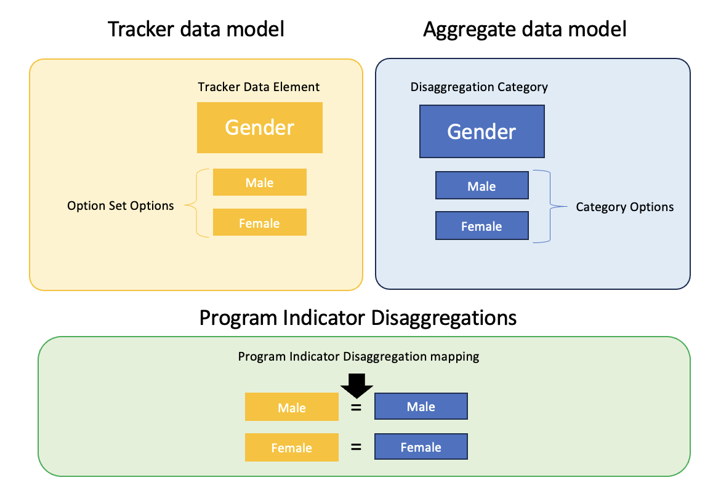
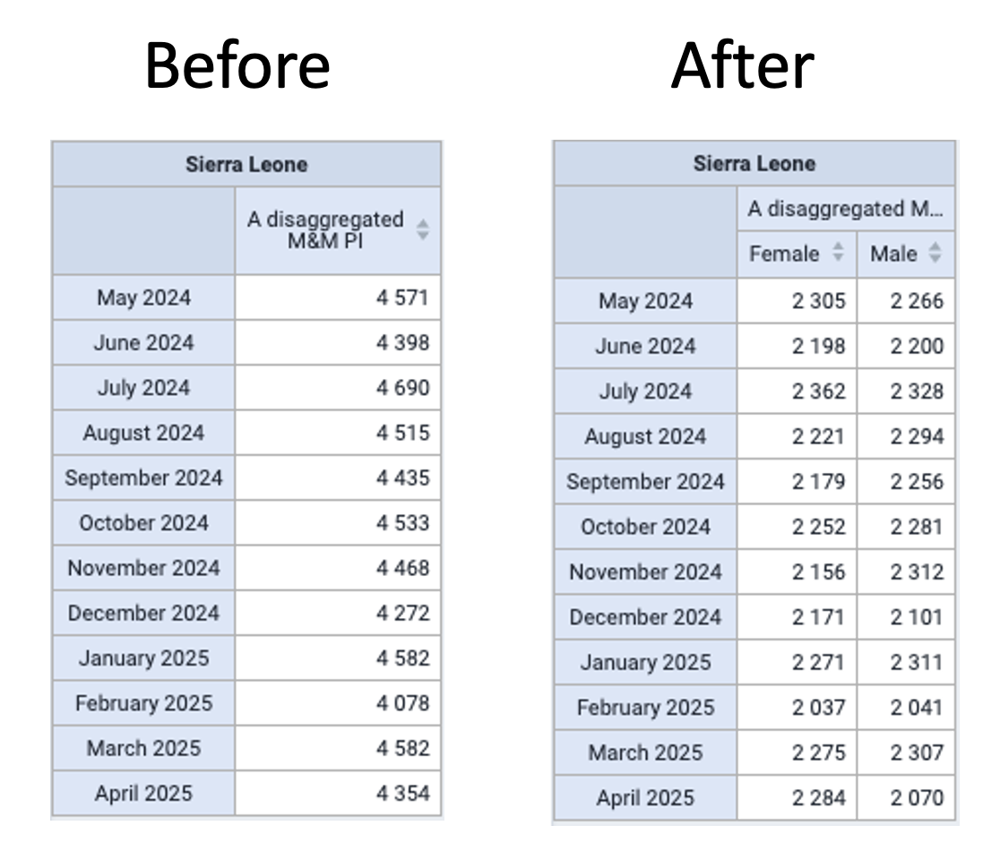

## The Concept

In DHIS2 v42 there is now added the ability to assign Disaggregation Category Combinations to a Program Indicator and create a mapping between the program data and each category option contained in the combination. This creates a relationship between the tracker and aggregate data models which allows for analysing individual data in the same way and alongside aggregated data.

{ .center width=30% }
{ .center width=30% }

The Program Indicator Disaggregation mappings, defined at the Program level, provide a connection between the two data models within DHIS2. This ultimately allows a user to create disaggregated views of program data within the Data Visualizer using a single Program Indicator where previously one for each disaggregation was needed.

{ .center width=30% }

How to configure program indicator disaggregation can be viewed in the [user guide](#program_disaggregation_mapping)

