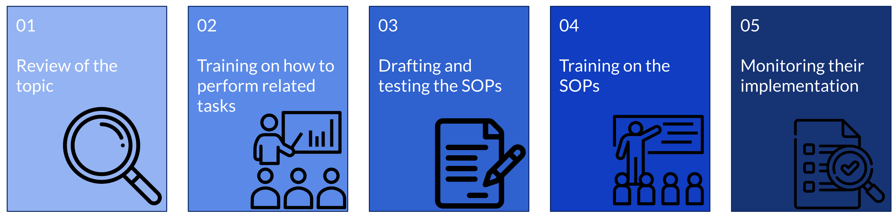

# Standard Operating Procedures (SOPs)

When discussing SOPs, we must differentiate them from other resources such as learning and instructional material. SOPs outline specific procedures and activities to complete a task based on internally defined best practices. They can reference additional resources that describe step-by-step tasks to carry out a specific component within the SOP, but the SOP itself ***should not only contain this information***. SOPs should instead describe what the procedure is for, any specific steps required to implement and monitor the procedure along with the specific roles and responsibilities of different stakeholders involved in the procedure being outlined.

We can do a quick comparison of describing an SOP vs training material with ***users*** as our example in order to highlight this difference, as these terms should not be used interchangeably.

| Training Material 	| SOPs 	|
|---	|---	|
| Describes the step-by-step process of creating a user in DHIS2: <ul> <li>What app to access</li> <li>Where to click within DHIS2 to create a new user</li><li>What each of the fields in the users app means</li><li>How to add user roles to a user</li><li>How to assign organisation units to a user</li><li>How to assign a user to user groups</li><li>What each of the fields in the users app means</li><li>Mandatory fields to fill in</li><li>Etc.</li></ul>  	| Describe the process to manage and administer users as well as deal with requests for new users <ul><li>How are new users requested</li><li>Who is allowed to create a new user</li><li>What are the users roles and groups in the system</li><li>How are these roles and groups used to build a new user based on their function in the system</li><li>How is organisation unit access determined</li><li>How is metadata and data access determined</li><li>How are account details created (naming conventions, passwords, etc.) and shared</li></ul>	||

## Creating and Implementing and SOPs

> **Important**
>
> SOPs are considered ***complementary*** to training material in that they describes the **mechanics** of how to perform a specific task. 
> 
> They need to work together with training material in order to be implemented effectively.

 To effectively create and implement an SOP, several steps are recommended.

1. Review of the topic
2. Training on how to perform related tasks
3. Drafting and testing the SOPs
4. Training on the SOPs
5. Monitoring their implementation

### Review of the topic

In order to make an SOP about a specific topic area, you need to understand the topic yourself. This includes the general steps involved in conducting the tasks you are outlining, how these tasks work in the field and best practices that may improve your workflow.

Example : if ***you*** don’t know how to review outliers; how will you make a procedure about it!?

### Training on how to perform related tasks

Before you can implement an SOP, the individuals responsible for implementing it must be aware of how to perform all the tasks that are identified.

Example: if ***they*** don’t know about outliers and how to interpret them; how will they follow a procedure to review them!?

### Drafting and testing the SOPs

Take input from relevant stakeholders on the current workflow you are outlining, review of best practices available within the broader DHIS2 community and from your local context and the specific skills you are focusing on and draft the SOP. Test the SOPs internally and see if they actually makes any sense; chances are you will have to revise them based on your initial observations.

### Training on the SOPs

Training on the SOP is not the same as training on the task! We should not assume that users who know the skills associated with something specific in DHIS2 will follow a set procedure related to maintaining it over the long term. It is useful to discuss specific details and ensure people are aware of their role within the SOP, and clarify what the consequences of not following the SOPs are within your system. 

For example, if you decide not to apply the correct sharing to certain users in your system, they could access data they shouldn't (or conversely, they will not be able to access data they should be able to!). 

As another example, if you allow everyone to make metadata their own way, this can result in duplication, issues when trying to find items for analysis, and over the long term even require an activity to reconfigure incorrect parts of the systems, which is both time consuming and costly. 

Make people aware of these challenges by training individuals to follow the SOP as written and informing them of potential challenges when they are not followed correctly.

### Monitoring their implementation

After you perform the training, not everything will go to plan. You should follow up with the individuals involved in the process to support them and determine if there are other ways to check if SOPs are being implemented smoothly. 

## Example SOPs

A number of example SOPs are available for your review to download and modify as necessary. 

- [DHIS2 Instance Upgrade Guide - Upgrading your DHIS2 instance to a new verison of DHIS2](https://docs.google.com/document/d/1djCVvwkLsUTXXg0vepBW_7fEddTkGCeweltB1h87WiQ/edit?usp=sharing)
  - [Example Checklist for testing the DHIS2 Upgrade](https://docs.google.com/spreadsheets/d/1Vsrptt_1aKjzadFPAGHsyreLjqi5f18v/edit?usp=sharing&ouid=104677221247573000314&rtpof=true&sd=true)
- [Aggregate Categories, Data Elements, Data Sets](https://docs.google.com/document/d/1VXnF5KPfiD45h6wH04kUNShQVno--TmckMHMyLqZm5I/edit?usp=sharing)
- [Users](https://docs.google.com/document/d/1u0knsIH-HX7Hs3GM53gJH7EcRjyyM-Lo/edit?usp=sharing&ouid=104677221247573000314&rtpof=true&sd=true)
- [Installing the Android App and Find My Device Via Google Play](https://docs.google.com/document/d/1otUPnQnuSTwLlPnbGa2weBBwCMk8Li4ClMiF2342otI/edit?usp=sharing)
