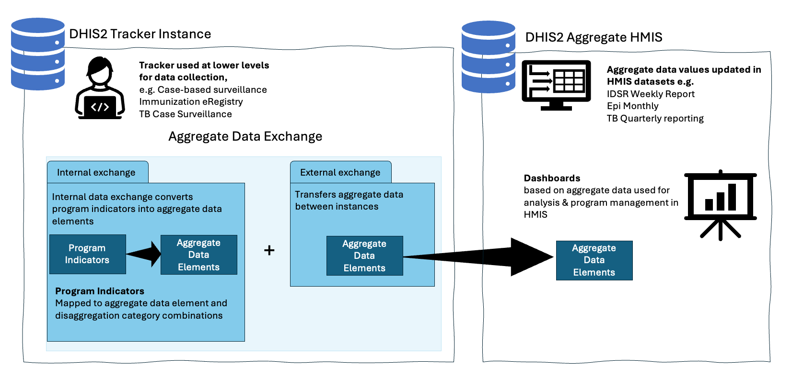
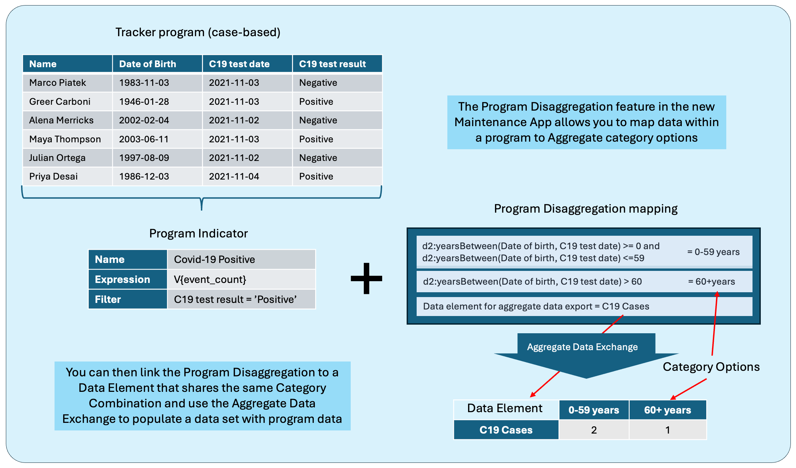
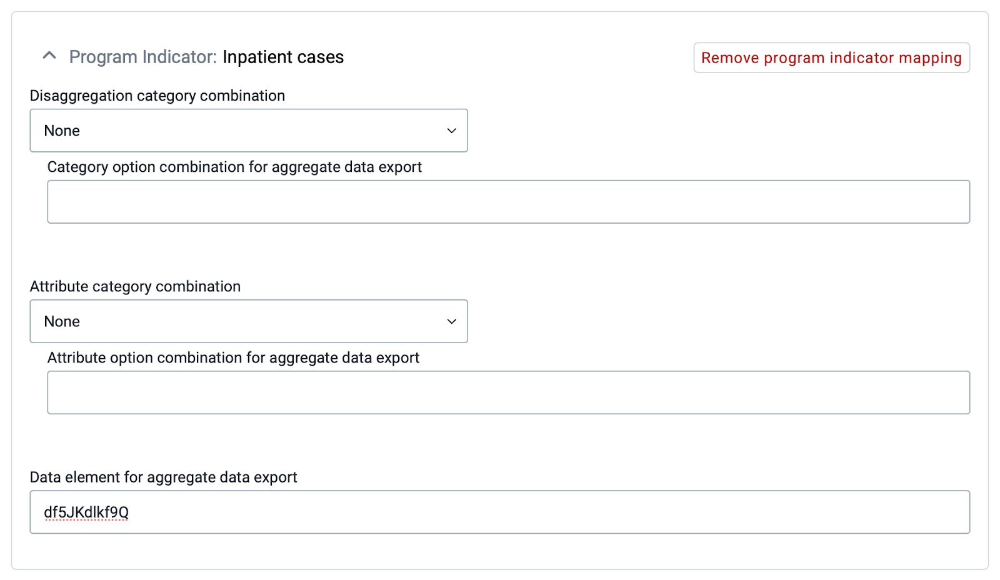
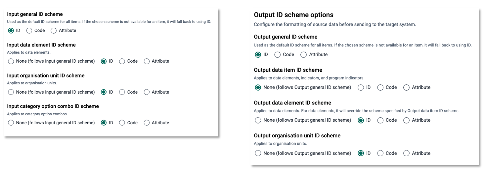
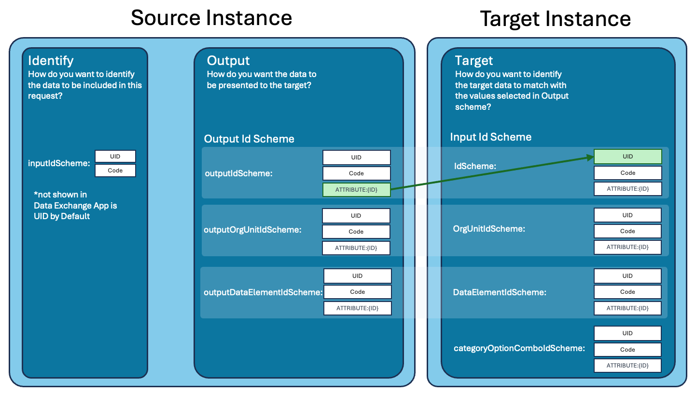

# Integrating tracker and aggregate data

Most governments and other organisations deploying DHIS2 use both the aggregate and individual-level (tracker) functionality. In DHIS2, these are represented by different data models, and both the data collection and analytics apps and APIs are different. However, there are many use cases where bringing the two types of data together is required or useful, and this guide discusses different approaches to achieve this. Some examples of such use cases include:

* Ensuring that various individual-level systems (e.g. case-based surveillance, immunization registries etc) implemented using DHIS2 Tracker can provide data to the national HMIS (aggregate).  
* Data collected through tracker programmes and aggregate data sets may be complimentary. For example, if tracker is used as an electronic immunisation registry, calculating immunisation coverages requires the service data collected through tracker to be combined with population estimates typically available as aggregate (yearly) data.  
* In many cases, tracker implementations are done in a phased approach, where it is first implemented in certain types of health facilities or by geographical area. Consequently, the same data may be collected using tracker in some locations and as aggregate data in other locations, and getting a complete overview of the data requires the tracker and aggregate data to be combined. Such differentiated or hybrid approaches may also be permanent.  
* Data collected through tracker may partially overlap with established aggregate reports. For example, a monthly report on malaria-related activities may include information both on malaria cases, as well as preventive activities such as bed-net distribution. If tracker is introduced for malaria case registration, the monthly malaria report can be partially completed based on tracker data, but still also require aggregate reports for preventive activities.  
* When tracker is introduced in a programmatic area (immunisation, HIV etc) where aggregate data has previously been collected, ensuring that data is comparable over time necessitates combining aggregate and tracker data to allow longitudinal data analysis.  
* Certain data quality checks in DHIS2 are only available for aggregate data. Applying these checks on tracker data thus requires that it is first aggregated and stored as aggregate data elements.

There are several ways in which this can be achieved, suitable for different purposes and with different advantages and disadvantages. The main approaches supported by core DHIS2 functionality are:

>* **Combining tracker & aggregate data side-by-side in analytics/dashboards**. This is an approach that is easy to implement, but it assumes >that the aggregate and tracker data is available in the same DHIS2 instance. It is also limited what types of analysis can be done with this >approach.   
>* **Combining tracker and aggregate data using aggregate indicators** that reference both tracker program indicators or data elements and >aggregate data elements. This requires more configuration to work, and also assumes all data is available in the same DHIS2 instance.  
>* **Saving aggregated tracker data as aggregate data values**, i.e. moving data from the tracker data model to the aggregate data model \- >often referred to in the DHIS2 community as “**tracker to aggregate”**. This involves the most comprehensive configuration and ongoing >maintenance of supporting service. However, it is also the most flexible approach, allowing the most comprehensive data analysis, and supports >the common scenario where tracker and aggregate data is collected in different DHIS2 instances. 

This guide is focused on the last of these approaches, which is what we believe will be the preferred approach in most DHIS2 implementations. There are other approaches to integration of tracker and aggregate data that rely on custom scripts, manual data transfer, or use of various third-party tools and apps. These are not discussed here.

## Save aggregated tracker data as aggregate data values

Saving aggregated tracker data as aggregate data values using the core functionality of DHIS2 involves some key steps:

* Defining how to aggregate the tracker data, i.e. how to count different types of events and activities. This is done using *Program indicators*, and (from DHIS2 v42) *program indicator disaggregations*.  
* Creating a *mapping* between the tracker data (program indicators) and aggregate data (data elements). This is done using a code or identifier that is assigned to program indicators and data elements. In practice, defining and configuration program indicators and mapping them to data elements is often done iteratively.  
* Setting up an *aggregate data exchange* that defines exactly what data to transfer: the specific variables, the organisation units, and the period. This can be done via the API or using the Data Exchange app. Data can be exchanged manually or be scheduled to run e.g. nightly, and data be exchanged either within one DHIS2 instance or between two different instances.

   {.center width=50%}

### Defining program indicators and disaggregations

How to aggregate data from tracker programmes is defined through the configuration of programme indicators and (where relevant) *program indicator disaggregations* if using DHIS2 v42 or later. To populate an aggregate data set such as a monthly facility report from a tracker programme, you will typically define one program indicator for each aggregate data element and one program indicator disaggregation for each aggregate data element category. Typical examples of such disaggregations are age and sex. This is illustrated in the following figure.

   {.center width=50%}

While not shown in the figure, program indicator mapping also applies for attribute category combinations, i.e. disaggregations applied to whole data sets. Thus if the target aggregate data set is disaggregated with an attribute category combo such as “implementing partner” and the implementing partner info is captured in the tracker programme, an expression can be configured to produce the attribute disaggregation as well.

Refer to  [User guides/Configuring the system/Programs/Setting up new Program disaggregation Mappings](https://docs.dhis2.org/en/use/user-guides/dhis-core-version-242/configuring-the-system/programs.html#program_disaggregation_mapping) for detailed instructions on setting up program indicator disaggregation.

In DHIS2 v41 and below, the program indicator disaggregation functionality is not available. This means that in v41 and earlier, one program indicator must be configured for each individual *data element \+ category option combination (+ attribute option combination)*. This is typically more demanding to configure and maintain, and it also leads to worse performance (in some cases significantly).

### Mapping program indicators and aggregate data elements

Each program indicator for which data is to be stored as an aggregate data value needs to be mapped to an aggregate data element, using some form of identifier. When using the program indicator disaggregation functionality in DHIS2 v42 and higher, mapping of identifiers from the tracker data model to the appropriate aggregate category option combinations and attribute option combinations are handled automatically by DHIS2. Mapping from program indicators to data elements is not automatic, but can be done using the “Data element for aggregate data export” field \- include the id of the data element here. To keep the mapping of program indicators to data elements in one place, you can use the same approach also for program indicators that are *not* disaggregated by setting the Disaggregation/Attribute category combination dropdowns to “None”.  
\*make sure categories are the same if you plan to exchange with an HMIS

   {.center width=50%}

### Mapping *without* program indicator disaggregations

In general, we recommend using the program indicator disaggregation functionality when running v42 or higher; even when some or all program indicators are not actually disaggregated, it lets you maintain the mapping from program indicators to data elements in one place without the need for custom attributes etc. However, if working in a DHIS2 instance that does not support program indicator disaggregation or where for some reason the program indicator disaggregation functionality is not yet used (e.g. mapping was done in an earlier version), the mapping must be set up as part of the program indicator definition itself. This can be done in different ways, and you can in theory use the name, code, id or a custom attribute of the program indicator, and match this with either the name, code, id or a custom attribute of the aggregate data element in any combination you want. You specify in the *aggregate data exchange* job what identifier to use on the program indicator and data element side respectively. 

A common pattern for this mapping is to assign the id of the target data element to a custom attribute of the program indicator. Program indicators have built-in properties specifically for the category option combination and attribute option combination identifier. However, there is by default no corresponding field for which to specify the identifier (i.e. code or id) of the data element. In principle, the code of the program indicator itself could be used, but this will fail if multiple program indicators are linked to the same data element (with different category option combinations). Instead, it is recommended to create an attribute that is assigned to program indicators. 

>The attribute:
>
>* Should be of type Text  
>* Should not be mandatory, since not all program indicators will be linked to aggregate data elements.   
>* Should not be unique, since multiple program indicators may point to the same data element identifier.   
>* Should be applied to "Program indicator" only, since it is not relevant elsewhere. 

Other properties like name, description and code can be defined according to the metadata naming convention of the particular implementation.

Once the custom attribute is assigned to program indicators, it will appear as a new field/attribute when adding or editing program indicators in the Maintenance app. Every program indicator for which data is to be transferred to aggregate data elements needs to be created and/or modified to include the code of the corresponding data element and category option combination code (this field can be empty for the default category option combination).

### Moving data with the aggregate data exchange service

When program indicators have been defined and mapped to aggregate data elements, the last step is to actually extract the tracker data and store it as aggregate data values. The recommended tool for this in DHIS2 is the Aggregate Data Exchange service (available from DHIS2 v2.39) and the corresponding [Data Exchange app](https://apps.dhis2.org/app/08012f21-0061-4e96-b49b-286e2743a8b4). This is a generic service to export data from the analytics API of a “source” DHIS2 instance and import the data as aggregate data values in a “target” DHIS2 instance. Note that the source and target instances can be the same, meaning the data is simply transferred internally. To save tracker data as aggregate data values, we extract the program indicator data values from the “source” instance and save them into aggregate data elements in the “target” instance. 

In many organisations, tracker and aggregate data are collected and managed in separate instances. For example, there might be a dedicated tracker instance for various case-based surveillance programmes, which should feed data into a separate HMIS instance hosting the routine, aggregate data. In these cases, the data exchange *can* be set up to send data directly from the tracker instance to the aggregate instance, without actually storing the aggregate data values in the tracker instances first. However, we recommend instead doing this in two separate steps: first storing tracker data as aggregate data element values within the same tracker instance, and then moving the aggregate data values to the aggregate (e.g. HMIS) instance. 

The reason for this is two-fold:

* It simplifies the actual “tracker to aggregate” transformation, in particular ensuring that there are no issues related to organisation units.  
* It ensures users of the tracker instance can easily access the aggregate data values, which are often easier to use for data analysis.

The main downside to this is that the aggregate metadata must be maintained in two places.

Whether the data exchange is “internal” or move data directly between two instances, the mapping described above is what is used to link the data from the source to the appropriate metadata in the target, thus the exchange relies on consistent and resolvable identifiers that are maintained over time. With DHIS2 v42 and later, program indicator disaggregations simplify mapping of category and attribute option combinations from tracker to aggregate. When the program indicator disaggregation functionality with its built in mapping is *not* used, it is critical to configure the data exchanges with the appropriate *identifier schemas*:

- The *output ID schema* decides what identifiers are used for the aggregated program indicator data being exported (as well as orgunits etc)  
- The *input ID schema* decides what identifiers are used to identify the data element used in the data import.

   {.center width=70%}

   {.center width=70%}

For example, if a custom attribute on the program indicator is used to store the *id* of the target data element, the output data item ID scheme should specify that custom *attribute*, whilst the “input data element ID scheme” should be *id.* When using the program indicator disaggregation to manage mapping (including of data elements), you do need to worry about the ID schemas.

   {.center width=70%}

#### Scheduling exchanges as job queues

Data exchanges can be run manually in the Data Exchange app or via the API. However, a common scenario is to automate this process to run e.g. every night or every week. Data exchanges can therefore be scheduled to run automatically using the Scheduler app.

Because data exchanges pull data from the analytics API, scheduling of data exchanges must be coordinated with scheduling of analytic table updates. Typically, the order should be:

1. Updating tracker analytics tables  
2. Running data exchange from tracker to aggregate  
3. Updating aggregate analytics tables  
4. (optionally) Running data exchange to move data to separate aggregate instance

This will ensure that the latest tracker data will be included in the exchange, and that the aggregate data is available for analysis and/or for a second exchange moving it to a separate instance.

>More information about configuring and scheduling aggregate data exchanges is available in other parts of the documentation:
>
>* Data exchange app [user guide](https://docs.dhis2.org/en/use/user-guides/dhis-core-version-242/exchanging-data/data-exchange.html)  
>* Data exchange service [documentation](https://docs.dhis2.org/en/develop/using-the-api/dhis-core-version-master/data-exchange.html)  
>* Scheduling [documentation](https://docs.dhis2.org/en/use/user-guides/dhis-core-version-master/maintaining-the-system/scheduling.html?h=job>+queue+use#scheduling)

### Implementation considerations

The sections below list the core decisions, practical options and recommended defaults to guide implementation.

#### Migrating to program indicator disaggregations in DHIS2 v42

The new *program indicator disaggregation* functionality introduced in DHIS2 v42 offers several advantages over the previous approach of configuring individual program indicators for each disaggregation. In addition to reducing the number of individual program indicators that need to be configured and maintained over time, it can significantly improve performance \- making the data transfer several times faster in many cases. 

If you have already configured “tracker to aggregate” in an earlier version of DHIS2 without using the program indicator disaggregations, you should plan to update the configuration to use this new functionality \- assuming the data set in question does in fact include disaggregated data. In particular, you should consider this if you are facing performance issues.

#### Data transfer configuration

There are two key considerations related to the transfer of data

**How often should aggregated data be transferred from tracker to aggregate data values?** When the transfer is automated, the frequency of the transfer can be anything from daily to only once per reporting/aggregation period (e.g. weekly, monthly, quarterly). More frequent updates mean that data becomes available as aggregate data values and can be used and analysed more quickly, and are kept up to date as new and updated information comes in. Whether or not this is useful depends on the tracker programme in question. For example, having daily updated data over the course of a reporting period may be useful information if made available to facility-level staff, but is less useful if the purpose of the aggregation is primarily to facilitate and automate routine HMIS reporting to higher levels.

**How far back in time should data be added and updated?** When setting up the aggregate data exchange, you must be decide for how far back (how many periods) data should be updated, and whether or not to transfer data for the current period (for which data will not be complete, see previous point). This decision may have to be aligned with potentially existing practices around aggregate data, such as when or how it is validated and whether or not it is at some point locked for editing, discussed further below. Related to this is the question of whether to differentiate between migrating new data values and making updates to previously reported values.

Discussions on these issues need to take into account that tracker data is in many cases entered retroactively based on paper registers, rather than directly during service provision or patient encounters. Furthermore, corrections and edits may happen to the data for quite some time after the actual event took place, for example, if during a follow-up visit an error is detected in the data for the previous visit.

Unless there are strong reasons to do otherwise, it is suggested that updates and edits are done as far back in time as there is a reasonable chance of additions and updates being made to the underlying tracker data. This ensures that the most correct and updated information is what is used, even though it may necessitate changes to HMIS data management standards around e.g. data validation and locking.

>**Note**: there is currently a limitation to the aggregate data exchange service when it comes to *updating* previously generated values. Consider this situation:
>
>1. A data exchange job has been run and updated aggregate data values for a period with a non-zero value for a particular program indicator in a particular orgunit  
>2. The tracker data is updated so that the same program indicator does not produce a non-zero value for that orgunit  
>3. A data exchange job is run again for the same period to update the existing aggregate data values
>
>In this scenario, the data exchange job in step 3 will *not* remove the value produced in step 1\. Work is ongoing to improve this situation.

#### Data quality and validation Key issues

Ensuring data quality is a key concern both for tracker and aggregate data, and linking the two introduces new potential dilemmas in this area. There are tools and methods for reducing the chance of errors being introduced in tracker data collection. Nonetheless, there is always a chance that errors are introduced. Within the period in which the tracker-based aggregate data is still being updated on a regular basis (as described in the previous section), corrections in the tracker data flows automatically to the aggregate data as well. However, there are two scenarios for which it must be decided how to address corrections to the data:

**If errors are detected and corrected in tracker**, after the time period in which data is routinely migrated and/or after which the aggregate data has been validated and/or locked. Possible ways to address this includes:

>* Living with the discrepancy in the aggregate data (if the error is minor);  
>* Doing an ad-hoc transfer of the data for affected periods;  
>* Manually correcting the aggregate data.

**If data quality issues are detected in the aggregate data**. This is a less likely scenario, since only relatively large or systematic errors in the tracker data will be visible when the information is aggregated, or if the data is obviously incomplete. Possible ways to address this includes:

>* Correcting the source data in tracker and then re-transferring the data (if possible);  
>* Correcting/editing the aggregate data (if possible), and accepting the discrepancy.

Another data quality topic of relevance when aggregating tracker data relates to the **timeliness and completeness of data**, which are key data quality metrics of aggregate reporting (e.g. in the HMIS). When aggregate data is reported directly through DHIS2, users click a button to indicate that a particular data set (reporting form) has been reported in full. This is used as the basis for calculating both the timeliness (submissions by a specified deadline) and completeness of data. When aggregate data is generated based on tracker data, no completeness and timeliness information is available. Several approaches can be considered concerning this issues:

* In some cases, it is unproblematic that there is no completeness and timeliness data. There is generally no completeness and timeliness information for tracker data, and the aggregate data values generated from tracker can be seen in the same way. This is the case, for example, if data is transferred primarily to facilitate data analysis with additional dimensionality, or in order to use analysis tools for aggregate data.  
* If the data makes up a subset of a particular routinely reported data set, where other parts are entered directly as aggregate data, completeness information for the tracker data could be verified and reported as part of the completeness of the overall dataset.  
* Completeness and timeliness information can be managed manually, by the user responsible for submitting the aggregate data. This can be done as part of a validation process, where the user verifies the data (in the aggregate data entry app) and then confirms that the data is complete. While this allows for an extra validation step, it is also more resources intensive, and true validation of the data would to some extent require a degree of manual tallying that partly defeats the purpose of automating the aggregation of tracker data.  
* A script or tool can relatively easily be developed to automatically mark data sets as complete if a certain amount (i.e. a specified number of data element values) has been reported. This works well for identifying health facilities for which some data has been reported, but this automated process cannot determine whether the reports are in fact *complete* in the true sense of the word.

Generally, when tracker data is used to produce aggregate data values, this is a form of secondary use of data beyond what it was primarily collected in order to do. It is important that it is clearly communicated to the users how issues of data validation and corrections are managed, how issues such as "completeness" are dealt with, and that the "source of truth" for the data is clearly defined.

#### Data access and ownership

Access to both tracker and aggregate data in DHIS2 is controlled through sharing, based on user groups. Sharing of tracker data and of the aggregate data values generated from the tracker data can thus be different, and in the common scenario that the two types of data are hosted in different DHIS2 instances the same users may not have access to the system at all. This has certain advantages, for example, the aggregate data values may be shared more widely than the tracker data without privacy/security implications. At the same time, it requires that appropriate data sharing is set up in two different instances, and it may also necessitate that users access two different systems. (It is possible to use OpenID Connect to allow users to share username and password across the two instances.)

Related to data access is the issue of ownership of data, an issue also linked to data quality and validation. There needs to be clear procedures in place that indicate who are responsible and "own" both the tracker and the aggregate data values generated from tracker. This is particularly important in scenarios where multiple health programmes are involved. For example, if an immunisation tracker programmes feeds data into an integrated, aggregate HMIS data set for which a separate HMIS unit is responsible.

#### Transition period

When tracker data is aggregated for the purpose of replacing established aggregate reporting (such as existing routine HMIS reports), it is often useful to plan for maintaining parallel reporting for a period of time, for example 6 months. In this period, aggregate numbers generated from tracker and from the existing manual reporting procedures should be compared. It is unlikely that they will ever be completely identical, but such comparisons are useful because they:

>* Should trigger a discussion around the source of the discrepancies, for example where there are data quality problems (in either of the data sources).  
>* Informs decisions around when the tracker data is of the same or better completeness and quality as the manual reporting, so that the parallel reporting can be stopped.

Technically, this can be achieved by having a separate "shadow" data set with separate data elements in the aggregate instance, so that two parallel sets of aggregate data can be kept and compared there. Alternatively, a copy of the aggregate data set can be kept in the tracker instance and used for comparisons.

#### Organisation unit synchronization

When the tracker data and aggregate data are hosted in separate DHIS2 instances, a key requirement to move data between them is that the organization units in the two databases are aligned. This applies whether the aggregation and transfers happens in one operation (aggregate data exchange) or in two separate operations. Please refer to the [dedicated section](https://docs.dhis2.org/en/implement/maintenance-and-use/organisation-unit-maintenance.html#synchronising-organisation-units-across-dhis2-instances) on this organisation unit maintenance for additional information.

## Other approaches

While the approach to save tracker data as aggregate data values outlines the approach most relevant for e.g. integrating case-based surveillance systems with a routine system like an HMIS, there are also other more direct ways of brining tracker and aggregate data together. These are outlined below. 

**Note:** A key limitation of these approaches, in particular for aggregate counts calculated with program indicators, has previously been the lack of *dimensionality* of data. For example being able to analyse age disaggregation and sex disaggregations as separate data dimensions used directly in charts and tables, for filtering, and re-used across variables. However, with the program indicator disaggregations introduced in v42, this is no longer the case \- program indicators with disaggregations can also be used directly in data analysis tools, without first storing the data as aggregate data element values.

### Showing tracker and aggregate data side by side

Aggregate and tracker data can be shown and analysed together by including it within the same Data Visualizer charts or tables. Furthermore, visualisations of tracker-based data can be created in the Event Report and Event Visualizer apps, and combined with visualisations of aggregate data on Dashboards. Any user can access to both types of data in the DHIS2 analytics apps can use this approach.

>**Advantages:**
>
>* Easy to set up  
>* Works well for presenting and analysing complimentary data  
>* Detailed data can be included (e.g. line lists of cases)
>
>**Disadvantages:**
>
>* Requires the tracker and aggregate data to be in the same DHIS2 instance

### Combining data through indicators

Indicators  can be based on both aggregate and tracker data, separately or combined in a single indicator. Tracker data elements, tracked entity attributes and program indicators can all be included in the calculation of indicators.

This approach can be useful in several scenarios:

* The same data is collected through aggregate data set and tracker programmes in different health facilities, i.e. some collect aggregate data and others collect individual-level data through tracker.  
* The same data is available as aggregate data values and tracker data values for different periods, for example if data currently collected through tracker was in previous years collected as aggregate data.  
* When indicators are needed based on a combination of data, i.e. service data collected through tracker combined with denominators available as aggregate data.

>**Advantages:**
>
>* Relatively easy to set up  
>* Can potentially hide some of the complexity of integrating aggregate and tracker data to end users
>
>**Disadvantages:**
>
>* Difficult to manage in cases where there may be overlapping data  
>* Requires the tracker and aggregate data to be in the same DHIS2 instance
