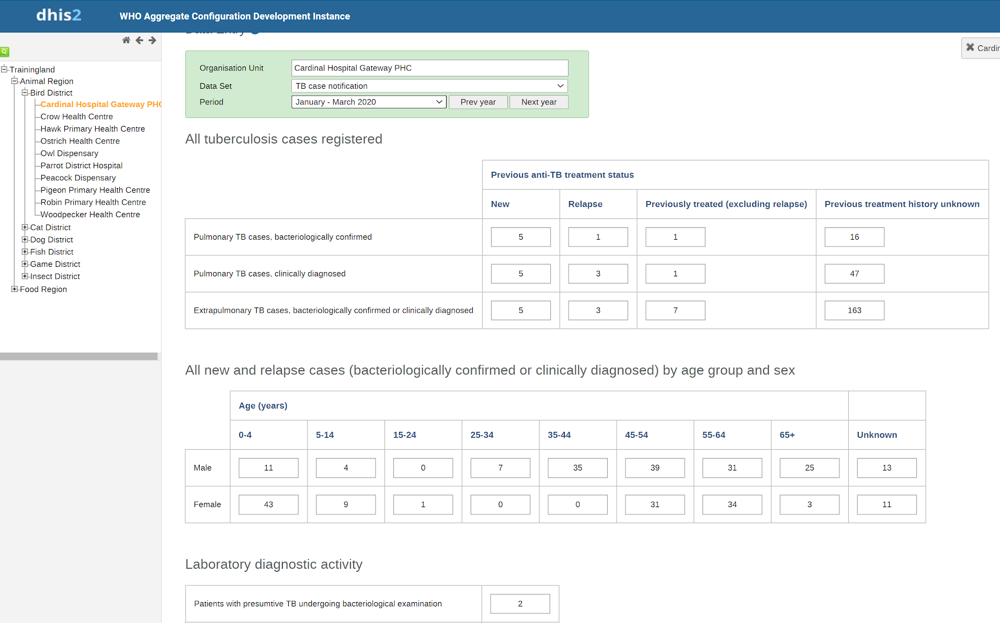
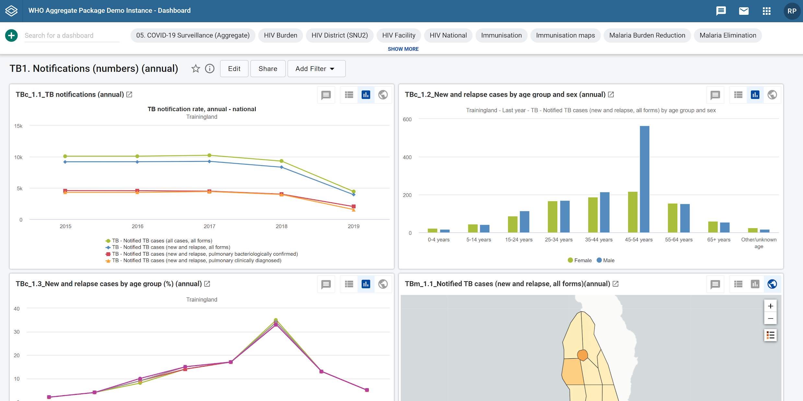
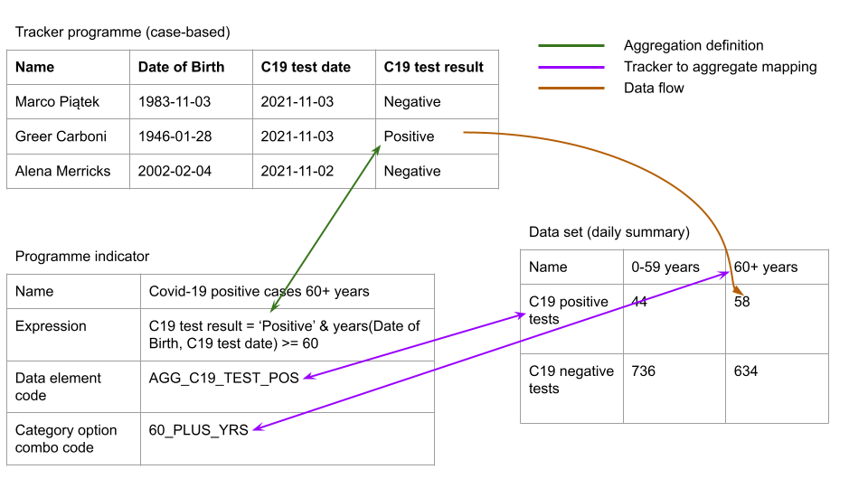
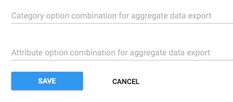
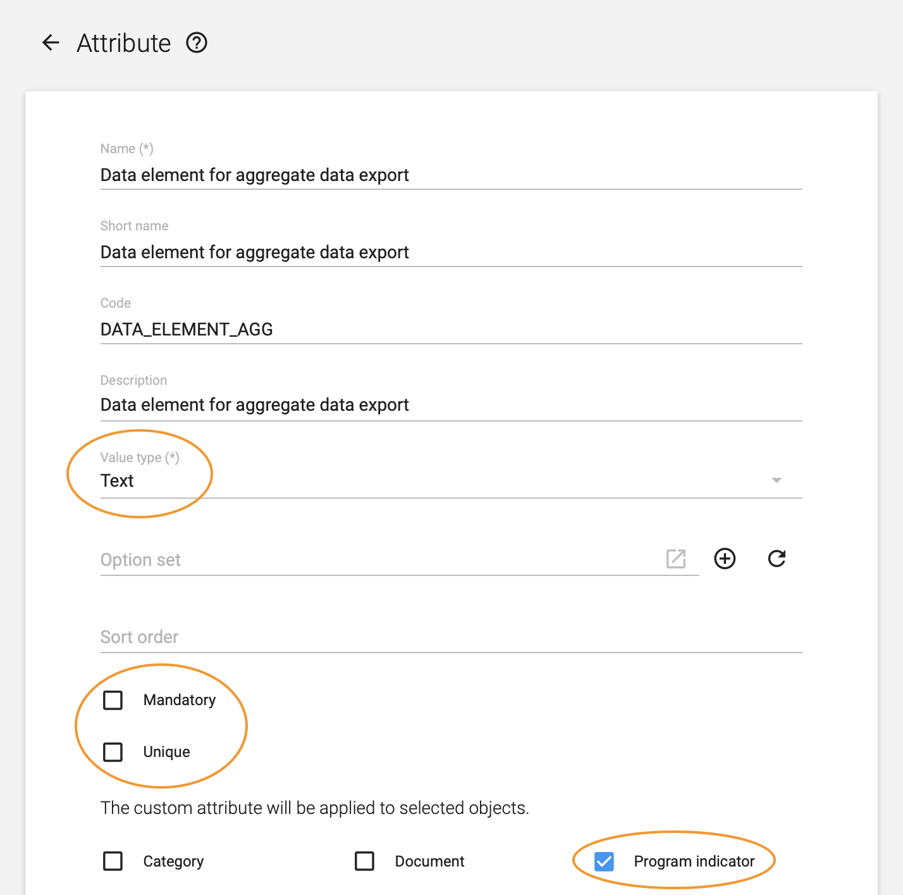

# Integrating tracker and aggregate data
This guide presents different approaches for combining data collected through tracker programmes with aggregate data, so that it can be analysed and used together. Tracker and aggregate data are collected and stored separately in DHIS2, but there are many cases where combining the two types of data is useful: 

* Data collected through tracker programmes and aggregate data sets may be complimentary. For example, if tracker is used as an electronic immunisation registry, calculating immunisation coverages requires the service data collected through tracker to be combined with population estimates typically available as aggregate (yearly) data.
* In many cases, tracker implementations are done in a phased approach, where it is first implemented in certain types of health facilities or by geographical area. Consequently, the same data may be collected through tracker in some locations and as aggregate data in other locations, and getting a complete overview of the data requires the tracker and aggregate data to be combined. Such differentiated or hybrid approaches may also be permanent.
* Data collected through tracker may partially overlap with established aggregate reports. For example, a monthly report on malaria-related activities may include information both on malaria cases, as well as preventive activities such as bed-net distribution. If tracker is introduced for malaria case registration, the monthly malaria report can be partially completed based on tracker data, but still also require aggregate reports for preventive activites.
* When tracker is introduced in a programmatic area (immunisation, HIV etc) where aggregate data has previously been collected, ensuring that data is comparable over time necessitates combining aggregate and tracker data to allow longitudinal data analysis.
* Certain data quality checks in DHIS2 are only available for aggregate data. Applying these checks on tracker data thus requires that it is first aggregated and stored as aggregate data elements.
 
There are several ways in which this can be achieved, suitable for different purposes. Each of these approaches have advantages and disadvantages. In the [next section](alternative-approaches) three overall approaches to combining tracker and aggregate data are presented, followed by a section on [choosing an approach](#choosing-an-approach) that outlines considerations and examples of when each of the approaches may be appropriate. Then, a [how-to guide](#How-to-saving-aggregated-tracker-data-as-aggregate-data-values] is provided for the approach based on saving data from tracker as aggregate data values.

## Alternative approaches
Tracker and aggregate data can be combined in DHIS2 by:

- showing tracker and aggregate data side by side in the same chart, table, map or dashboard;
- combining aggregate and tracker data through aggregate indicators;
- saving values calculated from tracker data as aggregate data values.

This section gives a summary of the three approaches, with the advantages and disadvantages of each.

### Showing tracker and aggregate data side by side
Aggregate and tracker data can be shown and analysed together by including it within the same Data Visualizer charts or tables. Furthermore, visualisations of tracker-based data can be created in the Event Report and Event Visualizer apps, and combined with visualisations of aggregate data on Dashboards. Any user can access to both types of data in the DHIS2 analytics apps can use this approach.

<!-- TODO: Example screenshot -->

> **Advantages:**
>
> * easy to set up
> * works well for presenting and analysing complimentary data
> * detailed data can be included (e.g. line lists of cases)
>
> **Disadvantages:**
>
> * limited dimensionality in analysis of tracker data, i.e. for showing age/sex disaggregations
> * not fully integrated/comparable with aggregated data, for example the same disaggregations cannot be applied in a single visualisation even if available in the underlying data
> * requires the tracker and aggregate data to be in the same DHIS2 instance

### Combining data through aggregate indicators
Aggregate indicators can be based on both aggregate and tracker data, separately or combined in a single aggregate indicator. Tracker data elements, tracked entity attributes and program indicators can all be included in the calculation of aggregate indicators.

This approach can be useful in several scenarios: 

* The same data is collected through aggregate data set and tracker programmes in different health facilities, i.e. some collect aggregate data and others collect individual-level data through tracker.
* The same data is available as aggregate data values and tracker data values for different periods, for example if data currently collected through tracker was in previous years collected as aggregate data.
* When indicators are needed based on a combination of data, i.e. service data collected through tracker combined with denominators available as aggregate data. 

<!-- TODO: Example screenshot -->

> **Advantages:**
>
> * relatively easy to set up
> * can potentially hide some of the complexity of integrating aggregate and tracker data to end users
> 
> **Disadvantages:**
>
> * tracker data cannot be analysed with disaggregations such as age/sex as separate data dimensions
> * difficult to manage in cases where there may be overlapping data
> * requires the tracker and aggregate data to be in the same DHIS2 instance

### Saving aggregates of tracker data as aggregate data
Tracker data can be aggregated to, for example, weekly or monthly values, and these values can be saved as aggregate data element values in DHIS2. This corresponds to what is often done manually in health facilities when registers are tallied every month to produce monthly reports. Program indicators can be defined that produce aggregate numbers based on tracker data, corresponding to aggregate data elements. The program indicator value should represent the same value as the aggregate (e.g. *number of new and relapsed TB cases notified* or *number of BCG doses given to children under 1*). The data transfer can be done on an ad-hoc basis as needed, or as part of a routine process where data is (automatically) transferred at fixed intervals (shown in the figure below).




There are multiple ways in which the actual transfer of data from program indicators to aggregate data elements can be done. This includes: 

* manually or via a script querying the [DHIS2 API](#webapi) to export the program indicator values, and subsequently importing them into DHIS2 using either the [Import/export app](#import_export) or the API;
* automating the export and import of data from the API using a script;
* using one of several applications developed by the DHIS2 community and available on the [DHIS2 App Hub](apps.dhis2.org) to export and import the data;
* setting up [Predictors](#manage_predictor), which can be scheduled to transfer the program indicator values into aggregate data elements routinely.

This approach is described in further detail below, focusing on how to automate the process using scripts.

> **Advantages:**
>
> * data can be analysed with all the same dimensionality as aggregate data (see example screenshot below)
> * data can still be combined with detailed tracker data (i.e. the first approach)
> * ensures that there is no overlap in tracker and aggregate data
> * works when tracker and aggregate data are collected in separate DHIS2 instances
> * may improve efficiencies and reduce load on the DHIS2 server from analytics, since requests for pre-aggregated data is often less demanding than on-the-fly aggregation of tracker data
>
> **Disadvantages:**
>
> * more complex to set up, and may require more ongoing maintenance
> * generally requires external tools/scripts to move data via the API
> * a mapping of data between tracker and aggregate data must be developed and maintained
> * if data is moved between two DHIS2 instances, organisation units must also be harmonised and kept in sync across the instances

<!-- TODO - the two screenshots below should perhaps be merged into one, highlighting the "dimensionality" -->




## Choosing an approach
Each of the three approaches for has advantages and disadvantages, as outlined above. For a single implementation, several of them may be needed. For example, it may be useful to present certain tracker data with frequent updates (i.e. daily numbers children immunised), while at the same time transferring aggregate program indicator values into aggregate data element values every month so that the data can be compared with facilities not yet using tracker, or with additional dimensionality (such as age/sex disaggregations) that cannot easily be done directly with aggregate data.

The first two approaches are both relatively straightforward to implement, using the standard applications built into DHIS2. While configuring aggregate indicators (the second approach) must be done by a system administrator with access to configure such indicators, any user with access to the DHIS2 analysis apps and the data itself can use these approaches. However, a major limitation is that they require the tracker and the aggregate data to be in the same instance of DHIS2. 

The third approach, saving data from tracker as aggregate data values, has some advantages in terms of analytics. However, it is also the only approach suitable for integrating tracker data with aggregate data in separate DHIS2 instances. Many countries have a mature, stable DHIS2 instance used primarily for capturing aggregate data across health programs in an integrated environment (e.g. a Health Management Information Systems, HMIS). When implementing DHIS2 tracker for individual-level data collection, doing this in a separate DHIS2 instance dedicated to the tracker deployment is generally recommended. By maintaining separate tracker and aggregate DHIS2 instances, performance can be better managed by system admins, DHIS2 updates can be performed independently, and data governance principles can be applied to ensure personally identifiable data captured by tracker can be protected according to national policies and governance frameworks.

When a system for routine aggregate reporting through DHIS2 data exists, there is a clear benefit in being able to leverage individual data collection through tracker to automatically 'report' aggregated data to the routine HMIS. The alternative is often that this is done manually by the health facilities, since such aggregate summaries are important for the management of the individual health facilities, and routine reporting of aggregate data is often mandatory. Capturing individual level data through DHIS2 tracker has potential to improve the quality of the data reported into the routine aggregate HMIS, while also enabling ad hoc analysis of the individual-level tracker data as required.

There are several ways, technically, to do this. In the how-to section below, the focus is on the steps needed to set up an automated migration of tracker data into aggregate data values. 

## How-to: saving aggregated tracker data as aggregate data values
This section describes the recommended approach for saving tracker data as aggregate data element values. While requiring an external tool or script as part of transferring the data, it leverages the existing functionality of DHIS2 as far as possible so that the script can be relatively simple. What is outlined here is also the approach taken in the [Health Data Toolkits](https://dhis2.org/health-data-toolkit/) for DHIS2, which includes mapping of variables between tracker programmes and aggregate data sets where relevant. This is discussed in more detail [below](#dhis2-digital-data-packages-and-linking-tracker-and-aggregate-data).

The approach described here is recommended as a long-term, automated solution for saving tracker data as aggregate data values. Technically, there are several other ways in which this aggregation and migration of data can be done, including using predictors, exporting the data and transforming it using other software (for example excel), or through custom DHIS2 apps (including some that are available in the [DHIS2 App Hub](apps.dhis2.org). While not described in this guide, these tools and methods can still be relevant in many cases, including in combination with the approach outlined here. For example, if there is only a need to do ad-hoc transfers of data from time to time, or in an early phase of tracker implementations when data is transferred primarily for testing and the configuration is still undergoing changes. 

### Implementation considerations
Integrating data collected through tracker with existing aggregate reporting flows (i.e. the HMIS) requires decisions to be made related to data governance, and it affects data access, systems maintenance and more. Some key considerations are presented here.

#### Data transfer
There are two key considerations related to the transfer of data:

**How often should aggregated data be transferred from tracker to aggregate data values?** When the transfer is automated, the frequency of the transfer can be anything from daily to only once per reporting/aggregation period (e.g. weekly, monthly, quarterly). More frequent updates means that data becomes available as aggregate data values and can be used and analysed more quickly, and are kept up to date as new and updated information comes in. Whether or not this is useful depends on the tracker programme in question. For example, having daily updated data over the course of a reporting period may be useful information if made available to facility-level staff, but is less useful if the purpose of the aggregation is primarily to facilitate and automate routine HMIS reporting to higher levels.

**How far back in time should data be added and updated?** Together with a decision on how frequently to transfer data, it must be decided for how far back (how many periods) data should be updated, and whether or not to transfer data for the current period (for which data will not be complete, see previous point). This decision may have to be aligned with potentially existing practices around aggregate data, such as when or how it is validated and whether or not it is at some point locked for editing, discussed further below. Related to this is the question of whether to differentiate between migrating new data values and making updates to previously reported values.

Discussions on these issues need to take into account that tracker data is in many cases entered retroactively based on paper registers, rather than directly during service provision or patient encounters. Furthermore, corrections and edits may happen to the data for quite some time after the actual event took place, for example, if during a follow-up visit an error is detected in the data for the previous visit.

Unless there are strong reasons to do otherwise, it is suggested that updates and edits are done as far back in time as there is reasonable chance of additions and updates being made to the underlying tracker data. This ensures that the most correct and updated information is what is used, even thought it may necessitate changes to HMIS data management standards around e.g. data validation and locking.

#### Data quality and validation
Ensuring data quality is a key concern both for tracker and aggregate data, and linking the two introduces new potential dilemmas in this area. There are tools and methods for reducing the chance of errors being introduced in  tracker data collection. Nonetheless, there is always a chance that errors are introduced. Within the period in which the tracker-based aggregate data is still being updated on a regular basis (as described in the previous section), corrections in the tracker data flows automatically to the aggregate data as well. However, there are two scenarios for which it must be decided how to address corrections to the data: 

**If errors are detected and corrected in tracker**, after the time period in which data is routinely migrated and/or after which the aggregate data has been validated and/or locked. Possible ways to address this includes:

* living with the discrepancy in the aggregate data (if the error is minor);
* doing an ad-hoc transfer of the data for affected periods;
* manually correcting the aggregate data.

**If data quality issues are detected in the aggregate data**. This is a less likely scenario, since only relatively large or systematic errors in the tracker data will be visible when the information is aggregated, or if the data is obviously incomplete. Possible ways to address this includes: 

* correcting the source data in tracker and then re-transferring the data (if possible);
* correcting/editing the aggregate data (if possible), and accepting the discrepancy.

Another data quality topic of relevance when aggregating tracker data relates to the timeliness and completeness of data, which are key data quality metrics of aggregate reporting (e.g. in the HMIS). When aggregate data is reported directly through DHIS2, users click a button to indicate that a particular data set (reporting form) has been reported in full. This is used as the basis for calculating both the timeliness (submissions by a specified deadline) and completeness of data. When aggregate data is generated based on tracker data, no completeness and timeliness information is available. Several approaches can be considered concerning this issues:

* In some cases, it is unproblematic that there is no completeness and timeliness data. There is generally no completeness and timeliness information for tracker data, and the aggregate data values generated from tracker can be seen in the same way. This is the case, for example, if data is transferred primarily to facilitate data analysis with additional dimensionality, or in order to use analysis tools for aggregate data. 
* If the data makes up a subset of a particular routinely reported data set, where other parts are entered directly as aggregate data, completeness information for the tracker data could be verified and reported as part of the completeness of the overall dataset.
* Completeness and timeliness information can be managed manually, by the user responsible for submitting the aggregate data. This can be done as part of a validation process, where the user verifies the data (in the aggregate data entry app) and then confirms that the data is complete. While this allows for an extra validation step, it is also more resources intensive, and true validation of the data would to some extent require a degree of manual tallying that partly defeats the purpose of automating the aggregation of tracker data.
* A script or tool can relatively easily be developed to automatically mark data sets as complete if a certain amount (i.e. a specified number of data element values) has been reported. This works well for identifying health facilities for which *some* data has been reported, but this automated process cannot determine whether the reports are in fact *complete* in the true sense of the word.

Generally, when tracker data is used to produce aggregate data values, this is a form of secondary use of data beyond what it was primarily collected in order to do. It is important that it is clearly communicated to the users how issues of data validation and corrections are managed, how issues such as "completeness" are dealt with, and that the "source of truth" for the data is clearly defined.

#### Data access and ownership
Access to both tracker and aggregate data in DHIS2 is controlled through sharing, based on user groups. Sharing of tracker data and of the aggregate data values generated from the tracker data can thus be different, and in the common scenario that they two types of data are hosted in different DHIS2 instances the same users may not have access to the system at all. This has certain advantages, for example, the aggregate data values may be shared more widely than the tracker data without privacy/security implications. At the same time, it requires that appropriate data sharing is set up in two different instances, and it may also necessitate that users access two different systems. (It is possible to use [OpenID Connect](#install_oidc_configuration) to allow users to share username and password across the two instances.)

Related to data *access* is the issue of ownership of data, an issue also linked to data quality and validation. There needs to be clear procedures in place that indicate who are responsible and "own" both the tracker and the aggregate data values generated from tracker. This is particularly important in scenarios where multiple health programmes are involved. For example, if an immunisation tracker programmes feeds data into an integrated, aggregate HMIS data set for which a separate HMIS unit is responsible.

#### Maintenance
The approach described here requires that technical capacity is available, both to initially develop and configure a solution for data transfer, and for ongoing maintenance that may be required for example if there are changes to the DHIS2 server infrastructure. Furthermore, if metadata in the tracker instance or in the aggregate HMIS instance is altered, the mapping of program indicators to aggregate data elements may need to be updated accordingly.

#### Transition period
When tracker data is aggregated for the purpose of replacing established aggregate reporting (such as existing routine HMIS reports), it is often useful to plan for maintaining parallel reporting for a period of time, for example 6 months. In this period, aggregate numbers generated from tracker and from the existing manual reporting procedures should be compared. It is unlikely that they will ever be completely identical, but such comparisons are useful because they:

* Should trigger a discussion around the source of the discrepancies, for example where there are data quality problems (in either of the data sources).
* Informs decisions around when the tracker data is of the same or better completeness and quality as the manual reporting, so that the parallel reporting can be stopped.

Technically, this can be achieved by having a separate "shadow" data set with separate data elements in the aggregate instance, so that two parallel sets of aggregate data can be kept and compared there. Alternatively, a copy of the aggregate data set can be kept in the tracker instance and used for comparisons.

### Assumptions and key steps
When tracker data and aggregate data are managed in separate DHIS2 instances, which is generally recommended, migrating data between the two instances requires the organisation units to be the same, or at least have a shared set of identifiers. Because organisation units are often re-used when new DHIS2 instances are set up, this may not be a problem initially. However, keeping organisation units synchronised across two or more DHIS2 instances over time requires careful management, whether changes are handled manually or through an automated process. Forthcoming implementation guidance will discuss this issue in further detail. For the purpose of this guide, a prerequisite is that organisation units are harmonised and have a shared set of identifiers across the two instances. In cases where tracker data is migrated to aggregate data values within the same DHIS2 instances, synchronising organisation units is not an issue.

Conceptually, the steps involved in migrating aggregates of tracker data to aggregate data values involves:

1. Establish a mapping between program indicators and the corresponding  data elements and category option combinations, using codes.
2. Export program indicator values as an aggregate *data value set*
3. Import the *data value set* as aggregate data element values

The following sections explains (1) how to establish a mapping between program indicators and data elements, (2) the DHIS2 APIs relevant for importing/exporting data values, and (3) considerations when automating the import and export process.

### Mapping program indicators with aggregate data elements
To produce aggregate data values from tracker data, program indicators must be defined for each data point. Each of these data values corresponds to a data element and if applicable a category option combination. A mapping using an identifier is thus needed to specify which program indicator relates to which specific data element (with category option combination). While not discussed in detail here, the mapping can also include attribute option combinations.



It is recommended to use *codes* as identifier for this mapping, and this is what is presented here.

> **Note**
> While the approach described here is based on the mapping of data being done in the source system (through program indicators), it could in other scenarios be done in the target system where the data is imported, or in a middleware or interoperability layer in between.

#### Coding data elements
Because the data element and category option combination codes will be added as attributes to the program indicators, the first step is to create and/or add a code to the data elements and category option combinations. This should be done in the DHIS2 instance in which aggregate data values will be saved. If the data elements and category option combinations already have codes, these can be used. It is also possible to define custom attributes and assigned these to the data elements for the purpose of mapping, but for the purpose of this guide we will use the built-in data element code.

While not strictly necessary, it may be advisable to add the data elements to a data set if they are not already. This data set (or sets) define the period type of the data to be transferred (e.g. weekly, monthly), and when imported the aggregated tracker data will be validated against this period type. Furthermore, such assigned may be the basis of subsequent calculation of data completeness.

#### Coding program indicators
Program indicators have a fixed attribute used specifically for the category option combination (and attribute option combination) identifier that is used when the program indicator value is exported as a data values set.

<!-- TODO: Update to screenshot with "blank" fields-->


However, there is by default no corresponding field for which to specify the identifier (i.e. code) of the data element. In principle, the code of the program indicator itself *could* be used, but this will fail in the common scenario that multiple program indicators are linked to the same data element (with different category option combinations). Instead, it is recommended to create an [attribute](#about_attribute) that is assigned to program indicators.

The custom attribute should be of the type `Text`. It should *not* be mandatory, since not all program indicators will be linked to aggregate data elements. It should *not* be unique, since multiple program indicators may point to the same data element code. And it should be applied to "Program indicator" only, since it is not relevant elsewhere. Other properties like name, description and code can be defined according to the metadata naming convention of the particular implementation. The screenshot below shows how the custom attribute included in the WHO metadata packages is configured. If this custom attribute has already been imported into the DHIS2 instance in question, it can be re-used.



Once the custom attribute is assigned to program indicators, it will appear as a new field/attribute when adding or editing program indicators in the Maintenance app. Every program indicator for which data is to be transferred to aggregate data elements needs to be created and/or modified to include the code of the corresponding data element and category option combination code.

Adding the program indicators to be migrated to a program indicator group can be useful to manage large numbers of program indicators. For example, a script for migrating data can target all program indicators in a program indicator group, simplifying the configuration.

### DHIS2 Web API for export and import of dataValueSets
Once the mapping between program indicators and the corresponding data elements and category option combinations has been done, aggregated program indicator data can be exported as a `dataValueSet` from the analytics API endpoint and subsequently imported as aggregate data values. As noted in the introduction, we assume for the purpose of this guide that organisation units are identical or have a common identifier in the DHIS2 instance where data is to be imported and exported.

#### Export
To export data from the DHIS2 Web API, the `/api/analytics/dataValueSet` endpoint is used, described in further detail in the [developer documentation](https://docs.dhis2.org/en/develop/using-the-api/dhis-core-version-master/analytics.html#webapi_analytics_data_value_set_format). The endpoint can return data in `JSON` or `XML` representation. It requires three parameters to be specified:

* Data (dx) - which are the program indicators for which data is to be exported.
* Period (pe) - the period for which to export data for, which should match the period type of the aggregate data elements to which data should be migrated.
* Organisation unit (ou) - the organisation units for which to export data.

The format of the these parameters are described in detail in the [developer documentation](https://docs.dhis2.org/en/develop/using-the-api/dhis-core-version-master/analytics.html#webapi_analytics_dimensions_and_items).

In addition to specifying the data, period and organisation units dimensions of the query, it is also necessary to specify that the custom attributes holding the data element codes should be used as identifier for the data values in the data value set being exported. This is done by setting the optional `outputIdScheme` parameter to point to the UID of the custom attribute. Objects without this attribute (e.g. organisation units) will fall back to using UIDs.

A complete API call can thus look like this:
```
/api/analytics/dataValueSet.json?dimension=dx:Uvn6LCg7dVU;OdiHJayrsKo&dimension=pe:LAST_MONTH
&dimension=ou:lc3eMKXaEfw&outputIdScheme=ATTRIBUTE:vudyDP7jUy5
```

This query will return a file (in JSON format in this example) with aggregate data values.

As specified in documentation on the `/analytics/dataValueSet` API endpoint, when using attribute-based identifier schemes for export (as in this guide) there is a risk of producing duplicate data values. This can happen if multiple program indicators have been assigned the same combination of data element and category option combination codes. The boolean query parameter `duplicatesOnly` can be used for debugging purposes to return only duplicates data values, and this check is recommended after any changes to the mapping between program indicators and aggregate data elements.
```
/api/analytics/dataValueSet.json?dimension=dx:Uvn6LCg7dVU;OdiHJayrsKo
 &dimension=pe:LAST_MONTH&dimension=ou:lc3eMKXaEfw&duplicatesOnly=true
```

Because the export relies on the analytics API, only data included in the [analytics tables](https://docs.dhis2.org/en/use/user-guides/dhis-core-version-master/maintaining-the-system/scheduling.html#scheduling_analytics_table) are included. So for example, if the analytics tables are scheduled to update at midnight every day, and the transfer is scheduled for 23:00 every day, data from the current day will not be included.

#### Import
When a file with aggregated data values has been exported from the `/api/analytics/dataValueSet` endpoint with the appropriate parameters as described above, it can be imported directly into the DHIS2 instance to which data is to be migrated. For testing purposes, the data file can be imported using the [Import/Export app](https://docs.dhis2.org/en/use/user-guides/dhis-core-version-master/maintaining-the-system/importexport-app.html), or via the DHIS2 Web API. Here, we show how to use the API.

The API endpoint for importing data value sets is '/api/dataValueSets', described in further detail in the [developer documentation](https://docs.dhis2.org/en/develop/using-the-api/dhis-core-version-master/data.html#webapi_data_values). Of particular relevance is the different [import parameters](https://docs.dhis2.org/en/develop/using-the-api/dhis-core-version-master/data.html#webapi_data_values_import_parameters), which must be adapted for our purposes as described here:

* `dataElementIdScheme` and `categoryOptionComboIdScheme` must be set to `code`, since we use codes to map values from Program indicators to aggregate data elements and category option combinations.
*  `orgUnitIdScheme` must be set to whatever is appropriate for each particular case.
* `dryRun` makes it possible to get an import summary without actually importing data, and can be useful for testing.
* `importStrategy` should in most cases be set to `CREATE_AND_UPDATE`, which means that new data values will be imported and existing ones updated. In some cases, it *may* be relevant to set this to only `CREATE` or `UPDATE`, for example if a decision is made not to update existing data after a certain time period, but allow new data to be added. This was discussed in further detail under [implementation considerations](#implementation-considerations)

This is an example of how to specify the appropriate parameters when importing data using the API:

```
/api/dataValueSets/dataElementIdScheme=CODE&categoryOptionComboIdScheme=CODE&importStrategy=CREATE_AND_UPDATE&dryRun=false
```

### Writing scripts to automate data migration
A template script for automating routine migration of data from tracker to aggregate, within the same instance or across separate DHIS2 instances, will be made available in the near future. Whether adapting this template, or developing custom tools or script to perform the migration, there are certain recommendations that should be followed. 

* Separate the script performing the export and import from the configuration of what data to migrate. This allows more easily modifying the configuration without danger of introducing errors in the logic of the script, and makes it easy to have multiple configurations (i.e. one for each tracker programme). 
* The script should produce a log with key events and information, such as when the script has been triggered, a summary of the import results (on success), or details of the error (in case of failure).
* A system should be in place to notify the persons responsible for the data migration in case of errors, for example through an email server configured on the server, or using the messaging functionality of DHIS2 itself (accessible through the Web API).
* Because the data export relies on the analytics endpoint, it may be useful for the script to trigger analytics and performing the export after this process has finished. 

### DHIS2 Digital Data Packages and linking tracker and aggregate data
DHIS2 digital data packages have been developed to support both
aggregate reporting & analysis, as well as tracker data capture and facility-level analysis. Further information is available on [Health Metadata Toolkits](https://dhis2.org/health-data-toolkit/).

Aggregate digital data packages (inclusive of standard aggregate dashboards) are available for health programmes such as TB, HIV, malaria, RMNCAH and disease surveillance. Aggregate packages include:

1. Data set, data elements and category option sets ('target' for sending tracker data)
2. Metadata codes that are ADX compliant and enable the mapping of data values from tracker to the aggregate 'target'

In addition, tracker packages are being developed for a growing number of use cases such as immunisation eRegistries and case-based surveillance for TB, HIV and integrated disease reporting. Where tracker data packages are designed to capture data that can be aggregated and submitted to the corresponding aggregate dataset, we have included the following in the tracker digital data packages:

1. Program indicators configured to produce data values corresponding to the data elements and disaggregations included in the aggregate digital data package data.
2. Custom attribute for 'Aggregate data element code'.
3. Attributes per program indicator populated with the data element codes and category option combination code from the aggregate digital data package.

### Summary
Steps to migrate tracker data to aggregate data values:

1. Define a list of the variables for which data is to be generated and transferred.
2. Ensure that the aggregate data elements to which data will be associated exist and have a code.
3. Ensure that the category option combinations assigned to these data elements have a code.
4. Create a custom attribute assigned to program indicators.
5. Ensure that the program indicators producing the aggregate data values exists, and assign them with the code of the corresponding data element and category option combination.
6. Export program indicators values as a data value set using the `/api/analytics/dataValueSet` Web API endpoint in the DHIS2 instance hosting the tracker data.
7. Import the data value set to the `/api/dataValueSet` Web API endpoint in the DHIS2 instance that will hold the aggregate data.

### Known issues
- There is a bug in earlier 2.33-36 releases that prevents custom attributes from being exposed in the UI ([Jira 8755](https://jira.dhis2.org/browse/DHIS2-7230)). This is resolved in the latests DHIS2 patch releases
- There is a bug ([Jira 8868](https://jira.dhis2.org/browse/DHIS2-8868)) that causes metadata-dependency-export tool to fail when custom attributes are assigned to program indicators.
