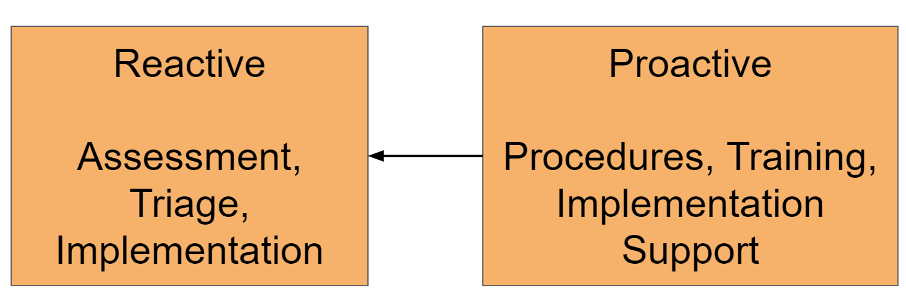

# Metadata Maintenance and Assessment
While metadata quality can be somewhat subjective, there are a number of key principles that can be objectively assessed and should be universally followed throughout DHIS2 implementations. In order to assess metadata quality, a metadata assessment can be performed. In this context, we can define metadata assessment as the review of the quality of a specific implementations configuration. While this is wide-ranging in scope, our goal is to break down the assessment process into manageable pieces that can be reviewed, prioritized and fixed over time. Regular metadata assessment and ongoing upkeep is an important part of long-term DHIS2 configuration and maintenance. While configuration tasks can often be performed quickly through a number of different mechanisms, without proper co-ordination there can be a number of challenges that a DHIS2 systems configuration can face over time. Some examples of the effects of these configuration challenges include:

- An inability to find the correct items when creating data outputs
- An inability to correctly disaggregate data when creating data outputs
- An inability to access the correct items when either entering data or creating data outputs
- Challenges with data quality (some examples: significant inaccuracies in long term trends of data and reporting rates, being able to store invalid data values, multiple variables representing the same concept storing different data values)
- Difficulty identifying the correct items to use when configuring data exchange mechanisms  
- Errors when upgrading DHIS2 versions
- Having an overwhelming amount of invalid metadata to manage

The purpose of this guide is to help identify the various root causes that can result in poor configuration practices as well as providing tools and procedures which can support both immediate fixes as well as long-term strategies to modify these practices over time. As DHIS2 implementations develop over time and grow into increasingly larger data warehouses, implementation of such interventions will prove beneficial to the ongoing long-term sustainability and usability of the platform.

This guide is broken down into a discussion of two separate processes that often feed into one another.

1. Reactive Processes: As a result of configuration challenges, a DHIS2 system will need to be reviewed and cleaned accordingly.
2. Proactive Processes: To prevent configuration challenges, processes can be put in place such that the DHIS2 configuration remains robust over time.

Proactive processes can often be defined while performing a review of the DHIS2 system, as common challenges can be identified and measures to mitigate them based on user practices discussed. These processes therefore often feed into the reactive review process.

Both type of 

## Reactive processes - assessing metadata quality and addressing challenges

1. Running the built-in (meta) data integrity check
2. Running an [assessment tool](https://github.com/dhis2/metadata-assessment) based on [R](r-project.org) that generates what we refer to here as a metadata assessment report
3. Performing various manual checks to review issues that can not be assessed in the two automated tools listed above

### Assessing metadata quality 

The following detailed sections of this guide support performing these components of the assessment: 

- **[Metadata quality assessment overview]():** gives an overall overview of the process of assessing metadata quality in a DHIS2 instance, using the built-in data integrity checks, the metadata assessment tool, and the manual review.

- **Extended Metadata Assessment Reference Guide:** describes in detail each item that is included within the checklist for the extended metadata assessment. Each item on the checklist will have the following accompanying text available within the metadata assessment reference guide:
   -  A description of the item and why it should be checked
   -  Recommendations on what to do with the item based on your findings

> NB: The extended metadata assessment is most easily conducted via the use of the R-markdown report.

- **Manual Review:** describes processes that need to be assessed manually as there may be no easy way to rationalize this concepts through automated processes. This includes the following:
  - Naming Conventions
  - Indicator Formula
  - Duplicated data sources
  - Dashboard item configuration
  - Program and dataset organisation unit assignment
  - Program and dataset sharing

### Addressing metadata issues

- **Processes for fixing the issues that have been identified:** described in detail potential strategies to use in order to fix the items identified via the data integrity check, extended assessment and manual review. This includes modifications to the configuration via the user interface as well as SQL queries and API calls that can be used to fix a potential issue.

### Planning and performing a metadata assessment

In order to perform the assessment, you may want to start by getting buy-in from a wide variety of stakeholders. In doing so, it may be useful to document the extent of the issues discussed within this guide by generating summary statistics on the problems that have been identified. This can be very useful to present to a large audience and can be used to support buy-in by providing brief explanations of the issues that have been identified. Within the **Metadata Assessment Reference Guide** you will find tools that will support you to both create quick summary counts of problems that you find in your own implementation as well as tools that generate more detailed reports on each specific item that requires attention. We recommend that the assessment includes the following components:

1. Define the scope of the assessment and sharing this with relevant stakeholders
2. Identifying the extent of the problems within an implementation through generating and documenting summary statistics of what has been found
3. Presenting these findings back to the group of stakeholders
4. Identifying the individual items that are problematic and coming up with strategies to mitigate or fix them as appropriate
5. Detailing and prioritizing the fixes
6. Implementing these fixes on development followed by production systems

## Proactive processes - ensuring good configuration quality over time
React

- **Procedures for Long-Term Maintenance:** describes procedural challenges associated with co-ordinating long-term configuration processes and provides example standard operating procedures that can be reviewed and used to better co-ordinate these processes.

### Tools for the Extended Assessment

The extended assessment can be performed by using an R-markdown report. Please refer to the [instructions here](r-markdown_install_instructions.md) for a detailed explanation on how to install and run the R-markdown report.