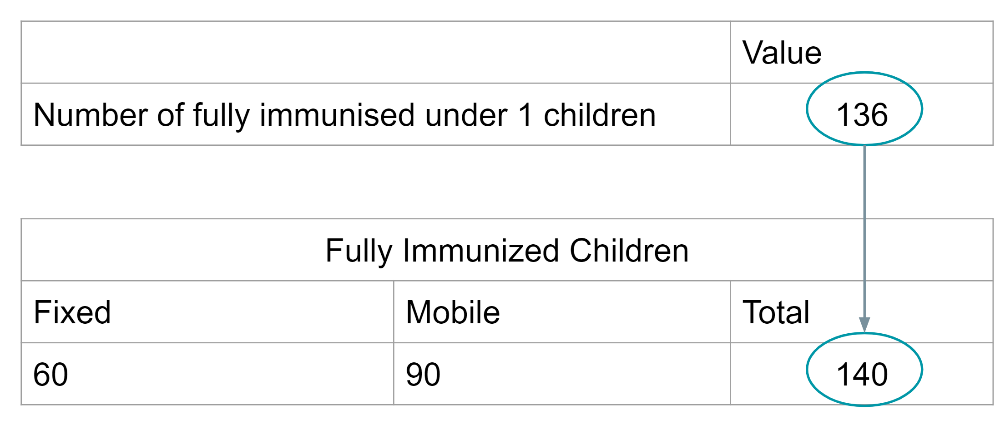

# Manual Review

While time saving measures through the use of the data integrity check or SQL scripts have been made available, some review processes can not be automated. This includes the review of:
  - Naming Conventions
  - Indicator Formula
  - Duplicated data sources
  - Dashboard item configuration
  - Program and dataset organisation unit assignment
  - Program and dataset sharing

## Naming Conventions

For a full breakdown on the principles behind good naming conventions, please view this [resource](https://docs.dhis2.org/en/topics/metadata/dhis2-who-digital-health-data-toolkit/naming-conventions.html). Where possible, you should consider implementing these in the system(s) you are reviewing.

To update the names of your metadata in bulk, consider using the [DHIS2 metadata editor](https://workspace.google.com/marketplace/app/d2_metadata_review_tool/672531419470). This will allow you to edit all of your metadata in a google sheet and synchronize your information back to the server. You can view the full guide for the metadata editor [here](https://docs.google.com/document/d/1Y4u78llIOTb5gNPHLJks528kbz8czXH9O6yKMEaLFI0/edit?usp=sharing).

## Indicator Formula

A manual review of indicator formula may be needed in order to determine if the indicator formula are correct. The review of indicator formula, while potentially a configuration issue, has the potential to affect data quality and data outputs if incorrect assumptions are being made about the formula. Examples of issues you will want to check when reviewing indicator formula include:

1. Ensuring that the correct data elements are part of the numerator and denominator respectively by comparing the data elements with the numerator and denominator descriptions
2. Ensuring that the correct indicator type has been selected for the indicator being reviewed
3. Where possible, reviewing that the denominator is defined correctly (however; this may be more of a data quality issue and left for a more detailed data quality review exercise)

You can use the [DHIS2 metadata editor](https://workspace.google.com/marketplace/app/d2_metadata_review_tool/672531419470) to review some of the formulas if you are familiar with how this is set up, however a more traditional method of browsing indicators through the user interface can be done using the [WHO metadata browser app](https://apps.dhis2.org/app/af9a31fb-350c-4130-964b-3a413183aa54).

## Duplicate Data Sources

Duplicate data sources arise when you have multiple variables within a DHIS2 system reporting on the same concept. There are typically 3 types of duplicated data sources that you may see in DHIS2:

- Duplicate variables within the same data collection form
- Duplicate variables between different programs (usually on different forms)
- Duplicate variables within programs (either on the same or different forms)

### Duplicate variables within the same data collection form

This occurs when one or more data elements is providing a total that is duplicated by one or more other data elements on the same form. As an example, we can review the forms available in Figure 1.

**Figure 1**

When this occurs, it is difficult to determine what is the correct value.

### Duplicate Variables between different programs

This occurs when you have two or more programs within an integrated system that are collecting the same information (Figure 2). In some cases programs can not agree on the value and this may need to be maintained as is. This will become problematic when trying to determine an agreed national value however as the values may be different between the different programs and this is not recommended to be maintained as is.

**Figure 2**

### Duplicate variables within programs (either on the same or different forms)

This occurs when the same information is being collected within the same program (Figure 3). This can be problematic as there should be agreement between values when possible (and this may not be the case when this issue is found)

**Figure 3**

### Resolving duplicate data sources

Similar to issues with defining denominators, this may need to be left for a more detailed data quality review. As these findings will often require form review/revision across various programs in order to rationalize these duplicate data sources, this issue will likely not be resolved through an immediate configuration change. It is important to identify these issues however and work with the programs to resolve them based on local procedures.

## Dashboard Item Configuration

There are two considerations to make when you are reviewing dashboard items:

1. Does the dashboard item need to be shared to be viewed by the user groups the dashboard is shared with
2. Does the dashboard item need relative organisation units or periods applied to it so it can be re-used/updated regularly

If it is the case where a dashboard item needs to show data for a fixed period or organisation unit, then there will be no need to apply any relativity to the item. If the item should be updated with new data routinely, or the users in which the dashboard is shared with do not have access to the fixed organisation units selected within the item, then these items should be reviewed and updated with correct relative period and organisation unit selections as appropriate.

## Program and data set organisation unit assignment

Check if the programs and data sets are assigned only to organisation units that are expected to report on them. For datasets this can cause problems with reporting rate completeness (the number of expected reports may be higher then it should be); while in the case of programs you could have tracked entities and/or events registered in organisation units they should not be.

## Program and data set sharing

Check if the metadata and data sharing settings have been applied correctly to both programs and data sets. In particular, if there are users or groups of users that can not perform operations on the programs or data sets that they should be able to, then these sharing settings may need to be modified.

A more detailed breakdown on the application of sharing settings to programs and data sets can be found in both the [documentation](https://docs.dhis2.org/en/use/user-guides/dhis-core-version-master/configuring-the-system/about-sharing-of-objects.html) as well as through a number of videos on [YouTube](https://www.youtube.com/playlist?list=PLo6Seh-066RwslDmyZkiKjejgMCKNaJTC).