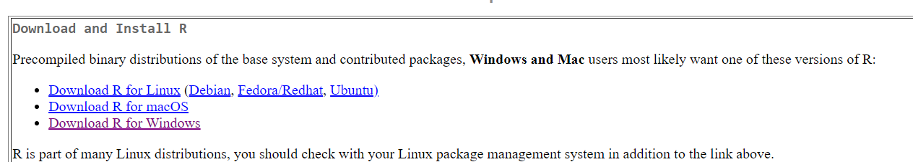
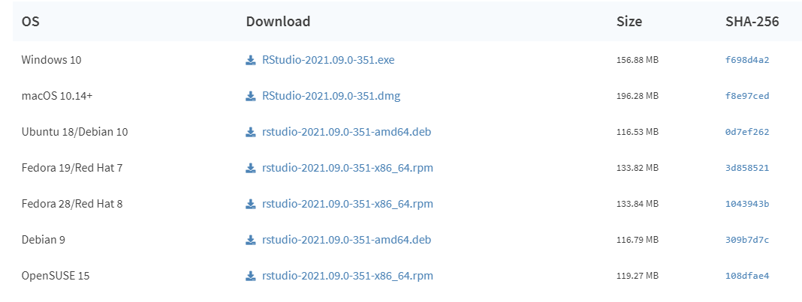
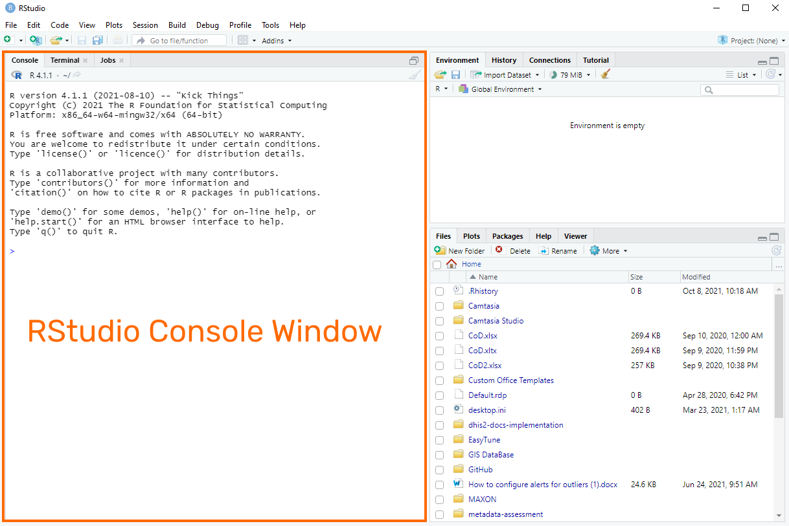
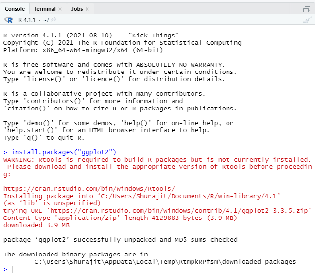
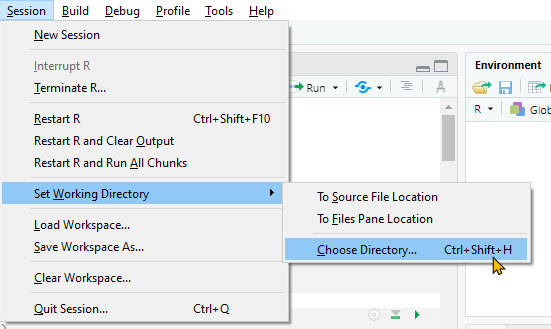
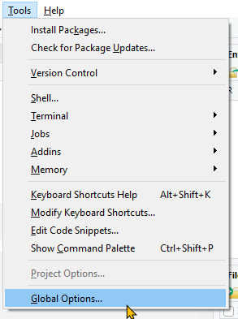
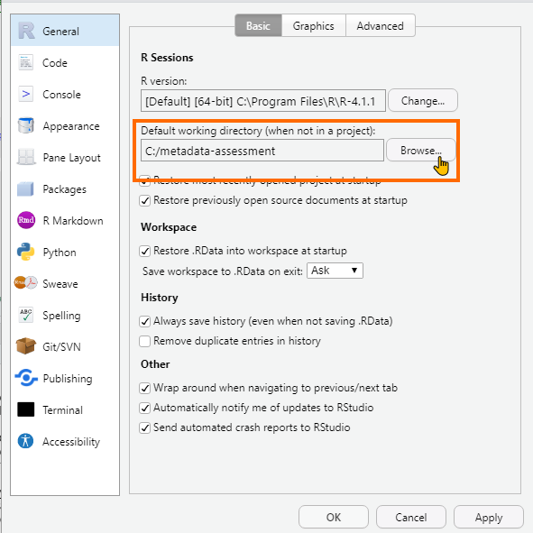

# Configuring and Using the R-Markdown Report

In order to support the extended metadata assessment, an R-markdown report has been created to allow for implementer's to run the checks outlined in the [extended metadata assessment](assessment-reference.md). 

In order to use this report you will need the following:

1. The software "R"
2. The software "R studio"
3. A DHIS2 login to the system you are assessing with the "ALL" authority

## Installing R and RStudio

>NB: R and Rstudio run on Linux, Mac OS and Windows. We therefore do not foresee any compatibility issues when trying to run the R-markdown report. ***Note that you must install R before installing Rstudio.***

You can learn more about the R from their [website](https://www.r-project.org/). To download R, you can use this [link](https://cran.r-project.org/mirrors.html) and select the mirror that is closest to your geographical location (any mirror will work but the one closest to you should be the fastest). After selecting the mirror, you will need to download the right version for your OS. 



You can learn more about the R studio from their [website](https://www.rstudio.com/). To download R studio, you can use this [link](https://www.rstudio.com/products/rstudio/download/). Select the "free" option from the downloads page.


After selecting the "Free" option, you must select the file type associated with your OS.



After downloading the installers for both R and R studio, proceed to install them. ***Note that you must install R before installing Rstudio.***

### Installing additional packages in Rstudio

In order to run the R-markdown report, there are some additional R packages that you must first install. This includes the following:

- jsonlite
- httr
- purrr
- knitr
- magrittr
- ggplot2
- DT
- dplyr

In order to install these packages, open up Rstudio. You will see several initial windows including "Console," "Environment" and "Files."

It is the console window that we use to issue commands using RStudio.



To install a new package use the command install.packages(""). For example:

```
install.packages("ggplot2")
```
Then hit enter to install the package.



Install the packages that are listed here before proceeding.

## Downloading the files to run the R-Markdown report

The files for the R-markdown report can be found within this [github repo](https://github.com/dhis2/metadata-assessment). 

You need to download two files in order to run the report:

1. dhis2_metadata_assessment.Rmd
2. sql_views.json

Place these files in the same directory. Ensure that you have enabled write-access to the directory with these files.

## Running the report on RStudio

### Setting your working directory

The working directory will determine which files/folders you an easily access in the "Files" window within Rstudio. You can also use this folder save the output of the report itself.

There are two options for selecting the working directory

1. For the current session you are in (ie. next time you open up RStudio it will go back to the default working directory)
2. Globally so every time you open RStudio the directory you have selected will be available by default

#### For the current session

Navigate to Session -> Set Working Directory -> Choose Directory



#### As the default directory

1. Select Tools -> Global Options
2. From the "R - General" tab browse and define the default working directory

 


### Creating the .Rprofile

Prior to running the report, you should define the details of the server you are logging into. This is best done through creating a .Rprofile. The .Rprofile will look something like this:

```
Sys.setenv(baseurl="https://play.dhis2.org/2.36.4/")
Sys.setenv(username="admin")
Sys.setenv(password="district")
```

### Running the report

