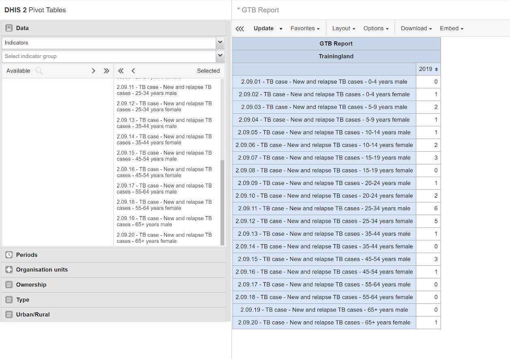

# Integrating tracker and aggregate data
This guide present different approaches for combining data collected through tracker programmes with aggregate data collected through routine (such as Monthly, Quarterly) data sets, so that this data can be used together. Tracker and aggregate data are collected and stored separately in DHIS2, but there are many cases where combining the two types of data is useful: 

* Data collected through tracker programmes and aggregate data sets may be complimentary. For example, if tracker is used as an electronic immunisation registry, calculating immunisation coverages requires the service data collected through tracker to be combined with population estimates typically available as aggregate (yearly) data.
* In many cases, tracker implementations are done in a phased approach, where it is first implemented in certain types of health facilities or by geographical region. Consequently, the same data may be collected through tracker in some locations and as aggregate data in other locations, and getting a complete overview of the data requires the tracker and aggregate data to be combined.
* Data collected through tracker may partially overlap with established aggregate reports. For example, a monthly report on malaria-related activities [(example)]() may include information both on malaria cases, as well as preventive activities such as bed-net distribution. If tracker is introduced for malaria case registration, the monthly malaria report can be partially completed based on tracker data.
* When tracker is introduced, ensuring that data is comparable over time (moving from aggregate to tracker)
 
There are several ways in which this can be achieved, with different advantages and disadvantages, and which are suitable for different purposes. This chapter outlines three overall approaches to combining tracker and aggregate data, their advantages and disadvantages, and gives some examples of when each of the approaches may be 

## Considerations
* Governance - when to decide at what point data is complete (enough), who and how to verify data quality.
* Ensuring users' understanding of data, and data quality
* Access to data - different for tracker and aggregate

## Alternative approaches
- Showing data side by side in the same chart/
- Combining data through aggregate indicators
- Saving aggregates of tracker data as aggregate data

This section gives a summary of three approaches. Details on each are given in subsequent chapters.

### Showing tracker and aggregate data side by side
Aggregate and tracker data can be shown and analysed together by including it within the same Data Visualizer charts or tables. Furthermore, visualisations of tracker-based data can be created in the Event Report and Event Visualizer apps, and combined with visualisations of aggregate data on Dashboards.

{Example screenshot}

> **Pros and cons**
> 
> + easy to set up
> + works well for presenting and analysing complimentary data
> + detailed data can be included (e.g. anonymous line lists)
>
> - limited dimensionality in analysis of tracker data, i.e. for showing age/sex disaggregations
> - not truly integrated/comparable with aggregated data, for example displayed
> - requires the tracker and aggregate data to be in the same DHIS2 instance

### Combining data through aggregate indicators
Aggregate indicators can be based on both aggregate and tracker data, separately or combined in a single aggregate indicator. Tracker data elements, tracked entity attributes and program indicators can all be included in the calculation of aggregate indicators.

This approach can be useful in several scenarios: 

* The same data is collected through aggregate data set and tracker programmes in different health facilities, i.e. some collect aggregate data and others collect individual-level data through tracker.
* The same data is available as aggregate data values and tracker data values for different periods, for example if data curently collected through tracker was in previous years collected as aggregate data.
* When indicators are needed based on a combination of data, i.e. service data collected through tracker combined with denominators available as aggregate data. 

{Example screenshot}

> **Pros and cons**
> \+ relatively easy to set up
> + can potentially hide some of the complexity of integrated aggregate and tracker data to end users

> \- tracker data cannot be analysed with disaggregations such as age/sex as separate data dimensions
> - difficult to manage in cases where there may be overlapping data
> - requires the tracker and aggregate data to be in the same DHIS2 instance

### Saving aggregates of tracker data as aggregate data
Tracker data can be aggregated to for example weekly or montly values, and these values can be saved as aggregate data element values in DHIS2. This correponds to what is often done manually in health facilities when registers are tallied every month to produce monthly reports. Program indicators can be defined that produce aggregate numbers based on tracker data, such as the number of children immunized with BCG, or patients testing positive for tuberculosis. Program indicator data values can then be produced that can be saved as aggregate data value for corresponding data elements.

There are multiple ways in which actual transfer of data from program indicators to aggregate data elements can be done. This includes: 

* manually or via a script querying the [DHIS2 API]() to export the program indicator values, and subsequently importing them into DHIS2 using either the [Import/export app]() or the API
* automating the export and import of data from the API using a script
* using one of several applications developed by the DHIS2 community and available on the [DHIS2 App Hub](apps.dhis2.org) to export and import the data
* setting up [Predictors](), which can be scheduled to transfer the program indicator values into aggregate data elements routinely

This approach is described in further details below, with examples and pointers to different tools which can be used to facilitate the process.

> **Pros and cons**
> \+ data can be analysed with all the dimensionality as aggregate data
> + can still be combined with detailed tracker data (i.e. the first approach)
> + ensures that there is no overlap
> + works when tracker and aggregate data are collected in separate DHIS2 instances

> \- more complicated to set up
> - requires external tools/scripts to move data via api, or predictors
> - if data is moved between two DHIS2 instances, organisation units must also be harmonised and kept in sync across the instances
> - may require more ongoing maintenance

### Choosing an approach
Each of the three approaches outlined above have advantages and disadvantages, and for a single implementation several of them are likely needed. For example, it may be useful to present certain tracker data with frequent updates (i.e. daily numbers children immunized), while at the same time transferring aggregate program indicator values into aggregate data element values every month so that the data can be compared with facilities not yet using tracker, or with additional dimensionality (such as age/sex disaggregations) that cannot easily be done directly with aggregate data.

## Saving aggregate tracker values as aggregate data values
This section describes the recommended approach as a long-term solution. Alternatives exist, which may be relevant in some cases - one-off; early stages; testing etc. Listed towards the end of the section.

Scenarios
- same instance or different instance - orgunits matching or not

### Use Case (belongs in intro?)
For countries implementing DHIS2 tracker for individual-level data collection, a separate dedicated DHIS2 instance is recommended for tracker deployment. Many countries have a mature, stable HMIS used primarily for capturing aggregate data across health programs in an integrated environment. By maintaining separate tracker and aggregate DHIS2 instances, performance can be better managed by system admins and data governance principles can be applied to ensure personally identifiable data captured by Tracker can be protected according to national policies and governance frameworks.

There is a clear benefit in being able to leverage individual data
collection through DHIS2 tracker to automatically 'report' aggregated data to the routine HMIS (e.g. to aggregate datasets, often monthly/weekly/quarterly reports from facility level). Capturing individual level data through DHIS2 tracker can improve the quality of the data reported into the routine aggregate HMIS, while also enabling ad hoc analysis of the tracker data in the Tracker Instance as required.

### Approach
Individual-level data collected in DHIS2 tracker in one instance (or within the same instance) is aggregated via Program Indicators. Each program indicator is mapped to a corresponding aggregate data element (and category option set, as applicable) via a code. The program indicator value should represent the same value as the aggregate (e.g. *number of new and relapsed TB cases notified* or *number of BCG doses given to children under 1*. At a frequency agreed upon by health programmes and national HIS units, a script is used to push data value from the program indicators to complete data elements in corresponding aggregate datasets in the HMIS.

### Implementing 

1. Data set with data elements/categories. Coded.
2. Program indicators for each data element/category. With codes from aggregate data element/categoryoptioncombos. Using custom attribute.
3. A process for migrating data. Manual, app, script etc.

A solution for aggregation of the tracker data into periodic aggregated
values have been created and initially tested using an EPI Tracker instance in Rwanda (using tracker as an immunisation eRegistry at national scale) to send aggregated data to the monthly EPI dataset in the HMIS instance. The following elements are needed:

- A data set with data elements which aggregate value from tracker can be saved to.
- Program indicators for each of the data elements (including disaggregations), configured to correspond to the definition of target data element/disaggregation
- A custom attribute called "Aggregate data element code", which is applied to the program indicators.
- A script that pulls (for example) relative (e.g. monthly, quarterly) values from the program indicators and pushes them back to the server as a (for example) monthly data value set.

Every aggregate data element and categoryOptionCombo must be assigned a
code. The "Aggregate data element code" attribute is used to associate
the data element code with the corresponding program indicator. For
categoryOptionCombo, this field is already built in to the Program
Indicator user interface.

Using the analytics API *dataValueSet* option, program indicator data
can be exported as aggregate data values and imported back in using the
*dataValueSets* endpoint. A simple script for doing this is shown below.
\[link to script on GH\]

### DHIS2 Digital Data Packages Support for Tracker → Aggregate

DHIS2 digital data packages have been developed to support both
aggregate reporting & analysis, as well as tracker data capture and facility-level analysis.

Aggregate digital data packages (inclusive of standard aggregate dashboards) are available for health programmes such as TB, HIV, malaria, RMNCAH and disease surveillance. Aggregate packages include:

1. Data set, data elements and category option sets ('target' for sending tracker data)
2. Metadata codes that are AWX compliant and enable the mapping of data values from tracker to the aggregate 'target'

In addition, tracker packages are being developed for a growing number of use cases such as immunisation eRegistries and case-based surveillance for TB, HIV and integrated disease reporting. Where tracker data packages are designed to capture data that can be aggregated and submitted to the corresponding aggregate dataset, we have included the following in the tracker digital data packages:

1. Program indicators configured to produce data values corresponding to the data elements and disaggregations included in the aggregate digital data package data
2. Custom attribute for 'Aggregate data element code'
3. Attributes per program indicator populated with the data element codes and category option combination code from the aggregate digital data package

### Implementation Considerations

Implementation considerations must be taken into account when an approach for automating the submission of tracker data to routine HMIS aggregate data sets. These include:

1. Accurate mapping of tracker program indicators to aggregate data elements
a. Adherence to common, precise definitions
b. Proper mapping of metadata codes between program indicators and aggregate data elements and category option combinations

2. Timing and frequency of the data transfer
a. How often to do the aggregation, for example daily, or on day of HMIS reporting deadline etc. How often the aggregate data is used for analysis and decision making should also be considered.
b. How many months back in time to update aggregate data for, for example last month, last 3 months, current and last month etc.
c. Governance principles and national HMIS policies for locking datasets, timely reporting; How can values for 'late reporting' be updated in the aggregate dataset; managing discrepancies between tracker and aggregate data set based on the timing of data submission
 
3. Parallel and hybrid reporting flows
a. Phased scale up of tracker: some facilities/districts adopting tracker sooner while others may retain the paper based aggregate reporting
b. Parallel reporting: some countries necessitate a period of parallel reporting of paper-based and tracker data collection for a pilot period

4. Revisions to reporting flows
a. Often need to be updated in HIS governance documents
b. If not well communicated, the 'source of truth' can be obscured

5. Maintenance
a. If metadata in the tracker instance or in the aggregate HMIS instance are altered, the mapping of program indicators to aggregate data elements may need to be updated

### Outstanding issues

- There is a bug in 2.33.3/2.33.4 that prevents us from creating this custom attribute; not exposed in the UI ([Jira 8755](https://jira.dhis2.org/browse/DHIS2-8755)): for now must insert the attribute via the API.

- There is a bug ([Jira 8868](https://jira.dhis2.org/browse/DHIS2-8868)) that causes metadata-dependency-export tool to fail when custom attribute assigned to program indicator

- Decide on use of codes or UIDs for linking PIs to data elements and categoryoptioncombos. The example script uses codes for data elements, uids for categoryoptioncombos.

- Improving the script so that it will at a minimum notify administrators if there is an error and/or sending a DHIS2 message with the import summary.

*There could also be other and more advanced scripts out in the community that can be considered.*

