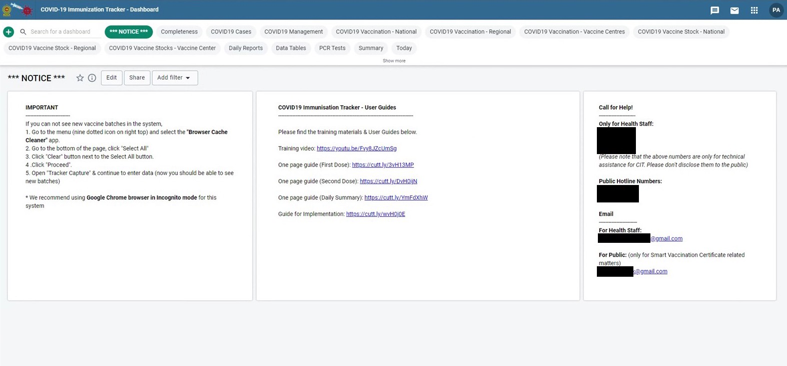
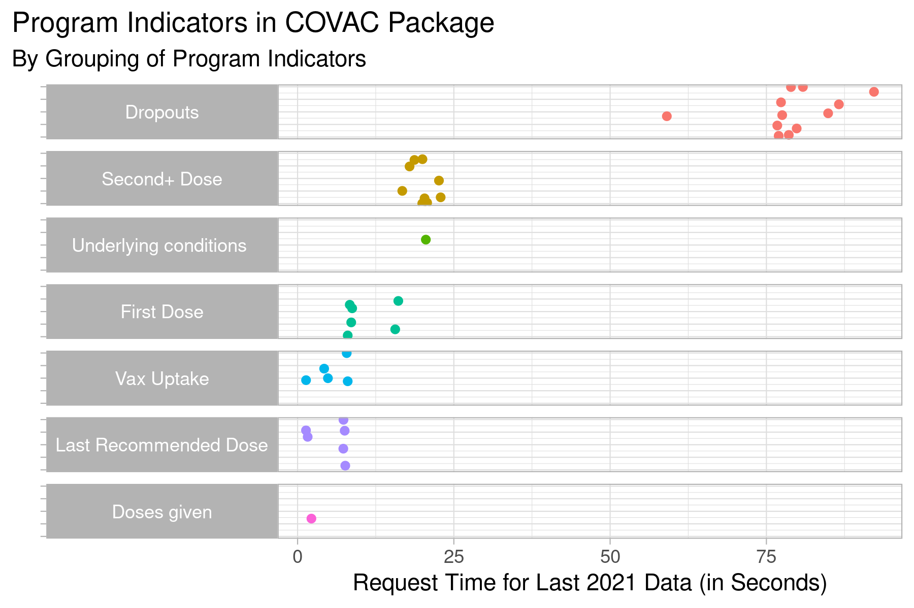
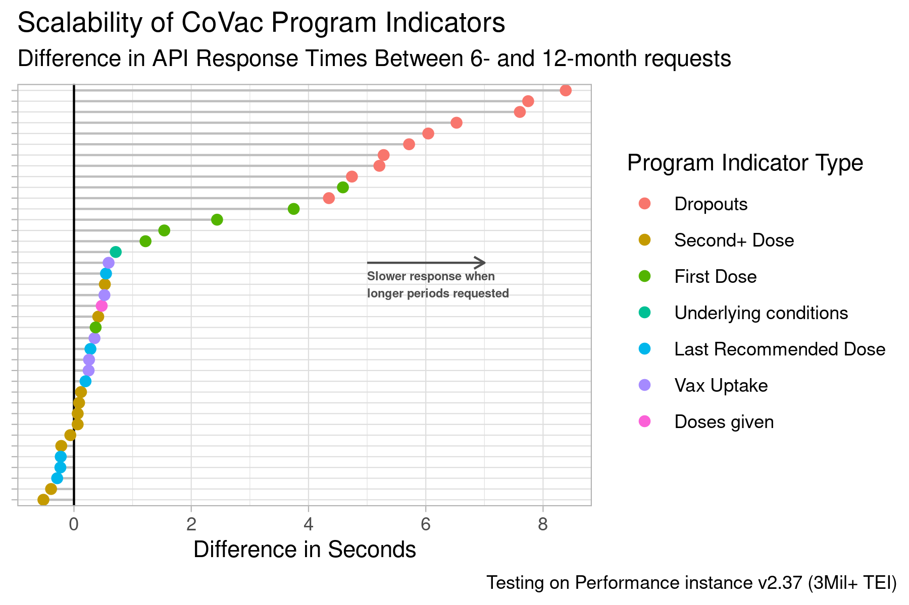
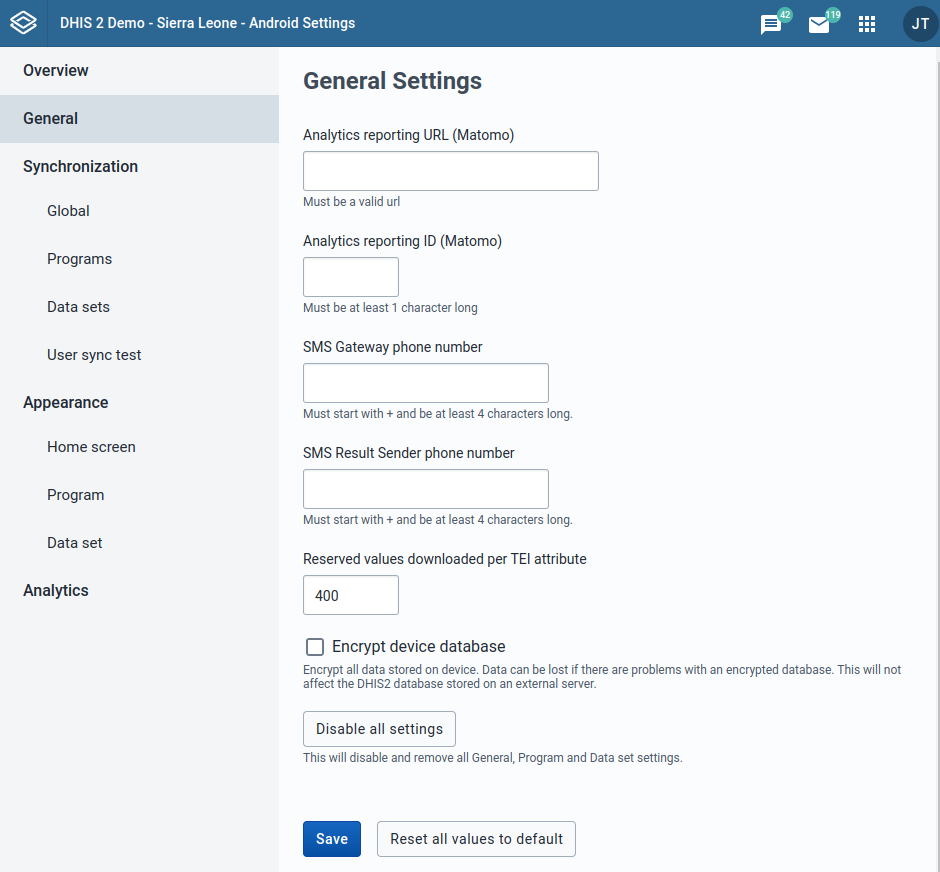
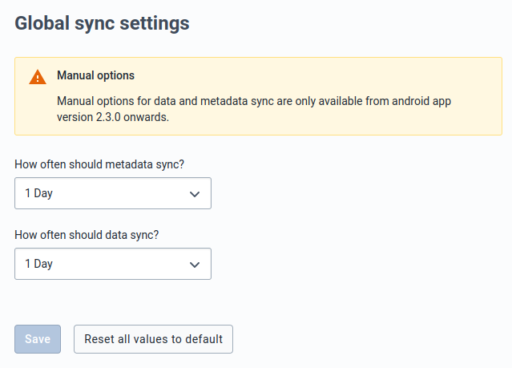
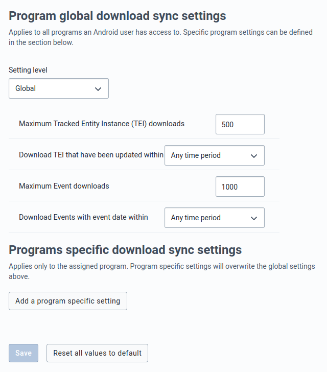
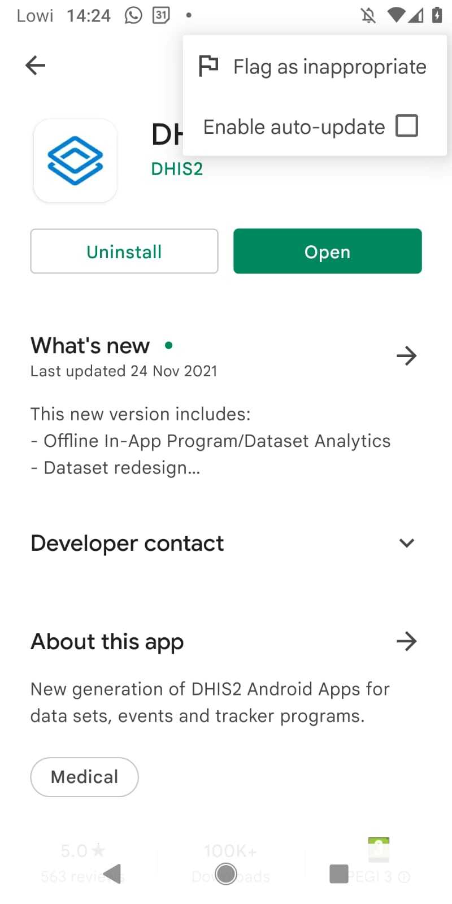
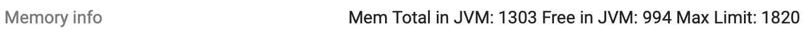

# Tracker performance at scale

This document describes approaches to optimizing DHIS2 tracker implementations for COVID-19 vaccine delivery at scale.

## Executive summary
> **Server**
>
> * Appropriate software versions are used:
> 	* JDK11
>	* PostgreSQL 12 or 13
>	* DHIS2 version 2.35 or later, latest available patch
> * Server monitoring is set up. Recommended: munin, glowroot
> * Server is appropriately sized. For covax, at least:
> 	* 32 CPU cores
>	* 32GB RAM
>	* SSD/fast disk
>	* Fast and stable internet and internal network connectivity
> * In shared hosting environment, verify that the server has the
> specified resources in practice
> * Use dedicated server for database/postgresql if possible
>
>
> **Tracker/Tracker Analytics**
>
> * Minimize the use of program indicators in dashboards, as this has cause performance issues.
>	* Alternative: serving tracker analytics through the aggregate data model, using strategies described in this document.
> * Limit access to dashboards that use program indicators, particularly those dashboards that load by default as the 'landing page' upon logging into DHIS2.
> 	* Alternative: Set up a text only/information landing dashboard that excludes tracker analytics to minimize impact. Limit dashboards based on program indicators only to those users/users groups who need them for analytical purposes (e.g. not for general data entry users)
> * Enable analytics cache
> * Do not use continuous analytics
> * Tracker: Disable the "Display front page list" check in the
> program details.
> * Apply custom database indexes for frequently searched TEI
> attributes.
> * Ensure that system generated attributes don't use RANDOM pattern
>
>
> **Android**
>
> * Ensure admins responsible for Android deployments are familiar with:
> 	* The use of the Android Settings App and the various sync strategies that can improve performance.
> 	* Specific configuration for users which will use Android is highly recommended.
> 	* Distribution of the Android App mechanisms and management of version updates.
>
> **Implementation Strategies**
>
> * Ensure there is an aggregate configuration available for reporting (e.g. daily reporting based on tally sheets) that can be used routinely, or as a back-up in the case of lag time in Tracker data entry during high-volume periods (e.g. COVAC Aggregate Package)
> 16. Use the latest COVID-19 Immunization/EIR tracker package and related aggregate datasets (for serving the dashboard) as a reference; though we do not recommend 'updating' a package that has already been substantially customized for the country. 


## Background

### Audience 

The primary audience for section are system administrators supporting MOH with their national COVID-19 vaccine delivery plans. However, while COVID-19 vaccine delivery is the specific use case presented here, much of the guidance is relevant for large-scale tracker implementations in general.


### Purpose

- To share the 'best information available', real-time/emerging guidance, tips & tools to optimize DHIS2 implementations for anticipated scale of COVID-19 vaccines. This information is often sourced through the community of practice.
- This is not intended to prescriptive guidance, but rather a series of recommendations that may evolve in real-time as we learn from real-world implementations; and update/improve the global products 
- We aim to facilitate information sharing between country implementations that may face similar challenges and can benefit from common solutions

## Guidance for implementers

### General Guidance

* Substantial performance improvements were introduced from V 2.35. We strongly recommend upgrading tracker instances to the latest patch version of 2.35 or 2.36, where performance improvements have also been added in the point releases. 
* We strongly recommend to set up a server monitoring tool to identify when and why your server is struggling 	
	* Some recommendations include [https://glowroot.org](https://glowroot.org/) and 	[https://munin-monitoring.org](https://munin-monitoring.org/) 
	* Here is a [tutorial for installing glowroot on DHIS2](https://github.com/dhis2/dhis2-docs/blob/glowroot-tutorial/src/tutorials/glowroot.md)

### Analytics Performance

Recognizing that country demands for frequency of 'real time' analytics data for decision making may vary and timely data is crucial, we recommend to avoid running analytics during heavy data entry periods. We have seen major spikes in overall response times while analytics tables are being generated. **These seem to have the most impact when many users are accessing dashboards that contain program indicators calculating on the fly.**

#### Dashboard Performance

Below are steps that can be taken to improve dashboard performance.

* Users should **not** have dashboards with tracker-based analytics as the landing page after logging in.
	a. Add a dashboard without analytics as the default/first dashboard that users land on after logging in. (i.e. ensure it is the first alphabetically. For example "\*\*NOTICE\*\* or \*\*INFO\*\*) 
	b. This dashboard could be populated with text items to communicate key information, updates, standard operating procedures, etc. 
	c. The dashboard should be shared with Public access



* Limit sharing dashboards only to only those analytics users who need to use data for decision making; restricting from data-entry users. This can be achieved with User Groups, combined with a Landing Dashboard for non-analytics users as above. 

* Tracker analytics requests, in particular for certain program indicator configurations, can be slow and create performance problems. When extracting such data: 
	a. Do it outside peak hours for vaccinators, to avoid any slowdowns hindering their work 
	b. Work with smaller data sets at the time. For example, it may be	necessary to get figures for a subset of organisation units at the time (e.g. by region). 
	c. Rather than several people downloading the same data (e.g. for the national level) from DHIS2, download once and share via for example excel.

* Ensure caching is enabled in the dhis2 configuration, so that repeated requests for the same analytics resources are served from the cache and database queries are skipped. 
	a. dhis.conf - `analytics.cache.expiration` set to at least 3600 (6 hours). 
	b. System settings -\> analytics -\> cache strategy. Recommended value: at least CACHE_6AM_TOMORROW. Set cacheability to	"private" to avoid nginx cache.

* Turn-off continuous analytics. If you turn off continuous analytics you will only see your analytics updated after your analytics tables run.

* As a **last resort/blunt measure for poor performing dashboards, you may also:** a. Remove tracker analytics access for non-critical users. b. Set the default landing app through the system settings to the capture or data entry applications. This will mean that all users will first be directed to those apps. This may be disruptive for users that do not enter data, but it will minimize traffic to the dashboards.

* Consider serving Tracker analytics from the COVID-19 EIR Tracker through the aggregate data model as described in the [Implementation Section](#implementation-strategies). In short:
	a. Mapping PIs to aggregate data elements 
	b. Pushing data values to aggregate data model (via a script) at a predetermined frequency 
	c. Dashboards shared more widely based on the aggregate data model via indicators can be 100 times more performant (dashboard items load in 0.02-0.1 seconds vs 10-200 seconds on testing instance). In addition, they give greater analytical power through the use of dimensions (e.g. to represent and slice/dice CatCombos).

#### Assessing Analytics/Program Indicator Performance

An analysis of the dashboards originally included in the COVID-19 EIR Tracker Package (note: these tracker dashboards have now been removed from the package and are not recommended) revealed:

* Dashboards are significantly slowed down by long queries for enrollment-type program indicators.

* Dropout rates are good to know, but they take a long time to load even on our test db. We believe that drop out rates are unlikely to require daily monitoring, but rather can be analyzed weekly or even monthly at a higher level through the COVAC Core Module (aggregate datasets & monitoring dashboard for coverage, etc.)





Other "heavy" visualizations should be removed from routine monitoring dashboards which are shared with lower-level users and will lead to performance stress. These could be moved to dashboards which are viewed less frequently, an HTML report, or another reporting tool:

a. Maps at lower levels, or requesting unnecessary org units

b. Event reports with more than 100 event rows or 50 enrollment rows

c. Visualizations requesting lengthy periods of longitudinal data, e.g. last 12 months

d. Any visualization with enrollment-type program indicators, such as dropout rates

e. In tests of program indicators from the COVAC package, program indicators of "enrollment type" took the longest response time. Further, they have poorer scalability, as they take longer to serve data when requesting additional periods, org units, or TEI.

### Tracker Performance

* TEAs that generate a Unique system IDs using the SEQUENTIAL() pattern are much more performant than those using the "RANDOM()" pattern. **We recommend avoiding the RANDOM pattern** because:
	* It's open for race conditions; 
	* It will have a huge downward trend in performance the longer it\'s been used; and 
	* It uses the reserved values table in the database to keep track of which values have been distributed already. This table has been known to be a pain point during tracker import.
	* Note for implementations that use Android: reserving values to the devices for offline use may affect the user's perception of SEQUENTIAL generation as documented here: [https://docs.dhis2.org/en/full/implement/android-implementation.html#implementation_guide_dhis2_config_reserved_id](https://docs.dhis2.org/en/full/implement/android-implementation.html#implementation_guide_dhis2_config_reserved_id)

* In early versions of the COVID-19 vaccine registry, some working lists caused performance issues. These were removed from the packages in the COVID IER package V 1.1.2. If you experience that tracker is showing slow load times, this may be related to the working lists and a large number of TEIs in one org unit. A solution is to disable the "Display front page list" check in the program details (this has the downside of also disabling working lists)

* Searches on TEIs on attributes (especially non-unique ones like firstName, surname, phoneNumber) can significantly improve by adding partial trigram indexes for that particular tracked entity attribute. This has been done in Nigeria and Rwanda and the performance improvement was huge. This is yet to be added into the core, so implementations will have to create them manually for now. For trigram indexes and compounding it with primitive column types, two extensions have to be created. The extensions are already part of the default posgresql installation. Extensions:

```
create extension pg_trgm;
create extension btree_gin;
```

Index example for trackedentityattributeid 1234 (eg: PhoneNumber). Has to be repeated for every attribute that is used heavily during searches (firstname, surname, etc)
```
create index concurrently in_gin_teavalue_1234 ON trackedentityattributevalue 
using gin (trackedentityinstanceid,lower(value) gin_trgm_ops) 
where trackedentityattributeid = 1234;
```

* Similarly, trigram indexes will also help if the system searches based on event data values. Nigeria had their QR code for completed vaccinations as an event data value which they searched on heavily (eg: passengers qr code checked before boarding). Depending on search patterns for the specific implementation's configuration, this trigram index can also be applied. Not all implementations will need this. Assuming the extensions mentioned above are already created, an example index creation for a data element (uid=​​LavUrktwH5D, qrCode), attached to a programstage. The dataelementid=233047 and programstageid=64527 in this example.

```
create index concurrently in_gin_psi_edv_64527_233047 on > programstageinstance 
using gin (lower(eventdatavalues #>> '{LavUrktwH5D, value}') gin_trgm_ops);
```

* Usage of Custom Apps can be a blessing or a curse. Some custom apps use API functionalities that cause unnecessary stress on the system. Parameters to skip paging, LIKE operator comparison with unique attributes (instead of EQ operator as done by Tracker Capture App) are some of the notable culprits that cause some stress. If LIKE operator is used with unique attributes, trigram index as mentioned above should be created for it. SkipPaging should always be avoided. If feasible, a searchString minimum limit of 3 characters should be enforced on searchable attributes. Nigeria had a custom app that enforced the 3 character minimum search limit on the app side and that helped alleviate several heavy queries. Trigram indexes will only be used by the query optimizer if the search string has at least 3 characters.

* Tracker Capture App updates event data values individually. In highly concurrent environment, this can cause database row level locking and waiting. Sri Lanka created a Custom Tracker Capture App using the core Tracker Capture App as a baseline. In the Custom App, they changed the flow so that all event data values are updated together in a single API on user clicking "Save and Complete". The button was "Complete" in the original core app. If the supporting HISP groups/administrators/implementers have the necessary skillset, they can maybe look into doing the same.

### User Management

* We recommend against sharing user logins across multiple devices. This has resulted in some scenarios where the users are unintentionally logged out.
	* Alternatives: one user per device (e.g. the user follows the device, i.e. vaccine site data entry staff; passwords could be recycled each day for added security)
* Optimizing users for Android (described in Android section)
* Restricting unnecessary access to tracker-based dashboards as described above

## Guidance for Android Deployments

### DHIS2 Configuration recommendations

This subsection covers the specific recommendations that can be achieved by tweaking the DHIS2 server configuration directly.

#### User access

Due to the nature of Android being able to work offline, the application will try to download as much information as possible in case the device goes offline. To reduce the amount of data transferred:

- Set the Organisation Units, Programs and DataSets that users will have access to; this will greatly reduce the amount of data being transferred and the load of the server

- Please see the recommendations on how to [create a user](https://docs.dhis2.org/en/full/implement/android-implementation.html#implementation_guide_dhis2_config_creating_user)

#### Auto-generated Values

Because of the offline nature Android will also download reserved values. The application will try to evaluate the amount of remaining values and retrieve more from the server whenever a synchronization happens.

In implementations where users will be offline for long periods of time this value might need to be increased (explained in the section below). If the auto-generated values defined include the usage of dates in any of its forms (days, months, years) the system administrator should pay special attention while defining them and using the Android App. Also note, reserving values to devices for offline use with the SEQUENTIAL() pattern (e.g. for a TEI attribute 'System Generated ID') will take each of these values sequentially as they are *reserved in the devices*, which can be confusing for some users. This behavior is expected as documented [here](https://docs.dhis2.org/en/full/implement/android-implementation.html#implementation_guide_dhis2_config_reserved_id).

Please see more information about this topic in the [official documentation](https://docs.dhis2.org/en/full/implement/android-implementation.html#implementation_guide_dhis2_config_reserved_id) and in [this post in the CoP.](https://community.dhis2.org/t/question-regarding-expiry-of-reserved-ids-of-an-auto-generated-unique-values-configured-with-a-text-pattern-containing-current-date-mm-yyyy/40761/2)

### Android Settings WebApp

The [Android Settings WebApp](https://apps.dhis2.org/app/a1bd6b5b-de8c-4998-8d34-56c18a139683) is an application that can be installed on any of the latest DHIS2 servers and allows the system administrator to define some settings that will be read by each mobile.

#### Reserved Values

In the section above the usage of auto-generated values was briefly explained. With the Android Settings App the system administrator can define how many of those values will be retrieved by each mobile user. If your mobile users will be going offline for very long periods of time it might be a good idea to increment this value, however, setting a huge large number here can incur in the exhausting of values and an increase of the data transferred in the initial sync.



As an example, imagine we have an implementation with mobile devices which will be going offline for a full week and then come back to a central location for the synchronization of data. Each user might see up to 50 patients per day and therefore during a week up to 350 patients. Setting the *Reserved values downloaded per TEI attribute* to at least 350 would ensure the users can work properly offline without risking exhausting the values.

#### Metadata Sync



If your program is very unlikely to be modified, setting a long period value for this setting will reduce the amount of connections towards the server. It is good to find a balance between how important it would be having devices without the metadata fully updated and the load the server can experience due to the number of devices.

As an example, imagine we have an implementation with 10.000 devices and they are set to sync every 1 day. This means that the server should be ready to handle 10.000 metadata update pulls every day. Even though these requests will result in an empty response if no changes have been made, it might be smarter setting that value to 1 week or even manual (with a proper way of communicating with the field users) if no changes will be made in the package or changes are unlikely to be critical.

You can even disable automatic metadata synchronization and rely on manual synchronizations triggered by your users if that is an option for your implementation.

#### Data Sync

Data sync follows the same principle as the one for metadata and it should be adjusted according to the implementation. For example, we can find implementations where users are going on the field where they will be working offline therefore it should be important to provide those users with all the data needed for their work. Or there can be implementations where users will be most likely registering patients on the field and transferring data from the devices to the server.

See the following examples:

* In an implementation where users will be working pretty much offline and they need to have as much data as possible on their device, the *data sync* could be set to *Manual* if the users are instructed to perform this before leaving to the field. Or daily if this process should be automated.

* In an implementation where users are going to the field, and they are likely to be robbed, or a fear of devices being lost is present it might be interesting to set the *data sync* to the minimum (30 minutes) so the data is pushed to the server as soon as possible. Users could also be instructed to use [granular sync](https://docs.dhis2.org/en/full/use/dhis2-android-app.html#capture_app_generic_sync_info) every time they add or modify a patient but this might be more cumbersome.



You can also disable automatic data synchronization and rely on manual synchronizations triggered by your users, however this puts more risk on data being recorded and not synced if users are not systematic.

#### Download Settings

These settings allow the users to define the amount of TEIs that will be downloaded when performing the data sync. It should probably be combined with the *Data Sync* setting explained above. It is important to understand how these settings work to define a targeted and valid approach. The official documentation, [synchronization settings](https://docs.dhis2.org/en/full/use/dhis2-android-app.html#capture_app_andoid_settings_webapp_synchronization), explains in detail what to expect when setting this up. The connectivity capabilities of the implementations should also play a big role while defining these, as in implementations with very good connectivity reducing this value to the maximum would decrease the load of the server during the *data sync* without having a big impact in the users (they will always be able to find the patients online). However, this could lead to a server overload while performing very broad searches. The way mobile users will connect to the server (i.e. using mobile data packages instead of wifi) also plays a role as downloading many patients that might not be used will incur in expending mobile data for no reason.

See the following examples:

*  In an implementation where the users will be mainly adding patients to the system (i.e. registering patients with COVID) there is no need to have many patients on the device. Therefore, setting a low value of download TEI would decrease the load of the server during the data sync and will reduce the amount of data transferred (to be taken into account when connecting with mobile data)

*  In an implementation where users will be visiting patients offline without the possibility for an online search the system administrator might want to let the users download as many TEI as possible so they take with them all the patients' data that will need.

*  In an implementation with very good connectivity the user administration could decide to decrease the download settings so the devices have as few TEI as possible relying completely on the online search. As the users will be searching by a unique id (i.e. National ID number) which is a low demanding task for the server the setup seems to be adequate. However, if users will not be able to search for patients by a unique id and will use a family name the server could suffer for an overload on the searches and therefore might be more interesting to allow the users downloading more patients and relying on the offline mode.

### Application Updates



The DHIS2 Android App is published via two channels: [Google Play Store](https://play.google.com/store/apps/details?id=com.dhis2) and [Github](https://github.com/dhis2/dhis2-android-capture-app/releases). We publish releases every 6 months and patch releases as often as it is needed. If implementations are using the Google Play Store as their provisioning source they could benefit from automatic updates, however, this might not be desirable in some scenarios where implementations want to test a newer version before making it available for their users. We recommend disabling automatic updates so the App can be heavily tested by administrators/testers before asking their users to do so.

To disable the automatic updates, once the application has been installed in via the Google Play proceed as follows:

- Select the 3-dot menu from the right corner of your screen. By default, "Enable auto-update" will be selected.
- De-select this button. This will ensure that the Android app does not automatically update when an update is available.
- When finished, the box "Enable auto update" should not be checked.

System administrators could now benefit from checking the new versions and then letting the users know when they should update their App that they could do by going to the Play Store and clicking on the Update button that will be presented every time there is a new release.

More information about roll-out plans and testing can be found in the [official guides](https://docs.dhis2.org/en/full/implement/android-implementation.html#implementation_guide_testing).

### Device and management recommendations

In this section we cover briefly some recommendations related to the devices themselves and their management.

#### Android device specifications

It is very hard to give general recommendations on which device to use. Implementations should test their final configuration on a set of devices to understand the user experience.

For example if an implementation will have users going to the field and working offline with a large number of TEIs they should aim for higher end devices as the Android App will be more resource consuming. However, if implementations are very budget constraint and they will be having thousands of users but working with much smaller amounts of TEIs and data they might prefer using some middle end devices.

More information on this process can be found in the [official guide](https://docs.dhis2.org/en/full/implement/android-implementation.html#implementation_guide_mobile_specs).

#### Mobile Device Management

We strongly recommend using a Mobile Device Management (MDM) in mobile implementations. Having an MDM will provide several advantages that can ease the implementation and support. However they usually incur higher costs.

Implementations could opt for ready to use MDMs or deploy a solution in their own infrastructure. The latter might be a better solution in terms of budget but will require high technical skills like system administration and DB management.

This [[official guide]{.ul}](https://docs.dhis2.org/en/full/implement/managing-mobile-devices.html) covers several MDM that have been tested listing their main advantages and disadvantages.

### Mobile recommendations checklist


| **DHIS2 Mobile Implementation at scale checklist** |  |
| --- | --- |
| User access configuration |  |
| Auto-generated values pattern            |                           |
| Android Settings Webapp:                  |                           |
| *Number of reserved values*              |                           |
| *Automatic metadata sync period*         |                           |
| *Automatic data sync period*             |                           |
| *Data download settings*                 |                           |
| Management of Android App updates        |                           |
| Mobile Devices Management                |                           |


## Server hosting, administration and monitoring

There are two fundamental requirements related to server hosting:

- There should be somebody - preferably two - people with the requisite training and experience to manage the server.
- There should be a privacy/security policy to cover the storage of large proportion of population data

### Server specifications

As indicated in the documentation on server [specifications](https://docs.dhis2.org/en/manage/performing-system-administration/dhis-core-version-237/installation.html#install_server_specifications), "DHIS2 scales linearly on the amount of RAM and number of CPU cores so the more you can afford, the better the application will perform". Covax implementations, generally targeting the total adult population of a country, will be large-scale even in smaller countries. Exact requirements will vary depending on the expected number of users and TEIs, but 32GB RAM and 32 CPUs could be considered a starting point for all but the smallest implementations. All implementations should be prepared to upgrade the hardware to support changing scale and growing data.

SSD/disk performance is also critical for the overall performance, heavily influencing key activities such as searching for TEIs and analytics. The documentation suggests that "Minimum read speed is 150 Mb/s, 200 Mb/s is good, 350 Mb/s or better is ideal." Real disk performance can also be assessed by looking at disk latency. You can see these figures on munin, a simple one off assessment can be done with dd:

```
dd if=/dev/zero of=/root/testfile bs=512 count=1000 oflag=dsync
```

For a good disk this command should finish in a fraction of a second (\<0.5s). Anything over 5 seconds is probably going to be too slow to reach acceptable levels of performance.

### Server architecture and infrastructure

The application (tomcat) and database (postgresql) *could* be hosted on the same server, but ideally the database should be set up on a dedicated server.

Fast and stable internet is always required, but when the database is set up on a separate server, it is also important to ensure that there is a fast and stable *internal* network connection between the two.

Special consideration must be taken when the server is hosted in a shared, virtualized environment. In these cases, the hosting provider may over-provision resources (e.g. CPUs, disks), meaning the server does not actually have the resources it appears to have. This also means that performance fluctuates based on the load on other systems. In some cases, countries have had to negotiate with the hosting provider to ensure the server used is not being over-provisioned, alternatively moving to a physical server.

### Installation and configuration

It is important to ensure that the right software versions are used to optimise performance:

- JDK11
- PostgreSQL version 12 or 13
- DHIS2 version 2.35 or later, **the latest available patch version**

Tomcat needs to be configured with enough memory. This will depend on the total available memory of the server, and whether this is shared with postgresql or if the database is running on a separate server. With a DHIS2 superuser account, you can verify the tomcat memory configuration by opening "About DHIS2" and looking at the "Memory info" field:



It is also critically important to configure postgresql correctly for good performance. Instructions for this are available in the [server documentation](https://docs.dhis2.org/en/manage/performing-system-administration/dhis-core-version-237/installation.html#install_postgresql_performance_tuning).

### Server monitoring

We strongly recommend setting up a server monitoring tool to identify when and why your server is struggling. Key performance metrics should be monitored eg. RAM, CPU, disk performance on all nodes and application specific measures on proxy, database and tomcat. Some recommendations include [https://glowroot.org](https://glowroot.org/) and [https://munin-monitoring.org](https://munin-monitoring.org/). A [tutorial for installing glowroot on DHIS2](https://github.com/dhis2/dhis2-docs/blob/glowroot-tutorial/src/tutorials/glowroot.md) has been written to support this.

Other options which might require more configuration but allow significant customisation include prometheus/grafana and the ELK stack.

## Implementation Strategies

Based on experiences from Sri Lanka, Indonesia, Nigeria, Rwanda and others, visualizations based on tracker analytics in large-scale COVID-19 vaccine deployments can result in very heavy TEI count queries, nearly rendering the system unusable. Blunt mitigation strategies taken in Rwanda (disabling of all Analytics apps), while Sri Lanka reverted to SQL queries.

These challenges can be partially addressed with the guidance on performance optimization provided above. We also recognize that:

* The unpredictability of Tracker performance at unprecedented scale, given the many varying factors at play in country implementation, configuration & customization
* Capacities, resources and structures for server administration are highly variable across countries

Meanwhile, daily aggregate reporting through DHIS2 was proven to be highly effective at large scale in the Measles-Rubella campaign in Bangladesh in 2020. Having an aggregate configuration can facilitate daily reporting on stocks and doses administered (e.g. from tally sheets), data which are largely sufficient to serve the purpose of "real-time daily" monitoring of the overall campaign via dashboards. In Uganda, an aggregate implementation was used side-by-side with the COVID EIR Tracker, to enable daily monitoring and check data completeness during high-volume periods when tracker data entry could not be sustained (not enough devices, etc).

Based on feedback, we understand that most implementations require at least daily monitoring during the campaign phases of COVID-19 vaccine delivery, but the definition of 'real-time' is variable. There may be a time of day when campaign operations centers are monitoring the daily performance and should be considered for the country implementation & scheduling of analytics.

### Use of Aggregate Data Model with Tracker Deployments

We recommend incorporating aggregate data models into COVID-19 vaccine implementations for two separate functions.

##### Parallel aggregate reporting: daily stock & tally sheets of vaccine doses administered at vaccination site level

The recommendation to ensure countries have an aggregate COVAC package in parallel to the Tracker Registry is an old one. Here we provide some reasons why think a country should be prepared with an aggregate configuration for reporting alongside their Tracker deployment:

- For many country contexts, this will be necessary to ensure completeness of data for the purposes of monitoring the campaign: e.g. if the entire population cannot be covered by the Tracker Registry for any number of reasons

- In some contexts, this reporting mechanism (e.g. based on daily tally sheets) can be used during high volume periods in the campaign where individual level data entry can lag (not enough devices, connectivity issues, not enough data entry staff etc).

- Daily reporting from tally sheets is also often used for data quality comparisons to Tracker data, and helps the country to assess their Tracker deployment and make decisions about data sources/data flows

The [COVAC 'Core' Aggregate Package](https://docs.dhis2.org/en/topics/metadata/covid-19-vaccine-delivery/covac-aggregate/version-110/design.html) contains a configuration to support this (aligned to WHO monitoring guidelines, WHO AFRO reporting tools and eJRF):

- Daily dataset: COVIDVAC - Vaccination Delivery (e.g. doses administered, byt target groups)

- Daily dataset: site level stock reporting (e.g. vials used, physical stock count, etc)

- Annual dataset (could also be monthly/quarterly depending on country's plan): setting population targets, that may be disaggregated by priority groups etc

- COVAC Monitoring dashboard that contains coverage rates, doses administered, key stock data, drop-out rates etc. This monitoring dashboard is generally tailored for higher level monitoring of the overall national COVID vaccine delivery plan; not all components of this dashboard are intended for 'real-time'/daily monitoring.

##### **Converting tracker data to aggregate data model → for the purpose of analysis (e.g. serving performant dashboards)**

This is a NEW recommendation. Due to the potential for performance issues with dashboards serving tracker-based data (e.g. heavy program indicators calculating on the fly every time the dashboard is loaded), we recommend that a daily/near real-time dashboard can be served using the aggregate data model. In our tests, this has shown to be far more performant and still capable of serving key metrics to analytics users. An additional benefit for analysis is the structuring of data into dimensions (category combos) for pivoting and slicing.

In order to serve COVID-19 analytics from tracker source data (e.g. COVID vaccine registry), you will need:

1. An aggregate data set (in the same instance as the Tracker program or in another instance) and a set of DEs and COCs to receive the data aggregated from tracker

2. A dashboard to replace the tracker-based dashboard for campaign monitoring; the dashboard should be based entirely on indicators and/or data elements based on the aggregate domain.

3. A set of Program Indicators that can aggregate the tracker data to push to the target aggregate DEs/COCs, with attributes mapped to the target aggregate metadata

4. A script to push the tracker data (e.g. values of program indicators) target aggregate DEs. An example script is under development and will be shared soon.

Generic [guidance for tracker-to-aggregate data is available](https://docs.dhis2.org/en/implement/maintenance-and-use/tracker-and-aggregate-data-integration.html#how-to-saving-aggregated-tracker-data-as-aggregate-data-values) and will continue to be updated.

## List of Known Software Issues

[COVAC: performance issues](https://docs.google.com/document/d/1NJoio5qkdtdljflbt3_AS6N2HgGTepW_TW2m4-qHlTE/edit#) 
